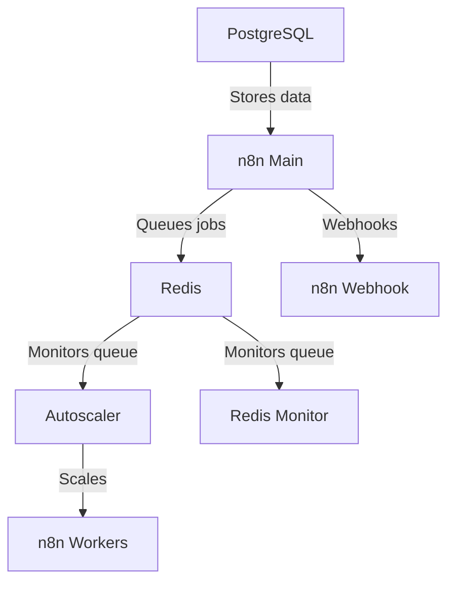

现在包含 cloudflared。请在 cloudflare.com 上配置并将您的令牌粘贴到 .env 文件中。

有关详细步骤说明，请参阅此指南：https://www.reddit.com/r/n8n/comments/1l9mi6k/major_update_to_n8nautoscaling_build_step_by_step/

不想使用 cloudflared 的用户，原始版本保存在各个分支中。

# n8n 自动扩展系统

一个基于 Docker 的 n8n 工作流自动化平台自动扩展解决方案。根据 Redis 队列长度动态扩展工作容器。无需处理 k8s 或其他容器扩展服务，简单脚本即可运行，且易于配置。

已在配备 8 核 16GB 内存的 VPS 上测试，支持数百个同时执行。

内置 Puppeteer 和 Chrome，支持 n8n 代码节点的专业级爬取，效果优于社区节点。

安装简单，只需克隆文件并运行 docker compose up

## 架构概览


## 功能

- 基于队列长度动态扩展 n8n 工作容器  
- 可配置的扩展阈值和限制  
- Redis 队列监控  
- 基于 Docker Compose 的部署  
- 所有服务的健康检查  

## 先决条件

- Docker 和 Docker Compose。  
- 如果您是新用户，建议使用 Docker Desktop 或 Ubuntu 的 Docker 便捷脚本。  
- 设置您的 Cloudflare 域名和子域名。  

## 快速开始

1. 将此仓库复制或克隆到您选择的文件夹  
2. 将 .env.example 重命名为 .env  
3. 在 .env 文件中配置您的环境变量 - 默认配置可直接使用，但请设置新的密码和令牌。  
4. 运行：

   ```bash
   docker network create shark
   ```
5. 运行:
   ```bash
   docker compose up -d
   ```
我们在第4步创建了shark外部网络，以便以后更容易连接其他容器。如果您不想这样做，可以在docker compose文件中注释掉shark网络。

## 配置

- 确保您在.env文件中设置了自己的密码和加密密钥！！！
- 默认情况下，每个工作容器同时处理10个任务，您可以在docker-compose中修改此设置：      
   - N8N_CONCURRENCY_PRODUCTION_LIMIT=10
- 将以下参数调整为大于您最长预期工作流执行时间（以秒为单位）：
   - N8N_QUEUE_BULL_GRACEFULSHUTDOWNTIMEOUT=300
   - N8N_GRACEFUL_SHUTDOWN_TIMEOUT=300

### 关键环境变量

| 变量 | 描述 | 默认值 |
|----------|-------------|---------|
| `MIN_REPLICAS` | 最小工作容器数量 | 1 |
| `MAX_REPLICAS` | 最大工作容器数量 | 5 |
| `SCALE_UP_QUEUE_THRESHOLD` | 触发扩容的队列长度 | 5 |
| `SCALE_DOWN_QUEUE_THRESHOLD` | 触发缩容的队列长度 | 2 |
| `POLLING_INTERVAL_SECONDS` | 检查队列长度的频率（秒） | 30 |
| `COOLDOWN_PERIOD_SECONDS` | 扩缩容操作间的冷却时间（秒） | 180 |
| `QUEUE_NAME_PREFIX` | Redis队列前缀 | `bull` |
| `QUEUE_NAME` | Redis队列名称 | `jobs` |

### n8n 配置

确保设置以下n8n环境变量：
- `EXECUTIONS_MODE=queue`
- `QUEUE_BULL_REDIS_HOST=redis`
- `QUEUE_HEALTH_CHECK_ACTIVE=true`

## 扩缩容行为

自动扩缩器：
1. 每隔`POLLING_INTERVAL_SECONDS`监控Redis队列长度
2. 当满足以下条件时扩容：
   - 队列长度 > `SCALE_UP_QUEUE_THRESHOLD`
   - 当前副本数 < `MAX_REPLICAS`
3. 当满足以下条件时缩容：
   - 队列长度 < `SCALE_DOWN_QUEUE_THRESHOLD`
   - 当前副本数 > `MIN_REPLICAS`
4. 扩缩容操作之间遵守冷却时间

## 监控

系统包含：
- Redis队列监控服务（`redis-monitor`）
- 所有服务的Docker健康检查
- 自动扩缩器的详细日志记录

## 故障排除

- 查看容器日志：`docker-compose logs [service]`
- 验证Redis连接：`docker-compose exec redis redis-cli ping`
- 手动检查队列长度：`docker-compose exec redis redis-cli LLEN bull:jobs:wait`

Webhook URL示例：
Webhook使用您的Cloudflare子域名，而非本地主机，例如：
http://webhook.domain.com/webhook/d7e73b77-6cfb-4add-b454-41e4c91461d8


## 许可

MIT许可 - 详情见[LICENSE](LICENSE)。



---


Tranlated By [Open Ai Tx](https://github.com/OpenAiTx/OpenAiTx) | Last indexed: 2025-07-14


---