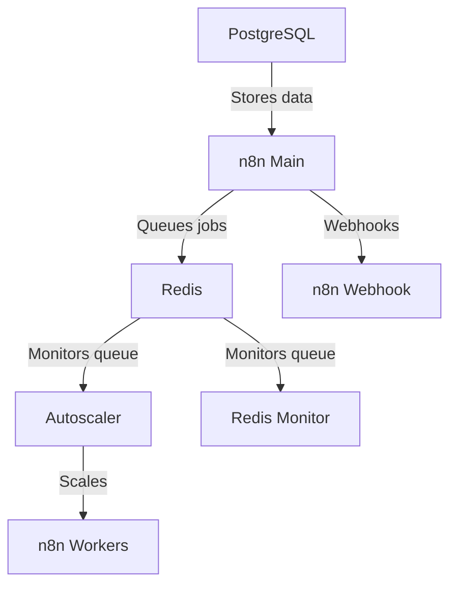

現在包含 cloudflared。請在 cloudflare.com 上配置，並將您的令牌貼到 .env 文件中。

有關詳細步驟說明，請參考此指南：https://www.reddit.com/r/n8n/comments/1l9mi6k/major_update_to_n8nautoscaling_build_step_by_step/

不想使用 cloudflared 的用戶，可在分支中找到原始版本。

# n8n 自動擴展系統

基於 Docker 的 n8n 工作流程自動化平台自動擴展解決方案。根據 Redis 隊列長度動態擴展工作容器。無需使用 k8s 或其他容器擴展提供者，一個簡單的腳本即可運行且易於配置。

已在一台 8 核心 16GB 記憶體的 VPS 上測試，支持數百個同時執行。

內建 Puppeteer 和 Chrome，供 n8n 代碼節點進行專業級網頁爬蟲，效果優於社群節點。

安裝簡單，只需克隆文件並執行 docker compose up。

## 架構概述


## 功能

- 根據佇列長度動態調整 n8n 工作容器數量
- 可配置的擴展閾值與限制
- Redis 佇列監控
- 基於 Docker Compose 的部署
- 所有服務的健康檢查

## 先決條件

- Docker 與 Docker Compose。
- 如果您是新使用者，建議使用 Docker Desktop 或 Ubuntu 的 Docker 便利腳本。  
- 設置您的 Cloudflare 網域與子網域。

## 快速開始

1. 複製或克隆此儲存庫到您選擇的資料夾
2. 將 .env.example 重新命名為 .env
3. 在 .env 文件中配置您的環境變數 - 預設值可直接使用，但請設定新的密碼與令牌。
4. 執行：

   ```bash
   docker network create shark
   ```
5. 執行：
   ```bash
   docker compose up -d
   ```
我們在第4步創建了shark外部網路，以便日後更容易連接其他容器。  
如果您不想這麼做，可以在docker compose文件中註解掉shark網路。  

## 配置

- 請務必在.env檔案中設定您自己的密碼和加密金鑰!!!  
- 預設每個工作者同時處理10個任務，您可在docker-compose中修改此設定：      
   - N8N_CONCURRENCY_PRODUCTION_LIMIT=10  
- 調整以下參數，使其大於您預期最長的工作流程執行時間（以秒為單位）：  
   - N8N_QUEUE_BULL_GRACEFULSHUTDOWNTIMEOUT=300  
   - N8N_GRACEFUL_SHUTDOWN_TIMEOUT=300  

### 主要環境變數

| 變數 | 說明 | 預設值 |
|----------|-------------|---------|
| `MIN_REPLICAS` | 最小工作者容器數量 | 1 |
| `MAX_REPLICAS` | 最大工作者容器數量 | 5 |
| `SCALE_UP_QUEUE_THRESHOLD` | 觸發擴容的佇列長度 | 5 |
| `SCALE_DOWN_QUEUE_THRESHOLD` | 觸發縮容的佇列長度 | 2 |
| `POLLING_INTERVAL_SECONDS` | 檢查佇列長度的頻率（秒） | 30 |
| `COOLDOWN_PERIOD_SECONDS` | 擴縮容動作間隔時間（秒） | 180 |
| `QUEUE_NAME_PREFIX` | Redis佇列前綴 | `bull` |
| `QUEUE_NAME` | Redis佇列名稱 | `jobs` |

### n8n 配置

請確保設定以下n8n環境變數：  
- `EXECUTIONS_MODE=queue`  
- `QUEUE_BULL_REDIS_HOST=redis`  
- `QUEUE_HEALTH_CHECK_ACTIVE=true`  

## 擴縮容行為

自動擴縮器會：  
1. 每 `POLLING_INTERVAL_SECONDS` 監控Redis佇列長度  
2. 擴容條件：  
   - 佇列長度 > `SCALE_UP_QUEUE_THRESHOLD`  
   - 當前副本數 < `MAX_REPLICAS`  
3. 縮容條件：  
   - 佇列長度 < `SCALE_DOWN_QUEUE_THRESHOLD`  
   - 當前副本數 > `MIN_REPLICAS`  
4. 尊重擴縮容動作間的冷卻期  

## 監控

系統包含：  
- Redis佇列監控服務 (`redis-monitor`)  
- 所有服務的Docker健康檢查  
- 自動擴縮器的詳細日誌  

## 疑難排解

- 檢查容器日誌：`docker-compose logs [service]`  
- 驗證Redis連線：`docker-compose exec redis redis-cli ping`  
- 手動檢查佇列長度：`docker-compose exec redis redis-cli LLEN bull:jobs:wait`  

Webhook URL範例：  
Webhook使用您的Cloudflare子網域名稱，不是本機，範例如下：  
http://webhook.domain.com/webhook/d7e73b77-6cfb-4add-b454-41e4c91461d8  


## 授權

MIT授權 - 詳情請參考 [LICENSE](LICENSE) 。



---


Tranlated By [Open Ai Tx](https://github.com/OpenAiTx/OpenAiTx) | Last indexed: 2025-07-14


---