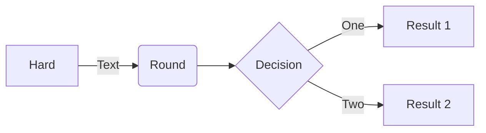
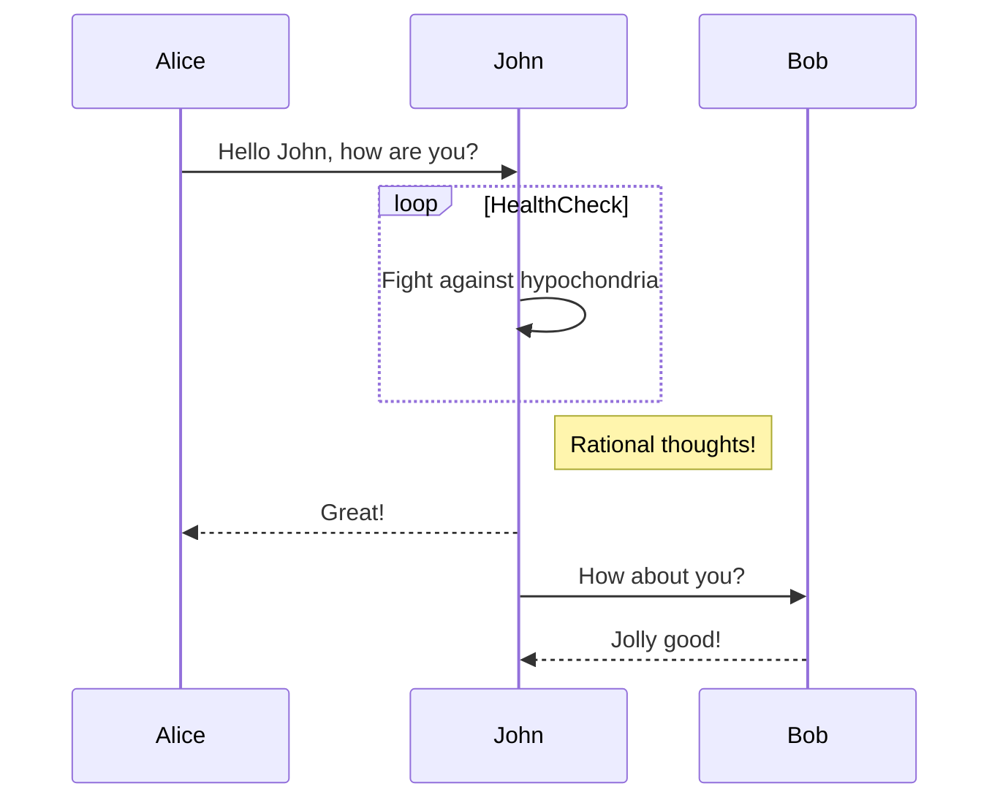
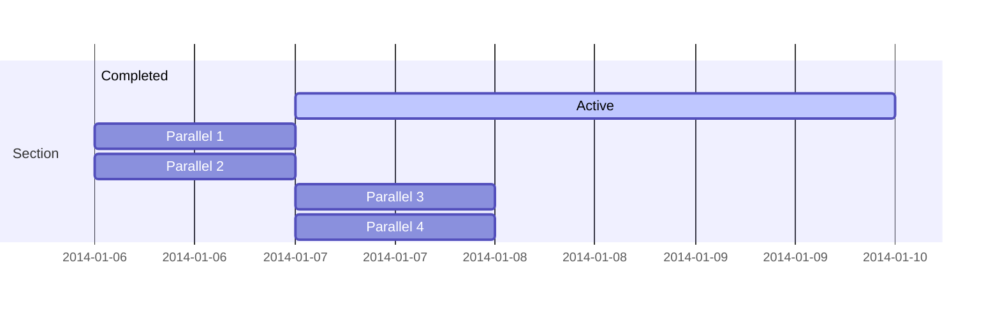
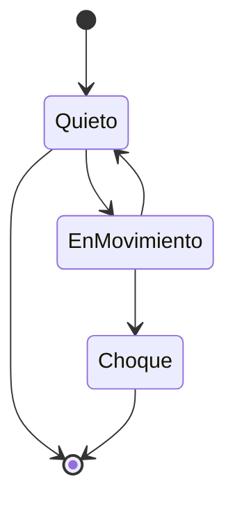
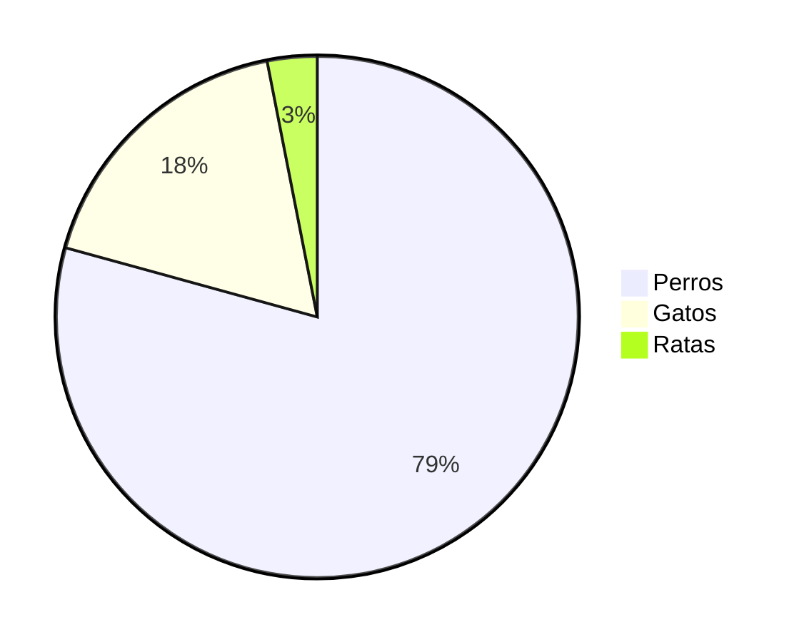
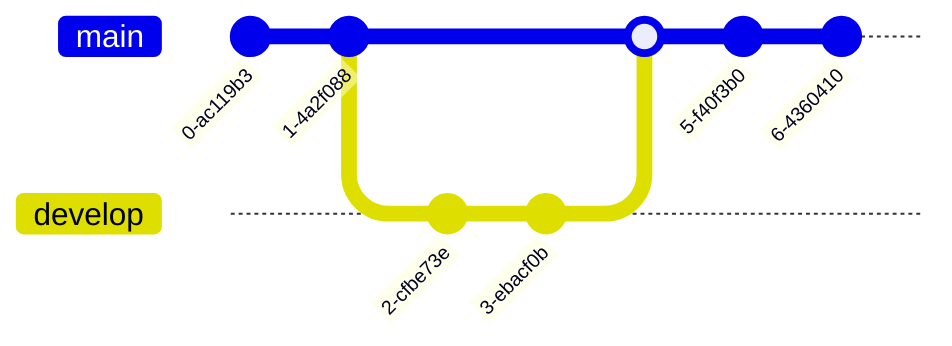

```mermaid
classDiagram
Class01 <|-- AveryLongClass : Cool
<<Interface>> Class01
Class09 --> C2 : ¿Dónde estoy?
Class09 --* C3
Class09 --|> Class07
Class07 : equals()
Class07 : Object[] elementData
Class01 : size()
Class01 : int chimp
Class01 : int gorilla
class Class10 {
  <<service>>
  int id
  size()
}

```

```mermaid
gantt
    title Git Issues - días desde la última actualización
    dateFormat  X
    axisFormat %s

    section Issue19062
    71   : 0, 71
    section Issue19401
    36   : 0, 36
    section Issue193
    34   : 0, 34
    section Issue7441
    9    : 0, 9
    section Issue1300
    5    : 0, 5
```

```mermaid
  journey
    title Mi día laboral
    section Ir al trabajo
      Preparar té: 5: Yo
      Subir las escaleras: 3: Yo
      Trabajar: 1: Yo, Gato
    section Ir a casa
      Bajar las escaleras: 5: Yo
      Sentarse: 3: Yo
```

<p align="center">

</p>
<h1 align="center">
Mermaid
</h1>
<p align="center">
Genera diagramas a partir de texto similar a Markdown.
<p>
<p align="center">
  <a href="https://www.npmjs.com/package/mermaid"></a>
<p>

<p align="center">
<a href="https://mermaid.live/"><b>¡Editor en Vivo!</b></a>
</p>
<p align="center">
 <a href="https://mermaid.js.org">📖 Documentación</a> | <a href="https://mermaid.js.org/intro/">🚀 Comenzar</a> | <a href="https://www.jsdelivr.com/package/npm/mermaid">🌐 CDN</a> | <a href="https://discord.gg/sKeNQX4Wtj" title="Discord invite">🙌 Únete</a>
</p>
<p align="center">
<a href="./README.zh-CN.md">简体中文</a>
</p>
<p align="center">
Prueba vistas previas de futuras versiones en el Editor en Vivo: <a href="https://develop.git.mermaid.live/" title="Prueba la versión de mermaid de la rama develop.">Develop</a> | <a href="https://next.git.mermaid.live/" title="Prueba la versión de mermaid de la rama next.">Next</a>
</p>

<br>
<br>

[](https://www.npmjs.com/package/mermaid)
[](https://github.com/mermaid-js/mermaid/actions/workflows/build.yml)
[](https://bundlephobia.com/package/mermaid)
[](https://app.codecov.io/github/mermaid-js/mermaid/tree/develop)
[](https://www.jsdelivr.com/package/npm/mermaid)
[](https://www.npmjs.com/package/mermaid)
[](https://discord.gg/sKeNQX4Wtj)
[](https://twitter.com/mermaidjs_)
[](https://argos-ci.com?utm_source=mermaid&utm_campaign=oss)
[](https://securityscorecards.dev/viewer/?uri=github.com/mermaid-js/mermaid)


:trophy: **¡Mermaid fue nominado y ganó los [JS Open Source Awards (2019)](https://osawards.com/javascript/2019) en la categoría "El uso más emocionante de la tecnología"!!!**

**¡Gracias a todos los involucrados, personas que envían pull requests, personas que responden preguntas! 🙏**

<a href="https://mermaid.js.org/landing/"></a>

## Tabla de contenido

<details>
<summary>Expandir contenido</summary>

- [Acerca de](#about)
- [Ejemplos](#examples)
- [Lanzamiento](#release)
- [Proyectos relacionados](#related-projects)
- [Colaboradores](#contributors---)
- [Seguridad y diagramas seguros](#security-and-safe-diagrams)
- [Reportar vulnerabilidades](#reporting-vulnerabilities)
- [Agradecimientos](#appreciation)

</details>

## Acerca de

<!-- <Main description>   -->

Mermaid es una herramienta de diagramación y gráficos basada en JavaScript que utiliza definiciones de texto inspiradas en Markdown y un renderizador para crear y modificar diagramas complejos. El propósito principal de Mermaid es ayudar a que la documentación se mantenga al ritmo del desarrollo.

> Doc-Rot es una paradoja que Mermaid ayuda a resolver.

La diagramación y documentación consumen un valioso tiempo de los desarrolladores y se desactualizan rápidamente.
Pero no tener diagramas o documentación arruina la productividad y perjudica el aprendizaje organizacional.<br/>
Mermaid resuelve este problema permitiendo a los usuarios crear diagramas fácilmente modificables. También puede ser parte de scripts de producción (y otros fragmentos de código).<br/>
<br/>

Mermaid permite que incluso personas sin conocimientos de programación creen diagramas detallados fácilmente a través del [Editor en Vivo de Mermaid](https://mermaid.live/).<br/>
Para tutoriales en video, visita nuestra página de [Tutoriales](https://mermaid.js.org/ecosystem/tutorials.html).
Usa Mermaid con tus aplicaciones favoritas, consulta la lista de [Integraciones y Usos de Mermaid](https://mermaid.js.org/ecosystem/integrations-community.html).

También puedes usar Mermaid dentro de [GitHub](https://github.blog/2022-02-14-include-diagrams-markdown-files-mermaid/) así como en muchas de tus aplicaciones favoritas—consulta la lista de [Integraciones y Usos de Mermaid](https://mermaid.js.org/ecosystem/integrations-community.html).

Para una introducción más detallada a Mermaid y algunos de sus usos más básicos, consulta la [Guía para Principiantes](https://mermaid.js.org/intro/getting-started.html), [Uso](https://mermaid.js.org/config/usage.html) y [Tutoriales](https://mermaid.js.org/ecosystem/tutorials.html).

Nuestras pruebas de regresión visual de PR están impulsadas por [Argos](https://argos-ci.com/?utm_source=mermaid&utm_campaign=oss) con su generoso plan Open Source. Hace que el proceso de revisión de PRs con cambios visuales sea muy sencillo.

[](https://argos-ci.com?utm_source=mermaid&utm_campaign=oss)

En nuestro proceso de lanzamiento confiamos mucho en las pruebas de regresión visual usando [applitools](https://applitools.com/). Applitools es un excelente servicio que ha sido fácil de usar e integrar con nuestras pruebas.

<a href="https://applitools.com/">
<svg width="170" height="32" viewBox="0 0 170 32" fill="none" xmlns="http://www.w3.org/2000/svg"><mask id="a" maskUnits="userSpaceOnUse" x="27" y="0" width="143" height="32"><path fill-rule="evenodd" clip-rule="evenodd" d="M27.732.227h141.391v31.19H27.733V.227z" fill="#fff"></path></mask><g mask="url(#a)"><path fill-rule="evenodd" clip-rule="evenodd" d="M153.851 22.562l1.971-3.298c1.291 1.219 3.837 2.402 5.988 2.402 1.971 0 2.903-.753 2.903-1.829 0-2.832-10.253-.502-10.253-7.313 0-2.904 2.51-5.45 7.099-5.45 2.904 0 5.234 1.004 6.955 2.367l-1.829 3.226c-1.039-1.075-3.011-2.008-5.126-2.008-1.65 0-2.725.717-2.725 1.685 0 2.546 10.289.395 10.289 7.386 0 3.19-2.724 5.52-7.528 5.52-3.012 0-5.916-1.003-7.744-2.688zm-5.7 2.259h4.553V.908h-4.553v23.913zm-6.273-8.676c0-2.689-1.578-5.02-4.446-5.02-2.832 0-4.409 2.331-4.409 5.02 0 2.724 1.577 5.055 4.409 5.055 2.868 0 4.446-2.33 4.446-5.055zm-13.588 0c0-4.912 3.442-9.07 9.142-9.07 5.736 0 9.178 4.158 9.178 9.07 0 4.911-3.442 9.106-9.178 9.106-5.7 0-9.142-4.195-9.142-9.106zm-5.628 0c0-2.689-1.577-5.02-4.445-5.02-2.832 0-4.41 2.331-4.41 5.02 0 2.724 1.578 5.055 4.41 5.055 2.868 0 4.445-2.33 4.445-5.055zm-13.587 0c0-4.912 3.441-9.07 9.142-9.07 5.736 0 9.178 4.158 9.178 9.07 0 4.911-3.442 9.106-9.178 9.106-5.701 0-9.142-4.195-9.142-9.106zm-8.425 4.338v-8.999h-2.868v-3.98h2.868V2.773h4.553v4.733h3.514v3.979h-3.514v7.78c0 1.111.574 1.936 1.578 1.936.681 0 1.326-.251 1.577-.538l.968 3.478c-.681.609-1.9 1.11-3.8 1.11-3.191 0-4.876-1.648-4.876-4.767zm-8.962 4.338h4.553V7.505h-4.553V24.82zm-.43-21.905a2.685 2.685 0 012.688-2.69c1.506 0 2.725 1.184 2.725 2.69a2.724 2.724 0 01-2.725 2.724c-1.47 0-2.688-1.219-2.688-2.724zM84.482 24.82h4.553V.908h-4.553v23.913zm-6.165-8.676c0-2.976-1.793-5.02-4.41-5.02-1.47 0-3.119.825-3.908 1.973v6.094c.753 1.111 2.438 2.008 3.908 2.008 2.617 0 4.41-2.044 4.41-5.055zm-8.318 6.453v8.82h-4.553V7.504H70v2.187c1.327-1.685 3.227-2.618 5.342-2.618 4.446 0 7.672 3.299 7.672 9.07 0 5.773-3.226 9.107-7.672 9.107-2.043 0-3.907-.86-5.342-2.653zm-10.718-6.453c0-2.976-1.793-5.02-4.41-5.02-1.47 0-3.119.825-3.908 1.973v6.094c.753 1.111 2.438 2.008 3.908 2.008 2.617 0 4.41-2.044 4.41-5.055zm-8.318 6.453v8.82H46.41V7.504h4.553v2.187c1.327-1.685 3.227-2.618 5.342-2.618 4.446 0 7.672 3.299 7.672 9.07 0 5.773-3.226 9.107-7.672 9.107-2.043 0-3.908-.86-5.342-2.653zm-11.758-1.936V18.51c-.753-1.004-2.187-1.542-3.657-1.542-1.793 0-3.263.968-3.263 2.617 0 1.65 1.47 2.582 3.263 2.582 1.47 0 2.904-.502 3.657-1.506zm0 4.159v-1.829c-1.183 1.434-3.227 2.259-5.485 2.259-2.761 0-5.988-1.864-5.988-5.736 0-4.087 3.227-5.593 5.988-5.593 2.33 0 4.337.753 5.485 2.115V13.85c0-1.756-1.506-2.904-3.8-2.904-1.829 0-3.55.717-4.984 2.044L28.63 9.8c2.115-1.901 4.84-2.726 7.564-2.726 3.98 0 7.6 1.578 7.6 6.561v11.186h-4.588z" fill="#00A298"></path></g><path fill-rule="evenodd" clip-rule="evenodd" d="M14.934 16.177c0 1.287-.136 2.541-.391 3.752-1.666-1.039-3.87-2.288-6.777-3.752 2.907-1.465 5.11-2.714 6.777-3.753.255 1.211.39 2.466.39 3.753m4.6-7.666V4.486a78.064 78.064 0 01-4.336 3.567c-1.551-2.367-3.533-4.038-6.14-5.207C11.1 4.658 12.504 6.7 13.564 9.262 5.35 15.155 0 16.177 0 16.177s5.35 1.021 13.564 6.915c-1.06 2.563-2.463 4.603-4.507 6.415 2.607-1.169 4.589-2.84 6.14-5.207a77.978 77.978 0 014.336 3.568v-4.025s-.492-.82-2.846-2.492c.6-1.611.93-3.354.93-5.174a14.8 14.8 0 00-.93-5.174c2.354-1.673 2.846-2.492 2.846-2.492" fill="#00A298"></path></svg>
</a>

<!-- </Main description> -->

## Bot de IA de Mermaid

El bot [Mermaid](https://codeparrot.ai/oracle?owner=mermaid-js&repo=mermaid) te ayudará a entender mejor este repositorio. Puedes pedir ejemplos de código, guía de instalación, ayuda para depuración ¡y mucho más!

## Ejemplos

**A continuación se muestran algunos ejemplos de los diagramas, gráficos y esquemas que se pueden crear con Mermaid. Haz clic aquí para ir directamente a la [sintaxis de texto](https://mermaid.js.org/intro/syntax-reference.html).**

<!-- <Flowchart> -->

### Diagrama de flujo [<a href="https://mermaid.js.org/syntax/flowchart.html">docs</a> - <a href="https://mermaid.live/edit#pako:eNpNkMtqwzAQRX9FzKqFJK7t1km8KDQP6KJQSLOLvZhIY1tgS0GWmgbb_165IaFaiXvOFTPqgGtBkEJR6zOv0Fj2scsU8-ft8I5G5Gw6fe339GN7tnrYaafE45WvRsLW3Ya4bKVWwzVe_xU-FfVsc9hR62rLwvw_2591z7Y3FuUwgYZMg1L4ObrRzMBW1FAGqb8KKtCLGWRq8Ko7CbS0FdJqA2mBdUsTQGf110VxSK1xdJM2EkuDzd2qNQrypQ7s5TQuXcrW-ie5VoUsx9yZ2seVtac2DYIRz0ppK3eccd0ErRTjD1XfyyRIomSBUUzJPMaXOBb8GC4XRfQcFmL-FEYIwzD8AggvcHE">editor en vivo</a>]

```
flowchart LR

A[Hard] -->|Text| B(Round)
B --> C{Decision}
C -->|One| D[Result 1]
C -->|Two| E[Result 2]
```



### Diagrama de secuencia [<a href="https://mermaid.js.org/syntax/sequenceDiagram.html">docs</a> - <a href="https://mermaid.live/edit#pako:eNo9kMluwjAQhl_F-AykQMuSA1WrbuLQQ3v1ZbAnsVXHkzrjVhHi3etQwKfRv4w-z0FqMihL2eF3wqDxyUEdoVHhwTuNk-12RzaU4g29JzHMY2HpV0BE0VO6V8ETtdkGz1Zb1F8qiPyG5LX84mrLAmpwoWNh-5a0pWCiAxUwGBXeiVHEU4oq8V_6AHYUwAu2lLLTjVQ4bc1rT2yleI0IfJG320faZ9ABbk-Jz3hZnFxBduR9L2oiM5Jj2WBswJn8-cMArSRbbFDJMo8GK0ielVThmKOpNcD4bBxTlGUFvsOxhMT02QctS44JL6HzAS-iJzCYOwfJfTscunYd542aQuXqQU_RZ9kyt11ZFIM9rR3btJ9qaorOGQuR7c9mWSznyzXMF7hcLeBusTB6P9usq_ntrDKrm9kc5PF4_AMJE56Z">editor en vivo</a>]

```
sequenceDiagram
Alice->>John: Hello John, how are you?
loop HealthCheck
    John->>John: Fight against hypochondria
end
Note right of John: Rational thoughts!
John-->>Alice: Great!
John->>Bob: How about you?
Bob-->>John: Jolly good!
```



### Diagrama de Gantt [<a href="https://mermaid.js.org/syntax/gantt.html">docs</a> - <a href="https://mermaid.live/edit#pako:eNp90cGOgyAQBuBXIZxtFbG29bbZ3fsmvXKZylhJEAyOTZrGd1_sto3xsHMBhu-HBO689hp5xS_giJQbsCbjHTv9jcp9-q63SKhZpb3DhMXSOIiE5ZkoNpnYZGXynh6U-4jBK7JnVfBYJo9QvgjtEya1cj8QwFq0TMz4lZqxTBg0hOF5m1jifI2Lf7Bc490CyxUu1rhc4GLGPOEdhg6Mjq92V44xxanFDhWv4lRjA6MlxZWbIh17DYTf2pAPvGrADphwGMmfbq7mFYURX-jLwCVA91bWg8YYunO69Y8vMgPFI2vvGnOZ-2Owsd0S9UOVpvP29mKoHc_b2nfpYHQLgdrrsUzLvDxALrHcS9hJqeuzOB6avBCN3mciBz5N0y_wxZ0J">editor en vivo</a>]

```
gantt
    section Section
    Completed :done,    des1, 2014-01-06,2014-01-08
    Active        :active,  des2, 2014-01-07, 3d
    Parallel 1   :         des3, after des1, 1d
    Parallel 2   :         des4, after des1, 1d
    Parallel 3   :         des5, after des3, 1d
    Parallel 4   :         des6, after des4, 1d
```



### Diagrama de clases [<a href="https://mermaid.js.org/syntax/classDiagram.html">docs</a> - <a href="https://mermaid.live/edit#pako:eNpdkTFPwzAQhf-K5QlQ2zQJJG1UBaGWDYmBgYEwXO1LYuTEwXYqlZL_jt02asXm--690zvfgTLFkWaUSTBmI6DS0BTt2lfzkKx-p1PytEO9f1FtdaQkI2ulZNGuVqK1qEtgmOfk7BitSzKdOhg59XuNGgk0RDxed-_IOr6uf8cZ6UhTZ8bvHqS5ub1mr9svZPbjk6DEBlu7AQuXyBkx4gcvDk9cUMJq0XT_YaW0kNK5j-ufAoRzcihaQvLcoN4Jv50vvVxw_xrnD3RCG9QNCO4-8OgpqK1dpoJm7smxhF7agp6kfcfB4jMXVmmalW4tnFDorXrbt4xmVvc4is53GKFUwNF5DtTuO3-sShjrJjLVlqLyvNfS4drazmRB4NuzSti6386YagIjeA3a1rtlEiRRsoAoxiSN4SGOOduGy0UZ3YclT-dhBHQYhj8dc6_I">editor en vivo</a>]

```
classDiagram
Class01 <|-- AveryLongClass : Cool
<<Interface>> Class01
Class09 --> C2 : Where am I?
Class09 --* C3
Class09 --|> Class07
Class07 : equals()
Class07 : Object[] elementData
Class01 : size()
Class01 : int chimp
Class01 : int gorilla
class Class10 {
  <<service>>
  int id
  size()
}

```



### Diagrama de estados [<a href="https://mermaid.js.org/syntax/stateDiagram.html">docs</a> - <a href="https://mermaid.live/edit#pako:eNpdkEFvgzAMhf8K8nEqpYSNthx22Xbcqcexg0sCiZQQlDhIFeK_L8A6TfXp6fOz9ewJGssFVOAJSbwr7ByadGR1n8T6evpO0vQ1uZDSekOrXGFsPqJPO6q-2-imH8f_0TeHXm50lfelsAMjnEHFY6xpMdRAUhhRQxUlFy0GTTXU_RytYeAx-AdXZB1ULWovdoCB7OXWN1CRC-Ju-r3uz6UtchGHJqDbsPygU57iysb2reoWHpyOWBINvsqypb3vFMlw3TfWZF5xiY7keC6zkpUnZIUojwW-FAVvrvn51LLnvOXHQ84Q5nn-AVtLcwk">editor en vivo</a>]

```
stateDiagram-v2
[*] --> Quieto
Quieto --> [*]
Quieto --> EnMovimiento
EnMovimiento --> Quieto
EnMovimiento --> Choque
Choque --> [*]
```



### Gráfico de pastel [<a href="https://mermaid.js.org/syntax/pie.html">docs</a> - <a href="https://mermaid.live/edit#pako:eNo9jsFugzAMhl8F-VzBgEEh13Uv0F1zcYkTIpEEBadShXj3BU3dzf_n77e8wxQUgYDVkvQSbsFsEgpRtEN_5i_kvzx05XiC-xvUHVzAUXRoVe7v0heFBJ7JkQSRR0Ua08ISpD-ymlaFTN_KcoggNC4bXQATh5-Xn0BwTPSWbhZNRPdvLQEV5dIO_FrPZ43dOJ-cgtfWnDzFJeOZed1EVZ3r0lie06Ocgqs2q2aMPD_HvuqbfsCmpf7aYte2anrU46Cbz1qr60fdIBzH8QvW9lkl">editor en vivo</a>]

```
pie
"Perros" : 386
"Gatos" : 85.9
"Ratas" : 15
```



### Gráfico Git [experimental - <a href="https://mermaid.live/edit#pako:eNqNkMFugzAMhl8F-VyVAR1tOW_aA-zKxSSGRCMJCk6lCvHuNZPKZdM0n-zf3_8r8QIqaIIGMqnB8kfEybQ--y4VnLP8-9RF9Mpkmm40hmlnDKmvkPiH_kfS7nFo_VN0FAf6XwocQGgxa_nGsm1bYEOOWmik1dRjGrmF1q-Cpkkj07u2HCI0PY4zHQATh8-7V9BwTPSE3iwOEd1OjQE1iWkBvk_bzQY7s0Sq4Hs7bHqKo8iGeZqbPN_WR7mpSd1RHpvPVhuMbG7XOq_L-oJlRfW5wteq0qorrpe-PBW9Pr8UJcK6rg-BLYPQ">editor en vivo</a>]

```
gitGraph
  commit
  commit
  branch develop
  checkout develop
  commit
  commit
  checkout main
  merge develop
  commit
  commit
```



### Gráfico de barras (usando diagrama de gantt) [<a href="https://mermaid.js.org/syntax/gantt.html">docs</a> - <a href="https://mermaid.live/edit#pako:eNptkU1vhCAQhv8KIenNugiI4rkf6bmXpvEyFVxJFDYyNt1u9r8X63Z7WQ9m5pknLzieaBeMpQ3dg0dsPUkPOhwteXZIXmJcbCT3xMAxkuh8Z8kIEclyMIB209fqKcwTICFvG4IvFy_oLrZ-g9F26ILfQgvNFN94VaRXQ1iWqpumZBcu1J8p1E1TXDx59eQNr5LyEqjJn6hv5QnGNlxevZJmdLLpy5xJSzut45biYCfb0iaVxvawjNjS1p-TCguG16PvaIPzYjO67e3BwX6GiTY9jPFKH43DMF_hGMDY1J4oHg-_f8hFTJFd8L3br3yZx4QHxENsdrt1nO8dDstH3oVpF50ZYMbhU6ud4qoGLqyqBJRCmO6j0HXPZdGbihUc6Pmc0QP49xD-b5X69ZQv2gjO81IwzWqhC1lKrjJ6pA3nVS7SMiVjrKirWlYp5fs3osgrWeo00lorLWvOzz8JVbXm">editor en vivo</a>]

```
gantt
    title Git Issues - días desde la última actualización
    dateFormat  X
    axisFormat %s

    section Issue19062
    71   : 0, 71
    section Issue19401
    36   : 0, 36
    section Issue193
    34   : 0, 34
    section Issue7441
    9    : 0, 9
    section Issue1300
    5    : 0, 5
```



### Diagrama de User Journey [<a href="https://mermaid.js.org/syntax/userJourney.html">docs</a> - <a href="https://mermaid.live/edit#pako:eNplkMFuwjAQRH9l5TMiTVIC-FqqnjhxzWWJN4khsSN7XRSh_HsdKBVt97R6Mzsj-yoqq0hIAXCywRkaSwNxWHNHsB_hYt1ZmwYUfiueKtbWwIcFtjf5zgH2eCZgQgkrCXt64GgMg2fUzkvIn5Xd_V5COtMFvCH_62ht_5yk7MU8sn61HDTfxD8VYiF6cj1qFd94nWkpuKWYKWRcFdUYOi5FaaZoDYNCpnel2Toha-w8LQQGtofRVEKyC_Qw7TQ2DvsfV2dRUTy6Ch6H-UMb7TlGVtbUupl5cF3ELfPgZZLM8rLR3IbjsrJ94rVq0XH7uS2SIis2mOVUrHNc5bmqjul2U2evaa3WL2mGYpqmL2BGiho">editor en vivo</a>]

```
  journey
    title Mi día laboral
    section Ir al trabajo
      Preparar té: 5: Yo
      Subir las escaleras: 3: Yo
      Trabajar: 1: Yo, Gato
    section Ir a casa
      Bajar las escaleras: 5: Yo
      Sentarse: 3: Yo
```



### Diagrama C4 [<a href="https://mermaid.js.org/syntax/c4.html">docs</a>]

```
C4Context
title Diagrama de Contexto de Sistema para Sistema de Banca por Internet

Person(customerA, "Cliente Bancario A", "Un cliente del banco, con cuentas bancarias personales.")
Person(customerB, "Cliente Bancario B")
Person_Ext(customerC, "Cliente Bancario C")
System(SystemAA, "Sistema de Banca por Internet", "Permite a los clientes ver información sobre sus cuentas bancarias y realizar pagos.")

Person(customerD, "Cliente Bancario D", "Un cliente del banco, <br/> con cuentas bancarias personales.")

Enterprise_Boundary(b1, "LímiteDelBanco") {

  SystemDb_Ext(SystemE, "Sistema Bancario Mainframe", "Almacena toda la información bancaria principal sobre clientes, cuentas, transacciones, etc.")

  System_Boundary(b2, "LímiteDelBanco2") {
    System(SystemA, "Sistema Bancario A")
    System(SystemB, "Sistema Bancario B", "Un sistema del banco, con cuentas bancarias personales.")
  }

  System_Ext(SystemC, "Sistema de correo electrónico", "El sistema interno de correo electrónico Microsoft Exchange.")
  SystemDb(SystemD, "Base de Datos Sistema Bancario D", "Un sistema del banco, con cuentas bancarias personales.")

  Boundary(b3, "LímiteDelBanco3", "límite") {
    SystemQueue(SystemF, "Cola Sistema Bancario F", "Un sistema del banco, con cuentas bancarias personales.")
    SystemQueue_Ext(SystemG, "Cola Sistema Bancario G", "Un sistema del banco, con cuentas bancarias personales.")
  }
}

BiRel(customerA, SystemAA, "Usa")
BiRel(SystemAA, SystemE, "Usa")
Rel(SystemAA, SystemC, "Envía correos electrónicos", "SMTP")
Rel(SystemC, customerA, "Envía correos electrónicos a")
```

```mermaid
C4Context
title Diagrama de Contexto de Sistema para Sistema de Banca por Internet

Person(customerA, "Cliente Bancario A", "Un cliente del banco, con cuentas bancarias personales.")
Person(customerB, "Cliente Bancario B")
Person_Ext(customerC, "Cliente Bancario C")
System(SystemAA, "Sistema de Banca por Internet", "Permite a los clientes ver información sobre sus cuentas bancarias y realizar pagos.")

Person(customerD, "Cliente Bancario D", "Un cliente del banco, <br/> con cuentas bancarias personales.")

Enterprise_Boundary(b1, "LímiteDelBanco") {
```markdown
  SystemDb_Ext(SystemE, "Sistema Principal de Banca Mainframe", "Almacena toda la información bancaria central sobre clientes, cuentas, transacciones, etc.")

  System_Boundary(b2, "LímiteBancario2") {
    System(SystemA, "Sistema Bancario A")
    System(SystemB, "Sistema Bancario B", "Un sistema del banco, con cuentas bancarias personales.")
  }

  System_Ext(SystemC, "Sistema de correo electrónico", "El sistema interno de correo electrónico Microsoft Exchange.")
  SystemDb(SystemD, "Base de Datos del Sistema Bancario D", "Un sistema del banco, con cuentas bancarias personales.")

  Boundary(b3, "LímiteBancario3", "límite") {
    SystemQueue(SystemF, "Cola del Sistema Bancario F", "Un sistema del banco, con cuentas bancarias personales.")
    SystemQueue_Ext(SystemG, "Cola del Sistema Bancario G", "Un sistema del banco, con cuentas bancarias personales.")
  }
}

BiRel(customerA, SystemAA, "Usa")
BiRel(SystemAA, SystemE, "Usa")
Rel(SystemAA, SystemC, "Envía correos electrónicos", "SMTP")
Rel(SystemC, customerA, "Envía correos electrónicos a")
```

## Lanzamiento

Para quienes tienen permiso para hacerlo:

Actualice el número de versión en `package.json`.

```sh
npm publish
```

El comando anterior genera archivos en la carpeta `dist` y los publica en <https://www.npmjs.com>.

## Proyectos relacionados

- [Interfaz de Línea de Comandos](https://github.com/mermaid-js/mermaid-cli)
- [Editor en Vivo](https://github.com/mermaid-js/mermaid-live-editor)
- [Servidor HTTP](https://github.com/TomWright/mermaid-server)

## Contribuidores [](https://github.com/mermaid-js/mermaid/issues?q=is%3Aissue+is%3Aopen+label%3A%22Good+first+issue%21%22) [](https://github.com/mermaid-js/mermaid/graphs/contributors) [](https://github.com/mermaid-js/mermaid/graphs/contributors)

Mermaid es una comunidad en crecimiento y siempre está aceptando nuevos contribuidores. ¡Hay muchas maneras diferentes de ayudar y siempre estamos buscando manos extra! Mire [este issue](https://github.com/mermaid-js/mermaid/issues/866) si quiere saber por dónde empezar a colaborar.

Puede encontrar información detallada sobre cómo contribuir en la [guía de contribución](https://mermaid.js.org/community/contributing.html)

## Seguridad y diagramas seguros

Para sitios públicos, puede ser arriesgado recuperar texto de usuarios en Internet y almacenar ese contenido para mostrarlo posteriormente en un navegador. La razón es que el contenido del usuario puede contener scripts maliciosos incrustados que se ejecutarán cuando se presente la información. Para Mermaid esto es un riesgo, especialmente porque los diagramas Mermaid contienen muchos caracteres que se utilizan en html, lo que hace que la sanitización estándar no sea usable ya que también rompe los diagramas. Aún así, hacemos un esfuerzo por sanear el código entrante y seguimos refinando el proceso, pero es difícil garantizar que no haya fallos de seguridad.

Como un nivel extra de seguridad para sitios con usuarios externos, nos complace presentar un nuevo nivel de seguridad en el que el diagrama se renderiza en un iframe aislado, evitando que se ejecute javascript en el código. Este es un gran paso adelante para una mejor seguridad.

_Desafortunadamente, no se puede tener todo, lo que en este caso significa que parte de la funcionalidad interactiva se bloquea junto con el posible código malicioso._

## Reporte de vulnerabilidades

Para informar sobre una vulnerabilidad, por favor envíe un correo electrónico a <security@mermaid.live> con una descripción del problema, los pasos que siguió para crear el problema, las versiones afectadas y, si se conoce, las mitigaciones para el problema.

## Agradecimientos

Una nota rápida de Knut Sveidqvist:

> _¡Muchas gracias a los proyectos [d3](https://d3js.org/) y [dagre-d3](https://github.com/cpettitt/dagre-d3) por proporcionar las bibliotecas de diseño gráfico y dibujo!_
>
> _Gracias también al proyecto [js-sequence-diagram](https://bramp.github.io/js-sequence-diagrams) por el uso de la gramática para los diagramas de secuencia. Gracias a Jessica Peter por la inspiración y punto de partida para el renderizado de diagramas de Gantt._
>
> _Gracias a [Tyler Long](https://github.com/tylerlong), quien ha sido colaborador desde abril de 2017._
>
> _¡Gracias a la lista cada vez mayor de [contribuidores](https://github.com/mermaid-js/mermaid/graphs/contributors) que han llevado el proyecto hasta aquí!_

---

_Mermaid fue creado por Knut Sveidqvist para una documentación más sencilla._
```


---



Tranlated By [Open Ai Tx](https://github.com/OpenAiTx/OpenAiTx) | Last indexed: 2025-06-12


---