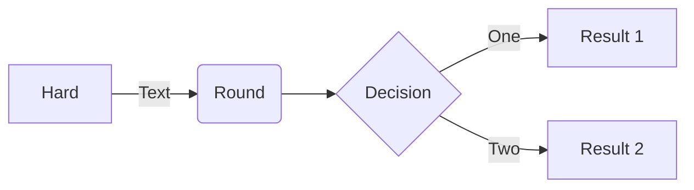
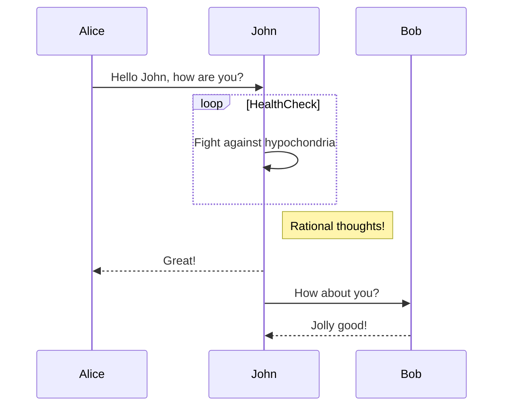
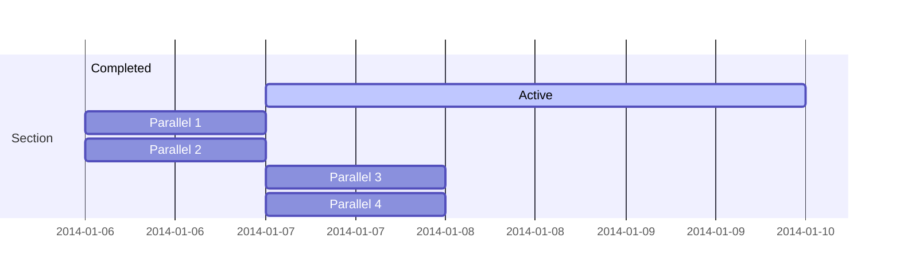
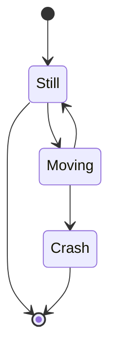
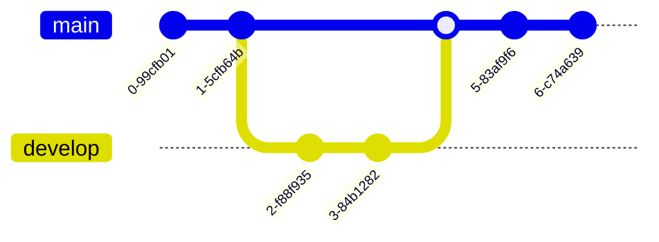

```mermaid
classDiagram
Class01 <|-- AveryLongClass : Cool
<<Interface>> Class01
Class09 --> C2 : کجا هستم؟
Class09 --* C3
Class09 --|> Class07
Class07 : equals()
Class07 : Object[] elementData
Class01 : size()
Class01 : int chimp
Class01 : int gorilla
class Class10 {
  <<service>>
  int id
  size()
}

```

```mermaid
pie
"سگ‌ها" : 386
"گربه‌ها" : 85.9
"موش‌ها" : 15
```

```mermaid
gantt
    title مسائل گیت - روزها از آخرین بروزرسانی
    dateFormat  X
    axisFormat %s

    section Issue19062
    71   : 0, 71
    section Issue19401
    36   : 0, 36
    section Issue193
    34   : 0, 34
    section Issue7441
    9    : 0, 9
    section Issue1300
    5    : 0, 5
```

```mermaid
  journey
    title روز کاری من
    section رفتن به محل کار
      درست کردن چای: 5: من
      بالا رفتن از پله‌ها: 3: من
      انجام کار: 1: من، گربه
    section بازگشت به خانه
      پایین آمدن از پله‌ها: 5: من
      نشستن: 3: من
```

<p align="center">

</p>
<h1 align="center">
مرمید (Mermaid)
</h1>
<p align="center">
تولید نمودارها از متن مشابه مارک‌داون.
<p>
<p align="center">
  <a href="https://www.npmjs.com/package/mermaid"></a>
<p>

<p align="center">
<a href="https://mermaid.live/"><b>ویرایشگر زنده!</b></a>
</p>
<p align="center">
 <a href="https://mermaid.js.org">📖 مستندات</a> | <a href="https://mermaid.js.org/intro/">🚀 شروع سریع</a> | <a href="https://www.jsdelivr.com/package/npm/mermaid">🌐 CDN</a> | <a href="https://discord.gg/sKeNQX4Wtj" title="Discord invite">🙌 به ما بپیوندید</a>
</p>
<p align="center">
<a href="./README.zh-CN.md">简体中文</a>
</p>
<p align="center">
پیش‌نمایش ویرایشگر زنده نسخه‌های آینده را امتحان کنید: <a href="https://develop.git.mermaid.live/" title="Try the mermaid version from the develop branch.">Develop</a> | <a href="https://next.git.mermaid.live/" title="Try the mermaid version from the next branch.">Next</a>
</p>

<br>
<br>

[](https://www.npmjs.com/package/mermaid)
[](https://github.com/mermaid-js/mermaid/actions/workflows/build.yml)
[](https://bundlephobia.com/package/mermaid)
[](https://app.codecov.io/github/mermaid-js/mermaid/tree/develop)
[](https://www.jsdelivr.com/package/npm/mermaid)
[](https://www.npmjs.com/package/mermaid)
[](https://discord.gg/sKeNQX4Wtj)
[](https://twitter.com/mermaidjs_)
[](https://argos-ci.com?utm_source=mermaid&utm_campaign=oss)
[](https://securityscorecards.dev/viewer/?uri=github.com/mermaid-js/mermaid)


:trophy: **مرمید نامزد و برنده [جوایز متن‌باز JS (2019)](https://osawards.com/javascript/2019) در بخش "هیجان‌انگیزترین استفاده از فناوری" شد!!!**

**از همه مشارکت‌کنندگان، کسانی که pull request ارسال کردند، و کسانی که به سوالات پاسخ دادند، متشکریم! 🙏**

<a href="https://mermaid.js.org/landing/"></a>

## فهرست مطالب

<details>
<summary>نمایش محتوا</summary>

- [درباره](#about)
- [نمونه‌ها](#examples)
- [انتشار](#release)
- [پروژه‌های مرتبط](#related-projects)
- [مشارکت‌کنندگان](#contributors---)
- [امنیت و نمودارهای امن](#security-and-safe-diagrams)
- [گزارش آسیب‌پذیری‌ها](#reporting-vulnerabilities)
- [قدردانی](#appreciation)

</details>

## درباره

<!-- <Main description>   -->

مرمید یک ابزار ترسیم نمودار و چارت مبتنی بر جاوااسکریپت است که با استفاده از تعاریف متنی مشابه مارک‌داون و یک رندرر، نمودارهای پیچیده را ایجاد و ویرایش می‌کند. هدف اصلی مرمید کمک به همگام‌سازی مستندسازی با توسعه نرم‌افزار است.

> پوسیدگی اسناد (Doc-Rot) یک وضعیت بن‌بست است که مرمید به حل آن کمک می‌کند.

ترسیم نمودار و مستندسازی زمان ارزشمند توسعه‌دهنده را مصرف می‌کند و به سرعت قدیمی می‌شود.
اما نبود نمودار یا مستندات بهره‌وری را کاهش داده و یادگیری سازمانی را مختل می‌کند.<br/>
مرمید این مشکل را با امکان ایجاد نمودارهای به‌راحتی قابل ویرایش برای کاربران حل می‌کند. همچنین می‌تواند بخشی از اسکریپت‌های تولید (و سایر بخش‌های کد) باشد.<br/>
<br/>

مرمید حتی به افراد غیر برنامه‌نویس نیز اجازه می‌دهد به سادگی با [ویرایشگر زنده مرمید](https://mermaid.live/) نمودارهای دقیق ایجاد کنند.<br/>
برای آموزش‌های ویدیویی، به صفحه [آموزش‌ها](https://mermaid.js.org/ecosystem/tutorials.html) مراجعه کنید.
از مرمید در برنامه‌های محبوب خود استفاده کنید. لیست [یکپارچه‌سازی‌ها و کاربردهای مرمید](https://mermaid.js.org/ecosystem/integrations-community.html) را بررسی کنید.

شما همچنین می‌توانید مرمید را در [گیت‌هاب](https://github.blog/2022-02-14-include-diagrams-markdown-files-mermaid/) و بسیاری از برنامه‌های دیگر محبوب خود استفاده کنید—لیست [یکپارچه‌سازی‌ها و کاربردهای مرمید](https://mermaid.js.org/ecosystem/integrations-community.html) را بررسی کنید.

برای آشنایی بیشتر با مرمید و برخی کاربردهای پایه‌ای آن، به [راهنمای مبتدی](https://mermaid.js.org/intro/getting-started.html)، [نحوه استفاده](https://mermaid.js.org/config/usage.html) و [آموزش‌ها](https://mermaid.js.org/ecosystem/tutorials.html) مراجعه کنید.

تست رگرسیون بصری PRهای ما توسط [Argos](https://argos-ci.com/?utm_source=mermaid&utm_campaign=oss) و طرح متن‌باز سخاوتمندانه‌شان پشتیبانی می‌شود. این سرویس فرایند بازبینی PRهای با تغییرات بصری را بسیار آسان می‌کند.

[](https://argos-ci.com?utm_source=mermaid&utm_campaign=oss)

در فرایند انتشار، ما به‌شدت به تست‌های رگرسیون بصری با استفاده از [applitools](https://applitools.com/) تکیه داریم. Applitools یک سرویس عالی است که استفاده و یکپارچه‌سازی آن با تست‌های ما آسان بوده است.

<a href="https://applitools.com/">
<svg width="170" height="32" viewBox="0 0 170 32" fill="none" xmlns="http://www.w3.org/2000/svg"><mask id="a" maskUnits="userSpaceOnUse" x="27" y="0" width="143" height="32"><path fill-rule="evenodd" clip-rule="evenodd" d="M27.732.227h141.391v31.19H27.733V.227z" fill="#fff"></path></mask><g mask="url(#a)"><path fill-rule="evenodd" clip-rule="evenodd" d="M153.851 22.562l1.971-3.298c1.291 1.219 3.837 2.402 5.988 2.402 1.971 0 2.903-.753 2.903-1.829 0-2.832-10.253-.502-10.253-7.313 0-2.904 2.51-5.45 7.099-5.45 2.904 0 5.234 1.004 6.955 2.367l-1.829 3.226c-1.039-1.075-3.011-2.008-5.126-2.008-1.65 0-2.725.717-2.725 1.685 0 2.546 10.289.395 10.289 7.386 0 3.19-2.724 5.52-7.528 5.52-3.012 0-5.916-1.003-7.744-2.688zm-5.7 2.259h4.553V.908h-4.553v23.913zm-6.273-8.676c0-2.689-1.578-5.02-4.446-5.02-2.832 0-4.409 2.331-4.409 5.02 0 2.724 1.577 5.055 4.409 5.055 2.868 0 4.446-2.33 4.446-5.055zm-13.588 0c0-4.912 3.442-9.07 9.142-9.07 5.736 0 9.178 4.158 9.178 9.07 0 4.911-3.442 9.106-9.178 9.106-5.7 0-9.142-4.195-9.142-9.106zm-5.628 0c0-2.689-1.577-5.02-4.445-5.02-2.832 0-4.41 2.331-4.41 5.02 0 2.724 1.578 5.055 4.41 5.055 2.868 0 4.445-2.33 4.445-5.055zm-13.587 0c0-4.912 3.441-9.07 9.142-9.07 5.736 0 9.178 4.158 9.178 9.07 0 4.911-3.442 9.106-9.178 9.106-5.701 0-9.142-4.195-9.142-9.106zm-8.425 4.338v-8.999h-2.868v-3.98h2.868V2.773h4.553v4.733h3.514v3.979h-3.514v7.78c0 1.111.574 1.936 1.578 1.936.681 0 1.326-.251 1.577-.538l.968 3.478c-.681.609-1.9 1.11-3.8 1.11-3.191 0-4.876-1.648-4.876-4.767zm-8.962 4.338h4.553V7.505h-4.553V24.82zm-.43-21.905a2.685 2.685 0 012.688-2.69c1.506 0 2.725 1.184 2.725 2.69a2.724 2.724 0 01-2.725 2.724c-1.47 0-2.688-1.219-2.688-2.724zM84.482 24.82h4.553V.908h-4.553v23.913zm-6.165-8.676c0-2.976-1.793-5.02-4.41-5.02-1.47 0-3.119.825-3.908 1.973v6.094c.753 1.111 2.438 2.008 3.908 2.008 2.617 0 4.41-2.044 4.41-5.055zm-8.318 6.453v8.82h-4.553V7.504H70v2.187c1.327-1.685 3.227-2.618 5.342-2.618 4.446 0 7.672 3.299 7.672 9.07 0 5.773-3.226 9.107-7.672 9.107-2.043 0-3.907-.86-5.342-2.653zm-10.718-6.453c0-2.976-1.793-5.02-4.41-5.02-1.47 0-3.119.825-3.908 1.973v6.094c.753 1.111 2.438 2.008 3.908 2.008 2.617 0 4.41-2.044 4.41-5.055zm-8.318 6.453v8.82H46.41V7.504h4.553v2.187c1.327-1.685 3.227-2.618 5.342-2.618 4.446 0 7.672 3.299 7.672 9.07 0 5.773-3.226 9.107-7.672 9.107-2.043 0-3.908-.86-5.342-2.653zm-11.758-1.936V18.51c-.753-1.004-2.187-1.542-3.657-1.542-1.793 0-3.263.968-3.263 2.617 0 1.65 1.47 2.582 3.263 2.582 1.47 0 2.904-.502 3.657-1.506zm0 4.159v-1.829c-1.183 1.434-3.227 2.259-5.485 2.259-2.761 0-5.988-1.864-5.988-5.736 0-4.087 3.227-5.593 5.988-5.593 2.33 0 4.337.753 5.485 2.115V13.85c0-1.756-1.506-2.904-3.8-2.904-1.829 0-3.55.717-4.984 2.044L28.63 9.8c2.115-1.901 4.84-2.726 7.564-2.726 3.98 0 7.6 1.578 7.6 6.561v11.186h-4.588z" fill="#00A298"></path></g><path fill-rule="evenodd" clip-rule="evenodd" d="M14.934 16.177c0 1.287-.136 2.541-.391 3.752-1.666-1.039-3.87-2.288-6.777-3.752 2.907-1.465 5.11-2.714 6.777-3.753.255 1.211.39 2.466.39 3.753m4.6-7.666V4.486a78.064 78.064 0 01-4.336 3.567c-1.551-2.367-3.533-4.038-6.14-5.207C11.1 4.658 12.504 6.7 13.564 9.262 5.35 15.155 0 16.177 0 16.177s5.35 1.021 13.564 6.915c-1.06 2.563-2.463 4.603-4.507 6.415 2.607-1.169 4.589-2.84 6.14-5.207a77.978 77.978 0 014.336 3.568v-4.025s-.492-.82-2.846-2.492c.6-1.611.93-3.354.93-5.174a14.8 14.8 0 00-.93-5.174c2.354-1.673 2.846-2.492 2.846-2.492" fill="#00A298"></path></svg>
</a>

<!-- </Main description> -->

## ربات هوشمند مرمید (Mermaid AI Bot)

[مرمید](https://codeparrot.ai/oracle?owner=mermaid-js&repo=mermaid) بات به شما کمک می‌کند تا این مخزن را بهتر درک کنید. می‌توانید درخواست نمونه کد، راهنمای نصب، راهنمای اشکال‌زدایی و بسیاری موارد دیگر کنید.

## نمونه‌ها

**در ادامه برخی نمونه‌های نمودارها، چارت‌ها و گراف‌هایی که می‌توانید با مرمید بسازید آمده است. برای مشاهده [سینتکس متنی](https://mermaid.js.org/intro/syntax-reference.html) اینجا را کلیک کنید.**

<!-- <Flowchart> -->

### نمودار جریان (Flowchart) [<a href="https://mermaid.js.org/syntax/flowchart.html">مستندات</a> - <a href="https://mermaid.live/edit#pako:eNpNkMtqwzAQRX9FzKqFJK7t1km8KDQP6KJQSLOLvZhIY1tgS0GWmgbb_165IaFaiXvOFTPqgGtBkEJR6zOv0Fj2scsU8-ft8I5G5Gw6fe339GN7tnrYaafE45WvRsLW3Ya4bKVWwzVe_xU-FfVsc9hR62rLwvw_2591z7Y3FuUwgYZMg1L4ObrRzMBW1FAGqb8KKtCLGWRq8Ko7CbS0FdJqA2mBdUsTQGf110VxSK1xdJM2EkuDzd2qNQrypQ7s5TQuXcrW-ie5VoUsx9yZ2seVtac2DYIRz0ppK3eccd0ErRTjD1XfyyRIomSBUUzJPMaXOBb8GC4XRfQcFmL-FEYIwzD8AggvcHE">ویرایشگر زنده</a>]

```
flowchart LR

A[Hard] -->|Text| B(Round)
B --> C{Decision}
C -->|One| D[Result 1]
C -->|Two| E[Result 2]
```



### نمودار ترتیبی (Sequence diagram) [<a href="https://mermaid.js.org/syntax/sequenceDiagram.html">مستندات</a> - <a href="https://mermaid.live/edit#pako:eNo9kMluwjAQhl_F-AykQMuSA1WrbuLQQ3v1ZbAnsVXHkzrjVhHi3etQwKfRv4w-z0FqMihL2eF3wqDxyUEdoVHhwTuNk-12RzaU4g29JzHMY2HpV0BE0VO6V8ETtdkGz1Zb1F8qiPyG5LX84mrLAmpwoWNh-5a0pWCiAxUwGBXeiVHEU4oq8V_6AHYUwAu2lLLTjVQ4bc1rT2yleI0IfJG320faZ9ABbk-Jz3hZnFxBduR9L2oiM5Jj2WBswJn8-cMArSRbbFDJMo8GK0ielVThmKOpNcD4bBxTlGUFvsOxhMT02QctS44JL6HzAS-iJzCYOwfJfTscunYd542aQuXqQU_RZ9kyt11ZFIM9rR3btJ9qaorOGQuR7c9mWSznyzXMF7hcLeBusTB6P9usq_ntrDKrm9kc5PF4_AMJE56Z">ویرایشگر زنده</a>]

```
sequenceDiagram
Alice->>John: Hello John, how are you?
loop HealthCheck
    John->>John: Fight against hypochondria
end
Note right of John: Rational thoughts!
John-->>Alice: Great!
John->>Bob: How about you?
Bob-->>John: Jolly good!
```



### چارت گانت (Gantt chart) [<a href="https://mermaid.js.org/syntax/gantt.html">مستندات</a> - <a href="https://mermaid.live/edit#pako:eNp90cGOgyAQBuBXIZxtFbG29bbZ3fsmvXKZylhJEAyOTZrGd1_sto3xsHMBhu-HBO689hp5xS_giJQbsCbjHTv9jcp9-q63SKhZpb3DhMXSOIiE5ZkoNpnYZGXynh6U-4jBK7JnVfBYJo9QvgjtEya1cj8QwFq0TMz4lZqxTBg0hOF5m1jifI2Lf7Bc490CyxUu1rhc4GLGPOEdhg6Mjq92V44xxanFDhWv4lRjA6MlxZWbIh17DYTf2pAPvGrADphwGMmfbq7mFYURX-jLwCVA91bWg8YYunO69Y8vMgPFI2vvGnOZ-2Owsd0S9UOVpvP29mKoHc_b2nfpYHQLgdrrsUzLvDxALrHcS9hJqeuzOB6avBCN3mciBz5N0y_wxZ0J">ویرایشگر زنده</a>]

```
gantt
    section Section
    Completed :done,    des1, 2014-01-06,2014-01-08
    Active        :active,  des2, 2014-01-07, 3d
    Parallel 1   :         des3, after des1, 1d
    Parallel 2   :         des4, after des1, 1d
    Parallel 3   :         des5, after des3, 1d
    Parallel 4   :         des6, after des4, 1d
```



### نمودار کلاسی (Class diagram) [<a href="https://mermaid.js.org/syntax/classDiagram.html">مستندات</a> - <a href="https://mermaid.live/edit#pako:eNpdkTFPwzAQhf-K5QlQ2zQJJG1UBaGWDYmBgYEwXO1LYuTEwXYqlZL_jt02asXm--690zvfgTLFkWaUSTBmI6DS0BTt2lfzkKx-p1PytEO9f1FtdaQkI2ulZNGuVqK1qEtgmOfk7BitSzKdOhg59XuNGgk0RDxed-_IOr6uf8cZ6UhTZ8bvHqS5ub1mr9svZPbjk6DEBlu7AQuXyBkx4gcvDk9cUMJq0XT_YaW0kNK5j-ufAoRzcihaQvLcoN4Jv50vvVxw_xrnD3RCG9QNCO4-8OgpqK1dpoJm7smxhF7agp6kfcfB4jMXVmmalW4tnFDorXrbt4xmVvc4is53GKFUwNF5DtTuO3-sShjrJjLVlqLyvNfS4drazmRB4NuzSti6386YagIjeA3a1rtlEiRRsoAoxiSN4SGOOduGy0UZ3YclT-dhBHQYhj8dc6_I">ویرایشگر زنده</a>]

```
classDiagram
Class01 <|-- AveryLongClass : Cool
<<Interface>> Class01
Class09 --> C2 : Where am I?
Class09 --* C3
Class09 --|> Class07
Class07 : equals()
Class07 : Object[] elementData
Class01 : size()
Class01 : int chimp
Class01 : int gorilla
class Class10 {
  <<service>>
  int id
  size()
}

```



### نمودار حالت (State diagram) [<a href="https://mermaid.js.org/syntax/stateDiagram.html">مستندات</a> - <a href="https://mermaid.live/edit#pako:eNpdkEFvgzAMhf8K8nEqpYSNthx22Xbcqcexg0sCiZQQlDhIFeK_L8A6TfXp6fOz9ewJGssFVOAJSbwr7ByadGR1n8T6evpO0vQ1uZDSekOrXGFsPqJPO6q-2-imH8f_0TeHXm50lfelsAMjnEHFY6xpMdRAUhhRQxUlFy0GTTXU_RytYeAx-AdXZB1ULWovdoCB7OXWN1CRC-Ju-r3uz6UtchGHJqDbsPygU57iysb2reoWHpyOWBINvsqypb3vFMlw3TfWZF5xiY7keC6zkpUnZIUojwW-FAVvrvn51LLnvOXHQ84Q5nn-AVtLcwk">ویرایشگر زنده</a>]

```
stateDiagram-v2
[*] --> Still
Still --> [*]
Still --> Moving
Moving --> Still
Moving --> Crash
Crash --> [*]
```



### نمودار دایره‌ای (Pie chart) [<a href="https://mermaid.js.org/syntax/pie.html">مستندات</a> - <a href="https://mermaid.live/edit#pako:eNo9jsFugzAMhl8F-VzBgEEh13Uv0F1zcYkTIpEEBadShXj3BU3dzf_n77e8wxQUgYDVkvQSbsFsEgpRtEN_5i_kvzx05XiC-xvUHVzAUXRoVe7v0heFBJ7JkQSRR0Ua08ISpD-ymlaFTN_KcoggNC4bXQATh5-Xn0BwTPSWbhZNRPdvLQEV5dIO_FrPZ43dOJ-cgtfWnDzFJeOZed1EVZ3r0lie06Ocgqs2q2aMPD_HvuqbfsCmpf7aYte2anrU46Cbz1qr60fdIBzH8QvW9lkl">ویرایشگر زنده</a>]

```
pie
"سگ‌ها" : 386
"گربه‌ها" : 85.9
"موش‌ها" : 15
```



### نمودار گیت (Git graph) [آزمایشی - <a href="https://mermaid.live/edit#pako:eNqNkMFugzAMhl8F-VyVAR1tOW_aA-zKxSSGRCMJCk6lCvHuNZPKZdM0n-zf3_8r8QIqaIIGMqnB8kfEybQ--y4VnLP8-9RF9Mpkmm40hmlnDKmvkPiH_kfS7nFo_VN0FAf6XwocQGgxa_nGsm1bYEOOWmik1dRjGrmF1q-Cpkkj07u2HCI0PY4zHQATh8-7V9BwTPSE3iwOEd1OjQE1iWkBvk_bzQY7s0Sq4Hs7bHqKo8iGeZqbPN_WR7mpSd1RHpvPVhuMbG7XOq_L-oJlRfW5wteq0qorrpe-PBW9Pr8UJcK6rg-BLYPQ">ویرایشگر زنده</a>]

```
gitGraph
  commit
  commit
  branch develop
  checkout develop
  commit
  commit
  checkout main
  merge develop
  commit
  commit
```



### نمودار میله‌ای (Bar chart) با استفاده از گانت (gantt) [<a href="https://mermaid.js.org/syntax/gantt.html">مستندات</a> - <a href="https://mermaid.live/edit#pako:eNptkU1vhCAQhv8KIenNugiI4rkf6bmXpvEyFVxJFDYyNt1u9r8X63Z7WQ9m5pknLzieaBeMpQ3dg0dsPUkPOhwteXZIXmJcbCT3xMAxkuh8Z8kIEclyMIB209fqKcwTICFvG4IvFy_oLrZ-g9F26ILfQgvNFN94VaRXQ1iWqpumZBcu1J8p1E1TXDx59eQNr5LyEqjJn6hv5QnGNlxevZJmdLLpy5xJSzut45biYCfb0iaVxvawjNjS1p-TCguG16PvaIPzYjO67e3BwX6GiTY9jPFKH43DMF_hGMDY1J4oHg-_f8hFTJFd8L3br3yZx4QHxENsdrt1nO8dDstH3oVpF50ZYMbhU6ud4qoGLqyqBJRCmO6j0HXPZdGbihUc6Pmc0QP49xD-b5X69ZQv2gjO81IwzWqhC1lKrjJ6pA3nVS7SMiVjrKirWlYp5fs3osgrWeo00lorLWvOzz8JVbXm">ویرایشگر زنده</a>]

```
gantt
    title مسائل گیت - روزها از آخرین بروزرسانی
    dateFormat  X
    axisFormat %s

    section Issue19062
    71   : 0, 71
    section Issue19401
    36   : 0, 36
    section Issue193
    34   : 0, 34
    section Issue7441
    9    : 0, 9
    section Issue1300
    5    : 0, 5
```



### نمودار سفر کاربر (User Journey diagram) [<a href="https://mermaid.js.org/syntax/userJourney.html">مستندات</a> - <a href="https://mermaid.live/edit#pako:eNplkMFuwjAQRH9l5TMiTVIC-FqqnjhxzWWJN4khsSN7XRSh_HsdKBVt97R6Mzsj-yoqq0hIAXCywRkaSwNxWHNHsB_hYt1ZmwYUfiueKtbWwIcFtjf5zgH2eCZgQgkrCXt64GgMg2fUzkvIn5Xd_V5COtMFvCH_62ht_5yk7MU8sn61HDTfxD8VYiF6cj1qFd94nWkpuKWYKWRcFdUYOi5FaaZoDYNCpnel2Toha-w8LQQGtofRVEKyC_Qw7TQ2DvsfV2dRUTy6Ch6H-UMb7TlGVtbUupl5cF3ELfPgZZLM8rLR3IbjsrJ94rVq0XH7uS2SIis2mOVUrHNc5bmqjul2U2evaa3WL2mGYpqmL2BGiho">ویرایشگر زنده</a>]

```
  journey
    title روز کاری من
    section رفتن به محل کار
      درست کردن چای: 5: من
      بالا رفتن از پله‌ها: 3: من
      انجام کار: 1: من، گربه
    section بازگشت به خانه
      پایین آمدن از پله‌ها: 5: من
      نشستن: 3: من
```



### نمودار C4 [<a href="https://mermaid.js.org/syntax/c4.html">مستندات</a>]

```
C4Context
title نمودار کانتکست سیستم برای سامانه بانکداری اینترنتی

Person(customerA, "مشتری بانک A", "یک مشتری بانک با حساب‌های بانکی شخصی.")
Person(customerB, "مشتری بانک B")
Person_Ext(customerC, "مشتری بانک C")
System(SystemAA, "سامانه بانکداری اینترنتی", "اجازه می‌دهد مشتریان اطلاعات حساب‌های خود را مشاهده و پرداخت انجام دهند.")

Person(customerD, "مشتری بانک D", "یک مشتری بانک <br/> با حساب‌های بانکی شخصی.")

Enterprise_Boundary(b1, "مرز بانک") {

  SystemDb_Ext(SystemE, "سیستم بانکداری مین‌فریم", "تمام اطلاعات اصلی بانک درباره مشتریان، حساب‌ها، تراکنش‌ها و ... را ذخیره می‌کند.")

  System_Boundary(b2, "مرز بانک ۲") {
    System(SystemA, "سیستم بانکداری A")
    System(SystemB, "سیستم بانکداری B", "یک سیستم بانکی با حساب‌های شخصی.")
  }

  System_Ext(SystemC, "سیستم ایمیل", "سیستم داخلی Microsoft Exchange.")
  SystemDb(SystemD, "پایگاه داده سیستم بانکداری D", "یک سیستم بانکی با حساب‌های شخصی.")

  Boundary(b3, "مرز بانک ۳", "مرز") {
    SystemQueue(SystemF, "صف سیستم بانکداری F", "یک سیستم بانکی با حساب‌های شخصی.")
    SystemQueue_Ext(SystemG, "صف سیستم بانکداری G", "یک سیستم بانکی با حساب‌های شخصی.")
  }
}

BiRel(customerA, SystemAA, "استفاده می‌کند")
BiRel(SystemAA, SystemE, "استفاده می‌کند")
Rel(SystemAA, SystemC, "ارسال ایمیل", "SMTP")
Rel(SystemC, customerA, "ارسال ایمیل به")
```

```mermaid
C4Context
title نمودار کانتکست سیستم برای سامانه بانکداری اینترنتی

Person(customerA, "مشتری بانک A", "یک مشتری بانک با حساب‌های بانکی شخصی.")
Person(customerB, "مشتری بانک B")
Person_Ext(customerC, "مشتری بانک C")
System(SystemAA, "سامانه بانکداری اینترنتی", "اجازه می‌دهد مشتریان اطلاعات حساب‌های خود را مشاهده و پرداخت انجام دهند.")

Person(customerD, "مشتری بانک D", "یک مشتری بانک <br/> با حساب‌های بانکی شخصی.")

Enterprise_Boundary(b1, "مرز بانک") {
```markdown
  SystemDb_Ext(SystemE, "Mainframe Banking System", "تمام اطلاعات اصلی بانکداری درباره مشتریان، حساب‌ها، تراکنش‌ها و غیره را ذخیره می‌کند.")

  System_Boundary(b2, "BankBoundary2") {
    System(SystemA, "سیستم بانکداری A")
    System(SystemB, "سیستم بانکداری B", "یکی از سیستم‌های بانک، با حساب‌های بانکی شخصی.")
  }

  System_Ext(SystemC, "سیستم ایمیل", "سیستم ایمیل داخلی Microsoft Exchange.")
  SystemDb(SystemD, "پایگاه داده سیستم بانکداری D", "یکی از سیستم‌های بانک، با حساب‌های بانکی شخصی.")

  Boundary(b3, "BankBoundary3", "مرز") {
    SystemQueue(SystemF, "صف سیستم بانکداری F", "یکی از سیستم‌های بانک، با حساب‌های بانکی شخصی.")
    SystemQueue_Ext(SystemG, "صف سیستم بانکداری G", "یکی از سیستم‌های بانک، با حساب‌های بانکی شخصی.")
  }
}

BiRel(customerA, SystemAA, "استفاده می‌کند")
BiRel(SystemAA, SystemE, "استفاده می‌کند")
Rel(SystemAA, SystemC, "ارسال ایمیل", "SMTP")
Rel(SystemC, customerA, "ارسال ایمیل به")
```

## انتشار

برای کسانی که مجوز لازم را دارند:

شماره نسخه را در `package.json` به‌روزرسانی کنید.

```sh
npm publish
```

دستور بالا فایل‌ها را در پوشه `dist` ایجاد کرده و آن‌ها را به <https://www.npmjs.com> منتشر می‌کند.

## پروژه‌های مرتبط

- [رابط خط فرمان](https://github.com/mermaid-js/mermaid-cli)
- [ویرایشگر زنده](https://github.com/mermaid-js/mermaid-live-editor)
- [سرور HTTP](https://github.com/TomWright/mermaid-server)

## مشارکت‌کنندگان [](https://github.com/mermaid-js/mermaid/issues?q=is%3Aissue+is%3Aopen+label%3A%22Good+first+issue%21%22) [](https://github.com/mermaid-js/mermaid/graphs/contributors) [](https://github.com/mermaid-js/mermaid/graphs/contributors)

مرمید یک جامعه رو به رشد است و همیشه پذیرای مشارکت‌کنندگان جدید می‌باشد. راه‌های مختلفی برای کمک کردن وجود دارد و ما همیشه به دنبال دست‌های بیشتری هستیم! اگر می‌خواهید بدانید از کجا شروع کنید، به [این مسئله](https://github.com/mermaid-js/mermaid/issues/866) مراجعه کنید.

اطلاعات دقیق درباره نحوه مشارکت را می‌توانید در [راهنمای مشارکت](https://mermaid.js.org/community/contributing.html) بیابید.

## امنیت و نمودارهای ایمن

برای سایت‌های عمومی، بازیابی متن از کاربران در اینترنت و ذخیره آن محتوا برای نمایش در مرورگر در آینده می‌تواند خطرناک باشد. دلیل آن این است که محتوای کاربر می‌تواند شامل اسکریپت‌های مخرب تعبیه‌شده باشد که هنگام نمایش داده اجرا می‌شوند. این موضوع برای مرمید یک ریسک محسوب می‌شود، به‌ویژه چون نمودارهای مرمید شامل کاراکترهای زیادی هستند که در HTML نیز استفاده می‌شوند و این باعث می‌شود پاک‌سازی استاندارد قابل استفاده نباشد، چون نمودارها را نیز از بین می‌برد. با این حال، ما همچنان تلاش می‌کنیم که کد ورودی را پاک‌سازی کنیم و روند را بهبود دهیم، اما تضمین اینکه هیچ راه نفوذی وجود ندارد دشوار است.

به عنوان یک سطح اضافی امنیت برای سایت‌هایی با کاربران خارجی، خوشحالیم که یک سطح امنیتی جدید معرفی کنیم که در آن نمودار در یک iframe سندباکس شده رندر می‌شود و از اجرای جاوااسکریپت در کد جلوگیری می‌کند. این گامی بزرگ به سمت امنیت بهتر است.

_متاسفانه نمی‌توانید هم کیک را داشته باشید و هم آن را بخورید؛ که در این مورد یعنی برخی از قابلیت‌های تعاملی همراه با کدهای مخرب احتمالی مسدود می‌شوند._

## گزارش آسیب‌پذیری‌ها

برای گزارش آسیب‌پذیری، لطفاً به <security@mermaid.live> ایمیل بزنید و توضیحی از مسئله، مراحل ایجاد آن، نسخه‌های آسیب‌دیده و در صورت امکان، راه‌حل‌های پیشنهادی را ارسال کنید.

## قدردانی

یادداشت کوتاه از Knut Sveidqvist:

> _تشکر فراوان از پروژه‌های [d3](https://d3js.org/) و [dagre-d3](https://github.com/cpettitt/dagre-d3) به خاطر ارائه کتابخانه‌های چیدمان و ترسیم گرافیکی!_
>
> _همچنین از پروژه [js-sequence-diagram](https://bramp.github.io/js-sequence-diagrams) بابت استفاده از گرامر برای نمودارهای دنباله‌ای تشکر می‌کنیم. سپاس از Jessica Peter برای الهام و نقطه شروع در رندر گانت._
>
> _سپاس از [Tyler Long](https://github.com/tylerlong) که از آوریل ۲۰۱۷ به عنوان همکار حضور داشته است._
>
> _تشکر از فهرست همیشه در حال رشد [مشارکت‌کنندگان](https://github.com/mermaid-js/mermaid/graphs/contributors) که پروژه را تا اینجا رساندند!_

---

_مرمید توسط Knut Sveidqvist برای مستندسازی آسان‌تر ایجاد شد._
```


---



Tranlated By [Open Ai Tx](https://github.com/OpenAiTx/OpenAiTx) | Last indexed: 2025-06-12


---