```mermaid
  journey
    title Ma journée de travail
    section Aller au travail
      Faire du thé : 5: Moi
      Monter à l'étage : 3: Moi
      Travailler : 1: Moi, Chat
    section Rentrer à la maison
      Descendre : 5: Moi
      S'asseoir : 3: Moi
```

<p align="center">

</p>
<h1 align="center">
Mermaid
</h1>
<p align="center">
Générez des diagrammes à partir de texte de type markdown.
<p>
<p align="center">
  <a href="https://www.npmjs.com/package/mermaid"></a>
<p>

<p align="center">
<a href="https://mermaid.live/"><b>Éditeur en ligne !</b></a>
</p>
<p align="center">
 <a href="https://mermaid.js.org">📖 Documentation</a> | <a href="https://mermaid.js.org/intro/">🚀 Démarrer</a> | <a href="https://www.jsdelivr.com/package/npm/mermaid">🌐 CDN</a> | <a href="https://discord.gg/sKeNQX4Wtj" title="Invitation Discord">🙌 Rejoignez-nous</a>
</p>
<p align="center">
<a href="./README.zh-CN.md">简体中文</a>
</p>
<p align="center">
Essayez les aperçus de l’Éditeur en ligne des futures versions : <a href="https://develop.git.mermaid.live/" title="Essayez la version develop de mermaid.">Develop</a> | <a href="https://next.git.mermaid.live/" title="Essayez la version next de mermaid.">Next</a>
</p>

<br>
<br>

[](https://www.npmjs.com/package/mermaid)
[](https://github.com/mermaid-js/mermaid/actions/workflows/build.yml)
[](https://bundlephobia.com/package/mermaid)
[](https://app.codecov.io/github/mermaid-js/mermaid/tree/develop)
[](https://www.jsdelivr.com/package/npm/mermaid)
[](https://www.npmjs.com/package/mermaid)
[](https://discord.gg/sKeNQX4Wtj)
[](https://twitter.com/mermaidjs_)
[](https://argos-ci.com?utm_source=mermaid&utm_campaign=oss)
[](https://securityscorecards.dev/viewer/?uri=github.com/mermaid-js/mermaid)


:trophy: **Mermaid a été nommé et a remporté les [JS Open Source Awards (2019)](https://osawards.com/javascript/2019) dans la catégorie "L'utilisation la plus excitante de la technologie" !!!**

**Merci à tous les participants, aux personnes qui font des pull requests, à celles qui répondent aux questions ! 🙏**

<a href="https://mermaid.js.org/landing/"></a>

## Table des matières

<details>
<summary>Dérouler le contenu</summary>

- [À propos](#about)
- [Exemples](#examples)
- [Release](#release)
- [Projets associés](#related-projects)
- [Contributeurs](#contributors---)
- [Sécurité et diagrammes sûrs](#security-and-safe-diagrams)
- [Signaler une vulnérabilité](#reporting-vulnerabilities)
- [Remerciements](#appreciation)

</details>

## À propos

<!-- <Main description>   -->

Mermaid est un outil de création de diagrammes et de graphiques basé sur JavaScript qui utilise des définitions textuelles inspirées du Markdown et un moteur de rendu pour créer et modifier des diagrammes complexes. Le principal objectif de Mermaid est d'aider la documentation à suivre le rythme du développement.

> La "Doc-Rot" est un cercle vicieux que Mermaid aide à résoudre.

La création de diagrammes et la documentation coûtent un temps précieux aux développeurs et deviennent rapidement obsolètes.
Mais l'absence de diagrammes ou de documentation nuit à la productivité et à l'apprentissage organisationnel.<br/>
Mermaid répond à ce problème en permettant aux utilisateurs de créer des diagrammes facilement modifiables. Il peut aussi être intégré dans des scripts de production (et d'autres morceaux de code).<br/>
<br/>

Mermaid permet même aux non-programmeurs de créer facilement des diagrammes détaillés grâce à l'[Éditeur en ligne Mermaid](https://mermaid.live/).<br/>
Pour les tutoriels vidéo, consultez notre page [Tutoriels](https://mermaid.js.org/ecosystem/tutorials.html).
Utilisez Mermaid avec vos applications préférées, consultez la liste des [Intégrations et usages de Mermaid](https://mermaid.js.org/ecosystem/integrations-community.html).

Vous pouvez également utiliser Mermaid dans [GitHub](https://github.blog/2022-02-14-include-diagrams-markdown-files-mermaid/) ainsi que dans de nombreuses autres applications de votre choix — consultez la liste des [Intégrations et usages de Mermaid](https://mermaid.js.org/ecosystem/integrations-community.html).

Pour une introduction plus détaillée à Mermaid et à ses usages les plus basiques, consultez le [Guide du débutant](https://mermaid.js.org/intro/getting-started.html), [Utilisation](https://mermaid.js.org/config/usage.html) et [Tutoriels](https://mermaid.js.org/ecosystem/tutorials.html).

Nos tests de régression visuelle PR sont propulsés par [Argos](https://argos-ci.com/?utm_source=mermaid&utm_campaign=oss) grâce à leur généreux plan Open Source. Cela rend le processus de revue des PRs avec modifications visuelles très simple.

[](https://argos-ci.com?utm_source=mermaid&utm_campaign=oss)

Dans notre processus de release, nous nous appuyons fortement sur des tests de régression visuelle utilisant [applitools](https://applitools.com/). Applitools est un excellent service facile à utiliser et à intégrer dans nos tests.

<a href="https://applitools.com/">
<svg width="170" height="32" viewBox="0 0 170 32" fill="none" xmlns="http://www.w3.org/2000/svg"><mask id="a" maskUnits="userSpaceOnUse" x="27" y="0" width="143" height="32"><path fill-rule="evenodd" clip-rule="evenodd" d="M27.732.227h141.391v31.19H27.733V.227z" fill="#fff"></path></mask><g mask="url(#a)"><path fill-rule="evenodd" clip-rule="evenodd" d="M153.851 22.562l1.971-3.298c1.291 1.219 3.837 2.402 5.988 2.402 1.971 0 2.903-.753 2.903-1.829 0-2.832-10.253-.502-10.253-7.313 0-2.904 2.51-5.45 7.099-5.45 2.904 0 5.234 1.004 6.955 2.367l-1.829 3.226c-1.039-1.075-3.011-2.008-5.126-2.008-1.65 0-2.725.717-2.725 1.685 0 2.546 10.289.395 10.289 7.386 0 3.19-2.724 5.52-7.528 5.52-3.012 0-5.916-1.003-7.744-2.688zm-5.7 2.259h4.553V.908h-4.553v23.913zm-6.273-8.676c0-2.689-1.578-5.02-4.446-5.02-2.832 0-4.409 2.331-4.409 5.02 0 2.724 1.577 5.055 4.409 5.055 2.868 0 4.446-2.33 4.446-5.055zm-13.588 0c0-4.912 3.442-9.07 9.142-9.07 5.736 0 9.178 4.158 9.178 9.07 0 4.911-3.442 9.106-9.178 9.106-5.7 0-9.142-4.195-9.142-9.106zm-5.628 0c0-2.689-1.577-5.02-4.445-5.02-2.832 0-4.41 2.331-4.41 5.02 0 2.724 1.578 5.055 4.41 5.055 2.868 0 4.445-2.33 4.445-5.055zm-13.587 0c0-4.912 3.441-9.07 9.142-9.07 5.736 0 9.178 4.158 9.178 9.07 0 4.911-3.442 9.106-9.178 9.106-5.701 0-9.142-4.195-9.142-9.106zm-8.425 4.338v-8.999h-2.868v-3.98h2.868V2.773h4.553v4.733h3.514v3.979h-3.514v7.78c0 1.111.574 1.936 1.578 1.936.681 0 1.326-.251 1.577-.538l.968 3.478c-.681.609-1.9 1.11-3.8 1.11-3.191 0-4.876-1.648-4.876-4.767zm-8.962 4.338h4.553V7.505h-4.553V24.82zm-.43-21.905a2.685 2.685 0 012.688-2.69c1.506 0 2.725 1.184 2.725 2.69a2.724 2.724 0 01-2.725 2.724c-1.47 0-2.688-1.219-2.688-2.724zM84.482 24.82h4.553V.908h-4.553v23.913zm-6.165-8.676c0-2.976-1.793-5.02-4.41-5.02-1.47 0-3.119.825-3.908 1.973v6.094c.753 1.111 2.438 2.008 3.908 2.008 2.617 0 4.41-2.044 4.41-5.055zm-8.318 6.453v8.82h-4.553V7.504H70v2.187c1.327-1.685 3.227-2.618 5.342-2.618 4.446 0 7.672 3.299 7.672 9.07 0 5.773-3.226 9.107-7.672 9.107-2.043 0-3.907-.86-5.342-2.653zm-10.718-6.453c0-2.976-1.793-5.02-4.41-5.02-1.47 0-3.119.825-3.908 1.973v6.094c.753 1.111 2.438 2.008 3.908 2.008 2.617 0 4.41-2.044 4.41-5.055zm-8.318 6.453v8.82H46.41V7.504h4.553v2.187c1.327-1.685 3.227-2.618 5.342-2.618 4.446 0 7.672 3.299 7.672 9.07 0 5.773-3.226 9.107-7.672 9.107-2.043 0-3.908-.86-5.342-2.653zm-11.758-1.936V18.51c-.753-1.004-2.187-1.542-3.657-1.542-1.793 0-3.263.968-3.263 2.617 0 1.65 1.47 2.582 3.263 2.582 1.47 0 2.904-.502 3.657-1.506zm0 4.159v-1.829c-1.183 1.434-3.227 2.259-5.485 2.259-2.761 0-5.988-1.864-5.988-5.736 0-4.087 3.227-5.593 5.988-5.593 2.33 0 4.337.753 5.485 2.115V13.85c0-1.756-1.506-2.904-3.8-2.904-1.829 0-3.55.717-4.984 2.044L28.63 9.8c2.115-1.901 4.84-2.726 7.564-2.726 3.98 0 7.6 1.578 7.6 6.561v11.186h-4.588z" fill="#00A298"></path></g><path fill-rule="evenodd" clip-rule="evenodd" d="M14.934 16.177c0 1.287-.136 2.541-.391 3.752-1.666-1.039-3.87-2.288-6.777-3.752 2.907-1.465 5.11-2.714 6.777-3.753.255 1.211.39 2.466.39 3.753m4.6-7.666V4.486a78.064 78.064 0 01-4.336 3.567c-1.551-2.367-3.533-4.038-6.14-5.207C11.1 4.658 12.504 6.7 13.564 9.262 5.35 15.155 0 16.177 0 16.177s5.35 1.021 13.564 6.915c-1.06 2.563-2.463 4.603-4.507 6.415 2.607-1.169 4.589-2.84 6.14-5.207a77.978 77.978 0 014.336 3.568v-4.025s-.492-.82-2.846-2.492c.6-1.611.93-3.354.93-5.174a14.8 14.8 0 00-.93-5.174c2.354-1.673 2.846-2.492 2.846-2.492" fill="#00A298"></path></svg>
</a>

<!-- </Main description> -->

## Bot Mermaid AI

Le bot [Mermaid](https://codeparrot.ai/oracle?owner=mermaid-js&repo=mermaid) vous aidera à mieux comprendre ce dépôt. Vous pouvez demander des exemples de code, un guide d'installation, de l'aide au débogage et bien plus encore.

## Exemples

**Voici quelques exemples de diagrammes, graphiques et courbes réalisables avec Mermaid. Cliquez ici pour accéder à la [syntaxe textuelle](https://mermaid.js.org/intro/syntax-reference.html).**

<!-- <Flowchart> -->

### Organigramme [<a href="https://mermaid.js.org/syntax/flowchart.html">docs</a> - <a href="https://mermaid.live/edit#pako:eNpNkMtqwzAQRX9FzKqFJK7t1km8KDQP6KJQSLOLvZhIY1tgS0GWmgbb_165IaFaiXvOFTPqgGtBkEJR6zOv0Fj2scsU8-ft8I5G5Gw6fe339GN7tnrYaafE45WvRsLW3Ya4bKVWwzVe_xU-FfVsc9hR62rLwvw_2591z7Y3FuUwgYZMg1L4ObrRzMBW1FAGqb8KKtCLGWRq8Ko7CbS0FdJqA2mBdUsTQGf110VxSK1xdJM2EkuDzd2qNQrypQ7s5TQuXcrW-ie5VoUsx9yZ2seVtac2DYIRz0ppK3eccd0ErRTjD1XfyyRIomSBUUzJPMaXOBb8GC4XRfQcFmL-FEYIwzD8AggvcHE">éditeur en ligne</a>]

```
flowchart LR

A[Hard] -->|Text| B(Round)
B --> C{Decision}
C -->|One| D[Result 1]
C -->|Two| E[Result 2]
```


### Diagramme de séquence [<a href="https://mermaid.js.org/syntax/sequenceDiagram.html">docs</a> - <a href="https://mermaid.live/edit#pako:eNo9kMluwjAQhl_F-AykQMuSA1WrbuLQQ3v1ZbAnsVXHkzrjVhHi3etQwKfRv4w-z0FqMihL2eF3wqDxyUEdoVHhwTuNk-12RzaU4g29JzHMY2HpV0BE0VO6V8ETtdkGz1Zb1F8qiPyG5LX84mrLAmpwoWNh-5a0pWCiAxUwGBXeiVHEU4oq8V_6AHYUwAu2lLLTjVQ4bc1rT2yleI0IfJG320faZ9ABbk-Jz3hZnFxBduR9L2oiM5Jj2WBswJn8-cMArSRbbFDJMo8GK0ielVThmKOpNcD4bBxTlGUFvsOxhMT02QctS44JL6HzAS-iJzCYOwfJfTscunYd542aQuXqQU_RZ9kyt11ZFIM9rR3btJ9qaorOGQuR7c9mWSznyzXMF7hcLeBusTB6P9usq_ntrDKrm9kc5PF4_AMJE56Z">éditeur en ligne</a>]

```
sequenceDiagram
Alice->>John: Hello John, how are you?
loop HealthCheck
    John->>John: Fight against hypochondria
end
Note right of John: Rational thoughts!
John-->>Alice: Great!
John->>Bob: How about you?
Bob-->>John: Jolly good!
```


### Diagramme de Gantt [<a href="https://mermaid.js.org/syntax/gantt.html">docs</a> - <a href="https://mermaid.live/edit#pako:eNp90cGOgyAQBuBXIZxtFbG29bbZ3fsmvXKZylhJEAyOTZrGd1_sto3xsHMBhu-HBO689hp5xS_giJQbsCbjHTv9jcp9-q63SKhZpb3DhMXSOIiE5ZkoNpnYZGXynh6U-4jBK7JnVfBYJo9QvgjtEya1cj8QwFq0TMz4lZqxTBg0hOF5m1jifI2Lf7Bc490CyxUu1rhc4GLGPOEdhg6Mjq92V44xxanFDhWv4lRjA6MlxZWbIh17DYTf2pAPvGrADphwGMmfbq7mFYURX-jLwCVA91bWg8YYunO69Y8vMgPFI2vvGnOZ-2Owsd0S9UOVpvP29mKoHc_b2nfpYHQLgdrrsUzLvDxALrHcS9hJqeuzOB6avBCN3mciBz5N0y_wxZ0J">éditeur en ligne</a>]

```
gantt
    section Section
    Completed :done,    des1, 2014-01-06,2014-01-08
    Active        :active,  des2, 2014-01-07, 3d
    Parallel 1   :         des3, after des1, 1d
    Parallel 2   :         des4, after des1, 1d
    Parallel 3   :         des5, after des3, 1d
    Parallel 4   :         des6, after des4, 1d
```


### Diagramme de classes [<a href="https://mermaid.js.org/syntax/classDiagram.html">docs</a> - <a href="https://mermaid.live/edit#pako:eNpdkTFPwzAQhf-K5QlQ2zQJJG1UBaGWDYmBgYEwXO1LYuTEwXYqlZL_jt02asXm--690zvfgTLFkWaUSTBmI6DS0BTt2lfzkKx-p1PytEO9f1FtdaQkI2ulZNGuVqK1qEtgmOfk7BitSzKdOhg59XuNGgk0RDxed-_IOr6uf8cZ6UhTZ8bvHqS5ub1mr9svZPbjk6DEBlu7AQuXyBkx4gcvDk9cUMJq0XT_YaW0kNK5j-ufAoRzcihaQvLcoN4Jv50vvVxw_xrnD3RCG9QNCO4-8OgpqK1dpoJm7smxhF7agp6kfcfB4jMXVmmalW4tnFDorXrbt4xmVvc4is53GKFUwNF5DtTuO3-sShjrJjLVlqLyvNfS4drazmRB4NuzSti6386YagIjeA3a1rtlEiRRsoAoxiSN4SGOOduGy0UZ3YclT-dhBHQYhj8dc6_I">éditeur en ligne</a>]

```
classDiagram
Class01 <|-- AveryLongClass : Cool
<<Interface>> Class01
Class09 --> C2 : Where am I?
Class09 --* C3
Class09 --|> Class07
Class07 : equals()
Class07 : Object[] elementData
Class01 : size()
Class01 : int chimp
Class01 : int gorilla
class Class10 {
  <<service>>
  int id
  size()
}

```


### Diagramme d'états [<a href="https://mermaid.js.org/syntax/stateDiagram.html">docs</a> - <a href="https://mermaid.live/edit#pako:eNpdkEFvgzAMhf8K8nEqpYSNthx22Xbcqcexg0sCiZQQlDhIFeK_L8A6TfXp6fOz9ewJGssFVOAJSbwr7ByadGR1n8T6evpO0vQ1uZDSekOrXGFsPqJPO6q-2-imH8f_0TeHXm50lfelsAMjnEHFY6xpMdRAUhhRQxUlFy0GTTXU_RytYeAx-AdXZB1ULWovdoCB7OXWN1CRC-Ju-r3uz6UtchGHJqDbsPygU57iysb2reoWHpyOWBINvsqypb3vFMlw3TfWZF5xiY7keC6zkpUnZIUojwW-FAVvrvn51LLnvOXHQ84Q5nn-AVtLcwk">éditeur en ligne</a>]

```
stateDiagram-v2
[*] --> Still
Still --> [*]
Still --> Moving
Moving --> Still
Moving --> Crash
Crash --> [*]
```


### Diagramme circulaire (camembert) [<a href="https://mermaid.js.org/syntax/pie.html">docs</a> - <a href="https://mermaid.live/edit#pako:eNo9jsFugzAMhl8F-VzBgEEh13Uv0F1zcYkTIpEEBadShXj3BU3dzf_n77e8wxQUgYDVkvQSbsFsEgpRtEN_5i_kvzx05XiC-xvUHVzAUXRoVe7v0heFBJ7JkQSRR0Ua08ISpD-ymlaFTN_KcoggNC4bXQATh5-Xn0BwTPSWbhZNRPdvLQEV5dIO_FrPZ43dOJ-cgtfWnDzFJeOZed1EVZ3r0lie06Ocgqs2q2aMPD_HvuqbfsCmpf7aYte2anrU46Cbz1qr60fdIBzH8QvW9lkl">éditeur en ligne</a>]

```
pie
"Chiens" : 386
"Chats" : 85.9
"Rats" : 15
```


### Graphe Git [expérimental - <a href="https://mermaid.live/edit#pako:eNqNkMFugzAMhl8F-VyVAR1tOW_aA-zKxSSGRCMJCk6lCvHuNZPKZdM0n-zf3_8r8QIqaIIGMqnB8kfEybQ--y4VnLP8-9RF9Mpkmm40hmlnDKmvkPiH_kfS7nFo_VN0FAf6XwocQGgxa_nGsm1bYEOOWmik1dRjGrmF1q-Cpkkj07u2HCI0PY4zHQATh8-7V9BwTPSE3iwOEd1OjQE1iWkBvk_bzQY7s0Sq4Hs7bHqKo8iGeZqbPN_WR7mpSd1RHpvPVhuMbG7XOq_L-oJlRfW5wteq0qorrpe-PBW9Pr8UJcK6rg-BLYPQ">éditeur en ligne</a>]

```
gitGraph
  commit
  commit
  branch develop
  checkout develop
  commit
  commit
  checkout main
  merge develop
  commit
  commit
```


### Diagramme en barres (utilisant un diagramme de Gantt) [<a href="https://mermaid.js.org/syntax/gantt.html">docs</a> - <a href="https://mermaid.live/edit#pako:eNptkU1vhCAQhv8KIenNugiI4rkf6bmXpvEyFVxJFDYyNt1u9r8X63Z7WQ9m5pknLzieaBeMpQ3dg0dsPUkPOhwteXZIXmJcbCT3xMAxkuh8Z8kIEclyMIB209fqKcwTICFvG4IvFy_oLrZ-g9F26ILfQgvNFN94VaRXQ1iWqpumZBcu1J8p1E1TXDx59eQNr5LyEqjJn6hv5QnGNlxevZJmdLLpy5xJSzut45biYCfb0iaVxvawjNjS1p-TCguG16PvaIPzYjO67e3BwX6GiTY9jPFKH43DMF_hGMDY1J4oHg-_f8hFTJFd8L3br3yZx4QHxENsdrt1nO8dDstH3oVpF50ZYMbhU6ud4qoGLqyqBJRCmO6j0HXPZdGbihUc6Pmc0QP49xD-b5X69ZQv2gjO81IwzWqhC1lKrjJ6pA3nVS7SMiVjrKirWlYp5fs3osgrWeo00lorLWvOzz8JVbXm">éditeur en ligne</a>]

```
gantt
    title Problèmes Git - jours depuis la dernière mise à jour
    dateFormat  X
    axisFormat %s

    section Issue19062
    71   : 0, 71
    section Issue19401
    36   : 0, 36
    section Issue193
    34   : 0, 34
    section Issue7441
    9    : 0, 9
    section Issue1300
    5    : 0, 5
```


### Diagramme du parcours utilisateur [<a href="https://mermaid.js.org/syntax/userJourney.html">docs</a> - <a href="https://mermaid.live/edit#pako:eNplkMFuwjAQRH9l5TMiTVIC-FqqnjhxzWWJN4khsSN7XRSh_HsdKBVt97R6Mzsj-yoqq0hIAXCywRkaSwNxWHNHsB_hYt1ZmwYUfiueKtbWwIcFtjf5zgH2eCZgQgkrCXt64GgMg2fUzkvIn5Xd_V5COtMFvCH_62ht_5yk7MU8sn61HDTfxD8VYiF6cj1qFd94nWkpuKWYKWRcFdUYOi5FaaZoDYNCpnel2Toha-w8LQQGtofRVEKyC_Qw7TQ2DvsfV2dRUTy6Ch6H-UMb7TlGVtbUupl5cF3ELfPgZZLM8rLR3IbjsrJ94rVq0XH7uS2SIis2mOVUrHNc5bmqjul2U2evaa3WL2mGYpqmL2BGiho">éditeur en ligne</a>]

```
  journey
    title Ma journée de travail
    section Aller au travail
      Faire du thé : 5: Moi
      Monter à l'étage : 3: Moi
      Travailler : 1: Moi, Chat
    section Rentrer à la maison
      Descendre : 5: Moi
      S'asseoir : 3: Moi
```



### Diagramme C4 [<a href="https://mermaid.js.org/syntax/c4.html">docs</a>]

```
C4Context
title Diagramme de contexte système pour le système bancaire en ligne

Person(customerA, "Client bancaire A", "Un client de la banque, avec des comptes bancaires personnels.")
Person(customerB, "Client bancaire B")
Person_Ext(customerC, "Client bancaire C")
System(SystemAA, "Système bancaire en ligne", "Permet aux clients de consulter les informations de leurs comptes bancaires et d'effectuer des paiements.")

Person(customerD, "Client bancaire D", "Un client de la banque, <br/> avec des comptes bancaires personnels.")

Enterprise_Boundary(b1, "BankBoundary") {

  SystemDb_Ext(SystemE, "Système bancaire Mainframe", "Stocke toutes les informations bancaires principales sur les clients, comptes, transactions, etc.")

  System_Boundary(b2, "BankBoundary2") {
    System(SystemA, "Système bancaire A")
    System(SystemB, "Système bancaire B", "Un système de la banque, avec des comptes bancaires personnels.")
  }

  System_Ext(SystemC, "Système de messagerie", "Le système de messagerie Microsoft Exchange interne.")
  SystemDb(SystemD, "Base de données du système bancaire D", "Un système de la banque, avec des comptes bancaires personnels.")

  Boundary(b3, "BankBoundary3", "boundary") {
    SystemQueue(SystemF, "File d'attente du système bancaire F", "Un système de la banque, avec des comptes bancaires personnels.")
    SystemQueue_Ext(SystemG, "File d'attente du système bancaire G", "Un système de la banque, avec des comptes bancaires personnels.")
  }
}

BiRel(customerA, SystemAA, "Utilise")
BiRel(SystemAA, SystemE, "Utilise")
Rel(SystemAA, SystemC, "Envoie des e-mails", "SMTP")
Rel(SystemC, customerA, "Envoie des e-mails à")
```

```mermaid
C4Context
title Diagramme de contexte système pour le système bancaire en ligne

Person(customerA, "Client bancaire A", "Un client de la banque, avec des comptes bancaires personnels.")
Person(customerB, "Client bancaire B")
Person_Ext(customerC, "Client bancaire C")
System(SystemAA, "Système bancaire en ligne", "Permet aux clients de consulter les informations de leurs comptes bancaires et d'effectuer des paiements.")

Person(customerD, "Client bancaire D", "Un client de la banque, <br/> avec des comptes bancaires personnels.")

Enterprise_Boundary(b1, "BankBoundary") {
```markdown
  SystemDb_Ext(SystemE, "Système Mainframe Bancaire", "Stocke toutes les informations bancaires principales concernant les clients, comptes, transactions, etc.")

  System_Boundary(b2, "BankBoundary2") {
    System(SystemA, "Système Bancaire A")
    System(SystemB, "Système Bancaire B", "Un système de la banque, avec des comptes bancaires personnels.")
  }

  System_Ext(SystemC, "Système de messagerie électronique", "Le système de messagerie interne Microsoft Exchange.")
  SystemDb(SystemD, "Base de Données du Système Bancaire D", "Un système de la banque, avec des comptes bancaires personnels.")

  Boundary(b3, "BankBoundary3", "boundary") {
    SystemQueue(SystemF, "File d’attente Système Bancaire F", "Un système de la banque, avec des comptes bancaires personnels.")
    SystemQueue_Ext(SystemG, "File d’attente Système Bancaire G", "Un système de la banque, avec des comptes bancaires personnels.")
  }
}

BiRel(customerA, SystemAA, "Utilise")
BiRel(SystemAA, SystemE, "Utilise")
Rel(SystemAA, SystemC, "Envoie des e-mails", "SMTP")
Rel(SystemC, customerA, "Envoie des e-mails à")
```

## Publication

Pour ceux qui ont la permission de le faire :

Mettez à jour le numéro de version dans `package.json`.

```sh
npm publish
```

La commande ci-dessus génère des fichiers dans le dossier `dist` et les publie sur <https://www.npmjs.com>.

## Projets associés

- [Interface en ligne de commande](https://github.com/mermaid-js/mermaid-cli)
- [Éditeur en direct](https://github.com/mermaid-js/mermaid-live-editor)
- [Serveur HTTP](https://github.com/TomWright/mermaid-server)

## Contributeurs [](https://github.com/mermaid-js/mermaid/issues?q=is%3Aissue+is%3Aopen+label%3A%22Good+first+issue%21%22) [](https://github.com/mermaid-js/mermaid/graphs/contributors) [](https://github.com/mermaid-js/mermaid/graphs/contributors)

Mermaid est une communauté grandissante et accueille toujours de nouveaux contributeurs. Il existe de nombreuses façons différentes d’apporter votre aide et nous sommes toujours à la recherche de renforts ! Consultez [cette issue](https://github.com/mermaid-js/mermaid/issues/866) si vous souhaitez savoir par où commencer.

Des informations détaillées sur la façon de contribuer se trouvent dans le [guide de contribution](https://mermaid.js.org/community/contributing.html)

## Sécurité et diagrammes sûrs

Pour les sites publics, il peut être risqué de récupérer du texte d'utilisateurs sur Internet, de stocker ce contenu pour le présenter ultérieurement dans un navigateur. La raison en est que le contenu utilisateur peut contenir des scripts malveillants intégrés qui s’exécuteront lors de l’affichage des données. Pour Mermaid, c’est un risque, surtout car les diagrammes Mermaid contiennent de nombreux caractères utilisés en HTML, ce qui rend l’assainissement standard inutilisable car cela casse également les diagrammes. Nous faisons tout de même un effort pour assainir le code entrant et continuons d’affiner le processus, mais il est difficile de garantir qu'il n'existe aucune faille.

En tant que niveau de sécurité supplémentaire pour les sites avec des utilisateurs externes, nous sommes heureux d’introduire un nouveau niveau de sécurité dans lequel le diagramme est rendu dans une iframe en bac à sable empêchant l’exécution de javascript dans le code. Il s’agit d’une avancée majeure pour une meilleure sécurité.

_Malheureusement, on ne peut pas avoir le beurre et l’argent du beurre, ce qui, dans ce cas, signifie que certaines fonctionnalités interactives seront bloquées en même temps que le code potentiellement malveillant._

## Signalement des vulnérabilités

Pour signaler une vulnérabilité, veuillez envoyer un e-mail à <security@mermaid.live> avec une description du problème, les étapes que vous avez suivies pour créer le problème, les versions concernées et, si connu, les solutions pour le problème.

## Remerciements

Un mot rapide de Knut Sveidqvist :

> _Un grand merci aux projets [d3](https://d3js.org/) et [dagre-d3](https://github.com/cpettitt/dagre-d3) pour les bibliothèques de mise en page graphique et de dessin !_  
>
> _Merci également au projet [js-sequence-diagram](https://bramp.github.io/js-sequence-diagrams) pour l’utilisation de la grammaire des diagrammes de séquence. Merci à Jessica Peter pour l’inspiration et le point de départ du rendu Gantt._
>
> _Merci à [Tyler Long](https://github.com/tylerlong) qui collabore depuis avril 2017._
>
> _Merci à la liste sans cesse croissante de [contributeurs](https://github.com/mermaid-js/mermaid/graphs/contributors) qui ont permis au projet d’aller aussi loin !_  

---

_Mermaid a été créé par Knut Sveidqvist pour faciliter la documentation._
```


---



Tranlated By [Open Ai Tx](https://github.com/OpenAiTx/OpenAiTx) | Last indexed: 2025-06-12


---