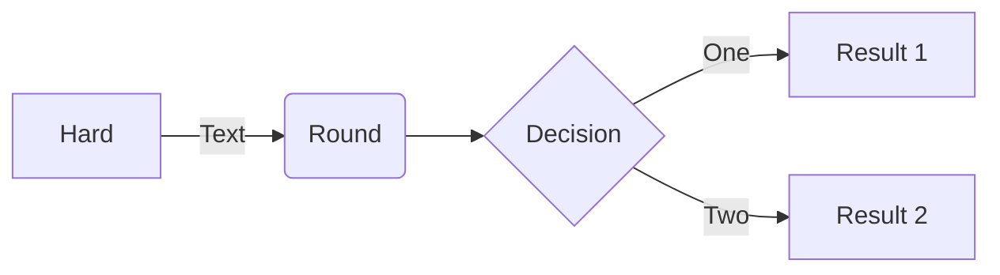
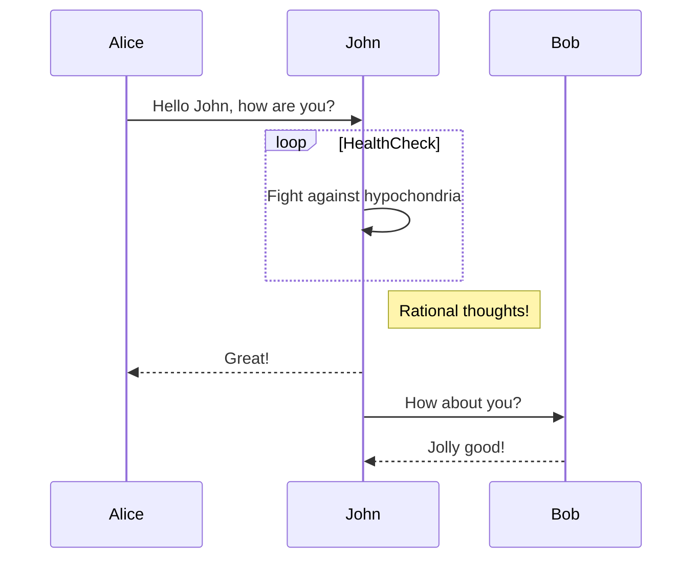
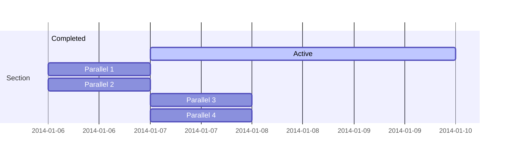
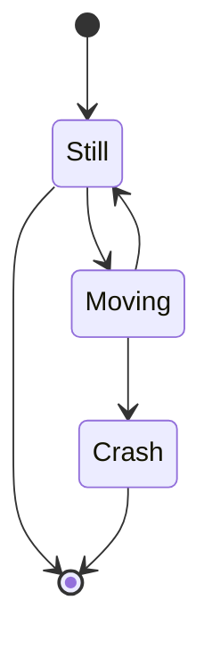
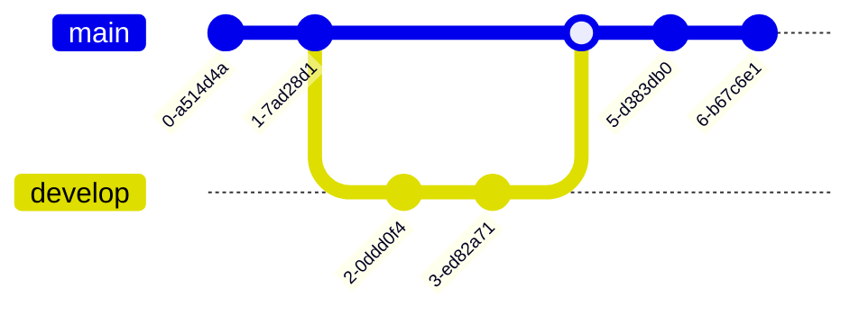

```mermaid
classDiagram
Class01 <|-- AveryLongClass : Cool
<<Interface>> Class01
Class09 --> C2 : मैं कहाँ हूँ?
Class09 --* C3
Class09 --|> Class07
Class07 : equals()
Class07 : Object[] elementData
Class01 : size()
Class01 : int chimp
Class01 : int gorilla
class Class10 {
  <<service>>
  int id
  size()
}

```

```mermaid
pie
"कुत्ते" : 386
"बिल्ली" : 85.9
"चूहे" : 15
```

```mermaid
gantt
    title Git Issues - आखिरी अपडेट के बाद दिनों की संख्या
    dateFormat  X
    axisFormat %s

    section Issue19062
    71   : 0, 71
    section Issue19401
    36   : 0, 36
    section Issue193
    34   : 0, 34
    section Issue7441
    9    : 0, 9
    section Issue1300
    5    : 0, 5
```

```mermaid
  journey
    title मेरा कार्य दिवस
    section ऑफिस जाना
      चाय बनाना: 5: मैं
      ऊपर जाना: 3: मैं
      काम करना: 1: मैं, बिल्ली
    section घर जाना
      नीचे जाना: 5: मैं
      बैठना: 3: मैं
```

<p align="center">

</p>
<h1 align="center">
Mermaid
</h1>
<p align="center">
मार्कडाउन-जैसे टेक्स्ट से डायग्राम बनाएं।
<p>
<p align="center">
  <a href="https://www.npmjs.com/package/mermaid"></a>
<p>

<p align="center">
<a href="https://mermaid.live/"><b>लाइव एडिटर!</b></a>
</p>
<p align="center">
 <a href="https://mermaid.js.org">📖 प्रलेखन</a> | <a href="https://mermaid.js.org/intro/">🚀 शुरुआत करें</a> | <a href="https://www.jsdelivr.com/package/npm/mermaid">🌐 CDN</a> | <a href="https://discord.gg/sKeNQX4Wtj" title="Discord invite">🙌 हमारे साथ जुड़ें</a>
</p>
<p align="center">
<a href="./README.zh-CN.md">简体中文</a>
</p>
<p align="center">
भविष्य के रिलीज़ का लाइव एडिटर प्रीव्यू आज़माएं: <a href="https://develop.git.mermaid.live/" title="Try the mermaid version from the develop branch.">Develop</a> | <a href="https://next.git.mermaid.live/" title="Try the mermaid version from the next branch.">Next</a>
</p>

<br>
<br>

[](https://www.npmjs.com/package/mermaid)
[](https://github.com/mermaid-js/mermaid/actions/workflows/build.yml)
[](https://bundlephobia.com/package/mermaid)
[](https://app.codecov.io/github/mermaid-js/mermaid/tree/develop)
[](https://www.jsdelivr.com/package/npm/mermaid)
[](https://www.npmjs.com/package/mermaid)
[](https://discord.gg/sKeNQX4Wtj)
[](https://twitter.com/mermaidjs_)
[](https://argos-ci.com?utm_source=mermaid&utm_campaign=oss)
[](https://securityscorecards.dev/viewer/?uri=github.com/mermaid-js/mermaid)


:trophy: **Mermaid को [JS Open Source Awards (2019)](https://osawards.com/javascript/2019) में "सबसे रोमांचक तकनीकी उपयोग" श्रेणी में नामांकित किया गया और जीत मिली!!!**

**सभी सहभागियों, पुल रिक्वेस्ट करने वालों, प्रश्नों का उत्तर देने वालों को धन्यवाद! 🙏**

<a href="https://mermaid.js.org/landing/"></a>

## विषय सूची

<details>
<summary>सामग्री विस्तार करें</summary>

- [परिचय](#about)
- [उदाहरण](#examples)
- [रिलीज़](#release)
- [संबंधित प्रोजेक्ट्स](#related-projects)
- [योगदानकर्ता](#contributors---)
- [सुरक्षा और सुरक्षित डायग्राम](#security-and-safe-diagrams)
- [कमजोरियों की रिपोर्टिंग](#reporting-vulnerabilities)
- [प्रशंसा](#appreciation)

</details>

## परिचय

<!-- <Main description>   -->

Mermaid एक जावास्क्रिप्ट-आधारित डायग्रामिंग और चार्टिंग टूल है जो मार्कडाउन-प्रेरित टेक्स्ट परिभाषाओं और एक रेंडरर का उपयोग करके जटिल डायग्राम बनाने और संशोधित करने में सक्षम बनाता है। Mermaid का मुख्य उद्देश्य प्रलेखन को विकास के साथ बनाए रखने में मदद करना है।

> डॉक-रॉट एक कैच-22 है जिसे Mermaid हल करने में सहायता करता है।

डायग्रामिंग और प्रलेखन में कीमती डेवलपर समय खर्च होता है और यह जल्दी ही अप्रचलित हो जाता है।
लेकिन डायग्राम या डॉक्युमेंटेशन न होने से उत्पादकता खराब होती है और संगठनात्मक सीखने पर असर पड़ता है।<br/>
Mermaid इस समस्या का समाधान करता है, जिससे उपयोगकर्ता आसानी से संशोधित किए जा सकने वाले डायग्राम बना सकते हैं। इसे प्रोडक्शन स्क्रिप्ट्स (और अन्य कोड भागों) का भी हिस्सा बनाया जा सकता है।<br/>
<br/>

Mermaid गैर-प्रोग्रामर को भी [Mermaid Live Editor](https://mermaid.live/) के माध्यम से आसानी से विस्तृत डायग्राम बनाने की अनुमति देता है।<br/>
वीडियो ट्यूटोरियल के लिए हमारे [ट्यूटोरियल्स](https://mermaid.js.org/ecosystem/tutorials.html) पृष्ठ पर जाएं।
Mermaid को अपनी पसंदीदा एप्लिकेशनों के साथ उपयोग करें, [Mermaid के एकीकरण और उपयोगों](https://mermaid.js.org/ecosystem/integrations-community.html) की सूची देखें।

आप [GitHub](https://github.blog/2022-02-14-include-diagrams-markdown-files-mermaid/) सहित अपनी कई पसंदीदा एप्लिकेशनों में भी Mermaid का उपयोग कर सकते हैं—[Mermaid के एकीकरण और उपयोगों](https://mermaid.js.org/ecosystem/integrations-community.html) की सूची देखें।

Mermaid और उसके कुछ मूल उपयोगों का अधिक विस्तृत परिचय पाने के लिए देखें: [शुरुआती के लिए मार्गदर्शिका](https://mermaid.js.org/intro/getting-started.html), [उपयोग](https://mermaid.js.org/config/usage.html) और [ट्यूटोरियल्स](https://mermaid.js.org/ecosystem/tutorials.html)।

हमारा PR विजुअल रिग्रेशन टेस्टिंग [Argos](https://argos-ci.com/?utm_source=mermaid&utm_campaign=oss) के उदार ओपन सोर्स प्लान द्वारा संचालित है। यह विजुअल बदलावों वाले PRs की समीक्षा की प्रक्रिया को आसान बनाता है।

[](https://argos-ci.com?utm_source=mermaid&utm_campaign=oss)

हमारे रिलीज़ प्रोसेस में हम [applitools](https://applitools.com/) का उपयोग करके विजुअल रिग्रेशन टेस्ट्स पर बहुत निर्भर करते हैं। Applitools एक शानदार सेवा है जिसे हमारे टेस्ट्स के साथ उपयोग और एकीकृत करना आसान रहा है।

<a href="https://applitools.com/">
<svg width="170" height="32" viewBox="0 0 170 32" fill="none" xmlns="http://www.w3.org/2000/svg"><mask id="a" maskUnits="userSpaceOnUse" x="27" y="0" width="143" height="32"><path fill-rule="evenodd" clip-rule="evenodd" d="M27.732.227h141.391v31.19H27.733V.227z" fill="#fff"></path></mask><g mask="url(#a)"><path fill-rule="evenodd" clip-rule="evenodd" d="M153.851 22.562l1.971-3.298c1.291 1.219 3.837 2.402 5.988 2.402 1.971 0 2.903-.753 2.903-1.829 0-2.832-10.253-.502-10.253-7.313 0-2.904 2.51-5.45 7.099-5.45 2.904 0 5.234 1.004 6.955 2.367l-1.829 3.226c-1.039-1.075-3.011-2.008-5.126-2.008-1.65 0-2.725.717-2.725 1.685 0 2.546 10.289.395 10.289 7.386 0 3.19-2.724 5.52-7.528 5.52-3.012 0-5.916-1.003-7.744-2.688zm-5.7 2.259h4.553V.908h-4.553v23.913zm-6.273-8.676c0-2.689-1.578-5.02-4.446-5.02-2.832 0-4.409 2.331-4.409 5.02 0 2.724 1.577 5.055 4.409 5.055 2.868 0 4.446-2.33 4.446-5.055zm-13.588 0c0-4.912 3.442-9.07 9.142-9.07 5.736 0 9.178 4.158 9.178 9.07 0 4.911-3.442 9.106-9.178 9.106-5.7 0-9.142-4.195-9.142-9.106zm-5.628 0c0-2.689-1.577-5.02-4.445-5.02-2.832 0-4.41 2.331-4.41 5.02 0 2.724 1.578 5.055 4.41 5.055 2.868 0 4.445-2.33 4.445-5.055zm-13.587 0c0-4.912 3.441-9.07 9.142-9.07 5.736 0 9.178 4.158 9.178 9.07 0 4.911-3.442 9.106-9.178 9.106-5.701 0-9.142-4.195-9.142-9.106zm-8.425 4.338v-8.999h-2.868v-3.98h2.868V2.773h4.553v4.733h3.514v3.979h-3.514v7.78c0 1.111.574 1.936 1.578 1.936.681 0 1.326-.251 1.577-.538l.968 3.478c-.681.609-1.9 1.11-3.8 1.11-3.191 0-4.876-1.648-4.876-4.767zm-8.962 4.338h4.553V7.505h-4.553V24.82zm-.43-21.905a2.685 2.685 0 012.688-2.69c1.506 0 2.725 1.184 2.725 2.69a2.724 2.724 0 01-2.725 2.724c-1.47 0-2.688-1.219-2.688-2.724zM84.482 24.82h4.553V.908h-4.553v23.913zm-6.165-8.676c0-2.976-1.793-5.02-4.41-5.02-1.47 0-3.119.825-3.908 1.973v6.094c.753 1.111 2.438 2.008 3.908 2.008 2.617 0 4.41-2.044 4.41-5.055zm-8.318 6.453v8.82h-4.553V7.504H70v2.187c1.327-1.685 3.227-2.618 5.342-2.618 4.446 0 7.672 3.299 7.672 9.07 0 5.773-3.226 9.107-7.672 9.107-2.043 0-3.907-.86-5.342-2.653zm-10.718-6.453c0-2.976-1.793-5.02-4.41-5.02-1.47 0-3.119.825-3.908 1.973v6.094c.753 1.111 2.438 2.008 3.908 2.008 2.617 0 4.41-2.044 4.41-5.055zm-8.318 6.453v8.82H46.41V7.504h4.553v2.187c1.327-1.685 3.227-2.618 5.342-2.618 4.446 0 7.672 3.299 7.672 9.07 0 5.773-3.226 9.107-7.672 9.107-2.043 0-3.908-.86-5.342-2.653zm-11.758-1.936V18.51c-.753-1.004-2.187-1.542-3.657-1.542-1.793 0-3.263.968-3.263 2.617 0 1.65 1.47 2.582 3.263 2.582 1.47 0 2.904-.502 3.657-1.506zm0 4.159v-1.829c-1.183 1.434-3.227 2.259-5.485 2.259-2.761 0-5.988-1.864-5.988-5.736 0-4.087 3.227-5.593 5.988-5.593 2.33 0 4.337.753 5.485 2.115V13.85c0-1.756-1.506-2.904-3.8-2.904-1.829 0-3.55.717-4.984 2.044L28.63 9.8c2.115-1.901 4.84-2.726 7.564-2.726 3.98 0 7.6 1.578 7.6 6.561v11.186h-4.588z" fill="#00A298"></path></g><path fill-rule="evenodd" clip-rule="evenodd" d="M14.934 16.177c0 1.287-.136 2.541-.391 3.752-1.666-1.039-3.87-2.288-6.777-3.752 2.907-1.465 5.11-2.714 6.777-3.753.255 1.211.39 2.466.39 3.753m4.6-7.666V4.486a78.064 78.064 0 01-4.336 3.567c-1.551-2.367-3.533-4.038-6.14-5.207C11.1 4.658 12.504 6.7 13.564 9.262 5.35 15.155 0 16.177 0 16.177s5.35 1.021 13.564 6.915c-1.06 2.563-2.463 4.603-4.507 6.415 2.607-1.169 4.589-2.84 6.14-5.207a77.978 77.978 0 014.336 3.568v-4.025s-.492-.82-2.846-2.492c.6-1.611.93-3.354.93-5.174a14.8 14.8 0 00-.93-5.174c2.354-1.673 2.846-2.492 2.846-2.492" fill="#00A298"></path></svg>
</a>

<!-- </Main description> -->

## Mermaid AI Bot

[Mermaid](https://codeparrot.ai/oracle?owner=mermaid-js&repo=mermaid) बॉट इस रिपॉजिटरी को बेहतर समझने में आपकी मदद करेगा। आप कोड उदाहरण, इंस्टॉलेशन गाइड, डिबगिंग सहायता और बहुत कुछ पूछ सकते हैं।

## उदाहरण

**नीचे Mermaid का उपयोग करके बनाए जा सकने वाले डायग्राम, चार्ट और ग्राफ के कुछ उदाहरण दिए गए हैं। [टेक्स्ट सिंटैक्स](https://mermaid.js.org/intro/syntax-reference.html) पर जाने के लिए यहां क्लिक करें।**

<!-- <Flowchart> -->

### फ्लोचार्ट [<a href="https://mermaid.js.org/syntax/flowchart.html">डॉक्युमेंटेशन</a> - <a href="https://mermaid.live/edit#pako:eNpNkMtqwzAQRX9FzKqFJK7t1km8KDQP6KJQSLOLvZhIY1tgS0GWmgbb_165IaFaiXvOFTPqgGtBkEJR6zOv0Fj2scsU8-ft8I5G5Gw6fe339GN7tnrYaafE45WvRsLW3Ya4bKVWwzVe_xU-FfVsc9hR62rLwvw_2591z7Y3FuUwgYZMg1L4ObrRzMBW1FAGqb8KKtCLGWRq8Ko7CbS0FdJqA2mBdUsTQGf110VxSK1xdJM2EkuDzd2qNQrypQ7s5TQuXcrW-ie5VoUsx9yZ2seVtac2DYIRz0ppK3eccd0ErRTjD1XfyyRIomSBUUzJPMaXOBb8GC4XRfQcFmL-FEYIwzD8AggvcHE">लाइव एडिटर</a>]

```
flowchart LR

A[Hard] -->|Text| B(Round)
B --> C{Decision}
C -->|One| D[Result 1]
C -->|Two| E[Result 2]
```



### सीक्वेंस डायग्राम [<a href="https://mermaid.js.org/syntax/sequenceDiagram.html">डॉक्युमेंटेशन</a> - <a href="https://mermaid.live/edit#pako:eNo9kMluwjAQhl_F-AykQMuSA1WrbuLQQ3v1ZbAnsVXHkzrjVhHi3etQwKfRv4w-z0FqMihL2eF3wqDxyUEdoVHhwTuNk-12RzaU4g29JzHMY2HpV0BE0VO6V8ETtdkGz1Zb1F8qiPyG5LX84mrLAmpwoWNh-5a0pWCiAxUwGBXeiVHEU4oq8V_6AHYUwAu2lLLTjVQ4bc1rT2yleI0IfJG320faZ9ABbk-Jz3hZnFxBduR9L2oiM5Jj2WBswJn8-cMArSRbbFDJMo8GK0ielVThmKOpNcD4bBxTlGUFvsOxhMT02QctS44JL6HzAS-iJzCYOwfJfTscunYd542aQuXqQU_RZ9kyt11ZFIM9rR3btJ9qaorOGQuR7c9mWSznyzXMF7hcLeBusTB6P9usq_ntrDKrm9kc5PF4_AMJE56Z">लाइव एडिटर</a>]

```
sequenceDiagram
Alice->>John: Hello John, how are you?
loop HealthCheck
    John->>John: Fight against hypochondria
end
Note right of John: Rational thoughts!
John-->>Alice: Great!
John->>Bob: How about you?
Bob-->>John: Jolly good!
```



### गैंट चार्ट [<a href="https://mermaid.js.org/syntax/gantt.html">डॉक्युमेंटेशन</a> - <a href="https://mermaid.live/edit#pako:eNp90cGOgyAQBuBXIZxtFbG29bbZ3fsmvXKZylhJEAyOTZrGd1_sto3xsHMBhu-HBO689hp5xS_giJQbsCbjHTv9jcp9-q63SKhZpb3DhMXSOIiE5ZkoNpnYZGXynh6U-4jBK7JnVfBYJo9QvgjtEya1cj8QwFq0TMz4lZqxTBg0hOF5m1jifI2Lf7Bc490CyxUu1rhc4GLGPOEdhg6Mjq92V44xxanFDhWv4lRjA6MlxZWbIh17DYTf2pAPvGrADphwGMmfbq7mFYURX-jLwCVA91bWg8YYunO69Y8vMgPFI2vvGnOZ-2Owsd0S9UOVpvP29mKoHc_b2nfpYHQLgdrrsUzLvDxALrHcS9hJqeuzOB6avBCN3mciBz5N0y_wxZ0J">लाइव एडिटर</a>]

```
gantt
    section Section
    Completed :done,    des1, 2014-01-06,2014-01-08
    Active        :active,  des2, 2014-01-07, 3d
    Parallel 1   :         des3, after des1, 1d
    Parallel 2   :         des4, after des1, 1d
    Parallel 3   :         des5, after des3, 1d
    Parallel 4   :         des6, after des4, 1d
```



### क्लास डायग्राम [<a href="https://mermaid.js.org/syntax/classDiagram.html">डॉक्युमेंटेशन</a> - <a href="https://mermaid.live/edit#pako:eNpdkTFPwzAQhf-K5QlQ2zQJJG1UBaGWDYmBgYEwXO1LYuTEwXYqlZL_jt02asXm--690zvfgTLFkWaUSTBmI6DS0BTt2lfzkKx-p1PytEO9f1FtdaQkI2ulZNGuVqK1qEtgmOfk7BitSzKdOhg59XuNGgk0RDxed-_IOr6uf8cZ6UhTZ8bvHqS5ub1mr9svZPbjk6DEBlu7AQuXyBkx4gcvDk9cUMJq0XT_YaW0kNK5j-ufAoRzcihaQvLcoN4Jv50vvVxw_xrnD3RCG9QNCO4-8OgpqK1dpoJm7smxhF7agp6kfcfB4jMXVmmalW4tnFDorXrbt4xmVvc4is53GKFUwNF5DtTuO3-sShjrJjLVlqLyvNfS4drazmRB4NuzSti6386YagIjeA3a1rtlEiRRsoAoxiSN4SGOOduGy0UZ3YclT-dhBHQYhj8dc6_I">लाइव एडिटर</a>]

```
classDiagram
Class01 <|-- AveryLongClass : Cool
<<Interface>> Class01
Class09 --> C2 : Where am I?
Class09 --* C3
Class09 --|> Class07
Class07 : equals()
Class07 : Object[] elementData
Class01 : size()
Class01 : int chimp
Class01 : int gorilla
class Class10 {
  <<service>>
  int id
  size()
}

```



### स्टेट डायग्राम [<a href="https://mermaid.js.org/syntax/stateDiagram.html">docs</a> - <a href="https://mermaid.live/edit#pako:eNpdkEFvgzAMhf8K8nEqpYSNthx22Xbcqcexg0sCiZQQlDhIFeK_L8A6TfXp6fOz9ewJGssFVOAJSbwr7ByadGR1n8T6evpO0vQ1uZDSekOrXGFsPqJPO6q-2-imH8f_0TeHXm50lfelsAMjnEHFY6xpMdRAUhhRQxUlFy0GTTXU_RytYeAx-AdXZB1ULWovdoCB7OXWN1CRC-Ju-r3uz6UtchGHJqDbsPygU57iysb2reoWHpyOWBINvsqypb3vFMlw3TfWZF5xiY7keC6zkpUnZIUojwW-FAVvrvn51LLnvOXHQ84Q5nn-AVtLcwk">live editor</a>]

```
stateDiagram-v2
[*] --> Still
Still --> [*]
Still --> Moving
Moving --> Still
Moving --> Crash
Crash --> [*]
```



### पाई चार्ट [<a href="https://mermaid.js.org/syntax/pie.html">docs</a> - <a href="https://mermaid.live/edit#pako:eNo9jsFugzAMhl8F-VzBgEEh13Uv0F1zcYkTIpEEBadShXj3BU3dzf_n77e8wxQUgYDVkvQSbsFsEgpRtEN_5i_kvzx05XiC-xvUHVzAUXRoVe7v0heFBJ7JkQSRR0Ua08ISpD-ymlaFTN_KcoggNC4bXQATh5-Xn0BwTPSWbhZNRPdvLQEV5dIO_FrPZ43dOJ-cgtfWnDzFJeOZed1EVZ3r0lie06Ocgqs2q2aMPD_HvuqbfsCmpf7aYte2anrU46Cbz1qr60fdIBzH8QvW9lkl">live editor</a>]

```
pie
"कुत्ते" : 386
"बिल्ली" : 85.9
"चूहे" : 15
```



### Git ग्राफ [experimental - <a href="https://mermaid.live/edit#pako:eNqNkMFugzAMhl8F-VyVAR1tOW_aA-zKxSSGRCMJCk6lCvHuNZPKZdM0n-zf3_8r8QIqaIIGMqnB8kfEybQ--y4VnLP8-9RF9Mpkmm40hmlnDKmvkPiH_kfS7nFo_VN0FAf6XwocQGgxa_nGsm1bYEOOWmik1dRjGrmF1q-Cpkkj07u2HCI0PY4zHQATh8-7V9BwTPSE3iwOEd1OjQE1iWkBvk_bzQY7s0Sq4Hs7bHqKo8iGeZqbPN_WR7mpSd1RHpvPVhuMbG7XOq_L-oJlRfW5wteq0qorrpe-PBW9Pr8UJcK6rg-BLYPQ">live editor</a>]

```
gitGraph
  commit
  commit
  branch develop
  checkout develop
  commit
  commit
  checkout main
  merge develop
  commit
  commit
```



### बार चार्ट (गैंट चार्ट का उपयोग करते हुए) [<a href="https://mermaid.js.org/syntax/gantt.html">docs</a> - <a href="https://mermaid.live/edit#pako:eNptkU1vhCAQhv8KIenNugiI4rkf6bmXpvEyFVxJFDYyNt1u9r8X63Z7WQ9m5pknLzieaBeMpQ3dg0dsPUkPOhwteXZIXmJcbCT3xMAxkuh8Z8kIEclyMIB209fqKcwTICFvG4IvFy_oLrZ-g9F26ILfQgvNFN94VaRXQ1iWqpumZBcu1J8p1E1TXDx59eQNr5LyEqjJn6hv5QnGNlxevZJmdLLpy5xJSzut45biYCfb0iaVxvawjNjS1p-TCguG16PvaIPzYjO67e3BwX6GiTY9jPFKH43DMF_hGMDY1J4oHg-_f8hFTJFd8L3br3yZx4QHxENsdrt1nO8dDstH3oVpF50ZYMbhU6ud4qoGLqyqBJRCmO6j0HXPZdGbihUc6Pmc0QP49xD-b5X69ZQv2gjO81IwzWqhC1lKrjJ6pA3nVS7SMiVjrKirWlYp5fs3osgrWeo00lorLWvOzz8JVbXm">live editor</a>]

```
gantt
    title Git Issues - आखिरी अपडेट के बाद दिनों की संख्या
    dateFormat  X
    axisFormat %s

    section Issue19062
    71   : 0, 71
    section Issue19401
    36   : 0, 36
    section Issue193
    34   : 0, 34
    section Issue7441
    9    : 0, 9
    section Issue1300
    5    : 0, 5
```



### यूज़र जर्नी डायग्राम [<a href="https://mermaid.js.org/syntax/userJourney.html">docs</a> - <a href="https://mermaid.live/edit#pako:eNplkMFuwjAQRH9l5TMiTVIC-FqqnjhxzWWJN4khsSN7XRSh_HsdKBVt97R6Mzsj-yoqq0hIAXCywRkaSwNxWHNHsB_hYt1ZmwYUfiueKtbWwIcFtjf5zgH2eCZgQgkrCXt64GgMg2fUzkvIn5Xd_V5COtMFvCH_62ht_5yk7MU8sn61HDTfxD8VYiF6cj1qFd94nWkpuKWYKWRcFdUYOi5FaaZoDYNCpnel2Toha-w8LQQGtofRVEKyC_Qw7TQ2DvsfV2dRUTy6Ch6H-UMb7TlGVtbUupl5cF3ELfPgZZLM8rLR3IbjsrJ94rVq0XH7uS2SIis2mOVUrHNc5bmqjul2U2evaa3WL2mGYpqmL2BGiho">live editor</a>]

```
  journey
    title मेरा कार्य दिवस
    section ऑफिस जाना
      चाय बनाना: 5: मैं
      ऊपर जाना: 3: मैं
      काम करना: 1: मैं, बिल्ली
    section घर जाना
      नीचे जाना: 5: मैं
      बैठना: 3: मैं
```



### C4 डायग्राम [<a href="https://mermaid.js.org/syntax/c4.html">docs</a>]

```
C4Context
title इंटरनेट बैंकिंग सिस्टम के लिए सिस्टम संदर्भ आरेख

Person(customerA, "बैंकिंग ग्राहक A", "बैंक का एक ग्राहक, जिसकी व्यक्तिगत बैंक खाते हैं।")
Person(customerB, "बैंकिंग ग्राहक B")
Person_Ext(customerC, "बैंकिंग ग्राहक C")
System(SystemAA, "इंटरनेट बैंकिंग सिस्टम", "ग्राहकों को उनके बैंक खातों की जानकारी देखने और भुगतान करने की अनुमति देता है।")

Person(customerD, "बैंकिंग ग्राहक D", "बैंक का एक ग्राहक, <br/> जिसकी व्यक्तिगत बैंक खाते हैं।")

Enterprise_Boundary(b1, "BankBoundary") {

  SystemDb_Ext(SystemE, "मेनफ्रेम बैंकिंग सिस्टम", "सभी मुख्य बैंकिंग जानकारी जैसे ग्राहक, खाते, लेनदेन आदि को संग्रहीत करता है।")

  System_Boundary(b2, "BankBoundary2") {
    System(SystemA, "बैंकिंग सिस्टम A")
    System(SystemB, "बैंकिंग सिस्टम B", "बैंक का एक सिस्टम, जिसमें व्यक्तिगत बैंक खाते हैं।")
  }

  System_Ext(SystemC, "ई-मेल सिस्टम", "आंतरिक Microsoft Exchange ई-मेल सिस्टम।")
  SystemDb(SystemD, "बैंकिंग सिस्टम D डेटाबेस", "बैंक का एक सिस्टम, जिसमें व्यक्तिगत बैंक खाते हैं।")

  Boundary(b3, "BankBoundary3", "boundary") {
    SystemQueue(SystemF, "बैंकिंग सिस्टम F कतार", "बैंक का एक सिस्टम, जिसमें व्यक्तिगत बैंक खाते हैं।")
    SystemQueue_Ext(SystemG, "बैंकिंग सिस्टम G कतार", "बैंक का एक सिस्टम, जिसमें व्यक्तिगत बैंक खाते हैं।")
  }
}

BiRel(customerA, SystemAA, "उपयोग करता है")
BiRel(SystemAA, SystemE, "उपयोग करता है")
Rel(SystemAA, SystemC, "ई-मेल भेजता है", "SMTP")
Rel(SystemC, customerA, "को ई-मेल भेजता है")
```

```mermaid
C4Context
title इंटरनेट बैंकिंग सिस्टम के लिए सिस्टम संदर्भ आरेख

Person(customerA, "बैंकिंग ग्राहक A", "बैंक का एक ग्राहक, जिसकी व्यक्तिगत बैंक खाते हैं।")
Person(customerB, "बैंकिंग ग्राहक B")
Person_Ext(customerC, "बैंकिंग ग्राहक C")
System(SystemAA, "इंटरनेट बैंकिंग सिस्टम", "ग्राहकों को उनके बैंक खातों की जानकारी देखने और भुगतान करने की अनुमति देता है।")

Person(customerD, "बैंकिंग ग्राहक D", "बैंक का एक ग्राहक, <br/> जिसकी व्यक्तिगत बैंक खाते हैं।")

Enterprise_Boundary(b1, "BankBoundary") {
```markdown
  SystemDb_Ext(SystemE, "Mainframe Banking System", "ग्राहकों, खातों, लेन-देन आदि के बारे में सभी मूल बैंकिंग जानकारी संग्रहीत करता है।")

  System_Boundary(b2, "BankBoundary2") {
    System(SystemA, "Banking System A")
    System(SystemB, "Banking System B", "बैंक की एक प्रणाली, जिसमें व्यक्तिगत बैंक खाते हैं।")
  }

  System_Ext(SystemC, "E-mail system", "आंतरिक Microsoft Exchange ई-मेल प्रणाली।")
  SystemDb(SystemD, "Banking System D Database", "बैंक की एक प्रणाली, जिसमें व्यक्तिगत बैंक खाते हैं।")

  Boundary(b3, "BankBoundary3", "boundary") {
    SystemQueue(SystemF, "Banking System F Queue", "बैंक की एक प्रणाली, जिसमें व्यक्तिगत बैंक खाते हैं।")
    SystemQueue_Ext(SystemG, "Banking System G Queue", "बैंक की एक प्रणाली, जिसमें व्यक्तिगत बैंक खाते हैं।")
  }
}

BiRel(customerA, SystemAA, "उपयोग करता है")
BiRel(SystemAA, SystemE, "उपयोग करता है")
Rel(SystemAA, SystemC, "ई-मेल भेजता है", "SMTP")
Rel(SystemC, customerA, "को ई-मेल भेजता है")
```

## रिलीज़

जिन्हें अनुमति है, उनके लिए:

`package.json` में संस्करण संख्या अपडेट करें।

```sh
npm publish
```

उपरोक्त कमांड `dist` फ़ोल्डर में फाइलें जनरेट करता है और उन्हें <https://www.npmjs.com> पर प्रकाशित करता है।

## संबंधित परियोजनाएँ

- [कमांड लाइन इंटरफ़ेस](https://github.com/mermaid-js/mermaid-cli)
- [लाइव संपादक](https://github.com/mermaid-js/mermaid-live-editor)
- [HTTP सर्वर](https://github.com/TomWright/mermaid-server)

## योगदानकर्ता [](https://github.com/mermaid-js/mermaid/issues?q=is%3Aissue+is%3Aopen+label%3A%22Good+first+issue%21%22) [](https://github.com/mermaid-js/mermaid/graphs/contributors) [](https://github.com/mermaid-js/mermaid/graphs/contributors)

Mermaid एक बढ़ता हुआ समुदाय है और हमेशा नए योगदानकर्ताओं का स्वागत करता है। मदद करने के कई अलग-अलग तरीके हैं और हम हमेशा अतिरिक्त हाथों की तलाश में रहते हैं! यदि आप जानना चाहते हैं कि कैसे शुरुआत करें, तो [इस समस्या](https://github.com/mermaid-js/mermaid/issues/866) को देखें।

योगदान करने के बारे में विस्तृत जानकारी [योगदान गाइड](https://mermaid.js.org/community/contributing.html) में पाई जा सकती है।

## सुरक्षा और सुरक्षित आरेख

सार्वजनिक साइटों के लिए, इंटरनेट पर उपयोगकर्ताओं से टेक्स्ट प्राप्त करना और उस सामग्री को बाद में ब्राउज़र में प्रस्तुत करने के लिए संग्रहीत करना जोखिम भरा हो सकता है। इसका कारण यह है कि उपयोगकर्ता की सामग्री में एम्बेडेड दुर्भावनापूर्ण स्क्रिप्ट हो सकती है, जो डेटा प्रस्तुत करते समय चल सकती है। Mermaid के लिए यह एक जोखिम है, विशेष रूप से क्योंकि mermaid आरेखों में कई ऐसे कैरेक्टर होते हैं जो html में उपयोग होते हैं, जिससे मानक सफाई (sanitization) अनुपयोगी हो जाती है क्योंकि यह आरेख को भी तोड़ देती है। हम फिर भी इनकमिंग कोड को साफ करने का प्रयास करते हैं और प्रक्रिया को लगातार बेहतर बना रहे हैं, लेकिन यह गारंटी देना कठिन है कि कोई छेद नहीं है।

एक अतिरिक्त सुरक्षा स्तर के रूप में, बाहरी उपयोगकर्ताओं वाली साइटों के लिए हम एक नया सुरक्षा स्तर पेश करते हैं, जिसमें आरेख को एक सैंडबॉक्स्ड iframe में रेंडर किया जाता है, जिससे कोड में जावास्क्रिप्ट के निष्पादन को रोका जाता है। यह बेहतर सुरक्षा की दिशा में एक बड़ा कदम है।

_दुर्भाग्य से, आप एक साथ दोनों चीजें नहीं कर सकते हैं, यानी कुछ इंटरएक्टिव कार्यक्षमता भी संभावित दुर्भावनापूर्ण कोड के साथ अवरुद्ध हो जाती है।_

## कमजोरियों की रिपोर्टिंग

यदि आप कोई भेद्यता रिपोर्ट करना चाहते हैं, तो कृपया <security@mermaid.live> पर एक ई-मेल भेजें, जिसमें समस्या का विवरण, समस्या उत्पन्न करने के लिए उठाए गए कदम, प्रभावित संस्करण, और यदि ज्ञात हो तो समस्या के लिए समाधान शामिल हों।

## सराहना

Knut Sveidqvist की ओर से एक त्वरित नोट:

> _[d3](https://d3js.org/) और [dagre-d3](https://github.com/cpettitt/dagre-d3) परियोजनाओं का ग्राफिकल लेआउट और ड्राइंग लाइब्रेरी उपलब्ध कराने के लिए बहुत-बहुत धन्यवाद!_
>
> _[js-sequence-diagram](https://bramp.github.io/js-sequence-diagrams) परियोजना को अनुक्रम आरेखों के व्याकरण के उपयोग के लिए धन्यवाद। गैंट रेंडरिंग के लिए प्रेरणा और शुरुआती बिंदु के लिए Jessica Peter को धन्यवाद।_
>
> _[Tyler Long](https://github.com/tylerlong) को धन्यवाद, जो अप्रैल 2017 से सहयोगी रहे हैं।_
>
> _[contributor](https://github.com/mermaid-js/mermaid/graphs/contributors) की लगातार बढ़ती सूची को धन्यवाद, जिन्होंने परियोजना को यहाँ तक पहुँचाया!_

---

_Mermaid को Knut Sveidqvist द्वारा आसान प्रलेखन के लिए बनाया गया था।_
```


---



Tranlated By [Open Ai Tx](https://github.com/OpenAiTx/OpenAiTx) | Last indexed: 2025-06-12


---