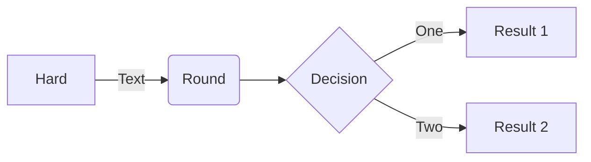
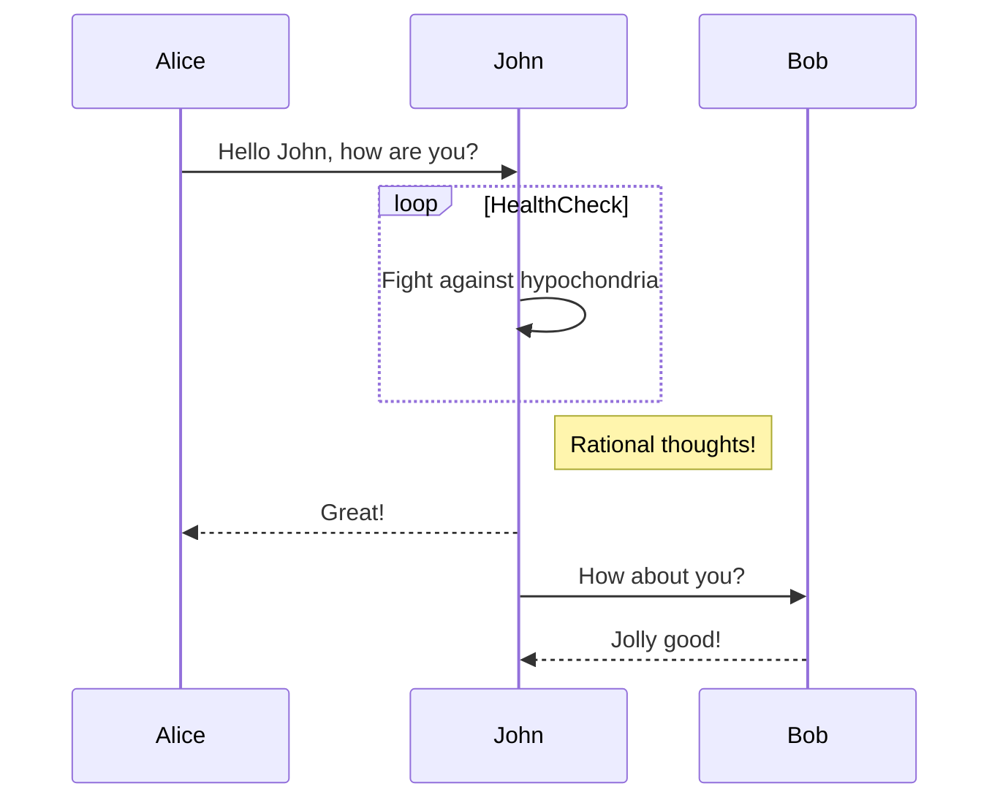
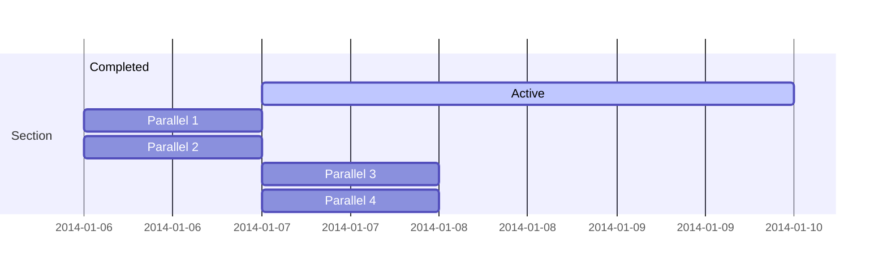
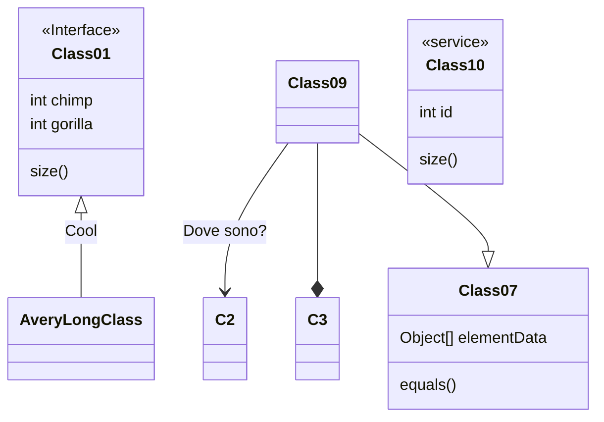
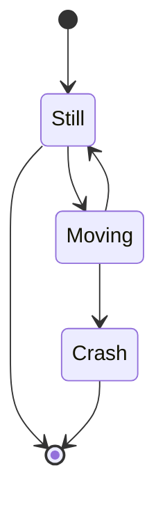
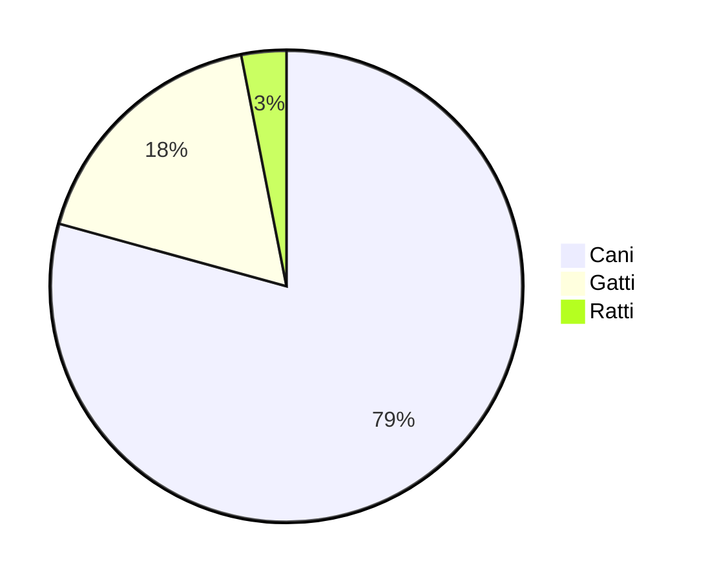
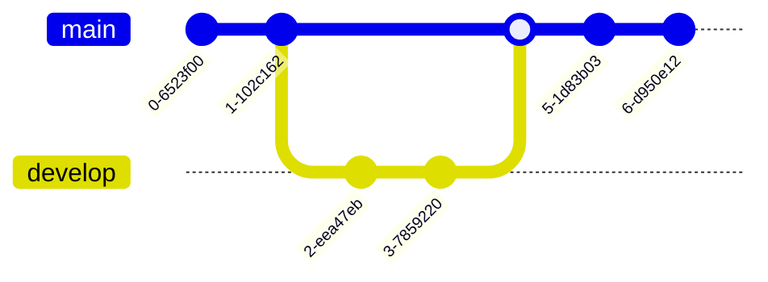

```mermaid
gantt
    title Git Issues - giorni dall'ultimo aggiornamento
    dateFormat  X
    axisFormat %s

    section Issue19062
    71   : 0, 71
    section Issue19401
    36   : 0, 36
    section Issue193
    34   : 0, 34
    section Issue7441
    9    : 0, 9
    section Issue1300
    5    : 0, 5
```

```mermaid
  journey
    title La mia giornata lavorativa
    section Andare al lavoro
      Preparare il tè: 5: Io
      Salire le scale: 3: Io
      Lavorare: 1: Io, Gatto
    section Tornare a casa
      Scendere le scale: 5: Io
      Sedersi: 3: Io
```

<p align="center">

</p>
<h1 align="center">
Mermaid
</h1>
<p align="center">
Genera diagrammi da testo simile a markdown.
<p>
<p align="center">
  <a href="https://www.npmjs.com/package/mermaid"></a>
<p>

<p align="center">
<a href="https://mermaid.live/"><b>Editor Live!</b></a>
</p>
<p align="center">
 <a href="https://mermaid.js.org">📖 Documentazione</a> | <a href="https://mermaid.js.org/intro/">🚀 Inizia Subito</a> | <a href="https://www.jsdelivr.com/package/npm/mermaid">🌐 CDN</a> | <a href="https://discord.gg/sKeNQX4Wtj" title="Invito Discord">🙌 Unisciti a Noi</a>
</p>
<p align="center">
<a href="./README.zh-CN.md">简体中文</a>
</p>
<p align="center">
Prova le anteprime dell'Editor Live delle future release: <a href="https://develop.git.mermaid.live/" title="Prova la versione di mermaid dal ramo develop.">Develop</a> | <a href="https://next.git.mermaid.live/" title="Prova la versione di mermaid dal ramo next.">Next</a>
</p>

<br>
<br>

[](https://www.npmjs.com/package/mermaid)
[](https://github.com/mermaid-js/mermaid/actions/workflows/build.yml)
[](https://bundlephobia.com/package/mermaid)
[](https://app.codecov.io/github/mermaid-js/mermaid/tree/develop)
[](https://www.jsdelivr.com/package/npm/mermaid)
[](https://www.npmjs.com/package/mermaid)
[](https://discord.gg/sKeNQX4Wtj)
[](https://twitter.com/mermaidjs_)
[](https://argos-ci.com?utm_source=mermaid&utm_campaign=oss)
[](https://securityscorecards.dev/viewer/?uri=github.com/mermaid-js/mermaid)


:trophy: **Mermaid è stato nominato e ha vinto i [JS Open Source Awards (2019)](https://osawards.com/javascript/2019) nella categoria "The most exciting use of technology"!!!**

**Grazie a tutti coloro che hanno partecipato, a chi ha fatto pull request, a chi risponde alle domande! 🙏**

<a href="https://mermaid.js.org/landing/"></a>

## Indice

<details>
<summary>Espandi contenuti</summary>

- [Informazioni](#about)
- [Esempi](#examples)
- [Release](#release)
- [Progetti correlati](#related-projects)
- [Contributori](#contributors---)
- [Sicurezza e diagrammi sicuri](#security-and-safe-diagrams)
- [Segnalazione vulnerabilità](#reporting-vulnerabilities)
- [Ringraziamenti](#appreciation)

</details>

## Informazioni

<!-- <Main description>   -->

Mermaid è uno strumento di diagrammazione e creazione di grafici basato su JavaScript che utilizza definizioni testuali ispirate a Markdown e un renderer per creare e modificare diagrammi complessi. Lo scopo principale di Mermaid è aiutare la documentazione a tenere il passo con lo sviluppo.

> Il "Doc-Rot" è un circolo vizioso che Mermaid aiuta a risolvere.

La creazione di diagrammi e la documentazione richiedono tempo prezioso agli sviluppatori e diventano rapidamente obsolete.
Ma non avere diagrammi o documenti danneggia la produttività e ostacola l'apprendimento organizzativo.<br/>
Mermaid affronta questo problema permettendo agli utenti di creare diagrammi facilmente modificabili. Può anche essere integrato nei script di produzione (e in altre parti del codice).<br/>
<br/>

Mermaid permette anche ai non programmatori di creare facilmente diagrammi dettagliati tramite il [Mermaid Live Editor](https://mermaid.live/).<br/>
Per tutorial video, visita la nostra pagina [Tutorials](https://mermaid.js.org/ecosystem/tutorials.html).
Usa Mermaid con le tue applicazioni preferite, consulta l'elenco di [Integrazioni e Utilizzi di Mermaid](https://mermaid.js.org/ecosystem/integrations-community.html).

Puoi anche utilizzare Mermaid all'interno di [GitHub](https://github.blog/2022-02-14-include-diagrams-markdown-files-mermaid/) così come in molte altre applicazioni preferite—consulta l'elenco di [Integrazioni e Utilizzi di Mermaid](https://mermaid.js.org/ecosystem/integrations-community.html).

Per una introduzione più dettagliata a Mermaid e ad alcuni dei suoi usi più basilari, consulta la [Guida per principianti](https://mermaid.js.org/intro/getting-started.html), [Utilizzo](https://mermaid.js.org/config/usage.html) e [Tutorials](https://mermaid.js.org/ecosystem/tutorials.html).

I nostri test di regressione visiva per le PR sono alimentati da [Argos](https://argos-ci.com/?utm_source=mermaid&utm_campaign=oss) grazie al loro generoso piano Open Source. Rende il processo di revisione delle PR con cambiamenti visivi molto semplice.

[](https://argos-ci.com?utm_source=mermaid&utm_campaign=oss)

Nel nostro processo di rilascio ci affidiamo molto ai test di regressione visiva usando [applitools](https://applitools.com/). Applitools è un ottimo servizio che è stato facile da usare e integrare nei nostri test.

<a href="https://applitools.com/">
<svg width="170" height="32" viewBox="0 0 170 32" fill="none" xmlns="http://www.w3.org/2000/svg"><mask id="a" maskUnits="userSpaceOnUse" x="27" y="0" width="143" height="32"><path fill-rule="evenodd" clip-rule="evenodd" d="M27.732.227h141.391v31.19H27.733V.227z" fill="#fff"></path></mask><g mask="url(#a)"><path fill-rule="evenodd" clip-rule="evenodd" d="M153.851 22.562l1.971-3.298c1.291 1.219 3.837 2.402 5.988 2.402 1.971 0 2.903-.753 2.903-1.829 0-2.832-10.253-.502-10.253-7.313 0-2.904 2.51-5.45 7.099-5.45 2.904 0 5.234 1.004 6.955 2.367l-1.829 3.226c-1.039-1.075-3.011-2.008-5.126-2.008-1.65 0-2.725.717-2.725 1.685 0 2.546 10.289.395 10.289 7.386 0 3.19-2.724 5.52-7.528 5.52-3.012 0-5.916-1.003-7.744-2.688zm-5.7 2.259h4.553V.908h-4.553v23.913zm-6.273-8.676c0-2.689-1.578-5.02-4.446-5.02-2.832 0-4.409 2.331-4.409 5.02 0 2.724 1.577 5.055 4.409 5.055 2.868 0 4.446-2.33 4.446-5.055zm-13.588 0c0-4.912 3.442-9.07 9.142-9.07 5.736 0 9.178 4.158 9.178 9.07 0 4.911-3.442 9.106-9.178 9.106-5.7 0-9.142-4.195-9.142-9.106zm-5.628 0c0-2.689-1.577-5.02-4.445-5.02-2.832 0-4.41 2.331-4.41 5.02 0 2.724 1.578 5.055 4.41 5.055 2.868 0 4.445-2.33 4.445-5.055zm-13.587 0c0-4.912 3.441-9.07 9.142-9.07 5.736 0 9.178 4.158 9.178 9.07 0 4.911-3.442 9.106-9.178 9.106-5.701 0-9.142-4.195-9.142-9.106zm-8.425 4.338v-8.999h-2.868v-3.98h2.868V2.773h4.553v4.733h3.514v3.979h-3.514v7.78c0 1.111.574 1.936 1.578 1.936.681 0 1.326-.251 1.577-.538l.968 3.478c-.681.609-1.9 1.11-3.8 1.11-3.191 0-4.876-1.648-4.876-4.767zm-8.962 4.338h4.553V7.505h-4.553V24.82zm-.43-21.905a2.685 2.685 0 012.688-2.69c1.506 0 2.725 1.184 2.725 2.69a2.724 2.724 0 01-2.725 2.724c-1.47 0-2.688-1.219-2.688-2.724zM84.482 24.82h4.553V.908h-4.553v23.913zm-6.165-8.676c0-2.976-1.793-5.02-4.41-5.02-1.47 0-3.119.825-3.908 1.973v6.094c.753 1.111 2.438 2.008 3.908 2.008 2.617 0 4.41-2.044 4.41-5.055zm-8.318 6.453v8.82h-4.553V7.504H70v2.187c1.327-1.685 3.227-2.618 5.342-2.618 4.446 0 7.672 3.299 7.672 9.07 0 5.773-3.226 9.107-7.672 9.107-2.043 0-3.907-.86-5.342-2.653zm-10.718-6.453c0-2.976-1.793-5.02-4.41-5.02-1.47 0-3.119.825-3.908 1.973v6.094c.753 1.111 2.438 2.008 3.908 2.008 2.617 0 4.41-2.044 4.41-5.055zm-8.318 6.453v8.82H46.41V7.504h4.553v2.187c1.327-1.685 3.227-2.618 5.342-2.618 4.446 0 7.672 3.299 7.672 9.07 0 5.773-3.226 9.107-7.672 9.107-2.043 0-3.908-.86-5.342-2.653zm-11.758-1.936V18.51c-.753-1.004-2.187-1.542-3.657-1.542-1.793 0-3.263.968-3.263 2.617 0 1.65 1.47 2.582 3.263 2.582 1.47 0 2.904-.502 3.657-1.506zm0 4.159v-1.829c-1.183 1.434-3.227 2.259-5.485 2.259-2.761 0-5.988-1.864-5.988-5.736 0-4.087 3.227-5.593 5.988-5.593 2.33 0 4.337.753 5.485 2.115V13.85c0-1.756-1.506-2.904-3.8-2.904-1.829 0-3.55.717-4.984 2.044L28.63 9.8c2.115-1.901 4.84-2.726 7.564-2.726 3.98 0 7.6 1.578 7.6 6.561v11.186h-4.588z" fill="#00A298"></path></g><path fill-rule="evenodd" clip-rule="evenodd" d="M14.934 16.177c0 1.287-.136 2.541-.391 3.752-1.666-1.039-3.87-2.288-6.777-3.752 2.907-1.465 5.11-2.714 6.777-3.753.255 1.211.39 2.466.39 3.753m4.6-7.666V4.486a78.064 78.064 0 01-4.336 3.567c-1.551-2.367-3.533-4.038-6.14-5.207C11.1 4.658 12.504 6.7 13.564 9.262 5.35 15.155 0 16.177 0 16.177s5.35 1.021 13.564 6.915c-1.06 2.563-2.463 4.603-4.507 6.415 2.607-1.169 4.589-2.84 6.14-5.207a77.978 77.978 0 014.336 3.568v-4.025s-.492-.82-2.846-2.492c.6-1.611.93-3.354.93-5.174a14.8 14.8 0 00-.93-5.174c2.354-1.673 2.846-2.492 2.846-2.492" fill="#00A298"></path></svg>
</a>

<!-- </Main description> -->

## Mermaid AI Bot

Il Bot di [Mermaid](https://codeparrot.ai/oracle?owner=mermaid-js&repo=mermaid) ti aiuterà a comprendere meglio questo repository. Puoi chiedere esempi di codice, guida all'installazione, aiuto per il debug e molto altro.

## Esempi

**Quelli che seguono sono alcuni esempi di diagrammi, grafici e chart che si possono realizzare con Mermaid. Clicca qui per saltare direttamente alla [sintassi testuale](https://mermaid.js.org/intro/syntax-reference.html).**

<!-- <Flowchart> -->

### Diagramma di flusso [<a href="https://mermaid.js.org/syntax/flowchart.html">docs</a> - <a href="https://mermaid.live/edit#pako:eNpNkMtqwzAQRX9FzKqFJK7t1km8KDQP6KJQSLOLvZhIY1tgS0GWmgbb_165IaFaiXvOFTPqgGtBkEJR6zOv0Fj2scsU8-ft8I5G5Gw6fe339GN7tnrYaafE45WvRsLW3Ya4bKVWwzVe_xU-FfVsc9hR62rLwvw_2591z7Y3FuUwgYZMg1L4ObrRzMBW1FAGqb8KKtCLGWRq8Ko7CbS0FdJqA2mBdUsTQGf110VxSK1xdJM2EkuDzd2qNQrypQ7s5TQuXcrW-ie5VoUsx9yZ2seVtac2DYIRz0ppK3eccd0ErRTjD1XfyyRIomSBUUzJPMaXOBb8GC4XRfQcFmL-FEYIwzD8AggvcHE">editor live</a>]

```
flowchart LR

A[Hard] -->|Text| B(Round)
B --> C{Decision}
C -->|One| D[Result 1]
C -->|Two| E[Result 2]
```



### Diagramma di sequenza [<a href="https://mermaid.js.org/syntax/sequenceDiagram.html">docs</a> - <a href="https://mermaid.live/edit#pako:eNo9kMluwjAQhl_F-AykQMuSA1WrbuLQQ3v1ZbAnsVXHkzrjVhHi3etQwKfRv4w-z0FqMihL2eF3wqDxyUEdoVHhwTuNk-12RzaU4g29JzHMY2HpV0BE0VO6V8ETtdkGz1Zb1F8qiPyG5LX84mrLAmpwoWNh-5a0pWCiAxUwGBXeiVHEU4oq8V_6AHYUwAu2lLLTjVQ4bc1rT2yleI0IfJG320faZ9ABbk-Jz3hZnFxBduR9L2oiM5Jj2WBswJn8-cMArSRbbFDJMo8GK0ielVThmKOpNcD4bBxTlGUFvsOxhMT02QctS44JL6HzAS-iJzCYOwfJfTscunYd542aQuXqQU_RZ9kyt11ZFIM9rR3btJ9qaorOGQuR7c9mWSznyzXMF7hcLeBusTB6P9usq_ntrDKrm9kc5PF4_AMJE56Z">editor live</a>]

```
sequenceDiagram
Alice->>John: Hello John, how are you?
loop HealthCheck
    John->>John: Fight against hypochondria
end
Note right of John: Rational thoughts!
John-->>Alice: Great!
John->>Bob: How about you?
Bob-->>John: Jolly good!
```



### Diagramma di Gantt [<a href="https://mermaid.js.org/syntax/gantt.html">docs</a> - <a href="https://mermaid.live/edit#pako:eNp90cGOgyAQBuBXIZxtFbG29bbZ3fsmvXKZylhJEAyOTZrGd1_sto3xsHMBhu-HBO689hp5xS_giJQbsCbjHTv9jcp9-q63SKhZpb3DhMXSOIiE5ZkoNpnYZGXynh6U-4jBK7JnVfBYJo9QvgjtEya1cj8QwFq0TMz4lZqxTBg0hOF5m1jifI2Lf7Bc490CyxUu1rhc4GLGPOEdhg6Mjq92V44xxanFDhWv4lRjA6MlxZWbIh17DYTf2pAPvGrADphwGMmfbq7mFYURX-jLwCVA91bWg8YYunO69Y8vMgPFI2vvGnOZ-2Owsd0S9UOVpvP29mKoHc_b2nfpYHQLgdrrsUzLvDxALrHcS9hJqeuzOB6avBCN3mciBz5N0y_wxZ0J">editor live</a>]

```
gantt
    section Section
    Completed :done,    des1, 2014-01-06,2014-01-08
    Active        :active,  des2, 2014-01-07, 3d
    Parallel 1   :         des3, after des1, 1d
    Parallel 2   :         des4, after des1, 1d
    Parallel 3   :         des5, after des3, 1d
    Parallel 4   :         des6, after des4, 1d
```



### Diagramma delle classi [<a href="https://mermaid.js.org/syntax/classDiagram.html">docs</a> - <a href="https://mermaid.live/edit#pako:eNpdkTFPwzAQhf-K5QlQ2zQJJG1UBaGWDYmBgYEwXO1LYuTEwXYqlZL_jt02asXm--690zvfgTLFkWaUSTBmI6DS0BTt2lfzkKx-p1PytEO9f1FtdaQkI2ulZNGuVqK1qEtgmOfk7BitSzKdOhg59XuNGgk0RDxed-_IOr6uf8cZ6UhTZ8bvHqS5ub1mr9svZPbjk6DEBlu7AQuXyBkx4gcvDk9cUMJq0XT_YaW0kNK5j-ufAoRzcihaQvLcoN4Jv50vvVxw_xrnD3RCG9QNCO4-8OgpqK1dpoJm7smxhF7agp6kfcfB4jMXVmmalW4tnFDorXrbt4xmVvc4is53GKFUwNF5DtTuO3-sShjrJjLVlqLyvNfS4drazmRB4NuzSti6386YagIjeA3a1rtlEiRRsoAoxiSN4SGOOduGy0UZ3YclT-dhBHQYhj8dc6_I">editor live</a>]

```
classDiagram
Class01 <|-- AveryLongClass : Cool
<<Interface>> Class01
Class09 --> C2 : Where am I?
Class09 --* C3
Class09 --|> Class07
Class07 : equals()
Class07 : Object[] elementData
Class01 : size()
Class01 : int chimp
Class01 : int gorilla
class Class10 {
  <<service>>
  int id
  size()
}

```



### Diagramma degli stati [<a href="https://mermaid.js.org/syntax/stateDiagram.html">docs</a> - <a href="https://mermaid.live/edit#pako:eNpdkEFvgzAMhf8K8nEqpYSNthx22Xbcqcexg0sCiZQQlDhIFeK_L8A6TfXp6fOz9ewJGssFVOAJSbwr7ByadGR1n8T6evpO0vQ1uZDSekOrXGFsPqJPO6q-2-imH8f_0TeHXm50lfelsAMjnEHFY6xpMdRAUhhRQxUlFy0GTTXU_RytYeAx-AdXZB1ULWovdoCB7OXWN1CRC-Ju-r3uz6UtchGHJqDbsPygU57iysb2reoWHpyOWBINvsqypb3vFMlw3TfWZF5xiY7keC6zkpUnZIUojwW-FAVvrvn51LLnvOXHQ84Q5nn-AVtLcwk">live editor</a>]

```
stateDiagram-v2
[*] --> Still
Still --> [*]
Still --> Moving
Moving --> Still
Moving --> Crash
Crash --> [*]
```



### Diagramma a torta [<a href="https://mermaid.js.org/syntax/pie.html">docs</a> - <a href="https://mermaid.live/edit#pako:eNo9jsFugzAMhl8F-VzBgEEh13Uv0F1zcYkTIpEEBadShXj3BU3dzf_n77e8wxQUgYDVkvQSbsFsEgpRtEN_5i_kvzx05XiC-xvUHVzAUXRoVe7v0heFBJ7JkQSRR0Ua08ISpD-ymlaFTN_KcoggNC4bXQATh5-Xn0BwTPSWbhZNRPdvLQEV5dIO_FrPZ43dOJ-cgtfWnDzFJeOZed1EVZ3r0lie06Ocgqs2q2aMPD_HvuqbfsCmpf7aYte2anrU46Cbz1qr60fdIBzH8QvW9lkl">live editor</a>]

```
pie
"Cani" : 386
"Gatti" : 85.9
"Ratti" : 15
```



### Diagramma Git graph [sperimentale - <a href="https://mermaid.live/edit#pako:eNqNkMFugzAMhl8F-VyVAR1tOW_aA-zKxSSGRCMJCk6lCvHuNZPKZdM0n-zf3_8r8QIqaIIGMqnB8kfEybQ--y4VnLP8-9RF9Mpkmm40hmlnDKmvkPiH_kfS7nFo_VN0FAf6XwocQGgxa_nGsm1bYEOOWmik1dRjGrmF1q-Cpkkj07u2HCI0PY4zHQATh8-7V9BwTPSE3iwOEd1OjQE1iWkBvk_bzQY7s0Sq4Hs7bHqKo8iGeZqbPN_WR7mpSd1RHpvPVhuMbG7XOq_L-oJlRfW5wteq0qorrpe-PBW9Pr8UJcK6rg-BLYPQ">live editor</a>]

```
gitGraph
  commit
  commit
  branch develop
  checkout develop
  commit
  commit
  checkout main
  merge develop
  commit
  commit
```



### Diagramma a barre (usando il diagramma gantt) [<a href="https://mermaid.js.org/syntax/gantt.html">docs</a> - <a href="https://mermaid.live/edit#pako:eNptkU1vhCAQhv8KIenNugiI4rkf6bmXpvEyFVxJFDYyNt1u9r8X63Z7WQ9m5pknLzieaBeMpQ3dg0dsPUkPOhwteXZIXmJcbCT3xMAxkuh8Z8kIEclyMIB209fqKcwTICFvG4IvFy_oLrZ-g9F26ILfQgvNFN94VaRXQ1iWqpumZBcu1J8p1E1TXDx59eQNr5LyEqjJn6hv5QnGNlxevZJmdLLpy5xJSzut45biYCfb0iaVxvawjNjS1p-TCguG16PvaIPzYjO67e3BwX6GiTY9jPFKH43DMF_hGMDY1J4oHg-_f8hFTJFd8L3br3yZx4QHxENsdrt1nO8dDstH3oVpF50ZYMbhU6ud4qoGLqyqBJRCmO6j0HXPZdGbihUc6Pmc0QP49xD-b5X69ZQv2gjO81IwzWqhC1lKrjJ6pA3nVS7SMiVjrKirWlYp5fs3osgrWeo00lorLWvOzz8JVbXm">live editor</a>]

```
gantt
    title Git Issues - giorni dall'ultimo aggiornamento
    dateFormat  X
    axisFormat %s

    section Issue19062
    71   : 0, 71
    section Issue19401
    36   : 0, 36
    section Issue193
    34   : 0, 34
    section Issue7441
    9    : 0, 9
    section Issue1300
    5    : 0, 5
```



### Diagramma User Journey [<a href="https://mermaid.js.org/syntax/userJourney.html">docs</a> - <a href="https://mermaid.live/edit#pako:eNplkMFuwjAQRH9l5TMiTVIC-FqqnjhxzWWJN4khsSN7XRSh_HsdKBVt97R6Mzsj-yoqq0hIAXCywRkaSwNxWHNHsB_hYt1ZmwYUfiueKtbWwIcFtjf5zgH2eCZgQgkrCXt64GgMg2fUzkvIn5Xd_V5COtMFvCH_62ht_5yk7MU8sn61HDTfxD8VYiF6cj1qFd94nWkpuKWYKWRcFdUYOi5FaaZoDYNCpnel2Toha-w8LQQGtofRVEKyC_Qw7TQ2DvsfV2dRUTy6Ch6H-UMb7TlGVtbUupl5cF3ELfPgZZLM8rLR3IbjsrJ94rVq0XH7uS2SIis2mOVUrHNc5bmqjul2U2evaa3WL2mGYpqmL2BGiho">live editor</a>]

```
  journey
    title La mia giornata lavorativa
    section Andare al lavoro
      Preparare il tè: 5: Io
      Salire le scale: 3: Io
      Lavorare: 1: Io, Gatto
    section Tornare a casa
      Scendere le scale: 5: Io
      Sedersi: 3: Io
```



### Diagramma C4 [<a href="https://mermaid.js.org/syntax/c4.html">docs</a>]

```
C4Context
title Diagramma di contesto del sistema per Internet Banking System

Person(customerA, "Cliente bancario A", "Un cliente della banca, con conti bancari personali.")
Person(customerB, "Cliente bancario B")
Person_Ext(customerC, "Cliente bancario C")
System(SystemAA, "Sistema di Internet Banking", "Permette ai clienti di visualizzare informazioni sui propri conti bancari e di effettuare pagamenti.")

Person(customerD, "Cliente bancario D", "Un cliente della banca, <br/> con conti bancari personali.")

Enterprise_Boundary(b1, "BankBoundary") {

  SystemDb_Ext(SystemE, "Mainframe Banking System", "Memorizza tutte le informazioni bancarie principali su clienti, conti, transazioni, ecc.")

  System_Boundary(b2, "BankBoundary2") {
    System(SystemA, "Sistema Bancario A")
    System(SystemB, "Sistema Bancario B", "Un sistema della banca, con conti bancari personali.")
  }

  System_Ext(SystemC, "Sistema di posta elettronica", "Il sistema interno di posta elettronica Microsoft Exchange.")
  SystemDb(SystemD, "Database Sistema Bancario D", "Un sistema della banca, con conti bancari personali.")

  Boundary(b3, "BankBoundary3", "boundary") {
    SystemQueue(SystemF, "Coda Sistema Bancario F", "Un sistema della banca, con conti bancari personali.")
    SystemQueue_Ext(SystemG, "Coda Sistema Bancario G", "Un sistema della banca, con conti bancari personali.")
  }
}

BiRel(customerA, SystemAA, "Usa")
BiRel(SystemAA, SystemE, "Usa")
Rel(SystemAA, SystemC, "Invia e-mail", "SMTP")
Rel(SystemC, customerA, "Invia e-mail a")
```

```mermaid
C4Context
title Diagramma di contesto del sistema per Internet Banking System

Person(customerA, "Cliente bancario A", "Un cliente della banca, con conti bancari personali.")
Person(customerB, "Cliente bancario B")
Person_Ext(customerC, "Cliente bancario C")
System(SystemAA, "Sistema di Internet Banking", "Permette ai clienti di visualizzare informazioni sui propri conti bancari e di effettuare pagamenti.")

Person(customerD, "Cliente bancario D", "Un cliente della banca, <br/> con conti bancari personali.")

Enterprise_Boundary(b1, "BankBoundary") {
```markdown
  SystemDb_Ext(SystemE, "Mainframe Banking System", "Memorizza tutte le informazioni bancarie principali su clienti, conti, transazioni, ecc.")

  System_Boundary(b2, "BankBoundary2") {
    System(SystemA, "Sistema Bancario A")
    System(SystemB, "Sistema Bancario B", "Un sistema della banca, con conti bancari personali.")
  }

  System_Ext(SystemC, "Sistema E-mail", "Il sistema interno di posta elettronica Microsoft Exchange.")
  SystemDb(SystemD, "Database Sistema Bancario D", "Un sistema della banca, con conti bancari personali.")

  Boundary(b3, "BankBoundary3", "boundary") {
    SystemQueue(SystemF, "Coda Sistema Bancario F", "Un sistema della banca, con conti bancari personali.")
    SystemQueue_Ext(SystemG, "Coda Sistema Bancario G", "Un sistema della banca, con conti bancari personali.")
  }
}

BiRel(customerA, SystemAA, "Usa")
BiRel(SystemAA, SystemE, "Usa")
Rel(SystemAA, SystemC, "Invia e-mail", "SMTP")
Rel(SystemC, customerA, "Invia e-mail a")
```

## Rilascio

Per chi ha il permesso di farlo:

Aggiorna il numero di versione in `package.json`.

```sh
npm publish
```

Il comando sopra genera i file nella cartella `dist` e li pubblica su <https://www.npmjs.com>.

## Progetti correlati

- [Interfaccia a riga di comando](https://github.com/mermaid-js/mermaid-cli)
- [Editor Live](https://github.com/mermaid-js/mermaid-live-editor)
- [Server HTTP](https://github.com/TomWright/mermaid-server)

## Contributori [](https://github.com/mermaid-js/mermaid/issues?q=is%3Aissue+is%3Aopen+label%3A%22Good+first+issue%21%22) [](https://github.com/mermaid-js/mermaid/graphs/contributors) [](https://github.com/mermaid-js/mermaid/graphs/contributors)

Mermaid è una comunità in crescita ed è sempre aperta a nuovi contributori. Ci sono molti modi diversi per aiutare e siamo sempre alla ricerca di una mano in più! Consulta [questo issue](https://github.com/mermaid-js/mermaid/issues/866) se vuoi sapere da dove iniziare a dare una mano.

Informazioni dettagliate su come contribuire si trovano nella [guida ai contributi](https://mermaid.js.org/community/contributing.html)

## Sicurezza e diagrammi sicuri

Per i siti pubblici, può essere rischioso recuperare testo dagli utenti su Internet, memorizzando quel contenuto per la presentazione successiva in un browser. Il motivo è che il contenuto dell’utente può contenere script dannosi incorporati che verranno eseguiti quando i dati vengono presentati. Per Mermaid questo è un rischio, specialmente poiché i diagrammi Mermaid contengono molti caratteri usati in html, il che rende inutilizzabile la sanificazione standard in quanto danneggia anche i diagrammi. Continuiamo comunque a sanificare il codice in ingresso e a perfezionare il processo, ma è difficile garantire che non ci siano falle.

Come livello di sicurezza aggiuntivo per i siti con utenti esterni, siamo lieti di introdurre un nuovo livello di sicurezza in cui il diagramma viene renderizzato in un iframe sandbox, impedendo l’esecuzione di javascript nel codice. Questo rappresenta un grande passo avanti per una maggiore sicurezza.

_Sfortunatamente non si può avere la botte piena e la moglie ubriaca, il che in questo caso significa che alcune funzionalità interattive vengono bloccate insieme al possibile codice dannoso._

## Segnalazione delle vulnerabilità

Per segnalare una vulnerabilità, invia una e-mail a <security@mermaid.live> con una descrizione del problema, i passaggi effettuati per creare il problema, le versioni interessate e, se note, le mitigazioni per il problema.

## Ringraziamenti

Una breve nota da Knut Sveidqvist:

> _Molte grazie ai progetti [d3](https://d3js.org/) e [dagre-d3](https://github.com/cpettitt/dagre-d3) per aver fornito le librerie di layout e disegno grafico!_
>
> _Grazie anche al progetto [js-sequence-diagram](https://bramp.github.io/js-sequence-diagrams) per l’uso della grammatica per i diagrammi di sequenza. Grazie a Jessica Peter per l’ispirazione e il punto di partenza per il rendering dei diagrammi di Gantt._
>
> _Grazie a [Tyler Long](https://github.com/tylerlong) che è stato collaboratore dall'aprile 2017._
>
> _Grazie all’elenco sempre crescente di [contributori](https://github.com/mermaid-js/mermaid/graphs/contributors) che hanno portato il progetto fino a qui!_

---

_Mermaid è stato creato da Knut Sveidqvist per una documentazione più semplice._
```


---



Tranlated By [Open Ai Tx](https://github.com/OpenAiTx/OpenAiTx) | Last indexed: 2025-06-12


---