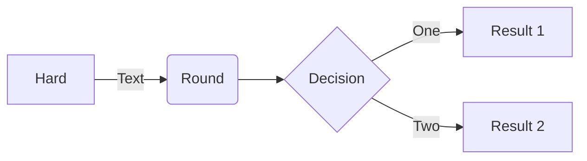
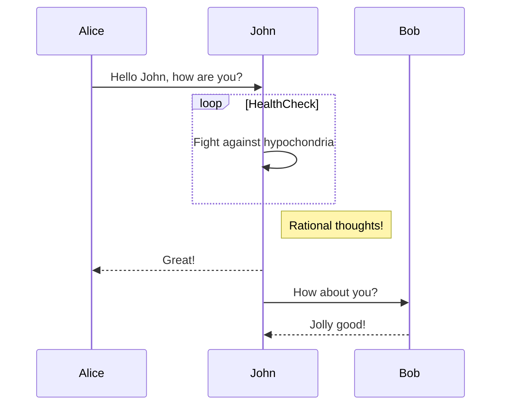
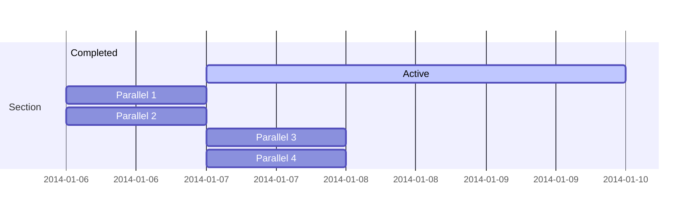
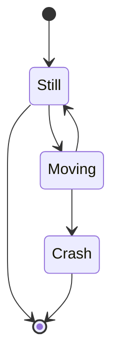
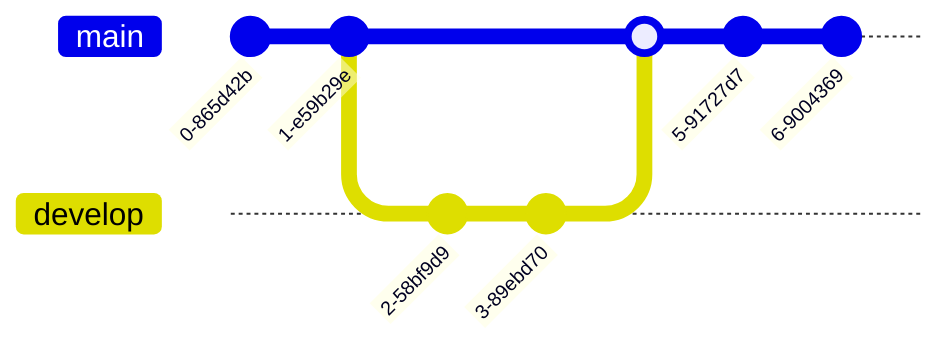

```mermaid
pie
"犬" : 386
"猫" : 85.9
"ネズミ" : 15
```

```mermaid
gantt
    title Git Issues - 最終更新からの日数
    dateFormat  X
    axisFormat %s

    section Issue19062
    71   : 0, 71
    section Issue19401
    36   : 0, 36
    section Issue193
    34   : 0, 34
    section Issue7441
    9    : 0, 9
    section Issue1300
    5    : 0, 5
```

```mermaid
  journey
    title 私の仕事の日
    section 出勤
      お茶を作る: 5: 私
      階段を上る: 3: 私
      仕事をする: 1: 私, 猫
    section 帰宅
      階段を下りる: 5: 私
      座る: 3: 私
```

<p align="center">

</p>
<h1 align="center">
Mermaid
</h1>
<p align="center">
マークダウン風のテキストからダイアグラムを生成します。
<p>
<p align="center">
  <a href="https://www.npmjs.com/package/mermaid"></a>
<p>

<p align="center">
<a href="https://mermaid.live/"><b>ライブエディタ！</b></a>
</p>
<p align="center">
 <a href="https://mermaid.js.org">📖 ドキュメント</a> | <a href="https://mermaid.js.org/intro/">🚀 はじめに</a> | <a href="https://www.jsdelivr.com/package/npm/mermaid">🌐 CDN</a> | <a href="https://discord.gg/sKeNQX4Wtj" title="Discord invite">🙌 参加する</a>
</p>
<p align="center">
<a href="./README.zh-CN.md">简体中文</a>
</p>
<p align="center">
将来のリリースのライブエディタプレビューを試す: <a href="https://develop.git.mermaid.live/" title="Try the mermaid version from the develop branch.">Develop</a> | <a href="https://next.git.mermaid.live/" title="Try the mermaid version from the next branch.">Next</a>
</p>

<br>
<br>

[](https://www.npmjs.com/package/mermaid)
[](https://github.com/mermaid-js/mermaid/actions/workflows/build.yml)
[](https://bundlephobia.com/package/mermaid)
[](https://app.codecov.io/github/mermaid-js/mermaid/tree/develop)
[](https://www.jsdelivr.com/package/npm/mermaid)
[](https://www.npmjs.com/package/mermaid)
[](https://discord.gg/sKeNQX4Wtj)
[](https://twitter.com/mermaidjs_)
[](https://argos-ci.com?utm_source=mermaid&utm_campaign=oss)
[](https://securityscorecards.dev/viewer/?uri=github.com/mermaid-js/mermaid)


:trophy: **Mermaidは [JS Open Source Awards (2019)](https://osawards.com/javascript/2019) の「最もエキサイティングな技術活用」カテゴリでノミネート・受賞されました!!!**

**関係者の皆様、プルリクエストに貢献してくださった方々、質問に答えてくださった方々に感謝します！🙏**

<a href="https://mermaid.js.org/landing/"></a>

## 目次

<details>
<summary>内容を展開</summary>

- [概要](#about)
- [例](#examples)
- [リリース](#release)
- [関連プロジェクト](#related-projects)
- [貢献者](#contributors---)
- [セキュリティと安全なダイアグラム](#security-and-safe-diagrams)
- [脆弱性の報告](#reporting-vulnerabilities)
- [謝辞](#appreciation)

</details>

## 概要

<!-- <Main description>   -->

Mermaidは、Markdown風テキスト定義とレンダラーを用いて複雑なダイアグラムを作成・編集できるJavaScriptベースのダイアグラムおよびチャート作成ツールです。Mermaidの主な目的は、ドキュメントが開発に追いつくのを支援することです。

> ドキュメントの陳腐化（Doc-Rot）は、Mermaidが解決を助けるキャッチ22です。

ダイアグラム作成やドキュメント化は開発者の貴重な時間を奪い、すぐに古くなります。
しかし、ダイアグラムやドキュメントがなければ生産性が落ち、組織の学習にも悪影響を及ぼします。<br/>
Mermaidは、ユーザーが簡単に修正できるダイアグラムの作成を可能にすることで、この問題に対処します。また、Mermaidは本番スクリプト（や他のコード）にも組み込むことができます。<br/>
<br/>

Mermaidは、プログラミング経験のない方でも[Mermaidライブエディタ](https://mermaid.live/)を使って簡単に詳細なダイアグラムを作成できます。<br/>
ビデオチュートリアルは[チュートリアル](https://mermaid.js.org/ecosystem/tutorials.html)ページをご覧ください。
お好きなアプリケーションでMermaidを使うには、[Mermaidの連携・利用例一覧](https://mermaid.js.org/ecosystem/integrations-community.html)をご確認ください。

[GitHub](https://github.blog/2022-02-14-include-diagrams-markdown-files-mermaid/)をはじめ、多くのお気に入りのアプリケーション内でもMermaidを利用できます。[Mermaidの連携・利用例一覧](https://mermaid.js.org/ecosystem/integrations-community.html)もぜひご覧ください。

Mermaidのより詳しい紹介や基本的な使い方については、[ビギナーズガイド](https://mermaid.js.org/intro/getting-started.html)、[利用方法](https://mermaid.js.org/config/usage.html)、[チュートリアル](https://mermaid.js.org/ecosystem/tutorials.html)をご覧ください。

PRのビジュアルリグレッションテストは、[Argos](https://argos-ci.com/?utm_source=mermaid&utm_campaign=oss) の寛大なオープンソースプランによって提供されています。これにより、ビジュアル変更を伴うPRのレビューが非常に簡単になります。

[](https://argos-ci.com?utm_source=mermaid&utm_campaign=oss)

私たちのリリースプロセスでは、[applitools](https://applitools.com/) を使ったビジュアルリグレッションテストに大きく依存しています。Applitoolsは使いやすく、テストへの統合も容易な素晴らしいサービスです。

<a href="https://applitools.com/">
<svg width="170" height="32" viewBox="0 0 170 32" fill="none" xmlns="http://www.w3.org/2000/svg"><mask id="a" maskUnits="userSpaceOnUse" x="27" y="0" width="143" height="32"><path fill-rule="evenodd" clip-rule="evenodd" d="M27.732.227h141.391v31.19H27.733V.227z" fill="#fff"></path></mask><g mask="url(#a)"><path fill-rule="evenodd" clip-rule="evenodd" d="M153.851 22.562l1.971-3.298c1.291 1.219 3.837 2.402 5.988 2.402 1.971 0 2.903-.753 2.903-1.829 0-2.832-10.253-.502-10.253-7.313 0-2.904 2.51-5.45 7.099-5.45 2.904 0 5.234 1.004 6.955 2.367l-1.829 3.226c-1.039-1.075-3.011-2.008-5.126-2.008-1.65 0-2.725.717-2.725 1.685 0 2.546 10.289.395 10.289 7.386 0 3.19-2.724 5.52-7.528 5.52-3.012 0-5.916-1.003-7.744-2.688zm-5.7 2.259h4.553V.908h-4.553v23.913zm-6.273-8.676c0-2.689-1.578-5.02-4.446-5.02-2.832 0-4.409 2.331-4.409 5.02 0 2.724 1.577 5.055 4.409 5.055 2.868 0 4.446-2.33 4.446-5.055zm-13.588 0c0-4.912 3.442-9.07 9.142-9.07 5.736 0 9.178 4.158 9.178 9.07 0 4.911-3.442 9.106-9.178 9.106-5.7 0-9.142-4.195-9.142-9.106zm-5.628 0c0-2.689-1.577-5.02-4.445-5.02-2.832 0-4.41 2.331-4.41 5.02 0 2.724 1.578 5.055 4.41 5.055 2.868 0 4.445-2.33 4.445-5.055zm-13.587 0c0-4.912 3.441-9.07 9.142-9.07 5.736 0 9.178 4.158 9.178 9.07 0 4.911-3.442 9.106-9.178 9.106-5.701 0-9.142-4.195-9.142-9.106zm-8.425 4.338v-8.999h-2.868v-3.98h2.868V2.773h4.553v4.733h3.514v3.979h-3.514v7.78c0 1.111.574 1.936 1.578 1.936.681 0 1.326-.251 1.577-.538l.968 3.478c-.681.609-1.9 1.11-3.8 1.11-3.191 0-4.876-1.648-4.876-4.767zm-8.962 4.338h4.553V7.505h-4.553V24.82zm-.43-21.905a2.685 2.685 0 012.688-2.69c1.506 0 2.725 1.184 2.725 2.69a2.724 2.724 0 01-2.725 2.724c-1.47 0-2.688-1.219-2.688-2.724zM84.482 24.82h4.553V.908h-4.553v23.913zm-6.165-8.676c0-2.976-1.793-5.02-4.41-5.02-1.47 0-3.119.825-3.908 1.973v6.094c.753 1.111 2.438 2.008 3.908 2.008 2.617 0 4.41-2.044 4.41-5.055zm-8.318 6.453v8.82h-4.553V7.504H70v2.187c1.327-1.685 3.227-2.618 5.342-2.618 4.446 0 7.672 3.299 7.672 9.07 0 5.773-3.226 9.107-7.672 9.107-2.043 0-3.907-.86-5.342-2.653zm-10.718-6.453c0-2.976-1.793-5.02-4.41-5.02-1.47 0-3.119.825-3.908 1.973v6.094c.753 1.111 2.438 2.008 3.908 2.008 2.617 0 4.41-2.044 4.41-5.055zm-8.318 6.453v8.82H46.41V7.504h4.553v2.187c1.327-1.685 3.227-2.618 5.342-2.618 4.446 0 7.672 3.299 7.672 9.07 0 5.773-3.226 9.107-7.672 9.107-2.043 0-3.908-.86-5.342-2.653zm-11.758-1.936V18.51c-.753-1.004-2.187-1.542-3.657-1.542-1.793 0-3.263.968-3.263 2.617 0 1.65 1.47 2.582 3.263 2.582 1.47 0 2.904-.502 3.657-1.506zm0 4.159v-1.829c-1.183 1.434-3.227 2.259-5.485 2.259-2.761 0-5.988-1.864-5.988-5.736 0-4.087 3.227-5.593 5.988-5.593 2.33 0 4.337.753 5.485 2.115V13.85c0-1.756-1.506-2.904-3.8-2.904-1.829 0-3.55.717-4.984 2.044L28.63 9.8c2.115-1.901 4.84-2.726 7.564-2.726 3.98 0 7.6 1.578 7.6 6.561v11.186h-4.588z" fill="#00A298"></path></g><path fill-rule="evenodd" clip-rule="evenodd" d="M14.934 16.177c0 1.287-.136 2.541-.391 3.752-1.666-1.039-3.87-2.288-6.777-3.752 2.907-1.465 5.11-2.714 6.777-3.753.255 1.211.39 2.466.39 3.753m4.6-7.666V4.486a78.064 78.064 0 01-4.336 3.567c-1.551-2.367-3.533-4.038-6.14-5.207C11.1 4.658 12.504 6.7 13.564 9.262 5.35 15.155 0 16.177 0 16.177s5.35 1.021 13.564 6.915c-1.06 2.563-2.463 4.603-4.507 6.415 2.607-1.169 4.589-2.84 6.14-5.207a77.978 77.978 0 014.336 3.568v-4.025s-.492-.82-2.846-2.492c.6-1.611.93-3.354.93-5.174a14.8 14.8 0 00-.93-5.174c2.354-1.673 2.846-2.492 2.846-2.492" fill="#00A298"></path></svg>
</a>

<!-- </Main description> -->

## Mermaid AI Bot

[Mermaid](https://codeparrot.ai/oracle?owner=mermaid-js&repo=mermaid) Botは、このリポジトリの理解をサポートします。コード例、インストールガイド、デバッグの助けなど、さまざまな質問が可能です。

## 例

**以下は、Mermaidで作成できるダイアグラムやチャート、グラフの一部例です。[テキスト構文](https://mermaid.js.org/intro/syntax-reference.html)にジャンプするにはこちらをクリック。**

<!-- <Flowchart> -->

### フローチャート [<a href="https://mermaid.js.org/syntax/flowchart.html">ドキュメント</a> - <a href="https://mermaid.live/edit#pako:eNpNkMtqwzAQRX9FzKqFJK7t1km8KDQP6KJQSLOLvZhIY1tgS0GWmgbb_165IaFaiXvOFTPqgGtBkEJR6zOv0Fj2scsU8-ft8I5G5Gw6fe339GN7tnrYaafE45WvRsLW3Ya4bKVWwzVe_xU-FfVsc9hR62rLwvw_2591z7Y3FuUwgYZMg1L4ObrRzMBW1FAGqb8KKtCLGWRq8Ko7CbS0FdJqA2mBdUsTQGf110VxSK1xdJM2EkuDzd2qNQrypQ7s5TQuXcrW-ie5VoUsx9yZ2seVtac2DYIRz0ppK3eccd0ErRTjD1XfyyRIomSBUUzJPMaXOBb8GC4XRfQcFmL-FEYIwzD8AggvcHE">ライブエディタ</a>]

```
flowchart LR

A[Hard] -->|Text| B(Round)
B --> C{Decision}
C -->|One| D[Result 1]
C -->|Two| E[Result 2]
```



### シーケンス図 [<a href="https://mermaid.js.org/syntax/sequenceDiagram.html">ドキュメント</a> - <a href="https://mermaid.live/edit#pako:eNo9kMluwjAQhl_F-AykQMuSA1WrbuLQQ3v1ZbAnsVXHkzrjVhHi3etQwKfRv4w-z0FqMihL2eF3wqDxyUEdoVHhwTuNk-12RzaU4g29JzHMY2HpV0BE0VO6V8ETtdkGz1Zb1F8qiPyG5LX84mrLAmpwoWNh-5a0pWCiAxUwGBXeiVHEU4oq8V_6AHYUwAu2lLLTjVQ4bc1rT2yleI0IfJG320faZ9ABbk-Jz3hZnFxBduR9L2oiM5Jj2WBswJn8-cMArSRbbFDJMo8GK0ielVThmKOpNcD4bBxTlGUFvsOxhMT02QctS44JL6HzAS-iJzCYOwfJfTscunYd542aQuXqQU_RZ9kyt11ZFIM9rR3btJ9qaorOGQuR7c9mWSznyzXMF7hcLeBusTB6P9usq_ntrDKrm9kc5PF4_AMJE56Z">ライブエディタ</a>]

```
sequenceDiagram
Alice->>John: Hello John, how are you?
loop HealthCheck
    John->>John: Fight against hypochondria
end
Note right of John: Rational thoughts!
John-->>Alice: Great!
John->>Bob: How about you?
Bob-->>John: Jolly good!
```



### ガントチャート [<a href="https://mermaid.js.org/syntax/gantt.html">ドキュメント</a> - <a href="https://mermaid.live/edit#pako:eNp90cGOgyAQBuBXIZxtFbG29bbZ3fsmvXKZylhJEAyOTZrGd1_sto3xsHMBhu-HBO689hp5xS_giJQbsCbjHTv9jcp9-q63SKhZpb3DhMXSOIiE5ZkoNpnYZGXynh6U-4jBK7JnVfBYJo9QvgjtEya1cj8QwFq0TMz4lZqxTBg0hOF5m1jifI2Lf7Bc490CyxUu1rhc4GLGPOEdhg6Mjq92V44xxanFDhWv4lRjA6MlxZWbIh17DYTf2pAPvGrADphwGMmfbq7mFYURX-jLwCVA91bWg8YYunO69Y8vMgPFI2vvGnOZ-2Owsd0S9UOVpvP29mKoHc_b2nfpYHQLgdrrsUzLvDxALrHcS9hJqeuzOB6avBCN3mciBz5N0y_wxZ0J">ライブエディタ</a>]

```
gantt
    section Section
    Completed :done,    des1, 2014-01-06,2014-01-08
    Active        :active,  des2, 2014-01-07, 3d
    Parallel 1   :         des3, after des1, 1d
    Parallel 2   :         des4, after des1, 1d
    Parallel 3   :         des5, after des3, 1d
    Parallel 4   :         des6, after des4, 1d
```



### クラス図 [<a href="https://mermaid.js.org/syntax/classDiagram.html">ドキュメント</a> - <a href="https://mermaid.live/edit#pako:eNpdkTFPwzAQhf-K5QlQ2zQJJG1UBaGWDYmBgYEwXO1LYuTEwXYqlZL_jt02asXm--690zvfgTLFkWaUSTBmI6DS0BTt2lfzkKx-p1PytEO9f1FtdaQkI2ulZNGuVqK1qEtgmOfk7BitSzKdOhg59XuNGgk0RDxed-_IOr6uf8cZ6UhTZ8bvHqS5ub1mr9svZPbjk6DEBlu7AQuXyBkx4gcvDk9cUMJq0XT_YaW0kNK5j-ufAoRzcihaQvLcoN4Jv50vvVxw_xrnD3RCG9QNCO4-8OgpqK1dpoJm7smxhF7agp6kfcfB4jMXVmmalW4tnFDorXrbt4xmVvc4is53GKFUwNF5DtTuO3-sShjrJjLVlqLyvNfS4drazmRB4NuzSti6386YagIjeA3a1rtlEiRRsoAoxiSN4SGOOduGy0UZ3YclT-dhBHQYhj8dc6_I">ライブエディタ</a>]

```
classDiagram
Class01 <|-- AveryLongClass : Cool
<<Interface>> Class01
Class09 --> C2 : Where am I?
Class09 --* C3
Class09 --|> Class07
Class07 : equals()
Class07 : Object[] elementData
Class01 : size()
Class01 : int chimp
Class01 : int gorilla
class Class10 {
  <<service>>
  int id
  size()
}

```

```mermaid
classDiagram
Class01 <|-- AveryLongClass : クール
<<インターフェース>> Class01
Class09 --> C2 : どこにいるの？
Class09 --* C3
Class09 --|> Class07
Class07 : equals()
Class07 : Object[] elementData
Class01 : size()
Class01 : int chimp
Class01 : int gorilla
class Class10 {
  <<サービス>>
  int id
  size()
}

```

### ステート図 [<a href="https://mermaid.js.org/syntax/stateDiagram.html">ドキュメント</a> - <a href="https://mermaid.live/edit#pako:eNpdkEFvgzAMhf8K8nEqpYSNthx22Xbcqcexg0sCiZQQlDhIFeK_L8A6TfXp6fOz9ewJGssFVOAJSbwr7ByadGR1n8T6evpO0vQ1uZDSekOrXGFsPqJPO6q-2-imH8f_0TeHXm50lfelsAMjnEHFY6xpMdRAUhhRQxUlFy0GTTXU_RytYeAx-AdXZB1ULWovdoCB7OXWN1CRC-Ju-r3uz6UtchGHJqDbsPygU57iysb2reoWHpyOWBINvsqypb3vFMlw3TfWZF5xiY7keC6zkpUnZIUojwW-FAVvrvn51LLnvOXHQ84Q5nn-AVtLcwk">ライブエディタ</a>]

```
stateDiagram-v2
[*] --> Still
Still --> [*]
Still --> Moving
Moving --> Still
Moving --> Crash
Crash --> [*]
```



### 円グラフ [<a href="https://mermaid.js.org/syntax/pie.html">ドキュメント</a> - <a href="https://mermaid.live/edit#pako:eNo9jsFugzAMhl8F-VzBgEEh13Uv0F1zcYkTIpEEBadShXj3BU3dzf_n77e8wxQUgYDVkvQSbsFsEgpRtEN_5i_kvzx05XiC-xvUHVzAUXRoVe7v0heFBJ7JkQSRR0Ua08ISpD-ymlaFTN_KcoggNC4bXQATh5-Xn0BwTPSWbhZNRPdvLQEV5dIO_FrPZ43dOJ-cgtfWnDzFJeOZed1EVZ3r0lie06Ocgqs2q2aMPD_HvuqbfsCmpf7aYte2anrU46Cbz1qr60fdIBzH8QvW9lkl">ライブエディタ</a>]

```
pie
"犬" : 386
"猫" : 85.9
"ネズミ" : 15
```



### Gitグラフ [実験的 - <a href="https://mermaid.live/edit#pako:eNqNkMFugzAMhl8F-VyVAR1tOW_aA-zKxSSGRCMJCk6lCvHuNZPKZdM0n-zf3_8r8QIqaIIGMqnB8kfEybQ--y4VnLP8-9RF9Mpkmm40hmlnDKmvkPiH_kfS7nFo_VN0FAf6XwocQGgxa_nGsm1bYEOOWmik1dRjGrmF1q-Cpkkj07u2HCI0PY4zHQATh8-7V9BwTPSE3iwOEd1OjQE1iWkBvk_bzQY7s0Sq4Hs7bHqKo8iGeZqbPN_WR7mpSd1RHpvPVhuMbG7XOq_L-oJlRfW5wteq0qorrpe-PBW9Pr8UJcK6rg-BLYPQ">ライブエディタ</a>]

```
gitGraph
  commit
  commit
  branch develop
  checkout develop
  commit
  commit
  checkout main
  merge develop
  commit
  commit
```



### 棒グラフ（ガントチャートを使用） [<a href="https://mermaid.js.org/syntax/gantt.html">ドキュメント</a> - <a href="https://mermaid.live/edit#pako:eNptkU1vhCAQhv8KIenNugiI4rkf6bmXpvEyFVxJFDYyNt1u9r8X63Z7WQ9m5pknLzieaBeMpQ3dg0dsPUkPOhwteXZIXmJcbCT3xMAxkuh8Z8kIEclyMIB209fqKcwTICFvG4IvFy_oLrZ-g9F26ILfQgvNFN94VaRXQ1iWqpumZBcu1J8p1E1TXDx59eQNr5LyEqjJn6hv5QnGNlxevZJmdLLpy5xJSzut45biYCfb0iaVxvawjNjS1p-TCguG16PvaIPzYjO67e3BwX6GiTY9jPFKH43DMF_hGMDY1J4oHg-_f8hFTJFd8L3br3yZx4QHxENsdrt1nO8dDstH3oVpF50ZYMbhU6ud4qoGLqyqBJRCmO6j0HXPZdGbihUc6Pmc0QP49xD-b5X69ZQv2gjO81IwzWqhC1lKrjJ6pA3nVS7SMiVjrKirWlYp5fs3osgrWeo00lorLWvOzz8JVbXm">ライブエディタ</a>]

```
gantt
    title Git Issues - 最終更新からの日数
    dateFormat  X
    axisFormat %s

    section Issue19062
    71   : 0, 71
    section Issue19401
    36   : 0, 36
    section Issue193
    34   : 0, 34
    section Issue7441
    9    : 0, 9
    section Issue1300
    5    : 0, 5
```



### ユーザージャーニーダイアグラム [<a href="https://mermaid.js.org/syntax/userJourney.html">ドキュメント</a> - <a href="https://mermaid.live/edit#pako:eNplkMFuwjAQRH9l5TMiTVIC-FqqnjhxzWWJN4khsSN7XRSh_HsdKBVt97R6Mzsj-yoqq0hIAXCywRkaSwNxWHNHsB_hYt1ZmwYUfiueKtbWwIcFtjf5zgH2eCZgQgkrCXt64GgMg2fUzkvIn5Xd_V5COtMFvCH_62ht_5yk7MU8sn61HDTfxD8VYiF6cj1qFd94nWkpuKWYKWRcFdUYOi5FaaZoDYNCpnel2Toha-w8LQQGtofRVEKyC_Qw7TQ2DvsfV2dRUTy6Ch6H-UMb7TlGVtbUupl5cF3ELfPgZZLM8rLR3IbjsrJ94rVq0XH7uS2SIis2mOVUrHNc5bmqjul2U2evaa3WL2mGYpqmL2BGiho">ライブエディタ</a>]

```
  journey
    title 私の仕事の日
    section 出勤
      お茶を作る: 5: 私
      階段を上る: 3: 私
      仕事をする: 1: 私, 猫
    section 帰宅
      階段を下りる: 5: 私
      座る: 3: 私
```



### C4ダイアグラム [<a href="https://mermaid.js.org/syntax/c4.html">ドキュメント</a>]

```
C4Context
title インターネットバンキングシステムのシステムコンテキスト図

Person(customerA, "バンキング顧客A", "銀行の顧客で、個人口座を持っています。")
Person(customerB, "バンキング顧客B")
Person_Ext(customerC, "バンキング顧客C")
System(SystemAA, "インターネットバンキングシステム", "顧客が自身の銀行口座情報を閲覧し、支払いを行うことができます。")

Person(customerD, "バンキング顧客D", "銀行の顧客で、<br/>個人口座を持っています。")

Enterprise_Boundary(b1, "BankBoundary") {

  SystemDb_Ext(SystemE, "メインフレームバンキングシステム", "顧客、口座、取引など、すべてのコアバンキング情報を保存します。")

  System_Boundary(b2, "BankBoundary2") {
    System(SystemA, "バンキングシステムA")
    System(SystemB, "バンキングシステムB", "銀行のシステムで、個人口座を持っています。")
  }

  System_Ext(SystemC, "Eメールシステム", "内部のMicrosoft Exchange Eメールシステム。")
  SystemDb(SystemD, "バンキングシステムDデータベース", "銀行のシステムで、個人口座を持っています。")

  Boundary(b3, "BankBoundary3", "boundary") {
    SystemQueue(SystemF, "バンキングシステムFキュー", "銀行のシステムで、個人口座を持っています。")
    SystemQueue_Ext(SystemG, "バンキングシステムGキュー", "銀行のシステムで、個人口座を持っています。")
  }
}

BiRel(customerA, SystemAA, "利用する")
BiRel(SystemAA, SystemE, "利用する")
Rel(SystemAA, SystemC, "Eメールを送信する", "SMTP")
Rel(SystemC, customerA, "Eメールを送信する")
```

```mermaid
C4Context
title インターネットバンキングシステムのシステムコンテキスト図

Person(customerA, "バンキング顧客A", "銀行の顧客で、個人口座を持っています。")
Person(customerB, "バンキング顧客B")
Person_Ext(customerC, "バンキング顧客C")
System(SystemAA, "インターネットバンキングシステム", "顧客が自身の銀行口座情報を閲覧し、支払いを行うことができます。")

Person(customerD, "バンキング顧客D", "銀行の顧客で、<br/>個人口座を持っています。")

Enterprise_Boundary(b1, "BankBoundary") {
```markdown
  SystemDb_Ext(SystemE, "メインフレーム バンキングシステム", "顧客、口座、取引などのコアバンキング情報をすべて保存します。")

  System_Boundary(b2, "BankBoundary2") {
    System(SystemA, "バンキングシステムA")
    System(SystemB, "バンキングシステムB", "個人口座を持つ、銀行のシステム。")
  }

  System_Ext(SystemC, "Eメールシステム", "社内のMicrosoft Exchange Eメールシステム。")
  SystemDb(SystemD, "バンキングシステムD データベース", "個人口座を持つ、銀行のシステム。")

  Boundary(b3, "BankBoundary3", "boundary") {
    SystemQueue(SystemF, "バンキングシステムFキュー", "個人口座を持つ、銀行のシステム。")
    SystemQueue_Ext(SystemG, "バンキングシステムGキュー", "個人口座を持つ、銀行のシステム。")
  }
}

BiRel(customerA, SystemAA, "利用する")
BiRel(SystemAA, SystemE, "利用する")
Rel(SystemAA, SystemC, "Eメール送信", "SMTP")
Rel(SystemC, customerA, "Eメール送信先")
```

## リリース

権限を持つ方は以下を行ってください：

`package.json` のバージョン番号を更新します。

```sh
npm publish
```

上記のコマンドは `dist` フォルダにファイルを生成し、<https://www.npmjs.com> に公開します。

## 関連プロジェクト

- [コマンドラインインターフェース](https://github.com/mermaid-js/mermaid-cli)
- [ライブエディタ](https://github.com/mermaid-js/mermaid-live-editor)
- [HTTPサーバー](https://github.com/TomWright/mermaid-server)

## コントリビューター [](https://github.com/mermaid-js/mermaid/issues?q=is%3Aissue+is%3Aopen+label%3A%22Good+first+issue%21%22) [](https://github.com/mermaid-js/mermaid/graphs/contributors) [](https://github.com/mermaid-js/mermaid/graphs/contributors)

Mermaidは成長中のコミュニティであり、常に新しいコントリビューターを歓迎しています。さまざまな方法でプロジェクトに貢献でき、常に助けてくれる方を探しています！どこから手伝い始めればよいか知りたい場合は、[このIssue](https://github.com/mermaid-js/mermaid/issues/866) をご覧ください。

貢献方法の詳細は[貢献ガイド](https://mermaid.js.org/community/contributing.html)に記載されています。

## セキュリティと安全なダイアグラム

公開サイトでは、インターネットのユーザーからテキストを取得し、その内容を後でブラウザで表示するために保存することは危険を伴う場合があります。理由は、ユーザーコンテンツに埋め込まれた悪意のあるスクリプトが含まれている可能性があり、そのデータが表示されたときに実行されるためです。Mermaidの場合、特にmermaidダイアグラムにはhtmlで使われる多くの文字が含まれているため、標準的なサニタイズが使えず、ダイアグラムも壊れてしまうリスクがあります。我々は受信コードのサニタイズを継続的に改善していますが、完全に抜け穴がないことを保証するのは困難です。

外部ユーザーがいるサイト向けの追加のセキュリティ対策として、ダイアグラムをサンドボックス化されたiframe内でレンダリングし、コード内のJavaScriptが実行されないようにする新しいセキュリティレベルを導入しました。これはセキュリティ向上の大きな一歩です。

_残念ながら、「二兎を追う者は一兎をも得ず」と言われるように、この場合は一部のインタラクティブ機能も悪意あるコードとともにブロックされてしまいます。_

## 脆弱性の報告

脆弱性を報告するには、問題の説明、再現手順、影響を受けるバージョン、既知の場合は対応策を添えて <security@mermaid.live> までメールをお送りください。

## 謝辞

Knut Sveidqvistからのひとこと：

> _グラフィカルなレイアウトと描画ライブラリを提供してくれた [d3](https://d3js.org/) および [dagre-d3](https://github.com/cpettitt/dagre-d3) プロジェクトに心より感謝します！_
>
> _シーケンスダイアグラムの文法利用に関して [js-sequence-diagram](https://bramp.github.io/js-sequence-diagrams) プロジェクト、ガントチャート描画のインスピレーションと出発点を提供してくれたJessica Peterにも感謝します。_
>
> _2017年4月から共同作業者である [Tyler Long](https://github.com/tylerlong) にも感謝します。_
>
> _そして、プロジェクトをここまで発展させてくれた [コントリビューターの皆さん](https://github.com/mermaid-js/mermaid/graphs/contributors) にも心から感謝します！_

---

_MermaidはKnut Sveidqvistによって、より簡単なドキュメント作成のために作られました。_
```


---



Tranlated By [Open Ai Tx](https://github.com/OpenAiTx/OpenAiTx) | Last indexed: 2025-06-12


---