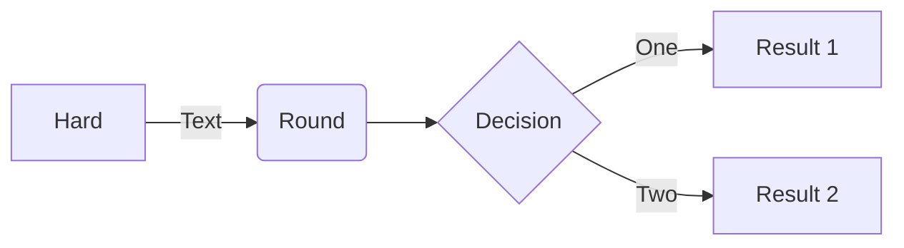
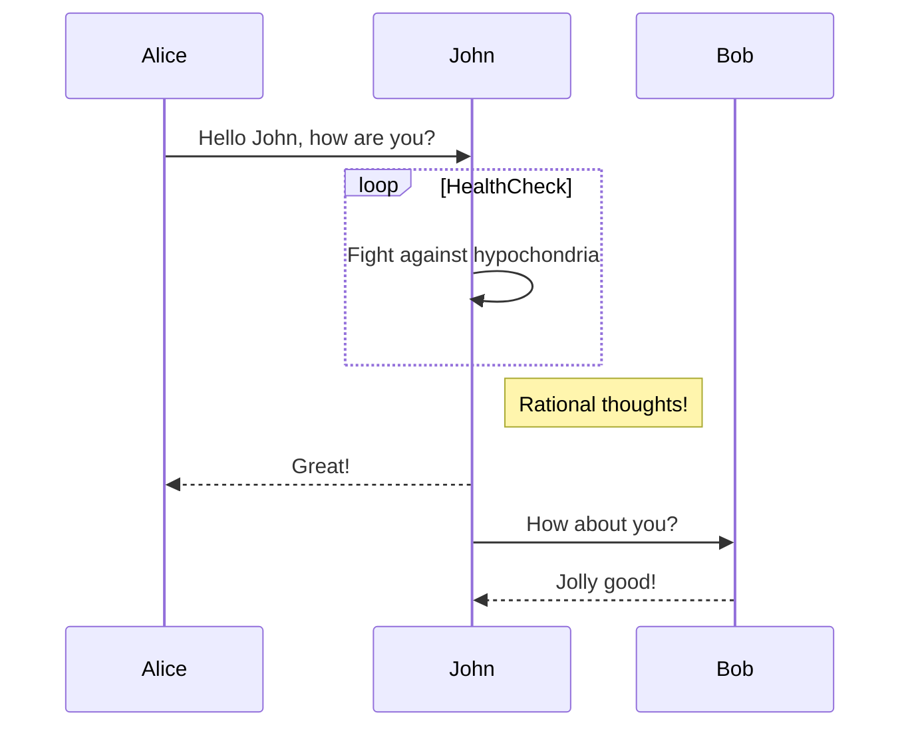
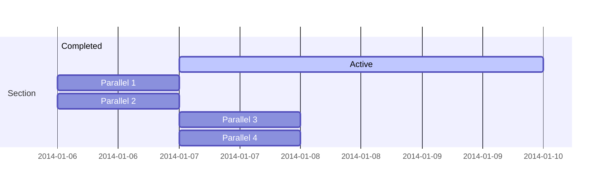
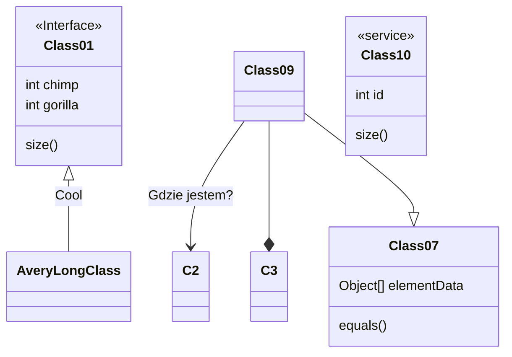
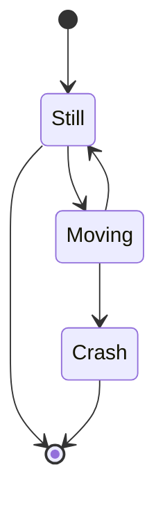
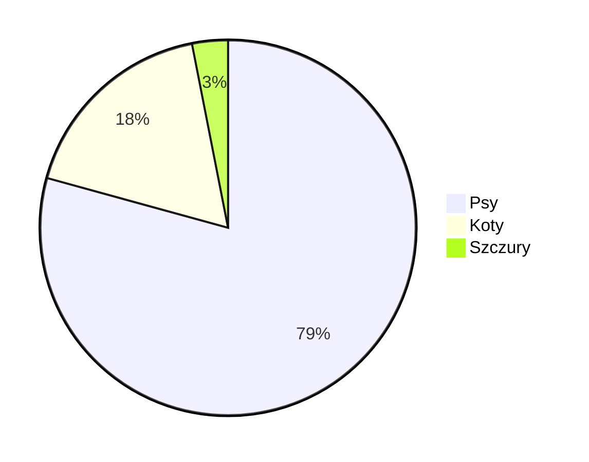
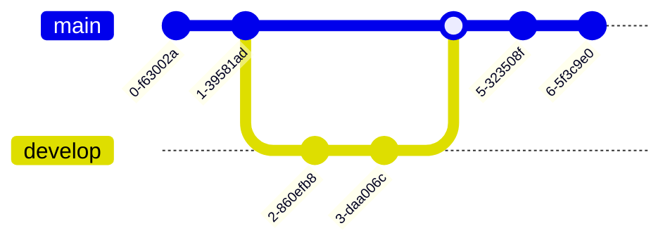

```mermaid
gantt
    title Git Issues - liczba dni od ostatniej aktualizacji
    dateFormat  X
    axisFormat %s

    section Issue19062
    71   : 0, 71
    section Issue19401
    36   : 0, 36
    section Issue193
    34   : 0, 34
    section Issue7441
    9    : 0, 9
    section Issue1300
    5    : 0, 5
```

```mermaid
  journey
    title Mój dzień pracy
    section Idź do pracy
      Zrób herbatę: 5: Ja
      Wejdź na górę: 3: Ja
      Pracuj: 1: Ja, Kot
    section Wróć do domu
      Zejdź na dół: 5: Ja
      Usiądź: 3: Ja
```

<p align="center">

</p>
<h1 align="center">
Mermaid
</h1>
<p align="center">
Generuj diagramy z tekstu podobnego do Markdown.
<p>
<p align="center">
  <a href="https://www.npmjs.com/package/mermaid"></a>
<p>

<p align="center">
<a href="https://mermaid.live/"><b>Edytor na żywo!</b></a>
</p>
<p align="center">
 <a href="https://mermaid.js.org">📖 Dokumentacja</a> | <a href="https://mermaid.js.org/intro/">🚀 Pierwsze kroki</a> | <a href="https://www.jsdelivr.com/package/npm/mermaid">🌐 CDN</a> | <a href="https://discord.gg/sKeNQX4Wtj" title="Discord invite">🙌 Dołącz do nas</a>
</p>
<p align="center">
<a href="./README.zh-CN.md">简体中文</a>
</p>
<p align="center">
Wypróbuj podgląd Edytora na żywo przyszłych wersji: <a href="https://develop.git.mermaid.live/" title="Wypróbuj wersję mermaid z gałęzi develop.">Develop</a> | <a href="https://next.git.mermaid.live/" title="Wypróbuj wersję mermaid z gałęzi next.">Next</a>
</p>

<br>
<br>

[](https://www.npmjs.com/package/mermaid)
[](https://github.com/mermaid-js/mermaid/actions/workflows/build.yml)
[](https://bundlephobia.com/package/mermaid)
[](https://app.codecov.io/github/mermaid-js/mermaid/tree/develop)
[](https://www.jsdelivr.com/package/npm/mermaid)
[](https://www.npmjs.com/package/mermaid)
[](https://discord.gg/sKeNQX4Wtj)
[](https://twitter.com/mermaidjs_)
[](https://argos-ci.com?utm_source=mermaid&utm_campaign=oss)
[](https://securityscorecards.dev/viewer/?uri=github.com/mermaid-js/mermaid)


:trophy: **Mermaid został nominowany i wygrał [JS Open Source Awards (2019)](https://osawards.com/javascript/2019) w kategorii "Najbardziej ekscytujące wykorzystanie technologii"!!!**

**Dziękujemy wszystkim zaangażowanym, osobom zgłaszającym pull requesty, odpowiadającym na pytania! 🙏**

<a href="https://mermaid.js.org/landing/"></a>

## Spis treści

<details>
<summary>Rozwiń zawartość</summary>

- [O projekcie](#about)
- [Przykłady](#examples)
- [Wydania](#release)
- [Powiązane projekty](#related-projects)
- [Współtwórcy](#contributors---)
- [Bezpieczeństwo i bezpieczne diagramy](#security-and-safe-diagrams)
- [Zgłaszanie luk w zabezpieczeniach](#reporting-vulnerabilities)
- [Podziękowania](#appreciation)

</details>

## O projekcie

<!-- <Main description>   -->

Mermaid to narzędzie do tworzenia diagramów i wykresów oparte na JavaScript, które wykorzystuje definicje tekstowe inspirowane Markdownem oraz renderer do tworzenia i modyfikowania złożonych diagramów. Głównym celem Mermaid jest pomoc w aktualizacji dokumentacji na bieżąco z rozwojem oprogramowania.

> Doc-Rot to błędne koło, które Mermaid pomaga rozwiązać.

Tworzenie diagramów i dokumentacji pochłania cenny czas deweloperów i szybko się dezaktualizuje.
Brak diagramów lub dokumentacji obniża produktywność i szkodzi uczeniu się organizacji.<br/>
Mermaid rozwiązuje ten problem, umożliwiając użytkownikom łatwe tworzenie diagramów, które można szybko modyfikować. Może być również częścią skryptów produkcyjnych (i innych fragmentów kodu).<br/>
<br/>

Mermaid pozwala nawet osobom niebędącym programistami łatwo tworzyć szczegółowe diagramy za pomocą [Edytora Live Mermaid](https://mermaid.live/).<br/>
Aby obejrzeć samouczki wideo, odwiedź naszą stronę [Tutoriale](https://mermaid.js.org/ecosystem/tutorials.html).
Używaj Mermaid z ulubionymi aplikacjami – sprawdź listę [Integracji i Zastosowań Mermaid](https://mermaid.js.org/ecosystem/integrations-community.html).

Możesz również używać Mermaid w [GitHubie](https://github.blog/2022-02-14-include-diagrams-markdown-files-mermaid/) oraz w wielu innych ulubionych aplikacjach — zobacz listę [Integracji i Zastosowań Mermaid](https://mermaid.js.org/ecosystem/integrations-community.html).

Bardziej szczegółowe wprowadzenie do Mermaid oraz jego podstawowe zastosowania znajdziesz w [Przewodniku dla początkujących](https://mermaid.js.org/intro/getting-started.html), sekcji [Użycie](https://mermaid.js.org/config/usage.html) oraz [Samouczkach](https://mermaid.js.org/ecosystem/tutorials.html).

Testy regresji wizualnej PR realizujemy dzięki [Argos](https://argos-ci.com/?utm_source=mermaid&utm_campaign=oss) w ramach ich hojne oferty dla open source. Ułatwia to przeglądanie PR-ów z wizualnymi zmianami.

[](https://argos-ci.com?utm_source=mermaid&utm_campaign=oss)

W naszym procesie wydawniczym mocno polegamy na testach regresji wizualnej przy użyciu [applitools](https://applitools.com/). Applitools to świetna usługa, łatwa w użyciu i integracji z naszymi testami.

<a href="https://applitools.com/">
<svg width="170" height="32" viewBox="0 0 170 32" fill="none" xmlns="http://www.w3.org/2000/svg"><mask id="a" maskUnits="userSpaceOnUse" x="27" y="0" width="143" height="32"><path fill-rule="evenodd" clip-rule="evenodd" d="M27.732.227h141.391v31.19H27.733V.227z" fill="#fff"></path></mask><g mask="url(#a)"><path fill-rule="evenodd" clip-rule="evenodd" d="M153.851 22.562l1.971-3.298c1.291 1.219 3.837 2.402 5.988 2.402 1.971 0 2.903-.753 2.903-1.829 0-2.832-10.253-.502-10.253-7.313 0-2.904 2.51-5.45 7.099-5.45 2.904 0 5.234 1.004 6.955 2.367l-1.829 3.226c-1.039-1.075-3.011-2.008-5.126-2.008-1.65 0-2.725.717-2.725 1.685 0 2.546 10.289.395 10.289 7.386 0 3.19-2.724 5.52-7.528 5.52-3.012 0-5.916-1.003-7.744-2.688zm-5.7 2.259h4.553V.908h-4.553v23.913zm-6.273-8.676c0-2.689-1.578-5.02-4.446-5.02-2.832 0-4.409 2.331-4.409 5.02 0 2.724 1.577 5.055 4.409 5.055 2.868 0 4.446-2.33 4.446-5.055zm-13.588 0c0-4.912 3.442-9.07 9.142-9.07 5.736 0 9.178 4.158 9.178 9.07 0 4.911-3.442 9.106-9.178 9.106-5.7 0-9.142-4.195-9.142-9.106zm-5.628 0c0-2.689-1.577-5.02-4.445-5.02-2.832 0-4.41 2.331-4.41 5.02 0 2.724 1.578 5.055 4.41 5.055 2.868 0 4.445-2.33 4.445-5.055zm-13.587 0c0-4.912 3.441-9.07 9.142-9.07 5.736 0 9.178 4.158 9.178 9.07 0 4.911-3.442 9.106-9.178 9.106-5.701 0-9.142-4.195-9.142-9.106zm-8.425 4.338v-8.999h-2.868v-3.98h2.868V2.773h4.553v4.733h3.514v3.979h-3.514v7.78c0 1.111.574 1.936 1.578 1.936.681 0 1.326-.251 1.577-.538l.968 3.478c-.681.609-1.9 1.11-3.8 1.11-3.191 0-4.876-1.648-4.876-4.767zm-8.962 4.338h4.553V7.505h-4.553V24.82zm-.43-21.905a2.685 2.685 0 012.688-2.69c1.506 0 2.725 1.184 2.725 2.69a2.724 2.724 0 01-2.725 2.724c-1.47 0-2.688-1.219-2.688-2.724zM84.482 24.82h4.553V.908h-4.553v23.913zm-6.165-8.676c0-2.976-1.793-5.02-4.41-5.02-1.47 0-3.119.825-3.908 1.973v6.094c.753 1.111 2.438 2.008 3.908 2.008 2.617 0 4.41-2.044 4.41-5.055zm-8.318 6.453v8.82h-4.553V7.504H70v2.187c1.327-1.685 3.227-2.618 5.342-2.618 4.446 0 7.672 3.299 7.672 9.07 0 5.773-3.226 9.107-7.672 9.107-2.043 0-3.907-.86-5.342-2.653zm-10.718-6.453c0-2.976-1.793-5.02-4.41-5.02-1.47 0-3.119.825-3.908 1.973v6.094c.753 1.111 2.438 2.008 3.908 2.008 2.617 0 4.41-2.044 4.41-5.055zm-8.318 6.453v8.82H46.41V7.504h4.553v2.187c1.327-1.685 3.227-2.618 5.342-2.618 4.446 0 7.672 3.299 7.672 9.07 0 5.773-3.226 9.107-7.672 9.107-2.043 0-3.908-.86-5.342-2.653zm-11.758-1.936V18.51c-.753-1.004-2.187-1.542-3.657-1.542-1.793 0-3.263.968-3.263 2.617 0 1.65 1.47 2.582 3.263 2.582 1.47 0 2.904-.502 3.657-1.506zm0 4.159v-1.829c-1.183 1.434-3.227 2.259-5.485 2.259-2.761 0-5.988-1.864-5.988-5.736 0-4.087 3.227-5.593 5.988-5.593 2.33 0 4.337.753 5.485 2.115V13.85c0-1.756-1.506-2.904-3.8-2.904-1.829 0-3.55.717-4.984 2.044L28.63 9.8c2.115-1.901 4.84-2.726 7.564-2.726 3.98 0 7.6 1.578 7.6 6.561v11.186h-4.588z" fill="#00A298"></path></g><path fill-rule="evenodd" clip-rule="evenodd" d="M14.934 16.177c0 1.287-.136 2.541-.391 3.752-1.666-1.039-3.87-2.288-6.777-3.752 2.907-1.465 5.11-2.714 6.777-3.753.255 1.211.39 2.466.39 3.753m4.6-7.666V4.486a78.064 78.064 0 01-4.336 3.567c-1.551-2.367-3.533-4.038-6.14-5.207C11.1 4.658 12.504 6.7 13.564 9.262 5.35 15.155 0 16.177 0 16.177s5.35 1.021 13.564 6.915c-1.06 2.563-2.463 4.603-4.507 6.415 2.607-1.169 4.589-2.84 6.14-5.207a77.978 77.978 0 014.336 3.568v-4.025s-.492-.82-2.846-2.492c.6-1.611.93-3.354.93-5.174a14.8 14.8 0 00-.93-5.174c2.354-1.673 2.846-2.492 2.846-2.492" fill="#00A298"></path></svg>
</a>

<!-- </Main description> -->

## Mermaid AI Bot

Bot [Mermaid](https://codeparrot.ai/oracle?owner=mermaid-js&repo=mermaid) pomoże Ci lepiej zrozumieć to repozytorium. Możesz poprosić o przykłady kodu, przewodnik instalacji, pomoc w debugowaniu i wiele więcej.

## Przykłady

**Poniżej przedstawiono przykłady diagramów, wykresów i grafów, które można utworzyć za pomocą Mermaid. Kliknij tutaj, aby przejść do [składni tekstowej](https://mermaid.js.org/intro/syntax-reference.html).**

<!-- <Flowchart> -->

### Schemat blokowy [<a href="https://mermaid.js.org/syntax/flowchart.html">dokumentacja</a> - <a href="https://mermaid.live/edit#pako:eNpNkMtqwzAQRX9FzKqFJK7t1km8KDQP6KJQSLOLvZhIY1tgS0GWmgbb_165IaFaiXvOFTPqgGtBkEJR6zOv0Fj2scsU8-ft8I5G5Gw6fe339GN7tnrYaafE45WvRsLW3Ya4bKVWwzVe_xU-FfVsc9hR62rLwvw_2591z7Y3FuUwgYZMg1L4ObrRzMBW1FAGqb8KKtCLGWRq8Ko7CbS0FdJqA2mBdUsTQGf110VxSK1xdJM2EkuDzd2qNQrypQ7s5TQuXcrW-ie5VoUsx9yZ2seVtac2DYIRz0ppK3eccd0ErRTjD1XfyyRIomSBUUzJPMaXOBb8GC4XRfQcFmL-FEYIwzD8AggvcHE">edytor na żywo</a>]

```
flowchart LR

A[Hard] -->|Text| B(Round)
B --> C{Decision}
C -->|One| D[Result 1]
C -->|Two| E[Result 2]
```



### Diagram sekwencji [<a href="https://mermaid.js.org/syntax/sequenceDiagram.html">dokumentacja</a> - <a href="https://mermaid.live/edit#pako:eNo9kMluwjAQhl_F-AykQMuSA1WrbuLQQ3v1ZbAnsVXHkzrjVhHi3etQwKfRv4w-z0FqMihL2eF3wqDxyUEdoVHhwTuNk-12RzaU4g29JzHMY2HpV0BE0VO6V8ETtdkGz1Zb1F8qiPyG5LX84mrLAmpwoWNh-5a0pWCiAxUwGBXeiVHEU4oq8V_6AHYUwAu2lLLTjVQ4bc1rT2yleI0IfJG320faZ9ABbk-Jz3hZnFxBduR9L2oiM5Jj2WBswJn8-cMArSRbbFDJMo8GK0ielVThmKOpNcD4bBxTlGUFvsOxhMT02QctS44JL6HzAS-iJzCYOwfJfTscunYd542aQuXqQU_RZ9kyt11ZFIM9rR3btJ9qaorOGQuR7c9mWSznyzXMF7hcLeBusTB6P9usq_ntrDKrm9kc5PF4_AMJE56Z">edytor na żywo</a>]

```
sequenceDiagram
Alice->>John: Hello John, how are you?
loop HealthCheck
    John->>John: Fight against hypochondria
end
Note right of John: Rational thoughts!
John-->>Alice: Great!
John->>Bob: How about you?
Bob-->>John: Jolly good!
```



### Wykres Gantta [<a href="https://mermaid.js.org/syntax/gantt.html">dokumentacja</a> - <a href="https://mermaid.live/edit#pako:eNp90cGOgyAQBuBXIZxtFbG29bbZ3fsmvXKZylhJEAyOTZrGd1_sto3xsHMBhu-HBO689hp5xS_giJQbsCbjHTv9jcp9-q63SKhZpb3DhMXSOIiE5ZkoNpnYZGXynh6U-4jBK7JnVfBYJo9QvgjtEya1cj8QwFq0TMz4lZqxTBg0hOF5m1jifI2Lf7Bc490CyxUu1rhc4GLGPOEdhg6Mjq92V44xxanFDhWv4lRjA6MlxZWbIh17DYTf2pAPvGrADphwGMmfbq7mFYURX-jLwCVA91bWg8YYunO69Y8vMgPFI2vvGnOZ-2Owsd0S9UOVpvP29mKoHc_b2nfpYHQLgdrrsUzLvDxALrHcS9hJqeuzOB6avBCN3mciBz5N0y_wxZ0J">edytor na żywo</a>]

```
gantt
    section Section
    Completed :done,    des1, 2014-01-06,2014-01-08
    Active        :active,  des2, 2014-01-07, 3d
    Parallel 1   :         des3, after des1, 1d
    Parallel 2   :         des4, after des1, 1d
    Parallel 3   :         des5, after des3, 1d
    Parallel 4   :         des6, after des4, 1d
```



### Diagram klas [<a href="https://mermaid.js.org/syntax/classDiagram.html">dokumentacja</a> - <a href="https://mermaid.live/edit#pako:eNpdkTFPwzAQhf-K5QlQ2zQJJG1UBaGWDYmBgYEwXO1LYuTEwXYqlZL_jt02asXm--690zvfgTLFkWaUSTBmI6DS0BTt2lfzkKx-p1PytEO9f1FtdaQkI2ulZNGuVqK1qEtgmOfk7BitSzKdOhg59XuNGgk0RDxed-_IOr6uf8cZ6UhTZ8bvHqS5ub1mr9svZPbjk6DEBlu7AQuXyBkx4gcvDk9cUMJq0XT_YaW0kNK5j-ufAoRzcihaQvLcoN4Jv50vvVxw_xrnD3RCG9QNCO4-8OgpqK1dpoJm7smxhF7agp6kfcfB4jMXVmmalW4tnFDorXrbt4xmVvc4is53GKFUwNF5DtTuO3-sShjrJjLVlqLyvNfS4drazmRB4NuzSti6386YagIjeA3a1rtlEiRRsoAoxiSN4SGOOduGy0UZ3YclT-dhBHQYhj8dc6_I">edytor na żywo</a>]

```
classDiagram
Class01 <|-- AveryLongClass : Cool
<<Interface>> Class01
Class09 --> C2 : Where am I?
Class09 --* C3
Class09 --|> Class07
Class07 : equals()
Class07 : Object[] elementData
Class01 : size()
Class01 : int chimp
Class01 : int gorilla
class Class10 {
  <<service>>
  int id
  size()
}

```



### Diagram stanów [<a href="https://mermaid.js.org/syntax/stateDiagram.html">dokumentacja</a> - <a href="https://mermaid.live/edit#pako:eNpdkEFvgzAMhf8K8nEqpYSNthx22Xbcqcexg0sCiZQQlDhIFeK_L8A6TfXp6fOz9ewJGssFVOAJSbwr7ByadGR1n8T6evpO0vQ1uZDSekOrXGFsPqJPO6q-2-imH8f_0TeHXm50lfelsAMjnEHFY6xpMdRAUhhRQxUlFy0GTTXU_RytYeAx-AdXZB1ULWovdoCB7OXWN1CRC-Ju-r3uz6UtchGHJqDbsPygU57iysb2reoWHpyOWBINvsqypb3vFMlw3TfWZF5xiY7keC6zkpUnZIUojwW-FAVvrvn51LLnvOXHQ84Q5nn-AVtLcwk">edytor online</a>]

```
stateDiagram-v2
[*] --> Still
Still --> [*]
Still --> Moving
Moving --> Still
Moving --> Crash
Crash --> [*]
```



### Wykres kołowy [<a href="https://mermaid.js.org/syntax/pie.html">dokumentacja</a> - <a href="https://mermaid.live/edit#pako:eNo9jsFugzAMhl8F-VzBgEEh13Uv0F1zcYkTIpEEBadShXj3BU3dzf_n77e8wxQUgYDVkvQSbsFsEgpRtEN_5i_kvzx05XiC-xvUHVzAUXRoVe7v0heFBJ7JkQSRR0Ua08ISpD-ymlaFTN_KcoggNC4bXQATh5-Xn0BwTPSWbhZNRPdvLQEV5dIO_FrPZ43dOJ-cgtfWnDzFJeOZed1EVZ3r0lie06Ocgqs2q2aMPD_HvuqbfsCmpf7aYte2anrU46Cbz1qr60fdIBzH8QvW9lkl">edytor online</a>]

```
pie
"Psy" : 386
"Koty" : 85.9
"Szczury" : 15
```



### Wykres Git [eksperymentalny - <a href="https://mermaid.live/edit#pako:eNqNkMFugzAMhl8F-VyVAR1tOW_aA-zKxSSGRCMJCk6lCvHuNZPKZdM0n-zf3_8r8QIqaIIGMqnB8kfEybQ--y4VnLP8-9RF9Mpkmm40hmlnDKmvkPiH_kfS7nFo_VN0FAf6XwocQGgxa_nGsm1bYEOOWmik1dRjGrmF1q-Cpkkj07u2HCI0PY4zHQATh8-7V9BwTPSE3iwOEd1OjQE1iWkBvk_bzQY7s0Sq4Hs7bHqKo8iGeZqbPN_WR7mpSd1RHpvPVhuMbG7XOq_L-oJlRfW5wteq0qorrpe-PBW9Pr8UJcK6rg-BLYPQ">edytor online</a>]

```
gitGraph
  commit
  commit
  branch develop
  checkout develop
  commit
  commit
  checkout main
  merge develop
  commit
  commit
```



### Wykres słupkowy (używając wykresu gantt) [<a href="https://mermaid.js.org/syntax/gantt.html">dokumentacja</a> - <a href="https://mermaid.live/edit#pako:eNptkU1vhCAQhv8KIenNugiI4rkf6bmXpvEyFVxJFDYyNt1u9r8X63Z7WQ9m5pknLzieaBeMpQ3dg0dsPUkPOhwteXZIXmJcbCT3xMAxkuh8Z8kIEclyMIB209fqKcwTICFvG4IvFy_oLrZ-g9F26ILfQgvNFN94VaRXQ1iWqpumZBcu1J8p1E1TXDx59eQNr5LyEqjJn6hv5QnGNlxevZJmdLLpy5xJSzut45biYCfb0iaVxvawjNjS1p-TCguG16PvaIPzYjO67e3BwX6GiTY9jPFKH43DMF_hGMDY1J4oHg-_f8hFTJFd8L3br3yZx4QHxENsdrt1nO8dDstH3oVpF50ZYMbhU6ud4qoGLqyqBJRCmO6j0HXPZdGbihUc6Pmc0QP49xD-b5X69ZQv2gjO81IwzWqhC1lKrjJ6pA3nVS7SMiVjrKirWlYp5fs3osgrWeo00lorLWvOzz8JVbXm">edytor online</a>]

```
gantt
    title Git Issues - liczba dni od ostatniej aktualizacji
    dateFormat  X
    axisFormat %s

    section Issue19062
    71   : 0, 71
    section Issue19401
    36   : 0, 36
    section Issue193
    34   : 0, 34
    section Issue7441
    9    : 0, 9
    section Issue1300
    5    : 0, 5
```



### Diagram ścieżki użytkownika [<a href="https://mermaid.js.org/syntax/userJourney.html">dokumentacja</a> - <a href="https://mermaid.live/edit#pako:eNplkMFuwjAQRH9l5TMiTVIC-FqqnjhxzWWJN4khsSN7XRSh_HsdKBVt97R6Mzsj-yoqq0hIAXCywRkaSwNxWHNHsB_hYt1ZmwYUfiueKtbWwIcFtjf5zgH2eCZgQgkrCXt64GgMg2fUzkvIn5Xd_V5COtMFvCH_62ht_5yk7MU8sn61HDTfxD8VYiF6cj1qFd94nWkpuKWYKWRcFdUYOi5FaaZoDYNCpnel2Toha-w8LQQGtofRVEKyC_Qw7TQ2DvsfV2dRUTy6Ch6H-UMb7TlGVtbUupl5cF3ELfPgZZLM8rLR3IbjsrJ94rVq0XH7uS2SIis2mOVUrHNc5bmqjul2U2evaa3WL2mGYpqmL2BGiho">edytor online</a>]

```
  journey
    title Mój dzień pracy
    section Idź do pracy
      Zrób herbatę: 5: Ja
      Wejdź na górę: 3: Ja
      Pracuj: 1: Ja, Kot
    section Wróć do domu
      Zejdź na dół: 5: Ja
      Usiądź: 3: Ja
```



### Diagram C4 [<a href="https://mermaid.js.org/syntax/c4.html">dokumentacja</a>]

```
C4Context
title Diagram kontekstu systemu dla Systemu Bankowości Internetowej

Person(customerA, "Klient banku A", "Klient banku, posiadający osobiste konta bankowe.")
Person(customerB, "Klient banku B")
Person_Ext(customerC, "Klient banku C")
System(SystemAA, "System Bankowości Internetowej", "Umożliwia klientom przeglądanie informacji o swoich kontach bankowych oraz dokonywanie płatności.")

Person(customerD, "Klient banku D", "Klient banku, <br/> posiadający osobiste konta bankowe.")

Enterprise_Boundary(b1, "GranicaBanku") {

  SystemDb_Ext(SystemE, "System Bankowy Mainframe", "Przechowuje wszystkie podstawowe informacje bankowe o klientach, kontach, transakcjach itd.")

  System_Boundary(b2, "GranicaBanku2") {
    System(SystemA, "System Bankowy A")
    System(SystemB, "System Bankowy B", "System banku, posiadający osobiste konta bankowe.")
  }

  System_Ext(SystemC, "System e-mail", "Wewnętrzny system e-mail Microsoft Exchange.")
  SystemDb(SystemD, "Baza danych Systemu Bankowego D", "System banku, posiadający osobiste konta bankowe.")

  Boundary(b3, "GranicaBanku3", "granica") {
    SystemQueue(SystemF, "Kolejka Systemu Bankowego F", "System banku, posiadający osobiste konta bankowe.")
    SystemQueue_Ext(SystemG, "Kolejka Systemu Bankowego G", "System banku, posiadający osobiste konta bankowe.")
  }
}

BiRel(customerA, SystemAA, "Używa")
BiRel(SystemAA, SystemE, "Używa")
Rel(SystemAA, SystemC, "Wysyła e-maile", "SMTP")
Rel(SystemC, customerA, "Wysyła e-maile do")
```

```mermaid
C4Context
title Diagram kontekstu systemu dla Systemu Bankowości Internetowej

Person(customerA, "Klient banku A", "Klient banku, posiadający osobiste konta bankowe.")
Person(customerB, "Klient banku B")
Person_Ext(customerC, "Klient banku C")
System(SystemAA, "System Bankowości Internetowej", "Umożliwia klientom przeglądanie informacji o swoich kontach bankowych oraz dokonywanie płatności.")

Person(customerD, "Klient banku D", "Klient banku, <br/> posiadający osobiste konta bankowe.")

Enterprise_Boundary(b1, "GranicaBanku") {
```markdown
  SystemDb_Ext(SystemE, "System Mainframe Bankingowy", "Przechowuje wszystkie podstawowe informacje bankowe o klientach, kontach, transakcjach itp.")

  System_Boundary(b2, "GranicaBanku2") {
    System(SystemA, "System Bankowy A")
    System(SystemB, "System Bankowy B", "System banku z osobistymi kontami bankowymi.")
  }

  System_Ext(SystemC, "System e-mail", "Wewnętrzny system e-mail Microsoft Exchange.")
  SystemDb(SystemD, "Baza danych Systemu Bankowego D", "System banku z osobistymi kontami bankowymi.")

  Boundary(b3, "GranicaBanku3", "boundary") {
    SystemQueue(SystemF, "Kolejka Systemu Bankowego F", "System banku z osobistymi kontami bankowymi.")
    SystemQueue_Ext(SystemG, "Kolejka Systemu Bankowego G", "System banku z osobistymi kontami bankowymi.")
  }
}

BiRel(customerA, SystemAA, "Używa")
BiRel(SystemAA, SystemE, "Używa")
Rel(SystemAA, SystemC, "Wysyła e-maile", "SMTP")
Rel(SystemC, customerA, "Wysyła e-maile do")
```

## Wydanie

Dla tych, którzy mają do tego uprawnienia:

Zaktualizuj numer wersji w `package.json`.

```sh
npm publish
```

Powyższe polecenie generuje pliki do folderu `dist` i publikuje je na <https://www.npmjs.com>.

## Powiązane projekty

- [Command Line Interface](https://github.com/mermaid-js/mermaid-cli)
- [Live Editor](https://github.com/mermaid-js/mermaid-live-editor)
- [HTTP Server](https://github.com/TomWright/mermaid-server)

## Współtwórcy [](https://github.com/mermaid-js/mermaid/issues?q=is%3Aissue+is%3Aopen+label%3A%22Good+first+issue%21%22) [](https://github.com/mermaid-js/mermaid/graphs/contributors) [](https://github.com/mermaid-js/mermaid/graphs/contributors)

Mermaid to rosnąca społeczność i zawsze przyjmuje nowych współtwórców. Istnieje wiele różnych sposobów, aby pomóc i zawsze szukamy dodatkowych rąk do pracy! Zobacz [to zgłoszenie](https://github.com/mermaid-js/mermaid/issues/866), jeśli chcesz dowiedzieć się, od czego zacząć pomagać.

Szczegółowe informacje na temat współpracy można znaleźć w [przewodniku dla współtwórców](https://mermaid.js.org/community/contributing.html)

## Bezpieczeństwo i bezpieczne diagramy

Na publicznych stronach pobieranie tekstu od użytkowników z internetu i przechowywanie tej treści do późniejszej prezentacji w przeglądarce może być ryzykowne. Powodem jest to, że treść użytkownika może zawierać osadzone złośliwe skrypty, które zostaną uruchomione podczas prezentacji danych. Dla Mermaid jest to ryzyko, szczególnie że diagramy Mermaid zawierają wiele znaków używanych w HTML, przez co standardowe oczyszczanie jest nieskuteczne, bo łamie też diagramy. Nadal staramy się oczyszczać przychodzący kod i stale ulepszamy ten proces, ale trudno zagwarantować, że nie ma żadnych luk.

Jako dodatkowy poziom bezpieczeństwa dla stron z zewnętrznymi użytkownikami z przyjemnością wprowadzamy nowy poziom bezpieczeństwa, w którym diagram jest renderowany w osadzonym sandboxowanym iframe, co uniemożliwia wykonanie JavaScriptu w kodzie. To duży krok w stronę lepszego bezpieczeństwa.

_Niestety nie można mieć ciastka i zjeść ciastka, co w tym przypadku oznacza, że niektóre funkcje interaktywne zostaną zablokowane razem z potencjalnie złośliwym kodem._

## Zgłaszanie podatności

Aby zgłosić podatność, prosimy o wysłanie e-maila na adres <security@mermaid.live> z opisem problemu, krokami prowadzącymi do jego odtworzenia, wersjami, których dotyczy problem oraz, jeśli to znane, możliwymi sposobami mitigacji.

## Podziękowania

Krótka notka od Knuta Sveidqvista:

> _Serdeczne podziękowania dla projektów [d3](https://d3js.org/) i [dagre-d3](https://github.com/cpettitt/dagre-d3) za dostarczenie bibliotek do układania i rysowania grafiki!_
>
> _Podziękowania również dla projektu [js-sequence-diagram](https://bramp.github.io/js-sequence-diagrams) za wykorzystanie gramatyki do diagramów sekwencji. Dzięki dla Jessiki Peter za inspirację i punkt wyjścia dla renderowania gantt._
>
> _Dziękuję [Tylerowi Longowi](https://github.com/tylerlong), który współpracuje od kwietnia 2017._
>
> _Dziękuję stale powiększającej się liście [współtwórców](https://github.com/mermaid-js/mermaid/graphs/contributors), którzy doprowadzili projekt do tego miejsca!_

---

_Mermaid został stworzony przez Knuta Sveidqvista dla łatwiejszej dokumentacji._
```


---



Tranlated By [Open Ai Tx](https://github.com/OpenAiTx/OpenAiTx) | Last indexed: 2025-06-12


---