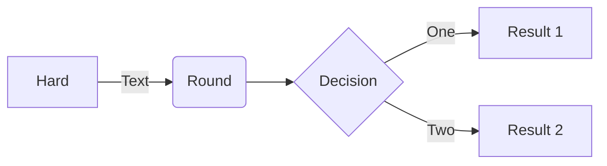
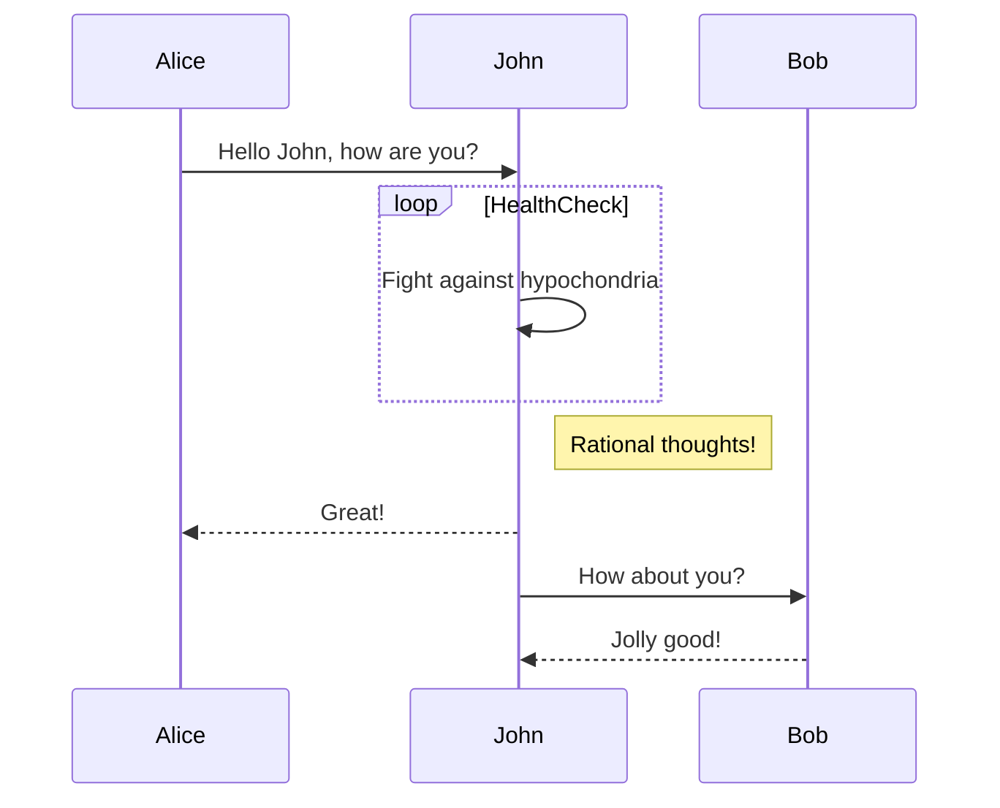
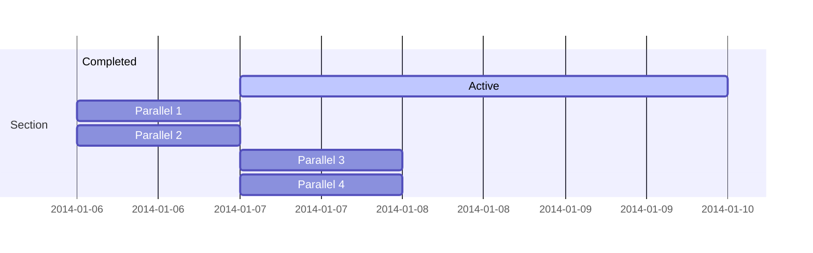
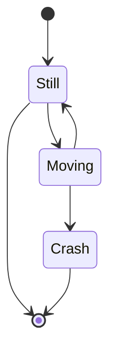
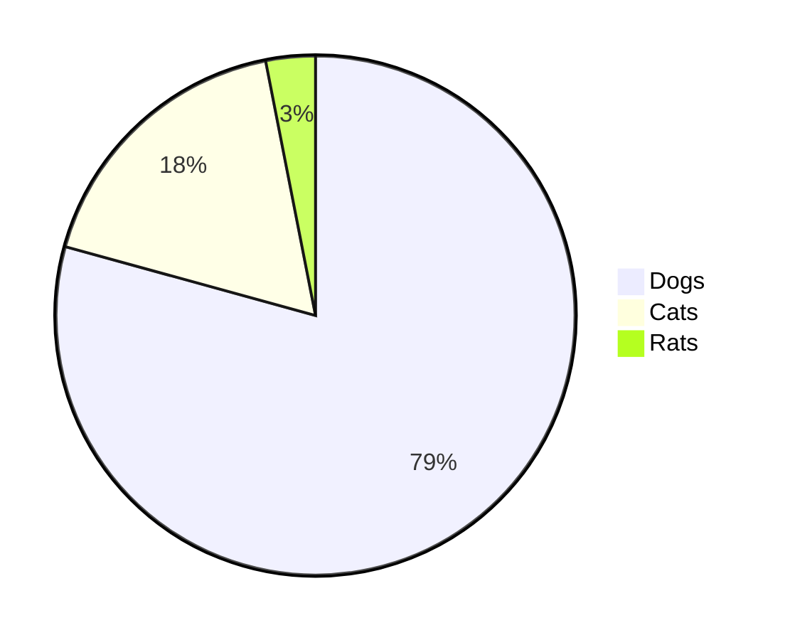
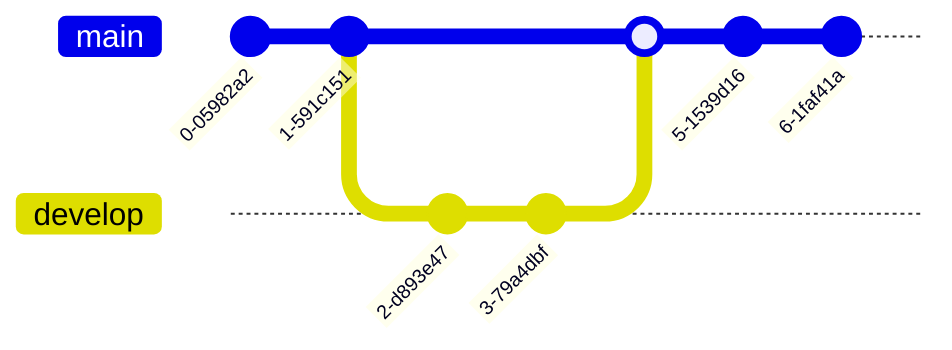
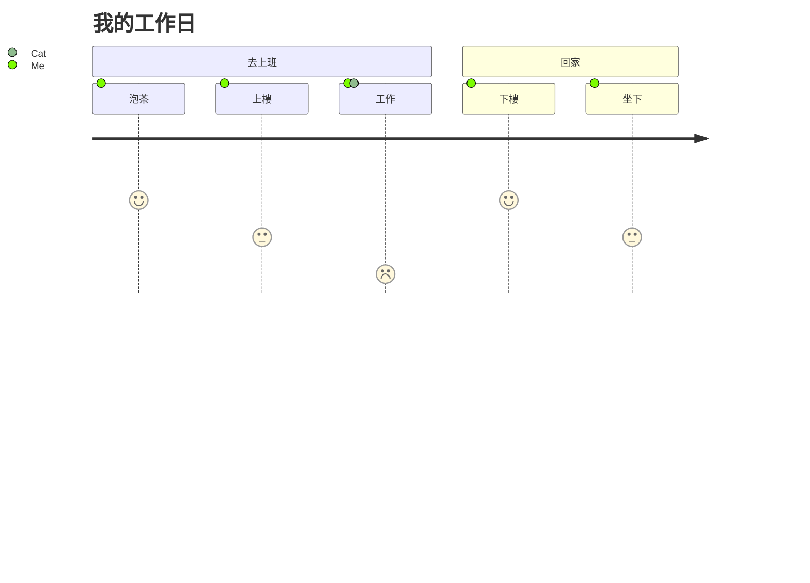

```mermaid
gantt
    title Git 問題 - 距離上次更新的天數
    dateFormat  X
    axisFormat %s

    section Issue19062
    71   : 0, 71
    section Issue19401
    36   : 0, 36
    section Issue193
    34   : 0, 34
    section Issue7441
    9    : 0, 9
    section Issue1300
    5    : 0, 5
```

<p align="center">

</p>
<h1 align="center">
Mermaid
</h1>
<p align="center">
從類 Markdown 文本生成圖表。
<p>
<p align="center">
  <a href="https://www.npmjs.com/package/mermaid"></a>
<p>

<p align="center">
<a href="https://mermaid.live/"><b>線上編輯器！</b></a>
</p>
<p align="center">
 <a href="https://mermaid.js.org">📖 文件</a> | <a href="https://mermaid.js.org/intro/">🚀 快速開始</a> | <a href="https://www.jsdelivr.com/package/npm/mermaid">🌐 CDN</a> | <a href="https://discord.gg/sKeNQX4Wtj" title="Discord 邀請">🙌 加入我們</a>
</p>
<p align="center">
<a href="./README.zh-CN.md">简体中文</a>
</p>
<p align="center">
體驗未來版本線上編輯器預覽：<a href="https://develop.git.mermaid.live/" title="試用 develop 分支的 mermaid 版本。">Develop</a> | <a href="https://next.git.mermaid.live/" title="試用 next 分支的 mermaid 版本。">Next</a>
</p>

<br>
<br>

[](https://www.npmjs.com/package/mermaid)
[](https://github.com/mermaid-js/mermaid/actions/workflows/build.yml)
[](https://bundlephobia.com/package/mermaid)
[](https://app.codecov.io/github/mermaid-js/mermaid/tree/develop)
[](https://www.jsdelivr.com/package/npm/mermaid)
[](https://www.npmjs.com/package/mermaid)
[](https://discord.gg/sKeNQX4Wtj)
[](https://twitter.com/mermaidjs_)
[](https://argos-ci.com?utm_source=mermaid&utm_campaign=oss)
[](https://securityscorecards.dev/viewer/?uri=github.com/mermaid-js/mermaid)


:trophy: **Mermaid 榮獲 [JS Open Source Awards (2019)](https://osawards.com/javascript/2019) 「最令人興奮的技術應用」類別獎項!!!**

**感謝所有參與者，提交 Pull Request 的朋友、回答問題的朋友！🙏**

<a href="https://mermaid.js.org/landing/"></a>

## 目錄

<details>
<summary>展開內容</summary>

- [關於](#about)
- [範例](#examples)
- [版本發佈](#release)
- [相關專案](#related-projects)
- [貢獻者](#contributors---)
- [安全性與安全圖表](#security-and-safe-diagrams)
- [回報漏洞](#reporting-vulnerabilities)
- [致謝](#appreciation)

</details>

## 關於

<!-- <Main description>   -->

Mermaid 是一個基於 JavaScript 的繪圖與圖表工具，使用類 Markdown 的文本定義與渲染器來建立與修改複雜圖表。Mermaid 的主要目的是幫助文件與開發進度保持同步。

> 文件腐朽（Doc-Rot）是一個困境，而 Mermaid 能幫助解決這個問題。

繪製圖表與撰寫文件耗費珍貴的開發者時間，且容易過時。
但缺乏圖表或文件會大幅降低生產力，並影響組織的學習能力。<br/>
Mermaid 透過讓用戶輕鬆修改圖表來解決此問題。它也可以成為生產腳本（及其他程式碼片段）的一部分。<br/>
<br/>

Mermaid 允許即使不是程式設計師的用戶，也能透過 [Mermaid 線上編輯器](https://mermaid.live/) 輕鬆建立詳細圖表。<br/>
如需影片教學，請參閱我們的 [教學頁面](https://mermaid.js.org/ecosystem/tutorials.html)。
您可以將 Mermaid 與您喜愛的應用搭配使用，詳見 [Mermaid 的整合與應用列表](https://mermaid.js.org/ecosystem/integrations-community.html)。

您也可以在 [GitHub](https://github.blog/2022-02-14-include-diagrams-markdown-files-mermaid/) 及許多其他常用應用中使用 Mermaid——請參閱 [Mermaid 的整合與應用列表](https://mermaid.js.org/ecosystem/integrations-community.html)。

若需更詳細的 Mermaid 介紹與基本用法，請參閱 [初學者指南](https://mermaid.js.org/intro/getting-started.html)、[用法](https://mermaid.js.org/config/usage.html) 及 [教學](https://mermaid.js.org/ecosystem/tutorials.html)。

我們的 PR 視覺回歸測試由 [Argos](https://argos-ci.com/?utm_source=mermaid&utm_campaign=oss) 慷慨提供開源方案支援。這讓審查帶有視覺變化的 PR 變得輕鬆愉快。

[](https://argos-ci.com?utm_source=mermaid&utm_campaign=oss)

在我們的版本發佈流程中，大量依賴 [applitools](https://applitools.com/) 進行視覺回歸測試。Applitools 是一個優秀的服務，易於使用並整合到我們的測試流程中。

<a href="https://applitools.com/">
<svg width="170" height="32" viewBox="0 0 170 32" fill="none" xmlns="http://www.w3.org/2000/svg"><mask id="a" maskUnits="userSpaceOnUse" x="27" y="0" width="143" height="32"><path fill-rule="evenodd" clip-rule="evenodd" d="M27.732.227h141.391v31.19H27.733V.227z" fill="#fff"></path></mask><g mask="url(#a)"><path fill-rule="evenodd" clip-rule="evenodd" d="M153.851 22.562l1.971-3.298c1.291 1.219 3.837 2.402 5.988 2.402 1.971 0 2.903-.753 2.903-1.829 0-2.832-10.253-.502-10.253-7.313 0-2.904 2.51-5.45 7.099-5.45 2.904 0 5.234 1.004 6.955 2.367l-1.829 3.226c-1.039-1.075-3.011-2.008-5.126-2.008-1.65 0-2.725.717-2.725 1.685 0 2.546 10.289.395 10.289 7.386 0 3.19-2.724 5.52-7.528 5.52-3.012 0-5.916-1.003-7.744-2.688zm-5.7 2.259h4.553V.908h-4.553v23.913zm-6.273-8.676c0-2.689-1.578-5.02-4.446-5.02-2.832 0-4.409 2.331-4.409 5.02 0 2.724 1.577 5.055 4.409 5.055 2.868 0 4.446-2.33 4.446-5.055zm-13.588 0c0-4.912 3.442-9.07 9.142-9.07 5.736 0 9.178 4.158 9.178 9.07 0 4.911-3.442 9.106-9.178 9.106-5.7 0-9.142-4.195-9.142-9.106zm-5.628 0c0-2.689-1.577-5.02-4.445-5.02-2.832 0-4.41 2.331-4.41 5.02 0 2.724 1.578 5.055 4.41 5.055 2.868 0 4.445-2.33 4.445-5.055zm-13.587 0c0-4.912 3.441-9.07 9.142-9.07 5.736 0 9.178 4.158 9.178 9.07 0 4.911-3.442 9.106-9.178 9.106-5.701 0-9.142-4.195-9.142-9.106zm-8.425 4.338v-8.999h-2.868v-3.98h2.868V2.773h4.553v4.733h3.514v3.979h-3.514v7.78c0 1.111.574 1.936 1.578 1.936.681 0 1.326-.251 1.577-.538l.968 3.478c-.681.609-1.9 1.11-3.8 1.11-3.191 0-4.876-1.648-4.876-4.767zm-8.962 4.338h4.553V7.505h-4.553V24.82zm-.43-21.905a2.685 2.685 0 012.688-2.69c1.506 0 2.725 1.184 2.725 2.69a2.724 2.724 0 01-2.725 2.724c-1.47 0-2.688-1.219-2.688-2.724zM84.482 24.82h4.553V.908h-4.553v23.913zm-6.165-8.676c0-2.976-1.793-5.02-4.41-5.02-1.47 0-3.119.825-3.908 1.973v6.094c.753 1.111 2.438 2.008 3.908 2.008 2.617 0 4.41-2.044 4.41-5.055zm-8.318 6.453v8.82h-4.553V7.504H70v2.187c1.327-1.685 3.227-2.618 5.342-2.618 4.446 0 7.672 3.299 7.672 9.07 0 5.773-3.226 9.107-7.672 9.107-2.043 0-3.907-.86-5.342-2.653zm-10.718-6.453c0-2.976-1.793-5.02-4.41-5.02-1.47 0-3.119.825-3.908 1.973v6.094c.753 1.111 2.438 2.008 3.908 2.008 2.617 0 4.41-2.044 4.41-5.055zm-8.318 6.453v8.82H46.41V7.504h4.553v2.187c1.327-1.685 3.227-2.618 5.342-2.618 4.446 0 7.672 3.299 7.672 9.07 0 5.773-3.226 9.107-7.672 9.107-2.043 0-3.908-.86-5.342-2.653zm-11.758-1.936V18.51c-.753-1.004-2.187-1.542-3.657-1.542-1.793 0-3.263.968-3.263 2.617 0 1.65 1.47 2.582 3.263 2.582 1.47 0 2.904-.502 3.657-1.506zm0 4.159v-1.829c-1.183 1.434-3.227 2.259-5.485 2.259-2.761 0-5.988-1.864-5.988-5.736 0-4.087 3.227-5.593 5.988-5.593 2.33 0 4.337.753 5.485 2.115V13.85c0-1.756-1.506-2.904-3.8-2.904-1.829 0-3.55.717-4.984 2.044L28.63 9.8c2.115-1.901 4.84-2.726 7.564-2.726 3.98 0 7.6 1.578 7.6 6.561v11.186h-4.588z" fill="#00A298"></path></g><path fill-rule="evenodd" clip-rule="evenodd" d="M14.934 16.177c0 1.287-.136 2.541-.391 3.752-1.666-1.039-3.87-2.288-6.777-3.752 2.907-1.465 5.11-2.714 6.777-3.753.255 1.211.39 2.466.39 3.753m4.6-7.666V4.486a78.064 78.064 0 01-4.336 3.567c-1.551-2.367-3.533-4.038-6.14-5.207C11.1 4.658 12.504 6.7 13.564 9.262 5.35 15.155 0 16.177 0 16.177s5.35 1.021 13.564 6.915c-1.06 2.563-2.463 4.603-4.507 6.415 2.607-1.169 4.589-2.84 6.14-5.207a77.978 77.978 0 014.336 3.568v-4.025s-.492-.82-2.846-2.492c.6-1.611.93-3.354.93-5.174a14.8 14.8 0 00-.93-5.174c2.354-1.673 2.846-2.492 2.846-2.492" fill="#00A298"></path></svg>
</a>

<!-- </Main description> -->

## Mermaid AI Bot

[Mermaid](https://codeparrot.ai/oracle?owner=mermaid-js&repo=mermaid) Bot 會協助您更好地理解此專案。您可以詢問程式碼範例、安裝指南、除錯協助等等。

## 範例

**以下是使用 Mermaid 可以製作的部分圖表、圖形與流程圖範例。點此跳轉至 [文本語法](https://mermaid.js.org/intro/syntax-reference.html)。**

<!-- <Flowchart> -->

### 流程圖 [<a href="https://mermaid.js.org/syntax/flowchart.html">文件</a> - <a href="https://mermaid.live/edit#pako:eNpNkMtqwzAQRX9FzKqFJK7t1km8KDQP6KJQSLOLvZhIY1tgS0GWmgbb_165IaFaiXvOFTPqgGtBkEJR6zOv0Fj2scsU8-ft8I5G5Gw6fe339GN7tnrYaafE45WvRsLW3Ya4bKVWwzVe_xU-FfVsc9hR62rLwvw_2591z7Y3FuUwgYZMg1L4ObrRzMBW1FAGqb8KKtCLGWRq8Ko7CbS0FdJqA2mBdUsTQGf110VxSK1xdJM2EkuDzd2qNQrypQ7s5TQuXcrW-ie5VoUsx9yZ2seVtac2DYIRz0ppK3eccd0ErRTjD1XfyyRIomSBUUzJPMaXOBb8GC4XRfQcFmL-FEYIwzD8AggvcHE">線上編輯器</a>]

```
flowchart LR

A[Hard] -->|Text| B(Round)
B --> C{Decision}
C -->|One| D[Result 1]
C -->|Two| E[Result 2]
```



### 時序圖 [<a href="https://mermaid.js.org/syntax/sequenceDiagram.html">文件</a> - <a href="https://mermaid.live/edit#pako:eNo9kMluwjAQhl_F-AykQMuSA1WrbuLQQ3v1ZbAnsVXHkzrjVhHi3etQwKfRv4w-z0FqMihL2eF3wqDxyUEdoVHhwTuNk-12RzaU4g29JzHMY2HpV0BE0VO6V8ETtdkGz1Zb1F8qiPyG5LX84mrLAmpwoWNh-5a0pWCiAxUwGBXeiVHEU4oq8V_6AHYUwAu2lLLTjVQ4bc1rT2yleI0IfJG320faZ9ABbk-Jz3hZnFxBduR9L2oiM5Jj2WBswJn8-cMArSRbbFDJMo8GK0ielVThmKOpNcD4bBxTlGUFvsOxhMT02QctS44JL6HzAS-iJzCYOwfJfTscunYd542aQuXqQU_RZ9kyt11ZFIM9rR3btJ9qaorOGQuR7c9mWSznyzXMF7hcLeBusTB6P9usq_ntrDKrm9kc5PF4_AMJE56Z">線上編輯器</a>]

```
sequenceDiagram
Alice->>John: Hello John, how are you?
loop HealthCheck
    John->>John: Fight against hypochondria
end
Note right of John: Rational thoughts!
John-->>Alice: Great!
John->>Bob: How about you?
Bob-->>John: Jolly good!
```



### 甘特圖 [<a href="https://mermaid.js.org/syntax/gantt.html">文件</a> - <a href="https://mermaid.live/edit#pako:eNp90cGOgyAQBuBXIZxtFbG29bbZ3fsmvXKZylhJEAyOTZrGd1_sto3xsHMBhu-HBO689hp5xS_giJQbsCbjHTv9jcp9-q63SKhZpb3DhMXSOIiE5ZkoNpnYZGXynh6U-4jBK7JnVfBYJo9QvgjtEya1cj8QwFq0TMz4lZqxTBg0hOF5m1jifI2Lf7Bc490CyxUu1rhc4GLGPOEdhg6Mjq92V44xxanFDhWv4lRjA6MlxZWbIh17DYTf2pAPvGrADphwGMmfbq7mFYURX-jLwCVA91bWg8YYunO69Y8vMgPFI2vvGnOZ-2Owsd0S9UOVpvP29mKoHc_b2nfpYHQLgdrrsUzLvDxALrHcS9hJqeuzOB6avBCN3mciBz5N0y_wxZ0J">線上編輯器</a>]

```
gantt
    section Section
    Completed :done,    des1, 2014-01-06,2014-01-08
    Active        :active,  des2, 2014-01-07, 3d
    Parallel 1   :         des3, after des1, 1d
    Parallel 2   :         des4, after des1, 1d
    Parallel 3   :         des5, after des3, 1d
    Parallel 4   :         des6, after des4, 1d
```



### 類別圖 [<a href="https://mermaid.js.org/syntax/classDiagram.html">文件</a> - <a href="https://mermaid.live/edit#pako:eNpdkTFPwzAQhf-K5QlQ2zQJJG1UBaGWDYmBgYEwXO1LYuTEwXYqlZL_jt02asXm--690zvfgTLFkWaUSTBmI6DS0BTt2lfzkKx-p1PytEO9f1FtdaQkI2ulZNGuVqK1qEtgmOfk7BitSzKdOhg59XuNGgk0RDxed-_IOr6uf8cZ6UhTZ8bvHqS5ub1mr9svZPbjk6DEBlu7AQuXyBkx4gcvDk9cUMJq0XT_YaW0kNK5j-ufAoRzcihaQvLcoN4Jv50vvVxw_xrnD3RCG9QNCO4-8OgpqK1dpoJm7smxhF7agp6kfcfB4jMXVmmalW4tnFDorXrbt4xmVvc4is53GKFUwNF5DtTuO3-sShjrJjLVlqLyvNfS4drazmRB4NuzSti6386YagIjeA3a1rtlEiRRsoAoxiSN4SGOOduGy0UZ3YclT-dhBHQYhj8dc6_I">線上編輯器</a>]

```
classDiagram
Class01 <|-- AveryLongClass : Cool
<<Interface>> Class01
Class09 --> C2 : Where am I?
Class09 --* C3
Class09 --|> Class07
Class07 : equals()
Class07 : Object[] elementData
Class01 : size()
Class01 : int chimp
Class01 : int gorilla
class Class10 {
  <<service>>
  int id
  size()
}

```

```mermaid
classDiagram
Class01 <|-- AveryLongClass : 酷
<<介面>> Class01
Class09 --> C2 : 我在哪裡?
Class09 --* C3
Class09 --|> Class07
Class07 : equals()
Class07 : Object[] elementData
Class01 : size()
Class01 : int chimp
Class01 : int gorilla
class Class10 {
  <<服務>>
  int id
  size()
}

```

### 狀態圖 [<a href="https://mermaid.js.org/syntax/stateDiagram.html">文件</a> - <a href="https://mermaid.live/edit#pako:eNpdkEFvgzAMhf8K8nEqpYSNthx22Xbcqcexg0sCiZQQlDhIFeK_L8A6TfXp6fOz9ewJGssFVOAJSbwr7ByadGR1n8T6evpO0vQ1uZDSekOrXGFsPqJPO6q-2-imH8f_0TeHXm50lfelsAMjnEHFY6xpMdRAUhhRQxUlFy0GTTXU_RytYeAx-AdXZB1ULWovdoCB7OXWN1CRC-Ju-r3uz6UtchGHJqDbsPygU57iysb2reoWHpyOWBINvsqypb3vFMlw3TfWZF5xiY7keC6zkpUnZIUojwW-FAVvrvn51LLnvOXHQ84Q5nn-AVtLcwk">線上編輯器</a>]

```
stateDiagram-v2
[*] --> Still
Still --> [*]
Still --> Moving
Moving --> Still
Moving --> Crash
Crash --> [*]
```



### 圓餅圖 [<a href="https://mermaid.js.org/syntax/pie.html">文件</a> - <a href="https://mermaid.live/edit#pako:eNo9jsFugzAMhl8F-VzBgEEh13Uv0F1zcYkTIpEEBadShXj3BU3dzf_n77e8wxQUgYDVkvQSbsFsEgpRtEN_5i_kvzx05XiC-xvUHVzAUXRoVe7v0heFBJ7JkQSRR0Ua08ISpD-ymlaFTN_KcoggNC4bXQATh5-Xn0BwTPSWbhZNRPdvLQEV5dIO_FrPZ43dOJ-cgtfWnDzFJeOZed1EVZ3r0lie06Ocgqs2q2aMPD_HvuqbfsCmpf7aYte2anrU46Cbz1qr60fdIBzH8QvW9lkl">線上編輯器</a>]

```
pie
"Dogs" : 386
"Cats" : 85.9
"Rats" : 15
```



### Git 圖 [實驗性 - <a href="https://mermaid.live/edit#pako:eNqNkMFugzAMhl8F-VyVAR1tOW_aA-zKxSSGRCMJCk6lCvHuNZPKZdM0n-zf3_8r8QIqaIIGMqnB8kfEybQ--y4VnLP8-9RF9Mpkmm40hmlnDKmvkPiH_kfS7nFo_VN0FAf6XwocQGgxa_nGsm1bYEOOWmik1dRjGrmF1q-Cpkkj07u2HCI0PY4zHQATh8-7V9BwTPSE3iwOEd1OjQE1iWkBvk_bzQY7s0Sq4Hs7bHqKo8iGeZqbPN_WR7mpSd1RHpvPVhuMbG7XOq_L-oJlRfW5wteq0qorrpe-PBW9Pr8UJcK6rg-BLYPQ">線上編輯器</a>]

```
gitGraph
  commit
  commit
  branch develop
  checkout develop
  commit
  commit
  checkout main
  merge develop
  commit
  commit
```



### 長條圖（使用甘特圖） [<a href="https://mermaid.js.org/syntax/gantt.html">文件</a> - <a href="https://mermaid.live/edit#pako:eNptkU1vhCAQhv8KIenNugiI4rkf6bmXpvEyFVxJFDYyNt1u9r8X63Z7WQ9m5pknLzieaBeMpQ3dg0dsPUkPOhwteXZIXmJcbCT3xMAxkuh8Z8kIEclyMIB209fqKcwTICFvG4IvFy_oLrZ-g9F26ILfQgvNFN94VaRXQ1iWqpumZBcu1J8p1E1TXDx59eQNr5LyEqjJn6hv5QnGNlxevZJmdLLpy5xJSzut45biYCfb0iaVxvawjNjS1p-TCguG16PvaIPzYjO67e3BwX6GiTY9jPFKH43DMF_hGMDY1J4oHg-_f8hFTJFd8L3br3yZx4QHxENsdrt1nO8dDstH3oVpF50ZYMbhU6ud4qoGLqyqBJRCmO6j0HXPZdGbihUc6Pmc0QP49xD-b5X69ZQv2gjO81IwzWqhC1lKrjJ6pA3nVS7SMiVjrKirWlYp5fs3osgrWeo00lorLWvOzz8JVbXm">線上編輯器</a>]

```
gantt
    title Git 問題 - 距離上次更新的天數
    dateFormat  X
    axisFormat %s

    section Issue19062
    71   : 0, 71
    section Issue19401
    36   : 0, 36
    section Issue193
    34   : 0, 34
    section Issue7441
    9    : 0, 9
    section Issue1300
    5    : 0, 5
```



### 使用者旅程圖 [<a href="https://mermaid.js.org/syntax/userJourney.html">文件</a> - <a href="https://mermaid.live/edit#pako:eNplkMFuwjAQRH9l5TMiTVIC-FqqnjhxzWWJN4khsSN7XRSh_HsdKBVt97R6Mzsj-yoqq0hIAXCywRkaSwNxWHNHsB_hYt1ZmwYUfiueKtbWwIcFtjf5zgH2eCZgQgkrCXt64GgMg2fUzkvIn5Xd_V5COtMFvCH_62ht_5yk7MU8sn61HDTfxD8VYiF6cj1qFd94nWkpuKWYKWRcFdUYOi5FaaZoDYNCpnel2Toha-w8LQQGtofRVEKyC_Qw7TQ2DvsfV2dRUTy6Ch6H-UMb7TlGVtbUupl5cF3ELfPgZZLM8rLR3IbjsrJ94rVq0XH7uS2SIis2mOVUrHNc5bmqjul2U2evaa3WL2mGYpqmL2BGiho">線上編輯器</a>]

```
  journey
    title 我的工作日
    section 去上班
      泡茶: 5: Me
      上樓: 3: Me
      工作: 1: Me, Cat
    section 回家
      下樓: 5: Me
      坐下: 3: Me
```



### C4 圖 [<a href="https://mermaid.js.org/syntax/c4.html">文件</a>]

```
C4Context
title 網路銀行系統的系統上下文圖

Person(customerA, "銀行客戶A", "銀行的客戶，擁有個人銀行帳戶。")
Person(customerB, "銀行客戶B")
Person_Ext(customerC, "銀行客戶C")
System(SystemAA, "網路銀行系統", "允許客戶瀏覽其銀行帳戶資訊並進行付款。")

Person(customerD, "銀行客戶D", "銀行的客戶，<br/>擁有個人銀行帳戶。")

Enterprise_Boundary(b1, "銀行邊界") {

  SystemDb_Ext(SystemE, "主機銀行系統", "儲存所有關於客戶、帳戶、交易等核心銀行資訊。")

  System_Boundary(b2, "銀行邊界2") {
    System(SystemA, "銀行系統A")
    System(SystemB, "銀行系統B", "銀行的一個系統，擁有個人銀行帳戶。")
  }

  System_Ext(SystemC, "電子郵件系統", "內部 Microsoft Exchange 郵件系統。")
  SystemDb(SystemD, "銀行系統D資料庫", "銀行的一個系統，擁有個人銀行帳戶。")

  Boundary(b3, "銀行邊界3", "boundary") {
    SystemQueue(SystemF, "銀行系統F佇列", "銀行的一個系統，擁有個人銀行帳戶。")
    SystemQueue_Ext(SystemG, "銀行系統G佇列", "銀行的一個系統，擁有個人銀行帳戶。")
  }
}

BiRel(customerA, SystemAA, "使用")
BiRel(SystemAA, SystemE, "使用")
Rel(SystemAA, SystemC, "發送電子郵件", "SMTP")
Rel(SystemC, customerA, "發送電子郵件給")
```

```mermaid
C4Context
title 網路銀行系統的系統上下文圖

Person(customerA, "銀行客戶A", "銀行的客戶，擁有個人銀行帳戶。")
Person(customerB, "銀行客戶B")
Person_Ext(customerC, "銀行客戶C")
System(SystemAA, "網路銀行系統", "允許客戶瀏覽其銀行帳戶資訊並進行付款。")

Person(customerD, "銀行客戶D", "銀行的客戶，<br/>擁有個人銀行帳戶。")

Enterprise_Boundary(b1, "銀行邊界") {
```markdown
  SystemDb_Ext(SystemE, "主機銀行系統", "儲存所有關於客戶、帳戶、交易等核心銀行資訊。")

  System_Boundary(b2, "銀行邊界2") {
    System(SystemA, "銀行系統A")
    System(SystemB, "銀行系統B", "銀行的一個系統，具備個人銀行帳戶。")
  }

  System_Ext(SystemC, "電子郵件系統", "內部 Microsoft Exchange 電子郵件系統。")
  SystemDb(SystemD, "銀行系統D資料庫", "銀行的一個系統，具備個人銀行帳戶。")

  Boundary(b3, "銀行邊界3", "boundary") {
    SystemQueue(SystemF, "銀行系統F佇列", "銀行的一個系統，具備個人銀行帳戶。")
    SystemQueue_Ext(SystemG, "銀行系統G佇列", "銀行的一個系統，具備個人銀行帳戶。")
  }
}

BiRel(customerA, SystemAA, "使用")
BiRel(SystemAA, SystemE, "使用")
Rel(SystemAA, SystemC, "發送電子郵件", "SMTP")
Rel(SystemC, customerA, "發送電子郵件給")
```

## 發佈

對於有權限的人：

更新 `package.json` 中的版本號。

```sh
npm publish
```

上述指令會將檔案產生到 `dist` 資料夾，並發佈到 <https://www.npmjs.com>。

## 相關專案

- [命令列介面](https://github.com/mermaid-js/mermaid-cli)
- [線上編輯器](https://github.com/mermaid-js/mermaid-live-editor)
- [HTTP 伺服器](https://github.com/TomWright/mermaid-server)

## 貢獻者 [](https://github.com/mermaid-js/mermaid/issues?q=is%3Aissue+is%3Aopen+label%3A%22Good+first+issue%21%22) [](https://github.com/mermaid-js/mermaid/graphs/contributors) [](https://github.com/mermaid-js/mermaid/graphs/contributors)

Mermaid 是一個不斷成長的社群，隨時歡迎新的貢獻者。協助的方式有很多種，我們一直在尋找更多的幫手！如果你想知道從哪裡開始貢獻，可以參考 [這個議題](https://github.com/mermaid-js/mermaid/issues/866)。

關於如何貢獻的詳細資訊，請參見 [貢獻指南](https://mermaid.js.org/community/contributing.html)

## 安全性與安全圖表

對於公開網站，從網際網路用戶接收文字、儲存內容並在之後於瀏覽器展示，可能具有風險。原因在於用戶內容可能包含嵌入的惡意腳本，當資料被展示時會執行。對 Mermaid 來說，這是一個風險，特別是因為 Mermaid 圖表包含許多 HTML 中會用到的字元，這使得標準的內容淨化無法使用，因為它也會破壞圖表。我們仍然努力對進入的程式碼進行淨化並持續優化這個過程，但很難保證沒有漏洞。

作為對有外部用戶的網站的額外安全措施，我們很高興引入一個新的安全層級，在這個層級下，圖表會在 sandboxed iframe 中渲染，防止程式碼中的 JavaScript 被執行。這對於提升安全性來說是很大的一步。

_遺憾的是，魚與熊掌不可兼得，在這種情況下，部分互動功能會與可能的惡意程式碼一起被阻擋。_

## 回報漏洞

若要回報漏洞，請發郵件到 <security@mermaid.live>，並附上問題描述、你採取的步驟、受影響的版本，以及（若已知）此問題的緩解措施。

## 致謝

Knut Sveidqvist 的一段話：

> _非常感謝 [d3](https://d3js.org/) 及 [dagre-d3](https://github.com/cpettitt/dagre-d3) 專案提供圖形佈局與繪圖函式庫！_
>
> _同時也感謝 [js-sequence-diagram](https://bramp.github.io/js-sequence-diagrams) 專案對於時序圖文法的應用，感謝 Jessica Peter 給予的靈感及甘特圖渲染的起點。_
>
> _感謝自 2017 年 4 月以來成為協作者的 [Tyler Long](https://github.com/tylerlong)。_
>
> _感謝不斷壯大的 [貢獻者名單](https://github.com/mermaid-js/mermaid/graphs/contributors)，讓專案走到今天！_

---

_Mermaid 由 Knut Sveidqvist 創建，旨在讓文件撰寫更容易。_
```


---


Tranlated By [Open Ai Tx](https://github.com/OpenAiTx/OpenAiTx) | Last indexed: 2025-06-12


---