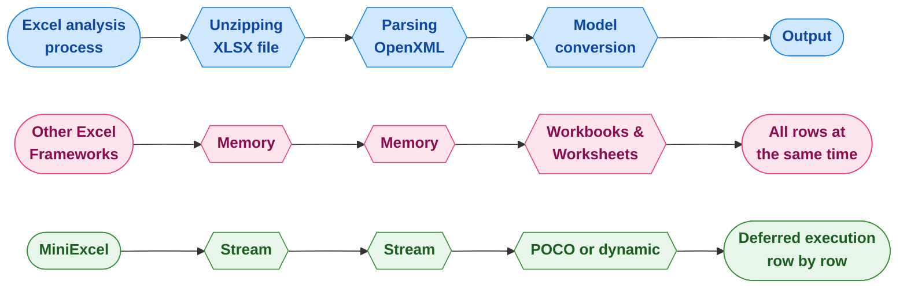

<div align="center">
<p><a href="https://www.nuget.org/packages/MiniExcel"></a>  <a href="https://www.nuget.org/packages/MiniExcel"></a>
<a href="https://ci.appveyor.com/project/mini-software/miniexcel/branch/master"></a>
<a href="https://gitee.com/dotnetchina/MiniExcel"></a> <a href="https://github.com/mini-software/MiniExcel" rel="nofollow"></a>
<a href="https://www.nuget.org/packages/MiniExcel"></a>
<a href="https://deepwiki.com/mini-software/MiniExcel"></a>
</p>
</div>

---

[](https://www.dotnetfoundation.org/)

<div align="center">
<p>এই প্ৰকল্পটো <a href="https://www.dotnetfoundation.org/">.NET Foundation</a>-ৰ অংশ আৰু তেওঁলোকৰ <a href="https://www.dotnetfoundation.org/code-of-conduct">code of conduct</a>-ৰ অধীনত পৰিচালিত হয়। </p>
</div>

---

<div align="center">
<p><strong><a href="README.md">English</a> | <a href="README.zh-CN.md">简体中文</a> | <a href="https://openaitx.github.io/view.html?user=mini-software&amp;project=MiniExcel&amp;lang=zh-TW">繁體中文</a> | <a href="https://openaitx.github.io/view.html?user=mini-software&amp;project=MiniExcel&amp;lang=ja">日本語</a> | <a href="https://openaitx.github.io/view.html?user=mini-software&amp;project=MiniExcel&amp;lang=ko">한국어</a> | <a href="https://openaitx.github.io/view.html?user=mini-software&amp;project=MiniExcel&amp;lang=hi">हिन्दी</a> | <a href="https://openaitx.github.io/view.html?user=mini-software&amp;project=MiniExcel&amp;lang=th">ไทย</a> | <a href="https://openaitx.github.io/view.html?user=mini-software&amp;project=MiniExcel&amp;lang=fr">Français</a> | <a href="https://openaitx.github.io/view.html?user=mini-software&amp;project=MiniExcel&amp;lang=de">Deutsch</a> | <a href="https://openaitx.github.io/view.html?user=mini-software&amp;project=MiniExcel&amp;lang=es">Español</a> | <a href="https://openaitx.github.io/view.html?user=mini-software&amp;project=MiniExcel&amp;lang=it">Italiano</a> | <a href="https://openaitx.github.io/view.html?user=mini-software&amp;project=MiniExcel&amp;lang=ru">Русский</a> | <a href="https://openaitx.github.io/view.html?user=mini-software&amp;project=MiniExcel&amp;lang=pt">Português</a> | <a href="https://openaitx.github.io/view.html?user=mini-software&amp;project=MiniExcel&amp;lang=nl">Nederlands</a> | <a href="https://openaitx.github.io/view.html?user=mini-software&amp;project=MiniExcel&amp;lang=pl">Polski</a> | <a href="https://openaitx.github.io/view.html?user=mini-software&amp;project=MiniExcel&amp;lang=ar">العربية</a> | <a href="https://openaitx.github.io/view.html?user=mini-software&amp;project=MiniExcel&amp;lang=fa">فارسی</a> | <a href="https://openaitx.github.io/view.html?user=mini-software&amp;project=MiniExcel&amp;lang=tr">Türkçe</a> | <a href="https://openaitx.github.io/view.html?user=mini-software&amp;project=MiniExcel&amp;lang=vi">Tiếng Việt</a> | <a href="https://openaitx.github.io/view.html?user=mini-software&amp;project=MiniExcel&amp;lang=id">Bahasa Indonesia</a><p></p>
</strong></p>
</div>


---

<div align="center">
 আপোনাৰ <a href="https://github.com/mini-software/MiniExcel">ষ্টাৰ্চ</a> বা <a href="https://miniexcel.github.io">দান</a> MiniExcel-ৰ উন্নতি কৰিব পাৰে
</div>

---

### পৰিচয়

MiniExcel হৈছে .NET-ৰ বাবে এটা সৰল আৰু দক্ষ Excel প্ৰসেছিং টুল, যি মেম'ৰী ব্যৱহাৰ কমাবলৈ বিশেষভাৱে ডিজাইন কৰা হৈছে।

বৰ্তমান, বেছি প্ৰচলিত ফ্ৰেমৱৰ্কসমূহে Excel ডকুমেন্টৰ সকলো ডাটা মেম'ৰীত ল'ড কৰিব লাগিছে কাৰ্যকৰীতা সুবিধাৰ বাবে, কিন্তু ইয়াৰে ফলত মেম'ৰী খৰচৰ সমস্যা হব পাৰে। MiniExcel-ৰ পদ্ধতি ভিন্ন: ডাটা ৰ'উ-বাই-ৰ'উ ষ্ট্ৰীমিং পদ্ধতিত প্ৰসেছ কৰা হয়, মূল খৰচ শতাধিক মেগাবাইটৰ পৰা কেৱল কিছু মেগাবাইটলৈ কমাই দিয়ে, ইয়াৰ দ্বাৰা আউট-অফ-মেম'ৰী (OOM) সমস্যা প্ৰভাৱকভাবে ৰোধ কৰে।



### বৈশিষ্ট্যসমূহ

- মেম'ৰি খৰচ কম কৰে, বাহিৰ হৈ যোৱা-স্মৃতি (OOM) ত্ৰুটি ৰোধ কৰে আৰু সম্পূৰ্ণ গাৰ্বেজ সংহৰণ এৰাই চলে
- ডাঙৰ ডেটা ছেটত উন্নত কাৰ্যক্ষমতাৰ বাবে ৰিয়েল-টাইম, ৰ' স্তৰৰ ডেটা অপাৰেচন সক্ৰিয় কৰে
- LINQ ৰ সৈতে স্থগিত কাৰ্যন্বয় সমৰ্থন কৰে, যাৰ ফলত দ্ৰুত, স্মৃতি-দক্ষ পৃষ্ঠাবিভাজন আৰু জটিল অনুসন্ধানসমূহ সম্ভৱ
- হালকা-পাতলা, মাইক্ৰ’চফ্ট অফিচ বা COM+ উপাদানৰ প্ৰয়োজন নাই, আৰু DLL ৰ আকাৰ ৫০০KB তলত
- এক সহজ আৰু বোধগম্য API শৈলী এক্সেল পঢ়া/লিখা/পূৰণৰ বাবে

### সংস্কৰণ ২.০ পূৰ্বদৰ্শন

আমরা আগন্তুক MiniExcel সংস্কৰণত কাম কৰি আছোঁ, এটা নতুন মডুলাৰ আৰু লক্ষ্যভিত্তিক APIৰে,
Core আৰু Csv কাৰ্যক্ষমতাৰ বাবে পৃথক nuget পেকেজ, `IAsyncEnumerable` ৰ জড়িত সম্পূৰ্ণ সমৰ্থন,
আৰু আৰু বহুতো নতুন সুবিধা শীঘ্ৰে আহিব! পেকেজসমূহ পূৰ্ব-প্ৰকাশ অৱস্থাত উপলব্ধ হ'ব, সেয়ে পৰীক্ষা কৰি আপোনাৰ মতামত দিবলৈ নিশ্চিন্তে আগবাঢ়ি আহক!

আপুনি যদি কৰে, তেন্তে [নতুন নথিপত্ৰ](https://raw.githubusercontent.com/mini-software/MiniExcel/master/README-V2.md) আৰু [আপগ্ৰেড টোকা](https://raw.githubusercontent.com/mini-software/MiniExcel/master/V2-Upgrade-Notes.md) চাবলৈো নাপাহৰিব।


### আৰম্ভ কৰক

- [এক্সেল আমদানি/অনুসন্ধান](#getstart1)

- [এক্সেল ৰপ্তানি/সৃষ্টি](#getstart2)

- [এক্সেল টেমপ্লেট](#getstart3)

- [এক্সেল কলাম নাম/সূচী/উপেক্ষা এট্ৰিবিউট](#getstart4)

- [উদাহৰণসমূহ](#getstart5)


### সংস্থাপন

আপুনি পেকেজটো [NuGet ৰ পৰা](https://www.nuget.org/packages/MiniExcel) সংস্থাপন কৰিব পাৰে

### মুক্তি টোকা

অনুগ্ৰহ কৰি [মুক্তি টোকা](docs) পৰীক্ষা কৰক

### TODO

অনুগ্ৰহ কৰি [TODO](https://github.com/mini-software/MiniExcel/projects/1?fullscreen=true) পৰীক্ষা কৰক

### কার্যক্ষমতা

বেঞ্চমাৰ্কসমূহৰ বাবে কোড [MiniExcel.Benchmarks](https://raw.githubusercontent.com/mini-software/MiniExcel/master/benchmarks/MiniExcel.Benchmarks/Program.cs)ত পোৱা যাব।

কার্যক্ষমতা পৰীক্ষাৰ বাবে ব্যৱহৃত ফাইলটো হৈছে [**Test1,000,000x10.xlsx**](https://raw.githubusercontent.com/mini-software/MiniExcel/master/benchmarks/MiniExcel.Benchmarks/Test1%2C000%2C000x10.xlsx), যি এটা ৩২MBৰ ডকুমেণ্ট, য'ত ১,০০০,০০০ শাৰী * ১০ কলাম আছে আৰু সকলো চেলত "HelloWorld" লিখা আছে।

সকলো বেঞ্চমাৰ্ক চলাবলৈ ব্যৱহাৰ কৰক:

```bash
dotnet run -project .\benchmarks\MiniExcel.Benchmarks -c Release -f net9.0 -filter * --join
```

সাম্প্ৰতিক ৰিলিজৰ বাবে বেঞ্চমাৰ্কৰ ফলাফলসমূহ আপুনি [এতিয়া পাব](benchmarks/results)।

### এক্সেল কুৱাৰী/ইম্পৰ্ট  <a name="getstart1"></a>

#### ১. এটা কুৱাৰী এক্সিকিউট কৰক আৰু ফলাফলসমূহ শক্তিশালী টাইপৰ IEnumerable লৈ মেপ কৰক [[Try it]](https://dotnetfiddle.net/w5WD1J)

উত্তম কাৰ্যক্ষমতাৰ বাবে Stream.Query ব্যৱহাৰ কৰাৰ পৰামৰ্শ দিয়া হৈছে।


```csharp
public class UserAccount
{
    public Guid ID { get; set; }
    public string Name { get; set; }
    public DateTime BoD { get; set; }
    public int Age { get; set; }
    public bool VIP { get; set; }
    public decimal Points { get; set; }
}

var rows = MiniExcel.Query<UserAccount>(path);

// or

using (var stream = File.OpenRead(path))
    var rows = stream.Query<UserAccount>();
```


#### ২. এটা অনুসন্ধান চলাও আৰু টেবুলৰ মূৰ ব্যৱহাৰ নকৰাকৈ ডাইনামিক অবজেক্টৰ এখন তালিকালৈ মেপ কৰক [[Try it]](https://dotnetfiddle.net/w5WD1J)

* ডাইনামিক চাবি হৈছে `A.B.C.D..`

| MiniExcel | ১ |
|-----------|---|
| Github    | ২ |

```csharp

var rows = MiniExcel.Query(path).ToList();

// or
using (var stream = File.OpenRead(path))
{
    var rows = stream.Query().ToList();

    Assert.Equal("MiniExcel", rows[0].A);
    Assert.Equal(1, rows[0].B);
    Assert.Equal("Github", rows[1].A);
    Assert.Equal(2, rows[1].B);
}
```

#### ৩. প্ৰথম শিৰোনামৰ সারিৰ সৈতে এটা প্ৰশ্ন চলাও [[Try it]](https://dotnetfiddle.net/w5WD1J)

টোকা : একে নামৰ স্তম্ভ থাকিলে সৰ্বশেষ সোঁফালৰটো ব্যৱহাৰ কৰা হয়

ইনপুট এক্সেল :

| স্তম্ভ১     | স্তম্ভ২   |
|------------|----------|
| MiniExcel  | ১        |
| Github     | ২        |


```csharp

var rows = MiniExcel.Query(useHeaderRow:true).ToList();

// or

using (var stream = File.OpenRead(path))
{
    var rows = stream.Query(useHeaderRow:true).ToList();

    Assert.Equal("MiniExcel", rows[0].Column1);
    Assert.Equal(1, rows[0].Column2);
    Assert.Equal("Github", rows[1].Column1);
    Assert.Equal(2, rows[1].Column2);
}
```

#### ৪. প্ৰশ্নৰ সমৰ্থন LINQ এক্সটেনচন First/Take/Skip ...আদি

প্ৰথম প্ৰশ্ন
```csharp
var row = MiniExcel.Query(path).First();
Assert.Equal("HelloWorld", row.A);

// or

using (var stream = File.OpenRead(path))
{
    var row = stream.Query().First();
    Assert.Equal("HelloWorld", row.A);
}
```

MiniExcel/ExcelDataReader/ClosedXML/EPPlus-ৰ মাজত কাৰ্যক্ষমতাৰ তুলনা


#### ৫. শ্বীট নামৰ আধাৰত অনুসন্ধান

```csharp
MiniExcel.Query(path, sheetName: "SheetName");
//or
stream.Query(sheetName: "SheetName");
```

#### 6. সকলো শ্বীটৰ নাম আৰু শাৰীসমূহ সোধপূছ কৰক

```csharp
var sheetNames = MiniExcel.GetSheetNames(path);
foreach (var sheetName in sheetNames)
{
    var rows = MiniExcel.Query(path, sheetName: sheetName);
}
```

#### ৭. কলামসমূহ প্ৰাপ্ত কৰক

```csharp
var columns = MiniExcel.GetColumns(path); // e.g result : ["A","B"...]

var cnt = columns.Count;  // get column count
```

#### 8. ডাইনামিক কুৱেৰী ৰো টো `IDictionary<string,object>` লৈ কাষ্ট কৰক

```csharp
foreach(IDictionary<string,object> row in MiniExcel.Query(path))
{
    //..
}

// or
var rows = MiniExcel.Query(path).Cast<IDictionary<string,object>>();
// or Query specified ranges (capitalized)
// A2 represents the second row of column A, C3 represents the third row of column C
// If you don't want to restrict rows, just don't include numbers
var rows = MiniExcel.QueryRange(path, startCell: "A2", endCell: "C3").Cast<IDictionary<string, object>>();
```


#### 9. Query Excel return DataTable

Not recommended, because DataTable will load all data into memory and lose MiniExcel's low memory consumption feature.

```C#
var table = MiniExcel.QueryAsDataTable(path, useHeaderRow: true);
```


#### 10. Specify the cell to start reading data

```csharp
MiniExcel.Query(path,useHeaderRow:true,startCell:"B3")
```


#### 11. Fill Merged Cells

Note: The efficiency is slower compared to `not using merge fill`

Reason: The OpenXml standard puts mergeCells at the bottom of the file, which leads to the need to foreach the sheetxml twice

```csharp
    var config = new OpenXmlConfiguration()
    {
        FillMergedCells = true
    };
    var rows = MiniExcel.Query(path, configuration: config);
```


support variable length and width multi-row and column filling


#### 12. Reading big file by disk-base cache (Disk-Base Cache - SharedString)

If the SharedStrings size exceeds 5 MB, MiniExcel default will use local disk cache, e.g, [10x100000.xlsx](https://github.com/MiniExcel/MiniExcel/files/8403819/NotDuplicateSharedStrings_10x100000.xlsx)(one million rows data), when disable disk cache the maximum memory usage is 195MB, but able disk cache only needs 65MB. Note, this optimization needs some efficiency cost, so this case will increase reading time from 7.4 seconds to 27.2 seconds, If you don't need it that you can disable disk cache with the following code:

```csharp
var config = new OpenXmlConfiguration { EnableSharedStringCache = false };
MiniExcel.Query(path,configuration: config)
```
আপুনি `SharedStringCacheSize` ব্যৱহাৰ কৰি disk caching ৰ বাবে নিৰ্ধাৰিত আকাৰৰ বাহিৰে sharedString ফাইলৰ আকাৰ সলনি কৰিব পাৰে

```csharp
var config = new OpenXmlConfiguration { SharedStringCacheSize=500*1024*1024 };
MiniExcel.Query(path, configuration: config);
```


### Create/Export Excel  <a name="getstart2"></a>

1. Must be a non-abstract type with a public parameterless constructor .

2. MiniExcel support parameter IEnumerable Deferred Execution, If you want to use least memory, please do not call methods such as ToList

e.g : ToList or not memory usage


#### 1. Anonymous or strongly type [[Try it]](https://dotnetfiddle.net/w5WD1J)

```csharp
var path = Path.Combine(Path.GetTempPath(), $"{Guid.NewGuid()}.xlsx");
MiniExcel.SaveAs(path, new[] {
    new { Column1 = "MiniExcel", Column2 = 1 },
    new { Column1 = "Github", Column2 = 2}
});
```

#### 2. `IEnumerable<IDictionary<string, object>>`

```csharp
var values = new List<Dictionary<string, object>>()
{
    new Dictionary<string,object>{{ "Column1", "MiniExcel" }, { "Column2", 1 } },
    new Dictionary<string,object>{{ "Column1", "Github" }, { "Column2", 2 } }
};
MiniExcel.SaveAs(path, values);
```

ফাইল ফলাফল সৃষ্টি কৰক :

| স্তম্ভ১      | স্তম্ভ২   |
|-------------|----------|
| MiniExcel   | ১        |
| Github      | ২        |


#### ৩.  IDataReader
- `পৰামৰ্শযোগ্য`, এইদ্বাৰা সকলো তথ্য মেমৰীত লোড কৰাৰ পৰা বাচি যাব পাৰে
```csharp
MiniExcel.SaveAs(path, reader);
```


DataReader export multiple sheets (recommand by Dapper ExecuteReader)

```csharp
using (var cnn = Connection)
{
    cnn.Open();
    var sheets = new Dictionary<string,object>();
    sheets.Add("sheet1", cnn.ExecuteReader("select 1 id"));
    sheets.Add("sheet2", cnn.ExecuteReader("select 2 id"));
    MiniExcel.SaveAs("Demo.xlsx", sheets);
}
```


#### ৪. ডেটাটেবল

- `সুপৰিশ কৰা নহয়`, এইটো সকলো ডাটা মেমৰিত ল'ড কৰিব

- DataTable-এ প্ৰথমে কেপছনক কলাম নাম হিচাপে ব্যৱহাৰ কৰে, তাৰ পাছত কলাম নাম ব্যৱহাৰ কৰে

```csharp
var path = Path.Combine(Path.GetTempPath(), $"{Guid.NewGuid()}.xlsx");
var table = new DataTable();
{
    table.Columns.Add("Column1", typeof(string));
    table.Columns.Add("Column2", typeof(decimal));
    table.Rows.Add("MiniExcel", 1);
    table.Rows.Add("Github", 2);
}

MiniExcel.SaveAs(path, table);
```

####  ৫. Dapper Query

ধন্যবাদ @shaofing #552 , অনুগ্ৰহ কৰি `CommandDefinition + CommandFlags.NoCache` ব্যৱহাৰ কৰক

```csharp
using (var connection = GetConnection(connectionString))
{
    var rows = connection.Query(
        new CommandDefinition(
            @"select 'MiniExcel' as Column1,1 as Column2 union all select 'Github',2"
            , flags: CommandFlags.NoCache)
        );
    // Note: QueryAsync will throw close connection exception
    MiniExcel.SaveAs(path, rows);
}
```
তলত থকা কোডে সকলো ডাটা মেম'ৰীত ল'ড কৰিব


```csharp
using (var connection = GetConnection(connectionString))
{
    var rows = connection.Query(@"select 'MiniExcel' as Column1,1 as Column2 union all select 'Github',2");
    MiniExcel.SaveAs(path, rows);
}
```


#### 6. SaveAs to MemoryStream  [[Try it]](https://dotnetfiddle.net/JOen0e)

```csharp
using (var stream = new MemoryStream()) //support FileStream,MemoryStream ect.
{
    stream.SaveAs(values);
}
```

উদাহৰণস্বৰূপ : এক্সেলে ৰপ্তানি কৰাৰ API

```csharp
public IActionResult DownloadExcel()
{
    var values = new[] {
        new { Column1 = "MiniExcel", Column2 = 1 },
        new { Column1 = "Github", Column2 = 2}
    };

    var memoryStream = new MemoryStream();
    memoryStream.SaveAs(values);
    memoryStream.Seek(0, SeekOrigin.Begin);
    return new FileStreamResult(memoryStream, "application/vnd.openxmlformats-officedocument.spreadsheetml.sheet")
    {
        FileDownloadName = "demo.xlsx"
    };
}
```


#### 7. Create Multiple Sheets

```csharp
// 1. Dictionary<string,object>
var users = new[] { new { Name = "Jack", Age = 25 }, new { Name = "Mike", Age = 44 } };
var department = new[] { new { ID = "01", Name = "HR" }, new { ID = "02", Name = "IT" } };
var sheets = new Dictionary<string, object>
{
    ["users"] = users,
    ["department"] = department
};
MiniExcel.SaveAs(path, sheets);

// 2. DataSet
var sheets = new DataSet();
sheets.Add(UsersDataTable);
sheets.Add(DepartmentDataTable);
//..
MiniExcel.SaveAs(path, sheets);
```


#### 8. TableStyles Options

Default style


Without style configuration

```csharp
var config = new OpenXmlConfiguration()
{
     TableStyles = TableStyles.None
};
MiniExcel.SaveAs(path, value,configuration:config);
```


#### 9. AutoFilter

Since v0.19.0  `OpenXmlConfiguration.AutoFilter` can en/unable AutoFilter , default value is `true`, and setting AutoFilter way:

```csharp
MiniExcel.SaveAs(path, value, configuration: new OpenXmlConfiguration() { AutoFilter = false });
```


#### 10. Create Image

```csharp
var value = new[] {
    new { Name="github",Image=File.ReadAllBytes(PathHelper.GetFile("images/github_logo.png"))},
    new { Name="google",Image=File.ReadAllBytes(PathHelper.GetFile("images/google_logo.png"))},
    new { Name="microsoft",Image=File.ReadAllBytes(PathHelper.GetFile("images/microsoft_logo.png"))},
    new { Name="reddit",Image=File.ReadAllBytes(PathHelper.GetFile("images/reddit_logo.png"))},
    new { Name="statck_overflow",Image=File.ReadAllBytes(PathHelper.GetFile("images/statck_overflow_logo.png"))},
};
MiniExcel.SaveAs(path, value);
```


#### ১১. বাইট এৰে ফাইল এক্সপোৰ্ট

সংস্কৰণ 1.22.0ৰ পৰা, যেতিয়া মানৰ ধৰণ `byte[]` হয় তেতিয়া ব্যৱস্থাই ডিফ’ল্টভাৱে চেলত ফাইল পথ সংৰক্ষণ কৰিব, আৰু ইম্প’ৰ্ট কৰাৰ সময়ত ব্যৱস্থাই ইয়াক `byte[]`লৈ ৰূপান্তৰ কৰিব পাৰে। আৰু যদি আপুনি ইয়াক ব্যৱহাৰ কৰিব নোখোজে, তেন্তে আপুনি `OpenXmlConfiguration.EnableConvertByteArray`ক `false` হিচাপে ছেট কৰিব পাৰে, ইয়াৰ দ্বাৰা ব্যৱস্থাৰ কার্যক্ষমতা বৃদ্ধি কৰিব পাৰে।


সংস্কৰণ 1.22.0ৰ পৰা, যেতিয়া মানৰ ধৰণ `byte[]` হয় তেতিয়া ব্যৱস্থাই ডিফ’ল্টভাৱে চেলত ফাইল পথ সংৰক্ষণ কৰিব, আৰু ইম্প’ৰ্ট কৰাৰ সময়ত ব্যৱস্থাই ইয়াক `byte[]`লৈ ৰূপান্তৰ কৰিব পাৰে। আৰু যদি আপুনি ইয়াক ব্যৱহাৰ কৰিব নোখোজে, তেন্তে আপুনি `OpenXmlConfiguration.EnableConvertByteArray`ক `false` হিচাপে ছেট কৰিব পাৰে, ইয়াৰ দ্বাৰা ব্যৱস্থাৰ কার্যক্ষমতা বৃদ্ধি কৰিব পাৰে।


#### ১২. একে চেলসমূহ উলম্বভাৱে মাৰ্জ কৰা

এই ফিচাৰটো কেৱল `xlsx` ফৰ্মেটত সমৰ্থিত আৰু @merge আৰু @endmerge টেগৰ মাজত চেলসমূহ উলম্বভাৱে মাৰ্জ কৰে।
আপুনি @mergelimit ব্যৱহাৰ কৰি চেলসমূহ উলম্বভাৱে মাৰ্জ কৰাৰ সীমা নিৰ্ধাৰণ কৰিব পাৰে।

```csharp
var mergedFilePath = Path.Combine(Path.GetTempPath(), $"{Guid.NewGuid().ToString()}.xlsx");

var path = @"../../../../../samples/xlsx/TestMergeWithTag.xlsx";

MiniExcel.MergeSameCells(mergedFilePath, path);
```

```csharp
var memoryStream = new MemoryStream();

var path = @"../../../../../samples/xlsx/TestMergeWithTag.xlsx";

memoryStream.MergeSameCells(path);
```

File content before and after merge:

Without merge limit:


With merge limit:


#### 13. Skip null values

New explicit option to write empty cells for null values:

```csharp
DataTable dt = new DataTable();

/* ... */

DataRow dr = dt.NewRow();

dr["Name1"] = "Somebody once";
dr["Name2"] = null;
dr["Name3"] = "told me.";

dt.Rows.Add(dr);

OpenXmlConfiguration configuration = new OpenXmlConfiguration()
{
     EnableWriteNullValueCell = true // Default value.
};

MiniExcel.SaveAs(@"C:\temp\Book1.xlsx", dt, configuration: configuration);
```


```xml
<x:row r="2">
    <x:c r="A2" t ="str" s="2">
        <x:v>Somebody once</x:v>
    </x:c>
    <x:c r="B2" s="2"></x:c>
    <x:c r="C2" t ="str" s="2">
        <x:v>told me.</x:v>
    </x:c>
</x:row>
```

পূৰ্বৰ আচৰণ:

```csharp
/* ... */

OpenXmlConfiguration configuration = new OpenXmlConfiguration()
{
     EnableWriteNullValueCell = false // Default value is true.
};

MiniExcel.SaveAs(@"C:\temp\Book1.xlsx", dt, configuration: configuration);
```


```xml
<x:row r="2">
    <x:c r="A2" t ="str" s="2">
        <x:v>Somebody once</x:v>
    </x:c>
    <x:c r="B2" t ="str" s="2">
        <x:v></x:v>
    </x:c>
    <x:c r="C2" t ="str" s="2">
        <x:v>told me.</x:v>
    </x:c>
</x:row>
```

null আৰু DBNull মানৰ বাবে কাম কৰে।

#### 14. পেন স্থিৰ কৰক
```csharp
/* ... */

OpenXmlConfiguration configuration = new OpenXmlConfiguration()
{
    FreezeRowCount = 1,     // default is 1
    FreezeColumnCount = 2   // default is 0
};

MiniExcel.SaveAs(@"C:\temp\Book1.xlsx", dt, configuration: configuration);
```


### এক্সেল টেম্পলেটত ডাটা ভৰাওক <a name="getstart3"></a>

- ঘোষণা Vue টেম্পলেটৰ দৰে `{{variable name}}`, অথবা সংগ্ৰহ ৰেণ্ডাৰিং `{{collection name.field name}}`
- সংগ্ৰহ ৰেণ্ডাৰিংয়ে IEnumerable/DataTable/DapperRow সমৰ্থন কৰে

#### ১. মৌলিক ভৰ্তি

টেম্পলেট:


ফলাফল:


কোড:
```csharp
// 1. By POCO
var value = new
{
    Name = "Jack",
    CreateDate = new DateTime(2021, 01, 01),
    VIP = true,
    Points = 123
};
MiniExcel.SaveAsByTemplate(path, templatePath, value);


// 2. By Dictionary
var value = new Dictionary<string, object>()
{
    ["Name"] = "Jack",
    ["CreateDate"] = new DateTime(2021, 01, 01),
    ["VIP"] = true,
    ["Points"] = 123
};
MiniExcel.SaveAsByTemplate(path, templatePath, value);
```


#### 2. IEnumerable ডাটা ভৰ্ত্তি

> টিপ্পনী1: তালিকা ভৰ্ত্তিৰ আধাৰ হিচাপে একে কলামৰ প্ৰথম IEnumerable ব্যৱহাৰ কৰক

টেমপ্লেট:


ফলাফল:


কোড:

```csharp
//1. By POCO
var value = new
{
    employees = new[] {
        new {name="Jack",department="HR"},
        new {name="Lisa",department="HR"},
        new {name="John",department="HR"},
        new {name="Mike",department="IT"},
        new {name="Neo",department="IT"},
        new {name="Loan",department="IT"}
    }
};
MiniExcel.SaveAsByTemplate(path, templatePath, value);

//2. By Dictionary
var value = new Dictionary<string, object>()
{
    ["employees"] = new[] {
        new {name="Jack",department="HR"},
        new {name="Lisa",department="HR"},
        new {name="John",department="HR"},
        new {name="Mike",department="IT"},
        new {name="Neo",department="IT"},
        new {name="Loan",department="IT"}
    }
};
MiniExcel.SaveAsByTemplate(path, templatePath, value);
```


#### 3. Complex Data Fill

> Note: Support multi-sheets and using same varible

Template:


Result:


```csharp
// 1. By POCO
var value = new
{
    title = "FooCompany",
    managers = new[] {
        new {name="Jack",department="HR"},
        new {name="Loan",department="IT"}
    },
    employees = new[] {
        new {name="Wade",department="HR"},
        new {name="Felix",department="HR"},
        new {name="Eric",department="IT"},
        new {name="Keaton",department="IT"}
    }
};
MiniExcel.SaveAsByTemplate(path, templatePath, value);

// 2. By Dictionary
var value = new Dictionary<string, object>()
{
    ["title"] = "FooCompany",
    ["managers"] = new[] {
        new {name="Jack",department="HR"},
        new {name="Loan",department="IT"}
    },
    ["employees"] = new[] {
        new {name="Wade",department="HR"},
        new {name="Felix",department="HR"},
        new {name="Eric",department="IT"},
        new {name="Keaton",department="IT"}
    }
};
MiniExcel.SaveAsByTemplate(path, templatePath, value);
```

#### 4. Fill Big Data Performance

> NOTE: Using IEnumerable deferred execution not ToList can save max memory usage in MiniExcel


#### 5. Cell value auto mapping type

Template


Result


Class

```csharp
public class Poco
{
    public string @string { get; set; }
    public int? @int { get; set; }
    public decimal? @decimal { get; set; }
    public double? @double { get; set; }
    public DateTime? datetime { get; set; }
    public bool? @bool { get; set; }
    public Guid? Guid { get; set; }
}
```

কোড

```csharp
var poco = new TestIEnumerableTypePoco { @string = "string", @int = 123, @decimal = decimal.Parse("123.45"), @double = (double)123.33, @datetime = new DateTime(2021, 4, 1), @bool = true, @Guid = Guid.NewGuid() };
var value = new
{
    Ts = new[] {
        poco,
        new TestIEnumerableTypePoco{},
        null,
        poco
    }
};
MiniExcel.SaveAsByTemplate(path, templatePath, value);
```


#### 6. Example :  List Github Projects

Template


Result


Code

```csharp
var projects = new[]
{
    new {Name = "MiniExcel",Link="https://github.com/mini-software/MiniExcel",Star=146, CreateTime=new DateTime(2021,03,01)},
    new {Name = "HtmlTableHelper",Link="https://github.com/mini-software/HtmlTableHelper",Star=16, CreateTime=new DateTime(2020,02,01)},
    new {Name = "PocoClassGenerator",Link="https://github.com/mini-software/PocoClassGenerator",Star=16, CreateTime=new DateTime(2019,03,17)}
};
var value = new
{
    User = "ITWeiHan",
    Projects = projects,
    TotalStar = projects.Sum(s => s.Star)
};
MiniExcel.SaveAsByTemplate(path, templatePath, value);
```

#### 7. গুচ্ছবদ্ধ তথ্য পূৰণ

```csharp
var value = new Dictionary<string, object>()
{
    ["employees"] = new[] {
        new {name="Jack",department="HR"},
        new {name="Jack",department="HR"},
        new {name="John",department="HR"},
        new {name="John",department="IT"},
        new {name="Neo",department="IT"},
        new {name="Loan",department="IT"}
    }
};
await MiniExcel.SaveAsByTemplateAsync(path, templatePath, value);
```
##### 1. `@group` টেগৰ সৈতে আৰু `@header` টেগৰ সৈতে

আগতে


পিচত


##### 2. @group টেগৰ সৈতে আৰু @header টেগ নোহোৱাকৈ

আগতে


পিচত


##### 3. @group টেগ নোহোৱাকৈ

আগতে


পিচত


#### 8. If/ElseIf/Else বিবৃতিবোৰ চেলৰ ভিতৰত

নিয়মসমূহ:
1. DateTime, Double, Intৰ বাবে ==, !=, >, >=, <, <= অপাৰেটৰ সমৰ্থন কৰে।
2. Stringৰ বাবে ==, != অপাৰেটৰ সমৰ্থন কৰে।
3. প্ৰতিটো বিবৃতি নতুন শাৰীত হ’ব লাগে।
4. অপাৰেটৰৰ আগত আৰু পাছত এটা স্পেছ থাকিব লাগে।
5. বিবৃতিৰ ভিতৰত নতুন শাৰী নাথাকিব।
6. চেলটো ঠিক তলত দিয়া ফৰ্মেটত হ’ব লাগে।

```csharp
@if(name == Jack)
{{employees.name}}
@elseif(name == Neo)
Test {{employees.name}}
@else
{{employees.department}}
@endif
```

Before


After


#### 9. DataTable as parameter

```csharp
var managers = new DataTable();
{
    managers.Columns.Add("name");
    managers.Columns.Add("department");
    managers.Rows.Add("Jack", "HR");
    managers.Rows.Add("Loan", "IT");
}
var value = new Dictionary<string, object>()
{
    ["title"] = "FooCompany",
    ["managers"] = managers,
};
MiniExcel.SaveAsByTemplate(path, templatePath, value);
```
#### ১০. সূত্রসমূহ

##### ১. উদাহৰণ
আপোনাৰ সূত্রটোত `$` prefix কৰক আৰু `$enumrowstart` আৰু `$enumrowend` ব্যৱহাৰ কৰক enumerable আৰম্ভ আৰু শেষ ৰো references চিহ্নিত কৰিবলৈ:


যেতিয়া template ৰেণ্ডাৰ কৰা হয়, `$` prefix আঁতৰাই দিয়া হয় আৰু `$enumrowstart` আৰু `$enumrowend` enumerable ৰ আৰম্ভ আৰু শেষ ৰো নম্বৰৰে প্ৰতিস্থাপন কৰা হয়:


##### ২. আন উদাহৰণ সূত্রসমূহ:

|              |                                                                                           |
|--------------|-------------------------------------------------------------------------------------------|
| Sum          | `$=SUM(C{{$enumrowstart}}:C{{$enumrowend}})`                                              |
| Alt. Average | `$=SUM(C{{$enumrowstart}}:C{{$enumrowend}}) / COUNT(C{{$enumrowstart}}:C{{$enumrowend}})` |
| Range        | `$=MAX(C{{$enumrowstart}}:C{{$enumrowend}}) - MIN(C{{$enumrowstart}}:C{{$enumrowend}})`   |


#### ১১. অন্যান্য

##### ১. template parameter key পৰীক্ষা কৰা

V1.24.0 পৰা, default ভাৱে template ৰ হেৰাই যোৱা parameter key উপেক্ষা কৰি খালী stringৰে প্ৰতিস্থাপন কৰে, `IgnoreTemplateParameterMissing` exception ফেলিব নে নাই নিয়ন্ত্ৰণ কৰিব পাৰে.

```csharp
var config = new OpenXmlConfiguration()
{
    IgnoreTemplateParameterMissing = false,
};
MiniExcel.SaveAsByTemplate(path, templatePath, value, config)
```


### Excel Column Name/Index/Ignore Attribute <a name="getstart4"></a>


#### 1. Specify the column name, column index, column ignore

Excel Example


Code

```csharp
public class ExcelAttributeDemo
{
    [ExcelColumnName("Column1")]
    public string Test1 { get; set; }
    [ExcelColumnName("Column2")]
    public string Test2 { get; set; }
    [ExcelIgnore]
    public string Test3 { get; set; }
    [ExcelColumnIndex("I")] // system will convert "I" to 8 index
    public string Test4 { get; set; }
    public string Test5 { get; } //wihout set will ignore
    public string Test6 { get; private set; } //un-public set will ignore
    [ExcelColumnIndex(3)] // start with 0
    public string Test7 { get; set; }
}

var rows = MiniExcel.Query<ExcelAttributeDemo>(path).ToList();
Assert.Equal("Column1", rows[0].Test1);
Assert.Equal("Column2", rows[0].Test2);
Assert.Null(rows[0].Test3);
Assert.Equal("Test7", rows[0].Test4);
Assert.Null(rows[0].Test5);
Assert.Null(rows[0].Test6);
Assert.Equal("Test4", rows[0].Test7);
```


#### 2. Custom Format (ExcelFormatAttribute)

Since V0.21.0 support class which contains `ToString(string content)` method format

Class

```csharp
public class Dto
{
    public string Name { get; set; }

    [ExcelFormat("MMMM dd, yyyy")]
    public DateTime InDate { get; set; }
}
```

ক'ড

```csharp
var value = new Dto[] {
    new Issue241Dto{ Name="Jack",InDate=new DateTime(2021,01,04)},
    new Issue241Dto{ Name="Henry",InDate=new DateTime(2020,04,05)},
};
MiniExcel.SaveAs(path, value);
```

Result


Query supports custom format conversion


#### 3. Set Column Width(ExcelColumnWidthAttribute)

```csharp
public class Dto
{
    [ExcelColumnWidth(20)]
    public int ID { get; set; }
    [ExcelColumnWidth(15.50)]
    public string Name { get; set; }
}
```

#### ৪. একে সম্পত্তিলৈ একাধিক কলাম নামৰ নকশা।

```csharp
public class Dto
{
    [ExcelColumnName(excelColumnName:"EmployeeNo",aliases:new[] { "EmpNo","No" })]
    public string Empno { get; set; }
    public string Name { get; set; }
}
```


#### 5. System.ComponentModel.DisplayNameAttribute = ExcelColumnName.excelColumnNameAttribute

Since 1.24.0, system supports System.ComponentModel.DisplayNameAttribute = ExcelColumnName.excelColumnNameAttribute

```C#
public class TestIssueI4TXGTDto
{
    public int ID { get; set; }
    public string Name { get; set; }
    [DisplayName("Specification")]
    public string Spc { get; set; }
    [DisplayName("Unit Price")]
    public decimal Up { get; set; }
}
```


#### 6. ExcelColumnAttribute

V1.26.0ৰ পৰা, বহুতো এট্ৰিবিউট তলত দিয়া দৰে সহজ কৰা যাব :

```csharp
        public class TestIssueI4ZYUUDto
        {
            [ExcelColumn(Name = "ID",Index =0)]
            public string MyProperty { get; set; }
            [ExcelColumn(Name = "CreateDate", Index = 1,Format ="yyyy-MM",Width =100)]
            public DateTime MyProperty2 { get; set; }
        }
```


#### 7. DynamicColumnAttribute

V1.26.0ৰ পৰাই, আমি Column ৰ গুণাবলীসমূহ dynamic ৰূপে নিৰ্ধাৰণ কৰিব পাৰো
```csharp
            var config = new OpenXmlConfiguration
            {
                DynamicColumns = new DynamicExcelColumn[] {
                    new DynamicExcelColumn("id"){Ignore=true},
                    new DynamicExcelColumn("name"){Index=1,Width=10},
                    new DynamicExcelColumn("createdate"){Index=0,Format="yyyy-MM-dd",Width=15},
                    new DynamicExcelColumn("point"){Index=2,Name="Account Point"},
                }
            };
            var path = PathHelper.GetTempPath();
            var value = new[] { new { id = 1, name = "Jack", createdate = new DateTime(2022, 04, 12) ,point = 123.456} };
            MiniExcel.SaveAs(path, value, configuration: config);
```


#### 8. DynamicSheetAttribute

V1.31.4 পৰা আমি Sheet ৰ গুণাবলী dynamic ৰূপে স্থাপন কৰিব পাৰো। আমি sheet ৰ নাম আৰু অৱস্থা (দৃশ্যমানতা) স্থাপন কৰিব পাৰো।
```csharp
            var configuration = new OpenXmlConfiguration
            {
                DynamicSheets = new DynamicExcelSheet[] {
                    new DynamicExcelSheet("usersSheet") { Name = "Users", State = SheetState.Visible },
                    new DynamicExcelSheet("departmentSheet") { Name = "Departments", State = SheetState.Hidden }
                }
            };

            var users = new[] { new { Name = "Jack", Age = 25 }, new { Name = "Mike", Age = 44 } };
            var department = new[] { new { ID = "01", Name = "HR" }, new { ID = "02", Name = "IT" } };
            var sheets = new Dictionary<string, object>
            {
                ["usersSheet"] = users,
                ["departmentSheet"] = department
            };

            var path = PathHelper.GetTempPath();
            MiniExcel.SaveAs(path, sheets, configuration: configuration);
```

আমরা নতুন গুণ ExcelSheetAttribute ব্যৱহাৰ কৰিব পাৰে:

```C#
   [ExcelSheet(Name = "Departments", State = SheetState.Hidden)]
   private class DepartmentDto
   {
      [ExcelColumn(Name = "ID",Index = 0)]
      public string ID { get; set; }
      [ExcelColumn(Name = "Name",Index = 1)]
      public string Name { get; set; }
   }
```

### Add, Delete, Update

#### Add

v1.28.0 support CSV insert N rows data after last row

```csharp
// Origin
{
    var value = new[] {
          new { ID=1,Name ="Jack",InDate=new DateTime(2021,01,03)},
          new { ID=2,Name ="Henry",InDate=new DateTime(2020,05,03)},
    };
    MiniExcel.SaveAs(path, value);
}
// Insert 1 rows after last
{
    var value = new { ID=3,Name = "Mike", InDate = new DateTime(2021, 04, 23) };
    MiniExcel.Insert(path, value);
}
// Insert N rows after last
{
    var value = new[] {
          new { ID=4,Name ="Frank",InDate=new DateTime(2021,06,07)},
          new { ID=5,Name ="Gloria",InDate=new DateTime(2022,05,03)},
    };
    MiniExcel.Insert(path, value);
}
```


v1.37.0 support excel insert a new sheet into an existing workbook

```csharp
// Origin excel
{
    var value = new[] {
          new { ID=1,Name ="Jack",InDate=new DateTime(2021,01,03)},
          new { ID=2,Name ="Henry",InDate=new DateTime(2020,05,03)},
    };
    MiniExcel.SaveAs(path, value, sheetName: "Sheet1");
}
// Insert a new sheet
{
    var value = new { ID=3,Name = "Mike", InDate = new DateTime(2021, 04, 23) };
    MiniExcel.Insert(path, table, sheetName: "Sheet2");
}
```


#### মচি পেলাওক(অপেক্ষা কৰি আছে)

#### আপডেট কৰক(অপেক্ষা কৰি আছে)


### এক্সেল টাইপ স্বচালিত পৰীক্ষা <a name="getstart5"></a>

- MiniExcel-এ অব্যৱহাৰিকভাৱে `file extension`-ৰ আধাৰত xlsx নে csv চাব, কিন্তু ইয়াত অসঠিকতা থাকিব পাৰে, অনুগ্ৰহ কৰি নিজে নিৰ্দিষ্ট কৰক।
- Stream-ৰ পৰা কোন excel-ৰ পৰা আহিছে জানিব নোৱাৰি, অনুগ্ৰহ কৰি নিজে নিৰ্দিষ্ট কৰক।

```csharp
stream.SaveAs(excelType:ExcelType.CSV);
//or
stream.SaveAs(excelType:ExcelType.XLSX);
//or
stream.Query(excelType:ExcelType.CSV);
//or
stream.Query(excelType:ExcelType.XLSX);
```


### CSV

#### Note

- Default return `string` type, and value will not be converted to numbers or datetime, unless the type is defined by strong typing generic.


#### Custom separator

The default is `,` as the separator, you can modify the `Seperator` property for customization

```csharp
var config = new MiniExcelLibs.Csv.CsvConfiguration()
{
    Seperator=';'
};
MiniExcel.SaveAs(path, values,configuration: config);
```
V1.30.1ৰ পৰা কাষ্টম ছেপাৰেটৰ ব্যৱহাৰ কৰাৰ ফাংকশ্যন সমৰ্থন কৰে (ধন্যবাদ @hyzx86)


```csharp
var config = new CsvConfiguration()
{
    SplitFn = (row) => Regex.Split(row, $"[\t,](?=(?:[^\"]|\"[^\"]*\")*$)")
        .Select(s => Regex.Replace(s.Replace("\"\"", "\""), "^\"|\"$", "")).ToArray()
};
var rows = MiniExcel.Query(path, configuration: config).ToList();
```


#### Custom line break

The default is `\r\n` as the newline character, you can modify the `NewLine` property for customization

```csharp
var config = new MiniExcelLibs.Csv.CsvConfiguration()
{
    NewLine='\n'
};
MiniExcel.SaveAs(path, values,configuration: config);
```


#### কাষ্টম ক'ডিং

- ডিফল্ট এনক'ডিং হৈছে "বাইট অৰ্ডাৰ মাৰ্কৰ পৰা এনক'ডিং চিনাক্ত কৰক"  (detectEncodingFromByteOrderMarks: true)
- যদি আপোনাৰ কাষ্টম এনক'ডিংৰ প্ৰয়োজন থাকে, অনুগ্ৰহ কৰি StreamReaderFunc / StreamWriterFunc  গুণ সম্পাদনা কৰক

```csharp
// Read
var config = new MiniExcelLibs.Csv.CsvConfiguration()
{
    StreamReaderFunc = (stream) => new StreamReader(stream,Encoding.GetEncoding("gb2312"))
};
var rows = MiniExcel.Query(path, true,excelType:ExcelType.CSV,configuration: config);

// Write
var config = new MiniExcelLibs.Csv.CsvConfiguration()
{
    StreamWriterFunc = (stream) => new StreamWriter(stream, Encoding.GetEncoding("gb2312"))
};
MiniExcel.SaveAs(path, value,excelType:ExcelType.CSV, configuration: config);
```

#### খালী ষ্ট্ৰিংক null হিচাপে পঢ়ক

ডিফল্টভাৱে, খালী মানসমূহ string.Empty লৈ মেপ কৰা হয়। আপুনি এই আচৰণ সংশোধন কৰিব পাৰে

```csharp
var config = new MiniExcelLibs.Csv.CsvConfiguration()
{
   ReadEmptyStringAsNull = true
};
```


### DataReader

#### ১. GetReader
১.২৩.০ ৰ পৰা, আপুনি GetDataReader ব্যৱহাৰ কৰিব পাৰে

```csharp
    using (var reader = MiniExcel.GetReader(path,true))
    {
        while (reader.Read())
        {
            for (int i = 0; i < reader.FieldCount; i++)
            {
                var value = reader.GetValue(i);
            }
        }
    }
```


###  Async

- v0.17.0 support Async (thanks isdaniel ( SHIH,BING-SIOU)](https://github.com/isdaniel))

```csharp
public static Task SaveAsAsync(string path, object value, bool printHeader = true, string sheetName = "Sheet1", ExcelType excelType = ExcelType.UNKNOWN, IConfiguration configuration = null)
public static Task SaveAsAsync(this Stream stream, object value, bool printHeader = true, string sheetName = "Sheet1", ExcelType excelType = ExcelType.XLSX, IConfiguration configuration = null)
public static Task<IEnumerable<dynamic>> QueryAsync(string path, bool useHeaderRow = false, string sheetName = null, ExcelType excelType = ExcelType.UNKNOWN, string startCell = "A1", IConfiguration configuration = null)
public static Task<IEnumerable<T>> QueryAsync<T>(this Stream stream, string sheetName = null, ExcelType excelType = ExcelType.UNKNOWN, string startCell = "A1", IConfiguration configuration = null) where T : class, new()
public static Task<IEnumerable<T>> QueryAsync<T>(string path, string sheetName = null, ExcelType excelType = ExcelType.UNKNOWN, string startCell = "A1", IConfiguration configuration = null) where T : class, new()
public static Task<IEnumerable<IDictionary<string, object>>> QueryAsync(this Stream stream, bool useHeaderRow = false, string sheetName = null, ExcelType excelType = ExcelType.UNKNOWN, string startCell = "A1", IConfiguration configuration = null)
public static Task SaveAsByTemplateAsync(this Stream stream, string templatePath, object value)
public static Task SaveAsByTemplateAsync(this Stream stream, byte[] templateBytes, object value)
public static Task SaveAsByTemplateAsync(string path, string templatePath, object value)
public static Task SaveAsByTemplateAsync(string path, byte[] templateBytes, object value)
public static Task<DataTable> QueryAsDataTableAsync(string path, bool useHeaderRow = true, string sheetName = null, ExcelType excelType = ExcelType.UNKNOWN, string startCell = "A1", IConfiguration configuration = null)
```

-  v1.25.0 ত `cancellationToken` সমৰ্থন কৰে।


### অন্যান্য

#### 1. Enum

নিশ্চিত কৰক যে excel আৰু সম্পত্তিৰ নাম একে, ব্যৱস্থা স্বয়ংক্ৰিয়ভাৱে মেপিং কৰিব (case insensitive)


V0.18.0ৰ পৰা Enum Description সমৰ্থন কৰে

```csharp
public class Dto
{
    public string Name { get; set; }
    public I49RYZUserType UserType { get; set; }
}

public enum Type
{
    [Description("General User")]
    V1,
    [Description("General Administrator")]
    V2,
    [Description("Super Administrator")]
    V3
}
```


Since 1.30.0 version support excel Description to Enum , thanks @KaneLeung

#### 2. Convert CSV to XLSX or Convert XLSX to CSV

```csharp
MiniExcel.ConvertXlsxToCsv(xlsxPath, csvPath);
MiniExcel.ConvertXlsxToCsv(xlsxStream, csvStream);
MiniExcel.ConvertCsvToXlsx(csvPath, xlsxPath);
MiniExcel.ConvertCsvToXlsx(csvStream, xlsxStream);
```
```csharp
using (var excelStream = new FileStream(path: filePath, FileMode.Open, FileAccess.Read))
using (var csvStream = new MemoryStream())
{
   MiniExcel.ConvertXlsxToCsv(excelStream, csvStream);
}
```

#### ৩. কাষ্টম CultureInfo

১.২২.০ ৰ পৰা, আপোনি তলত দেখুৱাই দিয়া দৰে CultureInfo কাষ্টম কৰিব পাৰে, ব্যৱস্থাৰ ডিফল্ট `CultureInfo.InvariantCulture`।

```csharp
var config = new CsvConfiguration()
{
    Culture = new CultureInfo("fr-FR"),
};
MiniExcel.SaveAs(path, value, configuration: config);

// or
MiniExcel.Query(path, configuration: config);
```
  
#### ৪. কাষ্টম বাফাৰ আকাৰ

```csharp
    public abstract class Configuration : IConfiguration
    {
        public int BufferSize { get; set; } = 1024 * 512;
    }
```

#### ৫. FastMode

প্ৰণালীটোৱে মেম'ৰি নিয়ন্ত্ৰণ নকৰিব, কিন্তু আপুনি অধিক তৎপৰ সংৰক্ষণ গতি পাব।

```csharp
var config = new OpenXmlConfiguration() { FastMode = true };
MiniExcel.SaveAs(path, reader,configuration:config);
```

#### 6. বেট্চ ছবি যোগ কৰক (MiniExcel.AddPicture)

অনুগ্ৰহ কৰি ছবিসমূহ বেট্চত শাৰী ডাটা সৃষ্টি কৰাৰ আগতে যোগ কৰক, নহয় AddPicture কল কৰাৰ সময়ত ব্যৱস্থাই অধিক মেম'ৰি ব্যৱহাৰ কৰিব।

```csharp
var images = new[]
{
    new MiniExcelPicture
    {
        ImageBytes = File.ReadAllBytes(PathHelper.GetFile("images/github_logo.png")),
        SheetName = null, // default null is first sheet
        CellAddress = "C3", // required
    },
    new MiniExcelPicture
    {
        ImageBytes = File.ReadAllBytes(PathHelper.GetFile("images/google_logo.png")),
        PictureType = "image/png", // default PictureType = image/png
        SheetName = "Demo",
        CellAddress = "C9", // required
        WidthPx = 100,
        HeightPx = 100,
    },
};
MiniExcel.AddPicture(path, images);
```


#### 7. Get Sheets Dimension

```csharp
var dim = MiniExcel.GetSheetDimensions(path);
```

### উদাহৰণসমূহ:

#### 1. SQLite & Dapper `ডাঙৰ আকাৰৰ ফাইল` SQL Insert OOM ৰ পৰা ৰক্ষা কৰক

টোকা : Query ৰ পিছত অনুগ্ৰহ কৰি ToList/ToArray পদ্ধতি নকলিব, এইটো কৰিলে সকলো ডাটা মেমৰীত লোড হ’ব

```csharp
using (var connection = new SQLiteConnection(connectionString))
{
    connection.Open();
    using (var transaction = connection.BeginTransaction())
    using (var stream = File.OpenRead(path))
    {
       var rows = stream.Query();
       foreach (var row in rows)
             connection.Execute("insert into T (A,B) values (@A,@B)", new { row.A, row.B }, transaction: transaction);
       transaction.Commit();
    }
}
```

performance:


#### 2. ASP.NET Core 3.1 or MVC 5 Download/Upload Excel Xlsx API Demo [Try it](https://raw.githubusercontent.com/mini-software/MiniExcel/master/tests/MiniExcel.Tests.AspNetCore)

```csharp
public class ApiController : Controller
{
    public IActionResult Index()
    {
        return new ContentResult
        {
            ContentType = "text/html",
            StatusCode = (int)HttpStatusCode.OK,
            Content = @"<html><body>
<a href='api/DownloadExcel'>DownloadExcel</a><br>
<a href='api/DownloadExcelFromTemplatePath'>DownloadExcelFromTemplatePath</a><br>
<a href='api/DownloadExcelFromTemplateBytes'>DownloadExcelFromTemplateBytes</a><br>
<p>Upload Excel</p>
<form method='post' enctype='multipart/form-data' action='/api/uploadexcel'>
    <input type='file' name='excel'> <br>
    <input type='submit' >
</form>
</body></html{{"
        };
    }

    public IActionResult DownloadExcel()
    {
        var values = new[] {
            new { Column1 = "MiniExcel", Column2 = 1 },
            new { Column1 = "Github", Column2 = 2}
        };
        var memoryStream = new MemoryStream();
        memoryStream.SaveAs(values);
        memoryStream.Seek(0, SeekOrigin.Begin);
        return new FileStreamResult(memoryStream, "application/vnd.openxmlformats-officedocument.spreadsheetml.sheet")
        {
            FileDownloadName = "demo.xlsx"
        };
    }

    public IActionResult DownloadExcelFromTemplatePath()
    {
        string templatePath = "TestTemplateComplex.xlsx";

        Dictionary<string, object> value = new Dictionary<string, object>()
        {
            ["title"] = "FooCompany",
            ["managers"] = new[] {
                new {name="Jack",department="HR"},
                new {name="Loan",department="IT"}
            },
            ["employees"] = new[] {
                new {name="Wade",department="HR"},
                new {name="Felix",department="HR"},
                new {name="Eric",department="IT"},
                new {name="Keaton",department="IT"}
            }
        };

        MemoryStream memoryStream = new MemoryStream();
        memoryStream.SaveAsByTemplate(templatePath, value);
        memoryStream.Seek(0, SeekOrigin.Begin);
        return new FileStreamResult(memoryStream, "application/vnd.openxmlformats-officedocument.spreadsheetml.sheet")
        {
            FileDownloadName = "demo.xlsx"
        };
    }

    private static Dictionary<string, Byte[]> TemplateBytesCache = new Dictionary<string, byte[]>();

    static ApiController()
    {
        string templatePath = "TestTemplateComplex.xlsx";
        byte[] bytes = System.IO.File.ReadAllBytes(templatePath);
        TemplateBytesCache.Add(templatePath, bytes);
    }

    public IActionResult DownloadExcelFromTemplateBytes()
    {
        byte[] bytes = TemplateBytesCache["TestTemplateComplex.xlsx"];

        Dictionary<string, object> value = new Dictionary<string, object>()
        {
            ["title"] = "FooCompany",
            ["managers"] = new[] {
                new {name="Jack",department="HR"},
                new {name="Loan",department="IT"}
            },
            ["employees"] = new[] {
                new {name="Wade",department="HR"},
                new {name="Felix",department="HR"},
                new {name="Eric",department="IT"},
                new {name="Keaton",department="IT"}
            }
        };

        MemoryStream memoryStream = new MemoryStream();
        memoryStream.SaveAsByTemplate(bytes, value);
        memoryStream.Seek(0, SeekOrigin.Begin);
        return new FileStreamResult(memoryStream, "application/vnd.openxmlformats-officedocument.spreadsheetml.sheet")
        {
            FileDownloadName = "demo.xlsx"
        };
    }

    public IActionResult UploadExcel(IFormFile excel)
    {
        var stream = new MemoryStream();
        excel.CopyTo(stream);

        foreach (var item in stream.Query(true))
        {
            // do your logic etc.
        }

        return Ok("File uploaded successfully");
    }
}
```

####  ৩. পেইজিং কুৱেৰী

```csharp
void Main()
{
    var rows = MiniExcel.Query(path);

    Console.WriteLine("==== No.1 Page ====");
    Console.WriteLine(Page(rows,pageSize:3,page:1));
    Console.WriteLine("==== No.50 Page ====");
    Console.WriteLine(Page(rows,pageSize:3,page:50));
    Console.WriteLine("==== No.5000 Page ====");
    Console.WriteLine(Page(rows,pageSize:3,page:5000));
}

public static IEnumerable<T> Page<T>(IEnumerable<T> en, int pageSize, int page)
{
    return en.Skip(page * pageSize).Take(pageSize);
}
```


#### 4. WebForm export Excel by memorystream

```csharp
var fileName = "Demo.xlsx";
var sheetName = "Sheet1";
HttpResponse response = HttpContext.Current.Response;
response.Clear();
response.ContentType = "application/vnd.openxmlformats-officedocument.spreadsheetml.sheet";
response.AddHeader("Content-Disposition", $"attachment;filename=\"{fileName}\"");
var values = new[] {
    new { Column1 = "MiniExcel", Column2 = 1 },
    new { Column1 = "Github", Column2 = 2}
};
var memoryStream = new MemoryStream();
memoryStream.SaveAs(values, sheetName: sheetName);
memoryStream.Seek(0, SeekOrigin.Begin);
memoryStream.CopyTo(Response.OutputStream);
response.End();
```


#### 5. Dynamic i18n multi-language and role authority management

Like the example, create a method to handle i18n and permission management, and use `yield return to return IEnumerable<Dictionary<string, object>>` to achieve dynamic and low-memory processing effects

```csharp
void Main()
{
    var value = new Order[] {
        new Order(){OrderNo = "SO01",CustomerID="C001",ProductID="P001",Qty=100,Amt=500},
        new Order(){OrderNo = "SO02",CustomerID="C002",ProductID="P002",Qty=300,Amt=400},
    };

    Console.WriteLine("en-Us and Sales role");
    {
        var path = Path.GetTempPath() + Guid.NewGuid() + ".xlsx";
        var lang = "en-US";
        var role = "Sales";
        MiniExcel.SaveAs(path, GetOrders(lang, role, value));
        MiniExcel.Query(path, true).Dump();
    }

    Console.WriteLine("zh-CN and PMC role");
    {
        var path = Path.GetTempPath() + Guid.NewGuid() + ".xlsx";
        var lang = "zh-CN";
        var role = "PMC";
        MiniExcel.SaveAs(path, GetOrders(lang, role, value));
        MiniExcel.Query(path, true).Dump();
    }
}

private IEnumerable<Dictionary<string, object>> GetOrders(string lang, string role, Order[] orders)
{
    foreach (var order in orders)
    {
        var newOrder = new Dictionary<string, object>();

        if (lang == "zh-CN")
        {
            newOrder.Add("客户编号", order.CustomerID);
            newOrder.Add("订单编号", order.OrderNo);
            newOrder.Add("产品编号", order.ProductID);
            newOrder.Add("数量", order.Qty);
            if (role == "Sales")
                newOrder.Add("价格", order.Amt);
            yield return newOrder;
        }
        else if (lang == "en-US")
        {
            newOrder.Add("Customer ID", order.CustomerID);
            newOrder.Add("Order No", order.OrderNo);
            newOrder.Add("Product ID", order.ProductID);
            newOrder.Add("Quantity", order.Qty);
            if (role == "Sales")
                newOrder.Add("Amount", order.Amt);
            yield return newOrder;
        }
        else
        {
            throw new InvalidDataException($"lang {lang} wrong");
        }
    }
}

public class Order
{
    public string OrderNo { get; set; }
    public string CustomerID { get; set; }
    public decimal Qty { get; set; }
    public string ProductID { get; set; }
    public decimal Amt { get; set; }
}
```


### FAQ

#### Q: Excel header title not equal class property name, how to mapping?

A. Please use ExcelColumnName attribute


#### Q. How to query or export multiple-sheets?

A. `GetSheetNames` method with  Query  sheetName parameter.


```csharp
var sheets = MiniExcel.GetSheetNames(path);
foreach (var sheet in sheets)
{
    Console.WriteLine($"sheet name : {sheet} ");
    var rows = MiniExcel.Query(path,useHeaderRow:true,sheetName:sheet);
    Console.WriteLine(rows);
}
```


#### Q. How to query or export information about sheet visibility?

A. `GetSheetInformations` method.


```csharp
var sheets = MiniExcel.GetSheetInformations(path);
foreach (var sheetInfo in sheets)
{
    Console.WriteLine($"sheet index : {sheetInfo.Index} "); // next sheet index - numbered from 0
    Console.WriteLine($"sheet name : {sheetInfo.Name} ");   // sheet name
    Console.WriteLine($"sheet state : {sheetInfo.State} "); // sheet visibility state - visible / hidden
}
```


#### প্ৰশ্ন: Count ব্যৱহাৰ কৰিলে সকলো ডাটা মেম'ৰিত ল'ড হ'ব নেকি?

নহয়, চিত্ৰ পৰীক্ষাত ১ নিযুত শাৰী*১০টা কলামৰ ডাটা আছে, সৰ্বাধিক মেম'ৰি ব্যৱহাৰ <৬০MB, আৰু ইয়াত ১৩.৬৫ ছেকেণ্ড সময় লাগে


#### প্ৰশ্ন: Query কেনেকৈ পূৰ্ণাংক সূচক ব্যৱহাৰ কৰে?

Query-ৰ ডিফ'ল্ট সূচক হৈছে ষ্ট্ৰিং Key: A,B,C.... যদি আপুনি সংখ্যাগত সূচকলৈ সলনি কৰিব বিচাৰে, তেন্তে অনুগ্ৰহ কৰি তলত দিয়া পদ্ধতি সৃষ্টি কৰক ৰূপান্তৰ কৰাৰ বাবে

```csharp
void Main()
{
    var path = @"D:\git\MiniExcel\samples\xlsx\TestTypeMapping.xlsx";
    var rows = MiniExcel.Query(path,true);
    foreach (var r in ConvertToIntIndexRows(rows))
    {
        Console.Write($"column 0 : {r[0]} ,column 1 : {r[1]}");
        Console.WriteLine();
    }
}

private IEnumerable<Dictionary<int, object>> ConvertToIntIndexRows(IEnumerable<object> rows)
{
    ICollection<string> keys = null;
    var isFirst = true;
    foreach (IDictionary<string,object> r in rows)
    {
        if(isFirst)
        {
            keys = r.Keys;
            isFirst = false;
        }

        var dic = new Dictionary<int, object>();
        var index = 0;
        foreach (var key in keys)
            dic[index++] = r[key];
        yield return dic;
    }
}
```

#### প্ৰ. শূন্য শিৰোনামৰ খালী এক্সেল নিৰ্মিত হয় যেতিয়া এক্সেল এক্সপোৰ্ট কৰাৰ সময়ত মান খালী থাকে

MiniExcel-এ JSON.NET সদৃশ যুক্তি ব্যৱহাৰ কৰে মানৰ পৰা টাইপ ডাইনেমিকভাৱে বিচাৰি API অপাৰেশ্বন সহজ কৰিবলৈ, ডাটা নাথাকিলে টাইপ জানিব নোৱাৰি। অধিক বুজিবলৈ [issue #133](https://github.com/mini-software/MiniExcel/issues/133) চাব পাৰে।


> Strong type & DataTable-এ হেডাৰ নিৰ্মাণ কৰে, কিন্তু Dictionary-ত এতিয়াও খালী এক্সেল

#### প্ৰ. blank row আহিলে foreach কেনেকৈ বন্ধ কৰিব?

MiniExcel-এ `LINQ TakeWhile` ব্যৱহাৰ কৰি foreach iterator বন্ধ কৰিব পাৰি।


#### প্ৰ. খালী ৰো কেনেকৈ আঁতৰাব?


IEnumerable :

```csharp
public static IEnumerable<dynamic> QueryWithoutEmptyRow(Stream stream, bool useHeaderRow, string sheetName, ExcelType excelType, string startCell, IConfiguration configuration)
{
    var rows = stream.Query(useHeaderRow,sheetName,excelType,startCell,configuration);
    foreach (IDictionary<string,object> row in rows)
    {
        if(row.Keys.Any(key=>row[key]!=null))
            yield return row;
    }
}
```


DataTable :

```csharp
public static DataTable QueryAsDataTableWithoutEmptyRow(Stream stream, bool useHeaderRow, string sheetName, ExcelType excelType, string startCell, IConfiguration configuration)
{
    if (sheetName == null && excelType != ExcelType.CSV) /*Issue #279*/
        sheetName = stream.GetSheetNames().First();

    var dt = new DataTable(sheetName);
    var first = true;
    var rows = stream.Query(useHeaderRow,sheetName,excelType,startCell,configuration);
    foreach (IDictionary<string, object> row in rows)
    {
        if (first)
        {

            foreach (var key in row.Keys)
            {
                var column = new DataColumn(key, typeof(object)) { Caption = key };
                dt.Columns.Add(column);
            }

            dt.BeginLoadData();
            first = false;
        }

        var newRow = dt.NewRow();
        var isNull=true;
        foreach (var key in row.Keys)
        {
            var _v = row[key];
            if(_v!=null)
                isNull = false;
            newRow[key] = _v;
        }

        if(!isNull)
            dt.Rows.Add(newRow);
    }

    dt.EndLoadData();
    return dt;
}
```


#### Q. How SaveAs(path,value) to replace exists file and without throwing "The file ...xlsx already exists error"


Please use Stream class to custom file creating logic, e.g:

```C#
    using (var stream = File.Create("Demo.xlsx"))
        MiniExcel.SaveAs(stream,value);
```


or, since V1.25.0, SaveAs support overwriteFile parameter for enable/unable overwriting exist file

```csharp
    MiniExcel.SaveAs(path, value, overwriteFile: true);
```


### Limitations and caveats

- Not support xls and encrypted file now
- xlsm only support Query


### Reference

[ExcelDataReader](https://github.com/ExcelDataReader/ExcelDataReader)  / [ClosedXML](https://github.com/ClosedXML/ClosedXML) / [Dapper](https://github.com/DapperLib/Dapper) / [ExcelNumberFormat](https://github.com/andersnm/ExcelNumberFormat)


### Thanks

####  [Jetbrains](https://www.jetbrains.com/)


Thanks for providing a free All product IDE for this project ([License](https://user-images.githubusercontent.com/12729184/123988233-6ab17c00-d9fa-11eb-8739-2a08c6a4a263.png))


### Contribution sharing donate
Link https://github.com/orgs/mini-software/discussions/754

### Contributors



---


Tranlated By [Open Ai Tx](https://github.com/OpenAiTx/OpenAiTx) | Last indexed: 2025-10-09


---