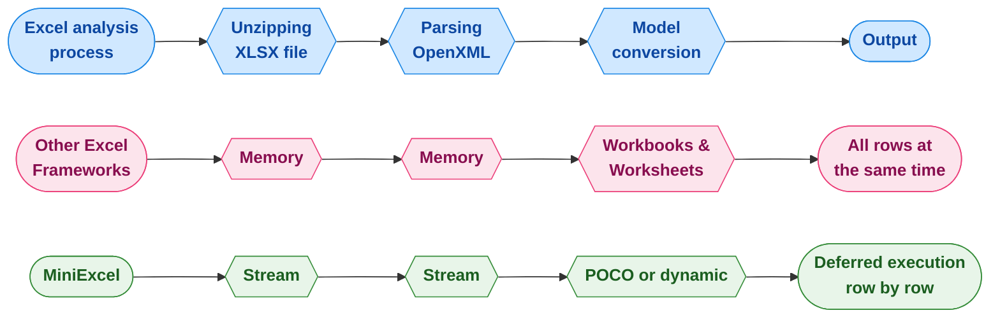

<div align="center">
<p><a href="https://www.nuget.org/packages/MiniExcel"></a>  <a href="https://www.nuget.org/packages/MiniExcel"></a>
<a href="https://ci.appveyor.com/project/mini-software/miniexcel/branch/master"></a>
<a href="https://gitee.com/dotnetchina/MiniExcel"></a> <a href="https://github.com/mini-software/MiniExcel" rel="nofollow"></a>
<a href="https://www.nuget.org/packages/MiniExcel"></a>
<a href="https://deepwiki.com/mini-software/MiniExcel"></a>
</p>
</div>

---

[](https://www.dotnetfoundation.org/)

<div align="center">
<p>این پروژه بخشی از <a href="https://www.dotnetfoundation.org/">.NET Foundation</a> است و تحت <a href="https://www.dotnetfoundation.org/code-of-conduct">قوانین رفتار حرفه‌ای</a> آن فعالیت می‌کند. </p>
</div>

---

<div align="center">
<p><strong><a href="README.md">English</a> | <a href="README.zh-CN.md">简体中文</a> | <a href="https://openaitx.github.io/view.html?user=mini-software&amp;project=MiniExcel&amp;lang=zh-TW">繁體中文</a> | <a href="https://openaitx.github.io/view.html?user=mini-software&amp;project=MiniExcel&amp;lang=ja">日本語</a> | <a href="https://openaitx.github.io/view.html?user=mini-software&amp;project=MiniExcel&amp;lang=ko">한국어</a> | <a href="https://openaitx.github.io/view.html?user=mini-software&amp;project=MiniExcel&amp;lang=hi">हिन्दी</a> | <a href="https://openaitx.github.io/view.html?user=mini-software&amp;project=MiniExcel&amp;lang=th">ไทย</a> | <a href="https://openaitx.github.io/view.html?user=mini-software&amp;project=MiniExcel&amp;lang=fr">Français</a> | <a href="https://openaitx.github.io/view.html?user=mini-software&amp;project=MiniExcel&amp;lang=de">Deutsch</a> | <a href="https://openaitx.github.io/view.html?user=mini-software&amp;project=MiniExcel&amp;lang=es">Español</a> | <a href="https://openaitx.github.io/view.html?user=mini-software&amp;project=MiniExcel&amp;lang=it">Italiano</a> | <a href="https://openaitx.github.io/view.html?user=mini-software&amp;project=MiniExcel&amp;lang=ru">Русский</a> | <a href="https://openaitx.github.io/view.html?user=mini-software&amp;project=MiniExcel&amp;lang=pt">Português</a> | <a href="https://openaitx.github.io/view.html?user=mini-software&amp;project=MiniExcel&amp;lang=nl">Nederlands</a> | <a href="https://openaitx.github.io/view.html?user=mini-software&amp;project=MiniExcel&amp;lang=pl">Polski</a> | <a href="https://openaitx.github.io/view.html?user=mini-software&amp;project=MiniExcel&amp;lang=ar">العربية</a> | <a href="https://openaitx.github.io/view.html?user=mini-software&amp;project=MiniExcel&amp;lang=fa">فارسی</a> | <a href="https://openaitx.github.io/view.html?user=mini-software&amp;project=MiniExcel&amp;lang=tr">Türkçe</a> | <a href="https://openaitx.github.io/view.html?user=mini-software&amp;project=MiniExcel&amp;lang=vi">Tiếng Việt</a> | <a href="https://openaitx.github.io/view.html?user=mini-software&amp;project=MiniExcel&amp;lang=id">Bahasa Indonesia</a><p></p>
</strong></p>
</div>


---

<div align="center">
ستاره دادن به <a href="https://github.com/mini-software/MiniExcel">MiniExcel</a> یا <a href="https://miniexcel.github.io">حمایت مالی</a> شما می‌تواند MiniExcel را بهتر کند
</div>

---

### معرفی

MiniExcel یک ابزار ساده و کارآمد برای پردازش اکسل در .NET است که به طور خاص برای کاهش مصرف حافظه طراحی شده است.

در حال حاضر، بیشتر فریم‌ورک‌های محبوب نیاز دارند تمام داده‌های یک سند اکسل را برای انجام عملیات‌ها به طور کامل در حافظه بارگذاری کنند، اما این کار می‌تواند مشکلاتی در مصرف حافظه ایجاد کند. رویکرد MiniExcel متفاوت است: داده‌ها به صورت ردیف به ردیف و به شکل جریانی پردازش می‌شوند، که مصرف اولیه را از صدها مگابایت بالقوه به تنها چند مگابایت کاهش می‌دهد و به طور مؤثری از بروز مشکلات Out-of-memory (OOM) جلوگیری می‌کند.



### ویژگی‌ها

- کمینه‌سازی مصرف حافظه، جلوگیری از خطاهای کمبود حافظه (OOM) و اجتناب از جمع‌آوری کامل زباله‌ها
- امکان انجام عملیات داده‌ای در سطح ردیف به صورت بلادرنگ برای عملکرد بهتر روی داده‌های بزرگ
- پشتیبانی از LINQ با اجرای به تعویق افتاده، امکان صفحه‌بندی سریع و کارآمد از نظر حافظه و پرس‌وجوهای پیچیده
- سبک و کم‌حجم، بدون نیاز به Microsoft Office یا اجزای COM+، و اندازه DLL کمتر از ۵۰۰ کیلوبایت
- رابط برنامه‌نویسی ساده و شهودی برای خواندن/نوشتن/پر کردن اکسل

### نسخه ۲.۰ پیش‌نمایش

ما در حال کار روی نسخه آینده MiniExcel با یک API ماژولار و متمرکز جدید،
بسته‌های جداگانه nuget برای قابلیت‌های Core و Csv، پشتیبانی کامل از پرس‌وجوهای جریانی ناهمگام از طریق `IAsyncEnumerable`
و امکانات بیشتر در آینده هستیم! این بسته‌ها به صورت پیش‌انتشار در دسترس خواهند بود، پس خوشحال می‌شویم که آن‌ها را بررسی کرده و بازخورد خود را ارائه دهید!

اگر این کار را کردید، حتما [مستندات جدید](https://raw.githubusercontent.com/mini-software/MiniExcel/master/README-V2.md) و [یادداشت‌های ارتقاء](https://raw.githubusercontent.com/mini-software/MiniExcel/master/V2-Upgrade-Notes.md) را نیز مشاهده کنید.


### شروع کنید

- [وارد کردن/پرس‌وجوی اکسل](#getstart1)

- [خروجی گرفتن/ایجاد اکسل](#getstart2)

- [قالب اکسل](#getstart3)

- [ویژگی نام/ایندکس/نادیده گرفتن ستون اکسل](#getstart4)

- [نمونه‌ها](#getstart5)


### نصب

شما می‌توانید بسته را [از NuGet](https://www.nuget.org/packages/MiniExcel) نصب کنید

### یادداشت‌های انتشار

لطفاً [یادداشت‌های انتشار](docs) را بررسی کنید

### TODO

لطفاً [TODO](https://github.com/mini-software/MiniExcel/projects/1?fullscreen=true) را بررسی کنید

### عملکرد

کد مربوط به بنچمارک‌ها را می‌توانید در [MiniExcel.Benchmarks](https://raw.githubusercontent.com/mini-software/MiniExcel/master/benchmarks/MiniExcel.Benchmarks/Program.cs) پیدا کنید.

فایلی که برای تست عملکرد استفاده شده است [**Test1,000,000x10.xlsx**](https://raw.githubusercontent.com/mini-software/MiniExcel/master/benchmarks/MiniExcel.Benchmarks/Test1%2C000%2C000x10.xlsx) است؛ یک سند ۳۲ مگابایتی شامل ۱,۰۰۰,۰۰۰ ردیف * ۱۰ ستون که سلول‌های آن با رشته "HelloWorld" پر شده‌اند.

برای اجرای تمام بنچمارک‌ها از دستور زیر استفاده کنید:

```bash
dotnet run -project .\benchmarks\MiniExcel.Benchmarks -c Release -f net9.0 -filter * --join
```
شما می‌توانید نتایج بنچمارک نسخه جدید را [اینجا](benchmarks/results) پیدا کنید.


### پرس‌وجو/وارد کردن اکسل  <a name="getstart1"></a>

#### 1. یک پرس‌وجو اجرا کنید و نتایج را به یک IEnumerable با نوع قوی نگاشت کنید [[امتحان کنید]](https://dotnetfiddle.net/w5WD1J)

توصیه می‌شود به دلیل کارایی بهتر از Stream.Query استفاده کنید.


```csharp
public class UserAccount
{
    public Guid ID { get; set; }
    public string Name { get; set; }
    public DateTime BoD { get; set; }
    public int Age { get; set; }
    public bool VIP { get; set; }
    public decimal Points { get; set; }
}

var rows = MiniExcel.Query<UserAccount>(path);

// or

using (var stream = File.OpenRead(path))
    var rows = stream.Query<UserAccount>();
```


#### 2. اجرای یک کوئری و نگاشت آن به لیستی از اشیاء داینامیک بدون استفاده از head [[امتحان کنید]](https://dotnetfiddle.net/w5WD1J)

* کلید داینامیک `A.B.C.D..` است

| MiniExcel | 1 |
|-----------|---|
| Github    | 2 |


```csharp

var rows = MiniExcel.Query(path).ToList();

// or
using (var stream = File.OpenRead(path))
{
    var rows = stream.Query().ToList();

    Assert.Equal("MiniExcel", rows[0].A);
    Assert.Equal(1, rows[0].B);
    Assert.Equal("Github", rows[1].A);
    Assert.Equal(2, rows[1].B);
}
```
#### 3. اجرای یک پرس و جو با ردیف اول به عنوان هدر [[امتحان کنید]](https://dotnetfiddle.net/w5WD1J)

توجه : در صورت وجود نام ستون تکراری، آخرین ستون از سمت راست استفاده می‌شود

ورودی اکسل :

| Column1   | Column2 |
|-----------|---------|
| MiniExcel | 1       |
| Github    | 2       |


```csharp

var rows = MiniExcel.Query(useHeaderRow:true).ToList();

// or

using (var stream = File.OpenRead(path))
{
    var rows = stream.Query(useHeaderRow:true).ToList();

    Assert.Equal("MiniExcel", rows[0].Column1);
    Assert.Equal(1, rows[0].Column2);
    Assert.Equal("Github", rows[1].Column1);
    Assert.Equal(2, rows[1].Column2);
}
```
#### 4. پشتیبانی از کوئری افزونه LINQ مانند First/Take/Skip و غیره

کوئری First

```csharp
var row = MiniExcel.Query(path).First();
Assert.Equal("HelloWorld", row.A);

// or

using (var stream = File.OpenRead(path))
{
    var row = stream.Query().First();
    Assert.Equal("HelloWorld", row.A);
}
```
عملکرد بین MiniExcel/ExcelDataReader/ClosedXML/EPPlus


#### ۵. جستجو بر اساس نام شیت


```csharp
MiniExcel.Query(path, sheetName: "SheetName");
//or
stream.Query(sheetName: "SheetName");
```
#### 6. پرس و جوی تمام نام شیت‌ها و ردیف‌ها


```csharp
var sheetNames = MiniExcel.GetSheetNames(path);
foreach (var sheetName in sheetNames)
{
    var rows = MiniExcel.Query(path, sheetName: sheetName);
}
```
#### ۷. دریافت ستون‌ها


```csharp
var columns = MiniExcel.GetColumns(path); // e.g result : ["A","B"...]

var cnt = columns.Count;  // get column count
```
#### 8. کوئری داینامیک ردیف را به `IDictionary<string,object>` تبدیل می‌کند


```csharp
foreach(IDictionary<string,object> row in MiniExcel.Query(path))
{
    //..
}

// or
var rows = MiniExcel.Query(path).Cast<IDictionary<string,object>>();
// or Query specified ranges (capitalized)
// A2 represents the second row of column A, C3 represents the third row of column C
// If you don't want to restrict rows, just don't include numbers
var rows = MiniExcel.QueryRange(path, startCell: "A2", endCell: "C3").Cast<IDictionary<string, object>>();
```


#### 9. کوئری اکسل و بازگشت DataTable

توصیه نمی‌شود، زیرا DataTable تمام داده‌ها را به حافظه بارگذاری می‌کند و ویژگی مصرف پایین حافظه MiniExcel را از بین می‌برد.


```C#
var table = MiniExcel.QueryAsDataTable(path, useHeaderRow: true);
```


#### 10. مشخص کردن سلولی که خواندن داده از آن آغاز می‌شود


```csharp
MiniExcel.Query(path,useHeaderRow:true,startCell:"B3")
```


#### 11. پر کردن سلول‌های ادغام‌شده

توجه: کارایی نسبت به «استفاده نکردن از پر کردن ادغامی» کندتر است

دلیل: استاندارد OpenXml بخش mergeCells را در انتهای فایل قرار می‌دهد که باعث نیاز به دو بار پیمایش sheetxml می‌شود


```csharp
    var config = new OpenXmlConfiguration()
    {
        FillMergedCells = true
    };
    var rows = MiniExcel.Query(path, configuration: config);
```


پشتیبانی از پر کردن چند سطری و ستونی با طول و عرض متغیر


#### ۱۲. خواندن فایل‌های بزرگ با کش مبتنی بر دیسک (Disk-Base Cache - SharedString)

اگر اندازه SharedStrings از ۵ مگابایت بیشتر شود، MiniExcel به صورت پیش‌فرض از کش دیسک محلی استفاده می‌کند، برای مثال، [10x100000.xlsx](https://github.com/MiniExcel/MiniExcel/files/8403819/NotDuplicateSharedStrings_10x100000.xlsx) (یک میلیون ردیف داده)، زمانی که کش دیسک غیرفعال باشد، حداکثر مصرف حافظه ۱۹۵ مگابایت است، اما با فعال بودن کش دیسک فقط به ۶۵ مگابایت نیاز دارد. توجه داشته باشید که این بهینه‌سازی هزینه‌هایی در کارایی دارد، بنابراین در این حالت زمان خواندن از ۷.۴ ثانیه به ۲۷.۲ ثانیه افزایش می‌یابد. اگر به این ویژگی نیاز ندارید، می‌توانید کش دیسک را با کد زیر غیرفعال کنید:


```csharp
var config = new OpenXmlConfiguration { EnableSharedStringCache = false };
MiniExcel.Query(path,configuration: config)
```
شما می‌توانید از `SharedStringCacheSize` برای تغییر اندازه فایل sharedString فراتر از اندازه مشخص شده برای کش کردن روی دیسک استفاده کنید.

```csharp
var config = new OpenXmlConfiguration { SharedStringCacheSize=500*1024*1024 };
MiniExcel.Query(path, configuration: config);
```


### ساخت/خروجی گرفتن از اکسل  <a name="getstart2"></a>

1. باید یک نوع غیرانتزاعی با سازنده عمومی بدون پارامتر باشد.

2. MiniExcel از اجرای تاخیری IEnumerable پشتیبانی می‌کند، اگر می‌خواهید کمترین میزان حافظه را مصرف کنید، لطفاً از متدهایی مانند ToList استفاده نکنید.

مثال: استفاده یا عدم استفاده از ToList و مصرف حافظه


#### ۱. ناشناس یا نوع قوی [[امتحان کنید]](https://dotnetfiddle.net/w5WD1J)


```csharp
var path = Path.Combine(Path.GetTempPath(), $"{Guid.NewGuid()}.xlsx");
MiniExcel.SaveAs(path, new[] {
    new { Column1 = "MiniExcel", Column2 = 1 },
    new { Column1 = "Github", Column2 = 2}
});
```
#### 2. `IEnumerable<IDictionary<string, object>>`


```csharp
var values = new List<Dictionary<string, object>>()
{
    new Dictionary<string,object>{{ "Column1", "MiniExcel" }, { "Column2", 1 } },
    new Dictionary<string,object>{{ "Column1", "Github" }, { "Column2", 2 } }
};
MiniExcel.SaveAs(path, values);
```
ایجاد نتیجه فایل :

| ستون1     | ستون2   |
|-----------|---------|
| MiniExcel | 1       |
| Github    | 2       |


#### 3.  IDataReader
- `توصیه می‌شود`، می‌تواند از بارگذاری همه داده‌ها در حافظه جلوگیری کند

```csharp
MiniExcel.SaveAs(path, reader);
```


خروجی گرفتن چندین شیت توسط DataReader (توصیه شده توسط Dapper ExecuteReader)


```csharp
using (var cnn = Connection)
{
    cnn.Open();
    var sheets = new Dictionary<string,object>();
    sheets.Add("sheet1", cnn.ExecuteReader("select 1 id"));
    sheets.Add("sheet2", cnn.ExecuteReader("select 2 id"));
    MiniExcel.SaveAs("Demo.xlsx", sheets);
}
```


#### 4. دیتاتیبل

- `توصیه نمی‌شود`، زیرا تمام داده‌ها را به حافظه بارگذاری می‌کند

- دیتاتیبل ابتدا از Caption برای نام ستون استفاده می‌کند، سپس از columname


```csharp
var path = Path.Combine(Path.GetTempPath(), $"{Guid.NewGuid()}.xlsx");
var table = new DataTable();
{
    table.Columns.Add("Column1", typeof(string));
    table.Columns.Add("Column2", typeof(decimal));
    table.Rows.Add("MiniExcel", 1);
    table.Rows.Add("Github", 2);
}

MiniExcel.SaveAs(path, table);
```
####  5. پرس‌وجوی Dapper

با تشکر از @shaofing #552 ، لطفاً از `CommandDefinition + CommandFlags.NoCache` استفاده کنید.


```csharp
using (var connection = GetConnection(connectionString))
{
    var rows = connection.Query(
        new CommandDefinition(
            @"select 'MiniExcel' as Column1,1 as Column2 union all select 'Github',2"
            , flags: CommandFlags.NoCache)
        );
    // Note: QueryAsync will throw close connection exception
    MiniExcel.SaveAs(path, rows);
}
```
کد زیر تمام داده‌ها را به حافظه بارگذاری می‌کند


```csharp
using (var connection = GetConnection(connectionString))
{
    var rows = connection.Query(@"select 'MiniExcel' as Column1,1 as Column2 union all select 'Github',2");
    MiniExcel.SaveAs(path, rows);
}
```
#### 6. ذخیره به MemoryStream  [[امتحان کنید]](https://dotnetfiddle.net/JOen0e)


```csharp
using (var stream = new MemoryStream()) //support FileStream,MemoryStream ect.
{
    stream.SaveAs(values);
}
```
به عنوان مثال: API برای خروجی گرفتن اکسل


```csharp
public IActionResult DownloadExcel()
{
    var values = new[] {
        new { Column1 = "MiniExcel", Column2 = 1 },
        new { Column1 = "Github", Column2 = 2}
    };

    var memoryStream = new MemoryStream();
    memoryStream.SaveAs(values);
    memoryStream.Seek(0, SeekOrigin.Begin);
    return new FileStreamResult(memoryStream, "application/vnd.openxmlformats-officedocument.spreadsheetml.sheet")
    {
        FileDownloadName = "demo.xlsx"
    };
}
```
#### 7. ایجاد چندین شیت


```csharp
// 1. Dictionary<string,object>
var users = new[] { new { Name = "Jack", Age = 25 }, new { Name = "Mike", Age = 44 } };
var department = new[] { new { ID = "01", Name = "HR" }, new { ID = "02", Name = "IT" } };
var sheets = new Dictionary<string, object>
{
    ["users"] = users,
    ["department"] = department
};
MiniExcel.SaveAs(path, sheets);

// 2. DataSet
var sheets = new DataSet();
sheets.Add(UsersDataTable);
sheets.Add(DepartmentDataTable);
//..
MiniExcel.SaveAs(path, sheets);
```


#### ۸. گزینه‌های TableStyles

استایل پیش‌فرض


بدون پیکربندی استایل


```csharp
var config = new OpenXmlConfiguration()
{
     TableStyles = TableStyles.None
};
MiniExcel.SaveAs(path, value,configuration:config);
```


#### 9. فیلتر خودکار (AutoFilter)

از نسخه v0.19.0، با استفاده از `OpenXmlConfiguration.AutoFilter` می‌توان فیلتر خودکار را فعال یا غیرفعال کرد، مقدار پیش‌فرض `true` است، و روش تنظیم AutoFilter به شرح زیر است:


```csharp
MiniExcel.SaveAs(path, value, configuration: new OpenXmlConfiguration() { AutoFilter = false });
```


#### 10. ایجاد تصویر


```csharp
var value = new[] {
    new { Name="github",Image=File.ReadAllBytes(PathHelper.GetFile("images/github_logo.png"))},
    new { Name="google",Image=File.ReadAllBytes(PathHelper.GetFile("images/google_logo.png"))},
    new { Name="microsoft",Image=File.ReadAllBytes(PathHelper.GetFile("images/microsoft_logo.png"))},
    new { Name="reddit",Image=File.ReadAllBytes(PathHelper.GetFile("images/reddit_logo.png"))},
    new { Name="statck_overflow",Image=File.ReadAllBytes(PathHelper.GetFile("images/statck_overflow_logo.png"))},
};
MiniExcel.SaveAs(path, value);
```


#### 11. خروجی فایل آرایه بایت

از نسخه 1.22.0، زمانی که نوع مقدار `byte[]` باشد، سیستم به طور پیش‌فرض مسیر فایل را در سلول ذخیره می‌کند و هنگام وارد کردن می‌تواند به `byte[]` تبدیل شود. و اگر نمی‌خواهید از این قابلیت استفاده کنید، می‌توانید مقدار `OpenXmlConfiguration.EnableConvertByteArray` را به `false` تنظیم کنید که باعث افزایش کارایی سیستم می‌شود.


از نسخه 1.22.0، زمانی که نوع مقدار `byte[]` باشد، سیستم به طور پیش‌فرض مسیر فایل را در سلول ذخیره می‌کند و هنگام وارد کردن می‌تواند به `byte[]` تبدیل شود. و اگر نمی‌خواهید از این قابلیت استفاده کنید، می‌توانید مقدار `OpenXmlConfiguration.EnableConvertByteArray` را به `false` تنظیم کنید که باعث افزایش کارایی سیستم می‌شود.


#### 12. ادغام سلول‌های مشابه به صورت عمودی

این قابلیت فقط در فرمت `xlsx` پشتیبانی می‌شود و سلول‌ها را به صورت عمودی بین تگ‌های @merge و @endmerge ادغام می‌کند.
شما می‌توانید از @mergelimit برای محدود کردن محدوده ادغام سلول‌ها به صورت عمودی استفاده کنید.


```csharp
var mergedFilePath = Path.Combine(Path.GetTempPath(), $"{Guid.NewGuid().ToString()}.xlsx");

var path = @"../../../../../samples/xlsx/TestMergeWithTag.xlsx";

MiniExcel.MergeSameCells(mergedFilePath, path);
```


```csharp
var memoryStream = new MemoryStream();

var path = @"../../../../../samples/xlsx/TestMergeWithTag.xlsx";

memoryStream.MergeSameCells(path);
```
محتوای فایل قبل و بعد از ادغام:

بدون محدودیت ادغام:


با محدودیت ادغام:


#### ۱۳. رد کردن مقادیر تهی

گزینه جدید و صریح برای نوشتن سلول‌های خالی برای مقادیر null:


```csharp
DataTable dt = new DataTable();

/* ... */

DataRow dr = dt.NewRow();

dr["Name1"] = "Somebody once";
dr["Name2"] = null;
dr["Name3"] = "told me.";

dt.Rows.Add(dr);

OpenXmlConfiguration configuration = new OpenXmlConfiguration()
{
     EnableWriteNullValueCell = true // Default value.
};

MiniExcel.SaveAs(@"C:\temp\Book1.xlsx", dt, configuration: configuration);
```


```xml
<x:row r="2">
    <x:c r="A2" t ="str" s="2">
        <x:v>Somebody once</x:v>
    </x:c>
    <x:c r="B2" s="2"></x:c>
    <x:c r="C2" t ="str" s="2">
        <x:v>told me.</x:v>
    </x:c>
</x:row>
```
رفتار قبلی:


```csharp
/* ... */

OpenXmlConfiguration configuration = new OpenXmlConfiguration()
{
     EnableWriteNullValueCell = false // Default value is true.
};

MiniExcel.SaveAs(@"C:\temp\Book1.xlsx", dt, configuration: configuration);
```


```xml
<x:row r="2">
    <x:c r="A2" t ="str" s="2">
        <x:v>Somebody once</x:v>
    </x:c>
    <x:c r="B2" t ="str" s="2">
        <x:v></x:v>
    </x:c>
    <x:c r="C2" t ="str" s="2">
        <x:v>told me.</x:v>
    </x:c>
</x:row>
```
برای مقادیر null و DBNull کار می‌کند.

#### 14. ثابت کردن پنجره‌ها (Freeze Panes)

```csharp
/* ... */

OpenXmlConfiguration configuration = new OpenXmlConfiguration()
{
    FreezeRowCount = 1,     // default is 1
    FreezeColumnCount = 2   // default is 0
};

MiniExcel.SaveAs(@"C:\temp\Book1.xlsx", dt, configuration: configuration);
```


### پر کردن داده در قالب اکسل <a name="getstart3"></a>

- اعلان متغیر مشابه قالب Vue با `{{نام متغیر}}` است، یا رندر مجموعه با `{{نام مجموعه.نام فیلد}}`
- رندر مجموعه از انواع IEnumerable/DataTable/DapperRow پشتیبانی می‌کند

#### 1. پر کردن پایه

قالب:


نتیجه:


کد:


```csharp
// 1. By POCO
var value = new
{
    Name = "Jack",
    CreateDate = new DateTime(2021, 01, 01),
    VIP = true,
    Points = 123
};
MiniExcel.SaveAsByTemplate(path, templatePath, value);


// 2. By Dictionary
var value = new Dictionary<string, object>()
{
    ["Name"] = "Jack",
    ["CreateDate"] = new DateTime(2021, 01, 01),
    ["VIP"] = true,
    ["Points"] = 123
};
MiniExcel.SaveAsByTemplate(path, templatePath, value);
```
#### 2. پر کردن داده با IEnumerable

> نکته1: از اولین IEnumerable از همان ستون به عنوان مبنای پر کردن لیست استفاده کنید

قالب:


نتیجه:


کد:


```csharp
//1. By POCO
var value = new
{
    employees = new[] {
        new {name="Jack",department="HR"},
        new {name="Lisa",department="HR"},
        new {name="John",department="HR"},
        new {name="Mike",department="IT"},
        new {name="Neo",department="IT"},
        new {name="Loan",department="IT"}
    }
};
MiniExcel.SaveAsByTemplate(path, templatePath, value);

//2. By Dictionary
var value = new Dictionary<string, object>()
{
    ["employees"] = new[] {
        new {name="Jack",department="HR"},
        new {name="Lisa",department="HR"},
        new {name="John",department="HR"},
        new {name="Mike",department="IT"},
        new {name="Neo",department="IT"},
        new {name="Loan",department="IT"}
    }
};
MiniExcel.SaveAsByTemplate(path, templatePath, value);
```
#### 3. پرکردن داده‌های پیچیده

> توجه: پشتیبانی از چندین شیت و استفاده از متغیر یکسان

قالب:


نتیجه:


```csharp
// 1. By POCO
var value = new
{
    title = "FooCompany",
    managers = new[] {
        new {name="Jack",department="HR"},
        new {name="Loan",department="IT"}
    },
    employees = new[] {
        new {name="Wade",department="HR"},
        new {name="Felix",department="HR"},
        new {name="Eric",department="IT"},
        new {name="Keaton",department="IT"}
    }
};
MiniExcel.SaveAsByTemplate(path, templatePath, value);

// 2. By Dictionary
var value = new Dictionary<string, object>()
{
    ["title"] = "FooCompany",
    ["managers"] = new[] {
        new {name="Jack",department="HR"},
        new {name="Loan",department="IT"}
    },
    ["employees"] = new[] {
        new {name="Wade",department="HR"},
        new {name="Felix",department="HR"},
        new {name="Eric",department="IT"},
        new {name="Keaton",department="IT"}
    }
};
MiniExcel.SaveAsByTemplate(path, templatePath, value);
```
#### ۴. عملکرد پر کردن داده‌های بزرگ

> توجه: استفاده از اجرای تعلیقی IEnumerable به جای ToList می‌تواند حداکثر صرفه‌جویی در حافظه را در MiniExcel داشته باشد


#### ۵. نگاشت خودکار نوع مقدار سلول

قالب


نتیجه


کلاس


```csharp
public class Poco
{
    public string @string { get; set; }
    public int? @int { get; set; }
    public decimal? @decimal { get; set; }
    public double? @double { get; set; }
    public DateTime? datetime { get; set; }
    public bool? @bool { get; set; }
    public Guid? Guid { get; set; }
}
```
کد


```csharp
var poco = new TestIEnumerableTypePoco { @string = "string", @int = 123, @decimal = decimal.Parse("123.45"), @double = (double)123.33, @datetime = new DateTime(2021, 4, 1), @bool = true, @Guid = Guid.NewGuid() };
var value = new
{
    Ts = new[] {
        poco,
        new TestIEnumerableTypePoco{},
        null,
        poco
    }
};
MiniExcel.SaveAsByTemplate(path, templatePath, value);
```
#### 6. مثال :  فهرست پروژه‌های گیت‌هاب

قالب


نتیجه


کد


```csharp
var projects = new[]
{
    new {Name = "MiniExcel",Link="https://github.com/mini-software/MiniExcel",Star=146, CreateTime=new DateTime(2021,03,01)},
    new {Name = "HtmlTableHelper",Link="https://github.com/mini-software/HtmlTableHelper",Star=16, CreateTime=new DateTime(2020,02,01)},
    new {Name = "PocoClassGenerator",Link="https://github.com/mini-software/PocoClassGenerator",Star=16, CreateTime=new DateTime(2019,03,17)}
};
var value = new
{
    User = "ITWeiHan",
    Projects = projects,
    TotalStar = projects.Sum(s => s.Star)
};
MiniExcel.SaveAsByTemplate(path, templatePath, value);
```
#### 7. پر کردن داده‌های گروه‌بندی‌شده


```csharp
var value = new Dictionary<string, object>()
{
    ["employees"] = new[] {
        new {name="Jack",department="HR"},
        new {name="Jack",department="HR"},
        new {name="John",department="HR"},
        new {name="John",department="IT"},
        new {name="Neo",department="IT"},
        new {name="Loan",department="IT"}
    }
};
await MiniExcel.SaveAsByTemplateAsync(path, templatePath, value);
```
##### 1. با تگ `@group` و با تگ `@header`

قبل


بعد


##### 2. با تگ @group و بدون تگ @header

قبل


بعد


##### 3. بدون تگ @group

قبل


بعد


#### 8. عبارات If/ElseIf/Else داخل سلول

قوانین:
1. از DateTime، Double، Int با عملگرهای ==، !=، >، >=، <، <= پشتیبانی می‌شود.
2. از String با عملگرهای ==، != پشتیبانی می‌شود.
3. هر عبارت باید در یک خط جدید باشد.
4. قبل و بعد از عملگرها باید یک فاصله باشد.
5. نباید خط جدید درون عبارات باشد.
6. سلول باید دقیقاً طبق فرمت زیر باشد.

```csharp
@if(name == Jack)
{{employees.name}}
@elseif(name == Neo)
Test {{employees.name}}
@else
{{employees.department}}
@endif
```
قبل


بعد


#### ۹. DataTable به عنوان پارامتر


```csharp
var managers = new DataTable();
{
    managers.Columns.Add("name");
    managers.Columns.Add("department");
    managers.Rows.Add("Jack", "HR");
    managers.Rows.Add("Loan", "IT");
}
var value = new Dictionary<string, object>()
{
    ["title"] = "FooCompany",
    ["managers"] = managers,
};
MiniExcel.SaveAsByTemplate(path, templatePath, value);
```
#### ۱۰. فرمول‌ها

##### ۱. مثال
فرمول خود را با `$` شروع کنید و از `$enumrowstart` و `$enumrowend` برای علامت‌گذاری ردیف‌های شروع و پایان قابل شمارش استفاده کنید:


زمانی که قالب رندر می‌شود، پیشوند `$` حذف شده و `$enumrowstart` و `$enumrowend` با شماره ردیف‌های شروع و پایان قابل شمارش جایگزین می‌شوند:


##### ۲. سایر مثال‌های فرمول:

|              |                                                                                           |
|--------------|-------------------------------------------------------------------------------------------|
| جمع          | `$=SUM(C{{$enumrowstart}}:C{{$enumrowend}})`                                              |
| میانگین جایگزین | `$=SUM(C{{$enumrowstart}}:C{{$enumrowend}}) / COUNT(C{{$enumrowstart}}:C{{$enumrowend}})` |
| بازه         | `$=MAX(C{{$enumrowstart}}:C{{$enumrowend}}) - MIN(C{{$enumrowstart}}:C{{$enumrowend}})`   |


#### ۱۱. سایر

##### ۱. بررسی کلید پارامتر قالب

از نسخه V1.24.0 به بعد، به طور پیش‌فرض کلید پارامتر گم‌شده قالب نادیده گرفته شده و با رشته خالی جایگزین می‌شود، `IgnoreTemplateParameterMissing` می‌تواند کنترل کند که استثنا پرتاب شود یا نه.

```csharp
var config = new OpenXmlConfiguration()
{
    IgnoreTemplateParameterMissing = false,
};
MiniExcel.SaveAsByTemplate(path, templatePath, value, config)
```


### ویژگی نام ستون اکسل/ایندکس/نادیده‌گرفتن ستون <a name="getstart4"></a>


#### ۱. تعیین نام ستون، شماره ستون، یا نادیده‌گرفتن ستون

نمونه اکسل


کد


```csharp
public class ExcelAttributeDemo
{
    [ExcelColumnName("Column1")]
    public string Test1 { get; set; }
    [ExcelColumnName("Column2")]
    public string Test2 { get; set; }
    [ExcelIgnore]
    public string Test3 { get; set; }
    [ExcelColumnIndex("I")] // system will convert "I" to 8 index
    public string Test4 { get; set; }
    public string Test5 { get; } //wihout set will ignore
    public string Test6 { get; private set; } //un-public set will ignore
    [ExcelColumnIndex(3)] // start with 0
    public string Test7 { get; set; }
}

var rows = MiniExcel.Query<ExcelAttributeDemo>(path).ToList();
Assert.Equal("Column1", rows[0].Test1);
Assert.Equal("Column2", rows[0].Test2);
Assert.Null(rows[0].Test3);
Assert.Equal("Test7", rows[0].Test4);
Assert.Null(rows[0].Test5);
Assert.Null(rows[0].Test6);
Assert.Equal("Test4", rows[0].Test7);
```


#### 2. قالب سفارشی (ExcelFormatAttribute)

از نسخه V0.21.0 پشتیبانی از کلاسی که شامل متد `ToString(string content)` باشد، اضافه شده است

کلاس


```csharp
public class Dto
{
    public string Name { get; set; }

    [ExcelFormat("MMMM dd, yyyy")]
    public DateTime InDate { get; set; }
}
```
کد


```csharp
var value = new Dto[] {
    new Issue241Dto{ Name="Jack",InDate=new DateTime(2021,01,04)},
    new Issue241Dto{ Name="Henry",InDate=new DateTime(2020,04,05)},
};
MiniExcel.SaveAs(path, value);
```
نتیجه


کوئری از تبدیل فرمت سفارشی پشتیبانی می‌کند


#### ۳. تعیین عرض ستون (ExcelColumnWidthAttribute)


```csharp
public class Dto
{
    [ExcelColumnWidth(20)]
    public int ID { get; set; }
    [ExcelColumnWidth(15.50)]
    public string Name { get; set; }
}
```
#### 4. نگاشت چندین نام ستون به یک ویژگی.


```csharp
public class Dto
{
    [ExcelColumnName(excelColumnName:"EmployeeNo",aliases:new[] { "EmpNo","No" })]
    public string Empno { get; set; }
    public string Name { get; set; }
}
```


#### 5. System.ComponentModel.DisplayNameAttribute = ExcelColumnName.excelColumnNameAttribute

از نسخه 1.24.0، سیستم از System.ComponentModel.DisplayNameAttribute = ExcelColumnName.excelColumnNameAttribute پشتیبانی می‌کند.


```C#
public class TestIssueI4TXGTDto
{
    public int ID { get; set; }
    public string Name { get; set; }
    [DisplayName("Specification")]
    public string Spc { get; set; }
    [DisplayName("Unit Price")]
    public decimal Up { get; set; }
}
```
#### ۶. ویژگی ExcelColumnAttribute

از نسخه V1.26.0، چندین ویژگی را می‌توان به صورت زیر ساده‌سازی کرد:

از آن زمان به بعد، استفاده از چندین ویژگی به این صورت امکان‌پذیر است :


```csharp
        public class TestIssueI4ZYUUDto
        {
            [ExcelColumn(Name = "ID",Index =0)]
            public string MyProperty { get; set; }
            [ExcelColumn(Name = "CreateDate", Index = 1,Format ="yyyy-MM",Width =100)]
            public DateTime MyProperty2 { get; set; }
        }
```
#### ۷. ویژگی DynamicColumnAttribute

از نسخه V1.26.0، ما می‌توانیم ویژگی‌های ستون را به صورت پویا تنظیم کنیم


```csharp
            var config = new OpenXmlConfiguration
            {
                DynamicColumns = new DynamicExcelColumn[] {
                    new DynamicExcelColumn("id"){Ignore=true},
                    new DynamicExcelColumn("name"){Index=1,Width=10},
                    new DynamicExcelColumn("createdate"){Index=0,Format="yyyy-MM-dd",Width=15},
                    new DynamicExcelColumn("point"){Index=2,Name="Account Point"},
                }
            };
            var path = PathHelper.GetTempPath();
            var value = new[] { new { id = 1, name = "Jack", createdate = new DateTime(2022, 04, 12) ,point = 123.456} };
            MiniExcel.SaveAs(path, value, configuration: config);
```


#### 8. ویژگی پویا برگه (DynamicSheetAttribute)

از نسخه V1.31.4 می‌توانیم ویژگی‌های برگه را به صورت پویا تنظیم کنیم. می‌توانیم نام برگه و وضعیت (قابلیت مشاهده) را تعیین کنیم.
```csharp
            var configuration = new OpenXmlConfiguration
            {
                DynamicSheets = new DynamicExcelSheet[] {
                    new DynamicExcelSheet("usersSheet") { Name = "Users", State = SheetState.Visible },
                    new DynamicExcelSheet("departmentSheet") { Name = "Departments", State = SheetState.Hidden }
                }
            };

            var users = new[] { new { Name = "Jack", Age = 25 }, new { Name = "Mike", Age = 44 } };
            var department = new[] { new { ID = "01", Name = "HR" }, new { ID = "02", Name = "IT" } };
            var sheets = new Dictionary<string, object>
            {
                ["usersSheet"] = users,
                ["departmentSheet"] = department
            };

            var path = PathHelper.GetTempPath();
            MiniExcel.SaveAs(path, sheets, configuration: configuration);
```
ما همچنین می‌توانیم از ویژگی جدید ExcelSheetAttribute استفاده کنیم:


```C#
   [ExcelSheet(Name = "Departments", State = SheetState.Hidden)]
   private class DepartmentDto
   {
      [ExcelColumn(Name = "ID",Index = 0)]
      public string ID { get; set; }
      [ExcelColumn(Name = "Name",Index = 1)]
      public string Name { get; set; }
   }
```
### افزودن، حذف، به‌روزرسانی

#### افزودن

پشتیبانی v1.28.0 از درج داده‌های N ردیف CSV پس از آخرین ردیف


```csharp
// Origin
{
    var value = new[] {
          new { ID=1,Name ="Jack",InDate=new DateTime(2021,01,03)},
          new { ID=2,Name ="Henry",InDate=new DateTime(2020,05,03)},
    };
    MiniExcel.SaveAs(path, value);
}
// Insert 1 rows after last
{
    var value = new { ID=3,Name = "Mike", InDate = new DateTime(2021, 04, 23) };
    MiniExcel.Insert(path, value);
}
// Insert N rows after last
{
    var value = new[] {
          new { ID=4,Name ="Frank",InDate=new DateTime(2021,06,07)},
          new { ID=5,Name ="Gloria",InDate=new DateTime(2022,05,03)},
    };
    MiniExcel.Insert(path, value);
}
```


نسخه 1.37.0 از اکسل پشتیبانی می‌کند که یک شیت جدید را به یک ورک‌بوک موجود اضافه کنید.


```csharp
// Origin excel
{
    var value = new[] {
          new { ID=1,Name ="Jack",InDate=new DateTime(2021,01,03)},
          new { ID=2,Name ="Henry",InDate=new DateTime(2020,05,03)},
    };
    MiniExcel.SaveAs(path, value, sheetName: "Sheet1");
}
// Insert a new sheet
{
    var value = new { ID=3,Name = "Mike", InDate = new DateTime(2021, 04, 23) };
    MiniExcel.Insert(path, table, sheetName: "Sheet2");
}
```
#### حذف(در انتظار)

#### به‌روزرسانی(در انتظار)


### بررسی خودکار نوع اکسل <a name="getstart5"></a>

- MiniExcel به طور پیش‌فرض بر اساس `پسوند فایل` تشخیص می‌دهد که فایل xlsx است یا csv، اما ممکن است این کار دقیق نباشد، لطفاً نوع فایل را به صورت دستی مشخص کنید.
- از روی جریان داده (Stream) نمی‌توان نوع فایل اکسل را تشخیص داد، لطفاً نوع فایل را به صورت دستی مشخص کنید.


```csharp
stream.SaveAs(excelType:ExcelType.CSV);
//or
stream.SaveAs(excelType:ExcelType.XLSX);
//or
stream.Query(excelType:ExcelType.CSV);
//or
stream.Query(excelType:ExcelType.XLSX);
```


### CSV

#### نکته

- به طور پیش‌فرض نوع بازگشتی `string` است و مقدار به اعداد یا تاریخ تبدیل نمی‌شود، مگر اینکه نوع با تایپ قوی جنریک تعریف شده باشد.


#### جداکننده سفارشی

به طور پیش‌فرض `,` به عنوان جداکننده استفاده می‌شود، می‌توانید خصوصیت `Seperator` را برای سفارشی‌سازی تغییر دهید


```csharp
var config = new MiniExcelLibs.Csv.CsvConfiguration()
{
    Seperator=';'
};
MiniExcel.SaveAs(path, values,configuration: config);
```
از نسخه V1.30.1 قابلیت پشتیبانی از جداکننده سفارشی اضافه شده است (با تشکر از @hyzx86)


```csharp
var config = new CsvConfiguration()
{
    SplitFn = (row) => Regex.Split(row, $"[\t,](?=(?:[^\"]|\"[^\"]*\")*$)")
        .Select(s => Regex.Replace(s.Replace("\"\"", "\""), "^\"|\"$", "")).ToArray()
};
var rows = MiniExcel.Query(path, configuration: config).ToList();
```
#### شکست خط سفارشی

پیش‌فرض کاراکتر خط جدید `\r\n` است، شما می‌توانید ویژگی `NewLine` را برای سفارشی‌سازی تغییر دهید


```csharp
var config = new MiniExcelLibs.Csv.CsvConfiguration()
{
    NewLine='\n'
};
MiniExcel.SaveAs(path, values,configuration: config);
```


#### کدنویسی سفارشی

- کدگذاری پیش‌فرض "شناسایی کدگذاری از نشانه‌های ترتیب بایت" است (detectEncodingFromByteOrderMarks: true)
- اگر نیاز به کدگذاری سفارشی دارید، لطفاً ویژگی StreamReaderFunc / StreamWriterFunc را تغییر دهید


```csharp
// Read
var config = new MiniExcelLibs.Csv.CsvConfiguration()
{
    StreamReaderFunc = (stream) => new StreamReader(stream,Encoding.GetEncoding("gb2312"))
};
var rows = MiniExcel.Query(path, true,excelType:ExcelType.CSV,configuration: config);

// Write
var config = new MiniExcelLibs.Csv.CsvConfiguration()
{
    StreamWriterFunc = (stream) => new StreamWriter(stream, Encoding.GetEncoding("gb2312"))
};
MiniExcel.SaveAs(path, value,excelType:ExcelType.CSV, configuration: config);
```
#### خواندن رشته خالی به عنوان null

به طور پیش‌فرض، مقادیر خالی به string.Empty نگاشت می‌شوند. شما می‌توانید این رفتار را تغییر دهید


```csharp
var config = new MiniExcelLibs.Csv.CsvConfiguration()
{
   ReadEmptyStringAsNull = true
};
```
### DataReader

#### 1. GetReader
از نسخه 1.23.0، شما می‌توانید GetDataReader را دریافت کنید


```csharp
    using (var reader = MiniExcel.GetReader(path,true))
    {
        while (reader.Read())
        {
            for (int i = 0; i < reader.FieldCount; i++)
            {
                var value = reader.GetValue(i);
            }
        }
    }
```


###  غیرهمزمان (Async)

- نسخه v0.17.0 از غیرهمزمان (Async) پشتیبانی می‌کند (با تشکر از isdaniel ( SHIH,BING-SIOU)](https://github.com/isdaniel))


```csharp
public static Task SaveAsAsync(string path, object value, bool printHeader = true, string sheetName = "Sheet1", ExcelType excelType = ExcelType.UNKNOWN, IConfiguration configuration = null)
public static Task SaveAsAsync(this Stream stream, object value, bool printHeader = true, string sheetName = "Sheet1", ExcelType excelType = ExcelType.XLSX, IConfiguration configuration = null)
public static Task<IEnumerable<dynamic>> QueryAsync(string path, bool useHeaderRow = false, string sheetName = null, ExcelType excelType = ExcelType.UNKNOWN, string startCell = "A1", IConfiguration configuration = null)
public static Task<IEnumerable<T>> QueryAsync<T>(this Stream stream, string sheetName = null, ExcelType excelType = ExcelType.UNKNOWN, string startCell = "A1", IConfiguration configuration = null) where T : class, new()
public static Task<IEnumerable<T>> QueryAsync<T>(string path, string sheetName = null, ExcelType excelType = ExcelType.UNKNOWN, string startCell = "A1", IConfiguration configuration = null) where T : class, new()
public static Task<IEnumerable<IDictionary<string, object>>> QueryAsync(this Stream stream, bool useHeaderRow = false, string sheetName = null, ExcelType excelType = ExcelType.UNKNOWN, string startCell = "A1", IConfiguration configuration = null)
public static Task SaveAsByTemplateAsync(this Stream stream, string templatePath, object value)
public static Task SaveAsByTemplateAsync(this Stream stream, byte[] templateBytes, object value)
public static Task SaveAsByTemplateAsync(string path, string templatePath, object value)
public static Task SaveAsByTemplateAsync(string path, byte[] templateBytes, object value)
public static Task<DataTable> QueryAsDataTableAsync(string path, bool useHeaderRow = true, string sheetName = null, ExcelType excelType = ExcelType.UNKNOWN, string startCell = "A1", IConfiguration configuration = null)
```
-  پشتیبانی v1.25.0 از `cancellationToken`.


### سایر موارد

#### 1. شمارش (Enum)

اطمینان حاصل کنید که نام اکسل و ویژگی یکسان باشد، سیستم به صورت خودکار نگاشت را انجام می‌دهد (بدون حساسیت به حروف بزرگ و کوچک)


از نسخه V0.18.0 پشتیبانی از توضیحات Enum اضافه شده است


```csharp
public class Dto
{
    public string Name { get; set; }
    public I49RYZUserType UserType { get; set; }
}

public enum Type
{
    [Description("General User")]
    V1,
    [Description("General Administrator")]
    V2,
    [Description("Super Administrator")]
    V3
}
```


از نسخه 1.30.0 پشتیبانی از تبدیل توضیحات اکسل به Enum اضافه شده است، با تشکر از @KaneLeung

#### 2. تبدیل CSV به XLSX یا تبدیل XLSX به CSV


```csharp
MiniExcel.ConvertXlsxToCsv(xlsxPath, csvPath);
MiniExcel.ConvertXlsxToCsv(xlsxStream, csvStream);
MiniExcel.ConvertCsvToXlsx(csvPath, xlsxPath);
MiniExcel.ConvertCsvToXlsx(csvStream, xlsxStream);
```
```csharp
using (var excelStream = new FileStream(path: filePath, FileMode.Open, FileAccess.Read))
using (var csvStream = new MemoryStream())
{
   MiniExcel.ConvertXlsxToCsv(excelStream, csvStream);
}
```
#### 3. فرهنگ‌اطلاعات (CultureInfo) سفارشی

از نسخه 1.22.0، شما می‌توانید CultureInfo را به صورت زیر سفارشی‌سازی کنید، پیش‌فرض سیستم `CultureInfo.InvariantCulture` است.


```csharp
var config = new CsvConfiguration()
{
    Culture = new CultureInfo("fr-FR"),
};
MiniExcel.SaveAs(path, value, configuration: config);

// or
MiniExcel.Query(path, configuration: config);
```
#### 4. اندازه بافر سفارشی


```csharp
    public abstract class Configuration : IConfiguration
    {
        public int BufferSize { get; set; } = 1024 * 512;
    }
```
#### 5. حالت سریع

سیستم حافظه را کنترل نخواهد کرد، اما می‌توانید سرعت ذخیره‌سازی بالاتری داشته باشید.


```csharp
var config = new OpenXmlConfiguration() { FastMode = true };
MiniExcel.SaveAs(path, reader,configuration:config);
```
#### 6. افزودن دسته‌ای تصویر (MiniExcel.AddPicture)

لطفاً تصاویر را قبل از تولید دسته‌ای داده‌های ردیف اضافه کنید، در غیر این صورت سیستم هنگام فراخوانی AddPicture از حافظه زیادی استفاده خواهد کرد.


```csharp
var images = new[]
{
    new MiniExcelPicture
    {
        ImageBytes = File.ReadAllBytes(PathHelper.GetFile("images/github_logo.png")),
        SheetName = null, // default null is first sheet
        CellAddress = "C3", // required
    },
    new MiniExcelPicture
    {
        ImageBytes = File.ReadAllBytes(PathHelper.GetFile("images/google_logo.png")),
        PictureType = "image/png", // default PictureType = image/png
        SheetName = "Demo",
        CellAddress = "C9", // required
        WidthPx = 100,
        HeightPx = 100,
    },
};
MiniExcel.AddPicture(path, images);
```


#### ۷. دریافت ابعاد شیت‌ها

```csharp
var dim = MiniExcel.GetSheetDimensions(path);
```
### مثال‌ها:

#### ۱. درج SQL فایل با حجم بزرگ در SQLite و Dapper برای جلوگیری از OOM

توجه: لطفاً پس از Query از متدهای ToList/ToArray استفاده نکنید، این کار باعث بارگذاری تمام داده‌ها در حافظه می‌شود.


```csharp
using (var connection = new SQLiteConnection(connectionString))
{
    connection.Open();
    using (var transaction = connection.BeginTransaction())
    using (var stream = File.OpenRead(path))
    {
       var rows = stream.Query();
       foreach (var row in rows)
             connection.Execute("insert into T (A,B) values (@A,@B)", new { row.A, row.B }, transaction: transaction);
       transaction.Commit();
    }
}
```
عملکرد:


#### 2. دموی API دانلود/آپلود اکسل Xlsx در ASP.NET Core 3.1 یا MVC 5 [امتحان کنید](https://raw.githubusercontent.com/mini-software/MiniExcel/master/tests/MiniExcel.Tests.AspNetCore)


```csharp
public class ApiController : Controller
{
    public IActionResult Index()
    {
        return new ContentResult
        {
            ContentType = "text/html",
            StatusCode = (int)HttpStatusCode.OK,
            Content = @"<html><body>
<a href='api/DownloadExcel'>DownloadExcel</a><br>
<a href='api/DownloadExcelFromTemplatePath'>DownloadExcelFromTemplatePath</a><br>
<a href='api/DownloadExcelFromTemplateBytes'>DownloadExcelFromTemplateBytes</a><br>
<p>Upload Excel</p>
<form method='post' enctype='multipart/form-data' action='/api/uploadexcel'>
    <input type='file' name='excel'> <br>
    <input type='submit' >
</form>
</body></html{{"
        };
    }

    public IActionResult DownloadExcel()
    {
        var values = new[] {
            new { Column1 = "MiniExcel", Column2 = 1 },
            new { Column1 = "Github", Column2 = 2}
        };
        var memoryStream = new MemoryStream();
        memoryStream.SaveAs(values);
        memoryStream.Seek(0, SeekOrigin.Begin);
        return new FileStreamResult(memoryStream, "application/vnd.openxmlformats-officedocument.spreadsheetml.sheet")
        {
            FileDownloadName = "demo.xlsx"
        };
    }

    public IActionResult DownloadExcelFromTemplatePath()
    {
        string templatePath = "TestTemplateComplex.xlsx";

        Dictionary<string, object> value = new Dictionary<string, object>()
        {
            ["title"] = "FooCompany",
            ["managers"] = new[] {
                new {name="Jack",department="HR"},
                new {name="Loan",department="IT"}
            },
            ["employees"] = new[] {
                new {name="Wade",department="HR"},
                new {name="Felix",department="HR"},
                new {name="Eric",department="IT"},
                new {name="Keaton",department="IT"}
            }
        };

        MemoryStream memoryStream = new MemoryStream();
        memoryStream.SaveAsByTemplate(templatePath, value);
        memoryStream.Seek(0, SeekOrigin.Begin);
        return new FileStreamResult(memoryStream, "application/vnd.openxmlformats-officedocument.spreadsheetml.sheet")
        {
            FileDownloadName = "demo.xlsx"
        };
    }

    private static Dictionary<string, Byte[]> TemplateBytesCache = new Dictionary<string, byte[]>();

    static ApiController()
    {
        string templatePath = "TestTemplateComplex.xlsx";
        byte[] bytes = System.IO.File.ReadAllBytes(templatePath);
        TemplateBytesCache.Add(templatePath, bytes);
    }

    public IActionResult DownloadExcelFromTemplateBytes()
    {
        byte[] bytes = TemplateBytesCache["TestTemplateComplex.xlsx"];

        Dictionary<string, object> value = new Dictionary<string, object>()
        {
            ["title"] = "FooCompany",
            ["managers"] = new[] {
                new {name="Jack",department="HR"},
                new {name="Loan",department="IT"}
            },
            ["employees"] = new[] {
                new {name="Wade",department="HR"},
                new {name="Felix",department="HR"},
                new {name="Eric",department="IT"},
                new {name="Keaton",department="IT"}
            }
        };

        MemoryStream memoryStream = new MemoryStream();
        memoryStream.SaveAsByTemplate(bytes, value);
        memoryStream.Seek(0, SeekOrigin.Begin);
        return new FileStreamResult(memoryStream, "application/vnd.openxmlformats-officedocument.spreadsheetml.sheet")
        {
            FileDownloadName = "demo.xlsx"
        };
    }

    public IActionResult UploadExcel(IFormFile excel)
    {
        var stream = new MemoryStream();
        excel.CopyTo(stream);

        foreach (var item in stream.Query(true))
        {
            // do your logic etc.
        }

        return Ok("File uploaded successfully");
    }
}
```
####  3. پرس‌وجوی صفحه‌بندی


```csharp
void Main()
{
    var rows = MiniExcel.Query(path);

    Console.WriteLine("==== No.1 Page ====");
    Console.WriteLine(Page(rows,pageSize:3,page:1));
    Console.WriteLine("==== No.50 Page ====");
    Console.WriteLine(Page(rows,pageSize:3,page:50));
    Console.WriteLine("==== No.5000 Page ====");
    Console.WriteLine(Page(rows,pageSize:3,page:5000));
}

public static IEnumerable<T> Page<T>(IEnumerable<T> en, int pageSize, int page)
{
    return en.Skip(page * pageSize).Take(pageSize);
}
```


#### 4. خروجی اکسل WebForm با استفاده از memorystream


```csharp
var fileName = "Demo.xlsx";
var sheetName = "Sheet1";
HttpResponse response = HttpContext.Current.Response;
response.Clear();
response.ContentType = "application/vnd.openxmlformats-officedocument.spreadsheetml.sheet";
response.AddHeader("Content-Disposition", $"attachment;filename=\"{fileName}\"");
var values = new[] {
    new { Column1 = "MiniExcel", Column2 = 1 },
    new { Column1 = "Github", Column2 = 2}
};
var memoryStream = new MemoryStream();
memoryStream.SaveAs(values, sheetName: sheetName);
memoryStream.Seek(0, SeekOrigin.Begin);
memoryStream.CopyTo(Response.OutputStream);
response.End();
```


#### 5. مدیریت پویا i18n چندزبانه و سطح دسترسی نقش‌ها

مانند مثال، یک متد برای مدیریت i18n و سطح دسترسی ایجاد کنید و از `yield return برای بازگرداندن IEnumerable<Dictionary<string, object>>` استفاده کنید تا پردازش پویا و با مصرف حافظه کم حاصل شود.


```csharp
void Main()
{
    var value = new Order[] {
        new Order(){OrderNo = "SO01",CustomerID="C001",ProductID="P001",Qty=100,Amt=500},
        new Order(){OrderNo = "SO02",CustomerID="C002",ProductID="P002",Qty=300,Amt=400},
    };

    Console.WriteLine("en-Us and Sales role");
    {
        var path = Path.GetTempPath() + Guid.NewGuid() + ".xlsx";
        var lang = "en-US";
        var role = "Sales";
        MiniExcel.SaveAs(path, GetOrders(lang, role, value));
        MiniExcel.Query(path, true).Dump();
    }

    Console.WriteLine("zh-CN and PMC role");
    {
        var path = Path.GetTempPath() + Guid.NewGuid() + ".xlsx";
        var lang = "zh-CN";
        var role = "PMC";
        MiniExcel.SaveAs(path, GetOrders(lang, role, value));
        MiniExcel.Query(path, true).Dump();
    }
}

private IEnumerable<Dictionary<string, object>> GetOrders(string lang, string role, Order[] orders)
{
    foreach (var order in orders)
    {
        var newOrder = new Dictionary<string, object>();

        if (lang == "zh-CN")
        {
            newOrder.Add("客户编号", order.CustomerID);
            newOrder.Add("订单编号", order.OrderNo);
            newOrder.Add("产品编号", order.ProductID);
            newOrder.Add("数量", order.Qty);
            if (role == "Sales")
                newOrder.Add("价格", order.Amt);
            yield return newOrder;
        }
        else if (lang == "en-US")
        {
            newOrder.Add("Customer ID", order.CustomerID);
            newOrder.Add("Order No", order.OrderNo);
            newOrder.Add("Product ID", order.ProductID);
            newOrder.Add("Quantity", order.Qty);
            if (role == "Sales")
                newOrder.Add("Amount", order.Amt);
            yield return newOrder;
        }
        else
        {
            throw new InvalidDataException($"lang {lang} wrong");
        }
    }
}

public class Order
{
    public string OrderNo { get; set; }
    public string CustomerID { get; set; }
    public decimal Qty { get; set; }
    public string ProductID { get; set; }
    public decimal Amt { get; set; }
}
```


### پرسش‌های متداول (FAQ)

#### سوال: اگر عنوان هدر اکسل با نام خصوصیت کلاس برابر نباشد، چگونه نگاشت انجام دهیم؟

پاسخ: لطفاً از ویژگی ExcelColumnName استفاده کنید


#### سوال: چگونه چندین شیت را کوئری یا خروجی بگیریم؟

پاسخ: از متد `GetSheetNames` با پارامتر sheetName در Query استفاده کنید.


```csharp
var sheets = MiniExcel.GetSheetNames(path);
foreach (var sheet in sheets)
{
    Console.WriteLine($"sheet name : {sheet} ");
    var rows = MiniExcel.Query(path,useHeaderRow:true,sheetName:sheet);
    Console.WriteLine(rows);
}
```


#### سوال: چگونه اطلاعات مربوط به وضعیت نمایش شیت‌ها را استعلام یا صادر کنیم؟

پاسخ: استفاده از متد `GetSheetInformations`.


```csharp
var sheets = MiniExcel.GetSheetInformations(path);
foreach (var sheetInfo in sheets)
{
    Console.WriteLine($"sheet index : {sheetInfo.Index} "); // next sheet index - numbered from 0
    Console.WriteLine($"sheet name : {sheetInfo.Name} ");   // sheet name
    Console.WriteLine($"sheet state : {sheetInfo.State} "); // sheet visibility state - visible / hidden
}
```
#### س. آیا استفاده از Count تمام داده‌ها را به حافظه بارگذاری می‌کند؟

خیر، تست تصویر دارای ۱ میلیون ردیف * ۱۰ ستون داده است، بیشترین استفاده از حافظه کمتر از ۶۰ مگابایت بوده و زمان اجرا ۱۳.۶۵ ثانیه است


#### س. Query چگونه از ایندکس عددی استفاده می‌کند؟

ایندکس پیش‌فرض Query، کلید رشته‌ای است: A,B,C.... اگر می‌خواهید به ایندکس عددی تغییر دهید، لطفاً متد زیر را برای تبدیل ایجاد کنید


```csharp
void Main()
{
    var path = @"D:\git\MiniExcel\samples\xlsx\TestTypeMapping.xlsx";
    var rows = MiniExcel.Query(path,true);
    foreach (var r in ConvertToIntIndexRows(rows))
    {
        Console.Write($"column 0 : {r[0]} ,column 1 : {r[1]}");
        Console.WriteLine();
    }
}

private IEnumerable<Dictionary<int, object>> ConvertToIntIndexRows(IEnumerable<object> rows)
{
    ICollection<string> keys = null;
    var isFirst = true;
    foreach (IDictionary<string,object> r in rows)
    {
        if(isFirst)
        {
            keys = r.Keys;
            isFirst = false;
        }

        var dic = new Dictionary<int, object>();
        var index = 0;
        foreach (var key in keys)
            dic[index++] = r[key];
        yield return dic;
    }
}
```
#### پرسش. چرا زمانی که مقدار خالی باشد، یک فایل اکسل بدون عنوان و خالی هنگام خروجی گرفتن تولید می‌شود؟

زیرا MiniExcel از منطقی مشابه JSON.NET برای به دست آوردن نوع به‌صورت پویا از مقادیر استفاده می‌کند تا عملیات API را ساده کند و بدون داده، نوع قابل تشخیص نیست. برای درک بیشتر می‌توانید به [issue #133](https://github.com/mini-software/MiniExcel/issues/133) مراجعه کنید.


> نوع قوی و DataTable هدرها را تولید می‌کنند، اما Dictionary همچنان اکسل خالی ایجاد می‌کند

#### پرسش. چگونه می‌توان حلقه foreach را هنگام رسیدن به ردیف خالی متوقف کرد؟

MiniExcel را می‌توان با `LINQ TakeWhile` برای متوقف‌کردن حلقه foreach استفاده کرد.


#### پرسش. چگونه ردیف‌های خالی را حذف کنیم؟


IEnumerable :


```csharp
public static IEnumerable<dynamic> QueryWithoutEmptyRow(Stream stream, bool useHeaderRow, string sheetName, ExcelType excelType, string startCell, IConfiguration configuration)
{
    var rows = stream.Query(useHeaderRow,sheetName,excelType,startCell,configuration);
    foreach (IDictionary<string,object> row in rows)
    {
        if(row.Keys.Any(key=>row[key]!=null))
            yield return row;
    }
}
```


جدول داده (DataTable) :


```csharp
public static DataTable QueryAsDataTableWithoutEmptyRow(Stream stream, bool useHeaderRow, string sheetName, ExcelType excelType, string startCell, IConfiguration configuration)
{
    if (sheetName == null && excelType != ExcelType.CSV) /*Issue #279*/
        sheetName = stream.GetSheetNames().First();

    var dt = new DataTable(sheetName);
    var first = true;
    var rows = stream.Query(useHeaderRow,sheetName,excelType,startCell,configuration);
    foreach (IDictionary<string, object> row in rows)
    {
        if (first)
        {

            foreach (var key in row.Keys)
            {
                var column = new DataColumn(key, typeof(object)) { Caption = key };
                dt.Columns.Add(column);
            }

            dt.BeginLoadData();
            first = false;
        }

        var newRow = dt.NewRow();
        var isNull=true;
        foreach (var key in row.Keys)
        {
            var _v = row[key];
            if(_v!=null)
                isNull = false;
            newRow[key] = _v;
        }

        if(!isNull)
            dt.Rows.Add(newRow);
    }

    dt.EndLoadData();
    return dt;
}
```


#### س. چگونه از SaveAs(path,value) برای جایگزینی فایل موجود استفاده کنیم بدون اینکه خطای "The file ...xlsx already exists" ایجاد شود


لطفاً از کلاس Stream برای پیاده‌سازی منطق سفارشی ایجاد فایل استفاده کنید، به عنوان مثال:


```C#
    using (var stream = File.Create("Demo.xlsx"))
        MiniExcel.SaveAs(stream,value);
```


یا، از نسخه V1.25.0، SaveAs پارامتر overwriteFile را برای فعال/غیرفعال کردن بازنویسی فایل موجود پشتیبانی می‌کند


```csharp
    MiniExcel.SaveAs(path, value, overwriteFile: true);
```


### محدودیت‌ها و نکات قابل توجه

- در حال حاضر از فایل‌های xls و فایل‌های رمزگذاری‌شده پشتیبانی نمی‌شود
- xlsm فقط از Query پشتیبانی می‌کند


### منابع

[ExcelDataReader](https://github.com/ExcelDataReader/ExcelDataReader)  / [ClosedXML](https://github.com/ClosedXML/ClosedXML) / [Dapper](https://github.com/DapperLib/Dapper) / [ExcelNumberFormat](https://github.com/andersnm/ExcelNumberFormat)


### تشکر

####  [Jetbrains](https://www.jetbrains.com/)


با تشکر از فراهم کردن یک IDE رایگان All product برای این پروژه ([License](https://user-images.githubusercontent.com/12729184/123988233-6ab17c00-d9fa-11eb-8739-2a08c6a4a263.png))


### اشتراک‌گذاری مشارکت و حمایت مالی
لینک https://github.com/orgs/mini-software/discussions/754

### مشارکت‌کنندگان



---


Tranlated By [Open Ai Tx](https://github.com/OpenAiTx/OpenAiTx) | Last indexed: 2025-10-09


---