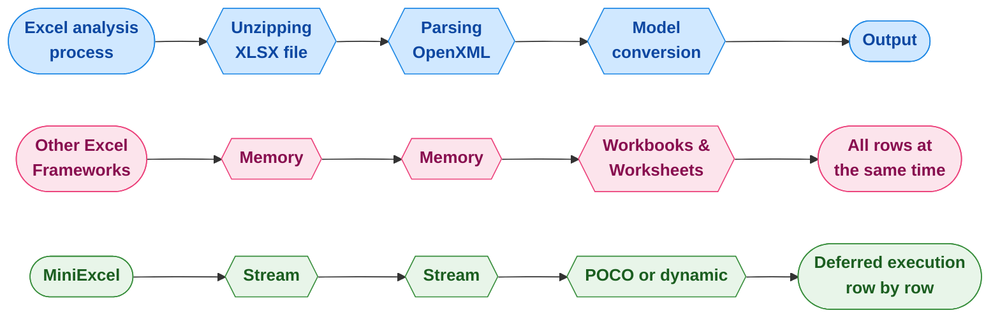

<div align="center">
<p><a href="https://www.nuget.org/packages/MiniExcel"></a>  <a href="https://www.nuget.org/packages/MiniExcel"></a>
<a href="https://ci.appveyor.com/project/mini-software/miniexcel/branch/master"></a>
<a href="https://gitee.com/dotnetchina/MiniExcel"></a> <a href="https://github.com/mini-software/MiniExcel" rel="nofollow"></a>
<a href="https://www.nuget.org/packages/MiniExcel"></a>
<a href="https://deepwiki.com/mini-software/MiniExcel"></a>
</p>
</div>

---

[](https://www.dotnetfoundation.org/)

<div align="center">
<p>Questo progetto fa parte della <a href="https://www.dotnetfoundation.org/">.NET Foundation</a> e opera secondo il loro <a href="https://www.dotnetfoundation.org/code-of-conduct">codice di condotta</a>. </p>
</div>

---

<div align="center">
<p><strong><a href="README.md">English</a> | <a href="README.zh-CN.md">简体中文</a> | <a href="https://openaitx.github.io/view.html?user=mini-software&amp;project=MiniExcel&amp;lang=zh-TW">繁體中文</a> | <a href="https://openaitx.github.io/view.html?user=mini-software&amp;project=MiniExcel&amp;lang=ja">日本語</a> | <a href="https://openaitx.github.io/view.html?user=mini-software&amp;project=MiniExcel&amp;lang=ko">한국어</a> | <a href="https://openaitx.github.io/view.html?user=mini-software&amp;project=MiniExcel&amp;lang=hi">हिन्दी</a> | <a href="https://openaitx.github.io/view.html?user=mini-software&amp;project=MiniExcel&amp;lang=th">ไทย</a> | <a href="https://openaitx.github.io/view.html?user=mini-software&amp;project=MiniExcel&amp;lang=fr">Français</a> | <a href="https://openaitx.github.io/view.html?user=mini-software&amp;project=MiniExcel&amp;lang=de">Deutsch</a> | <a href="https://openaitx.github.io/view.html?user=mini-software&amp;project=MiniExcel&amp;lang=es">Español</a> | <a href="https://openaitx.github.io/view.html?user=mini-software&amp;project=MiniExcel&amp;lang=it">Italiano</a> | <a href="https://openaitx.github.io/view.html?user=mini-software&amp;project=MiniExcel&amp;lang=ru">Русский</a> | <a href="https://openaitx.github.io/view.html?user=mini-software&amp;project=MiniExcel&amp;lang=pt">Português</a> | <a href="https://openaitx.github.io/view.html?user=mini-software&amp;project=MiniExcel&amp;lang=nl">Nederlands</a> | <a href="https://openaitx.github.io/view.html?user=mini-software&amp;project=MiniExcel&amp;lang=pl">Polski</a> | <a href="https://openaitx.github.io/view.html?user=mini-software&amp;project=MiniExcel&amp;lang=ar">العربية</a> | <a href="https://openaitx.github.io/view.html?user=mini-software&amp;project=MiniExcel&amp;lang=fa">فارسی</a> | <a href="https://openaitx.github.io/view.html?user=mini-software&amp;project=MiniExcel&amp;lang=tr">Türkçe</a> | <a href="https://openaitx.github.io/view.html?user=mini-software&amp;project=MiniExcel&amp;lang=vi">Tiếng Việt</a> | <a href="https://openaitx.github.io/view.html?user=mini-software&amp;project=MiniExcel&amp;lang=id">Bahasa Indonesia</a><p></p>
</strong></p>
</div>


---

<div align="center">
 Le tue <a href="https://github.com/mini-software/MiniExcel">Stelle</a> o le <a href="https://miniexcel.github.io">Donazioni</a> possono rendere MiniExcel migliore
</div>

---

### Introduzione

MiniExcel è uno strumento semplice ed efficiente per la gestione di file Excel su .NET, progettato specificamente per minimizzare l’utilizzo della memoria.

Attualmente, la maggior parte dei framework popolari necessita di caricare tutti i dati da un documento Excel in memoria per facilitarne le operazioni, ma questo può causare problemi di consumo di memoria. L’approccio di MiniExcel è diverso: i dati vengono elaborati riga per riga in modalità streaming, riducendo il consumo originale da centinaia di megabyte a pochi megabyte, prevenendo efficacemente i problemi di esaurimento memoria (OOM).



### Funzionalità

- Minimizza il consumo di memoria, prevenendo errori di memoria insufficiente (OOM) ed evitando garbage collection complete
- Abilita operazioni in tempo reale a livello di riga per migliori prestazioni su grandi set di dati
- Supporta LINQ con esecuzione differita, permettendo paginazione veloce ed efficiente in termini di memoria e query complesse
- Leggero, senza necessità di Microsoft Office o componenti COM+, e una DLL inferiore a 500KB
- API semplice e intuitiva per leggere/scrivere/riempire excel

### Anteprima versione 2.0

Stiamo lavorando su una futura versione di MiniExcel, con una nuova API modulare e focalizzata,
pacchetti nuget separati per le funzionalità Core e Csv, pieno supporto per query asincrone tramite `IAsyncEnumerable`,
e altre novità in arrivo! I pacchetti saranno disponibili in pre-release, quindi sentitevi liberi di provarli e darci un feedback!

Se lo fate, assicuratevi anche di consultare la [nuova documentazione](https://raw.githubusercontent.com/mini-software/MiniExcel/master/README-V2.md) e le [note di aggiornamento](https://raw.githubusercontent.com/mini-software/MiniExcel/master/V2-Upgrade-Notes.md).


### Inizia subito

- [Importa/Interroga Excel](#getstart1)

- [Esporta/Crea Excel](#getstart2)

- [Template Excel](#getstart3)

- [Nome/Indice/Attributo Ignora Colonna Excel](#getstart4)

- [Esempi](#getstart5)


### Installazione

Puoi installare il pacchetto [da NuGet](https://www.nuget.org/packages/MiniExcel)

### Note di rilascio

Controlla le [Note di Rilascio](docs)

### TODO

Si prega di controllare [TODO](https://github.com/mini-software/MiniExcel/projects/1?fullscreen=true)

### Prestazioni

Il codice per i benchmark si trova in [MiniExcel.Benchmarks](https://raw.githubusercontent.com/mini-software/MiniExcel/master/benchmarks/MiniExcel.Benchmarks/Program.cs).

Il file utilizzato per testare le prestazioni è [**Test1,000,000x10.xlsx**](https://raw.githubusercontent.com/mini-software/MiniExcel/master/benchmarks/MiniExcel.Benchmarks/Test1%2C000%2C000x10.xlsx), un documento da 32MB contenente 1.000.000 righe * 10 colonne le cui celle sono riempite con la stringa "HelloWorld".

Per eseguire tutti i benchmark utilizzare:

```bash
dotnet run -project .\benchmarks\MiniExcel.Benchmarks -c Release -f net9.0 -filter * --join
```
Puoi trovare i risultati dei benchmark per l'ultima release [qui](benchmarks/results).


### Query/Importazione Excel  <a name="getstart1"></a>

#### 1. Esegui una query e mappa i risultati su un IEnumerable fortemente tipizzato [[Provalo]](https://dotnetfiddle.net/w5WD1J)

Si consiglia di utilizzare Stream.Query per una maggiore efficienza.


```csharp
public class UserAccount
{
    public Guid ID { get; set; }
    public string Name { get; set; }
    public DateTime BoD { get; set; }
    public int Age { get; set; }
    public bool VIP { get; set; }
    public decimal Points { get; set; }
}

var rows = MiniExcel.Query<UserAccount>(path);

// or

using (var stream = File.OpenRead(path))
    var rows = stream.Query<UserAccount>();
```


#### 2. Esegui una query e mappala su una lista di oggetti dinamici senza usare head [[Provalo]](https://dotnetfiddle.net/w5WD1J)

* la chiave dinamica è `A.B.C.D..`

| MiniExcel | 1 |
|-----------|---|
| Github    | 2 |


```csharp

var rows = MiniExcel.Query(path).ToList();

// or
using (var stream = File.OpenRead(path))
{
    var rows = stream.Query().ToList();

    Assert.Equal("MiniExcel", rows[0].A);
    Assert.Equal(1, rows[0].B);
    Assert.Equal("Github", rows[1].A);
    Assert.Equal(2, rows[1].B);
}
```
#### 3. Esegui una query con la prima riga di intestazione [[Provalo]](https://dotnetfiddle.net/w5WD1J)

nota : se ci sono colonne con lo stesso nome viene utilizzata l’ultima a destra

Excel di input :

| Colonna1   | Colonna2 |
|------------|----------|
| MiniExcel  | 1        |
| Github     | 2        |


```csharp

var rows = MiniExcel.Query(useHeaderRow:true).ToList();

// or

using (var stream = File.OpenRead(path))
{
    var rows = stream.Query(useHeaderRow:true).ToList();

    Assert.Equal("MiniExcel", rows[0].Column1);
    Assert.Equal(1, rows[0].Column2);
    Assert.Equal("Github", rows[1].Column1);
    Assert.Equal(2, rows[1].Column2);
}
```
#### 4. Estensione LINQ per il supporto alle query First/Take/Skip ...ecc.

Query First

```csharp
var row = MiniExcel.Query(path).First();
Assert.Equal("HelloWorld", row.A);

// or

using (var stream = File.OpenRead(path))
{
    var row = stream.Query().First();
    Assert.Equal("HelloWorld", row.A);
}
```
Prestazioni tra MiniExcel/ExcelDataReader/ClosedXML/EPPlus


#### 5. Query per nome del foglio


```csharp
MiniExcel.Query(path, sheetName: "SheetName");
//or
stream.Query(sheetName: "SheetName");
```
#### 6. Interrogare tutti i nomi dei fogli e le righe


```csharp
var sheetNames = MiniExcel.GetSheetNames(path);
foreach (var sheetName in sheetNames)
{
    var rows = MiniExcel.Query(path, sheetName: sheetName);
}
```
#### 7. Ottieni Colonne


```csharp
var columns = MiniExcel.GetColumns(path); // e.g result : ["A","B"...]

var cnt = columns.Count;  // get column count
```
#### 8. Query dinamica: cast della riga a `IDictionary<string,object>`


```csharp
foreach(IDictionary<string,object> row in MiniExcel.Query(path))
{
    //..
}

// or
var rows = MiniExcel.Query(path).Cast<IDictionary<string,object>>();
// or Query specified ranges (capitalized)
// A2 represents the second row of column A, C3 represents the third row of column C
// If you don't want to restrict rows, just don't include numbers
var rows = MiniExcel.QueryRange(path, startCell: "A2", endCell: "C3").Cast<IDictionary<string, object>>();
```
#### 9. Query Excel restituisce DataTable

Non consigliato, perché DataTable caricherà tutti i dati in memoria e perderà la caratteristica di basso consumo di memoria di MiniExcel.


```C#
var table = MiniExcel.QueryAsDataTable(path, useHeaderRow: true);
```


#### 10. Specificare la cella da cui iniziare a leggere i dati


```csharp
MiniExcel.Query(path,useHeaderRow:true,startCell:"B3")
```


#### 11. Compilare Celle Unite

Nota: L'efficienza è più lenta rispetto a `non utilizzare il riempimento unione`

Motivo: Lo standard OpenXml mette mergeCells in fondo al file, il che porta alla necessità di eseguire due foreach sul sheetxml


```csharp
    var config = new OpenXmlConfiguration()
    {
        FillMergedCells = true
    };
    var rows = MiniExcel.Query(path, configuration: config);
```


supporta il riempimento multi-riga e multi-colonna con lunghezza e larghezza variabili


#### 12. Lettura di grandi file tramite cache su disco (Disk-Base Cache - SharedString)

Se la dimensione di SharedStrings supera i 5 MB, MiniExcel utilizzerà di default la cache su disco locale, ad esempio, [10x100000.xlsx](https://github.com/MiniExcel/MiniExcel/files/8403819/NotDuplicateSharedStrings_10x100000.xlsx) (un milione di righe di dati), quando la cache su disco è disabilitata l'utilizzo massimo di memoria è 195MB, ma abilitando la cache su disco servono solo 65MB. Nota, questa ottimizzazione comporta un piccolo costo in termini di efficienza, quindi in questo caso il tempo di lettura aumenta da 7,4 secondi a 27,2 secondi. Se non ne hai bisogno puoi disabilitare la cache su disco con il seguente codice:


```csharp
var config = new OpenXmlConfiguration { EnableSharedStringCache = false };
MiniExcel.Query(path,configuration: config)
```
Puoi usare `SharedStringCacheSize` per modificare la dimensione del file sharedString oltre la dimensione specificata per la cache su disco

```csharp
var config = new OpenXmlConfiguration { SharedStringCacheSize=500*1024*1024 };
MiniExcel.Query(path, configuration: config);
```


### Creare/Esportare Excel  <a name="getstart2"></a>

1. Deve essere un tipo non astratto con un costruttore pubblico senza parametri.

2. MiniExcel supporta l'esecuzione differita tramite IEnumerable; se desideri utilizzare meno memoria, per favore non chiamare metodi come ToList

esempio: uso di memoria con o senza ToList


#### 1. Tipo anonimo o fortemente tipizzato [[Provalo]](https://dotnetfiddle.net/w5WD1J)


```csharp
var path = Path.Combine(Path.GetTempPath(), $"{Guid.NewGuid()}.xlsx");
MiniExcel.SaveAs(path, new[] {
    new { Column1 = "MiniExcel", Column2 = 1 },
    new { Column1 = "Github", Column2 = 2}
});
```
#### 2. `IEnumerable<IDictionary<string, object>>`


```csharp
var values = new List<Dictionary<string, object>>()
{
    new Dictionary<string,object>{{ "Column1", "MiniExcel" }, { "Column2", 1 } },
    new Dictionary<string,object>{{ "Column1", "Github" }, { "Column2", 2 } }
};
MiniExcel.SaveAs(path, values);
```
Crea Risultato File :

| Colonna1  | Colonna2 |
|-----------|----------|
| MiniExcel | 1        |
| Github    | 2        |


#### 3.  IDataReader
- `Raccomandato`, può evitare di caricare tutti i dati in memoria

```csharp
MiniExcel.SaveAs(path, reader);
```


Esportazione di più fogli con DataReader (consigliato da Dapper ExecuteReader)


```csharp
using (var cnn = Connection)
{
    cnn.Open();
    var sheets = new Dictionary<string,object>();
    sheets.Add("sheet1", cnn.ExecuteReader("select 1 id"));
    sheets.Add("sheet2", cnn.ExecuteReader("select 2 id"));
    MiniExcel.SaveAs("Demo.xlsx", sheets);
}
```
#### 4. Datatable

- `Non raccomandato`, caricherà tutti i dati in memoria

- DataTable usa Caption come primo nome della colonna, poi usa columname


```csharp
var path = Path.Combine(Path.GetTempPath(), $"{Guid.NewGuid()}.xlsx");
var table = new DataTable();
{
    table.Columns.Add("Column1", typeof(string));
    table.Columns.Add("Column2", typeof(decimal));
    table.Rows.Add("MiniExcel", 1);
    table.Rows.Add("Github", 2);
}

MiniExcel.SaveAs(path, table);
```
#### 5. Query Dapper

Grazie @shaofing #552, si prega di utilizzare `CommandDefinition + CommandFlags.NoCache`


```csharp
using (var connection = GetConnection(connectionString))
{
    var rows = connection.Query(
        new CommandDefinition(
            @"select 'MiniExcel' as Column1,1 as Column2 union all select 'Github',2"
            , flags: CommandFlags.NoCache)
        );
    // Note: QueryAsync will throw close connection exception
    MiniExcel.SaveAs(path, rows);
}
```
Il codice seguente caricherà tutti i dati in memoria


```csharp
using (var connection = GetConnection(connectionString))
{
    var rows = connection.Query(@"select 'MiniExcel' as Column1,1 as Column2 union all select 'Github',2");
    MiniExcel.SaveAs(path, rows);
}
```
#### 6. SaveAs su MemoryStream  [[Provalo]](https://dotnetfiddle.net/JOen0e)


```csharp
using (var stream = new MemoryStream()) //support FileStream,MemoryStream ect.
{
    stream.SaveAs(values);
}
```
ad es.: api per l'esportazione in excel


```csharp
public IActionResult DownloadExcel()
{
    var values = new[] {
        new { Column1 = "MiniExcel", Column2 = 1 },
        new { Column1 = "Github", Column2 = 2}
    };

    var memoryStream = new MemoryStream();
    memoryStream.SaveAs(values);
    memoryStream.Seek(0, SeekOrigin.Begin);
    return new FileStreamResult(memoryStream, "application/vnd.openxmlformats-officedocument.spreadsheetml.sheet")
    {
        FileDownloadName = "demo.xlsx"
    };
}
```
#### 7. Creare più fogli


```csharp
// 1. Dictionary<string,object>
var users = new[] { new { Name = "Jack", Age = 25 }, new { Name = "Mike", Age = 44 } };
var department = new[] { new { ID = "01", Name = "HR" }, new { ID = "02", Name = "IT" } };
var sheets = new Dictionary<string, object>
{
    ["users"] = users,
    ["department"] = department
};
MiniExcel.SaveAs(path, sheets);

// 2. DataSet
var sheets = new DataSet();
sheets.Add(UsersDataTable);
sheets.Add(DepartmentDataTable);
//..
MiniExcel.SaveAs(path, sheets);
```


#### 8. Opzioni TableStyles

Stile predefinito


Senza configurazione dello stile


```csharp
var config = new OpenXmlConfiguration()
{
     TableStyles = TableStyles.None
};
MiniExcel.SaveAs(path, value,configuration:config);
```


#### 9. AutoFiltro

Dalla versione v0.19.0 `OpenXmlConfiguration.AutoFilter` può abilitare/disabilitare l’AutoFiltro, il valore predefinito è `true`, e il modo per impostare AutoFiltro è:


```csharp
MiniExcel.SaveAs(path, value, configuration: new OpenXmlConfiguration() { AutoFilter = false });
```
#### 10. Crea Immagine


```csharp
var value = new[] {
    new { Name="github",Image=File.ReadAllBytes(PathHelper.GetFile("images/github_logo.png"))},
    new { Name="google",Image=File.ReadAllBytes(PathHelper.GetFile("images/google_logo.png"))},
    new { Name="microsoft",Image=File.ReadAllBytes(PathHelper.GetFile("images/microsoft_logo.png"))},
    new { Name="reddit",Image=File.ReadAllBytes(PathHelper.GetFile("images/reddit_logo.png"))},
    new { Name="statck_overflow",Image=File.ReadAllBytes(PathHelper.GetFile("images/statck_overflow_logo.png"))},
};
MiniExcel.SaveAs(path, value);
```


#### 11. Esportazione file array di byte

Dalla versione 1.22.0, quando il tipo di valore è `byte[]`, il sistema salverà per impostazione predefinita il percorso del file nella cella, e durante l'importazione il sistema potrà convertirlo in `byte[]`. Se non vuoi utilizzare questa funzione, puoi impostare `OpenXmlConfiguration.EnableConvertByteArray` su `false`, migliorando così l'efficienza del sistema.


Dalla versione 1.22.0, quando il tipo di valore è `byte[]`, il sistema salverà per impostazione predefinita il percorso del file nella cella, e durante l'importazione il sistema potrà convertirlo in `byte[]`. Se non vuoi utilizzare questa funzione, puoi impostare `OpenXmlConfiguration.EnableConvertByteArray` su `false`, migliorando così l'efficienza del sistema.


#### 12. Unisci le stesse celle verticalmente

Questa funzionalità è supportata solo nel formato `xlsx` e unisce le celle verticalmente tra i tag @merge e @endmerge.
Puoi usare @mergelimit per limitare i confini delle celle da unire verticalmente.


```csharp
var mergedFilePath = Path.Combine(Path.GetTempPath(), $"{Guid.NewGuid().ToString()}.xlsx");

var path = @"../../../../../samples/xlsx/TestMergeWithTag.xlsx";

MiniExcel.MergeSameCells(mergedFilePath, path);
```


```csharp
var memoryStream = new MemoryStream();

var path = @"../../../../../samples/xlsx/TestMergeWithTag.xlsx";

memoryStream.MergeSameCells(path);
```
Contenuto del file prima e dopo l'unione:

Senza limite di unione:


Con limite di unione:


#### 13. Salta i valori null

Nuova opzione esplicita per scrivere celle vuote per i valori null:


```csharp
DataTable dt = new DataTable();

/* ... */

DataRow dr = dt.NewRow();

dr["Name1"] = "Somebody once";
dr["Name2"] = null;
dr["Name3"] = "told me.";

dt.Rows.Add(dr);

OpenXmlConfiguration configuration = new OpenXmlConfiguration()
{
     EnableWriteNullValueCell = true // Default value.
};

MiniExcel.SaveAs(@"C:\temp\Book1.xlsx", dt, configuration: configuration);
```


```xml
<x:row r="2">
    <x:c r="A2" t ="str" s="2">
        <x:v>Somebody once</x:v>
    </x:c>
    <x:c r="B2" s="2"></x:c>
    <x:c r="C2" t ="str" s="2">
        <x:v>told me.</x:v>
    </x:c>
</x:row>
```
Comportamento precedente:


```csharp
/* ... */

OpenXmlConfiguration configuration = new OpenXmlConfiguration()
{
     EnableWriteNullValueCell = false // Default value is true.
};

MiniExcel.SaveAs(@"C:\temp\Book1.xlsx", dt, configuration: configuration);
```


```xml
<x:row r="2">
    <x:c r="A2" t ="str" s="2">
        <x:v>Somebody once</x:v>
    </x:c>
    <x:c r="B2" t ="str" s="2">
        <x:v></x:v>
    </x:c>
    <x:c r="C2" t ="str" s="2">
        <x:v>told me.</x:v>
    </x:c>
</x:row>
```
Funziona per valori null e DBNull.

#### 14. Blocca riquadri

```csharp
/* ... */

OpenXmlConfiguration configuration = new OpenXmlConfiguration()
{
    FreezeRowCount = 1,     // default is 1
    FreezeColumnCount = 2   // default is 0
};

MiniExcel.SaveAs(@"C:\temp\Book1.xlsx", dt, configuration: configuration);
```


### Compilare i Dati nel Modello Excel <a name="getstart3"></a>

- La dichiarazione è simile al template Vue `{{nome variabile}}`, oppure al rendering di una collezione `{{nome collezione.nome campo}}`
- Il rendering delle collezioni supporta IEnumerable/DataTable/DapperRow

#### 1. Compilazione Base

Modello:


Risultato:


Codice:

```csharp
// 1. By POCO
var value = new
{
    Name = "Jack",
    CreateDate = new DateTime(2021, 01, 01),
    VIP = true,
    Points = 123
};
MiniExcel.SaveAsByTemplate(path, templatePath, value);


// 2. By Dictionary
var value = new Dictionary<string, object>()
{
    ["Name"] = "Jack",
    ["CreateDate"] = new DateTime(2021, 01, 01),
    ["VIP"] = true,
    ["Points"] = 123
};
MiniExcel.SaveAsByTemplate(path, templatePath, value);
```
#### 2. Riempimento Dati IEnumerable

> Nota1: Utilizzare il primo IEnumerable della stessa colonna come base per riempire la lista

Template:


Risultato:


Codice:


```csharp
//1. By POCO
var value = new
{
    employees = new[] {
        new {name="Jack",department="HR"},
        new {name="Lisa",department="HR"},
        new {name="John",department="HR"},
        new {name="Mike",department="IT"},
        new {name="Neo",department="IT"},
        new {name="Loan",department="IT"}
    }
};
MiniExcel.SaveAsByTemplate(path, templatePath, value);

//2. By Dictionary
var value = new Dictionary<string, object>()
{
    ["employees"] = new[] {
        new {name="Jack",department="HR"},
        new {name="Lisa",department="HR"},
        new {name="John",department="HR"},
        new {name="Mike",department="IT"},
        new {name="Neo",department="IT"},
        new {name="Loan",department="IT"}
    }
};
MiniExcel.SaveAsByTemplate(path, templatePath, value);
```
#### 3. Compilazione Dati Complessi

> Nota: Supporta più fogli e utilizzo della stessa variabile

Template:


Risultato:


```csharp
// 1. By POCO
var value = new
{
    title = "FooCompany",
    managers = new[] {
        new {name="Jack",department="HR"},
        new {name="Loan",department="IT"}
    },
    employees = new[] {
        new {name="Wade",department="HR"},
        new {name="Felix",department="HR"},
        new {name="Eric",department="IT"},
        new {name="Keaton",department="IT"}
    }
};
MiniExcel.SaveAsByTemplate(path, templatePath, value);

// 2. By Dictionary
var value = new Dictionary<string, object>()
{
    ["title"] = "FooCompany",
    ["managers"] = new[] {
        new {name="Jack",department="HR"},
        new {name="Loan",department="IT"}
    },
    ["employees"] = new[] {
        new {name="Wade",department="HR"},
        new {name="Felix",department="HR"},
        new {name="Eric",department="IT"},
        new {name="Keaton",department="IT"}
    }
};
MiniExcel.SaveAsByTemplate(path, templatePath, value);
```
#### 4. Prestazioni di riempimento Big Data

> NOTA: Usare l'esecuzione differita IEnumerable invece di ToList può ridurre al massimo l'uso della memoria in MiniExcel


#### 5. Tipo di mappatura automatica del valore della cella

Template


Risultato


Classe


```csharp
public class Poco
{
    public string @string { get; set; }
    public int? @int { get; set; }
    public decimal? @decimal { get; set; }
    public double? @double { get; set; }
    public DateTime? datetime { get; set; }
    public bool? @bool { get; set; }
    public Guid? Guid { get; set; }
}
```
Codice


```csharp
var poco = new TestIEnumerableTypePoco { @string = "string", @int = 123, @decimal = decimal.Parse("123.45"), @double = (double)123.33, @datetime = new DateTime(2021, 4, 1), @bool = true, @Guid = Guid.NewGuid() };
var value = new
{
    Ts = new[] {
        poco,
        new TestIEnumerableTypePoco{},
        null,
        poco
    }
};
MiniExcel.SaveAsByTemplate(path, templatePath, value);
```
#### 6. Esempio :  Elencare Progetti Github

Modello


Risultato


Codice


```csharp
var projects = new[]
{
    new {Name = "MiniExcel",Link="https://github.com/mini-software/MiniExcel",Star=146, CreateTime=new DateTime(2021,03,01)},
    new {Name = "HtmlTableHelper",Link="https://github.com/mini-software/HtmlTableHelper",Star=16, CreateTime=new DateTime(2020,02,01)},
    new {Name = "PocoClassGenerator",Link="https://github.com/mini-software/PocoClassGenerator",Star=16, CreateTime=new DateTime(2019,03,17)}
};
var value = new
{
    User = "ITWeiHan",
    Projects = projects,
    TotalStar = projects.Sum(s => s.Star)
};
MiniExcel.SaveAsByTemplate(path, templatePath, value);
```
#### 7. Riempimento Dati Raggruppati


```csharp
var value = new Dictionary<string, object>()
{
    ["employees"] = new[] {
        new {name="Jack",department="HR"},
        new {name="Jack",department="HR"},
        new {name="John",department="HR"},
        new {name="John",department="IT"},
        new {name="Neo",department="IT"},
        new {name="Loan",department="IT"}
    }
};
await MiniExcel.SaveAsByTemplateAsync(path, templatePath, value);
```
##### 1. Con tag `@group` e con tag `@header`

Prima


Dopo


##### 2. Con tag @group e senza tag @header

Prima


Dopo


##### 3. Senza tag @group

Prima


Dopo


#### 8. Istruzioni If/ElseIf/Else all'interno della cella

Regole:
1. Supporta DateTime, Double, Int con operatori ==, !=, >, >=, <, <=.
2. Supporta String con operatori ==, !=.
3. Ogni istruzione deve essere su una nuova riga.
4. Va aggiunto uno spazio singolo prima e dopo gli operatori.
5. Non ci devono essere nuove righe all'interno delle istruzioni.
6. La cella deve avere esattamente il formato seguente.

```csharp
@if(name == Jack)
{{employees.name}}
@elseif(name == Neo)
Test {{employees.name}}
@else
{{employees.department}}
@endif
```
Prima


Dopo


#### 9. DataTable come parametro


```csharp
var managers = new DataTable();
{
    managers.Columns.Add("name");
    managers.Columns.Add("department");
    managers.Rows.Add("Jack", "HR");
    managers.Rows.Add("Loan", "IT");
}
var value = new Dictionary<string, object>()
{
    ["title"] = "FooCompany",
    ["managers"] = managers,
};
MiniExcel.SaveAsByTemplate(path, templatePath, value);
```
#### 10. Formule

##### 1. Esempio
Anteponi il prefisso `$` alla tua formula e usa `$enumrowstart` e `$enumrowend` per contrassegnare i riferimenti alle righe iniziali e finali enumerabili:


Quando il template viene renderizzato, il prefisso `$` verrà rimosso e `$enumrowstart` e `$enumrowend` verranno sostituiti con i numeri di riga iniziali e finali dell'enumerabile:


##### 2. Altri esempi di formule:

|              |                                                                                           |
|--------------|-------------------------------------------------------------------------------------------|
| Somma        | `$=SUM(C{{$enumrowstart}}:C{{$enumrowend}})`                                              |
| Media alt.   | `$=SUM(C{{$enumrowstart}}:C{{$enumrowend}}) / COUNT(C{{$enumrowstart}}:C{{$enumrowend}})` |
| Intervallo   | `$=MAX(C{{$enumrowstart}}:C{{$enumrowend}}) - MIN(C{{$enumrowstart}}:C{{$enumrowend}})`   |


#### 11. Altro

##### 1. Verifica della chiave del parametro del template

Dalla versione V1.24.0, per impostazione predefinita viene ignorata la chiave del parametro mancante nel template e sostituita con una stringa vuota, `IgnoreTemplateParameterMissing` può controllare se lanciare un'eccezione o meno.

```csharp
var config = new OpenXmlConfiguration()
{
    IgnoreTemplateParameterMissing = false,
};
MiniExcel.SaveAsByTemplate(path, templatePath, value, config)
```


### Attributo Nome/Indice/Ignora Colonna di Excel <a name="getstart4"></a>


#### 1. Specificare il nome della colonna, l'indice della colonna, ignorare la colonna

Esempio Excel


Codice


```csharp
public class ExcelAttributeDemo
{
    [ExcelColumnName("Column1")]
    public string Test1 { get; set; }
    [ExcelColumnName("Column2")]
    public string Test2 { get; set; }
    [ExcelIgnore]
    public string Test3 { get; set; }
    [ExcelColumnIndex("I")] // system will convert "I" to 8 index
    public string Test4 { get; set; }
    public string Test5 { get; } //wihout set will ignore
    public string Test6 { get; private set; } //un-public set will ignore
    [ExcelColumnIndex(3)] // start with 0
    public string Test7 { get; set; }
}

var rows = MiniExcel.Query<ExcelAttributeDemo>(path).ToList();
Assert.Equal("Column1", rows[0].Test1);
Assert.Equal("Column2", rows[0].Test2);
Assert.Null(rows[0].Test3);
Assert.Equal("Test7", rows[0].Test4);
Assert.Null(rows[0].Test5);
Assert.Null(rows[0].Test6);
Assert.Equal("Test4", rows[0].Test7);
```


#### 2. Formato Personalizzato (ExcelFormatAttribute)

Dalla versione V0.21.0 è supportata la classe che contiene il metodo di formato `ToString(string content)`

Classe


```csharp
public class Dto
{
    public string Name { get; set; }

    [ExcelFormat("MMMM dd, yyyy")]
    public DateTime InDate { get; set; }
}
```
Codice


```csharp
var value = new Dto[] {
    new Issue241Dto{ Name="Jack",InDate=new DateTime(2021,01,04)},
    new Issue241Dto{ Name="Henry",InDate=new DateTime(2020,04,05)},
};
MiniExcel.SaveAs(path, value);
```
Risultato


La query supporta la conversione personalizzata del formato


#### 3. Imposta larghezza colonna (ExcelColumnWidthAttribute)


```csharp
public class Dto
{
    [ExcelColumnWidth(20)]
    public int ID { get; set; }
    [ExcelColumnWidth(15.50)]
    public string Name { get; set; }
}
```
#### 4. Più nomi di colonne mappati sulla stessa proprietà.


```csharp
public class Dto
{
    [ExcelColumnName(excelColumnName:"EmployeeNo",aliases:new[] { "EmpNo","No" })]
    public string Empno { get; set; }
    public string Name { get; set; }
}
```
#### 5. System.ComponentModel.DisplayNameAttribute = ExcelColumnName.excelColumnNameAttribute

Dalla versione 1.24.0, il sistema supporta System.ComponentModel.DisplayNameAttribute = ExcelColumnName.excelColumnNameAttribute


```C#
public class TestIssueI4TXGTDto
{
    public int ID { get; set; }
    public string Name { get; set; }
    [DisplayName("Specification")]
    public string Spc { get; set; }
    [DisplayName("Unit Price")]
    public decimal Up { get; set; }
}
```
#### 6. ExcelColumnAttribute

Dalla versione V1.26.0, più attributi possono essere semplificati come segue:


```csharp
        public class TestIssueI4ZYUUDto
        {
            [ExcelColumn(Name = "ID",Index =0)]
            public string MyProperty { get; set; }
            [ExcelColumn(Name = "CreateDate", Index = 1,Format ="yyyy-MM",Width =100)]
            public DateTime MyProperty2 { get; set; }
        }
```
#### 7. DynamicColumnAttribute

Dalla versione V1.26.0, possiamo impostare dinamicamente gli attributi di Column


```csharp
            var config = new OpenXmlConfiguration
            {
                DynamicColumns = new DynamicExcelColumn[] {
                    new DynamicExcelColumn("id"){Ignore=true},
                    new DynamicExcelColumn("name"){Index=1,Width=10},
                    new DynamicExcelColumn("createdate"){Index=0,Format="yyyy-MM-dd",Width=15},
                    new DynamicExcelColumn("point"){Index=2,Name="Account Point"},
                }
            };
            var path = PathHelper.GetTempPath();
            var value = new[] { new { id = 1, name = "Jack", createdate = new DateTime(2022, 04, 12) ,point = 123.456} };
            MiniExcel.SaveAs(path, value, configuration: config);
```


#### 8. DynamicSheetAttribute

Dalla versione V1.31.4 è possibile impostare dinamicamente gli attributi del foglio. Possiamo impostare il nome del foglio e lo stato (visibilità).
```csharp
            var configuration = new OpenXmlConfiguration
            {
                DynamicSheets = new DynamicExcelSheet[] {
                    new DynamicExcelSheet("usersSheet") { Name = "Users", State = SheetState.Visible },
                    new DynamicExcelSheet("departmentSheet") { Name = "Departments", State = SheetState.Hidden }
                }
            };

            var users = new[] { new { Name = "Jack", Age = 25 }, new { Name = "Mike", Age = 44 } };
            var department = new[] { new { ID = "01", Name = "HR" }, new { ID = "02", Name = "IT" } };
            var sheets = new Dictionary<string, object>
            {
                ["usersSheet"] = users,
                ["departmentSheet"] = department
            };

            var path = PathHelper.GetTempPath();
            MiniExcel.SaveAs(path, sheets, configuration: configuration);
```
Possiamo anche utilizzare il nuovo attributo ExcelSheetAttribute:


```C#
   [ExcelSheet(Name = "Departments", State = SheetState.Hidden)]
   private class DepartmentDto
   {
      [ExcelColumn(Name = "ID",Index = 0)]
      public string ID { get; set; }
      [ExcelColumn(Name = "Name",Index = 1)]
      public string Name { get; set; }
   }
```
### Aggiungi, Elimina, Aggiorna

#### Aggiungi

v1.28.0 supporta l'inserimento di N righe di dati CSV dopo l'ultima riga


```csharp
// Origin
{
    var value = new[] {
          new { ID=1,Name ="Jack",InDate=new DateTime(2021,01,03)},
          new { ID=2,Name ="Henry",InDate=new DateTime(2020,05,03)},
    };
    MiniExcel.SaveAs(path, value);
}
// Insert 1 rows after last
{
    var value = new { ID=3,Name = "Mike", InDate = new DateTime(2021, 04, 23) };
    MiniExcel.Insert(path, value);
}
// Insert N rows after last
{
    var value = new[] {
          new { ID=4,Name ="Frank",InDate=new DateTime(2021,06,07)},
          new { ID=5,Name ="Gloria",InDate=new DateTime(2022,05,03)},
    };
    MiniExcel.Insert(path, value);
}
```


v1.37.0 supporta l'inserimento di un nuovo foglio Excel in una cartella di lavoro esistente


```csharp
// Origin excel
{
    var value = new[] {
          new { ID=1,Name ="Jack",InDate=new DateTime(2021,01,03)},
          new { ID=2,Name ="Henry",InDate=new DateTime(2020,05,03)},
    };
    MiniExcel.SaveAs(path, value, sheetName: "Sheet1");
}
// Insert a new sheet
{
    var value = new { ID=3,Name = "Mike", InDate = new DateTime(2021, 04, 23) };
    MiniExcel.Insert(path, table, sheetName: "Sheet2");
}
```
#### Elimina(in attesa)

#### Aggiorna(in attesa)


### Controllo automatico del tipo di Excel <a name="getstart5"></a>

- MiniExcel controllerà se è xlsx o csv in base all'`estensione del file` per impostazione predefinita, ma potrebbero esserci imprecisioni, si prega di specificarlo manualmente.
- Non è possibile sapere da quale Excel provenga uno stream, si prega di specificarlo manualmente.


```csharp
stream.SaveAs(excelType:ExcelType.CSV);
//or
stream.SaveAs(excelType:ExcelType.XLSX);
//or
stream.Query(excelType:ExcelType.CSV);
//or
stream.Query(excelType:ExcelType.XLSX);
```


### CSV

#### Nota

- Per impostazione predefinita restituisce il tipo `string`, e il valore non verrà convertito in numeri o datetime, a meno che il tipo non sia definito tramite strong typing generico.


#### Separatore personalizzato

Il valore predefinito è `,` come separatore, puoi modificare la proprietà `Seperator` per la personalizzazione


```csharp
var config = new MiniExcelLibs.Csv.CsvConfiguration()
{
    Seperator=';'
};
MiniExcel.SaveAs(path, values,configuration: config);
```
Dalla versione V1.30.1 supporta la funzione per personalizzare il separatore (grazie a @hyzx86)


```csharp
var config = new CsvConfiguration()
{
    SplitFn = (row) => Regex.Split(row, $"[\t,](?=(?:[^\"]|\"[^\"]*\")*$)")
        .Select(s => Regex.Replace(s.Replace("\"\"", "\""), "^\"|\"$", "")).ToArray()
};
var rows = MiniExcel.Query(path, configuration: config).ToList();
```
#### Interruzione di riga personalizzata

Il valore predefinito è `\r\n` come carattere di nuova riga, puoi modificare la proprietà `NewLine` per la personalizzazione


```csharp
var config = new MiniExcelLibs.Csv.CsvConfiguration()
{
    NewLine='\n'
};
MiniExcel.SaveAs(path, values,configuration: config);
```
#### Codifica personalizzata

- La codifica predefinita è "Rileva codifica dai contrassegni di ordine dei byte" (detectEncodingFromByteOrderMarks: true)
- Se hai esigenze di codifica personalizzate, modifica la proprietà StreamReaderFunc / StreamWriterFunc


```csharp
// Read
var config = new MiniExcelLibs.Csv.CsvConfiguration()
{
    StreamReaderFunc = (stream) => new StreamReader(stream,Encoding.GetEncoding("gb2312"))
};
var rows = MiniExcel.Query(path, true,excelType:ExcelType.CSV,configuration: config);

// Write
var config = new MiniExcelLibs.Csv.CsvConfiguration()
{
    StreamWriterFunc = (stream) => new StreamWriter(stream, Encoding.GetEncoding("gb2312"))
};
MiniExcel.SaveAs(path, value,excelType:ExcelType.CSV, configuration: config);
```
#### Leggi stringa vuota come null

Per impostazione predefinita, i valori vuoti vengono mappati su string.Empty. Puoi modificare questo comportamento


```csharp
var config = new MiniExcelLibs.Csv.CsvConfiguration()
{
   ReadEmptyStringAsNull = true
};
```
### DataReader

#### 1. GetReader
Dalla versione 1.23.0, puoi usare GetDataReader


```csharp
    using (var reader = MiniExcel.GetReader(path,true))
    {
        while (reader.Read())
        {
            for (int i = 0; i < reader.FieldCount; i++)
            {
                var value = reader.GetValue(i);
            }
        }
    }
```


###  Async

- v0.17.0 supporta Async (grazie a isdaniel ( SHIH,BING-SIOU)](https://github.com/isdaniel))


```csharp
public static Task SaveAsAsync(string path, object value, bool printHeader = true, string sheetName = "Sheet1", ExcelType excelType = ExcelType.UNKNOWN, IConfiguration configuration = null)
public static Task SaveAsAsync(this Stream stream, object value, bool printHeader = true, string sheetName = "Sheet1", ExcelType excelType = ExcelType.XLSX, IConfiguration configuration = null)
public static Task<IEnumerable<dynamic>> QueryAsync(string path, bool useHeaderRow = false, string sheetName = null, ExcelType excelType = ExcelType.UNKNOWN, string startCell = "A1", IConfiguration configuration = null)
public static Task<IEnumerable<T>> QueryAsync<T>(this Stream stream, string sheetName = null, ExcelType excelType = ExcelType.UNKNOWN, string startCell = "A1", IConfiguration configuration = null) where T : class, new()
public static Task<IEnumerable<T>> QueryAsync<T>(string path, string sheetName = null, ExcelType excelType = ExcelType.UNKNOWN, string startCell = "A1", IConfiguration configuration = null) where T : class, new()
public static Task<IEnumerable<IDictionary<string, object>>> QueryAsync(this Stream stream, bool useHeaderRow = false, string sheetName = null, ExcelType excelType = ExcelType.UNKNOWN, string startCell = "A1", IConfiguration configuration = null)
public static Task SaveAsByTemplateAsync(this Stream stream, string templatePath, object value)
public static Task SaveAsByTemplateAsync(this Stream stream, byte[] templateBytes, object value)
public static Task SaveAsByTemplateAsync(string path, string templatePath, object value)
public static Task SaveAsByTemplateAsync(string path, byte[] templateBytes, object value)
public static Task<DataTable> QueryAsDataTableAsync(string path, bool useHeaderRow = true, string sheetName = null, ExcelType excelType = ExcelType.UNKNOWN, string startCell = "A1", IConfiguration configuration = null)
```
- v1.25.0 supporta `cancellationToken`。


### Altri

#### 1. Enum

Assicurarsi che il nome in excel e nella proprietà sia lo stesso, il sistema eseguirà il mapping automatico (non fa distinzione tra maiuscole e minuscole)


Dalla versione V0.18.0 è supportata la descrizione degli Enum


```csharp
public class Dto
{
    public string Name { get; set; }
    public I49RYZUserType UserType { get; set; }
}

public enum Type
{
    [Description("General User")]
    V1,
    [Description("General Administrator")]
    V2,
    [Description("Super Administrator")]
    V3
}
```


Dalla versione 1.30.0 è supportata la descrizione Excel per Enum, grazie a @KaneLeung

#### 2. Convertire CSV in XLSX o Convertire XLSX in CSV


```csharp
MiniExcel.ConvertXlsxToCsv(xlsxPath, csvPath);
MiniExcel.ConvertXlsxToCsv(xlsxStream, csvStream);
MiniExcel.ConvertCsvToXlsx(csvPath, xlsxPath);
MiniExcel.ConvertCsvToXlsx(csvStream, xlsxStream);
```
```csharp
using (var excelStream = new FileStream(path: filePath, FileMode.Open, FileAccess.Read))
using (var csvStream = new MemoryStream())
{
   MiniExcel.ConvertXlsxToCsv(excelStream, csvStream);
}
```
#### 3. CultureInfo personalizzato

Dalla versione 1.22.0, puoi personalizzare CultureInfo come segue, il valore predefinito di sistema è `CultureInfo.InvariantCulture`.


```csharp
var config = new CsvConfiguration()
{
    Culture = new CultureInfo("fr-FR"),
};
MiniExcel.SaveAs(path, value, configuration: config);

// or
MiniExcel.Query(path, configuration: config);
```
#### 4. Dimensione Buffer Personalizzata


```csharp
    public abstract class Configuration : IConfiguration
    {
        public int BufferSize { get; set; } = 1024 * 512;
    }
```
#### 5. Modalità Veloce

Il sistema non controllerà la memoria, ma puoi ottenere una velocità di salvataggio più elevata.


```csharp
var config = new OpenXmlConfiguration() { FastMode = true };
MiniExcel.SaveAs(path, reader,configuration:config);
```
#### 6. Aggiunta Immagine in Batch (MiniExcel.AddPicture)

Si prega di aggiungere le immagini prima di generare in batch i dati delle righe, altrimenti il sistema utilizzerà molta memoria quando si chiama AddPicture.


```csharp
var images = new[]
{
    new MiniExcelPicture
    {
        ImageBytes = File.ReadAllBytes(PathHelper.GetFile("images/github_logo.png")),
        SheetName = null, // default null is first sheet
        CellAddress = "C3", // required
    },
    new MiniExcelPicture
    {
        ImageBytes = File.ReadAllBytes(PathHelper.GetFile("images/google_logo.png")),
        PictureType = "image/png", // default PictureType = image/png
        SheetName = "Demo",
        CellAddress = "C9", // required
        WidthPx = 100,
        HeightPx = 100,
    },
};
MiniExcel.AddPicture(path, images);
```


#### 7. Ottieni le dimensioni dei fogli

```csharp
var dim = MiniExcel.GetSheetDimensions(path);
```
### Esempi:

#### 1. Inserimento SQL di `File di Grandi Dimensioni` con SQLite & Dapper per Evitare OOM

nota: per favore non chiamare i metodi ToList/ToArray dopo Query, caricheranno tutti i dati in memoria


```csharp
using (var connection = new SQLiteConnection(connectionString))
{
    connection.Open();
    using (var transaction = connection.BeginTransaction())
    using (var stream = File.OpenRead(path))
    {
       var rows = stream.Query();
       foreach (var row in rows)
             connection.Execute("insert into T (A,B) values (@A,@B)", new { row.A, row.B }, transaction: transaction);
       transaction.Commit();
    }
}
```
prestazioni:


#### 2. ASP.NET Core 3.1 o MVC 5 Download/Upload API Excel Xlsx Demo [Provalo](https://raw.githubusercontent.com/mini-software/MiniExcel/master/tests/MiniExcel.Tests.AspNetCore)


```csharp
public class ApiController : Controller
{
    public IActionResult Index()
    {
        return new ContentResult
        {
            ContentType = "text/html",
            StatusCode = (int)HttpStatusCode.OK,
            Content = @"<html><body>
<a href='api/DownloadExcel'>DownloadExcel</a><br>
<a href='api/DownloadExcelFromTemplatePath'>DownloadExcelFromTemplatePath</a><br>
<a href='api/DownloadExcelFromTemplateBytes'>DownloadExcelFromTemplateBytes</a><br>
<p>Upload Excel</p>
<form method='post' enctype='multipart/form-data' action='/api/uploadexcel'>
    <input type='file' name='excel'> <br>
    <input type='submit' >
</form>
</body></html{{"
        };
    }

    public IActionResult DownloadExcel()
    {
        var values = new[] {
            new { Column1 = "MiniExcel", Column2 = 1 },
            new { Column1 = "Github", Column2 = 2}
        };
        var memoryStream = new MemoryStream();
        memoryStream.SaveAs(values);
        memoryStream.Seek(0, SeekOrigin.Begin);
        return new FileStreamResult(memoryStream, "application/vnd.openxmlformats-officedocument.spreadsheetml.sheet")
        {
            FileDownloadName = "demo.xlsx"
        };
    }

    public IActionResult DownloadExcelFromTemplatePath()
    {
        string templatePath = "TestTemplateComplex.xlsx";

        Dictionary<string, object> value = new Dictionary<string, object>()
        {
            ["title"] = "FooCompany",
            ["managers"] = new[] {
                new {name="Jack",department="HR"},
                new {name="Loan",department="IT"}
            },
            ["employees"] = new[] {
                new {name="Wade",department="HR"},
                new {name="Felix",department="HR"},
                new {name="Eric",department="IT"},
                new {name="Keaton",department="IT"}
            }
        };

        MemoryStream memoryStream = new MemoryStream();
        memoryStream.SaveAsByTemplate(templatePath, value);
        memoryStream.Seek(0, SeekOrigin.Begin);
        return new FileStreamResult(memoryStream, "application/vnd.openxmlformats-officedocument.spreadsheetml.sheet")
        {
            FileDownloadName = "demo.xlsx"
        };
    }

    private static Dictionary<string, Byte[]> TemplateBytesCache = new Dictionary<string, byte[]>();

    static ApiController()
    {
        string templatePath = "TestTemplateComplex.xlsx";
        byte[] bytes = System.IO.File.ReadAllBytes(templatePath);
        TemplateBytesCache.Add(templatePath, bytes);
    }

    public IActionResult DownloadExcelFromTemplateBytes()
    {
        byte[] bytes = TemplateBytesCache["TestTemplateComplex.xlsx"];

        Dictionary<string, object> value = new Dictionary<string, object>()
        {
            ["title"] = "FooCompany",
            ["managers"] = new[] {
                new {name="Jack",department="HR"},
                new {name="Loan",department="IT"}
            },
            ["employees"] = new[] {
                new {name="Wade",department="HR"},
                new {name="Felix",department="HR"},
                new {name="Eric",department="IT"},
                new {name="Keaton",department="IT"}
            }
        };

        MemoryStream memoryStream = new MemoryStream();
        memoryStream.SaveAsByTemplate(bytes, value);
        memoryStream.Seek(0, SeekOrigin.Begin);
        return new FileStreamResult(memoryStream, "application/vnd.openxmlformats-officedocument.spreadsheetml.sheet")
        {
            FileDownloadName = "demo.xlsx"
        };
    }

    public IActionResult UploadExcel(IFormFile excel)
    {
        var stream = new MemoryStream();
        excel.CopyTo(stream);

        foreach (var item in stream.Query(true))
        {
            // do your logic etc.
        }

        return Ok("File uploaded successfully");
    }
}
```
####  3. Query di Paginazione


```csharp
void Main()
{
    var rows = MiniExcel.Query(path);

    Console.WriteLine("==== No.1 Page ====");
    Console.WriteLine(Page(rows,pageSize:3,page:1));
    Console.WriteLine("==== No.50 Page ====");
    Console.WriteLine(Page(rows,pageSize:3,page:50));
    Console.WriteLine("==== No.5000 Page ====");
    Console.WriteLine(Page(rows,pageSize:3,page:5000));
}

public static IEnumerable<T> Page<T>(IEnumerable<T> en, int pageSize, int page)
{
    return en.Skip(page * pageSize).Take(pageSize);
}
```


#### 4. WebForm esporta Excel tramite memorystream


```csharp
var fileName = "Demo.xlsx";
var sheetName = "Sheet1";
HttpResponse response = HttpContext.Current.Response;
response.Clear();
response.ContentType = "application/vnd.openxmlformats-officedocument.spreadsheetml.sheet";
response.AddHeader("Content-Disposition", $"attachment;filename=\"{fileName}\"");
var values = new[] {
    new { Column1 = "MiniExcel", Column2 = 1 },
    new { Column1 = "Github", Column2 = 2}
};
var memoryStream = new MemoryStream();
memoryStream.SaveAs(values, sheetName: sheetName);
memoryStream.Seek(0, SeekOrigin.Begin);
memoryStream.CopyTo(Response.OutputStream);
response.End();
```
#### 5. Gestione dinamica di i18n multilingue e autorità dei ruoli

Come nell'esempio, crea un metodo per gestire i18n e la gestione dei permessi, e usa `yield return per restituire IEnumerable<Dictionary<string, object>>` per ottenere effetti dinamici e di basso consumo di memoria


```csharp
void Main()
{
    var value = new Order[] {
        new Order(){OrderNo = "SO01",CustomerID="C001",ProductID="P001",Qty=100,Amt=500},
        new Order(){OrderNo = "SO02",CustomerID="C002",ProductID="P002",Qty=300,Amt=400},
    };

    Console.WriteLine("en-Us and Sales role");
    {
        var path = Path.GetTempPath() + Guid.NewGuid() + ".xlsx";
        var lang = "en-US";
        var role = "Sales";
        MiniExcel.SaveAs(path, GetOrders(lang, role, value));
        MiniExcel.Query(path, true).Dump();
    }

    Console.WriteLine("zh-CN and PMC role");
    {
        var path = Path.GetTempPath() + Guid.NewGuid() + ".xlsx";
        var lang = "zh-CN";
        var role = "PMC";
        MiniExcel.SaveAs(path, GetOrders(lang, role, value));
        MiniExcel.Query(path, true).Dump();
    }
}

private IEnumerable<Dictionary<string, object>> GetOrders(string lang, string role, Order[] orders)
{
    foreach (var order in orders)
    {
        var newOrder = new Dictionary<string, object>();

        if (lang == "zh-CN")
        {
            newOrder.Add("客户编号", order.CustomerID);
            newOrder.Add("订单编号", order.OrderNo);
            newOrder.Add("产品编号", order.ProductID);
            newOrder.Add("数量", order.Qty);
            if (role == "Sales")
                newOrder.Add("价格", order.Amt);
            yield return newOrder;
        }
        else if (lang == "en-US")
        {
            newOrder.Add("Customer ID", order.CustomerID);
            newOrder.Add("Order No", order.OrderNo);
            newOrder.Add("Product ID", order.ProductID);
            newOrder.Add("Quantity", order.Qty);
            if (role == "Sales")
                newOrder.Add("Amount", order.Amt);
            yield return newOrder;
        }
        else
        {
            throw new InvalidDataException($"lang {lang} wrong");
        }
    }
}

public class Order
{
    public string OrderNo { get; set; }
    public string CustomerID { get; set; }
    public decimal Qty { get; set; }
    public string ProductID { get; set; }
    public decimal Amt { get; set; }
}
```


### FAQ

#### D: Il titolo dell'intestazione di Excel non è uguale al nome della proprietà della classe, come mappare?

R. Si prega di utilizzare l'attributo ExcelColumnName


#### D. Come interrogare o esportare più fogli?

R. Metodo `GetSheetNames` con parametro sheetName di Query.


```csharp
var sheets = MiniExcel.GetSheetNames(path);
foreach (var sheet in sheets)
{
    Console.WriteLine($"sheet name : {sheet} ");
    var rows = MiniExcel.Query(path,useHeaderRow:true,sheetName:sheet);
    Console.WriteLine(rows);
}
```


#### D. Come interrogare o esportare informazioni sulla visibilità dei fogli?

R. Metodo `GetSheetInformations`.


```csharp
var sheets = MiniExcel.GetSheetInformations(path);
foreach (var sheetInfo in sheets)
{
    Console.WriteLine($"sheet index : {sheetInfo.Index} "); // next sheet index - numbered from 0
    Console.WriteLine($"sheet name : {sheetInfo.Name} ");   // sheet name
    Console.WriteLine($"sheet state : {sheetInfo.State} "); // sheet visibility state - visible / hidden
}
```
#### D. L'utilizzo di Count caricherà tutti i dati in memoria?

No, il test sull'immagine ha 1 milione di righe * 10 colonne di dati, l'utilizzo massimo della memoria è <60MB e ci vogliono 13,65 secondi


#### D. Come utilizza Query gli indici interi?

L'indice predefinito di Query è la chiave stringa: A,B,C.... Se si desidera passare a un indice numerico, creare il seguente metodo di conversione


```csharp
void Main()
{
    var path = @"D:\git\MiniExcel\samples\xlsx\TestTypeMapping.xlsx";
    var rows = MiniExcel.Query(path,true);
    foreach (var r in ConvertToIntIndexRows(rows))
    {
        Console.Write($"column 0 : {r[0]} ,column 1 : {r[1]}");
        Console.WriteLine();
    }
}

private IEnumerable<Dictionary<int, object>> ConvertToIntIndexRows(IEnumerable<object> rows)
{
    ICollection<string> keys = null;
    var isFirst = true;
    foreach (IDictionary<string,object> r in rows)
    {
        if(isFirst)
        {
            keys = r.Keys;
            isFirst = false;
        }

        var dic = new Dictionary<int, object>();
        var index = 0;
        foreach (var key in keys)
            dic[index++] = r[key];
        yield return dic;
    }
}
```
#### D. Nessun titolo, Excel vuoto viene generato quando il valore è vuoto durante l'esportazione in Excel

Poiché MiniExcel utilizza una logica simile a JSON.NET per ottenere dinamicamente il tipo dai valori al fine di semplificare le operazioni API, il tipo non può essere conosciuto senza dati. Puoi consultare [issue #133](https://github.com/mini-software/MiniExcel/issues/133) per ulteriori informazioni.


> Tipi forti e DataTable genereranno intestazioni, ma i Dictionary risulteranno comunque Excel vuoti

#### D. Come interrompere il foreach quando c'è una riga vuota?

MiniExcel può essere usato con `LINQ TakeWhile` per interrompere l'iterazione foreach.


#### D. Come rimuovere le righe vuote?


IEnumerable :


```csharp
public static IEnumerable<dynamic> QueryWithoutEmptyRow(Stream stream, bool useHeaderRow, string sheetName, ExcelType excelType, string startCell, IConfiguration configuration)
{
    var rows = stream.Query(useHeaderRow,sheetName,excelType,startCell,configuration);
    foreach (IDictionary<string,object> row in rows)
    {
        if(row.Keys.Any(key=>row[key]!=null))
            yield return row;
    }
}
```


DataTable :


```csharp
public static DataTable QueryAsDataTableWithoutEmptyRow(Stream stream, bool useHeaderRow, string sheetName, ExcelType excelType, string startCell, IConfiguration configuration)
{
    if (sheetName == null && excelType != ExcelType.CSV) /*Issue #279*/
        sheetName = stream.GetSheetNames().First();

    var dt = new DataTable(sheetName);
    var first = true;
    var rows = stream.Query(useHeaderRow,sheetName,excelType,startCell,configuration);
    foreach (IDictionary<string, object> row in rows)
    {
        if (first)
        {

            foreach (var key in row.Keys)
            {
                var column = new DataColumn(key, typeof(object)) { Caption = key };
                dt.Columns.Add(column);
            }

            dt.BeginLoadData();
            first = false;
        }

        var newRow = dt.NewRow();
        var isNull=true;
        foreach (var key in row.Keys)
        {
            var _v = row[key];
            if(_v!=null)
                isNull = false;
            newRow[key] = _v;
        }

        if(!isNull)
            dt.Rows.Add(newRow);
    }

    dt.EndLoadData();
    return dt;
}
```


#### D. Come usare SaveAs(path,value) per sostituire un file esistente senza generare l'errore "Il file ...xlsx esiste già"


Si prega di utilizzare la classe Stream per personalizzare la logica di creazione del file, ad esempio:


```C#
    using (var stream = File.Create("Demo.xlsx"))
        MiniExcel.SaveAs(stream,value);
```


oppure, dalla versione V1.25.0, SaveAs supporta il parametro overwriteFile per abilitare/disabilitare la sovrascrittura di un file esistente


```csharp
    MiniExcel.SaveAs(path, value, overwriteFile: true);
```


### Limitazioni e avvertenze

- Attualmente non supporta file xls e file criptati
- xlsm supporta solo Query


### Riferimenti

[ExcelDataReader](https://github.com/ExcelDataReader/ExcelDataReader)  / [ClosedXML](https://github.com/ClosedXML/ClosedXML) / [Dapper](https://github.com/DapperLib/Dapper) / [ExcelNumberFormat](https://github.com/andersnm/ExcelNumberFormat)


### Ringraziamenti

####  [Jetbrains](https://www.jetbrains.com/)


Grazie per aver fornito gratuitamente la licenza All product IDE per questo progetto ([Licenza](https://user-images.githubusercontent.com/12729184/123988233-6ab17c00-d9fa-11eb-8739-2a08c6a4a263.png))


### Donazioni per la condivisione dei contributi
Link https://github.com/orgs/mini-software/discussions/754

### Contributori



---


Tranlated By [Open Ai Tx](https://github.com/OpenAiTx/OpenAiTx) | Last indexed: 2025-10-09


---