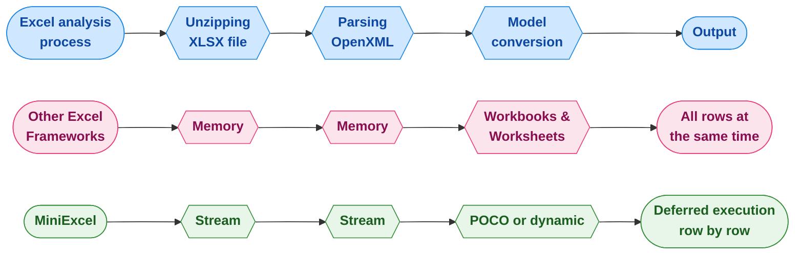

<div align="center">
<p><a href="https://www.nuget.org/packages/MiniExcel"></a>  <a href="https://www.nuget.org/packages/MiniExcel"></a>
<a href="https://ci.appveyor.com/project/mini-software/miniexcel/branch/master"></a>
<a href="https://gitee.com/dotnetchina/MiniExcel"></a> <a href="https://github.com/mini-software/MiniExcel" rel="nofollow"></a>
<a href="https://www.nuget.org/packages/MiniExcel"></a>
<a href="https://deepwiki.com/mini-software/MiniExcel"></a>
</p>
</div>

---

[](https://www.dotnetfoundation.org/)

<div align="center">
<p>Dit project is onderdeel van de <a href="https://www.dotnetfoundation.org/">.NET Foundation</a> en valt onder hun <a href="https://www.dotnetfoundation.org/code-of-conduct">gedragscode</a>. </p>
</div>

---

<div align="center">
<p><strong><a href="README.md">English</a> | <a href="README.zh-CN.md">简体中文</a> | <a href="README.zh-Hant.md">繁體中文</a> | <a href="https://openaitx.github.io/view.html?user=mini-software&amp;project=MiniExcel&amp;lang=ja">日本語</a> | <a href="https://openaitx.github.io/view.html?user=mini-software&amp;project=MiniExcel&amp;lang=ko">한국어</a> | <a href="https://openaitx.github.io/view.html?user=mini-software&amp;project=MiniExcel&amp;lang=hi">हिन्दी</a> | <a href="https://openaitx.github.io/view.html?user=mini-software&amp;project=MiniExcel&amp;lang=th">ไทย</a> | <a href="https://openaitx.github.io/view.html?user=mini-software&amp;project=MiniExcel&amp;lang=fr">Français</a> | <a href="https://openaitx.github.io/view.html?user=mini-software&amp;project=MiniExcel&amp;lang=de">Deutsch</a> | <a href="https://openaitx.github.io/view.html?user=mini-software&amp;project=MiniExcel&amp;lang=es">Español</a> | <a href="https://openaitx.github.io/view.html?user=mini-software&amp;project=MiniExcel&amp;lang=it">Italiano</a> | <a href="https://openaitx.github.io/view.html?user=mini-software&amp;project=MiniExcel&amp;lang=ru">Русский</a> | <a href="https://openaitx.github.io/view.html?user=mini-software&amp;project=MiniExcel&amp;lang=pt">Português</a> | <a href="https://openaitx.github.io/view.html?user=mini-software&amp;project=MiniExcel&amp;lang=nl">Nederlands</a> | <a href="https://openaitx.github.io/view.html?user=mini-software&amp;project=MiniExcel&amp;lang=pl">Polski</a> | <a href="https://openaitx.github.io/view.html?user=mini-software&amp;project=MiniExcel&amp;lang=ar">العربية</a> | <a href="https://openaitx.github.io/view.html?user=mini-software&amp;project=MiniExcel&amp;lang=fa">فارسی</a> | <a href="https://openaitx.github.io/view.html?user=mini-software&amp;project=MiniExcel&amp;lang=tr">Türkçe</a> | <a href="https://openaitx.github.io/view.html?user=mini-software&amp;project=MiniExcel&amp;lang=vi">Tiếng Việt</a> | <a href="https://openaitx.github.io/view.html?user=mini-software&amp;project=MiniExcel&amp;lang=id">Bahasa Indonesia</a><p></p>
</strong></p>
</div>


---

<div align="center">
 Jouw <a href="https://github.com/mini-software/MiniExcel">Sterren</a> of <a href="https://miniexcel.github.io">Donaties</a> kunnen MiniExcel beter maken
</div>

---

### Introductie

MiniExcel is een eenvoudige en efficiënte Excel-verwerkingstool voor .NET, speciaal ontworpen om het geheugengebruik te minimaliseren.

Momenteel moeten de meeste populaire frameworks alle gegevens uit een Excel-document in het geheugen laden om bewerkingen mogelijk te maken, maar dit kan problemen met geheugengebruik veroorzaken. De aanpak van MiniExcel is anders: de data wordt rij voor rij verwerkt in een streaming-manier, waardoor het oorspronkelijke verbruik van mogelijk honderden megabytes wordt teruggebracht tot slechts enkele megabytes, en effectief out-of-memory(OOM)-problemen worden voorkomen.


### Functies

- Minimaliseert geheugengebruik, voorkomt out-of-memory (OOM) fouten en vermijdt volledige garbage collections
- Maakt real-time, rij-niveau data-operaties mogelijk voor betere prestaties op grote datasets
- Ondersteunt LINQ met uitgestelde uitvoering, wat zorgt voor snelle, geheugenefficiënte paginering en complexe queries
- Lichtgewicht, zonder de noodzaak voor Microsoft Office of COM+ componenten, en een DLL-grootte onder de 500KB
- Eenvoudige en intuïtieve API-stijl om excel te lezen/schrijven/vullen

### Aan de slag

- [Importeer/Query Excel](#getstart1)

- [Exporteer/Creëer Excel](#getstart2)

- [Excel Sjabloon](#getstart3)

- [Excel Kolomnaam/Index/Ignore Attribuut](#getstart4)

- [Voorbeelden](#getstart5)


### Installatie

Je kunt het pakket installeren [via NuGet](https://www.nuget.org/packages/MiniExcel)

### Release Notes

Bekijk alstublieft de [Release Notes](docs)

### TODO

Bekijk alstublieft de [TODO](https://github.com/mini-software/MiniExcel/projects/1?fullscreen=true)

### Prestaties

De code voor de benchmarks is te vinden in [MiniExcel.Benchmarks](https://raw.githubusercontent.com/mini-software/MiniExcel/master/benchmarks/MiniExcel.Benchmarks/Program.cs).

Het bestand dat gebruikt is om prestaties te testen is [**Test1,000,000x10.xlsx**](https://raw.githubusercontent.com/mini-software/MiniExcel/master/benchmarks/MiniExcel.Benchmarks/Test1%2C000%2C000x10.xlsx), een document van 32MB met 1.000.000 rijen * 10 kolommen, waarvan de cellen zijn gevuld met de string "HelloWorld".

Om alle benchmarks uit te voeren gebruik:


```bash
dotnet run -project .\benchmarks\MiniExcel.Benchmarks -c Release -f net9.0 -filter * --join
```
U kunt de resultaten van de benchmarks voor de laatste release [hier](benchmarks/results) vinden.


### Excel-query/importeren  <a name="getstart1"></a>

#### 1. Voer een query uit en koppel de resultaten aan een sterk getypeerde IEnumerable [[Probeer het]](https://dotnetfiddle.net/w5WD1J)

Aanbevolen om Stream.Query te gebruiken vanwege betere efficiëntie.


```csharp
public class UserAccount
{
    public Guid ID { get; set; }
    public string Name { get; set; }
    public DateTime BoD { get; set; }
    public int Age { get; set; }
    public bool VIP { get; set; }
    public decimal Points { get; set; }
}

var rows = MiniExcel.Query<UserAccount>(path);

// or

using (var stream = File.OpenRead(path))
    var rows = stream.Query<UserAccount>();
```


#### 2. Voer een query uit en koppel deze aan een lijst van dynamische objecten zonder gebruik van head [[Probeer het]](https://dotnetfiddle.net/w5WD1J)

* dynamische sleutel is `A.B.C.D..`

| MiniExcel | 1 |
|-----------|---|
| Github    | 2 |


```csharp

var rows = MiniExcel.Query(path).ToList();

// or
using (var stream = File.OpenRead(path))
{
    var rows = stream.Query().ToList();

    Assert.Equal("MiniExcel", rows[0].A);
    Assert.Equal(1, rows[0].B);
    Assert.Equal("Github", rows[1].A);
    Assert.Equal(2, rows[1].B);
}
```
#### 3. Voer een query uit met de eerste rij als header [[Probeer het]](https://dotnetfiddle.net/w5WD1J)

opmerking : bij gelijke kolomnamen wordt de meest rechtse gebruikt

Invoer Excel :

| Kolom1    | Kolom2  |
|-----------|---------|
| MiniExcel | 1       |
| Github    | 2       |


```csharp

var rows = MiniExcel.Query(useHeaderRow:true).ToList();

// or

using (var stream = File.OpenRead(path))
{
    var rows = stream.Query(useHeaderRow:true).ToList();

    Assert.Equal("MiniExcel", rows[0].Column1);
    Assert.Equal(1, rows[0].Column2);
    Assert.Equal("Github", rows[1].Column1);
    Assert.Equal(2, rows[1].Column2);
}
```
#### 4. Query-ondersteuning LINQ-extensie First/Take/Skip ...enz.

Query First

```csharp
var row = MiniExcel.Query(path).First();
Assert.Equal("HelloWorld", row.A);

// or

using (var stream = File.OpenRead(path))
{
    var row = stream.Query().First();
    Assert.Equal("HelloWorld", row.A);
}
```
Prestaties tussen MiniExcel/ExcelDataReader/ClosedXML/EPPlus


#### 5. Query op basis van werkbladnaam


```csharp
MiniExcel.Query(path, sheetName: "SheetName");
//or
stream.Query(sheetName: "SheetName");
```
#### 6. Vraag alle bladtitels en rijen op


```csharp
var sheetNames = MiniExcel.GetSheetNames(path);
foreach (var sheetName in sheetNames)
{
    var rows = MiniExcel.Query(path, sheetName: sheetName);
}
```
#### 7. Kolommen ophalen


```csharp
var columns = MiniExcel.GetColumns(path); // e.g result : ["A","B"...]

var cnt = columns.Count;  // get column count
```
#### 8. Dynamische query zet rij om naar `IDictionary<string,object>`


```csharp
foreach(IDictionary<string,object> row in MiniExcel.Query(path))
{
    //..
}

// or
var rows = MiniExcel.Query(path).Cast<IDictionary<string,object>>();
// or Query specified ranges (capitalized)
// A2 represents the second row of column A, C3 represents the third row of column C
// If you don't want to restrict rows, just don't include numbers
var rows = MiniExcel.QueryRange(path, startCell: "A2", endCell: "C3").Cast<IDictionary<string, object>>();
```
#### 9. Query Excel retourneert DataTable

Niet aanbevolen, omdat DataTable alle gegevens in het geheugen zal laden en daarmee het lage geheugengebruik van MiniExcel verliest.


```C#
var table = MiniExcel.QueryAsDataTable(path, useHeaderRow: true);
```


#### 10. Specificeer de cel om te beginnen met het lezen van gegevens


```csharp
MiniExcel.Query(path,useHeaderRow:true,startCell:"B3")
```


#### 11. Samengevoegde cellen vullen

Opmerking: De efficiëntie is lager vergeleken met `geen gebruik van samenvoegvulling`

Reden: De OpenXml-standaard plaatst mergeCells onderaan het bestand, waardoor het nodig is om twee keer door de sheetxml te lopen


```csharp
    var config = new OpenXmlConfiguration()
    {
        FillMergedCells = true
    };
    var rows = MiniExcel.Query(path, configuration: config);
```


ondersteunt variabele lengte en breedte, vullen van meerdere rijen en kolommen


#### 12. Grote bestanden lezen via schijfgebaseerde cache (Disk-Base Cache - SharedString)

Als de grootte van SharedStrings meer dan 5 MB bedraagt, gebruikt MiniExcel standaard een lokale schijf-cache, bijvoorbeeld [10x100000.xlsx](https://github.com/MiniExcel/MiniExcel/files/8403819/NotDuplicateSharedStrings_10x100000.xlsx) (één miljoen rijen data), wanneer schijfcache is uitgeschakeld is het maximale geheugengebruik 195MB, maar met schijfcache is slechts 65MB nodig. Let op, deze optimalisatie kost wel wat efficiëntie, waardoor de leestijd toeneemt van 7,4 seconden naar 27,2 seconden. Als je dit niet nodig hebt, kun je schijfcache uitschakelen met de volgende code:


```csharp
var config = new OpenXmlConfiguration { EnableSharedStringCache = false };
MiniExcel.Query(path,configuration: config)
```
U kunt `SharedStringCacheSize` gebruiken om de grootte van het sharedString-bestand aan te passen tot voorbij de opgegeven grootte voor schijfcaching

```csharp
var config = new OpenXmlConfiguration { SharedStringCacheSize=500*1024*1024 };
MiniExcel.Query(path, configuration: config);
```


### Maak/Exporteer Excel  <a name="getstart2"></a>

1. Moet een niet-abstrakt type zijn met een openbare parameterloze constructor.

2. MiniExcel ondersteunt parameter IEnumerable Uitgestelde Uitvoering. Als u zo min mogelijk geheugen wilt gebruiken, roep dan geen methoden zoals ToList aan.

bijv.: ToList of geen geheugengebruik


#### 1. Anoniem of sterk getypeerd [[Probeer het]](https://dotnetfiddle.net/w5WD1J)


```csharp
var path = Path.Combine(Path.GetTempPath(), $"{Guid.NewGuid()}.xlsx");
MiniExcel.SaveAs(path, new[] {
    new { Column1 = "MiniExcel", Column2 = 1 },
    new { Column1 = "Github", Column2 = 2}
});
```
#### 2. `IEnumerable<IDictionary<string, object>>`


```csharp
var values = new List<Dictionary<string, object>>()
{
    new Dictionary<string,object>{{ "Column1", "MiniExcel" }, { "Column2", 1 } },
    new Dictionary<string,object>{{ "Column1", "Github" }, { "Column2", 2 } }
};
MiniExcel.SaveAs(path, values);
```
Maak Bestand Resultaat :

| Kolom1    | Kolom2  |
|-----------|---------|
| MiniExcel | 1       |
| Github    | 2       |


#### 3.  IDataReader
- `Aanbevolen`, het voorkomt dat alle data in het geheugen geladen wordt

```csharp
MiniExcel.SaveAs(path, reader);
```


DataReader exporteert meerdere tabbladen (aanbevolen door Dapper ExecuteReader)


```csharp
using (var cnn = Connection)
{
    cnn.Open();
    var sheets = new Dictionary<string,object>();
    sheets.Add("sheet1", cnn.ExecuteReader("select 1 id"));
    sheets.Add("sheet2", cnn.ExecuteReader("select 2 id"));
    MiniExcel.SaveAs("Demo.xlsx", sheets);
}
```
#### 4. Datatable

- `Niet aanbevolen`, het zal alle gegevens in het geheugen laden

- DataTable gebruikt eerst het onderschrift voor de kolomnaam, daarna de kolomnaam


```csharp
var path = Path.Combine(Path.GetTempPath(), $"{Guid.NewGuid()}.xlsx");
var table = new DataTable();
{
    table.Columns.Add("Column1", typeof(string));
    table.Columns.Add("Column2", typeof(decimal));
    table.Rows.Add("MiniExcel", 1);
    table.Rows.Add("Github", 2);
}

MiniExcel.SaveAs(path, table);
```
####  5. Dapper Query

Dank aan @shaofing #552 , gebruik alsjeblieft `CommandDefinition + CommandFlags.NoCache`


```csharp
using (var connection = GetConnection(connectionString))
{
    var rows = connection.Query(
        new CommandDefinition(
            @"select 'MiniExcel' as Column1,1 as Column2 union all select 'Github',2"
            , flags: CommandFlags.NoCache)
        );
    // Note: QueryAsync will throw close connection exception
    MiniExcel.SaveAs(path, rows);
}
```
Onderstaande code zal alle gegevens in het geheugen laden


```csharp
using (var connection = GetConnection(connectionString))
{
    var rows = connection.Query(@"select 'MiniExcel' as Column1,1 as Column2 union all select 'Github',2");
    MiniExcel.SaveAs(path, rows);
}
```
#### 6. SaveAs naar MemoryStream  [[Probeer het]](https://dotnetfiddle.net/JOen0e)


```csharp
using (var stream = new MemoryStream()) //support FileStream,MemoryStream ect.
{
    stream.SaveAs(values);
}
```
bijv.: api voor het exporteren van excel


```csharp
public IActionResult DownloadExcel()
{
    var values = new[] {
        new { Column1 = "MiniExcel", Column2 = 1 },
        new { Column1 = "Github", Column2 = 2}
    };

    var memoryStream = new MemoryStream();
    memoryStream.SaveAs(values);
    memoryStream.Seek(0, SeekOrigin.Begin);
    return new FileStreamResult(memoryStream, "application/vnd.openxmlformats-officedocument.spreadsheetml.sheet")
    {
        FileDownloadName = "demo.xlsx"
    };
}
```
#### 7. Meerdere Bladen Aanmaken


```csharp
// 1. Dictionary<string,object>
var users = new[] { new { Name = "Jack", Age = 25 }, new { Name = "Mike", Age = 44 } };
var department = new[] { new { ID = "01", Name = "HR" }, new { ID = "02", Name = "IT" } };
var sheets = new Dictionary<string, object>
{
    ["users"] = users,
    ["department"] = department
};
MiniExcel.SaveAs(path, sheets);

// 2. DataSet
var sheets = new DataSet();
sheets.Add(UsersDataTable);
sheets.Add(DepartmentDataTable);
//..
MiniExcel.SaveAs(path, sheets);
```


#### 8. TableStyles Opties

Standaard stijl


Zonder stijlconfiguratie


```csharp
var config = new OpenXmlConfiguration()
{
     TableStyles = TableStyles.None
};
MiniExcel.SaveAs(path, value,configuration:config);
```


#### 9. AutoFilter

Sinds v0.19.0 kan `OpenXmlConfiguration.AutoFilter` AutoFilter in- of uitschakelen, de standaardwaarde is `true`, en de manier om AutoFilter in te stellen is als volgt:


```csharp
MiniExcel.SaveAs(path, value, configuration: new OpenXmlConfiguration() { AutoFilter = false });
```


#### 10. Afbeelding maken


```csharp
var value = new[] {
    new { Name="github",Image=File.ReadAllBytes(PathHelper.GetFile("images/github_logo.png"))},
    new { Name="google",Image=File.ReadAllBytes(PathHelper.GetFile("images/google_logo.png"))},
    new { Name="microsoft",Image=File.ReadAllBytes(PathHelper.GetFile("images/microsoft_logo.png"))},
    new { Name="reddit",Image=File.ReadAllBytes(PathHelper.GetFile("images/reddit_logo.png"))},
    new { Name="statck_overflow",Image=File.ReadAllBytes(PathHelper.GetFile("images/statck_overflow_logo.png"))},
};
MiniExcel.SaveAs(path, value);
```


#### 11. Byte Array Bestand Exporteren

Sinds 1.22.0, als het waarde type `byte[]` is, zal het systeem standaard het bestandspad in de cel opslaan, en bij importeren kan het systeem dit omzetten naar `byte[]`. En als je dit niet wilt gebruiken, kun je `OpenXmlConfiguration.EnableConvertByteArray` op `false` zetten, dit kan de systeemefficiëntie verbeteren.


Sinds 1.22.0, als het waarde type `byte[]` is, zal het systeem standaard het bestandspad in de cel opslaan, en bij importeren kan het systeem dit omzetten naar `byte[]`. En als je dit niet wilt gebruiken, kun je `OpenXmlConfiguration.EnableConvertByteArray` op `false` zetten, dit kan de systeemefficiëntie verbeteren.


#### 12. Dezelfde cellen verticaal samenvoegen

Deze functionaliteit wordt alleen ondersteund in het `xlsx` formaat en voegt cellen verticaal samen tussen @merge en @endmerge tags.
Je kunt @mergelimit gebruiken om de grenzen van het verticaal samenvoegen van cellen te beperken.


```csharp
var mergedFilePath = Path.Combine(Path.GetTempPath(), $"{Guid.NewGuid().ToString()}.xlsx");

var path = @"../../../../../samples/xlsx/TestMergeWithTag.xlsx";

MiniExcel.MergeSameCells(mergedFilePath, path);
```


```csharp
var memoryStream = new MemoryStream();

var path = @"../../../../../samples/xlsx/TestMergeWithTag.xlsx";

memoryStream.MergeSameCells(path);
```
Bestandsinhoud vóór en na samenvoegen:

Zonder samenvoeglimiet:


Met samenvoeglimiet:


#### 13. Sla null-waarden over

Nieuwe expliciete optie om lege cellen te schrijven voor null-waarden:


```csharp
DataTable dt = new DataTable();

/* ... */

DataRow dr = dt.NewRow();

dr["Name1"] = "Somebody once";
dr["Name2"] = null;
dr["Name3"] = "told me.";

dt.Rows.Add(dr);

OpenXmlConfiguration configuration = new OpenXmlConfiguration()
{
     EnableWriteNullValueCell = true // Default value.
};

MiniExcel.SaveAs(@"C:\temp\Book1.xlsx", dt, configuration: configuration);
```


```xml
<x:row r="2">
    <x:c r="A2" t ="str" s="2">
        <x:v>Somebody once</x:v>
    </x:c>
    <x:c r="B2" s="2"></x:c>
    <x:c r="C2" t ="str" s="2">
        <x:v>told me.</x:v>
    </x:c>
</x:row>
```
Vorige gedrag:


```csharp
/* ... */

OpenXmlConfiguration configuration = new OpenXmlConfiguration()
{
     EnableWriteNullValueCell = false // Default value is true.
};

MiniExcel.SaveAs(@"C:\temp\Book1.xlsx", dt, configuration: configuration);
```


```xml
<x:row r="2">
    <x:c r="A2" t ="str" s="2">
        <x:v>Somebody once</x:v>
    </x:c>
    <x:c r="B2" t ="str" s="2">
        <x:v></x:v>
    </x:c>
    <x:c r="C2" t ="str" s="2">
        <x:v>told me.</x:v>
    </x:c>
</x:row>
```
Werkt voor null- en DBNull-waarden.

#### 14. Rijen en kolommen vastzetten

```csharp
/* ... */

OpenXmlConfiguration configuration = new OpenXmlConfiguration()
{
    FreezeRowCount = 1,     // default is 1
    FreezeColumnCount = 2   // default is 0
};

MiniExcel.SaveAs(@"C:\temp\Book1.xlsx", dt, configuration: configuration);
```


### Gegevens invullen in Excel-sjabloon <a name="getstart3"></a>

- De declaratie is vergelijkbaar met Vue-template `{{variabelenaam}}`, of de collectieweergave `{{collectienaam.veldnaam}}`
- Collectieweergave ondersteunt IEnumerable/DataTable/DapperRow

#### 1. Basis invullen

Sjabloon:


Resultaat:


Code:

```csharp
// 1. By POCO
var value = new
{
    Name = "Jack",
    CreateDate = new DateTime(2021, 01, 01),
    VIP = true,
    Points = 123
};
MiniExcel.SaveAsByTemplate(path, templatePath, value);


// 2. By Dictionary
var value = new Dictionary<string, object>()
{
    ["Name"] = "Jack",
    ["CreateDate"] = new DateTime(2021, 01, 01),
    ["VIP"] = true,
    ["Points"] = 123
};
MiniExcel.SaveAsByTemplate(path, templatePath, value);
```
#### 2. IEnumerable Gegevensinvulling

> Opmerking1: Gebruik de eerste IEnumerable van dezelfde kolom als basis voor het vullen van de lijst

Sjabloon:


Resultaat:


Code:


```csharp
//1. By POCO
var value = new
{
    employees = new[] {
        new {name="Jack",department="HR"},
        new {name="Lisa",department="HR"},
        new {name="John",department="HR"},
        new {name="Mike",department="IT"},
        new {name="Neo",department="IT"},
        new {name="Loan",department="IT"}
    }
};
MiniExcel.SaveAsByTemplate(path, templatePath, value);

//2. By Dictionary
var value = new Dictionary<string, object>()
{
    ["employees"] = new[] {
        new {name="Jack",department="HR"},
        new {name="Lisa",department="HR"},
        new {name="John",department="HR"},
        new {name="Mike",department="IT"},
        new {name="Neo",department="IT"},
        new {name="Loan",department="IT"}
    }
};
MiniExcel.SaveAsByTemplate(path, templatePath, value);
```
#### 3. Complexe Gegevensvulling

> Opmerking: Ondersteunt meerdere tabbladen en het gebruik van dezelfde variabele

Sjabloon:


Resultaat:


```csharp
// 1. By POCO
var value = new
{
    title = "FooCompany",
    managers = new[] {
        new {name="Jack",department="HR"},
        new {name="Loan",department="IT"}
    },
    employees = new[] {
        new {name="Wade",department="HR"},
        new {name="Felix",department="HR"},
        new {name="Eric",department="IT"},
        new {name="Keaton",department="IT"}
    }
};
MiniExcel.SaveAsByTemplate(path, templatePath, value);

// 2. By Dictionary
var value = new Dictionary<string, object>()
{
    ["title"] = "FooCompany",
    ["managers"] = new[] {
        new {name="Jack",department="HR"},
        new {name="Loan",department="IT"}
    },
    ["employees"] = new[] {
        new {name="Wade",department="HR"},
        new {name="Felix",department="HR"},
        new {name="Eric",department="IT"},
        new {name="Keaton",department="IT"}
    }
};
MiniExcel.SaveAsByTemplate(path, templatePath, value);
```
#### 4. Vul Big Data Prestaties

> OPMERKING: Het gebruik van IEnumerable uitgestelde uitvoering in plaats van ToList kan het maximale geheugengebruik in MiniExcel besparen


#### 5. Automatische typekoppeling van celwaarden

Sjabloon


Resultaat


Klasse


```csharp
public class Poco
{
    public string @string { get; set; }
    public int? @int { get; set; }
    public decimal? @decimal { get; set; }
    public double? @double { get; set; }
    public DateTime? datetime { get; set; }
    public bool? @bool { get; set; }
    public Guid? Guid { get; set; }
}
```
Code


```csharp
var poco = new TestIEnumerableTypePoco { @string = "string", @int = 123, @decimal = decimal.Parse("123.45"), @double = (double)123.33, @datetime = new DateTime(2021, 4, 1), @bool = true, @Guid = Guid.NewGuid() };
var value = new
{
    Ts = new[] {
        poco,
        new TestIEnumerableTypePoco{},
        null,
        poco
    }
};
MiniExcel.SaveAsByTemplate(path, templatePath, value);
```
#### 6. Voorbeeld :  Lijst Github Projecten

Sjabloon


Resultaat


Code


```csharp
var projects = new[]
{
    new {Name = "MiniExcel",Link="https://github.com/mini-software/MiniExcel",Star=146, CreateTime=new DateTime(2021,03,01)},
    new {Name = "HtmlTableHelper",Link="https://github.com/mini-software/HtmlTableHelper",Star=16, CreateTime=new DateTime(2020,02,01)},
    new {Name = "PocoClassGenerator",Link="https://github.com/mini-software/PocoClassGenerator",Star=16, CreateTime=new DateTime(2019,03,17)}
};
var value = new
{
    User = "ITWeiHan",
    Projects = projects,
    TotalStar = projects.Sum(s => s.Star)
};
MiniExcel.SaveAsByTemplate(path, templatePath, value);
```
#### 7. Gegroepeerde Gegevens Invoer


```csharp
var value = new Dictionary<string, object>()
{
    ["employees"] = new[] {
        new {name="Jack",department="HR"},
        new {name="Jack",department="HR"},
        new {name="John",department="HR"},
        new {name="John",department="IT"},
        new {name="Neo",department="IT"},
        new {name="Loan",department="IT"}
    }
};
await MiniExcel.SaveAsByTemplateAsync(path, templatePath, value);
```
##### 1. Met `@group` tag en met `@header` tag

Voor


Na


##### 2. Met @group tag en zonder @header tag

Voor


Na


##### 3. Zonder @group tag

Voor


Na


#### 8. If/ElseIf/Else Statements binnen cel

Regels:
1. Ondersteunt DateTime, Double, Int met de operatoren ==, !=, >, >=, <, <=.
2. Ondersteunt String met de operatoren ==, !=.
3. Elke statement moet op een nieuwe regel staan.
4. Er moet een enkele spatie vóór en na de operatoren staan.
5. Er mag geen nieuwe regel in de statements staan.
6. Cel moet exact in het onderstaande formaat staan.

```csharp
@if(name == Jack)
{{employees.name}}
@elseif(name == Neo)
Test {{employees.name}}
@else
{{employees.department}}
@endif
```
Voor


Na


#### 9. DataTable als parameter


```csharp
var managers = new DataTable();
{
    managers.Columns.Add("name");
    managers.Columns.Add("department");
    managers.Rows.Add("Jack", "HR");
    managers.Rows.Add("Loan", "IT");
}
var value = new Dictionary<string, object>()
{
    ["title"] = "FooCompany",
    ["managers"] = managers,
};
MiniExcel.SaveAsByTemplate(path, templatePath, value);
```
#### 10. Formules

##### 1. Voorbeeld
Voorzie je formule van een `$`-prefix en gebruik `$enumrowstart` en `$enumrowend` om verwijzingen naar de start- en eindrij van de opsomming te markeren:


Wanneer de sjabloon wordt gerenderd, wordt de `$`-prefix verwijderd en worden `$enumrowstart` en `$enumrowend` vervangen door het begin- en eindrijnummer van de opsomming:


##### 2. Andere Voorbeeldformules:

|              |                                                                                           |
|--------------|-------------------------------------------------------------------------------------------|
| Som          | `$=SUM(C{{$enumrowstart}}:C{{$enumrowend}})`                                              |
| Alt. Gemiddelde | `$=SUM(C{{$enumrowstart}}:C{{$enumrowend}}) / COUNT(C{{$enumrowstart}}:C{{$enumrowend}})` |
| Bereik       | `$=MAX(C{{$enumrowstart}}:C{{$enumrowend}}) - MIN(C{{$enumrowstart}}:C{{$enumrowend}})`   |


#### 11. Overig

##### 1. Controleren van sjabloonparameter sleutel

Sinds V1.24.0 wordt standaard genegeerd als er een ontbrekende sjabloonparametersleutel is en wordt deze vervangen door een lege string. Met `IgnoreTemplateParameterMissing` kan bepaald worden of er een uitzondering wordt gegooid of niet.

```csharp
var config = new OpenXmlConfiguration()
{
    IgnoreTemplateParameterMissing = false,
};
MiniExcel.SaveAsByTemplate(path, templatePath, value, config)
```


### Excel Kolomnaam/Index/Negeer Attribuut <a name="getstart4"></a>


#### 1. Specificeer de kolomnaam, kolomindex, kolom negeren

Excel Voorbeeld


Code


```csharp
public class ExcelAttributeDemo
{
    [ExcelColumnName("Column1")]
    public string Test1 { get; set; }
    [ExcelColumnName("Column2")]
    public string Test2 { get; set; }
    [ExcelIgnore]
    public string Test3 { get; set; }
    [ExcelColumnIndex("I")] // system will convert "I" to 8 index
    public string Test4 { get; set; }
    public string Test5 { get; } //wihout set will ignore
    public string Test6 { get; private set; } //un-public set will ignore
    [ExcelColumnIndex(3)] // start with 0
    public string Test7 { get; set; }
}

var rows = MiniExcel.Query<ExcelAttributeDemo>(path).ToList();
Assert.Equal("Column1", rows[0].Test1);
Assert.Equal("Column2", rows[0].Test2);
Assert.Null(rows[0].Test3);
Assert.Equal("Test7", rows[0].Test4);
Assert.Null(rows[0].Test5);
Assert.Null(rows[0].Test6);
Assert.Equal("Test4", rows[0].Test7);
```


#### 2. Aangepast formaat (ExcelFormatAttribute)

Sinds V0.21.0 wordt een klasse ondersteund die een `ToString(string content)` methode bevat

Klasse


```csharp
public class Dto
{
    public string Name { get; set; }

    [ExcelFormat("MMMM dd, yyyy")]
    public DateTime InDate { get; set; }
}
```
Code


```csharp
var value = new Dto[] {
    new Issue241Dto{ Name="Jack",InDate=new DateTime(2021,01,04)},
    new Issue241Dto{ Name="Henry",InDate=new DateTime(2020,04,05)},
};
MiniExcel.SaveAs(path, value);
```
Result


Query ondersteunt aangepaste formaatconversie


#### 3. Kolombreedte instellen (ExcelColumnWidthAttribute)


```csharp
public class Dto
{
    [ExcelColumnWidth(20)]
    public int ID { get; set; }
    [ExcelColumnWidth(15.50)]
    public string Name { get; set; }
}
```
#### 4. Meerdere kolomnamen die naar dezelfde eigenschap verwijzen.


```csharp
public class Dto
{
    [ExcelColumnName(excelColumnName:"EmployeeNo",aliases:new[] { "EmpNo","No" })]
    public string Empno { get; set; }
    public string Name { get; set; }
}
```
#### 5. System.ComponentModel.DisplayNameAttribute = ExcelColumnName.excelColumnNameAttribute

Sinds 1.24.0 ondersteunt het systeem System.ComponentModel.DisplayNameAttribute = ExcelColumnName.excelColumnNameAttribute


```C#
public class TestIssueI4TXGTDto
{
    public int ID { get; set; }
    public string Name { get; set; }
    [DisplayName("Specification")]
    public string Spc { get; set; }
    [DisplayName("Unit Price")]
    public decimal Up { get; set; }
}
```
#### 6. ExcelColumnAttribute

Sinds V1.26.0 kunnen meerdere attributen als volgt worden vereenvoudigd:


```csharp
        public class TestIssueI4ZYUUDto
        {
            [ExcelColumn(Name = "ID",Index =0)]
            public string MyProperty { get; set; }
            [ExcelColumn(Name = "CreateDate", Index = 1,Format ="yyyy-MM",Width =100)]
            public DateTime MyProperty2 { get; set; }
        }
```
#### 7. DynamicColumnAttribute

Sinds V1.26.0 kunnen we de attributen van Column dynamisch instellen


```csharp
            var config = new OpenXmlConfiguration
            {
                DynamicColumns = new DynamicExcelColumn[] {
                    new DynamicExcelColumn("id"){Ignore=true},
                    new DynamicExcelColumn("name"){Index=1,Width=10},
                    new DynamicExcelColumn("createdate"){Index=0,Format="yyyy-MM-dd",Width=15},
                    new DynamicExcelColumn("point"){Index=2,Name="Account Point"},
                }
            };
            var path = PathHelper.GetTempPath();
            var value = new[] { new { id = 1, name = "Jack", createdate = new DateTime(2022, 04, 12) ,point = 123.456} };
            MiniExcel.SaveAs(path, value, configuration: config);
```


#### 8. DynamicSheetAttribute

Sinds V1.31.4 kunnen we de attributen van Sheet dynamisch instellen. We kunnen de naam en status (zichtbaarheid) van het sheet instellen.
```csharp
            var configuration = new OpenXmlConfiguration
            {
                DynamicSheets = new DynamicExcelSheet[] {
                    new DynamicExcelSheet("usersSheet") { Name = "Users", State = SheetState.Visible },
                    new DynamicExcelSheet("departmentSheet") { Name = "Departments", State = SheetState.Hidden }
                }
            };

            var users = new[] { new { Name = "Jack", Age = 25 }, new { Name = "Mike", Age = 44 } };
            var department = new[] { new { ID = "01", Name = "HR" }, new { ID = "02", Name = "IT" } };
            var sheets = new Dictionary<string, object>
            {
                ["usersSheet"] = users,
                ["departmentSheet"] = department
            };

            var path = PathHelper.GetTempPath();
            MiniExcel.SaveAs(path, sheets, configuration: configuration);
```
We kunnen ook het nieuwe attribuut ExcelSheetAttribute gebruiken:


```C#
   [ExcelSheet(Name = "Departments", State = SheetState.Hidden)]
   private class DepartmentDto
   {
      [ExcelColumn(Name = "ID",Index = 0)]
      public string ID { get; set; }
      [ExcelColumn(Name = "Name",Index = 1)]
      public string Name { get; set; }
   }
```
### Toevoegen, Verwijderen, Bijwerken

#### Toevoegen

v1.28.0 ondersteunt het invoegen van N rijen gegevens in CSV na de laatste rij


```csharp
// Origin
{
    var value = new[] {
          new { ID=1,Name ="Jack",InDate=new DateTime(2021,01,03)},
          new { ID=2,Name ="Henry",InDate=new DateTime(2020,05,03)},
    };
    MiniExcel.SaveAs(path, value);
}
// Insert 1 rows after last
{
    var value = new { ID=3,Name = "Mike", InDate = new DateTime(2021, 04, 23) };
    MiniExcel.Insert(path, value);
}
// Insert N rows after last
{
    var value = new[] {
          new { ID=4,Name ="Frank",InDate=new DateTime(2021,06,07)},
          new { ID=5,Name ="Gloria",InDate=new DateTime(2022,05,03)},
    };
    MiniExcel.Insert(path, value);
}
```


v1.37.0 ondersteunt het invoegen van een nieuw blad in een bestaand Excel-werkboek


```csharp
// Origin excel
{
    var value = new[] {
          new { ID=1,Name ="Jack",InDate=new DateTime(2021,01,03)},
          new { ID=2,Name ="Henry",InDate=new DateTime(2020,05,03)},
    };
    MiniExcel.SaveAs(path, value, sheetName: "Sheet1");
}
// Insert a new sheet
{
    var value = new { ID=3,Name = "Mike", InDate = new DateTime(2021, 04, 23) };
    MiniExcel.Insert(path, table, sheetName: "Sheet2");
}
```
#### Verwijderen(wachtend)

#### Bijwerken(wachtend)


### Excel Type Automatische Controle <a name="getstart5"></a>

- MiniExcel controleert standaard of het een xlsx of csv bestand is op basis van de `bestandsextensie`, maar dit kan onnauwkeurig zijn, geef het daarom handmatig op.
- Van een stream kan niet worden vastgesteld van welk excel-type deze is, geef dit daarom handmatig op.


```csharp
stream.SaveAs(excelType:ExcelType.CSV);
//or
stream.SaveAs(excelType:ExcelType.XLSX);
//or
stream.Query(excelType:ExcelType.CSV);
//or
stream.Query(excelType:ExcelType.XLSX);
```


### CSV

#### Opmerking

- Standaard retourneert het type `string`, en de waarde wordt niet geconverteerd naar nummers of datums, tenzij het type is gedefinieerd door sterke generieke typing.


#### Aangepaste scheidingsteken

Standaard is `,` het scheidingsteken, je kunt de eigenschap `Seperator` aanpassen voor maatwerk


```csharp
var config = new MiniExcelLibs.Csv.CsvConfiguration()
{
    Seperator=';'
};
MiniExcel.SaveAs(path, values,configuration: config);
```
Sinds V1.30.1 is er ondersteuning voor het aanpassen van de scheidingstekenfunctie (dank aan @hyzx86)


```csharp
var config = new CsvConfiguration()
{
    SplitFn = (row) => Regex.Split(row, $"[\t,](?=(?:[^\"]|\"[^\"]*\")*$)")
        .Select(s => Regex.Replace(s.Replace("\"\"", "\""), "^\"|\"$", "")).ToArray()
};
var rows = MiniExcel.Query(path, configuration: config).ToList();
```
#### Aangepaste regeleinde

Standaard is `\r\n` het regeleinde-teken, je kunt de `NewLine`-eigenschap aanpassen voor maatwerk


```csharp
var config = new MiniExcelLibs.Csv.CsvConfiguration()
{
    NewLine='\n'
};
MiniExcel.SaveAs(path, values,configuration: config);
```
#### Aangepaste codering

- De standaardcodering is "Detecteer codering van Byte Order Marks" (detectEncodingFromByteOrderMarks: true)
- Als u aangepaste coderingsvereisten heeft, wijzig dan de StreamReaderFunc / StreamWriterFunc eigenschap


```csharp
// Read
var config = new MiniExcelLibs.Csv.CsvConfiguration()
{
    StreamReaderFunc = (stream) => new StreamReader(stream,Encoding.GetEncoding("gb2312"))
};
var rows = MiniExcel.Query(path, true,excelType:ExcelType.CSV,configuration: config);

// Write
var config = new MiniExcelLibs.Csv.CsvConfiguration()
{
    StreamWriterFunc = (stream) => new StreamWriter(stream, Encoding.GetEncoding("gb2312"))
};
MiniExcel.SaveAs(path, value,excelType:ExcelType.CSV, configuration: config);
```
#### Leeg tekenreeks lezen als null

Standaard worden lege waarden toegewezen aan string.Empty. U kunt dit gedrag aanpassen


```csharp
var config = new MiniExcelLibs.Csv.CsvConfiguration()
{
   ReadEmptyStringAsNull = true
};
```
### DataReader

#### 1. GetReader
Sinds 1.23.0 kun je GetDataReader gebruiken


```csharp
    using (var reader = MiniExcel.GetReader(path,true))
    {
        while (reader.Read())
        {
            for (int i = 0; i < reader.FieldCount; i++)
            {
                var value = reader.GetValue(i);
            }
        }
    }
```


###  Async

- v0.17.0 ondersteunt Async (dank aan isdaniel ( SHIH,BING-SIOU)](https://github.com/isdaniel))


```csharp
public static Task SaveAsAsync(string path, object value, bool printHeader = true, string sheetName = "Sheet1", ExcelType excelType = ExcelType.UNKNOWN, IConfiguration configuration = null)
public static Task SaveAsAsync(this Stream stream, object value, bool printHeader = true, string sheetName = "Sheet1", ExcelType excelType = ExcelType.XLSX, IConfiguration configuration = null)
public static Task<IEnumerable<dynamic>> QueryAsync(string path, bool useHeaderRow = false, string sheetName = null, ExcelType excelType = ExcelType.UNKNOWN, string startCell = "A1", IConfiguration configuration = null)
public static Task<IEnumerable<T>> QueryAsync<T>(this Stream stream, string sheetName = null, ExcelType excelType = ExcelType.UNKNOWN, string startCell = "A1", IConfiguration configuration = null) where T : class, new()
public static Task<IEnumerable<T>> QueryAsync<T>(string path, string sheetName = null, ExcelType excelType = ExcelType.UNKNOWN, string startCell = "A1", IConfiguration configuration = null) where T : class, new()
public static Task<IEnumerable<IDictionary<string, object>>> QueryAsync(this Stream stream, bool useHeaderRow = false, string sheetName = null, ExcelType excelType = ExcelType.UNKNOWN, string startCell = "A1", IConfiguration configuration = null)
public static Task SaveAsByTemplateAsync(this Stream stream, string templatePath, object value)
public static Task SaveAsByTemplateAsync(this Stream stream, byte[] templateBytes, object value)
public static Task SaveAsByTemplateAsync(string path, string templatePath, object value)
public static Task SaveAsByTemplateAsync(string path, byte[] templateBytes, object value)
public static Task<DataTable> QueryAsDataTableAsync(string path, bool useHeaderRow = true, string sheetName = null, ExcelType excelType = ExcelType.UNKNOWN, string startCell = "A1", IConfiguration configuration = null)
```
-  v1.25.0 ondersteunt `cancellationToken`。


### Overig

#### 1. Enum

Zorg ervoor dat de excel- en propertynaam gelijk zijn, het systeem zal automatisch mappen (niet hoofdlettergevoelig)


Sinds V0.18.0 wordt Enum Description ondersteund


```csharp
public class Dto
{
    public string Name { get; set; }
    public I49RYZUserType UserType { get; set; }
}

public enum Type
{
    [Description("General User")]
    V1,
    [Description("General Administrator")]
    V2,
    [Description("Super Administrator")]
    V3
}
```


Sinds versie 1.30.0 wordt Excel Description naar Enum ondersteund, dank aan @KaneLeung

#### 2. Converteer CSV naar XLSX of converteer XLSX naar CSV


```csharp
MiniExcel.ConvertXlsxToCsv(xlsxPath, csvPath);
MiniExcel.ConvertXlsxToCsv(xlsxStream, csvStream);
MiniExcel.ConvertCsvToXlsx(csvPath, xlsxPath);
MiniExcel.ConvertCsvToXlsx(csvStream, xlsxStream);
```
```csharp
using (var excelStream = new FileStream(path: filePath, FileMode.Open, FileAccess.Read))
using (var csvStream = new MemoryStream())
{
   MiniExcel.ConvertXlsxToCsv(excelStream, csvStream);
}
```
#### 3. Aangepaste CultureInfo

Sinds 1.22.0 kun je een aangepaste CultureInfo gebruiken zoals hieronder, standaard gebruikt het systeem `CultureInfo.InvariantCulture`.


```csharp
var config = new CsvConfiguration()
{
    Culture = new CultureInfo("fr-FR"),
};
MiniExcel.SaveAs(path, value, configuration: config);

// or
MiniExcel.Query(path, configuration: config);
```
#### 4. Aangepaste buffergrootte


```csharp
    public abstract class Configuration : IConfiguration
    {
        public int BufferSize { get; set; } = 1024 * 512;
    }
```
#### 5. SnelModus

Het systeem beheert het geheugen niet, maar je kunt wel sneller opslaan.


```csharp
var config = new OpenXmlConfiguration() { FastMode = true };
MiniExcel.SaveAs(path, reader,configuration:config);
```
#### 6. Batch Afbeelding Toevoegen (MiniExcel.AddPicture)

Voeg alstublieft afbeeldingen toe voordat u batchgewijs rijen met gegevens genereert, anders zal het systeem veel geheugen gebruiken bij het aanroepen van AddPicture.


```csharp
var images = new[]
{
    new MiniExcelPicture
    {
        ImageBytes = File.ReadAllBytes(PathHelper.GetFile("images/github_logo.png")),
        SheetName = null, // default null is first sheet
        CellAddress = "C3", // required
    },
    new MiniExcelPicture
    {
        ImageBytes = File.ReadAllBytes(PathHelper.GetFile("images/google_logo.png")),
        PictureType = "image/png", // default PictureType = image/png
        SheetName = "Demo",
        CellAddress = "C9", // required
        WidthPx = 100,
        HeightPx = 100,
    },
};
MiniExcel.AddPicture(path, images);
```


#### 7. Verkrijg Afmetingen van Sheets

```csharp
var dim = MiniExcel.GetSheetDimensions(path);
```
### Voorbeelden:

#### 1. SQLite & Dapper `Groot Bestand` SQL Insert Voorkomt OOM

opmerking: gebruik na Query niet de methoden ToList/ToArray, dit laadt alle data in het geheugen


```csharp
using (var connection = new SQLiteConnection(connectionString))
{
    connection.Open();
    using (var transaction = connection.BeginTransaction())
    using (var stream = File.OpenRead(path))
    {
       var rows = stream.Query();
       foreach (var row in rows)
             connection.Execute("insert into T (A,B) values (@A,@B)", new { row.A, row.B }, transaction: transaction);
       transaction.Commit();
    }
}
```
prestatie:


#### 2. ASP.NET Core 3.1 of MVC 5 Download/Upload Excel Xlsx API Demo [Probeer het](https://raw.githubusercontent.com/mini-software/MiniExcel/master/tests/MiniExcel.Tests.AspNetCore)


```csharp
public class ApiController : Controller
{
    public IActionResult Index()
    {
        return new ContentResult
        {
            ContentType = "text/html",
            StatusCode = (int)HttpStatusCode.OK,
            Content = @"<html><body>
<a href='api/DownloadExcel'>DownloadExcel</a><br>
<a href='api/DownloadExcelFromTemplatePath'>DownloadExcelFromTemplatePath</a><br>
<a href='api/DownloadExcelFromTemplateBytes'>DownloadExcelFromTemplateBytes</a><br>
<p>Upload Excel</p>
<form method='post' enctype='multipart/form-data' action='/api/uploadexcel'>
    <input type='file' name='excel'> <br>
    <input type='submit' >
</form>
</body></html{{"
        };
    }

    public IActionResult DownloadExcel()
    {
        var values = new[] {
            new { Column1 = "MiniExcel", Column2 = 1 },
            new { Column1 = "Github", Column2 = 2}
        };
        var memoryStream = new MemoryStream();
        memoryStream.SaveAs(values);
        memoryStream.Seek(0, SeekOrigin.Begin);
        return new FileStreamResult(memoryStream, "application/vnd.openxmlformats-officedocument.spreadsheetml.sheet")
        {
            FileDownloadName = "demo.xlsx"
        };
    }

    public IActionResult DownloadExcelFromTemplatePath()
    {
        string templatePath = "TestTemplateComplex.xlsx";

        Dictionary<string, object> value = new Dictionary<string, object>()
        {
            ["title"] = "FooCompany",
            ["managers"] = new[] {
                new {name="Jack",department="HR"},
                new {name="Loan",department="IT"}
            },
            ["employees"] = new[] {
                new {name="Wade",department="HR"},
                new {name="Felix",department="HR"},
                new {name="Eric",department="IT"},
                new {name="Keaton",department="IT"}
            }
        };

        MemoryStream memoryStream = new MemoryStream();
        memoryStream.SaveAsByTemplate(templatePath, value);
        memoryStream.Seek(0, SeekOrigin.Begin);
        return new FileStreamResult(memoryStream, "application/vnd.openxmlformats-officedocument.spreadsheetml.sheet")
        {
            FileDownloadName = "demo.xlsx"
        };
    }

    private static Dictionary<string, Byte[]> TemplateBytesCache = new Dictionary<string, byte[]>();

    static ApiController()
    {
        string templatePath = "TestTemplateComplex.xlsx";
        byte[] bytes = System.IO.File.ReadAllBytes(templatePath);
        TemplateBytesCache.Add(templatePath, bytes);
    }

    public IActionResult DownloadExcelFromTemplateBytes()
    {
        byte[] bytes = TemplateBytesCache["TestTemplateComplex.xlsx"];

        Dictionary<string, object> value = new Dictionary<string, object>()
        {
            ["title"] = "FooCompany",
            ["managers"] = new[] {
                new {name="Jack",department="HR"},
                new {name="Loan",department="IT"}
            },
            ["employees"] = new[] {
                new {name="Wade",department="HR"},
                new {name="Felix",department="HR"},
                new {name="Eric",department="IT"},
                new {name="Keaton",department="IT"}
            }
        };

        MemoryStream memoryStream = new MemoryStream();
        memoryStream.SaveAsByTemplate(bytes, value);
        memoryStream.Seek(0, SeekOrigin.Begin);
        return new FileStreamResult(memoryStream, "application/vnd.openxmlformats-officedocument.spreadsheetml.sheet")
        {
            FileDownloadName = "demo.xlsx"
        };
    }

    public IActionResult UploadExcel(IFormFile excel)
    {
        var stream = new MemoryStream();
        excel.CopyTo(stream);

        foreach (var item in stream.Query(true))
        {
            // do your logic etc.
        }

        return Ok("File uploaded successfully");
    }
}
```
#### 3. Paginering Query


```csharp
void Main()
{
    var rows = MiniExcel.Query(path);

    Console.WriteLine("==== No.1 Page ====");
    Console.WriteLine(Page(rows,pageSize:3,page:1));
    Console.WriteLine("==== No.50 Page ====");
    Console.WriteLine(Page(rows,pageSize:3,page:50));
    Console.WriteLine("==== No.5000 Page ====");
    Console.WriteLine(Page(rows,pageSize:3,page:5000));
}

public static IEnumerable<T> Page<T>(IEnumerable<T> en, int pageSize, int page)
{
    return en.Skip(page * pageSize).Take(pageSize);
}
```


#### 4. WebForm exporteren naar Excel via memorystream


```csharp
var fileName = "Demo.xlsx";
var sheetName = "Sheet1";
HttpResponse response = HttpContext.Current.Response;
response.Clear();
response.ContentType = "application/vnd.openxmlformats-officedocument.spreadsheetml.sheet";
response.AddHeader("Content-Disposition", $"attachment;filename=\"{fileName}\"");
var values = new[] {
    new { Column1 = "MiniExcel", Column2 = 1 },
    new { Column1 = "Github", Column2 = 2}
};
var memoryStream = new MemoryStream();
memoryStream.SaveAs(values, sheetName: sheetName);
memoryStream.Seek(0, SeekOrigin.Begin);
memoryStream.CopyTo(Response.OutputStream);
response.End();
```
#### 5. Dynamische i18n meertalige en rolautorisatiebeheer

Maak, zoals in het voorbeeld, een methode om i18n- en machtigingenbeheer af te handelen, en gebruik `yield return om IEnumerable<Dictionary<string, object>>` te retourneren voor dynamische en geheugenarme verwerkingseffecten


```csharp
void Main()
{
    var value = new Order[] {
        new Order(){OrderNo = "SO01",CustomerID="C001",ProductID="P001",Qty=100,Amt=500},
        new Order(){OrderNo = "SO02",CustomerID="C002",ProductID="P002",Qty=300,Amt=400},
    };

    Console.WriteLine("en-Us and Sales role");
    {
        var path = Path.GetTempPath() + Guid.NewGuid() + ".xlsx";
        var lang = "en-US";
        var role = "Sales";
        MiniExcel.SaveAs(path, GetOrders(lang, role, value));
        MiniExcel.Query(path, true).Dump();
    }

    Console.WriteLine("zh-CN and PMC role");
    {
        var path = Path.GetTempPath() + Guid.NewGuid() + ".xlsx";
        var lang = "zh-CN";
        var role = "PMC";
        MiniExcel.SaveAs(path, GetOrders(lang, role, value));
        MiniExcel.Query(path, true).Dump();
    }
}

private IEnumerable<Dictionary<string, object>> GetOrders(string lang, string role, Order[] orders)
{
    foreach (var order in orders)
    {
        var newOrder = new Dictionary<string, object>();

        if (lang == "zh-CN")
        {
            newOrder.Add("客户编号", order.CustomerID);
            newOrder.Add("订单编号", order.OrderNo);
            newOrder.Add("产品编号", order.ProductID);
            newOrder.Add("数量", order.Qty);
            if (role == "Sales")
                newOrder.Add("价格", order.Amt);
            yield return newOrder;
        }
        else if (lang == "en-US")
        {
            newOrder.Add("Customer ID", order.CustomerID);
            newOrder.Add("Order No", order.OrderNo);
            newOrder.Add("Product ID", order.ProductID);
            newOrder.Add("Quantity", order.Qty);
            if (role == "Sales")
                newOrder.Add("Amount", order.Amt);
            yield return newOrder;
        }
        else
        {
            throw new InvalidDataException($"lang {lang} wrong");
        }
    }
}

public class Order
{
    public string OrderNo { get; set; }
    public string CustomerID { get; set; }
    public decimal Qty { get; set; }
    public string ProductID { get; set; }
    public decimal Amt { get; set; }
}
```


### FAQ

#### V: Excel-koptekst komt niet overeen met de eigenschapsnaam van de klasse, hoe kun je dit mappen?

A. Gebruik de ExcelColumnName-attribuut


#### V. Hoe meerdere sheets opvragen of exporteren?

A. Gebruik de `GetSheetNames`-methode met de  Query  sheetName-parameter.


```csharp
var sheets = MiniExcel.GetSheetNames(path);
foreach (var sheet in sheets)
{
    Console.WriteLine($"sheet name : {sheet} ");
    var rows = MiniExcel.Query(path,useHeaderRow:true,sheetName:sheet);
    Console.WriteLine(rows);
}
```


#### V. Hoe kun je informatie over de zichtbaarheid van bladen opvragen of exporteren?

A. Methode `GetSheetInformations`.


```csharp
var sheets = MiniExcel.GetSheetInformations(path);
foreach (var sheetInfo in sheets)
{
    Console.WriteLine($"sheet index : {sheetInfo.Index} "); // next sheet index - numbered from 0
    Console.WriteLine($"sheet name : {sheetInfo.Name} ");   // sheet name
    Console.WriteLine($"sheet state : {sheetInfo.State} "); // sheet visibility state - visible / hidden
}
```
#### V. Zal het gebruik van Count alle gegevens in het geheugen laden?

Nee, de afbeeldingstest heeft 1 miljoen rijen * 10 kolommen aan data, het maximale geheugengebruik is <60MB, en het duurt 13,65 seconden


#### V. Hoe gebruikt Query gehele getal indexen?

De standaardindex van Query is de string Key: A,B,C.... Als u wilt overschakelen naar een numerieke index, maak dan de volgende methode aan om te converteren


```csharp
void Main()
{
    var path = @"D:\git\MiniExcel\samples\xlsx\TestTypeMapping.xlsx";
    var rows = MiniExcel.Query(path,true);
    foreach (var r in ConvertToIntIndexRows(rows))
    {
        Console.Write($"column 0 : {r[0]} ,column 1 : {r[1]}");
        Console.WriteLine();
    }
}

private IEnumerable<Dictionary<int, object>> ConvertToIntIndexRows(IEnumerable<object> rows)
{
    ICollection<string> keys = null;
    var isFirst = true;
    foreach (IDictionary<string,object> r in rows)
    {
        if(isFirst)
        {
            keys = r.Keys;
            isFirst = false;
        }

        var dic = new Dictionary<int, object>();
        var index = 0;
        foreach (var key in keys)
            dic[index++] = r[key];
        yield return dic;
    }
}
```
#### V. Geen titel lege Excel wordt gegenereerd wanneer de waarde leeg is bij het exporteren van Excel

Omdat MiniExcel een logica gebruikt die vergelijkbaar is met JSON.NET om dynamisch het type uit waarden te halen om API-bewerkingen te vereenvoudigen, kan het type niet worden bepaald zonder data. Zie [issue #133](https://github.com/mini-software/MiniExcel/issues/133) voor meer uitleg.


> Strong type & DataTable genereren headers, maar Dictionary blijft nog steeds een lege Excel

#### V. Hoe stop je de foreach bij een lege rij?

MiniExcel kan samen met `LINQ TakeWhile` worden gebruikt om de foreach-iterator te stoppen.


#### V. Hoe verwijder je lege rijen?


IEnumerable :


```csharp
public static IEnumerable<dynamic> QueryWithoutEmptyRow(Stream stream, bool useHeaderRow, string sheetName, ExcelType excelType, string startCell, IConfiguration configuration)
{
    var rows = stream.Query(useHeaderRow,sheetName,excelType,startCell,configuration);
    foreach (IDictionary<string,object> row in rows)
    {
        if(row.Keys.Any(key=>row[key]!=null))
            yield return row;
    }
}
```


DataTable :


```csharp
public static DataTable QueryAsDataTableWithoutEmptyRow(Stream stream, bool useHeaderRow, string sheetName, ExcelType excelType, string startCell, IConfiguration configuration)
{
    if (sheetName == null && excelType != ExcelType.CSV) /*Issue #279*/
        sheetName = stream.GetSheetNames().First();

    var dt = new DataTable(sheetName);
    var first = true;
    var rows = stream.Query(useHeaderRow,sheetName,excelType,startCell,configuration);
    foreach (IDictionary<string, object> row in rows)
    {
        if (first)
        {

            foreach (var key in row.Keys)
            {
                var column = new DataColumn(key, typeof(object)) { Caption = key };
                dt.Columns.Add(column);
            }

            dt.BeginLoadData();
            first = false;
        }

        var newRow = dt.NewRow();
        var isNull=true;
        foreach (var key in row.Keys)
        {
            var _v = row[key];
            if(_v!=null)
                isNull = false;
            newRow[key] = _v;
        }

        if(!isNull)
            dt.Rows.Add(newRow);
    }

    dt.EndLoadData();
    return dt;
}
```


#### V. Hoe SaveAs(pad, waarde) gebruiken om een bestaand bestand te vervangen zonder de foutmelding "Het bestand ...xlsx bestaat al" te krijgen


Gebruik de Stream-klasse om aangepaste logica voor het aanmaken van bestanden toe te passen, bijvoorbeeld:


```C#
    using (var stream = File.Create("Demo.xlsx"))
        MiniExcel.SaveAs(stream,value);
```
of, sinds V1.25.0, ondersteunt SaveAs de parameter overwriteFile om het overschrijven van een bestaand bestand in of uit te schakelen


```csharp
    MiniExcel.SaveAs(path, value, overwriteFile: true);
```


### Beperkingen en kanttekeningen

- Ondersteunt momenteel geen xls- en versleutelde bestanden
- xlsm ondersteunt alleen Query


### Referentie

[ExcelDataReader](https://github.com/ExcelDataReader/ExcelDataReader)  / [ClosedXML](https://github.com/ClosedXML/ClosedXML) / [Dapper](https://github.com/DapperLib/Dapper) / [ExcelNumberFormat](https://github.com/andersnm/ExcelNumberFormat)


### Dankwoord

####  [Jetbrains](https://www.jetbrains.com/)


Bedankt voor het gratis aanbieden van een All products IDE voor dit project ([Licentie](https://user-images.githubusercontent.com/12729184/123988233-6ab17c00-d9fa-11eb-8739-2a08c6a4a263.png))


### Bijdrage delen doneren
Link https://github.com/orgs/mini-software/discussions/754

### Bijdragers



---


Tranlated By [Open Ai Tx](https://github.com/OpenAiTx/OpenAiTx) | Last indexed: 2025-07-17


---