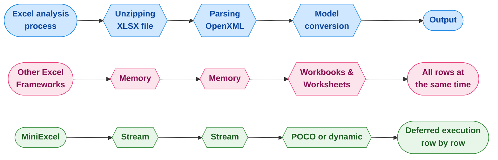

<div align="center">
<p><a href="https://www.nuget.org/packages/MiniExcel"></a>  <a href="https://www.nuget.org/packages/MiniExcel"></a>
<a href="https://ci.appveyor.com/project/mini-software/miniexcel/branch/master"></a>
<a href="https://gitee.com/dotnetchina/MiniExcel"></a> <a href="https://github.com/mini-software/MiniExcel" rel="nofollow"></a>
<a href="https://www.nuget.org/packages/MiniExcel"></a>
<a href="https://deepwiki.com/mini-software/MiniExcel"></a>
</p>
</div>

---

[](https://www.dotnetfoundation.org/)

<div align="center">
<p>Этот проект является частью <a href="https://www.dotnetfoundation.org/">.NET Foundation</a> и работает в соответствии с их <a href="https://www.dotnetfoundation.org/code-of-conduct">кодексом поведения</a>. </p>
</div>

---

<div align="center">
<p><strong><a href="README.md">English</a> | <a href="README.zh-CN.md">简体中文</a> | <a href="README.zh-Hant.md">繁體中文</a> | <a href="https://openaitx.github.io/view.html?user=mini-software&amp;project=MiniExcel&amp;lang=ja">日本語</a> | <a href="https://openaitx.github.io/view.html?user=mini-software&amp;project=MiniExcel&amp;lang=ko">한국어</a> | <a href="https://openaitx.github.io/view.html?user=mini-software&amp;project=MiniExcel&amp;lang=hi">हिन्दी</a> | <a href="https://openaitx.github.io/view.html?user=mini-software&amp;project=MiniExcel&amp;lang=th">ไทย</a> | <a href="https://openaitx.github.io/view.html?user=mini-software&amp;project=MiniExcel&amp;lang=fr">Français</a> | <a href="https://openaitx.github.io/view.html?user=mini-software&amp;project=MiniExcel&amp;lang=de">Deutsch</a> | <a href="https://openaitx.github.io/view.html?user=mini-software&amp;project=MiniExcel&amp;lang=es">Español</a> | <a href="https://openaitx.github.io/view.html?user=mini-software&amp;project=MiniExcel&amp;lang=it">Italiano</a> | <a href="https://openaitx.github.io/view.html?user=mini-software&amp;project=MiniExcel&amp;lang=ru">Русский</a> | <a href="https://openaitx.github.io/view.html?user=mini-software&amp;project=MiniExcel&amp;lang=pt">Português</a> | <a href="https://openaitx.github.io/view.html?user=mini-software&amp;project=MiniExcel&amp;lang=nl">Nederlands</a> | <a href="https://openaitx.github.io/view.html?user=mini-software&amp;project=MiniExcel&amp;lang=pl">Polski</a> | <a href="https://openaitx.github.io/view.html?user=mini-software&amp;project=MiniExcel&amp;lang=ar">العربية</a> | <a href="https://openaitx.github.io/view.html?user=mini-software&amp;project=MiniExcel&amp;lang=fa">فارسی</a> | <a href="https://openaitx.github.io/view.html?user=mini-software&amp;project=MiniExcel&amp;lang=tr">Türkçe</a> | <a href="https://openaitx.github.io/view.html?user=mini-software&amp;project=MiniExcel&amp;lang=vi">Tiếng Việt</a> | <a href="https://openaitx.github.io/view.html?user=mini-software&amp;project=MiniExcel&amp;lang=id">Bahasa Indonesia</a><p></p>
</strong></p>
</div>


---

<div align="center">
 Ваши <a href="https://github.com/mini-software/MiniExcel">звёзды</a> или <a href="https://miniexcel.github.io">пожертвования</a> помогут сделать MiniExcel лучше
</div>

---

### Введение

MiniExcel — это простой и эффективный инструмент для работы с Excel в .NET, специально разработанный для минимизации использования памяти.

В настоящее время большинство популярных фреймворков загружают все данные из Excel-документа в память для выполнения операций, что может привести к проблемам с потреблением памяти. Подход MiniExcel отличается: данные обрабатываются построчно в потоковом режиме, что снижает исходное потребление с потенциальных сотен мегабайт до всего лишь нескольких мегабайт и эффективно предотвращает ошибки нехватки памяти (OOM).


### Возможности

- Минимизирует потребление памяти, предотвращая ошибки из-за нехватки памяти (OOM) и избегая полной сборки мусора
- Обеспечивает операции с данными в режиме реального времени на уровне строк для повышения производительности при работе с большими наборами данных
- Поддерживает LINQ с отложенным выполнением, что позволяет осуществлять быстрый, экономичный по памяти постраничный вывод и сложные запросы
- Легковесен, не требует Microsoft Office или компонентов COM+, размер DLL менее 500 КБ
- Простой и интуитивно понятный API для чтения/записи/заполнения Excel

### Начало работы

- [Импорт/Запрос Excel](#getstart1)

- [Экспорт/Создание Excel](#getstart2)

- [Шаблон Excel](#getstart3)

- [Имя столбца Excel/Индекс/Атрибут Ignore](#getstart4)

- [Примеры](#getstart5)


### Установка

Вы можете установить пакет [с NuGet](https://www.nuget.org/packages/MiniExcel)

### Примечания к релизу

Пожалуйста, смотрите [Примечания к релизу](docs)

### Планы

Пожалуйста, смотрите  [TODO](https://github.com/mini-software/MiniExcel/projects/1?fullscreen=true)

### Производительность

Код для тестирования производительности доступен в [MiniExcel.Benchmarks](https://raw.githubusercontent.com/mini-software/MiniExcel/master/benchmarks/MiniExcel.Benchmarks/Program.cs).

Файл, используемый для тестирования производительности — это [**Test1,000,000x10.xlsx**](https://raw.githubusercontent.com/mini-software/MiniExcel/master/benchmarks/MiniExcel.Benchmarks/Test1%2C000%2C000x10.xlsx), 32 МБ документ, содержащий 1 000 000 строк * 10 столбцов, в ячейках которых находится строка "HelloWorld".

Для запуска всех тестов производительности используйте:


```bash
dotnet run -project .\benchmarks\MiniExcel.Benchmarks -c Release -f net9.0 -filter * --join
```
Вы можете найти результаты тестов производительности для последнего выпуска [здесь](benchmarks/results).


### Запрос/Импорт из Excel  <a name="getstart1"></a>

#### 1. Выполнить запрос и сопоставить результаты с строго типизированным IEnumerable [[Попробовать]](https://dotnetfiddle.net/w5WD1J)

Рекомендуется использовать Stream.Query из-за большей эффективности.


```csharp
public class UserAccount
{
    public Guid ID { get; set; }
    public string Name { get; set; }
    public DateTime BoD { get; set; }
    public int Age { get; set; }
    public bool VIP { get; set; }
    public decimal Points { get; set; }
}

var rows = MiniExcel.Query<UserAccount>(path);

// or

using (var stream = File.OpenRead(path))
    var rows = stream.Query<UserAccount>();
```


#### 2. Выполнить запрос и сопоставить результат со списком динамических объектов без использования head [[Попробовать]](https://dotnetfiddle.net/w5WD1J)

* динамический ключ — `A.B.C.D..`

| MiniExcel | 1 |
|-----------|---|
| Github    | 2 |


```csharp

var rows = MiniExcel.Query(path).ToList();

// or
using (var stream = File.OpenRead(path))
{
    var rows = stream.Query().ToList();

    Assert.Equal("MiniExcel", rows[0].A);
    Assert.Equal(1, rows[0].B);
    Assert.Equal("Github", rows[1].A);
    Assert.Equal(2, rows[1].B);
}
```
#### 3. Выполните запрос с первой строкой в качестве заголовка [[Попробовать]](https://dotnetfiddle.net/w5WD1J)

замечание: при одинаковых названиях столбцов используется самый правый

Входной Excel :

| Column1   | Column2 |
|-----------|---------|
| MiniExcel | 1       |
| Github    | 2       |


```csharp

var rows = MiniExcel.Query(useHeaderRow:true).ToList();

// or

using (var stream = File.OpenRead(path))
{
    var rows = stream.Query(useHeaderRow:true).ToList();

    Assert.Equal("MiniExcel", rows[0].Column1);
    Assert.Equal(1, rows[0].Column2);
    Assert.Equal("Github", rows[1].Column1);
    Assert.Equal(2, rows[1].Column2);
}
```
#### 4. Поддержка расширений LINQ для запросов: First/Take/Skip и др.

Запрос First

```csharp
var row = MiniExcel.Query(path).First();
Assert.Equal("HelloWorld", row.A);

// or

using (var stream = File.OpenRead(path))
{
    var row = stream.Query().First();
    Assert.Equal("HelloWorld", row.A);
}
```
Производительность MiniExcel/ExcelDataReader/ClosedXML/EPPlus


#### 5. Запрос по имени листа


```csharp
MiniExcel.Query(path, sheetName: "SheetName");
//or
stream.Query(sheetName: "SheetName");
```
#### 6. Запрос всех имен листов и строк


```csharp
var sheetNames = MiniExcel.GetSheetNames(path);
foreach (var sheetName in sheetNames)
{
    var rows = MiniExcel.Query(path, sheetName: sheetName);
}
```
#### 7. Получить столбцы


```csharp
var columns = MiniExcel.GetColumns(path); // e.g result : ["A","B"...]

var cnt = columns.Count;  // get column count
```
#### 8. Динамический запрос: приведение строки к `IDictionary<string,object>`


```csharp
foreach(IDictionary<string,object> row in MiniExcel.Query(path))
{
    //..
}

// or
var rows = MiniExcel.Query(path).Cast<IDictionary<string,object>>();
// or Query specified ranges (capitalized)
// A2 represents the second row of column A, C3 represents the third row of column C
// If you don't want to restrict rows, just don't include numbers
var rows = MiniExcel.QueryRange(path, startCell: "A2", endCell: "C3").Cast<IDictionary<string, object>>();
```
#### 9. Запрос Excel с возвращением DataTable

Не рекомендуется, поскольку DataTable загружает все данные в память и теряет преимущество MiniExcel по низкому потреблению памяти.


```C#
var table = MiniExcel.QueryAsDataTable(path, useHeaderRow: true);
```


#### 10. Укажите ячейку, с которой начать чтение данных


```csharp
MiniExcel.Query(path,useHeaderRow:true,startCell:"B3")
```


#### 11. Заполнение объединённых ячеек

Примечание: Эффективность ниже по сравнению с `неиспользованием заполнения объединённых`

Причина: Стандарт OpenXml помещает mergeCells в конец файла, из-за чего требуется дважды проходить по sheetxml


```csharp
    var config = new OpenXmlConfiguration()
    {
        FillMergedCells = true
    };
    var rows = MiniExcel.Query(path, configuration: config);
```


поддержка переменной длины и ширины, многострочного и многоколончатого заполнения


#### 12. Чтение большого файла с использованием дискового кэша (Disk-Base Cache - SharedString)

Если размер SharedStrings превышает 5 МБ, MiniExcel по умолчанию использует локальный дисковый кэш, например, [10x100000.xlsx](https://github.com/MiniExcel/MiniExcel/files/8403819/NotDuplicateSharedStrings_10x100000.xlsx) (миллион строк данных), при отключенном дисковом кэше максимальное использование памяти составляет 195 МБ, а при включенном дисковом кэше требуется только 65 МБ. Обратите внимание, что эта оптимизация требует некоторой потери производительности, поэтому в этом случае время чтения увеличивается с 7,4 секунд до 27,2 секунд. Если вам это не нужно, вы можете отключить дисковый кэш следующим образом:


```csharp
var config = new OpenXmlConfiguration { EnableSharedStringCache = false };
MiniExcel.Query(path,configuration: config)
```
Вы можете использовать `SharedStringCacheSize`, чтобы изменить размер файла sharedString сверх указанного размера для кэширования на диске

```csharp
var config = new OpenXmlConfiguration { SharedStringCacheSize=500*1024*1024 };
MiniExcel.Query(path, configuration: config);
```


### Создание/Экспорт Excel  <a name="getstart2"></a>

1. Должен быть не абстрактным типом с публичным конструктором без параметров.

2. MiniExcel поддерживает параметр IEnumerable с отложенным выполнением. Если вы хотите использовать минимальное количество памяти, пожалуйста, не вызывайте методы типа ToList

например: ToList или не использовать память


#### 1. Анонимный или строго типизированный [[Попробовать]](https://dotnetfiddle.net/w5WD1J)


```csharp
var path = Path.Combine(Path.GetTempPath(), $"{Guid.NewGuid()}.xlsx");
MiniExcel.SaveAs(path, new[] {
    new { Column1 = "MiniExcel", Column2 = 1 },
    new { Column1 = "Github", Column2 = 2}
});
```
#### 2. `IEnumerable<IDictionary<string, object>>`
#### 2. `IEnumerable<IDictionary<string, object>>`
#### 2. `IEnumerable<IDictionary<string, object>>`
```csharp
var values = new List<Dictionary<string, object>>()
{
    new Dictionary<string,object>{{ "Column1", "MiniExcel" }, { "Column2", 1 } },
    new Dictionary<string,object>{{ "Column1", "Github" }, { "Column2", 2 } }
};
MiniExcel.SaveAs(path, values);
```
Результат создания файла :

| Столбец1   | Столбец2 |
|------------|----------|
| MiniExcel  | 1        |
| Github     | 2        |


#### 3.  IDataReader
- `Рекомендуется`, позволяет избежать загрузки всех данных в память

```csharp
MiniExcel.SaveAs(path, reader);
```


Экспорт нескольких листов с помощью DataReader (рекомендуется использовать Dapper ExecuteReader)


```csharp
using (var cnn = Connection)
{
    cnn.Open();
    var sheets = new Dictionary<string,object>();
    sheets.Add("sheet1", cnn.ExecuteReader("select 1 id"));
    sheets.Add("sheet2", cnn.ExecuteReader("select 2 id"));
    MiniExcel.SaveAs("Demo.xlsx", sheets);
}
```
#### 4. Таблица данных

- `Не рекомендуется`, так как загрузит все данные в память

- В DataTable сначала используется Caption для имени столбца, затем используется имя столбца


```csharp
var path = Path.Combine(Path.GetTempPath(), $"{Guid.NewGuid()}.xlsx");
var table = new DataTable();
{
    table.Columns.Add("Column1", typeof(string));
    table.Columns.Add("Column2", typeof(decimal));
    table.Rows.Add("MiniExcel", 1);
    table.Rows.Add("Github", 2);
}

MiniExcel.SaveAs(path, table);
```
####  5. Dapper Query

Спасибо @shaofing #552 , пожалуйста, используйте `CommandDefinition + CommandFlags.NoCache`


```csharp
using (var connection = GetConnection(connectionString))
{
    var rows = connection.Query(
        new CommandDefinition(
            @"select 'MiniExcel' as Column1,1 as Column2 union all select 'Github',2"
            , flags: CommandFlags.NoCache)
        );
    // Note: QueryAsync will throw close connection exception
    MiniExcel.SaveAs(path, rows);
}
```
Нижеприведённый код загрузит все данные в память


```csharp
using (var connection = GetConnection(connectionString))
{
    var rows = connection.Query(@"select 'MiniExcel' as Column1,1 as Column2 union all select 'Github',2");
    MiniExcel.SaveAs(path, rows);
}
```
#### 6. SaveAs в MemoryStream  [[Попробовать]](https://dotnetfiddle.net/JOen0e)


```csharp
using (var stream = new MemoryStream()) //support FileStream,MemoryStream ect.
{
    stream.SaveAs(values);
}
```
например: API для экспорта в Excel


```csharp
public IActionResult DownloadExcel()
{
    var values = new[] {
        new { Column1 = "MiniExcel", Column2 = 1 },
        new { Column1 = "Github", Column2 = 2}
    };

    var memoryStream = new MemoryStream();
    memoryStream.SaveAs(values);
    memoryStream.Seek(0, SeekOrigin.Begin);
    return new FileStreamResult(memoryStream, "application/vnd.openxmlformats-officedocument.spreadsheetml.sheet")
    {
        FileDownloadName = "demo.xlsx"
    };
}
```
#### 7. Создание нескольких листов


```csharp
// 1. Dictionary<string,object>
var users = new[] { new { Name = "Jack", Age = 25 }, new { Name = "Mike", Age = 44 } };
var department = new[] { new { ID = "01", Name = "HR" }, new { ID = "02", Name = "IT" } };
var sheets = new Dictionary<string, object>
{
    ["users"] = users,
    ["department"] = department
};
MiniExcel.SaveAs(path, sheets);

// 2. DataSet
var sheets = new DataSet();
sheets.Add(UsersDataTable);
sheets.Add(DepartmentDataTable);
//..
MiniExcel.SaveAs(path, sheets);
```


#### 8. Опции TableStyles

Стиль по умолчанию


Без настройки стиля


```csharp
var config = new OpenXmlConfiguration()
{
     TableStyles = TableStyles.None
};
MiniExcel.SaveAs(path, value,configuration:config);
```


#### 9. Автофильтр

Начиная с версии v0.19.0 `OpenXmlConfiguration.AutoFilter` может включать/отключать автофильтр, значение по умолчанию — `true`, а способ установки AutoFilter следующий:


```csharp
MiniExcel.SaveAs(path, value, configuration: new OpenXmlConfiguration() { AutoFilter = false });
```
#### 10. Создать изображение


```csharp
var value = new[] {
    new { Name="github",Image=File.ReadAllBytes(PathHelper.GetFile("images/github_logo.png"))},
    new { Name="google",Image=File.ReadAllBytes(PathHelper.GetFile("images/google_logo.png"))},
    new { Name="microsoft",Image=File.ReadAllBytes(PathHelper.GetFile("images/microsoft_logo.png"))},
    new { Name="reddit",Image=File.ReadAllBytes(PathHelper.GetFile("images/reddit_logo.png"))},
    new { Name="statck_overflow",Image=File.ReadAllBytes(PathHelper.GetFile("images/statck_overflow_logo.png"))},
};
MiniExcel.SaveAs(path, value);
```


#### 11. Экспорт файлов в виде массива байтов

Начиная с версии 1.22.0, если тип значения `byte[]`, система по умолчанию сохраняет путь к файлу в ячейке, а при импорте значение может быть преобразовано в `byte[]`. Если вы не хотите использовать эту функцию, установите `OpenXmlConfiguration.EnableConvertByteArray` в `false` — это повысит эффективность системы.


Начиная с версии 1.22.0, если тип значения `byte[]`, система по умолчанию сохраняет путь к файлу в ячейке, а при импорте значение может быть преобразовано в `byte[]`. Если вы не хотите использовать эту функцию, установите `OpenXmlConfiguration.EnableConvertByteArray` в `false` — это повысит эффективность системы.


#### 12. Вертикальное объединение одинаковых ячеек

Эта функция поддерживается только в формате `xlsx` и объединяет ячейки вертикально между тегами @merge и @endmerge.
Вы можете использовать @mergelimit для ограничения границ вертикального объединения ячеек.


```csharp
var mergedFilePath = Path.Combine(Path.GetTempPath(), $"{Guid.NewGuid().ToString()}.xlsx");

var path = @"../../../../../samples/xlsx/TestMergeWithTag.xlsx";

MiniExcel.MergeSameCells(mergedFilePath, path);
```


```csharp
var memoryStream = new MemoryStream();

var path = @"../../../../../samples/xlsx/TestMergeWithTag.xlsx";

memoryStream.MergeSameCells(path);
```
Содержимое файла до и после слияния:

Без ограничения на слияние:


С ограничением на слияние:


#### 13. Пропускать нулевые значения

Новая явная опция для записи пустых ячеек для нулевых значений:


```csharp
DataTable dt = new DataTable();

/* ... */

DataRow dr = dt.NewRow();

dr["Name1"] = "Somebody once";
dr["Name2"] = null;
dr["Name3"] = "told me.";

dt.Rows.Add(dr);

OpenXmlConfiguration configuration = new OpenXmlConfiguration()
{
     EnableWriteNullValueCell = true // Default value.
};

MiniExcel.SaveAs(@"C:\temp\Book1.xlsx", dt, configuration: configuration);
```


```xml
<x:row r="2">
    <x:c r="A2" t ="str" s="2">
        <x:v>Somebody once</x:v>
    </x:c>
    <x:c r="B2" s="2"></x:c>
    <x:c r="C2" t ="str" s="2">
        <x:v>told me.</x:v>
    </x:c>
</x:row>
```
Предыдущее поведение:


```csharp
/* ... */

OpenXmlConfiguration configuration = new OpenXmlConfiguration()
{
     EnableWriteNullValueCell = false // Default value is true.
};

MiniExcel.SaveAs(@"C:\temp\Book1.xlsx", dt, configuration: configuration);
```


```xml
<x:row r="2">
    <x:c r="A2" t ="str" s="2">
        <x:v>Somebody once</x:v>
    </x:c>
    <x:c r="B2" t ="str" s="2">
        <x:v></x:v>
    </x:c>
    <x:c r="C2" t ="str" s="2">
        <x:v>told me.</x:v>
    </x:c>
</x:row>
```
Работает для значений null и DBNull.

#### 14. Закрепление областей

```csharp
/* ... */

OpenXmlConfiguration configuration = new OpenXmlConfiguration()
{
    FreezeRowCount = 1,     // default is 1
    FreezeColumnCount = 2   // default is 0
};

MiniExcel.SaveAs(@"C:\temp\Book1.xlsx", dt, configuration: configuration);
```


### Заполнение данных в шаблон Excel <a name="getstart3"></a>

- Объявление похоже на шаблон Vue `{{имя переменной}}`, либо рендеринг коллекции `{{имя коллекции.имя поля}}`
- Рендеринг коллекций поддерживает IEnumerable/DataTable/DapperRow

#### 1. Базовое заполнение

Шаблон:


Результат:


Код:

```csharp
// 1. By POCO
var value = new
{
    Name = "Jack",
    CreateDate = new DateTime(2021, 01, 01),
    VIP = true,
    Points = 123
};
MiniExcel.SaveAsByTemplate(path, templatePath, value);


// 2. By Dictionary
var value = new Dictionary<string, object>()
{
    ["Name"] = "Jack",
    ["CreateDate"] = new DateTime(2021, 01, 01),
    ["VIP"] = true,
    ["Points"] = 123
};
MiniExcel.SaveAsByTemplate(path, templatePath, value);
```


#### 2. Заполнение данных IEnumerable

> Примечание1: Используйте первый IEnumerable того же столбца в качестве основы для заполнения списка

Шаблон:


Результат:


Код:

```csharp
//1. By POCO
var value = new
{
    employees = new[] {
        new {name="Jack",department="HR"},
        new {name="Lisa",department="HR"},
        new {name="John",department="HR"},
        new {name="Mike",department="IT"},
        new {name="Neo",department="IT"},
        new {name="Loan",department="IT"}
    }
};
MiniExcel.SaveAsByTemplate(path, templatePath, value);

//2. By Dictionary
var value = new Dictionary<string, object>()
{
    ["employees"] = new[] {
        new {name="Jack",department="HR"},
        new {name="Lisa",department="HR"},
        new {name="John",department="HR"},
        new {name="Mike",department="IT"},
        new {name="Neo",department="IT"},
        new {name="Loan",department="IT"}
    }
};
MiniExcel.SaveAsByTemplate(path, templatePath, value);
```
#### 3. Сложное заполнение данных

> Примечание: Поддержка нескольких листов и использование одной и той же переменной

Шаблон:


Результат:


```csharp
// 1. By POCO
var value = new
{
    title = "FooCompany",
    managers = new[] {
        new {name="Jack",department="HR"},
        new {name="Loan",department="IT"}
    },
    employees = new[] {
        new {name="Wade",department="HR"},
        new {name="Felix",department="HR"},
        new {name="Eric",department="IT"},
        new {name="Keaton",department="IT"}
    }
};
MiniExcel.SaveAsByTemplate(path, templatePath, value);

// 2. By Dictionary
var value = new Dictionary<string, object>()
{
    ["title"] = "FooCompany",
    ["managers"] = new[] {
        new {name="Jack",department="HR"},
        new {name="Loan",department="IT"}
    },
    ["employees"] = new[] {
        new {name="Wade",department="HR"},
        new {name="Felix",department="HR"},
        new {name="Eric",department="IT"},
        new {name="Keaton",department="IT"}
    }
};
MiniExcel.SaveAsByTemplate(path, templatePath, value);
```
#### 4. Заполнение больших данных — производительность

> ПРИМЕЧАНИЕ: Использование отложенного выполнения IEnumerable вместо ToList позволяет минимизировать использование памяти в MiniExcel


#### 5. Автоматическое сопоставление типов значений ячеек

Шаблон


Результат


Класс


```csharp
public class Poco
{
    public string @string { get; set; }
    public int? @int { get; set; }
    public decimal? @decimal { get; set; }
    public double? @double { get; set; }
    public DateTime? datetime { get; set; }
    public bool? @bool { get; set; }
    public Guid? Guid { get; set; }
}
```
Код


```csharp
var poco = new TestIEnumerableTypePoco { @string = "string", @int = 123, @decimal = decimal.Parse("123.45"), @double = (double)123.33, @datetime = new DateTime(2021, 4, 1), @bool = true, @Guid = Guid.NewGuid() };
var value = new
{
    Ts = new[] {
        poco,
        new TestIEnumerableTypePoco{},
        null,
        poco
    }
};
MiniExcel.SaveAsByTemplate(path, templatePath, value);
```


#### 6. Пример :  Список проектов Github

Шаблон


Результат


Код


```csharp
var projects = new[]
{
    new {Name = "MiniExcel",Link="https://github.com/mini-software/MiniExcel",Star=146, CreateTime=new DateTime(2021,03,01)},
    new {Name = "HtmlTableHelper",Link="https://github.com/mini-software/HtmlTableHelper",Star=16, CreateTime=new DateTime(2020,02,01)},
    new {Name = "PocoClassGenerator",Link="https://github.com/mini-software/PocoClassGenerator",Star=16, CreateTime=new DateTime(2019,03,17)}
};
var value = new
{
    User = "ITWeiHan",
    Projects = projects,
    TotalStar = projects.Sum(s => s.Star)
};
MiniExcel.SaveAsByTemplate(path, templatePath, value);
```
#### 7. Заполнение сгруппированных данных


```csharp
var value = new Dictionary<string, object>()
{
    ["employees"] = new[] {
        new {name="Jack",department="HR"},
        new {name="Jack",department="HR"},
        new {name="John",department="HR"},
        new {name="John",department="IT"},
        new {name="Neo",department="IT"},
        new {name="Loan",department="IT"}
    }
};
await MiniExcel.SaveAsByTemplateAsync(path, templatePath, value);
```
##### 1. С тегом `@group` и с тегом `@header`

До


После


##### 2. С тегом @group и без тега @header

До


После


##### 3. Без тега @group

До


После


#### 8. Операторы If/ElseIf/Else внутри ячейки

Правила:
1. Поддерживаются типы DateTime, Double, Int с операторами ==, !=, >, >=, <, <=.
2. Для строк поддерживаются операторы ==, !=.
3. Каждое выражение должно быть с новой строки.
4. Один пробел должен быть добавлен до и после оператора.
5. Не должно быть переноса строки внутри выражения.
6. Ячейка должна быть точно в формате, приведённом ниже.

```csharp
@if(name == Jack)
{{employees.name}}
@elseif(name == Neo)
Test {{employees.name}}
@else
{{employees.department}}
@endif
```
До


После


#### 9. DataTable в качестве параметра


```csharp
var managers = new DataTable();
{
    managers.Columns.Add("name");
    managers.Columns.Add("department");
    managers.Rows.Add("Jack", "HR");
    managers.Rows.Add("Loan", "IT");
}
var value = new Dictionary<string, object>()
{
    ["title"] = "FooCompany",
    ["managers"] = managers,
};
MiniExcel.SaveAsByTemplate(path, templatePath, value);
```
#### 10. Формулы

##### 1. Пример
Добавьте к формуле префикс `$` и используйте `$enumrowstart` и `$enumrowend` для обозначения ссылок на начальную и конечную строки перечисления:


При рендеринге шаблона префикс `$` будет удалён, а `$enumrowstart` и `$enumrowend` будут заменены на номера начальной и конечной строки перечисления:


##### 2. Другие примеры формул:

|              |                                                                                           |
|--------------|-------------------------------------------------------------------------------------------|
| Сумма        | `$=SUM(C{{$enumrowstart}}:C{{$enumrowend}})`                                              |
| Альт. Среднее| `$=SUM(C{{$enumrowstart}}:C{{$enumrowend}}) / COUNT(C{{$enumrowstart}}:C{{$enumrowend}})` |
| Диапазон     | `$=MAX(C{{$enumrowstart}}:C{{$enumrowend}}) - MIN(C{{$enumrowstart}}:C{{$enumrowend}})`   |


#### 11. Другое

##### 1. Проверка ключа параметра шаблона

Начиная с версии V1.24.0, по умолчанию пропущенный параметр шаблона игнорируется и заменяется на пустую строку, `IgnoreTemplateParameterMissing` позволяет контролировать выбрасывание исключения или нет.

```csharp
var config = new OpenXmlConfiguration()
{
    IgnoreTemplateParameterMissing = false,
};
MiniExcel.SaveAsByTemplate(path, templatePath, value, config)
```


### Атрибут имени столбца Excel/индекса/игнорирования <a name="getstart4"></a>


#### 1. Указание имени столбца, индекса столбца, игнорирования столбца

Пример Excel


Код


```csharp
public class ExcelAttributeDemo
{
    [ExcelColumnName("Column1")]
    public string Test1 { get; set; }
    [ExcelColumnName("Column2")]
    public string Test2 { get; set; }
    [ExcelIgnore]
    public string Test3 { get; set; }
    [ExcelColumnIndex("I")] // system will convert "I" to 8 index
    public string Test4 { get; set; }
    public string Test5 { get; } //wihout set will ignore
    public string Test6 { get; private set; } //un-public set will ignore
    [ExcelColumnIndex(3)] // start with 0
    public string Test7 { get; set; }
}

var rows = MiniExcel.Query<ExcelAttributeDemo>(path).ToList();
Assert.Equal("Column1", rows[0].Test1);
Assert.Equal("Column2", rows[0].Test2);
Assert.Null(rows[0].Test3);
Assert.Equal("Test7", rows[0].Test4);
Assert.Null(rows[0].Test5);
Assert.Null(rows[0].Test6);
Assert.Equal("Test4", rows[0].Test7);
```


#### 2. Пользовательский формат (ExcelFormatAttribute)

Начиная с версии V0.21.0 поддерживается класс, содержащий метод `ToString(string content)`

Класс


```csharp
public class Dto
{
    public string Name { get; set; }

    [ExcelFormat("MMMM dd, yyyy")]
    public DateTime InDate { get; set; }
}
```
Код


```csharp
var value = new Dto[] {
    new Issue241Dto{ Name="Jack",InDate=new DateTime(2021,01,04)},
    new Issue241Dto{ Name="Henry",InDate=new DateTime(2020,04,05)},
};
MiniExcel.SaveAs(path, value);
```
Результат


Запрос поддерживает пользовательское преобразование формата


#### 3. Установка ширины столбца (ExcelColumnWidthAttribute)


```csharp
public class Dto
{
    [ExcelColumnWidth(20)]
    public int ID { get; set; }
    [ExcelColumnWidth(15.50)]
    public string Name { get; set; }
}
```
#### 4. Несколько имен столбцов, отображающихся на одно и то же свойство.


```csharp
public class Dto
{
    [ExcelColumnName(excelColumnName:"EmployeeNo",aliases:new[] { "EmpNo","No" })]
    public string Empno { get; set; }
    public string Name { get; set; }
}
```


#### 5. System.ComponentModel.DisplayNameAttribute = ExcelColumnName.excelColumnNameAttribute

Начиная с версии 1.24.0, система поддерживает System.ComponentModel.DisplayNameAttribute = ExcelColumnName.excelColumnNameAttribute


```C#
public class TestIssueI4TXGTDto
{
    public int ID { get; set; }
    public string Name { get; set; }
    [DisplayName("Specification")]
    public string Spc { get; set; }
    [DisplayName("Unit Price")]
    public decimal Up { get; set; }
}
```
#### 6. ExcelColumnAttribute

Начиная с версии V1.26.0, несколько атрибутов можно упростить следующим образом:


```csharp
        public class TestIssueI4ZYUUDto
        {
            [ExcelColumn(Name = "ID",Index =0)]
            public string MyProperty { get; set; }
            [ExcelColumn(Name = "CreateDate", Index = 1,Format ="yyyy-MM",Width =100)]
            public DateTime MyProperty2 { get; set; }
        }
```
#### 7. DynamicColumnAttribute

Начиная с версии V1.26.0, мы можем динамически задавать атрибуты Column


```csharp
            var config = new OpenXmlConfiguration
            {
                DynamicColumns = new DynamicExcelColumn[] {
                    new DynamicExcelColumn("id"){Ignore=true},
                    new DynamicExcelColumn("name"){Index=1,Width=10},
                    new DynamicExcelColumn("createdate"){Index=0,Format="yyyy-MM-dd",Width=15},
                    new DynamicExcelColumn("point"){Index=2,Name="Account Point"},
                }
            };
            var path = PathHelper.GetTempPath();
            var value = new[] { new { id = 1, name = "Jack", createdate = new DateTime(2022, 04, 12) ,point = 123.456} };
            MiniExcel.SaveAs(path, value, configuration: config);
```


#### 8. DynamicSheetAttribute

Начиная с версии V1.31.4, мы можем динамически задавать атрибуты листа. Мы можем задавать имя листа и его состояние (видимость).
```csharp
            var configuration = new OpenXmlConfiguration
            {
                DynamicSheets = new DynamicExcelSheet[] {
                    new DynamicExcelSheet("usersSheet") { Name = "Users", State = SheetState.Visible },
                    new DynamicExcelSheet("departmentSheet") { Name = "Departments", State = SheetState.Hidden }
                }
            };

            var users = new[] { new { Name = "Jack", Age = 25 }, new { Name = "Mike", Age = 44 } };
            var department = new[] { new { ID = "01", Name = "HR" }, new { ID = "02", Name = "IT" } };
            var sheets = new Dictionary<string, object>
            {
                ["usersSheet"] = users,
                ["departmentSheet"] = department
            };

            var path = PathHelper.GetTempPath();
            MiniExcel.SaveAs(path, sheets, configuration: configuration);
```
Мы также можем использовать новый атрибут ExcelSheetAttribute:


```C#
   [ExcelSheet(Name = "Departments", State = SheetState.Hidden)]
   private class DepartmentDto
   {
      [ExcelColumn(Name = "ID",Index = 0)]
      public string ID { get; set; }
      [ExcelColumn(Name = "Name",Index = 1)]
      public string Name { get; set; }
   }
```
### Добавить, Удалить, Обновить

#### Добавить

v1.28.0 поддерживает вставку N строк данных в CSV после последней строки


```csharp
// Origin
{
    var value = new[] {
          new { ID=1,Name ="Jack",InDate=new DateTime(2021,01,03)},
          new { ID=2,Name ="Henry",InDate=new DateTime(2020,05,03)},
    };
    MiniExcel.SaveAs(path, value);
}
// Insert 1 rows after last
{
    var value = new { ID=3,Name = "Mike", InDate = new DateTime(2021, 04, 23) };
    MiniExcel.Insert(path, value);
}
// Insert N rows after last
{
    var value = new[] {
          new { ID=4,Name ="Frank",InDate=new DateTime(2021,06,07)},
          new { ID=5,Name ="Gloria",InDate=new DateTime(2022,05,03)},
    };
    MiniExcel.Insert(path, value);
}
```


v1.37.0 поддерживает вставку нового листа Excel в существующую рабочую книгу


```csharp
// Origin excel
{
    var value = new[] {
          new { ID=1,Name ="Jack",InDate=new DateTime(2021,01,03)},
          new { ID=2,Name ="Henry",InDate=new DateTime(2020,05,03)},
    };
    MiniExcel.SaveAs(path, value, sheetName: "Sheet1");
}
// Insert a new sheet
{
    var value = new { ID=3,Name = "Mike", InDate = new DateTime(2021, 04, 23) };
    MiniExcel.Insert(path, table, sheetName: "Sheet2");
}
```
#### Удалить(ожидание)

#### Обновить(ожидание)


### Автоматическая проверка типа Excel <a name="getstart5"></a>

- MiniExcel по умолчанию определяет, является ли файл xlsx или csv, исходя из `расширения файла`, но это может быть неточно, пожалуйста, укажите тип вручную.
- Невозможно определить тип excel из потока, пожалуйста, укажите его вручную.


```csharp
stream.SaveAs(excelType:ExcelType.CSV);
//or
stream.SaveAs(excelType:ExcelType.XLSX);
//or
stream.Query(excelType:ExcelType.CSV);
//or
stream.Query(excelType:ExcelType.XLSX);
```


### CSV

#### Примечание

- По умолчанию возвращается тип `string`, и значение не будет преобразовано в числа или дату/время, если только тип не определён явно через строгую типизацию.


#### Пользовательский разделитель

По умолчанию используется `,` в качестве разделителя, вы можете изменить свойство `Seperator` для настройки


```csharp
var config = new MiniExcelLibs.Csv.CsvConfiguration()
{
    Seperator=';'
};
MiniExcel.SaveAs(path, values,configuration: config);
```
Начиная с версии V1.30.1 поддерживается функция пользовательского разделителя (спасибо @hyzx86)


```csharp
var config = new CsvConfiguration()
{
    SplitFn = (row) => Regex.Split(row, $"[\t,](?=(?:[^\"]|\"[^\"]*\")*$)")
        .Select(s => Regex.Replace(s.Replace("\"\"", "\""), "^\"|\"$", "")).ToArray()
};
var rows = MiniExcel.Query(path, configuration: config).ToList();
```
#### Пользовательский разрыв строки

По умолчанию символ новой строки — это `\r\n`, вы можете изменить свойство `NewLine` для настройки


```csharp
var config = new MiniExcelLibs.Csv.CsvConfiguration()
{
    NewLine='\n'
};
MiniExcel.SaveAs(path, values,configuration: config);
```
#### Пользовательское кодирование

- Кодировка по умолчанию — «Определять кодировку по меткам порядка байтов» (detectEncodingFromByteOrderMarks: true)
- Если у вас есть особые требования к кодировке, измените свойство StreamReaderFunc / StreamWriterFunc


```csharp
// Read
var config = new MiniExcelLibs.Csv.CsvConfiguration()
{
    StreamReaderFunc = (stream) => new StreamReader(stream,Encoding.GetEncoding("gb2312"))
};
var rows = MiniExcel.Query(path, true,excelType:ExcelType.CSV,configuration: config);

// Write
var config = new MiniExcelLibs.Csv.CsvConfiguration()
{
    StreamWriterFunc = (stream) => new StreamWriter(stream, Encoding.GetEncoding("gb2312"))
};
MiniExcel.SaveAs(path, value,excelType:ExcelType.CSV, configuration: config);
```
#### Читать пустую строку как null

По умолчанию пустые значения сопоставляются с string.Empty. Вы можете изменить это поведение


```csharp
var config = new MiniExcelLibs.Csv.CsvConfiguration()
{
   ReadEmptyStringAsNull = true
};
```
### DataReader

#### 1. GetReader
Начиная с версии 1.23.0, вы можете использовать GetDataReader


```csharp
    using (var reader = MiniExcel.GetReader(path,true))
    {
        while (reader.Read())
        {
            for (int i = 0; i < reader.FieldCount; i++)
            {
                var value = reader.GetValue(i);
            }
        }
    }
```
###  Асинхронность

- v0.17.0 поддерживает асинхронность (благодарность isdaniel ( SHIH,BING-SIOU)](https://github.com/isdaniel))


```csharp
public static Task SaveAsAsync(string path, object value, bool printHeader = true, string sheetName = "Sheet1", ExcelType excelType = ExcelType.UNKNOWN, IConfiguration configuration = null)
public static Task SaveAsAsync(this Stream stream, object value, bool printHeader = true, string sheetName = "Sheet1", ExcelType excelType = ExcelType.XLSX, IConfiguration configuration = null)
public static Task<IEnumerable<dynamic>> QueryAsync(string path, bool useHeaderRow = false, string sheetName = null, ExcelType excelType = ExcelType.UNKNOWN, string startCell = "A1", IConfiguration configuration = null)
public static Task<IEnumerable<T>> QueryAsync<T>(this Stream stream, string sheetName = null, ExcelType excelType = ExcelType.UNKNOWN, string startCell = "A1", IConfiguration configuration = null) where T : class, new()
public static Task<IEnumerable<T>> QueryAsync<T>(string path, string sheetName = null, ExcelType excelType = ExcelType.UNKNOWN, string startCell = "A1", IConfiguration configuration = null) where T : class, new()
public static Task<IEnumerable<IDictionary<string, object>>> QueryAsync(this Stream stream, bool useHeaderRow = false, string sheetName = null, ExcelType excelType = ExcelType.UNKNOWN, string startCell = "A1", IConfiguration configuration = null)
public static Task SaveAsByTemplateAsync(this Stream stream, string templatePath, object value)
public static Task SaveAsByTemplateAsync(this Stream stream, byte[] templateBytes, object value)
public static Task SaveAsByTemplateAsync(string path, string templatePath, object value)
public static Task SaveAsByTemplateAsync(string path, byte[] templateBytes, object value)
public static Task<DataTable> QueryAsDataTableAsync(string path, bool useHeaderRow = true, string sheetName = null, ExcelType excelType = ExcelType.UNKNOWN, string startCell = "A1", IConfiguration configuration = null)
```
-  v1.25.0 поддерживает `cancellationToken`。


### Прочее

#### 1. Перечисления (Enum)

Убедитесь, что имя в Excel и имя свойства совпадают, система выполнит автоматическое сопоставление (без учета регистра)


Начиная с версии V0.18.0 поддерживается Enum Description


```csharp
public class Dto
{
    public string Name { get; set; }
    public I49RYZUserType UserType { get; set; }
}

public enum Type
{
    [Description("General User")]
    V1,
    [Description("General Administrator")]
    V2,
    [Description("Super Administrator")]
    V3
}
```


Начиная с версии 1.30.0 поддерживается преобразование описания Excel в Enum, спасибо @KaneLeung

#### 2. Преобразование CSV в XLSX или преобразование XLSX в CSV


```csharp
MiniExcel.ConvertXlsxToCsv(xlsxPath, csvPath);
MiniExcel.ConvertXlsxToCsv(xlsxStream, csvStream);
MiniExcel.ConvertCsvToXlsx(csvPath, xlsxPath);
MiniExcel.ConvertCsvToXlsx(csvStream, xlsxStream);
```
```csharp
using (var excelStream = new FileStream(path: filePath, FileMode.Open, FileAccess.Read))
using (var csvStream = new MemoryStream())
{
   MiniExcel.ConvertXlsxToCsv(excelStream, csvStream);
}
```
#### 3. Пользовательский CultureInfo

Начиная с версии 1.22.0, вы можете настроить CultureInfo, как показано ниже, по умолчанию используется системный `CultureInfo.InvariantCulture`.


```csharp
var config = new CsvConfiguration()
{
    Culture = new CultureInfo("fr-FR"),
};
MiniExcel.SaveAs(path, value, configuration: config);

// or
MiniExcel.Query(path, configuration: config);
```
#### 4. Пользовательский размер буфера


```csharp
    public abstract class Configuration : IConfiguration
    {
        public int BufferSize { get; set; } = 1024 * 512;
    }
```
#### 5. Быстрый режим

Система не будет управлять памятью, но вы сможете получить более высокую скорость сохранения.


```csharp
var config = new OpenXmlConfiguration() { FastMode = true };
MiniExcel.SaveAs(path, reader,configuration:config);
```
#### 6. Пакетное добавление изображения (MiniExcel.AddPicture)

Пожалуйста, добавляйте изображения до пакетной генерации данных строк, иначе при вызове AddPicture система будет использовать много памяти.


```csharp
var images = new[]
{
    new MiniExcelPicture
    {
        ImageBytes = File.ReadAllBytes(PathHelper.GetFile("images/github_logo.png")),
        SheetName = null, // default null is first sheet
        CellAddress = "C3", // required
    },
    new MiniExcelPicture
    {
        ImageBytes = File.ReadAllBytes(PathHelper.GetFile("images/google_logo.png")),
        PictureType = "image/png", // default PictureType = image/png
        SheetName = "Demo",
        CellAddress = "C9", // required
        WidthPx = 100,
        HeightPx = 100,
    },
};
MiniExcel.AddPicture(path, images);
```


#### 7. Получить размеры листов

```csharp
var dim = MiniExcel.GetSheetDimensions(path);
```
### Примеры:

#### 1. SQLite и Dapper `Большой файл` SQL-вставка без OOM

примечание: пожалуйста, не вызывайте методы ToList/ToArray после Query, это загрузит все данные в память


```csharp
using (var connection = new SQLiteConnection(connectionString))
{
    connection.Open();
    using (var transaction = connection.BeginTransaction())
    using (var stream = File.OpenRead(path))
    {
       var rows = stream.Query();
       foreach (var row in rows)
             connection.Execute("insert into T (A,B) values (@A,@B)", new { row.A, row.B }, transaction: transaction);
       transaction.Commit();
    }
}
```
производительность:


#### 2. ASP.NET Core 3.1 или MVC 5 Демонстрация API загрузки/выгрузки Excel Xlsx [Попробовать](https://raw.githubusercontent.com/mini-software/MiniExcel/master/tests/MiniExcel.Tests.AspNetCore)


```csharp
public class ApiController : Controller
{
    public IActionResult Index()
    {
        return new ContentResult
        {
            ContentType = "text/html",
            StatusCode = (int)HttpStatusCode.OK,
            Content = @"<html><body>
<a href='api/DownloadExcel'>DownloadExcel</a><br>
<a href='api/DownloadExcelFromTemplatePath'>DownloadExcelFromTemplatePath</a><br>
<a href='api/DownloadExcelFromTemplateBytes'>DownloadExcelFromTemplateBytes</a><br>
<p>Upload Excel</p>
<form method='post' enctype='multipart/form-data' action='/api/uploadexcel'>
    <input type='file' name='excel'> <br>
    <input type='submit' >
</form>
</body></html{{"
        };
    }

    public IActionResult DownloadExcel()
    {
        var values = new[] {
            new { Column1 = "MiniExcel", Column2 = 1 },
            new { Column1 = "Github", Column2 = 2}
        };
        var memoryStream = new MemoryStream();
        memoryStream.SaveAs(values);
        memoryStream.Seek(0, SeekOrigin.Begin);
        return new FileStreamResult(memoryStream, "application/vnd.openxmlformats-officedocument.spreadsheetml.sheet")
        {
            FileDownloadName = "demo.xlsx"
        };
    }

    public IActionResult DownloadExcelFromTemplatePath()
    {
        string templatePath = "TestTemplateComplex.xlsx";

        Dictionary<string, object> value = new Dictionary<string, object>()
        {
            ["title"] = "FooCompany",
            ["managers"] = new[] {
                new {name="Jack",department="HR"},
                new {name="Loan",department="IT"}
            },
            ["employees"] = new[] {
                new {name="Wade",department="HR"},
                new {name="Felix",department="HR"},
                new {name="Eric",department="IT"},
                new {name="Keaton",department="IT"}
            }
        };

        MemoryStream memoryStream = new MemoryStream();
        memoryStream.SaveAsByTemplate(templatePath, value);
        memoryStream.Seek(0, SeekOrigin.Begin);
        return new FileStreamResult(memoryStream, "application/vnd.openxmlformats-officedocument.spreadsheetml.sheet")
        {
            FileDownloadName = "demo.xlsx"
        };
    }

    private static Dictionary<string, Byte[]> TemplateBytesCache = new Dictionary<string, byte[]>();

    static ApiController()
    {
        string templatePath = "TestTemplateComplex.xlsx";
        byte[] bytes = System.IO.File.ReadAllBytes(templatePath);
        TemplateBytesCache.Add(templatePath, bytes);
    }

    public IActionResult DownloadExcelFromTemplateBytes()
    {
        byte[] bytes = TemplateBytesCache["TestTemplateComplex.xlsx"];

        Dictionary<string, object> value = new Dictionary<string, object>()
        {
            ["title"] = "FooCompany",
            ["managers"] = new[] {
                new {name="Jack",department="HR"},
                new {name="Loan",department="IT"}
            },
            ["employees"] = new[] {
                new {name="Wade",department="HR"},
                new {name="Felix",department="HR"},
                new {name="Eric",department="IT"},
                new {name="Keaton",department="IT"}
            }
        };

        MemoryStream memoryStream = new MemoryStream();
        memoryStream.SaveAsByTemplate(bytes, value);
        memoryStream.Seek(0, SeekOrigin.Begin);
        return new FileStreamResult(memoryStream, "application/vnd.openxmlformats-officedocument.spreadsheetml.sheet")
        {
            FileDownloadName = "demo.xlsx"
        };
    }

    public IActionResult UploadExcel(IFormFile excel)
    {
        var stream = new MemoryStream();
        excel.CopyTo(stream);

        foreach (var item in stream.Query(true))
        {
            // do your logic etc.
        }

        return Ok("File uploaded successfully");
    }
}
```
####  3. Постраничный запрос


```csharp
void Main()
{
    var rows = MiniExcel.Query(path);

    Console.WriteLine("==== No.1 Page ====");
    Console.WriteLine(Page(rows,pageSize:3,page:1));
    Console.WriteLine("==== No.50 Page ====");
    Console.WriteLine(Page(rows,pageSize:3,page:50));
    Console.WriteLine("==== No.5000 Page ====");
    Console.WriteLine(Page(rows,pageSize:3,page:5000));
}

public static IEnumerable<T> Page<T>(IEnumerable<T> en, int pageSize, int page)
{
    return en.Skip(page * pageSize).Take(pageSize);
}
```


#### 4. Экспорт Excel из WebForm с помощью MemoryStream


```csharp
var fileName = "Demo.xlsx";
var sheetName = "Sheet1";
HttpResponse response = HttpContext.Current.Response;
response.Clear();
response.ContentType = "application/vnd.openxmlformats-officedocument.spreadsheetml.sheet";
response.AddHeader("Content-Disposition", $"attachment;filename=\"{fileName}\"");
var values = new[] {
    new { Column1 = "MiniExcel", Column2 = 1 },
    new { Column1 = "Github", Column2 = 2}
};
var memoryStream = new MemoryStream();
memoryStream.SaveAs(values, sheetName: sheetName);
memoryStream.Seek(0, SeekOrigin.Begin);
memoryStream.CopyTo(Response.OutputStream);
response.End();
```
#### 5. Динамическое i18n мультиязычное и ролевое управление доступом

Как в примере, создайте метод для обработки i18n и управления разрешениями, и используйте `yield return` для возврата IEnumerable<Dictionary<string, object>> для достижения динамических эффектов и низкого потребления памяти


```csharp
void Main()
{
    var value = new Order[] {
        new Order(){OrderNo = "SO01",CustomerID="C001",ProductID="P001",Qty=100,Amt=500},
        new Order(){OrderNo = "SO02",CustomerID="C002",ProductID="P002",Qty=300,Amt=400},
    };

    Console.WriteLine("en-Us and Sales role");
    {
        var path = Path.GetTempPath() + Guid.NewGuid() + ".xlsx";
        var lang = "en-US";
        var role = "Sales";
        MiniExcel.SaveAs(path, GetOrders(lang, role, value));
        MiniExcel.Query(path, true).Dump();
    }

    Console.WriteLine("zh-CN and PMC role");
    {
        var path = Path.GetTempPath() + Guid.NewGuid() + ".xlsx";
        var lang = "zh-CN";
        var role = "PMC";
        MiniExcel.SaveAs(path, GetOrders(lang, role, value));
        MiniExcel.Query(path, true).Dump();
    }
}

private IEnumerable<Dictionary<string, object>> GetOrders(string lang, string role, Order[] orders)
{
    foreach (var order in orders)
    {
        var newOrder = new Dictionary<string, object>();

        if (lang == "zh-CN")
        {
            newOrder.Add("客户编号", order.CustomerID);
            newOrder.Add("订单编号", order.OrderNo);
            newOrder.Add("产品编号", order.ProductID);
            newOrder.Add("数量", order.Qty);
            if (role == "Sales")
                newOrder.Add("价格", order.Amt);
            yield return newOrder;
        }
        else if (lang == "en-US")
        {
            newOrder.Add("Customer ID", order.CustomerID);
            newOrder.Add("Order No", order.OrderNo);
            newOrder.Add("Product ID", order.ProductID);
            newOrder.Add("Quantity", order.Qty);
            if (role == "Sales")
                newOrder.Add("Amount", order.Amt);
            yield return newOrder;
        }
        else
        {
            throw new InvalidDataException($"lang {lang} wrong");
        }
    }
}

public class Order
{
    public string OrderNo { get; set; }
    public string CustomerID { get; set; }
    public decimal Qty { get; set; }
    public string ProductID { get; set; }
    public decimal Amt { get; set; }
}
```


### FAQ

#### В: Заголовок столбца Excel не совпадает с именем свойства класса, как выполнить сопоставление?

О. Пожалуйста, используйте атрибут ExcelColumnName


#### В. Как выполнить запрос или экспорт нескольких листов?

О. Используйте метод `GetSheetNames` с параметром sheetName в Query.


```csharp
var sheets = MiniExcel.GetSheetNames(path);
foreach (var sheet in sheets)
{
    Console.WriteLine($"sheet name : {sheet} ");
    var rows = MiniExcel.Query(path,useHeaderRow:true,sheetName:sheet);
    Console.WriteLine(rows);
}
```


#### В. Как запросить или экспортировать информацию о видимости листов?

О. Метод `GetSheetInformations`.


```csharp
var sheets = MiniExcel.GetSheetInformations(path);
foreach (var sheetInfo in sheets)
{
    Console.WriteLine($"sheet index : {sheetInfo.Index} "); // next sheet index - numbered from 0
    Console.WriteLine($"sheet name : {sheetInfo.Name} ");   // sheet name
    Console.WriteLine($"sheet state : {sheetInfo.State} "); // sheet visibility state - visible / hidden
}
```
#### В. Загружает ли Count все данные в память?

Нет, в тесте с изображением 1 миллион строк * 10 столбцов данных, максимальное использование памяти составляет <60 МБ, и это занимает 13,65 секунд


#### В. Как Query использует целочисленные индексы?

Индекс по умолчанию для Query — строковый ключ: A,B,C.... Если вы хотите изменить его на числовой индекс, создайте следующий метод для преобразования


```csharp
void Main()
{
    var path = @"D:\git\MiniExcel\samples\xlsx\TestTypeMapping.xlsx";
    var rows = MiniExcel.Query(path,true);
    foreach (var r in ConvertToIntIndexRows(rows))
    {
        Console.Write($"column 0 : {r[0]} ,column 1 : {r[1]}");
        Console.WriteLine();
    }
}

private IEnumerable<Dictionary<int, object>> ConvertToIntIndexRows(IEnumerable<object> rows)
{
    ICollection<string> keys = null;
    var isFirst = true;
    foreach (IDictionary<string,object> r in rows)
    {
        if(isFirst)
        {
            keys = r.Keys;
            isFirst = false;
        }

        var dic = new Dictionary<int, object>();
        var index = 0;
        foreach (var key in keys)
            dic[index++] = r[key];
        yield return dic;
    }
}
```
#### В. Почему при экспорте Excel генерируется пустой файл без заголовка, если значение пустое

Поскольку MiniExcel использует логику, схожую с JSON.NET, для динамического получения типа из значений с целью упрощения работы API, тип нельзя определить без данных. Вы можете ознакомиться с [issue #133](https://github.com/mini-software/MiniExcel/issues/133) для понимания.


> Сильная типизация и DataTable сгенерируют заголовки, но Dictionary по-прежнему создают пустой Excel

#### В. Как остановить foreach при пустой строке?

MiniExcel можно использовать с `LINQ TakeWhile` для остановки итератора foreach.


#### В. Как удалить пустые строки?


IEnumerable :


```csharp
public static IEnumerable<dynamic> QueryWithoutEmptyRow(Stream stream, bool useHeaderRow, string sheetName, ExcelType excelType, string startCell, IConfiguration configuration)
{
    var rows = stream.Query(useHeaderRow,sheetName,excelType,startCell,configuration);
    foreach (IDictionary<string,object> row in rows)
    {
        if(row.Keys.Any(key=>row[key]!=null))
            yield return row;
    }
}
```


DataTable :


```csharp
public static DataTable QueryAsDataTableWithoutEmptyRow(Stream stream, bool useHeaderRow, string sheetName, ExcelType excelType, string startCell, IConfiguration configuration)
{
    if (sheetName == null && excelType != ExcelType.CSV) /*Issue #279*/
        sheetName = stream.GetSheetNames().First();

    var dt = new DataTable(sheetName);
    var first = true;
    var rows = stream.Query(useHeaderRow,sheetName,excelType,startCell,configuration);
    foreach (IDictionary<string, object> row in rows)
    {
        if (first)
        {

            foreach (var key in row.Keys)
            {
                var column = new DataColumn(key, typeof(object)) { Caption = key };
                dt.Columns.Add(column);
            }

            dt.BeginLoadData();
            first = false;
        }

        var newRow = dt.NewRow();
        var isNull=true;
        foreach (var key in row.Keys)
        {
            var _v = row[key];
            if(_v!=null)
                isNull = false;
            newRow[key] = _v;
        }

        if(!isNull)
            dt.Rows.Add(newRow);
    }

    dt.EndLoadData();
    return dt;
}
```


#### В. Как использовать SaveAs(path, value) для замены существующего файла без возникновения ошибки "Файл ...xlsx уже существует"


Пожалуйста, используйте класс Stream для реализации пользовательской логики создания файла, например:


```C#
    using (var stream = File.Create("Demo.xlsx"))
        MiniExcel.SaveAs(stream,value);
```
или, начиная с версии V1.25.0, SaveAs поддерживает параметр overwriteFile для включения/отключения перезаписи существующего файла


```csharp
    MiniExcel.SaveAs(path, value, overwriteFile: true);
```


### Ограничения и предостережения

- В настоящее время не поддерживаются xls и зашифрованные файлы
- xlsm поддерживает только Query


### Ссылки

[ExcelDataReader](https://github.com/ExcelDataReader/ExcelDataReader)  / [ClosedXML](https://github.com/ClosedXML/ClosedXML) / [Dapper](https://github.com/DapperLib/Dapper) / [ExcelNumberFormat](https://github.com/andersnm/ExcelNumberFormat)


### Благодарности

####  [Jetbrains](https://www.jetbrains.com/)


Спасибо за предоставление бесплатной лицензии All product IDE для этого проекта ([Лицензия](https://user-images.githubusercontent.com/12729184/123988233-6ab17c00-d9fa-11eb-8739-2a08c6a4a263.png))


### Пожертвования на развитие
Ссылка https://github.com/orgs/mini-software/discussions/754

### Участники



---


Tranlated By [Open Ai Tx](https://github.com/OpenAiTx/OpenAiTx) | Last indexed: 2025-07-17


---