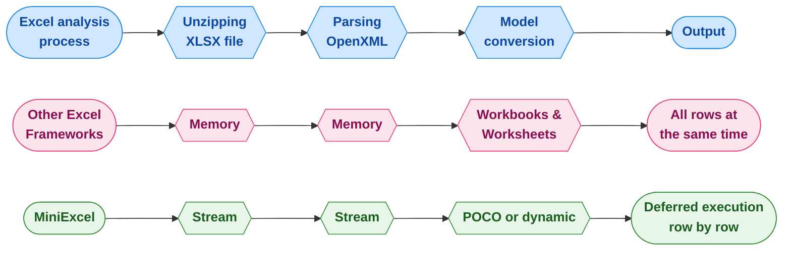

<div align="center">
<p><a href="https://www.nuget.org/packages/MiniExcel"></a>  <a href="https://www.nuget.org/packages/MiniExcel"></a>
<a href="https://ci.appveyor.com/project/mini-software/miniexcel/branch/master"></a>
<a href="https://gitee.com/dotnetchina/MiniExcel"></a> <a href="https://github.com/mini-software/MiniExcel" rel="nofollow"></a>
<a href="https://www.nuget.org/packages/MiniExcel"></a>
<a href="https://deepwiki.com/mini-software/MiniExcel"></a>
</p>
</div>

---

[](https://www.dotnetfoundation.org/)

<div align="center">
<p>โปรเจ็กต์นี้เป็นส่วนหนึ่งของ <a href="https://www.dotnetfoundation.org/">.NET Foundation</a> และดำเนินงานภายใต้ <a href="https://www.dotnetfoundation.org/code-of-conduct">จรรยาบรรณ</a> ของพวกเขา </p>
</div>

---

<div align="center">
<p><strong><a href="README.md">English</a> | <a href="README.zh-CN.md">简体中文</a> | <a href="https://openaitx.github.io/view.html?user=mini-software&amp;project=MiniExcel&amp;lang=zh-TW">繁體中文</a> | <a href="https://openaitx.github.io/view.html?user=mini-software&amp;project=MiniExcel&amp;lang=ja">日本語</a> | <a href="https://openaitx.github.io/view.html?user=mini-software&amp;project=MiniExcel&amp;lang=ko">한국어</a> | <a href="https://openaitx.github.io/view.html?user=mini-software&amp;project=MiniExcel&amp;lang=hi">हिन्दी</a> | <a href="https://openaitx.github.io/view.html?user=mini-software&amp;project=MiniExcel&amp;lang=th">ไทย</a> | <a href="https://openaitx.github.io/view.html?user=mini-software&amp;project=MiniExcel&amp;lang=fr">Français</a> | <a href="https://openaitx.github.io/view.html?user=mini-software&amp;project=MiniExcel&amp;lang=de">Deutsch</a> | <a href="https://openaitx.github.io/view.html?user=mini-software&amp;project=MiniExcel&amp;lang=es">Español</a> | <a href="https://openaitx.github.io/view.html?user=mini-software&amp;project=MiniExcel&amp;lang=it">Italiano</a> | <a href="https://openaitx.github.io/view.html?user=mini-software&amp;project=MiniExcel&amp;lang=ru">Русский</a> | <a href="https://openaitx.github.io/view.html?user=mini-software&amp;project=MiniExcel&amp;lang=pt">Português</a> | <a href="https://openaitx.github.io/view.html?user=mini-software&amp;project=MiniExcel&amp;lang=nl">Nederlands</a> | <a href="https://openaitx.github.io/view.html?user=mini-software&amp;project=MiniExcel&amp;lang=pl">Polski</a> | <a href="https://openaitx.github.io/view.html?user=mini-software&amp;project=MiniExcel&amp;lang=ar">العربية</a> | <a href="https://openaitx.github.io/view.html?user=mini-software&amp;project=MiniExcel&amp;lang=fa">فارسی</a> | <a href="https://openaitx.github.io/view.html?user=mini-software&amp;project=MiniExcel&amp;lang=tr">Türkçe</a> | <a href="https://openaitx.github.io/view.html?user=mini-software&amp;project=MiniExcel&amp;lang=vi">Tiếng Việt</a> | <a href="https://openaitx.github.io/view.html?user=mini-software&amp;project=MiniExcel&amp;lang=id">Bahasa Indonesia</a><p></p>
</strong></p>
</div>


---

<div align="center">
 การให้<a href="https://github.com/mini-software/MiniExcel">ดาว</a> หรือ <a href="https://miniexcel.github.io">บริจาค</a>ของคุณสามารถทำให้ MiniExcel ดียิ่งขึ้น
</div>

---

### บทนำ

MiniExcel เป็นเครื่องมือจัดการ Excel ที่เรียบง่ายและมีประสิทธิภาพสำหรับ .NET โดยออกแบบมาเพื่อลดการใช้หน่วยความจำให้เหลือน้อยที่สุด

ปัจจุบัน เฟรมเวิร์กยอดนิยมส่วนใหญ่ต้องโหลดข้อมูลทั้งหมดจากเอกสาร Excel เข้าสู่หน่วยความจำเพื่อให้ง่ายต่อการดำเนินการ แต่สิ่งนี้อาจทำให้เกิดปัญหาการใช้หน่วยความจำสูง วิธีการของ MiniExcel แตกต่างออกไป: ข้อมูลจะถูกประมวลผลทีละแถวในรูปแบบสตรีมมิ่ง ลดการใช้หน่วยความจำจากเดิมที่อาจสูงถึงหลักร้อยเมกะไบต์ให้เหลือเพียงไม่กี่เมกะไบต์ และช่วยป้องกันปัญหาหน่วยความจำไม่พอ (OOM) ได้อย่างมีประสิทธิภาพ



### คุณสมบัติ

- ลดการใช้หน่วยความจำ ป้องกันข้อผิดพลาดหน่วยความจำหมด (OOM) และหลีกเลี่ยงการเก็บขยะ (garbage collection) เต็มรูปแบบ
- รองรับการดำเนินการข้อมูลระดับแถวแบบเรียลไทม์ เพื่อประสิทธิภาพที่ดีกว่าในชุดข้อมูลขนาดใหญ่
- รองรับ LINQ ด้วยการดำเนินการแบบเลื่อนเวลา (deferred execution) ทำให้สามารถแบ่งหน้าและคิวรีที่ซับซ้อนได้อย่างรวดเร็วและใช้หน่วยความจำน้อย
- น้ำหนักเบา ไม่ต้องใช้ Microsoft Office หรือคอมโพเนนต์ COM+ และไฟล์ DLL มีขนาดไม่เกิน 500KB
- API ใช้งานง่ายและเข้าใจได้สะดวกสำหรับการอ่าน/เขียน/เติมข้อมูล excel

### เวอร์ชัน 2.0 พรีวิว

เรากำลังพัฒนา MiniExcel เวอร์ชันใหม่ โดยมี API ที่แยกโมดูลและโฟกัสมากขึ้น, 
มีแพ็กเกจ NuGet แยกสำหรับ Core และฟังก์ชัน Csv, รองรับการสตรีมคิวรีแบบอะซิงโครนัสเต็มรูปแบบผ่าน `IAsyncEnumerable`,
และฟีเจอร์อื่น ๆ อีกมากมายที่กำลังจะตามมา! แพ็กเกจเหล่านี้จะมีให้ใช้งานในสถานะ pre-release คุณสามารถทดลองใช้และให้ข้อเสนอแนะกับเราได้!

หากคุณสนใจ กรุณาตรวจสอบ [เอกสารใหม่](https://raw.githubusercontent.com/mini-software/MiniExcel/master/README-V2.md) และ [บันทึกการอัปเกรด](https://raw.githubusercontent.com/mini-software/MiniExcel/master/V2-Upgrade-Notes.md) ด้วยเช่นกัน


### เริ่มต้นใช้งาน

- [นำเข้า/คิวรี Excel](#getstart1)

- [ส่งออก/สร้าง Excel](#getstart2)

- [เทมเพลต Excel](#getstart3)

- [ชื่อคอลัมน์/ดัชนี/แอตทริบิวต์ Ignore ใน Excel](#getstart4)

- [ตัวอย่าง](#getstart5)


### การติดตั้ง

คุณสามารถติดตั้งแพ็กเกจ [จาก NuGet](https://www.nuget.org/packages/MiniExcel)

### หมายเหตุการอัปเดตเวอร์ชัน

กรุณาตรวจสอบ [Release Notes](docs)

### สิ่งที่ต้องทำ

โปรดตรวจสอบ [TODO](https://github.com/mini-software/MiniExcel/projects/1?fullscreen=true)

### ประสิทธิภาพ

โค้ดสำหรับการทดสอบประสิทธิภาพสามารถดูได้ที่ [MiniExcel.Benchmarks](https://raw.githubusercontent.com/mini-software/MiniExcel/master/benchmarks/MiniExcel.Benchmarks/Program.cs)

ไฟล์ที่ใช้ในการทดสอบประสิทธิภาพคือ [**Test1,000,000x10.xlsx**](https://raw.githubusercontent.com/mini-software/MiniExcel/master/benchmarks/MiniExcel.Benchmarks/Test1%2C000%2C000x10.xlsx) ซึ่งเป็นเอกสารขนาด 32MB ที่มี 1,000,000 แถว * 10 คอลัมน์ โดยแต่ละเซลล์จะถูกเติมด้วยสตริง "HelloWorld"

เพื่อเรียกใช้งานการทดสอบประสิทธิภาพทั้งหมด ให้ใช้:

```bash
dotnet run -project .\benchmarks\MiniExcel.Benchmarks -c Release -f net9.0 -filter * --join
```
คุณสามารถดูผลลัพธ์ของการทดสอบประสิทธิภาพสำหรับรุ่นล่าสุดได้ [ที่นี่](benchmarks/results)

### การดึงข้อมูล/นำเข้า Excel  <a name="getstart1"></a>

#### 1. รันคำสั่ง query และแมปผลลัพธ์ไปยัง IEnumerable ที่มีชนิดข้อมูลแบบเจาะจง [[ลองใช้ดู]](https://dotnetfiddle.net/w5WD1J)

แนะนำให้ใช้ Stream.Query เนื่องจากมีประสิทธิภาพที่ดีกว่า


```csharp
public class UserAccount
{
    public Guid ID { get; set; }
    public string Name { get; set; }
    public DateTime BoD { get; set; }
    public int Age { get; set; }
    public bool VIP { get; set; }
    public decimal Points { get; set; }
}

var rows = MiniExcel.Query<UserAccount>(path);

// or

using (var stream = File.OpenRead(path))
    var rows = stream.Query<UserAccount>();
```


#### 2. รันคำสั่งค้นหาและแมปผลลัพธ์ไปยังลิสต์ของอ็อบเจกต์แบบไดนามิกโดยไม่ใช้ head [[ลองเลย]](https://dotnetfiddle.net/w5WD1J)

* คีย์ไดนามิกคือ `A.B.C.D..`

| MiniExcel | 1 |
|-----------|---|
| Github    | 2 |


```csharp

var rows = MiniExcel.Query(path).ToList();

// or
using (var stream = File.OpenRead(path))
{
    var rows = stream.Query().ToList();

    Assert.Equal("MiniExcel", rows[0].A);
    Assert.Equal(1, rows[0].B);
    Assert.Equal("Github", rows[1].A);
    Assert.Equal(2, rows[1].B);
}
```
#### 3. รันคำสั่งค้นหาพร้อมแถวหัวข้อแรก [[ลองใช้งาน]](https://dotnetfiddle.net/w5WD1J)

หมายเหตุ : ถ้าชื่อคอลัมน์ซ้ำกัน จะใช้ชื่อด้านขวาสุด

ไฟล์ Excel ตัวอย่าง :

| Column1   | Column2 |
|-----------|---------|
| MiniExcel | 1       |
| Github    | 2       |


```csharp

var rows = MiniExcel.Query(useHeaderRow:true).ToList();

// or

using (var stream = File.OpenRead(path))
{
    var rows = stream.Query(useHeaderRow:true).ToList();

    Assert.Equal("MiniExcel", rows[0].Column1);
    Assert.Equal(1, rows[0].Column2);
    Assert.Equal("Github", rows[1].Column1);
    Assert.Equal(2, rows[1].Column2);
}
```
#### 4. รองรับการสืบค้นด้วย LINQ Extension เช่น First/Take/Skip ...ฯลฯ

สืบค้นรายการแรก

```csharp
var row = MiniExcel.Query(path).First();
Assert.Equal("HelloWorld", row.A);

// or

using (var stream = File.OpenRead(path))
{
    var row = stream.Query().First();
    Assert.Equal("HelloWorld", row.A);
}
```
ประสิทธิภาพระหว่าง MiniExcel/ExcelDataReader/ClosedXML/EPPlus


#### 5. สืบค้นโดยชื่อชีต


```csharp
MiniExcel.Query(path, sheetName: "SheetName");
//or
stream.Query(sheetName: "SheetName");
```
#### 6. คิวรีชื่อชีตและแถวทั้งหมด


```csharp
var sheetNames = MiniExcel.GetSheetNames(path);
foreach (var sheetName in sheetNames)
{
    var rows = MiniExcel.Query(path, sheetName: sheetName);
}
```
#### 7. รับคอลัมน์


```csharp
var columns = MiniExcel.GetColumns(path); // e.g result : ["A","B"...]

var cnt = columns.Count;  // get column count
```
#### 8. การคิวรีแบบไดนามิกแปลงแถวเป็น `IDictionary<string,object>`


```csharp
foreach(IDictionary<string,object> row in MiniExcel.Query(path))
{
    //..
}

// or
var rows = MiniExcel.Query(path).Cast<IDictionary<string,object>>();
// or Query specified ranges (capitalized)
// A2 represents the second row of column A, C3 represents the third row of column C
// If you don't want to restrict rows, just don't include numbers
var rows = MiniExcel.QueryRange(path, startCell: "A2", endCell: "C3").Cast<IDictionary<string, object>>();
```


#### 9. การใช้ Query Excel เพื่อคืนค่า DataTable

ไม่แนะนำ เนื่องจาก DataTable จะโหลดข้อมูลทั้งหมดเข้าสู่หน่วยความจำและทำให้สูญเสียคุณสมบัติการใช้หน่วยความจำต่ำของ MiniExcel


```C#
var table = MiniExcel.QueryAsDataTable(path, useHeaderRow: true);
```


#### 10. ระบุเซลล์ที่จะเริ่มต้นอ่านข้อมูล


```csharp
MiniExcel.Query(path,useHeaderRow:true,startCell:"B3")
```


#### 11. เติมค่าลงในเซลล์ที่ถูกรวม

หมายเหตุ: ประสิทธิภาพจะช้ากว่าการ `ไม่ใช้การเติมค่าลงในเซลล์ที่ถูกรวม`

เหตุผล: มาตรฐาน OpenXml จะวาง mergeCells ไว้ที่ส่วนล่างของไฟล์ ทำให้จำเป็นต้องวนลูป foreach sheetxml สองรอบ


```csharp
    var config = new OpenXmlConfiguration()
    {
        FillMergedCells = true
    };
    var rows = MiniExcel.Query(path, configuration: config);
```


รองรับการเติมข้อมูลหลายแถวและหลายคอลัมน์ที่มีความยาวและความกว้างแบบแปรผัน


#### 12. การอ่านไฟล์ขนาดใหญ่โดยใช้แคชบนดิสก์ (Disk-Base Cache - SharedString)

หากขนาดของ SharedStrings เกิน 5 MB MiniExcel โดยค่าเริ่มต้นจะใช้แคชบนดิสก์ภายในเครื่อง เช่น [10x100000.xlsx](https://github.com/MiniExcel/MiniExcel/files/8403819/NotDuplicateSharedStrings_10x100000.xlsx) (ข้อมูลหนึ่งล้านแถว) เมื่อปิดการใช้แคชบนดิสก์จะใช้หน่วยความจำสูงสุด 195MB แต่เมื่อเปิดแคชบนดิสก์จะใช้เพียง 65MB โปรดทราบว่าการเพิ่มประสิทธิภาพนี้จะมีค่าใช้จ่ายด้านประสิทธิภาพ ดังนั้นกรณีนี้จะทำให้เวลาอ่านเพิ่มจาก 7.4 วินาทีเป็น 27.2 วินาที หากคุณไม่ต้องการใช้งานนี้สามารถปิดแคชบนดิสก์ได้ด้วยโค้ดดังต่อไปนี้:


```csharp
var config = new OpenXmlConfiguration { EnableSharedStringCache = false };
MiniExcel.Query(path,configuration: config)
```
คุณสามารถใช้ `SharedStringCacheSize` เพื่อเปลี่ยนขนาดไฟล์ sharedString ให้เกินขนาดที่กำหนดสำหรับการแคชลงดิสก์

```csharp
var config = new OpenXmlConfiguration { SharedStringCacheSize=500*1024*1024 };
MiniExcel.Query(path, configuration: config);
```


### สร้าง/ส่งออก Excel  <a name="getstart2"></a>

1. ต้องเป็นชนิดที่ไม่ใช่ abstract และมี constructor สาธารณะที่ไม่มีพารามิเตอร์

2. MiniExcel รองรับ IEnumerable Deferred Execution หากคุณต้องการใช้หน่วยความจำน้อยที่สุด กรุณาอย่าเรียกใช้เมธอด เช่น ToList

ตัวอย่าง : ToList หรือไม่ใช้หน่วยความจำ


#### 1. Anonymous หรือ strongly type [[ลองใช้งาน]](https://dotnetfiddle.net/w5WD1J)


```csharp
var path = Path.Combine(Path.GetTempPath(), $"{Guid.NewGuid()}.xlsx");
MiniExcel.SaveAs(path, new[] {
    new { Column1 = "MiniExcel", Column2 = 1 },
    new { Column1 = "Github", Column2 = 2}
});
```
#### 2. `IEnumerable<IDictionary<string, object>>`


```csharp
var values = new List<Dictionary<string, object>>()
{
    new Dictionary<string,object>{{ "Column1", "MiniExcel" }, { "Column2", 1 } },
    new Dictionary<string,object>{{ "Column1", "Github" }, { "Column2", 2 } }
};
MiniExcel.SaveAs(path, values);
```
สร้างผลลัพธ์ไฟล์ :

| คอลัมน์1    | คอลัมน์2 |
|-------------|-----------|
| MiniExcel   | 1         |
| Github      | 2         |


#### 3.  IDataReader
- `แนะนำ`, สามารถหลีกเลี่ยงการโหลดข้อมูลทั้งหมดเข้าสู่หน่วยความจำ

```csharp
MiniExcel.SaveAs(path, reader);
```


DataReader ส่งออกหลายชีต (แนะนำโดย Dapper ExecuteReader)


```csharp
using (var cnn = Connection)
{
    cnn.Open();
    var sheets = new Dictionary<string,object>();
    sheets.Add("sheet1", cnn.ExecuteReader("select 1 id"));
    sheets.Add("sheet2", cnn.ExecuteReader("select 2 id"));
    MiniExcel.SaveAs("Demo.xlsx", sheets);
}
```


#### 4. Datatable

- `ไม่แนะนำ` เนื่องจากจะโหลดข้อมูลทั้งหมดเข้าหน่วยความจำ

- DataTable ใช้ Caption เป็นชื่อคอลัมน์ก่อน จากนั้นจึงใช้ columname


```csharp
var path = Path.Combine(Path.GetTempPath(), $"{Guid.NewGuid()}.xlsx");
var table = new DataTable();
{
    table.Columns.Add("Column1", typeof(string));
    table.Columns.Add("Column2", typeof(decimal));
    table.Rows.Add("MiniExcel", 1);
    table.Rows.Add("Github", 2);
}

MiniExcel.SaveAs(path, table);
```
####  5. Dapper Query

ขอบคุณ @shaofing #552 กรุณาใช้ `CommandDefinition + CommandFlags.NoCache`


```csharp
using (var connection = GetConnection(connectionString))
{
    var rows = connection.Query(
        new CommandDefinition(
            @"select 'MiniExcel' as Column1,1 as Column2 union all select 'Github',2"
            , flags: CommandFlags.NoCache)
        );
    // Note: QueryAsync will throw close connection exception
    MiniExcel.SaveAs(path, rows);
}
```
โค้ดด้านล่างนี้จะโหลดข้อมูลทั้งหมดเข้าไปในหน่วยความจำ


```csharp
using (var connection = GetConnection(connectionString))
{
    var rows = connection.Query(@"select 'MiniExcel' as Column1,1 as Column2 union all select 'Github',2");
    MiniExcel.SaveAs(path, rows);
}
```
#### 6. SaveAs ไปยัง MemoryStream  [[ลองใช้งาน]](https://dotnetfiddle.net/JOen0e)


```csharp
using (var stream = new MemoryStream()) //support FileStream,MemoryStream ect.
{
    stream.SaveAs(values);
}
```
ตัวอย่าง: API สำหรับส่งออก Excel


```csharp
public IActionResult DownloadExcel()
{
    var values = new[] {
        new { Column1 = "MiniExcel", Column2 = 1 },
        new { Column1 = "Github", Column2 = 2}
    };

    var memoryStream = new MemoryStream();
    memoryStream.SaveAs(values);
    memoryStream.Seek(0, SeekOrigin.Begin);
    return new FileStreamResult(memoryStream, "application/vnd.openxmlformats-officedocument.spreadsheetml.sheet")
    {
        FileDownloadName = "demo.xlsx"
    };
}
```
#### 7. สร้างชีทหลายแผ่น


```csharp
// 1. Dictionary<string,object>
var users = new[] { new { Name = "Jack", Age = 25 }, new { Name = "Mike", Age = 44 } };
var department = new[] { new { ID = "01", Name = "HR" }, new { ID = "02", Name = "IT" } };
var sheets = new Dictionary<string, object>
{
    ["users"] = users,
    ["department"] = department
};
MiniExcel.SaveAs(path, sheets);

// 2. DataSet
var sheets = new DataSet();
sheets.Add(UsersDataTable);
sheets.Add(DepartmentDataTable);
//..
MiniExcel.SaveAs(path, sheets);
```


#### 8. ตัวเลือก TableStyles

สไตล์เริ่มต้น


โดยไม่มีการกำหนดค่าสไตล์


```csharp
var config = new OpenXmlConfiguration()
{
     TableStyles = TableStyles.None
};
MiniExcel.SaveAs(path, value,configuration:config);
```


#### 9. AutoFilter

ตั้งแต่ v0.19.0  `OpenXmlConfiguration.AutoFilter` สามารถเปิด/ปิดใช้งาน AutoFilter ได้ โดยค่าเริ่มต้นคือ `true` และวิธีการตั้งค่า AutoFilter มีดังนี้:


```csharp
MiniExcel.SaveAs(path, value, configuration: new OpenXmlConfiguration() { AutoFilter = false });
```


#### 10. สร้างภาพ


```csharp
var value = new[] {
    new { Name="github",Image=File.ReadAllBytes(PathHelper.GetFile("images/github_logo.png"))},
    new { Name="google",Image=File.ReadAllBytes(PathHelper.GetFile("images/google_logo.png"))},
    new { Name="microsoft",Image=File.ReadAllBytes(PathHelper.GetFile("images/microsoft_logo.png"))},
    new { Name="reddit",Image=File.ReadAllBytes(PathHelper.GetFile("images/reddit_logo.png"))},
    new { Name="statck_overflow",Image=File.ReadAllBytes(PathHelper.GetFile("images/statck_overflow_logo.png"))},
};
MiniExcel.SaveAs(path, value);
```


#### 11. การส่งออกไฟล์เป็น Byte Array

ตั้งแต่เวอร์ชัน 1.22.0 เมื่อชนิดข้อมูลเป็น `byte[]` ระบบจะบันทึกเส้นทางไฟล์ในเซลล์โดยอัตโนมัติ และเมื่อทำการนำเข้า ระบบจะสามารถแปลงกลับเป็น `byte[]` ได้ และหากคุณไม่ต้องการใช้ฟีเจอร์นี้ คุณสามารถตั้งค่า `OpenXmlConfiguration.EnableConvertByteArray` เป็น `false` เพื่อปรับปรุงประสิทธิภาพของระบบ


ตั้งแต่เวอร์ชัน 1.22.0 เมื่อชนิดข้อมูลเป็น `byte[]` ระบบจะบันทึกเส้นทางไฟล์ในเซลล์โดยอัตโนมัติ และเมื่อทำการนำเข้า ระบบจะสามารถแปลงกลับเป็น `byte[]` ได้ และหากคุณไม่ต้องการใช้ฟีเจอร์นี้ คุณสามารถตั้งค่า `OpenXmlConfiguration.EnableConvertByteArray` เป็น `false` เพื่อปรับปรุงประสิทธิภาพของระบบ


#### 12. การรวมเซลล์เดียวกันในแนวตั้ง

ฟังก์ชันนี้รองรับเฉพาะในรูปแบบ `xlsx` และจะรวมเซลล์ในแนวตั้งระหว่างแท็ก @merge และ @endmerge
คุณสามารถใช้ @mergelimit เพื่อจำกัดขอบเขตของการรวมเซลล์ในแนวตั้ง


```csharp
var mergedFilePath = Path.Combine(Path.GetTempPath(), $"{Guid.NewGuid().ToString()}.xlsx");

var path = @"../../../../../samples/xlsx/TestMergeWithTag.xlsx";

MiniExcel.MergeSameCells(mergedFilePath, path);
```


```csharp
var memoryStream = new MemoryStream();

var path = @"../../../../../samples/xlsx/TestMergeWithTag.xlsx";

memoryStream.MergeSameCells(path);
```
เนื้อหาของไฟล์ก่อนและหลังการรวมเซลล์:

โดยไม่มีขีดจำกัดการรวมเซลล์:


โดยมีขีดจำกัดการรวมเซลล์:


#### 13. ข้ามค่าที่เป็น null

ตัวเลือกใหม่ที่ชัดเจนสำหรับการเขียนเซลล์ว่างเมื่อค่ามีค่าเป็น null:


```csharp
DataTable dt = new DataTable();

/* ... */

DataRow dr = dt.NewRow();

dr["Name1"] = "Somebody once";
dr["Name2"] = null;
dr["Name3"] = "told me.";

dt.Rows.Add(dr);

OpenXmlConfiguration configuration = new OpenXmlConfiguration()
{
     EnableWriteNullValueCell = true // Default value.
};

MiniExcel.SaveAs(@"C:\temp\Book1.xlsx", dt, configuration: configuration);
```


```xml
<x:row r="2">
    <x:c r="A2" t ="str" s="2">
        <x:v>Somebody once</x:v>
    </x:c>
    <x:c r="B2" s="2"></x:c>
    <x:c r="C2" t ="str" s="2">
        <x:v>told me.</x:v>
    </x:c>
</x:row>
```


พฤติกรรมก่อนหน้านี้:


```csharp
/* ... */

OpenXmlConfiguration configuration = new OpenXmlConfiguration()
{
     EnableWriteNullValueCell = false // Default value is true.
};

MiniExcel.SaveAs(@"C:\temp\Book1.xlsx", dt, configuration: configuration);
```


```xml
<x:row r="2">
    <x:c r="A2" t ="str" s="2">
        <x:v>Somebody once</x:v>
    </x:c>
    <x:c r="B2" t ="str" s="2">
        <x:v></x:v>
    </x:c>
    <x:c r="C2" t ="str" s="2">
        <x:v>told me.</x:v>
    </x:c>
</x:row>
```
ใช้งานได้กับค่า null และ DBNull

#### 14. แช่ค้างบานหน้าต่าง

```csharp
/* ... */

OpenXmlConfiguration configuration = new OpenXmlConfiguration()
{
    FreezeRowCount = 1,     // default is 1
    FreezeColumnCount = 2   // default is 0
};

MiniExcel.SaveAs(@"C:\temp\Book1.xlsx", dt, configuration: configuration);
```


### เติมข้อมูลลงในเทมเพลต Excel <a name="getstart3"></a>

- การประกาศตัวแปรคล้ายกับเทมเพลตของ Vue เช่น `{{ชื่อ ตัวแปร}}` หรือการแสดงผลแบบคอลเลกชัน `{{ชื่อคอลเลกชัน.ชื่อฟิลด์}}`
- การแสดงผลแบบคอลเลกชันรองรับ IEnumerable/DataTable/DapperRow

#### 1. การเติมข้อมูลพื้นฐาน

เทมเพลต:


ผลลัพธ์:


โค้ด:

```csharp
// 1. By POCO
var value = new
{
    Name = "Jack",
    CreateDate = new DateTime(2021, 01, 01),
    VIP = true,
    Points = 123
};
MiniExcel.SaveAsByTemplate(path, templatePath, value);


// 2. By Dictionary
var value = new Dictionary<string, object>()
{
    ["Name"] = "Jack",
    ["CreateDate"] = new DateTime(2021, 01, 01),
    ["VIP"] = true,
    ["Points"] = 123
};
MiniExcel.SaveAsByTemplate(path, templatePath, value);
```
#### 2. การเติมข้อมูลแบบ IEnumerable

> หมายเหตุ1: ใช้ IEnumerable แรกของคอลัมน์เดียวกันเป็นพื้นฐานในการเติมรายการ

เทมเพลต:


ผลลัพธ์:


โค้ด:


```csharp
//1. By POCO
var value = new
{
    employees = new[] {
        new {name="Jack",department="HR"},
        new {name="Lisa",department="HR"},
        new {name="John",department="HR"},
        new {name="Mike",department="IT"},
        new {name="Neo",department="IT"},
        new {name="Loan",department="IT"}
    }
};
MiniExcel.SaveAsByTemplate(path, templatePath, value);

//2. By Dictionary
var value = new Dictionary<string, object>()
{
    ["employees"] = new[] {
        new {name="Jack",department="HR"},
        new {name="Lisa",department="HR"},
        new {name="John",department="HR"},
        new {name="Mike",department="IT"},
        new {name="Neo",department="IT"},
        new {name="Loan",department="IT"}
    }
};
MiniExcel.SaveAsByTemplate(path, templatePath, value);
```
#### 3. การเติมข้อมูลที่ซับซ้อน

> หมายเหตุ: รองรับหลายชีทและการใช้ตัวแปรเดียวกัน

เทมเพลต:


ผลลัพธ์:


```csharp
// 1. By POCO
var value = new
{
    title = "FooCompany",
    managers = new[] {
        new {name="Jack",department="HR"},
        new {name="Loan",department="IT"}
    },
    employees = new[] {
        new {name="Wade",department="HR"},
        new {name="Felix",department="HR"},
        new {name="Eric",department="IT"},
        new {name="Keaton",department="IT"}
    }
};
MiniExcel.SaveAsByTemplate(path, templatePath, value);

// 2. By Dictionary
var value = new Dictionary<string, object>()
{
    ["title"] = "FooCompany",
    ["managers"] = new[] {
        new {name="Jack",department="HR"},
        new {name="Loan",department="IT"}
    },
    ["employees"] = new[] {
        new {name="Wade",department="HR"},
        new {name="Felix",department="HR"},
        new {name="Eric",department="IT"},
        new {name="Keaton",department="IT"}
    }
};
MiniExcel.SaveAsByTemplate(path, templatePath, value);
```
#### 4. ประสิทธิภาพการเติมข้อมูล Big Data

> หมายเหตุ: การใช้ IEnumerable ที่มี deferred execution แทนการใช้ ToList สามารถประหยัดการใช้หน่วยความจำสูงสุดใน MiniExcel


#### 5. การจับคู่อัตโนมัติชนิดข้อมูลของค่าเซลล์

แม่แบบ


ผลลัพธ์


คลาส


```csharp
public class Poco
{
    public string @string { get; set; }
    public int? @int { get; set; }
    public decimal? @decimal { get; set; }
    public double? @double { get; set; }
    public DateTime? datetime { get; set; }
    public bool? @bool { get; set; }
    public Guid? Guid { get; set; }
}
```


โค้ด


```csharp
var poco = new TestIEnumerableTypePoco { @string = "string", @int = 123, @decimal = decimal.Parse("123.45"), @double = (double)123.33, @datetime = new DateTime(2021, 4, 1), @bool = true, @Guid = Guid.NewGuid() };
var value = new
{
    Ts = new[] {
        poco,
        new TestIEnumerableTypePoco{},
        null,
        poco
    }
};
MiniExcel.SaveAsByTemplate(path, templatePath, value);
```
#### 6. ตัวอย่าง : แสดงรายการโปรเจ็กต์ Github

แม่แบบ


ผลลัพธ์


โค้ด


```csharp
var projects = new[]
{
    new {Name = "MiniExcel",Link="https://github.com/mini-software/MiniExcel",Star=146, CreateTime=new DateTime(2021,03,01)},
    new {Name = "HtmlTableHelper",Link="https://github.com/mini-software/HtmlTableHelper",Star=16, CreateTime=new DateTime(2020,02,01)},
    new {Name = "PocoClassGenerator",Link="https://github.com/mini-software/PocoClassGenerator",Star=16, CreateTime=new DateTime(2019,03,17)}
};
var value = new
{
    User = "ITWeiHan",
    Projects = projects,
    TotalStar = projects.Sum(s => s.Star)
};
MiniExcel.SaveAsByTemplate(path, templatePath, value);
```
#### 7. การเติมข้อมูลแบบกลุ่ม


```csharp
var value = new Dictionary<string, object>()
{
    ["employees"] = new[] {
        new {name="Jack",department="HR"},
        new {name="Jack",department="HR"},
        new {name="John",department="HR"},
        new {name="John",department="IT"},
        new {name="Neo",department="IT"},
        new {name="Loan",department="IT"}
    }
};
await MiniExcel.SaveAsByTemplateAsync(path, templatePath, value);
```
##### 1. มีแท็ก `@group` และมีแท็ก `@header`

ก่อน


หลัง


##### 2. มีแท็ก @group แต่ไม่มีแท็ก @header

ก่อน


หลัง


##### 3. ไม่มีแท็ก @group

ก่อน


หลัง


#### 8. คำสั่ง If/ElseIf/Else ภายในเซลล์

กฎ:
1. รองรับ DateTime, Double, Int ด้วยตัวดำเนินการ ==, !=, >, >=, <, <=
2. รองรับ String ด้วยตัวดำเนินการ ==, !=
3. แต่ละคำสั่งควรขึ้นบรรทัดใหม่
4. ควรเว้นวรรค 1 ช่องหน้าหลังตัวดำเนินการ
5. ไม่ควรมีการขึ้นบรรทัดใหม่ภายในคำสั่ง
6. เซลล์ควรอยู่ในรูปแบบเดียวกับตัวอย่างด้านล่าง

```csharp
@if(name == Jack)
{{employees.name}}
@elseif(name == Neo)
Test {{employees.name}}
@else
{{employees.department}}
@endif
```
ก่อน


หลัง


#### 9. DataTable เป็นพารามิเตอร์


```csharp
var managers = new DataTable();
{
    managers.Columns.Add("name");
    managers.Columns.Add("department");
    managers.Rows.Add("Jack", "HR");
    managers.Rows.Add("Loan", "IT");
}
var value = new Dictionary<string, object>()
{
    ["title"] = "FooCompany",
    ["managers"] = managers,
};
MiniExcel.SaveAsByTemplate(path, templatePath, value);
```
#### 10. สูตรคำนวณ

##### 1. ตัวอย่าง
เติม `$` หน้าสูตรของคุณและใช้ `$enumrowstart` กับ `$enumrowend` เพื่อกำหนดจุดเริ่มต้นและจุดสิ้นสุดของแถวที่วนซ้ำ:


เมื่อมีการเรนเดอร์เทมเพลต ตัวคำนำหน้า `$` จะถูกลบออก และ `$enumrowstart` กับ `$enumrowend` จะถูกแทนที่ด้วยเลขแถวเริ่มต้นและสิ้นสุดของรายการที่วนซ้ำ:


##### 2. ตัวอย่างสูตรอื่น ๆ:

|              |                                                                                           |
|--------------|-------------------------------------------------------------------------------------------|
| ผลรวม        | `$=SUM(C{{$enumrowstart}}:C{{$enumrowend}})`                                              |
| ค่าเฉลี่ยทางเลือก | `$=SUM(C{{$enumrowstart}}:C{{$enumrowend}}) / COUNT(C{{$enumrowstart}}:C{{$enumrowend}})` |
| ช่วง         | `$=MAX(C{{$enumrowstart}}:C{{$enumrowend}}) - MIN(C{{$enumrowstart}}:C{{$enumrowend}})`   |


#### 11. อื่น ๆ

##### 1. การตรวจสอบคีย์พารามิเตอร์ของเทมเพลต

ตั้งแต่ V1.24.0 ระบบจะละเว้นคีย์พารามิเตอร์ที่หายไปของเทมเพลตโดยอัตโนมัติและแทนที่ด้วยสตริงว่าง คุณสามารถใช้ `IgnoreTemplateParameterMissing` เพื่อควบคุมว่าจะให้ระบบแจ้งข้อผิดพลาดหรือไม่

```csharp
var config = new OpenXmlConfiguration()
{
    IgnoreTemplateParameterMissing = false,
};
MiniExcel.SaveAsByTemplate(path, templatePath, value, config)
```


### ชื่อคอลัมน์/ดัชนีคอลัมน์/Attribute การละเว้นใน Excel <a name="getstart4"></a>


#### 1. ระบุชื่อคอลัมน์, ดัชนีคอลัมน์, ละเว้นคอลัมน์

ตัวอย่าง Excel


โค้ด


```csharp
public class ExcelAttributeDemo
{
    [ExcelColumnName("Column1")]
    public string Test1 { get; set; }
    [ExcelColumnName("Column2")]
    public string Test2 { get; set; }
    [ExcelIgnore]
    public string Test3 { get; set; }
    [ExcelColumnIndex("I")] // system will convert "I" to 8 index
    public string Test4 { get; set; }
    public string Test5 { get; } //wihout set will ignore
    public string Test6 { get; private set; } //un-public set will ignore
    [ExcelColumnIndex(3)] // start with 0
    public string Test7 { get; set; }
}

var rows = MiniExcel.Query<ExcelAttributeDemo>(path).ToList();
Assert.Equal("Column1", rows[0].Test1);
Assert.Equal("Column2", rows[0].Test2);
Assert.Null(rows[0].Test3);
Assert.Equal("Test7", rows[0].Test4);
Assert.Null(rows[0].Test5);
Assert.Null(rows[0].Test6);
Assert.Equal("Test4", rows[0].Test7);
```


#### 2. รูปแบบกำหนดเอง (ExcelFormatAttribute)

ตั้งแต่เวอร์ชัน V0.21.0 รองรับคลาสที่มีเมธอด `ToString(string content)` สำหรับการจัดรูปแบบ

คลาส


```csharp
public class Dto
{
    public string Name { get; set; }

    [ExcelFormat("MMMM dd, yyyy")]
    public DateTime InDate { get; set; }
}
```


โค้ด


```csharp
var value = new Dto[] {
    new Issue241Dto{ Name="Jack",InDate=new DateTime(2021,01,04)},
    new Issue241Dto{ Name="Henry",InDate=new DateTime(2020,04,05)},
};
MiniExcel.SaveAs(path, value);
```
ผลลัพธ์


คิวรีรองรับการแปลงรูปแบบที่กำหนดเอง


#### 3. กำหนดความกว้างของคอลัมน์ (ExcelColumnWidthAttribute)


```csharp
public class Dto
{
    [ExcelColumnWidth(20)]
    public int ID { get; set; }
    [ExcelColumnWidth(15.50)]
    public string Name { get; set; }
}
```
#### 4. การแมปชื่อคอลัมน์หลายชื่อไปยังพร็อพเพอร์ตี้เดียวกัน


```csharp
public class Dto
{
    [ExcelColumnName(excelColumnName:"EmployeeNo",aliases:new[] { "EmpNo","No" })]
    public string Empno { get; set; }
    public string Name { get; set; }
}
```


#### 5. System.ComponentModel.DisplayNameAttribute = ExcelColumnName.excelColumnNameAttribute

ตั้งแต่เวอร์ชัน 1.24.0 ระบบรองรับ System.ComponentModel.DisplayNameAttribute = ExcelColumnName.excelColumnNameAttribute


```C#
public class TestIssueI4TXGTDto
{
    public int ID { get; set; }
    public string Name { get; set; }
    [DisplayName("Specification")]
    public string Spc { get; set; }
    [DisplayName("Unit Price")]
    public decimal Up { get; set; }
}
```
#### 6. ExcelColumnAttribute

ตั้งแต่เวอร์ชัน V1.26.0 สามารถทำให้หลายแอตทริบิวต์ง่ายขึ้นได้ เช่น:


```csharp
        public class TestIssueI4ZYUUDto
        {
            [ExcelColumn(Name = "ID",Index =0)]
            public string MyProperty { get; set; }
            [ExcelColumn(Name = "CreateDate", Index = 1,Format ="yyyy-MM",Width =100)]
            public DateTime MyProperty2 { get; set; }
        }
```


#### 7. DynamicColumnAttribute

ตั้งแต่เวอร์ชัน V1.26.0 เราสามารถกำหนดแอตทริบิวต์ของ Column ได้แบบไดนามิก
```csharp
            var config = new OpenXmlConfiguration
            {
                DynamicColumns = new DynamicExcelColumn[] {
                    new DynamicExcelColumn("id"){Ignore=true},
                    new DynamicExcelColumn("name"){Index=1,Width=10},
                    new DynamicExcelColumn("createdate"){Index=0,Format="yyyy-MM-dd",Width=15},
                    new DynamicExcelColumn("point"){Index=2,Name="Account Point"},
                }
            };
            var path = PathHelper.GetTempPath();
            var value = new[] { new { id = 1, name = "Jack", createdate = new DateTime(2022, 04, 12) ,point = 123.456} };
            MiniExcel.SaveAs(path, value, configuration: config);
```


#### 8. DynamicSheetAttribute

ตั้งแต่เวอร์ชัน V1.31.4 เราสามารถตั้งค่าคุณสมบัติของชีตได้แบบไดนามิก เราสามารถตั้งชื่อชีตและสถานะ (การมองเห็น) ได้


```csharp
            var configuration = new OpenXmlConfiguration
            {
                DynamicSheets = new DynamicExcelSheet[] {
                    new DynamicExcelSheet("usersSheet") { Name = "Users", State = SheetState.Visible },
                    new DynamicExcelSheet("departmentSheet") { Name = "Departments", State = SheetState.Hidden }
                }
            };

            var users = new[] { new { Name = "Jack", Age = 25 }, new { Name = "Mike", Age = 44 } };
            var department = new[] { new { ID = "01", Name = "HR" }, new { ID = "02", Name = "IT" } };
            var sheets = new Dictionary<string, object>
            {
                ["usersSheet"] = users,
                ["departmentSheet"] = department
            };

            var path = PathHelper.GetTempPath();
            MiniExcel.SaveAs(path, sheets, configuration: configuration);
```
เรายังสามารถใช้แอตทริบิวต์ใหม่ ExcelSheetAttribute ได้อีกด้วย:


```C#
   [ExcelSheet(Name = "Departments", State = SheetState.Hidden)]
   private class DepartmentDto
   {
      [ExcelColumn(Name = "ID",Index = 0)]
      public string ID { get; set; }
      [ExcelColumn(Name = "Name",Index = 1)]
      public string Name { get; set; }
   }
```
### เพิ่ม, ลบ, อัปเดต

#### เพิ่ม

v1.28.0 รองรับการแทรกข้อมูล CSV หลายแถวหลังจากแถวสุดท้าย


```csharp
// Origin
{
    var value = new[] {
          new { ID=1,Name ="Jack",InDate=new DateTime(2021,01,03)},
          new { ID=2,Name ="Henry",InDate=new DateTime(2020,05,03)},
    };
    MiniExcel.SaveAs(path, value);
}
// Insert 1 rows after last
{
    var value = new { ID=3,Name = "Mike", InDate = new DateTime(2021, 04, 23) };
    MiniExcel.Insert(path, value);
}
// Insert N rows after last
{
    var value = new[] {
          new { ID=4,Name ="Frank",InDate=new DateTime(2021,06,07)},
          new { ID=5,Name ="Gloria",InDate=new DateTime(2022,05,03)},
    };
    MiniExcel.Insert(path, value);
}
```


v1.37.0 รองรับการแทรกแผ่นงานใหม่ในไฟล์ Excel ที่มีอยู่


```csharp
// Origin excel
{
    var value = new[] {
          new { ID=1,Name ="Jack",InDate=new DateTime(2021,01,03)},
          new { ID=2,Name ="Henry",InDate=new DateTime(2020,05,03)},
    };
    MiniExcel.SaveAs(path, value, sheetName: "Sheet1");
}
// Insert a new sheet
{
    var value = new { ID=3,Name = "Mike", InDate = new DateTime(2021, 04, 23) };
    MiniExcel.Insert(path, table, sheetName: "Sheet2");
}
```


#### ลบ(รอ)

#### อัปเดต(รอ)


### ตรวจสอบประเภท Excel อัตโนมัติ <a name="getstart5"></a>

- MiniExcel จะตรวจสอบว่าเป็น xlsx หรือ csv ตาม `นามสกุลไฟล์` โดยค่าเริ่มต้น แต่ข้อมูลอาจคลาดเคลื่อน กรุณาระบุด้วยตนเอง
- กรณีเป็น Stream จะไม่สามารถทราบได้ว่าเป็น excel ประเภทใด กรุณาระบุด้วยตนเอง


```csharp
stream.SaveAs(excelType:ExcelType.CSV);
//or
stream.SaveAs(excelType:ExcelType.XLSX);
//or
stream.Query(excelType:ExcelType.CSV);
//or
stream.Query(excelType:ExcelType.XLSX);
```


### CSV

#### หมายเหตุ

- โดยปกติจะส่งค่ากลับเป็นประเภท `string` และค่าจะไม่ถูกแปลงเป็นตัวเลขหรือวันที่และเวลา เว้นแต่จะมีการกำหนดประเภทโดยการใช้ generic ที่มี strong typing


#### ตัวคั่นแบบกำหนดเอง

ค่าดีฟอลต์คือ `,` เป็นตัวคั่น คุณสามารถปรับแต่งได้โดยการแก้ไขคุณสมบัติ `Seperator`


```csharp
var config = new MiniExcelLibs.Csv.CsvConfiguration()
{
    Seperator=';'
};
MiniExcel.SaveAs(path, values,configuration: config);
```
ตั้งแต่ V1.30.1 รองรับฟังก์ชันในการกำหนดตัวคั่นเอง (ขอบคุณ @hyzx86)


```csharp
var config = new CsvConfiguration()
{
    SplitFn = (row) => Regex.Split(row, $"[\t,](?=(?:[^\"]|\"[^\"]*\")*$)")
        .Select(s => Regex.Replace(s.Replace("\"\"", "\""), "^\"|\"$", "")).ToArray()
};
var rows = MiniExcel.Query(path, configuration: config).ToList();
```
#### ขึ้นบรรทัดใหม่แบบกำหนดเอง

ค่าปกติคือ `\r\n` เป็นอักขระขึ้นบรรทัดใหม่ คุณสามารถปรับแต่งได้โดยแก้ไขคุณสมบัติ `NewLine`


```csharp
var config = new MiniExcelLibs.Csv.CsvConfiguration()
{
    NewLine='\n'
};
MiniExcel.SaveAs(path, values,configuration: config);
```
#### การเขียนโค้ดเอง

- การเข้ารหัสเริ่มต้นคือ "ตรวจจับการเข้ารหัสจาก Byte Order Marks" (detectEncodingFromByteOrderMarks: true)
- หากคุณมีข้อกำหนดการเข้ารหัสแบบกำหนดเอง กรุณาแก้ไขคุณสมบัติ StreamReaderFunc / StreamWriterFunc


```csharp
// Read
var config = new MiniExcelLibs.Csv.CsvConfiguration()
{
    StreamReaderFunc = (stream) => new StreamReader(stream,Encoding.GetEncoding("gb2312"))
};
var rows = MiniExcel.Query(path, true,excelType:ExcelType.CSV,configuration: config);

// Write
var config = new MiniExcelLibs.Csv.CsvConfiguration()
{
    StreamWriterFunc = (stream) => new StreamWriter(stream, Encoding.GetEncoding("gb2312"))
};
MiniExcel.SaveAs(path, value,excelType:ExcelType.CSV, configuration: config);
```
#### อ่านสตริงว่างเป็นค่าว่าง (null)

โดยค่าเริ่มต้น ค่าว่างจะถูกแมปเป็น string.Empty คุณสามารถปรับเปลี่ยนพฤติกรรมนี้ได้


```csharp
var config = new MiniExcelLibs.Csv.CsvConfiguration()
{
   ReadEmptyStringAsNull = true
};
```
### DataReader

#### 1. GetReader
ตั้งแต่เวอร์ชัน 1.23.0 คุณสามารถใช้ GetDataReader ได้


```csharp
    using (var reader = MiniExcel.GetReader(path,true))
    {
        while (reader.Read())
        {
            for (int i = 0; i < reader.FieldCount; i++)
            {
                var value = reader.GetValue(i);
            }
        }
    }
```


###  แอซิงโครนัส

- v0.17.0 รองรับแอซิงโครนัส (ขอบคุณ isdaniel ( SHIH,BING-SIOU)](https://github.com/isdaniel))


```csharp
public static Task SaveAsAsync(string path, object value, bool printHeader = true, string sheetName = "Sheet1", ExcelType excelType = ExcelType.UNKNOWN, IConfiguration configuration = null)
public static Task SaveAsAsync(this Stream stream, object value, bool printHeader = true, string sheetName = "Sheet1", ExcelType excelType = ExcelType.XLSX, IConfiguration configuration = null)
public static Task<IEnumerable<dynamic>> QueryAsync(string path, bool useHeaderRow = false, string sheetName = null, ExcelType excelType = ExcelType.UNKNOWN, string startCell = "A1", IConfiguration configuration = null)
public static Task<IEnumerable<T>> QueryAsync<T>(this Stream stream, string sheetName = null, ExcelType excelType = ExcelType.UNKNOWN, string startCell = "A1", IConfiguration configuration = null) where T : class, new()
public static Task<IEnumerable<T>> QueryAsync<T>(string path, string sheetName = null, ExcelType excelType = ExcelType.UNKNOWN, string startCell = "A1", IConfiguration configuration = null) where T : class, new()
public static Task<IEnumerable<IDictionary<string, object>>> QueryAsync(this Stream stream, bool useHeaderRow = false, string sheetName = null, ExcelType excelType = ExcelType.UNKNOWN, string startCell = "A1", IConfiguration configuration = null)
public static Task SaveAsByTemplateAsync(this Stream stream, string templatePath, object value)
public static Task SaveAsByTemplateAsync(this Stream stream, byte[] templateBytes, object value)
public static Task SaveAsByTemplateAsync(string path, string templatePath, object value)
public static Task SaveAsByTemplateAsync(string path, byte[] templateBytes, object value)
public static Task<DataTable> QueryAsDataTableAsync(string path, bool useHeaderRow = true, string sheetName = null, ExcelType excelType = ExcelType.UNKNOWN, string startCell = "A1", IConfiguration configuration = null)
```
-  v1.25.0 รองรับ `cancellationToken`。


### อื่น ๆ

#### 1. Enum

โปรดตรวจสอบให้แน่ใจว่า excel และชื่อพร็อพเพอร์ตี้ตรงกัน ระบบจะทำการแมปอัตโนมัติ (ไม่สนใจตัวพิมพ์ใหญ่-เล็ก)


ตั้งแต่ V0.18.0 รองรับ Enum Description


```csharp
public class Dto
{
    public string Name { get; set; }
    public I49RYZUserType UserType { get; set; }
}

public enum Type
{
    [Description("General User")]
    V1,
    [Description("General Administrator")]
    V2,
    [Description("Super Administrator")]
    V3
}
```


ตั้งแต่เวอร์ชัน 1.30.0 รองรับฟีเจอร์แปลง Description ใน Excel เป็น Enum ขอบคุณ @KaneLeung

#### 2. แปลงไฟล์ CSV เป็น XLSX หรือแปลง XLSX เป็น CSV


```csharp
MiniExcel.ConvertXlsxToCsv(xlsxPath, csvPath);
MiniExcel.ConvertXlsxToCsv(xlsxStream, csvStream);
MiniExcel.ConvertCsvToXlsx(csvPath, xlsxPath);
MiniExcel.ConvertCsvToXlsx(csvStream, xlsxStream);
```
```csharp
using (var excelStream = new FileStream(path: filePath, FileMode.Open, FileAccess.Read))
using (var csvStream = new MemoryStream())
{
   MiniExcel.ConvertXlsxToCsv(excelStream, csvStream);
}
```
#### 3. กำหนดค่า CultureInfo เอง

ตั้งแต่เวอร์ชัน 1.22.0 คุณสามารถกำหนด CultureInfo เองได้ตามตัวอย่างด้านล่าง โดยปกติระบบจะใช้ `CultureInfo.InvariantCulture` เป็นค่าเริ่มต้น


```csharp
var config = new CsvConfiguration()
{
    Culture = new CultureInfo("fr-FR"),
};
MiniExcel.SaveAs(path, value, configuration: config);

// or
MiniExcel.Query(path, configuration: config);
```
#### 4. ขนาดบัฟเฟอร์ที่กำหนดเอง


```csharp
    public abstract class Configuration : IConfiguration
    {
        public int BufferSize { get; set; } = 1024 * 512;
    }
```
#### 5. FastMode

ระบบจะไม่ควบคุมหน่วยความจำ แต่คุณจะสามารถบันทึกข้อมูลได้เร็วขึ้น


```csharp
var config = new OpenXmlConfiguration() { FastMode = true };
MiniExcel.SaveAs(path, reader,configuration:config);
```
#### 6. การเพิ่มรูปภาพแบบชุด (MiniExcel.AddPicture)

กรุณาเพิ่มรูปภาพก่อนการสร้างข้อมูลแถวแบบชุด มิฉะนั้นระบบจะใช้หน่วยความจำจำนวนมากเมื่อเรียกใช้ AddPicture


```csharp
var images = new[]
{
    new MiniExcelPicture
    {
        ImageBytes = File.ReadAllBytes(PathHelper.GetFile("images/github_logo.png")),
        SheetName = null, // default null is first sheet
        CellAddress = "C3", // required
    },
    new MiniExcelPicture
    {
        ImageBytes = File.ReadAllBytes(PathHelper.GetFile("images/google_logo.png")),
        PictureType = "image/png", // default PictureType = image/png
        SheetName = "Demo",
        CellAddress = "C9", // required
        WidthPx = 100,
        HeightPx = 100,
    },
};
MiniExcel.AddPicture(path, images);
```


#### 7. รับขนาดของชีต

```csharp
var dim = MiniExcel.GetSheetDimensions(path);
```
### ตัวอย่าง:

#### 1. SQLite & Dapper `ไฟล์ขนาดใหญ่` การแทรกข้อมูล SQL เพื่อหลีกเลี่ยง OOM

หมายเหตุ : กรุณาอย่าเรียกใช้เมธอด ToList/ToArray หลังจาก Query เพราะจะโหลดข้อมูลทั้งหมดเข้าหน่วยความจำ


```csharp
using (var connection = new SQLiteConnection(connectionString))
{
    connection.Open();
    using (var transaction = connection.BeginTransaction())
    using (var stream = File.OpenRead(path))
    {
       var rows = stream.Query();
       foreach (var row in rows)
             connection.Execute("insert into T (A,B) values (@A,@B)", new { row.A, row.B }, transaction: transaction);
       transaction.Commit();
    }
}
```
ประสิทธิภาพ:


#### 2. ตัวอย่าง API ASP.NET Core 3.1 หรือ MVC 5 สำหรับดาวน์โหลด/อัปโหลด Excel Xlsx [ทดลองใช้งาน](https://raw.githubusercontent.com/mini-software/MiniExcel/master/tests/MiniExcel.Tests.AspNetCore)


```csharp
public class ApiController : Controller
{
    public IActionResult Index()
    {
        return new ContentResult
        {
            ContentType = "text/html",
            StatusCode = (int)HttpStatusCode.OK,
            Content = @"<html><body>
<a href='api/DownloadExcel'>DownloadExcel</a><br>
<a href='api/DownloadExcelFromTemplatePath'>DownloadExcelFromTemplatePath</a><br>
<a href='api/DownloadExcelFromTemplateBytes'>DownloadExcelFromTemplateBytes</a><br>
<p>Upload Excel</p>
<form method='post' enctype='multipart/form-data' action='/api/uploadexcel'>
    <input type='file' name='excel'> <br>
    <input type='submit' >
</form>
</body></html{{"
        };
    }

    public IActionResult DownloadExcel()
    {
        var values = new[] {
            new { Column1 = "MiniExcel", Column2 = 1 },
            new { Column1 = "Github", Column2 = 2}
        };
        var memoryStream = new MemoryStream();
        memoryStream.SaveAs(values);
        memoryStream.Seek(0, SeekOrigin.Begin);
        return new FileStreamResult(memoryStream, "application/vnd.openxmlformats-officedocument.spreadsheetml.sheet")
        {
            FileDownloadName = "demo.xlsx"
        };
    }

    public IActionResult DownloadExcelFromTemplatePath()
    {
        string templatePath = "TestTemplateComplex.xlsx";

        Dictionary<string, object> value = new Dictionary<string, object>()
        {
            ["title"] = "FooCompany",
            ["managers"] = new[] {
                new {name="Jack",department="HR"},
                new {name="Loan",department="IT"}
            },
            ["employees"] = new[] {
                new {name="Wade",department="HR"},
                new {name="Felix",department="HR"},
                new {name="Eric",department="IT"},
                new {name="Keaton",department="IT"}
            }
        };

        MemoryStream memoryStream = new MemoryStream();
        memoryStream.SaveAsByTemplate(templatePath, value);
        memoryStream.Seek(0, SeekOrigin.Begin);
        return new FileStreamResult(memoryStream, "application/vnd.openxmlformats-officedocument.spreadsheetml.sheet")
        {
            FileDownloadName = "demo.xlsx"
        };
    }

    private static Dictionary<string, Byte[]> TemplateBytesCache = new Dictionary<string, byte[]>();

    static ApiController()
    {
        string templatePath = "TestTemplateComplex.xlsx";
        byte[] bytes = System.IO.File.ReadAllBytes(templatePath);
        TemplateBytesCache.Add(templatePath, bytes);
    }

    public IActionResult DownloadExcelFromTemplateBytes()
    {
        byte[] bytes = TemplateBytesCache["TestTemplateComplex.xlsx"];

        Dictionary<string, object> value = new Dictionary<string, object>()
        {
            ["title"] = "FooCompany",
            ["managers"] = new[] {
                new {name="Jack",department="HR"},
                new {name="Loan",department="IT"}
            },
            ["employees"] = new[] {
                new {name="Wade",department="HR"},
                new {name="Felix",department="HR"},
                new {name="Eric",department="IT"},
                new {name="Keaton",department="IT"}
            }
        };

        MemoryStream memoryStream = new MemoryStream();
        memoryStream.SaveAsByTemplate(bytes, value);
        memoryStream.Seek(0, SeekOrigin.Begin);
        return new FileStreamResult(memoryStream, "application/vnd.openxmlformats-officedocument.spreadsheetml.sheet")
        {
            FileDownloadName = "demo.xlsx"
        };
    }

    public IActionResult UploadExcel(IFormFile excel)
    {
        var stream = new MemoryStream();
        excel.CopyTo(stream);

        foreach (var item in stream.Query(true))
        {
            // do your logic etc.
        }

        return Ok("File uploaded successfully");
    }
}
```
####  3. การคิวรีแบบแบ่งหน้า


```csharp
void Main()
{
    var rows = MiniExcel.Query(path);

    Console.WriteLine("==== No.1 Page ====");
    Console.WriteLine(Page(rows,pageSize:3,page:1));
    Console.WriteLine("==== No.50 Page ====");
    Console.WriteLine(Page(rows,pageSize:3,page:50));
    Console.WriteLine("==== No.5000 Page ====");
    Console.WriteLine(Page(rows,pageSize:3,page:5000));
}

public static IEnumerable<T> Page<T>(IEnumerable<T> en, int pageSize, int page)
{
    return en.Skip(page * pageSize).Take(pageSize);
}
```


#### 4. WebForm ส่งออก Excel โดยใช้ memorystream


```csharp
var fileName = "Demo.xlsx";
var sheetName = "Sheet1";
HttpResponse response = HttpContext.Current.Response;
response.Clear();
response.ContentType = "application/vnd.openxmlformats-officedocument.spreadsheetml.sheet";
response.AddHeader("Content-Disposition", $"attachment;filename=\"{fileName}\"");
var values = new[] {
    new { Column1 = "MiniExcel", Column2 = 1 },
    new { Column1 = "Github", Column2 = 2}
};
var memoryStream = new MemoryStream();
memoryStream.SaveAs(values, sheetName: sheetName);
memoryStream.Seek(0, SeekOrigin.Begin);
memoryStream.CopyTo(Response.OutputStream);
response.End();
```


#### 5. การจัดการหลายภาษาแบบไดนามิก (i18n) และการจัดการสิทธิ์ตามบทบาท

เช่นเดียวกับตัวอย่าง ให้สร้างเมธอดสำหรับจัดการ i18n และการจัดการสิทธิ์ และใช้ `yield return เพื่อคืนค่า IEnumerable<Dictionary<string, object>>` เพื่อให้ได้ผลลัพธ์แบบไดนามิกและประหยัดหน่วยความจำ


```csharp
void Main()
{
    var value = new Order[] {
        new Order(){OrderNo = "SO01",CustomerID="C001",ProductID="P001",Qty=100,Amt=500},
        new Order(){OrderNo = "SO02",CustomerID="C002",ProductID="P002",Qty=300,Amt=400},
    };

    Console.WriteLine("en-Us and Sales role");
    {
        var path = Path.GetTempPath() + Guid.NewGuid() + ".xlsx";
        var lang = "en-US";
        var role = "Sales";
        MiniExcel.SaveAs(path, GetOrders(lang, role, value));
        MiniExcel.Query(path, true).Dump();
    }

    Console.WriteLine("zh-CN and PMC role");
    {
        var path = Path.GetTempPath() + Guid.NewGuid() + ".xlsx";
        var lang = "zh-CN";
        var role = "PMC";
        MiniExcel.SaveAs(path, GetOrders(lang, role, value));
        MiniExcel.Query(path, true).Dump();
    }
}

private IEnumerable<Dictionary<string, object>> GetOrders(string lang, string role, Order[] orders)
{
    foreach (var order in orders)
    {
        var newOrder = new Dictionary<string, object>();

        if (lang == "zh-CN")
        {
            newOrder.Add("客户编号", order.CustomerID);
            newOrder.Add("订单编号", order.OrderNo);
            newOrder.Add("产品编号", order.ProductID);
            newOrder.Add("数量", order.Qty);
            if (role == "Sales")
                newOrder.Add("价格", order.Amt);
            yield return newOrder;
        }
        else if (lang == "en-US")
        {
            newOrder.Add("Customer ID", order.CustomerID);
            newOrder.Add("Order No", order.OrderNo);
            newOrder.Add("Product ID", order.ProductID);
            newOrder.Add("Quantity", order.Qty);
            if (role == "Sales")
                newOrder.Add("Amount", order.Amt);
            yield return newOrder;
        }
        else
        {
            throw new InvalidDataException($"lang {lang} wrong");
        }
    }
}

public class Order
{
    public string OrderNo { get; set; }
    public string CustomerID { get; set; }
    public decimal Qty { get; set; }
    public string ProductID { get; set; }
    public decimal Amt { get; set; }
}
```


### คำถามที่พบบ่อย

#### ถาม: ชื่อหัวตารางใน Excel ไม่ตรงกับชื่อ property ในคลาส จะ mapping อย่างไร?

ตอบ กรุณาใช้ attribute ชื่อ ExcelColumnName


#### ถาม: จะ query หรือ export หลายชีทได้อย่างไร?

ตอบ ใช้วิธี `GetSheetNames` กับพารามิเตอร์  Query  ชื่อ sheetName.


```csharp
var sheets = MiniExcel.GetSheetNames(path);
foreach (var sheet in sheets)
{
    Console.WriteLine($"sheet name : {sheet} ");
    var rows = MiniExcel.Query(path,useHeaderRow:true,sheetName:sheet);
    Console.WriteLine(rows);
}
```


#### ถาม: จะค้นหาหรือส่งออกข้อมูลเกี่ยวกับการแสดงผลของชีตได้อย่างไร?

ตอบ: ใช้วิธี `GetSheetInformations`


```csharp
var sheets = MiniExcel.GetSheetInformations(path);
foreach (var sheetInfo in sheets)
{
    Console.WriteLine($"sheet index : {sheetInfo.Index} "); // next sheet index - numbered from 0
    Console.WriteLine($"sheet name : {sheetInfo.Name} ");   // sheet name
    Console.WriteLine($"sheet state : {sheetInfo.State} "); // sheet visibility state - visible / hidden
}
```
#### ถาม: การใช้ Count จะโหลดข้อมูลทั้งหมดเข้าสู่หน่วยความจำหรือไม่?

ไม่, จากการทดสอบภาพมีข้อมูล 1 ล้านแถว*10 คอลัมน์, การใช้หน่วยความจำสูงสุด <60MB, และใช้เวลา 13.65 วินาที


#### ถาม: Query ใช้ดัชนีเป็นเลขจำนวนเต็มอย่างไร?

ดัชนีเริ่มต้นของ Query คือ Key แบบสตริง: A,B,C.... หากต้องการเปลี่ยนเป็นดัชนีตัวเลข กรุณาสร้างเมธอดต่อไปนี้เพื่อแปลง


```csharp
void Main()
{
    var path = @"D:\git\MiniExcel\samples\xlsx\TestTypeMapping.xlsx";
    var rows = MiniExcel.Query(path,true);
    foreach (var r in ConvertToIntIndexRows(rows))
    {
        Console.Write($"column 0 : {r[0]} ,column 1 : {r[1]}");
        Console.WriteLine();
    }
}

private IEnumerable<Dictionary<int, object>> ConvertToIntIndexRows(IEnumerable<object> rows)
{
    ICollection<string> keys = null;
    var isFirst = true;
    foreach (IDictionary<string,object> r in rows)
    {
        if(isFirst)
        {
            keys = r.Keys;
            isFirst = false;
        }

        var dic = new Dictionary<int, object>();
        var index = 0;
        foreach (var key in keys)
            dic[index++] = r[key];
        yield return dic;
    }
}
```
#### ถาม: ไม่มีหัวข้อและไฟล์ Excel ว่างถูกสร้างขึ้นเมื่อค่าที่ส่งออกเป็นค่าว่าง

เนื่องจาก MiniExcel ใช้ตรรกะที่คล้ายกับ JSON.NET ในการดึงชนิดข้อมูลจากค่าต่างๆ แบบไดนามิกเพื่อให้ง่ายต่อการใช้งาน API จึงไม่สามารถทราบชนิดข้อมูลได้หากไม่มีข้อมูล คุณสามารถดู [issue #133](https://github.com/mini-software/MiniExcel/issues/133) เพื่อทำความเข้าใจเพิ่มเติม


> ชนิดข้อมูลแบบระบุแน่นอน & DataTable จะสร้างหัวข้อคอลัมน์ แต่ Dictionary จะยังคงเป็น Excel ว่างเปล่า

#### ถาม: จะหยุด foreach เมื่อเจอแถวว่างได้อย่างไร?

MiniExcel สามารถใช้ร่วมกับ `LINQ TakeWhile` เพื่อหยุดการวนลูป foreach


#### ถาม: จะลบแถวว่างได้อย่างไร?


IEnumerable :


```csharp
public static IEnumerable<dynamic> QueryWithoutEmptyRow(Stream stream, bool useHeaderRow, string sheetName, ExcelType excelType, string startCell, IConfiguration configuration)
{
    var rows = stream.Query(useHeaderRow,sheetName,excelType,startCell,configuration);
    foreach (IDictionary<string,object> row in rows)
    {
        if(row.Keys.Any(key=>row[key]!=null))
            yield return row;
    }
}
```


ตารางข้อมูล :


```csharp
public static DataTable QueryAsDataTableWithoutEmptyRow(Stream stream, bool useHeaderRow, string sheetName, ExcelType excelType, string startCell, IConfiguration configuration)
{
    if (sheetName == null && excelType != ExcelType.CSV) /*Issue #279*/
        sheetName = stream.GetSheetNames().First();

    var dt = new DataTable(sheetName);
    var first = true;
    var rows = stream.Query(useHeaderRow,sheetName,excelType,startCell,configuration);
    foreach (IDictionary<string, object> row in rows)
    {
        if (first)
        {

            foreach (var key in row.Keys)
            {
                var column = new DataColumn(key, typeof(object)) { Caption = key };
                dt.Columns.Add(column);
            }

            dt.BeginLoadData();
            first = false;
        }

        var newRow = dt.NewRow();
        var isNull=true;
        foreach (var key in row.Keys)
        {
            var _v = row[key];
            if(_v!=null)
                isNull = false;
            newRow[key] = _v;
        }

        if(!isNull)
            dt.Rows.Add(newRow);
    }

    dt.EndLoadData();
    return dt;
}
```


#### ถาม: จะใช้ SaveAs(path,value) เพื่อแทนที่ไฟล์ที่มีอยู่โดยไม่ให้เกิดข้อผิดพลาด "The file ...xlsx already exists error" ได้อย่างไร


โปรดใช้คลาส Stream เพื่อปรับแต่งตรรกะการสร้างไฟล์ เช่น:


```C#
    using (var stream = File.Create("Demo.xlsx"))
        MiniExcel.SaveAs(stream,value);
```
หรือ ตั้งแต่เวอร์ชัน V1.25.0 ฟังก์ชัน SaveAs รองรับพารามิเตอร์ overwriteFile เพื่อเปิดหรือปิดการเขียนทับไฟล์ที่มีอยู่


```csharp
    MiniExcel.SaveAs(path, value, overwriteFile: true);
```


### ข้อจำกัดและข้อควรระวัง

- ขณะนี้ยังไม่รองรับไฟล์ xls และไฟล์ที่ถูกเข้ารหัส
- xlsm รองรับเฉพาะ Query


### อ้างอิง

[ExcelDataReader](https://github.com/ExcelDataReader/ExcelDataReader)  / [ClosedXML](https://github.com/ClosedXML/ClosedXML) / [Dapper](https://github.com/DapperLib/Dapper) / [ExcelNumberFormat](https://github.com/andersnm/ExcelNumberFormat)


### ขอบคุณ

####  [Jetbrains](https://www.jetbrains.com/)


ขอขอบคุณสำหรับการสนับสนุน IDE สำหรับผลิตภัณฑ์ทั้งหมดให้ใช้งานฟรีกับโปรเจกต์นี้ ([License](https://user-images.githubusercontent.com/12729184/123988233-6ab17c00-d9fa-11eb-8739-2a08c6a4a263.png))


### การแบ่งปันเพื่อสนับสนุนโครงการ
ลิงก์ https://github.com/orgs/mini-software/discussions/754

### ผู้ร่วมสนับสนุนโครงการ



---


Tranlated By [Open Ai Tx](https://github.com/OpenAiTx/OpenAiTx) | Last indexed: 2025-10-09


---