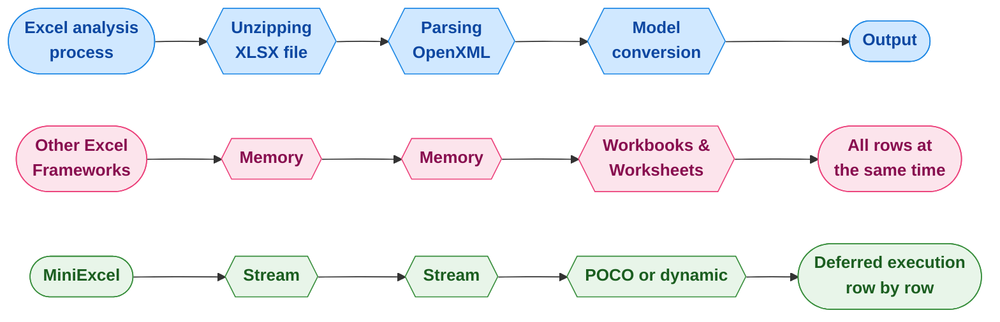

<div align="center">
<p><a href="https://www.nuget.org/packages/MiniExcel"></a>  <a href="https://www.nuget.org/packages/MiniExcel"></a>
<a href="https://ci.appveyor.com/project/mini-software/miniexcel/branch/master"></a>
<a href="https://gitee.com/dotnetchina/MiniExcel"></a> <a href="https://github.com/mini-software/MiniExcel" rel="nofollow"></a>
<a href="https://www.nuget.org/packages/MiniExcel"></a>
<a href="https://deepwiki.com/mini-software/MiniExcel"></a>
</p>
</div>

---

[](https://www.dotnetfoundation.org/)

<div align="center">
<p>Bu proje <a href="https://www.dotnetfoundation.org/">.NET Foundation</a>'ın bir parçasıdır ve onların <a href="https://www.dotnetfoundation.org/code-of-conduct">davranış kuralları</a> kapsamında çalışmaktadır. </p>
</div>

---

<div align="center">
<p><strong><a href="README.md">English</a> | <a href="README.zh-CN.md">简体中文</a> | <a href="https://openaitx.github.io/view.html?user=mini-software&amp;project=MiniExcel&amp;lang=zh-TW">繁體中文</a> | <a href="https://openaitx.github.io/view.html?user=mini-software&amp;project=MiniExcel&amp;lang=ja">日本語</a> | <a href="https://openaitx.github.io/view.html?user=mini-software&amp;project=MiniExcel&amp;lang=ko">한국어</a> | <a href="https://openaitx.github.io/view.html?user=mini-software&amp;project=MiniExcel&amp;lang=hi">हिन्दी</a> | <a href="https://openaitx.github.io/view.html?user=mini-software&amp;project=MiniExcel&amp;lang=th">ไทย</a> | <a href="https://openaitx.github.io/view.html?user=mini-software&amp;project=MiniExcel&amp;lang=fr">Français</a> | <a href="https://openaitx.github.io/view.html?user=mini-software&amp;project=MiniExcel&amp;lang=de">Deutsch</a> | <a href="https://openaitx.github.io/view.html?user=mini-software&amp;project=MiniExcel&amp;lang=es">Español</a> | <a href="https://openaitx.github.io/view.html?user=mini-software&amp;project=MiniExcel&amp;lang=it">Italiano</a> | <a href="https://openaitx.github.io/view.html?user=mini-software&amp;project=MiniExcel&amp;lang=ru">Русский</a> | <a href="https://openaitx.github.io/view.html?user=mini-software&amp;project=MiniExcel&amp;lang=pt">Português</a> | <a href="https://openaitx.github.io/view.html?user=mini-software&amp;project=MiniExcel&amp;lang=nl">Nederlands</a> | <a href="https://openaitx.github.io/view.html?user=mini-software&amp;project=MiniExcel&amp;lang=pl">Polski</a> | <a href="https://openaitx.github.io/view.html?user=mini-software&amp;project=MiniExcel&amp;lang=ar">العربية</a> | <a href="https://openaitx.github.io/view.html?user=mini-software&amp;project=MiniExcel&amp;lang=fa">فارسی</a> | <a href="https://openaitx.github.io/view.html?user=mini-software&amp;project=MiniExcel&amp;lang=tr">Türkçe</a> | <a href="https://openaitx.github.io/view.html?user=mini-software&amp;project=MiniExcel&amp;lang=vi">Tiếng Việt</a> | <a href="https://openaitx.github.io/view.html?user=mini-software&amp;project=MiniExcel&amp;lang=id">Bahasa Indonesia</a><p></p>
</strong></p>
</div>


---

<div align="center">
 Sizin <a href="https://github.com/mini-software/MiniExcel">Yıldızlarınız</a> veya <a href="https://miniexcel.github.io">Bağışlarınız</a> MiniExcel'i daha iyi yapabilir
</div>

---

### Giriş

MiniExcel, .NET için özel olarak tasarlanmış, hafıza kullanımını en aza indirmek üzere geliştirilmiş basit ve verimli bir Excel işleme aracıdır.

Mevcut durumda, çoğu popüler framework, Excel belgesindeki tüm verileri belleğe yükleyerek işlem yapmayı kolaylaştırır, ancak bu durum hafıza tüketimi sorunlarına yol açabilir. MiniExcel'in yaklaşımı ise farklıdır: veriler satır satır akış halinde işlenir, böylece orijinalde yüzlerce megabayt olabilecek tüketim sadece birkaç megabayta düşer ve bellek taşması (OOM) sorunlarının önüne etkin bir şekilde geçilir.



### Özellikler

- Bellek tüketimini en aza indirir, bellek taşması (OOM) hatalarını önler ve tam çöp toplamalarını engeller
- Gerçek zamanlı, satır düzeyinde veri işlemleriyle büyük veri kümelerinde daha iyi performans sağlar
- Gecikmeli yürütme ile LINQ desteği sunar, hızlı ve bellek dostu sayfalama ve karmaşık sorgulara olanak tanır
- Microsoft Office veya COM+ bileşenlerine ihtiyaç duymaz, hafif bir yapıda olup DLL boyutu 500KB’ın altındadır
- Excel okuma/yazma/doldurma işlemleri için basit ve sezgisel API stili

### Sürüm 2.0 önizlemesi

Gelecekteki MiniExcel sürümü üzerinde çalışıyoruz; yeni, modüler ve odaklanmış bir API, 
Core ve Csv işlevleri için ayrı nuget paketleri, `IAsyncEnumerable` ile tam asenkron akışlı sorgu desteği
ve yakında daha fazlası! Paketler ön sürüm olarak sunulacak, dilediğinizde deneyebilir ve bize geri bildirim verebilirsiniz!

Bunu yaparsanız, lütfen [yeni dokümanları](https://raw.githubusercontent.com/mini-software/MiniExcel/master/README-V2.md) ve [güncelleme notlarını](https://raw.githubusercontent.com/mini-software/MiniExcel/master/V2-Upgrade-Notes.md) da inceleyin.


### Başlarken

- [Excel İçe Aktarma/Sorgulama](#getstart1)

- [Excel Dışa Aktarma/Oluşturma](#getstart2)

- [Excel Şablonu](#getstart3)

- [Excel Sütun Adı/İndeksi/Yoksay Özelliği](#getstart4)

- [Örnekler](#getstart5)


### Kurulum

Paketi [NuGet üzerinden yükleyebilirsiniz](https://www.nuget.org/packages/MiniExcel)

### Sürüm Notları

Lütfen [Sürüm Notlarına](docs) bakın

### YAPILACAKLAR

Lütfen [TODO](https://github.com/mini-software/MiniExcel/projects/1?fullscreen=true) adresini kontrol edin

### Performans

Karşılaştırmalar için kullanılan kod [MiniExcel.Benchmarks](https://raw.githubusercontent.com/mini-software/MiniExcel/master/benchmarks/MiniExcel.Benchmarks/Program.cs) adresinde bulunabilir.

Performans testi için kullanılan dosya [**Test1,000,000x10.xlsx**](https://raw.githubusercontent.com/mini-software/MiniExcel/master/benchmarks/MiniExcel.Benchmarks/Test1%2C000%2C000x10.xlsx) dosyasıdır; hücrelerinde "HelloWorld" yazılı 1.000.000 satır * 10 sütun içeren 32MB büyüklüğünde bir belgedir.

Tüm karşılaştırmaları çalıştırmak için şunu kullanın:

```bash
dotnet run -project .\benchmarks\MiniExcel.Benchmarks -c Release -f net9.0 -filter * --join
```
En son sürümün karşılaştırma sonuçlarını [buradan](benchmarks/results) bulabilirsiniz.


### Excel Sorgulama/İçe Aktarma  <a name="getstart1"></a>

#### 1. Bir sorgu çalıştırın ve sonuçları güçlü türde bir IEnumerable'a eşleyin [[Deneyin]](https://dotnetfiddle.net/w5WD1J)

Daha iyi verimlilik için Stream.Query kullanılması önerilir.


```csharp
public class UserAccount
{
    public Guid ID { get; set; }
    public string Name { get; set; }
    public DateTime BoD { get; set; }
    public int Age { get; set; }
    public bool VIP { get; set; }
    public decimal Points { get; set; }
}

var rows = MiniExcel.Query<UserAccount>(path);

// or

using (var stream = File.OpenRead(path))
    var rows = stream.Query<UserAccount>();
```


#### 2. Bir sorgu yürütün ve başlık kullanmadan dinamik nesneler listesine eşleyin [[Deneyin]](https://dotnetfiddle.net/w5WD1J)

* dinamik anahtar `A.B.C.D..` şeklindedir

| MiniExcel | 1 |
|-----------|---|
| Github    | 2 |


```csharp

var rows = MiniExcel.Query(path).ToList();

// or
using (var stream = File.OpenRead(path))
{
    var rows = stream.Query().ToList();

    Assert.Equal("MiniExcel", rows[0].A);
    Assert.Equal(1, rows[0].B);
    Assert.Equal("Github", rows[1].A);
    Assert.Equal(2, rows[1].B);
}
```
#### 3. İlk başlık satırı ile bir sorgu çalıştırın [[Deneyin]](https://dotnetfiddle.net/w5WD1J)

not : aynı sütun adında en sağdaki kullanılır

Girdi Excel :

| Sütun1    | Sütun2  |
|-----------|---------|
| MiniExcel | 1       |
| Github    | 2       |


```csharp

var rows = MiniExcel.Query(useHeaderRow:true).ToList();

// or

using (var stream = File.OpenRead(path))
{
    var rows = stream.Query(useHeaderRow:true).ToList();

    Assert.Equal("MiniExcel", rows[0].Column1);
    Assert.Equal(1, rows[0].Column2);
    Assert.Equal("Github", rows[1].Column1);
    Assert.Equal(2, rows[1].Column2);
}
```
#### 4. Sorgu Desteği LINQ Uzantısı First/Take/Skip ...vb.

Sorgu First

```csharp
var row = MiniExcel.Query(path).First();
Assert.Equal("HelloWorld", row.A);

// or

using (var stream = File.OpenRead(path))
{
    var row = stream.Query().First();
    Assert.Equal("HelloWorld", row.A);
}
```
MiniExcel/ExcelDataReader/ClosedXML/EPPlus arasındaki performans


#### 5. Sayfa adına göre sorgulama


```csharp
MiniExcel.Query(path, sheetName: "SheetName");
//or
stream.Query(sheetName: "SheetName");
```
#### 6. Tüm sayfa adlarını ve satırları sorgulama


```csharp
var sheetNames = MiniExcel.GetSheetNames(path);
foreach (var sheetName in sheetNames)
{
    var rows = MiniExcel.Query(path, sheetName: sheetName);
}
```
#### 7. Sütunları Al


```csharp
var columns = MiniExcel.GetColumns(path); // e.g result : ["A","B"...]

var cnt = columns.Count;  // get column count
```
#### 8. Dinamik Sorguda satırı `IDictionary<string,object>` tipine dökme


```csharp
foreach(IDictionary<string,object> row in MiniExcel.Query(path))
{
    //..
}

// or
var rows = MiniExcel.Query(path).Cast<IDictionary<string,object>>();
// or Query specified ranges (capitalized)
// A2 represents the second row of column A, C3 represents the third row of column C
// If you don't want to restrict rows, just don't include numbers
var rows = MiniExcel.QueryRange(path, startCell: "A2", endCell: "C3").Cast<IDictionary<string, object>>();
```
#### 9. Excel sorgusu ile DataTable döndürme

Önerilmez, çünkü DataTable tüm verileri belleğe yükler ve MiniExcel'in düşük bellek tüketimi özelliğini kaybeder.


```C#
var table = MiniExcel.QueryAsDataTable(path, useHeaderRow: true);
```


#### 10. Verilerin okunmaya başlanacağı hücreyi belirtin


```csharp
MiniExcel.Query(path,useHeaderRow:true,startCell:"B3")
```


#### 11. Birleştirilmiş Hücreleri Doldur

Not: Verimlilik, `birleştirme doldurma kullanılmadığında` daha hızlıdır

Sebep: OpenXml standardı, mergeCells'i dosyanın en altına koyar, bu da sheetxml üzerinde iki kez dolaşmayı gerektirir


```csharp
    var config = new OpenXmlConfiguration()
    {
        FillMergedCells = true
    };
    var rows = MiniExcel.Query(path, configuration: config);
```


değişken uzunluk ve genişlikte çoklu satır ve sütun doldurma desteği


#### 12. Disk tabanlı önbellek ile büyük dosya okuma (Disk-Base Cache - SharedString)

Eğer SharedStrings boyutu 5 MB'ı aşarsa, MiniExcel varsayılan olarak yerel disk önbelleği kullanır, örn. [10x100000.xlsx](https://github.com/MiniExcel/MiniExcel/files/8403819/NotDuplicateSharedStrings_10x100000.xlsx)(bir milyon satır veri), disk önbelleği devre dışı bırakıldığında maksimum bellek kullanımı 195MB olurken, disk önbelleği etkinleştirildiğinde yalnızca 65MB gerekir. Not: Bu optimizasyonun bir miktar verimlilik maliyeti vardır, bu nedenle bu durumda okuma süresi 7,4 saniyeden 27,2 saniyeye çıkar. Eğer buna ihtiyacınız yoksa, disk önbelleğini aşağıdaki kodla devre dışı bırakabilirsiniz:


```csharp
var config = new OpenXmlConfiguration { EnableSharedStringCache = false };
MiniExcel.Query(path,configuration: config)
```
`SharedStringCacheSize`'ı, disk önbellekleme için belirtilen boyutun ötesinde sharedString dosya boyutunu değiştirmek için kullanabilirsiniz.

```csharp
var config = new OpenXmlConfiguration { SharedStringCacheSize=500*1024*1024 };
MiniExcel.Query(path, configuration: config);
```


### Excel Oluştur/Export Et  <a name="getstart2"></a>

1. Genel parametresiz kurucuya sahip soyut olmayan bir tip olmalıdır.

2. MiniExcel, IEnumerable Parametresiyle Ertelenmiş Yürütmeyi destekler. En az hafıza kullanımı için, lütfen ToList gibi metodları çağırmayın.

örneğin: ToList veya değil hafıza kullanımı


#### 1. Anonim veya güçlü tip [[Deneyin]](https://dotnetfiddle.net/w5WD1J)


```csharp
var path = Path.Combine(Path.GetTempPath(), $"{Guid.NewGuid()}.xlsx");
MiniExcel.SaveAs(path, new[] {
    new { Column1 = "MiniExcel", Column2 = 1 },
    new { Column1 = "Github", Column2 = 2}
});
```
#### 2. `IEnumerable<IDictionary<string, object>>`


```csharp
var values = new List<Dictionary<string, object>>()
{
    new Dictionary<string,object>{{ "Column1", "MiniExcel" }, { "Column2", 1 } },
    new Dictionary<string,object>{{ "Column1", "Github" }, { "Column2", 2 } }
};
MiniExcel.SaveAs(path, values);
```
Dosya Sonucu Oluştur :

| Sütun1    | Sütun2  |
|-----------|---------|
| MiniExcel | 1       |
| Github    | 2       |


#### 3.  IDataReader
- `Önerilir`, tüm verinin belleğe yüklenmesini önleyebilir

```csharp
MiniExcel.SaveAs(path, reader);
```


DataReader birden fazla sayfa dışa aktarır (Dapper ExecuteReader tarafından önerilir)


```csharp
using (var cnn = Connection)
{
    cnn.Open();
    var sheets = new Dictionary<string,object>();
    sheets.Add("sheet1", cnn.ExecuteReader("select 1 id"));
    sheets.Add("sheet2", cnn.ExecuteReader("select 2 id"));
    MiniExcel.SaveAs("Demo.xlsx", sheets);
}
```
#### 4. Veri Tablosu

- `Tavsiye edilmez`, tüm veriyi belleğe yükler

- VeriTablosu önce Sütun Adı olarak Başlık kullanır, sonra sütun adını kullanır


```csharp
var path = Path.Combine(Path.GetTempPath(), $"{Guid.NewGuid()}.xlsx");
var table = new DataTable();
{
    table.Columns.Add("Column1", typeof(string));
    table.Columns.Add("Column2", typeof(decimal));
    table.Rows.Add("MiniExcel", 1);
    table.Rows.Add("Github", 2);
}

MiniExcel.SaveAs(path, table);
```
####  5. Dapper Sorgusu

Teşekkürler @shaofing #552 , lütfen `CommandDefinition + CommandFlags.NoCache` kullanın


```csharp
using (var connection = GetConnection(connectionString))
{
    var rows = connection.Query(
        new CommandDefinition(
            @"select 'MiniExcel' as Column1,1 as Column2 union all select 'Github',2"
            , flags: CommandFlags.NoCache)
        );
    // Note: QueryAsync will throw close connection exception
    MiniExcel.SaveAs(path, rows);
}
```
Aşağıdaki kod tüm verileri belleğe yükleyecektir


```csharp
using (var connection = GetConnection(connectionString))
{
    var rows = connection.Query(@"select 'MiniExcel' as Column1,1 as Column2 union all select 'Github',2");
    MiniExcel.SaveAs(path, rows);
}
```
#### 6. MemoryStream'e SaveAs  [[Deneyin]](https://dotnetfiddle.net/JOen0e)


```csharp
using (var stream = new MemoryStream()) //support FileStream,MemoryStream ect.
{
    stream.SaveAs(values);
}
```
ör. : excel dışa aktarma api'si


```csharp
public IActionResult DownloadExcel()
{
    var values = new[] {
        new { Column1 = "MiniExcel", Column2 = 1 },
        new { Column1 = "Github", Column2 = 2}
    };

    var memoryStream = new MemoryStream();
    memoryStream.SaveAs(values);
    memoryStream.Seek(0, SeekOrigin.Begin);
    return new FileStreamResult(memoryStream, "application/vnd.openxmlformats-officedocument.spreadsheetml.sheet")
    {
        FileDownloadName = "demo.xlsx"
    };
}
```
#### 7. Birden Fazla Sayfa Oluşturun


```csharp
// 1. Dictionary<string,object>
var users = new[] { new { Name = "Jack", Age = 25 }, new { Name = "Mike", Age = 44 } };
var department = new[] { new { ID = "01", Name = "HR" }, new { ID = "02", Name = "IT" } };
var sheets = new Dictionary<string, object>
{
    ["users"] = users,
    ["department"] = department
};
MiniExcel.SaveAs(path, sheets);

// 2. DataSet
var sheets = new DataSet();
sheets.Add(UsersDataTable);
sheets.Add(DepartmentDataTable);
//..
MiniExcel.SaveAs(path, sheets);
```


#### 8. TabloStil Seçenekleri

Varsayılan stil


Stil yapılandırması olmadan


```csharp
var config = new OpenXmlConfiguration()
{
     TableStyles = TableStyles.None
};
MiniExcel.SaveAs(path, value,configuration:config);
```


#### 9. Otomatik Filtre

v0.19.0 sürümünden itibaren `OpenXmlConfiguration.AutoFilter` ile Otomatik Filtre etkinleştirilebilir veya devre dışı bırakılabilir, varsayılan değeri `true`'dur ve Otomatik Filtre ayarlama şekli:


```csharp
MiniExcel.SaveAs(path, value, configuration: new OpenXmlConfiguration() { AutoFilter = false });
```


#### 10. Görüntü Oluştur


```csharp
var value = new[] {
    new { Name="github",Image=File.ReadAllBytes(PathHelper.GetFile("images/github_logo.png"))},
    new { Name="google",Image=File.ReadAllBytes(PathHelper.GetFile("images/google_logo.png"))},
    new { Name="microsoft",Image=File.ReadAllBytes(PathHelper.GetFile("images/microsoft_logo.png"))},
    new { Name="reddit",Image=File.ReadAllBytes(PathHelper.GetFile("images/reddit_logo.png"))},
    new { Name="statck_overflow",Image=File.ReadAllBytes(PathHelper.GetFile("images/statck_overflow_logo.png"))},
};
MiniExcel.SaveAs(path, value);
```


#### 11. Bayt Dizisi Dosya Dışa Aktarımı

1.22.0'dan itibaren, değer türü `byte[]` olduğunda sistem varsayılan olarak hücrede dosya yolunu kaydeder ve içe aktarım sırasında sistem bunu `byte[]`'ye dönüştürebilir. Eğer bunu kullanmak istemiyorsanız, `OpenXmlConfiguration.EnableConvertByteArray`'i `false` olarak ayarlayabilirsiniz, bu sistem verimliliğini artırabilir.


1.22.0'dan itibaren, değer türü `byte[]` olduğunda sistem varsayılan olarak hücrede dosya yolunu kaydeder ve içe aktarım sırasında sistem bunu `byte[]`'ye dönüştürebilir. Eğer bunu kullanmak istemiyorsanız, `OpenXmlConfiguration.EnableConvertByteArray`'i `false` olarak ayarlayabilirsiniz, bu sistem verimliliğini artırabilir.


#### 12. Aynı Hücreleri Dikey Birleştirme

Bu işlevsellik yalnızca `xlsx` formatında desteklenir ve hücreleri @merge ve @endmerge etiketleri arasında dikey olarak birleştirir.
@mergelimit kullanarak hücrelerin dikey olarak birleştirilme sınırlarını belirleyebilirsiniz.


```csharp
var mergedFilePath = Path.Combine(Path.GetTempPath(), $"{Guid.NewGuid().ToString()}.xlsx");

var path = @"../../../../../samples/xlsx/TestMergeWithTag.xlsx";

MiniExcel.MergeSameCells(mergedFilePath, path);
```


```csharp
var memoryStream = new MemoryStream();

var path = @"../../../../../samples/xlsx/TestMergeWithTag.xlsx";

memoryStream.MergeSameCells(path);
```
Birleştirme öncesi ve sonrası dosya içeriği:

Birleştirme limiti olmadan:


Birleştirme limitiyle:


#### 13. Null değerleri atla

Null değerler için boş hücre yazmak üzere yeni açık seçenek:


```csharp
DataTable dt = new DataTable();

/* ... */

DataRow dr = dt.NewRow();

dr["Name1"] = "Somebody once";
dr["Name2"] = null;
dr["Name3"] = "told me.";

dt.Rows.Add(dr);

OpenXmlConfiguration configuration = new OpenXmlConfiguration()
{
     EnableWriteNullValueCell = true // Default value.
};

MiniExcel.SaveAs(@"C:\temp\Book1.xlsx", dt, configuration: configuration);
```


```xml
<x:row r="2">
    <x:c r="A2" t ="str" s="2">
        <x:v>Somebody once</x:v>
    </x:c>
    <x:c r="B2" s="2"></x:c>
    <x:c r="C2" t ="str" s="2">
        <x:v>told me.</x:v>
    </x:c>
</x:row>
```
Önceki davranış:


```csharp
/* ... */

OpenXmlConfiguration configuration = new OpenXmlConfiguration()
{
     EnableWriteNullValueCell = false // Default value is true.
};

MiniExcel.SaveAs(@"C:\temp\Book1.xlsx", dt, configuration: configuration);
```


```xml
<x:row r="2">
    <x:c r="A2" t ="str" s="2">
        <x:v>Somebody once</x:v>
    </x:c>
    <x:c r="B2" t ="str" s="2">
        <x:v></x:v>
    </x:c>
    <x:c r="C2" t ="str" s="2">
        <x:v>told me.</x:v>
    </x:c>
</x:row>
```
Null ve DBNull değerleri için çalışır.

#### 14. Bölmeleri Dondur

```csharp
/* ... */

OpenXmlConfiguration configuration = new OpenXmlConfiguration()
{
    FreezeRowCount = 1,     // default is 1
    FreezeColumnCount = 2   // default is 0
};

MiniExcel.SaveAs(@"C:\temp\Book1.xlsx", dt, configuration: configuration);
```


### Excel Şablonuna Veri Doldurma <a name="getstart3"></a>

- Tanımlama, Vue şablonundaki gibi `{{değişken adı}}` veya koleksiyon gösterimi `{{koleksiyon adı.alan adı}}` şeklindedir
- Koleksiyon gösterimi IEnumerable/DataTable/DapperRow destekler

#### 1. Temel Doldurma

Şablon:


Sonuç:


Kod:

```csharp
// 1. By POCO
var value = new
{
    Name = "Jack",
    CreateDate = new DateTime(2021, 01, 01),
    VIP = true,
    Points = 123
};
MiniExcel.SaveAsByTemplate(path, templatePath, value);


// 2. By Dictionary
var value = new Dictionary<string, object>()
{
    ["Name"] = "Jack",
    ["CreateDate"] = new DateTime(2021, 01, 01),
    ["VIP"] = true,
    ["Points"] = 123
};
MiniExcel.SaveAsByTemplate(path, templatePath, value);
```


#### 2. IEnumerable Veri Doldurma

> Not1: Liste doldurma için aynı sütunun ilk IEnumerable'ını temel olarak kullanın

Şablon:


Sonuç:


Kod:

```csharp
//1. By POCO
var value = new
{
    employees = new[] {
        new {name="Jack",department="HR"},
        new {name="Lisa",department="HR"},
        new {name="John",department="HR"},
        new {name="Mike",department="IT"},
        new {name="Neo",department="IT"},
        new {name="Loan",department="IT"}
    }
};
MiniExcel.SaveAsByTemplate(path, templatePath, value);

//2. By Dictionary
var value = new Dictionary<string, object>()
{
    ["employees"] = new[] {
        new {name="Jack",department="HR"},
        new {name="Lisa",department="HR"},
        new {name="John",department="HR"},
        new {name="Mike",department="IT"},
        new {name="Neo",department="IT"},
        new {name="Loan",department="IT"}
    }
};
MiniExcel.SaveAsByTemplate(path, templatePath, value);
```
#### 3. Karmaşık Veri Doldurma

> Not: Çoklu sayfa desteği ve aynı değişkenin kullanılması

Şablon:


Sonuç:


```csharp
// 1. By POCO
var value = new
{
    title = "FooCompany",
    managers = new[] {
        new {name="Jack",department="HR"},
        new {name="Loan",department="IT"}
    },
    employees = new[] {
        new {name="Wade",department="HR"},
        new {name="Felix",department="HR"},
        new {name="Eric",department="IT"},
        new {name="Keaton",department="IT"}
    }
};
MiniExcel.SaveAsByTemplate(path, templatePath, value);

// 2. By Dictionary
var value = new Dictionary<string, object>()
{
    ["title"] = "FooCompany",
    ["managers"] = new[] {
        new {name="Jack",department="HR"},
        new {name="Loan",department="IT"}
    },
    ["employees"] = new[] {
        new {name="Wade",department="HR"},
        new {name="Felix",department="HR"},
        new {name="Eric",department="IT"},
        new {name="Keaton",department="IT"}
    }
};
MiniExcel.SaveAsByTemplate(path, templatePath, value);
```
#### 4. Büyük Veri Performansını Doldurma

> NOT: MiniExcel'de IEnumerable gecikmeli yürütme kullanmak, ToList yerine maksimum bellek kullanımını azaltabilir


#### 5. Hücre değeri otomatik eşleme türü

Şablon


Sonuç


Sınıf


```csharp
public class Poco
{
    public string @string { get; set; }
    public int? @int { get; set; }
    public decimal? @decimal { get; set; }
    public double? @double { get; set; }
    public DateTime? datetime { get; set; }
    public bool? @bool { get; set; }
    public Guid? Guid { get; set; }
}
```
Kod


```csharp
var poco = new TestIEnumerableTypePoco { @string = "string", @int = 123, @decimal = decimal.Parse("123.45"), @double = (double)123.33, @datetime = new DateTime(2021, 4, 1), @bool = true, @Guid = Guid.NewGuid() };
var value = new
{
    Ts = new[] {
        poco,
        new TestIEnumerableTypePoco{},
        null,
        poco
    }
};
MiniExcel.SaveAsByTemplate(path, templatePath, value);
```
#### 6. Örnek :  Github Projelerini Listele

Şablon


Sonuç


Kod


```csharp
var projects = new[]
{
    new {Name = "MiniExcel",Link="https://github.com/mini-software/MiniExcel",Star=146, CreateTime=new DateTime(2021,03,01)},
    new {Name = "HtmlTableHelper",Link="https://github.com/mini-software/HtmlTableHelper",Star=16, CreateTime=new DateTime(2020,02,01)},
    new {Name = "PocoClassGenerator",Link="https://github.com/mini-software/PocoClassGenerator",Star=16, CreateTime=new DateTime(2019,03,17)}
};
var value = new
{
    User = "ITWeiHan",
    Projects = projects,
    TotalStar = projects.Sum(s => s.Star)
};
MiniExcel.SaveAsByTemplate(path, templatePath, value);
```
#### 7. Gruplandırılmış Veri Doldurma


```csharp
var value = new Dictionary<string, object>()
{
    ["employees"] = new[] {
        new {name="Jack",department="HR"},
        new {name="Jack",department="HR"},
        new {name="John",department="HR"},
        new {name="John",department="IT"},
        new {name="Neo",department="IT"},
        new {name="Loan",department="IT"}
    }
};
await MiniExcel.SaveAsByTemplateAsync(path, templatePath, value);
```
##### 1. `@group` etiketiyle ve `@header` etiketiyle

Önce


Sonra


##### 2. Sadece @group etiketiyle ve @header etiketi olmadan

Önce


Sonra


##### 3. @group etiketi olmadan

Önce


Sonra


#### 8. Hücre içinde If/ElseIf/Else İfadeleri

Kurallar:
1. DateTime, Double, Int için ==, !=, >, >=, <, <= operatörlerini destekler.
2. String için ==, != operatörlerini destekler.
3. Her ifade yeni satırda olmalıdır.
4. Operatörlerin öncesinde ve sonrasında birer boşluk olmalıdır.
5. İfadelerin içinde yeni satır olmamalıdır.
6. Hücre tam olarak aşağıdaki formatta olmalıdır.

```csharp
@if(name == Jack)
{{employees.name}}
@elseif(name == Neo)
Test {{employees.name}}
@else
{{employees.department}}
@endif
```
Önce


Sonra


#### 9. Parametre olarak DataTable


```csharp
var managers = new DataTable();
{
    managers.Columns.Add("name");
    managers.Columns.Add("department");
    managers.Rows.Add("Jack", "HR");
    managers.Rows.Add("Loan", "IT");
}
var value = new Dictionary<string, object>()
{
    ["title"] = "FooCompany",
    ["managers"] = managers,
};
MiniExcel.SaveAsByTemplate(path, templatePath, value);
```
#### 10. Formüller

##### 1. Örnek
Formülünüzün başına `$` ekleyin ve yinelemeli başlangıç ve bitiş satırlarına referans vermek için `$enumrowstart` ve `$enumrowend` kullanın:


Şablon oluşturulduğunda, `$` öneki kaldırılır ve `$enumrowstart` ile `$enumrowend` yinelemeli başlangıç ve bitiş satır numaraları ile değiştirilir:


##### 2. Diğer Örnek Formüller:

|              |                                                                                           |
|--------------|-------------------------------------------------------------------------------------------|
| Toplam       | `$=SUM(C{{$enumrowstart}}:C{{$enumrowend}})`                                              |
| Alternatif Ortalama | `$=SUM(C{{$enumrowstart}}:C{{$enumrowend}}) / COUNT(C{{$enumrowstart}}:C{{$enumrowend}})` |
| Aralık       | `$=MAX(C{{$enumrowstart}}:C{{$enumrowend}}) - MIN(C{{$enumrowstart}}:C{{$enumrowend}})`   |


#### 11. Diğer

##### 1. Şablon parametre anahtarını kontrol etme

V1.24.0'dan itibaren, varsayılan olarak eksik şablon parametre anahtarı yoksayılır ve boş dizeyle değiştirilir, `IgnoreTemplateParameterMissing` istisna fırlatılıp fırlatılmayacağını kontrol edebilir.

```csharp
var config = new OpenXmlConfiguration()
{
    IgnoreTemplateParameterMissing = false,
};
MiniExcel.SaveAsByTemplate(path, templatePath, value, config)
```


### Excel Sütun Adı/İndeks/Yoksay Özelliği <a name="getstart4"></a>


#### 1. Sütun adını, sütun indeksini, sütunu yoksaymayı belirtin

Excel Örneği


Kod


```csharp
public class ExcelAttributeDemo
{
    [ExcelColumnName("Column1")]
    public string Test1 { get; set; }
    [ExcelColumnName("Column2")]
    public string Test2 { get; set; }
    [ExcelIgnore]
    public string Test3 { get; set; }
    [ExcelColumnIndex("I")] // system will convert "I" to 8 index
    public string Test4 { get; set; }
    public string Test5 { get; } //wihout set will ignore
    public string Test6 { get; private set; } //un-public set will ignore
    [ExcelColumnIndex(3)] // start with 0
    public string Test7 { get; set; }
}

var rows = MiniExcel.Query<ExcelAttributeDemo>(path).ToList();
Assert.Equal("Column1", rows[0].Test1);
Assert.Equal("Column2", rows[0].Test2);
Assert.Null(rows[0].Test3);
Assert.Equal("Test7", rows[0].Test4);
Assert.Null(rows[0].Test5);
Assert.Null(rows[0].Test6);
Assert.Equal("Test4", rows[0].Test7);
```


#### 2. Özel Format (ExcelFormatAttribute)

V0.21.0'dan itibaren, `ToString(string content)` metodunu içeren sınıf formatı desteklenmektedir

Sınıf


```csharp
public class Dto
{
    public string Name { get; set; }

    [ExcelFormat("MMMM dd, yyyy")]
    public DateTime InDate { get; set; }
}
```
Kod


```csharp
var value = new Dto[] {
    new Issue241Dto{ Name="Jack",InDate=new DateTime(2021,01,04)},
    new Issue241Dto{ Name="Henry",InDate=new DateTime(2020,04,05)},
};
MiniExcel.SaveAs(path, value);
```
Sonuç


Sorgu özel format dönüşümünü destekler


#### 3. Sütun Genişliğini Ayarlama (ExcelColumnWidthAttribute)


```csharp
public class Dto
{
    [ExcelColumnWidth(20)]
    public int ID { get; set; }
    [ExcelColumnWidth(15.50)]
    public string Name { get; set; }
}
```
#### 4. Birden fazla sütun adının aynı özelliğe eşlenmesi.


```csharp
public class Dto
{
    [ExcelColumnName(excelColumnName:"EmployeeNo",aliases:new[] { "EmpNo","No" })]
    public string Empno { get; set; }
    public string Name { get; set; }
}
```


#### 5. System.ComponentModel.DisplayNameAttribute = ExcelColumnName.excelColumnNameAttribute

1.24.0'dan itibaren, sistem System.ComponentModel.DisplayNameAttribute = ExcelColumnName.excelColumnNameAttribute desteğini sağlar.


```C#
public class TestIssueI4TXGTDto
{
    public int ID { get; set; }
    public string Name { get; set; }
    [DisplayName("Specification")]
    public string Spc { get; set; }
    [DisplayName("Unit Price")]
    public decimal Up { get; set; }
}
```
#### 6. ExcelColumnAttribute

V1.26.0'dan itibaren, birden fazla özellik aşağıdaki gibi sadeleştirilebilir:


```csharp
        public class TestIssueI4ZYUUDto
        {
            [ExcelColumn(Name = "ID",Index =0)]
            public string MyProperty { get; set; }
            [ExcelColumn(Name = "CreateDate", Index = 1,Format ="yyyy-MM",Width =100)]
            public DateTime MyProperty2 { get; set; }
        }
```
#### 7. DynamicColumnAttribute

V1.26.0 sürümünden itibaren, Sütunun özelliklerini dinamik olarak ayarlayabiliriz


```csharp
            var config = new OpenXmlConfiguration
            {
                DynamicColumns = new DynamicExcelColumn[] {
                    new DynamicExcelColumn("id"){Ignore=true},
                    new DynamicExcelColumn("name"){Index=1,Width=10},
                    new DynamicExcelColumn("createdate"){Index=0,Format="yyyy-MM-dd",Width=15},
                    new DynamicExcelColumn("point"){Index=2,Name="Account Point"},
                }
            };
            var path = PathHelper.GetTempPath();
            var value = new[] { new { id = 1, name = "Jack", createdate = new DateTime(2022, 04, 12) ,point = 123.456} };
            MiniExcel.SaveAs(path, value, configuration: config);
```


#### 8. DinamikSayfaÖzniteliği

V1.31.4 sürümünden itibaren, Sayfa'nın özniteliklerini dinamik olarak ayarlayabiliriz. Sayfa adını ve durumunu (görünürlüğünü) ayarlayabiliriz.
```csharp
            var configuration = new OpenXmlConfiguration
            {
                DynamicSheets = new DynamicExcelSheet[] {
                    new DynamicExcelSheet("usersSheet") { Name = "Users", State = SheetState.Visible },
                    new DynamicExcelSheet("departmentSheet") { Name = "Departments", State = SheetState.Hidden }
                }
            };

            var users = new[] { new { Name = "Jack", Age = 25 }, new { Name = "Mike", Age = 44 } };
            var department = new[] { new { ID = "01", Name = "HR" }, new { ID = "02", Name = "IT" } };
            var sheets = new Dictionary<string, object>
            {
                ["usersSheet"] = users,
                ["departmentSheet"] = department
            };

            var path = PathHelper.GetTempPath();
            MiniExcel.SaveAs(path, sheets, configuration: configuration);
```
Ayrıca yeni ExcelSheetAttribute özniteliğini de kullanabiliriz:


```C#
   [ExcelSheet(Name = "Departments", State = SheetState.Hidden)]
   private class DepartmentDto
   {
      [ExcelColumn(Name = "ID",Index = 0)]
      public string ID { get; set; }
      [ExcelColumn(Name = "Name",Index = 1)]
      public string Name { get; set; }
   }
```
### Ekle, Sil, Güncelle

#### Ekle

v1.28.0 CSV'ye son satırdan sonra N satır veri eklemeyi destekler


```csharp
// Origin
{
    var value = new[] {
          new { ID=1,Name ="Jack",InDate=new DateTime(2021,01,03)},
          new { ID=2,Name ="Henry",InDate=new DateTime(2020,05,03)},
    };
    MiniExcel.SaveAs(path, value);
}
// Insert 1 rows after last
{
    var value = new { ID=3,Name = "Mike", InDate = new DateTime(2021, 04, 23) };
    MiniExcel.Insert(path, value);
}
// Insert N rows after last
{
    var value = new[] {
          new { ID=4,Name ="Frank",InDate=new DateTime(2021,06,07)},
          new { ID=5,Name ="Gloria",InDate=new DateTime(2022,05,03)},
    };
    MiniExcel.Insert(path, value);
}
```


v1.37.0 excel mevcut bir çalışma kitabına yeni bir sayfa eklemeyi destekler


```csharp
// Origin excel
{
    var value = new[] {
          new { ID=1,Name ="Jack",InDate=new DateTime(2021,01,03)},
          new { ID=2,Name ="Henry",InDate=new DateTime(2020,05,03)},
    };
    MiniExcel.SaveAs(path, value, sheetName: "Sheet1");
}
// Insert a new sheet
{
    var value = new { ID=3,Name = "Mike", InDate = new DateTime(2021, 04, 23) };
    MiniExcel.Insert(path, table, sheetName: "Sheet2");
}
```
#### Sil(beklemede)

#### Güncelle(beklemede)


### Excel Türü Otomatik Kontrol <a name="getstart5"></a>

- MiniExcel varsayılan olarak `dosya uzantısına` göre xlsx veya csv olup olmadığını kontrol eder, ancak bu yöntemde hata olabilir, lütfen elle belirtin.
- Akışın hangi excel türünden olduğu bilinememektedir, lütfen elle belirtin.


```csharp
stream.SaveAs(excelType:ExcelType.CSV);
//or
stream.SaveAs(excelType:ExcelType.XLSX);
//or
stream.Query(excelType:ExcelType.CSV);
//or
stream.Query(excelType:ExcelType.XLSX);
```
 


### CSV

#### Not

- Varsayılan olarak `string` türü döner ve değer sayılara veya tarih-saat'e dönüştürülmez, ancak tür güçlü tip tanımlaması ile belirtilirse dönüştürülür.


#### Özel ayırıcı

Varsayılan olarak ayırıcı `,`'dır, özelleştirme için `Seperator` özelliğini değiştirebilirsiniz.

```csharp
var config = new MiniExcelLibs.Csv.CsvConfiguration()
{
    Seperator=';'
};
MiniExcel.SaveAs(path, values,configuration: config);
```
V1.30.1 sürümünden itibaren özel ayırıcı fonksiyonunu destekler (teşekkürler @hyzx86)


```csharp
var config = new CsvConfiguration()
{
    SplitFn = (row) => Regex.Split(row, $"[\t,](?=(?:[^\"]|\"[^\"]*\")*$)")
        .Select(s => Regex.Replace(s.Replace("\"\"", "\""), "^\"|\"$", "")).ToArray()
};
var rows = MiniExcel.Query(path, configuration: config).ToList();
```
#### Özel satır sonu

Varsayılan olarak satır sonu karakteri `\r\n`'dir, özelleştirme için `NewLine` özelliğini değiştirebilirsiniz


```csharp
var config = new MiniExcelLibs.Csv.CsvConfiguration()
{
    NewLine='\n'
};
MiniExcel.SaveAs(path, values,configuration: config);
```
#### Özel kodlama

- Varsayılan kodlama "Bayt Sırası İşaretlerinden Kodlamayı Algıla"dır (detectEncodingFromByteOrderMarks: true)
- Eğer özel kodlama gereksinimleriniz varsa, lütfen StreamReaderFunc / StreamWriterFunc özelliğini değiştirin


```csharp
// Read
var config = new MiniExcelLibs.Csv.CsvConfiguration()
{
    StreamReaderFunc = (stream) => new StreamReader(stream,Encoding.GetEncoding("gb2312"))
};
var rows = MiniExcel.Query(path, true,excelType:ExcelType.CSV,configuration: config);

// Write
var config = new MiniExcelLibs.Csv.CsvConfiguration()
{
    StreamWriterFunc = (stream) => new StreamWriter(stream, Encoding.GetEncoding("gb2312"))
};
MiniExcel.SaveAs(path, value,excelType:ExcelType.CSV, configuration: config);
```
#### Boş dizeyi null olarak oku

Varsayılan olarak, boş değerler string.Empty'ye eşlenir. Bu davranışı değiştirebilirsiniz


```csharp
var config = new MiniExcelLibs.Csv.CsvConfiguration()
{
   ReadEmptyStringAsNull = true
};
```
### DataReader

#### 1. GetReader
1.23.0'dan itibaren, GetDataReader kullanabilirsiniz


```csharp
    using (var reader = MiniExcel.GetReader(path,true))
    {
        while (reader.Read())
        {
            for (int i = 0; i < reader.FieldCount; i++)
            {
                var value = reader.GetValue(i);
            }
        }
    }
```


###  Async

- v0.17.0 Async desteği (teşekkürler isdaniel ( SHIH,BING-SIOU)](https://github.com/isdaniel))


```csharp
public static Task SaveAsAsync(string path, object value, bool printHeader = true, string sheetName = "Sheet1", ExcelType excelType = ExcelType.UNKNOWN, IConfiguration configuration = null)
public static Task SaveAsAsync(this Stream stream, object value, bool printHeader = true, string sheetName = "Sheet1", ExcelType excelType = ExcelType.XLSX, IConfiguration configuration = null)
public static Task<IEnumerable<dynamic>> QueryAsync(string path, bool useHeaderRow = false, string sheetName = null, ExcelType excelType = ExcelType.UNKNOWN, string startCell = "A1", IConfiguration configuration = null)
public static Task<IEnumerable<T>> QueryAsync<T>(this Stream stream, string sheetName = null, ExcelType excelType = ExcelType.UNKNOWN, string startCell = "A1", IConfiguration configuration = null) where T : class, new()
public static Task<IEnumerable<T>> QueryAsync<T>(string path, string sheetName = null, ExcelType excelType = ExcelType.UNKNOWN, string startCell = "A1", IConfiguration configuration = null) where T : class, new()
public static Task<IEnumerable<IDictionary<string, object>>> QueryAsync(this Stream stream, bool useHeaderRow = false, string sheetName = null, ExcelType excelType = ExcelType.UNKNOWN, string startCell = "A1", IConfiguration configuration = null)
public static Task SaveAsByTemplateAsync(this Stream stream, string templatePath, object value)
public static Task SaveAsByTemplateAsync(this Stream stream, byte[] templateBytes, object value)
public static Task SaveAsByTemplateAsync(string path, string templatePath, object value)
public static Task SaveAsByTemplateAsync(string path, byte[] templateBytes, object value)
public static Task<DataTable> QueryAsDataTableAsync(string path, bool useHeaderRow = true, string sheetName = null, ExcelType excelType = ExcelType.UNKNOWN, string startCell = "A1", IConfiguration configuration = null)
```
-  v1.25.0 `cancellationToken` desteği.


### Diğerleri

#### 1. Enum

Excel ve özellik adının aynı olduğundan emin olun, sistem otomatik olarak eşleyecektir (büyük/küçük harf duyarsız)


V0.18.0'dan itibaren Enum Açıklama desteği


```csharp
public class Dto
{
    public string Name { get; set; }
    public I49RYZUserType UserType { get; set; }
}

public enum Type
{
    [Description("General User")]
    V1,
    [Description("General Administrator")]
    V2,
    [Description("Super Administrator")]
    V3
}
```


1.30.0 sürümünden itibaren excel Açıklamasını Enum'a destekleme eklendi, teşekkürler @KaneLeung

#### 2. CSV'yi XLSX'e Dönüştür veya XLSX'i CSV'ye Dönüştür


```csharp
MiniExcel.ConvertXlsxToCsv(xlsxPath, csvPath);
MiniExcel.ConvertXlsxToCsv(xlsxStream, csvStream);
MiniExcel.ConvertCsvToXlsx(csvPath, xlsxPath);
MiniExcel.ConvertCsvToXlsx(csvStream, xlsxStream);
```
```csharp
using (var excelStream = new FileStream(path: filePath, FileMode.Open, FileAccess.Read))
using (var csvStream = new MemoryStream())
{
   MiniExcel.ConvertXlsxToCsv(excelStream, csvStream);
}
```
#### 3. Özel CultureInfo

1.22.0 sürümünden itibaren, aşağıdaki gibi özel CultureInfo kullanabilirsiniz, sistem varsayılanı `CultureInfo.InvariantCulture`'dır.


```csharp
var config = new CsvConfiguration()
{
    Culture = new CultureInfo("fr-FR"),
};
MiniExcel.SaveAs(path, value, configuration: config);

// or
MiniExcel.Query(path, configuration: config);
```
#### 4. Özel Tampon Boyutu


```csharp
    public abstract class Configuration : IConfiguration
    {
        public int BufferSize { get; set; } = 1024 * 512;
    }
```
#### 5. HızlıMod

Sistem belleği kontrol etmeyecek, ancak daha hızlı kayıt hızı elde edebilirsiniz.


```csharp
var config = new OpenXmlConfiguration() { FastMode = true };
MiniExcel.SaveAs(path, reader,configuration:config);
```
#### 6. Toplu Resim Ekleme (MiniExcel.AddPicture)

Lütfen toplu olarak satır verisi oluşturmadan önce resimleri ekleyin, aksi takdirde AddPicture çağrıldığında sistem yüksek bellek kullanımıyla karşılaşabilir.


```csharp
var images = new[]
{
    new MiniExcelPicture
    {
        ImageBytes = File.ReadAllBytes(PathHelper.GetFile("images/github_logo.png")),
        SheetName = null, // default null is first sheet
        CellAddress = "C3", // required
    },
    new MiniExcelPicture
    {
        ImageBytes = File.ReadAllBytes(PathHelper.GetFile("images/google_logo.png")),
        PictureType = "image/png", // default PictureType = image/png
        SheetName = "Demo",
        CellAddress = "C9", // required
        WidthPx = 100,
        HeightPx = 100,
    },
};
MiniExcel.AddPicture(path, images);
```


#### 7. Sayfa Boyutlarını Al

```csharp
var dim = MiniExcel.GetSheetDimensions(path);
```
### Örnekler:

#### 1. SQLite & Dapper `Büyük Boyutlu Dosya` SQL Ekleme ile OOM'dan Kaçınma

not: Lütfen Query'den sonra ToList/ToArray metodlarını çağırmayın, tüm veriler belleğe yüklenir


```csharp
using (var connection = new SQLiteConnection(connectionString))
{
    connection.Open();
    using (var transaction = connection.BeginTransaction())
    using (var stream = File.OpenRead(path))
    {
       var rows = stream.Query();
       foreach (var row in rows)
             connection.Execute("insert into T (A,B) values (@A,@B)", new { row.A, row.B }, transaction: transaction);
       transaction.Commit();
    }
}
```
performans:


#### 2. ASP.NET Core 3.1 veya MVC 5 Excel Xlsx İndirme/Yükleme API Demo [Deneyin](https://raw.githubusercontent.com/mini-software/MiniExcel/master/tests/MiniExcel.Tests.AspNetCore)


```csharp
public class ApiController : Controller
{
    public IActionResult Index()
    {
        return new ContentResult
        {
            ContentType = "text/html",
            StatusCode = (int)HttpStatusCode.OK,
            Content = @"<html><body>
<a href='api/DownloadExcel'>DownloadExcel</a><br>
<a href='api/DownloadExcelFromTemplatePath'>DownloadExcelFromTemplatePath</a><br>
<a href='api/DownloadExcelFromTemplateBytes'>DownloadExcelFromTemplateBytes</a><br>
<p>Upload Excel</p>
<form method='post' enctype='multipart/form-data' action='/api/uploadexcel'>
    <input type='file' name='excel'> <br>
    <input type='submit' >
</form>
</body></html{{"
        };
    }

    public IActionResult DownloadExcel()
    {
        var values = new[] {
            new { Column1 = "MiniExcel", Column2 = 1 },
            new { Column1 = "Github", Column2 = 2}
        };
        var memoryStream = new MemoryStream();
        memoryStream.SaveAs(values);
        memoryStream.Seek(0, SeekOrigin.Begin);
        return new FileStreamResult(memoryStream, "application/vnd.openxmlformats-officedocument.spreadsheetml.sheet")
        {
            FileDownloadName = "demo.xlsx"
        };
    }

    public IActionResult DownloadExcelFromTemplatePath()
    {
        string templatePath = "TestTemplateComplex.xlsx";

        Dictionary<string, object> value = new Dictionary<string, object>()
        {
            ["title"] = "FooCompany",
            ["managers"] = new[] {
                new {name="Jack",department="HR"},
                new {name="Loan",department="IT"}
            },
            ["employees"] = new[] {
                new {name="Wade",department="HR"},
                new {name="Felix",department="HR"},
                new {name="Eric",department="IT"},
                new {name="Keaton",department="IT"}
            }
        };

        MemoryStream memoryStream = new MemoryStream();
        memoryStream.SaveAsByTemplate(templatePath, value);
        memoryStream.Seek(0, SeekOrigin.Begin);
        return new FileStreamResult(memoryStream, "application/vnd.openxmlformats-officedocument.spreadsheetml.sheet")
        {
            FileDownloadName = "demo.xlsx"
        };
    }

    private static Dictionary<string, Byte[]> TemplateBytesCache = new Dictionary<string, byte[]>();

    static ApiController()
    {
        string templatePath = "TestTemplateComplex.xlsx";
        byte[] bytes = System.IO.File.ReadAllBytes(templatePath);
        TemplateBytesCache.Add(templatePath, bytes);
    }

    public IActionResult DownloadExcelFromTemplateBytes()
    {
        byte[] bytes = TemplateBytesCache["TestTemplateComplex.xlsx"];

        Dictionary<string, object> value = new Dictionary<string, object>()
        {
            ["title"] = "FooCompany",
            ["managers"] = new[] {
                new {name="Jack",department="HR"},
                new {name="Loan",department="IT"}
            },
            ["employees"] = new[] {
                new {name="Wade",department="HR"},
                new {name="Felix",department="HR"},
                new {name="Eric",department="IT"},
                new {name="Keaton",department="IT"}
            }
        };

        MemoryStream memoryStream = new MemoryStream();
        memoryStream.SaveAsByTemplate(bytes, value);
        memoryStream.Seek(0, SeekOrigin.Begin);
        return new FileStreamResult(memoryStream, "application/vnd.openxmlformats-officedocument.spreadsheetml.sheet")
        {
            FileDownloadName = "demo.xlsx"
        };
    }

    public IActionResult UploadExcel(IFormFile excel)
    {
        var stream = new MemoryStream();
        excel.CopyTo(stream);

        foreach (var item in stream.Query(true))
        {
            // do your logic etc.
        }

        return Ok("File uploaded successfully");
    }
}
```
####  3. Sayfalama Sorgusu


```csharp
void Main()
{
    var rows = MiniExcel.Query(path);

    Console.WriteLine("==== No.1 Page ====");
    Console.WriteLine(Page(rows,pageSize:3,page:1));
    Console.WriteLine("==== No.50 Page ====");
    Console.WriteLine(Page(rows,pageSize:3,page:50));
    Console.WriteLine("==== No.5000 Page ====");
    Console.WriteLine(Page(rows,pageSize:3,page:5000));
}

public static IEnumerable<T> Page<T>(IEnumerable<T> en, int pageSize, int page)
{
    return en.Skip(page * pageSize).Take(pageSize);
}
```


#### 4. WebForm ile Excel'i Memorystream kullanarak dışa aktarma


```csharp
var fileName = "Demo.xlsx";
var sheetName = "Sheet1";
HttpResponse response = HttpContext.Current.Response;
response.Clear();
response.ContentType = "application/vnd.openxmlformats-officedocument.spreadsheetml.sheet";
response.AddHeader("Content-Disposition", $"attachment;filename=\"{fileName}\"");
var values = new[] {
    new { Column1 = "MiniExcel", Column2 = 1 },
    new { Column1 = "Github", Column2 = 2}
};
var memoryStream = new MemoryStream();
memoryStream.SaveAs(values, sheetName: sheetName);
memoryStream.Seek(0, SeekOrigin.Begin);
memoryStream.CopyTo(Response.OutputStream);
response.End();
```
#### 5. Dinamik i18n çoklu dil ve rol yetki yönetimi

Örnekteki gibi, i18n ve yetki yönetimini ele almak için bir yöntem oluşturun ve dinamik ve düşük bellekli işleme etkileri elde etmek için `yield return ile IEnumerable<Dictionary<string, object>>` döndürün


```csharp
void Main()
{
    var value = new Order[] {
        new Order(){OrderNo = "SO01",CustomerID="C001",ProductID="P001",Qty=100,Amt=500},
        new Order(){OrderNo = "SO02",CustomerID="C002",ProductID="P002",Qty=300,Amt=400},
    };

    Console.WriteLine("en-Us and Sales role");
    {
        var path = Path.GetTempPath() + Guid.NewGuid() + ".xlsx";
        var lang = "en-US";
        var role = "Sales";
        MiniExcel.SaveAs(path, GetOrders(lang, role, value));
        MiniExcel.Query(path, true).Dump();
    }

    Console.WriteLine("zh-CN and PMC role");
    {
        var path = Path.GetTempPath() + Guid.NewGuid() + ".xlsx";
        var lang = "zh-CN";
        var role = "PMC";
        MiniExcel.SaveAs(path, GetOrders(lang, role, value));
        MiniExcel.Query(path, true).Dump();
    }
}

private IEnumerable<Dictionary<string, object>> GetOrders(string lang, string role, Order[] orders)
{
    foreach (var order in orders)
    {
        var newOrder = new Dictionary<string, object>();

        if (lang == "zh-CN")
        {
            newOrder.Add("客户编号", order.CustomerID);
            newOrder.Add("订单编号", order.OrderNo);
            newOrder.Add("产品编号", order.ProductID);
            newOrder.Add("数量", order.Qty);
            if (role == "Sales")
                newOrder.Add("价格", order.Amt);
            yield return newOrder;
        }
        else if (lang == "en-US")
        {
            newOrder.Add("Customer ID", order.CustomerID);
            newOrder.Add("Order No", order.OrderNo);
            newOrder.Add("Product ID", order.ProductID);
            newOrder.Add("Quantity", order.Qty);
            if (role == "Sales")
                newOrder.Add("Amount", order.Amt);
            yield return newOrder;
        }
        else
        {
            throw new InvalidDataException($"lang {lang} wrong");
        }
    }
}

public class Order
{
    public string OrderNo { get; set; }
    public string CustomerID { get; set; }
    public decimal Qty { get; set; }
    public string ProductID { get; set; }
    public decimal Amt { get; set; }
}
```


### SSS

#### S: Excel başlık adı, sınıf özelliği adı ile aynı değilse nasıl eşleştirme yapılır?

C. Lütfen ExcelColumnName özniteliğini kullanın


#### S. Birden fazla sayfayı nasıl sorgular veya dışa aktarırım?

C. `GetSheetNames` yöntemi ile  Query  sheetName parametresini kullanın.


```csharp
var sheets = MiniExcel.GetSheetNames(path);
foreach (var sheet in sheets)
{
    Console.WriteLine($"sheet name : {sheet} ");
    var rows = MiniExcel.Query(path,useHeaderRow:true,sheetName:sheet);
    Console.WriteLine(rows);
}
```


#### S. Sayfa görünürlüğü hakkında bilgi nasıl sorgulanır veya dışa aktarılır?

C. `GetSheetInformations` yöntemi.


```csharp
var sheets = MiniExcel.GetSheetInformations(path);
foreach (var sheetInfo in sheets)
{
    Console.WriteLine($"sheet index : {sheetInfo.Index} "); // next sheet index - numbered from 0
    Console.WriteLine($"sheet name : {sheetInfo.Name} ");   // sheet name
    Console.WriteLine($"sheet state : {sheetInfo.State} "); // sheet visibility state - visible / hidden
}
```
#### S. Count kullanmak tüm verileri belleğe yükler mi?

Hayır, görsel testte 1 milyon satır*10 sütun veri var, maksimum bellek kullanımı <60MB ve 13,65 saniye sürüyor


#### S. Query nasıl tamsayı indeksleri kullanır?

Query'nin varsayılan indeksi string Anahtar: A,B,C.... Eğer sayısal indeks kullanmak istiyorsanız, lütfen aşağıdaki yöntemi oluşturarak dönüştürün


```csharp
void Main()
{
    var path = @"D:\git\MiniExcel\samples\xlsx\TestTypeMapping.xlsx";
    var rows = MiniExcel.Query(path,true);
    foreach (var r in ConvertToIntIndexRows(rows))
    {
        Console.Write($"column 0 : {r[0]} ,column 1 : {r[1]}");
        Console.WriteLine();
    }
}

private IEnumerable<Dictionary<int, object>> ConvertToIntIndexRows(IEnumerable<object> rows)
{
    ICollection<string> keys = null;
    var isFirst = true;
    foreach (IDictionary<string,object> r in rows)
    {
        if(isFirst)
        {
            keys = r.Keys;
            isFirst = false;
        }

        var dic = new Dictionary<int, object>();
        var index = 0;
        foreach (var key in keys)
            dic[index++] = r[key];
        yield return dic;
    }
}
```
#### S. Başlıksız boş Excel, değer boş olduğunda dışa aktarılırken oluşturuluyor

MiniExcel, API işlemlerini basitleştirmek için JSON.NET'e benzer şekilde dinamik olarak değerden türü alır; veri olmadan tür bilinemediği için bu durum oluşur. Anlamak için [issue #133](https://github.com/mini-software/MiniExcel/issues/133) konusuna bakabilirsiniz.


> Güçlü tip & DataTable başlık üretir, fakat Dictionary hâlâ boş Excel oluşturur

#### S. Boş satırda foreach nasıl durdurulur?

MiniExcel, foreach döngüsünü durdurmak için `LINQ TakeWhile` ile birlikte kullanılabilir.


#### S. Boş satırlar nasıl kaldırılır?


IEnumerable :


```csharp
public static IEnumerable<dynamic> QueryWithoutEmptyRow(Stream stream, bool useHeaderRow, string sheetName, ExcelType excelType, string startCell, IConfiguration configuration)
{
    var rows = stream.Query(useHeaderRow,sheetName,excelType,startCell,configuration);
    foreach (IDictionary<string,object> row in rows)
    {
        if(row.Keys.Any(key=>row[key]!=null))
            yield return row;
    }
}
```


VeriTablosu :


```csharp
public static DataTable QueryAsDataTableWithoutEmptyRow(Stream stream, bool useHeaderRow, string sheetName, ExcelType excelType, string startCell, IConfiguration configuration)
{
    if (sheetName == null && excelType != ExcelType.CSV) /*Issue #279*/
        sheetName = stream.GetSheetNames().First();

    var dt = new DataTable(sheetName);
    var first = true;
    var rows = stream.Query(useHeaderRow,sheetName,excelType,startCell,configuration);
    foreach (IDictionary<string, object> row in rows)
    {
        if (first)
        {

            foreach (var key in row.Keys)
            {
                var column = new DataColumn(key, typeof(object)) { Caption = key };
                dt.Columns.Add(column);
            }

            dt.BeginLoadData();
            first = false;
        }

        var newRow = dt.NewRow();
        var isNull=true;
        foreach (var key in row.Keys)
        {
            var _v = row[key];
            if(_v!=null)
                isNull = false;
            newRow[key] = _v;
        }

        if(!isNull)
            dt.Rows.Add(newRow);
    }

    dt.EndLoadData();
    return dt;
}
```


#### S. SaveAs(path,value) ile mevcut dosyayı nasıl değiştirebilir ve "...xlsx dosyası zaten var" hatası almadan kaydedebilirim?


Lütfen özel dosya oluşturma mantığı için Stream sınıfını kullanın, örneğin:


```C#
    using (var stream = File.Create("Demo.xlsx"))
        MiniExcel.SaveAs(stream,value);
```
veya, V1.25.0'dan itibaren, SaveAs mevcut dosyanın üzerine yazmayı etkinleştirmek/devre dışı bırakmak için overwriteFile parametresini destekler


```csharp
    MiniExcel.SaveAs(path, value, overwriteFile: true);
```


### Sınırlamalar ve uyarılar

- Şu anda xls ve şifreli dosyalar desteklenmiyor
- xlsm yalnızca Sorgu'yu destekler


### Referanslar

[ExcelDataReader](https://github.com/ExcelDataReader/ExcelDataReader)  / [ClosedXML](https://github.com/ClosedXML/ClosedXML) / [Dapper](https://github.com/DapperLib/Dapper) / [ExcelNumberFormat](https://github.com/andersnm/ExcelNumberFormat)


### Teşekkürler

####  [Jetbrains](https://www.jetbrains.com/)


Bu proje için ücretsiz Tüm ürünler IDE'si sağladığınız için teşekkürler ([Lisans](https://user-images.githubusercontent.com/12729184/123988233-6ab17c00-d9fa-11eb-8739-2a08c6a4a263.png))


### Katkı paylaşımı bağışı
Bağlantı https://github.com/orgs/mini-software/discussions/754

### Katkıda Bulunanlar



---


Tranlated By [Open Ai Tx](https://github.com/OpenAiTx/OpenAiTx) | Last indexed: 2025-10-09


---