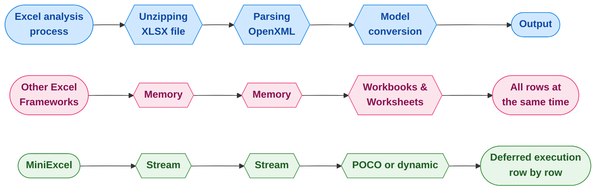

<div align="center">
<p><a href="https://www.nuget.org/packages/MiniExcel"></a>  <a href="https://www.nuget.org/packages/MiniExcel"></a>
<a href="https://ci.appveyor.com/project/mini-software/miniexcel/branch/master"></a>
<a href="https://gitee.com/dotnetchina/MiniExcel"></a> <a href="https://github.com/mini-software/MiniExcel" rel="nofollow"></a>
<a href="https://www.nuget.org/packages/MiniExcel"></a>
<a href="https://deepwiki.com/mini-software/MiniExcel"></a>
</p>
</div>

---

[](https://www.dotnetfoundation.org/)

<div align="center">
<p>Dự án này là một phần của <a href="https://www.dotnetfoundation.org/">.NET Foundation</a> và tuân thủ <a href="https://www.dotnetfoundation.org/code-of-conduct">bộ quy tắc ứng xử</a> của họ. </p>
</div>

---

<div align="center">
<p><strong><a href="README.md">English</a> | <a href="README.zh-CN.md">简体中文</a> | <a href="https://openaitx.github.io/view.html?user=mini-software&amp;project=MiniExcel&amp;lang=zh-TW">繁體中文</a> | <a href="https://openaitx.github.io/view.html?user=mini-software&amp;project=MiniExcel&amp;lang=ja">日本語</a> | <a href="https://openaitx.github.io/view.html?user=mini-software&amp;project=MiniExcel&amp;lang=ko">한국어</a> | <a href="https://openaitx.github.io/view.html?user=mini-software&amp;project=MiniExcel&amp;lang=hi">हिन्दी</a> | <a href="https://openaitx.github.io/view.html?user=mini-software&amp;project=MiniExcel&amp;lang=th">ไทย</a> | <a href="https://openaitx.github.io/view.html?user=mini-software&amp;project=MiniExcel&amp;lang=fr">Français</a> | <a href="https://openaitx.github.io/view.html?user=mini-software&amp;project=MiniExcel&amp;lang=de">Deutsch</a> | <a href="https://openaitx.github.io/view.html?user=mini-software&amp;project=MiniExcel&amp;lang=es">Español</a> | <a href="https://openaitx.github.io/view.html?user=mini-software&amp;project=MiniExcel&amp;lang=it">Italiano</a> | <a href="https://openaitx.github.io/view.html?user=mini-software&amp;project=MiniExcel&amp;lang=ru">Русский</a> | <a href="https://openaitx.github.io/view.html?user=mini-software&amp;project=MiniExcel&amp;lang=pt">Português</a> | <a href="https://openaitx.github.io/view.html?user=mini-software&amp;project=MiniExcel&amp;lang=nl">Nederlands</a> | <a href="https://openaitx.github.io/view.html?user=mini-software&amp;project=MiniExcel&amp;lang=pl">Polski</a> | <a href="https://openaitx.github.io/view.html?user=mini-software&amp;project=MiniExcel&amp;lang=ar">العربية</a> | <a href="https://openaitx.github.io/view.html?user=mini-software&amp;project=MiniExcel&amp;lang=fa">فارسی</a> | <a href="https://openaitx.github.io/view.html?user=mini-software&amp;project=MiniExcel&amp;lang=tr">Türkçe</a> | <a href="https://openaitx.github.io/view.html?user=mini-software&amp;project=MiniExcel&amp;lang=vi">Tiếng Việt</a> | <a href="https://openaitx.github.io/view.html?user=mini-software&amp;project=MiniExcel&amp;lang=id">Bahasa Indonesia</a><p></p>
</strong></p>
</div>


---

<div align="center">
 <a href="https://github.com/mini-software/MiniExcel">Số sao</a> hoặc <a href="https://miniexcel.github.io">Đóng góp</a> của bạn có thể giúp MiniExcel tốt hơn
</div>

---

### Giới thiệu

MiniExcel là công cụ xử lý Excel đơn giản và hiệu quả dành cho .NET, được thiết kế đặc biệt để giảm thiểu việc sử dụng bộ nhớ.

Hiện tại, hầu hết các framework phổ biến đều cần tải toàn bộ dữ liệu từ tài liệu Excel vào bộ nhớ để thuận tiện cho thao tác, nhưng điều này có thể gây ra vấn đề tiêu tốn bộ nhớ. Phương pháp của MiniExcel thì khác: dữ liệu được xử lý từng dòng theo kiểu streaming, giảm mức tiêu thụ ban đầu từ hàng trăm megabyte xuống chỉ còn vài megabyte, hiệu quả ngăn ngừa sự cố tràn bộ nhớ (OOM).



### Tính năng

- Giảm thiểu tiêu thụ bộ nhớ, ngăn ngừa lỗi tràn bộ nhớ (OOM) và tránh các lần thu gom rác toàn phần
- Cho phép thao tác dữ liệu theo từng dòng theo thời gian thực, giúp tăng hiệu suất với các bộ dữ liệu lớn
- Hỗ trợ LINQ với thực thi trì hoãn, cho phép phân trang nhanh, tiết kiệm bộ nhớ và truy vấn phức tạp
- Nhẹ, không cần Microsoft Office hoặc các thành phần COM+, và kích thước DLL dưới 500KB
- API đơn giản, trực quan để đọc/ghi/điền dữ liệu excel

### Phiên bản 2.0 xem trước

Chúng tôi đang phát triển phiên bản MiniExcel tương lai, với API mới dạng mô-đun và tập trung,
các gói nuget riêng biệt cho chức năng Core và Csv, hỗ trợ đầy đủ truy vấn phát trực tuyến bất đồng bộ qua `IAsyncEnumerable`,
và còn nhiều tính năng khác sẽ được bổ sung! Các gói sẽ có sẵn dưới dạng phát hành thử nghiệm, nên bạn hãy thử và cho chúng tôi phản hồi nhé!

Nếu bạn thử, hãy xem cả [tài liệu mới](https://raw.githubusercontent.com/mini-software/MiniExcel/master/README-V2.md) và [ghi chú nâng cấp](https://raw.githubusercontent.com/mini-software/MiniExcel/master/V2-Upgrade-Notes.md).


### Bắt đầu

- [Nhập/Truy vấn Excel](#getstart1)

- [Xuất/Tạo Excel](#getstart2)

- [Mẫu Excel](#getstart3)

- [Thuộc tính Tên/Cột/Chỉ mục/Ignore của Excel](#getstart4)

- [Ví dụ](#getstart5)


### Cài đặt

Bạn có thể cài đặt gói [từ NuGet](https://www.nuget.org/packages/MiniExcel)

### Ghi chú phát hành

Vui lòng kiểm tra [Ghi chú phát hành](docs)

### VIỆC CẦN LÀM

Vui lòng kiểm tra [TODO](https://github.com/mini-software/MiniExcel/projects/1?fullscreen=true)

### Hiệu năng

Mã nguồn cho các bài kiểm tra hiệu năng có thể được tìm thấy tại [MiniExcel.Benchmarks](https://raw.githubusercontent.com/mini-software/MiniExcel/master/benchmarks/MiniExcel.Benchmarks/Program.cs).

Tệp được sử dụng để kiểm tra hiệu năng là [**Test1,000,000x10.xlsx**](https://raw.githubusercontent.com/mini-software/MiniExcel/master/benchmarks/MiniExcel.Benchmarks/Test1%2C000%2C000x10.xlsx), một tài liệu 32MB chứa 1.000.000 dòng * 10 cột, trong đó các ô được điền chuỗi "HelloWorld".

Để chạy tất cả các bài kiểm tra hiệu năng, hãy sử dụng:

```bash
dotnet run -project .\benchmarks\MiniExcel.Benchmarks -c Release -f net9.0 -filter * --join
```
Bạn có thể tìm thấy kết quả kiểm thử hiệu năng cho phiên bản mới nhất [tại đây](benchmarks/results).


### Truy vấn/Nhập dữ liệu Excel  <a name="getstart1"></a>

#### 1. Thực thi một truy vấn và ánh xạ kết quả sang một IEnumerable có kiểu mạnh [[Thử ngay]](https://dotnetfiddle.net/w5WD1J)

Khuyến nghị sử dụng Stream.Query vì hiệu suất tốt hơn.


```csharp
public class UserAccount
{
    public Guid ID { get; set; }
    public string Name { get; set; }
    public DateTime BoD { get; set; }
    public int Age { get; set; }
    public bool VIP { get; set; }
    public decimal Points { get; set; }
}

var rows = MiniExcel.Query<UserAccount>(path);

// or

using (var stream = File.OpenRead(path))
    var rows = stream.Query<UserAccount>();
```


#### 2. Thực thi một truy vấn và ánh xạ nó thành danh sách các đối tượng động mà không sử dụng tiêu đề [[Thử ngay]](https://dotnetfiddle.net/w5WD1J)

* khóa động là `A.B.C.D..`

| MiniExcel | 1 |
|-----------|---|
| Github    | 2 |


```csharp

var rows = MiniExcel.Query(path).ToList();

// or
using (var stream = File.OpenRead(path))
{
    var rows = stream.Query().ToList();

    Assert.Equal("MiniExcel", rows[0].A);
    Assert.Equal(1, rows[0].B);
    Assert.Equal("Github", rows[1].A);
    Assert.Equal(2, rows[1].B);
}
```
#### 3. Thực thi truy vấn với dòng tiêu đề đầu tiên [[Thử ngay]](https://dotnetfiddle.net/w5WD1J)

lưu ý : nếu có tên cột trùng nhau sẽ sử dụng cột bên phải cuối cùng

Excel đầu vào :

| Column1   | Column2 |
|-----------|---------|
| MiniExcel | 1       |
| Github    | 2       |


```csharp

var rows = MiniExcel.Query(useHeaderRow:true).ToList();

// or

using (var stream = File.OpenRead(path))
{
    var rows = stream.Query(useHeaderRow:true).ToList();

    Assert.Equal("MiniExcel", rows[0].Column1);
    Assert.Equal(1, rows[0].Column2);
    Assert.Equal("Github", rows[1].Column1);
    Assert.Equal(2, rows[1].Column2);
}
```
#### 4. Hỗ trợ truy vấn các phần mở rộng LINQ First/Take/Skip ...v.v.

Truy vấn First

```csharp
var row = MiniExcel.Query(path).First();
Assert.Equal("HelloWorld", row.A);

// or

using (var stream = File.OpenRead(path))
{
    var row = stream.Query().First();
    Assert.Equal("HelloWorld", row.A);
}
```
Hiệu suất giữa MiniExcel/ExcelDataReader/ClosedXML/EPPlus


#### 5. Truy vấn theo tên sheet


```csharp
MiniExcel.Query(path, sheetName: "SheetName");
//or
stream.Query(sheetName: "SheetName");
```
#### 6. Truy vấn tất cả tên bảng và các dòng


```csharp
var sheetNames = MiniExcel.GetSheetNames(path);
foreach (var sheetName in sheetNames)
{
    var rows = MiniExcel.Query(path, sheetName: sheetName);
}
```
#### 7. Lấy các Cột


```csharp
var columns = MiniExcel.GetColumns(path); // e.g result : ["A","B"...]

var cnt = columns.Count;  // get column count
```
#### 8. Truy vấn động ép kiểu hàng thành `IDictionary<string,object>`


```csharp
foreach(IDictionary<string,object> row in MiniExcel.Query(path))
{
    //..
}

// or
var rows = MiniExcel.Query(path).Cast<IDictionary<string,object>>();
// or Query specified ranges (capitalized)
// A2 represents the second row of column A, C3 represents the third row of column C
// If you don't want to restrict rows, just don't include numbers
var rows = MiniExcel.QueryRange(path, startCell: "A2", endCell: "C3").Cast<IDictionary<string, object>>();
```
#### 9. Truy vấn Excel trả về DataTable

Không được khuyến khích, vì DataTable sẽ tải tất cả dữ liệu vào bộ nhớ và làm mất đi tính năng tiêu thụ bộ nhớ thấp của MiniExcel.


```C#
var table = MiniExcel.QueryAsDataTable(path, useHeaderRow: true);
```


#### 10. Chỉ định ô để bắt đầu đọc dữ liệu


```csharp
MiniExcel.Query(path,useHeaderRow:true,startCell:"B3")
```


#### 11. Điền vào các ô đã gộp

Lưu ý: Hiệu suất chậm hơn so với `không sử dụng điền gộp`

Lý do: Tiêu chuẩn OpenXml đặt mergeCells ở cuối file, dẫn đến cần phải duyệt sheetxml hai lần


```csharp
    var config = new OpenXmlConfiguration()
    {
        FillMergedCells = true
    };
    var rows = MiniExcel.Query(path, configuration: config);
```


hỗ trợ điền dữ liệu nhiều dòng và cột với chiều dài và chiều rộng biến đổi


#### 12. Đọc tệp lớn bằng bộ nhớ đệm trên đĩa (Disk-Base Cache - SharedString)

Nếu kích thước SharedStrings vượt quá 5 MB, MiniExcel mặc định sẽ sử dụng bộ nhớ đệm trên đĩa cục bộ, ví dụ, [10x100000.xlsx](https://github.com/MiniExcel/MiniExcel/files/8403819/NotDuplicateSharedStrings_10x100000.xlsx) (dữ liệu một triệu dòng), khi tắt bộ nhớ đệm trên đĩa thì mức sử dụng bộ nhớ tối đa là 195MB, nhưng khi bật bộ nhớ đệm trên đĩa thì chỉ cần 65MB. Lưu ý, tối ưu này sẽ tốn thêm một chút hiệu suất, vì vậy trong trường hợp này thời gian đọc sẽ tăng từ 7,4 giây lên 27,2 giây. Nếu bạn không cần, có thể tắt bộ nhớ đệm trên đĩa bằng đoạn mã sau:


```csharp
var config = new OpenXmlConfiguration { EnableSharedStringCache = false };
MiniExcel.Query(path,configuration: config)
```
Bạn có thể sử dụng `SharedStringCacheSize` để thay đổi kích thước tệp sharedString vượt quá kích thước đã chỉ định cho việc lưu vào bộ nhớ đệm trên đĩa

```csharp
var config = new OpenXmlConfiguration { SharedStringCacheSize=500*1024*1024 };
MiniExcel.Query(path, configuration: config);
```


### Tạo/Xuất Excel  <a name="getstart2"></a>

1. Phải là kiểu không trừu tượng với constructor công khai không tham số.

2. MiniExcel hỗ trợ tham số IEnumerable Deferred Execution, nếu bạn muốn sử dụng ít bộ nhớ nhất, vui lòng không gọi các phương thức như ToList

ví dụ: Dùng ToList hoặc không dùng bộ nhớ


#### 1. Ẩn danh hoặc kiểu mạnh [[Thử ngay]](https://dotnetfiddle.net/w5WD1J)


```csharp
var path = Path.Combine(Path.GetTempPath(), $"{Guid.NewGuid()}.xlsx");
MiniExcel.SaveAs(path, new[] {
    new { Column1 = "MiniExcel", Column2 = 1 },
    new { Column1 = "Github", Column2 = 2}
});
```
#### 2. `IEnumerable<IDictionary<string, object>>`


```csharp
var values = new List<Dictionary<string, object>>()
{
    new Dictionary<string,object>{{ "Column1", "MiniExcel" }, { "Column2", 1 } },
    new Dictionary<string,object>{{ "Column1", "Github" }, { "Column2", 2 } }
};
MiniExcel.SaveAs(path, values);
```
Tạo Kết Quả Tệp :

| Cột1      | Cột2    |
|-----------|---------|
| MiniExcel | 1       |
| Github    | 2       |


#### 3.  IDataReader
- `Khuyến nghị`, nó có thể tránh việc tải tất cả dữ liệu vào bộ nhớ

```csharp
MiniExcel.SaveAs(path, reader);
```


DataReader xuất nhiều sheet (được Dapper ExecuteReader khuyến nghị)


```csharp
using (var cnn = Connection)
{
    cnn.Open();
    var sheets = new Dictionary<string,object>();
    sheets.Add("sheet1", cnn.ExecuteReader("select 1 id"));
    sheets.Add("sheet2", cnn.ExecuteReader("select 2 id"));
    MiniExcel.SaveAs("Demo.xlsx", sheets);
}
```
#### 4. Datatable

- `Không khuyến nghị`, vì nó sẽ tải tất cả dữ liệu vào bộ nhớ

- DataTable sử dụng Caption cho tên cột trước, sau đó mới dùng tên cột


```csharp
var path = Path.Combine(Path.GetTempPath(), $"{Guid.NewGuid()}.xlsx");
var table = new DataTable();
{
    table.Columns.Add("Column1", typeof(string));
    table.Columns.Add("Column2", typeof(decimal));
    table.Rows.Add("MiniExcel", 1);
    table.Rows.Add("Github", 2);
}

MiniExcel.SaveAs(path, table);
```
####  5. Truy vấn Dapper

Cảm ơn @shaofing #552, vui lòng sử dụng `CommandDefinition + CommandFlags.NoCache`


```csharp
using (var connection = GetConnection(connectionString))
{
    var rows = connection.Query(
        new CommandDefinition(
            @"select 'MiniExcel' as Column1,1 as Column2 union all select 'Github',2"
            , flags: CommandFlags.NoCache)
        );
    // Note: QueryAsync will throw close connection exception
    MiniExcel.SaveAs(path, rows);
}
```
Dưới đây là đoạn mã sẽ tải tất cả dữ liệu vào bộ nhớ


```csharp
using (var connection = GetConnection(connectionString))
{
    var rows = connection.Query(@"select 'MiniExcel' as Column1,1 as Column2 union all select 'Github',2");
    MiniExcel.SaveAs(path, rows);
}
```
#### 6. SaveAs vào MemoryStream  [[Thử nó]](https://dotnetfiddle.net/JOen0e)


```csharp
using (var stream = new MemoryStream()) //support FileStream,MemoryStream ect.
{
    stream.SaveAs(values);
}
```
ví dụ: api để xuất excel


```csharp
public IActionResult DownloadExcel()
{
    var values = new[] {
        new { Column1 = "MiniExcel", Column2 = 1 },
        new { Column1 = "Github", Column2 = 2}
    };

    var memoryStream = new MemoryStream();
    memoryStream.SaveAs(values);
    memoryStream.Seek(0, SeekOrigin.Begin);
    return new FileStreamResult(memoryStream, "application/vnd.openxmlformats-officedocument.spreadsheetml.sheet")
    {
        FileDownloadName = "demo.xlsx"
    };
}
```
#### 7. Tạo Nhiều Trang Tính


```csharp
// 1. Dictionary<string,object>
var users = new[] { new { Name = "Jack", Age = 25 }, new { Name = "Mike", Age = 44 } };
var department = new[] { new { ID = "01", Name = "HR" }, new { ID = "02", Name = "IT" } };
var sheets = new Dictionary<string, object>
{
    ["users"] = users,
    ["department"] = department
};
MiniExcel.SaveAs(path, sheets);

// 2. DataSet
var sheets = new DataSet();
sheets.Add(UsersDataTable);
sheets.Add(DepartmentDataTable);
//..
MiniExcel.SaveAs(path, sheets);
```


#### 8. Tùy chọn TableStyles

Kiểu mặc định


Không cấu hình kiểu dáng


```csharp
var config = new OpenXmlConfiguration()
{
     TableStyles = TableStyles.None
};
MiniExcel.SaveAs(path, value,configuration:config);
```


#### 9. Bộ lọc tự động (AutoFilter)

Từ phiên bản v0.19.0, `OpenXmlConfiguration.AutoFilter` có thể bật/tắt Bộ lọc tự động, giá trị mặc định là `true`, và cách thiết lập Bộ lọc tự động như sau:


```csharp
MiniExcel.SaveAs(path, value, configuration: new OpenXmlConfiguration() { AutoFilter = false });
```


#### 10. Tạo Hình ảnh


```csharp
var value = new[] {
    new { Name="github",Image=File.ReadAllBytes(PathHelper.GetFile("images/github_logo.png"))},
    new { Name="google",Image=File.ReadAllBytes(PathHelper.GetFile("images/google_logo.png"))},
    new { Name="microsoft",Image=File.ReadAllBytes(PathHelper.GetFile("images/microsoft_logo.png"))},
    new { Name="reddit",Image=File.ReadAllBytes(PathHelper.GetFile("images/reddit_logo.png"))},
    new { Name="statck_overflow",Image=File.ReadAllBytes(PathHelper.GetFile("images/statck_overflow_logo.png"))},
};
MiniExcel.SaveAs(path, value);
```


#### 11. Xuất Tệp Dạng Mảng Byte

Từ phiên bản 1.22.0, khi kiểu giá trị là `byte[]` thì hệ thống sẽ lưu đường dẫn tệp tại ô theo mặc định, và khi nhập vào hệ thống có thể chuyển đổi về `byte[]`. Nếu bạn không muốn sử dụng tính năng này, bạn có thể đặt `OpenXmlConfiguration.EnableConvertByteArray` thành `false`, điều này giúp cải thiện hiệu suất hệ thống.


Từ phiên bản 1.22.0, khi kiểu giá trị là `byte[]` thì hệ thống sẽ lưu đường dẫn tệp tại ô theo mặc định, và khi nhập vào hệ thống có thể chuyển đổi về `byte[]`. Nếu bạn không muốn sử dụng tính năng này, bạn có thể đặt `OpenXmlConfiguration.EnableConvertByteArray` thành `false`, điều này giúp cải thiện hiệu suất hệ thống.


#### 12. Gộp các ô giống nhau theo chiều dọc

Chức năng này chỉ được hỗ trợ ở định dạng `xlsx` và sẽ gộp các ô theo chiều dọc giữa các thẻ @merge và @endmerge.
Bạn có thể dùng @mergelimit để giới hạn phạm vi gộp ô theo chiều dọc.


```csharp
var mergedFilePath = Path.Combine(Path.GetTempPath(), $"{Guid.NewGuid().ToString()}.xlsx");

var path = @"../../../../../samples/xlsx/TestMergeWithTag.xlsx";

MiniExcel.MergeSameCells(mergedFilePath, path);
```


```csharp
var memoryStream = new MemoryStream();

var path = @"../../../../../samples/xlsx/TestMergeWithTag.xlsx";

memoryStream.MergeSameCells(path);
```
Nội dung tệp trước và sau khi hợp nhất:

Không giới hạn hợp nhất:


Có giới hạn hợp nhất:


#### 13. Bỏ qua giá trị null

Tùy chọn mới cho phép ghi ô trống cho giá trị null:


```csharp
DataTable dt = new DataTable();

/* ... */

DataRow dr = dt.NewRow();

dr["Name1"] = "Somebody once";
dr["Name2"] = null;
dr["Name3"] = "told me.";

dt.Rows.Add(dr);

OpenXmlConfiguration configuration = new OpenXmlConfiguration()
{
     EnableWriteNullValueCell = true // Default value.
};

MiniExcel.SaveAs(@"C:\temp\Book1.xlsx", dt, configuration: configuration);
```


```xml
<x:row r="2">
    <x:c r="A2" t ="str" s="2">
        <x:v>Somebody once</x:v>
    </x:c>
    <x:c r="B2" s="2"></x:c>
    <x:c r="C2" t ="str" s="2">
        <x:v>told me.</x:v>
    </x:c>
</x:row>
```


Hành vi trước đây:


```csharp
/* ... */

OpenXmlConfiguration configuration = new OpenXmlConfiguration()
{
     EnableWriteNullValueCell = false // Default value is true.
};

MiniExcel.SaveAs(@"C:\temp\Book1.xlsx", dt, configuration: configuration);
```


```xml
<x:row r="2">
    <x:c r="A2" t ="str" s="2">
        <x:v>Somebody once</x:v>
    </x:c>
    <x:c r="B2" t ="str" s="2">
        <x:v></x:v>
    </x:c>
    <x:c r="C2" t ="str" s="2">
        <x:v>told me.</x:v>
    </x:c>
</x:row>
```
Hoạt động với các giá trị null và DBNull.

#### 14. Đóng băng ô (Freeze Panes)

```csharp
/* ... */

OpenXmlConfiguration configuration = new OpenXmlConfiguration()
{
    FreezeRowCount = 1,     // default is 1
    FreezeColumnCount = 2   // default is 0
};

MiniExcel.SaveAs(@"C:\temp\Book1.xlsx", dt, configuration: configuration);
```


### Điền Dữ Liệu Vào Mẫu Excel <a name="getstart3"></a>

- Khai báo tương tự như mẫu Vue `{{tên biến}}`, hoặc hiển thị danh sách `{{tên tập hợp.tên trường}}`
- Hiển thị danh sách hỗ trợ IEnumerable/DataTable/DapperRow

#### 1. Điền Cơ Bản

Mẫu:


Kết quả:


Mã nguồn:

```csharp
// 1. By POCO
var value = new
{
    Name = "Jack",
    CreateDate = new DateTime(2021, 01, 01),
    VIP = true,
    Points = 123
};
MiniExcel.SaveAsByTemplate(path, templatePath, value);


// 2. By Dictionary
var value = new Dictionary<string, object>()
{
    ["Name"] = "Jack",
    ["CreateDate"] = new DateTime(2021, 01, 01),
    ["VIP"] = true,
    ["Points"] = 123
};
MiniExcel.SaveAsByTemplate(path, templatePath, value);
```
#### 2. Điền Dữ Liệu IEnumerable

> Lưu ý1: Sử dụng IEnumerable đầu tiên của cùng cột làm cơ sở để điền danh sách

Mẫu:


Kết quả:


Mã:


```csharp
//1. By POCO
var value = new
{
    employees = new[] {
        new {name="Jack",department="HR"},
        new {name="Lisa",department="HR"},
        new {name="John",department="HR"},
        new {name="Mike",department="IT"},
        new {name="Neo",department="IT"},
        new {name="Loan",department="IT"}
    }
};
MiniExcel.SaveAsByTemplate(path, templatePath, value);

//2. By Dictionary
var value = new Dictionary<string, object>()
{
    ["employees"] = new[] {
        new {name="Jack",department="HR"},
        new {name="Lisa",department="HR"},
        new {name="John",department="HR"},
        new {name="Mike",department="IT"},
        new {name="Neo",department="IT"},
        new {name="Loan",department="IT"}
    }
};
MiniExcel.SaveAsByTemplate(path, templatePath, value);
```
#### 3. Điền Dữ Liệu Phức Tạp

> Lưu ý: Hỗ trợ nhiều sheet và sử dụng cùng một biến

Mẫu:


Kết quả:


```csharp
// 1. By POCO
var value = new
{
    title = "FooCompany",
    managers = new[] {
        new {name="Jack",department="HR"},
        new {name="Loan",department="IT"}
    },
    employees = new[] {
        new {name="Wade",department="HR"},
        new {name="Felix",department="HR"},
        new {name="Eric",department="IT"},
        new {name="Keaton",department="IT"}
    }
};
MiniExcel.SaveAsByTemplate(path, templatePath, value);

// 2. By Dictionary
var value = new Dictionary<string, object>()
{
    ["title"] = "FooCompany",
    ["managers"] = new[] {
        new {name="Jack",department="HR"},
        new {name="Loan",department="IT"}
    },
    ["employees"] = new[] {
        new {name="Wade",department="HR"},
        new {name="Felix",department="HR"},
        new {name="Eric",department="IT"},
        new {name="Keaton",department="IT"}
    }
};
MiniExcel.SaveAsByTemplate(path, templatePath, value);
```
#### 4. Hiệu suất xử lý Dữ liệu lớn

> LƯU Ý: Sử dụng IEnumerable thực thi trì hoãn thay vì ToList có thể tiết kiệm tối đa bộ nhớ trong MiniExcel


#### 5. Tự động ánh xạ kiểu dữ liệu giá trị ô

Mẫu


Kết quả


Lớp


```csharp
public class Poco
{
    public string @string { get; set; }
    public int? @int { get; set; }
    public decimal? @decimal { get; set; }
    public double? @double { get; set; }
    public DateTime? datetime { get; set; }
    public bool? @bool { get; set; }
    public Guid? Guid { get; set; }
}
```
Mã


```csharp
var poco = new TestIEnumerableTypePoco { @string = "string", @int = 123, @decimal = decimal.Parse("123.45"), @double = (double)123.33, @datetime = new DateTime(2021, 4, 1), @bool = true, @Guid = Guid.NewGuid() };
var value = new
{
    Ts = new[] {
        poco,
        new TestIEnumerableTypePoco{},
        null,
        poco
    }
};
MiniExcel.SaveAsByTemplate(path, templatePath, value);
```


#### 6. Ví dụ :  Liệt kê các Dự án Github

Mẫu


Kết quả


Mã nguồn


```csharp
var projects = new[]
{
    new {Name = "MiniExcel",Link="https://github.com/mini-software/MiniExcel",Star=146, CreateTime=new DateTime(2021,03,01)},
    new {Name = "HtmlTableHelper",Link="https://github.com/mini-software/HtmlTableHelper",Star=16, CreateTime=new DateTime(2020,02,01)},
    new {Name = "PocoClassGenerator",Link="https://github.com/mini-software/PocoClassGenerator",Star=16, CreateTime=new DateTime(2019,03,17)}
};
var value = new
{
    User = "ITWeiHan",
    Projects = projects,
    TotalStar = projects.Sum(s => s.Star)
};
MiniExcel.SaveAsByTemplate(path, templatePath, value);
```
#### 7. Điền Dữ Liệu Nhóm


```csharp
var value = new Dictionary<string, object>()
{
    ["employees"] = new[] {
        new {name="Jack",department="HR"},
        new {name="Jack",department="HR"},
        new {name="John",department="HR"},
        new {name="John",department="IT"},
        new {name="Neo",department="IT"},
        new {name="Loan",department="IT"}
    }
};
await MiniExcel.SaveAsByTemplateAsync(path, templatePath, value);
```
##### 1. Với thẻ `@group` và với thẻ `@header`

Trước


Sau


##### 2. Với thẻ @group và không có thẻ @header

Trước


Sau


##### 3. Không có thẻ @group

Trước


Sau


#### 8. Các câu lệnh If/ElseIf/Else bên trong ô

Quy tắc:
1. Hỗ trợ DateTime, Double, Int với các toán tử ==, !=, >, >=, <, <=.
2. Hỗ trợ String với các toán tử ==, !=.
3. Mỗi câu lệnh phải nằm trên một dòng mới.
4. Thêm một khoảng trắng trước và sau các toán tử.
5. Không được có dòng mới bên trong các câu lệnh.
6. Ô phải có định dạng chính xác như bên dưới.

```csharp
@if(name == Jack)
{{employees.name}}
@elseif(name == Neo)
Test {{employees.name}}
@else
{{employees.department}}
@endif
```
Trước


Sau


#### 9. DataTable như một tham số


```csharp
var managers = new DataTable();
{
    managers.Columns.Add("name");
    managers.Columns.Add("department");
    managers.Rows.Add("Jack", "HR");
    managers.Rows.Add("Loan", "IT");
}
var value = new Dictionary<string, object>()
{
    ["title"] = "FooCompany",
    ["managers"] = managers,
};
MiniExcel.SaveAsByTemplate(path, templatePath, value);
```
#### 10. Công thức

##### 1. Ví dụ
Thêm tiền tố `$` cho công thức của bạn và sử dụng `$enumrowstart` và `$enumrowend` để đánh dấu tham chiếu đến dòng bắt đầu và kết thúc của danh sách:


Khi mẫu được kết xuất, tiền tố `$` sẽ bị loại bỏ và `$enumrowstart` cùng `$enumrowend` sẽ được thay thế bằng số dòng bắt đầu và kết thúc của danh sách:


##### 2. Một số công thức ví dụ khác:

|              |                                                                                           |
|--------------|-------------------------------------------------------------------------------------------|
| Tổng         | `$=SUM(C{{$enumrowstart}}:C{{$enumrowend}})`                                              |
| TBQ thay thế | `$=SUM(C{{$enumrowstart}}:C{{$enumrowend}}) / COUNT(C{{$enumrowstart}}:C{{$enumrowend}})` |
| Khoảng       | `$=MAX(C{{$enumrowstart}}:C{{$enumrowend}}) - MIN(C{{$enumrowstart}}:C{{$enumrowend}})`   |


#### 11. Khác

##### 1. Kiểm tra khóa tham số mẫu

Từ phiên bản V1.24.0, mặc định sẽ bỏ qua khóa tham số mẫu bị thiếu và thay thế bằng chuỗi rỗng, `IgnoreTemplateParameterMissing` có thể điều khiển việc có ném ngoại lệ hay không.

```csharp
var config = new OpenXmlConfiguration()
{
    IgnoreTemplateParameterMissing = false,
};
MiniExcel.SaveAsByTemplate(path, templatePath, value, config)
```


### Thuộc tính Tên Cột/Chỉ số/Bỏ qua trong Excel <a name="getstart4"></a>


#### 1. Chỉ định tên cột, chỉ số cột, bỏ qua cột

Ví dụ Excel


Mã nguồn


```csharp
public class ExcelAttributeDemo
{
    [ExcelColumnName("Column1")]
    public string Test1 { get; set; }
    [ExcelColumnName("Column2")]
    public string Test2 { get; set; }
    [ExcelIgnore]
    public string Test3 { get; set; }
    [ExcelColumnIndex("I")] // system will convert "I" to 8 index
    public string Test4 { get; set; }
    public string Test5 { get; } //wihout set will ignore
    public string Test6 { get; private set; } //un-public set will ignore
    [ExcelColumnIndex(3)] // start with 0
    public string Test7 { get; set; }
}

var rows = MiniExcel.Query<ExcelAttributeDemo>(path).ToList();
Assert.Equal("Column1", rows[0].Test1);
Assert.Equal("Column2", rows[0].Test2);
Assert.Null(rows[0].Test3);
Assert.Equal("Test7", rows[0].Test4);
Assert.Null(rows[0].Test5);
Assert.Null(rows[0].Test6);
Assert.Equal("Test4", rows[0].Test7);
```


#### 2. Định dạng tùy chỉnh (ExcelFormatAttribute)

Kể từ phiên bản V0.21.0 hỗ trợ lớp chứa phương thức định dạng `ToString(string content)`

Lớp


```csharp
public class Dto
{
    public string Name { get; set; }

    [ExcelFormat("MMMM dd, yyyy")]
    public DateTime InDate { get; set; }
}
```
Mã


```csharp
var value = new Dto[] {
    new Issue241Dto{ Name="Jack",InDate=new DateTime(2021,01,04)},
    new Issue241Dto{ Name="Henry",InDate=new DateTime(2020,04,05)},
};
MiniExcel.SaveAs(path, value);
```
Kết quả


Truy vấn hỗ trợ chuyển đổi định dạng tùy chỉnh


#### 3. Đặt chiều rộng cột (ExcelColumnWidthAttribute)


```csharp
public class Dto
{
    [ExcelColumnWidth(20)]
    public int ID { get; set; }
    [ExcelColumnWidth(15.50)]
    public string Name { get; set; }
}
```
#### 4. Nhiều tên cột ánh xạ đến cùng một thuộc tính.


```csharp
public class Dto
{
    [ExcelColumnName(excelColumnName:"EmployeeNo",aliases:new[] { "EmpNo","No" })]
    public string Empno { get; set; }
    public string Name { get; set; }
}
```


#### 5. System.ComponentModel.DisplayNameAttribute = ExcelColumnName.excelColumnNameAttribute

Kể từ phiên bản 1.24.0, hệ thống hỗ trợ System.ComponentModel.DisplayNameAttribute = ExcelColumnName.excelColumnNameAttribute


```C#
public class TestIssueI4TXGTDto
{
    public int ID { get; set; }
    public string Name { get; set; }
    [DisplayName("Specification")]
    public string Spc { get; set; }
    [DisplayName("Unit Price")]
    public decimal Up { get; set; }
}
```
#### 6. Thuộc tính ExcelColumn

Từ phiên bản V1.26.0, nhiều thuộc tính có thể được đơn giản hóa như sau:


```csharp
        public class TestIssueI4ZYUUDto
        {
            [ExcelColumn(Name = "ID",Index =0)]
            public string MyProperty { get; set; }
            [ExcelColumn(Name = "CreateDate", Index = 1,Format ="yyyy-MM",Width =100)]
            public DateTime MyProperty2 { get; set; }
        }
```
#### 7. DynamicColumnAttribute

Từ phiên bản V1.26.0, chúng ta có thể thiết lập thuộc tính của Column một cách động


```csharp
            var config = new OpenXmlConfiguration
            {
                DynamicColumns = new DynamicExcelColumn[] {
                    new DynamicExcelColumn("id"){Ignore=true},
                    new DynamicExcelColumn("name"){Index=1,Width=10},
                    new DynamicExcelColumn("createdate"){Index=0,Format="yyyy-MM-dd",Width=15},
                    new DynamicExcelColumn("point"){Index=2,Name="Account Point"},
                }
            };
            var path = PathHelper.GetTempPath();
            var value = new[] { new { id = 1, name = "Jack", createdate = new DateTime(2022, 04, 12) ,point = 123.456} };
            MiniExcel.SaveAs(path, value, configuration: config);
```


#### 8. DynamicSheetAttribute

Từ phiên bản V1.31.4, chúng ta có thể thiết lập thuộc tính của Sheet một cách động. Chúng ta có thể đặt tên sheet và trạng thái (hiển thị/ẩn).
```csharp
            var configuration = new OpenXmlConfiguration
            {
                DynamicSheets = new DynamicExcelSheet[] {
                    new DynamicExcelSheet("usersSheet") { Name = "Users", State = SheetState.Visible },
                    new DynamicExcelSheet("departmentSheet") { Name = "Departments", State = SheetState.Hidden }
                }
            };

            var users = new[] { new { Name = "Jack", Age = 25 }, new { Name = "Mike", Age = 44 } };
            var department = new[] { new { ID = "01", Name = "HR" }, new { ID = "02", Name = "IT" } };
            var sheets = new Dictionary<string, object>
            {
                ["usersSheet"] = users,
                ["departmentSheet"] = department
            };

            var path = PathHelper.GetTempPath();
            MiniExcel.SaveAs(path, sheets, configuration: configuration);
```
Chúng ta cũng có thể sử dụng thuộc tính mới ExcelSheetAttribute:


```C#
   [ExcelSheet(Name = "Departments", State = SheetState.Hidden)]
   private class DepartmentDto
   {
      [ExcelColumn(Name = "ID",Index = 0)]
      public string ID { get; set; }
      [ExcelColumn(Name = "Name",Index = 1)]
      public string Name { get; set; }
   }
```
### Thêm, Xóa, Cập nhật

#### Thêm

v1.28.0 hỗ trợ chèn N dòng dữ liệu CSV sau dòng cuối cùng


```csharp
// Origin
{
    var value = new[] {
          new { ID=1,Name ="Jack",InDate=new DateTime(2021,01,03)},
          new { ID=2,Name ="Henry",InDate=new DateTime(2020,05,03)},
    };
    MiniExcel.SaveAs(path, value);
}
// Insert 1 rows after last
{
    var value = new { ID=3,Name = "Mike", InDate = new DateTime(2021, 04, 23) };
    MiniExcel.Insert(path, value);
}
// Insert N rows after last
{
    var value = new[] {
          new { ID=4,Name ="Frank",InDate=new DateTime(2021,06,07)},
          new { ID=5,Name ="Gloria",InDate=new DateTime(2022,05,03)},
    };
    MiniExcel.Insert(path, value);
}
```


v1.37.0 hỗ trợ Excel chèn một trang tính mới vào sổ làm việc hiện có


```csharp
// Origin excel
{
    var value = new[] {
          new { ID=1,Name ="Jack",InDate=new DateTime(2021,01,03)},
          new { ID=2,Name ="Henry",InDate=new DateTime(2020,05,03)},
    };
    MiniExcel.SaveAs(path, value, sheetName: "Sheet1");
}
// Insert a new sheet
{
    var value = new { ID=3,Name = "Mike", InDate = new DateTime(2021, 04, 23) };
    MiniExcel.Insert(path, table, sheetName: "Sheet2");
}
```
#### Xóa (đang chờ)

#### Cập nhật (đang chờ)


### Tự động kiểm tra loại Excel <a name="getstart5"></a>

- MiniExcel sẽ kiểm tra xem đó là xlsx hay csv dựa trên `phần mở rộng của tệp` theo mặc định, nhưng có thể không chính xác, vui lòng chỉ định thủ công.
- Stream không thể biết được từ loại excel nào, vui lòng chỉ định thủ công.


```csharp
stream.SaveAs(excelType:ExcelType.CSV);
//or
stream.SaveAs(excelType:ExcelType.XLSX);
//or
stream.Query(excelType:ExcelType.CSV);
//or
stream.Query(excelType:ExcelType.XLSX);
```


### CSV

#### Lưu ý

- Mặc định trả về kiểu `string`, và giá trị sẽ không được chuyển đổi sang số hoặc kiểu datetime, trừ khi kiểu được định nghĩa bởi generic kiểu mạnh.


#### Ký tự phân tách tùy chỉnh

Mặc định là `,` làm ký tự phân tách, bạn có thể thay đổi thuộc tính `Seperator` để tùy chỉnh


```csharp
var config = new MiniExcelLibs.Csv.CsvConfiguration()
{
    Seperator=';'
};
MiniExcel.SaveAs(path, values,configuration: config);
```
Từ phiên bản V1.30.1 đã hỗ trợ chức năng tùy chỉnh ký tự phân tách (cảm ơn @hyzx86)


```csharp
var config = new CsvConfiguration()
{
    SplitFn = (row) => Regex.Split(row, $"[\t,](?=(?:[^\"]|\"[^\"]*\")*$)")
        .Select(s => Regex.Replace(s.Replace("\"\"", "\""), "^\"|\"$", "")).ToArray()
};
var rows = MiniExcel.Query(path, configuration: config).ToList();
```


#### Ngắt dòng tùy chỉnh

Mặc định là `\r\n` làm ký tự xuống dòng, bạn có thể chỉnh sửa thuộc tính `NewLine` để tùy chỉnh


```csharp
var config = new MiniExcelLibs.Csv.CsvConfiguration()
{
    NewLine='\n'
};
MiniExcel.SaveAs(path, values,configuration: config);
```
#### Mã hóa tùy chỉnh

- Mã hóa mặc định là "Phát hiện mã hóa từ Byte Order Marks" (detectEncodingFromByteOrderMarks: true)
- Nếu bạn có yêu cầu mã hóa tùy chỉnh, vui lòng sửa đổi thuộc tính StreamReaderFunc / StreamWriterFunc


```csharp
// Read
var config = new MiniExcelLibs.Csv.CsvConfiguration()
{
    StreamReaderFunc = (stream) => new StreamReader(stream,Encoding.GetEncoding("gb2312"))
};
var rows = MiniExcel.Query(path, true,excelType:ExcelType.CSV,configuration: config);

// Write
var config = new MiniExcelLibs.Csv.CsvConfiguration()
{
    StreamWriterFunc = (stream) => new StreamWriter(stream, Encoding.GetEncoding("gb2312"))
};
MiniExcel.SaveAs(path, value,excelType:ExcelType.CSV, configuration: config);
```
#### Đọc chuỗi rỗng thành null

Theo mặc định, các giá trị rỗng sẽ được ánh xạ thành string.Empty. Bạn có thể thay đổi hành vi này


```csharp
var config = new MiniExcelLibs.Csv.CsvConfiguration()
{
   ReadEmptyStringAsNull = true
};
```
### DataReader

#### 1. GetReader
Từ phiên bản 1.23.0, bạn có thể sử dụng GetDataReader


```csharp
    using (var reader = MiniExcel.GetReader(path,true))
    {
        while (reader.Read())
        {
            for (int i = 0; i < reader.FieldCount; i++)
            {
                var value = reader.GetValue(i);
            }
        }
    }
```


###  Bất đồng bộ (Async)

- v0.17.0 hỗ trợ Bất đồng bộ (Async) (cảm ơn isdaniel ( SHIH,BING-SIOU)](https://github.com/isdaniel))


```csharp
public static Task SaveAsAsync(string path, object value, bool printHeader = true, string sheetName = "Sheet1", ExcelType excelType = ExcelType.UNKNOWN, IConfiguration configuration = null)
public static Task SaveAsAsync(this Stream stream, object value, bool printHeader = true, string sheetName = "Sheet1", ExcelType excelType = ExcelType.XLSX, IConfiguration configuration = null)
public static Task<IEnumerable<dynamic>> QueryAsync(string path, bool useHeaderRow = false, string sheetName = null, ExcelType excelType = ExcelType.UNKNOWN, string startCell = "A1", IConfiguration configuration = null)
public static Task<IEnumerable<T>> QueryAsync<T>(this Stream stream, string sheetName = null, ExcelType excelType = ExcelType.UNKNOWN, string startCell = "A1", IConfiguration configuration = null) where T : class, new()
public static Task<IEnumerable<T>> QueryAsync<T>(string path, string sheetName = null, ExcelType excelType = ExcelType.UNKNOWN, string startCell = "A1", IConfiguration configuration = null) where T : class, new()
public static Task<IEnumerable<IDictionary<string, object>>> QueryAsync(this Stream stream, bool useHeaderRow = false, string sheetName = null, ExcelType excelType = ExcelType.UNKNOWN, string startCell = "A1", IConfiguration configuration = null)
public static Task SaveAsByTemplateAsync(this Stream stream, string templatePath, object value)
public static Task SaveAsByTemplateAsync(this Stream stream, byte[] templateBytes, object value)
public static Task SaveAsByTemplateAsync(string path, string templatePath, object value)
public static Task SaveAsByTemplateAsync(string path, byte[] templateBytes, object value)
public static Task<DataTable> QueryAsDataTableAsync(string path, bool useHeaderRow = true, string sheetName = null, ExcelType excelType = ExcelType.UNKNOWN, string startCell = "A1", IConfiguration configuration = null)
```
-  v1.25.0 hỗ trợ `cancellationToken`。


### Khác

#### 1. Enum

Đảm bảo tên excel & tên thuộc tính giống nhau, hệ thống sẽ tự động ánh xạ (không phân biệt chữ hoa/thường)


Từ phiên bản V0.18.0 hỗ trợ Enum Description


```csharp
public class Dto
{
    public string Name { get; set; }
    public I49RYZUserType UserType { get; set; }
}

public enum Type
{
    [Description("General User")]
    V1,
    [Description("General Administrator")]
    V2,
    [Description("Super Administrator")]
    V3
}
```


Từ phiên bản 1.30.0 đã hỗ trợ mô tả excel cho Enum, cảm ơn @KaneLeung

#### 2. Chuyển đổi CSV sang XLSX hoặc chuyển đổi XLSX sang CSV


```csharp
MiniExcel.ConvertXlsxToCsv(xlsxPath, csvPath);
MiniExcel.ConvertXlsxToCsv(xlsxStream, csvStream);
MiniExcel.ConvertCsvToXlsx(csvPath, xlsxPath);
MiniExcel.ConvertCsvToXlsx(csvStream, xlsxStream);
```
```csharp
using (var excelStream = new FileStream(path: filePath, FileMode.Open, FileAccess.Read))
using (var csvStream = new MemoryStream())
{
   MiniExcel.ConvertXlsxToCsv(excelStream, csvStream);
}
```
#### 3. CultureInfo Tùy Chỉnh

Từ phiên bản 1.22.0, bạn có thể tùy chỉnh CultureInfo như bên dưới, hệ thống mặc định là `CultureInfo.InvariantCulture`.


```csharp
var config = new CsvConfiguration()
{
    Culture = new CultureInfo("fr-FR"),
};
MiniExcel.SaveAs(path, value, configuration: config);

// or
MiniExcel.Query(path, configuration: config);
```
#### 4. Kích thước bộ đệm tùy chỉnh


```csharp
    public abstract class Configuration : IConfiguration
    {
        public int BufferSize { get; set; } = 1024 * 512;
    }
```
#### 5. Chế độ Nhanh (FastMode)

Hệ thống sẽ không kiểm soát bộ nhớ, nhưng bạn có thể đạt được tốc độ lưu nhanh hơn.


```csharp
var config = new OpenXmlConfiguration() { FastMode = true };
MiniExcel.SaveAs(path, reader,configuration:config);
```
#### 6. Thêm Hình Ảnh Theo Lô (MiniExcel.AddPicture)

Vui lòng thêm hình ảnh trước khi tạo dữ liệu các dòng theo lô, nếu không hệ thống sẽ sử dụng nhiều bộ nhớ khi gọi AddPicture.


```csharp
var images = new[]
{
    new MiniExcelPicture
    {
        ImageBytes = File.ReadAllBytes(PathHelper.GetFile("images/github_logo.png")),
        SheetName = null, // default null is first sheet
        CellAddress = "C3", // required
    },
    new MiniExcelPicture
    {
        ImageBytes = File.ReadAllBytes(PathHelper.GetFile("images/google_logo.png")),
        PictureType = "image/png", // default PictureType = image/png
        SheetName = "Demo",
        CellAddress = "C9", // required
        WidthPx = 100,
        HeightPx = 100,
    },
};
MiniExcel.AddPicture(path, images);
```


#### 7. Lấy Kích Thước Sheet

```csharp
var dim = MiniExcel.GetSheetDimensions(path);
```
### Ví dụ:

#### 1. SQLite & Dapper `Tệp kích thước lớn` Chèn SQL tránh OOM

lưu ý: vui lòng không gọi các phương thức ToList/ToArray sau Query, nó sẽ tải toàn bộ dữ liệu vào bộ nhớ


```csharp
using (var connection = new SQLiteConnection(connectionString))
{
    connection.Open();
    using (var transaction = connection.BeginTransaction())
    using (var stream = File.OpenRead(path))
    {
       var rows = stream.Query();
       foreach (var row in rows)
             connection.Execute("insert into T (A,B) values (@A,@B)", new { row.A, row.B }, transaction: transaction);
       transaction.Commit();
    }
}
```
hiệu suất:


#### 2. ASP.NET Core 3.1 hoặc MVC 5 Tải xuống/Tải lên Excel Xlsx API Demo [Dùng thử](https://raw.githubusercontent.com/mini-software/MiniExcel/master/tests/MiniExcel.Tests.AspNetCore)


```csharp
public class ApiController : Controller
{
    public IActionResult Index()
    {
        return new ContentResult
        {
            ContentType = "text/html",
            StatusCode = (int)HttpStatusCode.OK,
            Content = @"<html><body>
<a href='api/DownloadExcel'>DownloadExcel</a><br>
<a href='api/DownloadExcelFromTemplatePath'>DownloadExcelFromTemplatePath</a><br>
<a href='api/DownloadExcelFromTemplateBytes'>DownloadExcelFromTemplateBytes</a><br>
<p>Upload Excel</p>
<form method='post' enctype='multipart/form-data' action='/api/uploadexcel'>
    <input type='file' name='excel'> <br>
    <input type='submit' >
</form>
</body></html{{"
        };
    }

    public IActionResult DownloadExcel()
    {
        var values = new[] {
            new { Column1 = "MiniExcel", Column2 = 1 },
            new { Column1 = "Github", Column2 = 2}
        };
        var memoryStream = new MemoryStream();
        memoryStream.SaveAs(values);
        memoryStream.Seek(0, SeekOrigin.Begin);
        return new FileStreamResult(memoryStream, "application/vnd.openxmlformats-officedocument.spreadsheetml.sheet")
        {
            FileDownloadName = "demo.xlsx"
        };
    }

    public IActionResult DownloadExcelFromTemplatePath()
    {
        string templatePath = "TestTemplateComplex.xlsx";

        Dictionary<string, object> value = new Dictionary<string, object>()
        {
            ["title"] = "FooCompany",
            ["managers"] = new[] {
                new {name="Jack",department="HR"},
                new {name="Loan",department="IT"}
            },
            ["employees"] = new[] {
                new {name="Wade",department="HR"},
                new {name="Felix",department="HR"},
                new {name="Eric",department="IT"},
                new {name="Keaton",department="IT"}
            }
        };

        MemoryStream memoryStream = new MemoryStream();
        memoryStream.SaveAsByTemplate(templatePath, value);
        memoryStream.Seek(0, SeekOrigin.Begin);
        return new FileStreamResult(memoryStream, "application/vnd.openxmlformats-officedocument.spreadsheetml.sheet")
        {
            FileDownloadName = "demo.xlsx"
        };
    }

    private static Dictionary<string, Byte[]> TemplateBytesCache = new Dictionary<string, byte[]>();

    static ApiController()
    {
        string templatePath = "TestTemplateComplex.xlsx";
        byte[] bytes = System.IO.File.ReadAllBytes(templatePath);
        TemplateBytesCache.Add(templatePath, bytes);
    }

    public IActionResult DownloadExcelFromTemplateBytes()
    {
        byte[] bytes = TemplateBytesCache["TestTemplateComplex.xlsx"];

        Dictionary<string, object> value = new Dictionary<string, object>()
        {
            ["title"] = "FooCompany",
            ["managers"] = new[] {
                new {name="Jack",department="HR"},
                new {name="Loan",department="IT"}
            },
            ["employees"] = new[] {
                new {name="Wade",department="HR"},
                new {name="Felix",department="HR"},
                new {name="Eric",department="IT"},
                new {name="Keaton",department="IT"}
            }
        };

        MemoryStream memoryStream = new MemoryStream();
        memoryStream.SaveAsByTemplate(bytes, value);
        memoryStream.Seek(0, SeekOrigin.Begin);
        return new FileStreamResult(memoryStream, "application/vnd.openxmlformats-officedocument.spreadsheetml.sheet")
        {
            FileDownloadName = "demo.xlsx"
        };
    }

    public IActionResult UploadExcel(IFormFile excel)
    {
        var stream = new MemoryStream();
        excel.CopyTo(stream);

        foreach (var item in stream.Query(true))
        {
            // do your logic etc.
        }

        return Ok("File uploaded successfully");
    }
}
```
####  3. Truy vấn Phân trang


```csharp
void Main()
{
    var rows = MiniExcel.Query(path);

    Console.WriteLine("==== No.1 Page ====");
    Console.WriteLine(Page(rows,pageSize:3,page:1));
    Console.WriteLine("==== No.50 Page ====");
    Console.WriteLine(Page(rows,pageSize:3,page:50));
    Console.WriteLine("==== No.5000 Page ====");
    Console.WriteLine(Page(rows,pageSize:3,page:5000));
}

public static IEnumerable<T> Page<T>(IEnumerable<T> en, int pageSize, int page)
{
    return en.Skip(page * pageSize).Take(pageSize);
}
```


#### 4. WebForm xuất Excel bằng memorystream


```csharp
var fileName = "Demo.xlsx";
var sheetName = "Sheet1";
HttpResponse response = HttpContext.Current.Response;
response.Clear();
response.ContentType = "application/vnd.openxmlformats-officedocument.spreadsheetml.sheet";
response.AddHeader("Content-Disposition", $"attachment;filename=\"{fileName}\"");
var values = new[] {
    new { Column1 = "MiniExcel", Column2 = 1 },
    new { Column1 = "Github", Column2 = 2}
};
var memoryStream = new MemoryStream();
memoryStream.SaveAs(values, sheetName: sheetName);
memoryStream.Seek(0, SeekOrigin.Begin);
memoryStream.CopyTo(Response.OutputStream);
response.End();
```
#### 5. Quản lý động i18n đa ngôn ngữ và quyền vai trò

Giống như ví dụ, hãy tạo một phương thức để xử lý i18n và quản lý quyền, và sử dụng `yield return để trả về IEnumerable<Dictionary<string, object>>` nhằm đạt được hiệu quả xử lý động và tiêu tốn ít bộ nhớ


```csharp
void Main()
{
    var value = new Order[] {
        new Order(){OrderNo = "SO01",CustomerID="C001",ProductID="P001",Qty=100,Amt=500},
        new Order(){OrderNo = "SO02",CustomerID="C002",ProductID="P002",Qty=300,Amt=400},
    };

    Console.WriteLine("en-Us and Sales role");
    {
        var path = Path.GetTempPath() + Guid.NewGuid() + ".xlsx";
        var lang = "en-US";
        var role = "Sales";
        MiniExcel.SaveAs(path, GetOrders(lang, role, value));
        MiniExcel.Query(path, true).Dump();
    }

    Console.WriteLine("zh-CN and PMC role");
    {
        var path = Path.GetTempPath() + Guid.NewGuid() + ".xlsx";
        var lang = "zh-CN";
        var role = "PMC";
        MiniExcel.SaveAs(path, GetOrders(lang, role, value));
        MiniExcel.Query(path, true).Dump();
    }
}

private IEnumerable<Dictionary<string, object>> GetOrders(string lang, string role, Order[] orders)
{
    foreach (var order in orders)
    {
        var newOrder = new Dictionary<string, object>();

        if (lang == "zh-CN")
        {
            newOrder.Add("客户编号", order.CustomerID);
            newOrder.Add("订单编号", order.OrderNo);
            newOrder.Add("产品编号", order.ProductID);
            newOrder.Add("数量", order.Qty);
            if (role == "Sales")
                newOrder.Add("价格", order.Amt);
            yield return newOrder;
        }
        else if (lang == "en-US")
        {
            newOrder.Add("Customer ID", order.CustomerID);
            newOrder.Add("Order No", order.OrderNo);
            newOrder.Add("Product ID", order.ProductID);
            newOrder.Add("Quantity", order.Qty);
            if (role == "Sales")
                newOrder.Add("Amount", order.Amt);
            yield return newOrder;
        }
        else
        {
            throw new InvalidDataException($"lang {lang} wrong");
        }
    }
}

public class Order
{
    public string OrderNo { get; set; }
    public string CustomerID { get; set; }
    public decimal Qty { get; set; }
    public string ProductID { get; set; }
    public decimal Amt { get; set; }
}
```


### Câu hỏi thường gặp

#### H: Tiêu đề đầu trang Excel không giống tên thuộc tính lớp, làm sao để ánh xạ?

A. Vui lòng sử dụng thuộc tính ExcelColumnName


#### H. Làm thế nào để truy vấn hoặc xuất nhiều sheet?

A. Sử dụng phương thức `GetSheetNames` với tham số sheetName trong Query.


```csharp
var sheets = MiniExcel.GetSheetNames(path);
foreach (var sheet in sheets)
{
    Console.WriteLine($"sheet name : {sheet} ");
    var rows = MiniExcel.Query(path,useHeaderRow:true,sheetName:sheet);
    Console.WriteLine(rows);
}
```


#### H. Làm thế nào để truy vấn hoặc xuất thông tin về trạng thái hiển thị của sheet?

Đ. Sử dụng phương thức `GetSheetInformations`.


```csharp
var sheets = MiniExcel.GetSheetInformations(path);
foreach (var sheetInfo in sheets)
{
    Console.WriteLine($"sheet index : {sheetInfo.Index} "); // next sheet index - numbered from 0
    Console.WriteLine($"sheet name : {sheetInfo.Name} ");   // sheet name
    Console.WriteLine($"sheet state : {sheetInfo.State} "); // sheet visibility state - visible / hidden
}
```
#### H. Sử dụng Count có tải tất cả dữ liệu vào bộ nhớ không?

Không, kiểm tra hình ảnh có 1 triệu dòng * 10 cột dữ liệu, mức sử dụng bộ nhớ tối đa là <60MB, và mất 13,65 giây


#### H. Query sử dụng chỉ mục số nguyên như thế nào?

Chỉ mục mặc định của Query là Key chuỗi: A,B,C.... Nếu bạn muốn thay đổi sang chỉ mục số, vui lòng tạo phương thức sau để chuyển đổi


```csharp
void Main()
{
    var path = @"D:\git\MiniExcel\samples\xlsx\TestTypeMapping.xlsx";
    var rows = MiniExcel.Query(path,true);
    foreach (var r in ConvertToIntIndexRows(rows))
    {
        Console.Write($"column 0 : {r[0]} ,column 1 : {r[1]}");
        Console.WriteLine();
    }
}

private IEnumerable<Dictionary<int, object>> ConvertToIntIndexRows(IEnumerable<object> rows)
{
    ICollection<string> keys = null;
    var isFirst = true;
    foreach (IDictionary<string,object> r in rows)
    {
        if(isFirst)
        {
            keys = r.Keys;
            isFirst = false;
        }

        var dic = new Dictionary<int, object>();
        var index = 0;
        foreach (var key in keys)
            dic[index++] = r[key];
        yield return dic;
    }
}
```
#### H. Không có tiêu đề, file Excel trống được tạo ra khi giá trị bị trống khi xuất Excel

Vì MiniExcel sử dụng logic tương tự như JSON.NET để lấy kiểu dữ liệu động từ giá trị nhằm đơn giản hóa thao tác API, kiểu dữ liệu không thể biết trước khi chưa có dữ liệu. Bạn có thể tham khảo [issue #133](https://github.com/mini-software/MiniExcel/issues/133) để hiểu thêm.


> Kiểu dữ liệu mạnh & DataTable sẽ sinh ra tiêu đề, nhưng Dictionary vẫn sẽ xuất ra file Excel trống

#### H. Làm thế nào để dừng foreach khi gặp dòng trống?

MiniExcel có thể kết hợp với `LINQ TakeWhile` để dừng vòng lặp foreach.


#### H. Làm thế nào để loại bỏ dòng trống?


IEnumerable :


```csharp
public static IEnumerable<dynamic> QueryWithoutEmptyRow(Stream stream, bool useHeaderRow, string sheetName, ExcelType excelType, string startCell, IConfiguration configuration)
{
    var rows = stream.Query(useHeaderRow,sheetName,excelType,startCell,configuration);
    foreach (IDictionary<string,object> row in rows)
    {
        if(row.Keys.Any(key=>row[key]!=null))
            yield return row;
    }
}
```


BảngDữLiệu :


```csharp
public static DataTable QueryAsDataTableWithoutEmptyRow(Stream stream, bool useHeaderRow, string sheetName, ExcelType excelType, string startCell, IConfiguration configuration)
{
    if (sheetName == null && excelType != ExcelType.CSV) /*Issue #279*/
        sheetName = stream.GetSheetNames().First();

    var dt = new DataTable(sheetName);
    var first = true;
    var rows = stream.Query(useHeaderRow,sheetName,excelType,startCell,configuration);
    foreach (IDictionary<string, object> row in rows)
    {
        if (first)
        {

            foreach (var key in row.Keys)
            {
                var column = new DataColumn(key, typeof(object)) { Caption = key };
                dt.Columns.Add(column);
            }

            dt.BeginLoadData();
            first = false;
        }

        var newRow = dt.NewRow();
        var isNull=true;
        foreach (var key in row.Keys)
        {
            var _v = row[key];
            if(_v!=null)
                isNull = false;
            newRow[key] = _v;
        }

        if(!isNull)
            dt.Rows.Add(newRow);
    }

    dt.EndLoadData();
    return dt;
}
```


#### H. Làm cách nào để SaveAs(path, value) ghi đè file đã tồn tại mà không báo lỗi "The file ...xlsx already exists error"


Vui lòng sử dụng lớp Stream để tùy chỉnh logic tạo file, ví dụ:


```C#
    using (var stream = File.Create("Demo.xlsx"))
        MiniExcel.SaveAs(stream,value);
```


hoặc, kể từ phiên bản V1.25.0, SaveAs hỗ trợ tham số overwriteFile để bật/tắt ghi đè lên tệp đã tồn tại


```csharp
    MiniExcel.SaveAs(path, value, overwriteFile: true);
```


### Giới hạn và lưu ý

- Hiện tại chưa hỗ trợ xls và tập tin được mã hóa
- xlsm chỉ hỗ trợ Query


### Tham khảo

[ExcelDataReader](https://github.com/ExcelDataReader/ExcelDataReader)  / [ClosedXML](https://github.com/ClosedXML/ClosedXML) / [Dapper](https://github.com/DapperLib/Dapper) / [ExcelNumberFormat](https://github.com/andersnm/ExcelNumberFormat)


### Lời cảm ơn

####  [Jetbrains](https://www.jetbrains.com/)


Cảm ơn đã cung cấp miễn phí tất cả IDE sản phẩm cho dự án này ([License](https://user-images.githubusercontent.com/12729184/123988233-6ab17c00-d9fa-11eb-8739-2a08c6a4a263.png))


### Chia sẻ đóng góp quyên góp
Liên kết https://github.com/orgs/mini-software/discussions/754

### Những người đóng góp



---


Tranlated By [Open Ai Tx](https://github.com/OpenAiTx/OpenAiTx) | Last indexed: 2025-10-09


---