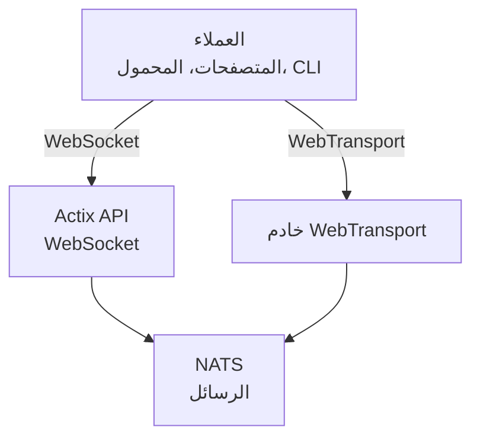

# videocall.rs

<a href="https://opensource.org/licenses/MIT"></a>
<a href="https://discord.gg/JP38NRe4CJ"></a> 
<a href="https://www.digitalocean.com/?refcode=6de4e19c5193&utm_campaign=Referral_Invite&utm_medium=Referral_Program&utm_source=badge"></a>

منصة مؤتمرات فيديو مفتوحة المصدر وعالية الأداء مبنية باستخدام Rust، توفر اتصالات في الوقت الحقيقي بزمن انتقال منخفض.

**[الموقع الإلكتروني](https://videocall.rs)** | **[مجتمع ديسكورد](https://discord.gg/JP38NRe4CJ)**

## جدول المحتويات

- [نظرة عامة](#overview)
- [الميزات](#features)
- [لماذا WebTransport بدلاً من WebRTC؟](#why-webtransport-instead-of-webrtc)
- [هندسة النظام](#system-architecture)
- [البدء](#getting-started)
  - [المتطلبات المسبقة](#prerequisites)
  - [إعداد Docker](#docker-setup)
  - [الإعداد اليدوي](#manual-setup)
- [الاستخدام](#usage)
- [الأداء](#performance)
- [الأمان](#security)
- [خطة الطريق](#roadmap)
- [المساهمة](#contributing)
- [هيكل المشروع](#project-structure)
- [العروض والوسائط](#demos-and-media)
- [المساهمون](#contributors)
- [الرخصة](#license)

## نظرة عامة

videocall.rs هو نظام مؤتمرات فيديو حديث ومفتوح المصدر مكتوب بالكامل بلغة Rust، مصمم للمطورين الذين يحتاجون إلى قدرات اتصال في الوقت الحقيقي موثوقة وقابلة للتوسع وآمنة. يوفر أساسًا لبناء حلول اتصال فيديو مخصصة، مع دعم لكل من العملاء المستندين إلى المتصفح والعملاء الأصليين.

**حالة المشروع:** بيتا - في طور التطوير النشط ومناسب للاستخدام الإنتاجي غير الحرج

## الميزات

- **أداء عالي:** مبني باستخدام Rust لتحقيق أفضل استخدام للموارد وزمن انتقال منخفض
- **دعم بروتوكولات نقل متعددة:** دعم WebSockets و WebTransport 
- **تشفير من الطرف إلى الطرف (E2EE):** اتصالات آمنة اختيارية بين الأقران
- **هندسة قابلة للتوسع:** مصمم باستخدام نموذج النشر/الاشتراك باستخدام NATS للتوسع الأفقي
- **دعم عبر الأنظمة:** يعمل على متصفحات مبنية على Chromium (Chrome، Edge، Brave) مع دعم Safari قيد التطوير. لا يدعم Firefox بسبب عدم اكتمال تنفيذ MediaStreamTrackProcessor.
- **دعم العملاء الأصليين:** أداة CLI للبث الفيديو بدون واجهة من أجهزة مثل Raspberry Pi
- **مفتوح المصدر:** مرخص برخصة MIT لأقصى قدر من المرونة

## لماذا WebTransport بدلاً من WebRTC؟

WebTransport هي تقنية أساسية تميز videocall.rs عن حلول مؤتمرات الفيديو التقليدية. كمطور، إليك لماذا نهجنا باستخدام WebTransport متفوق تقنيًا:

### المزايا التقنية

- **لا SFUs، ولا عبور NAT:** WebTransport يلغي الحاجة إلى وحدات إعادة التوجيه الانتقائي المعقدة وآليات عبور NAT التي تعاني منها تطبيقات WebRTC وتتسبب في العديد من مشاكل المطورين.

- **هندسة مبسطة:** لا مزيد من خوادم STUN/TURN المعقدة، أو تفاوض ICE، أو رقصات الإشارة المعقدة المطلوبة في WebRTC. فقط اتصالات مباشرة وبسيطة.

- **كفاءة البروتوكول:** مبني على HTTP/3 وQUIC، يوفر WebTransport تدفقات متعددة الاتجاهات مع تحكم أفضل في الازدحام واستعادة فقدان الحزم مقارنة بقنوات بيانات SCTP القديمة في WebRTC.

- **زمن انتقال أقل:** إنشاء الاتصال 0-RTT في QUIC يقلل أوقات الاتصال الأولية مقارنة بجولات WebRTC المتعددة.

- **تجربة تطوير نظيفة:** يقدم WebTransport واجهة برمجة تطبيقات أكثر بديهية مع تصميم قائم على الوعود وإدارة تدفقات أنظف.

- **مستقبلي:** كجزء من منصة الويب الحديثة التي تطورها IETF وW3C، يحظى WebTransport بدعم قوي من بائعي المتصفحات ومواصفات متطورة نشطة.

### تداعيات للمطورين

بالنسبة للمطورين الذين يدمجون videocall.rs، هذا يعني:
- ✅ هندسة نشر أبسط بكثير
- ✅ لا حاجة لتكوين شبكة معقد أو مشاكل جدار ناري
- ✅ أداء أفضل في ظروف الشبكة الصعبة
- ✅ سلوك أكثر قابلية للتنبؤ عبر التطبيقات
- ✅ وقت أقل في تصحيح مشكلات الاتصال
- ✅ استثمار تقني يواكب المستقبل

اقرأ [وثيقة الهندسة](ARCHITECTURE.md) الخاصة بنا للغوص العميق في كيفية تنفيذ WebTransport والفوائد التقنية التي يوفرها.

## هندسة النظام

يتبع videocall.rs هندسة خدمات مصغرة مع هذه المكونات الرئيسية:



1. **actix-api:** خادم خلفي مبني بلغة Rust يستخدم إطار عمل Actix Web
2. **yew-ui:** واجهة ويب مبنية باستخدام إطار عمل Yew ومترجمة إلى WebAssembly
3. **videocall-types:** أنواع بيانات مشتركة وتعريفات البروتوكول
4. **videocall-client:** مكتبة العميل للتكامل الأصلي
5. **videocall-cli:** واجهة سطر الأوامر للبث الفيديو بدون واجهة


لمزيد من الشرح التفصيلي لهندسة النظام، يرجى مراجعة [وثيقة الهندسة](ARCHITECTURE.md).

## البدء

**⭐ موصى به: Docker هو الطريقة الوحيدة المدعومة بالكامل للتطوير ⭐**

نوصي بشدة باستخدام إعداد Docker للتطوير، لأنه مُحدث جيدًا ويوفر سلوكًا متسقًا عبر الأنظمة الأساسية. الإعداد اليدوي الموضح أدناه ليس مُحدثًا جيدًا وقد يتطلب المزيد من استكشاف الأخطاء وإصلاحها.

### المتطلبات المسبقة

- توزيعة لينكس حديثة، macOS، أو Windows 10/11
- [Docker](https://docs.docker.com/engine/install/) و Docker Compose (لإعداد الحاويات)
- [أدوات Rust](https://rustup.rs/) إصدار 1.85+ (للإعداد اليدوي)
- متصفح مبني على Chromium (Chrome، Edge، Brave) للوصول إلى الواجهة الأمامية - Firefox غير مدعوم

### إعداد Docker

أسهل طريقة للبدء هي باستخدام إعداد Docker:

1. استنساخ المستودع:
   ```
   git clone https://github.com/security-union/videocall-rs.git
   cd videocall-rs
   ```

2. تشغيل الخادم (استبدل `<server-ip>` بعنوان IP الخاص بجهازك):
   ```
   make up
   ```

3. افتح Chrome باستخدام السكريبت المقدم لـ WebTransport المحلي:
   ```
   ./launch_chrome.sh
   ```

4. الوصول إلى التطبيق على:
   ```
   http://<server-ip>/meeting/<username>/<meeting-id>
   ```

### الإعداد اليدوي (تجريبي)

⚠️ **تحذير**: هذه الطريقة تجريبية وليست مُحدثة جيدًا مثل طريقة Docker. قد تواجه مشاكل تتطلب تصحيح يدوي.

للمستخدمين المتقدمين الذين يفضلون تشغيل الخدمات مباشرة على أجهزتهم:

1. إنشاء قاعدة بيانات PostgreSQL:
   ```
   createdb actix-api-db
   ```

2. تثبيت الأدوات المطلوبة:
   ```
   # تثبيت خادم NATS
   curl -L https://github.com/nats-io/nats-server/releases/download/v2.9.8/nats-server-v2.9.8-linux-amd64.tar.gz | tar xz
   sudo mv nats-server-v2.9.8-linux-amd64/nats-server /usr/local/bin
   
   # تثبيت trurl
   cargo install trurl
   ```

3. بدء بيئة التطوير:
   ```
   ./start_dev.sh
   ```

4. الاتصال على:
   ```
   http://localhost:8081/meeting/<username>/<meeting-id>
   ```

لخيارات التكوين التفصيلية، راجع [وثائق الإعداد](https://docs.videocall.rs/setup).

## الاستخدام

### العملاء عبر المتصفح

1. انتقل إلى نسختك المنشورة أو إعداد localhost:
   ```
   http://<server-address>/meeting/<username>/<meeting-id>
   ```

2. منح أذونات الكاميرا والميكروفون عند الطلب

3. انقر على "اتصال" للانضمام إلى الاجتماع

### البث عبر CLI

لأجهزة بدون واجهة مثل Raspberry Pi:

```bash
# تثبيت أداة CLI
cargo install videocall-cli

# البث من كاميرا
videocall-cli stream \
  --user-id <your-user-id> \
  --video-device-index 0 \
  --meeting-id <meeting-id> \
  --resolution 1280x720 \
  --fps 30 \
  --frame-format NV12 \
  --bitrate-kbps 500
```
للحصول على معلومات مفصلة حول أداة CLI وجميع الخيارات المتاحة، راجع [README الخاص بـ videocall-cli](https://raw.githubusercontent.com/security-union/videocall-rs/main/videocall-cli/README.md).

## الأداء

تم اختبار وتحسين videocall.rs للسيناريوهات التالية:

- **المكالمات الفردية (1-على-1):** استخدام موارد منخفض مع تأخير أقل من 100 مللي ثانية على الاتصالات النموذجية
- **المجموعات الصغيرة (3-10):** طوبولوجيا شبكة فعالة مع جودة تكيفية بناءً على ظروف الشبكة
- **المؤتمرات الكبيرة:** تم الاختبار مع ما يصل إلى 1000 مشارك باستخدام بنية التوجيه الانتقائي

### التحسينات التقنية

- **تصميم بدون نسخ:** يقلل من نسخ البيانات بين طبقة الشبكة وكود التطبيق
- **نواة غير متزامنة:** مبنية على نظام async/await في Rust مع وقت تشغيل Tokio  
- **معالجة معجلة بواسطة SIMD:** تستخدم التوجيه المتجه لوحدة المعالجة المركزية لعمليات الوسائط حيثما كان متاحًا
- **هياكل بيانات خالية من القفل:** تقلل من التنافس في سيناريوهات ذات معدل نقل عالي
- **تحسينات على مستوى البروتوكول:** ضبط مخصص للتحكم في الازدحام وجدولة الحزم

### استخدام الموارد

تم تصميم هندسة الخادم لدينا للكفاءة على نطاق واسع:

- **التوسع الأفقي:** زيادة خطية في الأداء مع إضافة نسخ خادم إضافية
- **توزيع الحمل:** موازنة الاتصال التلقائية عبر مجموعة الخوادم
- **حوكمة الموارد:** حدود قابلة للتكوين للنطاق الترددي، الاتصالات، واستخدام وحدة المعالجة المركزية
- **محسن للحاويات:** مصمم للنشر الفعال في بيئات Kubernetes

ستكون مؤشرات الأداء وإرشادات الضبط متاحة في [وثائق الأداء](https://raw.githubusercontent.com/security-union/videocall-rs/main/PERFORMANCE.md). (قيد العمل)

## الأمان

الأمان هو محور أساسي في videocall.rs:

- **أمان النقل:** جميع الاتصالات تستخدم TLS/HTTPS.
- **التشفير من الطرف إلى الطرف:** تشفير اختياري بين الأقران بدون وصول الخادم للمحتوى.
- **المصادقة:** تكامل مرن مع موفري الهوية.
- **ضوابط الوصول:** نظام أذونات دقيق لغرف الاجتماعات.

للتفاصيل حول نموذج الأمان وأفضل الممارسات، راجع [وثائق الأمان](https://docs.videocall.rs/security).

## خارطة الطريق

| الإصدار | التاريخ المستهدف | الميزات الرئيسية |
|---------|------------------|------------------|
| 0.5.0   | الربع الثاني 2023 | ✅ التشفير من الطرف إلى الطرف |
| 0.6.0   | الربع الثالث 2023 | ✅ دعم متصفح Safari |
| 0.7.0   | الربع الرابع 2023 | ✅ حزم تطوير الأجهزة المحمولة الأصلية |
| 0.8.0   | الربع الأول 2024 | 🔄 تحسينات مشاركة الشاشة |
| 1.0.0   | الربع الثاني 2024 | 🔄 إصدار الإنتاج مع استقرار كامل لواجهة برمجة التطبيقات |

## المساهمة

نرحب بمساهمات المجتمع! إليك كيفية المشاركة:

1. **المشكلات:** الإبلاغ عن الأخطاء أو اقتراح الميزات عبر [GitHub Issues](https://github.com/security-union/videocall-rs/issues)

2. **طلبات السحب:** تقديم PR لإصلاحات الأخطاء أو التحسينات

3. **عملية RFC:** للتغييرات الكبيرة، شارك في [عملية RFC](/rfc)

4. **المجتمع:** انضم إلى [خادم Discord](https://discord.gg/JP38NRe4CJ) لمناقشة التطوير

راجع [إرشادات المساهمة](https://raw.githubusercontent.com/security-union/videocall-rs/main/CONTRIBUTING.md) لمزيد من المعلومات التفصيلية.

### تقنية التكنولوجيا

- **الخلفية:** Rust + Actix Web + PostgreSQL + NATS
- **الواجهة الأمامية:** Rust + Yew + WebAssembly + Tailwind CSS
- **النقل:** WebTransport (QUIC/HTTP3) + WebSockets (كخيار احتياطي)
- **نظام البناء:** Cargo + Trunk + Docker + Helm
- **الاختبار:** إطار اختبار Rust + Playwright للاختبارات الشاملة (E2E)

### الميزات التقنية الرئيسية

- **البث ثنائي الاتجاه:** تمرير رسائل غير متزامن بالكامل باستخدام تدفقات QUIC
- **معالجة الأخطاء:** نشر شامل للأخطاء معتمد على Result في كامل قاعدة الكود
- **التجزئة:** فصل واضح للمسؤوليات مع واجهات معرفة جيدًا بين المكونات
- **سلامة الأنواع:** استخدام موسع لنظام أنواع Rust لمنع أخطاء وقت التشغيل
- **بروتوكول ثنائي:** تسلسل فعال باستخدام Protocol Buffer لجميع الرسائل

للحصول على نظرة فنية أكثر شمولاً، راجع [وثيقة الهندسة المعمارية](https://raw.githubusercontent.com/security-union/videocall-rs/main/ARCHITECTURE.md).

### Git Hooks

يحتوي هذا المستودع على Git hooks لضمان جودة الكود:

1. **Hook قبل الالتزام:** يقوم تلقائيًا بتشغيل `cargo fmt` قبل كل التزام لضمان تنسيق الكود بشكل متسق.
2. **Hook بعد الالتزام:** يقوم بتشغيل `cargo clippy` بعد كل التزام لفحص التحسينات المحتملة في الكود.

لتثبيت هذه الـ hooks، شغّل الأوامر التالية من جذر المشروع:

```bash
# إنشاء مجلد hooks إذا لم يكن موجودًا
mkdir -p .git/hooks

# إنشاء hook قبل الالتزام
cat > .git/hooks/pre-commit << 'EOF'
#!/bin/sh

# تشغيل cargo fmt والتحقق من وجود تغييرات
echo "تشغيل cargo fmt..."
cargo fmt --all -- --check

# التحقق من رمز الخروج لـ cargo fmt
if [ $? -ne 0 ]; then
    echo "وجد cargo fmt مشاكل في التنسيق. يرجى إصلاحها قبل الالتزام."
    exit 1
fi

exit 0
EOF

# إنشاء hook بعد الالتزام
cat > .git/hooks/post-commit << 'EOF'
#!/bin/sh

# تشغيل cargo clippy بعد الالتزام
echo "تشغيل cargo clippy..."
ACTIX_UI_BACKEND_URL="" WEBTRANSPORT_HOST="" LOGIN_URL="" WEBTRANSPORT_URL="" ACTIX_API_URL="" cargo clippy -- -D warnings

# التحقق من رمز الخروج لـ cargo clippy
if [ $? -ne 0 ]; then
    echo "وجد cargo clippy مشاكل في الكود الخاص بك. يرجى إصلاحها."
    # لا يمكننا إلغاء الالتزام لأنه تم بالفعل، لكن يمكننا إعلام المستخدم
    echo "تم الالتزام بنجاح، ولكن يرجى التفكير في إصلاح مشكلات clippy قبل الدفع."
fi

exit 0
EOF

# جعل الـ hooks قابلة للتنفيذ
chmod +x .git/hooks/pre-commit .git/hooks/post-commit
```

تساعد هذه الـ hooks في الحفاظ على جودة الكود من خلال ضمان التنسيق الصحيح وفحص المشاكل الشائعة.

## العروض والوسائط

### العروض التقنية

- [التوسع إلى 1000 مستخدم في المكالمة](https://youtu.be/LWwOSZJwEJI)
- [دليل إثبات المفهوم الأولي (2022)](https://www.youtube.com/watch?v=kZ9isFw1TQ8)

### القنوات

- [قناة يوتيوب](https://www.youtube.com/@dario.lencina)

## المساهمون

<table>
<tr>
<td align="center"><a href="https://github.com/darioalessandro"><br /><sub><b>داريو لينسينا</b></sub></a></td>
<td align="center"><a href="https://github.com/griffobeid"><br /><sub><b>غريفين عبيد</b></sub></a></td>    
<td align="center"><a href="https://github.com/ronen"><br /><sub><b>رونين بارزل</b></sub></a></td>
<td align="center"><a href="https://github.com/leon3s"><br /><sub><b>ليون</b></sub></a></td>
<td align="center"><a href="https://github.com/JasterV"><br /><sub><b>فيكتور مارتينيز</b></sub></a></td>
</tr>
</table>

شكر خاص لـ [JasterV](https://github.com/JasterV) على تنفيذ Actix websocket الذي يحتوي على مقتطفات من مشروع [chat-rooms-actix](https://github.com/JasterV/chat-rooms-actix).

## الترخيص

هذا المشروع مرخص بموجب رخصة MIT - راجع ملف [LICENSE.md](https://raw.githubusercontent.com/security-union/videocall-rs/main/LICENSE.md) للتفاصيل.


---


Tranlated By [Open Ai Tx](https://github.com/OpenAiTx/OpenAiTx) | Last indexed: 2025-06-11


---