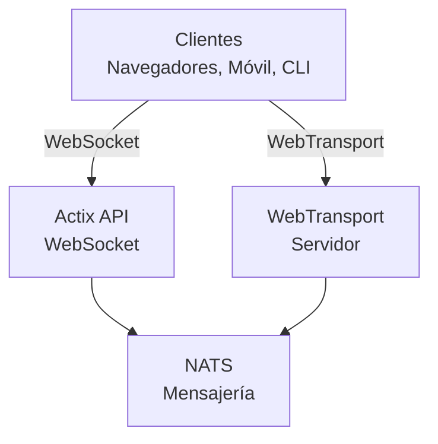

# videocall.rs

<a href="https://opensource.org/licenses/MIT"></a>
<a href="https://discord.gg/JP38NRe4CJ"></a> 
<a href="https://www.digitalocean.com/?refcode=6de4e19c5193&utm_campaign=Referral_Invite&utm_medium=Referral_Program&utm_source=badge"></a>

Una plataforma de videoconferencia de alto rendimiento y código abierto construida con Rust, que proporciona comunicación en tiempo real con baja latencia.

**[Sitio web](https://videocall.rs)** | **[Comunidad Discord](https://discord.gg/JP38NRe4CJ)**

## Tabla de Contenidos

- [Descripción general](#overview)
- [Características](#features)
- [¿Por qué WebTransport en lugar de WebRTC?](#why-webtransport-instead-of-webrtc)
- [Arquitectura del sistema](#system-architecture)
- [Primeros pasos](#getting-started)
  - [Requisitos previos](#prerequisites)
  - [Configuración con Docker](#docker-setup)
  - [Configuración manual](#manual-setup)
- [Uso](#usage)
- [Rendimiento](#performance)
- [Seguridad](#security)
- [Hoja de ruta](#roadmap)
- [Contribuciones](#contributing)
- [Estructura del proyecto](#project-structure)
- [Demos y medios](#demos-and-media)
- [Colaboradores](#contributors)
- [Licencia](#license)

## Descripción general

videocall.rs es un sistema moderno y de código abierto para videoconferencias escrito completamente en Rust, diseñado para desarrolladores que necesitan capacidades de comunicación en tiempo real confiables, escalables y seguras. Proporciona una base para construir soluciones personalizadas de comunicación por video, con soporte tanto para clientes basados en navegador como nativos.

**Estado del proyecto:** Beta - En desarrollo activo y apto para uso en producción no crítico

## Características

- **Alto rendimiento:** Construido con Rust para una utilización óptima de recursos y baja latencia
- **Múltiples protocolos de transporte:** Soporte para WebSockets y WebTransport 
- **Cifrado de extremo a extremo (E2EE):** Comunicaciones seguras opcionales entre pares
- **Arquitectura escalable:** Diseñado con un modelo pub/sub usando NATS para escalabilidad horizontal
- **Soporte multiplataforma:** Funciona en navegadores basados en Chromium (Chrome, Edge, Brave) con soporte para Safari en desarrollo. Firefox no es compatible debido a una implementación incompleta de MediaStreamTrackProcessor.
- **Soporte para cliente nativo:** Herramienta CLI para streaming de video sin cabeza desde dispositivos como Raspberry Pi
- **Código abierto:** Licenciado bajo MIT para máxima flexibilidad

## ¿Por qué WebTransport en lugar de WebRTC?

WebTransport es una tecnología fundamental que diferencia a videocall.rs de las soluciones tradicionales de videoconferencia. Como desarrollador, aquí está por qué nuestro enfoque con WebTransport es técnicamente superior:

### Ventajas técnicas

- **Sin SFUs, sin traversal NAT:** WebTransport elimina la necesidad de unidades de reenvío selectivo (Selective Forwarding Units) complejas y mecanismos de traversal NAT que complican las implementaciones de WebRTC y causan innumerables problemas a los desarrolladores.

- **Arquitectura simplificada:** No más servidores STUN/TURN complejos, negociación de candidatos ICE ni complicados procesos de señalización requeridos por WebRTC. Solo conexiones directas y sencillas.

- **Eficiencia del protocolo:** Basado en HTTP/3 y QUIC, WebTransport ofrece streams multiplexados y bidireccionales con mejor control de congestión y recuperación de pérdidas de paquetes que los canales de datos SCTP anticuados de WebRTC.

- **Menor latencia:** El establecimiento de conexión 0-RTT de QUIC reduce los tiempos iniciales de conexión en comparación con los múltiples viajes de ida y vuelta de WebRTC.

- **Experiencia de desarrollo limpia:** WebTransport ofrece una API más intuitiva para desarrolladores con un diseño basado en promesas y una gestión de streams más ordenada.

- **Tecnología a prueba de futuro:** Como parte de la plataforma web moderna desarrollada por IETF y W3C, WebTransport cuenta con fuerte soporte de los proveedores de navegadores y una especificación en evolución activa.

### Implicaciones para desarrolladores

Para los desarrolladores que integran videocall.rs, esto significa:
- ✅ Arquitectura de despliegue drásticamente más simple
- ✅ Sin configuraciones de red complejas ni problemas con firewalls
- ✅ Mejor rendimiento en condiciones de red adversas
- ✅ Comportamiento más predecible entre implementaciones
- ✅ Menos tiempo dedicado a depurar problemas de conectividad
- ✅ Una inversión tecnológica orientada al futuro

Lea nuestro [Documento de Arquitectura](https://raw.githubusercontent.com/security-union/videocall-rs/main/ARCHITECTURE.md) para un análisis profundo de cómo implementamos WebTransport y los beneficios técnicos que ofrece.

## Arquitectura del sistema

videocall.rs sigue una arquitectura de microservicios con estos componentes principales:



1. **actix-api:** Servidor backend en Rust usando el framework Actix Web  
2. **yew-ui:** Frontend web construido con el framework Yew y compilado a WebAssembly  
3. **videocall-types:** Tipos de datos compartidos y definiciones de protocolo  
4. **videocall-client:** Biblioteca cliente para integración nativa  
5. **videocall-cli:** Interfaz de línea de comandos para streaming de video sin cabeza  

Para una explicación más detallada de la arquitectura del sistema, consulte nuestro [Documento de Arquitectura](https://raw.githubusercontent.com/security-union/videocall-rs/main/ARCHITECTURE.md).

## Primeros pasos

**⭐ RECOMENDADO: Docker es el único método de desarrollo totalmente soportado ⭐**

Recomendamos encarecidamente usar la configuración basada en Docker para desarrollo, ya que está bien mantenida y proporciona un comportamiento consistente entre plataformas. La configuración manual descrita a continuación no está tan bien mantenida y puede requerir solución de problemas adicional.

### Requisitos previos

- Distribución Linux moderna, macOS o Windows 10/11  
- [Docker](https://docs.docker.com/engine/install/) y Docker Compose (para configuración con contenedores)  
- [Toolchain de Rust](https://rustup.rs/) 1.85+ (para configuración manual)  
- Navegador basado en Chromium (Chrome, Edge, Brave) para acceso al frontend - Firefox no es compatible  

### Configuración con Docker

La forma más rápida de comenzar es con nuestra configuración basada en Docker:

1. Clonar el repositorio:  
   ```
   git clone https://github.com/security-union/videocall-rs.git
   cd videocall-rs
   ```

2. Iniciar el servidor (reemplace `<server-ip>` con la IP de su máquina):  
   ```
   make up
   ```

3. Abrir Chrome usando el script proporcionado para WebTransport local:  
   ```
   ./launch_chrome.sh
   ```

4. Acceder a la aplicación en:  
   ```
   http://<server-ip>/meeting/<username>/<meeting-id>
   ```

### Configuración manual (experimental)

⚠️ **Advertencia**: Este método de configuración es experimental y no está tan bien mantenido como el enfoque con Docker. Puede encontrar problemas que requieran depuración manual.

Para usuarios avanzados que prefieran ejecutar los servicios directamente en su máquina:

1. Crear una base de datos PostgreSQL:  
   ```
   createdb actix-api-db
   ```

2. Instalar herramientas necesarias:  
   ```
   # Instalar servidor NATS
   curl -L https://github.com/nats-io/nats-server/releases/download/v2.9.8/nats-server-v2.9.8-linux-amd64.tar.gz | tar xz
   sudo mv nats-server-v2.9.8-linux-amd64/nats-server /usr/local/bin
   
   # Instalar trurl
   cargo install trurl
   ```

3. Iniciar el entorno de desarrollo:  
   ```
   ./start_dev.sh
   ```

4. Conectarse a:  
   ```
   http://localhost:8081/meeting/<username>/<meeting-id>
   ```

Para opciones detalladas de configuración, consulte nuestra [documentación de configuración](https://docs.videocall.rs/setup).

## Uso

### Clientes basados en navegador

1. Navegue a su instancia desplegada o configuración local:  
   ```
   http://<server-address>/meeting/<username>/<meeting-id>
   ```

2. Conceda permisos para cámara y micrófono cuando se le solicite

3. Haga clic en "Conectar" para unirse a la reunión

### Streaming mediante CLI

Para dispositivos sin cabeza como Raspberry Pi:

```bash
# Instalar la herramienta CLI
cargo install videocall-cli

# Transmitir desde una cámara
videocall-cli stream \
  --user-id <your-user-id> \
  --video-device-index 0 \
  --meeting-id <meeting-id> \
  --resolution 1280x720 \
  --fps 30 \
  --frame-format NV12 \
  --bitrate-kbps 500
```
Para información detallada sobre la herramienta CLI y todas las opciones disponibles, consulte el [README de videocall-cli](https://raw.githubusercontent.com/security-union/videocall-rs/main/videocall-cli/README.md).

## Rendimiento

videocall.rs ha sido evaluado y optimizado para los siguientes escenarios:

- **Llamadas 1 a 1:** Utilización mínima de recursos con latencia <100ms en conexiones típicas
- **Grupos Pequeños (3-10):** Topología en malla eficiente con calidad adaptativa según condiciones de red
- **Conferencias Grandes:** Probado con hasta 1000 participantes utilizando arquitectura de reenvío selectivo

### Optimizaciones Técnicas

- **Diseño Zero-Copy:** Minimiza la copia de datos entre la pila de red y el código de la aplicación
- **Núcleo Asíncrono:** Construido sobre el ecosistema async/await de Rust con runtime Tokio  
- **Procesamiento Acelerado por SIMD:** Utiliza vectorización de CPU para operaciones multimedia cuando está disponible
- **Estructuras de Datos Sin Bloqueos:** Minimiza la contención en escenarios de alto rendimiento
- **Optimizaciones a Nivel de Protocolo:** Control de congestión y programación de paquetes personalizados y ajustados

### Utilización de Recursos

Nuestra arquitectura del lado del servidor está diseñada para la eficiencia a escala:

- **Escalabilidad Horizontal:** Escalado lineal del rendimiento con instancias adicionales de servidor
- **Distribución de Carga:** Balanceo automático de conexiones en el conjunto de servidores
- **Gobernanza de Recursos:** Límites configurables para ancho de banda, conexiones y uso de CPU
- **Optimizado para Contenedores:** Diseñado para despliegues eficientes en entornos Kubernetes

Las métricas de rendimiento y las guías de ajuste estarán disponibles en nuestra [documentación de rendimiento](https://raw.githubusercontent.com/security-union/videocall-rs/main/PERFORMANCE.md). (En progreso)

## Seguridad

La seguridad es un foco central de videocall.rs:

- **Seguridad en el Transporte:** Todas las comunicaciones usan TLS/HTTPS.
- **Cifrado de Extremo a Extremo:** E2EE opcional entre pares sin acceso del servidor al contenido.
- **Autenticación:** Integración flexible con proveedores de identidad.
- **Controles de Acceso:** Sistema de permisos detallado para salas de reuniones.

Para detalles sobre nuestro modelo de seguridad y mejores prácticas, consulte nuestra [documentación de seguridad](https://docs.videocall.rs/security).

## Hoja de Ruta

| Versión | Fecha Objetivo | Características Clave |
|---------|----------------|----------------------|
| 0.5.0   | Q2 2023        | ✅ Cifrado de Extremo a Extremo |
| 0.6.0   | Q3 2023        | ✅ Soporte para Navegador Safari |
| 0.7.0   | Q4 2023        | ✅ SDKs Nativos para Móviles |
| 0.8.0   | Q1 2024        | 🔄 Mejoras en Compartir Pantalla |
| 1.0.0   | Q2 2024        | 🔄 Lanzamiento de Producción con Estabilidad Completa de API |


## Contribuir

¡Damos la bienvenida a contribuciones de la comunidad! Aquí le indicamos cómo participar:

1. **Issues:** Reporte errores o sugiera características vía [GitHub Issues](https://github.com/security-union/videocall-rs/issues)

2. **Pull Requests:** Envíe PRs para corrección de errores o mejoras

3. **Proceso RFC:** Para cambios significativos, participe en nuestro [proceso RFC](https://raw.githubusercontent.com/security-union/videocall-rs/main/rfc)

4. **Comunidad:** Únase a nuestro [servidor de Discord](https://discord.gg/JP38NRe4CJ) para discutir el desarrollo

Consulte nuestras [Directrices para Contribuir](https://raw.githubusercontent.com/security-union/videocall-rs/main/CONTRIBUTING.md) para información más detallada.


### Tecnología Utilizada

- **Backend**: Rust + Actix Web + PostgreSQL + NATS
- **Frontend**: Rust + Yew + WebAssembly + Tailwind CSS
- **Transporte**: WebTransport (QUIC/HTTP3) + WebSockets (fallback)
- **Sistema de Construcción**: Cargo + Trunk + Docker + Helm
- **Pruebas**: Framework de pruebas de Rust + Playwright para pruebas E2E

### Características Técnicas Clave

- **Streaming Bidireccional**: Paso de mensajes completamente asíncrono usando flujos QUIC
- **Manejo de Errores**: Propagación integral de errores basada en Result a lo largo del código
- **Modularidad**: Separación limpia de responsabilidades con interfaces bien definidas entre componentes
- **Seguridad de Tipos**: Uso extensivo del sistema de tipos de Rust para prevenir errores en tiempo de ejecución
- **Protocolo Binario**: Serialización eficiente con Protocol Buffers para todos los mensajes

Para una visión técnica más completa, consulte el [Documento de Arquitectura](https://raw.githubusercontent.com/security-union/videocall-rs/main/ARCHITECTURE.md).

### Git Hooks

Este repositorio incluye hooks de Git para asegurar la calidad del código:

1. **Hook pre-commit:** Ejecuta automáticamente `cargo fmt` antes de cada commit para asegurar formato consistente.
2. **Hook post-commit:** Ejecuta `cargo clippy` después de cada commit para verificar posibles mejoras en el código.

Para instalar estos hooks, ejecute los siguientes comandos desde la raíz del proyecto:

```bash
# Crear el directorio de hooks si no existe
mkdir -p .git/hooks

# Crear el hook pre-commit
cat > .git/hooks/pre-commit << 'EOF'
#!/bin/sh

# Ejecutar cargo fmt y verificar si hay cambios
echo "Ejecutando cargo fmt..."
cargo fmt --all -- --check

# Verificar el código de salida de cargo fmt
if [ $? -ne 0 ]; then
    echo "cargo fmt encontró problemas de formato. Por favor corríjalos antes de hacer commit."
    exit 1
fi

exit 0
EOF

# Crear el hook post-commit
cat > .git/hooks/post-commit << 'EOF'
#!/bin/sh

# Ejecutar cargo clippy después del commit
echo "Ejecutando cargo clippy..."
ACTIX_UI_BACKEND_URL="" WEBTRANSPORT_HOST="" LOGIN_URL="" WEBTRANSPORT_URL="" ACTIX_API_URL="" cargo clippy -- -D warnings

# Verificar el código de salida de cargo clippy
if [ $? -ne 0 ]; then
    echo "Cargo clippy encontró problemas en su código. Por favor corríjalos."
    # No podemos abortar el commit ya que ya se realizó, pero podemos informar al usuario
    echo "El commit fue exitoso, pero considere corregir los problemas reportados por clippy antes de hacer push."
fi

exit 0
EOF

# Hacer los hooks ejecutables
chmod +x .git/hooks/pre-commit .git/hooks/post-commit
```

Estos hooks ayudan a mantener la calidad del código asegurando un formato adecuado y revisando problemas comunes.

## Demostraciones y Medios

### Presentaciones Técnicas

- [Escalando a 1000 Usuarios por Llamada](https://youtu.be/LWwOSZJwEJI)
- [Prueba de Concepto Inicial (2022)](https://www.youtube.com/watch?v=kZ9isFw1TQ8)

### Canales

- [Canal de YouTube](https://www.youtube.com/@dario.lencina)

## Contribuidores

<table>
<tr>
<td align="center"><a href="https://github.com/darioalessandro"><br /><sub><b>Dario Lencina</b></sub></a></td>
<td align="center"><a href="https://github.com/griffobeid"><br /><sub><b>Griffin Obeid</b></sub></a></td>    
<td align="center"><a href="https://github.com/ronen"><br /><sub><b>Ronen Barzel</b></sub></a></td>
<td align="center"><a href="https://github.com/leon3s"><br /><sub><b>Leone</b></sub></a></td>
<td align="center"><a href="https://github.com/JasterV"><br /><sub><b>Victor Martínez</b></sub></a></td>
</tr>
</table>

Agradecimientos especiales a [JasterV](https://github.com/JasterV) por la implementación websocket de Actix que contiene fragmentos del proyecto [chat-rooms-actix](https://github.com/JasterV/chat-rooms-actix).

## Licencia

Este proyecto está licenciado bajo la Licencia MIT - consulte el archivo [LICENSE.md](https://raw.githubusercontent.com/security-union/videocall-rs/main/LICENSE.md) para más detalles.


---


Tranlated By [Open Ai Tx](https://github.com/OpenAiTx/OpenAiTx) | Last indexed: 2025-06-11


---