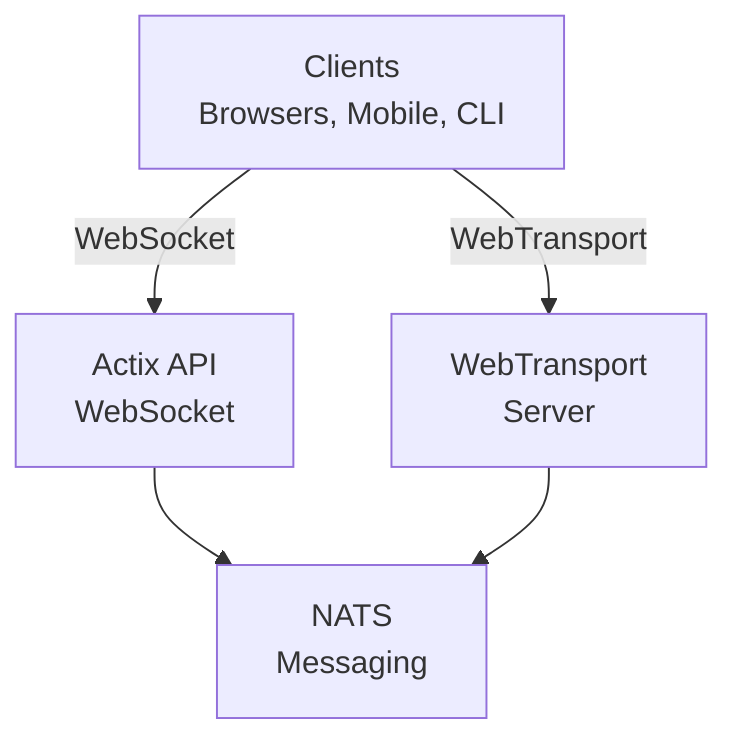

# videocall.rs

<a href="https://opensource.org/licenses/MIT"></a>
<a href="https://discord.gg/JP38NRe4CJ"></a> 
<a href="https://www.digitalocean.com/?refcode=6de4e19c5193&utm_campaign=Referral_Invite&utm_medium=Referral_Program&utm_source=badge"></a>

یک پلتفرم متن‌باز و با عملکرد بالا برای کنفرانس ویدیویی ساخته شده با زبان Rust، که ارتباطات در زمان واقعی با تأخیر کم را فراهم می‌کند.

**[وب‌سایت](https://videocall.rs)** | **[جامعه دیسکورد](https://discord.gg/JP38NRe4CJ)**

## فهرست مطالب

- [مروری کلی](#overview)
- [ویژگی‌ها](#features)
- [چرا WebTransport به جای WebRTC؟](#why-webtransport-instead-of-webrtc)
- [معماری سیستم](#system-architecture)
- [شروع کار](#getting-started)
  - [پیش‌نیازها](#prerequisites)
  - [راه‌اندازی با داکر](#docker-setup)
  - [راه‌اندازی دستی](#manual-setup)
- [نحوه استفاده](#usage)
- [عملکرد](#performance)
- [امنیت](#security)
- [نقشه راه](#roadmap)
- [مشارکت](#contributing)
- [ساختار پروژه](#project-structure)
- [نمونه‌ها و رسانه‌ها](#demos-and-media)
- [مشارکت‌کنندگان](#contributors)
- [مجوز](#license)

## Overview

videocall.rs یک سیستم کنفرانس ویدیویی مدرن و متن‌باز است که کاملاً با Rust نوشته شده است و برای توسعه‌دهندگانی طراحی شده که به قابلیت‌های ارتباطی زمان واقعی قابل اعتماد، مقیاس‌پذیر و امن نیاز دارند. این پروژه پایه‌ای برای ساخت راه‌حل‌های سفارشی ارتباط ویدیویی فراهم می‌کند، با پشتیبانی از هر دو کلاینت مبتنی بر مرورگر و بومی.

**وضعیت پروژه:** نسخه بتا - به طور فعال توسعه داده می‌شود و برای استفاده در تولید غیر بحرانی مناسب است

## Features

- **عملکرد بالا:** ساخته شده با Rust برای استفاده بهینه از منابع و تأخیر کم
- **پشتیبانی از چندین پروتکل انتقال:** پشتیبانی از WebSockets و WebTransport
- **رمزنگاری انتها به انتها (E2EE):** ارتباطات امن اختیاری بین همتاها
- **معماری مقیاس‌پذیر:** طراحی شده با مدل pub/sub با استفاده از NATS برای مقیاس‌پذیری افقی
- **پشتیبانی چندسکویی:** کارکرد روی مرورگرهای مبتنی بر کرومیوم (کروم، اج، بریو) با پشتیبانی در حال توسعه برای سافاری. فایرفاکس پشتیبانی نمی‌شود به دلیل پیاده‌سازی ناقص MediaStreamTrackProcessor.
- **پشتیبانی از کلاینت بومی:** ابزار خط فرمان برای پخش ویدیو بدون واسط از دستگاه‌هایی مانند رزبری‌پای
- **متن‌باز:** دارای مجوز MIT برای بیشترین انعطاف‌پذیری

## Why WebTransport Instead of WebRTC?

WebTransport یک فناوری پایه است که videocall.rs را از راه‌حل‌های سنتی کنفرانس ویدیویی متمایز می‌کند. به عنوان یک توسعه‌دهنده، دلایل برتری فنی رویکرد WebTransport ما عبارتند از:

### مزایای فنی

- **بدون SFU و بدون عبور از NAT:** WebTransport نیاز به واحدهای انتقال انتخابی پیچیده و مکانیزم‌های عبور از NAT که در پیاده‌سازی‌های WebRTC مشکلات زیادی ایجاد می‌کنند را از بین می‌برد.

- **معماری ساده‌تر:** دیگر نیازی به سرورهای پیچیده STUN/TURN، مذاکره کاندیدهای ICE یا رقص‌های سیگنالینگ پیچیده مورد نیاز WebRTC نیست. فقط اتصال‌های مستقیم و ساده.

- **بهره‌وری پروتکل:** ساخته شده روی HTTP/3 و QUIC، WebTransport جریان‌های چندگانه و دوطرفه با کنترل تراکم بهتر و بهبود بازیابی از دست رفتن بسته‌ها نسبت به کانال‌های داده SCTP قدیمی WebRTC فراهم می‌کند.

- **کاهش تأخیر:** برقراری اتصال 0-RTT در QUIC زمان اتصال اولیه را در مقایسه با چندین رفت و برگشت WebRTC کاهش می‌دهد.

- **تجربه توسعه تمیز:** WebTransport API توسعه‌دهنده‌ای شهودی‌تر با طراحی مبتنی بر وعده‌ها و مدیریت جریان‌های مرتب‌تر ارائه می‌دهد.

- **آینده‌نگر:** به عنوان بخشی از پلتفرم مدرن وب که توسط IETF و W3C توسعه یافته است، WebTransport پشتیبانی قوی از سوی فروشندگان مرورگر دارد و مشخصات آن به طور فعال در حال تکامل است.

### پیامدهای توسعه‌دهنده

برای توسعه‌دهندگانی که videocall.rs را یکپارچه می‌کنند، این بدان معناست:
- ✅ معماری استقرار به شدت ساده‌تر
- ✅ بدون پیکربندی شبکه پیچیده یا مشکلات فایروال
- ✅ عملکرد بهتر در شرایط شبکه چالش‌برانگیز
- ✅ رفتار قابل پیش‌بینی‌تر در پیاده‌سازی‌ها
- ✅ صرف زمان کمتر برای اشکال‌زدایی مشکلات اتصال
- ✅ سرمایه‌گذاری روی فناوری آینده‌نگر

برای مطالعه عمیق‌تر در مورد نحوه پیاده‌سازی WebTransport و مزایای فنی آن، سند [معماری](https://raw.githubusercontent.com/security-union/videocall-rs/main/ARCHITECTURE.md) ما را بخوانید.

## System Architecture

videocall.rs از معماری میکروسرویس با اجزای اصلی زیر پیروی می‌کند:



1. **actix-api:** سرور بک‌اند مبتنی بر Rust با استفاده از فریم‌ورک Actix Web  
2. **yew-ui:** فرانت‌اند وب ساخته شده با فریم‌ورک Yew و کامپایل شده به WebAssembly  
3. **videocall-types:** انواع داده و تعاریف پروتکل مشترک  
4. **videocall-client:** کتابخانه کلاینت برای یکپارچه‌سازی بومی  
5. **videocall-cli:** رابط خط فرمان برای پخش ویدیو بدون واسط  

برای توضیح دقیق‌تر معماری سیستم، لطفاً سند [معماری](https://raw.githubusercontent.com/security-union/videocall-rs/main/ARCHITECTURE.md) ما را مشاهده کنید.

## Getting Started

**⭐ توصیه می‌شود: داکر تنها روش توسعه کاملاً پشتیبانی‌شده است ⭐**

ما به شدت توصیه می‌کنیم برای توسعه از راه‌اندازی مبتنی بر داکر استفاده کنید، زیرا به خوبی نگهداری می‌شود و رفتار سازگاری در پلتفرم‌ها ارائه می‌دهد. راه‌اندازی دستی که در ادامه شرح داده شده است به خوبی نگهداری نمی‌شود و ممکن است نیاز به عیب‌یابی اضافی داشته باشد.

### Prerequisites

- توزیع مدرن لینوکس، macOS یا ویندوز 10/11  
- [داکر](https://docs.docker.com/engine/install/) و Docker Compose (برای راه‌اندازی کانتینری)  
- [ابزار Rust](https://rustup.rs/) نسخه 1.85+ (برای راه‌اندازی دستی)  
- مرورگر مبتنی بر کرومیوم (کروم، اج، بریو) برای دسترسی به فرانت‌اند — فایرفاکس پشتیبانی نمی‌شود  

### Docker Setup

سریع‌ترین راه شروع با راه‌اندازی مبتنی بر داکر است:

1. مخزن را کلون کنید:  
   ```
   git clone https://github.com/security-union/videocall-rs.git
   cd videocall-rs
   ```

2. سرور را راه‌اندازی کنید (به جای `<server-ip>` آدرس IP دستگاه خود را قرار دهید):  
   ```
   make up
   ```

3. کروم را با اسکریپت ارائه شده برای WebTransport محلی باز کنید:  
   ```
   ./launch_chrome.sh
   ```

4. به برنامه دسترسی پیدا کنید:  
   ```
   http://<server-ip>/meeting/<username>/<meeting-id>
   ```

### Manual Setup (Experimental)

⚠️ **هشدار:** این روش راه‌اندازی آزمایشی است و به اندازه روش داکر نگهداری نمی‌شود. ممکن است با مشکلاتی مواجه شوید که نیاز به عیب‌یابی دستی دارند.

برای کاربران پیشرفته که ترجیح می‌دهند سرویس‌ها را مستقیماً روی دستگاه خود اجرا کنند:

1. ایجاد پایگاه داده PostgreSQL:  
   ```
   createdb actix-api-db
   ```

2. نصب ابزارهای مورد نیاز:  
   ```
   # نصب سرور NATS
   curl -L https://github.com/nats-io/nats-server/releases/download/v2.9.8/nats-server-v2.9.8-linux-amd64.tar.gz | tar xz
   sudo mv nats-server-v2.9.8-linux-amd64/nats-server /usr/local/bin
   
   # نصب trurl
   cargo install trurl
   ```

3. راه‌اندازی محیط توسعه:  
   ```
   ./start_dev.sh
   ```

4. اتصال به:  
   ```
   http://localhost:8081/meeting/<username>/<meeting-id>
   ```

برای گزینه‌های پیکربندی دقیق‌تر، مستندات [راه‌اندازی](https://docs.videocall.rs/setup) ما را ببینید.

## Usage

### Browser-Based Clients

1. به نمونه مستقر شده خود یا راه‌اندازی لوکال هاست بروید:  
   ```
   http://<server-address>/meeting/<username>/<meeting-id>
   ```

2. هنگام درخواست، اجازه دسترسی به دوربین و میکروفون را بدهید

3. روی "اتصال" کلیک کنید تا به جلسه بپیوندید

### CLI-Based Streaming

برای دستگاه‌های بدون واسط مانند رزبری‌پای:

```bash
# نصب ابزار CLI
cargo install videocall-cli

# پخش از دوربین
videocall-cli stream \
  --user-id <your-user-id> \
  --video-device-index 0 \
  --meeting-id <meeting-id> \
  --resolution 1280x720 \
  --fps 30 \
  --frame-format NV12 \
  --bitrate-kbps 500
```
برای اطلاعات دقیق‌تر درباره ابزار CLI و تمامی گزینه‌های موجود، به [videocall-cli README](https://raw.githubusercontent.com/security-union/videocall-rs/main/videocall-cli/README.md) مراجعه کنید.

## عملکرد

videocall.rs برای سناریوهای زیر بنچمارک و بهینه‌سازی شده است:

- **تماس‌های ۱ به ۱:** استفاده حداقلی از منابع با تأخیر کمتر از ۱۰۰ میلی‌ثانیه در اتصالات معمولی
- **گروه‌های کوچک (۳-۱۰ نفر):** توپولوژی مش کارآمد با کیفیت تطبیقی بر اساس شرایط شبکه
- **کنفرانس‌های بزرگ:** آزمایش شده با تا ۱۰۰۰ شرکت‌کننده با استفاده از معماری ارسال انتخابی

### بهینه‌سازی‌های فنی

- **طراحی بدون کپی:** حداقل کردن کپی داده‌ها بین پشته شبکه و کد برنامه
- **هسته ناهمزمان:** ساخته شده بر اساس اکوسیستم async/await زبان Rust با اجرای Tokio  
- **پردازش شتاب‌دهی شده با SIMD:** استفاده از بردارسازی CPU برای عملیات رسانه‌ای در صورت امکان
- **ساختارهای داده بدون قفل:** کاهش رقابت در سناریوهای با حجم بالا
- **بهینه‌سازی‌های سطح پروتکل:** کنترل ازدحام و زمان‌بندی بسته‌ها تنظیم شده به صورت سفارشی

### مصرف منابع

معماری سمت سرور ما برای کارایی در مقیاس طراحی شده است:

- **مقیاس‌پذیری افقی:** افزایش خطی عملکرد با افزودن نمونه‌های سرور
- **توزیع بار:** تعادل خودکار اتصالات در بین استخر سرورها
- **حاکمیت منابع:** تنظیم محدودیت‌های قابل پیکربندی برای پهنای باند، اتصالات و مصرف CPU
- **بهینه شده برای کانتینر:** طراحی شده برای استقرار بهینه در محیط‌های Kubernetes

معیارهای عملکرد و راهنمای تنظیمات در [مستندات عملکرد](https://raw.githubusercontent.com/security-union/videocall-rs/main/PERFORMANCE.md) موجود خواهند بود. (در حال کار)

## امنیت

امنیت یکی از تمرکزهای اصلی videocall.rs است:

- **امنیت انتقال:** تمامی ارتباطات از TLS/HTTPS استفاده می‌کنند.
- **رمزنگاری پایان به پایان:** رمزنگاری اختیاری E2EE بین همتاها بدون دسترسی سرور به محتوا.
- **احراز هویت:** ادغام انعطاف‌پذیر با ارائه‌دهندگان هویت.
- **کنترل دسترسی:** سیستم مجوزدهی دقیق برای اتاق‌های جلسه.

برای جزئیات مدل امنیتی و بهترین شیوه‌ها، به [مستندات امنیت](https://docs.videocall.rs/security) ما مراجعه کنید.

## نقشه راه

| نسخه   | تاریخ هدف | ویژگی‌های کلیدی                   |
|--------|-----------|---------------------------------|
| 0.5.0  | سه‌ماهه دوم ۲۰۲۳ | ✅ رمزنگاری پایان به پایان         |
| 0.6.0  | سه‌ماهه سوم ۲۰۲۳ | ✅ پشتیبانی مرورگر Safari         |
| 0.7.0  | سه‌ماهه چهارم ۲۰۲۳ | ✅ SDKهای بومی موبایل             |
| 0.8.0  | سه‌ماهه اول ۲۰۲۴ | 🔄 بهبودهای اشتراک‌گذاری صفحه نمایش |
| 1.0.0  | سه‌ماهه دوم ۲۰۲۴ | 🔄 انتشار نسخه تولید با ثبات کامل API |

## مشارکت

از مشارکت جامعه استقبال می‌کنیم! برای مشارکت به شرح زیر اقدام کنید:

1. **مسائل:** گزارش باگ یا پیشنهاد ویژگی از طریق [GitHub Issues](https://github.com/security-union/videocall-rs/issues)

2. **درخواست‌های Pull:** ارسال PR برای رفع باگ‌ها یا بهبودها

3. **فرآیند RFC:** برای تغییرات مهم، در [فرآیند RFC](https://raw.githubusercontent.com/security-union/videocall-rs/main/rfc) ما شرکت کنید

4. **جامعه:** به [سرور Discord](https://discord.gg/JP38NRe4CJ) ما بپیوندید تا درباره توسعه بحث کنید

برای اطلاعات دقیق‌تر به [راهنمای مشارکت](https://raw.githubusercontent.com/security-union/videocall-rs/main/CONTRIBUTING.md) مراجعه کنید.

### پشته فناوری

- **بک‌اند**: Rust + Actix Web + PostgreSQL + NATS
- **فرانت‌اند**: Rust + Yew + WebAssembly + Tailwind CSS
- **انتقال:** WebTransport (QUIC/HTTP3) + WebSockets (فالن‌بک)
- **سیستم ساخت:** Cargo + Trunk + Docker + Helm
- **آزمایش:** چارچوب تست Rust + Playwright برای تست‌های انتها به انتها

### ویژگی‌های کلیدی فنی

- **پخش دوطرفه:** ارسال پیام کاملاً ناهمزمان با استفاده از جریان‌های QUIC
- **مدیریت خطا:** انتقال خطا مبتنی بر Result در سراسر کد
- **ماژولار بودن:** جداسازی واضح مسئولیت‌ها با رابط‌های تعریف شده بین اجزا
- **ایمنی نوع:** استفاده گسترده از سیستم نوع Rust برای جلوگیری از خطاهای زمان اجرا
- **پروتکل باینری:** سریال‌سازی کارآمد پروتکل بافر برای همه پیام‌ها

برای مرور فنی جامع‌تر، به [سند معماری](https://raw.githubusercontent.com/security-union/videocall-rs/main/ARCHITECTURE.md) مراجعه کنید.

### گیت هوک‌ها

این مخزن شامل گیت هوک‌هایی برای تضمین کیفیت کد است:

1. **گیت هوک پیش‌کامیت:** به صورت خودکار `cargo fmt` را قبل از هر کامیت اجرا می‌کند تا قالب‌بندی کد یکسان باشد.
2. **گیت هوک پس‌کامیت:** پس از هر کامیت `cargo clippy` را اجرا می‌کند تا بهبودهای احتمالی کد بررسی شود.

برای نصب این هوک‌ها، دستورات زیر را از ریشه پروژه اجرا کنید:

```bash
# ایجاد پوشه hooks در صورت وجود نداشتن
mkdir -p .git/hooks

# ایجاد هوک پیش‌کامیت
cat > .git/hooks/pre-commit << 'EOF'
#!/bin/sh

# اجرای cargo fmt و بررسی تغییرات
echo "در حال اجرای cargo fmt..."
cargo fmt --all -- --check

# بررسی کد خروجی cargo fmt
if [ $? -ne 0 ]; then
    echo "cargo fmt مشکلات قالب‌بندی یافت. لطفاً قبل از کامیت آنها را برطرف کنید."
    exit 1
fi

exit 0
EOF

# ایجاد هوک پس‌کامیت
cat > .git/hooks/post-commit << 'EOF'
#!/bin/sh

# اجرای cargo clippy پس از کامیت
echo "در حال اجرای cargo clippy..."
ACTIX_UI_BACKEND_URL="" WEBTRANSPORT_HOST="" LOGIN_URL="" WEBTRANSPORT_URL="" ACTIX_API_URL="" cargo clippy -- -D warnings

# بررسی کد خروجی cargo clippy
if [ $? -ne 0 ]; then
    echo "Cargo clippy مشکلاتی در کد شما یافت. لطفاً آنها را برطرف کنید."
    # نمی‌توانیم کامیت را لغو کنیم چون انجام شده است، اما می‌توانیم به کاربر اطلاع دهیم
    echo "کامیت موفق بود، اما لطفاً قبل از پوش کردن مشکلات clippy را اصلاح کنید."
fi

exit 0
EOF

# قابل اجرا کردن هوک‌ها
chmod +x .git/hooks/pre-commit .git/hooks/post-commit
```

این هوک‌ها به حفظ کیفیت کد با اطمینان از قالب‌بندی صحیح و بررسی مسائل رایج کمک می‌کنند.

## دموها و رسانه

### ارائه‌های فنی

- [مقیاس‌پذیری تا ۱۰۰۰ کاربر در هر تماس](https://youtu.be/LWwOSZJwEJI)
- [اثبات مفهوم اولیه (۲۰۲۲)](https://www.youtube.com/watch?v=kZ9isFw1TQ8)

### کانال‌ها

- [کانال یوتیوب](https://www.youtube.com/@dario.lencina)

## مشارکت‌کنندگان

<table>
<tr>
<td align="center"><a href="https://github.com/darioalessandro"><br /><sub><b>Dario Lencina</b></sub></a></td>
<td align="center"><a href="https://github.com/griffobeid"><br /><sub><b>Griffin Obeid</b></sub></a></td>    
<td align="center"><a href="https://github.com/ronen"><br /><sub><b>Ronen Barzel</b></sub></a></td>
<td align="center"><a href="https://github.com/leon3s"><br /><sub><b>Leone</b></sub></a></td>
<td align="center"><a href="https://github.com/JasterV"><br /><sub><b>Victor Martínez</b></sub></a></td>
</tr>
</table>

تشکر ویژه از [JasterV](https://github.com/JasterV) برای پیاده‌سازی Actix websocket که شامل قطعاتی از پروژه [chat-rooms-actix](https://github.com/JasterV/chat-rooms-actix) است.

## مجوز

این پروژه تحت مجوز MIT منتشر شده است - برای جزئیات به فایل [LICENSE.md](https://raw.githubusercontent.com/security-union/videocall-rs/main/LICENSE.md) مراجعه کنید.


---


Tranlated By [Open Ai Tx](https://github.com/OpenAiTx/OpenAiTx) | Last indexed: 2025-06-11


---