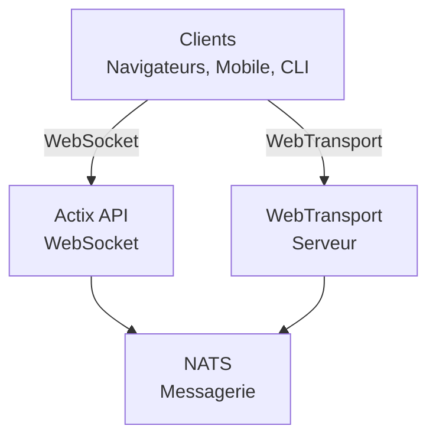

# videocall.rs

<a href="https://opensource.org/licenses/MIT"></a>
<a href="https://discord.gg/JP38NRe4CJ"></a> 
<a href="https://www.digitalocean.com/?refcode=6de4e19c5193&utm_campaign=Referral_Invite&utm_medium=Referral_Program&utm_source=badge"></a>

Une plateforme de vidéoconférence open-source à haute performance construite avec Rust, offrant une communication en temps réel à faible latence.

**[Site Web](https://videocall.rs)** | **[Communauté Discord](https://discord.gg/JP38NRe4CJ)**

## Table des Matières

- [Présentation](#overview)
- [Fonctionnalités](#features)
- [Pourquoi WebTransport au lieu de WebRTC ?](#why-webtransport-instead-of-webrtc)
- [Architecture du Système](#system-architecture)
- [Premiers Pas](#getting-started)
  - [Prérequis](#prerequisites)
  - [Configuration Docker](#docker-setup)
  - [Configuration Manuelle](#manual-setup)
- [Utilisation](#usage)
- [Performance](#performance)
- [Sécurité](#security)
- [Feuille de Route](#roadmap)
- [Contribution](#contributing)
- [Structure du Projet](#project-structure)
- [Démos et Médias](#demos-and-media)
- [Contributeurs](#contributors)
- [Licence](#license)

## Présentation

videocall.rs est un système moderne de vidéoconférence open-source écrit entièrement en Rust, conçu pour les développeurs qui ont besoin de capacités de communication en temps réel fiables, évolutives et sécurisées. Il fournit une base pour construire des solutions de communication vidéo personnalisées, avec prise en charge à la fois des clients basés sur navigateur et natifs.

**Statut du projet :** Beta – Activement développé et adapté pour une utilisation en production non critique

## Fonctionnalités

- **Haute Performance :** Construit avec Rust pour une utilisation optimale des ressources et une faible latence
- **Multiples Protocoles de Transport :** Support de WebSockets et WebTransport
- **Chiffrement de bout en bout (E2EE) :** Communications sécurisées optionnelles entre pairs
- **Architecture Scalable :** Conçu avec un modèle pub/sub utilisant NATS pour une montée en charge horizontale
- **Support Multiplateforme :** Fonctionne sur navigateurs basés sur Chromium (Chrome, Edge, Brave) avec support Safari en développement. Firefox n’est pas supporté à cause d’une implémentation incomplète de MediaStreamTrackProcessor.
- **Support Client Natif :** Outil CLI pour streaming vidéo sans interface depuis des dispositifs comme Raspberry Pi
- **Open Source :** Sous licence MIT pour une flexibilité maximale

## Pourquoi WebTransport au lieu de WebRTC ?

WebTransport est une technologie clé qui différencie videocall.rs des solutions traditionnelles de vidéoconférence. En tant que développeur, voici pourquoi notre approche WebTransport est techniquement supérieure :

### Avantages Techniques

- **Pas de SFU, Pas de Traversée NAT :** WebTransport élimine le besoin d’unités de retransmission sélective complexes et des mécanismes de traversée NAT qui compliquent les implémentations WebRTC et causent d’innombrables maux de tête aux développeurs.

- **Architecture Simplifiée :** Plus besoin de serveurs STUN/TURN complexes, de négociation de candidats ICE ou de danses de signalisation compliquées requises par WebRTC. Juste des connexions directes et simples.

- **Efficacité du Protocole :** Basé sur HTTP/3 et QUIC, WebTransport fournit des flux multiplexés bidirectionnels avec un meilleur contrôle de congestion et une meilleure récupération de perte de paquets que les canaux de données SCTP datés de WebRTC.

- **Latence Plus Faible :** L’établissement de connexion 0-RTT de QUIC réduit les temps de connexion initiaux comparé aux multiples allers-retours de WebRTC.

- **Expérience de Développement Claire :** WebTransport offre une API développeur plus intuitive avec un design basé sur des promesses et une gestion de flux plus propre.

- **Technologie Pérenne :** En tant que partie de la plateforme web moderne développée par l’IETF et le W3C, WebTransport bénéficie d’un fort support des fournisseurs de navigateurs et d’une spécification en évolution active.

### Implications pour les Développeurs

Pour les développeurs intégrant videocall.rs, cela signifie :
- ✅ Architecture de déploiement drastiquement plus simple
- ✅ Pas de configuration réseau complexe ni de problèmes de pare-feu
- ✅ Meilleure performance dans des conditions réseau difficiles
- ✅ Comportement plus prévisible entre différentes implémentations
- ✅ Moins de temps passé à déboguer les problèmes de connectivité
- ✅ Un investissement technologique tourné vers l’avenir

Lisez notre [Document d’Architecture](ARCHITECTURE.md) pour une analyse approfondie de la manière dont nous implémentons WebTransport et des bénéfices techniques qu’il apporte.

## Architecture du Système

videocall.rs suit une architecture microservices avec ces composants principaux :



1. **actix-api :** serveur backend en Rust utilisant le framework Actix Web  
2. **yew-ui :** frontend web construit avec le framework Yew et compilé en WebAssembly  
3. **videocall-types :** types de données partagés et définitions de protocole  
4. **videocall-client :** bibliothèque client pour intégration native  
5. **videocall-cli :** interface en ligne de commande pour streaming vidéo sans interface  

Pour une explication plus détaillée de l’architecture du système, veuillez consulter notre [Document d’Architecture](ARCHITECTURE.md).

## Premiers Pas

**⭐ RECOMMANDÉ : Docker est la seule méthode de développement entièrement supportée ⭐**

Nous recommandons fortement d’utiliser la configuration basée sur Docker pour le développement, car elle est bien maintenue et fournit un comportement cohérent sur les plateformes. La configuration manuelle décrite ci-dessous est moins bien maintenue et peut nécessiter un dépannage supplémentaire.

### Prérequis

- Distribution Linux moderne, macOS ou Windows 10/11  
- [Docker](https://docs.docker.com/engine/install/) et Docker Compose (pour la configuration en conteneurs)  
- [Chaîne d’outils Rust](https://rustup.rs/) 1.85+ (pour la configuration manuelle)  
- Navigateur basé sur Chromium (Chrome, Edge, Brave) pour accéder au frontend – Firefox n’est pas supporté  

### Configuration Docker

Le moyen le plus rapide de commencer est avec notre configuration basée sur Docker :

1. Clonez le dépôt :  
   ```
   git clone https://github.com/security-union/videocall-rs.git
   cd videocall-rs
   ```

2. Démarrez le serveur (remplacez `<server-ip>` par l’adresse IP de votre machine) :  
   ```
   make up
   ```

3. Ouvrez Chrome en utilisant le script fourni pour WebTransport local :  
   ```
   ./launch_chrome.sh
   ```

4. Accédez à l’application à l’adresse :  
   ```
   http://<server-ip>/meeting/<username>/<meeting-id>
   ```

### Configuration Manuelle (Expérimentale)

⚠️ **Attention** : Cette méthode de configuration est expérimentale et moins bien maintenue que l’approche Docker. Vous pouvez rencontrer des problèmes nécessitant un débogage manuel.

Pour les utilisateurs avancés qui préfèrent exécuter les services directement sur leur machine :

1. Créez une base de données PostgreSQL :  
   ```
   createdb actix-api-db
   ```

2. Installez les outils requis :  
   ```
   # Installer le serveur NATS
   curl -L https://github.com/nats-io/nats-server/releases/download/v2.9.8/nats-server-v2.9.8-linux-amd64.tar.gz | tar xz
   sudo mv nats-server-v2.9.8-linux-amd64/nats-server /usr/local/bin
   
   # Installer trurl
   cargo install trurl
   ```

3. Démarrez l’environnement de développement :  
   ```
   ./start_dev.sh
   ```

4. Connectez-vous à :  
   ```
   http://localhost:8081/meeting/<username>/<meeting-id>
   ```

Pour des options de configuration détaillées, consultez notre [documentation d’installation](https://docs.videocall.rs/setup).

## Utilisation

### Clients Basés sur Navigateur

1. Rendez-vous sur votre instance déployée ou votre configuration locale :  
   ```
   http://<server-address>/meeting/<username>/<meeting-id>
   ```

2. Accordez les permissions caméra et microphone lorsque demandé

3. Cliquez sur « Connecter » pour rejoindre la réunion

### Streaming via CLI

Pour les appareils sans interface comme Raspberry Pi :

```bash
# Installer l’outil CLI
cargo install videocall-cli

# Streamer depuis une caméra
videocall-cli stream \
  --user-id <votre-user-id> \
  --video-device-index 0 \
  --meeting-id <meeting-id> \
  --resolution 1280x720 \
  --fps 30 \
  --frame-format NV12 \
  --bitrate-kbps 500
```
Pour des informations détaillées sur l’outil CLI et toutes les options disponibles, voir le [README de videocall-cli](https://raw.githubusercontent.com/security-union/videocall-rs/main/videocall-cli/README.md).

## Performance

videocall.rs a été évalué et optimisé pour les scénarios suivants :

- **Appels en tête-à-tête :** Utilisation minimale des ressources avec une latence <100ms sur des connexions typiques
- **Petits groupes (3-10) :** Topologie mesh efficace avec qualité adaptative selon les conditions réseau
- **Grandes conférences :** Testé avec jusqu’à 1000 participants en utilisant une architecture de transmission sélective

### Optimisations techniques

- **Conception Zero-Copy :** Minimisation des copies de données entre la pile réseau et le code applicatif
- **Noyau asynchrone :** Basé sur l’écosystème async/await de Rust avec le runtime Tokio  
- **Traitement accéléré SIMD :** Utilisation de la vectorisation CPU pour les opérations médias lorsque disponible
- **Structures de données sans verrou :** Réduction des contentions dans les scénarios à haut débit
- **Optimisations au niveau protocolaire :** Contrôle de congestion et ordonnancement des paquets personnalisés

### Utilisation des ressources

Notre architecture côté serveur est conçue pour une efficacité à grande échelle :

- **Scalabilité horizontale :** Performance linéairement scalable avec des instances serveur supplémentaires
- **Répartition de charge :** Équilibrage automatique des connexions dans le pool de serveurs
- **Gouvernance des ressources :** Limites configurables pour la bande passante, les connexions et l’utilisation CPU
- **Optimisé pour conteneurs :** Conçu pour un déploiement efficace dans des environnements Kubernetes

Les métriques de performance et les recommandations de réglage seront disponibles dans notre [documentation performance](https://raw.githubusercontent.com/security-union/videocall-rs/main/PERFORMANCE.md). (En cours)

## Sécurité

La sécurité est un axe central de videocall.rs :

- **Sécurité des transports :** Toutes les communications utilisent TLS/HTTPS.
- **Chiffrement de bout en bout :** E2EE optionnel entre pairs sans accès serveur au contenu.
- **Authentification :** Intégration flexible avec des fournisseurs d’identité.
- **Contrôles d’accès :** Système de permissions fin pour les salles de réunion.

Pour les détails sur notre modèle de sécurité et les bonnes pratiques, voir notre [documentation sécurité](https://docs.videocall.rs/security).

## Feuille de route

| Version | Date cible | Fonctionnalités clés |
|---------|------------|---------------------|
| 0.5.0   | T2 2023    | ✅ Chiffrement de bout en bout |
| 0.6.0   | T3 2023    | ✅ Support du navigateur Safari |
| 0.7.0   | T4 2023    | ✅ SDK mobiles natifs |
| 0.8.0   | T1 2024    | 🔄 Améliorations du partage d’écran |
| 1.0.0   | T2 2024    | 🔄 Version production avec stabilité API complète |


## Contribution

Nous accueillons avec plaisir les contributions de la communauté ! Voici comment participer :

1. **Issues :** Signalez des bugs ou suggérez des fonctionnalités via [GitHub Issues](https://github.com/security-union/videocall-rs/issues)

2. **Pull Requests :** Soumettez des PR pour corrections ou améliorations

3. **Processus RFC :** Pour les changements importants, participez à notre [processus RFC](https://raw.githubusercontent.com/security-union/videocall-rs/main/rfc)

4. **Communauté :** Rejoignez notre [serveur Discord](https://discord.gg/JP38NRe4CJ) pour discuter du développement

Voir nos [Directives de contribution](https://raw.githubusercontent.com/security-union/videocall-rs/main/CONTRIBUTING.md) pour plus d’informations.


### Stack technologique

- **Backend** : Rust + Actix Web + PostgreSQL + NATS
- **Frontend** : Rust + Yew + WebAssembly + Tailwind CSS
- **Transport** : WebTransport (QUIC/HTTP3) + WebSockets (fallback)
- **Système de build** : Cargo + Trunk + Docker + Helm
- **Tests** : Framework de test Rust + Playwright pour tests E2E

### Fonctionnalités techniques clés

- **Streaming bidirectionnel** : Passage de messages entièrement asynchrone via les flux QUIC
- **Gestion des erreurs** : Propagation complète des erreurs basée sur Result dans tout le code
- **Modularité** : Séparation claire des responsabilités avec interfaces bien définies entre composants
- **Sécurité de type** : Usage extensif du système de types Rust pour prévenir les erreurs à l’exécution
- **Protocole binaire** : Sérialisation efficace par Protocol Buffers pour tous les messages

Pour une vue technique plus complète, voir le [Document d’architecture](https://raw.githubusercontent.com/security-union/videocall-rs/main/ARCHITECTURE.md).

### Hooks Git

Ce dépôt inclut des hooks Git pour garantir la qualité du code :

1. **Hook pre-commit :** Exécute automatiquement `cargo fmt` avant chaque commit pour assurer un formatage cohérent du code.
2. **Hook post-commit :** Exécute `cargo clippy` après chaque commit pour détecter d’éventuelles améliorations.

Pour installer ces hooks, exécutez les commandes suivantes depuis la racine du projet :

```bash
# Créez le répertoire hooks s’il n’existe pas
mkdir -p .git/hooks

# Créez le hook pre-commit
cat > .git/hooks/pre-commit << 'EOF'
#!/bin/sh

# Exécute cargo fmt et vérifie s’il y a des modifications
echo "Exécution de cargo fmt..."
cargo fmt --all -- --check

# Vérifie le code de sortie de cargo fmt
if [ $? -ne 0 ]; then
    echo "cargo fmt a détecté des problèmes de formatage. Veuillez les corriger avant de valider."
    exit 1
fi

exit 0
EOF

# Créez le hook post-commit
cat > .git/hooks/post-commit << 'EOF'
#!/bin/sh

# Exécute cargo clippy après le commit
echo "Exécution de cargo clippy..."
ACTIX_UI_BACKEND_URL="" WEBTRANSPORT_HOST="" LOGIN_URL="" WEBTRANSPORT_URL="" ACTIX_API_URL="" cargo clippy -- -D warnings

# Vérifie le code de sortie de cargo clippy
if [ $? -ne 0 ]; then
    echo "Cargo clippy a détecté des problèmes dans votre code. Veuillez les corriger."
    # Impossible d’annuler le commit car il est déjà fait, mais on informe l’utilisateur
    echo "Le commit a réussi, mais veuillez envisager de corriger les problèmes clippy avant de pousser."
fi

exit 0
EOF

# Rendez les hooks exécutables
chmod +x .git/hooks/pre-commit .git/hooks/post-commit
```

Ces hooks aident à maintenir la qualité du code en assurant un formatage correct et en vérifiant les problèmes courants.

## Démos et médias

### Présentations techniques

- [Scalabilité à 1000 utilisateurs par appel](https://youtu.be/LWwOSZJwEJI)
- [Preuve de concept initiale (2022)](https://www.youtube.com/watch?v=kZ9isFw1TQ8)

### Chaînes

- [Chaîne YouTube](https://www.youtube.com/@dario.lencina)

## Contributeurs

<table>
<tr>
<td align="center"><a href="https://github.com/darioalessandro"><br /><sub><b>Dario Lencina</b></sub></a></td>
<td align="center"><a href="https://github.com/griffobeid"><br /><sub><b>Griffin Obeid</b></sub></a></td>    
<td align="center"><a href="https://github.com/ronen"><br /><sub><b>Ronen Barzel</b></sub></a></td>
<td align="center"><a href="https://github.com/leon3s"><br /><sub><b>Leone</b></sub></a></td>
<td align="center"><a href="https://github.com/JasterV"><br /><sub><b>Victor Martínez</b></sub></a></td>
</tr>
</table>

Remerciements particuliers à [JasterV](https://github.com/JasterV) pour l’implémentation websocket Actix qui contient des fragments du projet [chat-rooms-actix](https://github.com/JasterV/chat-rooms-actix).

## Licence

Ce projet est sous licence MIT - voir le fichier [LICENSE.md](https://raw.githubusercontent.com/security-union/videocall-rs/main/LICENSE.md) pour plus de détails.


---


Tranlated By [Open Ai Tx](https://github.com/OpenAiTx/OpenAiTx) | Last indexed: 2025-06-11


---