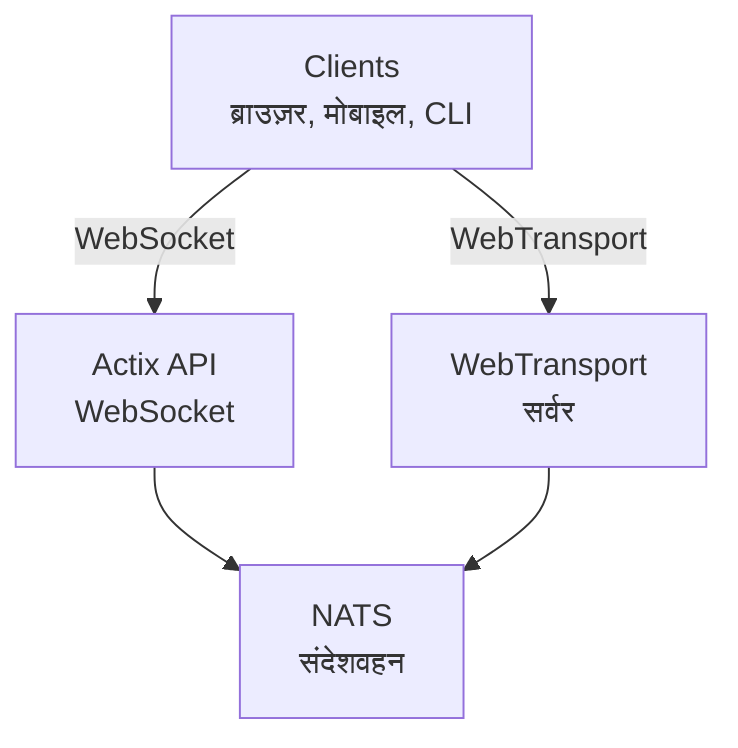

# videocall.rs

<a href="https://opensource.org/licenses/MIT"></a>
<a href="https://discord.gg/JP38NRe4CJ"></a> 
<a href="https://www.digitalocean.com/?refcode=6de4e19c5193&utm_campaign=Referral_Invite&utm_medium=Referral_Program&utm_source=badge"></a>

Rust के साथ निर्मित एक ओपन-सोर्स, उच्च प्रदर्शन वीडियो कॉन्फ्रेंसिंग प्लेटफ़ॉर्म, जो कम विलंबता के साथ रियल-टाइम संचार प्रदान करता है।

**[वेबसाइट](https://videocall.rs)** | **[Discord समुदाय](https://discord.gg/JP38NRe4CJ)**

## विषय सूची

- [अवलोकन](#overview)
- [विशेषताएँ](#features)
- [WebRTC की जगह WebTransport क्यों?](#why-webtransport-instead-of-webrtc)
- [सिस्टम आर्किटेक्चर](#system-architecture)
- [शुरुआत कैसे करें](#getting-started)
  - [पूर्वापेक्षाएँ](#prerequisites)
  - [Docker सेटअप](#docker-setup)
  - [मैनुअल सेटअप](#manual-setup)
- [उपयोग](#usage)
- [प्रदर्शन](#performance)
- [सुरक्षा](#security)
- [रोडमैप](#roadmap)
- [योगदान](#contributing)
- [परियोजना संरचना](#project-structure)
- [डेमो और मीडिया](#demos-and-media)
- [योगदानकर्ता](#contributors)
- [लाइसेंस](#license)

## अवलोकन

videocall.rs एक आधुनिक, ओपन-सोर्स वीडियो कॉन्फ्रेंसिंग सिस्टम है जो पूरी तरह से Rust में लिखा गया है, और उन डेवलपर्स के लिए डिज़ाइन किया गया है जिन्हें विश्वसनीय, स्केलेबल, और सुरक्षित रियल-टाइम संचार क्षमताओं की आवश्यकता होती है। यह कस्टम वीडियो संचार समाधान बनाने के लिए एक आधार प्रदान करता है, जिसमें ब्राउज़र-आधारित और नेटिव क्लाइंट दोनों के लिए समर्थन है।

**परियोजना की स्थिति:** बीटा - सक्रिय रूप से विकसित और गैर-आवश्यक उत्पादन उपयोग के लिए उपयुक्त

## विशेषताएँ

- **उच्च प्रदर्शन:** Rust के साथ बनाया गया, जो संसाधनों का इष्टतम उपयोग और कम विलंबता सुनिश्चित करता है
- **मल्टीपल ट्रांसपोर्ट प्रोटोकॉल:** WebSockets और WebTransport का समर्थन
- **एंड-टू-एंड एन्क्रिप्शन (E2EE):** पीयर के बीच वैकल्पिक सुरक्षित संचार
- **स्केलेबल आर्किटेक्चर:** NATS का उपयोग करते हुए pub/sub मॉडल के साथ क्षैतिज स्केलिंग के लिए डिज़ाइन किया गया
- **क्रॉस-प्लेटफ़ॉर्म समर्थन:** क्रोमियम-आधारित ब्राउज़रों (Chrome, Edge, Brave) पर कार्य करता है, Safari समर्थन विकासाधीन है। Firefox MediaStreamTrackProcessor के अपूर्ण कार्यान्वयन के कारण समर्थित नहीं है।
- **नेटिव क्लाइंट समर्थन:** Raspberry Pi जैसे उपकरणों से हेडलेस वीडियो स्ट्रीमिंग के लिए CLI टूल
- **ओपन सोर्स:** अधिकतम लचीलापन के लिए MIT लाइसेंस प्राप्त

## WebRTC की जगह WebTransport क्यों?

WebTransport एक कोर तकनीक है जो videocall.rs को पारंपरिक वीडियो कॉन्फ्रेंसिंग समाधानों से अलग करती है। एक डेवलपर के रूप में, यहाँ क्यों हमारा WebTransport दृष्टिकोण तकनीकी रूप से श्रेष्ठ है:

### तकनीकी लाभ

- **कोई SFU नहीं, कोई NAT ट्रैवर्सल नहीं:** WebTransport जटिल Selective Forwarding Units और NAT ट्रैवर्सल तंत्र को समाप्त करता है जो WebRTC कार्यान्वयन में समस्याएँ उत्पन्न करते हैं और डेवलपर्स को परेशानी में डालते हैं।

- **सरल आर्किटेक्चर:** WebRTC द्वारा आवश्यक जटिल STUN/TURN सर्वर, ICE कैंडिडेट्स बातचीत, या जटिल सिग्नलिंग की आवश्यकता नहीं। केवल सीधे, सरल कनेक्शन।

- **प्रोटोकॉल दक्षता:** HTTP/3 और QUIC पर आधारित, WebTransport बहु-धारा, द्विदिश स्ट्रीम प्रदान करता है जिसमें बेहतर भीड़ नियंत्रण और पैकेट हानि पुनर्प्राप्ति होती है, जो WebRTC के पुराने SCTP डेटा चैनलों से बेहतर है।

- **कम विलंबता:** QUIC का 0-RTT कनेक्शन स्थापना WebRTC के कई राउंडट्रिप्स की तुलना में प्रारंभिक कनेक्शन समय कम करता है।

- **साफ-सुथरा विकास अनुभव:** WebTransport एक अधिक सहज डेवलपर API प्रदान करता है जिसमें प्रॉमिस-आधारित डिज़ाइन और साफ स्ट्रीम प्रबंधन होता है।

- **भविष्य के लिए तैयार:** IETF और W3C द्वारा विकसित आधुनिक वेब प्लेटफ़ॉर्म का हिस्सा होने के नाते, WebTransport को मजबूत ब्राउज़र विक्रेता समर्थन और सक्रिय रूप से विकसित हो रही विशिष्टता प्राप्त है।

### डेवलपर के लिए प्रभाव

videocall.rs को एकीकृत करने वाले डेवलपर्स के लिए इसका अर्थ है:
- ✅ अत्यधिक सरल तैनाती आर्किटेक्चर
- ✅ कोई जटिल नेटवर्क कॉन्फ़िगरेशन या फायरवॉल समस्याएँ नहीं
- ✅ चुनौतीपूर्ण नेटवर्क परिस्थितियों में बेहतर प्रदर्शन
- ✅ कार्यान्वयन में अधिक पूर्वानुमेय व्यवहार
- ✅ कनेक्टिविटी मुद्दों के डिबगिंग पर कम समय
- ✅ एक भविष्य-दृष्टि तकनीकी निवेश

हमारे [आर्किटेक्चर दस्तावेज़](https://raw.githubusercontent.com/security-union/videocall-rs/main/ARCHITECTURE.md) को पढ़ें ताकि यह समझ सकें कि हम WebTransport कैसे लागू करते हैं और यह तकनीकी लाभ कैसे प्रदान करता है।

## सिस्टम आर्किटेक्चर

videocall.rs माइक्रोसर्विसेज आर्किटेक्चर का पालन करता है जिनमें ये मुख्य घटक शामिल हैं:



1. **actix-api:** Actix वेब फ्रेमवर्क का उपयोग करने वाला Rust-आधारित बैकएंड सर्वर
2. **yew-ui:** Yew फ्रेमवर्क के साथ निर्मित वेब फ्रंटेंड और WebAssembly में संकलित
3. **videocall-types:** साझा डेटा प्रकार और प्रोटोकॉल परिभाषाएँ
4. **videocall-client:** नेटिव इंटीग्रेशन के लिए क्लाइंट लाइब्रेरी
5. **videocall-cli:** हेडलेस वीडियो स्ट्रीमिंग के लिए कमांड-लाइन इंटरफेस


सिस्टम आर्किटेक्चर का अधिक विस्तृत विवरण हमारे [आर्किटेक्चर दस्तावेज़](https://raw.githubusercontent.com/security-union/videocall-rs/main/ARCHITECTURE.md) में उपलब्ध है।

## शुरुआत कैसे करें

**⭐ अनुशंसित: Docker ही पूर्ण रूप से समर्थित विकास विधि है ⭐**

हम Docker-आधारित सेटअप का उपयोग करने की जोरदार सिफारिश करते हैं, क्योंकि यह अच्छी तरह से मेंटेन किया गया है और प्लेटफ़ॉर्म के बीच सुसंगत व्यवहार प्रदान करता है। नीचे वर्णित मैनुअल सेटअप उतना अच्छी तरह से मेंटेन नहीं है और अतिरिक्त डिबगिंग की आवश्यकता हो सकती है।

### पूर्वापेक्षाएँ

- आधुनिक Linux वितरण, macOS, या Windows 10/11
- [Docker](https://docs.docker.com/engine/install/) और Docker Compose (कंटेनराइज्ड सेटअप के लिए)
- [Rust टूलचेन](https://rustup.rs/) 1.85+ (मैनुअल सेटअप के लिए)
- फ्रंटेंड एक्सेस के लिए क्रोमियम-आधारित ब्राउज़र (Chrome, Edge, Brave) - Firefox समर्थित नहीं है

### Docker सेटअप

शुरुआत करने का सबसे तेज़ तरीका हमारा Docker-आधारित सेटअप है:

1. रिपॉजिटरी क्लोन करें:
   ```
   git clone https://github.com/security-union/videocall-rs.git
   cd videocall-rs
   ```

2. सर्वर शुरू करें (अपने मशीन के IP पते के साथ `<server-ip>` बदलें):
   ```
   make up
   ```

3. स्थानीय WebTransport के लिए प्रदान किए गए स्क्रिप्ट से Chrome खोलें:
   ```
   ./launch_chrome.sh
   ```

4. एप्लिकेशन तक पहुँचें:
   ```
   http://<server-ip>/meeting/<username>/<meeting-id>
   ```

### मैनुअल सेटअप (प्रयोगात्मक)

⚠️ **चेतावनी**: यह सेटअप विधि प्रयोगात्मक है और Docker विधि जितनी अच्छी तरह से मेंटेन नहीं है। आपको मैनुअल डिबगिंग करनी पड़ सकती है।

उन्नत उपयोगकर्ताओं के लिए जो सीधे अपने मशीन पर सेवाएं चलाना पसंद करते हैं:

1. PostgreSQL डेटाबेस बनाएं:
   ```
   createdb actix-api-db
   ```

2. आवश्यक उपकरण स्थापित करें:
   ```
   # NATS सर्वर स्थापित करें
   curl -L https://github.com/nats-io/nats-server/releases/download/v2.9.8/nats-server-v2.9.8-linux-amd64.tar.gz | tar xz
   sudo mv nats-server-v2.9.8-linux-amd64/nats-server /usr/local/bin
   
   # trurl स्थापित करें
   cargo install trurl
   ```

3. विकास वातावरण शुरू करें:
   ```
   ./start_dev.sh
   ```

4. कनेक्ट करें:
   ```
   http://localhost:8081/meeting/<username>/<meeting-id>
   ```

विस्तृत कॉन्फ़िगरेशन विकल्पों के लिए, हमारे [सेटअप दस्तावेज़](https://docs.videocall.rs/setup) देखें।

## उपयोग

### ब्राउज़र-आधारित क्लाइंट

1. अपने डिप्लॉय किए गए इंस्टेंस या लोकलहोस्ट सेटअप पर जाएं:
   ```
   http://<server-address>/meeting/<username>/<meeting-id>
   ```

2. जब पूछा जाए तो कैमरा और माइक्रोफ़ोन की अनुमति दें

3. "Connect" पर क्लिक करें और मीटिंग में शामिल हों

### CLI-आधारित स्ट्रीमिंग

Raspberry Pi जैसे हेडलेस उपकरणों के लिए:

```bash
# CLI टूल इंस्टॉल करें
cargo install videocall-cli

# कैमरा से स्ट्रीम करें
videocall-cli stream \
  --user-id <your-user-id> \
  --video-device-index 0 \
  --meeting-id <meeting-id> \
  --resolution 1280x720 \
  --fps 30 \
  --frame-format NV12 \
  --bitrate-kbps 500
```
विस्तृत जानकारी के लिए CLI टूल और सभी उपलब्ध विकल्पों के बारे में, देखें [videocall-cli README](https://raw.githubusercontent.com/security-union/videocall-rs/main/videocall-cli/README.md)।

## प्रदर्शन

videocall.rs को निम्नलिखित परिदृश्यों के लिए बेंचमार्क और अनुकूलित किया गया है:

- **1-ऑन-1 कॉल्स:** सामान्य कनेक्शनों पर <100ms विलंबता के साथ न्यूनतम संसाधन उपयोग
- **छोटे समूह (3-10):** नेटवर्क स्थिति के आधार पर अनुकूली गुणवत्ता के साथ प्रभावी मेष टोपोलॉजी
- **बड़े सम्मेलन:** चयनात्मक अग्रेषण वास्तुकला का उपयोग करते हुए 1000 प्रतिभागियों तक के साथ परीक्षण किया गया

### तकनीकी अनुकूलन

- **शून्य-प्रतिलिपि डिज़ाइन:** नेटवर्क स्टैक और एप्लिकेशन कोड के बीच डेटा की प्रतिलिपि को न्यूनतम करता है
- **असिंक्रोनस कोर:** Rust के async/await इकोसिस्टम पर आधारित टोकियो रनटाइम के साथ  
- **SIMD-त्वरित प्रसंस्करण:** जहां उपलब्ध हो CPU वेक्टराइजेशन का उपयोग मीडिया संचालन के लिए
- **लॉक-फ्री डेटा संरचनाएँ:** उच्च-थ्रूपुट परिदृश्यों में प्रतिद्वंद्विता को कम करता है
- **प्रोटोकॉल-स्तरीय अनुकूलन:** अनुकूलित भीड़ नियंत्रण और पैकेट शेड्यूलिंग

### संसाधन उपयोग

हमारी सर्वर-साइड वास्तुकला पैमाने पर दक्षता के लिए डिजाइन की गई है:

- **क्षैतिज स्केलिंग:** अतिरिक्त सर्वर इंस्टेंस के साथ रैखिक प्रदर्शन स्केलिंग
- **लोड वितरण:** सर्वर पूल में स्वचालित कनेक्शन संतुलन
- **संसाधन शासन:** बैंडविड्थ, कनेक्शन, और CPU उपयोग के लिए कॉन्फ़िगर करने योग्य सीमाएँ
- **कंटेनर-अनुकूलित:** Kubernetes पर्यावरण में कुशल परिनियोजन के लिए डिज़ाइन किया गया

प्रदर्शन मेट्रिक्स और ट्यूनिंग दिशानिर्देश हमारे [performance documentation](https://raw.githubusercontent.com/security-union/videocall-rs/main/PERFORMANCE.md) में उपलब्ध होंगे। (कार्य प्रगति पर)

## सुरक्षा

सुरक्षा videocall.rs का एक मुख्य केंद्र है:

- **ट्रांसपोर्ट सुरक्षा:** सभी संचार TLS/HTTPS का उपयोग करते हैं।
- **एंड-टू-एंड एन्क्रिप्शन:** सहकर्मियों के बीच वैकल्पिक E2EE, सर्वर के पास सामग्री तक कोई पहुंच नहीं।
- **प्रमाणीकरण:** पहचान प्रदाताओं के साथ लचीला एकीकरण।
- **पहुँच नियंत्रण:** बैठक कक्षों के लिए सूक्ष्म अनुमतियाँ प्रणाली।

हमारे सुरक्षा मॉडल और सर्वोत्तम प्रथाओं के लिए, देखें हमारा [security documentation](https://docs.videocall.rs/security)।

## रोडमैप

| संस्करण | लक्ष्य तिथि | मुख्य विशेषताएं |
|---------|------------|-----------------|
| 0.5.0   | Q2 2023    | ✅ एंड-टू-एंड एन्क्रिप्शन |
| 0.6.0   | Q3 2023    | ✅ सफारी ब्राउज़र समर्थन |
| 0.7.0   | Q4 2023    | ✅ नेटिव मोबाइल SDKs |
| 0.8.0   | Q1 2024    | 🔄 स्क्रीन शेयरिंग सुधार |
| 1.0.0   | Q2 2024    | 🔄 पूर्ण API स्थिरता के साथ उत्पादन रिलीज |

## योगदान

हम समुदाय से योगदान का स्वागत करते हैं! भाग लेने का तरीका इस प्रकार है:

1. **इश्यूज:** बग रिपोर्ट करें या फीचर्स सुझाएँ [GitHub Issues](https://github.com/security-union/videocall-rs/issues) के माध्यम से

2. **पुल रिक्वेस्ट:** बग फिक्स या सुधार के लिए PR सबमिट करें

3. **RFC प्रक्रिया:** महत्वपूर्ण परिवर्तनों के लिए, हमारे [RFC process](https://raw.githubusercontent.com/security-union/videocall-rs/main/rfc) में भाग लें

4. **समुदाय:** विकास चर्चा के लिए हमारे [Discord server](https://discord.gg/JP38NRe4CJ) में शामिल हों

अधिक विस्तृत जानकारी के लिए देखें हमारे [Contributing Guidelines](https://raw.githubusercontent.com/security-union/videocall-rs/main/CONTRIBUTING.md)।

### तकनीकी स्टैक

- **बैकएंड**: Rust + Actix Web + PostgreSQL + NATS
- **फ्रंटएंड**: Rust + Yew + WebAssembly + Tailwind CSS
- **ट्रांसपोर्ट**: WebTransport (QUIC/HTTP3) + WebSockets (fallback)
- **बिल्ड सिस्टम**: Cargo + Trunk + Docker + Helm
- **टेस्टिंग**: Rust परीक्षण फ्रेमवर्क + E2E परीक्षण के लिए Playwright

### प्रमुख तकनीकी विशेषताएं

- **द्विदिश स्ट्रीमिंग**: QUIC स्ट्रीम्स का उपयोग करते हुए पूर्णतः असिंक्रोनस संदेश पारगमन
- **त्रुटि प्रबंधन**: कोडबेस में व्यापक Result-आधारित त्रुटि प्रचार
- **मॉड्यूलरिटी**: घटकों के बीच अच्छी परिभाषित इंटरफेस के साथ स्पष्ट जिम्मेदारी पृथक्करण
- **टाइप सुरक्षा**: रनटाइम त्रुटियों को रोकने के लिए Rust के प्रकार प्रणाली का व्यापक उपयोग
- **बाइनरी प्रोटोकॉल**: सभी संदेशों के लिए प्रभावी प्रोटोकॉल बफर सीरियलाइज़ेशन

अधिक व्यापक तकनीकी अवलोकन के लिए, देखें [Architecture Document](https://raw.githubusercontent.com/security-union/videocall-rs/main/ARCHITECTURE.md)।

### Git Hooks

यह रिपॉजिटरी कोड गुणवत्ता सुनिश्चित करने के लिए Git hooks शामिल करता है:

1. **Pre-commit Hook**: प्रत्येक कमिट से पहले `cargo fmt` को स्वचालित रूप से चलाता है ताकि कोड फॉर्मेटिंग सुसंगत रहे।
2. **Post-commit Hook**: प्रत्येक कमिट के बाद संभावित कोड सुधारों के लिए `cargo clippy` चलाता है।

इन हुक्स को स्थापित करने के लिए, प्रोजेक्ट रूट से निम्नलिखित कमांड चलाएं:

```bash
# यदि मौजूद नहीं है तो hooks डायरेक्टरी बनाएँ
mkdir -p .git/hooks

# pre-commit हुक बनाएँ
cat > .git/hooks/pre-commit << 'EOF'
#!/bin/sh

# cargo fmt चलाएँ और देखें कि कोई परिवर्तन हैं या नहीं
echo "Running cargo fmt..."
cargo fmt --all -- --check

# cargo fmt का निकास कोड जांचें
if [ $? -ne 0 ]; then
    echo "cargo fmt में फॉर्मेटिंग समस्याएं मिलीं। कृपया कमिट करने से पहले इन्हें ठीक करें।"
    exit 1
fi

exit 0
EOF

# post-commit हुक बनाएँ
cat > .git/hooks/post-commit << 'EOF'
#!/bin/sh

# कमिट के बाद cargo clippy चलाएँ
echo "Running cargo clippy..."
ACTIX_UI_BACKEND_URL="" WEBTRANSPORT_HOST="" LOGIN_URL="" WEBTRANSPORT_URL="" ACTIX_API_URL="" cargo clippy -- -D warnings

# cargo clippy का निकास कोड जांचें
if [ $? -ne 0 ]; then
    echo "Cargo clippy ने आपके कोड में समस्याएं पाईं। कृपया इन्हें ठीक करें।"
    # चूंकि कमिट पहले ही हो चुका है, इसे रद्द नहीं कर सकते, लेकिन उपयोगकर्ता को सूचित कर सकते हैं
    echo "कमिट सफल रहा, लेकिन कृपया पुश करने से पहले clippy समस्याओं को ठीक करने पर विचार करें।"
fi

exit 0
EOF

# हुक्स को निष्पादन योग्य बनाएं
chmod +x .git/hooks/pre-commit .git/hooks/post-commit
```

ये हुक्स उचित फॉर्मेटिंग सुनिश्चित करके और सामान्य मुद्दों की जांच करके कोड गुणवत्ता बनाए रखने में मदद करते हैं।

## डेमो और मीडिया

### तकनीकी प्रस्तुतियाँ

- [1000 उपयोगकर्ताओं तक कॉल स्केलिंग](https://youtu.be/LWwOSZJwEJI)
- [प्रारंभिक प्रमाण अवधारणा (2022)](https://www.youtube.com/watch?v=kZ9isFw1TQ8)

### चैनल

- [YouTube चैनल](https://www.youtube.com/@dario.lencina)

## योगदानकर्ता

<table>
<tr>
<td align="center"><a href="https://github.com/darioalessandro"><br /><sub><b>Dario Lencina</b></sub></a></td>
<td align="center"><a href="https://github.com/griffobeid"><br /><sub><b>Griffin Obeid</b></sub></a></td>    
<td align="center"><a href="https://github.com/ronen"><br /><sub><b>Ronen Barzel</b></sub></a></td>
<td align="center"><a href="https://github.com/leon3s"><br /><sub><b>Leone</b></sub></a></td>
<td align="center"><a href="https://github.com/JasterV"><br /><sub><b>Victor Martínez</b></sub></a></td>
</tr>
</table>

विशेष धन्यवाद [JasterV](https://github.com/JasterV) को Actix websocket कार्यान्वयन के लिए जिसमें [chat-rooms-actix](https://github.com/JasterV/chat-rooms-actix) परियोजना से अंश शामिल हैं।

## लाइसेंस

यह परियोजना MIT लाइसेंस के तहत लाइसेंस प्राप्त है - विवरण के लिए देखें [LICENSE.md](https://raw.githubusercontent.com/security-union/videocall-rs/main/LICENSE.md) फाइल।


---


Tranlated By [Open Ai Tx](https://github.com/OpenAiTx/OpenAiTx) | Last indexed: 2025-06-11


---