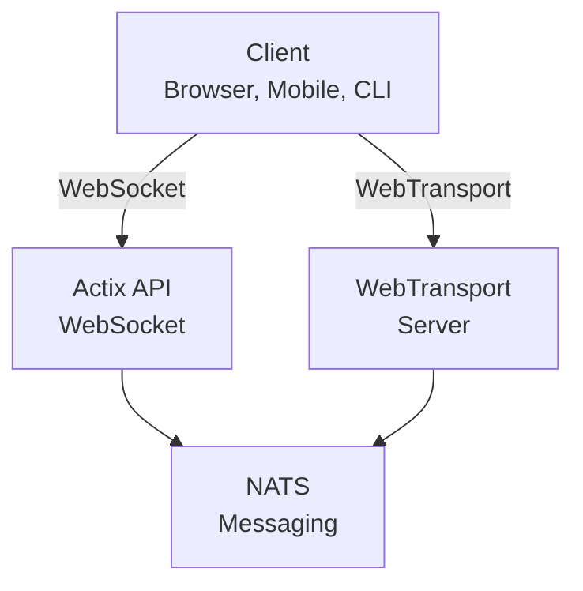

# videocall.rs

<a href="https://opensource.org/licenses/MIT"></a>
<a href="https://discord.gg/JP38NRe4CJ"></a> 
<a href="https://www.digitalocean.com/?refcode=6de4e19c5193&utm_campaign=Referral_Invite&utm_medium=Referral_Program&utm_source=badge"></a>

Una piattaforma open-source per videoconferenze ad alte prestazioni costruita con Rust, che fornisce comunicazione in tempo reale con bassa latenza.

**[Sito Web](https://videocall.rs)** | **[Community Discord](https://discord.gg/JP38NRe4CJ)**

## Indice

- [Panoramica](#overview)
- [Caratteristiche](#features)
- [Perché WebTransport invece di WebRTC?](#why-webtransport-instead-of-webrtc)
- [Architettura di Sistema](#system-architecture)
- [Primi Passi](#getting-started)
  - [Prerequisiti](#prerequisites)
  - [Configurazione Docker](#docker-setup)
  - [Configurazione Manuale](#manual-setup)
- [Utilizzo](#usage)
- [Prestazioni](#performance)
- [Sicurezza](#security)
- [Roadmap](#roadmap)
- [Contributi](#contributing)
- [Struttura del Progetto](#project-structure)
- [Demo e Media](#demos-and-media)
- [Collaboratori](#contributors)
- [Licenza](#license)

## Panoramica

videocall.rs è un sistema di videoconferenza moderno e open-source scritto interamente in Rust, progettato per sviluppatori che necessitano di capacità di comunicazione in tempo reale affidabili, scalabili e sicure. Fornisce una base per costruire soluzioni personalizzate di comunicazione video, con supporto sia per client basati su browser che nativi.

**Stato del Progetto:** Beta - Sviluppo attivo e adatto per uso produttivo non critico

## Caratteristiche

- **Alte Prestazioni:** Costruito con Rust per un utilizzo ottimale delle risorse e bassa latenza
- **Molteplici Protocolli di Trasporto:** Supporto per WebSockets e WebTransport
- **Crittografia End-to-End (E2EE):** Comunicazioni sicure opzionali tra peer
- **Architettura Scalabile:** Progettata con un modello pub/sub usando NATS per scalabilità orizzontale
- **Supporto Cross-Platform:** Funziona su browser basati su Chromium (Chrome, Edge, Brave) con supporto Safari in sviluppo. Firefox non è supportato a causa dell'implementazione incompleta di MediaStreamTrackProcessor.
- **Supporto Client Nativo:** Strumento CLI per streaming video headless da dispositivi come Raspberry Pi
- **Open Source:** Licenza MIT per massima flessibilità

## Perché WebTransport invece di WebRTC?

WebTransport è una tecnologia core che differenzia videocall.rs dalle tradizionali soluzioni di videoconferenza. Da sviluppatore, ecco perché il nostro approccio con WebTransport è tecnicamente superiore:

### Vantaggi Tecnici

- **Nessun SFU, Nessun Traversal NAT:** WebTransport elimina la necessità di complicati Selective Forwarding Units e meccanismi di traversal NAT che affliggono le implementazioni WebRTC e causano numerosi problemi agli sviluppatori.

- **Architettura Semplificata:** Niente più server STUN/TURN complessi, negoziazioni ICE o complicate danze di signaling richieste da WebRTC. Solo connessioni dirette e lineari.

- **Efficienza del Protocollo:** Basato su HTTP/3 e QUIC, WebTransport fornisce stream multiplexati e bidirezionali con migliore controllo della congestione e recupero dalla perdita di pacchetti rispetto ai datacanali SCTP obsoleti di WebRTC.

- **Latenza Inferiore:** L'instaurazione di connessione 0-RTT di QUIC riduce i tempi iniziali di connessione rispetto ai molteplici roundtrip di WebRTC.

- **Esperienza di Sviluppo Pulita:** WebTransport offre un’API più intuitiva per sviluppatori con un design basato su promesse e gestione più pulita degli stream.

- **A Prova di Futuro:** Parte della moderna piattaforma web sviluppata da IETF e W3C, WebTransport ha un forte supporto dai vendor di browser e una specifica in evoluzione attiva.

### Implicazioni per gli Sviluppatori

Per gli sviluppatori che integrano videocall.rs, questo significa:
- ✅ Architettura di deployment drasticamente più semplice
- ✅ Nessuna configurazione di rete complessa o problemi con firewall
- ✅ Migliori prestazioni in condizioni di rete difficili
- ✅ Comportamento più prevedibile tra implementazioni
- ✅ Meno tempo speso a debug di problemi di connettività
- ✅ Un investimento tecnologico orientato al futuro

Leggi il nostro [Documento di Architettura](ARCHITECTURE.md) per un approfondimento su come implementiamo WebTransport e i benefici tecnici che offre.

## Architettura di Sistema

videocall.rs segue un'architettura a microservizi con i seguenti componenti principali:



1. **actix-api:** Server backend in Rust basato su framework Actix Web
2. **yew-ui:** Frontend web costruito con il framework Yew e compilato in WebAssembly
3. **videocall-types:** Tipi di dati condivisi e definizioni di protocollo
4. **videocall-client:** Libreria client per integrazione nativa
5. **videocall-cli:** Interfaccia a linea di comando per streaming video headless

Per una spiegazione più dettagliata dell'architettura di sistema, consulta il nostro [Documento di Architettura](ARCHITECTURE.md).

## Primi Passi

**⭐ RACCOMANDATO: Docker è l’unico metodo di sviluppo completamente supportato ⭐**

Raccomandiamo vivamente di utilizzare la configurazione basata su Docker per lo sviluppo, poiché è ben mantenuta e fornisce un comportamento consistente tra le piattaforme. La configurazione manuale descritta di seguito non è altrettanto mantenuta e potrebbe richiedere ulteriori risoluzioni di problemi.

### Prerequisiti

- Distribuzione Linux moderna, macOS o Windows 10/11
- [Docker](https://docs.docker.com/engine/install/) e Docker Compose (per configurazione containerizzata)
- [Toolchain Rust](https://rustup.rs/) 1.85+ (per configurazione manuale)
- Browser basato su Chromium (Chrome, Edge, Brave) per accesso frontend - Firefox non supportato

### Configurazione Docker

Il modo più veloce per iniziare è con la nostra configurazione basata su Docker:

1. Clona il repository:
   ```
   git clone https://github.com/security-union/videocall-rs.git
   cd videocall-rs
   ```

2. Avvia il server (sostituisci `<server-ip>` con l'indirizzo IP della tua macchina):
   ```
   make up
   ```

3. Apri Chrome usando lo script fornito per WebTransport locale:
   ```
   ./launch_chrome.sh
   ```

4. Accedi all’applicazione su:
   ```
   http://<server-ip>/meeting/<username>/<meeting-id>
   ```

### Configurazione Manuale (Sperimentale)

⚠️ **Attenzione**: Questo metodo di configurazione è sperimentale e non è mantenuto quanto l’approccio Docker. Potresti incontrare problemi che richiedono debug manuale.

Per utenti avanzati che preferiscono eseguire i servizi direttamente sulla propria macchina:

1. Crea un database PostgreSQL:
   ```
   createdb actix-api-db
   ```

2. Installa gli strumenti richiesti:
   ```
   # Installa server NATS
   curl -L https://github.com/nats-io/nats-server/releases/download/v2.9.8/nats-server-v2.9.8-linux-amd64.tar.gz | tar xz
   sudo mv nats-server-v2.9.8-linux-amd64/nats-server /usr/local/bin
   
   # Installa trurl
   cargo install trurl
   ```

3. Avvia l’ambiente di sviluppo:
   ```
   ./start_dev.sh
   ```

4. Connettiti a:
   ```
   http://localhost:8081/meeting/<username>/<meeting-id>
   ```

Per opzioni di configurazione dettagliate, consulta la nostra [documentazione di setup](https://docs.videocall.rs/setup).

## Utilizzo

### Client Basati su Browser

1. Naviga alla tua istanza distribuita o configurazione locale:
   ```
   http://<server-address>/meeting/<username>/<meeting-id>
   ```

2. Concedi i permessi per fotocamera e microfono quando richiesto

3. Clicca su "Connetti" per entrare nella riunione

### Streaming da CLI

Per dispositivi headless come Raspberry Pi:

```bash
# Installa lo strumento CLI
cargo install videocall-cli

# Stream da una telecamera
videocall-cli stream \
  --user-id <your-user-id> \
  --video-device-index 0 \
  --meeting-id <meeting-id> \
  --resolution 1280x720 \
  --fps 30 \
  --frame-format NV12 \
  --bitrate-kbps 500
```
Per informazioni dettagliate sullo strumento CLI e tutte le opzioni disponibili, vedere il [README di videocall-cli](https://raw.githubusercontent.com/security-union/videocall-rs/main/videocall-cli/README.md).

## Prestazioni

videocall.rs è stato testato e ottimizzato per i seguenti scenari:

- **Chiamate 1-a-1:** Utilizzo minimo delle risorse con latenza <100ms su connessioni tipiche
- **Gruppi piccoli (3-10):** Topologia mesh efficiente con qualità adattiva basata sulle condizioni di rete
- **Grandi Conferenze:** Testato con fino a 1000 partecipanti usando architettura di inoltro selettivo

### Ottimizzazioni Tecniche

- **Design Zero-Copy:** Minimizza la copia dei dati tra lo stack di rete e il codice applicativo
- **Core Asincrono:** Costruito sull'ecosistema async/await di Rust con runtime Tokio  
- **Elaborazione Accelerata SIMD:** Utilizza la vettorizzazione CPU per operazioni multimediali dove disponibile
- **Strutture Dati Lock-Free:** Minimizza la contesa in scenari ad alto throughput
- **Ottimizzazioni a Livello Protocollo:** Controllo della congestione e schedulazione pacchetti personalizzati

### Utilizzo delle Risorse

La nostra architettura lato server è progettata per l'efficienza su larga scala:

- **Scalabilità Orizzontale:** Scalabilità lineare delle prestazioni con istanze server aggiuntive
- **Distribuzione del Carico:** Bilanciamento automatico delle connessioni nel pool di server
- **Governance delle Risorse:** Limiti configurabili per larghezza di banda, connessioni e utilizzo CPU
- **Ottimizzato per Container:** Progettato per un deployment efficiente in ambienti Kubernetes

Metriche di prestazioni e linee guida per la configurazione saranno disponibili nella nostra [documentazione sulle prestazioni](https://raw.githubusercontent.com/security-union/videocall-rs/main/PERFORMANCE.md). (WIP)

## Sicurezza

La sicurezza è un focus centrale di videocall.rs:

- **Sicurezza del Trasporto:** Tutte le comunicazioni usano TLS/HTTPS.
- **Crittografia End-to-End:** E2EE opzionale tra peer senza accesso del server ai contenuti.
- **Autenticazione:** Integrazione flessibile con provider di identità.
- **Controlli di Accesso:** Sistema di permessi granulare per le stanze delle riunioni.

Per dettagli sul nostro modello di sicurezza e le migliori pratiche, vedere la nostra [documentazione sulla sicurezza](https://docs.videocall.rs/security).

## Roadmap

| Versione | Data Target | Funzionalità Chiave |
|---------|------------|--------------|
| 0.5.0   | Q2 2023    | ✅ Crittografia End-to-End |
| 0.6.0   | Q3 2023    | ✅ Supporto Browser Safari |
| 0.7.0   | Q4 2023    | ✅ SDK Mobile Nativi |
| 0.8.0   | Q1 2024    | 🔄 Miglioramenti Condivisione Schermo |
| 1.0.0   | Q2 2024    | 🔄 Rilascio di Produzione con API Stabili |


## Contribuire

Accogliamo con piacere i contributi dalla community! Ecco come partecipare:

1. **Issue:** Segnala bug o suggerisci funzionalità tramite [GitHub Issues](https://github.com/security-union/videocall-rs/issues)

2. **Pull Requests:** Invia PR per correzioni di bug o miglioramenti

3. **Processo RFC:** Per cambiamenti significativi, partecipa al nostro [processo RFC](https://raw.githubusercontent.com/security-union/videocall-rs/main/rfc)

4. **Community:** Unisciti al nostro [server Discord](https://discord.gg/JP38NRe4CJ) per discutere dello sviluppo

Consulta le nostre [Linee Guida per i Contributi](https://raw.githubusercontent.com/security-union/videocall-rs/main/CONTRIBUTING.md) per informazioni più dettagliate.


### Stack Tecnologico

- **Backend**: Rust + Actix Web + PostgreSQL + NATS
- **Frontend**: Rust + Yew + WebAssembly + Tailwind CSS
- **Trasporto**: WebTransport (QUIC/HTTP3) + WebSockets (fallback)
- **Sistema di Build**: Cargo + Trunk + Docker + Helm
- **Testing**: Framework di test Rust + Playwright per test E2E

### Caratteristiche Tecniche Chiave

- **Streaming Bidirezionale**: Passaggio messaggi completamente asincrono usando stream QUIC
- **Gestione degli Errori**: Propagazione completa degli errori basata su Result in tutto il codice
- **Modularità**: Separazione chiara delle responsabilità con interfacce ben definite tra i componenti
- **Sicurezza dei Tipi**: Ampio uso del sistema di tipi di Rust per prevenire errori a runtime
- **Protocollo Binario**: Serializzazione efficiente con Protocol Buffer per tutti i messaggi

Per una panoramica tecnica più completa, vedere il [Documento di Architettura](https://raw.githubusercontent.com/security-union/videocall-rs/main/ARCHITECTURE.md).

### Git Hooks

Questo repository include Git hooks per garantire la qualità del codice:

1. **Pre-commit Hook**: Esegue automaticamente `cargo fmt` prima di ogni commit per assicurare un formato codice coerente.
2. **Post-commit Hook**: Esegue `cargo clippy` dopo ogni commit per verificare potenziali miglioramenti del codice.

Per installare questi hook, eseguire i seguenti comandi dalla radice del progetto:

```bash
# Crea la directory hooks se non esiste
mkdir -p .git/hooks

# Crea il pre-commit hook
cat > .git/hooks/pre-commit << 'EOF'
#!/bin/sh

# Esegue cargo fmt e controlla se ci sono modifiche
echo "Esecuzione di cargo fmt..."
cargo fmt --all -- --check

# Controlla il codice di uscita di cargo fmt
if [ $? -ne 0 ]; then
    echo "cargo fmt ha rilevato problemi di formattazione. Per favore correggili prima di fare il commit."
    exit 1
fi

exit 0
EOF

# Crea il post-commit hook
cat > .git/hooks/post-commit << 'EOF'
#!/bin/sh

# Esegue cargo clippy dopo il commit
echo "Esecuzione di cargo clippy..."
ACTIX_UI_BACKEND_URL="" WEBTRANSPORT_HOST="" LOGIN_URL="" WEBTRANSPORT_URL="" ACTIX_API_URL="" cargo clippy -- -D warnings

# Controlla il codice di uscita di cargo clippy
if [ $? -ne 0 ]; then
    echo "Cargo clippy ha trovato problemi nel tuo codice. Per favore correggili."
    # Non possiamo annullare il commit poiché è già stato fatto, ma possiamo informare l'utente
    echo "Il commit è andato a buon fine, ma considera di correggere i problemi di clippy prima del push."
fi

exit 0
EOF

# Rendi eseguibili gli hook
chmod +x .git/hooks/pre-commit .git/hooks/post-commit
```

Questi hook aiutano a mantenere la qualità del codice assicurando un formato corretto e controllando problemi comuni.

## Demo e Media

### Presentazioni Tecniche

- [Scaling a 1000 Utenti per Chiamata](https://youtu.be/LWwOSZJwEJI)
- [Proof of Concept Iniziale (2022)](https://www.youtube.com/watch?v=kZ9isFw1TQ8)

### Canali

- [Canale YouTube](https://www.youtube.com/@dario.lencina)

## Collaboratori

<table>
<tr>
<td align="center"><a href="https://github.com/darioalessandro"><br /><sub><b>Dario Lencina</b></sub></a></td>
<td align="center"><a href="https://github.com/griffobeid"><br /><sub><b>Griffin Obeid</b></sub></a></td>    
<td align="center"><a href="https://github.com/ronen"><br /><sub><b>Ronen Barzel</b></sub></a></td>
<td align="center"><a href="https://github.com/leon3s"><br /><sub><b>Leone</b></sub></a></td>
<td align="center"><a href="https://github.com/JasterV"><br /><sub><b>Victor Martínez</b></sub></a></td>
</tr>
</table>

Un ringraziamento speciale a [JasterV](https://github.com/JasterV) per l'implementazione websocket Actix che contiene frammenti dal progetto [chat-rooms-actix](https://github.com/JasterV/chat-rooms-actix).

## Licenza

Questo progetto è concesso in licenza sotto la licenza MIT - vedere il file [LICENSE.md](https://raw.githubusercontent.com/security-union/videocall-rs/main/LICENSE.md) per i dettagli.


---


Tranlated By [Open Ai Tx](https://github.com/OpenAiTx/OpenAiTx) | Last indexed: 2025-06-11


---