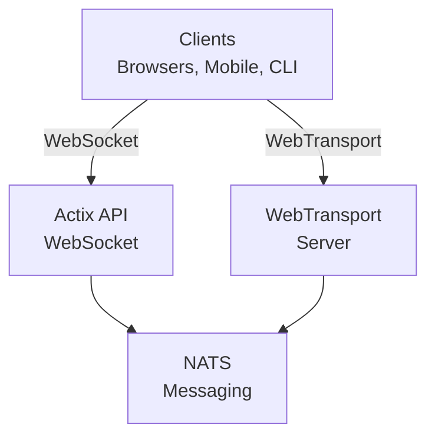

# videocall.rs

<a href="https://opensource.org/licenses/MIT"></a>
<a href="https://discord.gg/JP38NRe4CJ"></a> 
<a href="https://www.digitalocean.com/?refcode=6de4e19c5193&utm_campaign=Referral_Invite&utm_medium=Referral_Program&utm_source=badge"></a>

Rustで構築されたオープンソースの高性能ビデオ会議プラットフォームで、低遅延のリアルタイム通信を提供します。

**[ウェブサイト](https://videocall.rs)** | **[Discordコミュニティ](https://discord.gg/JP38NRe4CJ)**

## 目次

- [概要](#概要)
- [特徴](#特徴)
- [なぜWebRTCではなくWebTransportなのか？](#なぜwebtransportではなくwebrtcなのか)
- [システムアーキテクチャ](#システムアーキテクチャ)
- [はじめに](#はじめに)
  - [前提条件](#前提条件)
  - [Dockerセットアップ](#dockerセットアップ)
  - [手動セットアップ](#手動セットアップ)
- [使い方](#使い方)
- [パフォーマンス](#パフォーマンス)
- [セキュリティ](#セキュリティ)
- [ロードマップ](#ロードマップ)
- [貢献](#貢献)
- [プロジェクト構成](#プロジェクト構成)
- [デモとメディア](#デモとメディア)
- [貢献者](#貢献者)
- [ライセンス](#ライセンス)

## 概要

videocall.rsは、Rustで完全に書かれたモダンなオープンソースのビデオ会議システムであり、信頼性が高くスケーラブルでセキュアなリアルタイム通信機能を必要とする開発者向けに設計されています。ブラウザベースおよびネイティブクライアントの両方をサポートし、カスタムビデオ通信ソリューションの構築基盤を提供します。

**プロジェクトステータス:** ベータ - 活発に開発中で、非クリティカルな本番環境での利用に適しています

## 特徴

- **高性能:** Rustで構築され、最適なリソース利用と低遅延を実現
- **複数のトランスポートプロトコル:** WebSocketsとWebTransportをサポート
- **エンドツーエンド暗号化 (E2EE):** ピア間のオプションの安全通信
- **スケーラブルなアーキテクチャ:** NATSを利用したpub/subモデルで水平スケーリングに対応
- **クロスプラットフォーム対応:** Chromiumベースのブラウザ（Chrome、Edge、Brave）で動作し、Safari対応は開発中。FirefoxはMediaStreamTrackProcessorの未実装により非対応。
- **ネイティブクライアントサポート:** Raspberry Piなどのデバイスからのヘッドレスビデオストリーミング用CLIツール
- **オープンソース:** 最大限の柔軟性を持つMITライセンス

## なぜWebTransportではなくWebRTCなのか？

WebTransportは、videocall.rsが従来のビデオ会議ソリューションと差別化するコア技術です。開発者として、私たちのWebTransportアプローチが技術的に優れている理由は以下の通りです：

### 技術的利点

- **SFUなし、NATトラバーサル不要:** WebTransportは、WebRTC実装で問題となる複雑なSelective Forwarding UnitsやNATトラバーサル機構を排除し、開発者の悩みを大幅に軽減します。

- **シンプルなアーキテクチャ:** WebRTCで必要な複雑なSTUN/TURNサーバやICE候補の交渉、複雑なシグナリングは不要。直接的でわかりやすい接続を実現します。

- **プロトコルの効率性:** HTTP/3とQUIC上に構築されており、WebRTCの古いSCTPデータチャネルよりも優れた混雑制御とパケット損失回復を備えた多重化された双方向ストリームを提供。

- **低遅延:** QUICの0-RTT接続確立により、WebRTCの複数往復よりも初期接続時間を短縮。

- **クリーンな開発体験:** WebTransportは、プロミスベースの設計とクリーンなストリーム管理を備えた、より直感的な開発者APIを提供。

- **将来性:** IETFおよびW3Cによるモダンなウェブプラットフォームの一部として、強力なブラウザベンダーのサポートと活発な仕様の進化があります。

### 開発者への影響

videocall.rsを統合する開発者にとって、これは以下を意味します：
- ✅ 大幅にシンプルなデプロイアーキテクチャ
- ✅ 複雑なネットワーク設定やファイアウォール問題なし
- ✅ 難しいネットワーク環境下でのより良いパフォーマンス
- ✅ 実装間でのより予測可能な挙動
- ✅ 接続問題のデバッグに費やす時間の削減
- ✅ 将来を見据えた技術投資

WebTransportの実装方法と技術的利点の詳細については、[アーキテクチャ文書](https://raw.githubusercontent.com/security-union/videocall-rs/main/ARCHITECTURE.md)をご参照ください。

## システムアーキテクチャ

videocall.rsは以下の主要コンポーネントからなるマイクロサービスアーキテクチャを採用しています：



1. **actix-api:** Actix Webフレームワークを使用したRustベースのバックエンドサーバ
2. **yew-ui:** Yewフレームワークで構築され、WebAssemblyにコンパイルされたウェブフロントエンド
3. **videocall-types:** 共有データ型とプロトコル定義
4. **videocall-client:** ネイティブ統合用クライアントライブラリ
5. **videocall-cli:** ヘッドレスビデオストリーミング用コマンドラインインターフェース

システムアーキテクチャの詳細な説明については、[アーキテクチャ文書](https://raw.githubusercontent.com/security-union/videocall-rs/main/ARCHITECTURE.md)をご覧ください。

## はじめに

**⭐ 推奨: Dockerは唯一の完全サポートされた開発方法です ⭐**

開発にはDockerベースのセットアップを強く推奨します。これはよくメンテナンスされており、プラットフォーム間で一貫した動作を提供します。以下の手動セットアップはメンテナンスが十分でなく、追加のトラブルシューティングが必要となる場合があります。

### 前提条件

- 最新のLinuxディストリビューション、macOS、またはWindows 10/11
- [Docker](https://docs.docker.com/engine/install/)およびDocker Compose（コンテナ化セットアップ用）
- [Rustツールチェーン](https://rustup.rs/) 1.85以上（手動セットアップ用）
- Chromiumベースのブラウザ（Chrome、Edge、Brave） - Firefoxは非対応

### Dockerセットアップ

最速で始める方法はDockerセットアップです：

1. リポジトリをクローン：
   ```
   git clone https://github.com/security-union/videocall-rs.git
   cd videocall-rs
   ```

2. サーバを起動（`<server-ip>`はマシンのIPアドレスに置き換えてください）：
   ```
   make up
   ```

3. ローカルWebTransport用に提供されたスクリプトでChromeを起動：
   ```
   ./launch_chrome.sh
   ```

4. アプリにアクセス：
   ```
   http://<server-ip>/meeting/<username>/<meeting-id>
   ```

### 手動セットアップ（実験的）

⚠️ **警告**: このセットアップ方法は実験的であり、Docker方式ほどメンテナンスされていません。手動でのデバッグが必要になる場合があります。

直接マシン上でサービスを実行したい上級ユーザー向け：

1. PostgreSQLデータベースを作成：
   ```
   createdb actix-api-db
   ```

2. 必要なツールをインストール：
   ```
   # NATSサーバのインストール
   curl -L https://github.com/nats-io/nats-server/releases/download/v2.9.8/nats-server-v2.9.8-linux-amd64.tar.gz | tar xz
   sudo mv nats-server-v2.9.8-linux-amd64/nats-server /usr/local/bin
   
   # trurlのインストール
   cargo install trurl
   ```

3. 開発環境を起動：
   ```
   ./start_dev.sh
   ```

4. 以下に接続：
   ```
   http://localhost:8081/meeting/<username>/<meeting-id>
   ```

詳細な設定オプションについては、[セットアップドキュメント](https://docs.videocall.rs/setup)をご覧ください。

## 使い方

### ブラウザベースクライアント

1. デプロイ済みインスタンスまたはローカルホストセットアップにアクセス：
   ```
   http://<server-address>/meeting/<username>/<meeting-id>
   ```

2. カメラとマイクの許可を求められたら許可

3. 「接続」ボタンをクリックしてミーティングに参加

### CLIベースのストリーミング

Raspberry Piなどのヘッドレスデバイス向け：

```bash
# CLIツールのインストール
cargo install videocall-cli

# カメラからストリーム配信
videocall-cli stream \
  --user-id <your-user-id> \
  --video-device-index 0 \
  --meeting-id <meeting-id> \
  --resolution 1280x720 \
  --fps 30 \
  --frame-format NV12 \
  --bitrate-kbps 500
```
詳細なCLIツールの情報および利用可能なオプションについては、[videocall-cli README](https://raw.githubusercontent.com/security-union/videocall-rs/main/videocall-cli/README.md) を参照してください。

## パフォーマンス

videocall.rs は以下のシナリオでベンチマークおよび最適化されています：

- **1対1通話:** 通常の接続で100ms未満の遅延かつ最小限のリソース使用
- **小規模グループ (3～10人):** ネットワーク状況に応じた適応品質を持つ効率的なメッシュトポロジー
- **大規模会議:** 最大1000参加者での選択的転送アーキテクチャによるテスト済み

### 技術的最適化

- **ゼロコピー設計:** ネットワークスタックとアプリケーションコード間のデータコピーを最小化
- **非同期コア:** Rustのasync/awaitエコシステムとTokioランタイム上に構築  
- **SIMDアクセラレーション処理:** CPUのベクトル化を利用したメディア処理（可能な場合）
- **ロックフリーデータ構造:** 高スループット時の競合を最小化
- **プロトコルレベルの最適化:** カスタム調整された輻輳制御およびパケットスケジューリング

### リソース利用

サーバー側アーキテクチャはスケール時の効率を重視しています：

- **水平スケーリング:** サーバーインスタンス追加による線形の性能スケーリング
- **負荷分散:** サーバープール間の自動接続バランシング
- **リソースガバナンス:** 帯域幅、接続数、CPU使用率の設定可能な制限
- **コンテナ最適化:** Kubernetes環境での効率的なデプロイを想定

パフォーマンス指標とチューニングガイドラインは[パフォーマンスドキュメント](https://raw.githubusercontent.com/security-union/videocall-rs/main/PERFORMANCE.md)にて提供予定です。（作業中）

## セキュリティ

videocall.rs のセキュリティは重要な焦点です：

- **トランスポートセキュリティ:** すべての通信はTLS/HTTPSを使用
- **エンドツーエンド暗号化:** ピア間のオプションのE2EE、サーバーは内容にアクセス不可
- **認証:** 複数のIDプロバイダとの柔軟な統合
- **アクセス制御:** 会議室ごとの細かな権限管理システム

セキュリティモデルおよびベストプラクティスの詳細は[セキュリティドキュメント](https://docs.videocall.rs/security)を参照してください。

## ロードマップ

| バージョン | 予定日       | 主な機能                           |
|------------|--------------|----------------------------------|
| 0.5.0      | 2023年第2四半期 | ✅ エンドツーエンド暗号化          |
| 0.6.0      | 2023年第3四半期 | ✅ Safariブラウザ対応             |
| 0.7.0      | 2023年第4四半期 | ✅ ネイティブモバイルSDK          |
| 0.8.0      | 2024年第1四半期 | 🔄 画面共有の改善                 |
| 1.0.0      | 2024年第2四半期 | 🔄 フルAPI安定版の正式リリース     |

## コントリビューション

コミュニティからの貢献を歓迎します！参加方法は以下の通りです：

1. **Issue:** バグ報告や機能提案は[GitHub Issues](https://github.com/security-union/videocall-rs/issues)へ
2. **プルリクエスト:** バグ修正や機能拡張のPRを提出
3. **RFCプロセス:** 大幅な変更は[RFCプロセス](https://raw.githubusercontent.com/security-union/videocall-rs/main/rfc)に参加
4. **コミュニティ:** [Discordサーバー](https://discord.gg/JP38NRe4CJ)で開発に関する議論

詳細は[Contributing Guidelines](https://raw.githubusercontent.com/security-union/videocall-rs/main/CONTRIBUTING.md)を参照してください。

### 技術スタック

- **バックエンド:** Rust + Actix Web + PostgreSQL + NATS
- **フロントエンド:** Rust + Yew + WebAssembly + Tailwind CSS
- **トランスポート:** WebTransport (QUIC/HTTP3) + WebSockets (フォールバック)
- **ビルドシステム:** Cargo + Trunk + Docker + Helm
- **テスト:** Rustテストフレームワーク + PlaywrightによるE2Eテスト

### 主な技術的特徴

- **双方向ストリーミング:** QUICストリームを用いた完全非同期メッセージパッシング
- **エラーハンドリング:** Resultベースの包括的エラー伝播
- **モジュール性:** コンポーネント間の明確なインターフェースによる責務分離
- **型安全:** Rustの型システムを多用しランタイムエラーを防止
- **バイナリプロトコル:** すべてのメッセージに効率的なProtocol Bufferシリアライズを採用

詳細な技術概要は[アーキテクチャドキュメント](https://raw.githubusercontent.com/security-union/videocall-rs/main/ARCHITECTURE.md)を参照してください。

### Gitフック

このリポジトリにはコード品質を保つためのGitフックが含まれています：

1. **pre-commitフック:** コミット前に自動で `cargo fmt` を実行し、コードフォーマットの整合性をチェック
2. **post-commitフック:** コミット後に `cargo clippy` を実行し、潜在的なコード改善点を検出

これらのフックをインストールするには、プロジェクトルートから以下のコマンドを実行してください：

```bash
# フックディレクトリがなければ作成
mkdir -p .git/hooks

# pre-commitフック作成
cat > .git/hooks/pre-commit << 'EOF'
#!/bin/sh

# cargo fmtを実行し変更がないかチェック
echo "Running cargo fmt..."
cargo fmt --all -- --check

# cargo fmtの終了コードを確認
if [ $? -ne 0 ]; then
    echo "cargo fmtにフォーマットの問題が検出されました。コミット前に修正してください。"
    exit 1
fi

exit 0
EOF

# post-commitフック作成
cat > .git/hooks/post-commit << 'EOF'
#!/bin/sh

# コミット後にcargo clippyを実行
echo "Running cargo clippy..."
ACTIX_UI_BACKEND_URL="" WEBTRANSPORT_HOST="" LOGIN_URL="" WEBTRANSPORT_URL="" ACTIX_API_URL="" cargo clippy -- -D warnings

# cargo clippyの終了コードを確認
if [ $? -ne 0 ]; then
    echo "Cargo clippyにコードの問題が検出されました。修正を検討してください。"
    # コミットは既に完了しているため中止できませんが、ユーザーに通知します
    echo "コミットは成功しましたが、push前にclippyの問題を修正することを推奨します。"
fi

exit 0
EOF

# フックを実行可能にする
chmod +x .git/hooks/pre-commit .git/hooks/post-commit
```

これらのフックはコードのフォーマットと一般的な問題検出を自動化し、コード品質の維持に役立ちます。

## デモとメディア

### 技術プレゼンテーション

- [1通話あたり1000ユーザーのスケーリング](https://youtu.be/LWwOSZJwEJI)
- [初期概念実証 (2022)](https://www.youtube.com/watch?v=kZ9isFw1TQ8)

### チャンネル

- [YouTubeチャンネル](https://www.youtube.com/@dario.lencina)

## コントリビューター

<table>
<tr>
<td align="center"><a href="https://github.com/darioalessandro"><br /><sub><b>Dario Lencina</b></sub></a></td>
<td align="center"><a href="https://github.com/griffobeid"><br /><sub><b>Griffin Obeid</b></sub></a></td>    
<td align="center"><a href="https://github.com/ronen"><br /><sub><b>Ronen Barzel</b></sub></a></td>
<td align="center"><a href="https://github.com/leon3s"><br /><sub><b>Leone</b></sub></a></td>
<td align="center"><a href="https://github.com/JasterV"><br /><sub><b>Victor Martínez</b></sub></a></td>
</tr>
</table>

Actix websocket実装には[chat-rooms-actix](https://github.com/JasterV/chat-rooms-actix)プロジェクトの一部が含まれており、実装に貢献してくれた[JasterV](https://github.com/JasterV)に特別な感謝を捧げます。

## ライセンス

本プロジェクトはMITライセンスのもとで公開されています。詳細は[LICENSE.md](https://raw.githubusercontent.com/security-union/videocall-rs/main/LICENSE.md)ファイルを参照してください。


---


Tranlated By [Open Ai Tx](https://github.com/OpenAiTx/OpenAiTx) | Last indexed: 2025-06-11


---