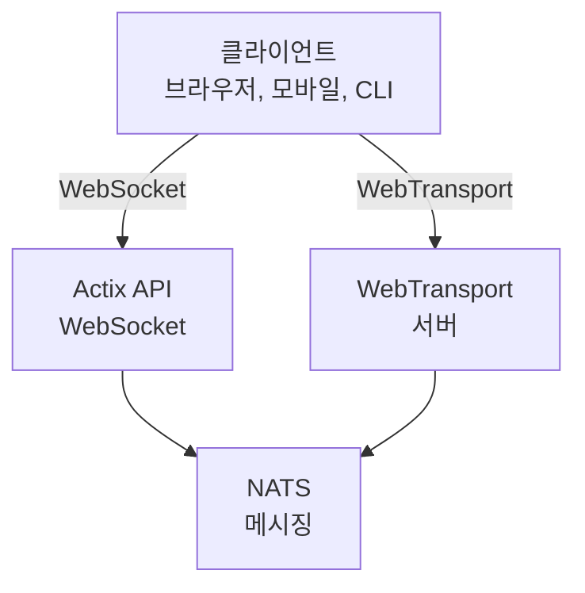

# videocall.rs

<a href="https://opensource.org/licenses/MIT"></a>
<a href="https://discord.gg/JP38NRe4CJ"></a> 
<a href="https://www.digitalocean.com/?refcode=6de4e19c5193&utm_campaign=Referral_Invite&utm_medium=Referral_Program&utm_source=badge"></a>

러스트로 구축된 오픈소스 고성능 화상 회의 플랫폼으로, 저지연 실시간 통신을 제공합니다.

**[웹사이트](https://videocall.rs)** | **[Discord 커뮤니티](https://discord.gg/JP38NRe4CJ)**

## 목차

- [개요](#overview)
- [기능](#features)
- [왜 WebRTC 대신 WebTransport인가?](#why-webtransport-instead-of-webrtc)
- [시스템 아키텍처](#system-architecture)
- [시작하기](#getting-started)
  - [사전 준비 사항](#prerequisites)
  - [도커 설정](#docker-setup)
  - [수동 설정](#manual-setup)
- [사용법](#usage)
- [성능](#performance)
- [보안](#security)
- [로드맵](#roadmap)
- [기여하기](#contributing)
- [프로젝트 구조](#project-structure)
- [데모 및 미디어](#demos-and-media)
- [기여자](#contributors)
- [라이선스](#license)

## 개요

videocall.rs는 신뢰성 있고 확장 가능하며 보안성이 뛰어난 실시간 통신 기능이 필요한 개발자를 위해 전부 러스트로 작성된 현대적인 오픈소스 화상 회의 시스템입니다. 브라우저 기반과 네이티브 클라이언트를 모두 지원하며, 맞춤형 영상 통신 솔루션을 구축할 수 있는 기반을 제공합니다.

**프로젝트 상태:** 베타 - 활발히 개발 중이며 비핵심 프로덕션 용도로 적합

## 기능

- **고성능:** 러스트로 구축되어 최적의 자원 활용과 저지연 제공
- **다중 전송 프로토콜:** WebSockets 및 WebTransport 지원
- **종단 간 암호화 (E2EE):** 피어 간 선택적 보안 통신 가능
- **확장 가능한 아키텍처:** NATS를 활용한 pub/sub 모델로 수평적 확장 설계
- **크로스 플랫폼 지원:** Chromium 기반 브라우저(Chrome, Edge, Brave)에서 작동하며 Safari 지원 개발 중. Firefox는 MediaStreamTrackProcessor 미구현으로 미지원.
- **네이티브 클라이언트 지원:** Raspberry Pi 같은 장치에서 헤드리스 비디오 스트리밍용 CLI 도구 제공
- **오픈소스:** MIT 라이선스로 최대 유연성 제공

## 왜 WebRTC 대신 WebTransport인가?

WebTransport는 videocall.rs를 기존 화상 회의 솔루션과 차별화하는 핵심 기술입니다. 개발자 관점에서 WebTransport 방식이 기술적으로 우수한 이유는 다음과 같습니다:

### 기술적 장점

- **SFU 및 NAT Traversal 불필요:** WebTransport는 WebRTC 구현에서 골칫거리인 복잡한 선택적 전달 유닛(SFU)과 NAT 트래버설 메커니즘을 제거해 개발자의 고통을 줄입니다.

- **단순한 아키텍처:** WebRTC가 요구하는 복잡한 STUN/TURN 서버, ICE 후보 협상, 난해한 신호 교환이 필요 없습니다. 직접적이고 간단한 연결만 필요합니다.

- **프로토콜 효율성:** HTTP/3와 QUIC 위에 구축된 WebTransport는 WebRTC의 구식 SCTP 데이터 채널보다 더 나은 혼잡 제어와 패킷 손실 복구 기능을 가진 다중화된 양방향 스트림을 제공합니다.

- **낮은 지연:** QUIC의 0-RTT 연결 설정은 WebRTC의 여러 왕복 시간보다 초기 연결 시간을 줄여줍니다.

- **깔끔한 개발 경험:** WebTransport는 약속 기반 설계와 깔끔한 스트림 관리로 더 직관적인 개발자 API를 제공합니다.

- **미래 지향적:** IETF 및 W3C에서 개발 중인 현대 웹 플랫폼의 일부로, 강력한 브라우저 벤더 지원과 활발한 규격 발전이 이루어지고 있습니다.

### 개발자에게 미치는 영향

videocall.rs를 통합하는 개발자에게 의미하는 바는:
- ✅ 훨씬 단순한 배포 아키텍처
- ✅ 복잡한 네트워크 설정 및 방화벽 문제 없음
- ✅ 어려운 네트워크 환경에서도 더 나은 성능
- ✅ 구현 간 더 예측 가능한 동작
- ✅ 연결 문제 디버깅에 소요되는 시간 감소
- ✅ 미래 지향적인 기술 투자

WebTransport 구현 방식과 기술적 이점에 관한 상세 내용은 [아키텍처 문서](https://raw.githubusercontent.com/security-union/videocall-rs/main/ARCHITECTURE.md)를 참조하세요.

## 시스템 아키텍처

videocall.rs는 다음과 같은 주요 구성 요소를 가진 마이크로서비스 아키텍처를 따릅니다:



1. **actix-api:** Actix Web 프레임워크 기반 러스트 백엔드 서버  
2. **yew-ui:** Yew 프레임워크로 빌드되어 WebAssembly로 컴파일된 웹 프론트엔드  
3. **videocall-types:** 공유 데이터 타입 및 프로토콜 정의  
4. **videocall-client:** 네이티브 통합용 클라이언트 라이브러리  
5. **videocall-cli:** 헤드리스 비디오 스트리밍용 커맨드라인 인터페이스  

시스템 아키텍처에 대한 자세한 설명은 [아키텍처 문서](https://raw.githubusercontent.com/security-union/videocall-rs/main/ARCHITECTURE.md)를 참고하세요.

## 시작하기

**⭐ 권장: 도커는 유일하게 완전히 지원되는 개발 방법입니다 ⭐**

플랫폼 간 일관된 동작과 유지 관리를 위해 도커 기반 설정을 권장합니다. 아래에 설명된 수동 설정은 유지 관리가 덜 되고 추가 문제 해결이 필요할 수 있습니다.

### 사전 준비 사항

- 최신 Linux 배포판, macOS, 또는 Windows 10/11  
- [Docker](https://docs.docker.com/engine/install/) 및 Docker Compose (컨테이너화된 설정용)  
- [Rust 툴체인](https://rustup.rs/) 1.85 이상 (수동 설치용)  
- Chromium 기반 브라우저(Chrome, Edge, Brave) - Firefox는 미지원  

### 도커 설정

가장 빠른 시작 방법은 도커 기반 설정입니다:

1. 저장소를 클론합니다:
   ```
   git clone https://github.com/security-union/videocall-rs.git
   cd videocall-rs
   ```

2. 서버를 시작합니다 (`<server-ip>`는 자신의 머신 IP로 교체):
   ```
   make up
   ```

3. 로컬 WebTransport용 크롬 실행 스크립트를 실행합니다:
   ```
   ./launch_chrome.sh
   ```

4. 아래 주소에서 애플리케이션에 접속합니다:
   ```
   http://<server-ip>/meeting/<username>/<meeting-id>
   ```

### 수동 설정 (실험적)

⚠️ **경고**: 이 설정 방법은 실험적이며 도커 방식만큼 잘 관리되지 않습니다. 수동 디버깅이 필요할 수 있습니다.

직접 서비스를 실행하고자 하는 고급 사용자를 위한 안내:

1. PostgreSQL 데이터베이스 생성:
   ```
   createdb actix-api-db
   ```

2. 필요한 도구 설치:
   ```
   # NATS 서버 설치
   curl -L https://github.com/nats-io/nats-server/releases/download/v2.9.8/nats-server-v2.9.8-linux-amd64.tar.gz | tar xz
   sudo mv nats-server-v2.9.8-linux-amd64/nats-server /usr/local/bin
   
   # trurl 설치
   cargo install trurl
   ```

3. 개발 환경 시작:
   ```
   ./start_dev.sh
   ```

4. 접속:
   ```
   http://localhost:8081/meeting/<username>/<meeting-id>
   ```

상세 구성 옵션은 [설정 문서](https://docs.videocall.rs/setup)를 참조하세요.

## 사용법

### 브라우저 기반 클라이언트

1. 배포된 인스턴스 또는 로컬호스트 설정으로 접속:
   ```
   http://<server-address>/meeting/<username>/<meeting-id>
   ```

2. 카메라 및 마이크 권한 요청 시 허용

3. "연결" 버튼을 눌러 회의 참가

### CLI 기반 스트리밍

Raspberry Pi 같은 헤드리스 장치용:

```bash
# CLI 도구 설치
cargo install videocall-cli

# 카메라에서 스트리밍
videocall-cli stream \
  --user-id <your-user-id> \
  --video-device-index 0 \
  --meeting-id <meeting-id> \
  --resolution 1280x720 \
  --fps 30 \
  --frame-format NV12 \
  --bitrate-kbps 500
```
videocall-cli 도구와 사용 가능한 모든 옵션에 대한 자세한 내용은 [videocall-cli README](https://raw.githubusercontent.com/security-union/videocall-rs/main/videocall-cli/README.md)를 참조하세요.

## 성능

videocall.rs는 다음 시나리오에 대해 벤치마킹되고 최적화되었습니다:

- **1:1 통화:** 일반적인 연결에서 <100ms 지연과 최소 리소스 사용
- **소규모 그룹 (3-10명):** 네트워크 조건에 따른 적응형 품질의 효율적인 메시 토폴로지
- **대규모 회의:** 선택적 포워딩 아키텍처를 사용하여 최대 1000명 참가자까지 테스트 완료

### 기술 최적화

- **제로 카피 설계:** 네트워크 스택과 애플리케이션 코드 간 데이터 복사 최소화
- **비동기 코어:** Rust의 async/await 생태계와 Tokio 런타임 기반  
- **SIMD 가속 처리:** 가능한 경우 CPU 벡터화를 사용한 미디어 연산
- **락-프리 데이터 구조:** 고처리량 시나리오에서 경쟁 최소화
- **프로토콜 수준 최적화:** 맞춤형 혼잡 제어 및 패킷 스케줄링

### 리소스 사용

서버 측 아키텍처는 대규모 환경에서 효율성을 염두에 두고 설계되었습니다:

- **수평 확장:** 서버 인스턴스 추가에 따른 선형 성능 확장
- **부하 분산:** 서버 풀 간 자동 연결 균형 조정
- **리소스 관리:** 대역폭, 연결, CPU 사용률에 대한 구성 가능한 제한
- **컨테이너 최적화:** 쿠버네티스 환경에서 효율적인 배포 설계

성능 지표 및 튜닝 가이드라인은 [performance documentation](https://raw.githubusercontent.com/security-union/videocall-rs/main/PERFORMANCE.md)(작업 중)에서 확인할 수 있습니다.

## 보안

보안은 videocall.rs의 핵심입니다:

- **전송 보안:** 모든 통신은 TLS/HTTPS를 사용합니다.
- **종단 간 암호화:** 서버가 콘텐츠에 접근하지 않는 선택적 E2EE 지원
- **인증:** 다양한 아이덴티티 제공자와의 유연한 통합
- **접근 제어:** 회의실에 대한 세밀한 권한 시스템

보안 모델 및 모범 사례에 대한 자세한 내용은 [security documentation](https://docs.videocall.rs/security)을 참조하세요.

## 로드맵

| 버전   | 목표 날짜 | 주요 기능                      |
|--------|-----------|-------------------------------|
| 0.5.0  | 2023년 2분기 | ✅ 종단 간 암호화               |
| 0.6.0  | 2023년 3분기 | ✅ Safari 브라우저 지원         |
| 0.7.0  | 2023년 4분기 | ✅ 네이티브 모바일 SDK          |
| 0.8.0  | 2024년 1분기 | 🔄 화면 공유 개선              |
| 1.0.0  | 2024년 2분기 | 🔄 완전한 API 안정성과 함께한 프로덕션 릴리스 |

## 기여하기

커뮤니티의 기여를 환영합니다! 참여 방법은 다음과 같습니다:

1. **이슈:** 버그 신고 또는 기능 제안은 [GitHub Issues](https://github.com/security-union/videocall-rs/issues)에서 제출하세요.

2. **풀 리퀘스트:** 버그 수정 또는 개선 사항에 대한 PR 제출

3. **RFC 프로세스:** 주요 변경 사항은 [RFC 프로세스](https://raw.githubusercontent.com/security-union/videocall-rs/main/rfc)를 통해 참여

4. **커뮤니티:** 개발 논의를 위해 [Discord 서버](https://discord.gg/JP38NRe4CJ)에 참여하세요.

자세한 정보는 [Contributing Guidelines](https://raw.githubusercontent.com/security-union/videocall-rs/main/CONTRIBUTING.md)를 참고하세요.


### 기술 스택

- **백엔드**: Rust + Actix Web + PostgreSQL + NATS
- **프론트엔드**: Rust + Yew + WebAssembly + Tailwind CSS
- **전송**: WebTransport (QUIC/HTTP3) + WebSockets (폴백)
- **빌드 시스템**: Cargo + Trunk + Docker + Helm
- **테스트**: Rust 테스트 프레임워크 + Playwright를 이용한 E2E 테스트

### 주요 기술 특징

- **양방향 스트리밍**: QUIC 스트림을 사용하는 완전 비동기 메시지 전달
- **오류 처리**: 코드 전반에 걸친 Result 기반 포괄적 오류 전파
- **모듈화**: 컴포넌트 간 명확한 인터페이스로 관심사 분리
- **타입 안전성**: 런타임 오류 방지를 위한 Rust 타입 시스템 광범위 활용
- **바이너리 프로토콜**: 모든 메시지에 효율적인 프로토콜 버퍼 직렬화 사용

더 자세한 기술 개요는 [Architecture Document](https://raw.githubusercontent.com/security-union/videocall-rs/main/ARCHITECTURE.md)를 참고하세요.

### Git 훅

이 저장소에는 코드 품질 유지를 위한 Git 훅이 포함되어 있습니다:

1. **Pre-commit 훅**: 커밋 전에 `cargo fmt`를 자동 실행하여 일관된 코드 포맷 유지
2. **Post-commit 훅**: 커밋 후 `cargo clippy`를 실행하여 잠재적 코드 개선 사항 점검

이 훅들을 설치하려면 프로젝트 루트에서 다음 명령어를 실행하세요:

```bash
# 훅 디렉토리가 없으면 생성
mkdir -p .git/hooks

# pre-commit 훅 생성
cat > .git/hooks/pre-commit << 'EOF'
#!/bin/sh

# cargo fmt 실행 및 변경 사항 검사
echo "Running cargo fmt..."
cargo fmt --all -- --check

# cargo fmt 종료 코드 확인
if [ $? -ne 0 ]; then
    echo "cargo fmt에서 포맷 문제를 발견했습니다. 커밋 전에 수정하세요."
    exit 1
fi

exit 0
EOF

# post-commit 훅 생성
cat > .git/hooks/post-commit << 'EOF'
#!/bin/sh

# 커밋 후 cargo clippy 실행
echo "Running cargo clippy..."
ACTIX_UI_BACKEND_URL="" WEBTRANSPORT_HOST="" LOGIN_URL="" WEBTRANSPORT_URL="" ACTIX_API_URL="" cargo clippy -- -D warnings

# cargo clippy 종료 코드 확인
if [ $? -ne 0 ]; then
    echo "Cargo clippy에서 코드 문제를 발견했습니다. 수정해 주세요."
    # 커밋은 이미 완료되었으므로 중단할 수 없지만 사용자에게 알림
    echo "커밋은 성공했지만 푸시 전에 clippy 문제를 수정하는 것을 권장합니다."
fi

exit 0
EOF

# 훅 실행 권한 부여
chmod +x .git/hooks/pre-commit .git/hooks/post-commit
```

이 훅들은 올바른 포맷 유지와 일반적인 문제 점검을 통해 코드 품질을 보장하는 데 도움을 줍니다.

## 데모 및 미디어

### 기술 발표

- [통화당 1000명 사용자 확장 사례](https://youtu.be/LWwOSZJwEJI)
- [초기 개념 증명 (2022)](https://www.youtube.com/watch?v=kZ9isFw1TQ8)

### 채널

- [YouTube 채널](https://www.youtube.com/@dario.lencina)

## 기여자

<table>
<tr>
<td align="center"><a href="https://github.com/darioalessandro"><br /><sub><b>Dario Lencina</b></sub></a></td>
<td align="center"><a href="https://github.com/griffobeid"><br /><sub><b>Griffin Obeid</b></sub></a></td>    
<td align="center"><a href="https://github.com/ronen"><br /><sub><b>Ronen Barzel</b></sub></a></td>
<td align="center"><a href="https://github.com/leon3s"><br /><sub><b>Leone</b></sub></a></td>
<td align="center"><a href="https://github.com/JasterV"><br /><sub><b>Victor Martínez</b></sub></a></td>
</tr>
</table>

Actix 웹소켓 구현에 [JasterV](https://github.com/JasterV)께 특별한 감사를 드립니다. 이 구현에는 [chat-rooms-actix](https://github.com/JasterV/chat-rooms-actix) 프로젝트의 일부 코드가 포함되어 있습니다.

## 라이선스

이 프로젝트는 MIT 라이선스 하에 배포됩니다. 자세한 내용은 [LICENSE.md](https://raw.githubusercontent.com/security-union/videocall-rs/main/LICENSE.md)를 참조하세요.


---


Tranlated By [Open Ai Tx](https://github.com/OpenAiTx/OpenAiTx) | Last indexed: 2025-06-11


---