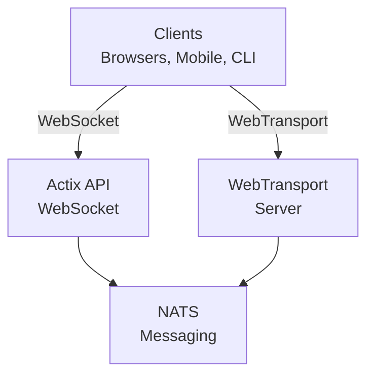

# videocall.rs

<a href="https://opensource.org/licenses/MIT"></a>
<a href="https://discord.gg/JP38NRe4CJ"></a> 
<a href="https://www.digitalocean.com/?refcode=6de4e19c5193&utm_campaign=Referral_Invite&utm_medium=Referral_Program&utm_source=badge"></a>

Een open-source, hoogwaardig videoconferentieplatform gebouwd met Rust, dat realtime communicatie met lage latentie biedt.

**[Website](https://videocall.rs)** | **[Discord Community](https://discord.gg/JP38NRe4CJ)**

## Inhoudsopgave

- [Overzicht](#overzicht)
- [Functies](#functies)
- [Waarom WebTransport in plaats van WebRTC?](#waarom-webtransport-in-plaats-van-webrtc)
- [Systeemarchitectuur](#systeemarchitectuur)
- [Aan de slag](#aan-de-slag)
  - [Vereisten](#vereisten)
  - [Docker Setup](#docker-setup)
  - [Handmatige Setup](#handmatige-setup)
- [Gebruik](#gebruik)
- [Prestaties](#prestaties)
- [Beveiliging](#beveiliging)
- [Roadmap](#roadmap)
- [Bijdragen](#bijdragen)
- [Projectstructuur](#projectstructuur)
- [Demo's en Media](#demos-en-media)
- [Bijdragers](#bijdragers)
- [Licentie](#licentie)

## Overzicht

videocall.rs is een modern, open-source videoconferentiesysteem volledig geschreven in Rust, ontworpen voor ontwikkelaars die betrouwbare, schaalbare en veilige realtime communicatie nodig hebben. Het biedt een basis voor het bouwen van aangepaste video-communicatieoplossingen, met ondersteuning voor zowel browsergebaseerde als native clients.

**Projectstatus:** Beta - Actief in ontwikkeling en geschikt voor niet-kritisch productiegebruik

## Functies

- **Hoge prestaties:** Gebouwd met Rust voor optimale resourcebenutting en lage latentie
- **Meerdere transportprotocollen:** Ondersteuning voor WebSockets en WebTransport 
- **End-to-End Encryptie (E2EE):** Optionele beveiligde communicatie tussen peers
- **Schaalbare architectuur:** Ontworpen met een pub/sub-model met NATS voor horizontale schaalbaarheid
- **Cross-platform ondersteuning:** Werkt op Chromium-gebaseerde browsers (Chrome, Edge, Brave) met Safari-ondersteuning in ontwikkeling. Firefox wordt niet ondersteund vanwege onvolledige MediaStreamTrackProcessor-implementatie.
- **Native client-ondersteuning:** CLI-tool voor headless videostreaming vanaf apparaten zoals Raspberry Pi
- **Open Source:** MIT-licentie voor maximale flexibiliteit

## Waarom WebTransport in plaats van WebRTC?

WebTransport is een kerntechnologie die videocall.rs onderscheidt van traditionele videoconferentieoplossingen. Als ontwikkelaar is hier waarom onze WebTransport-benadering technisch superieur is:

### Technische voordelen

- **Geen SFU's, geen NAT-traversal:** WebTransport elimineert de noodzaak voor complexe Selective Forwarding Units en NAT-traversal-mechanismen die WebRTC-implementaties lastig maken en talloze ontwikkelaarsproblemen veroorzaken.

- **Vereenvoudigde architectuur:** Geen ingewikkelde STUN/TURN-servers, ICE-candidate-onderhandelingen of ingewikkelde signaleringsdansen zoals bij WebRTC. Gewoon directe, eenvoudige verbindingen.

- **Protocol efficiëntie:** Gebouwd op HTTP/3 en QUIC, biedt WebTransport gemultiplexte, bidirectionele streams met betere congestiebeheersing en pakketverliesherstel dan de verouderde SCTP-datakanelen van WebRTC.

- **Lagere latentie:** QUIC’s 0-RTT connectie-opbouw verkort de initiële verbindingstijden vergeleken met de meerdere roundtrips van WebRTC.

- **Schone ontwikkelervaring:** WebTransport biedt een intuïtievere ontwikkelaar-API met een op promises gebaseerde ontwerp en nettere streambeheer.

- **Toekomstbestendig:** Als onderdeel van het moderne webplatform ontwikkeld door IETF en W3C, heeft WebTransport sterke browserleveranciersondersteuning en een actief evoluerende specificatie.

### Implicaties voor ontwikkelaars

Voor ontwikkelaars die videocall.rs integreren betekent dit:
- ✅ Drastisch eenvoudigere deployment-architectuur
- ✅ Geen complexe netwerkconfiguratie of firewallproblemen
- ✅ Betere prestaties onder moeilijke netwerkcondities
- ✅ Voorspelbaarder gedrag over implementaties heen
- ✅ Minder tijd kwijt aan het debuggen van connectiviteitsproblemen
- ✅ Een toekomstgerichte technologische investering

Lees ons [Architectuurdocument](https://raw.githubusercontent.com/security-union/videocall-rs/main/ARCHITECTURE.md) voor een diepgaande uitleg over hoe we WebTransport implementeren en welke technische voordelen het biedt.

## Systeemarchitectuur

videocall.rs volgt een microservices-architectuur met de volgende hoofdcomponenten:



1. **actix-api:** Rust-gebaseerde backendserver met het Actix Web-framework
2. **yew-ui:** Webfrontend gebouwd met het Yew-framework en gecompileerd naar WebAssembly
3. **videocall-types:** Gedeelde datatypes en protocoldefinities
4. **videocall-client:** Clientbibliotheek voor native integratie
5. **videocall-cli:** Command-line interface voor headless videostreaming

Voor een gedetailleerdere uitleg van de systeemarchitectuur, zie ons [Architectuurdocument](https://raw.githubusercontent.com/security-union/videocall-rs/main/ARCHITECTURE.md).

## Aan de slag

**⭐ AANBEVOLEN: Docker is de enige volledig ondersteunde ontwikkelmethode ⭐**

We raden sterk aan om de Docker-gebaseerde setup te gebruiken voor ontwikkeling, omdat deze goed onderhouden wordt en consistent gedrag op verschillende platforms biedt. De handmatige setup hieronder beschreven is minder goed onderhouden en kan extra troubleshooting vereisen.

### Vereisten

- Moderne Linux-distributie, macOS of Windows 10/11
- [Docker](https://docs.docker.com/engine/install/) en Docker Compose (voor containerized setup)
- [Rust toolchain](https://rustup.rs/) 1.85+ (voor handmatige setup)
- Chromium-gebaseerde browser (Chrome, Edge, Brave) voor frontend-toegang - Firefox wordt niet ondersteund

### Docker Setup

De snelste manier om aan de slag te gaan is met onze Docker-gebaseerde setup:

1. Clone de repository:
   ```
   git clone https://github.com/security-union/videocall-rs.git
   cd videocall-rs
   ```

2. Start de server (vervang `<server-ip>` door het IP-adres van je machine):
   ```
   make up
   ```

3. Open Chrome met het meegeleverde script voor lokale WebTransport:
   ```
   ./launch_chrome.sh
   ```

4. Open de applicatie op:
   ```
   http://<server-ip>/meeting/<gebruikersnaam>/<vergader-id>
   ```

### Handmatige Setup (Experimenteel)

⚠️ **Waarschuwing**: Deze setupmethode is experimenteel en wordt niet zo goed onderhouden als de Docker-aanpak. Je kunt problemen tegenkomen die handmatig debuggen vereisen.

Voor gevorderde gebruikers die services direct op hun machine willen draaien:

1. Maak een PostgreSQL-database aan:
   ```
   createdb actix-api-db
   ```

2. Installeer vereiste tools:
   ```
   # Installeer NATS-server
   curl -L https://github.com/nats-io/nats-server/releases/download/v2.9.8/nats-server-v2.9.8-linux-amd64.tar.gz | tar xz
   sudo mv nats-server-v2.9.8-linux-amd64/nats-server /usr/local/bin
   
   # Installeer trurl
   cargo install trurl
   ```

3. Start de ontwikkelomgeving:
   ```
   ./start_dev.sh
   ```

4. Verbind met:
   ```
   http://localhost:8081/meeting/<gebruikersnaam>/<vergader-id>
   ```

Voor gedetailleerde configuratie-opties, zie onze [setupdocumentatie](https://docs.videocall.rs/setup).

## Gebruik

### Browser-gebaseerde clients

1. Navigeer naar je gedeployde instantie of localhost-setup:
   ```
   http://<server-adres>/meeting/<gebruikersnaam>/<vergader-id>
   ```

2. Geef toestemming voor camera en microfoon wanneer hierom wordt gevraagd

3. Klik op "Connect" om deel te nemen aan de vergadering

### CLI-gebaseerde streaming

Voor headless apparaten zoals Raspberry Pi:

```bash
# Installeer de CLI-tool
cargo install videocall-cli

# Stream vanaf een camera
videocall-cli stream \
  --user-id <jouw-gebruikers-id> \
  --video-device-index 0 \
  --meeting-id <vergader-id> \
  --resolution 1280x720 \
  --fps 30 \
  --frame-format NV12 \
  --bitrate-kbps 500
```
Voor gedetailleerde informatie over de CLI-tool en alle beschikbare opties, zie de [videocall-cli README](https://raw.githubusercontent.com/security-union/videocall-rs/main/videocall-cli/README.md).

## Prestaties

videocall.rs is getest en geoptimaliseerd voor de volgende scenario's:

- **1-op-1 Gesprekken:** Minimale resourcegebruik met <100ms latency op typische verbindingen
- **Kleine Groepen (3-10):** Efficiënte mesh-topologie met adaptieve kwaliteit op basis van netwerkcondities
- **Grote Conferenties:** Getest met tot 1000 deelnemers via selectieve forwarding architectuur

### Technische Optimalisaties

- **Zero-Copy Ontwerp:** Minimaliseert datakopieën tussen netwerkstack en applicatiecode
- **Asynchrone Kern:** Gebouwd op Rust's async/await ecosysteem met Tokio runtime  
- **SIMD-versnelde Verwerking:** Gebruikt CPU-vectorisatie voor media-operaties waar beschikbaar
- **Lock-Free Datastructuren:** Minimaliseert contentie in scenario's met hoge doorvoer
- **Protocolniveau Optimalisaties:** Op maat gemaakte congestiecontrole en pakketplanning

### Resourcegebruik

Onze server-side architectuur is ontworpen voor efficiëntie op schaal:

- **Horizontale Schaling:** Lineaire prestatieverbetering met extra serverinstanties
- **Loadverdeling:** Automatische verbinding-balancering over de serverpool
- **Resourcebeheer:** Configureerbare limieten voor bandbreedte, verbindingen en CPU-gebruik
- **Container-geoptimaliseerd:** Ontworpen voor efficiënte inzet in Kubernetes-omgevingen

Prestatiegegevens en afstemmingsrichtlijnen zullen beschikbaar zijn in onze [prestatie-documentatie](https://raw.githubusercontent.com/security-union/videocall-rs/main/PERFORMANCE.md). (WIP)

## Beveiliging

Beveiliging is een kernfocus van videocall.rs:

- **Transportbeveiliging:** Alle communicatie gebruikt TLS/HTTPS.
- **End-to-End Encryptie:** Optionele E2EE tussen peers zonder servertoegang tot inhoud.
- **Authenticatie:** Flexibele integratie met identiteitsproviders.
- **Toegangscontrole:** Fijnmazig permissiesysteem voor vergaderruimtes.

Voor details over ons beveiligingsmodel en beste praktijken, zie onze [beveiligingsdocumentatie](https://docs.videocall.rs/security).

## Roadmap

| Versie | Doeldatum | Belangrijkste Kenmerken |
|---------|------------|--------------|
| 0.5.0   | Q2 2023    | ✅ End-to-End Encryptie |
| 0.6.0   | Q3 2023    | ✅ Safari Browser Ondersteuning |
| 0.7.0   | Q4 2023    | ✅ Native Mobiele SDK's |
| 0.8.0   | Q1 2024    | 🔄 Verbeteringen in Schermdelen |
| 1.0.0   | Q2 2024    | 🔄 Productierelease met Volledige API Stabiliteit |


## Bijdragen

We verwelkomen bijdragen vanuit de community! Zo kun je meedoen:

1. **Issues:** Meld bugs of stel functies voor via [GitHub Issues](https://github.com/security-union/videocall-rs/issues)

2. **Pull Requests:** Dien PR's in voor bugfixes of verbeteringen

3. **RFC Proces:** Voor belangrijke wijzigingen, neem deel aan ons [RFC-proces](https://raw.githubusercontent.com/security-union/videocall-rs/main/rfc)

4. **Community:** Word lid van onze [Discord-server](https://discord.gg/JP38NRe4CJ) om ontwikkeling te bespreken

Zie onze [Bijdrager Richtlijnen](https://raw.githubusercontent.com/security-union/videocall-rs/main/CONTRIBUTING.md) voor meer gedetailleerde informatie.


### Technologie Stack

- **Backend**: Rust + Actix Web + PostgreSQL + NATS
- **Frontend**: Rust + Yew + WebAssembly + Tailwind CSS
- **Transport**: WebTransport (QUIC/HTTP3) + WebSockets (fallback)
- **Build Systeem**: Cargo + Trunk + Docker + Helm
- **Testing**: Rust test framework + Playwright voor E2E tests

### Belangrijke Technische Kenmerken

- **Bidirectionele Streaming**: Volledig asynchrone berichtoverdracht via QUIC streams
- **Foutafhandeling**: Uitgebreide Result-gebaseerde foutpropagatie door de codebasis
- **Modulariteit**: Schone scheiding van verantwoordelijkheden met goed gedefinieerde interfaces tussen componenten
- **Typeveiligheid**: Uitgebreid gebruik van Rust's typesysteem om runtime fouten te voorkomen
- **Binair Protocol**: Efficiënte Protocol Buffer serialisatie voor alle berichten

Voor een meer uitgebreide technische overzicht, zie het [Architectuur Document](https://raw.githubusercontent.com/security-union/videocall-rs/main/ARCHITECTURE.md).

### Git Hooks

Deze repository bevat Git hooks om codekwaliteit te waarborgen:

1. **Pre-commit Hook**: Voert automatisch `cargo fmt` uit voor elke commit om consistente codeformattering te garanderen.
2. **Post-commit Hook**: Voert `cargo clippy` uit na elke commit om potentiële codeverbeteringen te controleren.

Om deze hooks te installeren, voer je de volgende commando's uit vanaf de projectroot:

```bash
# Maak de hooks map aan als deze nog niet bestaat
mkdir -p .git/hooks

# Maak de pre-commit hook aan
cat > .git/hooks/pre-commit << 'EOF'
#!/bin/sh

# Voer cargo fmt uit en controleer op wijzigingen
echo "Cargo fmt wordt uitgevoerd..."
cargo fmt --all -- --check

# Controleer de exitcode van cargo fmt
if [ $? -ne 0 ]; then
    echo "cargo fmt vond formatteringsproblemen. Los deze op voordat je commit."
    exit 1
fi

exit 0
EOF

# Maak de post-commit hook aan
cat > .git/hooks/post-commit << 'EOF'
#!/bin/sh

# Voer cargo clippy uit na de commit
echo "Cargo clippy wordt uitgevoerd..."
ACTIX_UI_BACKEND_URL="" WEBTRANSPORT_HOST="" LOGIN_URL="" WEBTRANSPORT_URL="" ACTIX_API_URL="" cargo clippy -- -D warnings

# Controleer de exitcode van cargo clippy
if [ $? -ne 0 ]; then
    echo "Cargo clippy vond problemen in je code. Los deze op."
    # We kunnen de commit niet afbreken omdat deze al voltooid is, maar kunnen de gebruiker informeren
    echo "De commit was succesvol, maar overweeg de clippy problemen op te lossen voordat je pusht."
fi

exit 0
EOF

# Maak de hooks uitvoerbaar
chmod +x .git/hooks/pre-commit .git/hooks/post-commit
```

Deze hooks helpen de codekwaliteit te behouden door correcte formattering af te dwingen en veelvoorkomende problemen te controleren.

## Demo's en Media

### Technische Presentaties

- [Schaal naar 1000 Gebruikers per Gesprek](https://youtu.be/LWwOSZJwEJI)
- [Initiële Proof of Concept (2022)](https://www.youtube.com/watch?v=kZ9isFw1TQ8)

### Kanalen

- [YouTube Kanaal](https://www.youtube.com/@dario.lencina)

## Bijdragers

<table>
<tr>
<td align="center"><a href="https://github.com/darioalessandro"><br /><sub><b>Dario Lencina</b></sub></a></td>
<td align="center"><a href="https://github.com/griffobeid"><br /><sub><b>Griffin Obeid</b></sub></a></td>    
<td align="center"><a href="https://github.com/ronen"><br /><sub><b>Ronen Barzel</b></sub></a></td>
<td align="center"><a href="https://github.com/leon3s"><br /><sub><b>Leone</b></sub></a></td>
<td align="center"><a href="https://github.com/JasterV"><br /><sub><b>Victor Martínez</b></sub></a></td>
</tr>
</table>

Speciale dank aan [JasterV](https://github.com/JasterV) voor de Actix websocket-implementatie die fragmenten bevat van het [chat-rooms-actix](https://github.com/JasterV/chat-rooms-actix) project.

## Licentie

Dit project is gelicenseerd onder de MIT-licentie - zie het [LICENSE.md](https://raw.githubusercontent.com/security-union/videocall-rs/main/LICENSE.md) bestand voor details.


---


Tranlated By [Open Ai Tx](https://github.com/OpenAiTx/OpenAiTx) | Last indexed: 2025-06-11


---