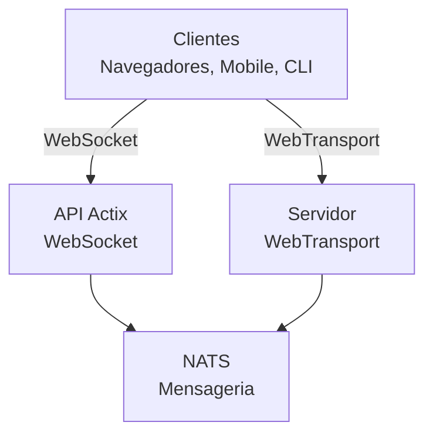

# videocall.rs

<a href="https://opensource.org/licenses/MIT"></a>
<a href="https://discord.gg/JP38NRe4CJ"></a> 
<a href="https://www.digitalocean.com/?refcode=6de4e19c5193&utm_campaign=Referral_Invite&utm_medium=Referral_Program&utm_source=badge"></a>

Uma plataforma de videoconferência de alto desempenho e código aberto construída com Rust, oferecendo comunicação em tempo real com baixa latência.

**[Website](https://videocall.rs)** | **[Comunidade Discord](https://discord.gg/JP38NRe4CJ)**

## Índice

- [Visão Geral](#overview)
- [Recursos](#features)
- [Por que WebTransport em vez de WebRTC?](#why-webtransport-instead-of-webrtc)
- [Arquitetura do Sistema](#system-architecture)
- [Primeiros Passos](#getting-started)
  - [Pré-requisitos](#prerequisites)
  - [Configuração com Docker](#docker-setup)
  - [Configuração Manual](#manual-setup)
- [Uso](#usage)
- [Desempenho](#performance)
- [Segurança](#security)
- [Roteiro](#roadmap)
- [Contribuição](#contributing)
- [Estrutura do Projeto](#project-structure)
- [Demonstrações e Mídia](#demos-and-media)
- [Contribuidores](#contributors)
- [Licença](#license)

## Visão Geral

videocall.rs é um sistema moderno e de código aberto para videoconferência, escrito inteiramente em Rust, projetado para desenvolvedores que precisam de capacidades confiáveis, escaláveis e seguras de comunicação em tempo real. Ele fornece uma base para construir soluções personalizadas de comunicação por vídeo, com suporte tanto para clientes baseados em navegador quanto nativos.

**Status do Projeto:** Beta - Ativamente desenvolvido e adequado para uso em produção não crítico

## Recursos

- **Alto Desempenho:** Construído com Rust para uso ótimo de recursos e baixa latência
- **Múltiplos Protocolos de Transporte:** Suporte para WebSockets e WebTransport 
- **Criptografia de Ponta a Ponta (E2EE):** Comunicações seguras opcionais entre pares
- **Arquitetura Escalável:** Projetado com modelo pub/sub usando NATS para escalonamento horizontal
- **Suporte Multiplataforma:** Funciona em navegadores baseados em Chromium (Chrome, Edge, Brave) com suporte a Safari em desenvolvimento. Firefox não é suportado devido à implementação incompleta do MediaStreamTrackProcessor.
- **Suporte a Cliente Nativo:** Ferramenta CLI para streaming de vídeo sem interface gráfica de dispositivos como Raspberry Pi
- **Código Aberto:** Licenciado sob MIT para máxima flexibilidade

## Por que WebTransport em vez de WebRTC?

WebTransport é uma tecnologia central que diferencia o videocall.rs das soluções tradicionais de videoconferência. Como desenvolvedor, veja por que nossa abordagem com WebTransport é tecnicamente superior:

### Vantagens Técnicas

- **Sem SFUs, Sem Traversal de NAT:** WebTransport elimina a necessidade de unidades de encaminhamento seletivo complexas e mecanismos de traversal de NAT que afetam as implementações WebRTC e causam inúmeros problemas para os desenvolvedores.

- **Arquitetura Simplificada:** Sem servidores STUN/TURN complexos, negociação de candidatos ICE ou danças de sinalização complicadas exigidas pelo WebRTC. Apenas conexões diretas e simples.

- **Eficiência do Protocolo:** Construído sobre HTTP/3 e QUIC, o WebTransport oferece streams multiplexados e bidirecionais com melhor controle de congestionamento e recuperação de perda de pacotes do que os canais de dados SCTP datados do WebRTC.

- **Menor Latência:** O estabelecimento de conexão 0-RTT do QUIC reduz o tempo inicial de conexão em comparação com as múltiplas idas e vindas do WebRTC.

- **Experiência de Desenvolvimento Limpa:** WebTransport oferece uma API para desenvolvedores mais intuitiva com design baseado em promessas e gerenciamento de streams mais limpo.

- **Tecnologia para o Futuro:** Como parte da plataforma web moderna desenvolvida pelo IETF e W3C, o WebTransport conta com forte suporte dos fornecedores de navegadores e especificação em evolução ativa.

### Implicações para Desenvolvedores

Para os desenvolvedores que integram o videocall.rs, isso significa:
- ✅ Arquitetura de implantação drasticamente mais simples
- ✅ Sem configurações complexas de rede ou problemas de firewall
- ✅ Melhor desempenho em condições de rede desafiadoras
- ✅ Comportamento mais previsível entre implementações
- ✅ Menos tempo gasto depurando problemas de conectividade
- ✅ Um investimento tecnológico com visão de futuro

Leia nosso [Documento de Arquitetura](https://raw.githubusercontent.com/security-union/videocall-rs/main/ARCHITECTURE.md) para um mergulho profundo sobre como implementamos WebTransport e os benefícios técnicos que ele oferece.

## Arquitetura do Sistema

videocall.rs segue uma arquitetura de microsserviços com estes componentes principais:



1. **actix-api:** Servidor backend em Rust usando o framework Actix Web
2. **yew-ui:** Frontend web construído com o framework Yew e compilado para WebAssembly
3. **videocall-types:** Tipos de dados compartilhados e definições de protocolo
4. **videocall-client:** Biblioteca cliente para integração nativa
5. **videocall-cli:** Interface de linha de comando para streaming de vídeo sem interface gráfica

Para uma explicação mais detalhada da arquitetura do sistema, consulte nosso [Documento de Arquitetura](https://raw.githubusercontent.com/security-union/videocall-rs/main/ARCHITECTURE.md).

## Primeiros Passos

**⭐ RECOMENDADO: Docker é o único método de desenvolvimento totalmente suportado ⭐**

Recomendamos fortemente o uso da configuração baseada em Docker para desenvolvimento, pois é bem mantida e oferece comportamento consistente entre plataformas. A configuração manual descrita abaixo não é tão bem mantida e pode exigir solução de problemas adicional.

### Pré-requisitos

- Distribuição moderna Linux, macOS ou Windows 10/11
- [Docker](https://docs.docker.com/engine/install/) e Docker Compose (para configuração em contêiner)
- [Toolchain Rust](https://rustup.rs/) 1.85+ (para configuração manual)
- Navegador baseado em Chromium (Chrome, Edge, Brave) para acesso ao frontend - Firefox não é suportado

### Configuração com Docker

A maneira mais rápida de começar é com nossa configuração baseada em Docker:

1. Clone o repositório:
   ```
   git clone https://github.com/security-union/videocall-rs.git
   cd videocall-rs
   ```

2. Inicie o servidor (substitua `<server-ip>` pelo IP da sua máquina):
   ```
   make up
   ```

3. Abra o Chrome usando o script fornecido para WebTransport local:
   ```
   ./launch_chrome.sh
   ```

4. Acesse a aplicação em:
   ```
   http://<server-ip>/meeting/<username>/<meeting-id>
   ```

### Configuração Manual (Experimental)

⚠️ **Aviso**: Este método de configuração é experimental e não é tão bem mantido quanto a abordagem com Docker. Você pode encontrar problemas que exigem depuração manual.

Para usuários avançados que preferem rodar os serviços diretamente em sua máquina:

1. Crie um banco de dados PostgreSQL:
   ```
   createdb actix-api-db
   ```

2. Instale as ferramentas necessárias:
   ```
   # Instalar servidor NATS
   curl -L https://github.com/nats-io/nats-server/releases/download/v2.9.8/nats-server-v2.9.8-linux-amd64.tar.gz | tar xz
   sudo mv nats-server-v2.9.8-linux-amd64/nats-server /usr/local/bin
   
   # Instalar trurl
   cargo install trurl
   ```

3. Inicie o ambiente de desenvolvimento:
   ```
   ./start_dev.sh
   ```

4. Conecte-se em:
   ```
   http://localhost:8081/meeting/<username>/<meeting-id>
   ```

Para opções detalhadas de configuração, consulte nossa [documentação de setup](https://docs.videocall.rs/setup).

## Uso

### Clientes Baseados em Navegador

1. Navegue até sua instância implantada ou configuração local:
   ```
   http://<server-address>/meeting/<username>/<meeting-id>
   ```

2. Conceda permissões de câmera e microfone quando solicitado

3. Clique em "Conectar" para entrar na reunião

### Streaming via CLI

Para dispositivos sem interface gráfica, como Raspberry Pi:

```bash
# Instale a ferramenta CLI
cargo install videocall-cli

# Faça streaming de uma câmera
videocall-cli stream \
  --user-id <seu-user-id> \
  --video-device-index 0 \
  --meeting-id <meeting-id> \
  --resolution 1280x720 \
  --fps 30 \
  --frame-format NV12 \
  --bitrate-kbps 500
```
Para informações detalhadas sobre a ferramenta CLI e todas as opções disponíveis, veja o [videocall-cli README](https://raw.githubusercontent.com/security-union/videocall-rs/main/videocall-cli/README.md).

## Performance

videocall.rs foi testado e otimizado para os seguintes cenários:

- **Chamadas 1-a-1:** Utilização mínima de recursos com latência <100ms em conexões típicas  
- **Pequenos Grupos (3-10):** Topologia mesh eficiente com qualidade adaptativa baseada nas condições da rede  
- **Grandes Conferências:** Testado com até 1000 participantes usando arquitetura de encaminhamento seletivo

### Otimizações Técnicas

- **Design Zero-Copy:** Minimiza a cópia de dados entre a pilha de rede e o código da aplicação  
- **Núcleo Assíncrono:** Construído sobre o ecossistema async/await do Rust com runtime Tokio  
- **Processamento Acelerado por SIMD:** Usa vetorização da CPU para operações de mídia quando disponível  
- **Estruturas de Dados Sem Locks:** Minimiza contenção em cenários de alta taxa de transferência  
- **Otimizações no Nível de Protocolo:** Controle de congestionamento e agendamento de pacotes customizados

### Utilização de Recursos

Nossa arquitetura do lado servidor é projetada para eficiência em escala:

- **Escalabilidade Horizontal:** Escalabilidade linear de desempenho com instâncias adicionais do servidor  
- **Distribuição de Carga:** Balanceamento automático de conexões entre o pool de servidores  
- **Governança de Recursos:** Limites configuráveis para largura de banda, conexões e utilização de CPU  
- **Otimizado para Containers:** Projetado para implantação eficiente em ambientes Kubernetes

Métricas de performance e diretrizes de ajuste estarão disponíveis em nossa [documentação de performance](https://raw.githubusercontent.com/security-union/videocall-rs/main/PERFORMANCE.md). (Em andamento)

## Segurança

A segurança é um foco central do videocall.rs:

- **Segurança de Transporte:** Todas as comunicações usam TLS/HTTPS.  
- **Criptografia End-to-End:** E2EE opcional entre pares sem acesso do servidor ao conteúdo.  
- **Autenticação:** Integração flexível com provedores de identidade.  
- **Controles de Acesso:** Sistema de permissões detalhado para salas de reunião.

Para detalhes sobre nosso modelo de segurança e melhores práticas, veja nossa [documentação de segurança](https://docs.videocall.rs/security).

## Roteiro

| Versão | Data Alvo | Principais Recursos |
|---------|------------|--------------|
| 0.5.0   | Q2 2023    | ✅ Criptografia End-to-End |
| 0.6.0   | Q3 2023    | ✅ Suporte ao Navegador Safari |
| 0.7.0   | Q4 2023    | ✅ SDKs Nativos para Mobile |
| 0.8.0   | Q1 2024    | 🔄 Melhorias no Compartilhamento de Tela |
| 1.0.0   | Q2 2024    | 🔄 Lançamento de Produção com Estabilidade Total da API |

## Contribuindo

Recebemos contribuições da comunidade! Veja como participar:

1. **Issues:** Reporte bugs ou sugira recursos via [GitHub Issues](https://github.com/security-union/videocall-rs/issues)  
2. **Pull Requests:** Envie PRs para correções de bugs ou melhorias  
3. **Processo RFC:** Para mudanças significativas, participe do nosso [processo RFC](https://raw.githubusercontent.com/security-union/videocall-rs/main/rfc)  
4. **Comunidade:** Junte-se ao nosso [servidor Discord](https://discord.gg/JP38NRe4CJ) para discutir desenvolvimento

Veja nossas [Diretrizes de Contribuição](https://raw.githubusercontent.com/security-union/videocall-rs/main/CONTRIBUTING.md) para informações mais detalhadas.

### Pilha Tecnológica

- **Backend**: Rust + Actix Web + PostgreSQL + NATS  
- **Frontend**: Rust + Yew + WebAssembly + Tailwind CSS  
- **Transporte**: WebTransport (QUIC/HTTP3) + WebSockets (fallback)  
- **Sistema de Build**: Cargo + Trunk + Docker + Helm  
- **Testes**: Framework de testes Rust + Playwright para testes E2E

### Principais Recursos Técnicos

- **Streaming Bidirecional:** Passagem de mensagens totalmente assíncrona usando streams QUIC  
- **Tratamento de Erros:** Propagação abrangente de erros baseada em Result em todo o código  
- **Modularidade:** Separação clara de responsabilidades com interfaces bem definidas entre componentes  
- **Segurança de Tipos:** Uso extensivo do sistema de tipos do Rust para prevenir erros em tempo de execução  
- **Protocolo Binário:** Serialização eficiente com Protocol Buffers para todas as mensagens

Para uma visão técnica mais abrangente, veja o [Documento de Arquitetura](https://raw.githubusercontent.com/security-union/videocall-rs/main/ARCHITECTURE.md).

### Git Hooks

Este repositório inclui hooks Git para garantir a qualidade do código:

1. **Hook pre-commit:** Executa automaticamente `cargo fmt` antes de cada commit para garantir formatação consistente.  
2. **Hook post-commit:** Executa `cargo clippy` após cada commit para verificar possíveis melhorias no código.

Para instalar esses hooks, execute os seguintes comandos na raiz do projeto:

```bash
# Crie o diretório hooks se não existir
mkdir -p .git/hooks

# Crie o hook pre-commit
cat > .git/hooks/pre-commit << 'EOF'
#!/bin/sh

# Executa cargo fmt e verifica se há alterações
echo "Executando cargo fmt..."
cargo fmt --all -- --check

# Verifica o código de saída do cargo fmt
if [ $? -ne 0 ]; then
    echo "cargo fmt encontrou problemas de formatação. Por favor, corrija antes de commitar."
    exit 1
fi

exit 0
EOF

# Crie o hook post-commit
cat > .git/hooks/post-commit << 'EOF'
#!/bin/sh

# Executa cargo clippy após o commit
echo "Executando cargo clippy..."
ACTIX_UI_BACKEND_URL="" WEBTRANSPORT_HOST="" LOGIN_URL="" WEBTRANSPORT_URL="" ACTIX_API_URL="" cargo clippy -- -D warnings

# Verifica o código de saída do cargo clippy
if [ $? -ne 0 ]; then
    echo "Cargo clippy encontrou problemas no seu código. Por favor, corrija-os."
    # Não podemos abortar o commit pois já foi realizado, mas podemos informar o usuário
    echo "O commit foi realizado com sucesso, mas considere corrigir os problemas indicados pelo clippy antes de enviar."
fi

exit 0
EOF

# Torne os hooks executáveis
chmod +x .git/hooks/pre-commit .git/hooks/post-commit
```

Esses hooks ajudam a manter a qualidade do código assegurando formatação adequada e verificando problemas comuns.

## Demos e Mídia

### Apresentações Técnicas

- [Escalando para 1000 Usuários por Chamada](https://youtu.be/LWwOSZJwEJI)  
- [Prova de Conceito Inicial (2022)](https://www.youtube.com/watch?v=kZ9isFw1TQ8)

### Canais

- [Canal no YouTube](https://www.youtube.com/@dario.lencina)

## Contribuidores

<table>
<tr>
<td align="center"><a href="https://github.com/darioalessandro"><br /><sub><b>Dario Lencina</b></sub></a></td>
<td align="center"><a href="https://github.com/griffobeid"><br /><sub><b>Griffin Obeid</b></sub></a></td>    
<td align="center"><a href="https://github.com/ronen"><br /><sub><b>Ronen Barzel</b></sub></a></td>
<td align="center"><a href="https://github.com/leon3s"><br /><sub><b>Leone</b></sub></a></td>
<td align="center"><a href="https://github.com/JasterV"><br /><sub><b>Victor Martínez</b></sub></a></td>
</tr>
</table>

Agradecimentos especiais a [JasterV](https://github.com/JasterV) pela implementação do websocket Actix que contém fragmentos do projeto [chat-rooms-actix](https://github.com/JasterV/chat-rooms-actix).

## Licença

Este projeto está licenciado sob a Licença MIT - veja o arquivo [LICENSE.md](https://raw.githubusercontent.com/security-union/videocall-rs/main/LICENSE.md) para mais detalhes.


---


Tranlated By [Open Ai Tx](https://github.com/OpenAiTx/OpenAiTx) | Last indexed: 2025-06-11


---