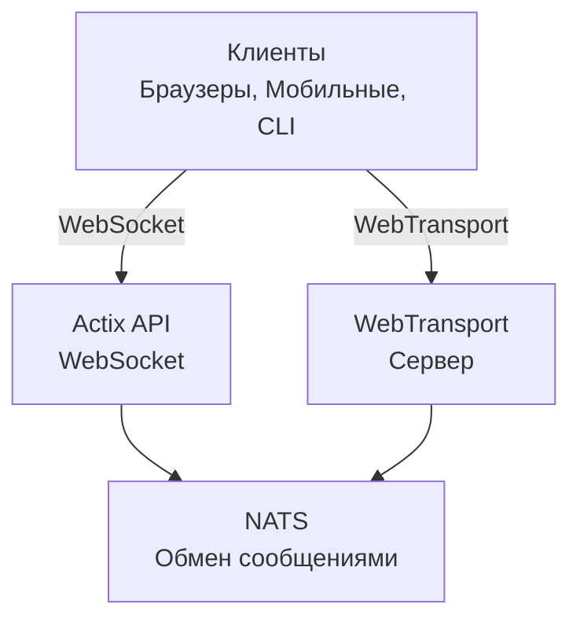

# videocall.rs

<a href="https://opensource.org/licenses/MIT"></a>
<a href="https://discord.gg/JP38NRe4CJ"></a> 
<a href="https://www.digitalocean.com/?refcode=6de4e19c5193&utm_campaign=Referral_Invite&utm_medium=Referral_Program&utm_source=badge"></a>

Открытая, высокопроизводительная платформа для видеоконференций, созданная на Rust, обеспечивающая связь в реальном времени с низкой задержкой.

**[Веб-сайт](https://videocall.rs)** | **[Сообщество Discord](https://discord.gg/JP38NRe4CJ)**

## Содержание

- [Обзор](#overview)
- [Функциональные возможности](#features)
- [Почему WebTransport вместо WebRTC?](#why-webtransport-instead-of-webrtc)
- [Архитектура системы](#system-architecture)
- [Начало работы](#getting-started)
  - [Требования](#prerequisites)
  - [Настройка через Docker](#docker-setup)
  - [Ручная настройка](#manual-setup)
- [Использование](#usage)
- [Производительность](#performance)
- [Безопасность](#security)
- [Дорожная карта](#roadmap)
- [Участие в проекте](#contributing)
- [Структура проекта](#project-structure)
- [Демонстрации и медиа](#demos-and-media)
- [Участники](#contributors)
- [Лицензия](#license)

## Обзор

videocall.rs — современная, открытая система видеоконференций, полностью написанная на Rust, предназначенная для разработчиков, которым нужны надежные, масштабируемые и безопасные возможности связи в реальном времени. Предоставляет основу для создания пользовательских решений видеосвязи с поддержкой как браузерных, так и нативных клиентов.

**Статус проекта:** Бета — активная разработка, подходит для использования в не критичных продуктивных средах

## Функциональные возможности

- **Высокая производительность:** Создан на Rust для оптимального использования ресурсов и низкой задержки
- **Поддержка нескольких транспортных протоколов:** WebSockets и WebTransport
- **Сквозное шифрование (E2EE):** Опциональная безопасная связь между участниками
- **Масштабируемая архитектура:** Построена на модели pub/sub с использованием NATS для горизонтального масштабирования
- **Кроссплатформенность:** Работает в браузерах на базе Chromium (Chrome, Edge, Brave), поддержка Safari в разработке. Firefox не поддерживается из-за неполной реализации MediaStreamTrackProcessor.
- **Поддержка нативных клиентов:** CLI инструмент для безголовой видеотрансляции с устройств, например Raspberry Pi
- **Открытый исходный код:** Лицензия MIT для максимальной гибкости

## Почему WebTransport вместо WebRTC?

WebTransport — ключевая технология, которая отличает videocall.rs от традиционных решений для видеоконференций. Вот почему наш подход с WebTransport технически превосходит:

### Технические преимущества

- **Без SFU и обхода NAT:** WebTransport исключает необходимость в сложных узлах Selective Forwarding Unit и механизмах обхода NAT, которые усложняют WebRTC и вызывают множество проблем у разработчиков.

- **Упрощённая архитектура:** Нет сложных STUN/TURN серверов, согласования ICE-кандидатов и запутанных процедур сигнализации, как в WebRTC. Только прямые, простые соединения.

- **Эффективность протокола:** Построен на HTTP/3 и QUIC, WebTransport обеспечивает мультиплексированные, двунаправленные потоки с лучшим управлением перегрузкой и восстановлением потерь пакетов, чем устаревшие SCTP-каналы WebRTC.

- **Низкая задержка:** Установка соединения с 0-RTT в QUIC сокращает время первоначального соединения по сравнению с множественными кругами WebRTC.

- **Чистый опыт разработки:** WebTransport предлагает более интуитивный API для разработчиков с обещаниями (promise-based) и упрощённым управлением потоками.

- **Будущее технологии:** Как часть современной веб-платформы, разрабатываемой IETF и W3C, WebTransport имеет сильную поддержку браузеров и активно развивается.

### Последствия для разработчиков

Для разработчиков, интегрирующих videocall.rs, это означает:
- ✅ Значительно упрощённая архитектура развертывания
- ✅ Отсутствие сложной сетевой настройки и проблем с файрволлами
- ✅ Лучшая производительность в сложных сетевых условиях
- ✅ Более предсказуемое поведение в разных реализациях
- ✅ Меньше времени на отладку проблем с подключением
- ✅ Инвестиция в перспективную технологию

Изучите наш [Документ по архитектуре](https://raw.githubusercontent.com/security-union/videocall-rs/main/ARCHITECTURE.md) для глубокого понимания реализации WebTransport и технических преимуществ.

## Архитектура системы

videocall.rs использует микросервисную архитектуру с основными компонентами:



1. **actix-api:** Бэкенд-сервер на Rust с использованием фреймворка Actix Web  
2. **yew-ui:** Веб-фронтенд на основе фреймворка Yew, скомпилированный в WebAssembly  
3. **videocall-types:** Общие типы данных и определения протоколов  
4. **videocall-client:** Клиентская библиотека для нативной интеграции  
5. **videocall-cli:** Командный интерфейс для безголовой видеотрансляции  

Для более подробного описания архитектуры системы смотрите наш [Документ по архитектуре](https://raw.githubusercontent.com/security-union/videocall-rs/main/ARCHITECTURE.md).

## Начало работы

**⭐ РЕКОМЕНДУЕТСЯ: Docker — единственный полностью поддерживаемый метод разработки ⭐**

Мы настоятельно рекомендуем использовать настройку через Docker для разработки, так как она хорошо поддерживается и обеспечивает стабильное поведение на разных платформах. Ручная настройка, описанная ниже, менее поддерживается и может потребовать дополнительного устранения неполадок.

### Требования

- Современный дистрибутив Linux, macOS или Windows 10/11  
- [Docker](https://docs.docker.com/engine/install/) и Docker Compose (для контейнерной установки)  
- [Инструментарий Rust](https://rustup.rs/) версии 1.85+ (для ручной настройки)  
- Браузер на базе Chromium (Chrome, Edge, Brave) для доступа к фронтенду — Firefox не поддерживается

### Настройка через Docker

Самый быстрый способ начать — использовать нашу Docker-настройку:

1. Клонируйте репозиторий:
   ```
   git clone https://github.com/security-union/videocall-rs.git
   cd videocall-rs
   ```

2. Запустите сервер (замените `<server-ip>` на IP вашего компьютера):
   ```
   make up
   ```

3. Откройте Chrome с помощью предоставленного скрипта для локального WebTransport:
   ```
   ./launch_chrome.sh
   ```

4. Откройте приложение по адресу:
   ```
   http://<server-ip>/meeting/<username>/<meeting-id>
   ```

### Ручная настройка (экспериментальная)

⚠️ **Внимание:** Этот метод настройки экспериментален и менее поддерживается по сравнению с Docker. Могут возникнуть проблемы, требующие ручной отладки.

Для продвинутых пользователей, предпочитающих запускать сервисы напрямую на своей машине:

1. Создайте базу данных PostgreSQL:
   ```
   createdb actix-api-db
   ```

2. Установите необходимые инструменты:
   ```
   # Установите NATS сервер
   curl -L https://github.com/nats-io/nats-server/releases/download/v2.9.8/nats-server-v2.9.8-linux-amd64.tar.gz | tar xz
   sudo mv nats-server-v2.9.8-linux-amd64/nats-server /usr/local/bin
   
   # Установите trurl
   cargo install trurl
   ```

3. Запустите среду разработки:
   ```
   ./start_dev.sh
   ```

4. Подключитесь по адресу:
   ```
   http://localhost:8081/meeting/<username>/<meeting-id>
   ```

Для подробных опций настройки смотрите нашу [документацию по установке](https://docs.videocall.rs/setup).

## Использование

### Браузерные клиенты

1. Перейдите на ваш развернутый сервер или локальный хост:
   ```
   http://<server-address>/meeting/<username>/<meeting-id>
   ```

2. Разрешите доступ к камере и микрофону при запросе

3. Нажмите «Connect» для подключения к встрече

### CLI-трансляция

Для безголовых устройств, например Raspberry Pi:

```bash
# Установите CLI инструмент
cargo install videocall-cli

# Трансляция с камеры
videocall-cli stream \
  --user-id <your-user-id> \
  --video-device-index 0 \
  --meeting-id <meeting-id> \
  --resolution 1280x720 \
  --fps 30 \
  --frame-format NV12 \
  --bitrate-kbps 500
```
Для подробной информации о CLI-инструменте и всех доступных опциях см. [videocall-cli README](https://raw.githubusercontent.com/security-union/videocall-rs/main/videocall-cli/README.md).

## Производительность

videocall.rs был протестирован и оптимизирован для следующих сценариев:

- **1-на-1 Звонки:** Минимальное использование ресурсов с задержкой <100 мс на типичных соединениях
- **Небольшие группы (3-10):** Эффективная топология mesh с адаптивным качеством в зависимости от состояния сети
- **Крупные конференции:** Тестирование до 1000 участников с использованием архитектуры селективной переадресации

### Технические оптимизации

- **Дизайн с нулевым копированием:** Минимизирует копирование данных между сетевым стеком и кодом приложения
- **Асинхронное ядро:** Построено на основе async/await экосистемы Rust с использованием runtime Tokio  
- **Обработка с SIMD-ускорением:** Использует векторизацию CPU для медиаопераций там, где это возможно
- **Безблокирующие структуры данных:** Минимизирует конкуренцию в сценариях с высокой пропускной способностью
- **Оптимизации на уровне протокола:** Специально настроенный контроль перегрузок и планирование пакетов

### Использование ресурсов

Наша серверная архитектура разработана для эффективной работы в масштабе:

- **Горизонтальное масштабирование:** Линейное масштабирование производительности с добавлением серверных экземпляров
- **Распределение нагрузки:** Автоматический баланс соединений по пулу серверов
- **Управление ресурсами:** Настраиваемые лимиты для пропускной способности, соединений и использования CPU
- **Оптимизация для контейнеров:** Разработано для эффективного развертывания в Kubernetes

Метрики производительности и рекомендации по настройке будут доступны в нашей [документации по производительности](https://raw.githubusercontent.com/security-union/videocall-rs/main/PERFORMANCE.md). (В работе)

## Безопасность

Безопасность является одним из ключевых направлений videocall.rs:

- **Безопасность транспорта:** Все коммуникации используют TLS/HTTPS.
- **Сквозное шифрование:** Опциональное E2EE между участниками без доступа сервера к содержимому.
- **Аутентификация:** Гибкая интеграция с провайдерами идентификации.
- **Контроль доступа:** Тонкая система разрешений для комнат встреч.

Для подробностей о нашей модели безопасности и лучших практиках см. [документацию по безопасности](https://docs.videocall.rs/security).

## Дорожная карта

| Версия | Целевая дата | Ключевые функции |
|---------|------------|------------------|
| 0.5.0   | Q2 2023    | ✅ Сквозное шифрование |
| 0.6.0   | Q3 2023    | ✅ Поддержка браузера Safari |
| 0.7.0   | Q4 2023    | ✅ Нативные мобильные SDK |
| 0.8.0   | Q1 2024    | 🔄 Улучшения в демонстрации экрана |
| 1.0.0   | Q2 2024    | 🔄 Выпуск в продакшен с полной стабильностью API |

## Участие

Мы приветствуем вклад сообщества! Вот как можно принять участие:

1. **Issues:** Сообщайте об ошибках или предлагайте функции через [GitHub Issues](https://github.com/security-union/videocall-rs/issues)

2. **Pull Requests:** Отправляйте PR для исправления ошибок или улучшений

3. **RFC процесс:** Для значительных изменений участвуйте в нашем [RFC процессе](https://raw.githubusercontent.com/security-union/videocall-rs/main/rfc)

4. **Сообщество:** Присоединяйтесь к нашему [Discord серверу](https://discord.gg/JP38NRe4CJ) для обсуждения разработки

См. [Руководство по участию](https://raw.githubusercontent.com/security-union/videocall-rs/main/CONTRIBUTING.md) для более подробной информации.

### Технологический стек

- **Бэкенд**: Rust + Actix Web + PostgreSQL + NATS
- **Фронтенд**: Rust + Yew + WebAssembly + Tailwind CSS
- **Транспорт**: WebTransport (QUIC/HTTP3) + WebSockets (резервный)
- **Система сборки**: Cargo + Trunk + Docker + Helm
- **Тестирование**: Rust тестовый фреймворк + Playwright для E2E тестов

### Ключевые технические особенности

- **Двунаправленная потоковая передача:** Полностью асинхронная передача сообщений с использованием QUIC потоков
- **Обработка ошибок:** Всестороннее распространение ошибок на основе Result по всему коду
- **Модульность:** Чёткое разделение ответственности с хорошо определёнными интерфейсами между компонентами
- **Типобезопасность:** Широкое использование системы типов Rust для предотвращения ошибок во время выполнения
- **Бинарный протокол:** Эффективная сериализация Protocol Buffer для всех сообщений

Для более полного технического обзора см. [Документ архитектуры](https://raw.githubusercontent.com/security-union/videocall-rs/main/ARCHITECTURE.md).

### Git хуки

В этом репозитории включены Git хуки для обеспечения качества кода:

1. **Pre-commit хук:** Автоматически запускает `cargo fmt` перед каждым коммитом для обеспечения единообразного форматирования кода.
2. **Post-commit хук:** Запускает `cargo clippy` после каждого коммита для проверки потенциальных улучшений кода.

Чтобы установить эти хуки, выполните следующие команды из корня проекта:

```bash
# Создаем директорию хуков, если она не существует
mkdir -p .git/hooks

# Создаем pre-commit хук
cat > .git/hooks/pre-commit << 'EOF'
#!/bin/sh

# Запускаем cargo fmt и проверяем изменения
echo "Запуск cargo fmt..."
cargo fmt --all -- --check

# Проверяем код выхода cargo fmt
if [ $? -ne 0 ]; then
    echo "cargo fmt обнаружил проблемы с форматированием. Пожалуйста, исправьте их перед коммитом."
    exit 1
fi

exit 0
EOF

# Создаем post-commit хук
cat > .git/hooks/post-commit << 'EOF'
#!/bin/sh

# Запускаем cargo clippy после коммита
echo "Запуск cargo clippy..."
ACTIX_UI_BACKEND_URL="" WEBTRANSPORT_HOST="" LOGIN_URL="" WEBTRANSPORT_URL="" ACTIX_API_URL="" cargo clippy -- -D warnings

# Проверяем код выхода cargo clippy
if [ $? -ne 0 ]; then
    echo "Cargo clippy обнаружил проблемы в вашем коде. Пожалуйста, исправьте их."
    # Мы не можем отменить коммит, так как он уже выполнен, но можем предупредить пользователя
    echo "Коммит выполнен успешно, но рассмотрите возможность исправления clippy проблем до пуша."
fi

exit 0
EOF

# Делаем хуки исполняемыми
chmod +x .git/hooks/pre-commit .git/hooks/post-commit
```

Эти хуки помогают поддерживать качество кода, обеспечивая правильное форматирование и проверку на распространённые ошибки.

## Демонстрации и медиа

### Технические презентации

- [Масштабирование до 1000 пользователей на звонок](https://youtu.be/LWwOSZJwEJI)
- [Начальный Proof of Concept (2022)](https://www.youtube.com/watch?v=kZ9isFw1TQ8)

### Каналы

- [YouTube канал](https://www.youtube.com/@dario.lencina)

## Участники

<table>
<tr>
<td align="center"><a href="https://github.com/darioalessandro"><br /><sub><b>Dario Lencina</b></sub></a></td>
<td align="center"><a href="https://github.com/griffobeid"><br /><sub><b>Griffin Obeid</b></sub></a></td>    
<td align="center"><a href="https://github.com/ronen"><br /><sub><b>Ronen Barzel</b></sub></a></td>
<td align="center"><a href="https://github.com/leon3s"><br /><sub><b>Leone</b></sub></a></td>
<td align="center"><a href="https://github.com/JasterV"><br /><sub><b>Victor Martínez</b></sub></a></td>
</tr>
</table>

Особая благодарность [JasterV](https://github.com/JasterV) за реализацию websocket на Actix, которая содержит фрагменты из проекта [chat-rooms-actix](https://github.com/JasterV/chat-rooms-actix).

## Лицензия

Этот проект лицензирован под MIT License — подробности в файле [LICENSE.md](https://raw.githubusercontent.com/security-union/videocall-rs/main/LICENSE.md).


---


Tranlated By [Open Ai Tx](https://github.com/OpenAiTx/OpenAiTx) | Last indexed: 2025-06-11


---