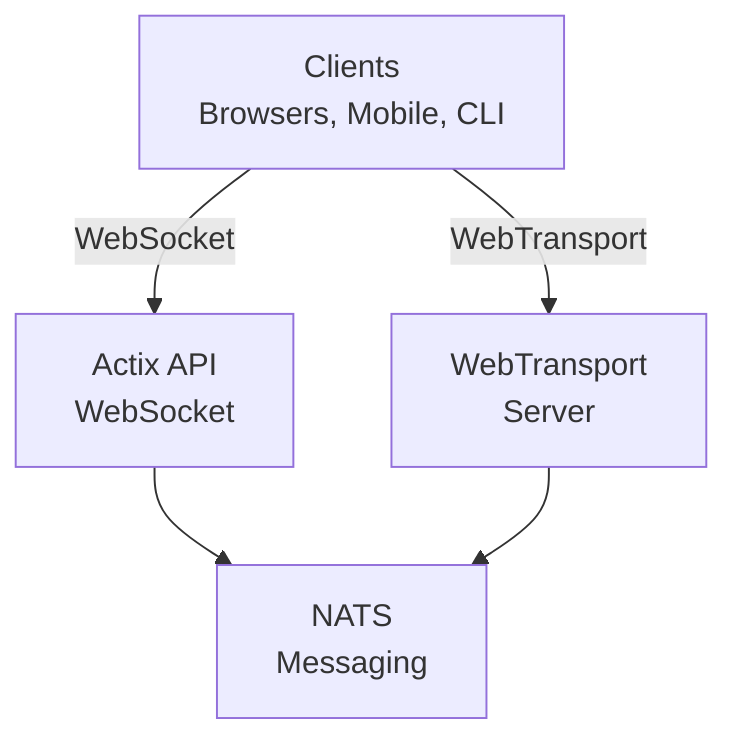

# videocall.rs

<a href="https://opensource.org/licenses/MIT"></a>
<a href="https://discord.gg/JP38NRe4CJ"></a> 
<a href="https://www.digitalocean.com/?refcode=6de4e19c5193&utm_campaign=Referral_Invite&utm_medium=Referral_Program&utm_source=badge"></a>

แพลตฟอร์มประชุมทางวิดีโอแบบโอเพนซอร์สที่มีประสิทธิภาพสูง สร้างด้วย Rust ให้การสื่อสารแบบเรียลไทม์ที่มีความหน่วงต่ำ

**[เว็บไซต์](https://videocall.rs)** | **[ชุมชน Discord](https://discord.gg/JP38NRe4CJ)**

## สารบัญ

- [ภาพรวม](#overview)
- [คุณสมบัติ](#features)
- [ทำไมต้องใช้ WebTransport แทน WebRTC?](#why-webtransport-instead-of-webrtc)
- [สถาปัตยกรรมระบบ](#system-architecture)
- [เริ่มต้นใช้งาน](#getting-started)
  - [ข้อกำหนดเบื้องต้น](#prerequisites)
  - [การตั้งค่า Docker](#docker-setup)
  - [การตั้งค่าแบบแมนนวล](#manual-setup)
- [การใช้งาน](#usage)
- [ประสิทธิภาพ](#performance)
- [ความปลอดภัย](#security)
- [แผนงานในอนาคต](#roadmap)
- [การร่วมพัฒนา](#contributing)
- [โครงสร้างโปรเจกต์](#project-structure)
- [ตัวอย่างและสื่อ](#demos-and-media)
- [ผู้ร่วมพัฒนา](#contributors)
- [ใบอนุญาต](#license)

## ภาพรวม

videocall.rs คือระบบประชุมทางวิดีโอสมัยใหม่แบบโอเพนซอร์สที่เขียนด้วย Rust ทั้งหมด ออกแบบมาสำหรับนักพัฒนาที่ต้องการความน่าเชื่อถือ, สามารถปรับขนาดได้ และมีความปลอดภัยสำหรับการสื่อสารแบบเรียลไทม์ รองรับการสร้างโซลูชันวิดีโอคอมมิวนิเคชันแบบกำหนดเอง พร้อมรองรับทั้งไคลเอนต์แบบเบราว์เซอร์และแบบเนทีฟ

**สถานะโปรเจกต์:** เบต้า – กำลังพัฒนาอย่างต่อเนื่องและเหมาะสำหรับการใช้งานในระบบที่ไม่ใช่ภารกิจสำคัญ

## คุณสมบัติ

- **ประสิทธิภาพสูง:** สร้างด้วย Rust เพื่อการใช้ทรัพยากรอย่างมีประสิทธิภาพและความหน่วงต่ำ
- **รองรับหลายโปรโตคอลขนส่ง:** รองรับ WebSockets และ WebTransport
- **การเข้ารหัสแบบ End-to-End (E2EE):** ตัวเลือกสำหรับการสื่อสารที่ปลอดภัยระหว่างผู้ใช้งาน
- **สถาปัตยกรรมปรับขนาดได้:** ออกแบบโดยใช้โมเดล pub/sub ด้วย NATS สำหรับการขยายในแนวนอน
- **รองรับหลายแพลตฟอร์ม:** ใช้งานได้กับเบราว์เซอร์ที่ใช้ Chromium (Chrome, Edge, Brave) และกำลังพัฒนา Safari Firefox ยังไม่รองรับเนื่องจาก MediaStreamTrackProcessor ยังไม่สมบูรณ์
- **รองรับไคลเอนต์เนทีฟ:** เครื่องมือ CLI สำหรับการสตรีมวิดีโอแบบ headless จากอุปกรณ์ เช่น Raspberry Pi
- **โอเพนซอร์ส:** ใบอนุญาต MIT เพื่อความยืดหยุ่นสูงสุด

## ทำไมต้องใช้ WebTransport แทน WebRTC?

WebTransport เป็นเทคโนโลยีหลักที่ทำให้ videocall.rs แตกต่างจากโซลูชันประชุมทางวิดีโอแบบดั้งเดิม ในฐานะนักพัฒนา นี่คือเหตุผลที่แนวทาง WebTransport ของเรามีข้อดีทางเทคนิค:

### ข้อดีทางเทคนิค

- **ไม่มี SFU, ไม่มี NAT Traversal:** WebTransport ขจัดความจำเป็นสำหรับ Selective Forwarding Units และกลไกการข้าม NAT ที่ซับซ้อนซึ่งเป็นปัญหาหลักใน WebRTC และสร้างปัญหามากมายแก่นักพัฒนา

- **สถาปัตยกรรมที่ง่ายขึ้น:** ไม่ต้องใช้เซิร์ฟเวอร์ STUN/TURN ที่ซับซ้อน, การเจรจา ICE candidate หรือขั้นตอนสัญญาณที่ยุ่งยากตามที่ WebRTC ต้องการ มีเพียงการเชื่อมต่อโดยตรงและเรียบง่าย

- **ประสิทธิภาพโปรโตคอล:** สร้างบน HTTP/3 และ QUIC, WebTransport ให้สตรีมแบบมัลติเพล็กซ์สองทางที่มีการควบคุมการติดขัดและการกู้คืนแพ็กเก็ตสูญหายดีกว่าช่องข้อมูล SCTP ของ WebRTC ที่ล้าสมัย

- **ความหน่วงต่ำกว่า:** การสร้างการเชื่อมต่อแบบ 0-RTT ของ QUIC ช่วยลดเวลาการเชื่อมต่อเริ่มต้นเมื่อเทียบกับ WebRTC ที่ต้องใช้รอบเดินทางหลายรอบ

- **ประสบการณ์การพัฒนาที่สะอาด:** WebTransport มี API สำหรับนักพัฒนาที่เข้าใจง่ายกว่า ด้วยการออกแบบแบบสัญญา (promise-based) และการจัดการสตรีมที่สะอาดกว่า

- **พร้อมสำหรับอนาคต:** เป็นส่วนหนึ่งของแพลตฟอร์มเว็บสมัยใหม่ที่พัฒนาโดย IETF และ W3C, WebTransport มีการสนับสนุนจากผู้ผลิตเบราว์เซอร์อย่างแข็งแกร่งและมีสเปคที่พัฒนาอย่างต่อเนื่อง

### ผลกระทบต่อการพัฒนา

สำหรับนักพัฒนาที่รวม videocall.rs หมายความว่า:
- ✅ สถาปัตยกรรมการปรับใช้งานง่ายขึ้นอย่างมาก
- ✅ ไม่มีการตั้งค่าเครือข่ายหรือไฟร์วอลล์ที่ซับซ้อน
- ✅ ประสิทธิภาพดีขึ้นในเครือข่ายที่ท้าทาย
- ✅ พฤติกรรมที่คาดการณ์ได้มากขึ้นในหลายการใช้งาน
- ✅ ใช้เวลาน้อยลงในการแก้ไขปัญหาการเชื่อมต่อ
- ✅ การลงทุนในเทคโนโลยีที่มองไปข้างหน้า

อ่านเอกสาร [Architecture Document](https://raw.githubusercontent.com/security-union/videocall-rs/main/ARCHITECTURE.md) เพื่อเจาะลึกวิธีที่เราใช้งาน WebTransport และประโยชน์ทางเทคนิคที่ได้รับ

## สถาปัตยกรรมระบบ

videocall.rs ใช้สถาปัตยกรรมไมโครเซอร์วิสโดยมีส่วนประกอบหลักดังนี้:



1. **actix-api:** เซิร์ฟเวอร์แบ็กเอนด์เขียนด้วย Rust โดยใช้ Actix Web framework
2. **yew-ui:** ส่วนหน้าของเว็บสร้างด้วย Yew framework และคอมไพล์เป็น WebAssembly
3. **videocall-types:** ชนิดข้อมูลและนิยามโปรโตคอลที่ใช้ร่วมกัน
4. **videocall-client:** ไลบรารีไคลเอนต์สำหรับการผนวกเนทีฟ
5. **videocall-cli:** อินเทอร์เฟซบรรทัดคำสั่งสำหรับการสตรีมวิดีโอแบบ headless

สำหรับคำอธิบายสถาปัตยกรรมระบบโดยละเอียด โปรดดูเอกสาร [Architecture Document](https://raw.githubusercontent.com/security-union/videocall-rs/main/ARCHITECTURE.md)

## เริ่มต้นใช้งาน

**⭐ แนะนำ: Docker คือวิธีการพัฒนาที่ได้รับการสนับสนุนเต็มรูปแบบ ⭐**

เราแนะนำอย่างยิ่งให้ใช้การตั้งค่าแบบ Docker สำหรับการพัฒนา เพราะได้รับการดูแลอย่างดีและให้พฤติกรรมที่สม่ำเสมอในทุกแพลตฟอร์ม การตั้งค่าแบบแมนนวลที่อธิบายด้านล่างไม่ได้รับการดูแลเท่าที่ควรและอาจต้องการการแก้ไขปัญหาเพิ่มเติม

### ข้อกำหนดเบื้องต้น

- ระบบปฏิบัติการ Linux รุ่นใหม่, macOS หรือ Windows 10/11
- [Docker](https://docs.docker.com/engine/install/) และ Docker Compose (สำหรับการตั้งค่าแบบคอนเทนเนอร์)
- [Rust toolchain](https://rustup.rs/) 1.85+ (สำหรับการตั้งค่าแบบแมนนวล)
- เบราว์เซอร์ที่ใช้ Chromium (Chrome, Edge, Brave) สำหรับการเข้าถึงส่วนหน้า — Firefox ยังไม่รองรับ

### การตั้งค่า Docker

วิธีที่เร็วที่สุดในการเริ่มต้นคือการใช้การตั้งค่าแบบ Docker:

1. โคลนรีโพซิทอรี:
   ```
   git clone https://github.com/security-union/videocall-rs.git
   cd videocall-rs
   ```

2. เริ่มเซิร์ฟเวอร์ (แทนที่ `<server-ip>` ด้วย IP ของเครื่องคุณ):
   ```
   make up
   ```

3. เปิด Chrome โดยใช้สคริปต์ที่จัดเตรียมไว้สำหรับ WebTransport ในเครื่อง:
   ```
   ./launch_chrome.sh
   ```

4. เข้าถึงแอปพลิเคชันที่:
   ```
   http://<server-ip>/meeting/<username>/<meeting-id>
   ```

### การตั้งค่าแบบแมนนวล (ทดลอง)

⚠️ **คำเตือน**: วิธีการตั้งค่านี้เป็นแบบทดลองและไม่ได้รับการดูแลดีเท่ากับแบบ Docker คุณอาจพบปัญหาที่ต้องแก้ไขด้วยตนเอง

สำหรับผู้ใช้ขั้นสูงที่ต้องการรันบริการโดยตรงบนเครื่องของตน:

1. สร้างฐานข้อมูล PostgreSQL:
   ```
   createdb actix-api-db
   ```

2. ติดตั้งเครื่องมือที่จำเป็น:
   ```
   # ติดตั้ง NATS server
   curl -L https://github.com/nats-io/nats-server/releases/download/v2.9.8/nats-server-v2.9.8-linux-amd64.tar.gz | tar xz
   sudo mv nats-server-v2.9.8-linux-amd64/nats-server /usr/local/bin
   
   # ติดตั้ง trurl
   cargo install trurl
   ```

3. เริ่มสภาพแวดล้อมการพัฒนา:
   ```
   ./start_dev.sh
   ```

4. เชื่อมต่อที่:
   ```
   http://localhost:8081/meeting/<username>/<meeting-id>
   ```

สำหรับตัวเลือกการตั้งค่าโดยละเอียด โปรดดู [เอกสารการตั้งค่า](https://docs.videocall.rs/setup)

## การใช้งาน

### ไคลเอนต์บนเบราว์เซอร์

1. ไปยังอินสแตนซ์ที่ติดตั้งไว้หรือเซ็ตอัปบนเครื่อง:
   ```
   http://<server-address>/meeting/<username>/<meeting-id>
   ```

2. อนุญาตการเข้าถึงกล้องและไมโครโฟนเมื่อถูกถาม

3. คลิก "Connect" เพื่อเข้าร่วมประชุม

### การสตรีมผ่าน CLI

สำหรับอุปกรณ์แบบ headless เช่น Raspberry Pi:

```bash
# ติดตั้งเครื่องมือ CLI
cargo install videocall-cli

# สตรีมจากกล้อง
videocall-cli stream \
  --user-id <your-user-id> \
  --video-device-index 0 \
  --meeting-id <meeting-id> \
  --resolution 1280x720 \
  --fps 30 \
  --frame-format NV12 \
  --bitrate-kbps 500
```
สำหรับข้อมูลโดยละเอียดเกี่ยวกับเครื่องมือ CLI และตัวเลือกทั้งหมดที่มีอยู่ โปรดดูที่ [videocall-cli README](https://raw.githubusercontent.com/security-union/videocall-rs/main/videocall-cli/README.md)

## ประสิทธิภาพ

videocall.rs ได้รับการทดสอบประสิทธิภาพและปรับแต่งสำหรับสถานการณ์ต่อไปนี้:

- **การโทรแบบ 1 ต่อ 1:** ใช้ทรัพยากรน้อยที่สุดโดยมีความหน่วงต่ำกว่า 100 มิลลิวินาทีบนการเชื่อมต่อทั่วไป
- **กลุ่มเล็ก (3-10 คน):** โทโพโลยีแบบ mesh ที่มีประสิทธิภาพ พร้อมปรับคุณภาพตามสภาพเครือข่าย
- **การประชุมขนาดใหญ่:** ทดสอบกับผู้เข้าร่วมสูงสุด 1000 คนโดยใช้สถาปัตยกรรมการส่งต่อแบบเลือกสรร

### การปรับแต่งทางเทคนิค

- **การออกแบบแบบ Zero-Copy:** ลดการคัดลอกข้อมูลระหว่างสแตกเครือข่ายและโค้ดแอปพลิเคชัน
- **แกนแบบอะซิงโครนัส:** สร้างบนระบบ async/await ของ Rust พร้อม Tokio runtime  
- **การประมวลผลแบบเร่ง SIMD:** ใช้การเวกเตอร์ CPU สำหรับการดำเนินการสื่อเมื่อมีให้ใช้
- **โครงสร้างข้อมูลแบบไม่ล็อก:** ลดความขัดแย้งในสถานการณ์ที่มีอัตราการส่งข้อมูลสูง
- **การปรับแต่งระดับโปรโตคอล:** การควบคุมการแออัดและการจัดตารางแพ็กเก็ตที่ปรับแต่งเฉพาะ

### การใช้ทรัพยากร

สถาปัตยกรรมฝั่งเซิร์ฟเวอร์ของเราถูกออกแบบมาเพื่อประสิทธิภาพในระดับขนาดใหญ่:

- **การขยายแนวนอน:** การเพิ่มประสิทธิภาพแบบเส้นตรงด้วยอินสแตนซ์เซิร์ฟเวอร์เพิ่มเติม
- **การกระจายโหลด:** การปรับสมดุลการเชื่อมต่อโดยอัตโนมัติในกลุ่มเซิร์ฟเวอร์
- **การควบคุมทรัพยากร:** จำกัดแบนด์วิธ, การเชื่อมต่อ และการใช้ CPU ได้ตามต้องการ
- **ปรับแต่งสำหรับคอนเทนเนอร์:** ออกแบบสำหรับการปรับใช้ที่มีประสิทธิภาพในสภาพแวดล้อม Kubernetes

ข้อมูลตัวชี้วัดประสิทธิภาพและแนวทางการปรับจูนจะมีให้ใน [เอกสารประสิทธิภาพ](https://raw.githubusercontent.com/security-union/videocall-rs/main/PERFORMANCE.md) (อยู่ระหว่างดำเนินการ)

## ความปลอดภัย

ความปลอดภัยเป็นหัวใจหลักของ videocall.rs:

- **ความปลอดภัยของการรับส่งข้อมูล:** การสื่อสารทั้งหมดใช้ TLS/HTTPS
- **การเข้ารหัสแบบปลายทางถึงปลายทาง:** E2EE เป็นตัวเลือกระหว่างผู้ใช้โดยไม่มีเซิร์ฟเวอร์เข้าถึงเนื้อหา
- **การตรวจสอบสิทธิ์:** การผสานรวมที่ยืดหยุ่นกับผู้ให้บริการตัวตน
- **การควบคุมการเข้าถึง:** ระบบสิทธิ์ละเอียดสำหรับห้องประชุม

สำหรับรายละเอียดเกี่ยวกับโมเดลความปลอดภัยและแนวทางปฏิบัติที่ดีที่สุด โปรดดูที่ [เอกสารความปลอดภัย](https://docs.videocall.rs/security)

## แผนงาน

| เวอร์ชัน | วันที่เป้าหมาย | คุณสมบัติสำคัญ |
|---------|------------|--------------|
| 0.5.0   | ไตรมาส 2 2023 | ✅ การเข้ารหัสแบบปลายทางถึงปลายทาง |
| 0.6.0   | ไตรมาส 3 2023 | ✅ รองรับเบราว์เซอร์ Safari |
| 0.7.0   | ไตรมาส 4 2023 | ✅ SDK มือถือแบบเนทีฟ |
| 0.8.0   | ไตรมาส 1 2024 | 🔄 การปรับปรุงการแชร์หน้าจอ |
| 1.0.0   | ไตรมาส 2 2024 | 🔄 การปล่อยเวอร์ชันผลิตพร้อมความเสถียรเต็มรูปแบบของ API |

## การมีส่วนร่วม

เรายินดีต้อนรับการมีส่วนร่วมจากชุมชน! นี่คือวิธีเข้าร่วม:

1. **รายงานปัญหา:** รายงานบั๊กหรือแนะนำฟีเจอร์ผ่าน [GitHub Issues](https://github.com/security-union/videocall-rs/issues)

2. **คำขอดึง (Pull Requests):** ส่ง PR สำหรับการแก้ไขบั๊กหรือการปรับปรุง

3. **กระบวนการ RFC:** สำหรับการเปลี่ยนแปลงสำคัญ ร่วมกระบวนการ [RFC](https://raw.githubusercontent.com/security-union/videocall-rs/main/rfc)

4. **ชุมชน:** เข้าร่วม [เซิร์ฟเวอร์ Discord](https://discord.gg/JP38NRe4CJ) เพื่อพูดคุยเกี่ยวกับการพัฒนา

ดู [แนวทางการมีส่วนร่วม](https://raw.githubusercontent.com/security-union/videocall-rs/main/CONTRIBUTING.md) สำหรับข้อมูลเพิ่มเติม

### เทคโนโลยีสแตก

- **แบ็คเอนด์**: Rust + Actix Web + PostgreSQL + NATS
- **ฟรอนต์เอนด์**: Rust + Yew + WebAssembly + Tailwind CSS
- **การรับส่งข้อมูล**: WebTransport (QUIC/HTTP3) + WebSockets (สำรอง)
- **ระบบสร้าง**: Cargo + Trunk + Docker + Helm
- **การทดสอบ**: เฟรมเวิร์กทดสอบ Rust + Playwright สำหรับ E2E tests

### คุณสมบัติทางเทคนิคสำคัญ

- **สตรีมมิ่งสองทาง:** ส่งข้อความแบบอะซิงโครนัสเต็มรูปแบบโดยใช้ QUIC streams
- **การจัดการข้อผิดพลาด:** การแพร่กระจายข้อผิดพลาดแบบ Result อย่างครอบคลุมทั่วโค้ดเบส
- **ความเป็นโมดูล:** แยกความรับผิดชอบอย่างชัดเจนพร้อมอินเทอร์เฟซที่กำหนดดีระหว่างส่วนประกอบ
- **ความปลอดภัยของชนิดข้อมูล:** ใช้ระบบชนิดของ Rust อย่างกว้างขวางเพื่อป้องกันข้อผิดพลาดขณะรันไทม์
- **โปรโตคอลไบนารี:** การจัดเก็บแบบ Protocol Buffer ที่มีประสิทธิภาพสำหรับข้อความทั้งหมด

สำหรับภาพรวมทางเทคนิคที่ครอบคลุมยิ่งขึ้น โปรดดูที่ [เอกสารสถาปัตยกรรม](https://raw.githubusercontent.com/security-union/videocall-rs/main/ARCHITECTURE.md)

### Git Hooks

ที่เก็บนี้มี Git hooks เพื่อรักษาคุณภาพโค้ด:

1. **Pre-commit Hook:** รัน `cargo fmt` อัตโนมัติก่อนแต่ละ commit เพื่อให้แน่ใจว่ารูปแบบโค้ดสอดคล้องกัน
2. **Post-commit Hook:** รัน `cargo clippy` หลัง commit แต่ละครั้งเพื่อตรวจหาการปรับปรุงโค้ดที่เป็นไปได้

ติดตั้ง hooks เหล่านี้โดยรันคำสั่งต่อไปนี้จากโฟลเดอร์โครงการ:

```bash
# สร้างไดเรกทอรี hooks ถ้ายังไม่มี
mkdir -p .git/hooks

# สร้าง pre-commit hook
cat > .git/hooks/pre-commit << 'EOF'
#!/bin/sh

# รัน cargo fmt และตรวจสอบว่ามีการเปลี่ยนแปลงหรือไม่
echo "Running cargo fmt..."
cargo fmt --all -- --check

# ตรวจสอบรหัสการออกจาก cargo fmt
if [ $? -ne 0 ]; then
    echo "cargo fmt พบปัญหาการจัดรูปแบบ กรุณาแก้ไขก่อน commit"
    exit 1
fi

exit 0
EOF

# สร้าง post-commit hook
cat > .git/hooks/post-commit << 'EOF'
#!/bin/sh

# รัน cargo clippy หลัง commit
echo "Running cargo clippy..."
ACTIX_UI_BACKEND_URL="" WEBTRANSPORT_HOST="" LOGIN_URL="" WEBTRANSPORT_URL="" ACTIX_API_URL="" cargo clippy -- -D warnings

# ตรวจสอบรหัสการออกจาก cargo clippy
if [ $? -ne 0 ]; then
    echo "Cargo clippy พบปัญหาในโค้ดของคุณ กรุณาแก้ไข"
    # ไม่สามารถยกเลิก commit ได้เนื่องจาก commit เสร็จแล้ว แต่แจ้งผู้ใช้ให้ทราบ
    echo "Commit สำเร็จแล้ว แต่กรุณาพิจารณาแก้ไขปัญหา clippy ก่อน push"
fi

exit 0
EOF

# ทำให้ hooks สามารถรันได้
chmod +x .git/hooks/pre-commit .git/hooks/post-commit
```

hooks เหล่านี้ช่วยรักษาคุณภาพโค้ดโดยการตรวจสอบรูปแบบและตรวจจับปัญหาทั่วไป

## ตัวอย่างและสื่อ

### การนำเสนอทางเทคนิค

- [การขยายสเกลถึง 1000 ผู้ใช้ต่อการโทร](https://youtu.be/LWwOSZJwEJI)
- [หลักฐานแนวคิดเบื้องต้น (2022)](https://www.youtube.com/watch?v=kZ9isFw1TQ8)

### ช่องทาง

- [ช่อง YouTube](https://www.youtube.com/@dario.lencina)

## ผู้ร่วมพัฒนา

<table>
<tr>
<td align="center"><a href="https://github.com/darioalessandro"><br /><sub><b>Dario Lencina</b></sub></a></td>
<td align="center"><a href="https://github.com/griffobeid"><br /><sub><b>Griffin Obeid</b></sub></a></td>    
<td align="center"><a href="https://github.com/ronen"><br /><sub><b>Ronen Barzel</b></sub></a></td>
<td align="center"><a href="https://github.com/leon3s"><br /><sub><b>Leone</b></sub></a></td>
<td align="center"><a href="https://github.com/JasterV"><br /><sub><b>Victor Martínez</b></sub></a></td>
</tr>
</table>

ขอขอบคุณเป็นพิเศษแก่ [JasterV](https://github.com/JasterV) สำหรับการนำ Actix websocket มาใช้ ซึ่งมีชิ้นส่วนจากโครงการ [chat-rooms-actix](https://github.com/JasterV/chat-rooms-actix)

## ใบอนุญาต

โครงการนี้ได้รับอนุญาตภายใต้ใบอนุญาต MIT - ดูรายละเอียดได้ที่ไฟล์ [LICENSE.md](https://raw.githubusercontent.com/security-union/videocall-rs/main/LICENSE.md)


---


Tranlated By [Open Ai Tx](https://github.com/OpenAiTx/OpenAiTx) | Last indexed: 2025-06-11


---