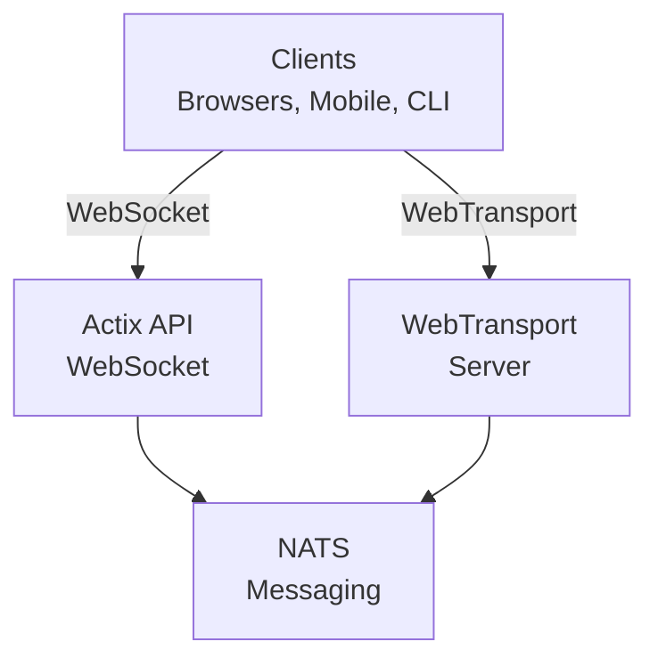

# videocall.rs

<a href="https://opensource.org/licenses/MIT"></a>
<a href="https://discord.gg/JP38NRe4CJ"></a> 
<a href="https://www.digitalocean.com/?refcode=6de4e19c5193&utm_campaign=Referral_Invite&utm_medium=Referral_Program&utm_source=badge"></a>

Một nền tảng hội nghị video mã nguồn mở, hiệu suất cao được xây dựng bằng Rust, cung cấp giao tiếp thời gian thực với độ trễ thấp.

**[Website](https://videocall.rs)** | **[Cộng đồng Discord](https://discord.gg/JP38NRe4CJ)**

## Mục lục

- [Tổng quan](#overview)
- [Tính năng](#features)
- [Tại sao chọn WebTransport thay vì WebRTC?](#why-webtransport-instead-of-webrtc)
- [Kiến trúc hệ thống](#system-architecture)
- [Bắt đầu](#getting-started)
  - [Yêu cầu trước](#prerequisites)
  - [Cài đặt Docker](#docker-setup)
  - [Cài đặt thủ công](#manual-setup)
- [Cách sử dụng](#usage)
- [Hiệu năng](#performance)
- [Bảo mật](#security)
- [Lộ trình phát triển](#roadmap)
- [Đóng góp](#contributing)
- [Cấu trúc dự án](#project-structure)
- [Các bản demo và phương tiện](#demos-and-media)
- [Người đóng góp](#contributors)
- [Giấy phép](#license)

## Tổng quan

videocall.rs là một hệ thống hội nghị video hiện đại, mã nguồn mở được viết hoàn toàn bằng Rust, thiết kế dành cho các nhà phát triển cần khả năng giao tiếp thời gian thực đáng tin cậy, có thể mở rộng và bảo mật. Nó cung cấp nền tảng để xây dựng các giải pháp giao tiếp video tùy chỉnh, hỗ trợ cả khách hàng trên trình duyệt và ứng dụng gốc.

**Trạng thái dự án:** Beta - Đang được phát triển tích cực và phù hợp cho sử dụng sản xuất không quan trọng

## Tính năng

- **Hiệu suất cao:** Xây dựng bằng Rust để tối ưu hóa sử dụng tài nguyên và giảm độ trễ
- **Hỗ trợ nhiều giao thức vận chuyển:** Hỗ trợ WebSockets và WebTransport 
- **Mã hóa đầu cuối (E2EE):** Tùy chọn giao tiếp an toàn giữa các bên
- **Kiến trúc có thể mở rộng:** Thiết kế theo mô hình pub/sub sử dụng NATS để mở rộng theo chiều ngang
- **Hỗ trợ đa nền tảng:** Hoạt động trên các trình duyệt dựa trên Chromium (Chrome, Edge, Brave) với hỗ trợ Safari đang được phát triển. Firefox không được hỗ trợ do chưa hoàn thiện MediaStreamTrackProcessor.
- **Hỗ trợ khách hàng gốc:** Công cụ CLI cho phát video không giao diện từ các thiết bị như Raspberry Pi
- **Mã nguồn mở:** Giấy phép MIT cho sự linh hoạt tối đa

## Tại sao chọn WebTransport thay vì WebRTC?

WebTransport là công nghệ cốt lõi phân biệt videocall.rs với các giải pháp hội nghị video truyền thống. Là một nhà phát triển, đây là lý do tại sao phương pháp WebTransport của chúng tôi vượt trội về mặt kỹ thuật:

### Ưu điểm kỹ thuật

- **Không cần SFU, không cần NAT Traversal:** WebTransport loại bỏ nhu cầu về các đơn vị chuyển tiếp chọn lọc phức tạp và các cơ chế NAT traversal gây nhiều phiền toái trong các triển khai WebRTC.

- **Kiến trúc đơn giản:** Không còn các máy chủ STUN/TURN phức tạp, không cần đàm phán ICE hay các bước tín hiệu phức tạp mà WebRTC yêu cầu. Chỉ kết nối trực tiếp, đơn giản.

- **Hiệu quả giao thức:** Xây dựng trên HTTP/3 và QUIC, WebTransport cung cấp các luồng đa kênh, hai chiều với kiểm soát tắc nghẽn và phục hồi mất gói tốt hơn các kênh dữ liệu SCTP lỗi thời của WebRTC.

- **Độ trễ thấp hơn:** QUIC với khả năng thiết lập kết nối 0-RTT giảm thời gian kết nối ban đầu so với các vòng chuyền phức tạp của WebRTC.

- **Trải nghiệm phát triển sạch hơn:** WebTransport cung cấp API dành cho nhà phát triển trực quan hơn với thiết kế dựa trên promise và quản lý luồng gọn gàng hơn.

- **Tương lai bền vững:** Là một phần của nền tảng web hiện đại được phát triển bởi IETF và W3C, WebTransport được các nhà cung cấp trình duyệt hỗ trợ mạnh mẽ và có đặc tả đang tiến triển tích cực.

### Ý nghĩa đối với nhà phát triển

Đối với nhà phát triển tích hợp videocall.rs, điều này có nghĩa là:
- ✅ Kiến trúc triển khai đơn giản hơn nhiều
- ✅ Không cần cấu hình mạng phức tạp hay vấn đề tường lửa
- ✅ Hiệu năng tốt hơn trong điều kiện mạng khó khăn
- ✅ Hành vi dự đoán hơn giữa các triển khai
- ✅ Ít thời gian dành cho gỡ lỗi sự cố kết nối
- ✅ Đầu tư công nghệ hướng về tương lai

Đọc tài liệu [Kiến trúc](https://raw.githubusercontent.com/security-union/videocall-rs/main/ARCHITECTURE.md) của chúng tôi để tìm hiểu sâu về cách chúng tôi triển khai WebTransport và lợi ích kỹ thuật mà nó mang lại.

## Kiến trúc hệ thống

videocall.rs tuân theo kiến trúc microservices với các thành phần chính sau:



1. **actix-api:** Máy chủ backend viết bằng Rust sử dụng framework Actix Web
2. **yew-ui:** Giao diện web frontend xây dựng bằng framework Yew và biên dịch sang WebAssembly
3. **videocall-types:** Các kiểu dữ liệu và định nghĩa giao thức dùng chung
4. **videocall-client:** Thư viện khách hàng cho tích hợp gốc
5. **videocall-cli:** Giao diện dòng lệnh cho phát video không giao diện


Để hiểu chi tiết hơn về kiến trúc hệ thống, vui lòng xem tài liệu [Kiến trúc](https://raw.githubusercontent.com/security-union/videocall-rs/main/ARCHITECTURE.md) của chúng tôi.

## Bắt đầu

**⭐ KHUYẾN NGHỊ: Docker là phương pháp phát triển được hỗ trợ đầy đủ duy nhất ⭐**

Chúng tôi khuyến nghị sử dụng thiết lập dựa trên Docker cho phát triển, vì nó được duy trì tốt và cung cấp hành vi nhất quán trên các nền tảng. Thiết lập thủ công được mô tả dưới đây không được duy trì tốt và có thể cần xử lý sự cố thêm.

### Yêu cầu trước

- Hệ điều hành Linux hiện đại, macOS hoặc Windows 10/11
- [Docker](https://docs.docker.com/engine/install/) và Docker Compose (cho thiết lập container)
- [Rust toolchain](https://rustup.rs/) 1.85+ (cho thiết lập thủ công)
- Trình duyệt dựa trên Chromium (Chrome, Edge, Brave) để truy cập giao diện frontend - Firefox không được hỗ trợ

### Cài đặt Docker

Cách nhanh nhất để bắt đầu là sử dụng thiết lập dựa trên Docker của chúng tôi:

1. Sao chép kho mã:
   ```
   git clone https://github.com/security-union/videocall-rs.git
   cd videocall-rs
   ```

2. Khởi động máy chủ (thay `<server-ip>` bằng địa chỉ IP máy của bạn):
   ```
   make up
   ```

3. Mở Chrome bằng script được cung cấp để sử dụng WebTransport cục bộ:
   ```
   ./launch_chrome.sh
   ```

4. Truy cập ứng dụng tại:
   ```
   http://<server-ip>/meeting/<username>/<meeting-id>
   ```

### Cài đặt thủ công (Thử nghiệm)

⚠️ **Cảnh báo**: Phương pháp này đang thử nghiệm và không được duy trì tốt như phương pháp Docker. Bạn có thể gặp các sự cố cần gỡ lỗi thủ công.

Dành cho người dùng nâng cao muốn chạy dịch vụ trực tiếp trên máy:

1. Tạo cơ sở dữ liệu PostgreSQL:
   ```
   createdb actix-api-db
   ```

2. Cài đặt các công cụ cần thiết:
   ```
   # Cài đặt máy chủ NATS
   curl -L https://github.com/nats-io/nats-server/releases/download/v2.9.8/nats-server-v2.9.8-linux-amd64.tar.gz | tar xz
   sudo mv nats-server-v2.9.8-linux-amd64/nats-server /usr/local/bin
   
   # Cài đặt trurl
   cargo install trurl
   ```

3. Khởi động môi trường phát triển:
   ```
   ./start_dev.sh
   ```

4. Kết nối tới:
   ```
   http://localhost:8081/meeting/<username>/<meeting-id>
   ```

Để biết các tùy chọn cấu hình chi tiết, xem tài liệu [cài đặt](https://docs.videocall.rs/setup).

## Cách sử dụng

### Khách hàng trên trình duyệt

1. Truy cập vào phiên bản triển khai hoặc cài đặt localhost của bạn:
   ```
   http://<server-address>/meeting/<username>/<meeting-id>
   ```

2. Cấp quyền truy cập camera và microphone khi được yêu cầu

3. Nhấn "Connect" để tham gia cuộc họp

### Phát trực tiếp bằng CLI

Dành cho các thiết bị không giao diện như Raspberry Pi:

```bash
# Cài đặt công cụ CLI
cargo install videocall-cli

# Phát video từ camera
videocall-cli stream \
  --user-id <your-user-id> \
  --video-device-index 0 \
  --meeting-id <meeting-id> \
  --resolution 1280x720 \
  --fps 30 \
  --frame-format NV12 \
  --bitrate-kbps 500
```
Để biết thông tin chi tiết về công cụ CLI và tất cả các tùy chọn có sẵn, xem [videocall-cli README](https://raw.githubusercontent.com/security-union/videocall-rs/main/videocall-cli/README.md).

## Hiệu suất

videocall.rs đã được đo điểm chuẩn và tối ưu cho các kịch bản sau:

- **Cuộc gọi 1-đối-1:** Sử dụng tài nguyên tối thiểu với độ trễ <100ms trên các kết nối điển hình
- **Nhóm nhỏ (3-10 người):** Kiến trúc mạng lưới hiệu quả với chất lượng thích ứng dựa trên điều kiện mạng
- **Hội nghị lớn:** Đã thử nghiệm với lên đến 1000 người tham gia sử dụng kiến trúc chuyển tiếp chọn lọc

### Tối ưu kỹ thuật

- **Thiết kế không sao chép:** Giảm thiểu việc sao chép dữ liệu giữa ngăn xếp mạng và mã ứng dụng
- **Lõi bất đồng bộ:** Xây dựng trên hệ sinh thái async/await của Rust với runtime Tokio  
- **Xử lý tăng tốc SIMD:** Sử dụng vector hóa CPU cho các thao tác media khi có thể
- **Cấu trúc dữ liệu không khóa:** Giảm thiểu tranh chấp trong các kịch bản thông lượng cao
- **Tối ưu cấp giao thức:** Kiểm soát tắc nghẽn và lập lịch gói tin tùy chỉnh

### Sử dụng tài nguyên

Kiến trúc phía máy chủ của chúng tôi được thiết kế để hiệu quả ở quy mô lớn:

- **Mở rộng ngang:** Hiệu suất tăng tuyến tính với các phiên bản máy chủ bổ sung
- **Phân phối tải:** Cân bằng kết nối tự động trên cụm máy chủ
- **Quản lý tài nguyên:** Giới hạn cấu hình cho băng thông, kết nối và sử dụng CPU
- **Tối ưu cho container:** Thiết kế để triển khai hiệu quả trong môi trường Kubernetes

Các chỉ số hiệu suất và hướng dẫn điều chỉnh sẽ có trong [tài liệu hiệu suất](https://raw.githubusercontent.com/security-union/videocall-rs/main/PERFORMANCE.md). (Đang thực hiện)

## Bảo mật

Bảo mật là trọng tâm chính của videocall.rs:

- **Bảo mật truyền tải:** Tất cả liên lạc sử dụng TLS/HTTPS.
- **Mã hóa đầu-cuối:** Tùy chọn E2EE giữa các bên với máy chủ không truy cập nội dung.
- **Xác thực:** Tích hợp linh hoạt với các nhà cung cấp danh tính.
- **Kiểm soát truy cập:** Hệ thống phân quyền chi tiết cho phòng họp.

Chi tiết về mô hình bảo mật và các thực hành tốt nhất, xem [tài liệu bảo mật](https://docs.videocall.rs/security).

## Lộ trình

| Phiên bản | Ngày mục tiêu | Tính năng chính |
|---------|------------|--------------|
| 0.5.0   | Quý 2 2023    | ✅ Mã hóa đầu-cuối |
| 0.6.0   | Quý 3 2023    | ✅ Hỗ trợ trình duyệt Safari |
| 0.7.0   | Quý 4 2023    | ✅ SDK di động bản địa |
| 0.8.0   | Quý 1 2024    | 🔄 Cải tiến chia sẻ màn hình |
| 1.0.0   | Quý 2 2024    | 🔄 Phát hành sản xuất với độ ổn định API đầy đủ |


## Đóng góp

Chúng tôi hoan nghênh sự đóng góp từ cộng đồng! Cách tham gia như sau:

1. **Vấn đề:** Báo lỗi hoặc đề xuất tính năng qua [GitHub Issues](https://github.com/security-union/videocall-rs/issues)

2. **Pull Requests:** Gửi PR để sửa lỗi hoặc cải tiến

3. **Quy trình RFC:** Với các thay đổi quan trọng, tham gia [quy trình RFC]((https://raw.githubusercontent.com/security-union/videocall-rs/main/rfc))

4. **Cộng đồng:** Tham gia [máy chủ Discord](https://discord.gg/JP38NRe4CJ) để thảo luận phát triển

Xem [Hướng dẫn Đóng góp](https://raw.githubusercontent.com/security-union/videocall-rs/main/CONTRIBUTING.md) để biết thông tin chi tiết hơn.


### Công nghệ sử dụng

- **Backend**: Rust + Actix Web + PostgreSQL + NATS
- **Frontend**: Rust + Yew + WebAssembly + Tailwind CSS
- **Truyền tải**: WebTransport (QUIC/HTTP3) + WebSockets (dự phòng)
- **Hệ thống xây dựng**: Cargo + Trunk + Docker + Helm
- **Kiểm thử**: Khung kiểm thử Rust + Playwright cho kiểm thử E2E

### Tính năng kỹ thuật chính

- **Truyền phát hai chiều:** Truyền tin nhắn bất đồng bộ hoàn toàn sử dụng luồng QUIC
- **Xử lý lỗi:** Truyền lỗi toàn diện dựa trên kiểu Result trong mã nguồn
- **Tính mô-đun:** Phân tách rõ ràng các mối quan tâm với giao diện định nghĩa rõ ràng giữa các thành phần
- **An toàn kiểu:** Sử dụng rộng rãi hệ thống kiểu của Rust để ngăn ngừa lỗi thời gian chạy
- **Giao thức nhị phân:** Mã hóa hiệu quả bằng Protocol Buffer cho tất cả tin nhắn

Để có tổng quan kỹ thuật toàn diện hơn, xem [Tài liệu Kiến trúc](https://raw.githubusercontent.com/security-union/videocall-rs/main/ARCHITECTURE.md).

### Git Hooks

Kho lưu trữ này bao gồm các Git hook để đảm bảo chất lượng mã:

1. **Pre-commit Hook:** Tự động chạy `cargo fmt` trước mỗi lần commit để đảm bảo định dạng mã nhất quán.
2. **Post-commit Hook:** Chạy `cargo clippy` sau mỗi lần commit để kiểm tra các cải tiến có thể có.

Để cài đặt các hook này, chạy các lệnh sau từ thư mục gốc dự án:

```bash
# Tạo thư mục hooks nếu chưa có
mkdir -p .git/hooks

# Tạo pre-commit hook
cat > .git/hooks/pre-commit << 'EOF'
#!/bin/sh

# Chạy cargo fmt và kiểm tra sự thay đổi
echo "Đang chạy cargo fmt..."
cargo fmt --all -- --check

# Kiểm tra mã thoát của cargo fmt
if [ $? -ne 0 ]; then
    echo "cargo fmt phát hiện lỗi định dạng. Vui lòng sửa trước khi commit."
    exit 1
fi

exit 0
EOF

# Tạo post-commit hook
cat > .git/hooks/post-commit << 'EOF'
#!/bin/sh

# Chạy cargo clippy sau commit
echo "Đang chạy cargo clippy..."
ACTIX_UI_BACKEND_URL="" WEBTRANSPORT_HOST="" LOGIN_URL="" WEBTRANSPORT_URL="" ACTIX_API_URL="" cargo clippy -- -D warnings

# Kiểm tra mã thoát của cargo clippy
if [ $? -ne 0 ]; then
    echo "Cargo clippy phát hiện lỗi trong mã của bạn. Vui lòng sửa."
    # Không thể hủy commit vì đã hoàn thành, nhưng có thể thông báo cho người dùng
    echo "Commit thành công, nhưng vui lòng sửa các lỗi clippy trước khi đẩy."
fi

exit 0
EOF

# Cấp quyền thực thi cho các hook
chmod +x .git/hooks/pre-commit .git/hooks/post-commit
```

Các hook này giúp duy trì chất lượng mã bằng cách đảm bảo định dạng đúng và kiểm tra các lỗi phổ biến.

## Demo và Media

### Bài trình bày kỹ thuật

- [Mở rộng đến 1000 người dùng mỗi cuộc gọi](https://youtu.be/LWwOSZJwEJI)
- [Bằng chứng khái niệm ban đầu (2022)](https://www.youtube.com/watch?v=kZ9isFw1TQ8)

### Kênh

- [Kênh YouTube](https://www.youtube.com/@dario.lencina)

## Những người đóng góp

<table>
<tr>
<td align="center"><a href="https://github.com/darioalessandro"><br /><sub><b>Dario Lencina</b></sub></a></td>
<td align="center"><a href="https://github.com/griffobeid"><br /><sub><b>Griffin Obeid</b></sub></a></td>    
<td align="center"><a href="https://github.com/ronen"><br /><sub><b>Ronen Barzel</b></sub></a></td>
<td align="center"><a href="https://github.com/leon3s"><br /><sub><b>Leone</b></sub></a></td>
<td align="center"><a href="https://github.com/JasterV"><br /><sub><b>Victor Martínez</b></sub></a></td>
</tr>
</table>

Đặc biệt cảm ơn [JasterV](https://github.com/JasterV) vì đã triển khai websocket Actix chứa các đoạn mã từ dự án [chat-rooms-actix](https://github.com/JasterV/chat-rooms-actix).

## Giấy phép

Dự án này được cấp phép theo Giấy phép MIT - xem [LICENSE.md](https://raw.githubusercontent.com/security-union/videocall-rs/main/LICENSE.md) để biết chi tiết.


---


Tranlated By [Open Ai Tx](https://github.com/OpenAiTx/OpenAiTx) | Last indexed: 2025-06-11


---