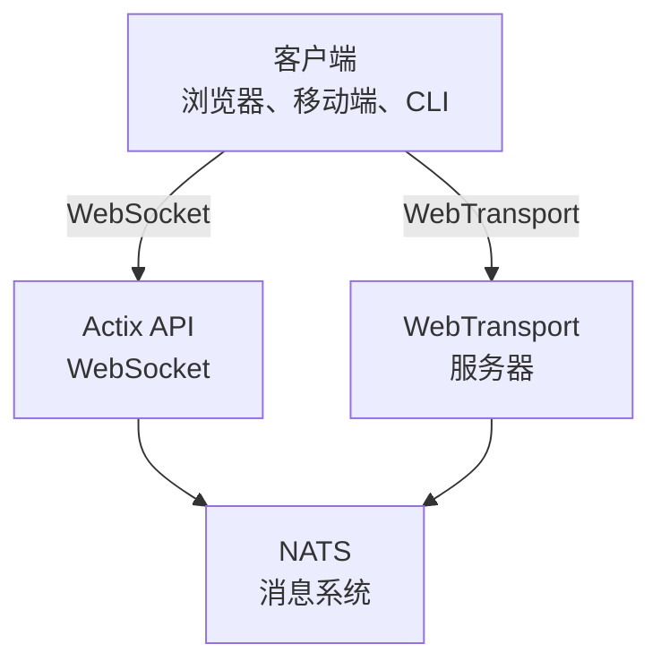

# videocall.rs

<a href="https://opensource.org/licenses/MIT"></a>
<a href="https://discord.gg/JP38NRe4CJ"></a> 
<a href="https://www.digitalocean.com/?refcode=6de4e19c5193&utm_campaign=Referral_Invite&utm_medium=Referral_Program&utm_source=badge"></a>

一个使用 Rust 构建的开源高性能视频会议平台，提供低延迟的实时通信。

**[官网](https://videocall.rs)** | **[Discord 社区](https://discord.gg/JP38NRe4CJ)**

## 目录

- [概述](#overview)
- [功能](#features)
- [为什么选择 WebTransport 而不是 WebRTC？](#why-webtransport-instead-of-webrtc)
- [系统架构](#system-architecture)
- [快速开始](#getting-started)
  - [先决条件](#prerequisites)
  - [Docker 安装](#docker-setup)
  - [手动安装](#manual-setup)
- [使用方法](#usage)
- [性能](#performance)
- [安全](#security)
- [路线图](#roadmap)
- [贡献指南](#contributing)
- [项目结构](#project-structure)
- [演示与媒体](#demos-and-media)
- [贡献者](#contributors)
- [许可协议](#license)

## 概述

videocall.rs 是一个现代的、完全用 Rust 编写的开源视频会议系统，专为需要可靠、可扩展且安全的实时通信能力的开发者设计。它为构建定制视频通信解决方案提供基础，支持基于浏览器和原生客户端。

**项目状态:** 测试版 - 积极开发中，适合非关键生产环境使用

## 功能

- **高性能：** 使用 Rust 构建，实现资源利用最优化与低延迟
- **多传输协议支持：** 支持 WebSockets 和 WebTransport
- **端到端加密 (E2EE)：** 可选的对等安全通信
- **可扩展架构：** 使用 NATS 的发布/订阅模型，支持横向扩展
- **跨平台支持：** 支持基于 Chromium 的浏览器（Chrome、Edge、Brave），Safari 支持正在开发中。由于 MediaStreamTrackProcessor 实现不完整，不支持 Firefox。
- **原生客户端支持：** 提供 CLI 工具，用于从设备（如树莓派）进行无头视频流传输
- **开源协议：** MIT 许可，灵活自由

## 为什么选择 WebTransport 而不是 WebRTC？

WebTransport 是区别 videocall.rs 与传统视频会议解决方案的核心技术。作为开发者，以下是我们 WebTransport 方案的技术优势：

### 技术优势

- **无 SFU，无 NAT 穿透：** WebTransport 消除了 WebRTC 实现中复杂的选择性转发单元（SFU）和 NAT 穿透机制，避免了无数开发者的头痛问题。

- **架构简化：** 无需复杂的 STUN/TURN 服务器、ICE 候选协商或 WebRTC 中繁琐的信令交互，只需直接的简单连接。

- **协议效率：** 基于 HTTP/3 和 QUIC，WebTransport 提供多路复用的双向流，拥塞控制和丢包恢复性能优于 WebRTC 过时的 SCTP 数据通道。

- **更低延迟：** QUIC 的 0-RTT 连接建立缩短了初始连接时间，优于 WebRTC 多次往返的建立过程。

- **开发体验更佳：** WebTransport 提供更直观的开发者 API，采用基于 Promise 的设计和更清晰的流管理。

- **面向未来：** 作为 IETF 和 W3C 推动的现代 Web 平台组成部分，WebTransport 拥有强大的浏览器厂商支持和活跃演进的规范。

### 开发者意义

对于集成 videocall.rs 的开发者来说，意味着：
- ✅ 极大简化的部署架构
- ✅ 无需复杂网络配置或防火墙设置
- ✅ 在复杂网络环境下性能更佳
- ✅ 实现间行为更可预测
- ✅ 减少调试连接问题的时间
- ✅ 面向未来的技术投资

阅读我们的[架构文档](https://raw.githubusercontent.com/security-union/videocall-rs/main/ARCHITECTURE.md)，深入了解我们如何实现 WebTransport 及其技术优势。

## 系统架构

videocall.rs 采用微服务架构，主要组件如下：



1. **actix-api:** 基于 Rust 的后端服务器，使用 Actix Web 框架
2. **yew-ui:** 使用 Yew 框架构建的 Web 前端，编译为 WebAssembly
3. **videocall-types:** 共享数据类型与协议定义
4. **videocall-client:** 原生集成客户端库
5. **videocall-cli:** 用于无头视频流传输的命令行工具

更多系统架构详细说明，请参见我们的[架构文档](https://raw.githubusercontent.com/security-union/videocall-rs/main/ARCHITECTURE.md)。

## 快速开始

**⭐ 推荐：Docker 是唯一完全支持的开发方式 ⭐**

我们强烈推荐使用基于 Docker 的开发环境，因为它维护良好并在各平台表现一致。下面介绍的手动安装方法维护较少，可能需要额外调试。

### 先决条件

- 现代 Linux 发行版、macOS 或 Windows 10/11
- [Docker](https://docs.docker.com/engine/install/) 和 Docker Compose（容器化安装所需）
- [Rust 工具链](https://rustup.rs/) 1.85 及以上（用于手动安装）
- 基于 Chromium 的浏览器（Chrome、Edge、Brave）访问前端 — 不支持 Firefox

### Docker 安装

最快速的启动方式是使用我们的 Docker 安装：

1. 克隆仓库：
   ```
   git clone https://github.com/security-union/videocall-rs.git
   cd videocall-rs
   ```

2. 启动服务器（将 `<server-ip>` 替换为你的机器 IP 地址）：
   ```
   make up
   ```

3. 使用提供的脚本启动支持本地 WebTransport 的 Chrome：
   ```
   ./launch_chrome.sh
   ```

4. 访问应用：
   ```
   http://<server-ip>/meeting/<username>/<meeting-id>
   ```

### 手动安装（实验性）

⚠️ **警告**：此方法为实验性，维护较少，可能需要手动调试。

适合高级用户直接在本机运行服务：

1. 创建 PostgreSQL 数据库：
   ```
   createdb actix-api-db
   ```

2. 安装所需工具：
   ```
   # 安装 NATS 服务器
   curl -L https://github.com/nats-io/nats-server/releases/download/v2.9.8/nats-server-v2.9.8-linux-amd64.tar.gz | tar xz
   sudo mv nats-server-v2.9.8-linux-amd64/nats-server /usr/local/bin
   
   # 安装 trurl
   cargo install trurl
   ```

3. 启动开发环境：
   ```
   ./start_dev.sh
   ```

4. 访问：
   ```
   http://localhost:8081/meeting/<username>/<meeting-id>
   ```

详细配置选项请参阅我们的[安装文档](https://docs.videocall.rs/setup)。

## 使用方法

### 浏览器客户端

1. 访问你的部署实例或本地环境：
   ```
   http://<server-address>/meeting/<username>/<meeting-id>
   ```

2. 允许摄像头和麦克风权限

3. 点击“连接”加入会议

### CLI 流媒体推送

适用于树莓派等无头设备：

```bash
# 安装 CLI 工具
cargo install videocall-cli

# 从摄像头推流
videocall-cli stream \
  --user-id <your-user-id> \
  --video-device-index 0 \
  --meeting-id <meeting-id> \
  --resolution 1280x720 \
  --fps 30 \
  --frame-format NV12 \
  --bitrate-kbps 500
```
有关 CLI 工具及所有可用选项的详细信息，请参见 [videocall-cli README](https://raw.githubusercontent.com/security-union/videocall-rs/main/videocall-cli/README.md)。

## 性能

videocall.rs 已针对以下场景进行了基准测试和优化：

- **一对一通话：** 资源占用极低，典型连接下延迟小于100毫秒
- **小型群组（3-10人）：** 采用高效的网状拓扑，根据网络状况自适应质量
- **大型会议：** 使用选择性转发架构，测试支持最多1000名参与者

### 技术优化

- **零拷贝设计：** 最小化网络栈与应用代码之间的数据复制
- **异步核心：** 基于 Rust 的 async/await 生态系统及 Tokio 运行时构建  
- **SIMD 加速处理：** 利用 CPU 向量化技术加速媒体操作（条件允许时）
- **无锁数据结构：** 高吞吐场景下最小化竞争
- **协议级优化：** 定制调优的拥塞控制与数据包调度

### 资源利用

我们的服务器端架构设计注重大规模下的效率：

- **水平扩展：** 通过增加服务器实例实现线性性能扩展
- **负载分配：** 自动在服务器池中均衡连接
- **资源治理：** 可配置带宽、连接数及 CPU 利用率限制
- **容器优化：** 适合在 Kubernetes 环境中高效部署

性能指标及调优指南将发布于我们的[性能文档](https://raw.githubusercontent.com/security-union/videocall-rs/main/PERFORMANCE.md)。（进行中）

## 安全

安全是 videocall.rs 的核心关注点：

- **传输安全：** 所有通信均使用 TLS/HTTPS
- **端到端加密：** 支持可选的端到端加密，服务器无法访问内容
- **身份认证：** 灵活集成身份提供商
- **访问控制：** 细粒度的会议室权限系统

有关我们的安全模型及最佳实践的详细信息，请参见[安全文档](https://docs.videocall.rs/security)。

## 路线图

| 版本    | 目标日期   | 主要功能                      |
|---------|------------|-----------------------------|
| 0.5.0   | 2023 年第 2 季度 | ✅ 端到端加密                  |
| 0.6.0   | 2023 年第 3 季度 | ✅ 支持 Safari 浏览器           |
| 0.7.0   | 2023 年第 4 季度 | ✅ 原生移动端 SDK              |
| 0.8.0   | 2024 年第 1 季度 | 🔄 屏幕共享改进               |
| 1.0.0   | 2024 年第 2 季度 | 🔄 生产发布，全面 API 稳定性     |


## 贡献

我们欢迎社区贡献！参与方式如下：

1. **问题反馈：** 通过 [GitHub Issues](https://github.com/security-union/videocall-rs/issues) 报告错误或建议新功能

2. **拉取请求：** 提交修复或增强的 PR

3. **RFC 流程：** 对重大变更，参与我们的 [RFC 流程](https://raw.githubusercontent.com/security-union/videocall-rs/main/rfc)

4. **社区交流：** 加入我们的 [Discord 服务器](https://discord.gg/JP38NRe4CJ) 讨论开发

详情请参阅我们的[贡献指南](https://raw.githubusercontent.com/security-union/videocall-rs/main/CONTRIBUTING.md)。


### 技术栈

- **后端**：Rust + Actix Web + PostgreSQL + NATS
- **前端**：Rust + Yew + WebAssembly + Tailwind CSS
- **传输**：WebTransport（QUIC/HTTP3）+ WebSockets（回退方案）
- **构建系统**：Cargo + Trunk + Docker + Helm
- **测试**：Rust 测试框架 + Playwright 用于端到端测试

### 关键技术特性

- **双向流媒体**：基于 QUIC 流的全异步消息传递
- **错误处理**：代码库内全面采用基于 Result 的错误传播
- **模块化设计**：职责清晰，组件间接口定义明确
- **类型安全**：充分利用 Rust 类型系统预防运行时错误
- **二进制协议**：所有消息均采用高效的 Protocol Buffer 序列化

更全面的技术概览，请参见[架构文档](https://raw.githubusercontent.com/security-union/videocall-rs/main/ARCHITECTURE.md)。

### Git 钩子

本仓库包含 Git 钩子以确保代码质量：

1. **提交前钩子**：每次提交前自动运行 `cargo fmt`，确保代码格式一致。
2. **提交后钩子**：每次提交后运行 `cargo clippy`，检查潜在的代码改进。

在项目根目录运行以下命令安装钩子：

```bash
# 如果不存在则创建钩子目录
mkdir -p .git/hooks

# 创建提交前钩子
cat > .git/hooks/pre-commit << 'EOF'
#!/bin/sh

# 运行 cargo fmt 并检查是否有变更
echo "正在运行 cargo fmt..."
cargo fmt --all -- --check

# 检查 cargo fmt 的退出码
if [ $? -ne 0 ]; then
    echo "cargo fmt 发现格式问题。请在提交前修复。"
    exit 1
fi

exit 0
EOF

# 创建提交后钩子
cat > .git/hooks/post-commit << 'EOF'
#!/bin/sh

# 提交后运行 cargo clippy
echo "正在运行 cargo clippy..."
ACTIX_UI_BACKEND_URL="" WEBTRANSPORT_HOST="" LOGIN_URL="" WEBTRANSPORT_URL="" ACTIX_API_URL="" cargo clippy -- -D warnings

# 检查 cargo clippy 的退出码
if [ $? -ne 0 ]; then
    echo "Cargo clippy 发现代码问题。请修复。"
    # 提交已完成，无法中止，但可提醒用户
    echo "提交成功，但请在推送前考虑修复 clippy 问题。"
fi

exit 0
EOF

# 赋予钩子执行权限
chmod +x .git/hooks/pre-commit .git/hooks/post-commit
```

这些钩子帮助维护代码质量，确保格式正确并检测常见问题。

## 演示与媒体

### 技术演讲

- [扩展至每通话 1000 用户](https://youtu.be/LWwOSZJwEJI)
- [初始概念验证（2022）](https://www.youtube.com/watch?v=kZ9isFw1TQ8)

### 频道

- [YouTube 频道](https://www.youtube.com/@dario.lencina)

## 贡献者

<table>
<tr>
<td align="center"><a href="https://github.com/darioalessandro"><br /><sub><b>Dario Lencina</b></sub></a></td>
<td align="center"><a href="https://github.com/griffobeid"><br /><sub><b>Griffin Obeid</b></sub></a></td>    
<td align="center"><a href="https://github.com/ronen"><br /><sub><b>Ronen Barzel</b></sub></a></td>
<td align="center"><a href="https://github.com/leon3s"><br /><sub><b>Leone</b></sub></a></td>
<td align="center"><a href="https://github.com/JasterV"><br /><sub><b>Victor Martínez</b></sub></a></td>
</tr>
</table>

特别感谢 [JasterV](https://github.com/JasterV) 提供的 Actix websocket 实现，其中包含了 [chat-rooms-actix](https://github.com/JasterV/chat-rooms-actix) 项目的部分代码片段。

## 许可

本项目采用 MIT 许可协议 - 详情请参阅 [LICENSE.md](https://raw.githubusercontent.com/security-union/videocall-rs/main/LICENSE.md) 文件。


---


Tranlated By [Open Ai Tx](https://github.com/OpenAiTx/OpenAiTx) | Last indexed: 2025-06-11


---