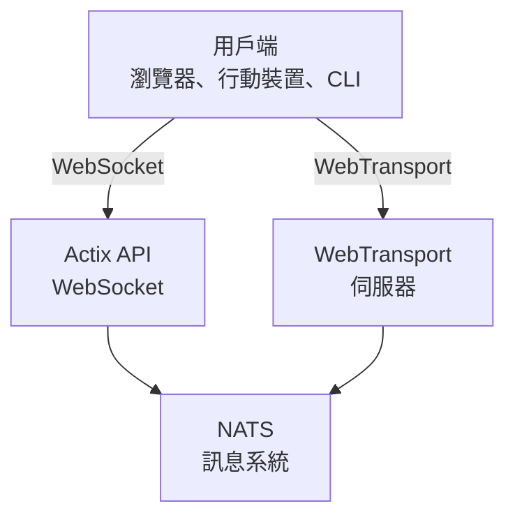

# videocall.rs

<a href="https://opensource.org/licenses/MIT"></a>
<a href="https://discord.gg/JP38NRe4CJ"></a> 
<a href="https://www.digitalocean.com/?refcode=6de4e19c5193&utm_campaign=Referral_Invite&utm_medium=Referral_Program&utm_source=badge"></a>

一個以 Rust 建置的開源高效能視訊會議平台，提供低延遲的即時通訊。

**[網站](https://videocall.rs)** | **[Discord 社群](https://discord.gg/JP38NRe4CJ)**

## 目錄

- [概述](#overview)
- [功能特色](#features)
- [為何選擇 WebTransport 而非 WebRTC？](#why-webtransport-instead-of-webrtc)
- [系統架構](#system-architecture)
- [快速開始](#getting-started)
  - [先決條件](#prerequisites)
  - [Docker 設定](#docker-setup)
  - [手動設定](#manual-setup)
- [使用說明](#usage)
- [效能](#performance)
- [安全性](#security)
- [開發路線圖](#roadmap)
- [貢獻指南](#contributing)
- [專案結構](#project-structure)
- [示範與媒體](#demos-and-media)
- [貢獻者](#contributors)
- [授權條款](#license)

## 概述

videocall.rs 是一套現代化、完全使用 Rust 撰寫的開源視訊會議系統，專為需要可靠、可擴展且安全的即時通訊功能的開發者設計。它提供建置自訂視訊通訊解決方案的基礎，支援瀏覽器端及原生用戶端。

**專案狀態：** Beta - 積極開發中，適合非關鍵生產環境使用

## 功能特色

- **高效能：** 使用 Rust 建構，達到最佳資源使用率與低延遲
- **多種傳輸協定：** 支援 WebSocket 和 WebTransport
- **端對端加密 (E2EE)：** 可選的點對點安全通訊
- **可擴展架構：** 採用 NATS pub/sub 模型設計，實現水平擴展
- **跨平台支援：** 適用於 Chromium 核心瀏覽器（Chrome、Edge、Brave），Safari 正在開發中。不支援 Firefox，因為 MediaStreamTrackProcessor 尚未完整實作。
- **原生用戶端支援：** 提供 CLI 工具，可用於樹莓派等裝置的無頭視訊串流
- **開源授權：** MIT 授權，彈性最大

## 為何選擇 WebTransport 而非 WebRTC？

WebTransport 是 videocall.rs 與傳統視訊會議解決方案的核心技術差異。作為開發者，以下是我們 WebTransport 方法技術上的優勢：

### 技術優勢

- **無 SFU，無 NAT 穿透：** WebTransport 消除了 WebRTC 中複雜的選擇性轉發單元 (SFU) 與 NAT 穿透機制，減少開發者無數的頭痛問題。

- **簡化架構：** 不再需要複雜的 STUN/TURN 伺服器、ICE 候選協商或 WebRTC 的訊號交換流程，直接建立簡單明瞭的連線。

- **協定效率：** 建構於 HTTP/3 和 QUIC 之上，WebTransport 提供多路複用且雙向的串流，比 WebRTC 以往使用的 SCTP 資料通道具有更佳的擁塞控制及封包遺失復原能力。

- **更低延遲：** QUIC 的 0-RTT 連線建立大幅縮短初始連線時間，優於 WebRTC 的多重往返交握。

- **清爽的開發體驗：** WebTransport 提供更直覺的開發者 API，採用 Promise 設計，串流管理更為乾淨。

- **未來可期：** 作為 IETF 和 W3C 推動的現代網頁平台技術，WebTransport 擁有強大的瀏覽器廠商支援與持續演進的規範。

### 對開發者的意義

對於整合 videocall.rs 的開發者而言：

- ✅ 部署架構大幅簡化
- ✅ 無需複雜的網路設定或防火牆調整
- ✅ 在艱難網路環境下效能更佳
- ✅ 各實作間行為更具一致性與可預測性
- ✅ 減少排解連線問題所花費的時間
- ✅ 投資未來的前瞻性技術

深入了解我們如何實作 WebTransport 及其技術優勢，請參考我們的 [架構文件](https://raw.githubusercontent.com/security-union/videocall-rs/main/ARCHITECTURE.md)。

## 系統架構

videocall.rs 採用微服務架構，主要元件如下：



1. **actix-api：** 使用 Actix Web 框架的 Rust 後端伺服器
2. **yew-ui：** 使用 Yew 框架建置，編譯成 WebAssembly 的網頁前端
3. **videocall-types：** 共用資料型別與協定定義
4. **videocall-client：** 原生整合用的用戶端函式庫
5. **videocall-cli：** 用於無頭視訊串流的命令列介面工具

欲了解系統架構更詳細說明，請參閱我們的 [架構文件](https://raw.githubusercontent.com/security-union/videocall-rs/main/ARCHITECTURE.md)。

## 快速開始

**⭐ 推薦：Docker 是唯一全面支援的開發方式 ⭐**

我們強烈建議使用 Docker 方式來開發，因為該方法維護良好，且在不同平台上行為一致。以下手動設定方式維護較少，可能需要額外除錯。

### 先決條件

- 現代 Linux 發行版、macOS 或 Windows 10/11
- [Docker](https://docs.docker.com/engine/install/) 與 Docker Compose（容器化設定）
- [Rust 開發環境](https://rustup.rs/) 1.85 以上（手動設定使用）
- Chromium 核心瀏覽器（Chrome、Edge、Brave）用於前端存取，Firefox 不支援

### Docker 設定

最快速的開發起步方式是使用 Docker：

1. 複製專案：

   ```
   git clone https://github.com/security-union/videocall-rs.git
   cd videocall-rs
   ```

2. 啟動伺服器（請將 `<server-ip>` 替換為您的機器 IP）：

   ```
   make up
   ```

3. 使用提供的腳本開啟 Chrome，支援本機 WebTransport：

   ```
   ./launch_chrome.sh
   ```

4. 造訪應用程式：

   ```
   http://<server-ip>/meeting/<username>/<meeting-id>
   ```

### 手動設定（實驗性）

⚠️ **警告**：此設定方式屬實驗性，維護程度不及 Docker，可能遇到需要手動除錯的問題。

適合進階使用者直接在機器上運行服務：

1. 建立 PostgreSQL 資料庫：

   ```
   createdb actix-api-db
   ```

2. 安裝所需工具：

   ```
   # 安裝 NATS 伺服器
   curl -L https://github.com/nats-io/nats-server/releases/download/v2.9.8/nats-server-v2.9.8-linux-amd64.tar.gz | tar xz
   sudo mv nats-server-v2.9.8-linux-amd64/nats-server /usr/local/bin
   
   # 安裝 trurl
   cargo install trurl
   ```

3. 啟動開發環境：

   ```
   ./start_dev.sh
   ```

4. 連線至：

   ```
   http://localhost:8081/meeting/<username>/<meeting-id>
   ```

詳細設定選項請參閱我們的 [設定文件](https://docs.videocall.rs/setup)。

## 使用說明

### 瀏覽器用戶端

1. 造訪您的部署實例或本機設定：

   ```
   http://<server-address>/meeting/<username>/<meeting-id>
   ```

2. 允許攝影機與麥克風權限

3. 點擊「連線」加入會議

### CLI 串流

適用於無頭裝置如樹莓派：

```bash
# 安裝 CLI 工具
cargo install videocall-cli

# 從攝影機串流
videocall-cli stream \
  --user-id <your-user-id> \
  --video-device-index 0 \
  --meeting-id <meeting-id> \
  --resolution 1280x720 \
  --fps 30 \
  --frame-format NV12 \
  --bitrate-kbps 500
```
有關 CLI 工具及所有可用選項的詳細資訊，請參閱 [videocall-cli README](https://raw.githubusercontent.com/security-union/videocall-rs/main/videocall-cli/README.md)。

## 效能

videocall.rs 已針對以下場景進行基準測試與優化：

- **一對一通話：** 在典型連線下資源使用最低，延遲 <100ms
- **小型群組（3-10人）：** 使用高效的網狀拓撲，根據網路狀況自適應品質
- **大型會議：** 使用選擇性轉發架構測試至多 1000 名參與者

### 技術優化

- **零複製設計：** 最小化網路堆疊與應用程式代碼間的資料複製
- **非同步核心：** 建構於 Rust 的 async/await 生態系統及 Tokio 執行時
- **SIMD 加速處理：** 在可用時使用 CPU 向量化進行媒體處理
- **無鎖資料結構：** 在高吞吐量場景中減少競爭
- **協定層級優化：** 自訂調整擁塞控制與封包排程

### 資源使用

我們的伺服器端架構專為大規模效率設計：

- **水平擴展：** 隨著伺服器實例增加，性能線性擴展
- **負載分配：** 自動在伺服器池間平衡連線
- **資源治理：** 可配置頻寬、連線及 CPU 使用限制
- **容器優化：** 設計用於 Kubernetes 環境高效部署

效能指標與調校指南將於我們的[效能文件](https://raw.githubusercontent.com/security-union/videocall-rs/main/PERFORMANCE.md)中提供（進行中）。

## 安全性

安全性是 videocall.rs 的核心焦點：

- **傳輸安全：** 所有通訊皆採用 TLS/HTTPS。
- **端對端加密：** 同儕間可選擇啟用 E2EE，伺服器無法存取內容。
- **認證：** 可靈活整合身份提供者。
- **存取控制：** 會議室具細緻權限系統。

有關我們的安全模型及最佳實踐，請參閱[安全文件](https://docs.videocall.rs/security)。

## 路線圖

| 版本   | 目標日期   | 主要功能                          |
|--------|------------|---------------------------------|
| 0.5.0  | 2023 年第 2 季 | ✅ 端對端加密                    |
| 0.6.0  | 2023 年第 3 季 | ✅ Safari 瀏覽器支援             |
| 0.7.0  | 2023 年第 4 季 | ✅ 原生行動 SDK                  |
| 0.8.0  | 2024 年第 1 季 | 🔄 螢幕共享改進                  |
| 1.0.0  | 2024 年第 2 季 | 🔄 正式發行，API 完整穩定        |


## 貢獻

我們歡迎社群貢獻！參與方式如下：

1. **議題回報：** 透過 [GitHub Issues](https://github.com/security-union/videocall-rs/issues) 報告錯誤或建議功能
2. **拉取請求：** 提交錯誤修正或功能增強的 PR
3. **RFC 流程：** 對重大變更參與我們的 [RFC 流程](https://raw.githubusercontent.com/security-union/videocall-rs/main/rfc)
4. **社群互動：** 加入我們的 [Discord 伺服器](https://discord.gg/JP38NRe4CJ) 討論開發

更多詳細資訊請參閱我們的 [貢獻指南](https://raw.githubusercontent.com/security-union/videocall-rs/main/CONTRIBUTING.md)。

### 技術棧

- **後端：** Rust + Actix Web + PostgreSQL + NATS
- **前端：** Rust + Yew + WebAssembly + Tailwind CSS
- **傳輸：** WebTransport (QUIC/HTTP3) + WebSockets (備援)
- **建置系統：** Cargo + Trunk + Docker + Helm
- **測試：** Rust 測試框架 + Playwright 端對端測試

### 主要技術特性

- **雙向串流：** 完全非同步訊息傳遞，使用 QUIC 串流
- **錯誤處理：** 全程基於 Result 的錯誤傳播
- **模組化：** 清晰分離各組件，介面明確
- **型別安全：** 廣泛利用 Rust 型別系統避免執行時錯誤
- **二進位協定：** 所有訊息皆使用高效 Protocol Buffer 序列化

更多技術總覽請參閱 [架構文件](https://raw.githubusercontent.com/security-union/videocall-rs/main/ARCHITECTURE.md)。

### Git 鉤子

本倉庫包含 Git 鉤子以確保程式碼品質：

1. **Pre-commit 鉤子：** 每次提交前自動執行 `cargo fmt`，確保程式碼格式一致。
2. **Post-commit 鉤子：** 提交後執行 `cargo clippy`，檢查潛在程式碼改進。

於專案根目錄執行以下指令安裝這些鉤子：

```bash
# 建立 hooks 目錄（若不存在）
mkdir -p .git/hooks

# 建立 pre-commit 鉤子
cat > .git/hooks/pre-commit << 'EOF'
#!/bin/sh

# 執行 cargo fmt 並檢查是否有變更
echo "執行 cargo fmt..."
cargo fmt --all -- --check

# 檢查 cargo fmt 執行結果
if [ $? -ne 0 ]; then
    echo "cargo fmt 發現格式問題。請先修正再提交。"
    exit 1
fi

exit 0
EOF

# 建立 post-commit 鉤子
cat > .git/hooks/post-commit << 'EOF'
#!/bin/sh

# 提交後執行 cargo clippy
echo "執行 cargo clippy..."
ACTIX_UI_BACKEND_URL="" WEBTRANSPORT_HOST="" LOGIN_URL="" WEBTRANSPORT_URL="" ACTIX_API_URL="" cargo clippy -- -D warnings

# 檢查 cargo clippy 執行結果
if [ $? -ne 0 ]; then
    echo "Cargo clippy 發現程式碼問題。請修正。"
    # 提交已完成，無法中止，但可提醒使用者
    echo "提交成功，但請考慮在推送前修正 clippy 問題。"
fi

exit 0
EOF

# 設定鉤子為可執行
chmod +x .git/hooks/pre-commit .git/hooks/post-commit
```

這些鉤子有助於維持程式碼品質，確保格式正確並檢查常見問題。

## 示範與媒體

### 技術簡報

- [擴展至每通話 1000 使用者](https://youtu.be/LWwOSZJwEJI)
- [初期概念驗證 (2022)](https://www.youtube.com/watch?v=kZ9isFw1TQ8)

### 頻道

- [YouTube 頻道](https://www.youtube.com/@dario.lencina)

## 貢獻者

<table>
<tr>
<td align="center"><a href="https://github.com/darioalessandro"><br /><sub><b>Dario Lencina</b></sub></a></td>
<td align="center"><a href="https://github.com/griffobeid"><br /><sub><b>Griffin Obeid</b></sub></a></td>    
<td align="center"><a href="https://github.com/ronen"><br /><sub><b>Ronen Barzel</b></sub></a></td>
<td align="center"><a href="https://github.com/leon3s"><br /><sub><b>Leone</b></sub></a></td>
<td align="center"><a href="https://github.com/JasterV"><br /><sub><b>Victor Martínez</b></sub></a></td>
</tr>
</table>

特別感謝 [JasterV](https://github.com/JasterV) 貢獻 Actix websocket 實作，其中包含來自 [chat-rooms-actix](https://github.com/JasterV/chat-rooms-actix) 專案的片段。

## 授權條款

本專案採用 MIT 授權條款，詳情請見 [LICENSE.md](https://raw.githubusercontent.com/security-union/videocall-rs/main/LICENSE.md) 檔案。


---


Tranlated By [Open Ai Tx](https://github.com/OpenAiTx/OpenAiTx) | Last indexed: 2025-06-11


---