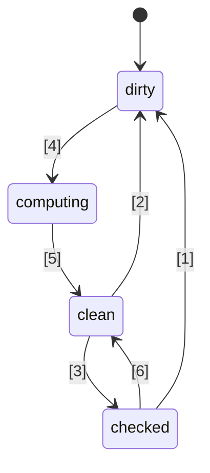
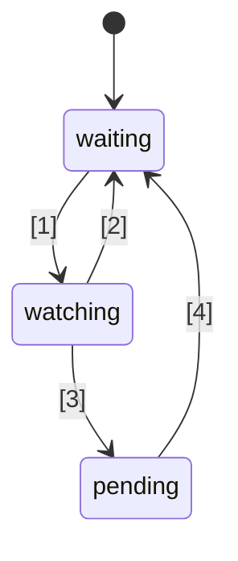

# 🚦 اقتراح معيار إشارات جافاسكريبت 🚦


المرحلة 1 ([توضيح](https://tc39.es/process-document/))

أبطال اقتراح TC39: دانيال إهرنبرغ، يهودا كاتز، جتين راماناثان، شاي لويس، كريستين هيويل جاريت، دومينيك جاناواي، بريستون سيغو، ميلو إم، روب إيزنبرغ

المؤلفون الأصليون: روب إيزنبرغ ودانيال إهرنبرغ

يصف هذا المستند اتجاهًا مشتركًا مبكرًا للإشارات في جافاسكريبت، مشابهًا لجهود Promises/A+ التي سبقت توحيد الوعود من قبل TC39 في ES2015. يمكنك تجربته بنفسك باستخدام [polyfill](https://github.com/proposal-signals/signal-polyfill).

وبالمثل مع Promises/A+، يركز هذا الجهد على توحيد نظام جافاسكريبت البيئي. إذا تم تحقيق هذا التوحيد بنجاح، فقد يظهر معيار بناءً على تلك التجربة. يتعاون هنا العديد من مؤلفي الأطر على نموذج مشترك يمكن أن يدعم نواة التفاعلية لديهم. المسودة الحالية تستند إلى مدخلات تصميم من مؤلفي/صانعي [Angular](https://angular.io/)، [Bubble](https://bubble.io/)، [Ember](https://emberjs.com/)، [FAST](https://www.fast.design/)، [MobX](https://mobx.js.org/)، [Preact](https://preactjs.com/)، [Qwik](https://qwik.dev/)، [RxJS](https://rxjs.dev/)، [Solid](https://www.solidjs.com/)، [Starbeam](https://www.starbeamjs.com/)، [Svelte](https://svelte.dev/)، [Vue](https://vuejs.org/)، [Wiz](https://blog.angular.io/angular-and-wiz-are-better-together-91e633d8cd5a)، وأكثر...

وبخلاف Promises/A+، نحن لا نحاول حل واجهة برمجة تطبيقات مشتركة موجهة للمطورين، بل نركز على الدلالات الجوهرية الدقيقة للرسم البياني الأساسي للإشارات. يتضمن هذا الاقتراح واجهة برمجة تطبيقات ملموسة بالكامل، لكن الواجهة ليست موجهة لمعظم مطوري التطبيقات. بدلاً من ذلك، فإن واجهة برمجة تطبيقات الإشارات هنا مناسبة أكثر لبناء الأطر عليها، مما يوفر قابلية التشغيل البيني من خلال رسم إشارات مشترك وآلية تتبع تلقائي.

خطة هذا الاقتراح هي إجراء نمذجة أولية كبيرة مبكرًا، بما في ذلك التكامل في العديد من الأطر، قبل التقدم إلى ما بعد المرحلة 1. نحن مهتمون فقط بتوحيد الإشارات إذا كانت مناسبة للاستخدام العملي في عدة أطر عمل، وتوفر فوائد حقيقية على الإشارات المقدمة من الأطر. نأمل أن تمنحنا النمذجة الأولية المكثفة هذه المعلومات. راجع قسم "الحالة وخطة التطوير" أدناه لمزيد من التفاصيل.

## الخلفية: لماذا الإشارات؟

لتطوير واجهة مستخدم (UI) معقدة، يحتاج مطورو تطبيقات جافاسكريبت إلى تخزين، وحساب، وإبطال، ومزامنة، ودفع الحالة إلى طبقة العرض الخاصة بالتطبيق بطريقة فعالة. غالبًا ما تتطلب واجهات المستخدم أكثر من مجرد إدارة قيم بسيطة، بل تشمل غالبًا عرض حالة محسوبة تعتمد على شجرة معقدة من القيم الأخرى أو الحالة التي يتم حسابها أيضًا. الهدف من الإشارات هو توفير بنية تحتية لإدارة مثل هذه الحالة التطبيقية حتى يتمكن المطورون من التركيز على منطق العمل بدلاً من هذه التفاصيل المتكررة.

لقد تم اكتشاف أن التركيبات الشبيهة بالإشارات مفيدة بشكل مستقل في السياقات غير المتعلقة بواجهة المستخدم أيضًا، خاصة في أنظمة البناء لتجنب إعادة البناء غير الضروري.

تُستخدم الإشارات في البرمجة التفاعلية لإزالة الحاجة لإدارة التحديثات في التطبيقات.

> نموذج برمجة تصريحي للتحديث بناءً على تغييرات الحالة.

من _[ما هي التفاعلية؟](https://www.pzuraq.com/blog/what-is-reactivity)_.

#### مثال - عداد VanillaJS

بالنظر إلى متغير `counter`، تريد عرضه في DOM لمعرفة ما إذا كان العداد زوجيًا أم فرديًا. في كل مرة يتغير فيها `counter`، تريد تحديث DOM بأحدث نوع زوجية. في جافاسكريبت العادية (Vanilla JS)، قد يكون لديك شيء مثل هذا:

```js
let counter = 0;
const setCounter = (value) => {
  counter = value;
  render();
};

const isEven = () => (counter & 1) == 0;
const parity = () => isEven() ? "even" : "odd";
const render = () => element.innerText = parity();

// Simulate external updates to counter...
setInterval(() => setCounter(counter + 1), 1000);
```
> [!ملاحظة]  
> تم استخدام المتغيرات العامة هنا لأغراض العرض فقط. هناك العديد من حلول إدارة الحالة السليمة، والأمثلة في هذا الاقتراح تهدف إلى أن تكون بسيطة قدر الإمكان. هذا الاقتراح لا يشجع على استخدام المتغيرات العامة.

هذا يحتوي على عدد من المشاكل...

* إعداد `counter` مليء بالضوضاء والكود المتكرر.
* حالة `counter` مرتبطة بقوة بنظام العرض.
* إذا تغير `counter` لكن لم تتغير `parity` (مثلاً العداد انتقل من 2 إلى 4)، نقوم بحساب غير ضروري للزوجية وعرض غير ضروري.
* ماذا إذا كان جزء آخر من واجهة المستخدم يريد فقط العرض عند تحديث `counter`؟
* ماذا إذا كان جزء آخر من واجهة المستخدم يعتمد فقط على `isEven` أو `parity`؟

حتى في هذا السيناريو البسيط نسبيًا، تظهر العديد من المشاكل بسرعة. يمكننا محاولة حل هذه المشاكل بإدخال pub/sub للعداد `counter`. سيسمح ذلك لمستهلكين إضافيين للعداد بالاشتراك لإضافة ردود أفعالهم على تغييرات الحالة.

ومع ذلك، ما زلنا عالقين مع المشاكل التالية:

* وظيفة العرض، التي تعتمد فقط على `parity` يجب بدلاً من ذلك أن "تعرف" أنها تحتاج فعليًا للاشتراك في `counter`.
* ليس من الممكن تحديث واجهة المستخدم بناءً على `isEven` أو `parity` فقط، دون التفاعل المباشر مع `counter`.
* لقد زاد الكود المتكرر لدينا. في كل مرة تستخدم فيها شيئًا، فالأمر ليس مجرد استدعاء دالة أو قراءة متغير، بل يجب الاشتراك وتحديثه هناك. إدارة إلغاء الاشتراك معقدة أيضًا بشكل خاص.

الآن، يمكننا حل بعض المشاكل بإضافة pub/sub ليس فقط إلى `counter` ولكن أيضًا إلى `isEven` و `parity`. حينها علينا الاشتراك بـ `isEven` إلى `counter`، و `parity` إلى `isEven`، و `render` إلى `parity`. لسوء الحظ، لم يزد الكود المتكرر فقط، بل أصبح لدينا الكثير من مهام إدارة الاشتراكات، واحتمالية حدوث تسرب للذاكرة إذا لم ننظف كل شيء بشكل صحيح. إذًا، قمنا بحل بعض المشاكل ولكن أنشأنا فئة جديدة بالكامل من المشاكل والكثير من الكود. والأسوأ من ذلك، علينا المرور بهذه العملية لكل جزء من الحالة في نظامنا.

### تقديم الإشارات

لطالما كانت تجريدات ربط البيانات بين النموذج والعرض جوهرية في أطر واجهة المستخدم عبر لغات البرمجة المتعددة، على الرغم من عدم وجود مثل هذه الآلية مدمجة في جافاسكريبت أو منصة الويب. ضمن أطر ومكتبات جافاسكريبت، كان هناك الكثير من التجريب عبر طرق مختلفة لتمثيل هذا الربط، وقد أظهرت التجربة قوة تدفق البيانات في اتجاه واحد جنبًا إلى جنب مع نوع بيانات من الدرجة الأولى يمثل خلية من الحالة أو حساب مشتق من بيانات أخرى، والذي يسمى الآن غالبًا "الإشارات".
يبدو أن هذا النهج القيمي التفاعلي من الدرجة الأولى قد ظهر لأول مرة على نطاق واسع في أطر جافاسكريبت مفتوحة المصدر مع [Knockout](https://knockoutjs.com/) [في عام 2010](https://blog.stevensanderson.com/2010/07/05/introducing-knockout-a-ui-library-for-javascript/). منذ ذلك الحين، تم إنشاء العديد من التنويعات والتنفيذات. خلال السنوات الثلاث أو الأربع الأخيرة، اكتسبت بدائية الإشارة والمناهج ذات الصلة مزيدًا من الزخم، مع وجود شيء مشابه تقريبًا في كل مكتبة أو إطار حديث لجافاسكريبت، تحت اسم أو آخر.

لفهم الإشارات، دعنا نلقي نظرة على المثال أعلاه، معاد تصوره باستخدام واجهة برمجة تطبيقات الإشارة الموضحة أدناه.

#### مثال - عداد باستخدام الإشارات

```js
const counter = new Signal.State(0);
const isEven = new Signal.Computed(() => (counter.get() & 1) == 0);
const parity = new Signal.Computed(() => isEven.get() ? "even" : "odd");

// مكتبة أو إطار عمل يحدد التأثيرات بناءً على إشارات أخرى
declare function effect(cb: () => void): (() => void);

effect(() => element.innerText = parity.get());

// محاكاة التحديثات الخارجية للعداد...
setInterval(() => counter.set(counter.get() + 1), 1000);
```

هناك بعض الأشياء التي يمكننا ملاحظتها على الفور:
* لقد أزلنا الكود المتكرر المزعج حول متغير `counter` من مثالنا السابق.
* هناك واجهة موحدة للتعامل مع القيم، والحسابات، والتأثيرات الجانبية.
* لا توجد مشكلة مرجعية دائرية أو تبعيات مقلوبة بين `counter` و `render`.
* لا توجد اشتراكات يدوية، ولا حاجة لأي إدارة.
* هناك وسيلة للتحكم في توقيت/جدولة التأثيرات الجانبية.

توفر لنا الإشارات أكثر بكثير مما يمكن ملاحظته على سطح واجهة البرمجة:
* **تتبع التبعيات التلقائي** - يقوم الـ Signal المحسوب باكتشاف أي Signals أخرى يعتمد عليها بشكل تلقائي، سواء كانت تلك الـ Signals قيم بسيطة أو عمليات حسابية أخرى.
* **التقييم الكسول (Lazy Evaluation)** - لا يتم تقييم العمليات الحسابية بشكل متعجل عند إعلانها، ولا يتم تقييمها مباشرة عند تغير التبعيات الخاصة بها. يتم تقييمها فقط عندما يُطلب قيمتها صراحة.
* **تخزين النتائج (Memoization)** - تقوم Signals المحسوبة بتخزين آخر قيمة لها بحيث لا يتم إعادة تقييم العمليات الحسابية التي لم تتغير تبعياتها، بغض النظر عن عدد مرات الوصول إليها.

## الدوافع وراء توحيد الـ Signals

#### قابلية التشغيل البيني

كل تنفيذ للـ Signal لديه آلية تتبع تلقائي خاصة به، لتتبع المصادر التي يتم الوصول إليها عند تقييم Signal محسوب. هذا يصعب مشاركة النماذج والمكونات والمكتبات بين أطر العمل المختلفة—حيث تميل إلى أن تأتي مع اقتران خاطئ بمحرك العرض الخاص بها (نظرًا لأن Signals غالبًا ما يتم تنفيذها كجزء من أطر عمل JS).

أحد أهداف هذا الاقتراح هو فك الارتباط الكامل بين النموذج التفاعلي (reactive model) وعرض البيانات (rendering view)، مما يتيح للمطورين الانتقال إلى تقنيات عرض جديدة بدون إعادة كتابة كود غير واجهة المستخدم، أو تطوير نماذج تفاعلية مشتركة في JS ليتم نشرها في سياقات مختلفة. للأسف، بسبب الإصدارات والتكرار، اتضح أن الوصول إلى مستوى مشاركة قوي من خلال مكتبات على مستوى JS أمر غير عملي—توفر المدمجات (built-ins) ضمان مشاركة أقوى.

#### الأداء/استخدام الذاكرة

هناك دائمًا إمكانية لتعزيز الأداء من خلال شحن كود أقل بسبب وجود مكتبات مستخدمة بشكل شائع مدمجة، لكن تنفيذات Signals عادةً ما تكون صغيرة جدًا، لذلك لا نتوقع أن يكون هذا التأثير كبيرًا.

نحن نعتقد أن تنفيذات C++ الأصلية لهياكل البيانات والخوارزميات المتعلقة بـ Signal يمكن أن تكون أكثر كفاءة قليلاً مما هو ممكن في JS، بعامل ثابت فقط. ومع ذلك، لا يُتوقع حدوث تغييرات خوارزمية مقابل ما يمكن أن يوجد في polyfill؛ ولا يُتوقع من المحركات أن تقدم سحرًا هنا، وستكون خوارزميات التفاعلية نفسها محددة جيدًا وواضحة.

تتوقع مجموعة الأبطال تطوير عدة تنفيذات لـ Signals، واستخدامها لاستكشاف هذه الاحتمالات المتعلقة بالأداء.

#### أدوات المطورين (DevTools)

مع مكتبات Signals الحالية في لغة JS، قد يكون من الصعب تتبع أشياء مثل:
* مكدس الاستدعاء عبر سلسلة Signals المحسوبة، لإظهار سلسلة السببية لخطأ ما
* رسم بياني للمرجع بين Signals، عندما يعتمد أحدها على الآخر—وهو أمر مهم عند تصحيح استخدام الذاكرة

تمكن Signals المدمجة بيئات تشغيل JS وأدوات المطورين من دعم محسّن لفحص Signals، خاصة لأغراض التصحيح أو تحليل الأداء، سواء تم تضمين هذا الدعم في المتصفحات أو من خلال امتداد مشترك. يمكن تحديث الأدوات الحالية مثل مفتش العناصر، ولقطات الأداء، وأدوات تحليل الذاكرة لتسليط الضوء بشكل خاص على Signals في عرض المعلومات.

#### الفوائد الثانوية

##### فوائد مكتبة قياسية

بشكل عام، كانت مكتبة JavaScript القياسية محدودة إلى حد ما، لكن هناك اتجاه في TC39 لجعل JS لغة أكثر "شمولية" مع مجموعة مدمجة عالية الجودة من الوظائف المتاحة. على سبيل المثال، Temporal تحل محل moment.js، وعدد من الميزات الصغيرة مثل `Array.prototype.flat` و`Object.groupBy` تحل محل العديد من استخدامات lodash. تشمل الفوائد تقليل حجم الحزم، وتحسين الاستقرار والجودة، وتقليل الحاجة للتعلم عند الانضمام إلى مشروع جديد، وتوفير مفردات شائعة بين مطوري JS.

##### تكامل مع HTML/DOM (احتمال مستقبلي)

العمل الحالي في W3C ومن قبل مطوري المتصفحات يسعى لجلب القوالب الأصلية إلى HTML ([DOM Parts][wicg-pr-1023] و[Template Instantiation][wicg-propsal-template-instantiation]). بالإضافة إلى ذلك، تستكشف مجموعة W3C Web Components إمكانية توسيع Web Components لتقديم واجهة HTML تصريحيه بالكامل. لتحقيق كلا الهدفين، سيحتاج HTML في النهاية إلى بدائية تفاعلية. بالإضافة إلى ذلك، يمكن تخيل العديد من التحسينات العملية لـ DOM من خلال تكامل Signals وقد طلبها المجتمع بالفعل.

[wicg-pr-1023]: https://github.com/WICG/webcomponents/pull/1023
[wicg-propsal-template-instantiation]: https://github.com/WICG/webcomponents/blob/gh-pages/proposals/Template-Instantiation.md

> ملاحظة، هذا التكامل سيكون جهدًا منفصلًا يأتي لاحقًا، وليس جزءًا من هذا الاقتراح نفسه.

##### تبادل المعلومات في النظام البيئي (وليس سببًا للإطلاق)

يمكن أن تكون جهود التوحيد القياسي مفيدة أحيانًا فقط على مستوى "المجتمع"، حتى بدون تغييرات في المتصفحات. يجمع جهد Signals العديد من مؤلفي الأطر المختلفين لمناقشة عميقة حول طبيعة التفاعلية والخوارزميات وقابلية التشغيل البيني. كان هذا مفيدًا بالفعل، لكنه لا يبرر تضمينه في محركات JS والمتصفحات؛ يجب إضافة Signals إلى معيار JavaScript فقط إذا كانت هناك فوائد كبيرة *تتجاوز* مجرد تبادل المعلومات بين الأنظمة.

## أهداف التصميم للـ Signals

يتضح أن مكتبات Signal الحالية ليست مختلفة كثيرًا عن بعضها في جوهرها. يهدف هذا الاقتراح إلى البناء على نجاحها من خلال تنفيذ الصفات المهمة للعديد من تلك المكتبات.

### الميزات الأساسية

* نوع Signal يمثل الحالة، أي Signal قابلة للكتابة. هذه قيمة يمكن للآخرين قراءتها.
* نوع Signal محسوب/مخزن/مشتق، يعتمد على الآخرين ويتم حسابه وتخزينه بشكل كسول.
    * الحساب كسول، أي أن Signals المحسوبة لا يتم حسابها مرة أخرى بشكل افتراضي عندما تتغير إحدى تبعياتها، بل يتم التشغيل فقط إذا قرأها أحد.
    * الحساب "[خالي من الأعطال (glitch)](https://en.wikipedia.org/wiki/Reactive_programming#Glitches)"، أي لا يتم إجراء حسابات غير ضرورية أبدًا. وهذا يعني أنه عند قراءة تطبيق ما لـ Signal محسوب، يكون هناك ترتيب طوبولوجي للأجزاء القابلة للتغيير المحتمل في الرسم البياني ليتم تشغيلها، لإزالة أي تكرارات.
    * الحساب مخزن، أي إذا لم تتغير أي تبعيات منذ آخر مرة تغيرت فيها التبعيات، فلن يتم إعادة حساب Signal المحسوبة عند الوصول إليها.
    * المقارنات المخصصة ممكنة لكل من Signals المحسوبة وSignals الحالة، لتحديد متى يجب تحديث Signals المحسوبة الأخرى التي تعتمد عليها.
* ردود فعل على الحالة التي يصبح فيها أحد تبعيات Signal المحسوبة (أو التبعيات المتداخلة) "متسخًا" ويتغير، مما يعني أن قيمة Signal قد تكون قديمة.
    * يهدف هذا التفاعل إلى جدولة عمل أكثر أهمية ليتم تنفيذه لاحقًا.
    * يتم تنفيذ التأثيرات من حيث هذه التفاعلات، بالإضافة إلى جدولة على مستوى الإطار.
    * Signals المحسوبة تحتاج إلى القدرة على التفاعل مع ما إذا كانت مسجلة كتبعيات (متداخلة) لإحدى هذه التفاعلات.
* تمكين أطر عمل JS من تنفيذ جدولة خاصة بها. لا يوجد جدولة مدمجة إجبارية على غرار Promise.
    * هناك حاجة إلى تفاعلات متزامنة لتمكين جدولة العمل لاحقًا بناءً على منطق الإطار.
    * الكتابة متزامنة وتصبح سارية المفعول فورًا (يمكن للإطار الذي يجمع الكتابات أن يفعل ذلك فوق ذلك).
    * من الممكن فصل التحقق مما إذا كان التأثير قد يكون "متسخًا" عن تشغيل التأثير نفسه (مما يمكّن مجدول تأثير من مرحلتين).
* إمكانية قراءة Signals *دون* تفعيل تسجيل التبعيات (`untrack`)
* تمكين تركيب قواعد كود مختلفة تستخدم Signals/التفاعلية، على سبيل المثال،
    * استخدام أطر متعددة معًا فيما يتعلق بالتتبع/التفاعلية (مع وجود استثناءات، انظر أدناه)
    * هياكل بيانات تفاعلية مستقلة عن الإطار (مثل مخزن تفاعلي بشكل متكرر، Map وSet وArray تفاعلية، إلخ)

### السلامة

* تثبيط/منع سوء استخدام التفاعلات المتزامنة بشكل ساذج.
    * مخاطر السلامة: قد تعرض "[الأعطال (glitches)](https://en.wikipedia.org/wiki/Reactive_programming#Glitches)" إذا استخدمت بشكل غير صحيح: إذا تم العرض فور تعيين Signal، فقد تعرض حالة تطبيق غير مكتملة للمستخدم النهائي. لذلك، يجب استخدام هذه الميزة فقط لجدولة العمل بذكاء لاحقًا، بمجرد الانتهاء من منطق التطبيق.
    * الحل: منع القراءة والكتابة لأي Signal من داخل رد نداء التفاعل المتزامن.
* تثبيط استخدام `untrack` وبيان طبيعته غير الآمنة
    * مخاطر السلامة: يسمح بإنشاء Signals محسوبة تعتمد قيمتها على Signals أخرى، ولكنها لا يتم تحديثها عند تغير تلك الـ Signals. يجب استخدامه عندما لا تؤثر عمليات الوصول غير المتعقبة على نتيجة الحساب.
    * الحل: يتم تمييز الـ API بأنه "غير آمن" في الاسم.
* ملاحظة: يسمح هذا الاقتراح بقراءة وكتابة signals من signals المحسوبة والتأثير، دون تقييد الكتابات التي تأتي بعد القراءات، على الرغم من خطر السلامة. تم اتخاذ هذا القرار للحفاظ على المرونة والتوافق في التكامل مع الأطر.

### واجهة البرمجة السطحية (Surface API)

* يجب أن تكون أساسًا قويًا لعدة أطر عمل لتنفيذ آليات Signals/التفاعلية الخاصة بها.
    * يجب أن تكون قاعدة جيدة لمخازن proxies التفاعلية المتكررة، وتفاعلية الحقول في الفئات المعتمدة على الزخرفة (decorator)، وواجهات برمجة التطبيقات بأسلوب `.value` و`[state, setState]`.
    * يجب أن تكون الدلالات قادرة على التعبير عن الأنماط الصالحة الممكنة بواسطة أطر العمل المختلفة. على سبيل المثال، يجب أن يكون من الممكن أن تكون هذه Signals أساسًا إما للكتابات المنعكسة فورًا أو الكتابات المجمعة التي يتم تطبيقها لاحقًا.
* من الجيد أن يكون هذا الـ API قابلاً للاستخدام مباشرة من قبل مطوري JavaScript.
    * إذا كانت ميزة ما تتطابق مع مفهوم في النظام البيئي، فاستخدام مفردات شائعة أمر جيد.
        * مع ذلك، من المهم عدم نسخ نفس الأسماء حرفيًا!
    * هناك توتر بين "قابلية الاستخدام من قبل مطوري JS" و"توفير جميع الخطافات للأطر"
        * فكرة: توفير جميع الخطافات، لكن تضمين أخطاء عند سوء الاستخدام إذا أمكن.
        * فكرة: وضع واجهات برمجة التطبيقات الدقيقة في مساحة اسم `subtle`، على غرار [`crypto.subtle`](https://developer.mozilla.org/en-US/docs/Web/API/Crypto/subtle)، للفصل بين الواجهات اللازمة للاستخدامات المتقدمة مثل تنفيذ إطار عمل أو بناء أدوات مطورين مقابل الاستخدام اليومي لتطبيقات البرمجة مثل إنشاء signals لاستخدامها مع إطار عمل.
* يجب أن تكون قابلة للتنفيذ والاستخدام بأداء جيد—أي لا تسبب واجهة البرمجة السطحية عبئًا زائدًا كبيرًا
    * تمكين الوراثة، بحيث يمكن للأطر إضافة طرقها وحقولها الخاصة، بما في ذلك الحقول الخاصة. هذا مهم لتجنب الحاجة لتخصيصات إضافية على مستوى الإطار. راجع "إدارة الذاكرة" أدناه.

### إدارة الذاكرة

* إذا أمكن: يجب أن يكون من الممكن جمع Signal محسوب بواسطة جامع القمامة إذا لم يكن هناك أي مرجع حي يشير إليه لغرض القراءة المحتملة في المستقبل، حتى لو كان مرتبطًا برسم بياني أوسع يظل حيًا (مثلاً، من خلال قراءة حالة تظل حية).
* لاحظ أن معظم الأطر الحالية تتطلب التخلص الصريح من الإشارات المحسوبة إذا كان لديها أي مرجع إلى أو من رسم إشارة آخر يبقى حيًا.
* هذا لا يكون سيئًا جدًا عندما تكون فترة حياتها مرتبطة بفترة حياة مكون واجهة المستخدم، وتحتاج التأثيرات إلى التخلص منها على أي حال.
* إذا كان تنفيذ ذلك مكلفًا جدًا بهذه الدلالات، فيجب علينا إضافة التخلص الصريح (أو "فك الارتباط") من الإشارات المحسوبة إلى الواجهة البرمجية أدناه، والتي تفتقر إليه حاليًا.
* هدف منفصل ذو صلة: تقليل عدد التخصيصات، مثلاً:
    * لإنشاء إشارة قابلة للكتابة (تجنب إغلاقين منفصلين + مصفوفة)
    * لتنفيذ التأثيرات (تجنب إغلاق لكل تفاعل فردي)
    * في واجهة برمجة التطبيقات لمراقبة تغييرات الإشارة، تجنب إنشاء هياكل بيانات مؤقتة إضافية
    * الحل: واجهة برمجة تطبيقات قائمة على الأصناف تُمكن من إعادة استخدام الدوال والحقول المعرفة في الأصناف الفرعية

## مخطط واجهة برمجة التطبيقات

فكرة أولية عن واجهة برمجة تطبيقات الإشارة أدناه. لاحظ أن هذا مجرد مسودة أولية، ونتوقع تغييرات مع مرور الوقت. لنبدأ بملف `.d.ts` الكامل للحصول على فكرة عن الشكل العام، ثم سنناقش تفاصيل ما يعنيه كل ذلك.

```ts
interface Signal<T> {
    // الحصول على قيمة الإشارة
    get(): T;
}

namespace Signal {
    // إشارة للقراءة والكتابة
    class State<T> implements Signal<T> {
        // إنشاء إشارة حالة تبدأ بالقيمة t
        constructor(t: T, options?: SignalOptions<T>);

        // الحصول على قيمة الإشارة
        get(): T;

        // تعيين قيمة إشارة الحالة إلى t
        set(t: T): void;
    }

    // إشارة هي عبارة عن صيغة تعتمد على إشارات أخرى
    class Computed<T = unknown> implements Signal<T> {
        // إنشاء إشارة يتم تقييمها إلى القيمة التي يتم إرجاعها من قبل رد الاستدعاء.
        // يتم استدعاء رد الاستدعاء مع هذه الإشارة كقيمة this.
        constructor(cb: (this: Computed<T>) => T, options?: SignalOptions<T>);

        // الحصول على قيمة الإشارة
        get(): T;
    }

    // تحتوي هذه المساحة الاسمية على ميزات "متقدمة" من الأفضل
    // تركها لمؤلفي الأطر بدلاً من مطوري التطبيقات.
    // مماثلة لـ `crypto.subtle`
    namespace subtle {
        // تنفيذ رد استدعاء مع تعطيل جميع التتبع
        function untrack<T>(cb: () => T): T;

        // الحصول على إشارة محسوبة حالية تتتبع أي قراءات إشارة، إذا وجدت
        function currentComputed(): Computed | null;

        // إرجاع قائمة مرتبة بجميع الإشارات التي تمت الإشارة إليها بواسطة هذه الإشارة
        // خلال آخر مرة تم تقييمها فيها.
        // بالنسبة للمراقب Watcher، يسرد مجموعة الإشارات التي يراقبها.
        function introspectSources(s: Computed | Watcher): (State | Computed)[];

        // إرجاع المراقبين Watchers الذين تحتويهم هذه الإشارة، بالإضافة إلى أي
        // إشارات محسوبة قرأت هذه الإشارة آخر مرة تم تقييمها،
        // إذا كانت تلك الإشارة المحسوبة (بشكل متكرر) مراقبة.
        function introspectSinks(s: State | Computed): (Computed | Watcher)[];

        // صحيح إذا كانت هذه الإشارة "حية"، أي تتم مراقبتها بواسطة مراقب Watcher،
        // أو تتم قراءتها بواسطة إشارة محسوبة (بشكل متكرر) حية.
        function hasSinks(s: State | Computed): boolean;

        // صحيح إذا كان هذا العنصر "تفاعليًا"، أي يعتمد
        // على إشارة أخرى. الإشارة المحسوبة التي يكون فيها hasSources خاطئًا
        // ستُرجع دائمًا نفس القيمة الثابتة.
        function hasSources(s: Computed | Watcher): boolean;

        class Watcher {
            // عند كتابة مصدر (بشكل متكرر) للمراقب Watcher، يتم استدعاء رد الاستدعاء هذا،
            // إذا لم يكن قد تم استدعاؤه بالفعل منذ آخر استدعاء لـ `watch`.
            // لا يمكن قراءة أو كتابة أي إشارات أثناء الإخطار.
            constructor(notify: (this: Watcher) => void);

            // إضافة هذه الإشارات إلى مجموعة المراقب، وتعيين المراقب لتشغيل
            // رد الاستدعاء للإخطار في المرة القادمة التي تتغير فيها أي إشارة في المجموعة (أو أحد تبعياتها).
            // يمكن استدعاؤها بدون معاملات فقط لإعادة تعيين حالة "تم الإخطار"، بحيث يتم استدعاء
            // رد الاستدعاء للإخطار مرة أخرى.
            watch(...s: Signal[]): void;

            // إزالة هذه الإشارات من المجموعة المراقبة (مثلاً، لتأثير تم التخلص منه)
            unwatch(...s: Signal[]): void;

            // إرجاع مجموعة المصادر في مجموعة المراقب التي لا تزال قيد التحديث، أو هي إشارة محسوبة
            // تحتوي على مصدر قيد التحديث أو قيد الانتظار ولم يتم إعادة تقييمه بعد
            getPending(): Signal[];
        }

        // خطافات لمراقبة البدء أو التوقف عن المراقبة
        var watched: Symbol;
        var unwatched: Symbol;
    }

    interface SignalOptions<T> {
        // دالة مقارنة مخصصة بين القيمة القديمة والجديدة. الافتراضي: Object.is.
        // يتم تمرير الإشارة كقيمة this للسياق.
        equals?: (this: Signal<T>, t: T, t2: T) => boolean;
```
```ts
// دالة الاستدعاء تُستدعى عندما تصبح isWatched تساوي true، إذا كانت سابقًا false
[Signal.subtle.watched]?: (this: Signal<T>) => void;

// دالة الاستدعاء تُستدعى كلما أصبحت isWatched تساوي false، إذا كانت سابقًا true
[Signal.subtle.unwatched]?: (this: Signal<T>) => void;
}
}
```

### كيف تعمل الإشارات (Signals)

تمثل الإشارة (Signal) خلية بيانات قد تتغير بمرور الوقت. قد تكون الإشارات إما "حالة" (مجرد قيمة يتم تعيينها يدويًا) أو "محسوبة" (معادلة تستند إلى إشارات أخرى).

تعمل الإشارات المحسوبة من خلال تتبع تلقائي للإشارات الأخرى التي تتم قراءتها أثناء التقييم. عند قراءة إشارة محسوبة، تتحقق مما إذا كان أي من التبعيات المسجلة سابقًا قد تغير، وتعيد تقييم نفسها إذا كان الأمر كذلك. عند تداخل إشارات محسوبة متعددة، فإن كل إسناد التتبع يذهب إلى الأعمق بينها.

الإشارات المحسوبة تعمل بشكل كسول (أي تعتمد على السحب): لا يتم إعادة تقييمها إلا عندما يتم الوصول إليها، حتى إذا كانت إحدى تبعياتها قد تغيرت مسبقًا.

ينبغي أن تكون دالة الاستدعاء الممررة إلى الإشارات المحسوبة "نقية" عمومًا، بمعنى أنها دالة حتمية وخالية من التأثيرات الجانبية بالنسبة للإشارات الأخرى التي تصل إليها. في الوقت ذاته، فإن توقيت استدعاء الدالة حتمي، مما يسمح باستخدام التأثيرات الجانبية بحذر.

تتميز الإشارات بوجود ذاكرة تخزين مؤقت/تذكير بارز: كل من الإشارات الحالة والمحسوبة تتذكر قيمتها الحالية، ولا تؤدي إلى إعادة حساب الإشارات المحسوبة التي تشير إليها إلا إذا تغيرت فعليًا. ولا يلزم حتى إجراء مقارنة متكررة بين القيم القديمة والجديدة -- تتم المقارنة مرة واحدة عند إعادة تعيين/تقييم مصدر الإشارة، وآلية الإشارة تتعقب أي العناصر التي تشير إلى تلك الإشارة لم يتم تحديثها بناءً على القيمة الجديدة بعد. داخليًا، يتم تمثيل ذلك عمومًا من خلال "تلوين الرسم البياني" كما هو موضح في (منشور مدونة ميلو).

تتبع الإشارات المحسوبة تبعياتها بشكل ديناميكي -- في كل مرة يتم تشغيلها، قد تعتمد على أشياء مختلفة، ويتم الحفاظ على مجموعة التبعيات الدقيقة هذه محدثة في رسم إشارة البيانات. هذا يعني أنه إذا كان لديك تبعية مطلوبة في أحد الفروع فقط، وكان التقييم السابق قد اتخذ الفرع الآخر، فإن التغيير في تلك القيمة غير المستخدمة مؤقتًا لن يتسبب في إعادة حساب الإشارة المحسوبة، حتى عند سحبها.

على عكس وعود الجافاسكريبت (Promises)، كل شيء في الإشارات يعمل بشكل متزامن:
- تعيين إشارة إلى قيمة جديدة يتم بشكل متزامن، وهذا ينعكس على الفور عند قراءة أي إشارة محسوبة تعتمد عليها لاحقًا. لا يوجد تجميع مدمج لهذا التغيير.
- قراءة الإشارات المحسوبة متزامنة -- قيمتها متاحة دائمًا.
- دالة الاستدعاء `notify` في المراقبين (Watchers)، كما هو موضح أدناه، تعمل بشكل متزامن أثناء استدعاء `.set()` الذي قام بتحفيزها (لكن بعد اكتمال تلوين الرسم البياني).

مثل الوعود (Promises)، يمكن للإشارات أن تمثل حالة خطأ: إذا قامت دالة الاستدعاء لإشارة محسوبة برمي خطأ، فإنه يتم تخزين هذا الخطأ مؤقتًا مثل أي قيمة أخرى، ويعاد رميه في كل مرة تتم فيها قراءة الإشارة.

### فهم فئة Signal

يمثل كائن `Signal` القدرة على قراءة قيمة تتغير ديناميكيًا وتتم متابعة تحديثاتها مع مرور الوقت. كما يتضمن ضمنيًا القدرة على الاشتراك في الإشارة، بشكل ضمني من خلال وصول متتبع من إشارة محسوبة أخرى.

تم تصميم واجهة البرمجة هذه لتتوافق مع التوافق التقريبي الكبير بين مكتبات الإشارات في النظام البيئي من حيث استخدام أسماء مثل "signal" و"computed" و"state". ومع ذلك، يتم الوصول إلى الإشارات المحسوبة والحالة عبر دالة `.get()`، وهذا يخالف جميع واجهات برمجة تطبيقات الإشارات الشائعة، التي تستخدم إما وسيط وصول على شكل `.value`، أو استدعاء على شكل `signal()`.

تم تصميم الواجهة لتقليل عدد التخصيصات، لجعل الإشارات مناسبة للدمج في أطر عمل جافاسكريبت مع تحقيق نفس أو أداء أفضل من إشارات الأطر الحالية. هذا يعني:
- إشارات الحالة عبارة عن كائن قابل للكتابة مرة واحدة، يمكن الوصول إليه وتعيينه من نفس المرجع. (انظر الآثار أدناه في قسم "فصل القدرات".)
- كل من إشارات الحالة والمحسوبة مصممة لتكون قابلة للتوريث، لتسهيل قدرة الأطر على إضافة خصائص إضافية من خلال الحقول العامة والخاصة (وكذلك طرق استخدام تلك الحالة).
- يتم استدعاء العديد من دوال الاستدعاء (مثل `equals`، ودالة الإشارة المحسوبة) مع إشارة السياق المناسبة كـ `this`، بحيث لا يلزم إغلاق جديد لكل إشارة. بدلاً من ذلك، يمكن حفظ السياق في خصائص إضافية للإشارة نفسها.

بعض شروط الأخطاء التي تفرضها هذه الواجهة:
- من الخطأ قراءة إشارة محسوبة بشكل متكرر (recursively).
- لا يمكن لدالة الاستدعاء `notify` في المراقب قراءة أو كتابة أي إشارات
- إذا قامت دالة الاستدعاء لإشارة محسوبة برمي خطأ، فإن الوصولات اللاحقة إلى الإشارة تعيد رمي ذلك الخطأ المخزن، حتى تتغير إحدى التبعيات ويعاد حسابها.

بعض الحالات التي *لا* تفرض:
- يمكن للإشارات المحسوبة الكتابة إلى إشارات أخرى، بشكل متزامن داخل دالة الاستدعاء الخاصة بها
- يمكن للعمل المجدول بواسطة دالة الاستدعاء `notify` في المراقب قراءة أو كتابة إشارات، مما يجعل من الممكن تكرار [أنماط React الكلاسيكية غير الموصى بها](https://react.dev/learn/you-might-not-need-an-effect) من حيث الإشارات!

### تنفيذ التأثيرات (Effects)

تعطي واجهة `Watcher` المعرفة أعلاه الأساس لتنفيذ واجهات برمجة تطبيقات جافاسكريبت النموذجية للتأثيرات: دوال الاستدعاء التي يعاد تشغيلها عند تغير إشارات أخرى، وذلك فقط لأثرها الجانبي. يمكن تعريف دالة `effect` المستخدمة أعلاه في المثال الأولي كما يلي:

```ts
// عادة ما تعيش هذه الدالة في مكتبة/إطار عمل وليس في كود التطبيق
// ملاحظة: منطق الجدولة هذا بسيط جدًا ليكون مفيدًا. لا تنسخه أو تلصقه.
let pending = false;

let w = new Signal.subtle.Watcher(() => {
    if (!pending) {
        pending = true;
        queueMicrotask(() => {
            pending = false;
            for (let s of w.getPending()) s.get();
            w.watch();
        });
    }
});

// إشارة تأثير (effect) يتم تقييمها إلى cb، وتجدول قراءة نفسها في قائمة مهام microtask
// كلما تغيرت إحدى تبعياتها المحتملة
export function effect(cb) {
    let destructor;
    let c = new Signal.Computed(() => { destructor?.(); destructor = cb(); });
    w.watch(c);
    c.get();
    return () => { destructor?.(); w.unwatch(c) };
}
```

لا تتضمن واجهة برمجة الإشارات أي دالة مضمنة مثل `effect`. ذلك لأن جدولة التأثيرات أمر دقيق وغالبًا ما يرتبط بدورات العرض في الأطر وغيرها من الحالات أو الاستراتيجيات الخاصة بمستوى الأطر العليا التي لا يمكن لجافاسكريبت الوصول إليها.

عند استعراض العمليات المختلفة المستخدمة هنا: دالة الاستدعاء `notify` الممررة إلى منشئ `Watcher` هي الدالة التي تُستدعى عندما تنتقل الإشارة من حالة "نظيفة" (حيث نعلم أن ذاكرة التخزين المؤقت مهيأة وصحيحة) إلى حالة "مفحوصة" أو "قذرة" (حيث قد تكون ذاكرة التخزين المؤقت صحيحة أو لا، لأن واحدة على الأقل من الحالات التي تعتمد عليها تغيرت).

تتم في النهاية عمليات استدعاء `notify` بواسطة استدعاء `.set()` على إحدى إشارات الحالة. هذا الاستدعاء متزامن: يحدث قبل أن تعيد دالة `.set` النتيجة. لكن لا داعي للقلق من أن تلاحظ دالة الاستدعاء هذه رسم الإشارة في حالة معالجة جزئية، لأنه أثناء دالة الاستدعاء `notify`، لا يمكن قراءة أو كتابة أي إشارة، حتى في استدعاء `untrack`. نظرًا لأن `notify` تُستدعى أثناء `.set()`، فهي تقاطع خيطًا آخر من المنطق، قد لا يكون مكتملًا. لقراءة أو كتابة إشارات من `notify`، قم بجدولة العمل ليعمل لاحقًا، مثل كتابة الإشارة في قائمة ليتم الوصول إليها لاحقًا، أو باستخدام `queueMicrotask` كما في الأعلى.

لاحظ أنه من الممكن تمامًا استخدام الإشارات بفعالية دون `Signal.subtle.Watcher` من خلال جدولة الاستطلاع (polling) للإشارات المحسوبة، كما يفعل Glimmer. مع ذلك، وجدت العديد من الأطر أنه غالبًا ما يكون من المفيد أن يعمل منطق الجدولة هذا بشكل متزامن، ولهذا السبب تم تضمينه في واجهة برمجة الإشارات.

كل من الإشارات المحسوبة والحالة يتم جمعها (garbage-collected) مثل أي قيمة جافاسكريبت. لكن المراقبين (Watchers) لديهم طريقة خاصة للحفاظ على الأشياء حية: أي إشارات تتم مراقبتها بواسطة مراقب ستظل حية طالما أن أيًا من الحالات الأساسية قابلة للوصول، حيث يمكن أن تؤدي هذه إلى استدعاء `notify` في المستقبل (ثم استدعاء `.get()` في المستقبل). لهذا السبب، تذكر أن تستدعي `Watcher.prototype.unwatch` لتنظيف التأثيرات.

### مخرج غير سليم (Escape Hatch) غير آمن

`Signal.subtle.untrack` هو مخرج يسمح بقراءة الإشارات *دون* تتبع تلك القراءات. هذه الإمكانية غير آمنة لأنها تسمح بإنشاء إشارات محسوبة تعتمد قيمتها على إشارات أخرى، ولكنها لا تتحدث عند تغير تلك الإشارات. يجب استخدامها عندما لا تؤثر القراءات غير المتتبعة على نتيجة الحساب.

<!--
TODO: عرض مثال حيث من المناسب استخدام untrack

### استخدام watched/unwatched
TODO: عرض مثال لتحويل كائن Observable إلى إشارة محسوبة، يتم الاشتراك بها فقط عند استخدامها من قبل تأثير

TODO: عرض مثال لإشارة محسوبة تمثل نتيجة عملية جلب fetch موجهة إلى حالة، يتم إلغاؤها

### الاستبطان لخوادم SSR

TODO: عرض كيفية عمل تسلسل رسم الإشارة (signal graph)

TODO: عرض كيفية "إحياء" إشارة من حالة إلى محسوبة لاحقًا، باستخدام بعض الإشارات.
-->

### تم الاستبعاد حاليًا

قد تتم إضافة هذه الميزات لاحقًا، لكنها غير مدرجة في المسودة الحالية. سبب الاستبعاد هو عدم وجود إجماع راسخ في مساحة التصميم بين الأطر البرمجية، بالإضافة إلى القدرة المثبتة على إيجاد حلول بديلة لغيابها باستخدام آليات مبنية فوق مفهوم الإشارات (Signals) الموضح في هذا المستند. ومع ذلك، للأسف، فإن هذا الاستبعاد يحد من إمكانيات التوافق البيني بين الأطر. مع إنتاج نماذج أولية للإشارات كما هو موضح في هذا المستند، ستكون هناك محاولة لإعادة تقييم ما إذا كان هذا الاستبعاد هو القرار المناسب.

* **غير المتزامن (Async)**: الإشارات متوفرة دائمًا بشكل متزامن للتقييم في هذا النموذج. ومع ذلك، غالبًا ما يكون من المفيد وجود عمليات غير متزامنة معينة تؤدي إلى تعيين قيمة لإشارة ما، وفهم متى تكون الإشارة لا تزال "قيد التحميل". إحدى الطرق البسيطة لنمذجة حالة التحميل هي باستخدام الاستثناءات، ويكوّن سلوك التخزين المؤقت للاستثناءات في الإشارات المحسوبة مع هذه التقنية بشكل معقول إلى حد ما. تم مناقشة تقنيات محسنة في [Issue #30](https://github.com/proposal-signals/proposal-signals/issues/30).
* **المعاملات (Transactions)**: من المفيد غالبًا أثناء الانتقال بين العروض الاحتفاظ بحالة نشطة لكل من حالتي "من" و"إلى". يتم عرض الحالة "إلى" في الخلفية حتى تصبح جاهزة للتبديل (الالتزام بالمعاملة)، بينما تبقى الحالة "من" تفاعلية. يتطلب الحفاظ على كلتا الحالتين في نفس الوقت "تفريع" حالة رسم الإشارات، وقد يكون من المفيد حتى دعم عدة انتقالات معلقة في وقت واحد. مناقشة في [Issue #73](https://github.com/proposal-signals/proposal-signals/issues/73).

تم أيضًا استبعاد بعض [طرق الراحة](https://github.com/proposal-signals/proposal-signals/issues/32) المحتملة.

## الحالة وخطة التطوير

هذا الاقتراح مدرج في جدول أعمال TC39 لشهر أبريل 2024 للمرحلة 1. ويمكن اعتباره حاليًا في "المرحلة 0".

[هناك polyfill](https://github.com/proposal-signals/signal-polyfill) متاح لهذا الاقتراح، مع بعض الاختبارات الأساسية. بدأ بعض مؤلفي الأطر البرمجية بالفعل في تجربة استبدال هذه الإشارة في تطبيقاتهم، لكن هذا الاستخدام لا يزال في مرحلة مبكرة.

يرغب المتعاونون على اقتراح الإشارة في أن يكونوا **محافظين** للغاية في كيفية دفع هذا الاقتراح للأمام، حتى لا نقع في فخ شحن شيء نندم عليه في النهاية ولا نستخدمه فعليًا. خطتنا هي القيام بالمهام الإضافية التالية، غير المطلوبة من قبل عملية TC39، للتأكد من أن هذا الاقتراح على المسار الصحيح:

قبل التقدم للمرحلة 2، نخطط إلى:
- تطوير عدة تطبيقات polyfill بمستوى إنتاجي قوية، ومختبرة جيدًا (مثلاً، اجتياز اختبارات من أطر مختلفة بالإضافة إلى اختبارات بأسلوب test262)، وتنافسية من حيث الأداء (كما يتم التحقق من ذلك من خلال مجموعة اختبارات شاملة للإشارات/الأطر).
- دمج واجهة برمجة تطبيقات الإشارة المقترحة في عدد كبير من أطر عمل JavaScript التي نعتبرها تمثيلية إلى حد ما، وأن تعمل بعض التطبيقات الكبيرة على هذا الأساس. اختبار أنها تعمل بكفاءة وبشكل صحيح في هذه السياقات.
- الحصول على فهم راسخ لمجال الامتدادات الممكنة لواجهة برمجة التطبيقات، والتوصل إلى أي منها (إن وجدت) يجب إضافته إلى هذا الاقتراح.

## خوارزميات الإشارة

يصف هذا القسم كل واجهة برمجة التطبيقات التي يتم كشفها لجافاسكريبت، من حيث الخوارزميات التي تنفذها. يمكن اعتبار ذلك بمثابة مواصفات أولية، وتم تضمينها في هذه المرحلة المبكرة لتثبيت مجموعة ممكنة من الدلالات، مع الانفتاح التام على التغييرات.

بعض جوانب الخوارزمية:
- ترتيب قراءات الإشارات داخل المحسوبة مهم، ويمكن ملاحظته في ترتيب تنفيذ بعض callbacks (مثل استدعاء `Watcher`، و`equals`، والمعامل الأول لـ `new Signal.Computed`، وCallbacks `watched`/`unwatched`). هذا يعني أن مصادر إشارة محسوبة يجب أن يتم تخزينها بترتيب.
- هذه callbacks الأربعة قد ترمي جميعها استثناءات، وتنتقل هذه الاستثناءات بطريقة متوقعة إلى كود جافاسكريبت المنادي. الاستثناءات *لا* توقف تنفيذ هذه الخوارزمية أو تترك الرسم البياني في حالة نصف معالجة. بالنسبة للأخطاء التي تحدث في استدعاء notify الخاص بـ Watcher، يتم إرسال هذا الاستثناء إلى استدعاء `.set()` الذي تسبب به، باستخدام AggregateError إذا تم رمي عدة استثناءات. أما البقية (بما في ذلك `watched`/`unwatched`؟) فيتم تخزينها في قيمة الإشارة، ليتم رميها مرة أخرى عند القراءة، ويمكن تمييز مثل هذه الإشارة التي تم إعادة رميها كـ `~clean~` مثل أي إشارة أخرى بقيمة عادية.
- يتم اتخاذ الحيطة لتجنب الدوائر المغلقة في حالات الإشارات المحسوبة التي لا تتم "مشاهدتها" (أي غير مراقبة من قبل أي Watcher)، بحيث يمكن جمعها تلقائيًا بشكل مستقل عن أجزاء أخرى من رسم الإشارات. داخليًا، يمكن تنفيذ ذلك باستخدام نظام أرقام أجيال يتم جمعها دائمًا؛ لاحظ أن التطبيقات المحسنة قد تتضمن أيضًا أرقام أجيال محلية لكل عقدة، أو تتجنب تتبع بعض الأرقام على الإشارات المشاهدة.

### الحالة العالمية المخفية

تحتاج خوارزميات الإشارة إلى الإشارة إلى حالة عالمية معينة. هذه الحالة عالمية لكامل الخيط thread، أو "الوكيل agent".

- `computing`: أعمق إشارة محسوبة أو تأثير يتم إعادة تقييمها حاليًا بسبب استدعاء `.get` أو `.run`، أو `null`. في البداية تكون `null`.
- `frozen`: قيمة منطقية تدل على ما إذا كان هناك Callback يتم تنفيذه حاليًا يتطلب عدم تعديل الرسم البياني. في البداية `false`.
- `generation`: عدد صحيح متزايد، يبدأ من 0، يُستخدم لتعقب مدى حداثة القيمة أثناء تجنب الدوائر المغلقة.

### فضاء الاسم `Signal`

`Signal` هو كائن عادي يعمل كفضاء اسم للفئات والدوال المتعلقة بالإشارة.

`Signal.subtle` هو كائن مماثل كفضاء اسم داخلي.

### فئة `Signal.State`

#### الخانات الداخلية لـ `Signal.State`

- `value`: القيمة الحالية لإشارة الحالة
- `equals`: دالة المقارنة المستخدمة عند تغيير القيم
- `watched`: Callback يتم استدعاؤه عند مراقبة الإشارة من قبل تأثير
- `unwatched`: Callback يتم استدعاؤه عند توقف الإشارة عن أن تكون مراقبة من قبل تأثير
- `sinks`: مجموعة من الإشارات المشاهدة التي تعتمد على هذه الإشارة

#### الباني: `Signal.State(initialValue, options)`

1. عيّن قيمة `value` لهذه الإشارة إلى `initialValue`.
1. عيّن قيمة `equals` إلى options?.equals
1. عيّن قيمة `watched` إلى options?.[Signal.subtle.watched]
1. عيّن قيمة `unwatched` إلى options?.[Signal.subtle.unwatched]
1. عيّن قيمة `sinks` إلى مجموعة فارغة

#### طريقة: `Signal.State.prototype.get()`

1. إذا كانت `frozen` تساوي true، ارمي استثناءً.
1. إذا كانت `computing` ليست `undefined`، أضف هذه الإشارة إلى مجموعة `sources` الخاصة بـ `computing`.
1. ملاحظة: لا نضيف `computing` إلى مجموعة `sinks` لهذه الإشارة حتى تتم مراقبتها من قبل Watcher.
1. أرجع قيمة `value` لهذه الإشارة.

#### طريقة: `Signal.State.prototype.set(newValue)`

1. إذا كان سياق التنفيذ الحالي هو `frozen`، ارمي استثناءً.
1. نفذ خوارزمية "تعيين قيمة الإشارة" مع هذه الإشارة والمعامل الأول للقيمة.
1. إذا أعادت تلك الخوارزمية `~clean~`، أرجع undefined.
1. عيّن حالة جميع `sinks` لهذه الإشارة إلى (إذا كانت إشارة محسوبة) `~dirty~` إذا كانت نظيفة سابقًا، أو (إذا كانت Watcher) `~pending~` إذا كانت سابقًا `~watching~`.
1. عيّن حالة جميع تبعيات الإشارات المحسوبة لـ sinks (بشكل متكرر) إلى `~checked~` إذا كانت نظيفة سابقًا (أي، اترك العلامات المتسخة كما هي)، أو بالنسبة لـ Watchers، `~pending~` إذا كانت سابقًا `~watching~`.
1. لكل Watcher كان سابقًا في حالة `~watching~` تم العثور عليه في ذلك البحث المتكرر، ثم بترتيب العمق أولاً (depth-first):
    1. عيّن `frozen` إلى true.
    1. استدعِ Callback `notify` الخاص بهم (مع حفظ أي استثناء تم رميه، ولكن تجاهل القيمة المرجعة لـ `notify`).
    1. أعد `frozen` إلى false.
    1. عيّن حالة الـ Watcher إلى `~waiting~`.
1. إذا تم رمي أي استثناء من Callbacks `notify`، مرره إلى المنادي بعد تنفيذ جميع Callbacks `notify`. إذا كان هناك عدة استثناءات، اجمعها في AggregateError وارمه.
1. أرجع undefined.

### فئة `Signal.Computed`

#### آلة الحالة لـ `Signal.Computed`
قد تكون حالة الـ `state` لإشارة محسوبة (Computed Signal) واحدة من الحالات التالية:

- `~clean~`: قيمة الإشارة موجودة ومعروفة بأنها غير قديمة (غير باطلة).
- `~checked~`: أحد المصادر (غير المباشرة) لهذه الإشارة قد تغيّر؛ هذه الإشارة لديها قيمة ولكن _قد_ تكون قديمة. سيتم معرفة ما إذا كانت قديمة أم لا فقط بعد تقييم جميع المصادر المباشرة.
- `~computing~`: يتم حالياً تنفيذ رد نداء (callback) هذه الإشارة كأثر جانبي لاستدعاء `.get()`.
- `~dirty~`: إما أن تكون هذه الإشارة لديها قيمة معروفة بأنها قديمة، أو أنها لم يتم تقييمها أبداً.

مخطط الانتقال كما يلي:



الانتقالات هي:
| الرقم | من | إلى | الشرط | الخوارزمية |
| ----- | --- | -- | ------ | ----------- |
| 1 | `~checked~` | `~dirty~` | تم تقييم مصدر مباشر لهذه الإشارة، وهو إشارة محسوبة، وتغيّرت قيمته. | الخوارزمية: إعادة حساب الإشارة المحسوبة القديمة |
| 2 | `~clean~` | `~dirty~` | تم تعيين مصدر مباشر لهذه الإشارة، وهو حالة (State)، بقيمة لا تساوي القيمة السابقة. | الطريقة: `Signal.State.prototype.set(newValue)` |
| 3 | `~clean~` | `~checked~` | تم تعيين مصدر متكرر (وليس مباشر) لهذه الإشارة، وهو حالة (State)، بقيمة لا تساوي القيمة السابقة. | الطريقة: `Signal.State.prototype.set(newValue)` |
| 4 | `~dirty~` | `~computing~` | على وشك تنفيذ الـ `callback`. | الخوارزمية: إعادة حساب الإشارة المحسوبة القديمة |
| 5 | `~computing~` | `~clean~` | انتهى تقييم الـ `callback` وأعاد قيمة أو رمى استثناء. | الخوارزمية: إعادة حساب الإشارة المحسوبة القديمة |
| 6 | `~checked~` | `~clean~` | تم تقييم جميع المصادر المباشرة لهذه الإشارة، ولم تتغير أي منها، وبالتالي نعلم الآن أنها ليست قديمة. | الخوارزمية: إعادة حساب الإشارة المحسوبة القديمة |

#### الخانات الداخلية لـ `Signal.Computed`

- `value`: القيمة المخبأة السابقة للإشارة، أو `~uninitialized~` لإشارة محسوبة لم يتم قراءتها أبداً. قد تكون القيمة استثناءً يتم إعادة رميه عند قراءة القيمة. دائماً `undefined` لإشارات التأثير (effect signals).
- `state`: قد تكون `~clean~` أو `~checked~` أو `~computing~` أو `~dirty~`.
- `sources`: مجموعة مرتبة من الإشارات التي تعتمد عليها هذه الإشارة.
- `sinks`: مجموعة مرتبة من الإشارات التي تعتمد على هذه الإشارة.
- `equals`: طريقة المقارنة المقدمة في الخيارات.
- `callback`: رد النداء الذي يتم استدعاؤه لجلب قيمة الإشارة المحسوبة. يتم تعيينه إلى أول وسيط يُمرر إلى الباني.

#### باني `Signal.Computed`

يقوم الباني بتعيين
- `callback` إلى أول وسيط يُمرر له
- `equals` بناءً على الخيارات، الافتراضي هو `Object.is` إذا لم يوجد
- `state` إلى `~dirty~`
- `value` إلى `~uninitialized~`

مع [AsyncContext](https://github.com/tc39/proposal-async-context)، يقوم رد النداء الممرر إلى `new Signal.Computed` بالاحتفاظ بلقطة من السياق عند استدعاء الباني، ويعيد هذه اللقطة أثناء التنفيذ.

#### الطريقة: `Signal.Computed.prototype.get`

1. إذا كان سياق التنفيذ الحالي `frozen` أو إذا كانت حالة هذه الإشارة هي `~computing~`، أو إذا كانت هذه الإشارة Watcher و`computing` لإشارة محسوبة، قم برمي استثناء.
1. إذا لم يكن `computing` يساوي `null`، أضف هذه الإشارة إلى مجموعة `sources` الخاصة بـ `computing`.
1. ملاحظة: لا نضيف `computing` إلى مجموعة `sinks` لهذه الإشارة حتى/إلا إذا تمت مراقبتها من قبل Watcher.
1. إذا كانت حالة هذه الإشارة `~dirty~` أو `~checked~`: كرر الخطوات التالية حتى تصبح حالة هذه الإشارة `~clean~`:
    1. تتبع للأعلى عبر `sources` للعثور على أعمق مصدر متكرر (الأيسر، أي تم ملاحظته أولاً) وهو إشارة محسوبة موسومة بـ `~dirty~` (توقف البحث عند الوصول إلى إشارة محسوبة `~clean~`، وضم هذه الإشارة المحسوبة كآخر شيء يتم البحث عنه).
    1. نفذ خوارزمية "إعادة حساب الإشارة المحسوبة القديمة" على تلك الإشارة.
1. في هذه المرحلة، ستكون حالة هذه الإشارة `~clean~`، ولن تكون هناك مصادر متكررة حالتها `~dirty~` أو `~checked~`. أعد قيمة الإشارة. إذا كانت القيمة استثناءً، قم بإعادة رمي ذلك الاستثناء.

### صنف `Signal.subtle.Watcher`

#### آلة الحالات لـ `Signal.subtle.Watcher`

قد تكون حالة Watcher واحدة من الحالات التالية:

- `~waiting~`: تم تنفيذ رد النداء `notify`، أو أن الـ Watcher جديد، لكنه لا يراقب أي إشارات نشطة.
- `~watching~`: الـ Watcher يراقب إشارات بنشاط، ولم يحدث أي تغيير بعد يستلزم رد النداء `notify`.
- `~pending~`: أحد اعتماديات الـ Watcher قد تغيّر، ولكن لم يتم تنفيذ رد النداء `notify` بعد.

مخطط الانتقال كما يلي:



الانتقالات هي:
| الرقم | من | إلى | الشرط | الخوارزمية |
| ----- | --- | -- | ------ | ----------- |
| 1 | `~waiting~` | `~watching~` | تم استدعاء طريقة `watch` الخاصة بالـ Watcher. | الطريقة: `Signal.subtle.Watcher.prototype.watch(...signals)` |
| 2 | `~watching~` | `~waiting~` | تم استدعاء طريقة `unwatch` الخاصة بالـ Watcher، وتمت إزالة آخر إشارة مراقبة. | الطريقة: `Signal.subtle.Watcher.prototype.unwatch(...signals)` |
| 3 | `~watching~` | `~pending~` | قد تكون إحدى الإشارات المراقبة قد تغيّرت قيمتها. | الطريقة: `Signal.State.prototype.set(newValue)` |
| 4 | `~pending~` | `~waiting~` | تم تنفيذ رد النداء `notify`. | الطريقة: `Signal.State.prototype.set(newValue)` |

#### الخانات الداخلية لـ `Signal.subtle.Watcher`

- `state`: قد تكون `~watching~` أو `~pending~` أو `~waiting~`
- `signals`: مجموعة مرتبة من الإشارات التي يراقبها هذا الـ Watcher
- `notifyCallback`: رد النداء الذي يتم استدعاؤه عند حدوث تغيير ما. يُعين إلى أول وسيط يُمرر إلى الباني.

#### الباني: `new Signal.subtle.Watcher(callback)`

1. يتم تعيين `state` إلى `~waiting~`.
1. تهيئة `signals` كمجموعة فارغة.
1. يتم تعيين `notifyCallback` إلى معامل الـ callback.
مع [AsyncContext](https://github.com/tc39/proposal-async-context)، فإن الاستدعاء العكسي (callback) الذي يُمرر إلى `new Signal.subtle.Watcher` لا يغلق (close over) على اللقطة (snapshot) من وقت استدعاء المُنشئ، بحيث تكون المعلومات السياقية حول الكتابة مرئية.

#### الطريقة: `Signal.subtle.Watcher.prototype.watch(...signals)`

1. إذا كانت قيمة `frozen` تساوي true، قم برمي استثناء.
1. إذا كان أي من الوسائط ليس إشارة (signal)، قم برمي استثناء.
1. أضف جميع الوسائط إلى نهاية خاصية `signals` لهذا الكائن.
1. لكل إشارة تتم مراقبتها حديثًا، من اليسار إلى اليمين،
    1. أضف هذا المراقب (watcher) كـ `sink` لتلك الإشارة.
    1. إذا كان هذا هو الـ sink الأول، عندها قم بالتكرار تصاعديًا إلى المصادر لإضافة تلك الإشارة كـ sink.
    1. اضبط `frozen` إلى true.
    1. استدعِ الاستدعاء العكسي `watched` إذا كان موجودًا.
    1. أعد قيمة `frozen` إلى false.
1. إذا كانت حالة الإشارة (Signal) هي `~waiting~`، قم بتغييرها إلى `~watching~`.

#### الطريقة: `Signal.subtle.Watcher.prototype.unwatch(...signals)`

1. إذا كانت قيمة `frozen` تساوي true، قم برمي استثناء.
1. إذا كان أي من الوسائط ليس إشارة، أو لا تتم مراقبته بواسطة هذا المراقب، قم برمي استثناء.
1. لكل إشارة في الوسائط، من اليسار إلى اليمين،
    1. أزل تلك الإشارة من مجموعة `signals` لهذا المراقب.
    1. أزل هذا المراقب من مجموعة `sink` لتلك الإشارة.
    1. إذا أصبحت مجموعة الـ `sink` لتلك الإشارة فارغة، أزل تلك الإشارة كـ sink من كل مصادرها.
    1. اضبط `frozen` إلى true.
    1. استدعِ الاستدعاء العكسي `unwatched` إذا كان موجودًا.
    1. أعد قيمة `frozen` إلى false.
1. إذا لم يكن لدى المراقب الآن أي `signals`، وكانت حالته `~watching~`، فغيّرها إلى `~waiting~`.

#### الطريقة: `Signal.subtle.Watcher.prototype.getPending()`

1. أعد مصفوفة تحتوي على مجموعة فرعية من `signals` والتي هي إشارات محسوبة (Computed Signals) في حالتي `~dirty~` أو `~pending~`.

### الطريقة: `Signal.subtle.untrack(cb)`

1. دع `c` تساوي حالة `computing` الحالية لسياق التنفيذ.
1. اضبط `computing` إلى null.
1. استدعِ `cb`.
1. أعد قيمة `computing` إلى `c` (حتى لو رمى `cb` استثناءً).
1. أعد قيمة الإرجاع لـ `cb` (مع إعادة رمي أي استثناء).

ملاحظة: `untrack` لا يخرجك من حالة `frozen`، والتي يتم الحفاظ عليها بدقة.

### الطريقة: `Signal.subtle.currentComputed()`

1. أعد قيمة `computing` الحالية.

### الخوارزميات الشائعة

##### خوارزمية: إعادة حساب إشارة محسوبة متسخة (dirty computed Signal)

1. امسح مجموعة `sources` لهذه الإشارة، وأزلها من مجموعات الـ `sinks` لتلك المصادر.
1. احفظ قيمة `computing` السابقة واضبط `computing` إلى هذه الإشارة.
1. اضبط حالة هذه الإشارة إلى `~computing~`.
1. نفذ الاستدعاء العكسي (callback) لهذه الإشارة المحسوبة، باستخدام هذه الإشارة كقيمة this. احفظ قيمة الإرجاع، وإذا رمى الاستدعاء العكسي استثناءً، خزّنه لإعادة رميه لاحقًا.
1. أعد قيمة `computing` السابقة.
1. طبق خوارزمية "تعيين قيمة الإشارة" على قيمة الإرجاع للاستدعاء العكسي.
2. اضبط حالة هذه الإشارة إلى `~clean~`.
1. إذا أعادت تلك الخوارزمية القيمة `~dirty~`: علّم جميع sinks لهذه الإشارة كـ `~dirty~` (ربما كانت sinks سابقًا مزيجًا من checked وdirty). (أو، إذا لم تكن هذه الإشارة مراقبة، اعتمد رقم جيل جديد للدلالة على الاتساخ، أو شيء من هذا القبيل.)
1. وإلا، إذا أعادت تلك الخوارزمية القيمة `~clean~`: في هذه الحالة، لكل sink بحالة `~checked~` لهذه الإشارة، إذا كانت كل مصادر تلك الإشارة الآن نظيفة، علّم تلك الإشارة كـ `~clean~` أيضًا. طبق هذه الخطوة التنظيفية بشكل متكرر على sinks إضافية، على أي إشارات أصبحت نظيفة حديثًا ولديها sinks بحالة checked. (أو، إذا لم تكن هذه الإشارة مراقبة، أشر إلى نفس الشيء بطريقة ما، بحيث يمكن متابعة عملية التنظيف بشكل كسول.)

##### خوارزمية تعيين قيمة الإشارة (Set Signal value algorithm)

1. إذا تم تمرير قيمة لهذه الخوارزمية (وليس استثناء لإعادة رميه، من خوارزمية إعادة حساب إشارة محسوبة متسخة):
    1. استدعِ دالة `equals` لهذه الإشارة، مع تمرير القيم الحالية والجديدة وهذه الإشارة كوسائط. إذا تم رمي استثناء، احفظ ذلك الاستثناء (لإعادة رميه عند القراءة) كقيمة للإشارة وواصل كما لو أن الاستدعاء العكسي أعاد false.
    1. إذا أعادت تلك الدالة true، أعد `~clean~`.
1. اضبط قيمة `value` لهذه الإشارة إلى الوسيط.
1. أعد `~dirty~`

## الأسئلة الشائعة (FAQ)

**س**: أليس من المبكر بعض الشيء توحيد شيء متعلق بالإشارات (Signals)، وقد بدأت لتوها تصبح شيئًا رائجًا في عام 2022؟ ألا يجب أن نمنحها مزيدًا من الوقت لتتطور وتستقر؟

**ج**: الحالة الحالية للإشارات في أطر عمل الويب هي نتيجة أكثر من 10 سنوات من التطوير المستمر. مع زيادة الاستثمارات، كما حدث في السنوات الأخيرة، تقترب معظم أطر العمل من نموذج أساسي متشابه جدًا للإشارات. هذا الاقتراح هو نتيجة تمرين تصميم مشترك بين عدد كبير من القادة الحاليين في أطر عمل الويب، ولن يتم دفعه إلى التوحيد القياسي بدون تحقق تلك المجموعة من خبراء المجال في سياقات متنوعة.

#### كيف تُستخدم الإشارات؟

**س**: هل يمكن حتى للأطر (frameworks) استخدام الإشارات المدمجة (built-in Signals)، بالنظر إلى تكاملها الوثيق مع العرض (rendering) والملكية (ownership)؟

**ج**: الأجزاء التي تميل لأن تكون أكثر خصوصية بالإطار تكون في مجال التأثيرات (effects)، والجدولة (scheduling)، والملكية/التخلص (ownership/disposal)، والتي لا يحاول هذا الاقتراح حلها. أولويتنا الأولى مع نمذجة إشارات معيارية هي التحقق من أنه يمكنها العمل "تحت" الأطر الحالية بشكل متوافق وبأداء جيد.

**س**: هل من المفترض استخدام واجهة برمجة التطبيقات (API) الخاصة بالإشارة مباشرة من قبل مطوري التطبيقات، أم مغلفة من قبل الأطر؟

**ج**: بينما يمكن لمطوري التطبيقات استخدام هذه الواجهة مباشرة (على الأقل الجزء الذي ليس ضمن مساحة الاسم `Signal.subtle`)، إلا أنها ليست مصممة لتكون مريحة بشكل خاص. بدلاً من ذلك، تم إعطاء الأولوية لاحتياجات مؤلفي المكتبات/الأطر. من المتوقع أن تغلف معظم الأطر حتى واجهات `Signal.State` و`Signal.Computed` الأساسية بشيء يعكس أسلوبها المريح. عمليًا، غالبًا ما يكون من الأفضل استخدام الإشارات عبر إطار، حيث يدير الميزات الأكثر تعقيدًا (مثل Watcher، `untrack`)، بالإضافة إلى إدارة الملكية والتخلص (مثل تحديد متى يجب إضافة الإشارات إلى المراقبين وإزالتها)، وجدولة العرض إلى DOM--هذا الاقتراح لا يحاول حل تلك المشاكل.

**س**: هل يجب علي تفكيك الإشارات المرتبطة بعنصر واجهة المستخدم (widget) عند تدمير ذلك العنصر؟ ما هي واجهة برمجة التطبيقات لذلك؟

**ج**: عملية التفكيك ذات الصلة هنا هي `Signal.subtle.Watcher.prototype.unwatch`. فقط الإشارات المراقبة تحتاج إلى تنظيف (عن طريق إلغاء مراقبتها)، بينما يمكن جمع الإشارات غير المراقبة تلقائيًا عبر الـ garbage collector.

**س**: هل تعمل الإشارات مع VDOM، أم مباشرة مع DOM الـ HTML الأساسي؟

**ج**: نعم! الإشارات مستقلة عن تقنية العرض. أطر جافاسكريبت الحالية التي تستخدم بنى شبيهة بالإشارات تتكامل مع VDOM (مثل Preact)، وDOM الأصلي (مثل Solid)، ومزيج بينهما (مثل Vue). سيكون نفس الشيء ممكنًا مع الإشارات المدمجة.

**س**: هل سيكون من المريح استخدام الإشارات في سياق الأطر المعتمدة على الفئات (class-based) مثل Angular وLit؟ ماذا عن الأطر المعتمدة على المترجم (compiler) مثل Svelte؟

**ج**: يمكن جعل حقول الفئة (class fields) معتمدة على الإشارات بسهولة باستخدام مزين accessors، كما هو موضح في [دليل polyfill للإشارة](https://github.com/proposal-signals/signal-polyfill#combining-signals-and-decorators). الإشارات متماشية جدًا مع Runes في Svelte 5--من السهل على المترجم تحويل runes إلى واجهة Signal API المحددة هنا، وفي الواقع هذا ما يفعله Svelte 5 داخليًا (ولكن مع مكتبته الخاصة للإشارات).

**س**: هل تعمل الإشارات مع SSR؟ الترطيب (Hydration)؟ الاستئناف (Resumability)؟

**ج**: نعم. يستخدم Qwik الإشارات بفاعلية مع كل من هذه الخصائص، ولدى أطر أخرى طرق متطورة أخرى للترطيب باستخدام الإشارات مع مفاضلات مختلفة. نعتقد أنه من الممكن نمذجة إشارات Qwik القابلة للاستئناف باستخدام إشارة State وإشارة Computed مرتبطتين معًا، ونخطط لإثبات ذلك في الكود.
**س**: هل تعمل Signals مع تدفق البيانات أحادي الاتجاه كما يفعل React؟

**ج**: نعم، Signals هي آلية لتدفق البيانات أحادي الاتجاه. تتيح لك أطر عمل واجهات المستخدم المعتمدة على Signals التعبير عن العرض الخاص بك كدالة للنموذج (حيث يدمج النموذج Signals). رسم بياني للحالة وSignals المحسوبة يكون غير دوري بطبيعته. من الممكن أيضًا إعادة إنشاء أنماط مضادة لـ React داخل Signals (!)؛ على سبيل المثال، ما يعادل `setState` داخل `useEffect` هو استخدام Watcher لجدولة كتابة إلى إشارة State.

**س**: كيف ترتبط Signals بأنظمة إدارة الحالة مثل Redux؟ هل تشجع Signals على الحالة غير المنظمة؟

**ج**: يمكن أن تشكل Signals أساسًا فعالًا لتجريدات إدارة الحالة المشابهة للمخزن (store-like). نمط شائع موجود في العديد من الأطر هو كائن يعتمد على Proxy والذي يمثل داخليًا الخصائص باستخدام Signals، مثل [Vue `reactive()`](https://vuejs.org/api/reactivity-core.html#reactive)، أو [Solid stores](https://docs.solidjs.com/concepts/stores). تتيح هذه الأنظمة تجميع الحالة بشكل مرن على المستوى المناسب من التجريد للتطبيق المعني.

**س**: ما الذي تقدمه Signals ولا يمكن لـ `Proxy` التعامل معه حاليًا؟

**ج**: Proxies و Signals يكملان بعضهما البعض ويتوافقان معًا بشكل جيد. تتيح لك Proxies اعتراض العمليات السطحية على الكائنات بينما تنسق signals رسم بياني للاعتمادية (الخلايا). دعم Proxy باستخدام Signals هو طريقة رائعة لإنشاء بنية متداخلة تفاعلية مع سهولة كبيرة في الاستخدام.

في هذا المثال، يمكننا استخدام proxy لجعل الإشارة تحتوي على خاصية getter وsetter بدلاً من استخدام طريقتي `get` و `set`:
```js
const a = new Signal.State(0);
const b = new Proxy(a, {
  get(target, property, receiver) {
    if (property === 'value') {
      return target.get():
    }
  }
  set(target, property, value, receiver) {
    if (property === 'value') {
      target.set(value)!
    }
  }
});

// الاستخدام في سياق تفاعلي افتراضي:
<template>
  {b.value}

  <button onclick={() => {
    b.value++;
  }}>change</button>
</template>
```
عند استخدام عارض (renderer) مُحسّن للتفاعلية الدقيقة، سيؤدي النقر على الزر إلى تحديث خلية `b.value`.

راجع:
- أمثلة على البنى التفاعلية المتداخلة التي تم إنشاؤها باستخدام Signals وProxies معًا: [signal-utils](https://github.com/NullVoxPopuli/signal-utils/tree/main/src)
- مثال على تطبيقات سابقة توضح العلاقة بين البيانات التفاعلية وproxies: [tracked-built-ins](https://github.com/tracked-tools/tracked-built-ins/tree/master/addon/src/-private)
- [نقاش](https://github.com/proposal-signals/proposal-signals/issues/101#issuecomment-2029802574).

#### كيف تعمل Signals؟

**س**: هل Signals تعتمد على الدفع (push) أم السحب (pull)؟

**ج**: تقييم Signals المحسوبة يعتمد على السحب: يتم تقييم Signals المحسوبة فقط عندما يتم استدعاء `.get()`، حتى لو تغيرت الحالة الأساسية في وقت سابق بكثير. في نفس الوقت، قد يؤدي تغيير إشارة State إلى استدعاء رد الاتصال الخاص بـ Watcher فورًا، "دافعًا" الإشعار. لذا يمكن اعتبار Signals على أنها بنية "دفع-سحب".

**س**: هل تقدم Signals عدم تحديد في تنفيذ جافاسكريبت؟

**ج**: لا. جميع عمليات Signal لها دلالات وترتيب محددين جيدًا، ولن تختلف بين تطبيقات متوافقة. على مستوى أعلى، تتبع Signals مجموعة معينة من الثوابت (invariants)، والتي تكون بالنسبة لها "صحيحة". دائماً تلاحظ Signal المحسوبة رسم الإشارة في حالة متسقة، ولا يتم مقاطعة تنفيذها بواسطة أكواد أخرى تغير Signals (باستثناء الأشياء التي تستدعيها بنفسها). راجع الوصف أعلاه.

**س**: متى تتم جدولة تحديث Signal المحسوبة عند الكتابة إلى إشارة State؟

**ج**: لا يتم جدولة ذلك! ستعيد Signal المحسوبة حساب نفسها في المرة التالية التي يقرأها فيها أحدهم. بشكل متزامن، قد يتم استدعاء رد الاتصال `notify` الخاص بـ Watcher، مما يمكّن الأطر من جدولة قراءة في الوقت المناسب لهم.

**س**: متى تصبح الكتابات إلى Signals الحالة فعالة؟ فورًا أم يتم تجميعها؟

**ج**: تنعكس الكتابات إلى Signals الحالة فورًا--في المرة التالية التي تتم فيها قراءة Signal المحسوبة التي تعتمد على Signal الحالة، ستعيد حساب نفسها إذا لزم الأمر، حتى لو كان ذلك في السطر التالي من الكود مباشرةً. ومع ذلك، فإن الكسل المتأصل في هذه الآلية (حيث يتم حساب Signals المحسوبة فقط عند قراءتها) يعني أنه في الواقع، قد تحدث الحسابات بطريقة مجمعة.

**س**: ماذا يعني أن Signals تتيح تنفيذًا "خاليًا من العيوب" (glitch-free)؟

**ج**: واجهت نماذج الدفع (push-based) القديمة للتفاعلية مشكلة الحسابات المتكررة غير الضرورية: إذا أدى تحديث Signal الحالة إلى تشغيل Signal المحسوبة بشكل متلهف، فقد يؤدي ذلك في النهاية إلى تحديث واجهة المستخدم. لكن هذه الكتابة إلى الواجهة قد تكون مبكرة، إذا كان هناك تغيير آخر على وشك الحدوث في Signal الحالة الأصلية قبل الإطار التالي. أحيانًا، قد تظهر للمستخدمين النهائيين قيم وسيطة غير دقيقة بسبب مثل هذه [العيوب](https://en.wikipedia.org/wiki/Reactive_programming#Glitches). تتجنب Signals هذا السلوك من خلال اعتمادها على السحب بدلاً من الدفع: في الوقت الذي يحدد فيه الإطار الزمني لعرض واجهة المستخدم، سيقوم النظام بسحب التحديثات المناسبة، مما يتجنب العمل المهدور سواء في الحساب أو في الكتابة إلى DOM.

**س**: ماذا يعني أن Signals "تفقد" البيانات (lossy)؟

**ج**: هذا هو الجانب الآخر من التنفيذ الخالي من العيوب: تمثل Signals خلية من البيانات--القيمة الحالية الفورية فقط (التي قد تتغير)، وليس تدفق بيانات عبر الزمن. لذلك، إذا كتبت إلى إشارة State مرتين متتاليتين، دون القيام بأي شيء آخر، فإن الكتابة الأولى "تُفقد" ولا تُرى أبدًا من قبل أي Signal محسوبة أو تأثيرات. ويُعتبر هذا ميزة وليس خطأ--البُنى الأخرى (مثل async iterables، أو observables) أكثر ملاءمة للتدفقات.

**س**: هل ستكون Signals الأصلية أسرع من تطبيقات Signals في جافاسكريبت الحالية؟

**ج**: نأمل ذلك (بمقدار ثابت صغير)، لكن هذا لا يزال بحاجة لإثباته في الكود. محركات جافاسكريبت ليست سحرية، وفي النهاية ستحتاج إلى تنفيذ نفس أنواع الخوارزميات الموجودة في تطبيقات Signals في جافاسكريبت. راجع القسم أعلاه حول الأداء.

#### لماذا تم تصميم Signals بهذه الطريقة؟

**س**: لماذا لا تتضمن هذه المقترحات دالة `effect()`، مع أن التأثيرات ضرورية لأي استخدام عملي لـ Signals؟

**ج**: التأثيرات ترتبط بطبيعتها بالجدولة والإلغاء، والتي تديرها الأطر وتخرج عن نطاق هذا المقترح. بدلاً من ذلك، يتضمن هذا المقترح الأساس لتنفيذ التأثيرات من خلال API منخفض المستوى `Signal.subtle.Watcher`.

**س**: لماذا الاشتراكات تلقائية بدلاً من توفير واجهة يدوية؟

**ج**: أظهرت التجربة أن واجهات الاشتراك اليدوي للتفاعلية غير عملية وعرضة للأخطاء. التتبع التلقائي أكثر قابلية للتكوين وهو ميزة أساسية في Signals.

**س**: لماذا يتم تشغيل رد الاتصال الخاص بـ `Watcher` بشكل متزامن، وليس مجدولًا في مهمة صغيرة (microtask)؟

**ج**: لأن رد الاتصال لا يمكنه قراءة أو كتابة Signals، فلا يوجد خلل في استدعائه بشكل متزامن. غالبًا ما يضيف رد الاتصال Signal إلى مصفوفة ليتم قراءتها لاحقًا، أو يضع علامة في مكان ما. من غير الضروري ومكلف جدًا إنشاء مهمة صغيرة منفصلة لجميع هذه الإجراءات.

**س**: تفتقد هذه الواجهة البرمجية لبعض الميزات الجميلة التي يوفرها إطاري المفضل، والتي تسهّل البرمجة باستخدام Signals. هل يمكن إضافتها إلى المعيار أيضًا؟

**ج**: ربما. لا تزال هناك امتدادات متنوعة قيد الدراسة. يرجى فتح قضية لمناقشة أي ميزة مفقودة تراها مهمة.

**س**: هل يمكن تقليل حجم أو تعقيد هذه الواجهة البرمجية؟

**ج**: من المؤكد أن الحفاظ على هذه الواجهة البرمجية بسيطة هو هدف، وقد حاولنا القيام بذلك فيما عُرض أعلاه. إذا كانت لديك أفكار حول أشياء أخرى يمكن إزالتها، يرجى فتح قضية للنقاش.

#### كيف يتم توحيد Signals؟

**س**: أليس من الأفضل أن نبدأ أعمال التوحيد في هذا المجال بمفهوم أكثر بدائية، مثل observables؟

**س**: قد تكون الـ Observables فكرة جيدة لبعض الأمور، لكنها لا تحل المشاكل التي تهدف الإشارات (Signals) إلى حلها. كما هو موضح أعلاه، فإن الـ Observables أو آليات النشر/الاشتراك الأخرى ليست حلاً كاملاً للعديد من أنواع برمجة واجهات المستخدم، وذلك بسبب كثرة أعمال التهيئة المعرضة للأخطاء للمطورين، والعمل المهدور بسبب غياب الكسل (laziness)، وغيرها من المشكلات.

**س**: لماذا يتم اقتراح الإشارات (Signals) في TC39 بدلاً من DOM، مع أن معظم تطبيقاتها تعتمد على الويب؟

**ج**: بعض المشاركين في كتابة هذا الاقتراح مهتمون ببيئات واجهات المستخدم غير المعتمدة على الويب كهدف، لكن في الوقت الحالي، أي من الجهتين قد يكون مناسبًا لذلك، حيث أن واجهات برمجة تطبيقات الويب تُطبق بشكل متزايد خارج الويب أيضًا. في النهاية، الإشارات (Signals) لا تحتاج للاعتماد على أي من واجهات برمجة تطبيقات الـ DOM، لذا كلا الطريقتين تعملان. إذا كان لدى أي شخص سبب قوي لجعل هذه المجموعة تنتقل، يرجى إعلامنا عبر فتح قضية. حالياً، جميع المساهمين قد وقعوا على اتفاقيات الملكية الفكرية لـ TC39، والخطة هي عرض هذا على TC39.

**س**: كم من الوقت سيستغرق الأمر حتى أتمكن من استخدام الإشارات القياسية (Standard Signals)؟

**ج**: هناك polyfill متاح بالفعل، ولكن من الأفضل عدم الاعتماد على استقراره، حيث أن واجهة برمجة التطبيقات هذه تتطور أثناء عملية المراجعة. في غضون عدة أشهر أو سنة، يجب أن يكون هناك polyfill مستقر عالي الجودة وعالي الأداء قابل للاستخدام، ولكن هذا سيظل خاضعًا لمراجعات اللجنة ولم يصبح معيارًا بعد. ووفقًا للمسار المعتاد لمقترحات TC39، من المتوقع أن يستغرق الأمر على الأقل من 2-3 سنوات كحد أدنى ليتم توفير الإشارات (Signals) بشكل أصلي في جميع المتصفحات عبر عدة إصدارات سابقة، بحيث لا تكون هناك حاجة إلى polyfills.

**س**: كيف سنمنع اعتماد النوع الخاطئ من الإشارات (Signals) في المعايير بسرعة، كما حدث مع {{JS/web feature that you don't like}}؟

**ج**: يخطط مؤلفو هذا الاقتراح لبذل جهد إضافي في النمذجة الأولية وإثبات الأمور قبل طلب التقدم في مراحل TC39. راجع قسم "الحالة وخطة التطوير" أعلاه. إذا رأيت ثغرات في هذه الخطة أو فرصًا للتحسين، يرجى فتح قضية وشرح ذلك.


---


Tranlated By [Open Ai Tx](https://github.com/OpenAiTx/OpenAiTx) | Last indexed: 2025-06-28


---