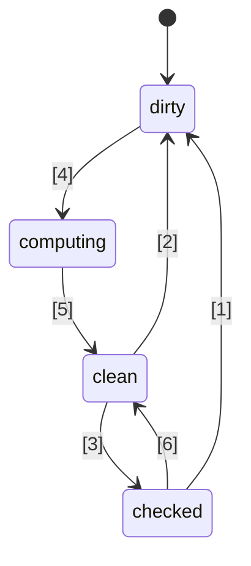
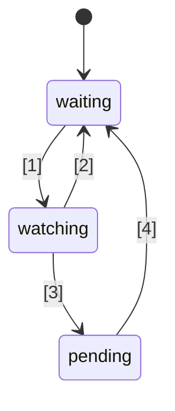

# 🚦 JavaScript Signals Standardvorschlag 🚦


Stufe 1 ([Erklärung](https://tc39.es/process-document/))

TC39-Proposal-Champions: Daniel Ehrenberg, Yehuda Katz, Jatin Ramanathan, Shay Lewis, Kristen Hewell Garrett, Dominic Gannaway, Preston Sego, Milo M, Rob Eisenberg

Ursprüngliche Autoren: Rob Eisenberg und Daniel Ehrenberg

Dieses Dokument beschreibt eine frühe gemeinsame Richtung für Signals in JavaScript, ähnlich wie die Promises/A+-Initiative, die den von TC39 in ES2015 standardisierten Promises vorausging. Probiere es selbst aus, mit [einem Polyfill](https://github.com/proposal-signals/signal-polyfill).

Ähnlich wie bei Promises/A+ konzentriert sich dieser Ansatz darauf, das JavaScript-Ökosystem abzustimmen. Wenn diese Abstimmung erfolgreich ist, könnte daraus ein Standard entstehen, basierend auf diesen Erfahrungen. Mehrere Framework-Autoren arbeiten hier an einem gemeinsamen Modell, das den Kern ihrer Reaktivität unterstützen könnte. Der aktuelle Entwurf basiert auf Design-Inputs der Autoren/Maintainer von [Angular](https://angular.io/), [Bubble](https://bubble.io/), [Ember](https://emberjs.com/), [FAST](https://www.fast.design/), [MobX](https://mobx.js.org/), [Preact](https://preactjs.com/), [Qwik](https://qwik.dev/), [RxJS](https://rxjs.dev/), [Solid](https://www.solidjs.com/), [Starbeam](https://www.starbeamjs.com/), [Svelte](https://svelte.dev/), [Vue](https://vuejs.org/), [Wiz](https://blog.angular.io/angular-and-wiz-are-better-together-91e633d8cd5a) und weiteren...

Anders als bei Promises/A+ versuchen wir nicht, eine gemeinsame, für Entwickler sichtbare Oberflächen-API zu lösen, sondern vielmehr die präzisen Kernsemantiken des zugrunde liegenden Signal-Graphen. Dieser Vorschlag beinhaltet zwar eine vollständig konkrete API, aber die API ist nicht für die meisten Anwendungsentwickler gedacht. Stattdessen ist die hier vorgestellte Signal-API besser geeignet, um von Frameworks als Basis verwendet zu werden und Interoperabilität durch einen gemeinsamen Signal-Graphen und Auto-Tracking-Mechanismus bereitzustellen.

Der Plan für diesen Vorschlag ist, zunächst umfangreiche frühe Prototypen zu entwickeln, einschließlich der Integration in mehrere Frameworks, bevor über Stufe 1 hinausgegangen wird. Wir sind nur daran interessiert, Signals zu standardisieren, wenn sie sich in der Praxis in mehreren Frameworks als nützlich erweisen und echte Vorteile gegenüber von Frameworks bereitgestellten Signals bieten. Wir hoffen, dass umfangreiche frühe Prototypen uns diese Informationen liefern werden. Siehe unten „Status und Entwicklungsplan“ für weitere Details.

## Hintergrund: Warum Signals?

Um eine komplexe Benutzeroberfläche (UI) zu entwickeln, müssen JavaScript-Anwendungsentwickler den Zustand der Anwendung effizient speichern, berechnen, ungültig machen, synchronisieren und an die Ansichtsschicht weitergeben. UIs beinhalten häufig mehr als nur das Verwalten einfacher Werte, sondern oft das Rendern von berechnetem Zustand, der von einem komplexen Baum anderer Werte oder Zustände abhängt, die selbst wieder berechnet werden. Das Ziel von Signals ist es, Infrastruktur bereitzustellen, um solchen Anwendungszustand zu verwalten, sodass sich Entwickler auf die Geschäftslogik konzentrieren können, anstatt auf diese sich wiederholenden Details.

Signal-ähnliche Konstrukte haben sich auch unabhängig in Nicht-UI-Kontexten als nützlich erwiesen, insbesondere in Build-Systemen, um unnötige Neu-Builds zu vermeiden.

Signals werden im reaktiven Programmieren verwendet, um die Notwendigkeit der manuellen Aktualisierungsverwaltung in Anwendungen zu eliminieren.

> Ein deklaratives Programmiermodell für Aktualisierungen, die auf Zustandsänderungen basieren.

aus _[What is Reactivity?](https://www.pzuraq.com/blog/what-is-reactivity)_.

#### Beispiel – Ein VanillaJS-Zähler

Angenommen, du hast eine Variable `counter` und möchtest im DOM anzeigen, ob der Zähler gerade oder ungerade ist. Immer wenn sich der `counter` ändert, soll das DOM mit der aktuellen Parität aktualisiert werden. In Vanilla JS könnte das so aussehen:

```js
let counter = 0;
const setCounter = (value) => {
  counter = value;
  render();
};

const isEven = () => (counter & 1) == 0;
const parity = () => isEven() ? "even" : "odd";
const render = () => element.innerText = parity();

// Simuliere externe Updates am counter...
setInterval(() => setCounter(counter + 1), 1000);
```
> [!HINWEIS]  
> Globals werden hier nur zu Demonstrationszwecken verwendet. Für ordentliches Zustandsmanagement gibt es viele Lösungen, und die Beispiele in diesem Vorschlag sollen so minimal wie möglich gehalten sein. Dieser Vorschlag empfiehlt keine globalen Variablen.


Dies hat eine Reihe von Problemen...

* Die Einrichtung von `counter` ist umständlich und boilerplate-lastig.
* Der Zustand von `counter` ist eng mit dem Rendering-System gekoppelt.
* Wenn sich `counter` ändert, aber `parity` nicht (z. B. von 2 auf 4), berechnen wir Parität und Rendering unnötig.
* Was, wenn ein anderer UI-Teil nur beim Update von `counter` rendern möchte?
* Was, wenn ein anderer UI-Teil nur von `isEven` oder `parity` abhängt?

Selbst in diesem relativ einfachen Szenario treten schnell mehrere Probleme auf. Wir könnten versuchen, diese zu umgehen, indem wir Pub/Sub für `counter` einführen. Dadurch könnten weitere Konsumenten von `counter` eigene Reaktionen auf Zustandsänderungen abonnieren.

Wir bleiben aber dennoch bei folgenden Problemen stecken:

* Die Renderfunktion, die nur von `parity` abhängt, muss dennoch „wissen“, dass sie eigentlich `counter` abonnieren muss.
* Es ist nicht möglich, die UI nur auf Basis von `isEven` oder `parity` zu aktualisieren, ohne direkt mit `counter` zu interagieren.
* Wir haben unseren Boilerplate erhöht. Immer, wenn man etwas verwendet, reicht es nicht, einfach eine Funktion aufzurufen oder eine Variable zu lesen, sondern man muss abonnieren und dort Updates durchführen. Das Management der Abmeldung ist zudem besonders kompliziert.

Nun könnten wir einige Probleme lösen, indem wir Pub/Sub nicht nur auf `counter`, sondern auch auf `isEven` und `parity` anwenden. Wir müssten dann `isEven` auf `counter`, `parity` auf `isEven` und `render` auf `parity` abonnieren. Leider ist unser Boilerplate-Code dadurch explodiert, und wir haben eine Menge Verwaltungsaufwand bei den Abonnements – sowie potenzielle Speicherleck-Probleme, wenn wir nicht alles richtig aufräumen. Wir haben also einige Probleme gelöst, aber eine ganz neue Kategorie an Problemen und viel zusätzlichen Code geschaffen. Schlimmer noch: Wir müssen diesen gesamten Prozess für jedes einzelne Stück Zustand im System wiederholen.

### Einführung von Signals

Datenbindungsabstraktionen in UIs für Modell und Ansicht sind seit Langem Kernbestandteil von UI-Frameworks über viele Programmiersprachen hinweg, obwohl es einen solchen Mechanismus weder in JS noch in der Web-Plattform selbst gibt. Innerhalb von JS-Frameworks und -Bibliotheken gab es viele Experimente mit verschiedenen Wegen, diese Bindung darzustellen, und die Erfahrung hat die Stärke von Einweg-Datenflüssen gemeinsam mit einem erstklassigen Datentyp gezeigt, der eine Zelle mit Zustand oder Berechnung aus anderen Daten repräsentiert – heute oft „Signals“ genannt.

Dieser erstklassige, reaktive Wertansatz scheint erstmals in populären Open-Source-JavaScript-Webframeworks mit [Knockout](https://knockoutjs.com/) [im Jahr 2010](https://blog.stevensanderson.com/2010/07/05/introducing-knockout-a-ui-library-for-javascript/) aufgetaucht zu sein. In den Jahren danach wurden viele Varianten und Implementierungen geschaffen. In den letzten 3–4 Jahren hat das Signal-Primitiv und verwandte Ansätze weiter an Popularität gewonnen, sodass mittlerweile fast jede moderne JavaScript-Bibliothek oder jedes Framework etwas Ähnliches besitzt, unter welchem Namen auch immer.

Um Signals zu verstehen, schauen wir uns das obige Beispiel an, neu gedacht mit einer weiter unten erläuterten Signal-API.

#### Beispiel – Ein Signals-Zähler

```js
const counter = new Signal.State(0);
const isEven = new Signal.Computed(() => (counter.get() & 1) == 0);
const parity = new Signal.Computed(() => isEven.get() ? "even" : "odd");

// Eine Bibliothek oder ein Framework definiert Effekte basierend auf anderen Signal-Primitiven
declare function effect(cb: () => void): (() => void);

effect(() => element.innerText = parity.get());

// Simuliere externe Updates am counter...
setInterval(() => counter.set(counter.get() + 1), 1000);
```

Einige Dinge fallen sofort auf:
* Wir haben das umständliche Boilerplate rund um die Variable `counter` aus dem vorherigen Beispiel entfernt.
* Es gibt eine einheitliche API für Werte, Berechnungen und Seiteneffekte.
* Es gibt kein Problem mit zirkulären Referenzen oder verkehrten Abhängigkeiten zwischen `counter` und `render`.
* Es gibt keine manuellen Abonnements und keinen Verwaltungsaufwand.
* Es gibt eine Möglichkeit, das Timing/Scheduling von Seiteneffekten zu steuern.

Signals bieten uns noch viel mehr, als auf den ersten Blick an der API sichtbar ist:
* **Automatische Abhängigkeitsverfolgung** – Ein berechnetes Signal erkennt automatisch alle anderen Signale, von denen es abhängig ist, unabhängig davon, ob es sich dabei um einfache Werte oder andere Berechnungen handelt.
* **Träge Auswertung (Lazy Evaluation)** – Berechnungen werden nicht sofort beim Deklarieren ausgeführt, noch werden sie sofort ausgewertet, wenn sich ihre Abhängigkeiten ändern. Sie werden nur dann ausgewertet, wenn ihr Wert explizit angefordert wird.
* **Memoisierung** – Berechnete Signale speichern ihren letzten Wert im Cache, sodass Berechnungen, deren Abhängigkeiten sich nicht geändert haben, nicht erneut ausgewertet werden müssen, egal wie oft darauf zugegriffen wird.

## Motivation für die Standardisierung von Signals

#### Interoperabilität

Jede Signal-Implementierung hat ihren eigenen Mechanismus zur automatischen Verfolgung, um die Quellen nachzuhalten, die beim Auswerten eines berechneten Signals angetroffen werden. Dies erschwert das Teilen von Modellen, Komponenten und Bibliotheken zwischen verschiedenen Frameworks—sie sind häufig fälschlich an ihre View-Engine gekoppelt (da Signale meist als Teil von JS-Frameworks implementiert sind).

Ein Ziel dieses Vorschlags ist es, das reaktive Modell vollständig von der Rendering-Ansicht zu entkoppeln, sodass Entwickler auf neue Rendering-Technologien migrieren können, ohne ihren Nicht-UI-Code neu schreiben zu müssen, oder geteilte reaktive Modelle in JS zu entwickeln, die in verschiedenen Kontexten eingesetzt werden können. Leider hat sich wegen Versionierung und Duplizierung herausgestellt, dass ein hohes Maß an Teilbarkeit über JS-Bibliotheken praktisch nicht erreichbar ist—Built-ins bieten eine stärkere Teilungsgarantie.

#### Performance/Speichernutzung

Es ist immer ein kleiner potentieller Performance-Vorteil, weniger Code auszuliefern, da häufig genutzte Bibliotheken als Built-in vorhanden sind, aber die Implementierungen von Signals sind generell recht klein, sodass dieser Effekt nicht sehr groß ausfallen dürfte.

Wir vermuten, dass native C++-Implementierungen von Signal-bezogenen Datenstrukturen und Algorithmen geringfügig effizienter sein können als das, was in JS erreichbar ist, und zwar um einen konstanten Faktor. Allerdings werden keine algorithmischen Änderungen gegenüber dem erwartet, was in einem Polyfill vorhanden wäre; von Engines wird hier keine Magie erwartet, und die Reaktivitätsalgorithmen selbst werden klar und eindeutig definiert.

Die Champion-Gruppe erwartet, verschiedene Implementierungen von Signals zu entwickeln und damit diese Performance-Möglichkeiten zu untersuchen.

#### DevTools

Mit bestehenden JS-Signal-Bibliotheken ist es schwierig, Dinge wie Folgendes nachzuvollziehen:
* Den Callstack über eine Kette von berechneten Signalen hinweg, um die Kausalkette eines Fehlers zu zeigen
* Den Referenzgraphen zwischen Signalen, wenn eines von einem anderen abhängt – wichtig beim Debuggen von Speicherverbrauch

Eingebaute Signals ermöglichen es JS-Runtimes und DevTools, potenziell eine bessere Unterstützung für die Inspektion von Signals zu bieten, insbesondere für Debugging oder Performance-Analysen, sei es direkt in Browsern oder durch eine gemeinsame Erweiterung. Bestehende Tools wie der Elementinspektor, Performance-Snapshot und Speicher-Profiler könnten aktualisiert werden, um Signals in ihrer Darstellung speziell hervorzuheben.

#### Sekundäre Vorteile

##### Vorteile einer Standardbibliothek

JavaScript hatte im Allgemeinen eine relativ minimale Standardbibliothek, aber ein Trend im TC39 ist es, JS zu einer „batteries included“-Sprache zu machen, mit einer hochwertigen, eingebauten Funktionssammlung. Beispielsweise ersetzt Temporal moment.js, und eine Reihe kleiner Features, z. B. `Array.prototype.flat` und `Object.groupBy`, ersetzen viele lodash-Anwendungsfälle. Vorteile sind kleinere Bundle-Größen, verbesserte Stabilität und Qualität, weniger zu lernen beim Einstieg in ein neues Projekt und ein allgemein gemeinsamer Wortschatz unter JS-Entwicklern.

##### HTML/DOM-Integration (eine mögliche Zukunft)

Aktuelle Arbeiten im W3C und von Browser-Implementierern zielen darauf ab, natives Templating in HTML zu bringen ([DOM Parts][wicg-pr-1023] und [Template Instantiation][wicg-propsal-template-instantiation]). Zusätzlich untersucht die W3C Web Components CG die Möglichkeit, Web Components um eine voll deklarative HTML-API zu erweitern. Um beide Ziele zu erreichen, wird HTML irgendwann ein reaktives Primitive benötigen. Zusätzlich sind viele ergonomische Verbesserungen für das DOM durch die Integration von Signals vorstellbar und wurden bereits von der Community gewünscht.

[wicg-pr-1023]: https://github.com/WICG/webcomponents/pull/1023
[wicg-propsal-template-instantiation]: https://github.com/WICG/webcomponents/blob/gh-pages/proposals/Template-Instantiation.md

> Hinweis: Diese Integration wäre eine separate, später folgende Initiative und nicht Teil dieses Vorschlags selbst.

##### Informationsaustausch im Ökosystem (*kein* Grund für die Standardisierung)

Standardisierungsbemühungen können manchmal auch auf „Community“-Ebene hilfreich sein, selbst ohne Änderungen in Browsern. Die Signals-Initiative bringt viele verschiedene Framework-Autoren für eine intensive Diskussion über die Natur von Reaktivität, Algorithmen und Interoperabilität zusammen. Das war bereits nützlich, rechtfertigt aber nicht die Aufnahme in JS-Engines und Browser; Signals sollten nur dann in den JavaScript-Standard aufgenommen werden, wenn es signifikante Vorteile *über* den durch den Informationsaustausch ermöglichten Ökosystemnutzen hinaus gibt.

## Designziele für Signals

Es stellt sich heraus, dass bestehende Signal-Bibliotheken im Kern gar nicht so unterschiedlich sind. Dieser Vorschlag will auf deren Erfolg aufbauen, indem er die wichtigen Qualitäten vieler dieser Bibliotheken implementiert.

### Zentrale Eigenschaften

* Ein Signal-Typ, der Zustand repräsentiert, d. h. ein beschreibbares Signal. Dies ist ein Wert, den andere lesen können.
* Ein berechneter/memoisierter/abgeleiteter Signal-Typ, der von anderen abhängt und träge berechnet und zwischengespeichert wird.
    * Die Berechnung ist träge, d. h. berechnete Signale werden nicht erneut berechnet, wenn eine ihrer Abhängigkeiten sich ändert, sondern nur, wenn tatsächlich jemand sie liest.
    * Die Berechnung ist "[glitch](https://de.wikipedia.org/wiki/Reaktives_Programmieren#Glitches)-frei", d. h. es werden niemals unnötige Berechnungen durchgeführt. Das bedeutet, dass beim Lesen eines berechneten Signals eine topologische Sortierung der potenziell „verschmutzten“ Teile des Graphen durchgeführt wird, um Duplikate auszuschließen.
    * Die Berechnung ist zwischengespeichert, d. h. wenn sich nach der letzten Änderung einer Abhängigkeit keine weitere Abhängigkeit ändert, wird das berechnete Signal beim Zugriff *nicht* neu berechnet.
    * Benutzerdefinierte Vergleiche sind sowohl für berechnete als auch für Zustands-Signale möglich, um festzustellen, wann weitere berechnete Signale, die von ihnen abhängen, aktualisiert werden sollten.
* Reaktionen auf den Zustand, bei dem ein berechnetes Signal eine seiner Abhängigkeiten (oder verschachtelte Abhängigkeiten) „dirty“ und geändert hat, was bedeutet, dass der Wert des Signals möglicherweise veraltet ist.
    * Diese Reaktion soll ermöglichen, später größere Arbeiten einzuplanen.
    * Effekte werden in Bezug auf diese Reaktionen sowie Framework-internes Scheduling implementiert.
    * Berechnete Signale müssen erkennen können, ob sie als (verschachtelte) Abhängigkeit einer dieser Reaktionen registriert sind.
* Ermöglicht JS-Frameworks, ihr eigenes Scheduling zu betreiben. Kein Promise-ähnliches, verpflichtendes Built-in-Scheduling.
    * Synchrone Reaktionen sind notwendig, um späteres Scheduling auf Basis von Framework-Logik zu ermöglichen.
    * Schreiboperationen sind synchron und wirken sofort (ein Framework, das Schreibvorgänge bündelt, kann das darauf aufbauend umsetzen).
    * Es ist möglich, das Prüfen, ob ein Effekt „dirty“ sein könnte, von der tatsächlichen Ausführung des Effekts zu trennen (ermöglicht einen zweistufigen Effekt-Scheduler).
* Möglichkeit, Signals *ohne* Erfassung von Abhängigkeiten zu lesen (`untrack`)
* Ermöglicht die Komposition verschiedener Codebasen, die Signals/Reaktivität verwenden, z. B.
    * Nutzung mehrerer Frameworks im Hinblick auf Tracking/Reaktivität (mit Einschränkungen, siehe unten)
    * Framework-unabhängige reaktive Datenstrukturen (z. B. rekursiver reaktiver Store-Proxy, reaktive Map, Set und Array usw.)

### Korrektheit (Soundness)

* Naive Fehlanwendung synchroner Reaktionen verhindern/unterbinden.
    * Risiko für Korrektheit: Es können "[Glitches](https://de.wikipedia.org/wiki/Reaktives_Programmieren#Glitches)" auftreten, wenn sie unsachgemäß verwendet werden: Wenn das Rendern sofort beim Setzen eines Signals erfolgt, kann dem Endnutzer ein unvollständiger Anwendungszustand angezeigt werden. Daher sollte dieses Feature nur dazu dienen, Arbeiten für später intelligent einzuplanen, nachdem die Anwendungslogik abgeschlossen ist.
    * Lösung: Das Lesen und Schreiben von beliebigen Signalen innerhalb eines synchronen Reaktions-Callbacks verbieten.
* `untrack` entmutigen und seine unsichere Natur kennzeichnen
    * Risiko für Korrektheit: Erlaubt die Erstellung von berechneten Signalen, deren Wert von anderen Signalen abhängt, die aber nicht aktualisiert werden, wenn sich diese Signale ändern. Es sollte verwendet werden, wenn ungetrackte Zugriffe das Berechnungsergebnis nicht verändern.
    * Lösung: Die API wird im Namen als "unsafe" gekennzeichnet.
* Hinweis: Dieser Vorschlag erlaubt es, dass Signale sowohl aus berechneten als auch aus Effekt-Signalen gelesen und geschrieben werden, ohne Schreibvorgänge nach Lesevorgängen einzuschränken, trotz des Korrektheitsrisikos. Diese Entscheidung wurde getroffen, um Flexibilität und Kompatibilität bei der Integration mit Frameworks zu bewahren.

### Oberflächen-API

* Muss eine solide Grundlage für mehrere Frameworks bieten, um ihre Signals-/Reaktivitätsmechanismen zu implementieren.
    * Sollte eine gute Basis für rekursive Store-Proxys, dekorator-basierte Klassenfeld-Reaktivität und sowohl `.value`- als auch `[state, setState]`-APIs sein.
    * Die Semantik muss die gültigen Muster abbilden können, die durch verschiedene Frameworks ermöglicht werden. Beispielsweise sollte es möglich sein, dass diese Signals entweder die Grundlage für sofort reflektierte oder später gebündelte Schreibvorgänge sind.
* Es wäre wünschenswert, wenn diese API direkt von JavaScript-Entwicklern genutzt werden könnte.
    * Wenn ein Feature mit einem Ökosystem-Konzept übereinstimmt, ist es gut, eine gemeinsame Terminologie zu verwenden.
        * Allerdings ist es wichtig, nicht exakt dieselben Namen zu verwenden!
    * Spannungsfeld zwischen „Nutzbarkeit für JS-Entwickler“ und „Bereitstellung aller Hooks für Frameworks“.
        * Idee: Alle Hooks bereitstellen, aber Fehler einbauen, wenn sie falsch verwendet werden.
        * Idee: Subtile APIs in einen `subtle`-Namespace legen, ähnlich wie [`crypto.subtle`](https://developer.mozilla.org/en-US/docs/Web/API/Crypto/subtle), um die Trennung zwischen APIs für fortgeschrittene Nutzung (Framework-Implementierung, Dev-Tools) und für alltägliche Entwicklung (Signale instanziieren) zu markieren.
* Muss mit guter Performance implementierbar und nutzbar sein – die Oberflächen-API darf nicht zu viel Overhead verursachen.
    * Subklassifizierung ermöglichen, damit Frameworks eigene Methoden und Felder (auch private Felder) hinzufügen können. Das ist wichtig, um zusätzliche Allokationen auf Framework-Ebene zu vermeiden. Siehe „Speicherverwaltung“ unten.

### Speicherverwaltung

* Wenn möglich: Ein berechnetes Signal sollte vom Garbage Collector entsorgt werden können, wenn es von nichts Lebendigem mehr für zukünftige Lesevorgänge referenziert wird, selbst wenn es in einen größeren Graphen eingebunden ist, der weiterlebt (z. B. durch das Lesen eines weiterhin lebendigen States).
* Beachten Sie, dass die meisten Frameworks heutzutage eine explizite Entsorgung von berechneten Signals erfordern, wenn sie eine Referenz zu oder von einem anderen Signal-Graphen haben, der weiterhin existiert.
* Das ist am Ende nicht so schlimm, wenn ihre Lebensdauer an die Lebensdauer einer UI-Komponente gebunden ist und Effekte ohnehin entsorgt werden müssen.
* Falls die Ausführung mit diesen Semantiken zu aufwendig ist, sollten wir die explizite Entsorgung (oder das „Unlinken“) von berechneten Signals zur untenstehenden API hinzufügen, die dies derzeit nicht vorsieht.
* Ein weiteres, verwandtes Ziel: Minimierung der Anzahl von Allokationen, z. B.:
    * um ein beschreibbares Signal zu erstellen (Vermeidung von zwei separaten Closures + Array)
    * zur Implementierung von Effekten (Vermeidung einer Closure für jede einzelne Reaktion)
    * In der API zur Beobachtung von Signal-Änderungen die Erstellung zusätzlicher temporärer Datenstrukturen vermeiden
    * Lösung: Klassenbasierte API, die die Wiederverwendung von Methoden und Feldern ermöglicht, die in Unterklassen definiert sind

## API-Skizze

Eine erste Idee einer Signal-API folgt unten. Beachten Sie, dass dies nur ein früher Entwurf ist und wir im Laufe der Zeit mit Änderungen rechnen. Beginnen wir mit dem vollständigen `.d.ts`, um einen Eindruck von der Gesamtstruktur zu bekommen, und anschließend besprechen wir die Details, was das alles bedeutet.

```ts
interface Signal<T> {
    // Den Wert des Signals abrufen
    get(): T;
}

namespace Signal {
    // Ein les- und schreibbares Signal
    class State<T> implements Signal<T> {
        // Erstellt ein State-Signal mit dem Startwert t
        constructor(t: T, options?: SignalOptions<T>);

        // Den Wert des Signals abrufen
        get(): T;

        // Den Wert des State-Signals auf t setzen
        set(t: T): void;
    }

    // Ein Signal, das eine Formel auf Basis anderer Signals ist
    class Computed<T = unknown> implements Signal<T> {
        // Erstellt ein Signal, das auf den vom Callback zurückgegebenen Wert evaluiert wird.
        // Callback wird mit diesem Signal als this-Wert aufgerufen.
        constructor(cb: (this: Computed<T>) => T, options?: SignalOptions<T>);

        // Den Wert des Signals abrufen
        get(): T;
    }

    // Dieser Namespace enthält „fortgeschrittene“ Funktionen, die besser
    // Framework-Autoren als Anwendungsentwicklern überlassen werden.
    // Analog zu `crypto.subtle`
    namespace subtle {
        // Einen Callback ausführen, während jegliches Tracking deaktiviert ist
        function untrack<T>(cb: () => T): T;

        // Das aktuell berechnete Signal abrufen, das Signal-Lesezugriffe verfolgt, falls vorhanden
        function currentComputed(): Computed | null;

        // Gibt eine geordnete Liste aller Signals zurück, auf die dieses Signal
        // bei der letzten Auswertung referenziert hat.
        // Für einen Watcher listet es die Menge der Signals auf, die überwacht werden.
        function introspectSources(s: Computed | Watcher): (State | Computed)[];

        // Gibt die Watcher zurück, in denen dieses Signal enthalten ist, sowie alle
        // Computed-Signals, die dieses Signal beim letzten Mal ausgelesen haben,
        // falls dieses Computed-Signal (rekursiv) überwacht wird.
        function introspectSinks(s: State | Computed): (Computed | Watcher)[];

        // True, wenn dieses Signal „live“ ist, d. h. von einem Watcher überwacht wird
        // oder von einem Computed-Signal ausgelesen wird, das (rekursiv) live ist.
        function hasSinks(s: State | Computed): boolean;

        // True, wenn dieses Element „reaktiv“ ist, d. h. von einem anderen Signal abhängt.
        // Ein Computed, bei dem hasSources false ist,
        // gibt immer denselben konstanten Wert zurück.
        function hasSources(s: Computed | Watcher): boolean;

        class Watcher {
            // Wenn eine (rekursive) Quelle des Watchers beschrieben wird, diesen Callback aufrufen,
            // falls er seit dem letzten `watch`-Aufruf noch nicht aufgerufen wurde.
            // Während des Notify-Vorgangs dürfen keine Signals gelesen oder beschrieben werden.
            constructor(notify: (this: Watcher) => void);

            // Diese Signals zum Set des Watchers hinzufügen und festlegen, dass der Watcher seinen
            // Notify-Callback beim nächsten Mal ausführt, wenn sich eines der Signals im Set
            // (oder eine ihrer Abhängigkeiten) ändert.
            // Kann ohne Argumente aufgerufen werden, um lediglich den „notified“-Status zurückzusetzen,
            // sodass der Notify-Callback erneut aufgerufen wird.
            watch(...s: Signal[]): void;

            // Diese Signals aus dem überwachten Set entfernen (z. B. für einen entsorgten Effekt)
            unwatch(...s: Signal[]): void;

            // Gibt die Menge der Quellen im Set des Watchers zurück, die noch „dirty“ sind, oder ein berechnetes Signal,
            // dessen Quelle „dirty“ oder „pending“ ist und das noch nicht neu ausgewertet wurde
            getPending(): Signal[];
        }

        // Hooks, um das Beobachtetwerden oder Nicht-mehr-Beobachtetwerden zu beobachten
        var watched: Symbol;
        var unwatched: Symbol;
    }

    interface SignalOptions<T> {
        // Benutzerdefinierte Vergleichsfunktion zwischen altem und neuem Wert. Standard: Object.is.
        // Das Signal wird als this-Wert für den Kontext übergeben.
        equals?: (this: Signal<T>, t: T, t2: T) => boolean;
```
```ts
// Callback, der aufgerufen wird, wenn isWatched zu true wird, falls es zuvor false war
[Signal.subtle.watched]?: (this: Signal<T>) => void;

// Callback, der aufgerufen wird, wenn isWatched zu false wird, falls es zuvor true war
[Signal.subtle.unwatched]?: (this: Signal<T>) => void;
}
}
```

### Wie Signale funktionieren

Ein Signal repräsentiert eine Datenzelle, die sich im Laufe der Zeit ändern kann. Signale können entweder „state“ (nur ein Wert, der manuell gesetzt wird) oder „computed“ (eine Formel, die auf anderen Signalen basiert) sein.

Berechnete (Computed) Signale funktionieren, indem sie automatisch verfolgen, welche anderen Signale während ihrer Auswertung gelesen werden. Wenn ein berechnetes Signal gelesen wird, prüft es, ob sich eine seiner zuvor aufgezeichneten Abhängigkeiten geändert hat, und berechnet sich gegebenenfalls neu. Wenn mehrere berechnete Signale geschachtelt sind, wird die gesamte Attribution des Trackings dem innersten Signal zugeordnet.

Berechnete Signale sind lazy, d. h. pull-basiert: Sie werden nur dann neu berechnet, wenn sie abgerufen werden, selbst wenn sich eine ihrer Abhängigkeiten bereits früher geändert hat.

Der Callback, der in berechnete Signale übergeben wird, sollte im Allgemeinen „pure“ sein, also eine deterministische, nebenwirkungsfreie Funktion der anderen Signale, auf die zugegriffen wird. Gleichzeitig ist der Zeitpunkt, zu dem der Callback aufgerufen wird, deterministisch, sodass Nebenwirkungen mit Vorsicht eingesetzt werden können.

Signale verfügen über prominentes Caching/Memoisierung: Sowohl state- als auch computed-Signale merken sich ihren aktuellen Wert und lösen nur dann eine Neuberechnung von berechneten Signalen aus, die auf sie verweisen, wenn sie sich tatsächlich ändern. Ein wiederholter Vergleich von alten und neuen Werten ist nicht einmal nötig – der Vergleich findet einmal statt, wenn das Quellsignal zurückgesetzt/neu berechnet wird, und der Signalmechanismus verfolgt, welche Dinge, die auf dieses Signal verweisen, noch nicht anhand des neuen Werts aktualisiert wurden. Intern wird dies im Allgemeinen durch „Graph Coloring“ dargestellt, wie in (Milos Blogpost) beschrieben.

Berechnete Signale verfolgen ihre Abhängigkeiten dynamisch – jedes Mal, wenn sie ausgeführt werden, können sie von unterschiedlichen Dingen abhängen, und genau diese Abhängigkeitsmenge wird im Signalgraph aktuell gehalten. Das bedeutet: Wenn Sie eine Abhängigkeit nur in einem Zweig benötigen und die vorherige Berechnung den anderen Zweig genommen hat, wird eine Änderung des temporär ungenutzten Werts das berechnete Signal nicht neu berechnen, selbst wenn es abgerufen wird.

Im Gegensatz zu JavaScript-Promises läuft in Signalen alles synchron ab:
- Das Setzen eines Signals auf einen neuen Wert ist synchron, und dies wird sofort widergespiegelt, wenn anschließend ein berechnetes Signal, das davon abhängt, gelesen wird. Es gibt kein eingebautes Batching dieser Mutation.
- Das Lesen von berechneten Signalen ist synchron – ihr Wert ist immer verfügbar.
- Der `notify`-Callback in Watchern, wie unten erklärt, läuft synchron während des `.set()`-Aufrufs, der ihn ausgelöst hat (aber nachdem das Graph Coloring abgeschlossen ist).

Wie bei Promises können Signale einen Fehlerzustand darstellen: Wenn der Callback eines berechneten Signals einen Fehler wirft, wird dieser Fehler wie ein anderer Wert zwischengespeichert und bei jedem Lesen des Signals erneut ausgelöst.

### Verständnis der Signal-Klasse

Eine `Signal`-Instanz stellt die Fähigkeit dar, einen sich dynamisch ändernden Wert zu lesen, dessen Aktualisierungen im Laufe der Zeit verfolgt werden. Sie beinhaltet implizit auch die Fähigkeit, das Signal zu abonnieren, implizit durch einen getrackten Zugriff von einem anderen berechneten Signal aus.

Die API ist so gestaltet, dass sie dem groben Ökosystem-Konsens unter einem großen Teil der Signal-Bibliotheken bei der Verwendung von Namen wie „signal“, „computed“ und „state“ entspricht. Der Zugriff auf berechnete und state-Signale erfolgt jedoch über eine `.get()`-Methode, was von allen populären Signal-APIs abweicht, die entweder einen `.value`-ähnlichen Accessor oder `signal()`-Aufrufsyntax verwenden.

Die API ist so konzipiert, dass sie die Anzahl der Speicherzuweisungen reduziert, um Signale für die Einbettung in JavaScript-Frameworks geeignet zu machen und dabei die gleiche oder bessere Performance als bestehende framework-spezifische Signale zu erreichen. Dies bedeutet:
- State-Signale sind ein einzelnes schreibbares Objekt, das sowohl abgerufen als auch gesetzt werden kann, und zwar über dieselbe Referenz. (Siehe Implikationen unten im Abschnitt „Capability separation“.)
- Sowohl State- als auch Computed-Signale sind so gestaltet, dass sie unterklassenfähig sind, um Frameworks die Möglichkeit zu geben, zusätzliche Eigenschaften über öffentliche und private Klassenfelder (sowie Methoden zur Verwendung dieses Zustands) hinzuzufügen.
- Verschiedene Callbacks (z. B. `equals`, der Callback für berechnete Signale) werden mit dem jeweiligen Signal als `this`-Wert für den Kontext aufgerufen, sodass pro Signal kein neuer Closure benötigt wird. Der Kontext kann stattdessen in zusätzlichen Eigenschaften des Signals selbst gespeichert werden.

Einige von dieser API durchgesetzte Fehlerbedingungen:
- Es ist ein Fehler, ein berechnetes Signal rekursiv zu lesen.
- Der `notify`-Callback eines Watchers darf keine Signale lesen oder schreiben.
- Wenn der Callback eines berechneten Signals einen Fehler wirft, werden nachfolgende Zugriffe auf das Signal diesen zwischengespeicherten Fehler erneut auslösen, bis sich eine der Abhängigkeiten ändert und es neu berechnet wird.

Einige Bedingungen, die *nicht* erzwungen werden:
- Berechnete Signale können innerhalb ihres Callbacks synchron auf andere Signale schreiben.
- Arbeit, die von einem `notify`-Callback eines Watchers eingereiht wird, kann Signale lesen oder schreiben, sodass es möglich ist, [klassische React-Antipatterns](https://react.dev/learn/you-might-not-need-an-effect) in Bezug auf Signale zu replizieren!

### Effekte implementieren

Das oben definierte `Watcher`-Interface bildet die Grundlage für die Implementierung typischer JS-APIs für Effekte: Callbacks, die erneut ausgeführt werden, wenn sich andere Signale ändern, rein aufgrund ihrer Nebenwirkung. Die `effect`-Funktion, die oben im Anfangsbeispiel verwendet wurde, kann wie folgt definiert werden:

```ts
// Diese Funktion würde normalerweise in einer Bibliothek/einem Framework leben, nicht im Anwendungscode
// HINWEIS: Diese Scheduling-Logik ist zu einfach, um nützlich zu sein. Nicht kopieren/einfügen.
let pending = false;

let w = new Signal.subtle.Watcher(() => {
    if (!pending) {
        pending = true;
        queueMicrotask(() => {
            pending = false;
            for (let s of w.getPending()) s.get();
            w.watch();
        });
    }
});

// Ein Effekt-Signal, das cb auswertet und bei jeder potenziellen Änderung einer seiner Abhängigkeiten
// selbst auf die Microtask-Queue zur erneuten Auswertung plant
export function effect(cb) {
    let destructor;
    let c = new Signal.Computed(() => { destructor?.(); destructor = cb(); });
    w.watch(c);
    c.get();
    return () => { destructor?.(); w.unwatch(c) };
}
```

Die Signal-API enthält keine eingebaute Funktion wie `effect`. Das liegt daran, dass das Scheduling von Effekten subtil ist und oft mit Framework-Rendering-Zyklen und anderen Framework-spezifischen Zuständen oder Strategien zusammenhängt, auf die JS keinen Zugriff hat.

Ein Durchgang durch die hier verwendeten Operationen: Der `notify`-Callback, der an den Watcher-Konstruktor übergeben wird, ist die Funktion, die aufgerufen wird, wenn das Signal von einem „clean“-Zustand (bei dem der Cache initialisiert und gültig ist) in einen „checked“- oder „dirty“-Zustand wechselt (bei dem der Cache möglicherweise gültig ist oder nicht, weil sich mindestens einer der Zustände, von denen es rekursiv abhängt, geändert hat).

Aufrufe von `notify` werden letztlich durch einen Aufruf von `.set()` auf einem State-Signal ausgelöst. Dieser Aufruf ist synchron: Er erfolgt, bevor `.set` zurückkehrt. Aber es besteht kein Grund zur Sorge, dass dieser Callback den Signalgraphen in einem halbverarbeiteten Zustand beobachtet, da während eines `notify`-Callbacks kein Signal gelesen oder geschrieben werden kann, auch nicht in einem `untrack`-Aufruf. Da `notify` während `.set()` aufgerufen wird, unterbricht es einen anderen Logik-Thread, der möglicherweise nicht abgeschlossen ist. Um Signale aus `notify` zu lesen oder zu schreiben, planen Sie Arbeiten für später ein, z. B. indem Sie das Signal in eine Liste eintragen, damit es später abgerufen werden kann, oder mit `queueMicrotask` wie oben.

Beachten Sie, dass es durchaus möglich ist, Signale effektiv ohne `Signal.subtle.Watcher` zu verwenden, indem man das Polling von berechneten Signalen plant, wie es Glimmer tut. Viele Frameworks haben jedoch festgestellt, dass es sehr oft nützlich ist, diese Scheduling-Logik synchron auszuführen, weshalb die Signals-API dies vorsieht.

Sowohl berechnete als auch state-Signale werden wie alle JS-Werte vom Garbage Collector aufgeräumt. Watcher haben jedoch eine besondere Möglichkeit, Dinge am Leben zu halten: Alle Signale, die von einem Watcher beobachtet werden, werden so lange am Leben gehalten, wie einer der zugrundeliegenden States erreichbar ist, da diese einen zukünftigen `notify`-Aufruf (und dann ein zukünftiges `.get()`) auslösen können. Aus diesem Grund sollten Sie daran denken, `Watcher.prototype.unwatch` aufzurufen, um Effekte aufzuräumen.

### Eine unsichere Hintertür

`Signal.subtle.untrack` ist eine Hintertür, die das Lesen von Signalen *ohne* Verfolgung dieser Lesezugriffe ermöglicht. Diese Fähigkeit ist unsicher, weil sie die Erstellung von berechneten Signalen erlaubt, deren Wert von anderen Signalen abhängt, die jedoch nicht aktualisiert werden, wenn sich diese Signale ändern. Sie sollte verwendet werden, wenn die ungetrackten Zugriffe das Ergebnis der Berechnung nicht verändern werden.

<!--
TODO: Beispiel zeigen, in dem es sinnvoll ist, untrack zu verwenden

### Verwendung von watched/unwatched
```
TODO: Beispiel zeigen, wie ein Observable in ein berechnetes Signal umgewandelt wird, das nur abonniert wird, wenn es von einem Effekt verwendet wird

TODO: Beispiel zeigen, wie ein berechnetes Signal das Ergebnis eines Fetch darstellt, das auf einen Zustand gerichtet ist und abgebrochen wird

### Introspektion für SSR

TODO: Zeigen, wie die Serialisierung des Signalgraphen funktioniert

TODO: Zeigen, wie man ein Signal später von State zu Computed „hydratisieren“ kann, unter Verwendung einiger Signale.
-->

### Vorerst weggelassen

Diese Funktionen könnten später hinzugefügt werden, sind aber im aktuellen Entwurf nicht enthalten. Ihr Fehlen ist auf den Mangel an etabliertem Konsens im Designraum unter den Frameworks sowie auf die nachgewiesene Möglichkeit zurückzuführen, ihr Fehlen mit Mechanismen auf Grundlage des in diesem Dokument beschriebenen Signals-Konzepts zu umgehen. Leider begrenzt das Weglassen jedoch das Potenzial der Interoperabilität zwischen Frameworks. Während Prototypen von Signals, wie in diesem Dokument beschrieben, entwickelt werden, wird geprüft, ob diese Auslassungen die richtige Entscheidung waren.

* **Async**: In diesem Modell sind Signale immer synchron zur Auswertung verfügbar. Es ist jedoch oft nützlich, bestimmte asynchrone Prozesse zu haben, die dazu führen, dass ein Signal gesetzt wird, und zu wissen, wann ein Signal noch „lädt“. Eine einfache Möglichkeit, den Ladezustand zu modellieren, ist mit Ausnahmen, und das Ausnahme-Caching-Verhalten von berechneten Signalen lässt sich mit dieser Technik einigermaßen sinnvoll kombinieren. Verbesserte Techniken werden in [Issue #30](https://github.com/proposal-signals/proposal-signals/issues/30) diskutiert.
* **Transaktionen**: Für Übergänge zwischen Ansichten ist es oft nützlich, einen Live-Zustand für sowohl den „von“- als auch den „zu“-Zustand zu halten. Der „zu“-Zustand wird im Hintergrund gerendert, bis er bereit ist, übernommen zu werden (Abschluss der Transaktion), während der „von“-Zustand interaktiv bleibt. Das gleichzeitige Beibehalten beider Zustände erfordert das „Forken“ des Zustands des Signalgraphen, und es kann sogar nützlich sein, mehrere ausstehende Übergänge gleichzeitig zu unterstützen. Diskussion in [Issue #73](https://github.com/proposal-signals/proposal-signals/issues/73).

Einige mögliche [Convenience-Methoden](https://github.com/proposal-signals/proposal-signals/issues/32) werden ebenfalls ausgelassen.

## Status und Entwicklungsplan

Dieser Vorschlag steht auf der TC39-Agenda für April 2024 für Stage 1. Er kann derzeit als „Stage 0“ betrachtet werden.

[Ein Polyfill](https://github.com/proposal-signals/signal-polyfill) für diesen Vorschlag ist verfügbar, mit einigen grundlegenden Tests. Einige Framework-Autoren haben begonnen, mit dem Austausch dieser Signal-Implementierung zu experimentieren, aber diese Nutzung befindet sich noch in einem frühen Stadium.

Die Mitwirkenden am Signal-Vorschlag möchten bei der Weiterentwicklung dieses Vorschlags besonders **konservativ** vorgehen, um nicht in die Falle zu tappen, etwas zu veröffentlichen, das wir später bereuen und tatsächlich nicht nutzen. Unser Plan ist es, die folgenden zusätzlichen Aufgaben, die nicht vom TC39-Prozess gefordert werden, durchzuführen, um sicherzustellen, dass dieser Vorschlag auf dem richtigen Weg ist:

Vor der Beantragung von Stage 2 planen wir:
- Entwicklung mehrerer produktionsreifer Polyfill-Implementierungen, die solide, gut getestet (z. B. bestehen Tests verschiedener Frameworks sowie Test262-ähnliche Tests) und in Bezug auf die Leistung wettbewerbsfähig sind (wie durch einen umfassenden Signal/Framework-Benchmark-Satz überprüft).
- Integration der vorgeschlagenen Signal-API in eine Vielzahl von JS-Frameworks, die wir als einigermaßen repräsentativ betrachten, und einige große Anwendungen arbeiten auf dieser Basis. Testen, ob sie in diesen Kontexten effizient und korrekt funktioniert.
- Ein solides Verständnis für den Raum möglicher Erweiterungen der API haben und entschieden haben, welche (falls überhaupt) in diesen Vorschlag aufgenommen werden sollten.

## Signal-Algorithmen

In diesem Abschnitt wird jede der für JavaScript bereitgestellten APIs in Bezug auf die Algorithmen beschrieben, die sie implementieren. Dies kann als Proto-Spezifikation betrachtet werden und ist zu diesem frühen Zeitpunkt enthalten, um eine mögliche Semantik festzulegen, wobei Änderungen sehr offen sind.

Einige Aspekte des Algorithmus:
- Die Reihenfolge der Lesezugriffe auf Signale innerhalb eines Computed ist signifikant und zeigt sich in der Reihenfolge, in der bestimmte Callbacks (welcher `Watcher` aufgerufen wird, `equals`, der erste Parameter für `new Signal.Computed` und die `watched`/`unwatched`-Callbacks) ausgeführt werden. Das bedeutet, dass die Quellen eines berechneten Signals geordnet gespeichert werden müssen.
- Diese vier Callbacks können alle Ausnahmen auslösen, und diese Ausnahmen werden auf vorhersehbare Weise an den aufrufenden JS-Code weitergegeben. Die Ausnahmen beenden *nicht* die Ausführung dieses Algorithmus oder hinterlassen den Graphen in einem halb verarbeiteten Zustand. Für Fehler, die im `notify`-Callback eines Watchers ausgelöst werden, wird diese Ausnahme an den `.set()`-Aufruf gesendet, der sie ausgelöst hat, wobei ein AggregateError verwendet wird, wenn mehrere Ausnahmen ausgelöst wurden. Die anderen (einschließlich `watched`/`unwatched`?) werden im Wert des Signals gespeichert, um beim Lesen erneut ausgelöst zu werden, und ein solches erneut auslösendes Signal kann wie jedes andere mit einem normalen Wert als `~clean~` markiert werden.
- Es wird darauf geachtet, Zirkelbezüge in Fällen von berechneten Signalen zu vermeiden, die nicht „beobachtet“ werden (von einem Watcher beobachtet werden), sodass sie unabhängig von anderen Teilen des Signalgraphen vom Garbage Collector gesammelt werden können. Intern kann dies mit einem System von Generationsnummern implementiert werden, die immer gesammelt werden; beachten Sie, dass optimierte Implementierungen auch lokale, knotenspezifische Generationsnummern enthalten oder das Verfolgen einiger Nummern bei beobachteten Signalen vermeiden können.

### Versteckter globaler Zustand

Signal-Algorithmen müssen auf bestimmten globalen Zustand zugreifen. Dieser Zustand ist global für den gesamten Thread oder „Agent“.

- `computing`: Das innerste berechnete oder Effekt-Signal, das derzeit aufgrund eines `.get`- oder `.run`-Aufrufs neu ausgewertet wird, oder `null`. Anfangswert: `null`.
- `frozen`: Boolean, der angibt, ob gerade ein Callback ausgeführt wird, der erfordert, dass der Graph nicht verändert wird. Anfangswert: `false`.
- `generation`: Eine fortlaufende Ganzzahl, beginnend bei 0, wird verwendet, um zu verfolgen, wie aktuell ein Wert ist, und Zirkelbezüge zu vermeiden.

### Der `Signal`-Namensraum

`Signal` ist ein gewöhnliches Objekt, das als Namensraum für Signal-bezogene Klassen und Funktionen dient.

`Signal.subtle` ist ein ähnliches inneres Namensraum-Objekt.

### Die Klasse `Signal.State`

#### Interne Slots von `Signal.State`

- `value`: Der aktuelle Wert des State-Signals
- `equals`: Die Vergleichsfunktion, die beim Ändern von Werten verwendet wird
- `watched`: Der Callback, der aufgerufen wird, wenn das Signal von einem Effekt beobachtet wird
- `unwatched`: Der Callback, der aufgerufen wird, wenn das Signal nicht mehr von einem Effekt beobachtet wird
- `sinks`: Menge der beobachteten Signale, die von diesem abhängen

#### Konstruktor: `Signal.State(initialValue, options)`

1. Setze den `value` dieses Signals auf `initialValue`.
1. Setze das `equals` dieses Signals auf options?.equals
1. Setze das `watched` dieses Signals auf options?.[Signal.subtle.watched]
1. Setze das `unwatched` dieses Signals auf options?.[Signal.subtle.unwatched]
1. Setze das `sinks` dieses Signals auf die leere Menge

#### Methode: `Signal.State.prototype.get()`

1. Wenn `frozen` wahr ist, löse eine Ausnahme aus.
1. Wenn `computing` nicht `undefined` ist, füge dieses Signal zur `sources`-Menge von `computing` hinzu.
1. HINWEIS: Wir fügen `computing` erst dann zur `sinks`-Menge dieses Signals hinzu, wenn es von einem Watcher beobachtet wird.
1. Gib den `value` dieses Signals zurück.

#### Methode: `Signal.State.prototype.set(newValue)`

1. Wenn der aktuelle Ausführungskontext `frozen` ist, löse eine Ausnahme aus.
1. Führe den Algorithmus „Signal-Wert setzen“ mit diesem Signal und dem ersten Parameter für den Wert aus.
1. Wenn dieser Algorithmus `~clean~` zurückgab, gib undefined zurück.
1. Setze den `state` aller `sinks` dieses Signals auf (falls es sich um ein Computed Signal handelt) `~dirty~`, wenn sie zuvor clean waren, oder (falls es sich um einen Watcher handelt) `~pending~`, wenn er zuvor `~watching~` war.
1. Setze den `state` aller Computed-Signal-Abhängigkeiten der Sinks (rekursiv) auf `~checked~`, wenn sie zuvor `~clean~` waren (d. h. lasse Dirty-Markierungen bestehen), oder für Watcher auf `~pending~`, wenn zuvor `~watching~`.
1. Für jeden zuvor `~watching~` Watcher, der bei dieser rekursiven Suche gefunden wurde, dann in Tiefensuche-Reihenfolge:
    1. Setze `frozen` auf true.
    1. Rufe ihren `notify`-Callback auf (speichere dabei etwaige ausgelöste Ausnahmen, ignoriere aber den Rückgabewert von `notify`).
    1. Setze `frozen` wieder auf false.
    1. Setze den `state` des Watchers auf `~waiting~`.
1. Wenn bei den `notify`-Callbacks eine Ausnahme ausgelöst wurde, gib sie nach dem Ausführen aller `notify`-Callbacks an den Aufrufer weiter. Wenn mehrere Ausnahmen auftraten, fasse sie zu einem AggregateError zusammen und werfe diesen.
1. Gib undefined zurück.

### Die Klasse `Signal.Computed`

#### `Signal.Computed` Zustandsautomat
Der `state` eines Computed Signal kann einer der folgenden sein:

- `~clean~`: Der Wert des Signals ist vorhanden und als nicht veraltet bekannt.
- `~checked~`: Eine (indirekte) Quelle dieses Signals hat sich geändert; dieses Signal hat einen Wert, aber er _könnte_ veraltet sein. Ob er tatsächlich veraltet ist, wird erst bekannt, wenn alle unmittelbaren Quellen ausgewertet wurden.
- `~computing~`: Der Callback dieses Signals wird derzeit als Nebeneffekt eines `.get()`-Aufrufs ausgeführt.
- `~dirty~`: Entweder hat dieses Signal einen Wert, von dem bekannt ist, dass er veraltet ist, oder es wurde noch nie ausgewertet.

Der Übergangsgraph ist wie folgt:



Die Übergänge sind:
| Nummer | Von | Nach | Bedingung | Algorithmus |
| ------ | ---- | -- | --------- | ----------- |
| 1 | `~checked~` | `~dirty~` | Eine unmittelbare Quelle dieses Signals, die ein berechnetes Signal ist, wurde ausgewertet und ihr Wert hat sich geändert. | Algorithmus: veraltetes berechnetes Signal neu berechnen |
| 2 | `~clean~` | `~dirty~` | Eine unmittelbare Quelle dieses Signals, die ein State ist, wurde mit einem Wert gesetzt, der sich von ihrem vorherigen Wert unterscheidet. | Methode: `Signal.State.prototype.set(newValue)` |
| 3 | `~clean~` | `~checked~` | Eine rekursive, aber nicht unmittelbare Quelle dieses Signals, die ein State ist, wurde mit einem Wert gesetzt, der sich von ihrem vorherigen Wert unterscheidet. | Methode: `Signal.State.prototype.set(newValue)` |
| 4 | `~dirty~` | `~computing~` | Wir sind dabei, den `callback` auszuführen. | Algorithmus: veraltetes berechnetes Signal neu berechnen |
| 5 | `~computing~` | `~clean~` | Der `callback` hat die Auswertung beendet und entweder einen Wert zurückgegeben oder eine Ausnahme ausgelöst. | Algorithmus: veraltetes berechnetes Signal neu berechnen |
| 6 | `~checked~` | `~clean~` | Alle unmittelbaren Quellen dieses Signals wurden ausgewertet und es wurde festgestellt, dass sie unverändert sind, daher wissen wir jetzt, dass wir nicht veraltet sind. | Algorithmus: veraltetes berechnetes Signal neu berechnen |

#### `Signal.Computed` Interne Slots

- `value`: Der zuvor zwischengespeicherte Wert des Signals oder `~uninitialized~` für ein noch nie gelesenes berechnetes Signal. Der Wert kann eine Ausnahme sein, die beim Lesen des Werts erneut ausgelöst wird. Immer `undefined` für Effekt-Signale.
- `state`: Kann `~clean~`, `~checked~`, `~computing~` oder `~dirty~` sein.
- `sources`: Eine geordnete Menge von Signalen, von denen dieses Signal abhängt.
- `sinks`: Eine geordnete Menge von Signalen, die von diesem Signal abhängen.
- `equals`: Die in den Optionen bereitgestellte Vergleichsmethode.
- `callback`: Der Callback, der aufgerufen wird, um den Wert des berechneten Signals zu erhalten. Wird auf den ersten an den Konstruktor übergebenen Parameter gesetzt.

#### `Signal.Computed` Konstruktor

Der Konstruktor setzt
- `callback` auf seinen ersten Parameter
- `equals` basierend auf den Optionen, standardmäßig auf `Object.is`, falls nicht vorhanden
- `state` auf `~dirty~`
- `value` auf `~uninitialized~`

Mit [AsyncContext](https://github.com/tc39/proposal-async-context) schließt der an `new Signal.Computed` übergebene Callback den Snapshot vom Zeitpunkt des Konstruktorausrufs ein und stellt diesen Snapshot während seiner Ausführung wieder her.

#### Methode: `Signal.Computed.prototype.get`

1. Falls der aktuelle Ausführungskontext `frozen` ist oder dieses Signal den Status `~computing~` hat, oder wenn dieses Signal ein Watcher ist und ein berechnetes Signal `computing` ist, eine Ausnahme auslösen.
1. Falls `computing` nicht `null` ist, dieses Signal zum `sources`-Set von `computing` hinzufügen.
1. HINWEIS: Wir fügen `computing` erst dann zum `sinks`-Set dieses Signals hinzu, wenn es von einem Watcher beobachtet wird.
1. Falls der Status dieses Signals `~dirty~` oder `~checked~` ist: Wiederhole die folgenden Schritte, bis dieses Signal `~clean~` ist:
    1. Rekursiv über `sources` nach oben gehen, um die tiefste, linkeste (d. h. am frühesten beobachtete) rekursive Quelle zu finden, die ein Computed Signal ist und als `~dirty~` markiert ist (die Suche wird abgebrochen, wenn ein `~clean~` Computed Signal erreicht wird, und dieses Computed Signal wird als Letztes durchsucht).
    1. Den Algorithmus „veraltetes berechnetes Signal neu berechnen“ auf dieses Signal anwenden.
1. Zu diesem Zeitpunkt ist der Status dieses Signals `~clean~` und keine rekursiven Quellen sind `~dirty~` oder `~checked~`. Gib den `value` des Signals zurück. Falls der Wert eine Ausnahme ist, löse diese Ausnahme erneut aus.

### Die `Signal.subtle.Watcher` Klasse

#### `Signal.subtle.Watcher` Zustandsautomat

Der `state` eines Watchers kann einer der folgenden sein:

- `~waiting~`: Der `notify`-Callback wurde ausgeführt, oder der Watcher ist neu, beobachtet aber derzeit keine Signale aktiv.
- `~watching~`: Der Watcher beobachtet aktiv Signale, aber es gab noch keine Änderungen, die einen `notify`-Callback erfordern würden.
- `~pending~`: Eine Abhängigkeit des Watchers hat sich geändert, aber der `notify`-Callback wurde noch nicht ausgeführt.

Der Übergangsgraph ist wie folgt:



Die Übergänge sind:
| Nummer | Von | Nach | Bedingung | Algorithmus |
| ------ | ---- | -- | --------- | ----------- |
| 1 | `~waiting~` | `~watching~` | Die `watch`-Methode des Watchers wurde aufgerufen. | Methode: `Signal.subtle.Watcher.prototype.watch(...signals)` |
| 2 | `~watching~` | `~waiting~` | Die `unwatch`-Methode des Watchers wurde aufgerufen und das letzte beobachtete Signal wurde entfernt. | Methode: `Signal.subtle.Watcher.prototype.unwatch(...signals)` |
| 3 | `~watching~` | `~pending~` | Ein beobachtetes Signal könnte einen neuen Wert haben. | Methode: `Signal.State.prototype.set(newValue)` |
| 4 | `~pending~` | `~waiting~` | Der `notify`-Callback wurde ausgeführt. | Methode: `Signal.State.prototype.set(newValue)` |

#### `Signal.subtle.Watcher` interne Slots

- `state`: Kann `~watching~`, `~pending~` oder `~waiting~` sein
- `signals`: Eine geordnete Menge von Signalen, die dieser Watcher beobachtet
- `notifyCallback`: Der Callback, der aufgerufen wird, wenn sich etwas ändert. Wird auf den ersten an den Konstruktor übergebenen Parameter gesetzt.

#### Konstruktor: `new Signal.subtle.Watcher(callback)`

1. `state` wird auf `~waiting~` gesetzt.
1. Initialisiere `signals` als leere Menge.
1. `notifyCallback` wird auf den Callback-Parameter gesetzt.
Mit [AsyncContext](https://github.com/tc39/proposal-async-context) schließt der Callback, der an `new Signal.subtle.Watcher` übergeben wird, *nicht* den Schnappschuss von dem Zeitpunkt ein, zu dem der Konstruktor aufgerufen wurde, sodass kontextbezogene Informationen rund um das Schreiben sichtbar sind.

#### Methode: `Signal.subtle.Watcher.prototype.watch(...signals)`

1. Wenn `frozen` wahr ist, eine Ausnahme auslösen.
1. Wenn eines der Argumente kein Signal ist, eine Ausnahme auslösen.
1. Hänge alle Argumente an das Ende des `signals`-Arrays dieses Objekts an.
1. Für jedes neu beobachtete Signal, von links nach rechts,
    1. Füge diesen Watcher als `sink` zu diesem Signal hinzu.
    1. Wenn dies der erste Sink war, dann rekursiv zu den Quellen hochgehen, um dieses Signal als Sink hinzuzufügen.
    1. Setze `frozen` auf wahr.
    1. Rufe den `watched`-Callback auf, falls vorhanden.
    1. Setze `frozen` wieder auf falsch.
1. Wenn der `state` des Signals `~waiting~` ist, dann setze ihn auf `~watching~`.

#### Methode: `Signal.subtle.Watcher.prototype.unwatch(...signals)`

1. Wenn `frozen` wahr ist, eine Ausnahme auslösen.
1. Wenn eines der Argumente kein Signal ist oder von diesem Watcher nicht beobachtet wird, eine Ausnahme auslösen.
1. Für jedes Signal in den Argumenten, von links nach rechts,
    1. Entferne dieses Signal aus dem `signals`-Set dieses Watchers.
    1. Entferne diesen Watcher aus dem `sink`-Set dieses Signals.
    1. Wenn das `sink`-Set dieses Signals leer geworden ist, entferne dieses Signal als Sink aus jeder seiner Quellen.
    1. Setze `frozen` auf wahr.
    1. Rufe den `unwatched`-Callback auf, falls vorhanden.
    1. Setze `frozen` wieder auf falsch.
1. Wenn der Watcher jetzt keine `signals` mehr hat und sein `state` `~watching~` ist, dann setze ihn auf `~waiting~`.

#### Methode: `Signal.subtle.Watcher.prototype.getPending()`

1. Gib ein Array zurück, das die Teilmenge der `signals` enthält, die berechnete Signale im Zustand `~dirty~` oder `~pending~` sind.

### Methode: `Signal.subtle.untrack(cb)`

1. Setze `c` auf den aktuellen `computing`-Zustand des Ausführungskontextes.
1. Setze `computing` auf null.
1. Rufe `cb` auf.
1. Setze `computing` auf `c` zurück (auch wenn `cb` eine Ausnahme ausgelöst hat).
1. Gib den Rückgabewert von `cb` zurück (und wirf ggf. eine Ausnahme erneut).

Hinweis: `untrack` hebt den `frozen`-Zustand nicht auf, dieser wird strikt beibehalten.

### Methode: `Signal.subtle.currentComputed()`

1. Gib den aktuellen Wert von `computing` zurück.

### Gemeinsame Algorithmen

##### Algorithmus: Berechnung eines schmutzigen berechneten Signals

1. Leere das `sources`-Set dieses Signals und entferne es aus den `sinks`-Sets dieser Quellen.
1. Speichere den vorherigen Wert von `computing` und setze `computing` auf dieses Signal.
1. Setze den Zustand dieses Signals auf `~computing~`.
1. Führe den Callback dieses berechneten Signals aus, wobei dieses Signal als this-Wert verwendet wird. Speichere den Rückgabewert und falls der Callback eine Ausnahme ausgelöst hat, speichere diese zum späteren erneuten Werfen.
1. Stelle den vorherigen Wert von `computing` wieder her.
1. Wende den Algorithmus „Signalwert setzen“ auf den Rückgabewert des Callbacks an.
2. Setze den Zustand dieses Signals auf `~clean~`.
1. Wenn dieser Algorithmus `~dirty~` zurückgegeben hat: Markiere alle Sinks dieses Signals als `~dirty~` (zuvor konnten die Sinks sowohl geprüft als auch schmutzig gewesen sein). (Oder, wenn dies unbeobachtet ist, übernehme eine neue Generationsnummer zur Anzeige der Schmutzigkeit oder Ähnlichem.)
1. Andernfalls, wenn der Algorithmus `~clean~` zurückgegeben hat: In diesem Fall, für jeden `~checked~`-Sink dieses Signals, falls alle Quellen dieses Signals jetzt sauber sind, markiere auch dieses Signal als `~clean~`. Wende diesen Bereinigungsschritt rekursiv auf weitere Sinks an, auf alle neu sauberen Signale, die geprüfte Sinks haben. (Oder, falls dies unbeobachtet ist, kennzeichne dies entsprechend, sodass die Bereinigung verzögert durchgeführt werden kann.)

##### Algorithmus „Signalwert setzen“

1. Falls diesem Algorithmus ein Wert übergeben wurde (im Gegensatz zu einer Ausnahme zum erneuten Werfen aus dem Algorithmus zur Berechnung eines schmutzigen berechneten Signals):
    1. Rufe die `equals`-Funktion dieses Signals auf, mit den Parametern: aktuellem `value`, neuem Wert und diesem Signal. Falls eine Ausnahme ausgelöst wird, speichere diese Ausnahme (zum erneuten Werfen beim Lesen) als Wert des Signals und fahre fort, als hätte der Callback `false` zurückgegeben.
    1. Wenn diese Funktion `true` zurückgegeben hat, gib `~clean~` zurück.
1. Setze den `value` dieses Signals auf den Parameter.
1. Gib `~dirty~` zurück.

## FAQ

**F**: Ist es nicht ein wenig früh, etwas im Zusammenhang mit Signals zu standardisieren, wo sie doch erst 2022 zum heißen neuen Thema wurden? Sollten wir ihnen nicht mehr Zeit zur Entwicklung und Stabilisierung geben?

**A**: Der aktuelle Stand von Signals in Web-Frameworks ist das Ergebnis von über 10 Jahren kontinuierlicher Entwicklung. Da die Investitionen in den letzten Jahren zugenommen haben, nähern sich fast alle Web-Frameworks einem sehr ähnlichen Kernmodell für Signals an. Dieser Vorschlag ist das Ergebnis einer gemeinsamen Designübung einer großen Anzahl aktueller Führungskräfte im Bereich Web-Frameworks und wird nicht ohne die Validierung dieser Expertengruppe aus verschiedenen Kontexten zur Standardisierung vorangetrieben.

#### Wie werden Signals verwendet?

**F**: Können eingebaute Signals überhaupt von Frameworks genutzt werden, angesichts ihrer engen Integration mit Rendering und Ownership?

**A**: Die Teile, die eher frameworkspezifisch sind, betreffen vor allem Effekte, Scheduling und Ownership/Disposal, die mit diesem Vorschlag nicht gelöst werden sollen. Unsere erste Priorität bei der Prototypisierung von Standards-Track-Signals ist es, zu validieren, dass sie „unterhalb“ bestehender Frameworks kompatibel und mit guter Performance funktionieren können.

**F**: Ist die Signal-API dazu gedacht, direkt von Anwendungsentwicklern verwendet zu werden, oder wird sie von Frameworks ummantelt?

**A**: Während diese API direkt von Anwendungsentwicklern genutzt werden könnte (zumindest der Teil außerhalb des Namensraums `Signal.subtle`), ist sie nicht besonders ergonomisch gestaltet. Stattdessen stehen die Anforderungen von Bibliotheks-/Framework-Autoren im Vordergrund. Die meisten Frameworks werden sogar die grundlegenden APIs wie `Signal.State` und `Signal.Computed` mit etwas ummanteln, das ihren ergonomischen Ansatz ausdrückt. In der Praxis ist es meistens am besten, Signals über ein Framework zu verwenden, das kompliziertere Funktionen (z. B. Watcher, `untrack`) sowie Ownership und Disposal (z. B. Ermittlung, wann Signals zu Watchern hinzugefügt und entfernt werden sollen) und das Scheduling des Renderings zum DOM verwaltet – diese Probleme werden von diesem Vorschlag nicht adressiert.

**F**: Muss ich Signals, die zu einem Widget gehören, zerstören, wenn dieses Widget zerstört wird? Wie sieht die API dafür aus?

**A**: Die relevante Teardown-Operation ist hier `Signal.subtle.Watcher.prototype.unwatch`. Nur beobachtete Signals müssen bereinigt werden (durch Unwatchen), während unbeobachtete Signals automatisch vom Garbage Collector entfernt werden können.

**F**: Funktionieren Signals mit VDOM oder direkt mit dem zugrunde liegenden HTML DOM?

**A**: Ja! Signals sind unabhängig von der Rendering-Technologie. Bestehende JavaScript-Frameworks, die Signal-ähnliche Konstrukte verwenden, integrieren sich sowohl mit VDOM (z. B. Preact), dem nativen DOM (z. B. Solid) als auch mit einer Kombination (z. B. Vue). Dasselbe wird auch mit eingebauten Signals möglich sein.

**F**: Wird es ergonomisch sein, Signals im Kontext von klassenbasierten Frameworks wie Angular und Lit zu verwenden? Was ist mit Compiler-basierten Frameworks wie Svelte?

**A**: Klassenfelder können mit einem einfachen Accessor-Decorator signalbasiert gemacht werden, wie in [dem Signal-Polyfill-Readme](https://github.com/proposal-signals/signal-polyfill#combining-signals-and-decorators) gezeigt wird. Signals sind sehr eng mit Svelte 5's Runes verwandt – es ist einfach für einen Compiler, Runes in die hier definierte Signal-API umzuwandeln, und tatsächlich macht Svelte 5 dies intern (aber mit seiner eigenen Signals-Bibliothek).

**F**: Funktionieren Signals mit SSR? Hydration? Resumability?

**A**: Ja. Qwik nutzt Signals mit beiden Eigenschaften sehr effektiv und andere Frameworks haben andere, gut entwickelte Ansätze zur Hydration mit Signals mit unterschiedlichen Kompromissen. Wir glauben, dass es möglich ist, die resumierbaren Signals von Qwik mit einem State- und Computed-Signal, die miteinander verbunden sind, zu modellieren, und planen, dies im Code zu beweisen.
**F**: Funktionieren Signals mit einseitigem Datenfluss, wie es React tut?

**A**: Ja, Signals sind ein Mechanismus für einen einseitigen Datenfluss. UI-Frameworks, die auf Signals basieren, ermöglichen es Ihnen, Ihre Ansicht als Funktion des Modells auszudrücken (wobei das Modell Signals einbezieht). Ein Graph aus State- und berechneten Signals ist konstruktionsbedingt azyklisch. Es ist auch möglich, React-Antipatterns mit Signals nachzubilden (!), z. B. das Signal-Äquivalent eines `setState` innerhalb von `useEffect` besteht darin, einen Watcher zu verwenden, um einen Schreibvorgang an ein State-Signal zu terminieren.

**F**: Wie stehen Signals im Verhältnis zu State-Management-Systemen wie Redux? Fördern Signals unstrukturierten State?

**A**: Signals können eine effiziente Grundlage für speicherähnliche State-Management-Abstraktionen bilden. Ein gängiges Muster, das in mehreren Frameworks zu finden ist, ist ein Objekt, das auf einem Proxy basiert und intern Eigenschaften mithilfe von Signals darstellt, z. B. [Vue `reactive()`](https://vuejs.org/api/reactivity-core.html#reactive) oder [Solid stores](https://docs.solidjs.com/concepts/stores). Diese Systeme ermöglichen eine flexible Gruppierung von State auf dem richtigen Abstraktionsniveau für die jeweilige Anwendung.

**F**: Was bieten Signals, was `Proxy` derzeit nicht abdeckt?

**A**: Proxies und Signals ergänzen sich und funktionieren gut zusammen. Proxies ermöglichen es Ihnen, flache Objektoperationen abzufangen, und Signals koordinieren einen Abhängigkeitsgraphen (von Zellen). Einen Proxy mit Signals zu hinterlegen ist eine großartige Möglichkeit, eine verschachtelte reaktive Struktur mit hoher Ergonomie zu schaffen.

In diesem Beispiel können wir einen Proxy verwenden, um das Signal mit einer Getter- und Setter-Eigenschaft zu versehen, anstatt die Methoden `get` und `set` zu verwenden:
```js
const a = new Signal.State(0);
const b = new Proxy(a, {
  get(target, property, receiver) {
    if (property === 'value') {
      return target.get():
    }
  }
  set(target, property, value, receiver) {
    if (property === 'value') {
      target.set(value)!
    }
  }
});

// Verwendung in einem hypothetischen reaktiven Kontext:
<template>
  {b.value}

  <button onclick={() => {
    b.value++;
  }}>ändern</button>
</template>
```
Wenn ein Renderer verwendet wird, der für feinkörnige Reaktivität optimiert ist, führt das Klicken auf den Button dazu, dass die `b.value`-Zelle aktualisiert wird.

Siehe:
- Beispiele für verschachtelte reaktive Strukturen, die mit sowohl Signals als auch Proxies erstellt wurden: [signal-utils](https://github.com/NullVoxPopuli/signal-utils/tree/main/src)
- Beispiel für frühere Implementierungen, die die Beziehung zwischen reaktiven Daten und Proxies zeigen: [tracked-built-ins](https://github.com/tracked-tools/tracked-built-ins/tree/master/addon/src/-private)
- [Diskussion](https://github.com/proposal-signals/proposal-signals/issues/101#issuecomment-2029802574).

#### Wie funktionieren Signals?

**F**: Sind Signals push-basiert oder pull-basiert?

**A**: Die Auswertung von berechneten Signals ist pull-basiert: Berechnete Signals werden nur ausgewertet, wenn `.get()` aufgerufen wird, selbst wenn sich der zugrunde liegende State bereits früher geändert hat. Gleichzeitig kann eine Änderung eines State-Signals sofort den Callback eines Watchers auslösen, also die Benachrichtigung „pushen“. Signals können daher als eine "Push-Pull"-Konstruktion betrachtet werden.

**F**: Führen Signals zu Nichtdeterminismus in der JavaScript-Ausführung?

**A**: Nein. Zum einen haben alle Signal-Operationen wohldefinierte Semantik und Reihenfolge und unterscheiden sich nicht zwischen konformen Implementierungen. Auf einer höheren Ebene folgen Signals einer Reihe von Invarianten, hinsichtlich derer sie „sound“ sind. Ein berechnetes Signal beobachtet den Signal-Graphen immer in einem konsistenten Zustand und seine Ausführung wird nicht durch anderen Signal-verändernden Code unterbrochen (außer durch Dinge, die es selbst aufruft). Siehe die obige Beschreibung.

**F**: Wann wird beim Schreiben auf ein State-Signal das zugehörige berechnete Signal aktualisiert?

**A**: Es wird nicht terminiert! Das berechnete Signal berechnet sich beim nächsten Lesen neu. Synchron kann ein Watcher-`notify`-Callback aufgerufen werden, wodurch Frameworks ein Lesen zu einem passenden Zeitpunkt terminieren können.

**F**: Wann werden Schreibvorgänge an State-Signals wirksam? Sofort oder werden sie gebündelt?

**A**: Schreibvorgänge an State-Signals werden sofort widergespiegelt – das nächste Mal, wenn ein berechnetes Signal, das von diesem State-Signal abhängt, gelesen wird, wird es sich bei Bedarf neu berechnen, sogar wenn dies in der unmittelbar folgenden Codezeile geschieht. Allerdings bedeutet die inhärente Faulheit dieses Mechanismus (dass berechnete Signals nur beim Lesen berechnet werden), dass die Berechnungen in der Praxis gebündelt ablaufen können.

**F**: Was bedeutet es, dass Signals eine „glitchfreie“ Ausführung ermöglichen?

**A**: Frühere push-basierte Modelle für Reaktivität hatten das Problem redundanter Berechnungen: Wenn eine Änderung an einem State-Signal dazu führt, dass ein berechnetes Signal eifrig ausgeführt wird, kann dies letztlich ein Update an die UI pushen. Dieses Schreiben in die UI könnte jedoch verfrüht sein, wenn vor dem nächsten Frame eine weitere Änderung am ursprünglichen State-Signal erfolgt. Manchmal wurden Endnutzern durch solche [Glitches](https://de.wikipedia.org/wiki/Reaktives_Programmieren#Glitches) sogar ungenaue Zwischenwerte angezeigt. Signals vermeiden diese Dynamik, indem sie pull-basiert und nicht push-basiert sind: Zum Zeitpunkt der geplanten UI-Renderings zieht das Framework die passenden Updates und vermeidet so unnötige Arbeit sowohl bei Berechnungen als auch beim Schreiben in das DOM.

**F**: Was bedeutet es, dass Signals „lossy“ sind?

**A**: Dies ist die Kehrseite der glitchfreien Ausführung: Signals repräsentieren eine Datenzelle – nur den aktuellen Wert (der sich ändern kann), nicht einen Datenstrom über die Zeit. Wenn Sie also zweimal hintereinander auf ein State-Signal schreiben, ohne sonst etwas zu tun, geht der erste Schreibvorgang „verloren“ und wird nie von berechneten Signals oder Effekten gesehen. Dies wird als Feature und nicht als Bug verstanden – andere Konstrukte (z. B. asynchrone Iterables, Observables) sind für Datenströme besser geeignet.

**F**: Werden native Signals schneller sein als bestehende JS-Signal-Implementierungen?

**A**: Das hoffen wir (um einen kleinen konstanten Faktor), aber das muss sich erst noch im Code beweisen. JS-Engines sind keine Magie und müssen letztlich die gleichen Arten von Algorithmen implementieren wie JS-Implementierungen von Signals. Siehe obigen Abschnitt zur Performance.

#### Warum sind Signals so konzipiert?

**F**: Warum enthält dieser Vorschlag keine `effect()`-Funktion, obwohl Effekte für jede praktische Nutzung von Signals notwendig sind?

**A**: Effekte sind inhärent mit Terminierung und Entsorgung verbunden, die von Frameworks verwaltet werden und außerhalb des Umfangs dieses Vorschlags liegen. Stattdessen beinhaltet dieser Vorschlag die Grundlage zur Implementierung von Effekten über die Low-Level-API `Signal.subtle.Watcher`.

**F**: Warum sind Subscriptions automatisch, anstatt eine manuelle Schnittstelle bereitzustellen?

**A**: Die Erfahrung hat gezeigt, dass manuelle Subscription-Schnittstellen für Reaktivität unergonomisch und fehleranfällig sind. Automatisches Tracking ist besser zusammensetzbar und ein zentrales Merkmal von Signals.

**F**: Warum läuft der Callback des `Watcher` synchron, anstatt in einer Microtask terminiert zu werden?

**A**: Weil der Callback keine Signals lesen oder schreiben kann, entsteht durch den synchronen Aufruf keine Unsicherheit. Ein typischer Callback fügt ein Signal einem Array hinzu, das später gelesen wird, oder markiert irgendwo ein Bit. Es ist unnötig und unpraktisch teuer, für all diese Aktionen jeweils eine eigene Microtask zu erstellen.

**F**: Diese API fehlt einige nette Dinge, die mein Lieblingsframework bietet und die die Programmierung mit Signals erleichtern. Kann das auch in den Standard aufgenommen werden?

**A**: Vielleicht. Verschiedene Erweiterungen werden noch geprüft. Bitte reichen Sie ein Issue ein, um eine Diskussion zu jedem fehlenden wichtigen Feature anzustoßen.

**F**: Kann diese API in Größe oder Komplexität reduziert werden?

**A**: Es ist definitiv ein Ziel, diese API minimal zu halten, und wir haben versucht, das mit dem oben Gezeigten zu tun. Wenn Sie Ideen für Dinge haben, die entfernt werden könnten, reichen Sie bitte ein Issue zur Diskussion ein.

#### Wie werden Signals standardisiert?

**F**: Sollten wir mit der Standardisierung in diesem Bereich nicht mit einem primitiveren Konzept wie Observables beginnen?
**A**: Observables mögen für manche Dinge eine gute Idee sein, aber sie lösen nicht die Probleme, die Signals zu lösen versuchen. Wie oben beschrieben, sind Observables oder andere Publish/Subscribe-Mechanismen keine vollständige Lösung für viele Arten der UI-Programmierung, da sie zu viel fehleranfällige Konfigurationsarbeit für Entwickler verursachen und durch fehlende Trägheit unnötige Arbeit entsteht, neben anderen Problemen.

**Q**: Warum werden Signals bei TC39 vorgeschlagen und nicht im DOM, obwohl die meisten Anwendungen webbasiert sind?

**A**: Einige Mitautoren dieses Vorschlags haben als Ziel auch nicht-webbasierte UI-Umgebungen im Blick, aber heutzutage wäre beides geeignet, da Web-APIs immer häufiger auch außerhalb des Webs implementiert werden. Letztlich müssen Signals von keinen DOM-APIs abhängen, daher funktioniert beides. Wenn jemand einen triftigen Grund sieht, warum diese Gruppe wechseln sollte, gebt uns bitte in einem Issue Bescheid. Für den Moment haben alle Mitwirkenden die TC39-Urheberrechtsvereinbarungen unterschrieben, und der Plan ist, dies bei TC39 vorzustellen.

**Q**: Wie lange dauert es, bis ich standardisierte Signals verwenden kann?

**A**: Ein Polyfill ist bereits verfügbar, aber es ist am besten, sich nicht auf dessen Stabilität zu verlassen, da sich diese API während des Review-Prozesses noch weiterentwickelt. In einigen Monaten oder in einem Jahr sollte ein qualitativ hochwertiges, leistungsfähiges und stabiles Polyfill nutzbar sein, aber auch dieses unterliegt noch den Überarbeitungen des Komitees und ist noch nicht Standard. Dem typischen Ablauf eines TC39-Vorschlags folgend, wird es voraussichtlich mindestens 2-3 Jahre dauern, bis Signals nativ in allen Browsern, auch in einigen älteren Versionen, verfügbar sind, sodass keine Polyfills mehr nötig sind.

**Q**: Wie verhindern wir, dass der falsche Typ von Signals zu früh standardisiert wird, so wie bei {{JS/web feature that you don't like}}?

**A**: Die Autoren dieses Vorschlags planen, besonders viel Aufwand in Prototyping und die Erprobung zu investieren, bevor eine Stufe-Höher-Einstufung bei TC39 beantragt wird. Siehe "Status und Entwicklungsplan" oben. Wenn Ihnen Lücken in diesem Plan auffallen oder Sie Möglichkeiten zur Verbesserung sehen, eröffnen Sie bitte ein Issue mit einer Erklärung.


---


Tranlated By [Open Ai Tx](https://github.com/OpenAiTx/OpenAiTx) | Last indexed: 2025-06-28


---