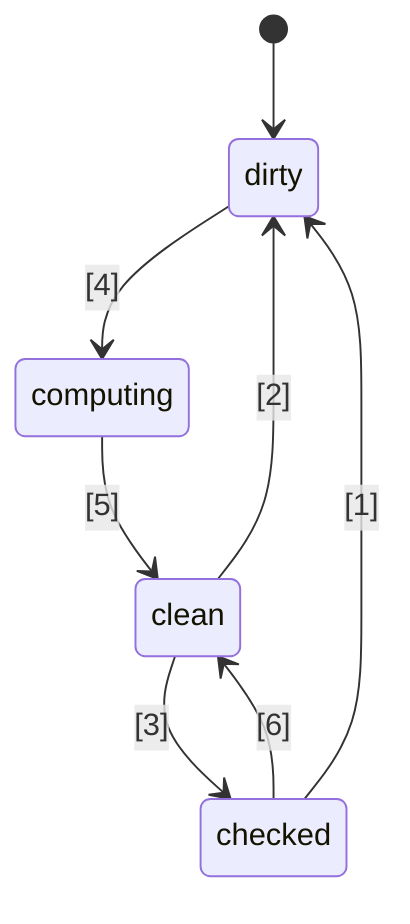
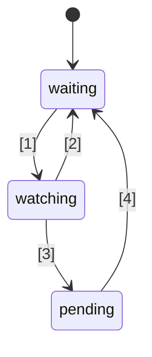

# 🚦 Propuesta de estándar de Signals en JavaScript 🚦


Etapa 1 ([explicación](https://tc39.es/process-document/))

Champions de la propuesta TC39: Daniel Ehrenberg, Yehuda Katz, Jatin Ramanathan, Shay Lewis, Kristen Hewell Garrett, Dominic Gannaway, Preston Sego, Milo M, Rob Eisenberg

Autores originales: Rob Eisenberg y Daniel Ehrenberg

Este documento describe una dirección común temprana para los signals en JavaScript, similar al esfuerzo Promises/A+ que precedió a las Promises estandarizadas por TC39 en ES2015. Pruébalo tú mismo, usando [un polyfill](https://github.com/proposal-signals/signal-polyfill).

De manera similar a Promises/A+, este esfuerzo se enfoca en alinear el ecosistema de JavaScript. Si esta alineación tiene éxito, entonces podría surgir un estándar, basado en esa experiencia. Varios autores de frameworks están colaborando aquí en un modelo común que podría respaldar el núcleo de reactividad de sus frameworks. El borrador actual se basa en aportes de diseño de los autores/mantenedores de [Angular](https://angular.io/), [Bubble](https://bubble.io/), [Ember](https://emberjs.com/), [FAST](https://www.fast.design/), [MobX](https://mobx.js.org/), [Preact](https://preactjs.com/), [Qwik](https://qwik.dev/), [RxJS](https://rxjs.dev/), [Solid](https://www.solidjs.com/), [Starbeam](https://www.starbeamjs.com/), [Svelte](https://svelte.dev/), [Vue](https://vuejs.org/), [Wiz](https://blog.angular.io/angular-and-wiz-are-better-together-91e633d8cd5a), y más…

A diferencia de Promises/A+, no estamos tratando de resolver una API común orientada al desarrollador, sino más bien las semánticas precisas del núcleo del grafo de signals subyacente. Esta propuesta sí incluye una API completamente concreta, pero la API no está dirigida a la mayoría de los desarrolladores de aplicaciones. En cambio, la API de signals aquí es más adecuada para que los frameworks construyan sobre ella, proporcionando interoperabilidad a través de un grafo de signals común y un mecanismo de auto-seguimiento.

El plan para esta propuesta es realizar prototipos tempranos significativos, incluida la integración en varios frameworks, antes de avanzar más allá de la Etapa 1. Solo estamos interesados en estandarizar Signals si son adecuados para su uso práctico en múltiples frameworks y proporcionan beneficios reales sobre los signals provistos por los frameworks. Esperamos que una fase de prototipado temprano nos brinde esta información. Consulta "Estado y plan de desarrollo" más abajo para más detalles.

## Antecedentes: ¿Por qué Signals?

Para desarrollar una interfaz de usuario (UI) complicada, los desarrolladores de aplicaciones JavaScript necesitan almacenar, computar, invalidar, sincronizar y enviar el estado a la capa de vista de la aplicación de manera eficiente. Las UI comúnmente implican mucho más que simplemente gestionar valores simples, a menudo implican renderizar un estado computado que depende de un árbol complejo de otros valores o estados que también son computados. El objetivo de los Signals es proporcionar infraestructura para gestionar este estado de aplicación, de modo que los desarrolladores puedan enfocarse en la lógica de negocio en lugar de estos detalles repetitivos.

Se ha descubierto que los constructos tipo signal son útiles de manera independiente también en contextos no relacionados con UI, particularmente en sistemas de build para evitar reconstrucciones innecesarias.

Los signals se utilizan en la programación reactiva para eliminar la necesidad de gestionar actualizaciones en las aplicaciones.

> Un modelo de programación declarativo para actualizar en función de cambios en el estado.

de _[¿Qué es la reactividad?](https://www.pzuraq.com/blog/what-is-reactivity)_.

#### Ejemplo - Un contador en VanillaJS

Dada una variable, `counter`, quieres renderizar en el DOM si el contador es par o impar. Cada vez que `counter` cambie, quieres actualizar el DOM con la última paridad. En Vanilla JS, podrías tener algo así:

```js
let counter = 0;
const setCounter = (value) => {
  counter = value;
  render();
};

const isEven = () => (counter & 1) == 0;
const parity = () => isEven() ? "even" : "odd";
const render = () => element.innerText = parity();

// Simula actualizaciones externas a counter...
setInterval(() => setCounter(counter + 1), 1000);
```
> [!NOTA]  
> Se usan variables globales aquí solo para propósitos de demostración. La gestión adecuada de estado tiene muchas soluciones, y los ejemplos en esta propuesta buscan ser lo más minimalistas posible. Esta propuesta no fomenta el uso de variables globales.


Esto tiene varios problemas...

* La configuración de `counter` es ruidosa y con mucho código repetitivo.
* El estado de `counter` está fuertemente acoplado al sistema de renderizado.
* Si `counter` cambia pero `parity` no (por ejemplo, counter pasa de 2 a 4), entonces hacemos un cálculo innecesario de la paridad y un renderizado innecesario.
* ¿Qué pasa si otra parte de nuestra UI solo quiere renderizar cuando `counter` se actualiza?
* ¿Qué pasa si otra parte de nuestra UI depende solo de `isEven` o `parity`?

Incluso en este escenario relativamente simple, aparecen varios problemas rápidamente. Podríamos intentar solucionar esto introduciendo pub/sub para `counter`. Esto permitiría que consumidores adicionales de `counter` puedan suscribirse para añadir sus propias reacciones a los cambios de estado.

Sin embargo, aún estamos atascados con los siguientes problemas:

* La función de renderizado, que solo depende de `parity`, en su lugar debe "saber" que en realidad necesita suscribirse a `counter`.
* No es posible actualizar la UI en función solo de `isEven` o `parity`, sin interactuar directamente con `counter`.
* Hemos incrementado nuestro código repetitivo. Cada vez que usas algo, no es solo cuestión de llamar una función o leer una variable, sino de suscribirse y hacer actualizaciones allí. Gestionar la desuscripción también es especialmente complicado.

Ahora, podríamos resolver algunos problemas añadiendo pub/sub no solo a `counter` sino también a `isEven` y `parity`. Entonces tendríamos que suscribir `isEven` a `counter`, `parity` a `isEven`, y `render` a `parity`. Desafortunadamente, no solo nuestro código repetitivo ha explotado, sino que estamos atrapados con un montón de gestión de suscripciones, y un posible desastre de fugas de memoria si no limpiamos todo correctamente. Así que, hemos resuelto algunos problemas pero creado toda una nueva categoría de problemas y mucho código. Para empeorar las cosas, tenemos que pasar por este proceso para cada pieza de estado en nuestro sistema.

### Introducción a Signals

Las abstracciones de data binding en las UI para el modelo y la vista han sido durante mucho tiempo fundamentales en los frameworks de UI en múltiples lenguajes de programación, a pesar de la ausencia de tal mecanismo en JS o en la plataforma web. Dentro de los frameworks y librerías JS, ha habido mucha experimentación sobre diferentes formas de representar este binding, y la experiencia ha demostrado el poder del flujo de datos unidireccional en conjunto con un tipo de dato de primera clase que representa una celda de estado o un cálculo derivado de otros datos, ahora llamados a menudo "Signals".
Este enfoque de valor reactivo de primera clase parece haber hecho su primera aparición popular en frameworks web de JavaScript de código abierto con [Knockout](https://knockoutjs.com/) [en 2010](https://blog.stevensanderson.com/2010/07/05/introducing-knockout-a-ui-library-for-javascript/). En los años siguientes, se han creado muchas variaciones e implementaciones. En los últimos 3-4 años, el primitivo Signal y enfoques relacionados han ganado aún más tracción, con casi todas las librerías o frameworks modernos de JavaScript teniendo algo similar, bajo uno u otro nombre.

Para entender Signals, echemos un vistazo al ejemplo anterior, reimaginado con una API de Signal más detallada a continuación.

#### Ejemplo - Un contador con Signals

```js
const counter = new Signal.State(0);
const isEven = new Signal.Computed(() => (counter.get() & 1) == 0);
const parity = new Signal.Computed(() => isEven.get() ? "even" : "odd");

// Una librería o framework define efectos en función de otros primitivos Signal
declare function effect(cb: () => void): (() => void);

effect(() => element.innerText = parity.get());

// Simula actualizaciones externas a counter...
setInterval(() => counter.set(counter.get() + 1), 1000);
```

Hay algunas cosas que podemos notar de inmediato:
* Hemos eliminado el código repetitivo y ruidoso alrededor de la variable `counter` de nuestro ejemplo anterior.
* Hay una API unificada para manejar valores, cálculos y efectos secundarios.
* No hay problema de referencias circulares ni dependencias invertidas entre `counter` y `render`.
* No hay suscripciones manuales, ni necesidad de gestión de registros.
* Hay una forma de controlar el momento/la programación de los efectos secundarios.

Sin embargo, los Signals nos brindan mucho más que lo que se puede ver en la superficie de la API:
* **Seguimiento Automático de Dependencias** - Una Signal computada descubre automáticamente cualquier otra Signal de la que dependa, ya sean estos valores simples u otros cálculos.
* **Evaluación Perezosa** - Los cálculos no se evalúan anticipadamente cuando se declaran, ni se evalúan inmediatamente cuando cambian sus dependencias. Solo se evalúan cuando su valor es solicitado explícitamente.
* **Memoización** - Las Signals computadas almacenan en caché su último valor, de modo que los cálculos cuyas dependencias no hayan cambiado no necesitan ser reevaluados, sin importar cuántas veces sean accedidos.

## Motivación para estandarizar Signals

#### Interoperabilidad

Cada implementación de Signal tiene su propio mecanismo de seguimiento automático, para llevar el control de las fuentes encontradas al evaluar una Signal computada. Esto dificulta compartir modelos, componentes y librerías entre diferentes frameworks—tienden a venir con un acoplamiento falso a su motor de vista (dado que las Signals suelen implementarse como parte de frameworks de JS).

Uno de los objetivos de esta propuesta es desacoplar completamente el modelo reactivo del renderizado de la vista, permitiendo a los desarrolladores migrar a nuevas tecnologías de renderizado sin reescribir su código no relacionado a UI, o desarrollar modelos reactivos compartidos en JS para desplegar en diferentes contextos. Desafortunadamente, debido a versiones y duplicación, ha resultado impráctico lograr un alto nivel de compartición mediante librerías a nivel de JS—las funcionalidades integradas ofrecen una garantía de compartición más fuerte.

#### Rendimiento/Uso de memoria

Siempre existe un pequeño potencial de mejora en el rendimiento al enviar menos código gracias a que librerías comúnmente usadas vienen integradas, pero las implementaciones de Signals suelen ser bastante pequeñas, por lo que no esperamos que este efecto sea muy grande.

Sospechamos que las implementaciones nativas en C++ de las estructuras de datos y algoritmos relacionados con Signals pueden ser ligeramente más eficientes que lo que se puede lograr en JS, por un factor constante. Sin embargo, no se anticipan cambios algorítmicos frente a lo que estaría presente en un polyfill; no se espera que los motores hagan magia aquí, y los algoritmos de reactividad estarán bien definidos y serán inequívocos.

El grupo promotor espera desarrollar varias implementaciones de Signals y usar estas para investigar estas posibilidades de rendimiento.

#### DevTools

Con las librerías de Signals existentes en lenguaje JS, puede ser difícil rastrear cosas como:
* La pila de llamadas a través de una cadena de Signals computadas, mostrando la cadena causal de un error
* El grafo de referencias entre Signals, cuando una depende de otra—importante cuando se depura el uso de memoria

Las Signals integradas permiten que los entornos de ejecución de JS y DevTools puedan tener un soporte mejorado para inspeccionar Signals, particularmente para depuración o análisis de rendimiento, ya sea integrado en los navegadores o a través de una extensión compartida. Herramientas existentes como el inspector de elementos, la captura de rendimiento y los perfiladores de memoria podrían actualizarse para resaltar específicamente las Signals en su presentación de información.

#### Beneficios secundarios

##### Beneficios de una librería estándar

En general, JavaScript ha tenido una librería estándar bastante mínima, pero una tendencia en TC39 ha sido hacer de JS un lenguaje más "con pilas incluidas", con un conjunto de funcionalidades integradas y de alta calidad disponible. Por ejemplo, Temporal está reemplazando moment.js, y varias pequeñas funciones, por ejemplo, `Array.prototype.flat` y `Object.groupBy` están reemplazando muchos casos de uso de lodash. Los beneficios incluyen tamaños de bundle más pequeños, mayor estabilidad y calidad, menos cosas que aprender al unirse a un nuevo proyecto, y un vocabulario común entre desarrolladores de JS.

##### Integración HTML/DOM (una posibilidad futura)

El trabajo actual en el W3C y por parte de los implementadores de navegadores busca llevar la plantillas nativas a HTML ([DOM Parts][wicg-pr-1023] y [Template Instantiation][wicg-propsal-template-instantiation]). Además, el W3C Web Components CG está explorando la posibilidad de extender los Web Components para ofrecer una API HTML totalmente declarativa. Para lograr ambos objetivos, eventualmente HTML necesitará una primitiva reactiva. Además, se pueden imaginar muchas mejoras ergonómicas al DOM mediante la integración de Signals, las cuales han sido solicitadas por la comunidad.

[wicg-pr-1023]: https://github.com/WICG/webcomponents/pull/1023
[wicg-propsal-template-instantiation]: https://github.com/WICG/webcomponents/blob/gh-pages/proposals/Template-Instantiation.md

> Nota, esta integración sería un esfuerzo separado para el futuro, no parte de esta propuesta en sí.

##### Intercambio de información en el ecosistema (*no* es una razón para incluirlo)

Los esfuerzos de estandarización a veces pueden ser útiles solo a nivel "comunidad", incluso sin cambios en los navegadores. El esfuerzo de Signals está reuniendo a muchos autores de frameworks diferentes para una discusión profunda sobre la naturaleza de la reactividad, los algoritmos y la interoperabilidad. Esto ya ha sido útil, y no justifica la inclusión en los motores JS y navegadores; las Signals solo deberían agregarse al estándar de JavaScript si existen beneficios significativos *más allá* del intercambio de información del ecosistema que permite.

## Objetivos de diseño para Signals

Resulta que las librerías de Signals existentes no son tan diferentes entre sí, en su núcleo. Esta propuesta busca aprovechar su éxito implementando las cualidades importantes de muchas de esas librerías.

### Funcionalidades principales

* Un tipo Signal que representa estado, es decir, Signal escribible. Este es un valor que otros pueden leer.
* Un tipo Signal computada/memo/derivada, que depende de otras y se calcula y almacena en caché de manera perezosa.
    * El cálculo es perezoso, lo que significa que las Signals computadas no se recalculan por defecto cuando cambia una de sus dependencias, sino que solo se ejecutan si alguien realmente las lee.
    * El cálculo es "[libre de glitches](https://es.wikipedia.org/wiki/Programaci%C3%B3n_reactiva#Glitches)", es decir, nunca se realizan cálculos innecesarios. Esto implica que, cuando una aplicación lee una Signal computada, hay un ordenamiento topológico de las partes potencialmente sucias del grafo para ejecutar, eliminando duplicados.
    * El cálculo se almacena en caché, lo que significa que si, después de la última vez que una dependencia cambió, ninguna dependencia ha cambiado, entonces la Signal computada *no* se recalcula al accederla.
    * Es posible realizar comparaciones personalizadas para Signals computadas así como para las de estado, para determinar cuándo Signals computadas adicionales que dependen de ellas deben actualizarse.
* Reacciones a la condición donde una Signal computada tiene una de sus dependencias (o dependencias anidadas) marcada como "sucia" y cambia, lo que significa que el valor de la Signal podría estar desactualizado.
    * Esta reacción está pensada para programar trabajo más importante que se realizará más tarde.
    * Los efectos se implementan en términos de estas reacciones, más la programación a nivel de framework.
    * Las Signals computadas necesitan la capacidad de reaccionar a si están registradas como una dependencia (anidada) de una de estas reacciones.
* Permitir que los frameworks de JS realicen su propia programación. No hay una programación forzada integrada al estilo Promise.
    * Se necesitan reacciones síncronas para permitir programar trabajo posterior basado en la lógica del framework.
    * Las escrituras son síncronas y tienen efecto inmediato (un framework que agrupe escrituras puede hacerlo por encima).
    * Es posible separar la comprobación de si un efecto puede estar "sucio" de la ejecución real del efecto (permitiendo un programador de efectos en dos etapas).
* Capacidad de leer Signals *sin* activar el registro de dependencias (`untrack`)
* Permitir la composición de diferentes bases de código que usen Signals/reactividad, por ejemplo,
    * Usar múltiples frameworks juntos en cuanto al seguimiento/reactividad en sí (salvo omisiones, ver más abajo)
    * Estructuras de datos reactivas independientes de framework (por ejemplo, proxy de almacén recursivamente reactivo, Map y Set y Array reactivos, etc.)

### Solidez

* Desalentar/prohibir el uso ingenuo de reacciones síncronas.
    * Riesgo de solidez: puede exponer "[glitches](https://es.wikipedia.org/wiki/Programaci%C3%B3n_reactiva#Glitches)" si se usa incorrectamente: Si el renderizado se realiza inmediatamente cuando se establece una Signal, puede exponer un estado de aplicación incompleto al usuario final. Por tanto, esta función solo debe usarse para programar trabajo inteligentemente para más adelante, una vez que la lógica de la aplicación haya terminado.
    * Solución: No permitir leer ni escribir ninguna Signal desde dentro de un callback de reacción síncrona.
* Desalentar el uso de `untrack` y marcar su naturaleza no sólida
    * Riesgo de solidez: permite la creación de Signals computadas cuyo valor depende de otras Signals, pero que no se actualizan cuando esas Signals cambian. Debe usarse cuando los accesos no rastreados no cambiarán el resultado del cálculo.
    * Solución: La API está marcada como "insegura" en el nombre.
* Nota: Esta propuesta sí permite que las signals sean leídas y escritas tanto desde signals computadas como de efectos, sin restringir escrituras que ocurran después de lecturas, a pesar del riesgo de solidez. Esta decisión fue tomada para preservar flexibilidad y compatibilidad en la integración con frameworks.

### API superficial

* Debe ser una base sólida para que múltiples frameworks implementen sus mecanismos de Signals/reactividad.
    * Debe ser una buena base para proxies de almacén recursivos, reactividad basada en decoradores de campos de clase, y para APIs tanto del tipo `.value` como `[state, setState]`.
    * La semántica debe ser capaz de expresar los patrones válidos habilitados por diferentes frameworks. Por ejemplo, debe ser posible que estas Signals sean la base tanto de escrituras reflejadas inmediatamente como de escrituras agrupadas y aplicadas más tarde.
* Sería deseable que esta API pueda ser utilizada directamente por desarrolladores JavaScript.
    * Si una funcionalidad coincide con un concepto del ecosistema, es bueno usar vocabulario común.
        * Sin embargo, es importante no usar literalmente los mismos nombres exactos.
    * Tensión entre "usabilidad para desarrolladores JS" y "proveer todos los ganchos para frameworks"
        * Idea: Proveer todos los ganchos, pero incluir errores cuando se usen incorrectamente si es posible.
        * Idea: Colocar las APIs sutiles en un espacio de nombres `subtle`, similar a [`crypto.subtle`](https://developer.mozilla.org/en-US/docs/Web/API/Crypto/subtle), para marcar la línea entre las APIs necesarias para usos más avanzados como implementar un framework o construir dev tools, versus el desarrollo de aplicaciones cotidiano como instanciar signals para usar con un framework.
* Ser implementable y utilizable con buen rendimiento—la API superficial no debe causar demasiada sobrecarga.
    * Permitir subclasificación, de modo que los frameworks puedan añadir sus propios métodos y campos, incluidos los campos privados. Esto es importante para evitar la necesidad de asignaciones adicionales a nivel de framework. Ver "Gestión de memoria" más abajo.

### Gestión de memoria

* Si es posible: Una Signal computada debe poder ser recolectada por el recolector de basura si nada vivo la está referenciando para posibles lecturas futuras, incluso si está enlazada en un grafo más grande que permanece vivo (por ejemplo, al leer un estado que permanece vivo).
* Tenga en cuenta que la mayoría de los frameworks actuales requieren la eliminación explícita de las Signals computadas si tienen alguna referencia desde o hacia otro grafo de Signals que permanece activo.
* Esto no resulta tan problemático cuando su ciclo de vida está vinculado al ciclo de vida de un componente de UI, y de todas formas los efectos necesitan ser eliminados.
* Si es demasiado costoso ejecutarlo con estas semánticas, entonces deberíamos añadir la eliminación explícita (o "desvinculación") de Signals computadas a la API a continuación, que actualmente carece de ello.
* Un objetivo relacionado por separado: Minimizar el número de asignaciones, por ejemplo,
    * para crear una Signal editable (evitar dos closures separadas + array)
    * para implementar efectos (evitar una closure para cada reacción)
    * En la API para observar cambios en Signals, evitar la creación de estructuras de datos temporales adicionales
    * Solución: API basada en clases que permite la reutilización de métodos y campos definidos en subclases

## Boceto de la API

A continuación se muestra una idea inicial de una API de Signal. Tenga en cuenta que esto es solo un borrador temprano, y anticipamos cambios con el tiempo. Comencemos con el `.d.ts` completo para hacernos una idea de la estructura general, y luego discutiremos los detalles de lo que significa todo esto.

```ts
interface Signal<T> {
    // Obtener el valor de la signal
    get(): T;
}

namespace Signal {
    // Una Signal de lectura y escritura
    class State<T> implements Signal<T> {
        // Crear una Signal de estado comenzando con el valor t
        constructor(t: T, options?: SignalOptions<T>);

        // Obtener el valor de la signal
        get(): T;

        // Establecer el valor de la Signal de estado a t
        set(t: T): void;
    }

    // Una Signal que es una fórmula basada en otras Signals
    class Computed<T = unknown> implements Signal<T> {
        // Crear una Signal que se evalúa al valor retornado por el callback.
        // El callback es llamado con esta signal como el valor de this.
        constructor(cb: (this: Computed<T>) => T, options?: SignalOptions<T>);

        // Obtener el valor de la signal
        get(): T;
    }

    // Este namespace incluye características "avanzadas" que es mejor
    // dejar para los autores de frameworks en lugar de los desarrolladores de aplicaciones.
    // Análogo a `crypto.subtle`
    namespace subtle {
        // Ejecutar un callback con todo el seguimiento deshabilitado
        function untrack<T>(cb: () => T): T;

        // Obtener la signal computada actual que está rastreando cualquier lectura de signal, si existe
        function currentComputed(): Computed | null;

        // Devuelve una lista ordenada de todas las signals que esta referenció
        // durante la última vez que fue evaluada.
        // Para un Watcher, lista el conjunto de signals que está observando.
        function introspectSources(s: Computed | Watcher): (State | Computed)[];

        // Devuelve los Watchers en los que esta signal está contenida, además de cualquier
        // Signal Computed que leyó esta signal la última vez que fue evaluada,
        // si esa signal computada está (recursivamente) siendo observada.
        function introspectSinks(s: State | Computed): (Computed | Watcher)[];

        // Verdadero si esta signal está "viva", es decir, está siendo observada por un Watcher,
        // o es leída por una signal Computed que (recursivamente) está viva.
        function hasSinks(s: State | Computed): boolean;

        // Verdadero si este elemento es "reactivo", es decir, depende
        // de alguna otra signal. Una Computed donde hasSources es falso
        // siempre devolverá la misma constante.
        function hasSources(s: Computed | Watcher): boolean;

        class Watcher {
            // Cuando una fuente (recursiva) del Watcher es escrita, llama a este callback,
            // si aún no ha sido llamado desde la última llamada a `watch`.
            // No se pueden leer ni escribir signals durante la notificación.
            constructor(notify: (this: Watcher) => void);

            // Agrega estas signals al conjunto del Watcher y configura el watcher para ejecutar su
            // callback de notificación la próxima vez que cualquier signal en el conjunto (o una de sus dependencias) cambie.
            // Puede llamarse sin argumentos solo para restablecer el estado de "notificado", de modo que
            // el callback de notificación se invoque nuevamente.
            watch(...s: Signal[]): void;

            // Elimina estas signals del conjunto observado (por ejemplo, para un efecto que se elimina)
            unwatch(...s: Signal[]): void;

            // Devuelve el conjunto de fuentes en el conjunto del Watcher que todavía están sucias, o es una signal computada
            // con una fuente que está sucia o pendiente y aún no ha sido reevaluada
            getPending(): Signal[];
        }

        // Hooks para observar cuando se comienza o se deja de observar
        var watched: Symbol;
        var unwatched: Symbol;
    }

    interface SignalOptions<T> {
        // Función de comparación personalizada entre el valor antiguo y el nuevo. Por defecto: Object.is.
        // La signal se pasa como el valor de this para contexto.
        equals?: (this: Signal<T>, t: T, t2: T) => boolean;
```ts
// Callback llamado cuando isWatched se vuelve true, si previamente era false
[Signal.subtle.watched]?: (this: Signal<T>) => void;

// Callback llamado cuando isWatched se vuelve false, si previamente era true
[Signal.subtle.unwatched]?: (this: Signal<T>) => void;
}
}
```

### Cómo funcionan los Signals

Un Signal representa una celda de datos que puede cambiar con el tiempo. Los Signals pueden ser de tipo "state" (simplemente un valor que se establece manualmente) o "computed" (una fórmula basada en otros Signals).

Los Signals computados funcionan rastreando automáticamente qué otros Signals son leídos durante su evaluación. Cuando se lee un computed, verifica si alguna de sus dependencias registradas previamente ha cambiado y se reevalúa si es así. Cuando varios Signals computados están anidados, toda la atribución del rastreo va al más interno.

Los Signals computados son perezosos, es decir, basados en demanda: solo se reevalúan cuando se accede a ellos, incluso si una de sus dependencias cambió anteriormente.

El callback pasado a los Signals computados generalmente debe ser "puro" en el sentido de ser una función determinista y sin efectos secundarios de los otros Signals a los que accede. Al mismo tiempo, el momento en que se llama al callback es determinista, permitiendo que los efectos secundarios se usen con cuidado.

Los Signals presentan un destacado almacenamiento en caché/memoización: tanto los Signals de estado como los computados recuerdan su valor actual y solo desencadenan el recálculo de los Signals computados que los referencian si realmente cambian. Ni siquiera se necesita una comparación repetida de los valores antiguos y nuevos: la comparación se realiza una vez cuando el Signal fuente se reinicia/reevalúa, y el mecanismo de Signal lleva el seguimiento de qué cosas que referencian ese Signal aún no se han actualizado según el nuevo valor. Internamente, esto generalmente se representa mediante "coloreado de grafos" como se describe en (la publicación del blog de Milo).

Los Signals computados rastrean sus dependencias dinámicamente: cada vez que se ejecutan, pueden terminar dependiendo de cosas diferentes, y ese conjunto de dependencias preciso se mantiene actualizado en el grafo de Signals. Esto significa que si tienes una dependencia necesaria solo en una rama, y el cálculo anterior tomó la otra rama, entonces un cambio en ese valor temporalmente no utilizado no hará que el Signal computado se recalcule, incluso cuando se acceda a él.

A diferencia de las Promesas de JavaScript, todo en Signals se ejecuta de manera síncrona:
- Establecer un Signal a un nuevo valor es síncrono, y esto se refleja inmediatamente al leer cualquier Signal computado que dependa de él después. No hay ningún agrupamiento ("batching") incorporado para esta mutación.
- Leer Signals computados es síncrono: su valor está siempre disponible.
- El callback `notify` en los Watchers, como se explica a continuación, se ejecuta de manera síncrona, durante la llamada a `.set()` que lo desencadenó (pero después de que se haya completado el coloreado del grafo).

Al igual que las Promesas, los Signals pueden representar un estado de error: si el callback de un Signal computado lanza una excepción, ese error se almacena en caché como cualquier otro valor y se vuelve a lanzar cada vez que se lee el Signal.

### Entendiendo la clase Signal

Una instancia de `Signal` representa la capacidad de leer un valor que cambia dinámicamente y cuyos cambios se rastrean con el tiempo. También incluye implícitamente la capacidad de suscribirse al Signal, de manera implícita a través de un acceso rastreado desde otro Signal computado.

La API aquí está diseñada para coincidir con el consenso muy general de la comunidad entre una gran fracción de las librerías de Signals en el uso de nombres como "signal", "computed" y "state". Sin embargo, el acceso a los Signals Computed y State es a través de un método `.get()`, lo cual difiere de todas las APIs populares de Signals, que usan un accesor `.value` o una sintaxis de llamada `signal()`.

La API está diseñada para reducir el número de asignaciones, para hacer los Signals adecuados para su integración en frameworks de JavaScript mientras se logra el mismo o mejor rendimiento que los Signals personalizados de los frameworks existentes. Esto implica:
- Los Signals de estado son un único objeto escribible, que puede ser accedido y modificado desde la misma referencia. (Ver implicaciones más abajo en la sección "Separación de capacidades").
- Tanto los Signals de estado como los computados están diseñados para poder ser subclaseados, para facilitar que los frameworks agreguen propiedades adicionales a través de campos de clase públicos y privados (así como métodos para usar ese estado).
- Varios callbacks (por ejemplo, `equals`, el callback de los computados) se llaman con el Signal relevante como el valor de `this` para contexto, de modo que no se necesita una nueva closure por Signal. En su lugar, el contexto puede guardarse en propiedades extra del propio Signal.

Algunas condiciones de error impuestas por esta API:
- Es un error leer un Signal computado recursivamente.
- El callback `notify` de un Watcher no puede leer ni escribir ningún Signal.
- Si el callback de un Signal computado lanza una excepción, los accesos posteriores a ese Signal vuelven a lanzar ese error almacenado, hasta que una de las dependencias cambie y se recalcule.

Algunas condiciones que *no* se imponen:
- Los Signals computados pueden escribir en otros Signals, de forma síncrona dentro de su callback.
- El trabajo que es puesto en cola por el callback `notify` de un Watcher puede leer o escribir signals, permitiendo replicar [antipatrones clásicos de React](https://react.dev/learn/you-might-not-need-an-effect) en términos de Signals.

### Implementando efectos

La interfaz `Watcher` definida arriba da la base para implementar las típicas APIs JS para efectos: callbacks que se vuelven a ejecutar cuando otros Signals cambian, únicamente por su efecto secundario. La función `effect` usada arriba en el ejemplo inicial puede definirse así:

```ts
// Esta función usualmente viviría en una librería/framework, no en código de aplicación
// NOTA: Esta lógica de programación es demasiado básica para ser útil. No copiar/pegar.
let pending = false;

let w = new Signal.subtle.Watcher(() => {
    if (!pending) {
        pending = true;
        queueMicrotask(() => {
            pending = false;
            for (let s of w.getPending()) s.get();
            w.watch();
        });
    }
});

// Un Signal de efecto que evalúa cb, que programa una lectura de
// sí mismo en la cola de microtareas cada vez que una de sus dependencias podría cambiar
export function effect(cb) {
    let destructor;
    let c = new Signal.Computed(() => { destructor?.(); destructor = cb(); });
    w.watch(c);
    c.get();
    return () => { destructor?.(); w.unwatch(c) };
}
```

La API de Signal no incluye ninguna función incorporada como `effect`. Esto se debe a que la programación de efectos es sutil y a menudo se integra con los ciclos de renderizado del framework y otros estados o estrategias específicas de alto nivel de los frameworks a los que JS no tiene acceso.

Repasando las diferentes operaciones utilizadas aquí: El callback `notify` pasado al constructor de `Watcher` es la función que se llama cuando el Signal pasa de un estado "limpio" (donde sabemos que la caché está inicializada y es válida) a un estado "checked" o "dirty" (donde la caché podría o no ser válida porque al menos uno de los estados de los que depende recursivamente ha cambiado).

Las llamadas a `notify` son desencadenadas en última instancia por una llamada a `.set()` en algún Signal de estado. Esta llamada es síncrona: sucede antes de que `.set` retorne. Pero no hay que preocuparse de que este callback observe el grafo de Signals en un estado a medio procesar, porque durante un callback `notify`, no se puede leer ni escribir ningún Signal, ni siquiera en una llamada a `untrack`. Como `notify` se llama durante `.set()`, está interrumpiendo otro hilo de lógica, que podría no estar completo. Para leer o escribir Signals desde `notify`, programa el trabajo para que se ejecute después, por ejemplo, escribiendo el Signal en una lista para acceder a él más tarde, o usando `queueMicrotask` como arriba.

Ten en cuenta que es perfectamente posible usar Signals eficazmente sin `Signal.subtle.Watcher` programando el sondeo de Signals computados, como hace Glimmer. Sin embargo, muchos frameworks han descubierto que es muy útil que esta lógica de programación se ejecute de forma síncrona, por lo que la API de Signals la incluye.

Tanto los Signals computados como los de estado son recolectados por el recolector de basura como cualquier valor JS. Pero los Watchers tienen una manera especial de mantener vivos los objetos: cualquier Signal observado por un Watcher se mantendrá vivo mientras cualquiera de los estados subyacentes sea accesible, ya que estos pueden desencadenar una futura llamada a `notify` (y luego a un futuro `.get()`). Por este motivo, recuerda llamar a `Watcher.prototype.unwatch` para limpiar efectos.

### Una vía de escape insegura

`Signal.subtle.untrack` es una vía de escape que permite leer Signals *sin* rastrear esas lecturas. Esta capacidad es insegura porque permite la creación de Signals computados cuyo valor depende de otros Signals, pero que no se actualizan cuando esos Signals cambian. Debe usarse cuando los accesos no rastreados no cambien el resultado del cálculo.

<!--
TODO: Mostrar ejemplo donde es buena idea usar untrack

### Usando watched/unwatched
TODO: Mostrar un ejemplo de cómo convertir un Observable en una señal computada, suscrita solo cuando es utilizada por un efecto

TODO: Mostrar un ejemplo de una señal computada que representa el resultado de un fetch dirigido a un estado, que es cancelado

### Introspección para SSR

TODO: Mostrar cómo funciona la serialización del grafo de señales

TODO: Mostrar cómo se puede "hidratar" una señal de estado a computada más tarde, usando algunas señales.
-->

### Omitido por ahora

Estas características pueden añadirse más adelante, pero no están incluidas en el borrador actual. Su omisión se debe a la falta de consenso establecido en el espacio de diseño entre los frameworks, así como a la capacidad demostrada de solventar su ausencia mediante mecanismos adicionales sobre la noción de señales descrita en este documento. Sin embargo, desafortunadamente, la omisión limita el potencial de interoperabilidad entre frameworks. A medida que se produzcan prototipos de señales tal como se describen en este documento, se hará un esfuerzo por reexaminar si estas omisiones fueron la decisión adecuada.

* **Async**: Las señales siempre están disponibles de forma síncrona para su evaluación, en este modelo. Sin embargo, es frecuentemente útil contar con ciertos procesos asíncronos que llevan a que una señal sea establecida, y poder comprender cuándo una señal aún está "cargando". Una forma simple de modelar el estado de carga es mediante excepciones, y el comportamiento de almacenamiento en caché de excepciones de las señales computadas compone de manera razonable con esta técnica. Se discuten técnicas mejoradas en el [Issue #30](https://github.com/proposal-signals/proposal-signals/issues/30).
* **Transacciones**: Para transiciones entre vistas, a menudo es útil mantener un estado activo tanto para el estado "de" como para el estado "a". El estado "a" se renderiza en segundo plano, hasta que esté listo para intercambiarse (comprometer la transacción), mientras que el estado "de" permanece interactivo. Mantener ambos estados al mismo tiempo requiere "bifurcar" el estado del grafo de señales, e incluso puede ser útil admitir múltiples transiciones pendientes a la vez. Discusión en el [Issue #73](https://github.com/proposal-signals/proposal-signals/issues/73).

Algunos posibles [métodos de conveniencia](https://github.com/proposal-signals/proposal-signals/issues/32) también han sido omitidos.

## Estado y plan de desarrollo

Esta propuesta está en la agenda de TC39 de abril de 2024 para la Etapa 1. Actualmente puede considerarse como "Etapa 0".

[Un polyfill](https://github.com/proposal-signals/signal-polyfill) para esta propuesta está disponible, con algunas pruebas básicas. Algunos autores de frameworks han comenzado a experimentar con sustituir esta implementación de señales, pero este uso está en una etapa inicial.

Los colaboradores en la propuesta de señales quieren ser especialmente **conservadores** en cómo impulsamos esta propuesta, para evitar caer en la trampa de aprobar algo que terminemos lamentando y no usemos realmente. Nuestro plan es realizar las siguientes tareas adicionales, no requeridas por el proceso de TC39, para asegurarnos de que esta propuesta esté en el camino correcto:

Antes de proponer para la Etapa 2, planeamos:
- Desarrollar múltiples implementaciones de polyfill de nivel de producción que sean sólidas, bien probadas (por ejemplo, pasando pruebas de varios frameworks así como pruebas estilo test262), y competitivas en términos de rendimiento (como se verifique con un conjunto exhaustivo de benchmarks de señales/frameworks).
- Integrar la API de señales propuesta en un gran número de frameworks JS que consideremos representativos, y que algunas aplicaciones grandes funcionen con esta base. Probar que funciona de manera eficiente y correcta en estos contextos.
- Tener una comprensión sólida sobre el espacio de posibles extensiones para la API, y haber concluido cuáles (si hay alguna) deberían añadirse a esta propuesta.

## Algoritmos de señales

Esta sección describe cada una de las APIs expuestas a JavaScript, en términos de los algoritmos que implementan. Esto puede considerarse como una proto-especificación, y se incluye en este punto temprano para precisar un posible conjunto de semánticas, estando muy abiertos a cambios.

Algunos aspectos del algoritmo:
- El orden de lectura de señales dentro de una computada es significativo y es observable en el orden en que se ejecutan ciertos callbacks (cuál `Watcher` es invocado, `equals`, el primer parámetro de `new Signal.Computed`, y los callbacks `watched`/`unwatched`). Esto significa que las fuentes de una señal computada deben almacenarse ordenadas.
- Estos cuatro callbacks pueden lanzar excepciones, y estas excepciones se propagan de manera predecible al código JS que las llama. Las excepciones *no* detienen la ejecución de este algoritmo ni dejan el grafo en un estado medio procesado. Para los errores lanzados en el callback `notify` de un Watcher, esa excepción se envía a la llamada `.set()` que la disparó, usando un AggregateError si se lanzaron varias excepciones. Las demás (incluyendo `watched`/`unwatched`?) se almacenan en el valor de la señal, para ser relanzadas al leerlas, y una señal que relanza así puede marcarse como `~clean~` igual que cualquier otra con un valor normal.
- Se tiene cuidado de evitar circularidades en los casos de señales computadas que no están "observadas" (siendo observadas por algún Watcher), para que puedan ser recolectadas por el recolector de basura independientemente de otras partes del grafo de señales. Internamente, esto puede implementarse con un sistema de números de generación que siempre se recolectan; cabe señalar que las implementaciones optimizadas también pueden incluir números de generación locales por nodo, o evitar el rastreo de algunos números en señales observadas.

### Estado global oculto

Los algoritmos de señales necesitan hacer referencia a cierto estado global. Este estado es global para todo el hilo, o "agente".

- `computing`: La señal computada o de efecto más interna que actualmente está siendo reevaluada debido a una llamada `.get` o `.run`, o `null`. Inicialmente `null`.
- `frozen`: Booleano que indica si hay un callback actualmente ejecutándose que requiere que el grafo no sea modificado. Inicialmente `false`.
- `generation`: Un entero incremental, comenzando en 0, usado para rastrear cuán actual es un valor mientras se evitan circularidades.

### El espacio de nombres `Signal`

`Signal` es un objeto ordinario que sirve como espacio de nombres para clases y funciones relacionadas con señales.

`Signal.subtle` es un objeto de espacio de nombres interno similar.

### La clase `Signal.State`

#### Slots internos de `Signal.State`

- `value`: El valor actual de la señal de estado
- `equals`: La función de comparación usada al cambiar valores
- `watched`: El callback que se llama cuando la señal pasa a ser observada por un efecto
- `unwatched`: El callback que se llama cuando la señal deja de ser observada por un efecto
- `sinks`: Conjunto de señales observadas que dependen de esta

#### Constructor: `Signal.State(initialValue, options)`

1. Establece el `value` de esta señal a `initialValue`.
1. Establece el `equals` de esta señal a options?.equals
1. Establece el `watched` de esta señal a options?.[Signal.subtle.watched]
1. Establece el `unwatched` de esta señal a options?.[Signal.subtle.unwatched]
1. Establece el `sinks` de esta señal como el conjunto vacío

#### Método: `Signal.State.prototype.get()`

1. Si `frozen` es true, lanza una excepción.
1. Si `computing` no es `undefined`, agrega esta señal al conjunto `sources` de `computing`.
1. NOTA: No agregamos `computing` al conjunto `sinks` de esta señal hasta que sea observada por un Watcher.
1. Devuelve el `value` de esta señal.

#### Método: `Signal.State.prototype.set(newValue)`

1. Si el contexto de ejecución actual es `frozen`, lanza una excepción.
1. Ejecuta el algoritmo "establecer valor de señal" con esta señal y el primer parámetro como valor.
1. Si ese algoritmo devolvió `~clean~`, entonces retorna undefined.
1. Establece el estado de todos los `sinks` de esta señal a (si es una señal Computed) `~dirty~` si estaban previamente limpios, o (si es un Watcher) `~pending~` si estaba previamente `~watching~`.
1. Establece el estado de todas las dependencias Computed Signal de los sinks (recursivamente) a `~checked~` si estaban previamente `~clean~` (es decir, deja las marcas sucias en su lugar), o para Watchers, `~pending~` si previamente `~watching~`.
1. Para cada Watcher previamente `~watching~` encontrado en esa búsqueda recursiva, luego en orden de profundidad primero,
    1. Establece `frozen` en true.
    1. Llama a su callback `notify` (guardando cualquier excepción lanzada, pero ignorando el valor de retorno de `notify`).
    1. Restaura `frozen` a false.
    1. Establece el estado del Watcher a `~waiting~`.
1. Si alguna excepción fue lanzada desde los callbacks `notify`, propágala al llamador después de que todos los callbacks `notify` hayan sido ejecutados. Si hay múltiples excepciones, agrúpalas en un AggregateError y lánzalo.
1. Retorna undefined.

### La clase `Signal.Computed`

#### Máquina de estados de `Signal.Computed`
El `state` de una Señal Computada puede ser uno de los siguientes:

- `~clean~`: El valor de la Señal está presente y se sabe que no está obsoleto.
- `~checked~`: Una fuente (indirecta) de esta Señal ha cambiado; esta Señal tiene un valor pero _puede_ estar obsoleto. Solo se sabrá si está obsoleto cuando todas las fuentes inmediatas hayan sido evaluadas.
- `~computing~`: El callback de esta Señal se está ejecutando actualmente como efecto secundario de una llamada a `.get()`.
- `~dirty~`: O bien esta Señal tiene un valor que se sabe que está obsoleto, o nunca ha sido evaluada.

El gráfico de transición es el siguiente:



Las transiciones son:
| Número | De | A | Condición | Algoritmo |
| ------ | ---- | -- | --------- | --------- |
| 1 | `~checked~` | `~dirty~` | Una fuente inmediata de esta señal, que es una señal computada, ha sido evaluada y su valor ha cambiado. | Algoritmo: recalcular señal computada dirty |
| 2 | `~clean~` | `~dirty~` | Una fuente inmediata de esta señal, que es un Estado, ha sido establecida con un valor que no es igual a su valor anterior. | Método: `Signal.State.prototype.set(newValue)` |
| 3 | `~clean~` | `~checked~` | Una fuente recursiva, pero no inmediata, de esta señal, que es un Estado, ha sido establecida con un valor que no es igual a su valor anterior. | Método: `Signal.State.prototype.set(newValue)` |
| 4 | `~dirty~` | `~computing~` | Estamos a punto de ejecutar el `callback`. | Algoritmo: recalcular señal computada dirty |
| 5 | `~computing~` | `~clean~` | El `callback` ha terminado de evaluarse y ha retornado un valor o lanzado una excepción. | Algoritmo: recalcular señal computada dirty |
| 6 | `~checked~` | `~clean~` | Todas las fuentes inmediatas de esta señal han sido evaluadas, y todas se han descubierto sin cambios, por lo que ahora se sabe que no está obsoleta. | Algoritmo: recalcular señal computada dirty |

#### Slots internos de `Signal.Computed`

- `value`: El valor almacenado previamente en caché de la Señal, o `~uninitialized~` para una señal computada nunca leída. El valor puede ser una excepción que se relanza cuando se lee el valor. Siempre es `undefined` para señales de efecto.
- `state`: Puede ser `~clean~`, `~checked~`, `~computing~`, o `~dirty~`.
- `sources`: Un conjunto ordenado de Señales de las que depende esta Señal.
- `sinks`: Un conjunto ordenado de Señales que dependen de esta Señal.
- `equals`: El método equals proporcionado en las opciones.
- `callback`: El callback que se llama para obtener el valor de la señal computada. Se establece con el primer parámetro pasado al constructor.

#### Constructor de `Signal.Computed`

El constructor asigna
- `callback` a su primer parámetro
- `equals` según las opciones, usando por defecto `Object.is` si está ausente
- `state` a `~dirty~`
- `value` a `~uninitialized~`

Con [AsyncContext](https://github.com/tc39/proposal-async-context), el callback pasado a `new Signal.Computed` se cierra sobre el snapshot del momento en que fue llamado el constructor, y restaura este snapshot durante su ejecución.

#### Método: `Signal.Computed.prototype.get`

1. Si el contexto de ejecución actual está `frozen` o si esta Señal tiene el estado `~computing~`, o si esta señal es un Watcher y está `computing` una señal computada, lanzar una excepción.
1. Si `computing` no es `null`, añadir esta Señal al conjunto `sources` de `computing`.
1. NOTA: No añadimos `computing` al conjunto `sinks` de esta Señal hasta que/no sea observada por un Watcher.
1. Si el estado de esta Señal es `~dirty~` o `~checked~`: Repetir los siguientes pasos hasta que esta Señal esté `~clean~`:
    1. Recorrer hacia arriba vía `sources` para encontrar la fuente recursiva más profunda y más a la izquierda (es decir, la primera observada) que sea una Señal Computada marcada como `~dirty~` (deteniendo la búsqueda al encontrar una Señal Computada `~clean~`, e incluyendo esta Señal Computada como lo último a buscar).
    1. Ejecutar el algoritmo "recalcular señal computada dirty" en esa Señal.
1. En este punto, el estado de esta Señal será `~clean~`, y ninguna fuente recursiva estará `~dirty~` ni `~checked~`. Retornar el `value` de la Señal. Si el valor es una excepción, relanzar esa excepción.

### La clase `Signal.subtle.Watcher`

#### Máquina de estados de `Signal.subtle.Watcher`

El `state` de un Watcher puede ser uno de los siguientes:

- `~waiting~`: El callback `notify` ha sido ejecutado, o el Watcher es nuevo, pero no está observando activamente ninguna señal.
- `~watching~`: El Watcher está observando señales activamente, pero aún no han ocurrido cambios que requieran una llamada al callback `notify`.
- `~pending~`: Una dependencia del Watcher ha cambiado, pero el callback `notify` aún no ha sido ejecutado.

El gráfico de transición es el siguiente:



Las transiciones son:
| Número | De | A | Condición | Algoritmo |
| ------ | ---- | -- | --------- | --------- |
| 1 | `~waiting~` | `~watching~` | Se ha llamado al método `watch` del Watcher. | Método: `Signal.subtle.Watcher.prototype.watch(...signals)` |
| 2 | `~watching~` | `~waiting~` | Se ha llamado al método `unwatch` del Watcher y se ha eliminado la última señal observada. | Método: `Signal.subtle.Watcher.prototype.unwatch(...signals)` |
| 3 | `~watching~` | `~pending~` | Una señal observada puede haber cambiado de valor. | Método: `Signal.State.prototype.set(newValue)` |
| 4 | `~pending~` | `~waiting~` | El callback `notify` ha sido ejecutado. | Método: `Signal.State.prototype.set(newValue)` |

#### Slots internos de `Signal.subtle.Watcher`

- `state`: Puede ser `~watching~`, `~pending~` o `~waiting~`
- `signals`: Un conjunto ordenado de Señales que este Watcher está observando
- `notifyCallback`: El callback que se llama cuando algo cambia. Se establece con el primer parámetro pasado al constructor.

#### Constructor: `new Signal.subtle.Watcher(callback)`

1. El `state` se establece en `~waiting~`.
1. Inicializar `signals` como un conjunto vacío.
1. `notifyCallback` se establece al parámetro callback.
Con [AsyncContext](https://github.com/tc39/proposal-async-context), el callback pasado a `new Signal.subtle.Watcher` *no* captura el snapshot del momento en que se llamó al constructor, de modo que la información contextual alrededor de la escritura sea visible.

#### Método: `Signal.subtle.Watcher.prototype.watch(...signals)`

1. Si `frozen` es true, lanza una excepción.
1. Si alguno de los argumentos no es una señal, lanza una excepción.
1. Añade todos los argumentos al final del array `signals` de este objeto.
1. Para cada señal recién observada, en orden de izquierda a derecha,
    1. Añade este watcher como un `sink` a esa señal.
    1. Si este fue el primer sink, entonces recursivamente sube a las fuentes para añadir esa señal como sink.
    1. Establece `frozen` en true.
    1. Llama al callback `watched` si existe.
    1. Restaura `frozen` a false.
1. Si el `state` de la Signal es `~waiting~`, entonces establécelo a `~watching~`.

#### Método: `Signal.subtle.Watcher.prototype.unwatch(...signals)`

1. Si `frozen` es true, lanza una excepción.
1. Si alguno de los argumentos no es una señal, o no está siendo observada por este watcher, lanza una excepción.
1. Para cada señal en los argumentos, en orden de izquierda a derecha,
    1. Elimina esa señal del conjunto `signals` de este Watcher.
    1. Elimina este Watcher del conjunto `sink` de esa Signal.
    1. Si el conjunto `sink` de esa Signal se ha quedado vacío, elimina esa Signal como sink de cada una de sus fuentes.
    1. Establece `frozen` en true.
    1. Llama al callback `unwatched` si existe.
    1. Restaura `frozen` a false.
1. Si el watcher ahora no tiene `signals`, y su `state` es `~watching~`, entonces establécelo a `~waiting~`.

#### Método: `Signal.subtle.Watcher.prototype.getPending()`

1. Devuelve un Array que contiene el subconjunto de `signals` que son Computed Signals en los estados `~dirty~` o `~pending~`.

### Método: `Signal.subtle.untrack(cb)`

1. Deja que `c` sea el estado `computing` actual del contexto de ejecución.
1. Establece `computing` a null.
1. Llama a `cb`.
1. Restaura `computing` a `c` (incluso si `cb` lanzó una excepción).
1. Devuelve el valor de retorno de `cb` (relanzando cualquier excepción).

Nota: untrack no te saca del estado `frozen`, el cual se mantiene estrictamente.

### Método: `Signal.subtle.currentComputed()`

1. Devuelve el valor actual de `computing`.

### Algoritmos comunes

##### Algoritmo: recalcular una Signal computada dirty

1. Limpia el conjunto `sources` de esta Signal y elimínala de los conjuntos `sinks` de esas fuentes.
1. Guarda el valor anterior de `computing` y establece `computing` a esta Signal.
1. Establece el estado de esta Signal a `~computing~`.
1. Ejecuta el callback de esta Signal computada, usando esta Signal como valor de this. Guarda el valor de retorno y, si el callback lanzó una excepción, almacénala para relanzarla.
1. Restaura el valor anterior de `computing`.
1. Aplica el algoritmo "set Signal value" al valor de retorno del callback.
2. Establece el estado de esta Signal a `~clean~`.
1. Si ese algoritmo devolvió `~dirty~`: marca todos los sinks de esta Signal como `~dirty~` (anteriormente, los sinks podían estar mezclados entre checked y dirty). (O, si no está siendo observada, entonces adopta un nuevo número de generación para indicar suciedad, o algo así.)
1. De lo contrario, si el algoritmo devolvió `~clean~`: En este caso, para cada sink `~checked~` de esta Signal, si todas las fuentes de esa Signal están ahora limpias, marca también esa Signal como `~clean~`. Aplica este paso de limpieza a sinks adicionales recursivamente, a cualquier Signal recién limpia que tenga sinks marcados como checked. (O, si no está siendo observada, indica lo mismo de alguna manera, para que la limpieza pueda proceder de forma perezosa.)

##### Algoritmo para establecer el valor de una Signal

1. Si a este algoritmo se le pasó un valor (en vez de una excepción para relanzar, del algoritmo de recalcular Signal computada dirty):
    1. Llama a la función `equals` de esta Signal, pasando como parámetros el `value` actual, el nuevo valor y esta Signal. Si se lanza una excepción, guarda esa excepción (para relanzar al leer) como el valor de la Signal y continúa como si el callback hubiese devuelto false.
    1. Si esa función devolvió true, devuelve `~clean~`.
1. Establece el `value` de esta Signal al parámetro.
1. Devuelve `~dirty~`

## FAQ

**P**: ¿No es un poco pronto para estandarizar algo relacionado con Signals, cuando acaban de empezar a ser lo nuevo en 2022? ¿No deberíamos darles más tiempo para evolucionar y estabilizarse?

**R**: El estado actual de las Signals en los frameworks web es el resultado de más de 10 años de desarrollo continuo. A medida que aumenta la inversión, como ha ocurrido en los últimos años, casi todos los frameworks web se están acercando a un modelo central de Signals muy similar. Esta propuesta es el resultado de un ejercicio de diseño compartido entre un gran número de líderes actuales en frameworks web, y no se impulsará hacia la estandarización sin la validación de ese grupo de expertos en diversos contextos.

#### ¿Cómo se usan las Signals?

**P**: ¿Las Signals integradas pueden siquiera ser usadas por frameworks, dado su estrecha integración con el renderizado y la propiedad?

**R**: Las partes que son más específicas del framework suelen estar en el área de efectos, scheduling y ownership/disposal, que esta propuesta no intenta resolver. Nuestra primera prioridad con la prototipación de Signals en proceso de estandarización es validar que puedan operar "por debajo" de los frameworks existentes de manera compatible y con buen rendimiento.

**P**: ¿La API de Signal está pensada para ser usada directamente por desarrolladores de aplicaciones, o envuelta por frameworks?

**R**: Aunque esta API podría ser utilizada directamente por desarrolladores de aplicaciones (al menos la parte que no está en el namespace `Signal.subtle`), no está diseñada para ser especialmente ergonómica. En su lugar, las necesidades de los autores de librerías/frameworks son prioritarias. Se espera que la mayoría de los frameworks envuelvan incluso las APIs básicas `Signal.State` y `Signal.Computed` con algo que exprese su propio enfoque ergonómico. En la práctica, normalmente es mejor usar Signals a través de un framework, que gestione las características más complejas (por ejemplo, Watcher, `untrack`), así como el ownership y disposal (por ejemplo, determinar cuándo las signals deben ser añadidas o eliminadas de los watchers), y programando el renderizado al DOM; esta propuesta no intenta resolver esos problemas.

**P**: ¿Tengo que destruir las Signals relacionadas con un widget cuando ese widget se destruye? ¿Cuál es la API para eso?

**R**: La operación de desmontaje relevante aquí es `Signal.subtle.Watcher.prototype.unwatch`. Solo las Signals observadas necesitan ser limpiadas (desobservando), mientras que las Signals no observadas pueden ser recolectadas automáticamente por el garbage collector.

**P**: ¿Las Signals funcionan con VDOM o directamente con el HTML DOM subyacente?

**R**: ¡Sí! Las Signals son independientes de la tecnología de renderizado. Los frameworks de JavaScript existentes que usan construcciones similares a Signals se integran con VDOM (por ejemplo, Preact), el DOM nativo (por ejemplo, Solid) y una combinación (por ejemplo, Vue). Lo mismo será posible con las Signals integradas.

**P**: ¿Será ergonómico usar Signals en el contexto de frameworks basados en clases como Angular y Lit? ¿Y qué pasa con los frameworks basados en compiladores como Svelte?

**R**: Los campos de clase pueden ser basados en Signal usando un simple decorador de accessors, como se muestra en [el readme del polyfill de Signal](https://github.com/proposal-signals/signal-polyfill#combining-signals-and-decorators). Las Signals están muy alineadas con los Runes de Svelte 5—es sencillo para un compilador transformar runes a la API de Signal definida aquí, y de hecho esto es lo que hace Svelte 5 internamente (aunque con su propia librería de Signals).

**P**: ¿Las Signals funcionan con SSR? ¿Con Hydration? ¿Con Resumability?

**R**: Sí. Qwik utiliza Signals con buenos resultados en ambas propiedades, y otros frameworks tienen enfoques bien desarrollados para la hidratación con Signals y distintos tradeoffs. Creemos que es posible modelar las Signals resumibles de Qwik usando una señal State y una Computed conectadas, y planeamos demostrarlo en código.
**P**: ¿Funcionan las Signals con un flujo de datos unidireccional como lo hace React?

**R**: Sí, las Signals son un mecanismo para el flujo de datos unidireccional. Los frameworks de UI basados en Signals te permiten expresar tu vista como una función del modelo (donde el modelo incorpora Signals). Un grafo de estado y Signals computadas es acíclico por construcción. También es posible recrear los anti-patrones de React dentro de Signals (!), por ejemplo, el equivalente a un `setState` dentro de `useEffect` sería usar un Watcher para programar una escritura en una Signal de estado.

**P**: ¿Cómo se relacionan las signals con sistemas de gestión de estado como Redux? ¿Las signals fomentan un estado no estructurado?

**R**: Las Signals pueden formar una base eficiente para abstracciones de gestión de estado similares a un store. Un patrón común en varios frameworks es un objeto basado en un Proxy que internamente representa las propiedades usando Signals, por ejemplo, [Vue `reactive()`](https://vuejs.org/api/reactivity-core.html#reactive), o [Solid stores](https://docs.solidjs.com/concepts/stores). Estos sistemas permiten agrupar el estado de manera flexible al nivel de abstracción adecuado para la aplicación en particular.

**P**: ¿Qué ofrecen las Signals que `Proxy` no maneja actualmente?

**R**: Los Proxies y las Signals son complementarios y funcionan bien juntos. Los Proxies te permiten interceptar operaciones superficiales de objetos y las signals coordinan un grafo de dependencias (de celdas). Respaldar un Proxy con Signals es una excelente manera de crear una estructura reactiva anidada con gran ergonomía.

En este ejemplo, podemos usar un proxy para hacer que la signal tenga una propiedad getter y setter en lugar de usar los métodos `get` y `set`:
```js
const a = new Signal.State(0);
const b = new Proxy(a, {
  get(target, property, receiver) {
    if (property === 'value') {
      return target.get():
    }
  }
  set(target, property, value, receiver) {
    if (property === 'value') {
      target.set(value)!
    }
  }
});

// uso en un contexto reactivo hipotético:
<template>
  {b.value}

  <button onclick={() => {
    b.value++;
  }}>cambiar</button>
</template>
```
al usar un renderizador que esté optimizado para reactividad de grano fino, al hacer clic en el botón se actualizará la celda `b.value`.

Ver:
- ejemplos de estructuras reactivas anidadas creadas con Signals y Proxies: [signal-utils](https://github.com/NullVoxPopuli/signal-utils/tree/main/src)
- ejemplo de implementaciones anteriores que muestran la relación entre datos reactivos y proxies: [tracked-built-ins](https://github.com/tracked-tools/tracked-built-ins/tree/master/addon/src/-private)
- [discusión](https://github.com/proposal-signals/proposal-signals/issues/101#issuecomment-2029802574).

#### ¿Cómo funcionan las Signals?

**P**: ¿Las Signals son basadas en push o en pull?

**R**: La evaluación de las Signals computadas es basada en pull: las Signals computadas solo se evalúan cuando se llama a `.get()`, incluso si el estado subyacente cambió mucho antes. Al mismo tiempo, cambiar una Signal de estado puede activar inmediatamente el callback de un Watcher, "empujando" la notificación. Así que las Signals pueden considerarse como una construcción "push-pull".

**P**: ¿Las Signals introducen no determinismo en la ejecución de JavaScript?

**R**: No. Para empezar, todas las operaciones de Signal tienen semánticas y orden bien definidos, y no variarán entre implementaciones conformes. A un nivel superior, las Signals siguen un conjunto de invariantes con respecto a los cuales son "correctas". Una Signal computada siempre observa el grafo de signals en un estado consistente, y su ejecución no es interrumpida por otro código que modifique Signals (excepto por cosas que ella misma llame). Ver la descripción arriba.

**P**: Cuando escribo en una Signal de estado, ¿cuándo se programa la actualización de la Signal computada?

**R**: ¡No se programa! La Signal computada se recalculará la próxima vez que alguien la lea. De manera síncrona, se puede llamar al callback `notify` de un Watcher, permitiendo que los frameworks programen una lectura en el momento que consideren apropiado.

**P**: ¿Cuándo surten efecto las escrituras en Signals de estado? ¿Inmediatamente o se agrupan (batched)?

**R**: Las escrituras a las Signals de estado se reflejan inmediatamente: la próxima vez que se lea una Signal computada que depende de la Signal de estado, se recalculará si es necesario, incluso si es en la línea de código inmediatamente siguiente. Sin embargo, la pereza inherente en este mecanismo (que las Signals computadas solo se calculan cuando se leen) significa que, en la práctica, los cálculos pueden suceder de manera agrupada.

**P**: ¿Qué significa que las Signals permitan una ejecución "libre de glitches"?

**R**: Los modelos anteriores basados en push para la reactividad enfrentaban un problema de cálculo redundante: Si una actualización a una Signal de estado hace que la Signal computada se ejecute de inmediato, en última instancia, esto puede empujar una actualización a la UI. Pero esta escritura en la UI puede ser prematura, si iba a haber otro cambio en la Signal de estado original antes del siguiente frame. A veces, incluso se mostraban valores intermedios inexactos a los usuarios finales debido a estos [glitches](https://en.wikipedia.org/wiki/Reactive_programming#Glitches). Las Signals evitan esta dinámica siendo pull-based en vez de push-based: en el momento en que el framework programa el renderizado de la UI, extraerá las actualizaciones apropiadas, evitando trabajo innecesario tanto en el cálculo como en la escritura al DOM.

**P**: ¿Qué significa que las Signals sean "lossy" (con pérdida)?

**R**: Este es el reverso de la ejecución libre de glitches: las Signals representan una celda de datos--solo el valor actual inmediato (que puede cambiar), no un flujo de datos en el tiempo. Por lo tanto, si escribes en una Signal de estado dos veces seguidas, sin hacer nada más, la primera escritura se "pierde" y nunca será vista por ninguna Signal computada o efecto. Esto se entiende como una característica y no un error; otros constructos (por ejemplo, iterables async, observables) son más apropiados para flujos de datos.

**P**: ¿Las Signals nativas serán más rápidas que las implementaciones JS existentes de Signals?

**R**: Esperamos que sí (por un pequeño factor constante), pero esto aún debe demostrarse en código. Los motores JS no son mágicos y, en última instancia, necesitarán implementar los mismos tipos de algoritmos que las implementaciones JS de Signals. Ver la sección anterior sobre rendimiento.

#### ¿Por qué las Signals están diseñadas de esta manera?

**P**: ¿Por qué esta propuesta no incluye una función `effect()`, si los efectos son necesarios para el uso práctico de Signals?

**R**: Los efectos están inherentemente ligados a la programación y disposición, que son gestionados por los frameworks y están fuera del alcance de esta propuesta. En su lugar, esta propuesta incluye la base para implementar efectos a través de la API de bajo nivel `Signal.subtle.Watcher`.

**P**: ¿Por qué las suscripciones son automáticas en lugar de proveer una interfaz manual?

**R**: La experiencia ha demostrado que las interfaces de suscripción manual para la reactividad no son ergonómicas y son propensas a errores. El rastreo automático es más componible y es una característica central de las Signals.

**P**: ¿Por qué el callback del `Watcher` se ejecuta de forma síncrona en vez de programarse en una microtarea?

**R**: Porque el callback no puede leer ni escribir Signals, no se produce ninguna incoherencia al llamarlo de forma síncrona. Un callback típico añadirá una Signal a un Array para leerla más tarde, o marcará un bit en algún lugar. Es innecesario y poco práctico crear una microtarea separada para todas estas acciones.

**P**: A esta API le faltan algunas cosas útiles que proporciona mi framework favorito, lo que hace que sea más fácil programar con Signals. ¿Eso también se puede agregar al estándar?

**R**: Tal vez. Varias extensiones todavía están bajo consideración. Por favor, abre un issue para iniciar una discusión sobre cualquier característica importante que consideres que falta.

**P**: ¿Se puede reducir el tamaño o la complejidad de esta API?

**R**: Definitivamente es un objetivo mantener esta API mínima, y hemos intentado hacerlo con lo presentado arriba. Si tienes ideas para más cosas que se puedan eliminar, por favor abre un issue para discutirlo.

#### ¿Cómo se están estandarizando las Signals?

**P**: ¿No deberíamos comenzar el trabajo de estandarización en esta área con un concepto más primitivo, como los observables?
**A**: Los observables pueden ser una buena idea para algunas cosas, pero no resuelven los problemas que las Signals buscan solucionar. Como se describió anteriormente, los observables u otros mecanismos de publicación/suscripción no son una solución completa para muchos tipos de programación de interfaces de usuario, debido a la excesiva configuración propensa a errores para los desarrolladores y al trabajo desperdiciado por la falta de pereza, entre otros problemas.

**Q**: ¿Por qué se están proponiendo las Signals en TC39 en lugar de en el DOM, dado que la mayoría de sus aplicaciones son basadas en la web?

**A**: Algunos coautores de esta propuesta están interesados en entornos de interfaz de usuario fuera de la web como objetivo, pero hoy en día, cualquiera de los dos espacios puede ser adecuado para eso, ya que las APIs web se implementan cada vez más fuera de la web. En última instancia, las Signals no necesitan depender de ninguna API del DOM, así que cualquiera de las dos opciones funciona. Si alguien tiene una razón de peso para que este grupo cambie, por favor háganoslo saber en un issue. Por ahora, todos los colaboradores han firmado los acuerdos de propiedad intelectual de TC39, y el plan es presentar esto en TC39.

**Q**: ¿Cuánto tiempo tomará hasta que pueda usar Signals estándar?

**A**: Ya hay un polyfill disponible, pero es mejor no depender de su estabilidad, ya que esta API evoluciona durante su proceso de revisión. En algunos meses o un año, debería estar disponible un polyfill estable, de alta calidad y alto rendimiento, pero esto aún estará sujeto a revisiones del comité y no será estándar todavía. Siguiendo la trayectoria típica de una propuesta de TC39, se espera que tome al menos 2-3 años como mínimo absoluto para que las Signals estén disponibles de forma nativa en todos los navegadores, retrocediendo algunas versiones, de modo que los polyfills ya no sean necesarios.

**Q**: ¿Cómo evitaremos estandarizar el tipo equivocado de Signals demasiado pronto, como ocurrió con {{JS/web feature que no te gusta}}?

**A**: Los autores de esta propuesta planean ir más allá con la creación de prototipos y la validación antes de solicitar el avance de etapa en TC39. Véase "Estado y plan de desarrollo" más arriba. Si ves vacíos en este plan u oportunidades de mejora, por favor crea un issue explicándolo.


---


Tranlated By [Open Ai Tx](https://github.com/OpenAiTx/OpenAiTx) | Last indexed: 2025-06-28


---