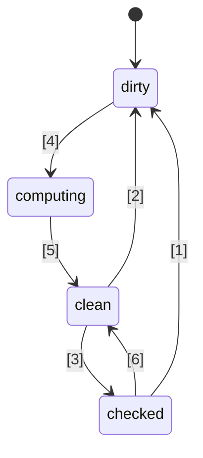
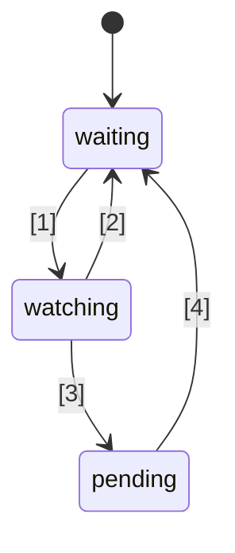

# 🚦 پیشنهاد استاندارد سیگنال‌های جاوااسکریپت 🚦


مرحله ۱ ([توضیح](https://tc39.es/process-document/))

حامیان پیشنهاد TC39: دنیل ارنبرگ، یهودا کاتز، جاتین رامناتان، شی لوئیس، کریستن هول گرت، دومینیک گاناوی، پرستون سگو، میلو ام، راب آیزنبرگ

نویسندگان اصلی: راب آیزنبرگ و دنیل ارنبرگ

این سند یک مسیر اولیه و مشترک برای سیگنال‌ها در جاوااسکریپت را توصیف می‌کند، مشابه تلاش Promises/A+ که پیش از استاندارد شدن Promiseها توسط TC39 در ES2015 انجام شد. خودتان امتحان کنید، با استفاده از [یک پلی‌فیل](https://github.com/proposal-signals/signal-polyfill).

مشابه Promises/A+، این تلاش بر هم‌راستا کردن اکوسیستم جاوااسکریپت متمرکز است. اگر این هم‌راستایی موفقیت‌آمیز باشد، یک استاندارد می‌تواند بر اساس آن تجربه شکل بگیرد. چندین نویسنده فریم‌ورک در اینجا بر روی یک مدل مشترک همکاری می‌کنند که می‌تواند هسته ری‌اکتیویتی فریم‌ورک آن‌ها را پشتیبانی کند. پیش‌نویس فعلی بر اساس ورودی‌های طراحی نویسندگان/نگهدارندگان [Angular](https://angular.io/)، [Bubble](https://bubble.io/)، [Ember](https://emberjs.com/)، [FAST](https://www.fast.design/)، [MobX](https://mobx.js.org/)، [Preact](https://preactjs.com/)، [Qwik](https://qwik.dev/)، [RxJS](https://rxjs.dev/)، [Solid](https://www.solidjs.com/)، [Starbeam](https://www.starbeamjs.com/)، [Svelte](https://svelte.dev/)، [Vue](https://vuejs.org/)، [Wiz](https://blog.angular.io/angular-and-wiz-are-better-together-91e633d8cd5a)، و دیگران بنا شده است…

برخلاف Promises/A+، ما سعی نداریم یک API سطح توسعه‌دهنده مشترک ارائه دهیم، بلکه بر مفاهیم دقیق هسته گراف سیگنال تمرکز داریم. این پیشنهاد شامل یک API کاملاً مشخص است، اما این API عمدتاً برای توسعه‌دهندگان برنامه‌های کاربردی هدف‌گذاری نشده است. در عوض، API سیگنال ارائه‌شده اینجا تناسب بهتری برای فریم‌ورک‌ها جهت توسعه بر پایه آن دارد و از طریق گراف سیگنال مشترک و مکانیزم خودکار ردیابی، قابلیت همکاری را فراهم می‌کند.

برنامه این پیشنهاد انجام نمونه‌سازی اولیه قابل توجه، از جمله یکپارچه‌سازی در چندین فریم‌ورک، پیش از پیشرفت به فراتر از مرحله ۱ است. ما تنها در صورتی به استانداردسازی سیگنال‌ها علاقه‌مندیم که آن‌ها برای استفاده عملی در چندین فریم‌ورک مناسب باشند و مزایای واقعی نسبت به سیگنال‌های ارائه‌شده توسط فریم‌ورک‌ها داشته باشند. امیدواریم نمونه‌سازی اولیه گسترده این اطلاعات را در اختیار ما قرار دهد. برای جزئیات بیشتر به بخش "وضعیت و برنامه توسعه" در ادامه مراجعه کنید.

## پیش‌زمینه: چرا سیگنال‌ها؟

برای توسعه یک رابط کاربری (UI) پیچیده، توسعه‌دهندگان برنامه جاوااسکریپت نیاز دارند که وضعیت را ذخیره، محاسبه، ابطال، همگام‌سازی و به لایه نمایشی برنامه به شکل کارآمد انتقال دهند. رابط‌های کاربری معمولاً فقط مدیریت مقادیر ساده نیستند، بلکه اغلب رندر کردن وضعیت محاسبه‌شده‌ای که وابسته به یک درخت پیچیده از مقادیر یا وضعیت دیگر (که خود نیز محاسبه شده‌اند) را شامل می‌شوند. هدف سیگنال‌ها فراهم کردن زیرساخت برای مدیریت چنین وضعیت برنامه است تا توسعه‌دهندگان بتوانند بر منطق تجاری تمرکز کنند نه این جزئیات تکراری.

ساختارهایی شبیه به سیگنال به طور مستقل در زمینه‌های غیر-UI نیز مفید واقع شده‌اند، به ویژه در سیستم‌های ساخت (build systems) برای اجتناب از بازسازی‌های غیرضروری.

سیگنال‌ها در برنامه‌نویسی واکنشی استفاده می‌شوند تا نیاز به مدیریت بروزرسانی در برنامه‌ها را حذف کنند.

> یک مدل برنامه‌نویسی اعلانی برای بروزرسانی مبتنی بر تغییرات وضعیت.

از _[Reactivity چیست؟](https://www.pzuraq.com/blog/what-is-reactivity)_.

#### مثال - شمارنده VanillaJS

با داشتن متغیری به نام `counter`، می‌خواهید در DOM نمایش دهید که شمارنده زوج است یا فرد. هر زمان که مقدار `counter` تغییر کند، می‌خواهید آخرین وضعیت زوج یا فرد بودن را در DOM بروزرسانی کنید. در جاوااسکریپت ساده، کد شما ممکن است به این صورت باشد:

```js
let counter = 0;
const setCounter = (value) => {
  counter = value;
  render();
};

const isEven = () => (counter & 1) == 0;
const parity = () => isEven() ? "even" : "odd";
const render = () => element.innerText = parity();

// شبیه‌سازی بروزرسانی‌های خارجی به counter...
setInterval(() => setCounter(counter + 1), 1000);
```
> [!NOTE]  
> از متغیرهای سراسری در اینجا فقط برای اهداف نمایشی استفاده شده است. راه‌حل‌های زیادی برای مدیریت صحیح وضعیت وجود دارد و مثال‌های این پیشنهاد به ساده‌ترین شکل ممکن ارائه شده‌اند. این پیشنهاد استفاده از متغیرهای سراسری را تشویق نمی‌کند.


این کد چندین مشکل دارد...

* راه‌اندازی `counter` پر سر و صدا و شامل کد تکراری زیاد است.
* وضعیت `counter` به طور محکم به سیستم رندر وابسته است.
* اگر مقدار `counter` تغییر کند اما `parity` تغییر نکند (مثلاً مقدار شمارنده از ۲ به ۴ برود)، ما محاسبه غیرضروری وضعیت زوج/فرد و رندر غیرضروری انجام داده‌ایم.
* اگر بخش دیگری از UI فقط بخواهد هنگام بروزرسانی `counter` رندر شود چه می‌شود؟
* اگر بخش دیگری از UI فقط به `isEven` یا `parity` وابسته باشد چه؟

حتی در این سناریوی نسبتاً ساده، مشکلات متعددی به سرعت بروز می‌کند. می‌توانیم سعی کنیم با معرفی pub/sub برای `counter` این مشکلات را دور بزنیم. این کار به مصرف‌کنندگان بیشتری از `counter` اجازه می‌دهد که واکنش‌های خود به تغییر وضعیت را اضافه کنند.

با این حال، هنوز با مشکلات زیر مواجه‌ایم:

* تابع رندر که فقط به `parity` وابسته است باید "بداند" که در واقع باید به `counter` مشترک شود.
* امکان بروزرسانی UI فقط بر اساس `isEven` یا `parity` بدون تعامل مستقیم با `counter` وجود ندارد.
* حجم کد تکراری ما بیشتر شده است. هر زمان که چیزی را استفاده می‌کنید، دیگر فقط فراخوانی یک تابع یا خواندن یک متغیر نیست، بلکه باید اشتراک‌گذاری و بروزرسانی را مدیریت کنید. مدیریت لغو اشتراک هم به خصوص پیچیده است.

اکنون می‌توانیم برخی مشکلات را با افزودن pub/sub نه فقط به `counter` بلکه به `isEven` و `parity` هم حل کنیم. در این صورت باید `isEven` را به `counter`، `parity` را به `isEven` و `render` را به `parity` مشترک کنیم. متاسفانه، نه تنها حجم کد تکراری ما بسیار زیاد می‌شود، بلکه با حجم زیادی از مدیریت اشتراک‌گذاری و خطر نشت حافظه روبرو هستیم، اگر همه چیز را به روش صحیح پاک‌سازی نکنیم. بنابراین، برخی مشکلات را حل کرده‌ایم اما دسته‌ای جدید از مشکلات و کد فراوان را ایجاد کرده‌ایم. بدتر از آن، باید این فرآیند را برای هر بخش از وضعیت سیستم تکرار کنیم.

### معرفی سیگنال‌ها

انتزاع‌های اتصال داده در UIها برای مدل و نما مدت‌هاست که هسته فریم‌ورک‌های UI در زبان‌های برنامه‌نویسی مختلف بوده‌اند، با وجود نبود چنین مکانیزمی در JS یا پلتفرم وب. در فریم‌ورک‌ها و کتابخانه‌های JS، آزمایش‌های زیادی برای نمایش این اتصال انجام شده و تجربه نشان داده است که جریان یک‌طرفه داده همراه با یک نوع داده درجه یک که نمایانگر یک سلول وضعیت یا محاسبه مشتق شده از داده‌های دیگر است (که امروزه غالباً "سیگنال" نامیده می‌شود) بسیار قدرتمند است.
رویکرد مقدار واکنشی درجه یک به نظر می‌رسد اولین بار در فریم‌ورک‌های وب جاوااسکریپت متن‌باز با [Knockout](https://knockoutjs.com/) [در سال ۲۰۱۰](https://blog.stevensanderson.com/2010/07/05/introducing-knockout-a-ui-library-for-javascript/) محبوب شده باشد. در سال‌های بعد، انواع و پیاده‌سازی‌های زیادی ایجاد شده‌اند. در ۳-۴ سال اخیر، مفهوم اولیه سیگنال و رویکردهای مرتبط، محبوبیت بیشتری یافته‌اند، به طوری که تقریباً هر کتابخانه یا فریم‌ورک مدرن جاوااسکریپت چیزی مشابه با نام‌های مختلف ارائه می‌دهد.

برای درک سیگنال‌ها، بیایید به مثال بالا نگاه کنیم که با API سیگنال بازطراحی شده است.

#### مثال - شمارنده با سیگنال‌ها

```js
const counter = new Signal.State(0);
const isEven = new Signal.Computed(() => (counter.get() & 1) == 0);
const parity = new Signal.Computed(() => isEven.get() ? "even" : "odd");

// یک کتابخانه یا فریم‌ورک افکت‌هایی را بر اساس سایر سیگنال‌ها تعریف می‌کند
declare function effect(cb: () => void): (() => void);

effect(() => element.innerText = parity.get());

// شبیه‌سازی بروزرسانی‌های خارجی به counter...
setInterval(() => counter.set(counter.get() + 1), 1000);
```

چند نکته را فوراً می‌توان مشاهده کرد:
* کد تکراری و پر سر و صدای مربوط به متغیر `counter` از مثال قبلی حذف شده است.
* یک API یکپارچه برای مدیریت مقادیر، محاسبات و افکت‌های جانبی وجود دارد.
* هیچ مشکل مرجع حلقوی یا وابستگی معکوسی بین `counter` و `render` وجود ندارد.
* اشتراک‌گذاری دستی یا نیاز به مدیریت آن وجود ندارد.
* راهی برای کنترل زمان‌بندی/برنامه‌ریزی افکت‌های جانبی وجود دارد.

سیگنال‌ها بسیار بیشتر از آنچه در سطح API دیده می‌شود به ما ارائه می‌دهند:
* **ردیابی خودکار وابستگی‌ها** - یک سیگنال محاسباتی به طور خودکار هر سیگنال دیگری را که به آن وابسته است، چه آن سیگنال‌ها مقادیر ساده باشند یا محاسبات دیگر، کشف می‌کند.
* **ارزیابی تنبل (Lazy Evaluation)** - محاسبات هنگام اعلام شدن به صورت پیش‌دستانه ارزیابی نمی‌شوند و همچنین زمانی که وابستگی‌های آن‌ها تغییر می‌کند فوراً ارزیابی نمی‌شوند. آن‌ها فقط زمانی ارزیابی می‌شوند که مقدارشان به طور صریح درخواست شود.
* **حافظه‌سازی (Memoization)** - سیگنال‌های محاسباتی آخرین مقدار خود را ذخیره می‌کنند تا در صورتی که وابستگی‌هایشان تغییری نکرده باشد، محاسبه مجدد لازم نباشد، فارغ از این‌که چند بار به آن دسترسی پیدا شود.

## انگیزه برای استانداردسازی سیگنال‌ها

#### همکاری‌پذیری (Interoperability)

هر پیاده‌سازی سیگنال سازوکار ردیابی خودکار مخصوص به خود را دارد تا منابعی را که هنگام ارزیابی یک سیگنال محاسباتی مشاهده می‌شوند، ثبت کند. این موضوع اشتراک‌گذاری مدل‌ها، کامپوننت‌ها و کتابخانه‌ها بین فریمورک‌های مختلف را دشوار می‌کند—چرا که معمولاً به موتور نمایشی خود وابسته هستند (زیرا سیگنال‌ها اغلب به عنوان بخشی از فریمورک‌های JS پیاده‌سازی می‌شوند).

یکی از اهداف این پیشنهاد، جداسازی کامل مدل واکنشی از نمای رندرینگ است، تا توسعه‌دهندگان بتوانند بدون بازنویسی کدهای غیر UI خود به فناوری‌های رندرینگ جدید مهاجرت کنند، یا مدل‌های واکنشی مشترک در JS را برای استقرار در زمینه‌های مختلف توسعه دهند. متأسفانه به دلیل نسخه‌بندی و تکرار، رسیدن به سطح بالایی از اشتراک‌گذاری از طریق کتابخانه‌های سطح JS عملی نبوده است—ساختارهای داخلی (built-in) تضمین اشتراک‌گذاری قوی‌تری ارائه می‌دهند.

#### عملکرد/مصرف حافظه

همیشه این امکان وجود دارد که با داخلی شدن کتابخانه‌های پرکاربرد، کد کمتری ارسال شود و افزایش عملکرد کمی رخ دهد، اما معمولاً پیاده‌سازی‌های سیگنال بسیار کوچک‌اند، بنابراین انتظار نداریم این اثر خیلی بزرگ باشد.

ما گمان می‌کنیم پیاده‌سازی‌های بومی C++ برای ساختار داده‌ها و الگوریتم‌های مرتبط با سیگنال می‌تواند کمی بهینه‌تر از آن چیزی باشد که در JS قابل دستیابی است (در حد یک ضریب ثابت). با این حال، هیچ تغییری در الگوریتم نسبت به آنچه که در polyfill خواهد بود، پیش‌بینی نمی‌شود؛ انتظار نمی‌رود موتور‌ها اینجا جادو کنند و الگوریتم‌های واکنشی نیز دقیق و بدون ابهام تعریف خواهند شد.

گروه راهبری انتظار دارد که پیاده‌سازی‌های مختلفی از سیگنال‌ها را توسعه دهد و از آن‌ها برای بررسی این امکان‌های عملکردی استفاده کند.

#### ابزارهای توسعه (DevTools)

در کتابخانه‌های سیگنال مبتنی بر زبان JS فعلی، ردیابی مواردی مانند موارد زیر دشوار است:
* پشته فراخوانی (callstack) در زنجیره‌ای از سیگنال‌های محاسباتی، که زنجیره علّی برای یک خطا را نشان می‌دهد
* نمودار ارجاع بین سیگنال‌ها، وقتی یکی به دیگری وابسته است—مهم هنگام اشکال‌زدایی مصرف حافظه

سیگنال‌های داخلی این امکان را برای محیط‌های اجرایی JS و ابزارهای توسعه فراهم می‌کنند تا پشتیبانی بهتری برای بازرسی سیگنال‌ها داشته باشند، به ویژه برای اشکال‌زدایی یا تحلیل عملکرد، چه این امکان در مرورگرها تعبیه شده باشد یا از طریق افزونه مشترک. ابزارهای موجود مانند بازرس المنت، عکس‌برداری عملکرد و پروفایلرهای حافظه می‌توانند به‌روزرسانی شوند تا سیگنال‌ها را به طور خاص در ارائه اطلاعات برجسته کنند.

#### مزایای ثانویه

##### مزایای یک کتابخانه استاندارد

به طور کلی، کتابخانه استاندارد جاوااسکریپت نسبتاً مینیمال بوده است، اما روندی در TC39 وجود دارد که JS را به زبانی "همراه با باتری" (batteries-included) تبدیل کند، با مجموعه‌ای با کیفیت بالا و داخلی از قابلیت‌ها. به عنوان مثال، Temporal جایگزین moment.js شده است و تعدادی ویژگی کوچک مانند `Array.prototype.flat` و `Object.groupBy` بسیاری از کاربردهای lodash را جایگزین کرده‌اند. مزایا شامل اندازه بسته‌های کوچکتر، ثبات و کیفیت بهتر، یادگیری کمتر هنگام ورود به پروژه جدید و واژگان مشترک در بین توسعه‌دهندگان JS است.

##### یکپارچگی با HTML/DOM (یک امکان آینده)

کار فعلی در W3C و توسعه‌دهندگان مرورگر به دنبال آوردن قالب‌بندی بومی به HTML است ([DOM Parts][wicg-pr-1023] و [Template Instantiation][wicg-propsal-template-instantiation]). همچنین، گروه کامپوننت‌های وب W3C در حال بررسی امکان گسترش کامپوننت‌های وب برای ارائه یک API کاملاً اعلامی HTML است. برای دستیابی به هر دوی این اهداف، در نهایت یک عنصر اولیه واکنشی توسط HTML مورد نیاز خواهد بود. همچنین بسیاری از بهبودهای ارگونومیک برای DOM از طریق یکپارچگی سیگنال‌ها قابل تصور است و توسط جامعه درخواست شده است.

[wicg-pr-1023]: https://github.com/WICG/webcomponents/pull/1023
[wicg-propsal-template-instantiation]: https://github.com/WICG/webcomponents/blob/gh-pages/proposals/Template-Instantiation.md

> توجه داشته باشید، این یکپارچگی تلاشی جداگانه خواهد بود که بعداً انجام می‌شود و بخشی از این پیشنهاد نیست.

##### تبادل اطلاعات اکوسیستم (دلیلی برای عرضه نیست)

تلاش‌های استانداردسازی گاهی می‌تواند صرفاً در سطح "جامعه" مفید باشد، حتی بدون تغییر در مرورگرها. تلاش برای سیگنال‌ها بسیاری از نویسندگان فریمورک‌های مختلف را برای بحث عمیق درباره ماهیت واکنش‌پذیری، الگوریتم‌ها و همکاری‌پذیری گرد هم آورده است. این موضوع تا کنون مفید بوده است، اما دلیلی برای اضافه شدن به موتورهای JS و مرورگرها محسوب نمی‌شود؛ سیگنال‌ها باید فقط در صورت داشتن مزایای قابل توجه *فراتر از* تبادل اطلاعات اکوسیستم به استاندارد جاوااسکریپت افزوده شوند.

## اهداف طراحی برای سیگنال‌ها

مشخص شده است که کتابخانه‌های سیگنال فعلی در هسته خود تفاوت چندانی با یکدیگر ندارند. این پیشنهاد قصد دارد با پیاده‌سازی ویژگی‌های مهم بسیاری از آن کتابخانه‌ها، بر موفقیت آن‌ها بنا نهد.

### ویژگی‌های اصلی

* یک نوع سیگنال که حالت را نمایش می‌دهد، یعنی سیگنال قابل نوشتن. این مقداری است که سایرین می‌توانند بخوانند.
* یک نوع سیگنال محاسباتی/حافظه‌ای/مشتق‌شده که به دیگران وابسته است و به صورت تنبل محاسبه و ذخیره می‌شود.
    * محاسبه تنبل است، به این معنی که سیگنال‌های محاسباتی به طور پیش‌فرض زمانی که یکی از وابستگی‌هایشان تغییر می‌کند دوباره محاسبه نمی‌شوند، بلکه فقط زمانی اجرا می‌شوند که کسی واقعاً آن‌ها را بخواند.
    * محاسبه بدون "[گلیچ](https://en.wikipedia.org/wiki/Reactive_programming#Glitches)" است، به این معنی که هیچ محاسبه غیرضروری انجام نمی‌شود. این بدین معناست که وقتی یک برنامه یک سیگنال محاسباتی را می‌خواند، بخش‌های بالقوه آلوده نمودار به صورت توپولوژیکی مرتب می‌شوند تا هیچ تکراری اجرا نشود.
    * محاسبه ذخیره می‌شود، یعنی اگر پس از آخرین تغییر وابستگی، دیگر هیچ وابستگی تغییر نکرده باشد، آنگاه سیگنال محاسباتی هنگام دسترسی مجدد محاسبه نمی‌شود.
    * مقایسه‌های سفارشی هم برای سیگنال‌های محاسباتی و هم سیگنال‌های حالت امکان‌پذیر است تا تشخیص داده شود چه زمانی سیگنال‌های محاسباتی دیگر که به آن‌ها وابسته هستند باید به‌روزرسانی شوند.
* واکنش به وضعیتی که یک سیگنال محاسباتی یکی از وابستگی‌هایش (یا وابستگی‌های تو در تو) "آلوده" شده و تغییر می‌کند، یعنی ممکن است مقدار سیگنال منسوخ شده باشد.
    * این واکنش برای زمان‌بندی انجام کارهای مهم‌تر در آینده در نظر گرفته شده است.
    * افکت‌ها بر اساس این واکنش‌ها و زمان‌بندی در سطح فریمورک پیاده‌سازی می‌شوند.
    * سیگنال‌های محاسباتی باید بتوانند به ثبت شدن به عنوان یک وابستگی (تو در تو) یکی از این واکنش‌ها واکنش نشان دهند.
* امکان دادن به فریمورک‌های JS برای انجام زمان‌بندی خودشان. هیچ زمان‌بندی اجباری به سبک Promise به صورت داخلی وجود ندارد.
    * واکنش‌های همزمان لازم است تا امکان زمان‌بندی کارهای بعدی بر اساس منطق فریمورک فراهم شود.
    * نوشتن‌ها همزمان است و بلافاصله اثر می‌گذارد (یک فریمورک که می‌خواهد نوشتن‌ها را دسته‌ای انجام دهد می‌تواند این کار را روی آن انجام دهد).
    * امکان جدا کردن بررسی اینکه آیا یک افکت ممکن است "آلوده" باشد از اجرای واقعی افکت وجود دارد (امکان زمان‌بندی افکت دو مرحله‌ای).
* امکان خواندن سیگنال‌ها *بدون* ثبت شدن به عنوان وابستگی (`untrack`)
* امکان ترکیب کدبیس‌های مختلف که از سیگنال‌ها/واکنش‌پذیری استفاده می‌کنند، مثلاً،
    * استفاده از چندین فریمورک به طور همزمان از نظر ردیابی/واکنش‌پذیری (با استثناهای ذکر شده)
    * ساختارهای داده واکنشی مستقل از فریمورک (مثلاً پراکسی فروشگاه بازگشتی، Map و Set و Array واکنشی و غیره)

### اعتبار (Soundness)

* جلوگیری/ممنوعیت استفاده نادرست از واکنش‌های همزمان.
    * ریسک اعتبار: ممکن است "[گلیچ](https://en.wikipedia.org/wiki/Reactive_programming#Glitches)" ایجاد کند اگر به درستی استفاده نشود: اگر رندرینگ بلافاصله هنگام ست شدن سیگنال انجام شود، ممکن است وضعیت ناقص برنامه به کاربر نهایی نشان داده شود. بنابراین این ویژگی فقط باید برای زمان‌بندی هوشمندانه کارها برای بعد، زمانی که منطق برنامه به پایان رسیده، استفاده شود.
    * راه‌حل: خواندن و نوشتن هر سیگنال از داخل callback واکنش همزمان ممنوع شود.
* discourages `untrack` و نشانه‌گذاری ماهیت ناامن آن
    * ریسک اعتبار: اجازه می‌دهد سیگنال‌های محاسباتی‌ای ساخته شود که مقدارشان به سیگنال‌های دیگر وابسته است اما هنگام تغییر آن سیگنال‌ها به‌روزرسانی نمی‌شوند. باید زمانی استفاده شود که دسترسی‌های بدون ردیابی نتیجه محاسبه را تغییر نمی‌دهد.
    * راه‌حل: API با نام "unsafe" علامت‌گذاری می‌شود.
* توجه: این پیشنهاد اجازه می‌دهد سیگنال‌ها هم از سیگنال‌های محاسباتی و هم افکت خوانده و نوشته شوند، بدون محدودیت روی نوشتن‌هایی که پس از خواندن انجام می‌شوند، با وجود ریسک اعتبار. این تصمیم برای حفظ انعطاف و سازگاری با فریمورک‌ها اتخاذ شده است.

### رابط کاربری سطحی (Surface API)

* باید پایه‌ای محکم برای پیاده‌سازی سازوکارهای سیگنال/واکنش‌پذیری توسط چندین فریمورک باشد.
    * باید پایه خوبی برای پراکسی‌های فروشگاه بازگشتی، واکنش‌پذیری فیلد کلاس مبتنی بر دکوریتور و APIهای سبک `.value` و `[state, setState]` باشد.
    * معناشناسی باید الگوهای معتبری که توسط فریمورک‌های مختلف فعال می‌شوند را بیان کند. مثلاً باید ممکن باشد این سیگنال‌ها مبنای نوشتن‌های فوراً منعکس‌شونده یا نوشتن‌هایی باشند که بعداً به صورت دسته‌ای اعمال می‌شوند.
* خوب است اگر این API مستقیماً توسط توسعه‌دهندگان جاوااسکریپت قابل استفاده باشد.
    * اگر یک ویژگی با مفهومی در اکوسیستم مطابقت دارد، استفاده از واژگان مشترک خوب است.
        * با این حال، مهم است که دقیقاً از همان نام‌ها استفاده نشود!
    * تنش بین "قابلیت استفاده توسط توسعه‌دهندگان JS" و "فراهم کردن همه hookها برای فریمورک‌ها"
        * ایده: همه hookها فراهم شود اما در صورت استفاده نادرست، خطا صادر شود اگر ممکن باشد.
        * ایده: APIهای ظریف در یک فضای نام `subtle` قرار گیرند، مشابه [`crypto.subtle`](https://developer.mozilla.org/en-US/docs/Web/API/Crypto/subtle)، تا مرز بین APIهای لازم برای استفاده پیشرفته مثل پیاده‌سازی فریمورک یا ابزار توسعه با استفاده روزمره مثل ساخت سیگنال برای استفاده با یک فریمورک مشخص شود.
* باید پیاده‌سازی و استفاده با عملکرد خوب ممکن باشد—رابط کاربری سطحی نباید سربار زیادی ایجاد کند
    * امکان زیرکلاس‌گیری فراهم شود تا فریمورک‌ها بتوانند متدها و فیلدهای خود، از جمله فیلدهای خصوصی را اضافه کنند. این موضوع برای جلوگیری از تخصیص‌های اضافی در سطح فریمورک مهم است. به بخش "مدیریت حافظه" در ادامه مراجعه کنید.

### مدیریت حافظه

* اگر ممکن باشد: یک سیگنال محاسباتی باید در صورتی که هیچ ارجاع زنده‌ای برای خواندن‌های آینده به آن وجود ندارد، حتی اگر در یک گراف گسترده‌تر باقی بماند که زنده است (مثلاً با خواندن یک state که زنده مانده است)، قابل جمع‌آوری توسط garbage collector باشد.
* توجه داشته باشید که اکثر فریمورک‌های امروزی نیاز به حذف صریح سیگنال‌های محاسبه‌شده دارند اگر آن‌ها هرگونه ارجاع به یا از یک گراف سیگنال دیگر که همچنان فعال باقی مانده است، داشته باشند.
* این موضوع زمانی چندان بد نمی‌شود که طول عمر آن‌ها به طول عمر یک مؤلفه UI گره خورده باشد و افکت‌ها به هر حال باید حذف شوند.
* اگر اجرای این مفاهیم بیش از حد پرهزینه باشد، باید حذف صریح (یا «قطع ارتباط») سیگنال‌های محاسبه‌شده را به API زیر اضافه کنیم که در حال حاضر فاقد آن است.
* هدف مرتبط جداگانه: کمینه‌سازی تعداد تخصیص‌ها، به عنوان مثال:
    * برای ساخت یک سیگنال قابل نوشتن (اجتناب از دو بسته‌بندی مجزا + آرایه)
    * برای پیاده‌سازی افکت‌ها (اجتناب از یک بسته‌بندی برای هر واکنش جداگانه)
    * در API مشاهده تغییرات سیگنال، از ایجاد ساختارهای داده موقتی اضافی خودداری شود
    * راه‌حل: API مبتنی بر کلاس که امکان استفاده مجدد از متدها و فیلدهای تعریف‌شده در زیرکلاس‌ها را فراهم می‌کند

## طرح اولیه API

ایده اولیه‌ای از یک API سیگنال در زیر آمده است. توجه داشته باشید که این تنها یک پیش‌نویس اولیه است و انتظار داریم در طول زمان تغییراتی رخ دهد. بیایید با فایل کامل `.d.ts` شروع کنیم تا ایده‌ای از ساختار کلی به دست آوریم، سپس جزئیات معنای هر بخش را بررسی خواهیم کرد.

```ts
interface Signal<T> {
    // دریافت مقدار سیگنال
    get(): T;
}

namespace Signal {
    // یک سیگنال خواندنی-نوشتنی
    class State<T> implements Signal<T> {
        // ساخت یک سیگنال state با مقدار اولیه t
        constructor(t: T, options?: SignalOptions<T>);

        // دریافت مقدار سیگنال
        get(): T;

        // تنظیم مقدار سیگنال state به t
        set(t: T): void;
    }

    // یک سیگنال که یک فرمول بر اساس سیگنال‌های دیگر است
    class Computed<T = unknown> implements Signal<T> {
        // ساخت سیگنالی که به مقداری که توسط callback بازگردانده می‌شود ارزیابی می‌شود.
        // callback با این سیگنال به عنوان مقدار this فراخوانی می‌شود.
        constructor(cb: (this: Computed<T>) => T, options?: SignalOptions<T>);

        // دریافت مقدار سیگنال
        get(): T;
    }

    // این فضای نام شامل ویژگی‌های "پیشرفته"‌ای است که بهتر است
    // برای نویسندگان فریمورک حفظ شود تا توسعه‌دهندگان برنامه.
    // مشابه با `crypto.subtle`
    namespace subtle {
        // اجرای یک callback با غیرفعال بودن کامل پیگیری
        function untrack<T>(cb: () => T): T;

        // دریافت سیگنال محاسبه‌شده فعلی که هر خواندن سیگنال را پیگیری می‌کند، در صورت وجود
        function currentComputed(): Computed | null;

        // بازمی‌گرداند لیست مرتب‌شده همه سیگنال‌هایی که این سیگنال
        // در آخرین بار اجرا به آن‌ها ارجاع داده است.
        // برای Watcher، مجموعه سیگنال‌هایی را فهرست می‌کند که آن را مشاهده می‌کند.
        function introspectSources(s: Computed | Watcher): (State | Computed)[];

        // بازمی‌گرداند Watcherهایی که این سیگنال در آن‌ها قرار دارد، به علاوه هر
        // سیگنال Computed که آخرین بار این سیگنال را خوانده است،
        // اگر آن سیگنال محاسبه‌شده (به صورت بازگشتی) مشاهده شود.
        function introspectSinks(s: State | Computed): (Computed | Watcher)[];

        // اگر این سیگنال "زنده" باشد، یعنی توسط Watcher مشاهده شود،
        // یا توسط یک سیگنال Computed که (به طور بازگشتی) زنده است خوانده شود، مقدار true بازمی‌گرداند.
        function hasSinks(s: State | Computed): boolean;

        // اگر این عنصر "واکنشی" باشد، یعنی به سیگنال دیگری وابسته باشد مقدار true بازمی‌گرداند.
        // یک Computed که hasSources آن false است، همواره مقدار ثابت یکسانی را بازمی‌گرداند.
        function hasSources(s: Computed | Watcher): boolean;

        class Watcher {
            // زمانی که یک منبع (بازگشتی) Watcher نوشته شود، این callback را فراخوانی می‌کند،
            // اگر از آخرین فراخوانی `watch` فراخوانی نشده باشد.
            // در طول notify هیچ سیگنالی نباید خوانده یا نوشته شود.
            constructor(notify: (this: Watcher) => void);

            // این سیگنال‌ها را به مجموعه Watcher اضافه می‌کند و Watcher را تنظیم می‌کند تا
            // callback notify را دفعه بعد که هر سیگنالی در مجموعه (یا یکی از وابستگی‌های آن) تغییر کرد اجرا کند.
            // می‌توان بدون آرگومان نیز فراخوانی کرد تا فقط وضعیت "اعلان‌شده" را ریست کند، به طوری که
            // callback notify دوباره فراخوانی شود.
            watch(...s: Signal[]): void;

            // این سیگنال‌ها را از مجموعه مشاهده‌شده حذف می‌کند (مثلاً برای یک افکت که حذف شده است)
            unwatch(...s: Signal[]): void;

            // مجموعه منابعی که در مجموعه Watcher هنوز کثیف هستند یا یک سیگنال محاسبه‌شده
            // با منبعی که کثیف یا در حالت pending است و هنوز بازارزیابی نشده را بازمی‌گرداند
            getPending(): Signal[];
        }

        // هوک‌هایی برای مشاهده آغاز یا پایان مشاهده
        var watched: Symbol;
        var unwatched: Symbol;
    }

    interface SignalOptions<T> {
        // تابع مقایسه سفارشی بین مقدار قدیم و جدید. پیش‌فرض: Object.is.
        // سیگنال به عنوان مقدار this برای زمینه ارسال می‌شود.
        equals?: (this: Signal<T>, t: T, t2: T) => boolean;
```
```ts
    // تابع بازخوانی شده زمانی که isWatched به true تبدیل می‌شود، اگر قبلاً false بوده باشد
    [Signal.subtle.watched]?: (this: Signal<T>) => void;

    // تابع بازخوانی شده هر زمان که isWatched به false تبدیل می‌شود، اگر قبلاً true بوده باشد
    [Signal.subtle.unwatched]?: (this: Signal<T>) => void;
}
```

### سیگنال‌ها چگونه کار می‌کنند

یک Signal نمایانگر یک سلول داده است که ممکن است در طول زمان تغییر کند. سیگنال‌ها می‌توانند "state" (فقط یک مقدار که به صورت دستی تنظیم می‌شود) یا "computed" (یک فرمول مبتنی بر سایر سیگنال‌ها) باشند.

سیگنال‌های محاسبه‌شده به صورت خودکار ردیابی می‌کنند که کدام سیگنال‌های دیگر در طول ارزیابی آن‌ها خوانده می‌شوند. وقتی یک سیگنال محاسبه‌شده خوانده می‌شود، بررسی می‌کند که آیا هر یک از وابستگی‌های ثبت‌شده قبلی‌اش تغییر کرده‌اند یا خیر، و در صورت تغییر، خودش را مجدداً ارزیابی می‌کند. وقتی چند سیگنال محاسبه‌شده تو در تو باشند، همه تخصیص ردیابی به داخلی‌ترین سیگنال مربوط می‌شود.

سیگنال‌های محاسبه‌شده تنبل (lazy) هستند، یعنی مبتنی بر کشش (pull-based): آن‌ها فقط زمانی مجدداً ارزیابی می‌شوند که به آن‌ها دسترسی پیدا شود، حتی اگر یکی از وابستگی‌هایشان قبلاً تغییر کرده باشد.

تابعی که به سیگنال‌های محاسبه‌شده داده می‌شود، معمولاً باید "خالص" باشد، به این معنا که یک تابع قطعی و بدون عوارض جانبی از سایر سیگنال‌هایی باشد که به آن‌ها دسترسی دارد. در عین حال، زمان‌بندی فراخوانی تابع، قطعی است و این امکان را می‌دهد که با احتیاط از عوارض جانبی استفاده شود.

سیگنال‌ها دارای کش/مموایز کردن برجسته‌ای هستند: هم سیگنال‌های state و هم computed مقدار فعلی خود را به خاطر می‌سپارند و فقط زمانی باعث بازمحاسبه سیگنال‌های محاسبه‌شده‌ای می‌شوند که به آن‌ها ارجاع می‌دهند، که واقعاً تغییر کنند. حتی مقایسه مکرر مقدار قدیم و جدید لازم نیست—مقایسه فقط یک بار زمانی که سیگنال منبع بازنشانی/بازارزیابی می‌شود، انجام می‌شود و مکانیزم سیگنال پیگیری می‌کند که کدام ارجاعات به آن سیگنال هنوز بر اساس مقدار جدید به‌روزرسانی نشده‌اند. درونی، این معمولاً از طریق "رنگ‌آمیزی گراف" پیاده‌سازی می‌شود همان‌طور که در (پست وبلاگ Milo) توضیح داده شده است.

سیگنال‌های محاسبه‌شده وابستگی‌های خود را به طور پویا ردیابی می‌کنند—هر بار که اجرا می‌شوند، ممکن است به چیزهای متفاوتی وابسته شوند و این مجموعه وابستگی دقیق در گراف سیگنال به‌روز نگه داشته می‌شود. این بدان معناست که اگر وابستگی فقط در یک شاخه لازم باشد و محاسبه قبلی شاخه دیگر را طی کرده باشد، در این صورت تغییر آن مقدار بلااستفاده موقت باعث بازمحاسبه سیگنال محاسبه‌شده نخواهد شد، حتی زمانی که کشیده شود.

برخلاف Promiseهای جاوااسکریپت، همه چیز در سیگنال‌ها به صورت همگام اجرا می‌شود:
- تنظیم مقدار جدید برای یک سیگنال به صورت همگام است و این فوراً در هر سیگنال محاسبه‌شده‌ای که به آن وابسته است، منعکس می‌شود. هیچ دسته‌بندی (batching) داخلی‌ای برای این تغییر وجود ندارد.
- خواندن سیگنال‌های محاسبه‌شده به صورت همگام انجام می‌شود—مقدار آن‌ها همیشه در دسترس است.
- تابع `notify` در Watchers، همان‌طور که در ادامه توضیح داده شده است، به صورت همگام و در طول فراخوانی `.set()` که آن را تحریک کرده اجرا می‌شود (اما بعد از اتمام رنگ‌آمیزی گراف).

مانند Promiseها، سیگنال‌ها می‌توانند وضعیت خطا را نمایش دهند: اگر تابع callback یک سیگنال محاسبه‌شده استثنا پرتاب کند، آن خطا مانند هر مقدار دیگری کش می‌شود و هر بار که سیگنال خوانده می‌شود مجدداً پرتاب می‌شود.

### درک کلاس Signal

یک نمونه از `Signal` نمایانگر قابلیت خواندن یک مقدار پویا است که به‌روزرسانی‌های آن در طول زمان ردیابی می‌شود. همچنین به طور ضمنی شامل قابلیت اشتراک در سیگنال است، به طور ضمنی از طریق دسترسی ردیابی شده از یک سیگنال محاسبه‌شده دیگر.

این API به گونه‌ای طراحی شده که با اجماع تقریبی اکوسیستم بین بخش بزرگی از کتابخانه‌های سیگنال در استفاده از نام‌هایی مانند "signal"، "computed" و "state" مطابقت داشته باشد. با این حال، دسترسی به سیگنال‌های Computed و State از طریق متد `.get()` انجام می‌شود، که با همه APIهای محبوب سیگنال که یا از دسترسی به سبک `.value` یا سینتکس فراخوانی `signal()` استفاده می‌کنند، تفاوت دارد.

این API برای کاهش تعداد تخصیص‌ها طراحی شده است تا سیگنال‌ها برای جاسازی در فریمورک‌های جاوااسکریپت مناسب باشند در حالی که به همان یا عملکردی بهتر از سیگنال‌های سفارشی فریمورک‌های موجود دست یابند. این موارد را شامل می‌شود:
- سیگنال‌های state یک شیء قابل نوشتن منفرد هستند که می‌توان هم به آن دسترسی داشت و هم مقدار آن را از همان مرجع تنظیم کرد. (به پیامدهای زیر در بخش "جداسازی قابلیت" مراجعه کنید.)
- هر دو نوع سیگنال State و Computed به گونه‌ای طراحی شده‌اند که قابل زیرکلاس‌گیری باشند تا امکان افزودن ویژگی‌های بیشتر از طریق فیلدهای کلاس عمومی و خصوصی (و همچنین متدهای استفاده از آن state) را برای فریمورک‌ها فراهم کنند.
- فراخوانی‌های مختلف (مانند `equals`، تابع computed) با سیگنال مربوطه به عنوان مقدار `this` برای context فراخوانی می‌شوند، بنابراین نیازی به بستن جدید برای هر سیگنال نیست. در عوض، context می‌تواند در ویژگی‌های اضافی خود سیگنال ذخیره شود.

برخی شرایط خطایی که این API اعمال می‌کند:
- خواندن بازگشتی یک سیگنال محاسبه‌شده خطا است.
- تابع `notify` یک Watcher نمی‌تواند هیچ سیگنالی را بخواند یا بنویسد.
- اگر callback یک سیگنال محاسبه‌شده استثنا پرتاب کند، دسترسی‌های بعدی به سیگنال همان خطای کش‌شده را مجدداً پرتاب می‌کنند، تا زمانی که یکی از وابستگی‌ها تغییر کند و مجدداً محاسبه شود.

برخی شرایط که *اعمال نمی‌شوند*:
- سیگنال‌های محاسبه‌شده می‌توانند به سیگنال‌های دیگر بنویسند، به صورت همگام درون تابع callback خود
- کاری که توسط callback `notify` یک Watcher در صف قرار می‌گیرد ممکن است سیگنال‌ها را بخواند یا بنویسد، که این امکان را می‌دهد تا [الگوهای ضعیف کلاسیک React](https://react.dev/learn/you-might-not-need-an-effect) را از نظر سیگنال‌ها بازتولید کنید!

### پیاده‌سازی افکت‌ها

رابط `Watcher` که در بالا تعریف شد، مبنایی برای پیاده‌سازی APIهای متداول JS برای افکت‌ها فراهم می‌کند: callbackهایی که هنگام تغییر سیگنال‌های دیگر، صرفاً برای عوارض جانبی‌شان مجدداً اجرا می‌شوند. تابع `effect` که در مثال ابتدایی بالا استفاده شد می‌تواند به صورت زیر تعریف شود:

```ts
// این تابع معمولاً در یک کتابخانه/فریمورک قرار دارد، نه در کد برنامه
// توجه: این منطق زمان‌بندی بسیار ساده است و برای استفاده مناسب نیست. کپی/پیست نکنید.
let pending = false;

let w = new Signal.subtle.Watcher(() => {
    if (!pending) {
        pending = true;
        queueMicrotask(() => {
            pending = false;
            for (let s of w.getPending()) s.get();
            w.watch();
        });
    }
});

// یک سیگنال effect که به cb ارزیابی می‌شود و هر زمان که یکی از وابستگی‌هایش ممکن است تغییر کند، یک خوانش از خودش را در صف microtask قرار می‌دهد
export function effect(cb) {
    let destructor;
    let c = new Signal.Computed(() => { destructor?.(); destructor = cb(); });
    w.watch(c);
    c.get();
    return () => { destructor?.(); w.unwatch(c) };
}
```

API سیگنال هیچ تابع داخلی مانند `effect` ندارد. دلیل آن این است که زمان‌بندی effect ظریف است و اغلب با چرخه‌های رندر فریمورک و سایر وضعیت‌ها یا استراتژی‌های ویژه فریمورک در سطح بالا که JS به آن‌ها دسترسی ندارد، ارتباط دارد.

مروری بر عملیات مختلف استفاده شده در اینجا: callback `notify` که به سازنده Watcher داده می‌شود تابعی است که زمانی که سیگنال از حالت "پاک" (که کش مقداردهی اولیه و معتبر است) به حالت "بررسی شده" یا "کثیف" (که کش ممکن است معتبر یا نامعتبر باشد چون حداقل یکی از stateهایی که به طور بازگشتی به آن وابسته است تغییر کرده) می‌رود، فراخوانی می‌شود.

فراخوانی‌های `notify` در نهایت توسط فراخوانی `.set()` روی یک سیگنال state تحریک می‌شوند. این فراخوانی همگام است: قبل از اینکه `.set` بازگردد انجام می‌شود. اما نیازی نیست نگران باشید که این callback گراف سیگنال را در حالتی نیمه‌پردازش شده ببیند، زیرا در طول callback `notify` هیچ سیگنالی قابل خواندن یا نوشتن نیست، حتی در یک فراخوانی `untrack`. چون `notify` در طول `.set()` فراخوانی می‌شود، دارد یک رشته منطقی دیگر را قطع می‌کند که ممکن است کامل نشده باشد. برای خواندن یا نوشتن سیگنال‌ها از `notify`، کار را برنامه‌ریزی کنید تا بعداً اجرا شود، مثلاً با نوشتن سیگنال در یک لیست برای دسترسی بعدی، یا با `queueMicrotask` همان‌طور که در بالا آمده است.

توجه داشته باشید که کاملاً ممکن است بدون استفاده از `Signal.subtle.Watcher` و تنها با زمان‌بندی polling سیگنال‌های محاسبه‌شده (همان‌طور که Glimmer انجام می‌دهد) از سیگنال‌ها به طور مؤثر استفاده کنید. با این حال، بسیاری از فریمورک‌ها دریافته‌اند که اغلب بسیار مفید است که این منطق زمان‌بندی به صورت همگام اجرا شود، بنابراین API سیگنال آن را شامل می‌شود.

هم سیگنال‌های محاسبه‌شده و هم state مانند هر مقدار JS دیگری garbage-collect می‌شوند. اما Watcherها راه ویژه‌ای برای زنده نگه داشتن اشیا دارند: هر سیگنالی که توسط یک Watcher دیده می‌شود تا زمانی که هر یک از stateهای پایه قابل دسترس باشند، زنده نگه داشته می‌شود، زیرا این‌ها ممکن است یک فراخوانی `notify` آینده (و سپس یک `.get()` آینده) را تحریک کنند. به همین دلیل، به یاد داشته باشید که برای پاکسازی افکت‌ها باید `Watcher.prototype.unwatch` را فراخوانی کنید.

### یک راه فرار ناسالم

`Signal.subtle.untrack` یک راه فرار است که اجازه می‌دهد سیگنال‌ها *بدون* ردیابی این خوانش‌ها خوانده شوند. این قابلیت ناامن است زیرا اجازه می‌دهد سیگنال‌های محاسبه‌شده‌ای ساخته شوند که مقدارشان به سیگنال‌های دیگر وابسته است اما وقتی آن سیگنال‌ها تغییر می‌کنند به‌روزرسانی نمی‌شوند. باید زمانی استفاده شود که دسترسی‌های untracked نتیجه محاسبه را تغییر نمی‌دهد.

<!--
TODO: مثال جایی که استفاده از untrack ایده خوبی است

### استفاده از watched/unwatched
```
TODO: نمایش نمونه‌ای از تبدیل یک Observable به یک سیگنال محاسبه‌شده، که تنها زمانی که توسط یک اثر استفاده می‌شود، مشترک می‌شود

TODO: نمایش نمونه‌ای از یک سیگنال محاسبه‌شده که نتیجه‌ی یک fetch هدایت‌شده به یک وضعیت را نمایش می‌دهد، که لغو می‌شود

### درون‌بینی برای SSR

TODO: نمایش چگونگی کارکرد serialize کردن گراف سیگنال

TODO: نمایش چگونگی اینکه چگونه می‌توانید یک سیگنال را از حالت state به computed بعداً "hydrate" کنید، با استفاده از چند سیگنال.
-->

### فعلاً حذف شده

این ویژگی‌ها ممکن است بعداً اضافه شوند، اما در پیش‌نویس فعلی گنجانده نشده‌اند. حذف آن‌ها به دلیل نبود اجماع تثبیت‌شده در فضای طراحی میان فریم‌ورک‌ها و همچنین قابلیت اثبات‌شده برای دور زدن نبود آن‌ها با مکانیزم‌هایی بر پایه مفهوم سیگنال‌ها که در این سند توضیح داده شده، است. با این حال، متأسفانه این حذف‌ها پتانسیل همکاری بین فریم‌ورک‌ها را محدود می‌کند. با تولید نمونه‌های اولیه از سیگنال‌هایی که در این سند توصیف شده‌اند، تلاشی برای بازنگری اینکه آیا این حذف‌ها تصمیم مناسبی بوده‌اند، صورت خواهد گرفت.

* **Async**: سیگنال‌ها در این مدل همواره به صورت همزمان برای ارزیابی در دسترس هستند. با این حال، اغلب مفید است که برخی فرایندهای غیرهمزمان وجود داشته باشد که منجر به تنظیم یک سیگنال شوند، و دانستن اینکه چه زمانی یک سیگنال هنوز در حالت "بارگذاری" است، اهمیت دارد. یکی از روش‌های ساده برای مدل‌سازی وضعیت بارگذاری، استفاده از استثناها است، و رفتار کش کردن استثناها در سیگنال‌های محاسبه‌شده تا حدی با این تکنیک ترکیب می‌شود. تکنیک‌های بهبود یافته در [Issue #30](https://github.com/proposal-signals/proposal-signals/issues/30) مورد بحث قرار گرفته‌اند.
* **تراکنش‌ها**: برای انتقال بین نماها، اغلب مفید است که وضعیت زنده برای هر دو وضعیت "مبدأ" و "مقصد" حفظ شود. وضعیت "مقصد" در پس‌زمینه رندر می‌شود تا زمانی که آماده جایگزینی شود (تأیید تراکنش)، در حالی که وضعیت "مبدأ" همچنان تعاملی باقی می‌ماند. حفظ هر دو وضعیت به طور همزمان نیازمند "انشعاب" وضعیت گراف سیگنال است و حتی ممکن است پشتیبانی از چندین انتقال در حال انتظار به طور همزمان مفید باشد. بحث در [Issue #73](https://github.com/proposal-signals/proposal-signals/issues/73).

برخی [متدهای تسهیل‌گر](https://github.com/proposal-signals/proposal-signals/issues/32) نیز حذف شده‌اند.

## وضعیت و برنامه توسعه

این پیشنهاد در دستور جلسه آوریل ۲۰۲۴ TC39 برای مرحله ۱ قرار دارد. در حال حاضر می‌توان آن را "مرحله ۰" در نظر گرفت.

[یک پلی‌فیل](https://github.com/proposal-signals/signal-polyfill) برای این پیشنهاد در دسترس است، همراه با برخی تست‌های پایه‌ای. برخی نویسندگان فریم‌ورک‌ها شروع به آزمایش جایگزینی این پیاده‌سازی سیگنال کرده‌اند، اما این استفاده در مراحل ابتدایی است.

همکاران در پیشنهاد سیگنال به ویژه می‌خواهند در پیشبرد این پیشنهاد **محتاطانه** عمل کنند تا در دام ارائه چیزی که بعداً پشیمان شویم و عملاً استفاده نشود، نیفتیم. برنامه ما انجام کارهای اضافی زیر است که توسط فرایند TC39 لازم نیست، تا مطمئن شویم این پیشنهاد در مسیر صحیح قرار دارد:

قبل از پیشنهاد برای مرحله ۲، برنامه داریم که:
- چندین پیاده‌سازی پلی‌فیل با کیفیت تولیدی توسعه دهیم که قوی، به خوبی تست شده (مثلاً، عبور از تست‌های فریم‌ورک‌های مختلف و همچنین تست‌های سبک test262) و از نظر عملکرد رقابتی باشند (مطابق با یک مجموعه بنچمارک سیگنال/فریم‌ورک جامع ارزیابی شود).
- API پیشنهادی سیگنال را در تعداد زیادی از فریم‌ورک‌های JS که آن‌ها را نسبتاً نماینده می‌دانیم، ادغام کنیم و برخی برنامه‌های بزرگ نیز با این مبنا کار کنند. تست کنیم که در این زمینه‌ها به طور مؤثر و صحیح کار می‌کند.
- درک جامعی از فضای گسترش‌های ممکن برای API داشته باشیم و نتیجه بگیریم که کدام (در صورت وجود) باید به این پیشنهاد اضافه شوند.

## الگوریتم‌های سیگنال

این بخش هر یک از APIهایی که به جاوااسکریپت ارائه می‌شوند را از نظر الگوریتم‌هایی که پیاده‌سازی می‌کنند توصیف می‌کند. این بخش را می‌توان به عنوان یک پیش‌مشخصات در نظر گرفت و در این مرحله اولیه گنجانده شده است تا مجموعه‌ای از معانی ممکن را تثبیت کند، در حالی که برای تغییرات بسیار باز است.

برخی جنبه‌های الگوریتم:
- ترتیب خواندن سیگنال‌ها در یک محاسبه‌شده مهم است و در ترتیب اجرای برخی callbacks (مانند زمانی که `Watcher` فراخوانی می‌شود، `equals`، اولین پارامتر به `new Signal.Computed`، و callbacks مربوط به `watched`/`unwatched`) قابل مشاهده است. این بدان معناست که منابع یک سیگنال محاسبه‌شده باید به صورت مرتب‌شده ذخیره شوند.
- این چهار callback همگی ممکن است استثنا پرتاب کنند و این استثناها به شکل قابل پیش‌بینی به کد JS فراخواننده منتقل می‌شوند. این استثناها اجرای الگوریتم را متوقف نمی‌کنند یا گراف را در حالت نیمه‌پردازش رها نمی‌کنند. برای خطاهایی که در callback `notify` یک Watcher پرتاب می‌شوند، آن استثنا به فراخوانی `.set()` که آن را فعال کرده، ارسال می‌شود و اگر چندین استثنا پرتاب شده باشد، در قالب AggregateError بسته‌بندی می‌شوند. سایر موارد (از جمله `watched`/`unwatched`?) در مقدار سیگنال ذخیره می‌شوند تا هنگام خواندن دوباره پرتاب شوند و چنین سیگنال پرتاب‌کننده‌ای می‌تواند مانند سایر سیگنال‌ها با مقدار معمولی به عنوان `~clean~` علامت‌گذاری شود.
- دقت شده تا از ایجاد دور در موارد سیگنال‌های محاسبه‌شده که "مشاهده" نمی‌شوند (توسط هیچ Watcher مشاهده نمی‌شوند) جلوگیری شود، تا بتوان آن‌ها را مستقل از بخش‌های دیگر گراف سیگنال جمع‌آوری زباله کرد. به طور داخلی، این می‌تواند با سیستمی از شماره نسل‌ها که همیشه جمع‌آوری می‌شوند پیاده‌سازی شود؛ توجه داشته باشید که پیاده‌سازی‌های بهینه ممکن است شامل شماره نسل محلی برای هر گره نیز باشند، یا برخی شماره‌ها را روی سیگنال‌های مشاهده‌شده پیگیری نکنند.

### وضعیت سراسری مخفی

الگوریتم‌های سیگنال نیاز دارند به برخی وضعیت‌های سراسری ارجاع دهند. این وضعیت برای کل نخ یا "عامل" سراسری است.

- `computing`: درونی‌ترین سیگنال محاسبه‌شده یا اثر که در حال حاضر به دلیل فراخوانی `.get` یا `.run` دوباره ارزیابی می‌شود، یا `null`. در ابتدا `null`.
- `frozen`: یک مقدار بولی که نشان می‌دهد آیا در حال حاضر یک callback در حال اجراست که نیاز دارد گراف تغییر نکند. در ابتدا `false`.
- `generation`: یک عدد صحیح افزایشی که از ۰ شروع می‌شود و برای پیگیری به‌روز بودن یک مقدار در حالی که از دور جلوگیری می‌شود، استفاده می‌شود.

### فضای نام `Signal`

`Signal` یک شیء معمولی است که به عنوان فضای نام برای کلاس‌ها و توابع مرتبط با سیگنال عمل می‌کند.

`Signal.subtle` یک شیء فضای نام داخلی مشابه است.

### کلاس `Signal.State`

#### اسلات‌های داخلی `Signal.State`

- `value`: مقدار فعلی سیگنال وضعیت
- `equals`: تابع مقایسه‌ای که هنگام تغییر مقادیر استفاده می‌شود
- `watched`: callback‌ای که وقتی سیگنال توسط یک اثر مشاهده می‌شود فراخوانی می‌شود
- `unwatched`: callback‌ای که وقتی سیگنال دیگر توسط یک اثر مشاهده نمی‌شود فراخوانی می‌شود
- `sinks`: مجموعه‌ای از سیگنال‌های مشاهده‌شده که به این سیگنال وابسته‌اند

#### سازنده: `Signal.State(initialValue, options)`

1. مقدار `value` این سیگنال را برابر با `initialValue` قرار دهید.
1. مقدار `equals` این سیگنال را برابر با options?.equals قرار دهید.
1. مقدار `watched` این سیگنال را برابر با options?.[Signal.subtle.watched] قرار دهید.
1. مقدار `unwatched` این سیگنال را برابر با options?.[Signal.subtle.unwatched] قرار دهید.
1. مقدار `sinks` این سیگنال را به مجموعه تهی تنظیم کنید.

#### متد: `Signal.State.prototype.get()`

1. اگر `frozen` برابر true بود، یک استثنا پرتاب کنید.
1. اگر `computing` برابر `undefined` نبود، این سیگنال را به مجموعه `sources` متعلق به `computing` اضافه کنید.
1. توجه: ما تا زمانی که این سیگنال توسط یک Watcher مشاهده نشود، `computing` را به مجموعه `sinks` این سیگنال اضافه نمی‌کنیم.
1. مقدار `value` این سیگنال را بازگردانید.

#### متد: `Signal.State.prototype.set(newValue)`

1. اگر زمینه اجرایی فعلی `frozen` باشد، یک استثنا پرتاب کنید.
1. الگوریتم "تنظیم مقدار سیگنال" را با این سیگنال و پارامتر اول برای مقدار اجرا کنید.
1. اگر آن الگوریتم مقدار `~clean~` را بازگرداند، مقدار undefined را بازگردانید.
1. وضعیت تمام `sinks`های این سیگنال را (اگر سیگنال محاسبه‌شده باشد) به `~dirty~` در صورتی که قبلاً clean بوده‌اند، یا (اگر Watcher باشد) به `~pending~` در صورتی که قبلاً `~watching~` بوده است، تنظیم کنید.
1. وضعیت تمامی وابستگی‌های سیگنال محاسبه‌شده‌ی sinksها (به طور بازگشتی) را به `~checked~` در صورتی که قبلاً `~clean~` بوده‌اند (یعنی علامت‌های dirty را سر جای خود باقی بگذارید)، یا برای Watcherها، به `~pending~` اگر قبلاً `~watching~` بوده‌اند، تنظیم کنید.
1. برای هر Watcher که قبلاً `~watching~` بوده و در آن جستجوی بازگشتی به ترتیب عمق-اول یافت شده،
    1. مقدار `frozen` را به true تنظیم کنید.
    1. callback مربوط به `notify` آن‌ها را فراخوانی کنید (هر استثنای پرتاب‌شده را کنار بگذارید اما مقدار بازگشتی `notify` را نادیده بگیرید).
    1. مقدار `frozen` را به false برگردانید.
    1. وضعیت Watcher را به `~waiting~` تنظیم کنید.
1. اگر هرگونه استثنایی از callbackهای `notify` پرتاب شد، پس از اجرای همه callbackهای `notify` آن را به فراخواننده منتقل کنید. اگر چندین استثنا وجود داشت، آن‌ها را در قالب AggregateError بسته‌بندی و پرتاب کنید.
1. مقدار undefined را بازگردانید.

### کلاس `Signal.Computed`

#### ماشین وضعیت `Signal.Computed`
وضعیت (`state`) یک سیگنال محاسبه‌شده (Computed Signal) می‌تواند یکی از موارد زیر باشد:

- `~clean~`: مقدار سیگنال موجود است و مطمئناً کهنه (stale) نیست.
- `~checked~`: یک منبع (غیرمستقیم) از این سیگنال تغییر کرده است؛ این سیگنال مقدار دارد اما _ممکن است_ کهنه باشد. اینکه واقعاً کهنه است یا نه فقط زمانی مشخص می‌شود که تمام منابع مستقیم ارزیابی شوند.
- `~computing~`: فراخوانی بازگشتی این سیگنال هم‌اکنون به عنوان یک اثر جانبی از یک فراخوانی `.get()` در حال اجرا است.
- `~dirty~`: یا این سیگنال مقدار دارد که مشخصاً کهنه است، یا هرگز ارزیابی نشده است.

نمودار انتقال وضعیت به شرح زیر است:



انتقال‌ها به شرح زیر است:
| شماره | از | به | شرط | الگوریتم |
| ----- | --- | -- | ---- | -------- |
| 1 | `~checked~` | `~dirty~` | یک منبع مستقیم این سیگنال، که خود یک سیگنال محاسبه‌شده است، ارزیابی شده و مقدارش تغییر کرده است. | الگوریتم: محاسبه مجدد سیگنال محاسبه‌شده‌ی کهنه |
| 2 | `~clean~` | `~dirty~` | یک منبع مستقیم این سیگنال، که یک State است، با مقداری تنظیم شده که با مقدار قبلی متفاوت است. | متد: `Signal.State.prototype.set(newValue)` |
| 3 | `~clean~` | `~checked~` | یک منبع بازگشتی (اما نه مستقیم) این سیگنال، که یک State است، با مقداری تنظیم شده که با مقدار قبلی متفاوت است. | متد: `Signal.State.prototype.set(newValue)` |
| 4 | `~dirty~` | `~computing~` | در شرف اجرای `callback` هستیم. | الگوریتم: محاسبه مجدد سیگنال محاسبه‌شده‌ی کهنه |
| 5 | `~computing~` | `~clean~` | `callback` ارزیابی را به پایان رسانده و یا مقداری برگردانده یا استثنا پرتاب کرده است. | الگوریتم: محاسبه مجدد سیگنال محاسبه‌شده‌ی کهنه |
| 6 | `~checked~` | `~clean~` | تمام منابع مستقیم این سیگنال ارزیابی شده‌اند و هیچکدام تغییر نکرده‌اند، بنابراین اکنون مشخص است که سیگنال کهنه نیست. | الگوریتم: محاسبه مجدد سیگنال محاسبه‌شده‌ی کهنه |

#### اسلات‌های داخلی `Signal.Computed`

- `value`: مقدار کش‌شده قبلی سیگنال، یا `~uninitialized~` برای سیگنال محاسبه‌شده‌ای که هرگز خوانده نشده است. مقدار می‌تواند یک استثنا باشد که هنگام خواندن مقدار مجدداً پرتاب می‌شود. برای سیگنال‌های اثر (effect signals) همیشه `undefined` است.
- `state`: می‌تواند یکی از `~clean~`، `~checked~`، `~computing~` یا `~dirty~` باشد.
- `sources`: یک مجموعه مرتب از سیگنال‌هایی که این سیگنال به آن‌ها وابسته است.
- `sinks`: یک مجموعه مرتب از سیگنال‌هایی که به این سیگنال وابسته‌اند.
- `equals`: متد مقایسه‌ای که در گزینه‌ها ارائه شده است.
- `callback`: تابعی که برای دریافت مقدار سیگنال محاسبه‌شده فراخوانی می‌شود. به اولین پارامتر سازنده اختصاص داده می‌شود.

#### سازنده‌ی `Signal.Computed`

سازنده موارد زیر را تنظیم می‌کند:
- `callback` را به اولین پارامتر خود
- `equals` را بر اساس گزینه‌ها (در صورت نبود، پیش‌فرض `Object.is`)
- `state` را به `~dirty~`
- `value` را به `~uninitialized~`

با [AsyncContext](https://github.com/tc39/proposal-async-context)، تابع callback که به `new Signal.Computed` داده می‌شود، snapshot را از زمانی که سازنده فراخوانی شده، به ارث می‌برد و این snapshot را هنگام اجرا بازمی‌گرداند.

#### متد: `Signal.Computed.prototype.get`

1. اگر کانتکست اجرایی فعلی `frozen` باشد یا این سیگنال وضعیت `~computing~` داشته باشد، یا اگر این سیگنال یک Watcher باشد و در حال `computing` یک سیگنال محاسبه‌شده باشد، یک استثنا پرتاب کن.
1. اگر `computing` مقدار `null` ندارد، این سیگنال را به مجموعه‌ی `sources` متعلق به `computing` اضافه کن.
1. توجه: تا زمانی که این سیگنال توسط یک Watcher مشاهده نشود، ما `computing` را به مجموعه‌ی `sinks` این سیگنال اضافه نمی‌کنیم.
1. اگر وضعیت این سیگنال `~dirty~` یا `~checked~` است: مراحل زیر را تا زمانی که وضعیت این سیگنال `~clean~` شود تکرار کن:
    1. به وسیله‌ی `sources` بازگشتی بالا برو تا عمیق‌ترین، چپ‌ترین (یعنی زودترین) منبع بازگشتی که یک سیگنال محاسبه‌شده و با وضعیت `~dirty~` است را بیابی (جستجو هنگام رسیدن به سیگنال محاسبه‌شده با وضعیت `~clean~` متوقف می‌شود و این سیگنال محاسبه‌شده به عنوان آخرین مورد جستجو قرار می‌گیرد).
    1. الگوریتم "محاسبه مجدد سیگنال محاسبه‌شده‌ی کهنه" را روی آن سیگنال اجرا کن.
1. در این نقطه، وضعیت این سیگنال `~clean~` خواهد بود و هیچ منبع بازگشتی `~dirty~` یا `~checked~` نخواهد بود. مقدار سیگنال را بازگردان. اگر مقدار یک استثنا باشد، همان استثنا را مجدداً پرتاب کن.

### کلاس `Signal.subtle.Watcher`

#### ماشین حالت `Signal.subtle.Watcher`

وضعیت (`state`) یک Watcher می‌تواند یکی از موارد زیر باشد:

- `~waiting~`: فراخوانی `notify` اجرا شده، یا Watcher جدید است، اما در حال حاضر هیچ سیگنالی را فعالانه مشاهده نمی‌کند.
- `~watching~`: Watcher به صورت فعال سیگنال‌هایی را مشاهده می‌کند اما هنوز هیچ تغییری رخ نداده که نیاز به اجرای `notify` داشته باشد.
- `~pending~`: یکی از وابستگی‌های Watcher تغییر کرده اما فراخوانی `notify` هنوز اجرا نشده است.

نمودار انتقال وضعیت به شرح زیر است:



انتقال‌ها به شرح زیر است:
| شماره | از | به | شرط | الگوریتم |
| ----- | --- | -- | ---- | -------- |
| 1 | `~waiting~` | `~watching~` | متد `watch` متعلق به Watcher فراخوانی شده است. | متد: `Signal.subtle.Watcher.prototype.watch(...signals)` |
| 2 | `~watching~` | `~waiting~` | متد `unwatch` متعلق به Watcher فراخوانی شده و آخرین سیگنال مشاهده‌شده حذف شده است. | متد: `Signal.subtle.Watcher.prototype.unwatch(...signals)` |
| 3 | `~watching~` | `~pending~` | یک سیگنال مشاهده‌شده ممکن است مقدارش تغییر کرده باشد. | متد: `Signal.State.prototype.set(newValue)` |
| 4 | `~pending~` | `~waiting~` | فراخوانی `notify` اجرا شده است. | متد: `Signal.State.prototype.set(newValue)` |

#### اسلات‌های داخلی `Signal.subtle.Watcher`

- `state`: می‌تواند `~watching~`، `~pending~` یا `~waiting~` باشد
- `signals`: یک مجموعه مرتب از سیگنال‌هایی که این Watcher آن‌ها را مشاهده می‌کند
- `notifyCallback`: تابعی که هنگام رخداد تغییر فراخوانی می‌شود. به اولین پارامتر سازنده اختصاص داده می‌شود.

#### سازنده: `new Signal.subtle.Watcher(callback)`

1. مقدار `state` برابر با `~waiting~` قرار می‌گیرد.
1. `signals` به عنوان یک مجموعه خالی مقداردهی اولیه می‌شود.
1. `notifyCallback` به پارامتر callback داده می‌شود.
با استفاده از [AsyncContext](https://github.com/tc39/proposal-async-context)، کال‌بکی که به `new Signal.subtle.Watcher` پاس داده می‌شود، *بر* اسنپ‌شات زمان فراخوانی سازنده بسته نمی‌شود، بنابراین اطلاعات متنی پیرامون عمل نوشتن قابل مشاهده خواهد بود.

#### متد: `Signal.subtle.Watcher.prototype.watch(...signals)`

1. اگر `frozen` برابر true باشد، یک استثنا پرتاب کن.
1. اگر هر یک از آرگومان‌ها سیگنال نباشد، یک استثنا پرتاب کن.
1. همه آرگومان‌ها را به انتهای مجموعه `signals` این شیء اضافه کن.
1. برای هر سیگنال جدیدی که اکنون مشاهده می‌شود، به ترتیب از چپ به راست،
    1. این واچر را به عنوان یک `sink` به آن سیگنال اضافه کن.
    1. اگر این اولین sink بود، سپس به منابع بالا برو و آن سیگنال را به عنوان یک sink اضافه کن.
    1. مقدار `frozen` را روی true قرار بده.
    1. اگر کال‌بک `watched` وجود داشت، آن را فراخوانی کن.
    1. مقدار `frozen` را به false بازگردان.
1. اگر وضعیت Signal روی `~waiting~` بود، آن را به `~watching~` تغییر بده.

#### متد: `Signal.subtle.Watcher.prototype.unwatch(...signals)`

1. اگر `frozen` برابر true باشد، یک استثنا پرتاب کن.
1. اگر هر یک از آرگومان‌ها سیگنال نباشد، یا توسط این واچر مشاهده نشود، یک استثنا پرتاب کن.
1. برای هر سیگنال در آرگومان‌ها، به ترتیب از چپ به راست،
    1. آن سیگنال را از مجموعه `signals` این Watcher حذف کن.
    1. این Watcher را از مجموعه `sink` آن Signal حذف کن.
    1. اگر مجموعه `sink` آن Signal خالی شد، آن Signal را از مجموعه sink هر یک از منابعش حذف کن.
    1. مقدار `frozen` را روی true قرار بده.
    1. اگر کال‌بک `unwatched` وجود داشت، آن را فراخوانی کن.
    1. مقدار `frozen` را به false بازگردان.
1. اگر اکنون این واچر هیچ `signals`ای ندارد و وضعیتش `~watching~` است، پس وضعیت را به `~waiting~` تغییر بده.

#### متد: `Signal.subtle.Watcher.prototype.getPending()`

1. یک آرایه حاوی زیرمجموعه‌ای از `signals` که سیگنال‌های محاسبه‌ای (Computed Signals) در وضعیت‌های `~dirty~` یا `~pending~` هستند، بازگردان.

### متد: `Signal.subtle.untrack(cb)`

1. مقدار فعلی `computing` در context اجرا را به `c` اختصاص بده.
1. مقدار `computing` را null کن.
1. `cb` را فراخوانی کن.
1. مقدار `computing` را به `c` بازگردان (حتی اگر `cb` یک استثنا پرتاب کند).
1. مقدار بازگشتی `cb` را بازگردان (هر استثنایی را دوباره پرتاب کن).

نکته: untrack وضعیت `frozen` را تغییر نمی‌دهد، که این وضعیت به طور دقیق حفظ می‌شود.

### متد: `Signal.subtle.currentComputed()`

1. مقدار فعلی `computing` را بازگردان.

### الگوریتم‌های مشترک

##### الگوریتم: محاسبه مجدد سیگنال محاسبه‌ای کثیف (dirty)

1. مجموعه `sources` این Signal را پاک کن و آن را از مجموعه `sinks` این منابع حذف کن.
1. مقدار قبلی `computing` را ذخیره کن و `computing` را به این Signal اختصاص بده.
1. وضعیت این Signal را روی `~computing~` قرار بده.
1. کال‌بک این سیگنال محاسبه‌ای را با استفاده از این Signal به عنوان this اجرا کن. مقدار بازگشتی را ذخیره کن و اگر کال‌بک استثنا پرتاب کرد، آن را برای پرتاب مجدد ذخیره کن.
1. مقدار قبلی `computing` را بازگردان.
1. الگوریتم "تنظیم مقدار سیگنال" را بر روی مقدار بازگشتی کال‌بک اجرا کن.
2. وضعیت این Signal را روی `~clean~` قرار بده.
1. اگر آن الگوریتم مقدار `~dirty~` را بازگرداند: تمام sinks این Signal را به عنوان `~dirty~` علامت‌گذاری کن (قبلاً ممکن بود sinks ترکیبی از checked و dirty باشند). (یا اگر این سیگنال مشاهده نمی‌شود، یک شماره نسل جدید برای نشان دادن کثیفی اتخاذ کن یا چیزی شبیه به آن.)
1. در غیر این صورت، اگر الگوریتم مقدار `~clean~` را بازگرداند: در این حالت، برای هر sink با وضعیت `~checked~` از این Signal، اگر همه منابع آن Signal اکنون پاک (clean) هستند، آن Signal را نیز به عنوان `~clean~` علامت‌گذاری کن. این مرحله پاک‌سازی را به صورت بازگشتی برای sinks بعدی، برای هر سیگنال تازه پاک که sinks checked دارد، اعمال کن. (یا اگر این سیگنال مشاهده نمی‌شود، به نوعی همین را نشان بده تا پاک‌سازی به صورت Lazy ادامه یابد.)

##### الگوریتم تنظیم مقدار سیگنال

1. اگر به این الگوریتم یک مقدار داده شده بود (در مقابل یک استثنا جهت پرتاب مجدد، از الگوریتم محاسبه مجدد سیگنال محاسبه‌ای کثیف):
    1. تابع `equals` این Signal را با پارامترهای مقدار فعلی `value`، مقدار جدید و خود Signal فراخوانی کن. اگر استثنایی پرتاب شد، آن استثنا را (برای پرتاب مجدد هنگام خواندن) به عنوان مقدار Signal ذخیره کن و ادامه بده به گونه‌ای که انگار کال‌بک false بازگردانده است.
    1. اگر آن تابع true بازگرداند، مقدار `~clean~` را بازگردان.
1. مقدار `value` این Signal را روی پارامتر قرار بده.
1. مقدار `~dirty~` را بازگردان.

## سوالات متداول (FAQ)

**سوال**: آیا کمی زود نیست که چیزی مرتبط با سیگنال‌ها را استاندارد کنیم، وقتی که آن‌ها تازه در ۲۰۲۲ داغ شده‌اند؟ آیا نباید به آن‌ها زمان بیشتری بدهیم تا تکامل یابند و پایدار شوند؟

**پاسخ**: وضعیت فعلی سیگنال‌ها در فریم‌ورک‌های وب حاصل بیش از ۱۰ سال توسعه پیوسته است. با افزایش سرمایه‌گذاری، همان طور که در سال‌های اخیر رخ داده است، تقریباً همه فریم‌ورک‌های وب به یک مدل هسته‌ای بسیار مشابه از سیگنال‌ها نزدیک می‌شوند. این پیشنهاد حاصل تمرین طراحی مشترک بین تعداد زیادی از رهبران فعلی فریم‌ورک‌های وب است و بدون اعتبارسنجی آن گروه از متخصصان حوزه در زمینه‌های مختلف، به سمت استانداردسازی پیش نخواهد رفت.

#### سیگنال‌ها چگونه استفاده می‌شوند؟

**سوال**: آیا اصلاً سیگنال‌های داخلی توسط فریم‌ورک‌ها قابل استفاده هستند، با توجه به یکپارچگی تنگاتنگ آن‌ها با رندرینگ و مالکیت؟

**پاسخ**: بخش‌هایی که بیشتر خاص فریم‌ورک‌ها هستند معمولاً در حوزه افکت‌ها، زمان‌بندی و مالکیت/تخریب قرار دارند، که این پیشنهاد قصد حل آن‌ها را ندارد. اولویت اول ما با نمونه‌سازی سیگنال‌های استاندارد این است که اعتبارسنجی کنیم آن‌ها می‌توانند "زیر" فریم‌ورک‌های موجود به طور سازگار و با عملکرد خوب قرار بگیرند.

**سوال**: آیا API سیگنال قرار است مستقیماً توسط توسعه‌دهندگان برنامه استفاده شود یا توسط فریم‌ورک‌ها بسته‌بندی گردد؟

**پاسخ**: اگرچه این API می‌تواند مستقیماً توسط توسعه‌دهندگان برنامه استفاده شود (حداقل بخشی که در فضای نام `Signal.subtle` قرار ندارد)، اما به طور خاص برای ارگونومی طراحی نشده است. در عوض، نیازهای نویسندگان کتابخانه/فریم‌ورک اولویت دارند. انتظار می‌رود بیشتر فریم‌ورک‌ها حتی APIهای پایه‌ای مانند `Signal.State` و `Signal.Computed` را با چیزی که تمایل ارگونومیک آن‌ها را بیان می‌کند، بسته‌بندی کنند. در عمل، معمولاً بهتر است سیگنال‌ها را از طریق یک فریم‌ورک استفاده کنید که ویژگی‌های پیچیده‌تر (مانند Watcher، `untrack`) و همچنین مدیریت مالکیت و تخریب (مانند تعیین زمان اضافه و حذف سیگنال‌ها از واچرها) و زمان‌بندی رندرینگ به DOM را مدیریت می‌کند--این پیشنهاد تلاش نمی‌کند آن مسائل را حل کند.

**سوال**: آیا باید سیگنال‌های مربوط به یک ویجت را هنگام تخریب آن ویجت، حذف کنم؟ API مربوط به این کار چیست؟

**پاسخ**: عملیات تخریب مربوطه اینجا `Signal.subtle.Watcher.prototype.unwatch` است. فقط سیگنال‌های مشاهده‌شده باید پاک‌سازی شوند (با unwatch کردن آن‌ها)، در حالی که سیگنال‌های مشاهده‌نشده می‌توانند به طور خودکار جمع‌آوری حافظه شوند.

**سوال**: آیا سیگنال‌ها با VDOM یا مستقیماً با HTML DOM زیرین کار می‌کنند؟

**پاسخ**: بله! سیگنال‌ها مستقل از فناوری رندرینگ هستند. فریم‌ورک‌های جاوااسکریپتی موجود که از ساختارهای شبیه سیگنال استفاده می‌کنند با VDOM (مثلاً Preact)، DOM بومی (مثلاً Solid) و ترکیبی (مثلاً Vue) یکپارچه می‌شوند. همین امر برای سیگنال‌های داخلی نیز ممکن خواهد بود.

**سوال**: آیا استفاده از سیگنال‌ها در زمینه فریم‌ورک‌های مبتنی بر کلاس مانند Angular و Lit ارگونومیک خواهد بود؟ فریم‌ورک‌های مبتنی بر کامپایلر مانند Svelte چطور؟

**پاسخ**: فیلدهای کلاس می‌توانند با یک دکوراتور accessors به راحتی مبتنی بر سیگنال شوند، همان طور که در [مستند Signal polyfill](https://github.com/proposal-signals/signal-polyfill#combining-signals-and-decorators) نشان داده شده است. سیگنال‌ها بسیار با Runes در Svelte 5 هماهنگ هستند--تبدیل runes به API سیگنال تعریف‌شده در اینجا برای یک کامپایلر ساده است، و در واقع این همان کاری است که Svelte 5 به طور داخلی انجام می‌دهد (اما با کتابخانه سیگنال اختصاصی خودش).

**سوال**: آیا سیگنال‌ها با SSR کار می‌کنند؟ Hydration؟ Resumability؟

**پاسخ**: بله. Qwik از سیگنال‌ها با این دو ویژگی به خوبی استفاده می‌کند و سایر فریم‌ورک‌ها نیز رویکردهای توسعه‌یافته دیگری برای hydration با سیگنال‌ها و با نقاط قوت متفاوت دارند. ما فکر می‌کنیم که می‌توان سیگنال‌های قابل resume در Qwik را با یک سیگنال State و Computed که به هم وصل شده‌اند مدل کرد، و برنامه داریم این را در کد ثابت کنیم.
**س**: آیا سیگنال‌ها با جریان داده یک‌طرفه مانند React کار می‌کنند؟

**ج**: بله، سیگنال‌ها مکانیزمی برای جریان داده یک‌طرفه هستند. فریم‌ورک‌های UI مبتنی بر سیگنال به شما اجازه می‌دهند نمای خود را به عنوان تابعی از مدل (که مدل شامل سیگنال‌ها است) بیان کنید. گرافی از وضعیت و سیگنال‌های محاسبه‌شده به صورت ساختاری بدون چرخه است. همچنین ممکن است الگوهای ضد React را با استفاده از سیگنال‌ها بازسازی کرد (!)؛ به عنوان مثال، معادل سیگنال از `setState` درون `useEffect` این است که از یک Watcher برای زمان‌بندی نوشتن در یک سیگنال State استفاده شود.

**س**: سیگنال‌ها چه ارتباطی با سیستم‌های مدیریت وضعیت مانند Redux دارند؟ آیا سیگنال‌ها وضعیت بدون ساختار را تشویق می‌کنند؟

**ج**: سیگنال‌ها می‌توانند پایه‌ای کارآمد برای انتزاعات مدیریت وضعیت مشابه store باشند. یک الگوی رایج در چندین فریم‌ورک، شیئی مبتنی بر Proxy است که به صورت داخلی ویژگی‌ها را با استفاده از سیگنال‌ها نمایش می‌دهد، مانند [Vue `reactive()`](https://vuejs.org/api/reactivity-core.html#reactive)، یا [Solid stores](https://docs.solidjs.com/concepts/stores). این سیستم‌ها امکان گروه‌بندی انعطاف‌پذیر وضعیت را در سطح مناسب انتزاع برای هر برنامه فراهم می‌کنند.

**س**: سیگنال‌ها چه چیزی ارائه می‌دهند که Proxy در حال حاضر مدیریت نمی‌کند؟

**ج**: پروکسی‌ها و سیگنال‌ها مکمل هم هستند و به خوبی با هم کار می‌کنند. پروکسی‌ها به شما اجازه می‌دهند عملیات شیء سطحی را رهگیری کنید و سیگنال‌ها هماهنگی گراف وابستگی (سلول‌ها) را انجام می‌دهند. پشتیبانی یک Proxy با سیگنال‌ها، راهی عالی برای ساختار واکنشی تو در تو با ارگونومی عالی است.

در این مثال، می‌توانیم با استفاده از پروکسی، سیگنال را دارای ویژگی getter و setter کنیم به جای استفاده از متدهای `get` و `set`:
```js
const a = new Signal.State(0);
const b = new Proxy(a, {
  get(target, property, receiver) {
    if (property === 'value') {
      return target.get():
    }
  }
  set(target, property, value, receiver) {
    if (property === 'value') {
      target.set(value)!
    }
  }
});

// استفاده در یک زمینه فرضی واکنشی:
<template>
  {b.value}

  <button onclick={() => {
    b.value++;
  }}>change</button>
</template>
```
هنگام استفاده از یک رندرر که برای واکنش‌پذیری دقیق بهینه شده است، کلیک روی دکمه باعث به‌روزرسانی سلول `b.value` می‌شود.

مشاهده کنید:
- نمونه‌هایی از ساختارهای واکنشی تو در تو که با هر دو سیگنال و پروکسی ساخته شده‌اند: [signal-utils](https://github.com/NullVoxPopuli/signal-utils/tree/main/src)
- نمونه پیاده‌سازی‌های قبلی که رابطه بین داده واکنشی و پروکسی‌ها را نشان می‌دهند: [tracked-built-ins](https://github.com/tracked-tools/tracked-built-ins/tree/master/addon/src/-private)
- [بحث](https://github.com/proposal-signals/proposal-signals/issues/101#issuecomment-2029802574).

#### سیگنال‌ها چگونه کار می‌کنند؟

**س**: آیا سیگنال‌ها مبتنی بر push هستند یا pull؟

**ج**: ارزیابی سیگنال‌های محاسبه‌شده مبتنی بر pull است: سیگنال‌های محاسبه‌شده فقط زمانی ارزیابی می‌شوند که `.get()` فراخوانی شود، حتی اگر وضعیت زیرین خیلی قبل‌تر تغییر کرده باشد. در عین حال، تغییر یک سیگنال State ممکن است بلافاصله باعث فراخوانی callback یک Watcher شود و اعلان را "push" کند. بنابراین، می‌توان سیگنال‌ها را به عنوان یک سازه "push-pull" در نظر گرفت.

**س**: آیا سیگنال‌ها عدم قطعیت را به اجرای جاوااسکریپت وارد می‌کنند؟

**ج**: خیر. اولاً، همه عملیات سیگنال معنای کاملاً تعریف‌شده و ترتیب مشخص دارند و در پیاده‌سازی‌های سازگار تفاوتی نخواهند داشت. در سطح بالاتر، سیگنال‌ها از یک سری اصول پیروی می‌کنند که نسبت به آن‌ها "sound" هستند. یک سیگنال محاسبه‌شده همیشه گراف سیگنال را در وضعیت سازگار مشاهده می‌کند و اجرای آن توسط کدهای تغییر دهنده سیگنال دیگر قطع نمی‌شود (به جز چیزهایی که خودش فراخوانی می‌کند). توضیح بیشتر را در بالا ببینید.

**س**: وقتی در یک سیگنال state می‌نویسم، چه زمانی به‌روزرسانی سیگنال محاسبه‌شده زمان‌بندی می‌شود؟

**ج**: زمان‌بندی نمی‌شود! سیگنال محاسبه‌شده دفعه بعد که کسی آن را بخواند، خودش را بازمحاسبه می‌کند. به صورت همزمان، ممکن است callback مربوط به `notify` یک Watcher فراخوانی شود و به فریم‌ورک‌ها اجازه دهد خواندن را در زمانی که مناسب می‌دانند برنامه‌ریزی کنند.

**س**: چه زمانی نوشتن در سیگنال‌های state اعمال می‌شود؟ بلافاصله یا به صورت دسته‌ای (batch)؟

**ج**: نوشتن در سیگنال‌های state بلافاصله منعکس می‌شود—دفعه بعد که یک سیگنال محاسبه‌شده که به سیگنال state وابسته است خوانده شود، در صورت نیاز خود را مجدداً محاسبه می‌کند، حتی اگر بلافاصله در خط بعدی کد باشد. با این حال، تنبلی ذاتی این مکانیزم (که سیگنال‌های محاسبه‌شده فقط هنگام خواندن محاسبه می‌شوند) در عمل باعث می‌شود محاسبات به صورت دسته‌ای انجام شود.

**س**: منظور از اجرای "بدون glitch" در سیگنال‌ها چیست؟

**ج**: مدل‌های مبتنی بر push قبلی برای واکنش‌پذیری، با مشکل محاسبات زائد مواجه بودند: اگر یک به‌روزرسانی به یک سیگنال state باعث شود سیگنال محاسبه‌شده فوراً اجرا شود، در نهایت ممکن است این به‌روزرسانی به UI push شود. اما این نوشتن در UI ممکن است زودهنگام باشد اگر قرار باشد یک تغییر دیگر در سیگنال state اصلی قبل از فریم بعدی رخ دهد. گاهی حتی مقادیر میانی نادرست به کاربران نهایی نمایش داده می‌شد که ناشی از چنین [glitch](https://en.wikipedia.org/wiki/Reactive_programming#Glitches)‌هایی بود. سیگنال‌ها با pull-based بودن، نه push-based، از این دینامیک اجتناب می‌کنند: زمانی که فریم‌ورک زمان رندر UI را برنامه‌ریزی می‌کند، به‌روزرسانی‌های مناسب را می‌کشد و از کار بیهوده هم در محاسبه و هم در نوشتن به DOM جلوگیری می‌کند.

**س**: منظور از "lossy" بودن سیگنال‌ها چیست؟

**ج**: این وجه دیگر اجرای بدون glitch است: سیگنال‌ها یک سلول داده را نمایش می‌دهند—فقط مقدار فعلی بلافاصله (که ممکن است تغییر کند)، نه جریان داده در طول زمان. بنابراین، اگر دوبار پشت سر هم بدون کار دیگری در یک سیگنال state بنویسید، اولین نوشتن "از دست می‌رود" و توسط هیچ سیگنال محاسبه‌شده یا افکتی دیده نمی‌شود. این ویژگی است، نه باگ—سازه‌های دیگر (مانند async iterables، observableها) برای جریان‌ها مناسب‌تر هستند.

**س**: آیا سیگنال‌های بومی سریع‌تر از پیاده‌سازی‌های فعلی JS Signal خواهند بود؟

**ج**: امیدواریم چنین باشد (با یک ضریب ثابت کوچک)، اما این باید در کد ثابت شود. موتورهای JS جادویی نیستند و در نهایت باید همان نوع الگوریتم‌هایی را که پیاده‌سازی‌های JS سیگنال دارند، پیاده‌سازی کنند. بخش بالا در مورد عملکرد را ببینید.

#### چرا سیگنال‌ها اینگونه طراحی شده‌اند؟

**س**: چرا این پیشنهاد شامل یک تابع `effect()` نیست، در حالی که افکت‌ها برای هر استفاده عملی از سیگنال‌ها ضروری هستند؟

**ج**: افکت‌ها ذاتاً به زمان‌بندی و حذف (disposal) مربوط می‌شوند که توسط فریم‌ورک‌ها مدیریت می‌شود و خارج از محدوده این پیشنهاد است. در عوض، این پیشنهاد پایه لازم برای پیاده‌سازی افکت‌ها را از طریق API سطح پایین‌تر `Signal.subtle.Watcher` فراهم می‌کند.

**س**: چرا اشتراک‌ها خودکار هستند و یک رابط دستی ارائه نشده است؟

**ج**: تجربه نشان داده که رابط‌های اشتراک‌گذاری دستی برای واکنش‌پذیری، ارگونومیک و قابل اعتماد نیستند. رهگیری خودکار، ترکیب‌پذیرتر است و ویژگی اصلی سیگنال‌ها به شمار می‌رود.

**س**: چرا callback مربوط به Watcher به صورت همزمان اجرا می‌شود و نه در یک microtask زمان‌بندی می‌شود؟

**ج**: چون callback نمی‌تواند سیگنال‌ها را بخواند یا بنویسد، اجرای همزمان آن مشکلی ایجاد نمی‌کند. یک callback معمولی یک سیگنال را به یک آرایه برای خواندن بعدی اضافه می‌کند یا یک بیت را جایی علامت می‌زند. زمان‌بندی یک microtask جداگانه برای این اقدامات غیرضروری و بسیار پرهزینه است.

**س**: این API برخی امکانات خوبی را که فریم‌ورک مورد علاقه من ارائه می‌دهد و کار با سیگنال‌ها را آسان‌تر می‌کند، ندارد. آیا می‌توان آن‌ها را هم به استاندارد اضافه کرد؟

**ج**: شاید. افزونه‌های مختلف هنوز در حال بررسی هستند. لطفاً یک issue ثبت کنید تا در مورد ویژگی‌های مفقود بحث شود.

**س**: آیا می‌توان این API را کوچک‌تر یا ساده‌تر کرد؟

**ج**: هدف قطعاً حفظ حداقل بودن این API است و با آنچه در بالا ارائه شد، این هدف دنبال شده است. اگر پیشنهادی برای حذف بخش‌های اضافی دارید، لطفاً issue ثبت کنید تا بحث شود.

#### سیگنال‌ها چگونه استانداردسازی می‌شوند؟

**س**: آیا نباید کار استانداردسازی در این حوزه را با یک مفهوم ابتدایی‌تر مانند observableها آغاز کنیم؟
**پاسخ**: آبزروربل‌ها ممکن است برای برخی موارد ایده خوبی باشند، اما مشکلاتی را که سیگنال‌ها هدف حل آن را دارند، حل نمی‌کنند. همان‌طور که در بالا توضیح داده شد، آبزروربل‌ها یا سایر مکانیزم‌های انتشار/اشتراک به دلیل کار پیکربندی زیاد و مستعد خطا برای توسعه‌دهندگان، و انجام کارهای زائد به علت عدم وجود "تنبلی" (lazy evaluation) و سایر مسائل، راه‌حل کاملی برای بسیاری از انواع برنامه‌نویسی UI نیستند.

**سؤال**: چرا سیگنال‌ها در TC39 پیشنهاد شده‌اند نه در DOM، با توجه به اینکه بیشتر کاربردهای آن مبتنی بر وب است؟

**پاسخ**: برخی از نویسندگان مشترک این پیشنهاد به محیط‌های UI غیر وب نیز علاقه‌مند هستند، اما این روزها هر دو محل ممکن است برای آن مناسب باشند، زیرا APIهای وب بیشتر در خارج از وب نیز پیاده‌سازی می‌شوند. در نهایت، سیگنال‌ها نیازی به وابستگی به هیچ API مربوط به DOM ندارند، بنابراین هر دو رویکرد قابل قبول است. اگر کسی دلیل قانع‌کننده‌ای برای تغییر این گروه دارد، لطفاً در یک issue به ما اطلاع دهد. در حال حاضر، همه مشارکت‌کنندگان توافق‌نامه‌های مالکیت فکری TC39 را امضا کرده‌اند و برنامه این است که این پیشنهاد به TC39 ارائه شود.

**سؤال**: چقدر طول می‌کشد تا بتوانم از سیگنال‌های استاندارد استفاده کنم؟

**پاسخ**: یک پلی‌فیل هم‌اکنون در دسترس است، اما بهتر است روی پایداری آن حساب نکنید، چون این API در طول فرآیند بازبینی خود تغییر می‌کند. در چند ماه آینده یا یک سال دیگر، باید یک پلی‌فیل پایدار با کیفیت و عملکرد بالا در دسترس باشد، اما این موضوع همچنان مشمول بازنگری‌های کمیته بوده و هنوز استاندارد نیست. با توجه به مسیر معمول یک پیشنهاد TC39، انتظار می‌رود دست‌کم ۲ تا ۳ سال طول بکشد تا سیگنال‌ها به‌صورت بومی در همه مرورگرها، حتی نسخه‌های قدیمی‌تر، در دسترس قرار گیرند، به‌طوری که دیگر نیازی به پلی‌فیل نباشد.

**سؤال**: چطور جلوگیری می‌کنیم که خیلی زود نوع اشتباهی از سیگنال‌ها استاندارد شود، مثل {{JS/web feature that you don't like}}؟

**پاسخ**: نویسندگان این پیشنهاد قصد دارند پیش از درخواست پیشرفت مرحله‌ای در TC39، نمونه‌سازی و اثبات عملی بیشتری انجام دهند. به بخش «وضعیت و برنامه توسعه» در بالا مراجعه کنید. اگر در این برنامه نقص یا فرصت بهبودی مشاهده می‌کنید، لطفاً یک issue با توضیح مطرح کنید.


---


Tranlated By [Open Ai Tx](https://github.com/OpenAiTx/OpenAiTx) | Last indexed: 2025-06-28


---