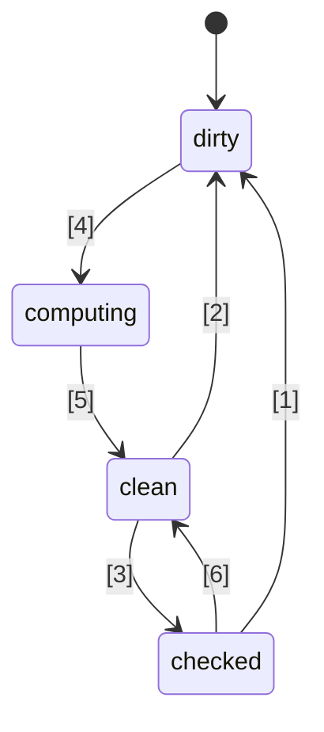
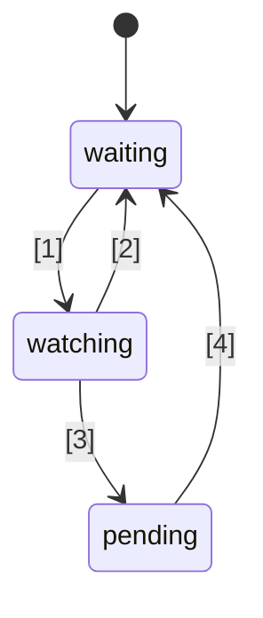

# 🚦 Proposition de standard JavaScript Signals 🚦


Étape 1 ([explication](https://tc39.es/process-document/))

Champions de la proposition TC39 : Daniel Ehrenberg, Yehuda Katz, Jatin Ramanathan, Shay Lewis, Kristen Hewell Garrett, Dominic Gannaway, Preston Sego, Milo M, Rob Eisenberg

Auteurs originaux : Rob Eisenberg et Daniel Ehrenberg

Ce document décrit une première orientation commune pour les signaux en JavaScript, similaire à l’effort Promises/A+ qui a précédé la standardisation des Promises par TC39 dans ES2015. Essayez-le vous-même, en utilisant [un polyfill](https://github.com/proposal-signals/signal-polyfill).

De manière similaire à Promises/A+, cet effort vise à aligner l’écosystème JavaScript. Si cet alignement est réussi, une norme pourrait émerger, basée sur cette expérience. Plusieurs auteurs de frameworks collaborent ici sur un modèle commun qui pourrait servir de base à leur cœur de réactivité. Le brouillon actuel se base sur les retours de conception des auteurs/mainteneurs de [Angular](https://angular.io/), [Bubble](https://bubble.io/), [Ember](https://emberjs.com/), [FAST](https://www.fast.design/), [MobX](https://mobx.js.org/), [Preact](https://preactjs.com/), [Qwik](https://qwik.dev/), [RxJS](https://rxjs.dev/), [Solid](https://www.solidjs.com/), [Starbeam](https://www.starbeamjs.com/), [Svelte](https://svelte.dev/), [Vue](https://vuejs.org/), [Wiz](https://blog.angular.io/angular-and-wiz-are-better-together-91e633d8cd5a), et plus encore…

Contrairement à Promises/A+, nous ne cherchons pas à résoudre une API commune orientée développeur, mais plutôt à définir précisément les sémantiques du cœur du graphe de signaux sous-jacent. Cette proposition inclut une API concrète complète, mais cette API n’est pas destinée à la majorité des développeurs d’applications. Au contraire, l’API de signal proposée ici est mieux adaptée pour les frameworks qui pourront se baser dessus, offrant l’interopérabilité via un graphe de signaux commun et un mécanisme d’auto-suivi.

Le plan pour cette proposition est de faire des prototypes précoces significatifs, y compris l’intégration dans plusieurs frameworks, avant d’aller au-delà de l’étape 1. Nous ne sommes intéressés par la standardisation des Signals que s’ils sont adaptés à une utilisation pratique dans plusieurs frameworks, et qu’ils apportent de réels bénéfices par rapport aux signaux fournis par les frameworks. Nous espérons que ces prototypes précoces nous apporteront ces informations. Voir « Statut et plan de développement » ci-dessous pour plus de détails.

## Contexte : Pourquoi des Signals ?

Pour développer une interface utilisateur (UI) complexe, les développeurs d’applications JavaScript doivent stocker, calculer, invalider, synchroniser et pousser l’état vers la couche d’affichage de l’application de manière efficace. Les interfaces utilisateur impliquent souvent plus que la gestion de simples valeurs, mais nécessitent aussi le rendu d’un état calculé dépendant d’un arbre complexe d’autres valeurs ou d’états eux-mêmes calculés. L’objectif des Signals est de fournir l’infrastructure permettant de gérer un tel état applicatif afin que les développeurs puissent se concentrer sur la logique métier plutôt que sur ces détails répétitifs.

Des constructions similaires aux signaux se sont également avérées utiles dans des contextes non-UI, notamment dans les systèmes de build pour éviter les reconstructions inutiles.

Les signaux sont utilisés en programmation réactive pour éliminer le besoin de gérer manuellement les mises à jour dans les applications.

> Un modèle de programmation déclaratif pour la mise à jour basée sur les changements d’état.

tiré de _[What is Reactivity?](https://www.pzuraq.com/blog/what-is-reactivity)_.

#### Exemple – Un compteur VanillaJS

Étant donné une variable `counter`, vous souhaitez afficher dans le DOM si le compteur est pair ou impair. Chaque fois que `counter` change, vous souhaitez mettre à jour le DOM avec la nouvelle parité. En Vanilla JS, vous pourriez avoir quelque chose comme ceci :

```js
let counter = 0;
const setCounter = (value) => {
  counter = value;
  render();
};

const isEven = () => (counter & 1) == 0;
const parity = () => isEven() ? "even" : "odd";
const render = () => element.innerText = parity();

// Simuler des mises à jour externes de counter...
setInterval(() => setCounter(counter + 1), 1000);
```
> [!NOTE]  
> Des variables globales sont utilisées ici uniquement à des fins de démonstration. La gestion correcte de l’état a de nombreuses solutions, et les exemples de cette proposition se veulent les plus minimalistes possible. Cette proposition n’encourage pas l’utilisation de variables globales.

Cela pose plusieurs problèmes...

* La mise en place de `counter` est verbeuse et nécessite beaucoup de code passe-partout.
* L’état de `counter` est fortement couplé au système de rendu.
* Si `counter` change mais que `parity` ne change pas (par exemple, si le compteur passe de 2 à 4), alors nous faisons un calcul de parité et un rendu inutiles.
* Que faire si une autre partie de notre UI souhaite juste se mettre à jour quand `counter` change ?
* Que faire si une autre partie de notre UI dépend uniquement de `isEven` ou `parity` ?

Même dans ce scénario relativement simple, plusieurs problèmes surgissent rapidement. Nous pourrions essayer de les contourner en introduisant un système pub/sub pour `counter`. Cela permettrait à d’autres consommateurs de `counter` de s’abonner pour réagir aux changements d’état.

Cependant, nous restons confrontés aux problèmes suivants :

* La fonction de rendu, qui ne dépend que de `parity`, doit « savoir » qu’elle doit en réalité s’abonner à `counter`.
* Il n’est pas possible de mettre à jour l’UI en se basant uniquement sur `isEven` ou `parity`, sans interagir directement avec `counter`.
* Nous avons augmenté le code passe-partout. À chaque fois que vous utilisez quelque chose, il ne s’agit plus simplement d’appeler une fonction ou de lire une variable, mais de s’abonner et de gérer les mises à jour. La gestion du désabonnement devient également particulièrement compliquée.

Nous pourrions maintenant résoudre certains problèmes en ajoutant pub/sub non seulement à `counter` mais aussi à `isEven` et `parity`. Il faudrait alors abonner `isEven` à `counter`, `parity` à `isEven`, et `render` à `parity`. Malheureusement, non seulement notre code passe-partout explose, mais nous devons aussi gérer une multitude d’abonnements, avec un risque important de fuite mémoire si nous ne nettoyons pas tout correctement. Nous avons donc résolu certains problèmes, mais créé toute une nouvelle catégorie de soucis, et beaucoup de code. Pire encore, il faudrait répéter tout ce processus pour chaque morceau d’état dans notre système.

### Introduction aux Signals

Les abstractions de liaison de données entre le modèle et la vue sont depuis longtemps au cœur des frameworks UI dans de nombreux langages de programmation, malgré l’absence de tel mécanisme natif dans JS ou la plateforme web. Dans les frameworks et bibliothèques JS, il y a eu énormément d’expérimentations quant à la façon de représenter cette liaison, et l’expérience a montré la puissance du flux de données unidirectionnel combiné à un type de donnée de première classe représentant une cellule d’état ou un calcul dérivé d’autres données, qu’on appelle aujourd’hui souvent « Signals ».
Cette approche de valeur réactive de première classe semble être apparue pour la première fois dans les frameworks web open-source JavaScript avec [Knockout](https://knockoutjs.com/) [en 2010](https://blog.stevensanderson.com/2010/07/05/introducing-knockout-a-ui-library-for-javascript/). Depuis, de nombreuses variantes et implémentations ont vu le jour. Au cours des 3-4 dernières années, la primitive Signal et les approches associées ont connu un regain d’intérêt, avec presque toutes les bibliothèques ou frameworks JavaScript modernes disposant d’un équivalent, sous un nom ou un autre.

Pour comprendre les Signals, examinons l’exemple précédent, ré-imaginé avec une API Signal détaillée ci-dessous.

#### Exemple – Un compteur avec Signals

```js
const counter = new Signal.State(0);
const isEven = new Signal.Computed(() => (counter.get() & 1) == 0);
const parity = new Signal.Computed(() => isEven.get() ? "even" : "odd");

// Une bibliothèque ou un framework définit des effets basés sur d’autres primitives Signal
declare function effect(cb: () => void): (() => void);

effect(() => element.innerText = parity.get());

// Simuler des mises à jour externes de counter...
setInterval(() => counter.set(counter.get() + 1), 1000);
```

On remarque immédiatement plusieurs choses :
* Nous avons éliminé le code passe-partout verbeux autour de la variable `counter` de l’exemple précédent.
* Il existe une API unifiée pour gérer les valeurs, les calculs et les effets de bord.
* Il n’y a plus de problème de référence circulaire ni de dépendances inversées entre `counter` et `render`.
* Il n’y a pas d’abonnements manuels, ni de besoin de gestion administrative.
* Il existe un moyen de contrôler le moment/la planification des effets de bord.

Les Signals nous offrent bien plus que ce que l’on peut voir en surface de l’API :
* **Suivi automatique des dépendances** - Un Signal calculé découvre automatiquement tous les autres Signaux dont il dépend, que ces Signaux soient de simples valeurs ou d’autres calculs.
* **Évaluation paresseuse** - Les calculs ne sont pas évalués de manière impatiente lors de leur déclaration, ni immédiatement lors d’un changement de leurs dépendances. Ils ne sont évalués que lorsque leur valeur est explicitement demandée.
* **Mémorisation** - Les Signaux calculés mettent en cache leur dernière valeur afin que les calculs dont les dépendances n’ont pas changé n’aient pas besoin d’être réévalués, quel que soit le nombre d’accès.

## Motivation pour la standardisation des Signaux

#### Interopérabilité

Chaque implémentation de Signal possède son propre mécanisme d’auto-suivi pour garder trace des sources rencontrées lors de l’évaluation d’un Signal calculé. Cela rend difficile le partage de modèles, composants et bibliothèques entre différents frameworks — ils ont tendance à être faussement couplés à leur moteur de vue (étant donné que les Signaux sont généralement implémentés comme partie intégrante des frameworks JS).

L’un des objectifs de cette proposition est de découpler complètement le modèle réactif de la vue de rendu, permettant ainsi aux développeurs de migrer vers de nouvelles technologies de rendu sans réécrire leur code non-UI, ou de développer des modèles réactifs partagés en JS à déployer dans différents contextes. Malheureusement, en raison du versionnage et de la duplication, il s’est avéré peu pratique d’atteindre un niveau élevé de partage via des bibliothèques JS — les objets natifs offrent une meilleure garantie de partage.

#### Performance/Utilisation mémoire

Il y a toujours un petit gain potentiel de performance à embarquer moins de code grâce à l’inclusion native de bibliothèques courantes, mais les implémentations de Signaux sont généralement assez petites, donc nous ne nous attendons pas à ce que cet effet soit très important.

Nous pensons que des implémentations natives en C++ des structures de données et algorithmes liés aux Signaux peuvent être légèrement plus efficaces que ce qu’il est possible d’atteindre en JS, d’un facteur constant. Cependant, aucun changement algorithmique n’est anticipé par rapport à ce qui serait présent dans un polyfill ; il n’est pas attendu que les moteurs fassent de la magie ici, et les algorithmes de réactivité eux-mêmes seront bien définis et non ambigus.

Le groupe de pilotage prévoit de développer diverses implémentations de Signaux et d’utiliser celles-ci pour étudier ces possibilités de performance.

#### Outils de développement (DevTools)

Avec les bibliothèques de Signaux existantes en JS, il peut être difficile de tracer des éléments comme :
* La pile d’appels à travers une chaîne de Signaux calculés, montrant la chaîne causale d’une erreur
* Le graphe de références entre Signaux, lorsqu’un Signal dépend d’un autre — important lors du débogage de l’utilisation mémoire

Les Signaux natifs permettent aux environnements JS et aux outils de développement d’avoir potentiellement un meilleur support pour l’inspection des Signaux, en particulier pour le débogage ou l’analyse de performances, que ce soit intégré aux navigateurs ou via une extension partagée. Les outils existants comme l’inspecteur d’éléments, les instantanés de performance et les profileurs mémoire pourraient être mis à jour pour mettre en évidence spécifiquement les Signaux lors de la présentation des informations.

#### Bénéfices secondaires

##### Bénéfices d’une bibliothèque standard

De manière générale, JavaScript dispose d’une bibliothèque standard assez minimale, mais une tendance au sein de TC39 est de faire évoluer JS vers un langage « tout compris », avec un ensemble de fonctionnalités intégrées et de haute qualité. Par exemple, Temporal remplace moment.js, et un certain nombre de petites fonctionnalités, comme `Array.prototype.flat` et `Object.groupBy`, remplacent beaucoup de cas d’usage de lodash. Les bénéfices incluent des tailles de bundle réduites, une stabilité et qualité améliorées, moins de choses à apprendre lors de l’arrivée sur un nouveau projet, et un vocabulaire généralement commun entre développeurs JS.

##### Intégration HTML/DOM (possibilité future)

Des travaux actuels au sein du W3C et des implémenteurs de navigateurs cherchent à apporter le templating natif à HTML ([DOM Parts][wicg-pr-1023] et [Template Instantiation][wicg-propsal-template-instantiation]). De plus, le W3C Web Components CG explore la possibilité d’étendre les Web Components pour offrir une API HTML entièrement déclarative. Pour atteindre ces deux objectifs, une primitive réactive sera finalement nécessaire en HTML. Par ailleurs, de nombreuses améliorations ergonomiques du DOM via l’intégration des Signaux peuvent être imaginées et ont été demandées par la communauté.

[wicg-pr-1023]: https://github.com/WICG/webcomponents/pull/1023
[wicg-propsal-template-instantiation]: https://github.com/WICG/webcomponents/blob/gh-pages/proposals/Template-Instantiation.md

> Remarque : cette intégration constituerait un effort séparé à venir, et ne fait pas partie de cette proposition.

##### Échanges d’informations dans l’écosystème (*ce n’est pas* une raison de standardiser)

Les efforts de standardisation peuvent parfois être utiles au niveau de la « communauté », même sans changement dans les navigateurs. L’initiative sur les Signaux réunit de nombreux auteurs de frameworks pour une discussion approfondie sur la nature de la réactivité, des algorithmes et de l’interopérabilité. Cela s’est déjà avéré utile, mais ne justifie pas l’inclusion dans les moteurs JS et navigateurs ; les Signaux ne devraient être ajoutés au standard JavaScript que s’il existe des avantages significatifs *au-delà* de l’échange d’informations permis dans l’écosystème.

## Objectifs de conception pour les Signaux

Il s’avère que les bibliothèques de Signaux existantes ne sont pas si différentes les unes des autres, au fond. Cette proposition vise à capitaliser sur leur succès en mettant en œuvre les qualités importantes de nombre de ces bibliothèques.

### Fonctionnalités principales

* Un type Signal qui représente un état, c’est-à-dire un Signal modifiable. C’est une valeur que d’autres peuvent lire.
* Un type Signal calculé/mémo/dérivé, qui dépend d’autres et est calculé paresseusement et mis en cache.
    * Le calcul est paresseux, ce qui signifie que les Signaux calculés ne sont pas recalculés par défaut lorsqu’une de leurs dépendances change, mais uniquement si quelqu’un les lit réellement.
    * Le calcul est « sans glitch » ([glitch](https://en.wikipedia.org/wiki/Reactive_programming#Glitches)), ce qui signifie qu’aucun calcul inutile n’est jamais effectué. Cela implique que, lorsqu’une application lit un Signal calculé, il existe un tri topologique des parties potentiellement obsolètes du graphe à exécuter, pour éliminer les doublons.
    * Le calcul est mis en cache, ce qui signifie que si, après le dernier changement de dépendance, aucune dépendance n’a changé, alors le Signal calculé *n’est pas* recalculé lors de l’accès.
    * Des comparaisons personnalisées sont possibles pour les Signaux calculés ainsi que pour les Signaux d’état, afin de déterminer à quel moment d’autres Signaux calculés qui en dépendent doivent être mis à jour.
* Réactions à la situation où un Signal calculé voit l’une de ses dépendances (ou dépendances imbriquées) devenir « sale » et changer, signifiant que la valeur du Signal pourrait être obsolète.
    * Cette réaction vise à planifier un travail plus important à effectuer plus tard.
    * Les effets sont implémentés en termes de ces réactions, plus une planification au niveau du framework.
    * Les signaux calculés doivent pouvoir réagir au fait d’être enregistrés comme dépendance (imbriquée) d’une de ces réactions.
* Permettre aux frameworks JS de gérer leur propre planification. Pas de planification forcée intégrée de type Promise.
    * Des réactions synchrones sont nécessaires pour permettre la planification ultérieure de travaux selon la logique du framework.
    * Les écritures sont synchrones et prennent effet immédiatement (un framework qui regroupe les écritures peut le faire par-dessus).
    * Il est possible de séparer la vérification qu’un effet peut être « sale » de l’exécution effective de l’effet (permettant un ordonnanceur d’effets en deux étapes).
* Possibilité de lire des Signaux *sans* déclencher l’enregistrement des dépendances (`untrack`)
* Permettre la composition de différents bases de code utilisant les Signaux/la réactivité, par exemple,
    * Utiliser plusieurs frameworks ensemble en ce qui concerne le suivi/la réactivité elle-même (modulo omissions, voir ci-dessous)
    * Structures de données réactives indépendantes du framework (par exemple, proxy de store récursivement réactif, Map, Set et Array réactifs, etc.)

### Solidité

* Décourager/interdire une mauvaise utilisation naïve des réactions synchrones.
    * Risque pour la solidité : cela peut exposer des « [glitches](https://en.wikipedia.org/wiki/Reactive_programming#Glitches) » si mal utilisé : si le rendu est effectué immédiatement lorsqu’un Signal est modifié, cela peut exposer un état d’application incomplet à l’utilisateur final. Ainsi, cette fonctionnalité doit uniquement servir à planifier intelligemment du travail pour plus tard, une fois la logique applicative terminée.
    * Solution : Interdire la lecture et l’écriture de tout Signal depuis un rappel de réaction synchrone.
* Décourager `untrack` et signaler sa nature non sûre
    * Risque pour la solidité : permet la création de Signaux calculés dont la valeur dépend d’autres Signaux, mais qui ne sont pas mis à jour lorsque ces Signaux changent. Il doit être utilisé lorsque les accès non suivis ne changent pas le résultat du calcul.
    * Solution : L’API porte la mention « unsafe » dans son nom.
* Remarque : Cette proposition permet la lecture et l’écriture de signaux depuis des signaux calculés et d’effet, sans restreindre les écritures qui suivent des lectures, malgré le risque pour la solidité. Cette décision vise à préserver la flexibilité et la compatibilité lors de l’intégration avec des frameworks.

### API de surface

* Doit constituer une base solide pour que plusieurs frameworks implémentent leurs mécanismes de Signaux/réactivité.
    * Doit être une bonne base pour les proxys de store récursifs, la réactivité des champs de classe basée sur des décorateurs, et les API de style `.value` ou `[state, setState]`.
    * La sémantique doit permettre d’exprimer les modèles valides proposés par différents frameworks. Par exemple, il doit être possible que ces Signaux servent de base à des écritures immédiatement reflétées ou à des écritures regroupées et appliquées ultérieurement.
* Il serait appréciable que cette API soit utilisable directement par les développeurs JavaScript.
    * Si une fonctionnalité correspond à un concept de l’écosystème, utiliser un vocabulaire commun est souhaitable.
        * Cependant, il est important de ne pas réutiliser exactement les mêmes noms !
    * Tension entre « utilisabilité par les développeurs JS » et « fournir tous les points d’extension aux frameworks »
        * Idée : Fournir tous les points d’extension, mais inclure des erreurs en cas de mauvaise utilisation si possible.
        * Idée : Placer les API subtiles dans un espace de nommage `subtle`, similaire à [`crypto.subtle`](https://developer.mozilla.org/en-US/docs/Web/API/Crypto/subtle), pour marquer la frontière entre les API nécessaires à un usage avancé (implémentation de framework ou outils de développement) et le développement applicatif courant (instanciation de signaux à utiliser avec un framework).
* Être implémentable et utilisable avec de bonnes performances — l’API de surface ne doit pas entraîner trop de surcoût.
    * Permettre l’héritage, afin que les frameworks puissent ajouter leurs propres méthodes et champs, y compris des champs privés. Cela est important pour éviter le besoin d’allocations supplémentaires au niveau du framework. Voir « Gestion mémoire » ci-dessous.

### Gestion mémoire

* Si possible : un Signal calculé devrait pouvoir être collecté par le ramasse-miettes si rien de vivant ne le référence pour de futures lectures, même s’il est lié à un graphe plus large qui reste vivant (par exemple en lisant un état qui reste vivant).
* Notez que la plupart des frameworks actuels nécessitent une suppression explicite des Signaux calculés s'ils ont une référence vers ou depuis un autre graphe de Signaux qui reste vivant.
* Cela n'est finalement pas si problématique lorsque leur durée de vie est liée à celle d'un composant UI, et que les effets doivent de toute façon être supprimés.
* Si l'exécution avec ces sémantiques est trop coûteuse, alors nous devrions ajouter la suppression explicite (ou le "déliaisonnement") des Signaux calculés à l'API ci-dessous, qui en est actuellement dépourvue.
* Un objectif connexe : Minimiser le nombre d'allocations, par exemple :
    * pour créer un Signal modifiable (éviter deux closures séparées + un tableau)
    * pour implémenter des effets (éviter une closure pour chaque réaction)
    * Dans l'API d'observation des changements de Signal, éviter de créer des structures de données temporaires supplémentaires
    * Solution : API basée sur des classes permettant la réutilisation de méthodes et de champs définis dans les sous-classes

## Ébauche d’API

Voici une première idée d'une API de Signal. Notez qu'il ne s'agit que d'une ébauche préliminaire, et nous prévoyons des modifications au fil du temps. Commençons par le `.d.ts` complet pour avoir une idée de la structure générale, puis nous discuterons des détails de ce que cela signifie.

```ts
interface Signal<T> {
    // Obtenir la valeur du signal
    get(): T;
}

namespace Signal {
    // Un Signal en lecture-écriture
    class State<T> implements Signal<T> {
        // Créer un Signal d'état initialisé avec la valeur t
        constructor(t: T, options?: SignalOptions<T>);

        // Obtenir la valeur du signal
        get(): T;

        // Définir la valeur du Signal d'état à t
        set(t: T): void;
    }

    // Un Signal qui est une formule basée sur d'autres Signaux
    class Computed<T = unknown> implements Signal<T> {
        // Créer un Signal qui s'évalue à la valeur retournée par le callback.
        // Le callback est appelé avec ce signal comme valeur de this.
        constructor(cb: (this: Computed<T>) => T, options?: SignalOptions<T>);

        // Obtenir la valeur du signal
        get(): T;
    }

    // Cet espace de noms inclut des fonctionnalités "avancées" qu’il vaut mieux
    // laisser aux auteurs de frameworks plutôt qu’aux développeurs d’applications.
    // Analogue à `crypto.subtle`
    namespace subtle {
        // Exécuter un callback avec tout le suivi désactivé
        function untrack<T>(cb: () => T): T;

        // Obtenir le signal calculé courant qui suit toutes les lectures de signal, si existant
        function currentComputed(): Computed | null;

        // Retourne la liste ordonnée de tous les signaux référencés par celui-ci
        // lors de sa dernière évaluation.
        // Pour un Watcher, liste l’ensemble des signaux surveillés.
        function introspectSources(s: Computed | Watcher): (State | Computed)[];

        // Retourne les Watchers auxquels ce signal appartient, ainsi que tous les
        // signaux Computed qui ont lu ce signal lors de leur dernière évaluation,
        // si ce signal calculé est (récursivement) surveillé.
        function introspectSinks(s: State | Computed): (Computed | Watcher)[];

        // Vrai si ce signal est "vivant", c’est-à-dire qu’il est surveillé par un Watcher,
        // ou qu’il est lu par un signal Computed qui est (récursivement) vivant.
        function hasSinks(s: State | Computed): boolean;

        // Vrai si cet élément est "réactif", c’est-à-dire qu’il dépend
        // d’un autre signal. Un Computed où hasSources est faux
        // renverra toujours la même constante.
        function hasSources(s: Computed | Watcher): boolean;

        class Watcher {
            // Lorsqu'une source (récursive) du Watcher est modifiée, appeler ce callback,
            // s’il n’a pas déjà été appelé depuis le dernier appel à `watch`.
            // Aucun signal ne peut être lu ou modifié pendant la notification.
            constructor(notify: (this: Watcher) => void);

            // Ajouter ces signaux à l’ensemble surveillé du Watcher, et configurer le watcher pour exécuter son
            // callback notify lors du prochain changement de l’un des signaux de l’ensemble (ou de l’une de ses dépendances).
            // Peut être appelé sans arguments uniquement pour réinitialiser l’état "notifié", afin que
            // le callback notify soit de nouveau invoqué.
            watch(...s: Signal[]): void;

            // Retirer ces signaux de l’ensemble surveillé (par exemple, pour un effet qui est supprimé)
            unwatch(...s: Signal[]): void;

            // Retourne l’ensemble des sources dans l’ensemble surveillé du Watcher qui sont encore sales, ou un signal computed
            // avec une source sale ou en attente et qui n’a pas encore été réévalué
            getPending(): Signal[];
        }

        // Hooks pour observer quand un signal est surveillé ou ne l’est plus
        var watched: Symbol;
        var unwatched: Symbol;
    }

    interface SignalOptions<T> {
        // Fonction de comparaison personnalisée entre l’ancienne et la nouvelle valeur. Par défaut : Object.is.
        // Le signal est passé en tant que valeur this pour le contexte.
        equals?: (this: Signal<T>, t: T, t2: T) => boolean;
```
```ts
// Callback appelé lorsque isWatched devient vrai, s'il était auparavant faux
[Signal.subtle.watched]?: (this: Signal<T>) => void;

// Callback appelé chaque fois que isWatched devient faux, s'il était auparavant vrai
[Signal.subtle.unwatched]?: (this: Signal<T>) => void;
}
}
```

### Fonctionnement des Signaux

Un Signal représente une cellule de données qui peut changer au fil du temps. Les Signaux peuvent être soit de "state" (juste une valeur définie manuellement), soit "computed" (une formule basée sur d'autres Signaux).

Les Signaux calculés fonctionnent en suivant automatiquement les autres Signaux qui sont lus lors de leur évaluation. Lorsqu'un signal calculé est lu, il vérifie si l'une de ses dépendances précédemment enregistrées a changé, et se réévalue le cas échéant. Lorsque plusieurs signaux calculés sont imbriqués, toute l’attribution du suivi revient au signal le plus interne.

Les Signaux calculés sont paresseux, c’est-à-dire en mode "pull" : ils ne sont réévalués que lorsqu’ils sont accédés, même si l’une de leurs dépendances a changé auparavant.

Le callback passé dans les Signaux calculés doit généralement être "pur" au sens d’une fonction déterministe, sans effets de bord, des autres Signaux auxquels il accède. En même temps, le moment où le callback est appelé est déterministe, permettant d’utiliser les effets de bord avec précaution.

Les Signaux mettent fortement en avant le cache/mémoïsation : les Signaux d’état et les Signaux calculés mémorisent leur valeur actuelle, et ne déclenchent la réévaluation des Signaux calculés qui les référencent que s'ils changent effectivement. Une comparaison répétée de l’ancienne et de la nouvelle valeur n’est même pas nécessaire : la comparaison est effectuée une fois lorsque le Signal source est réinitialisé/réévalué, et le mécanisme de Signal garde une trace des éléments qui n’ont pas encore été mis à jour en fonction de la nouvelle valeur. En interne, cela est généralement représenté par la "coloration de graphe", comme décrit dans [l’article de blog de Milo](https://raw.githubusercontent.com/tc39/proposal-signals/main/blog/graph-coloring.md).

Les Signaux calculés suivent dynamiquement leurs dépendances : à chaque exécution, ils peuvent finir par dépendre de choses différentes, et cet ensemble précis de dépendances est maintenu à jour dans le graphe de Signaux. Cela signifie que si vous avez une dépendance nécessaire dans une seule branche, et que le calcul précédent a pris l’autre branche, alors un changement de cette valeur temporairement inutilisée ne provoquera pas la réévaluation du Signal calculé, même lors d'une demande de sa valeur.

Contrairement aux Promesses JavaScript, tout dans les Signaux s’exécute de manière synchrone :
- La définition d’un Signal à une nouvelle valeur est synchrone, et cela se reflète immédiatement lors de la lecture de tout Signal calculé qui en dépend par la suite. Il n’y a pas de regroupement ("batching") intégré de cette mutation.
- La lecture des Signaux calculés est synchrone : leur valeur est toujours disponible.
- Le callback `notify` dans les Watchers, comme expliqué ci-dessous, s’exécute de manière synchrone, lors de l’appel à `.set()` qui l’a déclenché (mais après la complétion de la coloration du graphe).

Comme les Promesses, les Signaux peuvent représenter un état d’erreur : si le callback d’un Signal calculé lève une exception, alors cette erreur est mémorisée comme une valeur, et relancée à chaque lecture du Signal.

### Comprendre la classe Signal

Une instance de `Signal` représente la capacité de lire une valeur qui change dynamiquement et dont les mises à jour sont suivies dans le temps. Elle inclut également implicitement la capacité de s’abonner au Signal, implicitement via un accès suivi depuis un autre Signal calculé.

L’API ici est conçue pour correspondre au consensus assez large de l’écosystème entre de nombreuses bibliothèques de Signaux concernant l’utilisation de noms comme "signal", "computed" et "state". Cependant, l’accès aux Signaux calculés et d’état se fait via une méthode `.get()`, ce qui diffère de toutes les API populaires de Signaux, qui utilisent soit un accesseur de style `.value`, soit une syntaxe d’appel `signal()`.

L’API est conçue pour réduire le nombre d’allocations, afin de rendre les Signaux adaptés à l’intégration dans des frameworks JavaScript tout en atteignant des performances similaires ou supérieures aux Signaux personnalisés des frameworks existants. Cela implique :
- Les Signaux d’état sont un unique objet inscriptible, qui peut être à la fois accédé et modifié à partir de la même référence. (Voir les implications ci-dessous dans la section "Séparation des capacités".)
- Les Signaux d’état et calculés sont conçus pour pouvoir être sous-classés, afin de faciliter l’ajout par les frameworks de propriétés supplémentaires via des champs de classe publics/privés (ainsi que des méthodes pour utiliser cet état).
- Divers callbacks (par exemple, `equals`, le callback de computed) sont appelés avec le Signal concerné en tant que valeur de `this` pour le contexte, de sorte qu’une nouvelle closure n’est pas nécessaire par Signal. À la place, le contexte peut être sauvegardé dans des propriétés supplémentaires du signal lui-même.

Certaines conditions d’erreur imposées par cette API :
- Il est interdit de lire un Signal calculé de façon récursive.
- Le callback `notify` d’un Watcher ne peut ni lire ni écrire de signaux.
- Si le callback d’un Signal calculé lève une exception, les accès ultérieurs à ce Signal relanceront cette erreur mémorisée, jusqu’à ce qu’une des dépendances change et qu’il soit recalculé.

Certaines conditions qui ne sont *pas* imposées :
- Les Signaux calculés peuvent écrire dans d’autres Signaux, de façon synchrone dans leur callback.
- Le travail mis en file d’attente par le callback `notify` d’un Watcher peut lire ou écrire des signaux, ce qui permet de reproduire [des anti-patterns React classiques](https://react.dev/learn/you-might-not-need-an-effect) en termes de Signaux !

### Implémentation des effets

L’interface `Watcher` définie ci-dessus sert de base à l’implémentation des API JS classiques pour les effets : des callbacks réexécutés lorsque d’autres Signaux changent, uniquement pour leurs effets de bord. La fonction `effect` utilisée plus haut dans l’exemple initial peut être définie comme suit :

```ts
// Cette fonction vivrait généralement dans une bibliothèque/framework, pas dans le code applicatif
// REMARQUE : Cette logique de planification est trop simple pour être utile. Ne pas copier/coller.
let pending = false;

let w = new Signal.subtle.Watcher(() => {
    if (!pending) {
        pending = true;
        queueMicrotask(() => {
            pending = false;
            for (let s of w.getPending()) s.get();
            w.watch();
        });
    }
});

// Un Signal d’effet qui évalue cb, qui programme une lecture de lui-même dans la file de micro-tâches chaque fois qu’une de ses dépendances peut changer
export function effect(cb) {
    let destructor;
    let c = new Signal.Computed(() => { destructor?.(); destructor = cb(); });
    w.watch(c);
    c.get();
    return () => { destructor?.(); w.unwatch(c) };
}
```

L’API Signal n’inclut pas de fonction intégrée comme `effect`. En effet, la planification des effets est subtile et s’intègre souvent dans les cycles de rendu des frameworks et d’autres états ou stratégies spécifiques de haut niveau, auxquels JS n’a pas accès.

Décomposons les différentes opérations utilisées ici : le callback `notify` passé au constructeur de `Watcher` est la fonction appelée lorsque le Signal passe d’un état "propre" (où l’on sait que le cache est initialisé et valide) à un état "checked" ou "dirty" (où le cache peut ne plus être valide car au moins un des états dont il dépend récursivement a changé).

Les appels à `notify` sont finalement déclenchés par un appel à `.set()` sur un Signal d’état. Cet appel est synchrone : il a lieu avant que `.set` ne retourne. Mais il n’est pas nécessaire de s’inquiéter que ce callback observe le graphe de Signaux dans un état partiellement traité, car pendant un callback `notify`, aucun Signal ne peut être lu ou écrit, même dans un appel à `untrack`. Comme `notify` est appelé pendant `.set()`, il interrompt un autre flux logique, qui pourrait ne pas être terminé. Pour lire ou écrire des Signaux depuis `notify`, programmez le travail pour plus tard, par exemple en enregistrant le Signal dans une liste à traiter plus tard, ou avec `queueMicrotask` comme ci-dessus.

Notez qu’il est parfaitement possible d’utiliser efficacement les Signaux sans `Signal.subtle.Watcher` en planifiant des interrogations ("polling") de Signaux calculés, comme le fait Glimmer. Cependant, de nombreux frameworks ont constaté qu’il est très souvent utile d’exécuter cette logique de planification de façon synchrone, c’est pourquoi l’API Signals l’inclut.

Les Signaux calculés et d’état sont tous deux collectés par le ramasse-miettes comme n’importe quelle valeur JS. Mais les Watchers disposent d’un mécanisme spécial pour maintenir des objets vivants : tout Signal surveillé par un Watcher sera maintenu vivant tant qu’un des états sous-jacents reste accessible, car ceux-ci peuvent déclencher un futur appel à `notify` (et ensuite un futur `.get()`). Pour cette raison, pensez à appeler `Watcher.prototype.unwatch` pour nettoyer les effets.

### Une échappatoire dangereuse

`Signal.subtle.untrack` est une échappatoire permettant de lire des Signaux *sans* suivre ces lectures. Cette capacité est dangereuse car elle permet de créer des Signaux calculés dont la valeur dépend d’autres Signaux, mais qui ne sont pas mis à jour lorsque ces Signaux changent. Elle doit être utilisée uniquement lorsque les accès non suivis ne changent pas le résultat du calcul.

<!--
TODO: Montrer un exemple où il est pertinent d’utiliser untrack

### Utilisation de watched/unwatched
TODO : Montrer un exemple de conversion d’un Observable en signal calculé, abonné uniquement lorsqu’il est utilisé par un effet

TODO : Montrer un exemple d’un signal calculé représentant le résultat d’un fetch dirigé vers un état, qui est annulé

### Introspection pour le SSR

TODO : Montrer comment fonctionne la sérialisation du graphe de signaux

TODO : Montrer comment « hydrater » un signal d’un état vers un calculé plus tard, en utilisant quelques signaux.
-->

### Ommis pour l’instant

Ces fonctionnalités pourront être ajoutées ultérieurement, mais elles ne sont pas incluses dans la version actuelle du projet. Leur omission est due à l’absence de consensus établi dans le domaine de conception entre les frameworks, ainsi qu’à la capacité démontrée de contourner leur absence avec des mécanismes supplémentaires basés sur la notion de Signals décrite dans ce document. Cependant, malheureusement, cette omission limite le potentiel d’interopérabilité entre frameworks. Lorsque des prototypes de Signals tels que décrits dans ce document seront produits, un effort sera fait pour réexaminer si ces omissions étaient la bonne décision.

* **Async** : Les signaux sont toujours disponibles de manière synchrone pour l’évaluation, dans ce modèle. Cependant, il est souvent utile d’avoir certains processus asynchrones qui mènent à la modification d’un signal, et de savoir quand un signal est encore en « chargement ». Une façon simple de modéliser l’état de chargement est d’utiliser des exceptions, et le comportement de mise en cache des exceptions des signaux calculés se compose raisonnablement avec cette technique. Des techniques améliorées sont discutées dans [Issue #30](https://github.com/proposal-signals/proposal-signals/issues/30).
* **Transactions** : Pour les transitions entre vues, il est souvent utile de maintenir un état actif à la fois pour les états « de » et « vers ». L’état « vers » s’affiche en arrière-plan, jusqu’à ce qu’il soit prêt à prendre la relève (commit de la transaction), tandis que l’état « de » reste interactif. Maintenir les deux états en même temps nécessite de « forker » l’état du graphe de signaux, et il peut même être utile de prendre en charge plusieurs transitions en attente simultanément. Discussion dans [Issue #73](https://github.com/proposal-signals/proposal-signals/issues/73).

Certaines [méthodes utilitaires](https://github.com/proposal-signals/proposal-signals/issues/32) possibles sont également omises.

## Statut et plan de développement

Cette proposition figure à l’agenda d’avril 2024 du TC39 pour l’étape 1. Elle peut actuellement être considérée comme « étape 0 ».

[Un polyfill](https://github.com/proposal-signals/signal-polyfill) pour cette proposition est disponible, avec quelques tests basiques. Certains auteurs de frameworks ont commencé à expérimenter avec le remplacement de cette implémentation de signal, mais cette utilisation en est à un stade précoce.

Les collaborateurs sur la proposition Signal souhaitent être particulièrement **prudents** dans la façon de faire avancer cette proposition, afin d’éviter de se retrouver piégés avec quelque chose qui serait publié, mais que l’on regretterait et n’utiliserait finalement pas. Notre plan est d’effectuer les tâches supplémentaires suivantes, non requises par le processus TC39, afin de s’assurer que cette proposition est sur la bonne voie :

Avant de proposer pour l’étape 2, nous prévoyons de :
- Développer plusieurs implémentations polyfill de niveau production, solides, bien testées (par exemple, réussissant les tests de divers frameworks ainsi que des tests de type test262) et performantes (comme vérifié par un ensemble de benchmarks signal/framework complet).
- Intégrer l’API Signal proposée dans un grand nombre de frameworks JS que nous considérons comme représentatifs, et quelques grandes applications fonctionnant avec cette base. Tester son efficacité et sa correction dans ces contextes.
- Avoir une compréhension solide de l’espace des extensions possibles à l’API, et avoir conclu lesquelles (le cas échéant) doivent être ajoutées à cette proposition.

## Algorithmes de Signal

Cette section décrit chacune des API exposées à JavaScript, en termes des algorithmes qu’elles implémentent. On peut la considérer comme une proto-spécification, et elle est incluse à ce stade précoce pour fixer un ensemble possible de sémantiques, tout en restant très ouvert aux changements.

Certains aspects de l’algorithme :
- L’ordre de lecture des Signaux à l’intérieur d’un calculé est significatif, et il est observable dans l’ordre d’exécution de certains callbacks (`Watcher` invoqué, `equals`, le premier paramètre de `new Signal.Computed`, et les callbacks `watched`/`unwatched`). Cela signifie que les sources d’un Signal calculé doivent être stockées de manière ordonnée.
- Ces quatre callbacks peuvent tous lancer des exceptions, et ces exceptions sont propagées de manière prévisible au code JS appelant. Les exceptions ne *stoppent pas* l’exécution de cet algorithme et ne laissent pas le graphe dans un état partiellement traité. Pour les erreurs levées dans le callback `notify` d’un Watcher, cette exception est transmise à l’appel `.set()` qui l’a déclenchée, en utilisant un AggregateError si plusieurs exceptions sont levées. Les autres (y compris `watched`/`unwatched` ?) sont stockées dans la valeur du Signal, pour être relancées lors de la lecture, et un Signal relançant ainsi une exception peut être marqué `~clean~` comme n’importe quel autre ayant une valeur normale.
- Des précautions sont prises pour éviter les circularités dans le cas de signaux calculés qui ne sont pas « observés » (surveillés par un Watcher), afin qu’ils puissent être collectés séparément des autres parties du graphe de signaux. En interne, cela peut être implémenté avec un système de numéros de génération toujours collectés ; notez que les implémentations optimisées peuvent aussi inclure des numéros de génération locaux par nœud, ou éviter de suivre certains numéros sur les signaux surveillés.

### État global caché

Les algorithmes de Signal doivent référencer certains états globaux. Cet état est global pour tout le thread, ou « agent ».

- `computing` : Le signal calculé ou d’effet le plus interne actuellement réévalué suite à un appel `.get` ou `.run`, ou `null`. Initialement `null`.
- `frozen` : Booléen indiquant si un callback s’exécute actuellement et nécessite que le graphe ne soit pas modifié. Initialement `false`.
- `generation` : Un entier incrémental, commençant à 0, utilisé pour suivre l’actualité d’une valeur tout en évitant les circularités.

### L’espace de noms `Signal`

`Signal` est un objet ordinaire servant d’espace de noms pour les classes et fonctions liées aux Signaux.

`Signal.subtle` est un objet espace de noms interne similaire.

### La classe `Signal.State`

#### Slots internes de `Signal.State`

- `value` : La valeur actuelle du signal d’état
- `equals` : La fonction de comparaison utilisée lors des changements de valeur
- `watched` : Le callback appelé quand le signal devient observé par un effet
- `unwatched` : Le callback appelé quand le signal n’est plus observé par un effet
- `sinks` : Ensemble des signaux surveillés dépendant de celui-ci

#### Constructeur : `Signal.State(initialValue, options)`

1. Définit la propriété `value` de ce Signal sur `initialValue`.
1. Définit la propriété `equals` de ce Signal sur options?.equals
1. Définit la propriété `watched` de ce Signal sur options?.[Signal.subtle.watched]
1. Définit la propriété `unwatched` de ce Signal sur options?.[Signal.subtle.unwatched]
1. Définit la propriété `sinks` de ce Signal comme ensemble vide

#### Méthode : `Signal.State.prototype.get()`

1. Si `frozen` est vrai, lancer une exception.
1. Si `computing` n’est pas `undefined`, ajouter ce Signal à l’ensemble `sources` de `computing`.
1. REMARQUE : On n’ajoute pas `computing` à l’ensemble `sinks` de ce Signal tant qu’il n’est pas surveillé par un Watcher.
1. Retourner la valeur de ce Signal.

#### Méthode : `Signal.State.prototype.set(newValue)`

1. Si le contexte d’exécution courant est `frozen`, lancer une exception.
1. Exécuter l’algorithme « set Signal value » avec ce Signal et la première valeur passée en paramètre.
1. Si cet algorithme a retourné `~clean~`, retourner undefined.
1. Mettre à jour la propriété `state` de tous les `sinks` de ce Signal à (si c’est un Signal Calculé) `~dirty~` s’ils étaient auparavant propres, ou (si c’est un Watcher) à `~pending~` s’il était auparavant `~watching~`.
1. Mettre à jour la propriété `state` de toutes les dépendances de type Signal Calculé (récursivement) des sinks à `~checked~` si elles étaient auparavant `~clean~` (c’est-à-dire, laisser les marquages dirty en place), ou pour les Watchers, à `~pending~` si auparavant `~watching~`.
1. Pour chaque Watcher précédemment `~watching~` rencontré lors de cette recherche récursive, puis en ordre de profondeur :
    1. Définir `frozen` à true.
    1. Appeler leur callback `notify` (en sauvegardant toute exception levée, mais en ignorant la valeur de retour de `notify`).
    1. Restaurer `frozen` à false.
    1. Définir l’état du Watcher à `~waiting~`.
1. Si une exception a été levée depuis les callbacks `notify`, la propager à l’appelant après l’exécution de tous les callbacks `notify`. S’il y a plusieurs exceptions, les regrouper dans un AggregateError et les lancer.
1. Retourner undefined.

### La classe `Signal.Computed`

#### Machine à états de `Signal.Computed`
L’`état` d’un Signal Calculé peut être l’un des suivants :

- `~clean~` : La valeur du Signal est présente et connue pour ne pas être obsolète.
- `~checked~` : Une source (indirecte) de ce Signal a changé ; ce Signal a une valeur mais elle _peut_ être obsolète. On ne saura si elle est effectivement obsolète que lorsque toutes les sources immédiates auront été évaluées.
- `~computing~` : Le callback de ce Signal est actuellement en cours d’exécution suite à un appel `.get()`.
- `~dirty~` : Ce Signal a soit une valeur connue pour être obsolète, soit il n’a jamais été évalué.

Le graphe de transition est le suivant :



Les transitions sont :
| Numéro | De | À | Condition | Algorithme |
| ------ | ---- | -- | --------- | --------- |
| 1 | `~checked~` | `~dirty~` | Une source immédiate de ce signal, qui est un signal calculé, a été évaluée et sa valeur a changé. | Algorithme : recalculer un signal calculé obsolète |
| 2 | `~clean~` | `~dirty~` | Une source immédiate de ce signal, qui est un State, a été définie avec une valeur différente de sa précédente valeur. | Méthode : `Signal.State.prototype.set(newValue)` |
| 3 | `~clean~` | `~checked~` | Une source récursive, mais pas immédiate, de ce signal, qui est un State, a été définie avec une valeur différente de sa précédente valeur. | Méthode : `Signal.State.prototype.set(newValue)` |
| 4 | `~dirty~` | `~computing~` | On est sur le point d’exécuter le `callback`. | Algorithme : recalculer un signal calculé obsolète |
| 5 | `~computing~` | `~clean~` | Le `callback` a terminé son évaluation et a soit retourné une valeur, soit levé une exception. | Algorithme : recalculer un signal calculé obsolète |
| 6 | `~checked~` | `~clean~` | Toutes les sources immédiates de ce signal ont été évaluées, et toutes ont été découvertes inchangées, donc on sait maintenant qu’il n’est pas obsolète. | Algorithme : recalculer un signal calculé obsolète |

#### Slots internes de `Signal.Computed`

- `value` : La précédente valeur en cache du Signal, ou `~uninitialized~` pour un Signal calculé jamais lu. La valeur peut être une exception qui sera relancée lors de la lecture de la valeur. Toujours `undefined` pour les effect signals.
- `state` : Peut être `~clean~`, `~checked~`, `~computing~` ou `~dirty~`.
- `sources` : Un ensemble ordonné de Signaux dont dépend ce Signal.
- `sinks` : Un ensemble ordonné de Signaux qui dépendent de ce Signal.
- `equals` : La méthode d’égalité fournie dans les options.
- `callback` : Le callback appelé pour obtenir la valeur du Signal calculé. Défini au premier paramètre passé au constructeur.

#### Constructeur de `Signal.Computed`

Le constructeur définit :
- `callback` à son premier paramètre
- `equals` basé sur les options, par défaut à `Object.is` si absent
- `state` à `~dirty~`
- `value` à `~uninitialized~`

Avec [AsyncContext](https://github.com/tc39/proposal-async-context), le callback passé à `new Signal.Computed` ferme sur le snapshot du moment de l’appel du constructeur, et restaure ce snapshot pendant son exécution.

#### Méthode : `Signal.Computed.prototype.get`

1. Si le contexte d’exécution courant est `frozen` ou si ce Signal a l’état `~computing~`, ou si ce signal est un Watcher et `computing` un Signal calculé, lever une exception.
1. Si `computing` n’est pas `null`, ajouter ce Signal à l’ensemble `sources` de `computing`.
1. REMARQUE : On n’ajoute pas `computing` à l’ensemble `sinks` de ce Signal tant qu’il n’est pas observé par un Watcher.
1. Si l’état de ce Signal est `~dirty~` ou `~checked~` : Répéter les étapes suivantes jusqu’à ce que ce Signal soit `~clean~` :
    1. Remonter via `sources` pour trouver la source récursive la plus profonde et la plus à gauche (c’est-à-dire la première observée) qui est un Signal Calculé marqué `~dirty~` (arrêter la recherche en atteignant un Signal Calculé `~clean~`, et inclure ce Signal Calculé comme dernier à chercher).
    1. Exécuter l’algorithme « recalculer un signal calculé obsolète » sur ce Signal.
1. À ce stade, l’état de ce Signal sera `~clean~`, et aucune source récursive ne sera `~dirty~` ni `~checked~`. Retourner la `value` du Signal. Si la valeur est une exception, relancer cette exception.

### La classe `Signal.subtle.Watcher`

#### Machine à états de `Signal.subtle.Watcher`

L’`état` d’un Watcher peut être l’un des suivants :

- `~waiting~` : Le callback `notify` a été exécuté, ou le Watcher est nouveau, mais il ne surveille activement aucun signal.
- `~watching~` : Le Watcher surveille activement des signaux, mais aucun changement n’a encore eu lieu nécessitant un callback `notify`.
- `~pending~` : Une dépendance du Watcher a changé, mais le callback `notify` n’a pas encore été exécuté.

Le graphe de transition est le suivant :



Les transitions sont :
| Numéro | De | À | Condition | Algorithme |
| ------ | ---- | -- | --------- | --------- |
| 1 | `~waiting~` | `~watching~` | La méthode `watch` du Watcher a été appelée. | Méthode : `Signal.subtle.Watcher.prototype.watch(...signals)` |
| 2 | `~watching~` | `~waiting~` | La méthode `unwatch` du Watcher a été appelée et le dernier signal surveillé a été supprimé. | Méthode : `Signal.subtle.Watcher.prototype.unwatch(...signals)` |
| 3 | `~watching~` | `~pending~` | Un signal surveillé a pu changer de valeur. | Méthode : `Signal.State.prototype.set(newValue)` |
| 4 | `~pending~` | `~waiting~` | Le callback `notify` a été exécuté. | Méthode : `Signal.State.prototype.set(newValue)` |

#### Slots internes de `Signal.subtle.Watcher`

- `state` : Peut être `~watching~`, `~pending~` ou `~waiting~`
- `signals` : Un ensemble ordonné de Signaux surveillés par ce Watcher
- `notifyCallback` : Le callback appelé lorsqu’un changement se produit. Défini au premier paramètre passé au constructeur.

#### Constructeur : `new Signal.subtle.Watcher(callback)`

1. `state` est initialisé à `~waiting~`.
1. Initialiser `signals` comme un ensemble vide.
1. `notifyCallback` est défini au paramètre callback.
Avec [AsyncContext](https://github.com/tc39/proposal-async-context), le callback passé à `new Signal.subtle.Watcher` ne ferme *pas* sur l’instantané du moment où le constructeur a été appelé, afin que l’information contextuelle autour de l’écriture soit visible.

#### Méthode : `Signal.subtle.Watcher.prototype.watch(...signals)`

1. Si `frozen` est vrai, lancez une exception.
1. Si l’un des arguments n’est pas un signal, lancez une exception.
1. Ajoutez tous les arguments à la fin du champ `signals` de cet objet.
1. Pour chaque signal nouvellement surveillé, de gauche à droite,
    1. Ajoutez ce watcher comme un `sink` à ce signal.
    1. Si c’était le premier sink, alors remontez vers les sources pour ajouter ce signal comme un sink.
    1. Définissez `frozen` à true.
    1. Appelez le callback `watched` s’il existe.
    1. Restaurez `frozen` à false.
1. Si l’état du Signal est `~waiting~`, alors définissez-le à `~watching~`.

#### Méthode : `Signal.subtle.Watcher.prototype.unwatch(...signals)`

1. Si `frozen` est vrai, lancez une exception.
1. Si l’un des arguments n’est pas un signal, ou n’est pas surveillé par ce watcher, lancez une exception.
1. Pour chaque signal dans les arguments, de gauche à droite,
    1. Retirez ce signal de l’ensemble `signals` de ce Watcher.
    1. Retirez ce Watcher de l’ensemble `sink` de ce Signal.
    1. Si l’ensemble `sink` de ce Signal devient vide, retirez ce Signal comme un sink de chacune de ses sources.
    1. Définissez `frozen` à true.
    1. Appelez le callback `unwatched` s’il existe.
    1. Restaurez `frozen` à false.
1. Si le watcher n’a maintenant plus de `signals`, et que son état est `~watching~`, alors définissez-le à `~waiting~`.

#### Méthode : `Signal.subtle.Watcher.prototype.getPending()`

1. Retournez un tableau contenant le sous-ensemble des `signals` qui sont des Signaux Calculés dans les états `~dirty~` ou `~pending~`.

### Méthode : `Signal.subtle.untrack(cb)`

1. Laissez `c` être l’état `computing` courant du contexte d’exécution.
1. Définissez `computing` à null.
1. Appelez `cb`.
1. Restaurez `computing` à `c` (même si `cb` a lancé une exception).
1. Retournez la valeur de retour de `cb` (en relançant toute exception).

Remarque : `untrack` ne vous sort pas de l’état `frozen`, qui est strictement maintenu.

### Méthode : `Signal.subtle.currentComputed()`

1. Retournez la valeur actuelle de `computing`.

### Algorithmes communs

##### Algorithme : recalculer un Signal Calculé sale

1. Videz l’ensemble `sources` de ce Signal, et retirez-le des ensembles `sinks` de ces sources.
1. Sauvegardez la valeur précédente de `computing` et définissez `computing` à ce Signal.
1. Définissez l’état de ce Signal à `~computing~`.
1. Exécutez le callback de ce Signal Calculé, en utilisant ce Signal comme valeur de `this`. Sauvegardez la valeur de retour, et si le callback a lancé une exception, stockez-la pour la relancer.
1. Restaurez la valeur précédente de `computing`.
1. Appliquez l’algorithme "définir la valeur du Signal" à la valeur de retour du callback.
2. Définissez l’état de ce Signal à `~clean~`.
1. Si cet algorithme a retourné `~dirty~` : marquez tous les sinks de ce Signal comme `~dirty~` (auparavant, les sinks pouvaient être un mélange de checked et dirty). (Ou, si ce Signal n’est pas surveillé, adoptez un nouveau numéro de génération pour indiquer la saleté, ou quelque chose de ce genre.)
1. Sinon, si l’algorithme a retourné `~clean~` : dans ce cas, pour chaque sink `~checked~` de ce Signal, si toutes les sources de ce Signal sont maintenant propres, marquez ce Signal comme `~clean~` également. Appliquez cette étape de nettoyage aux autres sinks récursivement, à tout Signal nouvellement propre qui a des sinks checked. (Ou, si ce Signal n’est pas surveillé, indiquez-le d’une manière ou d’une autre, afin que le nettoyage puisse se faire de manière paresseuse.)

##### Algorithme définir la valeur du Signal

1. Si cet algorithme a reçu une valeur (par opposition à une exception à relancer, depuis l’algorithme de recalcul d’un Signal Calculé sale) :
    1. Appelez la fonction `equals` de ce Signal, en passant comme paramètres la `value` courante, la nouvelle valeur, et ce Signal. Si une exception est lancée, sauvegardez cette exception (pour la relancer lors de la lecture) comme valeur du Signal et continuez comme si le callback avait retourné false.
    1. Si cette fonction a retourné true, retournez `~clean~`.
1. Définissez la `value` de ce Signal à la valeur passée en paramètre.
1. Retournez `~dirty~`

## FAQ

**Q** : N’est-il pas un peu tôt pour standardiser quelque chose lié aux Signaux, alors qu’ils viennent tout juste de devenir tendance en 2022 ? Ne devrait-on pas leur laisser plus de temps pour évoluer et se stabiliser ?

**R** : L’état actuel des Signaux dans les frameworks web est le fruit de plus de 10 ans de développement continu. À mesure que les investissements augmentent, comme c’est le cas ces dernières années, quasiment tous les frameworks web convergent vers un modèle de base très similaire pour les Signaux. Cette proposition est le résultat d’un exercice de conception partagé entre un grand nombre de leaders actuels des frameworks web, et elle ne sera pas poussée vers la standardisation sans validation par ce groupe d’experts du domaine dans divers contextes.

#### Comment les Signaux sont-ils utilisés ?

**Q** : Les Signaux intégrés peuvent-ils même être utilisés par les frameworks, étant donné leur forte intégration avec le rendu et la gestion de la propriété ?

**R** : Les parties les plus spécifiques aux frameworks concernent généralement les effets, la planification (scheduling), et la gestion/propriété, ce que cette proposition ne tente pas de résoudre. Notre première priorité avec la standardisation des Signaux est de valider qu’ils peuvent fonctionner "en dessous" des frameworks existants de manière compatible et avec de bonnes performances.

**Q** : L’API Signal est-elle destinée à être utilisée directement par les développeurs d’applications, ou enveloppée par des frameworks ?

**R** : Bien que cette API puisse être utilisée directement par les développeurs d’applications (au moins la partie qui n’est pas dans l’espace de noms `Signal.subtle`), elle n’est pas conçue pour être particulièrement ergonomique. À la place, les besoins des auteurs de bibliothèques/frameworks sont prioritaires. La plupart des frameworks devraient envelopper même les API de base `Signal.State` et `Signal.Computed` avec quelque chose d’adapté à leur ergonomie. En pratique, il est généralement préférable d’utiliser les Signaux via un framework, qui gère les fonctionnalités plus complexes (par exemple, Watcher, `untrack`), ainsi que la gestion de la propriété et la destruction (par exemple, déterminer quand les signaux doivent être ajoutés ou retirés des watchers), et la planification du rendu vers le DOM — cette proposition ne tente pas de résoudre ces problèmes.

**Q** : Dois-je détruire les Signaux liés à un widget lorsque ce widget est détruit ? Quelle est l’API pour cela ?

**R** : L’opération de destruction pertinente ici est `Signal.subtle.Watcher.prototype.unwatch`. Seuls les Signaux surveillés doivent être nettoyés (en les désurveillance), tandis que les Signaux non surveillés peuvent être collectés automatiquement par le garbage collector.

**Q** : Les Signaux fonctionnent-ils avec le VDOM, ou directement avec le DOM HTML sous-jacent ?

**R** : Oui ! Les Signaux sont indépendants de la technologie de rendu. Les frameworks JavaScript existants qui utilisent des constructions proches des Signaux s’intègrent avec le VDOM (par exemple, Preact), le DOM natif (par exemple, Solid) et une combinaison des deux (par exemple, Vue). Il en sera de même pour les Signaux natifs.

**Q** : Est-ce que l’utilisation des Signaux sera ergonomique dans le contexte de frameworks à base de classes comme Angular et Lit ? Qu’en est-il des frameworks basés sur un compilateur comme Svelte ?

**R** : Les champs de classe peuvent être rendus basés sur les Signaux via un simple décorateur d’accesseur, comme montré dans [le readme du polyfill Signal](https://github.com/proposal-signals/signal-polyfill#combining-signals-and-decorators). Les Signaux sont très proches des Runes de Svelte 5 — il est simple pour un compilateur de transformer les runes en API Signal telle que définie ici, et en fait c’est ce que fait Svelte 5 en interne (mais avec sa propre bibliothèque de Signaux).

**Q** : Les Signaux fonctionnent-ils avec le SSR ? L’hydratation ? La résumabilité ?

**R** : Oui. Qwik utilise les Signaux avec succès pour ces deux propriétés, et d’autres frameworks ont d’autres approches bien développées pour l’hydratation avec les Signaux, avec différents compromis. Nous pensons qu’il est possible de modéliser les Signaux résumables de Qwik en utilisant un Signal State et un Signal Computed reliés ensemble, et nous prévoyons de le prouver en code.
**Q** : Les signaux fonctionnent-ils avec un flux de données unidirectionnel, comme le fait React ?

**R** : Oui, les signaux sont un mécanisme pour le flux de données unidirectionnel. Les frameworks d'interface utilisateur basés sur les signaux vous permettent d'exprimer votre vue comme une fonction du modèle (où le modèle intègre des signaux). Un graphe d’état et de signaux calculés est acyclique par construction. Il est également possible de recréer les anti-patterns de React avec les signaux (!), par exemple, l’équivalent signal de `setState` dans `useEffect` consiste à utiliser un Watcher pour planifier une écriture sur un signal d’état.

**Q** : Comment les signaux se rapportent-ils aux systèmes de gestion d’état comme Redux ? Les signaux encouragent-ils un état non structuré ?

**R** : Les signaux peuvent constituer une base efficace pour des abstractions de gestion d’état de type store. Un schéma courant trouvé dans plusieurs frameworks est un objet basé sur un Proxy qui représente en interne les propriétés à l’aide de signaux, par exemple [Vue `reactive()`](https://vuejs.org/api/reactivity-core.html#reactive), ou [Solid stores](https://docs.solidjs.com/concepts/stores). Ces systèmes permettent de regrouper l’état de manière flexible au niveau d’abstraction adapté à l’application concernée.

**Q** : Qu’apportent les signaux que le `Proxy` ne gère pas actuellement ?

**R** : Les proxys et les signaux sont complémentaires et fonctionnent bien ensemble. Les proxys permettent d’intercepter les opérations superficielles sur les objets et les signaux coordonnent un graphe de dépendances (de cellules). Adosser un Proxy à des signaux est un excellent moyen de créer une structure réactive imbriquée avec une bonne ergonomie.

Dans cet exemple, nous pouvons utiliser un proxy pour que le signal dispose d’une propriété getter et setter au lieu d’utiliser les méthodes `get` et `set` :
```js
const a = new Signal.State(0);
const b = new Proxy(a, {
  get(target, property, receiver) {
    if (property === 'value') {
      return target.get():
    }
  }
  set(target, property, value, receiver) {
    if (property === 'value') {
      target.set(value)!
    }
  }
});

// utilisation dans un contexte réactif hypothétique :
<template>
  {b.value}

  <button onclick={() => {
    b.value++;
  }}>changer</button>
</template>
```
En utilisant un renderer optimisé pour la réactivité fine, cliquer sur le bouton entraînera la mise à jour de la cellule `b.value`.

Voir :
- exemples de structures réactives imbriquées créées avec les signaux et les proxys : [signal-utils](https://github.com/NullVoxPopuli/signal-utils/tree/main/src)
- exemple d’implémentations antérieures montrant la relation entre les données réactives et les proxys : [tracked-built-ins](https://github.com/tracked-tools/tracked-built-ins/tree/master/addon/src/-private)
- [discussion](https://github.com/proposal-signals/proposal-signals/issues/101#issuecomment-2029802574).

#### Comment fonctionnent les signaux ?

**Q** : Les signaux sont-ils basés sur le push ou le pull ?

**R** : L’évaluation des signaux calculés est basée sur le pull : les signaux calculés ne sont évalués que lorsque `.get()` est appelé, même si l’état sous-jacent a changé bien avant. En même temps, la modification d’un signal d’état peut immédiatement déclencher le callback d’un Watcher, "poussant" la notification. Les signaux peuvent donc être considérés comme une construction "push-pull".

**Q** : Les signaux introduisent-ils du non-déterminisme dans l’exécution JavaScript ?

**R** : Non. D’une part, toutes les opérations sur les signaux ont une sémantique et un ordre bien définis, qui ne diffèrent pas selon les implémentations conformes. À un niveau supérieur, les signaux respectent un certain ensemble d’invariants, par rapport auxquels ils sont "cohérents". Un signal calculé observe toujours le graphe de signaux dans un état cohérent, et son exécution n’est pas interrompue par d’autres codes modifiant des signaux (sauf pour ce qu’il appelle lui-même). Voir la description ci-dessus.

**Q** : Quand j’écris sur un signal d’état, quand la mise à jour du signal calculé est-elle planifiée ?

**R** : Elle n’est pas planifiée ! Le signal calculé se recalculera la prochaine fois que quelqu’un le lira. De façon synchrone, le callback `notify` d’un Watcher peut être appelé, permettant aux frameworks de planifier une lecture au moment qu’ils jugent approprié.

**Q** : Quand les écritures sur les signaux d’état prennent-elles effet ? Immédiatement, ou sont-elles regroupées ?

**R** : Les écritures sur les signaux d’état sont reflétées immédiatement — la prochaine fois qu’un signal calculé dépendant du signal d’état est lu, il se recalculera si besoin, même si c’est à la ligne de code immédiatement suivante. Cependant, la paresse inhérente à ce mécanisme (les signaux calculés ne sont calculés que lorsqu’ils sont lus) fait que, dans la pratique, les calculs peuvent avoir lieu de manière groupée.

**Q** : Que signifie pour les signaux de permettre une exécution "sans glitch" ?

**R** : Les anciens modèles basés sur le push pour la réactivité faisaient face à un problème de calculs redondants : Si une mise à jour d’un signal d’état provoque l’exécution immédiate d’un signal calculé, cela peut finir par déclencher une mise à jour de l’UI. Mais cette écriture dans l’UI peut être prématurée, s’il devait y avoir un autre changement du signal d’état d’origine avant la prochaine frame. Parfois, des valeurs intermédiaires incorrectes étaient même montrées aux utilisateurs finaux à cause de tels [glitches](https://en.wikipedia.org/wiki/Reactive_programming#Glitches). Les signaux évitent cette dynamique en étant basés sur le pull plutôt que sur le push : Au moment où le framework planifie le rendu de l’UI, il va tirer les mises à jour appropriées, évitant ainsi du travail inutile, tant dans le calcul que dans l’écriture dans le DOM.

**Q** : Que signifie pour les signaux d’être "perdants" (lossy) ?

**R** : C’est le revers de l’exécution sans glitch : les signaux représentent une cellule de données — juste la valeur courante immédiate (qui peut changer), pas un flux de données dans le temps. Ainsi, si vous écrivez deux fois de suite sur un signal d’état sans rien faire d’autre, la première écriture est "perdue" et jamais vue par aucun signal calculé ou effet. Ceci est considéré comme une fonctionnalité et non un bug — d’autres constructions (par ex., les itérables asynchrones, les observables) sont plus adaptées aux flux.

**Q** : Les signaux natifs seront-ils plus rapides que les implémentations existantes de signaux en JS ?

**R** : Nous l’espérons (d’un petit facteur constant), mais cela reste à prouver dans le code. Les moteurs JS ne font pas de magie, et devront finalement implémenter les mêmes types d’algorithmes que les implémentations JS des signaux. Voir la section ci-dessus sur les performances.

#### Pourquoi les signaux sont-ils conçus de cette façon ?

**Q** : Pourquoi cette proposition n’inclut-elle pas de fonction `effect()`, alors que les effets sont nécessaires à toute utilisation pratique des signaux ?

**R** : Les effets sont intrinsèquement liés à la planification et à la suppression, qui sont gérées par les frameworks et hors du champ de cette proposition. À la place, cette proposition inclut la base pour implémenter des effets via l’API plus bas niveau `Signal.subtle.Watcher`.

**Q** : Pourquoi les abonnements sont-ils automatiques plutôt que de fournir une interface manuelle ?

**R** : L’expérience a montré que les interfaces d’abonnement manuelles pour la réactivité sont peu ergonomiques et sujettes aux erreurs. Le suivi automatique est plus composable et constitue une fonctionnalité clé des signaux.

**Q** : Pourquoi le callback du `Watcher` s’exécute-t-il de façon synchrone, plutôt que planifié dans une micro-tâche ?

**R** : Parce que le callback ne peut ni lire ni écrire des signaux, il n’y a pas d’incohérence à l’appeler de façon synchrone. Un callback typique ajoutera un signal à un Array pour être lu plus tard, ou marquera un bit quelque part. Il est inutile et coûteux en pratique de créer une micro-tâche séparée pour ce genre d’actions.

**Q** : Cette API manque de certaines choses agréables que mon framework préféré fournit, ce qui facilite la programmation avec les signaux. Peut-on aussi les ajouter au standard ?

**R** : Peut-être. Diverses extensions sont encore à l’étude. Merci d’ouvrir une issue pour lancer la discussion sur toute fonctionnalité manquante que vous jugez importante.

**Q** : Cette API peut-elle être réduite en taille ou en complexité ?

**R** : Il est clairement souhaité de garder cette API minimale, et nous avons essayé de le faire avec ce qui est présenté ci-dessus. Si vous avez des idées pour retirer d’autres éléments, merci d’ouvrir une issue pour en discuter.

#### Comment les signaux sont-ils standardisés ?

**Q** : Ne devrait-on pas commencer le travail de standardisation dans ce domaine avec un concept plus primitif, comme les observables ?
**A** : Les observables peuvent être une bonne idée pour certaines choses, mais ils ne résolvent pas les problèmes que les Signaux visent à résoudre. Comme décrit ci-dessus, les observables ou d'autres mécanismes de publication/abonnement ne sont pas une solution complète pour de nombreux types de programmation d'interface utilisateur, en raison d'une configuration trop sujette aux erreurs pour les développeurs, et d'un travail gaspillé dû au manque de paresse, entre autres problèmes.

**Q** : Pourquoi les Signaux sont-ils proposés au sein de TC39 plutôt qu'au sein du DOM, étant donné que la plupart de leurs applications sont basées sur le web ?

**A** : Certains coauteurs de cette proposition s'intéressent aux environnements d'interface utilisateur non web comme objectif, mais aujourd'hui, l'un ou l'autre lieu peut convenir, car les API web sont de plus en plus fréquemment implémentées en dehors du web. En fin de compte, les Signaux n'ont pas besoin de dépendre d'aucune API DOM, donc l'une ou l'autre option fonctionne. Si quelqu'un a une raison solide pour que ce groupe change, merci de nous en faire part via une issue. Pour l'instant, tous les contributeurs ont signé les accords de propriété intellectuelle du TC39, et le plan est de présenter cela à TC39.

**Q** : Combien de temps cela va-t-il prendre avant que je puisse utiliser les Signaux standardisés ?

**A** : Un polyfill est déjà disponible, mais il est préférable de ne pas compter sur sa stabilité, car cette API évolue pendant son processus de révision. D'ici quelques mois ou un an, un polyfill stable, de haute qualité et haute performance devrait être utilisable, mais il restera soumis aux révisions du comité et ne sera pas encore standardisé. En suivant la trajectoire typique d'une proposition TC39, il est prévu qu'il faille au moins 2 à 3 ans, au strict minimum, pour que les Signaux soient nativement disponibles sur tous les navigateurs, y compris sur quelques versions précédentes, afin que les polyfills ne soient plus nécessaires.

**Q** : Comment allons-nous éviter de standardiser trop tôt le mauvais type de Signaux, comme {{JS/web feature that you don't like}} ?

**A** : Les auteurs de cette proposition prévoient de faire des efforts supplémentaires avec des prototypes et des validations avant de demander l'avancement de l'étape au TC39. Voir "État et plan de développement" ci-dessus. Si vous voyez des lacunes dans ce plan ou des opportunités d'amélioration, merci de soumettre une issue en expliquant.


---


Tranlated By [Open Ai Tx](https://github.com/OpenAiTx/OpenAiTx) | Last indexed: 2025-06-28


---