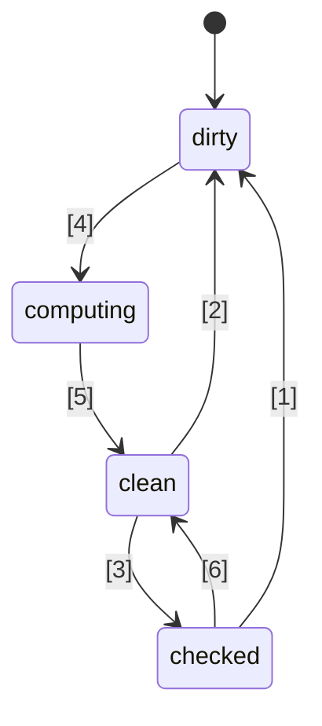
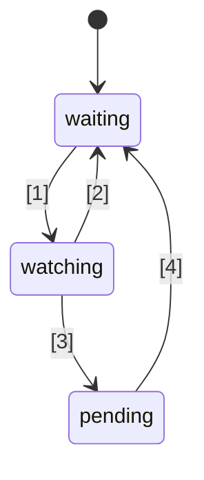

# 🚦 JavaScript Signals मानक प्रस्ताव 🚦


चरण 1 ([व्याख्या](https://tc39.es/process-document/))

TC39 प्रस्ताव चैम्पियन्स: डैनियल एरेनबर्ग, यहूदा काट्ज़, जतिन रमनाथन, शेय लुईस, क्रिस्टन ह्यूल गैरेट, डोमिनिक गनावे, प्रेस्टन सेगो, मिलो एम, रॉब आइज़नबर्ग

मूल लेखक: रॉब आइज़नबर्ग और डैनियल एरेनबर्ग

यह दस्तावेज़ जावास्क्रिप्ट में सिग्नल्स के लिए एक शुरुआती साझा दिशा का वर्णन करता है, जो Promises/A+ प्रयास के समान है, जिसने ES2015 में TC39 द्वारा मानकीकृत प्रॉमिसेज़ से पहले मार्गदर्शन किया था। इसे स्वयं आज़माएँ, [एक पॉलीफिल](https://github.com/proposal-signals/signal-polyfill) का उपयोग करके।

Promises/A+ की तरह, यह प्रयास जावास्क्रिप्ट इकोसिस्टम को संरेखित करने पर केंद्रित है। यदि यह संरेखण सफल रहता है, तो उस अनुभव के आधार पर एक मानक उभर सकता है। कई फ्रेमवर्क लेखक यहां एक साझा मॉडल पर सहयोग कर रहे हैं जो उनके रिएक्टिविटी कोर का समर्थन कर सकता है। वर्तमान मसौदा [Angular](https://angular.io/), [Bubble](https://bubble.io/), [Ember](https://emberjs.com/), [FAST](https://www.fast.design/), [MobX](https://mobx.js.org/), [Preact](https://preactjs.com/), [Qwik](https://qwik.dev/), [RxJS](https://rxjs.dev/), [Solid](https://www.solidjs.com/), [Starbeam](https://www.starbeamjs.com/), [Svelte](https://svelte.dev/), [Vue](https://vuejs.org/), [Wiz](https://blog.angular.io/angular-and-wiz-are-better-together-91e633d8cd5a), और अन्य के लेखक/रखरखावकर्ताओं के डिज़ाइन इनपुट पर आधारित है…

Promises/A+ से अलग, हम सामान्य डेवलपर-फेसिंग सरफेस API के लिए समाधान खोजने की कोशिश नहीं कर रहे हैं, बल्कि अंतर्निहित सिग्नल ग्राफ की सटीक कोर सेमांटिक्स के लिए कर रहे हैं। इस प्रस्ताव में एक पूर्णतः ठोस API शामिल है, लेकिन यह API अधिकांश एप्लिकेशन डेवलपर्स के लिए लक्षित नहीं है। इसके बजाय, यहां प्रस्तुत सिग्नल API फ्रेमवर्क्स के लिए बेहतर फिट है, ताकि वे इसके ऊपर निर्माण कर सकें, और सामान्य सिग्नल ग्राफ तथा ऑटो-ट्रैकिंग मेकैनिज्म के माध्यम से इंटरऑपरेबिलिटी प्रदान कर सकें।

इस प्रस्ताव की योजना है कि स्टेज 1 से आगे बढ़ने से पहले, कई फ्रेमवर्क्स में एकीकरण सहित, महत्वपूर्ण प्रारंभिक प्रोटोटाइपिंग की जाए। हम केवल तभी Signals का मानकीकरण करने में रुचि रखते हैं, यदि वे व्यवहार में कई फ्रेमवर्क्स में उपयोग के लिए उपयुक्त हैं, और फ्रेमवर्क-प्रदत्त सिग्नल्स की तुलना में वास्तविक लाभ प्रदान करते हैं। हमें आशा है कि पर्याप्त प्रारंभिक प्रोटोटाइपिंग से हमें यह जानकारी मिल जाएगी। अधिक विवरण के लिए नीचे "स्थिति और विकास योजना" देखें।

## पृष्ठभूमि: Signals क्यों?

एक जटिल यूज़र इंटरफेस (UI) विकसित करने के लिए, जावास्क्रिप्ट एप्लिकेशन डेवलपर्स को एप्लिकेशन की व्यू लेयर में स्थिति को कुशलतापूर्वक स्टोर, गणना, अमान्य, सिंक और पुश करने की आवश्यकता होती है। UI में अक्सर केवल सरल मानों का प्रबंधन नहीं होता, बल्कि अक्सर ऐसे गणितीय स्थिति का रेंडरिंग करना होता है, जो अन्य मानों या स्थिति के एक जटिल वृक्ष पर निर्भर करता है, जो स्वयं भी गणना की जाती है। Signals का लक्ष्य ऐसी एप्लिकेशन स्थिति के प्रबंधन के लिए आधारभूत संरचना प्रदान करना है ताकि डेवलपर्स इन दोहरावदार विवरणों के बजाय व्यापारिक तर्क पर ध्यान केंद्रित कर सकें।

Signal-जैसी रचनाएँ स्वतंत्र रूप से गैर-UI संदर्भों में भी उपयोगी पाई गई हैं, विशेष रूप से बिल्ड सिस्टम्स में अनावश्यक पुनर्निर्माण से बचने के लिए।

रिएक्टिव प्रोग्रामिंग में Signals का उपयोग एप्लिकेशन्स में अपडेटिंग के प्रबंधन की आवश्यकता को दूर करने के लिए किया जाता है।

> राज्य में परिवर्तन के आधार पर अद्यतन करने के लिए घोषणात्मक प्रोग्रामिंग मॉडल।

_से [What is Reactivity?](https://www.pzuraq.com/blog/what-is-reactivity)_.

#### उदाहरण - एक VanillaJS काउंटर

मान लीजिए एक वेरिएबल `counter` है, आप डोम में यह रेंडर करना चाहते हैं कि काउंटर सम (even) है या विषम (odd)। जब भी `counter` बदलता है, आप डोम को नवीनतम पैरिटी के साथ अपडेट करना चाहते हैं। वनीला जेएस में, आपके पास कुछ ऐसा हो सकता है:

```js
let counter = 0;
const setCounter = (value) => {
  counter = value;
  render();
};

const isEven = () => (counter & 1) == 0;
const parity = () => isEven() ? "even" : "odd";
const render = () => element.innerText = parity();

// Simulate external updates to counter...
setInterval(() => setCounter(counter + 1), 1000);
```
> [!NOTE]  
> यहाँ डेमो के लिए ग्लोबल्स का उपयोग किया गया है। उचित स्थिति प्रबंधन के कई समाधान हैं, और इस प्रस्ताव के उदाहरण यथासंभव न्यूनतम रखने के लिए हैं। यह प्रस्ताव ग्लोबल वेरिएबल्स को प्रोत्साहित नहीं करता।

इसमें कई समस्याएँ हैं...

* `counter` सेटअप शोरगुल और भारी बायलरप्लेट वाला है।
* `counter` स्थिति रेंडरिंग सिस्टम से सख्ती से जुड़ी हुई है।
* यदि `counter` बदलता है लेकिन `parity` नहीं (जैसे काउंटर 2 से 4 हो जाता है), तो हम अनावश्यक रूप से पैरिटी की गणना और अनावश्यक रेंडरिंग करते हैं।
* अगर हमारे UI का कोई और भाग केवल `counter` के अपडेट होने पर रेंडर करना चाहता है तो क्या?
* अगर हमारे UI का कोई और भाग केवल `isEven` या `parity` पर निर्भर है तो क्या?

यहाँ तक कि इस अपेक्षाकृत सरल परिदृश्य में भी कई समस्याएँ तुरंत सामने आ जाती हैं। हम इनका समाधान `counter` के लिए pub/sub जोड़कर कर सकते हैं। इससे `counter` के अतिरिक्त उपभोक्ता भी अपनी प्रतिक्रियाएँ जोड़ सकते हैं।

हालांकि, फिर भी हम निम्नलिखित समस्याओं से जूझ रहे हैं:

* रेंडर फंक्शन, जो केवल `parity` पर निर्भर है, उसे वास्तव में "पता" होना चाहिए कि उसे `counter` को सब्स्क्राइब करना है।
* केवल `isEven` या `parity` के आधार पर UI को अपडेट करना संभव नहीं है, बिना सीधे `counter` से इंटरैक्ट किए।
* हमारा बायलरप्लेट बढ़ गया है। जब भी आप कुछ उपयोग कर रहे हैं, यह केवल एक फंक्शन कॉल या वेरिएबल पढ़ने की बात नहीं है, बल्कि सब्स्क्राइब करने और वहाँ अपडेट करने की बात है। अनसब्स्क्रिप्शन का प्रबंधन भी विशेष रूप से जटिल हो जाता है।

अब, हम कुछ समस्याओं को हल कर सकते हैं न केवल `counter` में pub/sub जोड़कर, बल्कि `isEven` और `parity` में भी। फिर हमें `isEven` को `counter`, `parity` को `isEven`, और `render` को `parity` पर सब्स्क्राइब करना होगा। दुर्भाग्य से, न केवल हमारा बायलरप्लेट कोड बहुत बढ़ गया है, बल्कि हमें बहुत सारी सब्स्क्रिप्शन बुककीपिंग करनी पड़ रही है, और अगर हम सब कुछ सही तरीके से साफ़ नहीं करते हैं तो संभावित मेमोरी लीक का खतरा भी है। तो, हमने कुछ समस्याएँ हल की हैं लेकिन समस्याओं और कोड की एक नई श्रेणी बना ली है। और भी बुरा यह है कि हमें यह पूरी प्रक्रिया अपने सिस्टम की हर स्थिति के लिए दोहरानी होगी।

### Signals का परिचय

UI में मॉडल और व्यू के लिए डेटा बाइंडिंग अमूर्तता विभिन्न प्रोग्रामिंग भाषाओं में UI फ्रेमवर्क्स का मूल हिस्सा रही है, भले ही JS या वेब प्लेटफार्म में कोई ऐसा मैकेनिज्म न हो। JS फ्रेमवर्क्स और लाइब्रेरीज़ में, इस बाइंडिंग को दर्शाने के विभिन्न तरीकों पर बहुत अधिक प्रयोग हुआ है, और अनुभव ने दिखाया है कि एक-तरफा डेटा फ्लो की शक्ति, एक प्रथम श्रेणी के डेटा प्रकार के साथ, जो अन्य डेटा से व्युत्पन्न स्थिति या गणना का प्रतिनिधित्व करता है, अब अक्सर "Signals" कहा जाता है।
यह प्रथम श्रेणी का रिएक्टिव मान दृष्टिकोण शायद पहली बार [Knockout](https://knockoutjs.com/) [2010 में](https://blog.stevensanderson.com/2010/07/05/introducing-knockout-a-ui-library-for-javascript/) ओपन-सोर्स जावास्क्रिप्ट वेब फ्रेमवर्क्स में लोकप्रिय हुआ। तब से, कई विविधताएँ और कार्यान्वयन बनाए गए हैं। पिछले 3-4 वर्षों में, सिग्नल प्रिमिटिव और संबंधित दृष्टिकोणों ने और भी लोकप्रियता हासिल की है, लगभग हर आधुनिक जावास्क्रिप्ट लाइब्रेरी या फ्रेमवर्क में किसी न किसी रूप में कुछ न कुछ ऐसा है।

Signals को समझने के लिए, चलिए ऊपर दिए गए उदाहरण को फिर से देखें, नीचे और अधिक स्पष्ट किए गए Signal API के साथ।

#### उदाहरण - एक Signals काउंटर

```js
const counter = new Signal.State(0);
const isEven = new Signal.Computed(() => (counter.get() & 1) == 0);
const parity = new Signal.Computed(() => isEven.get() ? "even" : "odd");

// कोई लाइब्रेरी या फ्रेमवर्क अन्य Signal प्रिमिटिव्स के आधार पर इफेक्ट्स को परिभाषित करता है
declare function effect(cb: () => void): (() => void);

effect(() => element.innerText = parity.get());

// Simulate external updates to counter...
setInterval(() => counter.set(counter.get() + 1), 1000);
```

कुछ बातें तुरंत स्पष्ट हो जाती हैं:
* हमने अपने पिछले उदाहरण से `counter` वेरिएबल के चारों ओर का शोरगुल और बायलरप्लेट हटा दिया है।
* मान, गणनाएँ, और साइड इफेक्ट्स को संभालने के लिए एक एकीकृत API है।
* `counter` और `render` के बीच कोई सर्कुलर रेफरेंस समस्या या उलटी निर्भरता नहीं है।
* कोई मैन्युअल सब्स्क्रिप्शन नहीं है, और न ही किसी बुककीपिंग की आवश्यकता है।
* साइड-इफेक्ट टाइमिंग/शेड्यूलिंग को नियंत्रित करने का एक साधन है।

Signals हमें API की सतह से कहीं अधिक प्रदान करते हैं:
* **स्वचालित डिपेंडेंसी ट्रैकिंग** - एक गणना की गई सिग्नल अपने आप यह पता लगा लेती है कि वह किन अन्य सिग्नल्स पर निर्भर है, चाहे वे सिग्नल्स साधारण मान हों या अन्य गणनाएँ।
* **आलसी मूल्यांकन (Lazy Evaluation)** - गणनाएँ घोषित किए जाने पर तुरंत मूल्यांकित नहीं होतीं, और न ही उनकी डिपेंडेंसी बदलने पर तुरंत मूल्यांकित होती हैं। वे केवल तब मूल्यांकित होती हैं जब उनका मान स्पष्ट रूप से अनुरोधित किया जाता है।
* **मेमोइज़ेशन** - गणना की गई सिग्नल्स अपने अंतिम मान को कैश करती हैं ताकि जिन गणनाओं की डिपेंडेंसी में कोई बदलाव नहीं हुआ है, उन्हें दोबारा मूल्यांकित करने की आवश्यकता न हो, चाहे उन्हें कितनी भी बार एक्सेस किया जाए।

## सिग्नल्स को मानकीकृत करने के लिए प्रेरणा

#### इंटरऑपरेबिलिटी

प्रत्येक सिग्नल इम्प्लीमेंटेशन का अपना ऑटो-ट्रैकिंग मैकेनिज्म होता है, जो यह ट्रैक करता है कि किसी गणना की गई सिग्नल का मूल्यांकन करते समय किन स्रोतों का सामना हुआ। इससे विभिन्न फ्रेमवर्क्स के बीच मॉडल, कंपोनेंट्स और लाइब्रेरीज़ साझा करना कठिन हो जाता है—ये अक्सर अपने व्यू इंजन के साथ झूठी कड़ी के साथ आते हैं (क्योंकि सिग्नल्स आमतौर पर JS फ्रेमवर्क्स का हिस्सा होते हैं)।

इस प्रस्ताव का एक उद्देश्य प्रतिक्रियाशील मॉडल को रेंडरिंग व्यू से पूरी तरह अलग करना है, जिससे डेवलपर्स बिना अपने गैर-UI कोड को फिर से लिखे, नई रेंडरिंग तकनीकों में माइग्रेट कर सकें, या साझा प्रतिक्रियाशील मॉडल JS में विकसित कर सकें जिन्हें विभिन्न संदर्भों में डिप्लॉय किया जा सके। दुर्भाग्यवश, संस्करण नियंत्रण और डुप्लीकेशन के कारण, JS-स्तरीय लाइब्रेरीज़ के माध्यम से मज़बूत स्तर की साझेदारी प्राप्त करना अव्यावहारिक साबित हुआ है—बिल्ट-इन सुविधाएँ अधिक मज़बूत साझेदारी गारंटी देती हैं।

#### प्रदर्शन/मेमोरी उपयोग

कम कोड भेजना हमेशा एक छोटा संभावित प्रदर्शन लाभ होता है, क्योंकि आमतौर पर उपयोग की जाने वाली लाइब्रेरीज़ बिल्ट-इन होती हैं, लेकिन सिग्नल्स की इम्प्लीमेंटेशन आम तौर पर बहुत छोटी होती हैं, इसलिए हमें यह प्रभाव बहुत बड़ा होने की उम्मीद नहीं है।

हमें संदेह है कि सिग्नल-संबंधित डेटा स्ट्रक्चर और एल्गोरिदम की नेटिव C++ इम्प्लीमेंटेशन JS में उपलब्ध स्तर से थोड़ा अधिक कुशल हो सकती है, एक नियतांक गुणक (constant factor) द्वारा। हालांकि, किसी भी एल्गोरिदमिक परिवर्तन की अपेक्षा नहीं है बनाम वह जो एक पॉलीफिल में मौजूद होगा; इंजन से यहाँ जादू की अपेक्षा नहीं की जाती, और स्वयं प्रतिक्रियाशील एल्गोरिदम अच्छी तरह परिभाषित और अस्पष्ट रहेंगे।

चैम्पियन समूह विभिन्न सिग्नल्स की इम्प्लीमेंटेशन विकसित करने की उम्मीद करता है, और इनका उपयोग करके इन प्रदर्शन संभावनाओं की जांच करेगा।

#### DevTools

मौजूदा JS-भाषा सिग्नल लाइब्रेरीज़ के साथ, निम्नलिखित को ट्रेस करना कठिन हो सकता है:
* गणना की गई सिग्नल्स की श्रृंखला में कॉलस्टैक, जो किसी त्रुटि के लिए कारण श्रृंखला दिखाता है
* सिग्नल्स के बीच संदर्भ ग्राफ़, जब एक दूसरे पर निर्भर करता है -- मेमोरी उपयोग को डिबग करते समय महत्वपूर्ण

बिल्ट-इन सिग्नल्स JS रनटाइम्स और DevTools को सिग्नल्स का निरीक्षण करने के लिए बेहतर समर्थन प्रदान कर सकते हैं, विशेष रूप से डिबगिंग या प्रदर्शन विश्लेषण के लिए, चाहे यह ब्राउज़रों में बिल्ट-इन हो या किसी साझा एक्सटेंशन के माध्यम से। मौजूदा टूल्स जैसे एलिमेंट इंस्पेक्टर, प्रदर्शन स्नैपशॉट, और मेमोरी प्रोफाइलर्स को उनकी जानकारी की प्रस्तुति में विशेष रूप से सिग्नल्स को उजागर करने के लिए अपडेट किया जा सकता है।

#### द्वितीयक लाभ

##### एक मानक लाइब्रेरी के लाभ

सामान्यतः, जावास्क्रिप्ट की मानक लाइब्रेरी काफी न्यूनतम रही है, लेकिन TC39 में एक प्रवृत्ति रही है कि JS को अधिक "बैटरियों के साथ" भाषा बनाया जाए, जिसमें उच्च गुणवत्ता, बिल्ट-इन कार्यक्षमता उपलब्ध हो। उदाहरण के लिए, Temporal moment.js की जगह ले रहा है, और कई छोटी विशेषताएँ, जैसे कि `Array.prototype.flat` और `Object.groupBy` कई lodash उपयोग मामलों की जगह ले रही हैं। लाभों में छोटे बंडल आकार, बेहतर स्थिरता और गुणवत्ता, नए प्रोजेक्ट में शामिल होने पर सीखने के लिए कम चीजें, और JS डेवलपर्स के बीच आम शब्दावली शामिल हैं।

##### HTML/DOM एकीकरण (भविष्य की संभावना)

W3C और ब्राउज़र इम्प्लीमेंटर्स वर्तमान में HTML में नेटिव टेम्पलेटिंग लाने का प्रयास कर रहे हैं ([DOM Parts][wicg-pr-1023] और [Template Instantiation][wicg-propsal-template-instantiation])। इसके अतिरिक्त, W3C Web Components CG Web Components को पूरी तरह डिक्लेरेटिव HTML API प्रदान करने की संभावना का अन्वेषण कर रहा है। इन दोनों लक्ष्यों को प्राप्त करने के लिए, अंततः HTML को एक प्रतिक्रियाशील प्रिमिटिव की आवश्यकता होगी। इसके अलावा, सिग्नल्स के एकीकरण के माध्यम से DOM में कई उपयोगकर्ता-अनुकूल सुधारों की कल्पना की जा सकती है और समुदाय द्वारा इसकी मांग की गई है।

[wicg-pr-1023]: https://github.com/WICG/webcomponents/pull/1023
[wicg-propsal-template-instantiation]: https://github.com/WICG/webcomponents/blob/gh-pages/proposals/Template-Instantiation.md

> ध्यान दें, यह एकीकरण बाद में आने वाला एक अलग प्रयास होगा, यह स्वयं इस प्रस्ताव का हिस्सा नहीं है।

##### इकोसिस्टम सूचना विनिमय (*शिपिंग का कारण नहीं*)

मानकीकरण के प्रयास कभी-कभी केवल "समुदाय" स्तर पर सहायक हो सकते हैं, भले ही ब्राउज़रों में कोई बदलाव न हो। सिग्नल्स का प्रयास प्रतिक्रियाशीलता, एल्गोरिदम और इंटरऑपरेबिलिटी की प्रकृति पर गहन चर्चा के लिए कई अलग-अलग फ्रेमवर्क लेखकों को एक साथ ला रहा है। यह पहले से ही उपयोगी रहा है, और यह JS इंजन और ब्राउज़रों में शामिल किए जाने का औचित्य नहीं है; सिग्नल्स को केवल तभी जावास्क्रिप्ट मानक में जोड़ा जाना चाहिए जब इकोसिस्टम सूचना विनिमय से *अधिक* महत्वपूर्ण लाभ हों।

## सिग्नल्स के लिए डिज़ाइन लक्ष्य

यह पता चला है कि मौजूदा सिग्नल लाइब्रेरीज़ मूल रूप से एक-दूसरे से ज्यादा भिन्न नहीं हैं। यह प्रस्ताव उनकी सफलता पर आधारित है और उन लाइब्रेरीज़ की महत्वपूर्ण विशेषताओं को लागू करने का लक्ष्य रखता है।

### मुख्य विशेषताएँ

* एक सिग्नल प्रकार जो स्थिति का प्रतिनिधित्व करता है, यानी लिखने योग्य सिग्नल। यह एक मान है जिसे अन्य पढ़ सकते हैं।
* एक गणना/मेमो/व्युत्पन्न सिग्नल प्रकार, जो दूसरों पर निर्भर करता है और आलसी तरीके से गणना और कैश किया जाता है।
    * गणना आलसी है, अर्थात् जब तक कोई उसकी डिपेंडेंसी बदलने पर वास्तव में उसे पढ़ता नहीं है, तब तक गणना की गई सिग्नल्स दोबारा गणना नहीं की जातीं।
    * गणना "[ग्लिच](https://en.wikipedia.org/wiki/Reactive_programming#Glitches)-मुक्त" है, यानी कभी भी अनावश्यक गणनाएँ नहीं की जातीं। इसका अर्थ है कि जब कोई एप्लिकेशन एक गणना की गई सिग्नल को पढ़ता है, तो ग्राफ के संभावित गंदे हिस्सों को निष्पादित करने के लिए शीर्षस्थ संरचना (topological sorting) होती है, जिससे कोई डुप्लिकेट नहीं रहता।
    * गणना कैश की जाती है, यानी यदि अंतिम बार जब डिपेंडेंसी बदली थी, उसके बाद से कोई डिपेंडेंसी नहीं बदली है, तो गणना की गई सिग्नल को एक्सेस करते समय पुनः गणना नहीं की जाती।
    * गणना की गई सिग्नल्स के साथ-साथ स्थिति सिग्नल्स के लिए कस्टम तुलना संभव है, ताकि यह पता चल सके कि उन पर निर्भर आगे की गणना की गई सिग्नल्स को कब अपडेट करना चाहिए।
* उस स्थिति पर प्रतिक्रिया जब किसी गणना की गई सिग्नल की कोई डिपेंडेंसी (या नेस्टेड डिपेंडेंसी) "गंदी" (dirty) हो जाए और बदल जाए, जिसका अर्थ है कि सिग्नल का मान अब पुराना हो सकता है।
    * यह प्रतिक्रिया अधिक महत्वपूर्ण कार्य को बाद में शेड्यूल करने के लिए है।
    * इफेक्ट्स को इन प्रतिक्रियाओं और फ्रेमवर्क-स्तरीय शेड्यूलिंग के संदर्भ में लागू किया जाता है।
    * गणना की गई सिग्नल्स को यह पता लगाने की क्षमता चाहिए कि वे इन प्रतिक्रियाओं में से किसी एक की (नेस्टेड) डिपेंडेंसी के रूप में पंजीकृत हैं या नहीं।
* JS फ्रेमवर्क्स को अपना शेड्यूलिंग स्वयं करने में सक्षम बनाना। कोई Promise-शैली की बिल्ट-इन बाध्यकारी शेड्यूलिंग नहीं।
    * सिंक्रोनस प्रतिक्रियाएँ आवश्यक हैं ताकि बाद के कार्य को फ्रेमवर्क लॉजिक के आधार पर शेड्यूल किया जा सके।
    * लिखना सिंक्रोनस है और तुरंत प्रभावी होता है (कोई फ्रेमवर्क जो लिखने को बैच करता है, वह उसे ऊपर से लागू कर सकता है)।
    * यह संभव है कि यह जाँचा जा सके कि कोई इफेक्ट "गंदा" हो सकता है या नहीं, बिना इफेक्ट को वास्तव में चलाए (दो-चरणीय इफेक्ट शेड्यूलर को सक्षम करना)।
* सिग्नल्स को पढ़ने की क्षमता *बिना* डिपेंडेंसी रिकॉर्ड किए (`untrack`)
* विभिन्न कोडबेस का संयोजन सक्षम करना जो सिग्नल्स/प्रतिक्रियाशीलता का उपयोग करते हैं, जैसे,
    * ट्रैकिंग/प्रतिक्रियाशीलता के संदर्भ में कई फ्रेमवर्क्स को एक साथ उपयोग करना (कुछ अपवादों के साथ, नीचे देखें)
    * फ्रेमवर्क-स्वतंत्र प्रतिक्रियाशील डेटा स्ट्रक्चर (जैसे, आवर्ती प्रतिक्रियाशील स्टोर प्रॉक्सी, प्रतिक्रियाशील Map और Set और Array, आदि)

### साउंडनेस

* सिंक्रोनस प्रतिक्रियाओं के भोलेपन से दुरुपयोग को हतोत्साहित/प्रतिबंधित करना।
    * साउंडनेस जोखिम: यदि इसे अनुचित तरीके से उपयोग किया गया तो यह "[ग्लिच](https://en.wikipedia.org/wiki/Reactive_programming#Glitches)" को उजागर कर सकता है: यदि रेंडरिंग सिग्नल सेट करते समय तुरंत की जाती है, तो यह अंतिम उपयोगकर्ता को अपूर्ण एप्लिकेशन स्थिति दिखा सकता है। इसलिए, इस सुविधा का उपयोग केवल काम को बुद्धिमानी से बाद में शेड्यूल करने के लिए किया जाना चाहिए, जब एप्लिकेशन लॉजिक समाप्त हो जाए।
    * समाधान: सिंक्रोनस प्रतिक्रिया कॉलबैक के भीतर किसी भी सिग्नल को पढ़ने और लिखने की अनुमति नहीं देना
* `untrack` को हतोत्साहित करना और इसकी अस्वस्थ प्रकृति को चिह्नित करना
    * साउंडनेस जोखिम: इससे ऐसे गणना की गई सिग्नल्स बनाए जा सकते हैं जिनका मान अन्य सिग्नल्स पर निर्भर करता है, लेकिन जब वे सिग्नल्स बदलते हैं तो ये अपडेट नहीं होते। इसका उपयोग तभी किया जाना चाहिए जब अनट्रैक्ड एक्सेस गणना के परिणाम को नहीं बदलेंगे।
    * समाधान: API को नाम में "unsafe" के रूप में चिह्नित किया गया है।
* नोट: यह प्रस्ताव सिग्नल्स को गणना और इफेक्ट सिग्नल्स से पढ़ने और लिखने दोनों की अनुमति देता है, बिना पढ़ने के बाद लिखने को प्रतिबंधित किए, भले ही साउंडनेस जोखिम हो। यह निर्णय लचीलेपन और फ्रेमवर्क्स के साथ संगतता बनाए रखने के लिए लिया गया है।

### सतही API

* कई फ्रेमवर्क्स के लिए अपने सिग्नल्स/प्रतिक्रियाशीलता मैकेनिज्म को लागू करने के लिए एक ठोस आधार होना चाहिए।
    * यह आवर्ती स्टोर प्रॉक्सी, डेकोरेटर-आधारित क्लास फील्ड प्रतिक्रियाशीलता, और `.value` एवं `[state, setState]`-शैली APIs दोनों के लिए अच्छा आधार होना चाहिए।
    * इनकी सेमांटिक्स विभिन्न फ्रेमवर्क्स द्वारा सक्षम मान्य पैटर्न को व्यक्त करने में सक्षम हैं। उदाहरण के लिए, यह संभव होना चाहिए कि ये सिग्नल्स या तो तुरंत परिलक्षित लिखने या बाद में बैच करके लागू किए गए लिखने का आधार बन सकें।
* अच्छा होगा यदि यह API सीधे जावास्क्रिप्ट डेवलपर्स द्वारा उपयोग की जा सके।
    * यदि कोई सुविधा किसी इकोसिस्टम अवधारणा से मेल खाती है, तो सामान्य शब्दावली का उपयोग करना अच्छा है।
        * हालाँकि, बिल्कुल वही नाम न देना महत्वपूर्ण है!
    * "JS डेवलपर्स द्वारा उपयोगिता" और "फ्रेमवर्क्स के लिए सभी हुक्स प्रदान करना" के बीच तनाव
        * विचार: सभी हुक्स प्रदान करें, लेकिन यदि संभव हो तो गलत उपयोग पर त्रुटियाँ शामिल करें।
        * विचार: सूक्ष्म APIs को एक `subtle` नामस्थान में रखें, [`crypto.subtle`](https://developer.mozilla.org/en-US/docs/Web/API/Crypto/subtle) के समान, ताकि उन APIs के बीच रेखा खींची जा सके जो अधिक उन्नत उपयोग जैसे कि फ्रेमवर्क या Dev Tools बनाने के लिए आवश्यक हैं बनाम वे जो रोजमर्रा के एप्लिकेशन विकास के लिए हैं जैसे कि किसी फ्रेमवर्क के साथ सिग्नल्स इंस्टैंसिएट करना।
* अच्छे प्रदर्शन के साथ लागू और उपयोग करने योग्य हो -- सतही API बहुत अधिक ओवरहेड नहीं पैदा करता है
    * सबक्लासिंग को सक्षम करें, ताकि फ्रेमवर्क्स अपने स्वयं के तरीके और फ़ील्ड, निजी फ़ील्ड सहित, जोड़ सकें। यह फ्रेमवर्क स्तर पर अतिरिक्त आवंटनों की आवश्यकता से बचने के लिए महत्वपूर्ण है। "मेमोरी प्रबंधन" नीचे देखें।

### मेमोरी प्रबंधन

* यदि संभव हो: कोई गणना की गई सिग्नल गारबेज-कलेक्ट होनी चाहिए यदि भविष्य में उसे पढ़ने के लिए कुछ भी जीवित नहीं है, भले ही वह एक व्यापक ग्राफ में जुड़ी हो जो जीवित रहता है (जैसे, एक ऐसी स्थिति को पढ़कर जो जीवित रहती है)।
* ध्यान दें कि आजकल अधिकांश फ्रेमवर्क्स को कंप्यूटेड सिग्नल्स का स्पष्ट रूप से डिस्पोज़ल करना आवश्यक होता है, यदि उनका कोई रेफरेंस किसी अन्य सिग्नल ग्राफ से है जो अभी भी जीवित है।
* जब इनका जीवनकाल UI कंपोनेंट के जीवनकाल से जुड़ा होता है, और इफेक्ट्स को वैसे भी डिस्पोज़ करना पड़ता है, तब यह इतना बुरा नहीं लगता।
* यदि इन सिमेंटिक्स के साथ निष्पादन बहुत महंगा है, तो हमें नीचे दिए गए API में कंप्यूटेड सिग्नल्स के स्पष्ट डिस्पोज़ल (या "अनलिंकिंग") को जोड़ना चाहिए, जो वर्तमान में इसमें नहीं है।
* एक अलग संबंधित लक्ष्य: एलोकेशन की संख्या को न्यूनतम करें, उदाहरण के लिए,
    * एक राइटेबल सिग्नल बनाने के लिए (दो अलग-अलग क्लोज़र + ऐरे से बचें)
    * इफेक्ट्स को इम्प्लीमेंट करने के लिए (हर रिएक्शन के लिए क्लोज़र से बचें)
    * सिग्नल बदलावों को ऑब्जर्व करने के API में, अतिरिक्त अस्थायी डाटा स्ट्रक्चर बनाने से बचें
    * समाधान: सबक्लासेस में परिभाषित मेथड्स और फील्ड्स के पुन: उपयोग की सुविधा के लिए क्लास-आधारित API

## API स्केच

एक सिग्नल API का प्रारंभिक विचार नीचे दिया गया है। ध्यान दें कि यह सिर्फ एक प्रारंभिक ड्राफ्ट है, और हम समय के साथ बदलाव की संभावना देखते हैं। आइए पूरी `.d.ts` से शुरुआत करें ताकि हमें इसके समग्र स्वरूप का अंदाज़ा हो जाए, और फिर हम इसकी सारी डिटेल्स पर चर्चा करेंगे कि इसका क्या अर्थ है।

```ts
interface Signal<T> {
    // सिग्नल का मान प्राप्त करें
    get(): T;
}

namespace Signal {
    // एक रीड-राइट सिग्नल
    class State<T> implements Signal<T> {
        // मान t के साथ एक स्टेट सिग्नल बनाएँ
        constructor(t: T, options?: SignalOptions<T>);

        // सिग्नल का मान प्राप्त करें
        get(): T;

        // स्टेट सिग्नल का मान t पर सेट करें
        set(t: T): void;
    }

    // एक सिग्नल जो अन्य सिग्नल्स पर आधारित फॉर्मूला है
    class Computed<T = unknown> implements Signal<T> {
        // एक सिग्नल बनाएं जो कॉलबैक द्वारा लौटाए गए मान पर इवैल्युएट होता है।
        // कॉलबैक को इस सिग्नल को this वैल्यू के रूप में पास किया जाता है।
        constructor(cb: (this: Computed<T>) => T, options?: SignalOptions<T>);

        // सिग्नल का मान प्राप्त करें
        get(): T;
    }

    // इस नेमस्पेस में "एडवांस्ड" फीचर्स शामिल हैं, जो एप्लिकेशन डेवलपर्स की बजाय फ्रेमवर्क ऑथर्स के लिए बेहतर हैं।
    // `crypto.subtle` के समान
    namespace subtle {
        // सभी ट्रैकिंग को डिसेबल करके एक कॉलबैक चलाएँ
        function untrack<T>(cb: () => T): T;

        // वर्तमान कंप्यूटेड सिग्नल प्राप्त करें जो किसी भी सिग्नल रीड को ट्रैक कर रहा है, यदि कोई है
        function currentComputed(): Computed | null;

        // ऑर्डर में उन सभी सिग्नल्स की सूची लौटाएं, जिनका इसने पिछली बार इवैल्युएशन के दौरान रेफरेंस लिया था।
        // वॉचर के लिए, उन सिग्नल्स का सेट लिस्ट करता है जिन्हें वह वॉच कर रहा है।
        function introspectSources(s: Computed | Watcher): (State | Computed)[];

        // वे वॉचर्स लौटाएं जिनमें यह सिग्नल शामिल है, साथ ही वे कंप्यूटेड सिग्नल्स जिन्होंने पिछली बार इसके मान को पढ़ा था,
        // यदि वह कंप्यूटेड सिग्नल (रेकर्सिवली) वॉच किया जा रहा है।
        function introspectSinks(s: State | Computed): (Computed | Watcher)[];

        // यदि यह सिग्नल "लाइव" है, यानी इसे कोई वॉचर वॉच कर रहा है,
        // या इसे कोई कंप्यूटेड सिग्नल पढ़ रहा है जो (रेकर्सिवली) लाइव है, तो True लौटाएं।
        function hasSinks(s: State | Computed): boolean;

        // यदि यह एलिमेंट "रिएक्टिव" है, यानी यह किसी अन्य सिग्नल पर निर्भर करता है, तो True लौटाएं।
        // एक कंप्यूटेड जिसका hasSources false है वह हमेशा समान स्थिर मान लौटाएगा।
        function hasSources(s: Computed | Watcher): boolean;

        class Watcher {
            // जब वॉचर का कोई (रेकर्सिव) सोर्स लिखा जाता है, तो इस कॉलबैक को कॉल करें,
            // यदि इसे पिछले `watch` कॉल के बाद पहले ही कॉल नहीं किया गया है।
            // notify के दौरान कोई सिग्नल पढ़ा या लिखा नहीं जा सकता।
            constructor(notify: (this: Watcher) => void);

            // इन सिग्नल्स को वॉचर के सेट में जोड़ें, और वॉचर को सेट करें कि अगली बार जब भी सेट में कोई भी सिग्नल (या उसकी कोई डिपेंडेंसी) बदले, तो उसका notify कॉलबैक चलाया जाए।
            // इसे बिना किसी आर्ग्युमेंट के भी कॉल किया जा सकता है, सिर्फ "notified" स्टेट को रीसेट करने के लिए, जिससे notify कॉलबैक फिर से इनवोक होगा।
            watch(...s: Signal[]): void;

            // इन सिग्नल्स को वॉच किए गए सेट से हटाएं (जैसे, डिस्पोज़ किए गए इफेक्ट के लिए)
            unwatch(...s: Signal[]): void;

            // वॉचर के सेट में मौजूद सोर्सेज में से जो अभी भी डर्टी हैं उनका सेट लौटाएं, या वह कंप्यूटेड सिग्नल लौटाएं
            // जिसमें कोई सोर्स डर्टी या पेंडिंग है और अभी तक री-इवैल्युएट नहीं हुआ है
            getPending(): Signal[];
        }

        // वॉच या अनवॉच होने पर ऑब्जर्व करने के लिए हुक्स
        var watched: Symbol;
        var unwatched: Symbol;
    }

    interface SignalOptions<T> {
        // पुराने और नए मान के बीच कस्टम तुलना फंक्शन। डिफ़ॉल्ट: Object.is।
        // सिग्नल को this वैल्यू के रूप में संदर्भ के लिए पास किया जाता है।
        equals?: (this: Signal<T>, t: T, t2: T) => boolean;
```ts
// Callback called when isWatched becomes true, if it was previously false
[Signal.subtle.watched]?: (this: Signal<T>) => void;

// Callback called whenever isWatched becomes false, if it was previously true
[Signal.subtle.unwatched]?: (this: Signal<T>) => void;
}
}
```

### सिग्नल्स कैसे काम करते हैं

एक सिग्नल डेटा की एक सेल का प्रतिनिधित्व करता है जो समय के साथ बदल सकती है। सिग्नल्स या तो "स्टेट" (सिर्फ एक मान जिसे मैन्युअली सेट किया जाता है) या "कंप्यूटेड" (अन्य सिग्नल्स पर आधारित एक सूत्र) हो सकते हैं।

कंप्यूटेड सिग्नल्स स्वचालित रूप से ट्रैक करते हैं कि उनके मूल्यांकन के दौरान किन अन्य सिग्नल्स को पढ़ा गया है। जब एक कंप्यूटेड को पढ़ा जाता है, तो यह जांचता है कि क्या इसके पहले रिकॉर्ड किए गए डिपेंडेंसी में से कोई बदल गया है, और यदि हाँ, तो यह खुद को फिर से मूल्यांकित करता है। जब कई कंप्यूटेड सिग्नल्स नेस्टेड होते हैं, तो ट्रैकिंग का सारा क्रेडिट सबसे भीतरी सिग्नल को जाता है।

कंप्यूटेड सिग्नल्स आलसी (लेज़ी), यानी पुल-आधारित होते हैं: इन्हें केवल तभी फिर से मूल्यांकित किया जाता है जब इन्हें एक्सेस किया जाता है, भले ही इनकी डिपेंडेंसी पहले बदल गई हो।

कंप्यूटेड सिग्नल्स में पास किया गया कॉलबैक आमतौर पर "प्योर" होना चाहिए, अर्थात् वह एक निर्धारक (डिटर्मिनिस्टिक), साइड-इफेक्ट-रहित फंक्शन हो, जो केवल उन अन्य सिग्नल्स पर निर्भर हो, जिन्हें वह एक्सेस करता है। साथ ही, इस कॉलबैक के कॉल होने का समय निर्धारक होता है, जिससे साइड इफेक्ट्स को सावधानी से उपयोग किया जा सकता है।

सिग्नल्स में प्रमुख कैशिंग/मेमोइज़ेशन की सुविधा होती है: स्टेट और कंप्यूटेड दोनों प्रकार के सिग्नल्स अपने वर्तमान मान को याद रखते हैं, और केवल उन्हीं कंप्यूटेड सिग्नल्स की फिर से गणना ट्रिगर करते हैं जो वास्तव में बदलते हैं। पुराने और नए मान की बार-बार तुलना की आवश्यकता नहीं होती—यह तुलना केवल एक बार होती है जब स्रोत सिग्नल रीसेट/री-इवैल्युएट होता है, और सिग्नल तंत्र ट्रैक करता है कि कौन-कौन सी चीजें उस सिग्नल को संदर्भित कर रही हैं जिन्हें अभी तक नए मान के आधार पर अपडेट नहीं किया गया है। आंतरिक रूप से, यह सामान्यतः "ग्राफ कलरिंग" के माध्यम से दर्शाया जाता है जैसा कि (Milo's blog post) में वर्णित है।

कंप्यूटेड सिग्नल्स अपनी डिपेंडेंसी को डायनामिक रूप से ट्रैक करते हैं—हर बार जब वे चलते हैं, वे अलग-अलग चीजों पर निर्भर हो सकते हैं, और वह सटीक डिपेंडेंसी सेट सिग्नल ग्राफ में ताज़ा रखा जाता है। इसका अर्थ है कि यदि आपके पास कोई डिपेंडेंसी है जो केवल एक ब्रांच में आवश्यक है, और पिछली गणना ने दूसरी ब्रांच ली थी, तो उस अस्थायी रूप से अप्रयुक्त मान में बदलाव कंप्यूटेड सिग्नल को फिर से गणना करने का कारण नहीं बनेगा, भले ही उसे खींचा (pulled) गया हो।

जावास्क्रिप्ट प्रॉमिसेज के विपरीत, सिग्नल्स में सब कुछ सिंक्रोनस रूप से चलता है:
- किसी सिग्नल को नए मान पर सेट करना सिंक्रोनस होता है, और यह तुरंत दर्शाता है जब भी कोई कंप्यूटेड सिग्नल जो इस पर निर्भर करता है, उसे बाद में पढ़ा जाए। इस म्यूटेशन के बैचिंग की कोई इनबिल्ट सुविधा नहीं है।
- कंप्यूटेड सिग्नल्स को पढ़ना सिंक्रोनस होता है—उनका मान हमेशा उपलब्ध रहता है।
- नीचे समझाए गए अनुसार, वॉचर्स में `notify` कॉलबैक सिंक्रोनस रूप से चलता है, उसी `.set()` कॉल के दौरान जिसने इसे ट्रिगर किया (लेकिन ग्राफ कलरिंग के पूर्ण होने के बाद)।

प्रॉमिसेज की तरह, सिग्नल्स एक त्रुटि स्थिति का प्रतिनिधित्व कर सकते हैं: यदि किसी कंप्यूटेड सिग्नल का कॉलबैक थ्रो करता है, तो वह त्रुटि भी अन्य मान की तरह कैश हो जाती है, और हर बार सिग्नल को पढ़ते समय फिर से थ्रो होती है।

### Signal क्लास को समझना

एक `Signal` इंस्टेंस एक डायनामिक रूप से बदलते मान को पढ़ने की क्षमता का प्रतिनिधित्व करता है, जिसके अपडेट समय के साथ ट्रैक किए जाते हैं। इसमें सिग्नल की सदस्यता लेने की क्षमता भी निहित होती है, जो कि किसी अन्य कंप्यूटेड सिग्नल से ट्रैक्ड एक्सेस के माध्यम से स्वतः होती है।

यहां दिया गया API बड़े पैमाने पर सिग्नल लाइब्रेरीज़ के बीच नामों जैसे "signal", "computed" और "state" के उपयोग में मौजूद मोटे तौर पर सहमति से मेल खाने के लिए डिज़ाइन किया गया है। हालांकि, Computed और State सिग्नल्स तक पहुंच `.get()` मेथड के माध्यम से होती है, जो सभी लोकप्रिय सिग्नल API से असहमत है, जो या तो `.value`-स्टाइल एक्सेसर या `signal()` कॉल सिंटैक्स का उपयोग करते हैं।

API को अलोकेशन की संख्या कम करने के लिए डिज़ाइन किया गया है, ताकि सिग्नल्स को जावास्क्रिप्ट फ्रेमवर्क्स में एम्बेड करने के लिए उपयुक्त बनाया जा सके, और मौजूदा फ्रेमवर्क-कस्टमाइज्ड सिग्नल्स से समान या बेहतर प्रदर्शन प्राप्त किया जा सके। इसका अर्थ है:
- State सिग्नल्स एकल लेखनीय ऑब्जेक्ट होते हैं, जिन्हें उसी रेफरेंस से एक्सेस और सेट दोनों किया जा सकता है। (नीचे "Capability separation" अनुभाग में इसके प्रभाव देखें।)
- स्टेट और कंप्यूटेड दोनों सिग्नल्स को सबक्लास किया जा सकता है, ताकि फ्रेमवर्क्स सार्वजनिक और निजी क्लास फील्ड्स (साथ ही उस स्टेट का उपयोग करने के मेथड्स) के माध्यम से अतिरिक्त गुण जोड़ सकें।
- विभिन्न कॉलबैक (जैसे, `equals`, कंप्यूटेड कॉलबैक) को संबंधित सिग्नल को `this` मान के रूप में पास किया जाता है, ताकि प्रत्येक सिग्नल के लिए नया क्लोजर आवश्यक न हो। इसके बजाय, संदर्भ को स्वयं सिग्नल के अतिरिक्त गुणों में संग्रहीत किया जा सकता है।

इस API द्वारा लागू की गई कुछ त्रुटि स्थितियाँ:
- कंप्यूटेड को पुनरावृत्त रूप से पढ़ना एक त्रुटि है।
- वॉचर के `notify` कॉलबैक को किसी भी सिग्नल को पढ़ने या लिखने की अनुमति नहीं है।
- यदि किसी कंप्यूटेड सिग्नल का कॉलबैक थ्रो करता है, तो सिग्नल की बाद की सभी एक्सेस उस कैश की गई त्रुटि को फिर से थ्रो करती हैं, जब तक कि डिपेंडेंसीज़ में से कोई बदल न जाए और वह फिर से गणना न हो जाए।

कुछ स्थितियाँ जो *लागू नहीं* की गई हैं:
- कंप्यूटेड सिग्नल्स अपने कॉलबैक के भीतर सिंक्रोनस रूप से अन्य सिग्नल्स को लिख सकते हैं
- वॉचर के `notify` कॉलबैक द्वारा कतारबद्ध किया गया कार्य सिग्नल्स को पढ़ या लिख सकता है, जिससे सिग्नल्स के संदर्भ में [क्लासिक React एंटिपैटर्न्स](https://react.dev/learn/you-might-not-need-an-effect) को दोहराना संभव है!

### इफेक्ट्स को लागू करना

ऊपर परिभाषित `Watcher` इंटरफेस इफेक्ट्स के लिए विशिष्ट JS API को लागू करने का आधार देता है: ऐसे कॉलबैक जिन्हें अन्य सिग्नल्स के बदलने पर फिर से चलाया जाता है, केवल उनके साइड इफेक्ट के लिए। प्रारंभिक उदाहरण में प्रयुक्त `effect` फंक्शन को निम्नानुसार परिभाषित किया जा सकता है:

```ts
// यह फंक्शन आमतौर पर किसी लाइब्रेरी/फ्रेमवर्क में होगा, एप्लिकेशन कोड में नहीं
// नोट: यह शेड्यूलिंग लॉजिक बहुत बुनियादी है। इसे कॉपी/पेस्ट न करें।
let pending = false;

let w = new Signal.subtle.Watcher(() => {
    if (!pending) {
        pending = true;
        queueMicrotask(() => {
            pending = false;
            for (let s of w.getPending()) s.get();
            w.watch();
        });
    }
});

// एक इफेक्ट सिग्नल जो cb पर मूल्यांकन करता है, और जब भी इसकी डिपेंडेंसी बदल सकती है,
// तब अपने आप को माइक्रोटास्क कतार में पढ़ने के लिए शेड्यूल करता है
export function effect(cb) {
    let destructor;
    let c = new Signal.Computed(() => { destructor?.(); destructor = cb(); });
    w.watch(c);
    c.get();
    return () => { destructor?.(); w.unwatch(c) };
}
```

Signal API में कोई इनबिल्ट `effect` जैसी फंक्शन शामिल नहीं है। इसका कारण यह है कि इफेक्ट शेड्यूलिंग सूक्ष्म है और अक्सर फ्रेमवर्क रेंडरिंग साइकिल्स और अन्य उच्च-स्तरीय फ्रेमवर्क-विशिष्ट स्टेट या रणनीतियों से जुड़ी होती है, जिन तक JS की पहुंच नहीं होती।

यहां प्रयुक्त विभिन्न ऑपरेशनों को समझते हुए: `Watcher` कंस्ट्रक्टर में पास किया गया `notify` कॉलबैक वह फंक्शन है जिसे सिग्नल के "clean" (जहां हम जानते हैं कि कैश इनिशियलाइज़ और वैध है) से "checked" या "dirty" स्टेट (जहां कैश वैध हो सकता है या नहीं, क्योंकि इस पर निर्भर किसी स्टेट में बदलाव हुआ है) में जाने पर कॉल किया जाता है।

`notify` को कॉल करने की प्रक्रिया अंततः किसी स्टेट सिग्नल पर `.set()` के कॉल द्वारा ट्रिगर होती है। यह कॉल सिंक्रोनस है: यह `.set` के लौटने से पहले होती है। लेकिन इस कॉलबैक के सिग्नल ग्राफ को अध-प्रसंस्कृत स्थिति में देखने के बारे में चिंता करने की आवश्यकता नहीं है, क्योंकि `notify` कॉलबैक के दौरान कोई सिग्नल पढ़ा या लिखा नहीं जा सकता, यहां तक कि `untrack` कॉल में भी नहीं। चूंकि `notify` को `.set()` के दौरान कॉल किया जाता है, यह किसी अन्य लॉजिक थ्रेड को बाधित कर रहा है, जो अभी पूरा नहीं हुआ है। `notify` से सिग्नल्स को पढ़ने या लिखने के लिए, कार्य को बाद में चलाने के लिए शेड्यूल करें, जैसे कि सिग्नल को एक सूची में लिखना जिसे बाद में एक्सेस किया जाएगा, या ऊपर दिखाए गए अनुसार `queueMicrotask` के साथ।

ध्यान दें कि बिना `Signal.subtle.Watcher` के भी सिग्नल्स का प्रभावी ढंग से उपयोग करना पूरी तरह संभव है, जैसे कि कंप्यूटेड सिग्नल्स की पोलिंग शेड्यूल करके, जैसा कि Glimmer करता है। हालांकि, कई फ्रेमवर्क्स ने पाया है कि अक्सर यह शेड्यूलिंग लॉजिक सिंक्रोनस रूप से चलाना उपयोगी है, इसलिए Signals API इसे शामिल करता है।

कंप्यूटेड और स्टेट दोनों सिग्नल्स किसी भी JS मान की तरह गार्बेज-कलेक्ट हो जाते हैं। लेकिन वॉचर्स के पास चीजों को जीवित रखने का एक विशेष तरीका है: जो भी सिग्नल्स किसी वॉचर द्वारा वॉच किए जाते हैं, वे तब तक जीवित रहते हैं जब तक कि उनकी कोई भी अंतर्निहित स्टेट पहुँच योग्य है, क्योंकि ये भविष्य के `notify` कॉल (और फिर भविष्य के `.get()`) को ट्रिगर कर सकते हैं। इस कारण से, इफेक्ट्स को साफ करने के लिए `Watcher.prototype.unwatch` को कॉल करना याद रखें।

### एक असुरक्षित एस्केप हैच

`Signal.subtle.untrack` एक एस्केप हैच है जो सिग्नल्स को *बिना* उन रीड्स को ट्रैक किए पढ़ने की अनुमति देता है। यह क्षमता असुरक्षित है क्योंकि यह ऐसे कंप्यूटेड सिग्नल्स बनाने की अनुमति देती है जिनका मान अन्य सिग्नल्स पर निर्भर है, लेकिन जब वे सिग्नल्स बदलते हैं तो वे अपडेट नहीं होते। इसे तब उपयोग करना चाहिए जब अनट्रैक किए गए एक्सेस से गणना के परिणाम पर कोई प्रभाव न पड़े।

<!--
TODO: Show example where it's a good idea to use untrack

### Using watched/unwatched
TODO: दिखाएँ कि किसी Observable को कंप्यूटेड सिग्नल में कैसे बदला जाए, जो केवल तब सब्स्क्राइब हो जब उसे किसी प्रभाव (effect) द्वारा उपयोग किया जाए

TODO: दिखाएँ कि एक कंप्यूटेड सिग्नल, जो एक स्टेट पर निर्देशित fetch के परिणाम का प्रतिनिधित्व करता है, कैसे बनाया जाए, जिसे रद्द किया जा सकता है

### SSR के लिए इंट्रोस्पेक्शन

TODO: दिखाएँ कि सिग्नल ग्राफ को सीरियलाइज़ करना कैसे कार्य करता है

TODO: दिखाएँ कि आप कुछ सिग्नल्स का उपयोग करके, बाद में किसी स्टेट से कंप्यूटेड में सिग्नल को कैसे "हाइड्रेट" कर सकते हैं।
-->

### फिलहाल के लिए छोड़ा गया

ये फीचर्स बाद में जोड़े जा सकते हैं, लेकिन वे वर्तमान ड्राफ्ट में शामिल नहीं हैं। इन्हें शामिल न करने का कारण यह है कि डिज़ाइन स्पेस में फ्रेमवर्क्स के बीच स्थापित सहमति की कमी है, साथ ही इस दस्तावेज़ में वर्णित सिग्नल्स की धारणा के ऊपर मैकेनिज़्म द्वारा इनकी अनुपस्थिति के साथ काम करने की क्षमता दिख चुकी है। हालांकि, दुर्भाग्यवश, इनका न होना फ्रेमवर्क्स के बीच इंटरऑपरेबिलिटी की क्षमता को सीमित करता है। जैसे-जैसे इस दस्तावेज़ में वर्णित सिग्नल्स के प्रोटोटाइप बनाए जाएंगे, यह पुनः जाँचा जाएगा कि क्या इन विकल्पों को छोड़ना सही निर्णय था।

* **Async**: इस मॉडल में सिग्नल्स हमेशा सिंक्रोनस रूप से मूल्यांकन के लिए उपलब्ध होते हैं। हालाँकि, अक्सर यह उपयोगी होता है कि कुछ असिंक्रोनस प्रक्रियाएँ हों जो एक सिग्नल को सेट करने का कारण बनें, और यह समझ हो कि कब कोई सिग्नल अभी भी "लोडिंग" है। लोडिंग स्टेट को मॉडल करने का एक सरल तरीका एक्सेप्शन के साथ है, और कंप्यूटेड सिग्नल्स का एक्सेप्शन-कैशिंग व्यवहार इस तकनीक के साथ कुछ हद तक उपयुक्त रहता है। बेहतर तकनीकों पर चर्चा [Issue #30](https://github.com/proposal-signals/proposal-signals/issues/30) में की गई है।
* **Transactions**: व्यूज़ के बीच ट्रांज़िशन के लिए, अक्सर यह उपयोगी होता है कि "from" और "to" दोनों स्टेट्स के लिए लाइव स्टेट बनाए रखा जाए। "to" स्टेट बैकग्राउंड में रेंडर होता है, जब तक कि वह स्वैप (ट्रांज़ैक्शन कमिट) के लिए तैयार न हो जाए, जबकि "from" स्टेट इंटरएक्टिव रहता है। दोनों स्टेट्स को एक साथ बनाए रखने के लिए सिग्नल ग्राफ की स्टेट को "fork" करना आवश्यक होता है, और यह भी उपयोगी हो सकता है कि एक साथ कई लंबित ट्रांज़िशन को सपोर्ट किया जाए। चर्चा [Issue #73](https://github.com/proposal-signals/proposal-signals/issues/73) में है।

कुछ संभावित [convenience methods](https://github.com/proposal-signals/proposal-signals/issues/32) भी छोड़ी गई हैं।

## स्थिति और विकास योजना

यह प्रस्ताव अप्रैल 2024 की TC39 एजेंडा में स्टेज 1 के लिए है। वर्तमान में इसे "स्टेज 0" के रूप में देखा जा सकता है।

[एक पॉलीफिल](https://github.com/proposal-signals/signal-polyfill) इस प्रस्ताव के लिए उपलब्ध है, जिसमें कुछ बेसिक टेस्ट भी हैं। कुछ फ्रेमवर्क लेखकों ने इस सिग्नल इम्प्लीमेंटेशन के स्थानापन्न के रूप में प्रयोग करना शुरू कर दिया है, लेकिन यह उपयोग अभी प्रारंभिक चरण में है।

सिग्नल प्रस्ताव पर सहयोगी इसे आगे बढ़ाने के तरीके में विशेष रूप से **रूढ़िवादी** रहना चाहते हैं, ताकि हम ऐसी स्थिति में न पहुँच जाएँ कि कुछ जारी कर दें, जिसके लिए हमें बाद में पछताना पड़े और जिसे हम वास्तव में उपयोग न करें। हमारी योजना है कि निम्नलिखित अतिरिक्त कार्य करें, जो TC39 प्रक्रिया द्वारा आवश्यक नहीं हैं, ताकि यह सुनिश्चित किया जा सके कि यह प्रस्ताव सही दिशा में है:

स्टेज 2 के लिए प्रस्तावित करने से पहले, हम योजना बनाते हैं:
- कई प्रोडक्शन-ग्रेड पॉलीफिल इम्प्लीमेंटेशन विकसित करें जो मजबूत, अच्छी तरह से टेस्ट किए गए हों (जैसे, विभिन्न फ्रेमवर्क्स के टेस्ट के साथ-साथ test262-स्टाइल टेस्ट पास करते हों), और प्रदर्शन के मामले में प्रतिस्पर्धी हों (जैसा कि गहन सिग्नल/फ्रेमवर्क बेंचमार्क सेट के साथ सत्यापित किया गया हो)।
- प्रस्तावित सिग्नल API को बड़ी संख्या में JS फ्रेमवर्क्स में एकीकृत करें, जिन्हें हम कुछ हद तक प्रतिनिधि मानते हैं, और कुछ बड़े एप्लिकेशन इस आधार पर काम करें। जांचें कि यह इन संदर्भों में कुशलतापूर्वक और सही तरीके से कार्य करता है।
- API में संभावित एक्सटेंशन के स्पेस की अच्छी समझ हो, और यह निष्कर्ष निकाला हो कि कौन-से (यदि कोई हों) इस प्रस्ताव में जोड़े जाने चाहिए।

## सिग्नल एल्गोरिद्म

यह अनुभाग प्रत्येक API का वर्णन करता है जो JavaScript को एक्सपोज़ किए गए हैं, उन एल्गोरिद्म के संदर्भ में जिन्हें वे लागू करते हैं। इसे एक प्रोटो-स्पेसिफिकेशन के रूप में देखा जा सकता है, और इसे इस प्रारंभिक बिंदु पर शामिल किया गया है ताकि संभावित सेमांटिक्स के एक सेट को निर्धारित किया जा सके, साथ ही परिवर्तनों के लिए बहुत खुला रहकर।

एल्गोरिद्म के कुछ पहलू:
- किसी कंप्यूटेड के भीतर सिग्नल्स की रीड्स का क्रम महत्वपूर्ण है, और यह उन कॉलबैक के क्रम में देखा जा सकता है (जिनमें `Watcher` को बुलाया जाता है, `equals`, `new Signal.Computed` का पहला पैरामीटर, और `watched`/`unwatched` कॉलबैक)। इसका अर्थ है कि किसी कंप्यूटेड सिग्नल के स्रोत क्रमबद्ध रूप से स्टोर किए जाने चाहिए।
- ये चारों कॉलबैक अपवाद (exception) फेंक सकते हैं, और ये अपवाद कॉलिंग JS कोड में एक पूर्वानुमानित तरीके से भेजे जाते हैं। अपवाद इस एल्गोरिद्म के निष्पादन को रोकते *नहीं* हैं या ग्राफ को अधूरा नहीं छोड़ते। अगर कोई अपवाद Watcher के `notify` कॉलबैक में फेंका जाता है, तो वह अपवाद `.set()` कॉल को भेजा जाता है जिसने उसे ट्रिगर किया था, और यदि कई अपवाद फेंके गए, तो उन्हें AggregateError में पैकेज किया जाता है। अन्य (जिनमें `watched`/`unwatched`?) सिग्नल के मान में स्टोर किए जाते हैं, ताकि रीड के समय पुनः फेंका जा सके, और ऐसा पुनः फेंका जाने वाला सिग्नल किसी सामान्य मान वाले की तरह ही `~clean~` के रूप में चिह्नित किया जा सकता है।
- अनदेखे (unwatched) कंप्यूटेड सिग्नल्स की स्थिति में परिपत्रता (circularities) से बचने के लिए ध्यान रखा जाता है, ताकि वे सिग्नल ग्राफ के अन्य हिस्सों से स्वतंत्र रूप से गार्बेज कलेक्ट किए जा सकें। आंतरिक रूप से, इसे जेनरेशन नंबर की एक प्रणाली के साथ लागू किया जा सकता है, जो हमेशा कलेक्ट किए जाते हैं; ध्यान दें कि ऑप्टिमाइज़्ड इम्प्लीमेंटेशन स्थानीय प्रति-नोड जेनरेशन नंबर भी शामिल कर सकते हैं, या वॉच्ड सिग्नल्स पर कुछ नंबर ट्रैक करना छोड़ सकते हैं।

### छुपी हुई ग्लोबल स्टेट

सिग्नल एल्गोरिद्म को कुछ ग्लोबल स्टेट का संदर्भ देना आवश्यक है। यह स्टेट पूरे थ्रेड या "एजेंट" के लिए ग्लोबल होती है।

- `computing`: सबसे भीतरी कंप्यूटेड या इफेक्ट सिग्नल जो वर्तमान में किसी `.get` या `.run` कॉल के कारण पुन: मूल्यांकन हो रहा है, या `null`। प्रारंभ में `null`।
- `frozen`: बूलियन, यह दर्शाता है कि क्या कोई कॉलबैक वर्तमान में निष्पादित हो रहा है, जो ग्राफ को संशोधित होने से रोकता है। प्रारंभ में `false`।
- `generation`: एक बढ़ता हुआ पूर्णांक, जो 0 से शुरू होता है, यह ट्रैक करने के लिए उपयोग किया जाता है कि कोई मान कितना वर्तमान है, साथ ही परिपत्रता से बचाव के लिए।

### `Signal` नामस्थान

`Signal` एक सामान्य ऑब्जेक्ट है जो सिग्नल-संबंधित क्लास और फंक्शन्स के लिए नामस्थान का कार्य करता है।

`Signal.subtle` एक समान आंतरिक नामस्थान ऑब्जेक्ट है।

### `Signal.State` क्लास

#### `Signal.State` आंतरिक स्लॉट्स

- `value`: स्टेट सिग्नल का वर्तमान मान
- `equals`: मान बदलते समय उपयोग की जाने वाली तुलना फंक्शन
- `watched`: वह कॉलबैक जो तब बुलाया जाता है जब सिग्नल किसी इफेक्ट द्वारा ऑब्ज़र्व किया जाता है
- `unwatched`: वह कॉलबैक जो तब बुलाया जाता है जब सिग्नल अब किसी इफेक्ट द्वारा ऑब्ज़र्व नहीं होता
- `sinks`: वॉच्ड सिग्नल्स का सेट जो इस पर निर्भर हैं

#### कंस्ट्रक्टर: `Signal.State(initialValue, options)`

1. इस सिग्नल का `value` को `initialValue` पर सेट करें।
1. इस सिग्नल का `equals` को options?.equals पर सेट करें
1. इस सिग्नल का `watched` को options?.[Signal.subtle.watched] पर सेट करें
1. इस सिग्नल का `unwatched` को options?.[Signal.subtle.unwatched] पर सेट करें
1. इस सिग्नल का `sinks` को खाली सेट पर सेट करें

#### मेथड: `Signal.State.prototype.get()`

1. यदि `frozen` true है, तो अपवाद फेंके।
1. यदि `computing` अपरिभाषित नहीं है, तो इस सिग्नल को `computing` के `sources` सेट में जोड़ें।
1. नोट: हम तब तक `computing` को इस सिग्नल के `sinks` सेट में नहीं जोड़ते, जब तक कि यह किसी Watcher द्वारा वॉच नहीं किया जाता।
1. इस सिग्नल के `value` को लौटाएँ।

#### मेथड: `Signal.State.prototype.set(newValue)`

1. यदि वर्तमान निष्पादन संदर्भ `frozen` है, तो अपवाद फेंके।
1. "set Signal value" एल्गोरिद्म इस सिग्नल और पहले पैरामीटर के मान के साथ चलाएँ।
1. यदि वह एल्गोरिद्म `~clean~` लौटाता है, तो undefined लौटाएँ।
1. इस सिग्नल के सभी `sinks` की `state` को (यदि वह Computed Signal है) पहले क्लीन होने पर `~dirty~` पर सेट करें, या (यदि वह Watcher है) पहले `~watching~` होने पर `~pending~` पर सेट करें।
1. सभी sinks की Computed Signal dependencies (पुनरावृत्त रूप से) की `state` को (यदि पहले `~clean~` थी) `~checked~` पर सेट करें (यानी, डर्टी मार्किंग्स को यथावत छोड़ें), या Watchers के लिए, पहले `~watching~` होने पर `~pending~` पर सेट करें।
1. उस पुनरावृत्ति खोज में मिलने वाले प्रत्येक पहले `~watching~` Watcher के लिए, फिर गहराई-प्रथम क्रम में,
    1. `frozen` को true पर सेट करें।
    1. उनके `notify` कॉलबैक को बुलाएँ (किसी भी फेंके गए अपवाद को सहेजें, लेकिन `notify` के रिटर्न वैल्यू को अनदेखा करें)।
    1. `frozen` को false पर पुनर्स्थापित करें।
    1. Watcher की `state` को `~waiting~` पर सेट करें।
1. यदि किसी `notify` कॉलबैक से कोई अपवाद फेंका गया, तो सभी `notify` कॉलबैक के चलने के बाद उसे कॉलर को भेजें। यदि कई अपवाद फेंके गए, तो उन्हें AggregateError में पैकेज करके फेंके।
1. undefined लौटाएँ।

### `Signal.Computed` क्लास

#### `Signal.Computed` स्टेट मशीन
एक Computed Signal की `state` निम्न में से कोई एक हो सकती है:

- `~clean~`: Signal का मान मौजूद है और यह ज्ञात है कि वह पुराना (stale) नहीं है।
- `~checked~`: इस Signal का (अप्रत्यक्ष) स्रोत बदल गया है; इस Signal का मान है लेकिन वह _पुराना हो सकता है_। यह पुराना है या नहीं, यह तभी पता चलेगा जब सभी तत्काल स्रोतों का मूल्यांकन हो जाएगा।
- `~computing~`: इस Signal का callback वर्तमान में `.get()` कॉल के साइड-इफेक्ट के रूप में निष्पादित हो रहा है।
- `~dirty~`: या तो इस Signal का मान है जो कि पुराना होने के लिए जाना जाता है, या इसे कभी मूल्यांकित नहीं किया गया है।

स्थानांतरण ग्राफ़ निम्नानुसार है:



स्थानांतरण इस प्रकार हैं:
| संख्या | से | तक | शर्त | एल्गोरिद्म |
| ------ | ---- | -- | --------- | --------- |
| 1 | `~checked~` | `~dirty~` | इस Signal का कोई तत्काल स्रोत, जो कि एक computed signal है, का मूल्यांकन किया गया है, और उसका मान बदल गया है। | एल्गोरिद्म: गंदे (dirty) computed Signal का पुनर्गणना |
| 2 | `~clean~` | `~dirty~` | इस Signal का कोई तत्काल स्रोत, जो कि एक State है, को एक ऐसे मान के साथ सेट किया गया है जो इसके पिछले मान के बराबर नहीं है। | विधि: `Signal.State.prototype.set(newValue)` |
| 3 | `~clean~` | `~checked~` | इस Signal का कोई पुनरावर्ती (recursive), लेकिन तत्काल नहीं, स्रोत, जो कि एक State है, को एक ऐसे मान के साथ सेट किया गया है जो इसके पिछले मान के बराबर नहीं है। | विधि: `Signal.State.prototype.set(newValue)` |
| 4 | `~dirty~` | `~computing~` | हम `callback` को निष्पादित करने जा रहे हैं। | एल्गोरिद्म: गंदे (dirty) computed Signal का पुनर्गणना |
| 5 | `~computing~` | `~clean~` | `callback` का मूल्यांकन पूरा हो गया है और या तो मान लौटाया गया है या अपवाद (exception) फेंका गया है। | एल्गोरिद्म: गंदे (dirty) computed Signal का पुनर्गणना |
| 6 | `~checked~` | `~clean~` | इस Signal के सभी तत्काल स्रोतों का मूल्यांकन किया गया है, और सभी बिना बदले पाए गए हैं, इसलिए अब यह ज्ञात है कि यह पुराना नहीं है। | एल्गोरिद्म: गंदे (dirty) computed Signal का पुनर्गणना |

#### `Signal.Computed` आंतरिक स्लॉट्स

- `value`: Signal का पिछला कैश्ड मान, या कभी न पढ़े गए computed Signal के लिए `~uninitialized~`। मान एक अपवाद (exception) भी हो सकता है जिसे पढ़ते समय पुनः फेंका जाता है। प्रभाव signals के लिए हमेशा `undefined`।
- `state`: `~clean~`, `~checked~`, `~computing~` या `~dirty~` हो सकता है।
- `sources`: Signals का एक क्रमबद्ध सेट जिन पर यह Signal निर्भर करता है।
- `sinks`: Signals का एक क्रमबद्ध सेट जो इस Signal पर निर्भर करते हैं।
- `equals`: विकल्पों (options) में प्रदान किया गया equals मेथड।
- `callback`: वह callback जो computed Signal का मान प्राप्त करने के लिए कॉल किया जाता है। कंस्ट्रक्टर को दिए गए पहले पैरामीटर के रूप में सेट किया जाता है।

#### `Signal.Computed` कंस्ट्रक्टर

कंस्ट्रक्टर निम्न सेट करता है:
- `callback` को उसके पहले पैरामीटर पर
- `equals` को विकल्पों के आधार पर, अनुपस्थित होने पर डिफ़ॉल्ट रूप से `Object.is`
- `state` को `~dirty~`
- `value` को `~uninitialized~`

[AsyncContext](https://github.com/tc39/proposal-async-context) के साथ, `new Signal.Computed` को पास किया गया callback कंस्ट्रक्टर के कॉल समय की snapshot को बंद कर देता है, और इसके निष्पादन के दौरान इस snapshot को पुनर्स्थापित करता है।

#### विधि: `Signal.Computed.prototype.get`

1. यदि वर्तमान निष्पादन संदर्भ `frozen` है या यदि इस Signal की स्थिति `~computing~` है, या यदि यह Signal एक Watcher है और एक computed Signal का `computing` कर रहा है, तो एक अपवाद फेंके।
1. यदि `computing` `null` नहीं है, तो इस Signal को `computing` के `sources` सेट में जोड़ें।
1. नोट: जब तक यह किसी Watcher द्वारा देखा (watched) नहीं जाता, तब तक/जब तक हम `computing` को इस Signal के `sinks` सेट में नहीं जोड़ते।
1. यदि इस Signal की स्थिति `~dirty~` या `~checked~` है: निम्नलिखित चरणों को दोहराएँ जब तक कि यह Signal `~clean~` न हो जाए:
    1. `sources` के माध्यम से ऊपर की ओर पुनरावृत्त करें ताकि सबसे गहरा, बाएँ-तम (अर्थात सबसे पहले देखा गया) पुनरावर्ती स्रोत खोजा जा सके जो कि `~dirty~` के रूप में चिह्नित Computed Signal है (खोज को तब रोकें जब किसी `~clean~` Computed Signal पर पहुँचें, और इस Computed Signal को खोजने के लिए अंतिम चीज के रूप में शामिल करें)।
    1. उस Signal पर "गंदे (dirty) computed Signal का पुनर्गणना" एल्गोरिद्म निष्पादित करें।
1. इस बिंदु पर, इस Signal की स्थिति `~clean~` होगी, और कोई भी पुनरावर्ती स्रोत `~dirty~` या `~checked~` नहीं होगा। Signal का `value` लौटाएँ। यदि मान एक अपवाद है, तो उस अपवाद को पुनः फेंकें।

### `Signal.subtle.Watcher` वर्ग

#### `Signal.subtle.Watcher` स्थिति मशीन

Watcher की `state` निम्न में से कोई एक हो सकती है:

- `~waiting~`: `notify` callback चल चुका है, या Watcher नया है, लेकिन वर्तमान में कोई Signal सक्रिय रूप से नहीं देख रहा है।
- `~watching~`: Watcher सक्रिय रूप से Signals को देख रहा है, लेकिन अभी तक कोई ऐसा परिवर्तन नहीं हुआ है जिससे `notify` callback आवश्यक हो।
- `~pending~`: Watcher की कोई निर्भरता बदल गई है, लेकिन `notify` callback अभी तक नहीं चला है।

स्थानांतरण ग्राफ़ निम्नानुसार है:



स्थानांतरण इस प्रकार हैं:
| संख्या | से | तक | शर्त | एल्गोरिद्म |
| ------ | ---- | -- | --------- | --------- |
| 1 | `~waiting~` | `~watching~` | Watcher की `watch` विधि को कॉल किया गया है। | विधि: `Signal.subtle.Watcher.prototype.watch(...signals)` |
| 2 | `~watching~` | `~waiting~` | Watcher की `unwatch` विधि को कॉल किया गया है, और अंतिम देखा गया signal हटा दिया गया है। | विधि: `Signal.subtle.Watcher.prototype.unwatch(...signals)` |
| 3 | `~watching~` | `~pending~` | कोई देखा गया signal बदल गया होगा। | विधि: `Signal.State.prototype.set(newValue)` |
| 4 | `~pending~` | `~waiting~` | `notify` callback चल चुका है। | विधि: `Signal.State.prototype.set(newValue)` |

#### `Signal.subtle.Watcher` आंतरिक स्लॉट्स

- `state`: `~watching~`, `~pending~` या `~waiting~` हो सकता है
- `signals`: एक क्रमबद्ध सेट जिन Signals को यह Watcher देख रहा है
- `notifyCallback`: वह callback जो कुछ बदलने पर कॉल किया जाता है। कंस्ट्रक्टर को दिए गए पहले पैरामीटर के रूप में सेट किया जाता है।

#### कंस्ट्रक्टर: `new Signal.subtle.Watcher(callback)`

1. `state` को `~waiting~` पर सेट किया जाता है।
1. `signals` को एक खाली सेट के रूप में इनिशियलाइज़ करें।
1. `notifyCallback` को callback पैरामीटर पर सेट किया जाता है।
[AsyncContext](https://github.com/tc39/proposal-async-context) के साथ, `new Signal.subtle.Watcher` को पास किया गया कॉलबैक उस स्नैपशॉट को क्लोज नहीं करता जब कंस्ट्रक्टर को कॉल किया गया था, ताकि राइट के आस-पास की कॉन्टेक्स्चुअल जानकारी दिख सके।

#### विधि: `Signal.subtle.Watcher.prototype.watch(...signals)`

1. यदि `frozen` सही है, तो एक अपवाद फेंकें।
1. यदि तर्कों में से कोई भी सिग्नल नहीं है, तो एक अपवाद फेंकें।
1. सभी तर्कों को इस ऑब्जेक्ट के `signals` के अंत में जोड़ें।
1. प्रत्येक नए देखे जा रहे सिग्नल के लिए, बाएँ से दाएँ क्रम में,
    1. इस वॉचर को उस सिग्नल के `sink` के रूप में जोड़ें।
    1. यदि यह पहला sink था, तो स्रोतों तक पुनरावृत्त करें और उस सिग्नल को sink के रूप में जोड़ें।
    1. `frozen` को true सेट करें।
    1. यदि `watched` कॉलबैक मौजूद है, तो उसे कॉल करें।
    1. `frozen` को false पर पुनर्स्थापित करें।
1. यदि Signal की `state` `~waiting~` है, तो इसे `~watching~` पर सेट करें।

#### विधि: `Signal.subtle.Watcher.prototype.unwatch(...signals)`

1. यदि `frozen` सही है, तो एक अपवाद फेंकें।
1. यदि तर्कों में से कोई भी सिग्नल नहीं है, या इस वॉचर द्वारा नहीं देखा जा रहा है, तो एक अपवाद फेंकें।
1. तर्कों में दिए गए प्रत्येक सिग्नल के लिए, बाएँ से दाएँ क्रम में,
    1. उस सिग्नल को इस वॉचर के `signals` सेट से हटा दें।
    1. इस वॉचर को उस सिग्नल के `sink` सेट से हटा दें।
    1. यदि उस सिग्नल का `sink` सेट खाली हो गया है, तो उसके प्रत्येक स्रोत से उस सिग्नल को sink के रूप में हटा दें।
    1. `frozen` को true सेट करें।
    1. यदि `unwatched` कॉलबैक मौजूद है, तो उसे कॉल करें।
    1. `frozen` को false पर पुनर्स्थापित करें।
1. यदि वॉचर के पास अब कोई `signals` नहीं हैं, और इसकी `state` `~watching~` है, तो इसे `~waiting~` पर सेट करें।

#### विधि: `Signal.subtle.Watcher.prototype.getPending()`

1. एक ऐरे लौटाएँ जिसमें वे `signals` शामिल हों जो कि Computed Signals हैं और उनकी स्थिति `~dirty~` या `~pending~` है।

### विधि: `Signal.subtle.untrack(cb)`

1. `c` को निष्पादन संदर्भ की वर्तमान `computing` स्थिति के रूप में लें।
1. `computing` को null पर सेट करें।
1. `cb` को कॉल करें।
1. `computing` को `c` पर पुनर्स्थापित करें (भले ही `cb` ने कोई अपवाद फेंका हो)।
1. `cb` के रिटर्न मान को लौटाएँ (किसी भी अपवाद को फिर से फेंकते हुए)।

नोट: untrack आपको `frozen` स्थिति से बाहर नहीं निकालता, जिसे सख्ती से बनाए रखा जाता है।

### विधि: `Signal.subtle.currentComputed()`

1. वर्तमान `computing` मान लौटाएँ।

### सामान्य अल्गोरिद्म

##### अल्गोरिद्म: गंदे (dirty) कम्प्यूटेड सिग्नल की पुनर्गणना करें

1. इस सिग्नल के `sources` सेट को साफ़ करें, और उन स्रोतों के `sinks` सेट से इसे हटा दें।
1. पिछले `computing` मान को सहेजें और `computing` को इस सिग्नल पर सेट करें।
1. इस सिग्नल की स्थिति को `~computing~` पर सेट करें।
1. इस कम्प्यूटेड सिग्नल के कॉलबैक को चलाएँ, इस सिग्नल को `this` मान के रूप में उपयोग करते हुए। रिटर्न मान को सहेजें, और यदि कॉलबैक ने कोई अपवाद फेंका, तो उसे फिर से फेंकने के लिए सहेज लें।
1. पिछले `computing` मान को पुनर्स्थापित करें।
1. कॉलबैक के रिटर्न मान पर "set Signal value" अल्गोरिद्म लागू करें।
2. इस सिग्नल की स्थिति को `~clean~` पर सेट करें।
1. यदि उस अल्गोरिद्म ने `~dirty~` लौटाया: इस सिग्नल के सभी sinks को `~dirty~` के रूप में चिह्नित करें (पहले, sinks की स्थिति checked और dirty का मिश्रण हो सकती थी)। (या, यदि यह unwatched है, तो गंदगी (dirtiness) को इंगित करने के लिए एक नई generation संख्या अपनाएँ, या कुछ इसी तरह।)
1. अन्यथा, यदि उस अल्गोरिद्म ने `~clean~` लौटाया: इस स्थिति में, इस सिग्नल के प्रत्येक `~checked~` sink के लिए, यदि उस सिग्नल के सभी sources अब साफ़ हैं, तो उस सिग्नल को भी `~clean~` के रूप में चिह्नित करें। इस सफाई चरण को आगे sinks पर पुनरावृत्त करें, किसी भी नए साफ़ सिग्नल पर जिनके पास checked sinks हैं। (या, यदि यह unwatched है, तो इसी तरह इंगित करें, ताकि सफाई धीरे-धीरे हो सके।)

##### Set Signal value algorithm

1. यदि इस अल्गोरिद्म को कोई मान (value) दिया गया था (recalculate dirty computed Signal algorithm से पुनः फेंकने के लिए अपवाद के बजाय):
    1. इस सिग्नल के `equals` फ़ंक्शन को कॉल करें, जिसमें वर्तमान `value`, नया मान, और यह सिग्नल तर्क के रूप में दें। यदि कोई अपवाद फेंका गया, तो उस अपवाद को (पढ़े जाने पर पुनः फेंकने के लिए) सिग्नल के मान के रूप में सहेजें और ऐसे जारी रखें जैसे कॉलबैक ने false लौटाया हो।
    1. यदि उस फ़ंक्शन ने true लौटाया, तो `~clean~` लौटाएँ।
1. इस सिग्नल के `value` को दिए गए मान पर सेट करें।
1. `~dirty~` लौटाएँ

## अक्सर पूछे जाने वाले प्रश्न (FAQ)

**प्र:** क्या सिग्नल्स से संबंधित किसी चीज़ का मानकीकरण (standardization) करना थोड़ा जल्दी नहीं है, जब वे 2022 में ही नए-नए लोकप्रिय हुए हैं? क्या हमें उन्हें विकसित और स्थिर होने के लिए और समय नहीं देना चाहिए?

**उ:** वेब फ्रेमवर्क्स में सिग्नल्स की वर्तमान स्थिति 10 से अधिक वर्षों के निरंतर विकास का परिणाम है। जैसे-जैसे निवेश बढ़ा है, लगभग सभी वेब फ्रेमवर्क्स एक बहुत ही समान कोर मॉडल की ओर बढ़ रहे हैं। यह प्रस्ताव वेब फ्रेमवर्क्स के कई वर्तमान नेताओं के बीच साझा डिज़ाइन अभ्यास का परिणाम है, और इसे विभिन्न संदर्भों में डोमेन विशेषज्ञों के उस समूह की मान्यता के बिना मानकीकरण के लिए आगे नहीं बढ़ाया जाएगा।

#### सिग्नल्स का उपयोग कैसे किया जाता है?

**प्र:** क्या बिल्ट-इन Signals का उपयोग फ्रेमवर्क्स द्वारा किया भी जा सकता है, जबकि वे rendering और ownership के साथ इतनी गहराई से जुड़े हैं?

**उ:** जो भाग अधिक framework-विशिष्ट हैं वे effects, scheduling, और ownership/disposal के क्षेत्र में होते हैं, जिन्हें यह प्रस्ताव हल करने का प्रयास नहीं करता। मानक ट्रैक सिग्नल्स के प्रोटोटाइपिंग के साथ हमारी पहली प्राथमिकता यह सत्यापित करना है कि वे मौजूदा फ्रेमवर्क्स के "नीचे" संगतता और अच्छे प्रदर्शन के साथ बैठ सकते हैं।

**प्र:** क्या Signal API का उद्देश्य सीधे एप्लिकेशन डेवलपर्स द्वारा उपयोग किया जाना है, या फ्रेमवर्क्स द्वारा लपेटा जाना है?

**उ:** जबकि इस API का उपयोग सीधे एप्लिकेशन डेवलपर्स द्वारा किया जा सकता है (कम से कम वह भाग जो `Signal.subtle` नामस्थान के भीतर नहीं है), इसे विशेष रूप से ergonomic (सहज) बनाने के लिए डिज़ाइन नहीं किया गया है। इसके बजाय, पुस्तकालय/फ्रेमवर्क लेखकों की आवश्यकताएँ प्राथमिकता हैं। अधिकांश फ्रेमवर्क्स अपेक्षित हैं कि वे बुनियादी `Signal.State` और `Signal.Computed` APIs को भी अपनी ergonomic शैली के अनुसार लपेटेंगे। व्यवहार में, आमतौर पर Signals का उपयोग फ्रेमवर्क के माध्यम से करना सबसे अच्छा होता है, जो जटिल सुविधाओं (जैसे Watcher, `untrack`) के साथ-साथ ownership और disposal (जैसे यह पता लगाना कि signals को कब watchers में जोड़ा या हटाया जाना चाहिए), और DOM को rendering के लिए scheduling का प्रबंधन करता है—यह प्रस्ताव उन समस्याओं को हल करने का प्रयास नहीं करता।

**प्र:** क्या मुझे किसी widget के नष्ट होने पर उससे संबंधित Signals को हटाना (tear down) होता है? इसका API क्या है?

**उ:** यहाँ प्रासंगिक teardown ऑपरेशन `Signal.subtle.Watcher.prototype.unwatch` है। केवल watched Signals को साफ़ करना (unwatching द्वारा) आवश्यक है, जबकि unwatched Signals को स्वचालित रूप से garbage-collected किया जा सकता है।

**प्र:** क्या Signals VDOM के साथ काम करते हैं, या सीधे underlying HTML DOM के साथ?

**उ:** हाँ! Signals rendering तकनीक से स्वतंत्र हैं। मौजूदा JavaScript फ्रेमवर्क्स जो Signal-जैसी संरचनाओं का उपयोग करते हैं, वे VDOM (जैसे, Preact), native DOM (जैसे, Solid), और संयोजन (जैसे, Vue) के साथ integrate होते हैं। बिल्ट-इन Signals के साथ भी यही संभव होगा।

**प्र:** क्या Angular और Lit जैसे class-based frameworks के संदर्भ में Signals का उपयोग ergonomic (सहज) होगा? Svelte जैसे compiler-based frameworks के लिए क्या?

**उ:** क्लास फ़ील्ड्स को एक साधारण accessor डेकोरेटर के साथ Signal-based बनाया जा सकता है, जैसा कि [Signal polyfill readme](https://github.com/proposal-signals/signal-polyfill#combining-signals-and-decorators) में दिखाया गया है। Signals Svelte 5 के Runes के बहुत करीब हैं—कंपाइलर के लिए Runes को यहाँ परिभाषित Signal API में बदलना आसान है, और वास्तव में Svelte 5 आंतरिक रूप से यही करता है (लेकिन अपनी खुद की Signals लाइब्रेरी के साथ)।

**प्र:** क्या Signals SSR के साथ काम करते हैं? Hydration? Resumability?

**उ:** हाँ। Qwik इन दोनों गुणों के साथ Signals का अच्छा उपयोग करता है, और अन्य फ्रेमवर्क्स ने Signals के साथ hydration के लिए अन्य विकसित दृष्टिकोण अपनाए हैं जिनके अलग-अलग समझौते (tradeoffs) हैं। हमें लगता है कि Qwik के resumable Signals को एक State और Computed signal को जोड़कर मॉडल करना संभव है, और हम इसे कोड में सिद्ध करने की योजना बना रहे हैं।
**प्र:** क्या Signals एक-तरफ़ा डेटा फ्लो के साथ काम करते हैं, जैसे React करता है?

**उ:** हाँ, Signals एक-तरफ़ा डेटा फ्लो के लिए एक तंत्र हैं। सिग्नल-आधारित UI फ्रेमवर्क आपको अपने व्यू को मॉडल के एक फ़ंक्शन के रूप में व्यक्त करने देते हैं (जहाँ मॉडल में Signals शामिल होते हैं)। स्टेट और कंप्यूटेड Signals का एक ग्राफ़ निर्माण के द्वारा acyclic होता है। Signals के भीतर React के एंटीपैटर्न्स को भी फिर से बनाया जा सकता है (!), जैसे कि `useEffect` के अंदर `setState` के सिग्नल समकक्ष के रूप में, आप State सिग्नल में लिखने के लिए एक Watcher का उपयोग कर सकते हैं।

**प्र:** Signals का स्टेट मैनेजमेंट सिस्टम जैसे Redux से क्या संबंध है? क्या Signals असंरचित स्टेट को बढ़ावा देते हैं?

**उ:** Signals स्टोर-जैसे स्टेट मैनेजमेंट अमूर्ताओं के लिए एक कुशल आधार बना सकते हैं। कई फ्रेमवर्क में एक सामान्य पैटर्न पाया जाता है, जिसमें एक Proxy-आधारित ऑब्जेक्ट होता है, जो आंतरिक रूप से प्रॉपर्टीज़ को Signals का उपयोग करके दर्शाता है, जैसे कि [Vue `reactive()`](https://vuejs.org/api/reactivity-core.html#reactive), या [Solid stores](https://docs.solidjs.com/concepts/stores)। ये सिस्टम किसी विशेष एप्लिकेशन के लिए उपयुक्त अमूर्तन स्तर पर स्टेट को लचीले ढंग से समूहित करने में सक्षम बनाते हैं।

**प्र:** Signals क्या प्रदान करते हैं, जो `Proxy` वर्तमान में नहीं संभालता?

**उ:** Proxies और Signals पूरक हैं और एक साथ अच्छे से चलते हैं। Proxies आपको सतही ऑब्जेक्ट ऑपरेशन्स को इंटरसेप्ट करने देते हैं, और Signals एक डिपेंडेंसी ग्राफ़ (सेल्स का) समन्वयित करते हैं। Proxy को Signals के साथ बैक करना एक नेस्टेड रिएक्टिव संरचना बनाने का शानदार तरीका है, जिसमें उपयोगिता भी बढ़िया रहती है।

इस उदाहरण में, हम एक proxy का उपयोग करके सिग्नल में getter और setter प्रॉपर्टी बना सकते हैं, बजाय `get` और `set` मेथड्स के:
```js
const a = new Signal.State(0);
const b = new Proxy(a, {
  get(target, property, receiver) {
    if (property === 'value') {
      return target.get():
    }
  }
  set(target, property, value, receiver) {
    if (property === 'value') {
      target.set(value)!
    }
  }
});

// एक काल्पनिक रिएक्टिव संदर्भ में उपयोग:
<template>
  {b.value}

  <button onclick={() => {
    b.value++;
  }}>change</button>
</template>
```
जब आप फाइन-ग्रेन रिएक्टिविटी के लिए अनुकूलित renderer का उपयोग करते हैं, बटन पर क्लिक करने से `b.value` सेल अपडेट हो जाएगा।

देखें:
- Signals और Proxies दोनों के साथ बनाए गए नेस्टेड रिएक्टिव स्ट्रक्चर के उदाहरण: [signal-utils](https://github.com/NullVoxPopuli/signal-utils/tree/main/src)
- रिएक्टिव डेटा और proxies के बीच संबंध दिखाने वाले पिछले कार्यान्वयन: [tracked-built-ins](https://github.com/tracked-tools/tracked-built-ins/tree/master/addon/src/-private)
- [चर्चा](https://github.com/proposal-signals/proposal-signals/issues/101#issuecomment-2029802574)।

#### Signals कैसे काम करते हैं?

**प्र:** क्या Signals push-based हैं या pull-based?

**उ:** कंप्यूटेड Signals का मूल्यांकन pull-based है: कंप्यूटेड Signals केवल तब मूल्यांकित होते हैं जब `.get()` कॉल किया जाता है, भले ही अंतर्निहित स्टेट बहुत पहले बदल चुका हो। साथ ही, State सिग्नल बदलने से Watcher का callback तुरंत ट्रिगर हो सकता है, जिससे "पुश" सूचना मिलती है। इसलिए Signals को "push-pull" निर्माण के रूप में देखा जा सकता है।

**प्र:** क्या Signals JavaScript निष्पादन में nondeterminism लाते हैं?

**उ:** नहीं। एक तो, सभी Signal ऑपरेशन्स के स्पष्ट अर्थ और क्रम होते हैं, और वे सभी अनुरूप इम्प्लीमेंटेशन में एक जैसे होते हैं। उच्च स्तर पर, Signals एक निश्चित सेट के invariants का पालन करते हैं, जिनके संदर्भ में वे "sound" होते हैं। एक कंप्यूटेड सिग्नल हमेशा सिग्नल ग्राफ़ को एक संगत अवस्था में देखता है, और इसका निष्पादन अन्य Signal-म्यूटेटिंग कोड द्वारा बाधित नहीं होता (सिवाय उनके जिन्हें यह स्वयं कॉल करता है)। ऊपर दिए गए विवरण देखें।

**प्र:** जब मैं किसी state Signal में लिखता हूँ, तो कंप्यूटेड Signal को अपडेट कब शेड्यूल होता है?

**उ:** यह शेड्यूल नहीं होता! कंप्यूटेड Signal खुद को अगली बार पुनः गणना करेगा, जब कोई उसे पढ़ेगा। सिंक्रोनस रूप से, एक Watcher का `notify` callback बुलाया जा सकता है, जिससे फ्रेमवर्क्स को उनके उपयुक्त समय पर रीड शेड्यूल करने में सहायता मिलती है।

**प्र:** State Signals में लिखने का प्रभाव कब दिखता है? तुरंत, या वे बैच होते हैं?

**उ:** State Signals में लिखने का प्रभाव तुरंत दिखता है--अगली बार जब कोई कंप्यूटेड Signal, जो उस state Signal पर निर्भर करता है, पढ़ा जाता है, वह ज़रूरत पड़ने पर खुद को तुरंत पुनः गणना कर लेगा, भले ही यह अगले ही कोड की लाइन में हो। हालांकि, इस प्रणाली में अंतर्निहित आलस्य (कि कंप्यूटेड Signals केवल पढ़े जाने पर ही गणना होते हैं) के कारण, व्यवहार में, गणनाएँ बैच तरीके से भी हो सकती हैं।

**प्र:** "glitch-free" निष्पादन सक्षम करने का Signals में क्या अर्थ है?

**उ:** रिएक्टिविटी के लिए पहले के push-based मॉडल्स को अनावश्यक गणना की समस्या का सामना करना पड़ा: यदि किसी state Signal को अपडेट करने से कंप्यूटेड Signal तुरंत चल जाता है, तो यह UI को अपडेट कर सकता है। लेकिन यह UI अपडेट जल्दी हो सकता है, अगर अगले फ्रेम से पहले मूल state Signal में फिर कोई बदलाव होना हो। कभी-कभी, ऐसे [glitches](https://en.wikipedia.org/wiki/Reactive_programming#Glitches) के कारण गलत मध्यवर्ती मान भी अंतिम उपयोगकर्ताओं को दिख सकते थे। Signals इस गतिशीलता से बचते हैं क्योंकि वे pull-based हैं, push-based नहीं: जब फ्रेमवर्क UI की रेंडरिंग शेड्यूल करता है, तो वह उचित अपडेट्स "खींच" लेता है, जिससे गणना और DOM में लिखने दोनों में व्यर्थ कार्य से बचाव होता है।

**प्र:** Signals के "lossy" होने का क्या अर्थ है?

**उ:** यह glitch-free निष्पादन का दूसरा पहलू है: Signals डेटा की एक सेल दर्शाते हैं--सिर्फ वर्तमान तात्कालिक मान (जो बदल सकता है), समय के साथ डेटा की स्ट्रीम नहीं। तो, यदि आप एक state Signal में लगातार दो बार लिखते हैं, बिना कुछ और किए, तो पहली लिखावट "खो" जाती है और किसी भी कंप्यूटेड Signals या प्रभाव द्वारा नहीं देखी जाती। इसे एक सुविधा समझा जाता है, न कि बग--अन्य संरचनाएँ (जैसे async iterables, observables) स्ट्रीम्स के लिए अधिक उपयुक्त हैं।

**प्र:** क्या नेटिव Signals मौजूदा JS Signal इम्प्लीमेंटेशन से तेज़ होंगे?

**उ:** हमें उम्मीद है (एक छोटे स्थिरांक गुणक द्वारा), लेकिन यह कोड में साबित होना बाकी है। JS इंजन जादुई नहीं हैं, और अंततः उन्हें Signals के JS इम्प्लीमेंटेशन जैसी ही एल्गोरिदम लागू करनी होंगी। प्रदर्शन के बारे में ऊपर देखें।

#### Signals को इस तरह क्यों डिज़ाइन किया गया है?

**प्र:** जब प्रभाव किसी भी व्यावहारिक उपयोग के लिए आवश्यक हैं, तो इस प्रस्ताव में `effect()` फ़ंक्शन क्यों शामिल नहीं है?

**उ:** प्रभाव स्वाभाविक रूप से शेड्यूलिंग और डिस्पोजल से जुड़े होते हैं, जिन्हें फ्रेमवर्क्स द्वारा प्रबंधित किया जाता है और यह प्रस्ताव के दायरे से बाहर हैं। इसके बजाय, यह प्रस्ताव प्रभावों को लागू करने के लिए अधिक निम्न-स्तरीय `Signal.subtle.Watcher` API प्रदान करता है।

**प्र:** सब्सक्रिप्शन्स को मैन्युअल इंटरफ़ेस देने के बजाय स्वचालित क्यों किया गया है?

**उ:** अनुभव से पता चला है कि रिएक्टिविटी के लिए मैन्युअल सब्सक्रिप्शन इंटरफेस उपयोग में कठिन और त्रुटिपूर्ण होते हैं। स्वचालित ट्रैकिंग अधिक कंपोज़ेबल है और Signals की एक मुख्य विशेषता है।

**प्र:** `Watcher` का callback सिंक्रोनस रूप से क्यों चलता है, माइक्रोटास्क में शेड्यूल क्यों नहीं होता?

**उ:** क्योंकि callback Signals को पढ़ या लिख नहीं सकता, इसलिए इसे सिंक्रोनस रूप से बुलाने से कोई असंगतता नहीं आती। एक सामान्य callback एक Signal को Array में जोड़ देगा, जिसे बाद में पढ़ा जाएगा, या कहीं कोई बिट मार्क कर देगा। इन सभी प्रकार की क्रियाओं के लिए अलग माइक्रोटास्क बनाना अनावश्यक और अव्यावहारिक रूप से महंगा है।

**प्र:** इस API में कुछ अच्छी चीज़ें गायब हैं, जो मेरे पसंदीदा फ्रेमवर्क में मिलती हैं, जिससे Signals के साथ प्रोग्रामिंग आसान होती है। क्या वह भी स्टैंडर्ड में जोड़ी जा सकती है?

**उ:** शायद। विभिन्न एक्सटेंशन अभी विचाराधीन हैं। कृपया किसी भी महत्वपूर्ण फीचर की चर्चा के लिए issue दर्ज करें।

**प्र:** क्या इस API का आकार या जटिलता कम की जा सकती है?

**उ:** इस API को न्यूनतम रखना निश्चित रूप से एक लक्ष्य है, और हमने ऊपर दिए गए अनुसार ऐसा करने की कोशिश की है। यदि आपके पास और चीज़ें निकालने के सुझाव हैं, तो कृपया चर्चा के लिए issue दर्ज करें।

#### Signals को कैसे मानकीकृत किया जा रहा है?

**प्र:** क्या हमें इस क्षेत्र में मानकीकरण का काम किसी अधिक मौलिक अवधारणा, जैसे कि observables, से शुरू नहीं करना चाहिए?
**A**: कुछ चीजों के लिए ऑब्जर्वेबल्स एक अच्छा विचार हो सकते हैं, लेकिन वे वे समस्याएँ हल नहीं करते हैं जिन्हें Signals हल करना चाहते हैं। जैसा कि ऊपर वर्णित है, ऑब्जर्वेबल्स या अन्य पब्लिश/सब्सक्राइब मैकेनिज़्म कई प्रकार की UI प्रोग्रामिंग के लिए पूरी तरह से समाधान नहीं हैं, क्योंकि इसमें डेवलपर्स के लिए बहुत अधिक एरर-प्रोन कॉन्फ़िगरेशन कार्य, और आलस्य की कमी के कारण अनावश्यक कार्य जैसे कई मुद्दे शामिल हैं।

**Q**: जब इसकी अधिकांश एप्लिकेशन वेब-आधारित हैं, तो Signals को TC39 में DOM के बजाय क्यों प्रस्तावित किया जा रहा है?

**A**: इस प्रस्ताव के कुछ सह-लेखक गैर-वेब UI वातावरण को एक लक्ष्य के रूप में देख रहे हैं, लेकिन इन दिनों, कोई भी मंच इसके लिए उपयुक्त हो सकता है, क्योंकि वेब API अब वेब के बाहर भी अधिक बार लागू किए जा रहे हैं। अंततः, Signals को किसी भी DOM API पर निर्भर रहने की आवश्यकता नहीं है, इसलिए दोनों ही तरीके काम करते हैं। यदि किसी के पास इस समूह को स्विच करने का कोई मजबूत कारण है, तो कृपया हमें एक इश्यू में बताएं। फिलहाल, सभी योगदानकर्ताओं ने TC39 बौद्धिक संपदा समझौतों पर हस्ताक्षर किए हैं, और योजना है कि इसे TC39 के सामने प्रस्तुत किया जाए।

**Q**: मैं कब तक स्टैंडर्ड Signals का उपयोग कर पाऊँगा?

**A**: एक पॉलीफिल पहले से ही उपलब्ध है, लेकिन इसकी स्थिरता पर भरोसा करना सबसे अच्छा नहीं है, क्योंकि यह API अपने समीक्षा प्रक्रिया के दौरान विकसित हो रही है। कुछ महीनों या एक साल में, एक उच्च गुणवत्ता वाला, उच्च प्रदर्शन स्थिर पॉलीफिल उपयोग के लिए उपलब्ध हो सकता है, लेकिन यह अभी भी समिति के संशोधनों के अधीन होगा और अभी तक मानक नहीं होगा। TC39 प्रस्ताव के सामान्य मार्ग का अनुसरण करते हुए, यह अपेक्षित है कि Signals को मूल रूप से सभी ब्राउज़रों में उपलब्ध होने में कम से कम 2-3 साल का न्यूनतम समय लगेगा, ताकि पॉलीफिल्स की आवश्यकता न रहे।

**Q**: हम गलत प्रकार के Signals को बहुत जल्दी मानकीकृत होने से कैसे रोकेंगे, जैसा कि {{JS/web feature that you don't like}} के साथ हुआ?

**A**: इस प्रस्ताव के लेखक TC39 में स्टेज एडवांसमेंट का अनुरोध करने से पहले प्रोटोटाइपिंग और परीक्षण में अतिरिक्त प्रयास करने की योजना बना रहे हैं। ऊपर "स्थिति और विकास योजना" देखें। यदि आप इस योजना में कोई कमी या सुधार के अवसर देखते हैं, तो कृपया एक इश्यू दर्ज करके समझाएँ।


---


Tranlated By [Open Ai Tx](https://github.com/OpenAiTx/OpenAiTx) | Last indexed: 2025-06-28


---