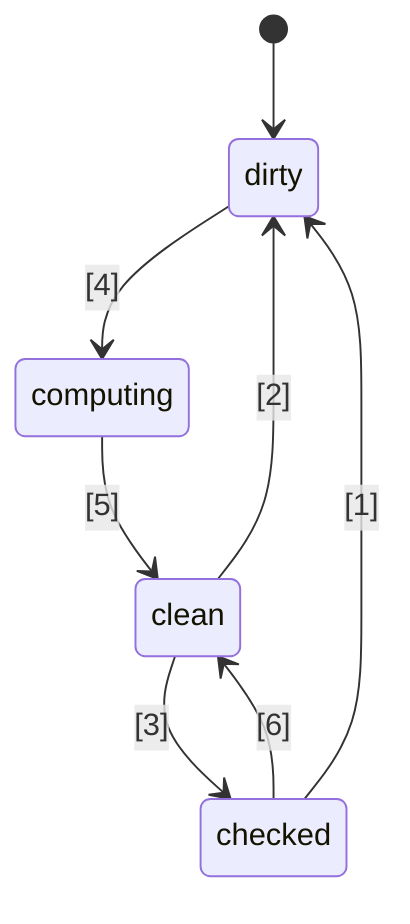
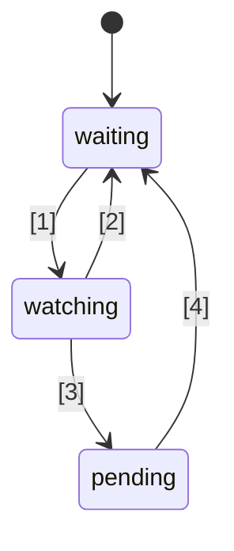

# 🚦 Proposal Standar Sinyal JavaScript 🚦


Tahap 1 ([penjelasan](https://tc39.es/process-document/))

Pendukung proposal TC39: Daniel Ehrenberg, Yehuda Katz, Jatin Ramanathan, Shay Lewis, Kristen Hewell Garrett, Dominic Gannaway, Preston Sego, Milo M, Rob Eisenberg

Penulis asli: Rob Eisenberg dan Daniel Ehrenberg

Dokumen ini menjelaskan arah awal yang umum untuk sinyal dalam JavaScript, mirip dengan upaya Promises/A+ yang mendahului Promises yang distandarisasi oleh TC39 di ES2015. Coba sendiri menggunakan [polyfill](https://github.com/proposal-signals/signal-polyfill).

Serupa dengan Promises/A+, upaya ini berfokus pada penyelarasan ekosistem JavaScript. Jika penyelarasan ini berhasil, maka standar bisa muncul berdasarkan pengalaman tersebut. Beberapa penulis framework berkolaborasi di sini pada model umum yang dapat mendukung inti reaktivitas mereka. Draf saat ini didasarkan pada masukan desain dari penulis/pemelihara [Angular](https://angular.io/), [Bubble](https://bubble.io/), [Ember](https://emberjs.com/), [FAST](https://www.fast.design/), [MobX](https://mobx.js.org/), [Preact](https://preactjs.com/), [Qwik](https://qwik.dev/), [RxJS](https://rxjs.dev/), [Solid](https://www.solidjs.com/), [Starbeam](https://www.starbeamjs.com/), [Svelte](https://svelte.dev/), [Vue](https://vuejs.org/), [Wiz](https://blog.angular.io/angular-and-wiz-are-better-together-91e633d8cd5a), dan lainnya...

Berbeda dari Promises/A+, kami tidak mencoba menyelesaikan permukaan API yang umum untuk pengembang, melainkan semantik inti yang tepat dari grafik sinyal yang mendasari. Proposal ini memang mencakup API yang sepenuhnya konkret, tetapi API ini tidak ditujukan untuk sebagian besar pengembang aplikasi. Sebagai gantinya, API sinyal di sini lebih cocok untuk dibangun di atasnya oleh framework, menyediakan interoperabilitas melalui grafik sinyal umum dan mekanisme pelacakan otomatis.

Rencana proposal ini adalah melakukan prototipe awal secara signifikan, termasuk integrasi ke beberapa framework, sebelum melanjutkan ke Tahap 1. Kami hanya tertarik untuk menstandarisasi Sinyal jika memang cocok digunakan secara praktis di berbagai framework, dan memberikan manfaat nyata dibandingkan sinyal yang disediakan oleh framework. Kami berharap bahwa prototipe awal yang signifikan akan memberi kami informasi ini. Lihat "Status dan rencana pengembangan" di bawah untuk detail lebih lanjut.

## Latar Belakang: Mengapa Sinyal?

Untuk mengembangkan antarmuka pengguna (UI) yang rumit, pengembang aplikasi JavaScript perlu menyimpan, menghitung, membatalkan, menyinkronkan, dan mendorong status ke lapisan tampilan aplikasi secara efisien. UI umumnya melibatkan lebih dari sekadar mengelola nilai sederhana, tetapi sering kali melibatkan perenderan status terhitung yang bergantung pada pohon kompleks nilai lain atau status yang juga dihitung sendiri. Tujuan Sinyal adalah menyediakan infrastruktur untuk mengelola status aplikasi seperti itu agar pengembang dapat fokus pada logika bisnis alih-alih detail yang berulang ini.

Konstruk mirip sinyal telah secara independen ditemukan berguna dalam konteks non-UI juga, khususnya dalam sistem build untuk menghindari build ulang yang tidak perlu.

Sinyal digunakan dalam pemrograman reaktif untuk menghilangkan kebutuhan dalam mengelola pembaruan di aplikasi.

> Model pemrograman deklaratif untuk memperbarui berdasarkan perubahan status.

dari _[Apa itu Reaktivitas?](https://www.pzuraq.com/blog/what-is-reactivity)_.

#### Contoh - Counter VanillaJS

Diberikan sebuah variabel, `counter`, Anda ingin merender ke dalam DOM apakah counter itu genap atau ganjil. Setiap kali `counter` berubah, Anda ingin memperbarui DOM dengan paritas terbaru. Dalam Vanilla JS, Anda mungkin memiliki kode seperti ini:

```js
let counter = 0;
const setCounter = (value) => {
  counter = value;
  render();
};

const isEven = () => (counter & 1) == 0;
const parity = () => isEven() ? "even" : "odd";
const render = () => element.innerText = parity();

// Simulasikan pembaruan eksternal ke counter...
setInterval(() => setCounter(counter + 1), 1000);
```
> [!CATATAN]  
> Global digunakan di sini hanya untuk tujuan demonstrasi. Manajemen status yang benar memiliki banyak solusi, dan contoh dalam proposal ini dimaksudkan agar seminimal mungkin. Proposal ini tidak menganjurkan penggunaan variabel global.


Ini memiliki sejumlah masalah...

* Pengaturan `counter` berisik dan penuh boilerplate.
* Status `counter` sangat terikat dengan sistem rendering.
* Jika `counter` berubah tetapi `parity` tidak (misal: counter dari 2 ke 4), maka kita melakukan komputasi parity dan rendering yang tidak perlu.
* Bagaimana jika bagian lain dari UI kita hanya ingin merender ketika `counter` diperbarui?
* Bagaimana jika bagian lain dari UI kita bergantung hanya pada `isEven` atau `parity`?

Bahkan dalam skenario yang relatif sederhana ini, sejumlah masalah muncul dengan cepat. Kita bisa mencoba mengatasinya dengan menambahkan pub/sub untuk `counter`. Ini memungkinkan konsumen tambahan dari `counter` dapat berlangganan untuk menambahkan reaksi mereka sendiri terhadap perubahan status.

Namun, kita masih terjebak dengan masalah berikut:

* Fungsi render, yang hanya bergantung pada `parity`, malah harus "tahu" bahwa sebenarnya ia perlu berlangganan ke `counter`.
* Tidak mungkin memperbarui UI hanya berdasarkan `isEven` atau `parity`, tanpa langsung berinteraksi dengan `counter`.
* Boilerplate kita bertambah. Setiap kali Anda menggunakan sesuatu, bukan hanya sekadar memanggil fungsi atau membaca variabel, tetapi harus berlangganan dan melakukan pembaruan di sana. Mengelola unsubscription juga sangat rumit.

Sekarang, kita bisa menyelesaikan beberapa masalah dengan menambahkan pub/sub tidak hanya pada `counter` tetapi juga ke `isEven` dan `parity`. Kita kemudian harus membuat `isEven` berlangganan ke `counter`, `parity` ke `isEven`, dan `render` ke `parity`. Sayangnya, bukan hanya kode boilerplate kita yang meledak, tetapi juga kita harus mengelola banyak langganan dan potensi kebocoran memori jika tidak membersihkan semuanya dengan benar. Jadi, kita telah menyelesaikan beberapa masalah tetapi menciptakan kategori masalah baru dan banyak kode. Lebih buruknya lagi, kita harus melalui seluruh proses ini untuk setiap bagian status di sistem kita.

### Memperkenalkan Sinyal

Abstraksi data binding dalam UI untuk model dan tampilan telah lama menjadi inti framework UI di berbagai bahasa pemrograman, meskipun tidak ada mekanisme seperti itu yang dibangun dalam JS atau platform web. Dalam framework dan pustaka JS, telah banyak eksperimen dalam berbagai cara untuk merepresentasikan binding ini, dan pengalaman telah menunjukkan kekuatan alur data satu arah bersamaan dengan tipe data kelas satu yang merepresentasikan sel status atau komputasi yang diturunkan dari data lain, yang kini sering disebut "Sinyal".
Pendekatan nilai reaktif kelas satu ini tampaknya pertama kali populer muncul di framework web JavaScript open-source dengan [Knockout](https://knockoutjs.com/) [pada 2010](https://blog.stevensanderson.com/2010/07/05/introducing-knockout-a-ui-library-for-javascript/). Dalam beberapa tahun setelahnya, banyak variasi dan implementasi telah dibuat. Dalam 3-4 tahun terakhir, primitif Sinyal dan pendekatan terkait semakin berkembang, dengan hampir setiap pustaka atau framework JavaScript modern memiliki sesuatu yang serupa, dengan nama yang berbeda-beda.

Untuk memahami Sinyal, mari kita lihat contoh di atas, dibayangkan ulang dengan API Sinyal yang dijelaskan lebih lanjut di bawah ini.

#### Contoh - Counter Signals

```js
const counter = new Signal.State(0);
const isEven = new Signal.Computed(() => (counter.get() & 1) == 0);
const parity = new Signal.Computed(() => isEven.get() ? "even" : "odd");

// Sebuah library atau framework mendefinisikan efek berdasarkan primitif Signal lain
declare function effect(cb: () => void): (() => void);

effect(() => element.innerText = parity.get());

// Simulasikan pembaruan eksternal ke counter...
setInterval(() => counter.set(counter.get() + 1), 1000);
```

Ada beberapa hal yang langsung dapat kita lihat:
* Kita telah menghilangkan boilerplate yang berisik pada variabel `counter` dari contoh sebelumnya.
* Ada satu API terpadu untuk menangani nilai, komputasi, dan efek samping.
* Tidak ada masalah referensi melingkar atau ketergantungan terbalik antara `counter` dan `render`.
* Tidak ada langganan manual, juga tidak ada kebutuhan untuk pencatatan.
* Ada cara untuk mengontrol waktu/penjadwalan efek samping.

Sinyal memberi kita jauh lebih banyak daripada yang terlihat di permukaan API:
* **Pelacakan Ketergantungan Otomatis** - Sebuah Signal terhitung secara otomatis menemukan Signal lain yang menjadi ketergantungannya, baik itu Signal berupa nilai sederhana atau komputasi lain.
* **Evaluasi Malas (Lazy Evaluation)** - Komputasi tidak dievaluasi secara langsung saat dideklarasikan, ataupun segera dievaluasi ketika ketergantungannya berubah. Komputasi hanya dievaluasi ketika nilainya secara eksplisit diminta.
* **Memoisasi** - Signal terhitung menyimpan cache nilai terakhirnya sehingga komputasi yang tidak memiliki perubahan pada ketergantungannya tidak perlu dievaluasi ulang, berapa pun kali mereka diakses.

## Motivasi standarisasi Signals

#### Interoperabilitas

Setiap implementasi Signal memiliki mekanisme auto-tracking sendiri untuk melacak sumber yang ditemui saat mengevaluasi Signal terhitung. Hal ini menyulitkan untuk berbagi model, komponen, dan pustaka antar framework berbeda—karena biasanya Signal diimplementasikan sebagai bagian dari framework JS.

Salah satu tujuan proposal ini adalah memisahkan sepenuhnya model reaktif dari tampilan render, memungkinkan developer bermigrasi ke teknologi render baru tanpa menulis ulang kode non-UI mereka, atau mengembangkan model reaktif bersama di JS untuk digunakan dalam berbagai konteks. Sayangnya, karena masalah versi dan duplikasi, berbagi pada tingkat pustaka JS ternyata tidak praktis—built-in menawarkan jaminan berbagi yang lebih kuat.

#### Performa/Penggunaan Memori

Selalu ada potensi peningkatan performa dengan mengirimkan lebih sedikit kode karena pustaka yang umum digunakan sudah built-in, namun implementasi Signal umumnya cukup kecil sehingga efek ini tidak diharapkan terlalu besar.

Kami menduga bahwa implementasi native C++ untuk struktur data dan algoritma terkait Signal dapat sedikit lebih efisien dibanding yang dapat dicapai di JS, dalam skala faktor konstanta. Namun, tidak ada perubahan algoritma yang diantisipasi dibandingkan dengan apa yang ada pada polyfill; engine tidak diharapkan "ajaib" di sini, dan algoritma reaktivitasnya sendiri akan terdefinisi dengan baik dan tidak ambigu.

Kelompok champion berharap dapat mengembangkan berbagai implementasi Signal, dan menggunakannya untuk menyelidiki kemungkinan performa ini.

#### DevTools

Dengan pustaka Signal berbasis JS yang ada saat ini, sulit untuk melacak hal seperti:
* Callstack di sepanjang rantai Signal terhitung, memperlihatkan rantai kausal untuk sebuah error
* Grafik referensi antar Signal, ketika satu bergantung pada yang lain—penting saat debugging penggunaan memori

Signal bawaan memungkinkan runtime JS dan DevTools untuk kemungkinan memiliki dukungan yang lebih baik dalam menginspeksi Signal, terutama untuk debugging atau analisis performa, baik ini dibangun ke dalam browser atau melalui ekstensi bersama. Alat yang sudah ada seperti inspector elemen, snapshot performa, dan profiler memori bisa diperbarui untuk menyorot Signal secara khusus dalam penyajian informasinya.

#### Manfaat Sekunder

##### Manfaat pustaka standar

Secara umum, JavaScript memiliki pustaka standar yang cukup minimal, namun tren di TC39 adalah membuat JS lebih seperti bahasa "baterai-termasuk", dengan fungsi built-in berkualitas tinggi. Contohnya, Temporal menggantikan moment.js, dan sejumlah fitur kecil, misalnya, `Array.prototype.flat` dan `Object.groupBy` menggantikan banyak kasus penggunaan lodash. Manfaatnya meliputi ukuran bundle yang lebih kecil, stabilitas dan kualitas yang lebih baik, lebih sedikit yang harus dipelajari saat bergabung ke proyek baru, dan kosakata yang umum di antara developer JS.

##### Integrasi HTML/DOM (kemungkinan di masa depan)

Pekerjaan saat ini di W3C dan oleh pengembang browser berupaya menghadirkan templating native ke HTML ([DOM Parts][wicg-pr-1023] dan [Template Instantiation][wicg-propsal-template-instantiation]). Selain itu, W3C Web Components CG sedang mengeksplorasi kemungkinan memperluas Web Components untuk menawarkan API HTML deklaratif sepenuhnya. Untuk mencapai kedua tujuan ini, pada akhirnya primitif reaktif akan dibutuhkan oleh HTML. Selain itu, banyak peningkatan ergonomis pada DOM melalui integrasi Signal dapat dibayangkan dan telah diminta oleh komunitas.

[wicg-pr-1023]: https://github.com/WICG/webcomponents/pull/1023
[wicg-propsal-template-instantiation]: https://github.com/WICG/webcomponents/blob/gh-pages/proposals/Template-Instantiation.md

> Catatan, integrasi ini akan menjadi upaya terpisah di kemudian hari, bukan bagian dari proposal ini sendiri.

##### Pertukaran informasi ekosistem (*bukan* alasan untuk diadopsi)

Upaya standarisasi kadang-kadang dapat berguna hanya di tingkat "komunitas", bahkan tanpa perubahan di browser. Upaya Signals mempertemukan banyak penulis framework berbeda untuk diskusi mendalam tentang sifat reaktivitas, algoritma, dan interoperabilitas. Ini sudah bermanfaat, namun tidak menjadi alasan untuk memasukkan ke dalam engine JS dan browser; Signal hanya boleh ditambahkan ke standar JavaScript jika ada manfaat signifikan *di luar* pertukaran informasi ekosistem yang dimungkinkan.

## Tujuan desain untuk Signals

Ternyata pustaka Signal yang ada tidak terlalu berbeda satu sama lain, pada intinya. Proposal ini bertujuan membangun keberhasilan mereka dengan mengimplementasikan kualitas penting dari banyak pustaka tersebut.

### Fitur inti

* Tipe Signal yang merepresentasikan state, yaitu Signal yang dapat ditulis. Ini adalah nilai yang dapat dibaca oleh pihak lain.
* Tipe Signal terhitung/memo/derived, yang bergantung pada Signal lain dan dihitung secara malas serta di-cache.
    * Komputasi bersifat malas, artinya Signal terhitung tidak dihitung ulang secara default saat salah satu ketergantungannya berubah, namun hanya dijalankan jika memang ada yang membacanya.
    * Komputasi bebas "[glitch](https://en.wikipedia.org/wiki/Reactive_programming#Glitches)", artinya tidak ada perhitungan yang tidak perlu dilakukan. Ini mengimplikasikan bahwa, ketika aplikasi membaca Signal terhitung, terdapat penyortiran topologis bagian-bagian grafik yang mungkin "kotor" untuk dijalankan, guna menghilangkan duplikasi.
    * Komputasi di-cache, artinya jika, setelah perubahan terakhir pada ketergantungan, tidak ada yang berubah, maka Signal terhitung *tidak* dihitung ulang saat diakses.
    * Perbandingan kustom dimungkinkan untuk Signal terhitung maupun Signal state, untuk menandai kapan Signal terhitung lain yang bergantung padanya perlu diperbarui.
* Reaksi terhadap kondisi di mana sebuah Signal terhitung memiliki salah satu (atau turunan) ketergantungannya menjadi "kotor" dan berubah, artinya nilai Signal mungkin sudah usang.
    * Reaksi ini dimaksudkan untuk menjadwalkan pekerjaan yang lebih signifikan untuk dilakukan nanti.
    * Efek diimplementasikan dalam hal reaksi ini, plus penjadwalan pada tingkat framework.
    * Signal terhitung memerlukan kemampuan untuk bereaksi terhadap apakah mereka terdaftar sebagai (turunan) ketergantungan dari salah satu reaksi ini.
* Memungkinkan framework JS melakukan penjadwalan sendiri. Tidak ada penjadwalan built-in gaya Promise yang dipaksakan.
    * Reaksi sinkron diperlukan untuk memungkinkan penjadwalan pekerjaan selanjutnya berdasarkan logika framework.
    * Penulisan bersifat sinkron dan langsung berlaku (framework yang melakukan batching penulisan dapat melakukannya di atas ini).
    * Memungkinkan pemisahan antara pengecekan apakah sebuah efek "kotor" dari benar-benar menjalankan efek (memungkinkan scheduler efek dua tahap).
* Kemampuan membaca Signal *tanpa* memicu pencatatan ketergantungan (`untrack`)
* Memungkinkan komposisi berbagai basis kode yang menggunakan Signal/reaktivitas, misalnya,
    * Menggunakan beberapa framework bersama selama pelacakan/reaktivitas itu sendiri (modulo pengecualian, lihat di bawah)
    * Struktur data reaktif independen framework (misal, proxy store reaktif rekursif, Map dan Set dan Array reaktif, dll.)

### Soundness

* Mencegah/melarang penggunaan naif reaksi sinkron.
    * Risiko soundness: dapat memunculkan "[glitch](https://en.wikipedia.org/wiki/Reactive_programming#Glitches)" jika digunakan secara tidak benar: Jika rendering dilakukan langsung saat Signal di-set, dapat memperlihatkan state aplikasi yang belum lengkap ke pengguna akhir. Oleh karena itu, fitur ini hanya boleh digunakan untuk menjadwalkan pekerjaan cerdas untuk nanti, setelah logika aplikasi selesai.
    * Solusi: Melarang membaca dan menulis Signal apa pun dari dalam callback reaksi sinkron
* Mencegah penggunaan `untrack` dan menandai sifatnya yang tidak sound
    * Risiko soundness: memungkinkan pembuatan Signal terhitung yang nilainya bergantung pada Signal lain, namun tidak diperbarui ketika Signal tersebut berubah. Harus digunakan ketika akses yang tidak dilacak tidak mengubah hasil komputasi.
    * Solusi: API diberi tanda "unsafe" pada namanya.
* Catatan: Proposal ini memang memperbolehkan Signal untuk dibaca dan ditulis baik dari Signal terhitung maupun efek, tanpa membatasi penulisan yang datang setelah pembacaan, meskipun ada risiko soundness. Keputusan ini diambil untuk menjaga fleksibilitas dan kompatibilitas dalam integrasi dengan framework.

### Surface API

* Harus menjadi fondasi kokoh bagi berbagai framework untuk mengimplementasikan mekanisme Signal/reaktivitas mereka.
    * Harus menjadi dasar yang baik untuk proxy store rekursif, reaktivitas field class berbasis decorator, dan API gaya `.value` maupun `[state, setState]`.
    * Semantik harus bisa mengekspresikan pola valid yang diaktifkan oleh berbagai framework. Misalnya, harus memungkinkan Signal ini menjadi dasar untuk penulisan yang langsung tercermin maupun penulisan yang di-batch dan diterapkan kemudian.
* Akan lebih baik jika API ini dapat digunakan langsung oleh developer JavaScript.
    * Jika sebuah fitur sesuai dengan konsep ekosistem, menggunakan kosakata umum adalah hal yang baik.
        * Namun, penting untuk tidak secara literal meniru nama yang sama persis!
    * Terdapat ketegangan antara "keterpakaiannya untuk dev JS" dan "menyediakan semua hook ke framework"
        * Ide: Sediakan semua hook, namun sertakan error jika disalahgunakan jika memungkinkan.
        * Ide: Tempatkan API yang halus di namespace `subtle`, mirip dengan [`crypto.subtle`](https://developer.mozilla.org/en-US/docs/Web/API/Crypto/subtle), untuk menandai perbedaan antara API yang diperlukan untuk penggunaan tingkat lanjut seperti implementasi framework atau alat dev vs penggunaan pengembangan aplikasi sehari-hari seperti menginstansiasi signal untuk digunakan dengan framework.
* Dapat diimplementasikan dan digunakan dengan performa baik—Surface API tidak menimbulkan overhead berlebih
    * Memungkinkan subclassing, sehingga framework dapat menambahkan metode dan field sendiri, termasuk field privat. Ini penting untuk menghindari kebutuhan alokasi tambahan pada tingkat framework. Lihat "manajemen memori" di bawah.

### Manajemen memori

* Jika memungkinkan: Signal terhitung harus dapat di-garbage collect jika tidak ada referensi aktif untuk pembacaan di masa mendatang, meskipun terhubung ke grafik yang lebih luas yang tetap hidup (misal, dengan membaca state yang tetap hidup).
* Perhatikan bahwa sebagian besar framework saat ini memerlukan pembuangan eksplisit dari Signal terkomputasi jika mereka memiliki referensi ke atau dari grafik Signal lain yang tetap hidup.
* Ini akhirnya tidak terlalu buruk ketika masa hidupnya terkait dengan masa hidup komponen UI, dan efek memang perlu dibuang.
* Jika terlalu mahal untuk dijalankan dengan semantik ini, maka kita sebaiknya menambahkan pembuangan eksplisit (atau "unlinking") dari Signal terkomputasi ke API di bawah, yang saat ini belum memilikinya.
* Tujuan terkait yang terpisah: Meminimalkan jumlah alokasi, misalnya,
    * untuk membuat Signal yang dapat ditulis (menghindari dua closure terpisah + array)
    * untuk mengimplementasikan efek (menghindari closure untuk setiap reaksi)
    * Dalam API untuk mengamati perubahan Signal, hindari pembuatan struktur data sementara tambahan
    * Solusi: API berbasis kelas yang memungkinkan penggunaan ulang metode dan field yang didefinisikan di subclass

## Sketsa API

Ide awal dari API Signal terdapat di bawah ini. Perlu dicatat bahwa ini hanyalah draf awal, dan kami memperkirakan akan ada perubahan seiring waktu. Mari mulai dengan file `.d.ts` lengkap untuk mendapatkan gambaran bentuk keseluruhannya, lalu kita akan membahas detail tentang maknanya.

```ts
interface Signal<T> {
    // Mengambil nilai signal
    get(): T;
}

namespace Signal {
    // Signal baca-tulis
    class State<T> implements Signal<T> {
        // Membuat Signal state yang dimulai dengan nilai t
        constructor(t: T, options?: SignalOptions<T>);

        // Mengambil nilai signal
        get(): T;

        // Mengatur nilai Signal state ke t
        set(t: T): void;
    }

    // Signal yang merupakan rumus berdasarkan Signal lain
    class Computed<T = unknown> implements Signal<T> {
        // Membuat Signal yang mengevaluasi nilai yang dikembalikan oleh callback.
        // Callback dipanggil dengan signal ini sebagai nilai this.
        constructor(cb: (this: Computed<T>) => T, options?: SignalOptions<T>);

        // Mengambil nilai signal
        get(): T;
    }

    // Namespace ini mencakup fitur "lanjutan" yang lebih baik
    // diserahkan untuk penulis framework daripada pengembang aplikasi.
    // Analog dengan `crypto.subtle`
    namespace subtle {
        // Menjalankan callback dengan semua pelacakan dinonaktifkan
        function untrack<T>(cb: () => T): T;

        // Mengambil signal computed saat ini yang sedang melacak pembacaan signal, jika ada
        function currentComputed(): Computed | null;

        // Mengembalikan daftar berurutan dari semua signal yang dirujuk oleh signal ini
        // selama terakhir kali dievaluasi.
        // Untuk Watcher, mencantumkan set signal yang diawasi.
        function introspectSources(s: Computed | Watcher): (State | Computed)[];

        // Mengembalikan Watcher yang mencakup signal ini, plus semua
        // Signal Computed yang membaca signal ini terakhir kali dievaluasi,
        // jika signal computed tersebut (secara rekursif) diawasi.
        function introspectSinks(s: State | Computed): (Computed | Watcher)[];

        // True jika signal ini "hidup", yaitu diawasi oleh Watcher,
        // atau dibaca oleh signal Computed yang (secara rekursif) hidup.
        function hasSinks(s: State | Computed): boolean;

        // True jika elemen ini "reaktif", yaitu bergantung
        // pada signal lain. Computed di mana hasSources bernilai false
        // akan selalu mengembalikan nilai konstan yang sama.
        function hasSources(s: Computed | Watcher): boolean;

        class Watcher {
            // Ketika sumber (rekursif) dari Watcher ditulis, panggil callback ini,
            // jika belum dipanggil sejak pemanggilan `watch` terakhir.
            // Tidak ada signal yang boleh dibaca atau ditulis selama notify.
            constructor(notify: (this: Watcher) => void);

            // Tambahkan signal-signal ini ke dalam set Watcher, dan atur Watcher agar menjalankan
            // callback notify pada saat berikutnya salah satu signal dalam set (atau salah satu dependensinya) berubah.
            // Dapat dipanggil tanpa argumen hanya untuk mereset status "notified", sehingga
            // callback notify akan dipanggil lagi.
            watch(...s: Signal[]): void;

            // Menghapus signal-signal ini dari set yang diawasi (misalnya, untuk efek yang dibuang)
            unwatch(...s: Signal[]): void;

            // Mengembalikan set sumber dalam set Watcher yang masih dirty, atau merupakan signal computed
            // dengan sumber yang dirty atau pending dan belum dievaluasi ulang
            getPending(): Signal[];
        }

        // Hook untuk mengamati saat mulai diawasi atau tidak lagi diawasi
        var watched: Symbol;
        var unwatched: Symbol;
    }

    interface SignalOptions<T> {
        // Fungsi perbandingan khusus antara nilai lama dan baru. Default: Object.is.
        // Signal diberikan sebagai nilai this untuk konteks.
        equals?: (this: Signal<T>, t: T, t2: T) => boolean;
```
```ts
// Callback dipanggil ketika isWatched menjadi true, jika sebelumnya false
[Signal.subtle.watched]?: (this: Signal<T>) => void;

// Callback dipanggil setiap kali isWatched menjadi false, jika sebelumnya true
[Signal.subtle.unwatched]?: (this: Signal<T>) => void;
}
}
```

### Cara Kerja Signal

Sebuah Signal merepresentasikan sebuah sel data yang dapat berubah seiring waktu. Signal dapat berupa "state" (hanya sebuah nilai yang diatur secara manual) atau "computed" (sebuah rumus berdasarkan Signal lain).

Signal computed bekerja dengan secara otomatis melacak Signal lain mana yang dibaca selama evaluasinya. Ketika sebuah computed dibaca, ia memeriksa apakah salah satu dependensi yang telah tercatat sebelumnya telah berubah, dan melakukan evaluasi ulang jika ya. Ketika beberapa Signal computed disusun secara bersarang, semua atribusi pelacakan diarahkan ke yang paling dalam.

Signal computed bersifat lazy, yaitu berbasis tarik (pull-based): mereka hanya dievaluasi ulang ketika diakses, meskipun salah satu dependensinya telah berubah sebelumnya.

Callback yang diberikan ke Signal computed sebaiknya "pure" dalam arti merupakan fungsi deterministik tanpa efek samping dari Signal lain yang diaksesnya. Namun, waktu callback dipanggil juga deterministik, sehingga efek samping tetap dapat digunakan dengan hati-hati.

Signal memiliki fitur caching/memoisasi yang menonjol: baik Signal state maupun computed mengingat nilai saat ini, dan hanya memicu perhitungan ulang pada Signal computed yang merujuk padanya jika memang terjadi perubahan. Perbandingan berulang antara nilai lama dan baru bahkan tidak diperlukan--perbandingan dilakukan sekali ketika Signal sumber di-reset/dievaluasi ulang, dan mekanisme Signal melacak siapa saja yang merujuk ke Signal tersebut yang belum diperbarui berdasarkan nilai baru. Secara internal, hal ini umumnya direpresentasikan melalui "graph coloring" seperti dijelaskan dalam (Milo's blog post).

Signal computed melacak dependensinya secara dinamis--setiap kali dijalankan, mereka mungkin bergantung pada hal yang berbeda, dan himpunan dependensi yang tepat tetap diperbarui dalam graph Signal. Ini berarti jika Anda memiliki dependensi yang hanya dibutuhkan pada satu cabang, dan perhitungan sebelumnya mengambil cabang lain, maka perubahan pada nilai yang sementara tidak digunakan tersebut tidak akan menyebabkan Signal computed dihitung ulang, bahkan ketika diakses.

Tidak seperti JavaScript Promises, semua hal dalam Signal berjalan secara sinkron:
- Mengatur Signal ke nilai baru bersifat sinkron, dan langsung tercermin ketika membaca Signal computed yang bergantung padanya. Tidak ada batching perubahan bawaan.
- Membaca Signal computed bersifat sinkron--nilainya selalu tersedia.
- Callback `notify` di Watcher, seperti dijelaskan di bawah, dijalankan secara sinkron, selama pemanggilan `.set()` yang memicunya (tetapi setelah graph coloring selesai).

Seperti Promise, Signal dapat merepresentasikan keadaan error: Jika callback Signal computed melempar error, maka error tersebut disimpan seperti nilai lain, dan dilempar ulang setiap kali Signal dibaca.

### Memahami Kelas Signal

Sebuah instance `Signal` merepresentasikan kemampuan untuk membaca nilai yang berubah secara dinamis yang perubahannya dilacak seiring waktu. Ini juga secara implisit mencakup kemampuan untuk subscribe ke Signal, secara implisit melalui akses yang dilacak dari Signal computed lain.

API di sini dirancang agar sesuai dengan konsensus ekosistem yang sangat kasar di antara sebagian besar pustaka Signal dalam penggunaan nama seperti "signal", "computed" dan "state". Namun, akses ke Signal Computed dan State melalui metode `.get()`, yang berbeda dengan semua API Signal populer, yang menggunakan akses bergaya `.value` atau sintaks pemanggilan `signal()`.

API ini dirancang untuk mengurangi jumlah alokasi, agar Signal cocok untuk disematkan dalam framework JavaScript sambil mencapai performa yang sama atau lebih baik dibandingkan Signal yang dikustomisasi framework. Implikasinya:
- Signal State adalah satu objek yang dapat ditulis, yang dapat diakses dan diatur dari referensi yang sama. (Lihat implikasi di bawah pada bagian "Pemilahan Kapabilitas".)
- Baik Signal State maupun Computed dirancang agar dapat di-subclass, untuk memudahkan framework menambah properti tambahan melalui field class publik dan privat (juga metode untuk menggunakan state tersebut).
- Berbagai callback (misal, `equals`, callback computed) dipanggil dengan Signal terkait sebagai nilai `this` untuk konteks, sehingga closure baru tidak diperlukan per Signal. Sebagai gantinya, konteks dapat disimpan dalam properti ekstra pada signal itu sendiri.

Beberapa kondisi error yang dipaksakan oleh API ini:
- Membaca computed secara rekursif adalah error.
- Callback `notify` dari Watcher tidak boleh membaca atau menulis signal apa pun.
- Jika callback Signal computed melempar error, maka akses berikutnya ke Signal akan melempar error yang di-cache, hingga salah satu dependensi berubah dan ia dihitung ulang.

Beberapa kondisi yang *tidak* dipaksakan:
- Signal computed dapat menulis ke Signal lain, secara sinkron dalam callback-nya.
- Pekerjaan yang diantrekan oleh callback `notify` Watcher dapat membaca atau menulis signal, sehingga memungkinkan untuk mereplikasi [pola antipattern klasik React](https://react.dev/learn/you-might-not-need-an-effect) dalam istilah Signal!

### Mengimplementasikan efek

Interface `Watcher` yang didefinisikan di atas memberikan dasar untuk mengimplementasikan API JS tipikal untuk efek: callback yang dijalankan ulang ketika Signal lain berubah, semata-mata untuk efek sampingnya. Fungsi `effect` yang digunakan di atas dalam contoh awal dapat didefinisikan sebagai berikut:

```ts
// Fungsi ini biasanya berada di pustaka/framework, bukan kode aplikasi
// CATATAN: Logika penjadwalan ini terlalu dasar untuk digunakan. Jangan copy/paste.
let pending = false;

let w = new Signal.subtle.Watcher(() => {
    if (!pending) {
        pending = true;
        queueMicrotask(() => {
            pending = false;
            for (let s of w.getPending()) s.get();
            w.watch();
        });
    }
});

// Sebuah Signal effect yang menilai ke cb, yang menjadwalkan pembacaan dirinya
// sendiri pada antrean microtask setiap kali salah satu dependensinya mungkin berubah
export function effect(cb) {
    let destructor;
    let c = new Signal.Computed(() => { destructor?.(); destructor = cb(); });
    w.watch(c);
    c.get();
    return () => { destructor?.(); w.unwatch(c) };
}
```

API Signal tidak menyertakan fungsi bawaan seperti `effect`. Ini karena penjadwalan efek bersifat rumit dan sering terikat pada siklus rendering framework serta strategi atau state framework tingkat tinggi lain yang tidak dapat diakses JS.

Penjelasan operasi berbeda yang digunakan di sini: Callback `notify` yang diberikan ke konstruktor `Watcher` adalah fungsi yang dipanggil ketika Signal berubah dari status "clean" (cache telah diinisialisasi dan valid) menjadi status "checked" atau "dirty" (cache mungkin valid atau tidak karena setidaknya salah satu state yang secara rekursif bergantung telah berubah).

Pemanggilan ke `notify` pada akhirnya dipicu oleh pemanggilan `.set()` pada suatu Signal state. Pemanggilan ini sinkron: terjadi sebelum `.set` mengembalikan nilai. Namun tidak perlu khawatir callback ini mengamati graph Signal dalam keadaan setengah diproses, karena selama callback `notify`, tidak ada Signal yang dapat dibaca atau ditulis, bahkan dalam pemanggilan `untrack`. Karena `notify` dipanggil selama `.set()`, ini menginterupsi thread logika lain, yang mungkin belum selesai. Untuk membaca atau menulis Signal dari `notify`, jadwalkan pekerjaan untuk dijalankan nanti, misal dengan menulis Signal ke dalam list untuk diakses nanti, atau dengan `queueMicrotask` seperti di atas.

Perlu dicatat bahwa sangat mungkin menggunakan Signal secara efektif tanpa `Signal.subtle.Watcher` dengan menjadwalkan polling pada Signal computed, seperti yang dilakukan Glimmer. Namun, banyak framework yang menemukan bahwa seringkali berguna jika logika penjadwalan ini dijalankan secara sinkron, sehingga API Signal menyertakannya.

Baik Signal computed maupun state akan dikumpulkan oleh garbage collector seperti nilai JS lainnya. Namun Watcher memiliki cara khusus untuk menjaga sesuatu tetap hidup: Signal apa pun yang diawasi oleh Watcher akan tetap hidup selama salah satu state dasarnya masih dapat dijangkau, karena ini dapat memicu pemanggilan `notify` di masa depan (dan kemudian pemanggilan `.get()`). Untuk alasan ini, ingatlah untuk memanggil `Watcher.prototype.unwatch` untuk membersihkan efek.

### Jalur pelarian tidak sound

`Signal.subtle.untrack` adalah jalur pelarian yang memungkinkan pembacaan Signal *tanpa* melacak pembacaan tersebut. Kapabilitas ini tidak aman karena memungkinkan pembuatan Signal computed yang nilainya bergantung pada Signal lain, namun tidak diperbarui ketika Signal tersebut berubah. Ini sebaiknya hanya digunakan ketika akses yang tidak dilacak tidak akan mengubah hasil perhitungan.

<!--
TODO: Tampilkan contoh di mana sebaiknya menggunakan untrack

### Menggunakan watched/unwatched
TODO: Tunjukkan contoh mengonversi sebuah Observable menjadi sebuah computed signal, yang hanya berlangganan ketika digunakan oleh sebuah efek

TODO: Tunjukkan contoh sebuah computed signal yang merepresentasikan hasil dari fetch yang diarahkan ke sebuah state, yang dapat dibatalkan

### Introspeksi untuk SSR

TODO: Tunjukkan bagaimana proses serialisasi grafik signal bekerja

TODO: Tunjukkan bagaimana Anda dapat "menghidupkan kembali" (hydrate) sebuah signal dari state ke computed di kemudian hari, menggunakan beberapa signal.
-->

### Diabaikan untuk saat ini

Fitur-fitur ini mungkin akan ditambahkan nanti, namun tidak termasuk dalam draft saat ini. Penghilangan ini disebabkan oleh kurangnya konsensus yang mapan di ruang desain antar framework, serta kemampuan yang telah terbukti untuk mengatasi ketidakhadiran mereka dengan mekanisme di atas konsep Signals yang dijelaskan dalam dokumen ini. Namun, sayangnya, penghilangan ini membatasi potensi interoperabilitas antar framework. Seiring dengan diproduksinya prototipe Signals seperti yang dijelaskan dalam dokumen ini, akan ada upaya untuk meninjau kembali apakah penghilangan ini adalah keputusan yang tepat.

* **Async**: Signals selalu tersedia secara sinkron untuk evaluasi, dalam model ini. Namun, sering kali berguna untuk memiliki proses asinkron tertentu yang menyebabkan sebuah signal diset, dan untuk mengetahui kapan sebuah signal masih dalam keadaan "loading". Salah satu cara sederhana untuk memodelkan keadaan loading adalah dengan pengecualian (exception), dan perilaku caching exception pada computed signal cukup masuk akal dikombinasikan dengan teknik ini. Teknik yang lebih baik dibahas di [Issue #30](https://github.com/proposal-signals/proposal-signals/issues/30).
* **Transactions**: Untuk transisi antar tampilan, sering kali berguna untuk mempertahankan status aktif untuk kedua state "from" dan "to". State "to" dirender di latar belakang, hingga siap untuk diubah (commit transaction), sementara state "from" tetap interaktif. Mempertahankan kedua state secara bersamaan memerlukan "forking" state dari grafik signal, dan mungkin juga berguna untuk mendukung beberapa transisi yang sedang berjalan sekaligus. Diskusi di [Issue #73](https://github.com/proposal-signals/proposal-signals/issues/73).

Beberapa [metode kemudahan](https://github.com/proposal-signals/proposal-signals/issues/32) juga dihilangkan.

## Status dan rencana pengembangan

Proposal ini ada dalam agenda TC39 April 2024 untuk Tahap 1. Saat ini dapat dianggap sebagai "Tahap 0".

[Sebuah polyfill](https://github.com/proposal-signals/signal-polyfill) untuk proposal ini tersedia, dengan beberapa pengujian dasar. Beberapa penulis framework telah mulai bereksperimen dengan mengganti implementasi signal ini, namun penggunaannya masih dalam tahap awal.

Kolaborator pada proposal Signal ingin menjadi sangat **konservatif** dalam mendorong proposal ini ke depan, agar tidak terjebak dalam situasi di mana sesuatu sudah dirilis namun akhirnya disesali dan tidak benar-benar digunakan. Rencana kami adalah melakukan tugas-tugas tambahan berikut, yang tidak diwajibkan oleh proses TC39, untuk memastikan bahwa proposal ini berada di jalur yang benar:

Sebelum mengajukan ke Tahap 2, kami berencana untuk:
- Mengembangkan beberapa implementasi polyfill tingkat produksi yang solid, diuji dengan baik (misalnya, lulus pengujian dari berbagai framework serta pengujian bergaya test262), dan kompetitif dalam hal performa (sebagaimana diverifikasi dengan rangkaian benchmark signal/framework yang menyeluruh).
- Mengintegrasikan API Signal yang diusulkan ke dalam sejumlah besar framework JS yang kami anggap cukup representatif, dan beberapa aplikasi besar bekerja dengan dasar ini. Menguji bahwa ia bekerja secara efisien dan benar dalam konteks-konteks tersebut.
- Memiliki pemahaman yang solid tentang ruang kemungkinan ekstensi API, dan telah menyimpulkan mana (jika ada) yang harus ditambahkan ke proposal ini.

## Algoritme Signal

Bagian ini menjelaskan masing-masing API yang diekspos ke JavaScript, dalam hal algoritme yang mereka implementasikan. Ini dapat dianggap sebagai proto-spesifikasi, dan disertakan pada tahap awal ini untuk menentukan satu set kemungkinan semantik, sambil tetap sangat terbuka untuk perubahan.

Beberapa aspek dari algoritme:
- Urutan pembacaan Signal dalam sebuah computed itu signifikan, dan dapat diamati dalam urutan callback tertentu (yang mana `Watcher` dipanggil, `equals`, parameter pertama ke `new Signal.Computed`, dan callback `watched`/`unwatched`) dieksekusi. Artinya, sumber dari computed Signal harus disimpan secara berurutan.
- Keempat callback ini semuanya mungkin melempar pengecualian, dan pengecualian ini diteruskan dengan cara yang dapat diprediksi ke kode JS pemanggil. Pengecualian *tidak* menghentikan eksekusi algoritme ini atau membuat grafik dalam keadaan setengah proses. Untuk error yang dilempar dalam callback `notify` dari Watcher, pengecualian tersebut dikirim ke pemanggilan `.set()` yang memicunya, menggunakan AggregateError jika beberapa pengecualian dilempar. Yang lainnya (termasuk `watched`/`unwatched`?) disimpan dalam nilai Signal, untuk dilempar ulang saat dibaca, dan Signal yang dilempar ulang seperti itu dapat ditandai `~clean~` seperti halnya dengan nilai normal lainnya.
- Perhatian diberikan untuk menghindari sirkularitas dalam kasus computed signal yang tidak "watched" (diamati oleh Watcher manapun), sehingga dapat dikoleksi sampah (garbage collected) secara independen dari bagian lain grafik signal. Secara internal, ini dapat diimplementasikan dengan sistem nomor generasi yang selalu dikoleksi; perlu dicatat bahwa implementasi yang dioptimalkan mungkin juga mencakup nomor generasi lokal per-node, atau menghindari pelacakan beberapa nomor pada signal yang sedang diawasi.

### Status global tersembunyi

Algoritme Signal perlu mereferensikan status global tertentu. Status ini bersifat global untuk seluruh thread, atau "agent".

- `computing`: Computed atau Effect Signal terdalam yang sedang dievaluasi ulang karena pemanggilan `.get` atau `.run`, atau `null`. Awalnya `null`.
- `frozen`: Boolean yang menunjukkan apakah saat ini ada callback yang sedang dieksekusi yang mengharuskan grafik tidak dimodifikasi. Awalnya `false`.
- `generation`: Integer yang meningkat, mulai dari 0, digunakan untuk melacak seberapa mutakhir sebuah nilai sambil menghindari sirkularitas.

### Namespace `Signal`

`Signal` adalah objek biasa yang berfungsi sebagai namespace untuk kelas dan fungsi terkait Signal.

`Signal.subtle` adalah objek namespace dalam yang serupa.

### Kelas `Signal.State`

#### Slot internal `Signal.State`

- `value`: Nilai saat ini dari state signal
- `equals`: Fungsi pembanding yang digunakan saat mengubah nilai
- `watched`: Callback yang dipanggil ketika signal mulai diamati oleh efek
- `unwatched`: Callback yang dipanggil ketika signal tidak lagi diamati oleh efek
- `sinks`: Set dari signal yang sedang diawasi yang bergantung pada signal ini

#### Konstruktor: `Signal.State(initialValue, options)`

1. Set nilai `value` Signal ini ke `initialValue`.
1. Set `equals` Signal ini ke options?.equals
1. Set `watched` Signal ini ke options?.[Signal.subtle.watched]
1. Set `unwatched` Signal ini ke options?.[Signal.subtle.unwatched]
1. Set `sinks` Signal ini ke set kosong

#### Metode: `Signal.State.prototype.get()`

1. Jika `frozen` bernilai true, lempar pengecualian.
1. Jika `computing` tidak `undefined`, tambahkan Signal ini ke set `sources` milik `computing`.
1. CATATAN: Kita tidak menambahkan `computing` ke set `sinks` Signal ini sampai diawasi oleh Watcher.
1. Kembalikan nilai `value` Signal ini.

#### Metode: `Signal.State.prototype.set(newValue)`

1. Jika konteks eksekusi saat ini adalah `frozen`, lempar pengecualian.
1. Jalankan algoritme "set Signal value" dengan Signal ini dan parameter pertama sebagai nilainya.
1. Jika algoritme tersebut mengembalikan `~clean~`, maka kembalikan undefined.
1. Set `state` semua `sinks` dari Signal ini menjadi (jika sebuah Computed Signal) `~dirty~` jika sebelumnya bersih, atau (jika sebuah Watcher) `~pending~` jika sebelumnya `~watching~`.
1. Set `state` semua dependensi Computed Signal dari sinks (secara rekursif) menjadi `~checked~` jika sebelumnya `~clean~` (artinya, biarkan penandaan dirty tetap ada), atau untuk Watcher, `~pending~` jika sebelumnya `~watching~`.
1. Untuk setiap Watcher yang sebelumnya `~watching~` yang ditemukan dalam pencarian rekursif tersebut, lalu dalam urutan depth-first,
    1. Set `frozen` menjadi true.
    1. Panggil callback `notify` mereka (simpan pengecualian yang dilempar, tetapi abaikan nilai pengembalian dari `notify`).
    1. Kembalikan `frozen` menjadi false.
    1. Set `state` Watcher menjadi `~waiting~`.
1. Jika ada pengecualian yang dilempar dari callback `notify`, propagasikan ke pemanggil setelah semua callback `notify` dijalankan. Jika ada beberapa pengecualian, maka gabungkan menjadi AggregateError dan lempar itu.
1. Kembalikan undefined.

### Kelas `Signal.Computed`

#### State machine `Signal.Computed`
Status `state` dari Computed Signal dapat berupa salah satu dari berikut:

- `~clean~`: Nilai Signal ada dan diketahui tidak usang.
- `~checked~`: Sumber (tidak langsung) dari Signal ini telah berubah; Signal ini memiliki nilai tetapi _mungkin_ usang. Apakah nilainya usang atau tidak hanya akan diketahui setelah semua sumber langsung dievaluasi.
- `~computing~`: Callback Signal ini sedang dieksekusi sebagai efek samping dari pemanggilan `.get()`.
- `~dirty~`: Signal ini memiliki nilai yang diketahui usang, atau belum pernah dievaluasi.

Graf transisi adalah sebagai berikut:



Transisi-transisinya adalah:
| Nomor | Dari | Ke | Kondisi | Algoritma |
| ----- | ---- | -- | ------- | --------- |
| 1 | `~checked~` | `~dirty~` | Sumber langsung dari signal ini, yang merupakan computed signal, telah dievaluasi, dan nilainya berubah. | Algoritma: hitung ulang dirty computed Signal |
| 2 | `~clean~` | `~dirty~` | Sumber langsung dari signal ini, yang merupakan State, telah di-set, dengan nilai yang tidak sama dengan nilai sebelumnya. | Metode: `Signal.State.prototype.set(newValue)` |
| 3 | `~clean~` | `~checked~` | Sumber rekursif, tapi bukan langsung, dari signal ini, yang merupakan State, telah di-set, dengan nilai yang tidak sama dengan nilai sebelumnya. | Metode: `Signal.State.prototype.set(newValue)` |
| 4 | `~dirty~` | `~computing~` | Akan mengeksekusi `callback`. | Algoritma: hitung ulang dirty computed Signal |
| 5 | `~computing~` | `~clean~` | `callback` telah selesai dievaluasi dan mengembalikan nilai atau melempar exception. | Algoritma: hitung ulang dirty computed Signal |
| 6 | `~checked~` | `~clean~` | Semua sumber langsung dari signal ini telah dievaluasi, dan semuanya tidak berubah, sehingga sekarang diketahui tidak usang. | Algoritma: hitung ulang dirty computed Signal |

#### Slot internal `Signal.Computed`

- `value`: Nilai cache sebelumnya dari Signal, atau `~uninitialized~` untuk computed Signal yang belum pernah dibaca. Nilai bisa berupa exception yang akan dilempar ulang saat nilai dibaca. Selalu `undefined` untuk effect signals.
- `state`: Dapat berupa `~clean~`, `~checked~`, `~computing~`, atau `~dirty~`.
- `sources`: Set berurutan dari Signals yang menjadi dependensi Signal ini.
- `sinks`: Set berurutan dari Signals yang bergantung pada Signal ini.
- `equals`: Metode equals yang disediakan dalam opsi.
- `callback`: Callback yang dipanggil untuk mendapatkan nilai computed Signal. Diatur ke parameter pertama yang diberikan ke konstruktor.

#### Konstruktor `Signal.Computed`

Konstruktor mengatur
- `callback` ke parameter pertamanya
- `equals` berdasarkan opsi, default ke `Object.is` jika tidak ada
- `state` ke `~dirty~`
- `value` ke `~uninitialized~`

Dengan [AsyncContext](https://github.com/tc39/proposal-async-context), callback yang diberikan ke `new Signal.Computed` menutup snapshot dari saat konstruktor dipanggil, dan mengembalikan snapshot ini selama eksekusinya.

#### Metode: `Signal.Computed.prototype.get`

1. Jika context eksekusi saat ini adalah `frozen` atau jika Signal ini memiliki state `~computing~`, atau jika signal ini adalah Watcher dan sedang `computing` sebuah computed Signal, lempar exception.
1. Jika `computing` bukan `null`, tambahkan Signal ini ke set `sources` milik `computing`.
1. CATATAN: Kita tidak menambahkan `computing` ke set `sinks` Signal ini sampai/selama belum menjadi watched oleh Watcher.
1. Jika state Signal ini adalah `~dirty~` atau `~checked~`: Ulangi langkah berikut sampai Signal ini `~clean~`:
    1. Rekursi ke atas melalui `sources` untuk menemukan sumber rekursif terdalam, paling kiri (yaitu yang diamati paling awal) yang merupakan Computed Signal bertanda `~dirty~` (hentikan pencarian saat menemukan Computed Signal `~clean~`, dan sertakan Computed Signal ini sebagai pencarian terakhir).
    1. Lakukan algoritma "hitung ulang dirty computed Signal" pada Signal tersebut.
1. Pada titik ini, state Signal ini akan `~clean~`, dan tidak ada sumber rekursif yang `~dirty~` atau `~checked~`. Kembalikan `value` Signal ini. Jika nilainya adalah exception, lempar ulang exception tersebut.

### Kelas `Signal.subtle.Watcher`

#### State machine `Signal.subtle.Watcher`

`state` dari Watcher dapat berupa salah satu dari berikut:

- `~waiting~`: Callback `notify` telah dijalankan, atau Watcher baru, namun belum secara aktif mengamati signal apapun.
- `~watching~`: Watcher sedang aktif mengamati signals, namun belum ada perubahan yang memerlukan callback `notify`.
- `~pending~`: Salah satu dependensi Watcher telah berubah, namun callback `notify` belum dijalankan.

Graf transisi adalah sebagai berikut:



Transisi-transisinya adalah:
| Nomor | Dari | Ke | Kondisi | Algoritma |
| ----- | ---- | -- | ------- | --------- |
| 1 | `~waiting~` | `~watching~` | Metode `watch` milik Watcher telah dipanggil. | Metode: `Signal.subtle.Watcher.prototype.watch(...signals)` |
| 2 | `~watching~` | `~waiting~` | Metode `unwatch` milik Watcher telah dipanggil, dan signal terakhir yang diamati telah dihapus. | Metode: `Signal.subtle.Watcher.prototype.unwatch(...signals)` |
| 3 | `~watching~` | `~pending~` | Signal yang diamati kemungkinan telah berubah nilai. | Metode: `Signal.State.prototype.set(newValue)` |
| 4 | `~pending~` | `~waiting~` | Callback `notify` telah dijalankan. | Metode: `Signal.State.prototype.set(newValue)` |

#### Slot internal `Signal.subtle.Watcher`

- `state`: Dapat berupa `~watching~`, `~pending~` atau `~waiting~`
- `signals`: Set berurutan dari Signals yang sedang diamati oleh Watcher ini
- `notifyCallback`: Callback yang dipanggil ketika ada perubahan. Diatur ke parameter pertama yang diberikan ke konstruktor.

#### Konstruktor: `new Signal.subtle.Watcher(callback)`

1. `state` diatur ke `~waiting~`.
1. Inisialisasi `signals` sebagai set kosong.
1. `notifyCallback` diatur ke parameter callback.
Dengan [AsyncContext](https://github.com/tc39/proposal-async-context), callback yang diberikan ke `new Signal.subtle.Watcher` *tidak* menutup snapshot dari saat konstruktor dipanggil, sehingga informasi kontekstual di sekitar penulisan dapat terlihat.

#### Metode: `Signal.subtle.Watcher.prototype.watch(...signals)`

1. Jika `frozen` bernilai true, lemparkan sebuah exception.
1. Jika salah satu argumen bukan sebuah signal, lemparkan sebuah exception.
1. Tambahkan semua argumen ke akhir `signals` objek ini.
1. Untuk setiap signal yang baru dipantau, dari kiri ke kanan,
    1. Tambahkan watcher ini sebagai `sink` ke signal tersebut.
    1. Jika ini adalah sink pertama, lakukan rekursi ke sumber untuk menambahkan signal itu sebagai sink.
    1. Setel `frozen` ke true.
    1. Panggil callback `watched` jika ada.
    1. Kembalikan `frozen` ke false.
1. Jika `state` Signal adalah `~waiting~`, maka setel menjadi `~watching~`.

#### Metode: `Signal.subtle.Watcher.prototype.unwatch(...signals)`

1. Jika `frozen` bernilai true, lemparkan sebuah exception.
1. Jika salah satu argumen bukan sebuah signal, atau tidak sedang dipantau oleh watcher ini, lemparkan sebuah exception.
1. Untuk setiap signal dalam argumen, dari kiri ke kanan,
    1. Hapus signal tersebut dari set `signals` milik Watcher ini.
    1. Hapus Watcher ini dari set `sink` milik Signal tersebut.
    1. Jika set `sink` milik Signal itu menjadi kosong, hapus Signal itu sebagai sink dari setiap sumbernya.
    1. Setel `frozen` ke true.
    1. Panggil callback `unwatched` jika ada.
    1. Kembalikan `frozen` ke false.
1. Jika watcher sekarang tidak memiliki `signals`, dan `state`-nya adalah `~watching~`, maka setel menjadi `~waiting~`.

#### Metode: `Signal.subtle.Watcher.prototype.getPending()`

1. Kembalikan sebuah Array yang berisi subset dari `signals` yang merupakan Computed Signals dalam state `~dirty~` atau `~pending~`.

### Metode: `Signal.subtle.untrack(cb)`

1. Biarkan `c` sebagai state `computing` saat ini dari context eksekusi.
1. Setel `computing` ke null.
1. Panggil `cb`.
1. Kembalikan `computing` ke `c` (meskipun `cb` melempar exception).
1. Kembalikan nilai return dari `cb` (melempar ulang exception jika ada).

Catatan: untrack tidak membuatmu keluar dari state `frozen`, yang dijaga secara ketat.

### Metode: `Signal.subtle.currentComputed()`

1. Kembalikan nilai `computing` saat ini.

### Algoritma umum

##### Algoritma: menghitung ulang Signal computed yang dirty

1. Kosongkan set `sources` milik Signal ini, dan hapus Signal ini dari set `sinks` milik sumber-sumber tersebut.
1. Simpan nilai `computing` sebelumnya dan setel `computing` ke Signal ini.
1. Setel state Signal ini menjadi `~computing~`.
1. Jalankan callback Signal computed ini, menggunakan Signal ini sebagai nilai this. Simpan nilai return-nya, dan jika callback melempar exception, simpan exception tersebut untuk dilempar ulang.
1. Kembalikan nilai `computing` sebelumnya.
1. Terapkan algoritma "set Signal value" pada nilai return callback.
2. Setel state Signal ini menjadi `~clean~`.
1. Jika algoritma itu mengembalikan `~dirty~`: tandai semua sink dari Signal ini sebagai `~dirty~` (sebelumnya, sink bisa jadi campuran antara checked dan dirty). (Atau, jika ini tidak dipantau, adopsi nomor generasi baru untuk menandai kekotoran, atau sesuatu seperti itu.)
1. Jika tidak, algoritma itu mengembalikan `~clean~`: Dalam kasus ini, untuk setiap sink `~checked~` dari Signal ini, jika semua sumber Signal itu sekarang bersih, maka tandai Signal itu sebagai `~clean~` juga. Terapkan langkah pembersihan ini ke sink lebih lanjut secara rekursif, ke Signal yang baru saja bersih yang memiliki sink checked. (Atau, jika ini tidak dipantau, berikan indikasi yang sama, sehingga pembersihan dapat dilakukan secara lazy.)

##### Algoritma set Signal value

1. Jika algoritma ini diberikan sebuah nilai (bukan exception untuk dilempar ulang, dari algoritma recalculate dirty computed Signal):
    1. Panggil fungsi `equals` milik Signal ini, dengan parameter `value` saat ini, nilai baru, dan Signal ini. Jika terjadi exception, simpan exception tersebut (untuk dilempar saat dibaca) sebagai nilai Signal dan lanjutkan seolah-olah callback mengembalikan false.
    1. Jika fungsi tersebut mengembalikan true, kembalikan `~clean~`.
1. Setel `value` dari Signal ini ke parameter.
1. Kembalikan `~dirty~`

## FAQ

**T:** Bukankah terlalu cepat untuk melakukan standarisasi sesuatu yang berkaitan dengan Signals, padahal mereka baru mulai populer pada tahun 2022? Bukankah sebaiknya kita memberi mereka lebih banyak waktu untuk berkembang dan stabil?

**J:** Keadaan Signals saat ini di framework web adalah hasil dari lebih dari 10 tahun pengembangan berkelanjutan. Seiring meningkatnya investasi, seperti yang terjadi dalam beberapa tahun terakhir, hampir semua framework web mendekati model inti Signals yang sangat mirip. Proposal ini adalah hasil dari latihan desain bersama antara banyak pemimpin framework web saat ini, dan tidak akan didorong ke proses standarisasi tanpa validasi dari kelompok pakar domain tersebut di berbagai konteks.

#### Bagaimana Signals digunakan?

**T:** Apakah Signals bawaan bahkan bisa digunakan oleh framework, mengingat integrasi mereka yang erat dengan rendering dan kepemilikan?

**J:** Bagian yang lebih spesifik framework cenderung berada di area efek, penjadwalan, dan kepemilikan/penghapusan, yang tidak dicoba untuk dipecahkan oleh proposal ini. Prioritas utama kami dengan prototipe Signals standar adalah memvalidasi bahwa mereka dapat duduk "di bawah" framework yang ada secara kompatibel dan dengan performa baik.

**T:** Apakah API Signal memang dimaksudkan untuk digunakan langsung oleh pengembang aplikasi, atau dibungkus oleh framework?

**J:** Meski API ini bisa digunakan langsung oleh pengembang aplikasi (setidaknya bagian yang tidak berada di namespace `Signal.subtle`), ia tidak didesain agar sangat ergonomis. Sebaliknya, kebutuhan penulis library/framework menjadi prioritas. Sebagian besar framework diharapkan membungkus bahkan API dasar seperti `Signal.State` dan `Signal.Computed` dengan sesuatu yang lebih ergonomis menurut gaya mereka. Dalam praktiknya, biasanya terbaik menggunakan Signals melalui framework, yang mengelola fitur yang lebih rumit (misal, Watcher, `untrack`), serta mengatur kepemilikan dan penghapusan (misal, menentukan kapan signals harus ditambahkan dan dihapus dari watcher), dan penjadwalan rendering ke DOM—proposal ini tidak berusaha menyelesaikan masalah-masalah tersebut.

**T:** Apakah saya harus membongkar Signals yang terkait dengan sebuah widget ketika widget itu dihancurkan? Apa API-nya untuk itu?

**J:** Operasi teardown yang relevan di sini adalah `Signal.subtle.Watcher.prototype.unwatch`. Hanya Signals yang dipantau yang perlu dibersihkan (dengan unwatch), sementara Signals yang tidak dipantau bisa di-garbage collect secara otomatis.

**T:** Apakah Signals bekerja dengan VDOM, atau langsung dengan HTML DOM yang mendasarinya?

**J:** Ya! Signals independen dari teknologi rendering. Framework JavaScript yang sudah ada dan menggunakan konstruksi seperti Signal dapat terintegrasi dengan VDOM (misal, Preact), native DOM (misal, Solid) dan kombinasi (misal, Vue). Hal yang sama juga akan mungkin dengan Signals bawaan.

**T:** Apakah akan ergonomis menggunakan Signals dalam konteks framework berbasis kelas seperti Angular dan Lit? Bagaimana dengan framework berbasis compiler seperti Svelte?

**J:** Field pada class bisa dibuat berbasis Signal dengan decorator accessor sederhana, seperti yang ditunjukkan dalam [readme Signal polyfill](https://github.com/proposal-signals/signal-polyfill#combining-signals-and-decorators). Signals sangat selaras dengan Runes di Svelte 5—sangat mudah bagi compiler untuk mengubah runes menjadi API Signal yang didefinisikan di sini, dan faktanya itulah yang dilakukan Svelte 5 secara internal (tetapi dengan library Signals milik mereka sendiri).

**T:** Apakah Signals bekerja dengan SSR? Hydration? Resumability?

**J:** Ya. Qwik menggunakan Signals dengan baik untuk kedua properti ini, dan framework lain memiliki pendekatan lain yang juga sudah matang untuk hydration dengan Signals dengan berbagai trade-off. Kami yakin bahwa memungkinkan untuk memodelkan Signals Qwik yang resumable menggunakan State dan Computed signal yang dihubungkan bersama, dan berencana membuktikannya dalam kode.
**Q**: Apakah Signals bekerja dengan alur data satu arah seperti React?

**A**: Ya, Signals adalah mekanisme untuk alur data satu arah. Framework UI berbasis Signal memungkinkan Anda mengekspresikan tampilan sebagai fungsi dari model (di mana model menggabungkan Signals). Grafik dari state dan computed Signals bersifat asiklik secara konstruksi. Juga memungkinkan untuk mereplikasi antipola React di dalam Signals (!), misalnya, padanan Signal dari `setState` di dalam `useEffect` adalah menggunakan Watcher untuk menjadwalkan penulisan ke signal State.

**Q**: Bagaimana hubungan signals dengan sistem manajemen state seperti Redux? Apakah signals mendorong state yang tidak terstruktur?

**A**: Signals dapat menjadi basis yang efisien untuk abstraksi manajemen state seperti store. Pola umum yang ditemukan di beberapa framework adalah objek berbasis Proxy yang secara internal merepresentasikan properti menggunakan Signals, misalnya [Vue `reactive()`](https://vuejs.org/api/reactivity-core.html#reactive), atau [Solid stores](https://docs.solidjs.com/concepts/stores). Sistem-sistem ini memungkinkan pengelompokan state yang fleksibel pada tingkat abstraksi yang tepat sesuai aplikasi tertentu.

**Q**: Apa yang ditawarkan Signals yang saat ini tidak dapat ditangani oleh `Proxy`?

**A**: Proxy dan Signals bersifat saling melengkapi dan sangat cocok digunakan bersama. Proxy memungkinkan Anda mencegat operasi objek secara dangkal, dan signals mengoordinasikan grafik dependensi (sel). Menggunakan Signals sebagai backend Proxy adalah cara yang bagus untuk membuat struktur reaktif bersarang dengan ergonomi yang baik.

Pada contoh ini, kita dapat menggunakan proxy untuk membuat signal memiliki properti getter dan setter daripada menggunakan metode `get` dan `set`:
```js
const a = new Signal.State(0);
const b = new Proxy(a, {
  get(target, property, receiver) {
    if (property === 'value') {
      return target.get():
    }
  }
  set(target, property, value, receiver) {
    if (property === 'value') {
      target.set(value)!
    }
  }
});

// penggunaan dalam konteks reaktif hipotetis:
<template>
  {b.value}

  <button onclick={() => {
    b.value++;
  }}>change</button>
</template>
```
ketika menggunakan renderer yang dioptimalkan untuk reaktivitas granular, menekan tombol akan menyebabkan sel `b.value` diperbarui.

Lihat:
- contoh struktur reaktif bersarang yang dibuat dengan Signals dan Proxy: [signal-utils](https://github.com/NullVoxPopuli/signal-utils/tree/main/src)
- contoh implementasi sebelumnya yang menunjukkan hubungan antara data reaktif dan proxy: [tracked-built-ins](https://github.com/tracked-tools/tracked-built-ins/tree/master/addon/src/-private)
- [diskusi](https://github.com/proposal-signals/proposal-signals/issues/101#issuecomment-2029802574).

#### Bagaimana cara kerja Signals?

**Q**: Apakah Signals berbasis push atau pull?

**A**: Evaluasi computed Signals bersifat pull-based: computed Signals hanya dievaluasi saat `.get()` dipanggil, meskipun state dasarnya telah berubah jauh lebih awal. Pada saat yang sama, mengubah state signal dapat langsung memicu callback Watcher, "mendorong" notifikasi. Jadi Signals bisa dianggap sebagai konstruksi "push-pull".

**Q**: Apakah Signals memperkenalkan nondeterminisme ke dalam eksekusi JavaScript?

**A**: Tidak. Pertama, semua operasi Signal memiliki semantik dan urutan yang terdefinisi dengan baik, dan tidak akan berbeda di antara implementasi yang sesuai. Pada tingkat yang lebih tinggi, Signals mengikuti sejumlah invarian tertentu, yang terhadapnya mereka "sound". Sebuah computed Signal selalu mengamati grafik Signal dalam keadaan konsisten, dan eksekusinya tidak terganggu oleh kode lain yang memodifikasi Signal (kecuali hal-hal yang dipanggil oleh dirinya sendiri). Lihat deskripsi di atas.

**Q**: Ketika saya menulis ke state Signal, kapan update ke computed Signal dijadwalkan?

**A**: Tidak dijadwalkan! Computed Signal akan menghitung ulang sendiri saat berikutnya seseorang membacanya. Secara sinkron, callback `notify` Watcher dapat dipanggil, sehingga framework dapat menjadwalkan pembacaan pada waktu yang dianggap sesuai.

**Q**: Kapan penulisan ke state Signals berlaku? Langsung, atau dikelompokkan (batched)?

**A**: Penulisan ke state Signals langsung tercermin—pada saat berikutnya computed Signal yang bergantung pada state Signal tersebut dibaca, ia akan menghitung ulang dirinya sendiri jika diperlukan, bahkan jika pada baris kode berikutnya. Namun, sifat lazy dari mekanisme ini (bahwa computed Signals hanya dihitung saat dibaca) berarti bahwa, dalam praktiknya, perhitungan dapat terjadi secara batched.

**Q**: Apa arti Signals memungkinkan eksekusi "bebas-glitch"?

**A**: Model reaktivitas berbasis push sebelumnya menghadapi masalah komputasi berulang: Jika update pada state Signal menyebabkan computed Signal langsung dijalankan, pada akhirnya ini dapat mendorong update ke UI. Tapi penulisan ke UI ini bisa saja terlalu dini, jika akan ada perubahan lain pada state Signal asal sebelum frame berikutnya. Kadang, nilai antara yang tidak akurat bahkan ditampilkan ke pengguna karena [glitches](https://en.wikipedia.org/wiki/Reactive_programming#Glitches) semacam itu. Signals menghindari dinamika ini dengan menjadi pull-based, bukan push-based: Pada saat framework menjadwalkan rendering UI, ia akan menarik update yang sesuai, menghindari pekerjaan yang sia-sia baik dalam komputasi maupun penulisan ke DOM.

**Q**: Apa arti Signals bersifat "lossy"?

**A**: Ini adalah sisi lain dari eksekusi bebas-glitch: Signals merepresentasikan sel data—hanya nilai saat ini (yang dapat berubah), bukan aliran data seiring waktu. Jadi, jika Anda menulis ke state Signal dua kali berturut-turut, tanpa melakukan apa pun, penulisan pertama akan "hilang" dan tidak pernah terlihat oleh computed Signals atau efek apa pun. Ini dianggap sebagai fitur, bukan bug—konstruk lain (misalnya, async iterable, observable) lebih cocok untuk aliran data.

**Q**: Apakah Signals native akan lebih cepat daripada implementasi Signal JS yang ada?

**A**: Kami berharap demikian (dengan faktor konstan yang kecil), tetapi ini masih perlu dibuktikan dalam kode. Mesin JS bukanlah sihir, dan pada akhirnya harus mengimplementasikan algoritma yang sama seperti implementasi JS dari Signals. Lihat bagian di atas tentang performa.

#### Mengapa Signals dirancang seperti ini?

**Q**: Mengapa proposal ini tidak menyertakan fungsi `effect()`, padahal efek diperlukan untuk penggunaan Signals yang praktis?

**A**: Efek secara inheren berkaitan dengan penjadwalan dan pembuangan, yang dikelola oleh framework dan di luar cakupan proposal ini. Sebagai gantinya, proposal ini menyertakan dasar untuk mengimplementasikan efek melalui API tingkat rendah `Signal.subtle.Watcher`.

**Q**: Mengapa langganan bersifat otomatis dan tidak menyediakan antarmuka manual?

**A**: Pengalaman telah menunjukkan bahwa antarmuka langganan manual untuk reaktivitas tidak ergonomis dan rawan kesalahan. Pelacakan otomatis lebih dapat dikomposisi dan menjadi fitur inti dari Signals.

**Q**: Mengapa callback `Watcher` dijalankan secara sinkron, bukan dijadwalkan dalam microtask?

**A**: Karena callback tidak dapat membaca atau menulis Signals, tidak ada ketidakkonsistenan yang muncul dengan memanggilnya secara sinkron. Callback tipikal akan menambahkan Signal ke Array untuk dibaca nanti, atau menandai bit di suatu tempat. Tidak perlu dan tidak praktis untuk membuat microtask terpisah untuk semua tindakan semacam ini.

**Q**: API ini kurang beberapa hal menarik yang disediakan framework favorit saya, yang membuat pemrograman dengan Signals lebih mudah. Bisakah itu juga ditambahkan ke standar?

**A**: Mungkin. Berbagai ekstensi masih sedang dipertimbangkan. Silakan buat issue untuk mendiskusikan fitur yang Anda anggap penting jika tidak ada di sini.

**Q**: Bisakah API ini diperkecil ukuran atau kompleksitasnya?

**A**: Menjaga API ini tetap minimal memang menjadi tujuan, dan kami telah mencoba melakukannya seperti yang dipresentasikan di atas. Jika Anda punya ide untuk hal lain yang bisa dihapus, silakan buat issue untuk didiskusikan.

#### Bagaimana proses standarisasi Signals?

**Q**: Bukankah kita sebaiknya memulai pekerjaan standarisasi di area ini dengan konsep yang lebih primitif, seperti observables?
**A**: Observables mungkin merupakan ide yang baik untuk beberapa hal, tetapi mereka tidak menyelesaikan masalah yang ingin dipecahkan oleh Signals. Seperti dijelaskan di atas, observables atau mekanisme publish/subscribe lainnya bukanlah solusi lengkap untuk banyak jenis pemrograman UI, karena terlalu banyak pekerjaan konfigurasi yang rawan kesalahan bagi pengembang, serta pekerjaan yang terbuang akibat kurangnya sifat malas (laziness), dan masalah-masalah lainnya.

**Q**: Mengapa Signals diusulkan di TC39, bukan di DOM, mengingat sebagian besar penerapannya berbasis web?

**A**: Beberapa rekan penulis proposal ini tertarik pada lingkungan UI non-web sebagai tujuan, tetapi saat ini, kedua wadah tersebut mungkin sesuai, karena API web kini semakin sering diimplementasikan di luar web. Pada akhirnya, Signals tidak perlu bergantung pada API DOM apa pun, jadi keduanya bisa saja digunakan. Jika ada alasan kuat bagi grup ini untuk berpindah, silakan beri tahu kami melalui issue. Untuk saat ini, semua kontributor telah menandatangani perjanjian kekayaan intelektual TC39, dan rencananya adalah untuk mempresentasikan ini ke TC39.

**Q**: Berapa lama waktu yang dibutuhkan hingga saya bisa menggunakan Signals standar?

**A**: Polyfill sudah tersedia, tetapi sebaiknya jangan mengandalkan stabilitasnya, karena API ini masih berkembang selama proses peninjauannya. Dalam beberapa bulan atau satu tahun, polyfill yang stabil, berkualitas tinggi, dan berperforma tinggi seharusnya bisa digunakan, tetapi tetap akan tunduk pada revisi komite dan belum menjadi standar. Mengikuti trajektori tipikal proposal TC39, diperkirakan akan memakan waktu setidaknya 2-3 tahun sebagai waktu minimum mutlak agar Signals tersedia secara native di semua browser, bahkan untuk beberapa versi ke belakang, sehingga polyfill tidak lagi diperlukan.

**Q**: Bagaimana kita mencegah standarisasi jenis Signals yang salah terlalu cepat, seperti halnya {{fitur web JS yang tidak Anda sukai}}?

**A**: Penulis proposal ini berencana melakukan upaya ekstra dengan membuat prototipe dan melakukan pembuktian sebelum meminta kenaikan tahap di TC39. Lihat "Status dan rencana pengembangan" di atas. Jika Anda melihat adanya celah dalam rencana ini atau peluang untuk perbaikan, silakan ajukan issue dan jelaskan.


---


Tranlated By [Open Ai Tx](https://github.com/OpenAiTx/OpenAiTx) | Last indexed: 2025-06-28


---