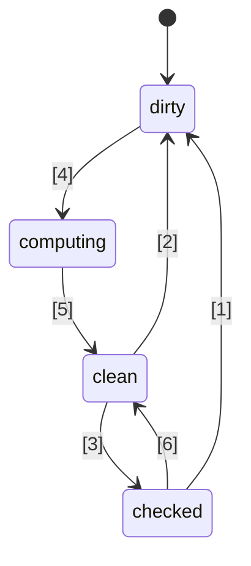
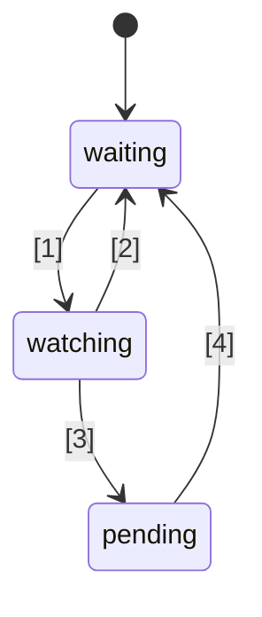

# 🚦 Proposta di standard Signals per JavaScript 🚦


Stage 1 ([spiegazione](https://tc39.es/process-document/))

Champions della proposta TC39: Daniel Ehrenberg, Yehuda Katz, Jatin Ramanathan, Shay Lewis, Kristen Hewell Garrett, Dominic Gannaway, Preston Sego, Milo M, Rob Eisenberg

Autori originali: Rob Eisenberg e Daniel Ehrenberg

Questo documento descrive una prima direzione comune per i signals in JavaScript, simile all'iniziativa Promises/A+ che ha preceduto le Promesse standardizzate dal TC39 in ES2015. Provalo tu stesso, utilizzando [un polyfill](https://github.com/proposal-signals/signal-polyfill).

Analogamente a Promises/A+, questo lavoro si concentra sull'allineamento dell'ecosistema JavaScript. Se tale allineamento avrà successo, potrebbe emergere uno standard, basato su tale esperienza. Diversi autori di framework stanno collaborando qui su un modello comune che potrebbe supportare il core della loro reattività. La bozza attuale si basa su input progettuali degli autori/manutentori di [Angular](https://angular.io/), [Bubble](https://bubble.io/), [Ember](https://emberjs.com/), [FAST](https://www.fast.design/), [MobX](https://mobx.js.org/), [Preact](https://preactjs.com/), [Qwik](https://qwik.dev/), [RxJS](https://rxjs.dev/), [Solid](https://www.solidjs.com/), [Starbeam](https://www.starbeamjs.com/), [Svelte](https://svelte.dev/), [Vue](https://vuejs.org/), [Wiz](https://blog.angular.io/angular-and-wiz-are-better-together-91e633d8cd5a), e altri ancora…

Diversamente da Promises/A+, non stiamo cercando di risolvere una superficie API comune rivolta agli sviluppatori, ma piuttosto le precise semantiche core del grafo dei signal sottostante. Questa proposta include una API completamente concreta, ma l’API non è destinata alla maggior parte degli sviluppatori di applicazioni. Invece, la signal API qui proposta è più adatta a essere usata dai framework come base, fornendo interoperabilità attraverso un grafo di signal comune e un meccanismo di auto-tracking.

Il piano per questa proposta è di effettuare prototipazione significativa nelle fasi iniziali, inclusa l’integrazione in diversi framework, prima di avanzare oltre lo Stage 1. Siamo interessati a standardizzare i Signals solo se risultano adatti all’uso pratico in più framework e forniscono reali vantaggi rispetto ai signals forniti dai framework stessi. Speriamo che la prototipazione significativa nelle fasi iniziali ci fornirà queste informazioni. Vedi "Status and development plan" di seguito per maggiori dettagli.

## Contesto: Perché i Signals?

Per sviluppare un'interfaccia utente (UI) complessa, gli sviluppatori di applicazioni JavaScript devono memorizzare, calcolare, invalidare, sincronizzare e trasmettere lo stato al layer di visualizzazione dell’applicazione in modo efficiente. Le UI comunemente coinvolgono molto più che la semplice gestione di valori semplici, ma spesso comportano il rendering di stati computati che dipendono da un albero complesso di altri valori o stati anch’essi computati. L’obiettivo dei Signals è fornire infrastruttura per la gestione di tali stati applicativi, così che gli sviluppatori possano concentrarsi sulla logica di business anziché su questi dettagli ripetitivi.

Costrutti simili ai signal si sono rivelati utili anche in contesti non-UI, in particolare nei sistemi di build per evitare ricostruzioni non necessarie.

I signals sono usati nella programmazione reattiva per rimuovere la necessità di gestire manualmente gli aggiornamenti nelle applicazioni.

> Un modello di programmazione dichiarativo per l’aggiornamento basato sui cambiamenti di stato.

da _[What is Reactivity?](https://www.pzuraq.com/blog/what-is-reactivity)_.

#### Esempio - Un contatore VanillaJS

Dato una variabile, `counter`, vuoi renderizzare nel DOM se il contatore è pari o dispari. Ogni volta che `counter` cambia, vuoi aggiornare il DOM con la nuova parità. In Vanilla JS, potresti avere qualcosa del genere:

```js
let counter = 0;
const setCounter = (value) => {
  counter = value;
  render();
};

const isEven = () => (counter & 1) == 0;
const parity = () => isEven() ? "even" : "odd";
const render = () => element.innerText = parity();

// Simula aggiornamenti esterni del counter...
setInterval(() => setCounter(counter + 1), 1000);
```
> [!NOTE]  
> Le variabili globali sono usate qui solo a scopo dimostrativo. La gestione corretta dello stato ha molte soluzioni, e gli esempi in questa proposta sono pensati per essere quanto più minimali possibile. Questa proposta non incoraggia l’uso di variabili globali.


Questo presenta diversi problemi...

* L’impostazione di `counter` è rumorosa e ricca di boilerplate.
* Lo stato di `counter` è strettamente accoppiato al sistema di rendering.
* Se `counter` cambia ma `parity` no (es. counter passa da 2 a 4), allora calcoliamo inutilmente la parità e facciamo un rendering non necessario.
* Cosa succede se un’altra parte della nostra UI vuole solo renderizzare quando `counter` si aggiorna?
* Cosa succede se un’altra parte della nostra UI dipende solo da `isEven` o `parity`?

Anche in questo scenario relativamente semplice, sorgono rapidamente diverse problematiche. Potremmo provare ad aggirare queste difficoltà introducendo un pub/sub per `counter`. Questo permetterebbe a ulteriori consumatori di `counter` di iscriversi e aggiungere le proprie reazioni ai cambiamenti di stato.

Tuttavia, rimangono i seguenti problemi:

* La funzione di rendering, che dipende solo da `parity`, deve invece “sapere” che in realtà deve iscriversi a `counter`.
* Non è possibile aggiornare la UI basandosi solo su `isEven` o `parity`, senza interagire direttamente con `counter`.
* Abbiamo aumentato il nostro boilerplate. Ogni volta che si usa qualcosa, non basta più chiamare una funzione o leggere una variabile, ma bisogna iscriversi e gestire gli aggiornamenti lì. Gestire la disiscrizione è anche particolarmente complicato.

Ora, potremmo risolvere alcuni problemi aggiungendo il pub/sub non solo a `counter` ma anche a `isEven` e `parity`. Dovremmo quindi iscrivere `isEven` a `counter`, `parity` a `isEven` e `render` a `parity`. Sfortunatamente, non solo il nostro codice boilerplate è esploso, ma ci ritroviamo con una gran quantità di gestione delle iscrizioni e un potenziale disastro di memory leak se non puliamo tutto correttamente. Quindi, abbiamo risolto alcuni problemi ma creato una nuova categoria di problemi e molto codice aggiuntivo. Peggio ancora, dobbiamo ripetere questo processo per ogni pezzo di stato nel nostro sistema.

### Introduzione ai Signals

Le astrazioni di data binding nelle UI per il modello e la vista sono da sempre fondamentali nei framework UI di diversi linguaggi di programmazione, nonostante l’assenza di un tale meccanismo integrato in JS o nella piattaforma web. All’interno dei framework e delle librerie JS, c’è stata molta sperimentazione su diversi modi di rappresentare questo binding, e l’esperienza ha mostrato la potenza del data flow unidirezionale in combinazione con un tipo di dato di prima classe che rappresenta una cella di stato o una computazione derivata da altri dati, ora spesso chiamati “Signals”.
Questo approccio di valore reattivo di prima classe sembra essere comparso per la prima volta in modo popolare nei framework web JavaScript open-source con [Knockout](https://knockoutjs.com/) [nel 2010](https://blog.stevensanderson.com/2010/07/05/introducing-knockout-a-ui-library-for-javascript/). Negli anni successivi, sono state create molte varianti e implementazioni. Negli ultimi 3-4 anni, il primitivo Signal e gli approcci correlati hanno guadagnato ulteriore trazione, con quasi ogni libreria o framework moderno di JavaScript che offre qualcosa di simile, sotto un nome o un altro.

Per capire i Signals, diamo un’occhiata all’esempio sopra, re-immaginato con una Signal API ulteriormente articolata qui sotto.

#### Esempio - Un contatore con Signals

```js
const counter = new Signal.State(0);
const isEven = new Signal.Computed(() => (counter.get() & 1) == 0);
const parity = new Signal.Computed(() => isEven.get() ? "even" : "odd");

// Una libreria o un framework definisce effetti basati su altri primitivi Signal
declare function effect(cb: () => void): (() => void);

effect(() => element.innerText = parity.get());

// Simula aggiornamenti esterni del counter...
setInterval(() => counter.set(counter.get() + 1), 1000);
```

Ci sono alcune cose che possiamo notare subito:
* Abbiamo eliminato il boilerplate rumoroso attorno alla variabile `counter` dell’esempio precedente.
* C’è una API unificata per gestire valori, computazioni ed effetti collaterali.
* Non ci sono problemi di riferimento circolare o dipendenze invertite tra `counter` e `render`.
* Non ci sono iscrizioni manuali, né alcuna necessità di gestione aggiuntiva.
* Esiste un modo per controllare il timing/la schedulazione degli effetti collaterali.

I signals ci offrono molto di più di quanto si possa vedere in superficie dalla API:
* **Monitoraggio automatico delle dipendenze** - Un Signal computato scopre automaticamente qualsiasi altro Signal da cui dipende, siano essi semplici valori o altri calcoli.
* **Valutazione pigra (Lazy Evaluation)** - I calcoli non vengono eseguiti immediatamente quando vengono dichiarati, né vengono subito ricalcolati quando cambiano le loro dipendenze. Vengono valutati solo quando il loro valore viene esplicitamente richiesto.
* **Memoizzazione** - I Signal computati memorizzano nella cache il loro ultimo valore, in modo che i calcoli le cui dipendenze non sono cambiate non debbano essere ricalcolati, indipendentemente da quante volte vengano letti.

## Motivazione per la standardizzazione dei Signals

#### Interoperabilità

Ogni implementazione di Signal ha il proprio meccanismo di auto-tracciamento, per tenere traccia delle sorgenti incontrate durante la valutazione di un Signal computato. Questo rende difficile condividere modelli, componenti e librerie tra diversi framework: tendono ad avere un falso accoppiamento con il loro motore di rendering (dato che i Signals sono solitamente implementati come parte dei framework JS).

Un obiettivo di questa proposta è separare completamente il modello reattivo dalla vista di rendering, permettendo agli sviluppatori di migrare verso nuove tecnologie di rendering senza riscrivere il loro codice non-UI, oppure di sviluppare modelli reattivi condivisi in JS da distribuire in diversi contesti. Sfortunatamente, a causa di versioning e duplicazioni, si è rivelato poco pratico raggiungere un alto livello di condivisione tramite librerie a livello JS: i built-in offrono una garanzia di condivisione più forte.

#### Prestazioni/Utilizzo della memoria

C'è sempre un piccolo potenziale incremento prestazionale nel distribuire meno codice grazie al fatto che le librerie più comuni sono built-in, ma le implementazioni dei Signals sono generalmente piuttosto ridotte, quindi non ci aspettiamo che questo effetto sia molto significativo.

Sospettiamo che implementazioni native C++ delle strutture dati e degli algoritmi correlati ai Signals possano essere leggermente più efficienti di quanto sia ottenibile in JS, per un fattore costante. Tuttavia, non sono previsti cambiamenti algoritmici rispetto a quanto sarebbe presente in un polyfill; non ci si aspetta che i motori siano "magici" qui, e gli algoritmi reattivi stessi saranno ben definiti e non ambigui.

Il gruppo dei proponenti prevede di sviluppare varie implementazioni di Signals e di utilizzare queste per indagare queste possibilità prestazionali.

#### DevTools

Con le attuali librerie di Signal nel linguaggio JS, può essere difficile tracciare cose come:
* Lo stack delle chiamate attraverso una catena di Signals computati, mostrando la catena causale di un errore
* Il grafo delle referenze tra Signals, quando uno dipende da un altro -- importante per il debug dell'uso della memoria

I Signals integrati consentono ai runtime JS e ai DevTools di avere potenzialmente un supporto migliorato per l'ispezione dei Signals, in particolare per il debug o l'analisi delle prestazioni, sia che ciò sia integrato nei browser sia tramite un'estensione condivisa. Strumenti esistenti come l'inspector degli elementi, snapshot delle prestazioni e profiler di memoria potrebbero essere aggiornati per evidenziare specificamente i Signals nella presentazione delle informazioni.

#### Benefici secondari

##### Benefici di una libreria standard

In generale, JavaScript ha sempre avuto una libreria standard piuttosto minimale, ma una tendenza in TC39 è stata quella di rendere JS un linguaggio più "batteries-included", con un set di funzionalità di alta qualità e integrate. Ad esempio, Temporal sta sostituendo moment.js, e una serie di piccole funzionalità, ad esempio, `Array.prototype.flat` e `Object.groupBy` stanno sostituendo molti casi d'uso di lodash. I benefici includono bundle più piccoli, maggiore stabilità e qualità, meno cose da imparare quando si entra in un nuovo progetto e un vocabolario generalmente comune tra gli sviluppatori JS.

##### Integrazione HTML/DOM (una possibilità futura)

Lavori in corso nel W3C e da parte degli implementatori dei browser stanno cercando di portare il templating nativo in HTML ([DOM Parts][wicg-pr-1023] e [Template Instantiation][wicg-propsal-template-instantiation]). Inoltre, il W3C Web Components CG sta esplorando la possibilità di estendere i Web Components per offrire una API HTML completamente dichiarativa. Per raggiungere entrambi questi obiettivi, in futuro sarà necessaria una primitiva reattiva per l'HTML. Inoltre, molte migliorie ergonomiche al DOM tramite l'integrazione dei Signals possono essere immaginate e sono state richieste dalla comunità.

[wicg-pr-1023]: https://github.com/WICG/webcomponents/pull/1023
[wicg-propsal-template-instantiation]: https://github.com/WICG/webcomponents/blob/gh-pages/proposals/Template-Instantiation.md

> Nota, questa integrazione sarebbe uno sforzo separato da realizzare in seguito, non fa parte di questa proposta stessa.

##### Scambio di informazioni nell’ecosistema (*non* un motivo per implementare)

Gli sforzi di standardizzazione possono essere utili anche solo a livello "comunitario", anche senza cambiamenti nei browser. Il lavoro sui Signals sta unendo diversi autori di framework per una discussione approfondita sulla natura della reattività, degli algoritmi e dell'interoperabilità. Questo è già stato utile, ma non giustifica l'inclusione nei motori JS e nei browser; i Signals dovrebbero essere aggiunti allo standard JavaScript solo se ci sono benefici significativi *oltre* lo scambio di informazioni abilitato nell’ecosistema.

## Obiettivi di progettazione per i Signals

Si scopre che le attuali librerie di Signal non sono poi così diverse tra loro, alla radice. Questa proposta mira a costruire sul loro successo implementando le qualità importanti di molte di queste librerie.

### Caratteristiche principali

* Un tipo Signal che rappresenta uno stato, cioè un Signal scrivibile. Questo è un valore che altri possono leggere.
* Un tipo Signal computato/memo/derivato, che dipende da altri ed è calcolato e memorizzato nella cache in modo pigro.
    * Il calcolo è pigro, il che significa che i Signals computati non vengono ricalcolati di default quando una delle loro dipendenze cambia, ma vengono eseguiti solo se qualcuno li legge effettivamente.
    * Il calcolo è "[glitch](https://en.wikipedia.org/wiki/Reactive_programming#Glitches)-free", ovvero non vengono mai eseguiti calcoli non necessari. Questo implica che, quando un'applicazione legge un Signal computato, c'è un ordinamento topologico delle parti potenzialmente "sporche" del grafo da eseguire, per eliminare eventuali duplicati.
    * Il calcolo è memorizzato nella cache, il che significa che se, dopo l'ultimo cambiamento di una dipendenza, nessuna dipendenza è cambiata, allora il Signal computato *non* viene ricalcolato quando viene letto.
    * Sono possibili confronti personalizzati sia per i Signals computati che per quelli di stato, per determinare quando altri Signals computati che dipendono da essi devono essere aggiornati.
* Reazioni alla condizione in cui un Signal computato ha una delle sue dipendenze (o dipendenze annidate) che diventa "sporca" e cambia, il che significa che il valore del Signal potrebbe essere obsoleto.
    * Questa reazione serve a pianificare l'esecuzione di lavoro più significativo in un secondo momento.
    * Gli effetti sono implementati in termini di queste reazioni, più la pianificazione a livello di framework.
    * I Signal computati hanno bisogno della capacità di reagire al fatto di essere registrati come (annidati) dipendenti di una di queste reazioni.
* Consentire ai framework JS di gestire la propria pianificazione. Nessuna pianificazione forzata incorporata in stile Promise.
    * Sono necessarie reazioni sincrone per consentire la pianificazione di lavori successivi sulla base della logica del framework.
    * Le scritture sono sincrone e hanno effetto immediato (un framework che raggruppa le scritture può farlo sopra).
    * È possibile separare il controllo se un effetto può essere "sporco" dall'esecuzione effettiva dell'effetto (abilitando uno scheduler di effetti a due stadi).
* Possibilità di leggere Signals *senza* attivare la registrazione delle dipendenze (`untrack`)
* Consentire la composizione di diversi codebase che usano Signals/reattività, ad esempio,
    * Uso di più framework insieme per quanto riguarda il tracciamento/la reattività stessa (salvo omissioni, vedi sotto)
    * Strutture dati reattive indipendenti dal framework (ad esempio, proxy store ricorsivo reattivo, Map, Set e Array reattivi, ecc.)

### Solidità

* Sconsigliare/proibire l’uso ingenuo delle reazioni sincrone.
    * Rischio di solidità: potrebbe esporre "[glitch](https://en.wikipedia.org/wiki/Reactive_programming#Glitches)" se usato in modo improprio: se il rendering viene fatto immediatamente quando si imposta un Signal, potrebbe esporre uno stato applicativo incompleto all’utente finale. Questa funzione dovrebbe quindi essere usata solo per pianificare intelligentemente lavoro futuro, una volta che la logica applicativa è terminata.
    * Soluzione: vietare la lettura e la scrittura di qualsiasi Signal all’interno di una callback di reazione sincrona
* Sconsigliare `untrack` e segnalarne la natura non sicura
    * Rischio di solidità: consente la creazione di Signals computati il cui valore dipende da altri Signals, ma che non vengono aggiornati quando quei Signals cambiano. Va utilizzato solo quando gli accessi non tracciati non cambieranno il risultato del calcolo.
    * Soluzione: l’API è contrassegnata come "unsafe" nel nome.
* Nota: Questa proposta consente ai signals di essere sia letti che scritti da signals computati ed effetti, senza limitare le scritture successive alle letture, nonostante il rischio di solidità. Questa decisione è stata presa per preservare flessibilità e compatibilità nell’integrazione coi framework.

### API di superficie

* Deve essere una solida base per diversi framework per implementare i loro meccanismi di Signals/reattività.
    * Dovrebbe essere una buona base per proxy store ricorsivi, reattività sui campi di classe tramite decorator, e sia API in stile `.value` sia `[state, setState]`.
    * La semantica deve poter esprimere i pattern validi abilitati dai diversi framework. Ad esempio, dovrebbe essere possibile per questi Signals essere la base sia di scritture immediatamente riflesse sia di scritture raggruppate e applicate successivamente.
* Sarebbe auspicabile che questa API fosse direttamente utilizzabile dagli sviluppatori JavaScript.
    * Se una funzionalità coincide con un concetto nell’ecosistema, usare un vocabolario comune è utile.
        * Tuttavia, è importante non ombreggiare letteralmente gli stessi nomi!
    * Tensione tra "usabilità per gli sviluppatori JS" e "fornire tutti gli hook ai framework"
        * Idea: Fornire tutti gli hook, ma includere errori in caso di uso improprio, se possibile.
        * Idea: Mettere le API più sottili in uno spazio dei nomi `subtle`, simile a [`crypto.subtle`](https://developer.mozilla.org/en-US/docs/Web/API/Crypto/subtle), per segnare la linea tra API necessarie per usi avanzati come implementare un framework o costruire dev tools e API più da sviluppo applicativo quotidiano come l’istanziazione di signals da usare con un framework.
* Essere implementabile e utilizzabile con buone prestazioni -- l’API di superficie non deve causare troppo overhead
    * Abilitare la sottoclassificazione, così che i framework possano aggiungere i propri metodi e campi, anche privati. Questo è importante per evitare la necessità di allocazioni aggiuntive a livello di framework. Vedi "Gestione della memoria" sotto.

### Gestione della memoria

* Se possibile: Un Signal computato dovrebbe poter essere raccolto dal garbage collector se non ci sono riferimenti vivi per futuri accessi, anche se è collegato in un grafo più ampio che resta vivo (ad esempio, leggendo uno stato che resta vivo).
* Nota che la maggior parte dei framework oggi richiede l'eliminazione esplicita dei Signal computati se essi hanno qualsiasi riferimento a o da un altro grafo di Signal che rimane vivo.
* Questo alla fine non è così male quando la loro durata è legata alla durata di un componente UI, e gli effetti devono comunque essere eliminati.
* Se è troppo costoso eseguire con questa semantica, allora dovremmo aggiungere l'eliminazione esplicita (o "scollegamento") dei Signal computati all'API sottostante, che attualmente ne è priva.
* Un obiettivo correlato separato: Minimizzare il numero di allocazioni, ad es.,
    * per creare un Signal scrivibile (evitare due closure separate + array)
    * per implementare effetti (evitare una closure per ogni singola reazione)
    * Nell'API per osservare i cambiamenti dei Signal, evitare la creazione di strutture dati temporanee aggiuntive
    * Soluzione: API basata su classi che consente il riutilizzo di metodi e campi definiti nelle sottoclassi

## Schema API

Di seguito un'idea iniziale di una API per i Signal. Nota che questa è solo una prima bozza, e prevediamo cambiamenti nel tempo. Iniziamo con il file completo `.d.ts` per avere un'idea della forma generale, poi discuteremo i dettagli di ciò che significa tutto questo.

```ts
interface Signal<T> {
    // Ottieni il valore del signal
    get(): T;
}

namespace Signal {
    // Un Signal di lettura e scrittura
    class State<T> implements Signal<T> {
        // Crea un Signal di stato che parte dal valore t
        constructor(t: T, options?: SignalOptions<T>);

        // Ottieni il valore del signal
        get(): T;

        // Imposta il valore del Signal di stato a t
        set(t: T): void;
    }

    // Un Signal che è una formula basata su altri Signal
    class Computed<T = unknown> implements Signal<T> {
        // Crea un Signal che valuta il valore restituito dalla callback.
        // La callback è chiamata con questo signal come valore this.
        constructor(cb: (this: Computed<T>) => T, options?: SignalOptions<T>);

        // Ottieni il valore del signal
        get(): T;
    }

    // Questo namespace include funzionalità "avanzate" che è meglio
    // lasciare agli autori di framework piuttosto che agli sviluppatori di applicazioni.
    // Analogo a `crypto.subtle`
    namespace subtle {
        // Esegui una callback con tutto il tracciamento disabilitato
        function untrack<T>(cb: () => T): T;

        // Ottieni il signal computato corrente che sta tracciando eventuali letture di signal, se presente
        function currentComputed(): Computed | null;

        // Restituisce la lista ordinata di tutti i signal a cui questo ha fatto riferimento
        // durante l'ultima valutazione.
        // Per un Watcher, elenca il set di signal che sta osservando.
        function introspectSources(s: Computed | Watcher): (State | Computed)[];

        // Restituisce i Watcher in cui questo signal è contenuto, oltre a eventuali
        // signal Computed che hanno letto questo signal l'ultima volta che sono stati valutati,
        // se quel signal computato è (ricorsivamente) osservato.
        function introspectSinks(s: State | Computed): (Computed | Watcher)[];

        // True se questo signal è "vivo", ovvero è osservato da un Watcher,
        // oppure è letto da un signal Computed che è (ricorsivamente) vivo.
        function hasSinks(s: State | Computed): boolean;

        // True se questo elemento è "reattivo", cioè dipende
        // da qualche altro signal. Un Computed dove hasSources è false
        // restituirà sempre la stessa costante.
        function hasSources(s: Computed | Watcher): boolean;

        class Watcher {
            // Quando una (ricorsiva) sorgente di Watcher viene scritta, chiama questa callback,
            // se non è già stata chiamata dall'ultima chiamata a `watch`.
            // Nessun signal può essere letto o scritto durante la notify.
            constructor(notify: (this: Watcher) => void);

            // Aggiungi questi signal all'insieme del Watcher e imposta il watcher per eseguire la sua
            // notify callback la prossima volta che un qualsiasi signal dell'insieme (o una delle sue dipendenze) cambia.
            // Può essere chiamato senza argomenti solo per resettare lo stato "notified", così che
            // la callback notify venga invocata di nuovo.
            watch(...s: Signal[]): void;

            // Rimuovi questi signal dall'insieme osservato (ad es., per un effetto che viene eliminato)
            unwatch(...s: Signal[]): void;

            // Restituisce l'insieme delle sorgenti nell'insieme del Watcher che sono ancora dirty, oppure è un signal computato
            // con una sorgente che è dirty o pending e non è ancora stata rivalutata
            getPending(): Signal[];
        }

        // Hook per osservare quando viene osservato o non più osservato
        var watched: Symbol;
        var unwatched: Symbol;
    }

    interface SignalOptions<T> {
        // Funzione di confronto personalizzata tra valore vecchio e nuovo. Default: Object.is.
        // Il signal è passato come valore this per il contesto.
        equals?: (this: Signal<T>, t: T, t2: T) => boolean;
```ts
// Callback chiamato quando isWatched diventa true, se in precedenza era false
[Signal.subtle.watched]?: (this: Signal<T>) => void;

// Callback chiamato ogni volta che isWatched diventa false, se in precedenza era true
[Signal.subtle.unwatched]?: (this: Signal<T>) => void;
}
}
```

### Come funzionano i Signals

Un Signal rappresenta una cella di dati che può cambiare nel tempo. I Signals possono essere di tipo "state" (semplicemente un valore impostato manualmente) o "computed" (una formula basata su altri Signals).

I Signals computati funzionano tracciando automaticamente quali altri Signals vengono letti durante la loro valutazione. Quando un computed viene letto, controlla se una delle sue dipendenze precedentemente registrate è cambiata, e in tal caso si ricalcola. Quando più Signals computati sono annidati, tutta l'attribuzione del tracciamento va a quello più interno.

I Signals computati sono lazy, ovvero pull-based: vengono ricalcolati solo quando vengono acceduti, anche se una delle loro dipendenze è cambiata in precedenza.

La callback passata ai Signals computati dovrebbe generalmente essere "pura", nel senso di essere una funzione deterministica e priva di effetti collaterali sugli altri Signals a cui accede. Allo stesso tempo, il momento in cui viene chiamata la callback è deterministico, consentendo l'uso di effetti collaterali con cautela.

I Signals presentano un caching/memorizzazione evidente: sia i Signals di stato che quelli computati memorizzano il loro valore attuale e attivano il ricalcolo dei Signals computati che li referenziano solo se effettivamente cambiano. Non è nemmeno necessario un confronto ripetuto tra vecchi e nuovi valori: il confronto viene effettuato una sola volta quando il Signal sorgente viene reimpostato/ricalcolato, e il meccanismo dei Signal tiene traccia di quali elementi che fanno riferimento a quel Signal non sono ancora stati aggiornati in base al nuovo valore. Internamente, questo viene generalmente rappresentato tramite il "graph coloring" come descritto nel [post sul blog di Milo](https://raw.githubusercontent.com/tc39/proposal-signals/main/blog/graph-coloring.md).

I Signals computati tracciano dinamicamente le loro dipendenze: ogni volta che vengono eseguiti, possono finire per dipendere da cose diverse, e quell’insieme preciso di dipendenze viene mantenuto aggiornato nel grafo dei Signal. Questo significa che se hai una dipendenza necessaria solo su un ramo, e il calcolo precedente ha seguito l’altro ramo, allora una modifica a quel valore temporaneamente inutilizzato non causerà il ricalcolo del Signal computato, anche quando viene letto.

A differenza delle Promises JavaScript, tutto nei Signals viene eseguito in modo sincrono:
- Impostare un Signal su un nuovo valore è sincrono, e ciò si riflette immediatamente quando si legge un qualsiasi Signal computato che vi dipende. Non c'è batching incorporato di questa mutazione.
- La lettura dei Signals computati è sincrona: il loro valore è sempre disponibile.
- La callback `notify` nei Watcher, come spiegato di seguito, viene eseguita in modo sincrono, durante la chiamata a `.set()` che l'ha attivata (ma dopo che il graph coloring è stato completato).

Come per le Promises, i Signals possono rappresentare uno stato di errore: se la callback di un Signal computato lancia un'eccezione, quell'errore viene memorizzato nella cache proprio come un altro valore, e rilanciato ogni volta che si legge il Signal.

### Comprendere la classe Signal

Un'istanza di `Signal` rappresenta la capacità di leggere un valore che cambia dinamicamente e i cui aggiornamenti vengono tracciati nel tempo. Include anche implicitamente la capacità di iscriversi al Signal, implicitamente tramite un accesso tracciato da un altro Signal computato.

L'API qui è progettata per corrispondere al consenso, seppur molto approssimativo, dell’ecosistema tra una grande frazione delle librerie Signal, nell’uso di nomi come "signal", "computed" e "state". Tuttavia, l’accesso ai Signals Computed e State avviene tramite un metodo `.get()`, che non è in accordo con tutte le popolari API Signal, che usano invece un accesso in stile `.value` o la sintassi di chiamata `signal()`.

L’API è progettata per ridurre il numero di allocazioni, per rendere i Signals adatti all’incorporamento nei framework JavaScript mantenendo prestazioni pari o superiori ai Signals personalizzati dei framework esistenti. Questo implica:
- I Signals di stato sono un singolo oggetto scrivibile, che può essere sia letto che scritto dallo stesso riferimento. (Vedi implicazioni sotto nella sezione "Separazione delle capacità".)
- Sia i Signals di stato che quelli computati sono progettati per poter essere sottoclassati, per facilitare la possibilità dei framework di aggiungere proprietà aggiuntive tramite campi di classe pubblici e privati (così come metodi per utilizzare quello stato).
- Varie callback (ad es. `equals`, la callback computata) sono chiamate con il Signal rilevante come valore `this` per il contesto, in modo che non sia necessaria una nuova closure per ogni Signal. Invece, il contesto può essere salvato in proprietà extra dello stesso signal.

Alcune condizioni di errore imposte da questa API:
- È un errore leggere un computed in modo ricorsivo.
- La callback `notify` di un Watcher non può leggere o scrivere alcun Signal.
- Se la callback di un Signal computato lancia un'eccezione, gli accessi successivi al Signal rilanciano quell'errore memorizzato nella cache, finché una delle dipendenze non cambia e viene ricalcolato.

Alcune condizioni che *non* sono imposte:
- I Signals computati possono scrivere su altri Signals, in modo sincrono all’interno della loro callback
- Il lavoro messo in coda dalla callback `notify` di un Watcher può leggere o scrivere Signals, rendendo possibile replicare [antipattern classici di React](https://react.dev/learn/you-might-not-need-an-effect) in termini di Signals!

### Implementazione degli effetti

L’interfaccia `Watcher` definita sopra fornisce la base per implementare le tipiche API JS per gli effetti: callback che vengono rieseguite quando altri Signals cambiano, esclusivamente per il loro effetto collaterale. La funzione `effect` utilizzata sopra nell’esempio iniziale può essere definita come segue:

```ts
// Questa funzione normalmente vivrebbe in una libreria/framework, non nel codice dell’applicazione
// NOTA: Questa logica di scheduling è troppo basilare per essere utile. Non copiare/incollare.
let pending = false;

let w = new Signal.subtle.Watcher(() => {
    if (!pending) {
        pending = true;
        queueMicrotask(() => {
            pending = false;
            for (let s of w.getPending()) s.get();
            w.watch();
        });
    }
});

// Un Signal effetto che si valuta a cb, che programma una lettura di se stesso
// nella coda di microtask ogni volta che una delle sue dipendenze potrebbe cambiare
export function effect(cb) {
    let destructor;
    let c = new Signal.Computed(() => { destructor?.(); destructor = cb(); });
    w.watch(c);
    c.get();
    return () => { destructor?.(); w.unwatch(c) };
}
```

L’API Signal non include alcuna funzione integrata come `effect`. Questo perché la pianificazione degli effetti è sottile e spesso si lega ai cicli di rendering dei framework e ad altri stati o strategie specifici dei framework di alto livello a cui JS non ha accesso.

Esaminando le diverse operazioni usate qui: la callback `notify` passata al costruttore di `Watcher` è la funzione chiamata quando il Signal passa da uno stato "clean" (in cui sappiamo che la cache è inizializzata e valida) a uno stato "checked" o "dirty" (in cui la cache potrebbe o meno essere valida perché almeno uno degli state da cui dipende ricorsivamente è stato modificato).

Le chiamate a `notify` sono alla fine attivate da una chiamata a `.set()` su un qualche Signal di stato. Questa chiamata è sincrona: avviene prima che `.set` ritorni. Ma non c’è bisogno di preoccuparsi che questa callback osservi il grafo dei Signals in uno stato parzialmente processato, perché durante una callback `notify`, nessun Signal può essere letto o scritto, nemmeno in una chiamata `untrack`. Poiché `notify` viene chiamata durante `.set()`, sta interrompendo un altro flusso logico, che potrebbe non essere completo. Per leggere o scrivere Signals da `notify`, programma il lavoro da eseguire successivamente, ad esempio scrivendo il Signal in una lista che verrà poi acceduta, o usando `queueMicrotask` come sopra.

Nota che è perfettamente possibile usare efficacemente i Signals senza `Signal.subtle.Watcher` programmando il polling dei Signals computati, come fa Glimmer. Tuttavia, molti framework hanno scoperto che è molto spesso utile che questa logica di scheduling venga eseguita in modo sincrono, quindi l’API Signals la include.

Sia i Signals computati che quelli di stato vengono raccolti dal garbage collector come qualsiasi valore JS. Ma i Watcher hanno un modo speciale di tenere vivi gli oggetti: tutti i Signals osservati da un Watcher verranno mantenuti vivi finché uno degli state sottostanti è raggiungibile, poiché questi possono attivare una futura chiamata a `notify` (e poi una futura `.get()`). Per questo motivo, ricordati di chiamare `Watcher.prototype.unwatch` per ripulire gli effetti.

### Una scappatoia non sicura

`Signal.subtle.untrack` è una scappatoia che consente di leggere Signals *senza* tracciare quelle letture. Questa capacità è insicura perché permette la creazione di Signals computati il cui valore dipende da altri Signals, ma che non vengono aggiornati quando tali Signals cambiano. Dovrebbe essere usata quando gli accessi non tracciati non cambieranno il risultato del calcolo.

<!--
TODO: Mostrare un esempio in cui è una buona idea usare untrack

### Uso di watched/unwatched
TODO: Mostrare un esempio di conversione di un Observable in un segnale computed, sottoscritto solo quando utilizzato da un effetto

TODO: Mostrare un esempio di un segnale computed che rappresenta il risultato di una fetch indirizzata a uno stato, che viene annullata

### Introspezione per SSR

TODO: Mostrare come funziona la serializzazione del grafo dei segnali

TODO: Mostrare come si può "idratare" un segnale da stato a computed successivamente, utilizzando alcuni segnali.
-->

### Omissi per ora

Queste funzionalità potrebbero essere aggiunte in seguito, ma non sono incluse nell'attuale bozza. La loro omissione è dovuta alla mancanza di un consenso stabilito nello spazio di progettazione tra i framework, nonché alla dimostrata capacità di aggirare la loro assenza con meccanismi costruiti sopra la nozione di Signals descritta in questo documento. Tuttavia, sfortunatamente, l'omissione limita il potenziale di interoperabilità tra i framework. Man mano che vengono prodotti prototipi di Signals come descritto in questo documento, ci sarà uno sforzo per riesaminare se queste omissioni sono state la decisione appropriata.

* **Async**: I segnali sono sempre disponibili in modo sincrono per la valutazione, in questo modello. Tuttavia, è spesso utile avere alcuni processi asincroni che portano all'impostazione di un segnale e comprendere quando un segnale è ancora in "caricamento". Un modo semplice per modellare lo stato di caricamento è tramite eccezioni, e il comportamento di caching delle eccezioni dei segnali computed si compone in modo ragionevole con questa tecnica. Tecniche migliorate sono discusse in [Issue #30](https://github.com/proposal-signals/proposal-signals/issues/30).
* **Transazioni**: Per le transizioni tra viste, è spesso utile mantenere uno stato attivo sia per lo stato di "partenza" che per quello di "arrivo". Lo stato "di arrivo" viene renderizzato in background, fino a quando non è pronto per essere scambiato (commettendo la transazione), mentre lo stato "di partenza" rimane interattivo. Mantenere entrambi gli stati contemporaneamente richiede il "fork" dello stato del grafo dei segnali, e potrebbe persino essere utile supportare più transizioni in sospeso contemporaneamente. Discussione in [Issue #73](https://github.com/proposal-signals/proposal-signals/issues/73).

Anche alcuni possibili [metodi di convenienza](https://github.com/proposal-signals/proposal-signals/issues/32) sono omessi.

## Stato e piano di sviluppo

Questa proposta è all'ordine del giorno di TC39 per aprile 2024 per lo Stage 1. Attualmente può essere considerata come "Stage 0".

[Un polyfill](https://github.com/proposal-signals/signal-polyfill) per questa proposta è disponibile, con alcuni test di base. Alcuni autori di framework hanno iniziato a sperimentare la sostituzione di questa implementazione di signal, ma questo utilizzo è in una fase iniziale.

I collaboratori della proposta Signal vogliono essere particolarmente **conservativi** su come portiamo avanti questa proposta, per evitare di ritrovarci nella trappola di far uscire qualcosa di cui finiremmo per pentirci e che poi non verrebbe effettivamente utilizzato. Il nostro piano è di svolgere le seguenti attività extra, non richieste dal processo TC39, per assicurarci che questa proposta sia sulla strada giusta:

Prima di proporre per lo Stage 2, intendiamo:
- Sviluppare più implementazioni polyfill di livello produttivo che siano solide, ben testate (ad esempio, superando i test di vari framework oltre a test di tipo test262) e competitive in termini di prestazioni (come verificato con un set approfondito di benchmark signal/framework).
- Integrare la Signal API proposta in un gran numero di framework JS che riteniamo rappresentativi, e far lavorare alcune grandi applicazioni su questa base. Testare che funzioni in modo efficiente e corretto in questi contesti.
- Avere una solida comprensione dello spazio delle possibili estensioni dell'API, e aver concluso quali (se ce ne sono) dovrebbero essere aggiunte a questa proposta.

## Algoritmi Signal

Questa sezione descrive ciascuna delle API esposte a JavaScript, in termini degli algoritmi che implementano. Questo può essere considerato come una proto-specifica, ed è incluso già in questa fase per fissare un possibile insieme di semantiche, restando molto aperti ai cambiamenti.

Alcuni aspetti dell'algoritmo:
- L'ordine delle letture dei Signals all'interno di un computed è significativo, ed è osservabile nell'ordine in cui vengono eseguite alcune callback (quando viene invocato `Watcher`, `equals`, il primo parametro di `new Signal.Computed`, e le callback `watched`/`unwatched`). Ciò significa che le sorgenti di un Signal computed devono essere memorizzate in modo ordinato.
- Queste quattro callback possono tutte generare eccezioni, ed esse vengono propagate in modo prevedibile al codice JS chiamante. Le eccezioni *non* interrompono l'esecuzione di questo algoritmo né lasciano il grafo in uno stato parzialmente elaborato. Per gli errori lanciati nella callback `notify` di un Watcher, quell'eccezione viene inviata alla chiamata `.set()` che l'ha innescata, utilizzando un AggregateError se sono state sollevate più eccezioni. Le altre (incluse `watched`/`unwatched`?) sono memorizzate nel valore del Signal, per essere rilanciate quando letto, e un Signal che rilancia può essere marcato `~clean~` come qualsiasi altro con un valore normale.
- Si presta attenzione ad evitare circolarità nei casi di segnali computed che non sono "watched" (osservati da alcun Watcher), così che possano essere raccolti dal garbage collector indipendentemente da altre parti del grafo dei segnali. Internamente, ciò può essere implementato con un sistema di numeri di generazione che vengono sempre raccolti; si noti che implementazioni ottimizzate possono anche includere numeri di generazione locali per nodo, o evitare di tracciare alcuni numeri su segnali watched.

### Stato globale nascosto

Gli algoritmi Signal devono fare riferimento a determinati stati globali. Questo stato è globale per l'intero thread, o "agente".

- `computing`: Il Signal computed o effect più interno attualmente in fase di ricalcolo a causa di una chiamata `.get` o `.run`, oppure `null`. Inizialmente `null`.
- `frozen`: Booleano che indica se è attualmente in esecuzione una callback che richiede che il grafo non venga modificato. Inizialmente `false`.
- `generation`: Un intero incrementale, che parte da 0, usato per tracciare quanto è aggiornato un valore evitando circolarità.

### Lo spazio dei nomi `Signal`

`Signal` è un oggetto ordinario che funge da spazio dei nomi per classi e funzioni relative ai Signal.

`Signal.subtle` è un oggetto di spazio dei nomi interno simile.

### La classe `Signal.State`

#### Slot interni di `Signal.State`

- `value`: Il valore attuale del signal di stato
- `equals`: La funzione di confronto utilizzata quando si cambiano i valori
- `watched`: La callback che viene chiamata quando il segnale viene osservato da un effect
- `unwatched`: La callback che viene chiamata quando il segnale non è più osservato da un effect
- `sinks`: Insieme dei segnali watched che dipendono da questo

#### Costruttore: `Signal.State(initialValue, options)`

1. Imposta il `value` di questo Signal su `initialValue`.
1. Imposta il `equals` di questo Signal su options?.equals
1. Imposta il `watched` di questo Signal su options?.[Signal.subtle.watched]
1. Imposta il `unwatched` di questo Signal su options?.[Signal.subtle.unwatched]
1. Imposta il `sinks` di questo Signal sull'insieme vuoto

#### Metodo: `Signal.State.prototype.get()`

1. Se `frozen` è true, solleva un'eccezione.
1. Se `computing` non è `undefined`, aggiungi questo Signal all'insieme `sources` di `computing`.
1. NOTA: Non aggiungiamo `computing` all'insieme `sinks` di questo Signal finché non viene osservato da un Watcher.
1. Restituisci il `value` di questo Signal.

#### Metodo: `Signal.State.prototype.set(newValue)`

1. Se il contesto di esecuzione attuale è `frozen`, solleva un'eccezione.
1. Esegui l'algoritmo "set Signal value" con questo Signal e il primo parametro per il valore.
1. Se quell'algoritmo ha restituito `~clean~`, allora restituisci undefined.
1. Imposta lo `state` di tutti i `sinks` di questo Signal a (se è un Signal Computed) `~dirty~` se erano precedentemente clean, oppure (se è un Watcher) `~pending~` se era precedentemente `~watching~`.
1. Imposta lo `state` di tutte le dipendenze Computed Signal dei sinks (ricorsivamente) a `~checked~` se erano precedentemente `~clean~` (cioè, lascia i segni di dirty al loro posto), oppure per i Watcher, `~pending~` se precedentemente `~watching~`.
1. Per ogni Watcher precedentemente `~watching~` incontrato in quella ricerca ricorsiva, quindi in ordine di profondità,
    1. Imposta `frozen` su true.
    1. Chiama la loro callback `notify` (salvando da parte qualsiasi eccezione sollevata, ma ignorando il valore restituito di `notify`).
    1. Ripristina `frozen` su false.
    1. Imposta lo `state` del Watcher su `~waiting~`.
1. Se è stata sollevata qualche eccezione dalle callback `notify`, propagala al chiamante dopo che tutte le callback `notify` sono state eseguite. Se ci sono più eccezioni, raggruppale in un AggregateError e sollevalo.
1. Restituisci undefined.

### La classe `Signal.Computed`

#### Macchina a stati di `Signal.Computed`
Lo `state` di un Computed Signal può essere uno dei seguenti:

- `~clean~`: Il valore del Signal è presente e noto come non obsoleto.
- `~checked~`: Una fonte (indiretta) di questo Signal è cambiata; questo Signal ha un valore ma _potrebbe_ essere obsoleto. Se sia o meno obsoleto sarà noto solo quando tutte le fonti immediate saranno state valutate.
- `~computing~`: Il callback di questo Signal è attualmente in esecuzione come effetto collaterale di una chiamata `.get()`.
- `~dirty~`: O questo Signal ha un valore che si sa essere obsoleto, oppure non è mai stato valutato.

Il grafico delle transizioni è il seguente:



Le transizioni sono:
| Numero | Da | A | Condizione | Algoritmo |
| ------ | -- | - | ---------- | ---------- |
| 1 | `~checked~` | `~dirty~` | Una fonte immediata di questo signal, che è un computed signal, è stata valutata, e il suo valore è cambiato. | Algoritmo: ricalcolo di un Signal computed dirty |
| 2 | `~clean~` | `~dirty~` | Una fonte immediata di questo signal, che è uno State, è stata impostata con un valore diverso dal precedente. | Metodo: `Signal.State.prototype.set(newValue)` |
| 3 | `~clean~` | `~checked~` | Una fonte ricorsiva, ma non immediata, di questo signal, che è uno State, è stata impostata con un valore diverso dal precedente. | Metodo: `Signal.State.prototype.set(newValue)` |
| 4 | `~dirty~` | `~computing~` | Stiamo per eseguire il `callback`. | Algoritmo: ricalcolo di un Signal computed dirty |
| 5 | `~computing~` | `~clean~` | Il `callback` ha terminato la valutazione e ha restituito un valore o sollevato un'eccezione. | Algoritmo: ricalcolo di un Signal computed dirty |
| 6 | `~checked~` | `~clean~` | Tutte le fonti immediate di questo signal sono state valutate, e tutte sono risultate invariate, quindi ora sappiamo che non è obsoleto. | Algoritmo: ricalcolo di un Signal computed dirty |

#### Slot interni di `Signal.Computed`

- `value`: Il valore precedente memorizzato del Signal, oppure `~uninitialized~` per un computed Signal mai letto. Il valore può essere un'eccezione che viene rilanciata quando il valore viene letto. Sempre `undefined` per gli effect signals.
- `state`: Può essere `~clean~`, `~checked~`, `~computing~` o `~dirty~`.
- `sources`: Un insieme ordinato di Signals da cui questo Signal dipende.
- `sinks`: Un insieme ordinato di Signals che dipendono da questo Signal.
- `equals`: Il metodo di confronto fornito nelle opzioni.
- `callback`: Il callback che viene chiamato per ottenere il valore del computed Signal. Impostato al primo parametro passato al costruttore.

#### Costruttore di `Signal.Computed`

Il costruttore imposta
- `callback` al suo primo parametro
- `equals` in base alle opzioni, predefinito a `Object.is` se assente
- `state` a `~dirty~`
- `value` a `~uninitialized~`

Con [AsyncContext](https://github.com/tc39/proposal-async-context), il callback passato a `new Signal.Computed` chiude sullo snapshot del momento in cui è stato chiamato il costruttore, e ripristina questo snapshot durante la sua esecuzione.

#### Metodo: `Signal.Computed.prototype.get`

1. Se il contesto di esecuzione corrente è `frozen` o se questo Signal ha lo stato `~computing~`, o se questo signal è un Watcher e sta `computing` un computed Signal, solleva un'eccezione.
1. Se `computing` non è `null`, aggiungi questo Signal all'insieme `sources` di `computing`.
1. NOTA: Non aggiungiamo `computing` all'insieme `sinks` di questo Signal finché non viene osservato da un Watcher.
1. Se lo stato di questo Signal è `~dirty~` o `~checked~`: Ripeti i seguenti passaggi fino a quando questo Signal è `~clean~`:
    1. Risali ricorsivamente tramite `sources` per trovare la fonte ricorsiva più profonda e più a sinistra (cioè osservata per prima) che è un Computed Signal segnato come `~dirty~` (interrompendo la ricerca quando si trova un Computed Signal `~clean~`, e includendo questo Computed Signal come ultimo elemento da cercare).
    1. Esegui l'algoritmo "ricalcolo di un Signal computed dirty" su quel Signal.
1. A questo punto, lo stato di questo Signal sarà `~clean~`, e nessuna fonte ricorsiva sarà `~dirty~` o `~checked~`. Restituisci il `value` del Signal. Se il valore è un'eccezione, rilancia quell'eccezione.

### La classe `Signal.subtle.Watcher`

#### Macchina a stati di `Signal.subtle.Watcher`

Lo `state` di un Watcher può essere uno dei seguenti:

- `~waiting~`: Il callback `notify` è stato eseguito, oppure il Watcher è nuovo, ma non sta osservando attivamente nessun signal.
- `~watching~`: Il Watcher sta osservando attivamente dei signals, ma non sono ancora avvenuti cambiamenti che richiedano una chiamata a `notify`.
- `~pending~`: Una dipendenza del Watcher è cambiata, ma il callback `notify` non è ancora stato eseguito.

Il grafico delle transizioni è il seguente:



Le transizioni sono:
| Numero | Da | A | Condizione | Algoritmo |
| ------ | -- | - | ---------- | ---------- |
| 1 | `~waiting~` | `~watching~` | È stato chiamato il metodo `watch` del Watcher. | Metodo: `Signal.subtle.Watcher.prototype.watch(...signals)` |
| 2 | `~watching~` | `~waiting~` | È stato chiamato il metodo `unwatch` del Watcher e l'ultimo signal osservato è stato rimosso. | Metodo: `Signal.subtle.Watcher.prototype.unwatch(...signals)` |
| 3 | `~watching~` | `~pending~` | Un signal osservato potrebbe aver cambiato valore. | Metodo: `Signal.State.prototype.set(newValue)` |
| 4 | `~pending~` | `~waiting~` | Il callback `notify` è stato eseguito. | Metodo: `Signal.State.prototype.set(newValue)` |

#### Slot interni di `Signal.subtle.Watcher`

- `state`: Può essere `~watching~`, `~pending~` o `~waiting~`
- `signals`: Un insieme ordinato di Signals che questo Watcher sta osservando
- `notifyCallback`: Il callback che viene chiamato quando qualcosa cambia. Impostato al primo parametro passato al costruttore.

#### Costruttore: `new Signal.subtle.Watcher(callback)`

1. `state` viene impostato a `~waiting~`.
1. Inizializza `signals` come insieme vuoto.
1. `notifyCallback` è impostato al parametro callback.
Con [AsyncContext](https://github.com/tc39/proposal-async-context), il callback passato a `new Signal.subtle.Watcher` *non* chiude lo snapshot del momento in cui il costruttore è stato chiamato, in modo che le informazioni contestuali relative alla scrittura siano visibili.

#### Metodo: `Signal.subtle.Watcher.prototype.watch(...signals)`

1. Se `frozen` è true, genera un'eccezione.
1. Se uno qualsiasi degli argomenti non è un segnale, genera un'eccezione.
1. Aggiungi tutti gli argomenti alla fine dell'array `signals` di questo oggetto.
1. Per ciascun nuovo segnale osservato, in ordine da sinistra a destra,
    1. Aggiungi questo watcher come `sink` a quel segnale.
    1. Se questo era il primo sink, ricorri alle sorgenti per aggiungere quel segnale come sink.
    1. Imposta `frozen` a true.
    1. Chiama il callback `watched` se esiste.
    1. Ripristina `frozen` a false.
1. Se lo `state` del Signal è `~waiting~`, impostalo su `~watching~`.

#### Metodo: `Signal.subtle.Watcher.prototype.unwatch(...signals)`

1. Se `frozen` è true, genera un'eccezione.
1. Se uno qualsiasi degli argomenti non è un segnale, o non è osservato da questo watcher, genera un'eccezione.
1. Per ciascun segnale negli argomenti, in ordine da sinistra a destra,
    1. Rimuovi quel segnale dall'insieme `signals` di questo Watcher.
    1. Rimuovi questo Watcher dall'insieme `sink` di quel Signal.
    1. Se l'insieme `sink` di quel Signal è diventato vuoto, rimuovi quel Signal come sink da ciascuna delle sue sorgenti.
    1. Imposta `frozen` a true.
    1. Chiama il callback `unwatched` se esiste.
    1. Ripristina `frozen` a false.
1. Se ora il watcher non ha più segnali in `signals`, e il suo stato è `~watching~`, allora impostalo su `~waiting~`.

#### Metodo: `Signal.subtle.Watcher.prototype.getPending()`

1. Restituisce un array contenente il sottoinsieme di `signals` che sono Computed Signal negli stati `~dirty~` o `~pending~`.

### Metodo: `Signal.subtle.untrack(cb)`

1. Lascia che `c` sia lo stato corrente di `computing` del contesto di esecuzione.
1. Imposta `computing` su null.
1. Chiama `cb`.
1. Ripristina `computing` a `c` (anche se `cb` lancia un'eccezione).
1. Restituisce il valore di ritorno di `cb` (rilanciando eventuali eccezioni).

Nota: untrack non fa uscire dallo stato `frozen`, che viene mantenuto rigorosamente.

### Metodo: `Signal.subtle.currentComputed()`

1. Restituisce il valore corrente di `computing`.

### Algoritmi comuni

##### Algoritmo: ricalcolare un Computed Signal dirty

1. Svuota l'insieme `sources` di questo Signal e rimuovilo dagli insiemi `sinks` di quelle sorgenti.
1. Salva il valore precedente di `computing` e imposta `computing` su questo Signal.
1. Imposta lo stato di questo Signal su `~computing~`.
1. Esegui il callback di questo Computed Signal, usando questo Signal come valore di `this`. Salva il valore di ritorno e, se il callback lancia un'eccezione, memorizzala per rilanciarla.
1. Ripristina il valore precedente di `computing`.
1. Applica l'algoritmo "imposta valore Signal" al valore di ritorno del callback.
2. Imposta lo stato di questo Signal su `~clean~`.
1. Se quell'algoritmo ha restituito `~dirty~`: marca tutti i sinks di questo Signal come `~dirty~` (in precedenza i sinks potevano essere un mix di checked e dirty). (Oppure, se questo non è osservato, adotta un nuovo numero di generazione per indicare la sporcizia, o qualcosa di simile.)
1. Altrimenti, se l'algoritmo ha restituito `~clean~`: in questo caso, per ogni sink `~checked~` di questo Signal, se tutte le sorgenti di quel Signal ora sono clean, allora marca anche quel Signal come `~clean~`. Applica ricorsivamente questo passaggio di pulizia ai sinks ulteriori, a qualsiasi nuovo Signal pulito che abbia sinks checked. (Oppure, se questo non è osservato, indica comunque lo stesso, in modo che la pulizia possa procedere in modo lazy.)

##### Algoritmo imposta valore Signal

1. Se a questo algoritmo è stato passato un valore (invece di un'eccezione da rilanciare, dall'algoritmo di ricalcolo Computed Signal dirty):
    1. Chiama la funzione `equals` di questo Signal, passando come parametri il valore corrente, il nuovo valore e questo Signal. Se viene lanciata un'eccezione, salva quell'eccezione (da rilanciare quando letto) come valore del Signal e continua come se il callback avesse restituito false.
    1. Se la funzione restituisce true, restituisci `~clean~`.
1. Imposta il valore di questo Signal sul parametro.
1. Restituisci `~dirty~`.

## FAQ

**D**: Non è un po' presto per standardizzare qualcosa relativo ai Signals, visto che sono diventati popolari solo nel 2022? Non dovremmo dargli più tempo per evolversi e stabilizzarsi?

**R**: Lo stato attuale dei Signals nei framework web è il risultato di oltre 10 anni di sviluppo continuo. Con l'aumento degli investimenti degli ultimi anni, quasi tutti i framework web stanno convergendo verso un modello di Signals molto simile. Questa proposta è il risultato di un esercizio di design condiviso tra un ampio numero di leader attuali nei framework web, e non sarà portata avanti verso la standardizzazione senza la validazione di quel gruppo di esperti di dominio nei vari contesti.

#### Come vengono usati i Signals?

**D**: I Signals integrati possono essere usati dai framework, data la loro forte integrazione con rendering e ownership?

**R**: Le parti più specifiche dei framework tendono a essere nell'area degli effetti, scheduling e ownership/disposal, che questa proposta non cerca di risolvere. La nostra prima priorità con la prototipazione degli standard-track Signals è validare che possano essere usati "sotto" i framework esistenti in modo compatibile e con buone prestazioni.

**D**: L'API Signal è pensata per essere usata direttamente dagli sviluppatori di applicazioni, o incapsulata dai framework?

**R**: Anche se questa API potrebbe essere usata direttamente dagli sviluppatori di applicazioni (almeno la parte che non rientra nel namespace `Signal.subtle`), non è progettata per essere particolarmente ergonomica. Invece, le esigenze degli autori di librerie/framework sono prioritarie. Ci si aspetta che la maggior parte dei framework incapsuli anche le API base `Signal.State` e `Signal.Computed` con qualcosa che esprima la propria ergonomia. In pratica, è tipicamente meglio usare i Signals tramite un framework, che gestisce le funzionalità più complesse (es. Watcher, `untrack`), oltre a gestire ownership e disposal (es. decidere quando i signals devono essere aggiunti e rimossi dai watcher), e lo scheduling del rendering sul DOM--questa proposta non cerca di risolvere questi problemi.

**D**: Devo smontare i Signals relativi a un widget quando quel widget viene distrutto? Qual è l'API per farlo?

**R**: L'operazione di teardown rilevante qui è `Signal.subtle.Watcher.prototype.unwatch`. Solo i Signals osservati devono essere puliti (tramite unwatch), mentre i Signals non osservati possono essere raccolti automaticamente dal garbage collector.

**D**: I Signals funzionano con VDOM, o direttamente con l'HTML DOM sottostante?

**R**: Sì! I Signals sono indipendenti dalla tecnologia di rendering. I framework JavaScript esistenti che usano costrutti simili ai Signals si integrano con il VDOM (es. Preact), il DOM nativo (es. Solid) e una combinazione (es. Vue). Lo stesso sarà possibile con i Signals integrati.

**D**: Sarà ergonomico usare i Signals nel contesto di framework basati su classi come Angular e Lit? E nei framework basati su compilatore come Svelte?

**R**: I campi delle classi possono essere resi Signal-based con un semplice decorator per gli accessor, come mostrato nel [readme del polyfill Signal](https://github.com/proposal-signals/signal-polyfill#combining-signals-and-decorators). I Signals sono molto allineati con i Runes di Svelte 5--è semplice per un compilatore trasformare i runes nell'API Signal definita qui, e infatti è quello che Svelte 5 fa internamente (ma con la propria libreria Signals).

**D**: I Signals funzionano con SSR? Hydration? Resumability?

**R**: Sì. Qwik usa i Signals con ottimi risultati con entrambe queste proprietà, e altri framework hanno approcci ben sviluppati all'hydration con Signals con diversi compromessi. Pensiamo che sia possibile modellare i Signals resumable di Qwik usando un Signal State e uno Computed collegati insieme, e abbiamo in programma di dimostrarlo nel codice.
**D**: I segnali funzionano con il flusso di dati unidirezionale come fa React?

**R**: Sì, i segnali sono un meccanismo per il flusso di dati unidirezionale. I framework UI basati sui segnali ti permettono di esprimere la tua vista come una funzione del modello (dove il modello incorpora i segnali). Un grafo di segnali di stato e calcolati è aciclico per costruzione. È anche possibile ricreare antipattern di React all’interno dei segnali (!), ad esempio, l’equivalente di un `setState` dentro `useEffect` nei segnali è usare un Watcher per schedulare una scrittura su un segnale di stato.

**D**: Come si relazionano i segnali ai sistemi di gestione dello stato come Redux? I segnali incoraggiano uno stato non strutturato?

**R**: I segnali possono costituire una base efficiente per astrazioni di gestione dello stato simili agli store. Un pattern comune in diversi framework è un oggetto basato su un Proxy che internamente rappresenta le proprietà usando i segnali, ad esempio [Vue `reactive()`](https://vuejs.org/api/reactivity-core.html#reactive), o [Solid stores](https://docs.solidjs.com/concepts/stores). Questi sistemi permettono un raggruppamento flessibile dello stato al giusto livello di astrazione per la particolare applicazione.

**D**: Cosa offrono i segnali che un `Proxy` attualmente non gestisce?

**R**: Proxy e segnali sono complementari e funzionano bene insieme. I proxy ti permettono di intercettare operazioni superficiali sugli oggetti e i segnali coordinano un grafo di dipendenze (di celle). Usare un proxy basato su segnali è un ottimo modo per creare una struttura reattiva annidata con ottima ergonomia.

In questo esempio, possiamo usare un proxy per far sì che il segnale abbia una proprietà getter e setter invece di usare i metodi `get` e `set`:
```js
const a = new Signal.State(0);
const b = new Proxy(a, {
  get(target, property, receiver) {
    if (property === 'value') {
      return target.get():
    }
  }
  set(target, property, value, receiver) {
    if (property === 'value') {
      target.set(value)!
    }
  }
});

// utilizzo in un ipotetico contesto reattivo:
<template>
  {b.value}

  <button onclick={() => {
    b.value++;
  }}>cambia</button>
</template>
```
utilizzando un renderer ottimizzato per la reattività granulare, cliccando il bottone verrà aggiornata la cella `b.value`.

Vedi:
- esempi di strutture reattive annidate create con segnali e proxy: [signal-utils](https://github.com/NullVoxPopuli/signal-utils/tree/main/src)
- esempio di implementazioni precedenti che mostrano la relazione tra dati reattivi e proxy: [tracked-built-ins](https://github.com/tracked-tools/tracked-built-ins/tree/master/addon/src/-private)
- [discussione](https://github.com/proposal-signals/proposal-signals/issues/101#issuecomment-2029802574).

#### Come funzionano i segnali?

**D**: I segnali sono basati su push o su pull?

**R**: La valutazione dei segnali calcolati è basata su pull: i segnali calcolati vengono valutati solo quando viene chiamato `.get()`, anche se lo stato sottostante è cambiato molto prima. Allo stesso tempo, cambiare un segnale di stato può immediatamente attivare la callback di un Watcher, "spingendo" la notifica. Quindi i segnali possono essere considerati una costruzione "push-pull".

**D**: I segnali introducono non-determinismo nell’esecuzione di JavaScript?

**R**: No. Per cominciare, tutte le operazioni sui segnali hanno semantiche e ordinamenti ben definiti, e non differiranno tra implementazioni conformi. A un livello superiore, i segnali seguono un certo insieme di invarianti, rispetto ai quali sono "sicuri". Un segnale calcolato osserva sempre il grafo dei segnali in uno stato consistente, e la sua esecuzione non viene interrotta da altro codice che modifica segnali (eccetto per le cose che chiama direttamente). Vedi la descrizione sopra.

**D**: Quando scrivo su un segnale di stato, quando viene programmato l’aggiornamento del segnale calcolato?

**R**: Non viene programmato! Il segnale calcolato si ricalcolerà la prossima volta che qualcuno lo leggerà. In modo sincrono, può essere chiamata la callback `notify` di un Watcher, permettendo ai framework di schedulare una lettura nel momento che ritengono opportuno.

**D**: Quando hanno effetto le scritture sui segnali di stato? Immediatamente, o sono raggruppate?

**R**: Le scritture sui segnali di stato sono riflesse immediatamente: la prossima volta che un segnale calcolato che dipende dal segnale di stato viene letto, si ricalcolerà se necessario, anche nella riga di codice immediatamente successiva. Tuttavia, la pigrizia insita in questo meccanismo (i segnali calcolati sono calcolati solo quando letti) significa che, in pratica, i calcoli possono avvenire in modo raggruppato.

**D**: Cosa significa che i segnali abilitano un’esecuzione "senza glitch"?

**R**: I precedenti modelli reattivi basati su push affrontavano il problema del calcolo ridondante: se un aggiornamento a un segnale di stato fa sì che il segnale calcolato venga eseguito con entusiasmo, ciò può infine portare a un aggiornamento della UI. Ma questa scrittura sulla UI può essere prematura, se ci fosse un altro cambiamento al segnale di stato originale prima del prossimo frame. Talvolta, valori intermedi inaccurati venivano persino mostrati agli utenti finali a causa di tali [glitch](https://en.wikipedia.org/wiki/Reactive_programming#Glitches). I segnali evitano questa dinamica essendo basati su pull, invece che su push: al momento in cui il framework programma il rendering della UI, tirerà gli aggiornamenti appropriati, evitando lavoro sprecato sia nel calcolo che nella scrittura sul DOM.

**D**: Cosa significa che i segnali sono "lossy"?

**R**: Questo è il rovescio della medaglia dell’esecuzione senza glitch: i segnali rappresentano una cella di dati--solo il valore corrente immediato (che può cambiare), non un flusso di dati nel tempo. Quindi, se scrivi su un segnale di stato due volte di seguito, senza fare altro, la prima scrittura viene "persa" e non viene mai vista da segnali calcolati o effetti. Questo è considerato una caratteristica e non un bug--altri costrutti (ad es. async iterables, observable) sono più appropriati per i flussi.

**D**: I segnali nativi saranno più veloci delle implementazioni JS di segnali esistenti?

**R**: Lo speriamo (di un piccolo fattore costante), ma deve ancora essere dimostrato nel codice. I motori JS non sono magici, e dovranno comunque implementare gli stessi tipi di algoritmi delle implementazioni JS dei segnali. Vedi la sezione sopra sulle prestazioni.

#### Perché i segnali sono progettati così?

**D**: Perché questa proposta non include una funzione `effect()`, quando gli effetti sono necessari per un utilizzo pratico dei segnali?

**R**: Gli effetti si legano intrinsecamente a scheduling e disposal, che sono gestiti dai framework e sono fuori dallo scopo di questa proposta. Invece, questa proposta include la base per implementare effetti tramite la più a basso livello `Signal.subtle.Watcher` API.

**D**: Perché le sottoscrizioni sono automatiche invece di fornire un’interfaccia manuale?

**R**: L’esperienza ha mostrato che le interfacce di sottoscrizione manuale per la reattività sono poco ergonomiche e soggette a errori. Il tracking automatico è più componibile ed è una caratteristica centrale dei segnali.

**D**: Perché la callback del `Watcher` viene eseguita in modo sincrono, invece che programmata in un microtask?

**R**: Poiché la callback non può leggere o scrivere segnali, non c’è alcuna insicurezza introdotta dal chiamarla in modo sincrono. Una tipica callback aggiungerà un segnale a un array da leggere più tardi, o segnerà un bit da qualche parte. È inutile e troppo costoso creare un microtask separato per tutte queste azioni.

**D**: Questa API manca di alcune cose utili che il mio framework preferito offre e che facilitano la programmazione con i segnali. Possono essere aggiunte anche allo standard?

**R**: Forse. Varie estensioni sono ancora in fase di valutazione. Per favore, apri una issue per avviare una discussione su qualsiasi funzionalità mancante che ritieni importante.

**D**: Questa API può essere ridotta in dimensioni o complessità?

**R**: Mantenere questa API minimale è sicuramente un obiettivo, e abbiamo cercato di farlo con quanto presentato sopra. Se hai idee su altre cose che possono essere rimosse, per favore apri una issue per discuterne.

#### Come vengono standardizzati i segnali?

**D**: Non dovremmo iniziare il lavoro di standardizzazione in quest’area con un concetto più primitivo, come gli observable?
**D**: Gli Observable possono essere una buona idea per alcune cose, ma non risolvono i problemi che i Signals mirano a risolvere. Come descritto sopra, gli observable o altri meccanismi publish/subscribe non costituiscono una soluzione completa per molti tipi di programmazione UI, a causa dell'eccessivo lavoro di configurazione soggetto a errori per gli sviluppatori e del lavoro sprecato dovuto alla mancanza di pigrizia, tra le altre questioni.

**D**: Perché i Signals vengono proposti in TC39 invece che nel DOM, dato che la maggior parte delle applicazioni è basata sul web?

**R**: Alcuni coautori di questa proposta sono interessati anche agli ambienti UI non-web come obiettivo, ma al giorno d’oggi, entrambe le sedi possono essere adatte, dato che le API web vengono implementate sempre più spesso anche fuori dal web. In definitiva, i Signals non hanno bisogno di dipendere da alcuna API DOM, quindi entrambe le opzioni funzionano. Se qualcuno ha una motivazione forte affinché questo gruppo cambi direzione, ce lo faccia sapere aprendo una issue. Per ora, tutti i contributori hanno firmato gli accordi di proprietà intellettuale del TC39 e l’intenzione è di presentare questo lavoro al TC39.

**D**: Quanto tempo ci vorrà prima che io possa usare i Signals standard?

**R**: Un polyfill è già disponibile, ma è meglio non fare affidamento sulla sua stabilità, poiché questa API evolve durante il processo di revisione. Tra qualche mese o tra un anno dovrebbe essere disponibile un polyfill stabile, di alta qualità e ad alte prestazioni, ma anche questo sarà soggetto a revisioni del comitato e non ancora standard. Seguendo la tipica traiettoria di una proposta TC39, si prevede che occorreranno almeno 2-3 anni, come minimo assoluto, affinché i Signals siano disponibili nativamente su tutti i browser, anche nelle versioni precedenti, così che i polyfill non siano più necessari.

**D**: Come faremo a evitare di standardizzare troppo presto la tipologia sbagliata di Signals, proprio come {{JS/web feature che non ti piace}}?

**R**: Gli autori di questa proposta intendono andare oltre il necessario con la prototipazione e la verifica prima di richiedere l’avanzamento di stage in TC39. Vedi "Status and development plan" sopra. Se noti delle lacune in questo piano o opportunità di miglioramento, ti preghiamo di aprire una issue per spiegare.


---


Tranlated By [Open Ai Tx](https://github.com/OpenAiTx/OpenAiTx) | Last indexed: 2025-06-28


---