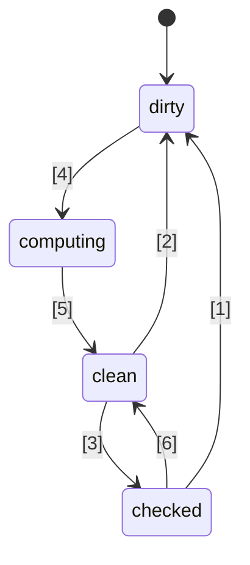
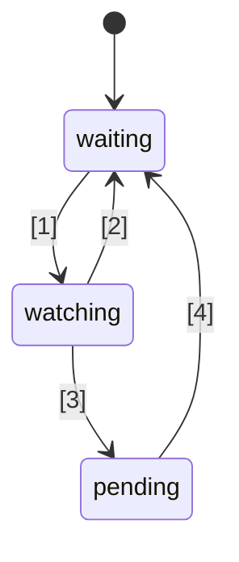

# 🚦 JavaScript Signals 標準提案 🚦


ステージ 1（[説明](https://tc39.es/process-document/)）

TC39 提案チャンピオン: Daniel Ehrenberg, Yehuda Katz, Jatin Ramanathan, Shay Lewis, Kristen Hewell Garrett, Dominic Gannaway, Preston Sego, Milo M, Rob Eisenberg

オリジナル著者: Rob Eisenberg と Daniel Ehrenberg

このドキュメントは、JavaScript におけるシグナルの初期の共通方向性を記述しています。これは、ES2015 で TC39 によって標準化された Promise に先立つ Promises/A+ の取り組みに似ています。[ポリフィル](https://github.com/proposal-signals/signal-polyfill) を使って、ご自身で試すこともできます。

Promises/A+ と同様に、この取り組みは JavaScript エコシステムの整合性に重点を置いています。この整合性が成功すれば、その経験に基づいて標準が生まれる可能性があります。複数のフレームワーク作者が、リアクティビティコアの基盤となる共通モデルにここで協力しています。現在のドラフトは、[Angular](https://angular.io/)、[Bubble](https://bubble.io/)、[Ember](https://emberjs.com/)、[FAST](https://www.fast.design/)、[MobX](https://mobx.js.org/)、[Preact](https://preactjs.com/)、[Qwik](https://qwik.dev/)、[RxJS](https://rxjs.dev/)、[Solid](https://www.solidjs.com/)、[Starbeam](https://www.starbeamjs.com/)、[Svelte](https://svelte.dev/)、[Vue](https://vuejs.org/)、[Wiz](https://blog.angular.io/angular-and-wiz-are-better-together-91e633d8cd5a) などの作者/メンテナからの設計入力に基づいています。

Promises/A+ と異なり、共通の開発者向け API を解決することは目的ではなく、シグナルグラフの根底にある正確なコアセマンティクスを扱うことが目的です。この提案には完全な具体的 API も含まれますが、その API はほとんどのアプリケーション開発者を対象としていません。代わりに、ここでのシグナル API はフレームワークが上に構築するのに適しており、共通のシグナルグラフと自動トラッキング機構を通じて相互運用性を提供します。

この提案の計画は、ステージ 1 を超えて進む前に、いくつかのフレームワークへの統合も含めて、初期の重要なプロトタイピングを行うことです。私たちは、複数のフレームワークで実際に利用でき、フレームワーク提供のシグナルよりも実際に利点がある場合にのみ、Signals を標準化したいと考えています。十分な初期プロトタイピングによってこの情報が得られることを期待しています。詳細は下記の「ステータスと開発計画」を参照してください。

## 背景: なぜ Signals なのか？

複雑なユーザーインターフェイス（UI）を開発するには、JavaScript アプリケーション開発者は、アプリケーションのビュー層に状態を効率的に保存、計算、無効化、同期、プッシュする必要があります。UI では単純な値の管理にとどまらず、他の複雑な値や自身も計算された状態に依存した計算済み状態のレンダリングがよく必要です。Signals の目標は、こうしたアプリケーション状態管理の基盤を提供し、開発者がビジネスロジックに集中できるようにすることです。

シグナルのような仕組みは、UI 以外のコンテキストでも独立して有用であることが分かっており、特にビルドシステムで不要な再ビルドを回避するために役立っています。

Signals はリアクティブプログラミングにおいて、アプリケーションの更新管理の必要性をなくすために使用されます。

> 状態の変化に基づく更新のための宣言的なプログラミングモデル。

_［What is Reactivity?](https://www.pzuraq.com/blog/what-is-reactivity)_ より。

#### 例 - VanillaJS カウンター

変数 `counter` があり、その値が偶数か奇数かを DOM に表示したいとします。`counter` が変更されるたびに、最新のパリティで DOM を更新したい。Vanilla JS では、次のようになります。

```js
let counter = 0;
const setCounter = (value) => {
  counter = value;
  render();
};

const isEven = () => (counter & 1) == 0;
const parity = () => isEven() ? "even" : "odd";
const render = () => element.innerText = parity();

// 外部からの counter 更新をシミュレート…
setInterval(() => setCounter(counter + 1), 1000);
```
> [!NOTE]  
> ここでは説明のためにグローバル変数を使用しています。適切な状態管理には多くの方法があり、この提案の例はできるだけ最小限になるようにしています。この提案はグローバル変数を推奨するものではありません。

このコードにはいくつかの問題があります…

* `counter` の設定がノイズが多く、ボイラープレートが多い。
* `counter` 状態がレンダリングシステムと密結合している。
* `counter` が変化しても `parity` が変化しない場合（例: counter が 2 から 4 になる）、不要なパリティ計算や不要なレンダリングが発生する。
* UI の他の部分が `counter` の更新時だけレンダリングしたい場合はどうするか？
* UI の他の部分が `isEven` や `parity` のみを依存している場合はどうするか？

この比較的単純なシナリオでも、すぐに多くの問題が発生します。これを回避するために、`counter` に pub/sub を導入することが考えられます。これにより、`counter` の追加の利用者が状態変更への独自のリアクションを追加できるようになります。

しかし、それでも次のような問題が残ります。

* `parity` にしか依存していないレンダリング関数が、実際には `counter` にサブスクライブしなければならないことを「知っている」必要がある。
* `counter` に直接関与せずに、`isEven` や `parity` のみで UI を更新することができない。
* ボイラープレートが増えた。何かを使うたびに、関数を呼ぶか変数を読むだけでなく、サブスクライブしてそこで更新処理をしなければならない。購読解除の管理も特に複雑。

今度は、`counter` だけでなく `isEven` や `parity` にも pub/sub を追加すればいくつかの問題は解決できます。しかしその場合、`isEven` を `counter` に、`parity` を `isEven` に、`render` を `parity` にサブスクライブさせなければなりません。残念ながら、これでボイラープレートコードが爆発的に増え、サブスクリプションの管理が非常に煩雑になり、すべてを正しくクリーンアップしないとメモリリークの危険も生じます。つまり、いくつかの問題は解決したものの、新たなカテゴリの問題と大量のコードが発生します。さらに悪いことに、このプロセスをシステム内のすべての状態で繰り返さなければなりません。

### Signals の導入

モデルとビューのデータバインディング抽象化は、複数のプログラミング言語にわたる UI フレームワークの中核となってきましたが、JS やウェブプラットフォームにはそのような仕組みが組み込まれていません。JS フレームワークやライブラリの中では、このバインディングの表現方法について多くの実験が行われてきており、一次データ型として状態や他のデータから導出される計算値を表現する「Signals」と呼ばれるものと一方向データフローの組み合わせの強力さが示されてきました。
この一次リアクティブ値アプローチは、[Knockout](https://knockoutjs.com/) が [2010年に](https://blog.stevensanderson.com/2010/07/05/introducing-knockout-a-ui-library-for-javascript/) オープンソースの JavaScript ウェブフレームワークで初めて広く登場したようです。それ以来、多くのバリエーションや実装が生まれています。ここ数年で、Signal プリミティブや関連するアプローチがさらに注目を集め、ほぼすべてのモダンな JavaScript ライブラリやフレームワークが何らかの形でこれに似たものを持つようになりました。

Signals を理解するために、前述の例を下記でさらに詳しく述べる Signal API で再構成してみましょう。

#### 例 - Signals カウンター

```js
const counter = new Signal.State(0);
const isEven = new Signal.Computed(() => (counter.get() & 1) == 0);
const parity = new Signal.Computed(() => isEven.get() ? "even" : "odd");

// ライブラリやフレームワークが、他の Signal プリミティブに基づく副作用を定義
declare function effect(cb: () => void): (() => void);

effect(() => element.innerText = parity.get());

// 外部からの counter 更新をシミュレート…
setInterval(() => counter.set(counter.get() + 1), 1000);
```

すぐに分かることがいくつかあります:
* 前の例での `counter` 変数に関するノイズの多いボイラープレートがなくなった。
* 値、計算、そして副作用を扱うための統一 API がある。
* `counter` と `render` 間の循環参照や逆依存関係の問題がない。
* 手動のサブスクリプションや管理が不要。
* 副作用のタイミングやスケジューリングを制御する手段がある。

Signals は、API の表面から見える以上の多くの利点を私たちにもたらします。
* **自動依存関係トラッキング** - 計算されたシグナルは、自動的に自分が依存している他のシグナル（それが単純な値であれ、他の計算であれ）を発見します。
* **遅延評価** - 計算は宣言時に積極的に評価されることはなく、依存関係が変化したときにもすぐに評価されることはありません。値が明示的に要求されたときにのみ評価されます。
* **メモ化** - 計算されたシグナルは前回の値をキャッシュするため、依存関係に変更がなければ、何度アクセスされても再評価する必要がありません。

## シグナル標準化の動機

#### 相互運用性

各シグナル実装は、計算されたシグナルを評価する際に遭遇したソースを追跡する独自の自動トラッキングメカニズムを持っています。これにより、異なるフレームワーク間でモデル、コンポーネント、ライブラリを共有することが難しくなります——シグナルは通常JSフレームワークの一部として実装されるため、ビューエンジンに偽の結びつきが生じがちです。

この提案の目標の一つは、リアクティブモデルをレンダリングビューから完全に切り離し、開発者が非UIコードを書き直すことなく新しいレンダリング技術へ移行できるようにし、また異なるコンテキストで展開できる共有リアクティブモデルをJSで開発できるようにすることです。残念ながら、バージョニングや重複の問題により、JSレベルのライブラリによる強力な共有は非現実的であることが判明しており、組み込みの仕組みの方がより強力な共有保証を提供します。

#### パフォーマンス／メモリ使用量

一般的に使用されるライブラリが組み込まれていることで、コード量が減り、わずかなパフォーマンス向上が見込まれますが、シグナルの実装自体は比較的小さいため、この効果は大きくないと予想されます。

シグナル関連のデータ構造やアルゴリズムのネイティブC++実装は、JSで実現可能なものよりも定数倍だけ効率的になる可能性があると考えています。ただし、ポリフィルで存在するものと比べてアルゴリズムの変更は想定されていません。エンジンが魔法のように高速になるわけではなく、リアクティブアルゴリズム自体は明確かつ一義的に定義されます。

チャンピオングループはさまざまなシグナル実装を開発し、これらのパフォーマンスの可能性を調査する予定です。

#### DevTools

既存のJS言語のシグナルライブラリでは、次のようなことをトレースするのが難しい場合があります。
* 計算されたシグナルのチェーンを跨ぐコールスタック（エラーの因果チェーンの表示）
* シグナル間の参照グラフ（あるシグナルが別のシグナルに依存しているとき）——メモリ使用量のデバッグ時に重要

組み込みのシグナルにより、JSランタイムおよびDevToolsはシグナルの検査に対して改善されたサポートを持つ可能性があります。特にデバッグやパフォーマンス解析のために、これはブラウザに組み込まれるか、共有拡張機能を通じて実現できます。既存の要素インスペクタ、パフォーマンススナップショット、メモリプロファイラなどのツールも、シグナルを特に強調して情報を提示できるように更新できます。

#### 二次的な利点

##### 標準ライブラリの利点

一般にJavaScriptの標準ライブラリは最小限でしたが、TC39では高品質な組み込み機能セットを備えた「バッテリー同梱」言語への流れが強まっています。たとえば、Temporalはmoment.jsを置き換えつつあり、`Array.prototype.flat`や`Object.groupBy`のような小さな機能も多くのlodashの用途を置き換えています。これらの利点には、バンドルサイズの縮小、安定性と品質の向上、新規プロジェクト参加時の学習負荷の軽減、JS開発者間での共通語彙の形成などがあります。

##### HTML/DOMとの統合（将来的な可能性）

現在、W3Cやブラウザ実装者によるネイティブテンプレートのHTMLへの導入（[DOM Parts][wicg-pr-1023] および [Template Instantiation][wicg-propsal-template-instantiation]）が進められています。さらに、W3C Web Components CGは、Web Componentsを拡張して完全に宣言的なHTML APIを提供する可能性を模索しています。これらの目標を達成するには、最終的にHTMLにリアクティブなプリミティブが必要となります。また、シグナルとの統合によるDOMの多くの使い勝手の向上も想像でき、コミュニティから要望も寄せられています。

[wicg-pr-1023]: https://github.com/WICG/webcomponents/pull/1023
[wicg-propsal-template-instantiation]: https://github.com/WICG/webcomponents/blob/gh-pages/proposals/Template-Instantiation.md

> 注意：この統合は別の取り組みとして後から進められるものであり、本提案自体には含まれません。

##### エコシステムの情報交換（*これ自体は標準化の理由ではない*）

標準化の取り組みは、ブラウザの変更を伴わずとも「コミュニティ」レベルで役立つ場合があります。シグナルの取り組みは、多様なフレームワーク作者を集め、リアクティビティの本質・アルゴリズム・相互運用性について深い議論を促しています。これはすでに有用ですが、JSエンジンやブラウザへの組み込みを正当化するものではありません。シグナルはエコシステムの情報交換を超えた*大きな利点*がある場合にのみ、JavaScript標準に追加されるべきです。

## シグナルの設計目標

既存のシグナルライブラリは、その本質的な部分ではそれほど大きな違いはありません。本提案は、それら多くのライブラリの重要な特性を実装することで、成功例を活かすことを目指しています。

### コア機能

* 状態を表すシグナル型、つまり書き込み可能なシグナル。他から読み取ることができる値です。
* 他のシグナルに依存し、遅延的に計算・キャッシュされる計算/メモ/派生シグナル型。
    * 計算は遅延的であり、計算シグナルはデフォルトで依存先が変わったときに再計算されるのではなく、実際に誰かが読み取ったときのみ実行されます。
    * 計算は「[グリッチ](https://ja.wikipedia.org/wiki/リアクティブプログラミング#グリッチ) フリー」であり、不要な計算は一切行われません。つまり、アプリケーションが計算シグナルを読む際、グラフの「汚れた」部分が重複しないようトポロジカルソートされます。
    * 計算はキャッシュされます。つまり、前回依存関係が変更されて以降、何も依存先が変わっていなければ、計算シグナルはアクセスされても再計算されません。
    * 計算シグナルや状態シグナルのためにカスタム比較も可能であり、それに依存する更なる計算シグナルがいつ更新されるべきかを判定できます。
* 計算シグナルの依存先（またはネストした依存先）が「汚れる」ことで、そのシグナルの値が古くなっているかもしれないという条件に反応する仕組み。
    * この反応は、より大きな作業を後でスケジューリングするためのものです。
    * エフェクトはこれらの反応と、フレームワークレベルのスケジューリングによって実装されます。
    * 計算シグナルは、自分がこれらの反応の（ネストした）依存として登録されているかどうかに反応できる必要があります。
* JSフレームワークが独自のスケジューリングをできるようにする。Promiseスタイルの組み込みスケジューリングは強制しません。
    * 後の作業をフレームワークロジックに基づいてスケジューリングできるよう、同期的な反応が必要です。
    * 書き込みは同期的に即座に反映されます（フレームワークが書き込みをバッチ処理したい場合は、その上に構築できます）。
    * エフェクトが「汚れている」かどうかの判定と、実際にエフェクトを実行する処理を分離可能（2段階のエフェクトスケジューラを実現可能）。
* 依存関係の記録をトリガーせずにシグナルを読む（`untrack`）ことが可能
* シグナル／リアクティビティを使う異なるコードベースの合成を可能にする。例：
    * トラッキング／リアクティビティ自体に関して、複数のフレームワークを一緒に使う（ただし下記の制限あり）
    * フレームワーク非依存のリアクティブデータ構造（例：再帰的なリアクティブストアプロキシ、リアクティブなMap・Set・Arrayなど）

### 完全性（Soundness）

* 同期反応の素朴な誤用を抑制／禁止する。
    * 完全性リスク：不適切に使用すると「[グリッチ](https://ja.wikipedia.org/wiki/リアクティブプログラミング#グリッチ)」を露呈させる可能性があります。シグナルが設定された際に即座にレンダリングが行われると、ユーザーに不完全なアプリケーション状態が見えてしまうことがあります。したがって、この機能はアプリケーションロジックが完了した後に作業を賢くスケジューリングする場合のみ使用すべきです。
    * 解決策：同期反応コールバック内でシグナルの読み書きを禁止する
* `untrack` の使用を抑制し、その不完全性を明示する
    * 完全性リスク：他のシグナルに依存するが、その変化で更新されない計算シグナルを作れてしまう。アン・トラックされたアクセスが計算結果に影響しない場合のみ使用すべきです。
    * 解決策：API名に「unsafe」を含め、不安全であることを明示する。
* 注意：この提案は、計算シグナルやエフェクトシグナルからシグナルの読み書きの両方を許可します。読み取り後の書き込みも制限しません（完全性リスクはありますが）。これは、フレームワークとの統合における柔軟性と互換性を保つための決定です。

### 表面API

* 複数のフレームワークがシグナル／リアクティビティの仕組みを実装するための堅実なベースであること
    * 再帰的なストアプロキシ、デコレータベースのクラスフィールドリアクティビティ、`.value`や`[state, setState]`スタイルのAPIのベースとして適しているべきです。
    * セマンティクスは、異なるフレームワークで有効なパターンを表現可能であるべきです。たとえば、即時反映される書き込みや、後からバッチ適用される書き込みのいずれにも基盤となるべきです。
* 可能ならJS開発者が直接使えるAPIであることが望ましい。
    * 機能がエコシステムの概念と一致する場合は、共通語彙を使うのが良い。
        * ただし、全く同じ名前を直訳的に使うのは避けるべきです！
    * 「JS開発者が使いやすいこと」と「フレームワーク向けの全フック提供」のバランス
        * アイデア：全フックを提供し、誤用時には可能な範囲でエラーを出す。
        * アイデア：[`crypto.subtle`](https://developer.mozilla.org/ja/docs/Web/API/Crypto/subtle)のように、微妙なAPIは`subtle`名前空間に入れ、フレームワークやDevツールのための上級用途と、一般的なアプリケーション開発用途との線引きを明示する。
* 良好なパフォーマンスで実装・利用可能であること——表面APIが過度なオーバーヘッドを生まない
    * サブクラス化を可能にし、フレームワークが独自のメソッドやフィールド（プライベートフィールド含む）を追加できるようにする。これにより、フレームワークレベルでの追加のアロケーションを避けることができます。詳細は「メモリ管理」参照。

### メモリ管理

* 可能であれば、計算シグナルは将来読み取られる可能性があるものとして参照されていなければ、より大きなグラフにリンクされていても（例えば、ライブな状態を読み取っている場合でも）ガベージコレクト可能であるべきです。
* 現在のほとんどのフレームワークでは、他の Signal グラフと相互に参照を持つ計算 Signal が生き続ける場合、明示的な破棄が必要であることに注意してください。
* これらのライフタイムが UI コンポーネントのライフタイムに結び付いている場合や、いずれにせよ副作用の破棄が必要な場合、それほど悪くはありません。
* もしこのセマンティクスでの実行コストが高すぎる場合は、下記 API（現状では未対応）に計算 Signal の明示的な破棄（または「unlink」）を追加すべきです。
* 関連する別の目標：アロケーション回数の最小化、例：
    * 書き込み可能な Signal の作成時（2つの独立したクロージャ＋配列を避ける）
    * 副作用の実装時（すべてのリアクションごとのクロージャを避ける）
    * Signal 変更監視 API で追加の一時データ構造の生成を避ける
    * 解決策：サブクラスで定義されたメソッドやフィールドの再利用を可能にするクラスベース API

## API スケッチ

Signal API の初期案を以下に示します。これはあくまで初期ドラフトであり、今後変更が加わることが予想されます。全体像を把握するために、まず `.d.ts` の全体を掲載し、その後詳細について説明します。

```ts
interface Signal<T> {
    // Signal の値を取得
    get(): T;
}

namespace Signal {
    // 読み書き可能な Signal
    class State<T> implements Signal<T> {
        // 値 t で State Signal を生成
        constructor(t: T, options?: SignalOptions<T>);

        // Signal の値を取得
        get(): T;

        // State Signal の値を t に設定
        set(t: T): void;
    }

    // 他の Signal を元にした式となる Signal
    class Computed<T = unknown> implements Signal<T> {
        // コールバックが返す値を評価する Signal を生成
        // コールバックは this signal を this 値として呼び出される
        constructor(cb: (this: Computed<T>) => T, options?: SignalOptions<T>);

        // Signal の値を取得
        get(): T;
    }

    // この namespace には、アプリケーション開発者よりもフレームワーク作者向けの
    // 「高度な」機能が含まれています。
    // `crypto.subtle` と類似
    namespace subtle {
        // すべてのトラッキングを無効化してコールバックを実行
        function untrack<T>(cb: () => T): T;

        // Signal の読み取りをトラッキングしている現在の計算 Signal を取得（なければ null）
        function currentComputed(): Computed | null;

        // 指定した Signal が前回評価時に参照した Signal の順序付きリストを返す
        // Watcher の場合、監視している Signal の集合を返す
        function introspectSources(s: Computed | Watcher): (State | Computed)[];

        // 指定した Signal を含む Watcher および、
        // 前回評価時にこの Signal を読み取った Computed（その Computed が（再帰的に）監視されている場合）を返す
        function introspectSinks(s: State | Computed): (Computed | Watcher)[];

        // この Signal が Watcher に監視されている、または（再帰的に）ライブな Computed Signal に読まれている場合 true
        function hasSinks(s: State | Computed): boolean;

        // この要素が他の Signal に依存していれば true。hasSources が false の Computed は常に同じ定数を返す
        function hasSources(s: Computed | Watcher): boolean;

        class Watcher {
            // Watcher の（再帰的な）ソースが書き換えられたときにこのコールバックを呼び出す
            // 前回の `watch` 呼び出し以降すでに呼び出されていなければ実行
            // notify 中は Signal の読み書き不可
            constructor(notify: (this: Watcher) => void);

            // Watcher の監視セットにこれらの Signal を追加し、任意の Signal（またはその依存関係）が変化した次回に
            // notify コールバックを実行するように設定
            // 引数なしで呼ぶことで「通知済み」状態をリセットし、再度 notify コールバックが呼ばれるようにできる
            watch(...s: Signal[]): void;

            // 監視セットからこれらの Signal を削除（例：dispose された副作用用）
            unwatch(...s: Signal[]): void;

            // 監視セットのうち、まだ dirty なソース、または dirty/pending で未再評価のソースを持つ Computed Signal の集合を返す
            getPending(): Signal[];
        }

        // 監視開始・監視終了時に呼ばれるフック
        var watched: Symbol;
        var unwatched: Symbol;
    }

    interface SignalOptions<T> {
        // 古い値・新しい値の比較用カスタム関数。デフォルトは Object.is。
        // this 値として Signal が渡される
        equals?: (this: Signal<T>, t: T, t2: T) => boolean;
```
```ts
// isWatchedが以前falseだった場合にtrueになると呼び出されるコールバック
[Signal.subtle.watched]?: (this: Signal<T>) => void;

// isWatchedが以前trueだった場合にfalseになるたびに呼び出されるコールバック
[Signal.subtle.unwatched]?: (this: Signal<T>) => void;
}
}
```

### シグナルの仕組み

シグナルは、時間とともに変化する可能性があるデータのセルを表します。シグナルには「状態」（手動で設定される単なる値）と「計算」（他のシグナルに基づく式）の2種類があります。

計算シグナルは、その評価中に読み取られた他のシグナルを自動的に追跡することで動作します。計算シグナルが読み取られると、以前に記録した依存関係のいずれかが変更されていないかをチェックし、変更されていれば再評価します。複数の計算シグナルがネストされている場合、追跡の帰属は最も内側のものに行われます。

計算シグナルは遅延評価、すなわちプルベースで動作します。依存関係のいずれかが以前に変更されていても、アクセスされたときにのみ再評価されます。

計算シグナルに渡すコールバックは、アクセスする他のシグナルの決定論的で副作用のない関数（「純粋関数」）であるべきです。同時に、コールバックが呼び出されるタイミングは決定的であるため、副作用も注意して使用できます。

シグナルは強力なキャッシュ／メモ化機能を備えています。状態シグナルも計算シグナルも現在の値を記憶し、参照している計算シグナルが実際に変更された場合にのみ再計算をトリガーします。古い値と新しい値の比較を繰り返す必要すらありません。比較はソースのシグナルがリセット／再評価されたときに1度だけ行われ、シグナル機構が、そのシグナルを参照しているがまだ新しい値で更新されていないものを追跡します。内部的には、これは一般的に（Miloのブログ記事で説明されているような）「グラフ彩色」によって表現されます。

計算シグナルは依存関係を動的に追跡します。実行されるたびに異なるものに依存する可能性があり、その正確な依存関係セットがシグナルグラフ内で最新の状態に保たれます。したがって、ある分岐でのみ必要な依存関係があり、以前の計算で別の分岐を通っていた場合、一時的に未使用だった値が変更されても、その計算シグナルは再計算されません（プルされた場合でも）。

JavaScriptのPromiseとは異なり、シグナル内のすべては同期的に動作します。
- シグナルに新しい値を設定するのは同期的であり、その後それに依存する計算シグナルを読み取った際にも即座に反映されます。このミューテーションのバッチ処理は組み込まれていません。
- 計算シグナルの読み取りも同期的です—常に値が取得できます。
- 下記で説明するWatcherの`notify`コールバックは、トリガーされた`.set()`呼び出し中（ただしグラフ彩色が完了した後）に同期的に実行されます。

Promiseと同様に、シグナルはエラー状態を表すこともできます。計算シグナルのコールバックが例外をスローした場合、そのエラーは他の値と同様にキャッシュされ、シグナルが読み取られるたびに再スローされます。

### Signalクラスの理解

`Signal`インスタンスは、時間とともに更新が追跡される動的な値を読み取る能力を表します。また、他の計算シグナルからの追跡付きアクセスによって暗黙的にシグナルを購読する能力も含まれます。

ここでのAPIは、「signal」「computed」「state」といった名称の使用に関して、シグナルライブラリの多くの間で大まかに合意されているエコシステムの流れに合わせています。ただし、計算シグナルと状態シグナルへのアクセスは`.get()`メソッドを通して行います。これは、`.value`スタイルのアクセッサや`signal()`呼び出し構文を用いる一般的なシグナルAPIとは異なります。

このAPIは割り当て回数を減らすように設計されており、既存のフレームワーク専用シグナルと同等かそれ以上のパフォーマンスで、シグナルをJavaScriptフレームワークに組み込むのに適しています。これには以下の意味があります。
- 状態シグナルは単一の書き込み可能なオブジェクトであり、同じ参照からアクセスと設定の両方が可能です（「能力分離」セクション参照）。
- 状態シグナルと計算シグナルの両方はサブクラス化可能であり、フレームワークがpublic/privateクラスフィールド（およびその状態を利用するメソッド）を通じて追加プロパティを持たせることができます。
- 各種コールバック（`equals`や計算用コールバックなど）は、`this`値として該当シグナルを受け取ります。これにより、シグナルごとに新しいクロージャを作成する必要がなくなります。代わりに、コンテキストはシグナル自身の追加プロパティに保存できます。

このAPIで強制されるいくつかのエラー条件：
- 計算シグナルを再帰的に読み取るのはエラーです。
- Watcherの`notify`コールバックでは、いかなるシグナルの読み書きもできません。
- 計算シグナルのコールバックが例外をスローした場合、その後のシグナルへのアクセスでは依存関係が変化し再計算されるまで、そのキャッシュされたエラーを再スローします。

*強制されない*条件：
- 計算シグナルは、コールバック内で他のシグナルに同期的に書き込むことができます。
- Watcherの`notify`コールバックでキューされた作業はシグナルの読み書きが可能であり、[古典的なReactアンチパターン](https://react.dev/learn/you-might-not-need-an-effect)をシグナルで再現することもできます！

### エフェクトの実装

上記で定義した`Watcher`インターフェースは、他のシグナルが変化したときに副作用のためだけにコールバックを再実行する、典型的なJS API（エフェクト）を実装する基盤となります。冒頭の例で使用した`effect`関数は次のように定義できます。

```ts
// この関数は通常、アプリケーションコードではなくライブラリ／フレームワーク内に存在します
// 注意：このスケジューリングロジックは単純すぎて実用的ではありません。コピペしないでください。
let pending = false;

let w = new Signal.subtle.Watcher(() => {
    if (!pending) {
        pending = true;
        queueMicrotask(() => {
            pending = false;
            for (let s of w.getPending()) s.get();
            w.watch();
        });
    }
});

// 任意の依存関係が変わるたびに自身の読み取りをマイクロタスクキューにスケジュールする、cbを評価するエフェクトシグナル
export function effect(cb) {
    let destructor;
    let c = new Signal.Computed(() => { destructor?.(); destructor = cb(); });
    w.watch(c);
    c.get();
    return () => { destructor?.(); w.unwatch(c) };
}
```

Signal APIには、`effect`のような組み込み関数は存在しません。これは、エフェクトのスケジューリングが微妙であり、多くの場合フレームワークのレンダリングサイクルやその他の高レベルなフレームワーク固有の状態や戦略と結びつくことが多く、JSからは直接アクセスできないからです。

ここで使われているさまざまな操作について説明します。`Watcher`コンストラクタに渡される`notify`コールバックは、シグナルが「クリーン」状態（キャッシュが初期化済みで有効であることが分かっている）から「チェック済み」または「ダーティ」状態（その依存状態のうち少なくとも1つが変更されたためキャッシュが有効かもしれないし無効かもしれない）に遷移したときに呼ばれる関数です。

`notify`の呼び出しは、最終的にはある状態シグナルの`.set()`呼び出しによってトリガーされます。この呼び出しは同期的であり、`.set`の戻り値より前に発生します。しかし、このコールバックがシグナルグラフの処理途中の状態を見ることを心配する必要はありません。なぜなら`notify`コールバック中は、`untrack`呼び出し内ですら、どのシグナルも読み書きできないからです。`notify`は`.set()`中に呼び出されるため、未完了の他のロジックの途中で割り込むことになります。`notify`からシグナルを読み書きする必要がある場合は、リストに書き込んで後でアクセスする、もしくは上記のように`queueMicrotask`で後回しにするなど、作業を後で実行するようスケジューリングしてください。

なお、`Signal.subtle.Watcher`を使用せず、計算シグナルのポーリングをスケジューリングする（Glimmerのような）手法でも、シグナルを効果的に活用することは十分可能です。しかし多くのフレームワークは、このスケジューリングロジックを同期的に実行するのが非常に有用であると考えています。そのため、シグナルAPIにはこれが含まれています。

計算シグナルも状態シグナルも、他のJS値と同様にガベージコレクションされます。ただし、Watcherは特別な方法で参照を維持します。Watcherによって監視されているシグナルは、基になる状態がどれか1つでも到達可能な限り保持されます。これらは将来`notify`コールをトリガーし（そしてその後`.get()`を呼ぶ）可能性があるためです。このため、効果のクリーンアップ時には必ず`Watcher.prototype.unwatch`を呼ぶようにしてください。

### 型安全でないエスケープハッチ

`Signal.subtle.untrack`は、読み取りを追跡せずにシグナルを読むためのエスケープハッチです。この機能は、他のシグナルに依存するが、それらが変化しても更新されない計算シグナルを作成できてしまうため、安全ではありません。アン・トラックされたアクセスが計算結果に影響しない場合にのみ使用してください。

<!--
TODO: untrackを使うのが適切な例を示す

### watched/unwatchedの利用
TODO: Observableを、エフェクトによって使用されている場合のみ購読されるcomputed signalに変換する例を示す

TODO: 状態に向けて行われたfetchの結果を表すcomputed signalの例を示す（キャンセルされる場合）

### SSRのためのイントロスペクション

TODO: シグナルグラフのシリアライズがどのように機能するかを示す

TODO: いくつかのシグナルを使って、後から状態からcomputedに「ハイドレート」する方法を示す
-->

### 今回は省略

これらの機能は将来的に追加される可能性がありますが、現行のドラフトには含まれていません。省略の理由は、フレームワーク間で設計空間におけるコンセンサスが確立されていないことと、本ドキュメントで説明されているSignalsの仕組みの上にメカニズムを重ねることで、それらの機能の欠如を回避できることが示されているためです。しかし残念ながら、省略によってフレームワーク間の相互運用性の可能性が制限されています。本ドキュメントで説明されているSignalsのプロトタイプが作成されるにつれ、これらの省略が適切な判断であったかどうかを再検討する取り組みがなされます。

* **Async**: このモデルにおけるSignalsは、常に同期的に評価可能です。しかし、特定の非同期プロセスによってsignalがセットされ、「ローディング中」である状態を認識することが有用な場合が多々あります。ローディング状態をモデル化する簡単な方法は例外を使うことです。また、computed signalの例外キャッシュ動作は、この手法とある程度合理的に組み合わせることができます。改良された手法については[Issue #30](https://github.com/proposal-signals/proposal-signals/issues/30)で議論されています。
* **Transactions**: ビュー間の遷移時には、「from」と「to」両方の状態をライブで保持することが有用な場合があります。「to」状態はバックグラウンドでレンダリングされ、準備ができたら切り替え（トランザクションのコミット）されますが、「from」状態は引き続きインタラクティブなままです。両方の状態を同時に保持するには、signalグラフの状態を「フォーク」する必要があり、複数の保留中の遷移を同時にサポートすることも有用かもしれません。詳細は[Issue #73](https://github.com/proposal-signals/proposal-signals/issues/73)で議論されています。

いくつかの[便利メソッド](https://github.com/proposal-signals/proposal-signals/issues/32)も省略されています。

## ステータスと開発計画

この提案は、2024年4月のTC39アジェンダでStage 1として提出されています。現時点では「Stage 0」と考えてよいでしょう。

この提案のための[ポリフィル](https://github.com/proposal-signals/signal-polyfill)が利用可能で、いくつかの基本的なテストが用意されています。いくつかのフレームワークの作者が、このsignal実装の置き換え実験を始めていますが、この利用はまだ初期段階です。

Signal提案のコラボレーターは、この提案を推進するにあたって特に**保守的**でありたいと考えています。これは、最終的に後悔し使われなくなるようなものが出荷される罠に陥らないためです。TC39プロセスで要求されていない以下の追加タスクを実施し、この提案が適切な軌道に乗っているかを確認する予定です。

Stage 2の提案前に以下を計画しています：
- 複数のプロダクショングレードのポリフィル実装を開発し、それらが堅牢で十分にテストされていること（例：各種フレームワークやtest262スタイルのテストをパス）、およびパフォーマンス面でも競争力があること（シグナル/フレームワークのベンチマークセットで検証）。
- 提案されているSignal APIを、ある程度代表的と考えられる多くのJSフレームワークに統合し、大規模なアプリケーションで動作することを確認。これらの文脈で効率的かつ正しく動作することをテスト。
- APIの拡張の可能性について確かな理解を持ち、どの（もしあれば）拡張がこの提案に追加されるべきか結論を得る。

## Signalアルゴリズム

このセクションでは、JavaScriptに公開される各APIについて、それらが実装するアルゴリズムの観点から説明します。これはプロト仕様と考えることができ、現時点では一つの意味論セットを確定するために記載されていますが、今後の変更にも柔軟に対応します。

アルゴリズムのいくつかの側面：
- computed内でのSignalの読み取り順序は重要であり、特定のコールバック（`Watcher`が呼ばれる順序、`equals`、`new Signal.Computed`の最初のパラメータ、`watched`/`unwatched`コールバック）の実行順序で観測可能です。つまり、computed Signalのソースは順序付きで保存する必要があります。
- これら4つのコールバックはすべて例外をスローする可能性があり、例外は呼び出し元のJSコードに予測可能な方法で伝播されます。これらの例外によってこのアルゴリズムの実行が中断されたり、グラフが処理途中の状態で残されたりすることは*ありません*。Watcherの`notify`コールバックでスローされたエラーについては、その例外はそれをトリガーした`.set()`呼び出しに送られます（複数の例外がスローされた場合はAggregateErrorを使用）。その他（`watched`/`unwatched`など）はSignalの値に保存され、読み取り時に再スローされます。このような再スローSignalも通常の値を持つもの同様に`~clean~`とマークできます。
- 「監視されていない」（Watcherによって観測されていない）computed signalの場合、循環参照を回避してsignalグラフの他の部分と独立してガーベジコレクト可能にするための配慮がなされています。内部的には、常に収集される世代番号のシステムで実装できます。最適化された実装では、ノードごとのローカル世代番号を含めることも、一部のwatched signalについて番号の追跡を省略することも可能です。

### 隠れたグローバル状態

Signalアルゴリズムは、特定のグローバル状態を参照する必要があります。この状態はスレッド、または「エージェント」全体でグローバルです。

- `computing`: 現在`.get`または`.run`呼び出しによって再評価されている最も内側のcomputedまたはeffect Signal、あるいは`null`。初期値は`null`。
- `frozen`: グラフの変更を許可しないコールバックが現在実行中かどうかを示すブール値。初期値は`false`。
- `generation`: 0から始まる増加整数で、循環参照を回避しつつ値の新しさを追跡するのに使われます。

### `Signal`名前空間

`Signal`は、Signal関連のクラスと関数の名前空間として機能する通常のオブジェクトです。

`Signal.subtle`も同様の内部名前空間オブジェクトです。

### `Signal.State`クラス

#### `Signal.State`の内部スロット

- `value`: state signalの現在値
- `equals`: 値変更時に使用する比較関数
- `watched`: signalがeffectによって観測され始めたときに呼ばれるコールバック
- `unwatched`: signalがeffectによって観測されなくなったときに呼ばれるコールバック
- `sinks`: このsignalに依存するwatchされたsignalの集合

#### コンストラクタ: `Signal.State(initialValue, options)`

1. このSignalの`value`を`initialValue`に設定する。
1. このSignalの`equals`をoptions?.equalsに設定する。
1. このSignalの`watched`をoptions?.[Signal.subtle.watched]に設定する。
1. このSignalの`unwatched`をoptions?.[Signal.subtle.unwatched]に設定する。
1. このSignalの`sinks`を空集合に設定する。

#### メソッド: `Signal.State.prototype.get()`

1. `frozen`がtrueなら、例外を投げる。
1. `computing`が`undefined`でなければ、このSignalを`computing`の`sources`セットに追加する。
1. 注: Watcherによって監視されるまで、`computing`をこのSignalの`sinks`セットに追加しない。
1. このSignalの`value`を返す。

#### メソッド: `Signal.State.prototype.set(newValue)`

1. 現在の実行コンテキストが`frozen`なら、例外を投げる。
1. このSignalと値の第1引数で「Signal値のセット」アルゴリズムを実行する。
1. そのアルゴリズムが`~clean~`を返した場合、undefinedを返す。
1. このSignalのすべての`sinks`の`state`を（もしComputed Signalなら）以前がcleanなら`~dirty~`に、（Watcherなら）以前が`~watching~`なら`~pending~`にセットする。
1. すべての`sinks`のComputed Signal依存先（再帰的に）の`state`を、以前が`~clean~`なら`~checked~`に（dirtyマーキングはそのまま）、Watcherについては以前が`~watching~`なら`~pending~`にセットする。
1. その再帰探索で遭遇した、以前`~watching~`だったWatcherごとに、深さ優先順で、
    1. `frozen`をtrueにセットする。
    1. それらの`notify`コールバックを呼び出す（スローされた例外は保存し、`notify`の戻り値は無視）。
    1. `frozen`をfalseに戻す。
    1. Watcherの`state`を`~waiting~`にセットする。
1. `notify`コールバックから例外がスローされた場合、すべての`notify`コールバック実行後に呼び出し元に伝播する。複数の例外がある場合は、AggregateErrorでまとめてスローする。
1. undefinedを返す。

### `Signal.Computed`クラス

#### `Signal.Computed`ステートマシン
`Computed Signal` の `state` は、以下のいずれかとなります。

- `~clean~`: Signal の値が存在し、古くなっていないことが確認されています。
- `~checked~`: この Signal の（間接的な）ソースが変更されました。この Signal には値がありますが、_古くなっているかもしれません_。古くなっているかどうかは、すべての直接的なソースが評価されたときにのみ判明します。
- `~computing~`: この Signal のコールバックが、`.get()` 呼び出しの副作用として現在実行中です。
- `~dirty~`: この Signal の値が古くなっていることが判明しているか、または一度も評価されていません。

遷移グラフは以下のとおりです。



遷移は以下のとおりです。
| 番号 | From | To | 条件 | アルゴリズム |
| ---- | ---- | -- | ---- | ------------ |
| 1 | `~checked~` | `~dirty~` | この Signal の直接的なソース（計算 Signal）が評価され、その値が変化した。 | アルゴリズム: dirty な計算 Signal の再計算 |
| 2 | `~clean~` | `~dirty~` | この Signal の直接的なソース（State）が、前の値と異なる値でセットされた。 | メソッド: `Signal.State.prototype.set(newValue)` |
| 3 | `~clean~` | `~checked~` | この Signal の再帰的だが直接的でないソース（State）が、前の値と異なる値でセットされた。 | メソッド: `Signal.State.prototype.set(newValue)` |
| 4 | `~dirty~` | `~computing~` | `callback` の実行直前。 | アルゴリズム: dirty な計算 Signal の再計算 |
| 5 | `~computing~` | `~clean~` | `callback` の評価が完了し、値が返されたか例外がスローされた。 | アルゴリズム: dirty な計算 Signal の再計算 |
| 6 | `~checked~` | `~clean~` | この Signal のすべての直接的なソースが評価され、すべて変更がないことが判明したので、古くなっていないことが確定した。 | アルゴリズム: dirty な計算 Signal の再計算 |

#### `Signal.Computed` 内部スロット

- `value`: Signal の以前のキャッシュ値。未読の計算 Signal の場合は `~uninitialized~`。値が例外である場合、その値を読むときに再スローされます。effect signals の場合は常に `undefined`。
- `state`: `~clean~`、`~checked~`、`~computing~`、`~dirty~` のいずれか。
- `sources`: この Signal が依存している Signal の順序付きセット。
- `sinks`: この Signal に依存している Signal の順序付きセット。
- `equals`: オプションで提供された equals メソッド。
- `callback`: 計算 Signal の値を取得するために呼ばれるコールバック。コンストラクタに渡された最初のパラメータ。

#### `Signal.Computed` コンストラクタ

コンストラクタは以下を設定します。
- `callback` を最初のパラメータに設定
- `equals` をオプションに基づき設定（指定がない場合は `Object.is` をデフォルト）
- `state` を `~dirty~` に設定
- `value` を `~uninitialized~` に設定

[AsyncContext](https://github.com/tc39/proposal-async-context) を用いると、`new Signal.Computed` に渡されたコールバックはコンストラクタ呼び出し時点のスナップショットをクロージャし、実行時にこのスナップショットを復元します。

#### メソッド: `Signal.Computed.prototype.get`

1. 現在の実行コンテキストが `frozen` である場合、またはこの Signal の状態が `~computing~` である場合、もしくはこの Signal が Watcher で計算 Signal を `computing` している場合、例外をスローします。
1. `computing` が `null` でない場合、この Signal を `computing` の `sources` セットに追加します。
1. 注: この Signal の `sinks` セットに `computing` を追加するのは、Watcher により監視されるようになった場合のみです。
1. この Signal の状態が `~dirty~` または `~checked~` である場合、次のステップをこの Signal が `~clean~` になるまで繰り返します:
    1. `sources` を再帰的にたどり、`~dirty~` にマークされた一番深く左端（最も早く観測された）の計算 Signal を見つけます（`~clean~` の計算 Signal で探索を打ち切り、この計算 Signal 自身を探索の最後に含めます）。
    1. その Signal に対し「dirty な計算 Signal の再計算」アルゴリズムを実行します。
1. この時点で、この Signal の状態は `~clean~` となり、再帰的なソースにも `~dirty~` や `~checked~` は存在しません。Signal の `value` を返します。値が例外の場合、その例外を再スローします。

### `Signal.subtle.Watcher` クラス

#### `Signal.subtle.Watcher` 状態マシン

Watcher の `state` は、以下のいずれかとなります。

- `~waiting~`: `notify` コールバックが実行されたか、Watcher が新規作成されたが、まだ積極的にシグナルを監視していない状態。
- `~watching~`: Watcher が積極的にシグナルを監視しているが、`notify` コールバックが必要となるような変化はまだ起きていない状態。
- `~pending~`: Watcher の依存先が変更されたが、まだ `notify` コールバックが実行されていない状態。

遷移グラフは以下のとおりです。



遷移は以下のとおりです。
| 番号 | From | To | 条件 | アルゴリズム |
| ---- | ---- | -- | ---- | ------------ |
| 1 | `~waiting~` | `~watching~` | Watcher の `watch` メソッドが呼び出された。 | メソッド: `Signal.subtle.Watcher.prototype.watch(...signals)` |
| 2 | `~watching~` | `~waiting~` | Watcher の `unwatch` メソッドが呼び出され、最後に監視していた signal が削除された。 | メソッド: `Signal.subtle.Watcher.prototype.unwatch(...signals)` |
| 3 | `~watching~` | `~pending~` | 監視している signal の値が変更された可能性がある。 | メソッド: `Signal.State.prototype.set(newValue)` |
| 4 | `~pending~` | `~waiting~` | `notify` コールバックが実行された。 | メソッド: `Signal.State.prototype.set(newValue)` |

#### `Signal.subtle.Watcher` 内部スロット

- `state`: `~watching~`、`~pending~`、`~waiting~` のいずれか
- `signals`: この Watcher が監視している Signal の順序付きセット
- `notifyCallback`: 何かが変化したときに呼び出されるコールバック。コンストラクタに渡された最初のパラメータに設定

#### コンストラクタ: `new Signal.subtle.Watcher(callback)`

1. `state` は `~waiting~` に設定されます。
1. `signals` を空のセットで初期化します。
1. `notifyCallback` はコールバックパラメータに設定されます。
[AsyncContext](https://github.com/tc39/proposal-async-context) を使用した場合、`new Signal.subtle.Watcher` に渡されたコールバックは、コンストラクタが呼ばれた時点でのスナップショットをクローズオーバー*しません*。そのため、書き込み時のコンテキスト情報が見えるようになります。

#### メソッド: `Signal.subtle.Watcher.prototype.watch(...signals)`

1. `frozen` が true の場合、例外を投げる。
1. 引数のいずれかがシグナルでない場合、例外を投げる。
1. すべての引数をこのオブジェクトの `signals` の末尾に追加する。
1. 新たに監視される各シグナルについて、左から右の順に、
    1. このウォッチャーをそのシグナルの `sink` として追加する。
    1. これが最初の sink だった場合、ソースまで再帰的にたどり、そのシグナルを sink として追加する。
    1. `frozen` を true に設定する。
    1. `watched` コールバックが存在する場合は呼び出す。
    1. `frozen` を false に戻す。
1. Signal の `state` が `~waiting~` の場合、`~watching~` に設定する。

#### メソッド: `Signal.subtle.Watcher.prototype.unwatch(...signals)`

1. `frozen` が true の場合、例外を投げる。
1. 引数のいずれかがシグナルでない場合、またはこのウォッチャーがそのシグナルを監視していない場合、例外を投げる。
1. 引数の各シグナルについて、左から右の順に、
    1. そのシグナルをこのウォッチャーの `signals` セットから削除する。
    1. このウォッチャーをそのシグナルの `sink` セットから削除する。
    1. そのシグナルの `sink` セットが空になった場合、そのシグナルを各ソースの sink から削除する。
    1. `frozen` を true に設定する。
    1. `unwatched` コールバックが存在する場合は呼び出す。
    1. `frozen` を false に戻す。
1. ウォッチャーが `signals` を持たず、かつ `state` が `~watching~` の場合、`~waiting~` に設定する。

#### メソッド: `Signal.subtle.Watcher.prototype.getPending()`

1. `signals` のうち、状態が `~dirty~` または `~pending~` の Computed Signal のみを含む配列を返す。

### メソッド: `Signal.subtle.untrack(cb)`

1. `c` を実行コンテキストの現在の `computing` 状態とする。
1. `computing` を null に設定する。
1. `cb` を呼び出す。
1. `cb` が例外を投げた場合でも `computing` を `c` に戻す。
1. `cb` の戻り値を返す（例外があれば再スローする）。

注: untrack は `frozen` 状態から抜け出すものではありません。`frozen` 状態は厳格に維持されます。

### メソッド: `Signal.subtle.currentComputed()`

1. 現在の `computing` の値を返す。

### 共通アルゴリズム

##### アルゴリズム: ダーティな Computed Signal の再計算

1. この Signal の `sources` セットをクリアし、それらのソースの `sinks` セットからこの Signal を削除する。
1. 以前の `computing` の値を保存し、`computing` をこの Signal に設定する。
1. この Signal の状態を `~computing~` に設定する。
1. この Computed Signal のコールバックを、this 値としてこの Signal を使って実行する。戻り値を保存し、コールバックが例外を投げた場合はそれを保存して再スロー用とする。
1. 以前の `computing` の値を復元する。
1. コールバックの戻り値に「Set Signal value アルゴリズム」を適用する。
2. この Signal の状態を `~clean~` に設定する。
1. そのアルゴリズムが `~dirty~` を返した場合：この Signal のすべての sink を `~dirty~` としてマークする（以前は sink が checked と dirty の混在だった可能性がある）。（または、これが監視されていなければ、新しい世代番号を採用してダーティ状態を示すなどの処理を行う。）
1. それ以外で、そのアルゴリズムが `~clean~` を返した場合：この場合、この Signal の各 `~checked~` sink について、その Signal のすべてのソースがクリーンなら、その Signal も `~clean~` としてマークする。このクリーンアップステップを、checked sink を持つ新たにクリーンになった Signal すべてに再帰的に適用する。（または、これが監視されていなければ、同様のことを何らかの方法で示し、クリーンアップを遅延的に進める。）

##### Set Signal value アルゴリズム

1. このアルゴリズムに値（recalculate dirty computed Signal アルゴリズムからの再スロー用例外ではなく）が渡された場合：
    1. この Signal の `equals` 関数を呼び出し、現在の `value`、新しい値、この Signal を引数として渡す。例外が投げられた場合、その例外を Signal の値として保存し（読み出し時に再スロー）、コールバックが false を返した場合と同様に続行する。
    1. その関数が true を返した場合、`~clean~` を返す。
1. この Signal の `value` を引数で渡された値に設定する。
1. `~dirty~` を返す。

## FAQ

**Q**: シグナルに関連するものを標準化するには時期尚早では？シグナルが注目され始めたのは 2022 年からですよね？もっと進化と安定を待つべきでは？

**A**: ウェブフレームワークにおけるシグナルの現状は、10年以上にわたる継続的な開発の成果です。近年のように投資が高まる中、ほぼすべてのウェブフレームワークが非常に似通ったコアモデルのシグナルへと収束しつつあります。この提案は、現行の多くのウェブフレームワークリーダーによる共同設計演習の成果であり、その分野の専門家グループによる検証なしに標準化に推し進めることはありません。

#### シグナルはどのように使われるのか？

**Q**: ビルトインのシグナルは、描画や所有権と密接に統合されているのに、フレームワークで本当に使えるの？

**A**: フレームワーク固有の部分は、エフェクト、スケジューリング、所有権・廃棄処理の領域に集中していますが、これらは本提案の対象外です。標準化プロトタイピングの第一の優先事項は、既存フレームワークの下層でシグナルが互換性と良好なパフォーマンスで動作するかどうかの検証です。

**Q**: Signal API はアプリケーション開発者が直接使うことを想定しているのですか？それともフレームワークがラップして使うものですか？

**A**: この API（特に `Signal.subtle` 名前空間以外）は、アプリケーション開発者が直接使うことも可能ですが、特に使いやすく設計されているわけではありません。むしろ、ライブラリ／フレームワーク作者のニーズを優先しています。ほとんどのフレームワークは、`Signal.State` や `Signal.Computed` のような基本 API でさえ、独自の使いやすさを表現したものとしてラップすることが期待されます。実際には、Signals はフレームワークを通じて利用するのが最も適しており、より複雑な機能（例：Watcher, `untrack`）、および所有権や廃棄処理（例：いつシグナルをウォッチャーに追加・削除すべきかの判断）、DOMへの描画スケジューリングなども管理されます。これらは本提案の範囲外です。

**Q**: ウィジェットが破棄されたときに、それに関連するシグナルも破棄しなければなりませんか？そのための API は何ですか？

**A**: ここで該当する破棄操作は `Signal.subtle.Watcher.prototype.unwatch` です。監視されているシグナルのみを unwatch してクリーンアップする必要があり、監視されていないシグナルは自動的にガベージコレクションされます。

**Q**: シグナルは VDOM や、直接 HTML DOM と連携できますか？

**A**: はい！シグナルは描画技術に依存しません。Signal 的な仕組みを採用している既存 JavaScript フレームワークは、VDOM（例：Preact）、ネイティブ DOM（例：Solid）、その組み合わせ（例：Vue）と統合しています。ビルトイン Signals でも同様のことが可能です。

**Q**: Angular や Lit のようなクラスベースのフレームワークでシグナルを使うのは使い勝手が悪くありませんか？Svelte のようなコンパイラベースのフレームワークでは？

**A**: クラスフィールドは、[Signal polyfill の readme](https://github.com/proposal-signals/signal-polyfill#combining-signals-and-decorators) に示されているように、シンプルなアクセサデコレータで Signal ベースにできます。Signals は Svelte 5 の Runes と非常に密接に一致しており、コンパイラが runes をここで定義された Signal API に変換することは容易です。実際、Svelte 5 も内部的に（独自の Signals ライブラリで）このようにしています。

**Q**: シグナルは SSR に対応していますか？ハイドレーションやレジューマビリティは？

**A**: はい。Qwik はこれらの性質の両方でシグナルをうまく活用していますし、他のフレームワークも異なるトレードオフでシグナルを使ったハイドレーションのアプローチを持っています。Qwik のレジューマブルシグナルは、State シグナルと Computed シグナルを連結してモデル化できると考えており、これをコードで実証する計画です。
**Q**: Signalsは、Reactのような一方向データフローと連携しますか？

**A**: はい。Signalsは一方向データフローのための仕組みです。SignalベースのUIフレームワークでは、ビューをモデル（モデルがSignalsを含む）の関数として表現できます。状態と計算済みSignalのグラフは構造上非循環（acyclic）です。また、Signals内でReactのアンチパターンを再現することも可能です（！）。例えば、`useEffect`内の`setState`のSignal版は、Watcherを使ってState Signalへの書き込みをスケジューリングすることです。

**Q**: SignalsはReduxのような状態管理システムとどのような関係にありますか？Signalsは無構造な状態を助長しますか？

**A**: Signalsはストアのような状態管理抽象の効率的な基盤となります。複数のフレームワークで見られる一般的なパターンは、内部的にプロパティをSignalとして表現するProxyベースのオブジェクトです。例としては [Vueの`reactive()`](https://vuejs.org/api/reactivity-core.html#reactive) や [Solid stores](https://docs.solidjs.com/concepts/stores) があります。これらのシステムは、アプリケーションごとに適切な抽象レベルで状態を柔軟にグループ化することを可能にします。

**Q**: Signalsが現在`Proxy`で扱えないものは何ですか？

**A**: ProxyとSignalsは相補的であり、非常に相性が良いです。Proxyはオブジェクトの浅い操作をインターセプトし、Signalsは依存グラフ（セルのグラフ）を調整します。Proxyの裏にSignalsを持たせることで、使いやすいネストされたリアクティブ構造を作ることができます。

この例では、Signalに`get`や`set`メソッドの代わりにゲッター・セッタープロパティを持たせるためにProxyを使っています：
```js
const a = new Signal.State(0);
const b = new Proxy(a, {
  get(target, property, receiver) {
    if (property === 'value') {
      return target.get():
    }
  }
  set(target, property, value, receiver) {
    if (property === 'value') {
      target.set(value)!
    }
  }
});

// 仮想的なリアクティブコンテキストでの使用例:
<template>
  {b.value}

  <button onclick={() => {
    b.value++;
  }}>change</button>
</template>
```
きめ細かいリアクティビティに最適化されたレンダラーを使う場合、ボタンをクリックすると`b.value`セルが更新されます。

参照：
- SignalsとProxyの両方で作成されたネストされたリアクティブ構造の例：[signal-utils](https://github.com/NullVoxPopuli/signal-utils/tree/main/src)
- リアクティブデータとプロキシ間の関係を示す過去の実装例：[tracked-built-ins](https://github.com/tracked-tools/tracked-built-ins/tree/master/addon/src/-private)
- [ディスカッション](https://github.com/proposal-signals/proposal-signals/issues/101#issuecomment-2029802574)。

#### Signalsはどのように動作しますか？

**Q**: Signalsはプッシュ型ですか、それともプル型ですか？

**A**: 計算済みSignalの評価はプル型です：計算済みSignalは`.get()`が呼ばれたときのみ評価され、基となる状態が以前に変化していても評価されません。同時に、State Signalを変更するとWatcherのコールバックが即座にトリガーされ、「プッシュ」通知が行われることもあります。したがって、Signalsは「プッシュ・プル」構造と考えることができます。

**Q**: SignalsはJavaScript実行に非決定性を導入しますか？

**A**: いいえ。すべてのSignal操作には明確なセマンティクスと順序があり、適合する実装間で異なることはありません。より高いレベルでは、Signalsはいくつかの不変条件に従っており、それに対して「健全」です。計算済みSignalは常にSignalグラフの一貫した状態を観測し、その実行は他のSignalを変更するコードによって中断されません（ただし自分自身が呼び出すものは除きます）。詳細は上記の説明を参照してください。

**Q**: State Signalに書き込んだとき、計算済みSignalの更新はいつスケジュールされますか？

**A**: スケジュールされません！計算済みSignalは、次に誰かがそれを読み込んだときに再計算されます。同時に、Watcherの`notify`コールバックが呼ばれることがあり、フレームワークは適切と判断したタイミングで読み込みをスケジュールできます。

**Q**: State Signalへの書き込みは、即時反映されますか？それともバッチ処理されますか？

**A**: State Signalへの書き込みは即時に反映されます——State Signalに依存する計算済みSignalが次に読み込まれたとき、必要に応じて即座に再計算されます（たとえ直後のコード行であっても）。ただし、この仕組みの遅延性（計算済みSignalは読み込み時のみ計算される）により、実際には計算がバッチ的に行われる場合もあります。

**Q**: Signalsが「グリッチフリー」な実行を可能にするとはどういう意味ですか？

**A**: 以前のプッシュ型リアクティビティモデルでは、冗長な計算という問題がありました。State Signalの更新が計算済みSignalを即座に実行させると、最終的にUIに更新がプッシュされることがあります。しかし、もし次のフレームまでに元のState Signalに別の変更が加わる場合、そのUIへの書き込みは時期尚早となります。時には、このような[グリッチ](https://en.wikipedia.org/wiki/Reactive_programming#Glitches)により不正確な中間値がユーザーに表示されることもありました。Signalsはプル型であることでこの動作を回避します：フレームワークがUIのレンダリングをスケジュールする時点で適切な更新をプルし、計算やDOMへの書き込みの無駄な作業を避けます。

**Q**: Signalsが「ロスイー（lossy）」であるとはどういう意味ですか？

**A**: これはグリッチフリー実行の裏返しです。Signalsはデータセル——すなわち直近の現在値のみ（変化する可能性あり）を表現し、時系列のデータストリームを表現しません。したがって、何もせずにState Signalに2回連続で書き込むと、最初の書き込みは「失われ」、計算済みSignalやエフェクトには決して見られません。これはバグではなく機能だと理解されています。ストリームには他の構造（例えばasync iterableやobservable）のほうが適しています。

**Q**: ネイティブSignalsは既存のJS Signal実装より高速になりますか？

**A**: そうなることを期待しています（小さな定数倍程度）が、これは実際のコードで証明される必要があります。JSエンジンは魔法ではなく、最終的にはJSによるSignal実装と同種のアルゴリズムを実装する必要があります。パフォーマンスに関する前述のセクションも参照してください。

#### Signalsはなぜこのように設計されたのですか？

**Q**: エフェクトはSignalsの実用的な利用に不可欠であるにもかかわらず、この提案には`effect()`関数が含まれていないのはなぜですか？

**A**: エフェクトは本質的にスケジューリングや破棄処理と結びついており、これらはフレームワークによって管理され、この提案の範囲外です。代わりに、この提案にはより低レベルな`Signal.subtle.Watcher` APIを通じてエフェクト実装の基礎が含まれています。

**Q**: なぜ購読（subscription）は自動で、手動インターフェースが提供されないのですか？

**A**: 経験上、リアクティビティのための手動サブスクリプションインターフェースは使いにくく、エラーを招きやすいことがわかっています。自動トラッキングはより合成可能であり、Signalsの中核的な特徴です。

**Q**: なぜ`Watcher`のコールバックは同期的に実行され、マイクロタスクでスケジュールされないのですか？

**A**: コールバックがSignalの読み書きをできないため、同期的に呼び出しても不整合が生じません。典型的なコールバックはSignalを後で読み込むために配列に追加したり、どこかのビットをマークしたりします。これらすべてのアクションのために個別のマイクロタスクを作るのは不要かつ非現実的に高コストです。

**Q**: このAPIには、私のお気に入りのフレームワークが提供しているSignalsでのプログラミングを簡単にする便利な機能が欠けています。これも標準に加えられますか？

**A**: 可能性はあります。さまざまな拡張が検討中です。重要だと考える機能が欠けている場合はissueを立てて議論を提起してください。

**Q**: このAPIをもっと小さく、または単純化できますか？

**A**: このAPIをミニマルに保つことは確かな目標であり、上記の内容でできる限りそうしています。さらに削除できそうな点があれば、issueを立てて議論してください。

#### Signalsはどのように標準化されているのですか？

**Q**: この分野の標準化作業は、observableなどのよりプリミティブな概念から始めるべきではありませんか？
**A**: オブザーバブルは一部の用途には良いアイデアかもしれませんが、Signals が解決しようとしている問題を解決できるわけではありません。上記の通り、オブザーバブルや他のパブリッシュ/サブスクライブ機構は、多くの種類のUIプログラミングに対して完全な解決策とはなりません。これは、開発者による設定作業がエラーを誘発しやすくなったり、遅延評価がないことによる無駄な処理が発生したりするなどの問題があるためです。

**Q**: Signals のほとんどの用途がウェブベースであるにもかかわらず、なぜ TC39 で提案されているのでしょうか？DOM で提案されない理由は？

**A**: この提案の共著者の中には、非ウェブUI環境を目標として興味を持っている者もいますが、近年ではどちらの場でも適しているといえます。なぜなら、ウェブAPIがウェブ以外でも頻繁に実装されるようになってきているからです。最終的に、SignalsはDOM APIに依存する必要はありませんので、どちらでも機能します。このグループが切り替えるべき強い理由があれば、issueでお知らせください。現時点では、すべてのコントリビューターがTC39の知的財産契約に署名しており、TC39に提出する計画です。

**Q**: 標準の Signals を使えるようになるまで、どれくらいかかりますか？

**A**: ポリフィルはすでに利用可能ですが、このAPIはレビューの過程で進化するため、その安定性に依存しない方が良いでしょう。数ヶ月から1年もすれば、高品質・高性能で安定したポリフィルが使えるようになるはずですが、これも委員会の改訂があり標準にはなりません。TC39の提案がたどる典型的な流れでは、Signalsがすべてのブラウザでネイティブに利用でき、ポリフィルが不要になるまでには、最低でも2～3年はかかると見込まれます。

**Q**: {{JS/あなたが好ましく思わないウェブ機能}}のように、間違った種類のSignalsが早まって標準化されてしまうのをどう防ぐのですか？

**A**: この提案の著者たちは、TC39でのステージ昇格を申請する前に、プロトタイピングや実証に特に注力する計画です。詳細は上記の「Status and development plan」をご覧ください。もしこの計画に抜け漏れや改善点を見つけた場合は、ぜひissueで説明してください。


---


Tranlated By [Open Ai Tx](https://github.com/OpenAiTx/OpenAiTx) | Last indexed: 2025-06-28


---