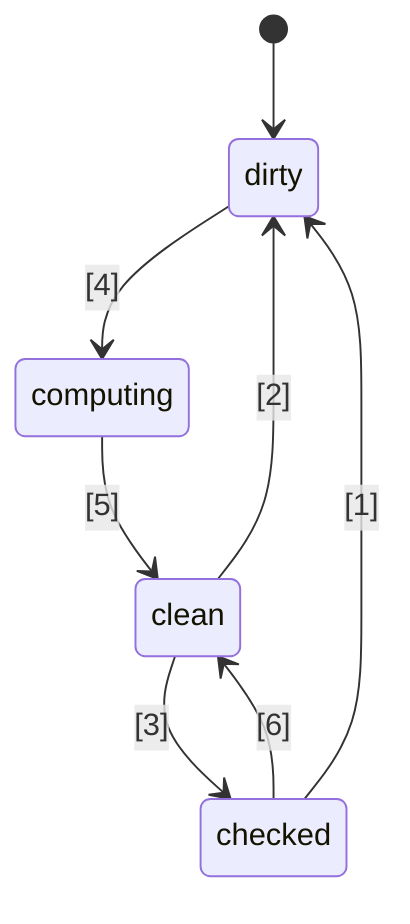
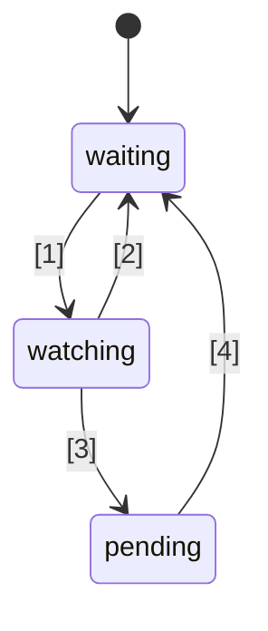

# 🚦 JavaScript Signals 표준 제안🚦


Stage 1 ([설명](https://tc39.es/process-document/))

TC39 제안 챔피언: Daniel Ehrenberg, Yehuda Katz, Jatin Ramanathan, Shay Lewis, Kristen Hewell Garrett, Dominic Gannaway, Preston Sego, Milo M, Rob Eisenberg

원저자: Rob Eisenberg, Daniel Ehrenberg

이 문서는 JavaScript에서의 signals에 대한 초기 공통 방향을 설명하며, 이는 TC39가 ES2015에서 표준화한 Promises에 앞서 진행된 Promises/A+ 노력과 유사합니다. [폴리필](https://github.com/proposal-signals/signal-polyfill)을 사용하여 직접 시도해볼 수 있습니다.

Promises/A+와 마찬가지로, 이 노력은 JavaScript 생태계의 정렬에 초점을 맞추고 있습니다. 이 정렬이 성공하면, 그 경험을 바탕으로 표준이 등장할 수 있습니다. 여러 프레임워크 저자들이 이곳에서 그들의 반응성 코어를 지원할 수 있는 공통 모델에 협력하고 있습니다. 현재 초안은 [Angular](https://angular.io/), [Bubble](https://bubble.io/), [Ember](https://emberjs.com/), [FAST](https://www.fast.design/), [MobX](https://mobx.js.org/), [Preact](https://preactjs.com/), [Qwik](https://qwik.dev/), [RxJS](https://rxjs.dev/), [Solid](https://www.solidjs.com/), [Starbeam](https://www.starbeamjs.com/), [Svelte](https://svelte.dev/), [Vue](https://vuejs.org/), [Wiz](https://blog.angular.io/angular-and-wiz-are-better-together-91e633d8cd5a) 등 다양한 프레임워크 저자 및 유지관리자들의 디자인 피드백을 바탕으로 작성되었습니다.

Promises/A+와 다르게, 우리는 공통적인 개발자 대상의 표면 API를 해결하려는 것이 아니라, 신호 그래프의 근본적인 핵심 시맨틱을 정확하게 정의하려고 합니다. 이 제안에는 완전히 구체적인 API가 포함되어 있지만, 이 API는 대부분의 애플리케이션 개발자를 대상으로 하지 않습니다. 대신, 여기의 신호 API는 프레임워크가 그 위에 구축할 수 있도록 더 적합하며, 공통 신호 그래프 및 자동 추적 메커니즘을 통한 상호 운용성을 제공합니다.

이 제안의 계획은 Stage 1을 넘어서기 전에, 여러 프레임워크에의 통합을 포함한 상당한 초기 프로토타이핑을 수행하는 것입니다. Signals가 여러 프레임워크에서 실제로 사용하기에 적합하고, 프레임워크 제공 신호 대비 실제 이점을 제공하는 경우에만 표준화에 관심이 있습니다. 상당한 초기 프로토타이핑을 통해 이러한 정보를 얻을 수 있기를 희망합니다. 자세한 내용은 아래 "Status and development plan"을 참조하세요.

## 배경: 왜 Signals인가?

복잡한 사용자 인터페이스(UI)를 개발하기 위해, JavaScript 애플리케이션 개발자는 애플리케이션의 뷰 계층에 상태를 효율적으로 저장, 계산, 무효화, 동기화, 푸시해야 합니다. UI는 단순한 값 관리 그 이상을 포함하는 경우가 많으며, 종종 다른 값이나 자체적으로 계산되는 상태의 복잡한 트리에 의존하는 계산된 상태의 렌더링이 필요합니다. Signals의 목표는 이러한 애플리케이션 상태를 관리할 인프라를 제공하여 개발자가 반복적인 세부사항이 아닌 비즈니스 로직에 집중할 수 있도록 하는 것입니다.

Signal과 유사한 구조는 UI가 아닌 컨텍스트, 특히 빌드 시스템에서 불필요한 재빌드를 방지하기 위해 독립적으로 유용하다는 것이 입증되었습니다.

Signals는 반응형 프로그래밍에서 애플리케이션의 업데이트 관리를 제거하기 위해 사용됩니다.

> 상태 변경에 기반한 업데이트를 위한 선언적 프로그래밍 모델.

출처: _[What is Reactivity?](https://www.pzuraq.com/blog/what-is-reactivity)_.

#### 예제 - 바닐라JS 카운터

`counter`라는 변수가 있다고 할 때, DOM에 카운터가 짝수인지 홀수인지 렌더링하고 싶습니다. `counter`가 변경될 때마다, 최신의 짝/홀 정보를 DOM에 업데이트해야 합니다. 바닐라 JS에서는 다음과 같이 작성할 수 있습니다:

```js
let counter = 0;
const setCounter = (value) => {
  counter = value;
  render();
};

const isEven = () => (counter & 1) == 0;
const parity = () => isEven() ? "even" : "odd";
const render = () => element.innerText = parity();

// Simulate external updates to counter...
setInterval(() => setCounter(counter + 1), 1000);
```
> [!NOTE]  
> 글로벌 변수는 여기서 시연 목적을 위해 사용되었습니다. 적절한 상태 관리는 다양한 솔루션이 있으며, 이 제안의 예제는 가능한 한 최소화되었습니다. 이 제안은 글로벌 변수 사용을 권장하지 않습니다.

이 방식에는 여러 가지 문제가 있습니다...

* `counter` 설정이 복잡하고 보일러플레이트 코드가 많습니다.
* `counter` 상태가 렌더링 시스템에 강하게 결합되어 있습니다.
* `counter`가 변경되지만 `parity`가 변하지 않는 경우(예: 2에서 4로 증가), 불필요하게 짝/홀 계산 및 렌더링이 발생합니다.
* UI의 다른 부분이 `counter` 업데이트만 렌더링하고 싶다면 어떻게 해야 할까요?
* UI의 다른 부분이 `isEven` 또는 `parity`만을 의존한다면 어떻게 해야 할까요?

상대적으로 단순한 이 시나리오에서도 많은 문제가 빠르게 발생합니다. 우리는 `counter`에 대해 pub/sub(발행/구독)를 도입하여 이러한 문제를 우회할 수 있습니다. 이렇게 하면, `counter`의 추가 소비자가 상태 변경에 자신의 반응을 추가로 구독할 수 있습니다.

하지만, 여전히 다음과 같은 문제에 직면해 있습니다:

* 오직 `parity`에만 의존하는 렌더 함수가 실제로는 `counter`를 구독해야 함을 "알아야" 합니다.
* `isEven` 또는 `parity`만을 기반으로 UI를 업데이트하는 것이, `counter`에 직접 접근하지 않고는 불가능합니다.
* 보일러플레이트가 증가했습니다. 무언가를 사용할 때마다 단순히 함수를 호출하거나 변수를 읽는 것이 아니라, 구독하고 그곳에서 업데이트해야 합니다. 구독 해제 관리도 특히 복잡해집니다.

이제, 우리는 pub/sub을 `counter`뿐 아니라 `isEven`과 `parity`에도 추가하여 몇 가지 문제를 해결할 수 있습니다. 그러면, `isEven`을 `counter`에, `parity`를 `isEven`에, `render`를 `parity`에 각각 구독해야 합니다. 불행하게도, 보일러플레이트 코드가 폭증할 뿐만 아니라, 구독 관리에 많은 수작업이 필요하고, 제대로 정리하지 않으면 잠재적인 메모리 누수 위험도 있습니다. 결국, 몇 가지 문제를 해결했지만 완전히 새로운 범주의 문제와 많은 코드를 만들었습니다. 더욱이, 시스템 내 모든 상태에 대해 이 과정을 반복해야 합니다.

### Signals 도입

UI에서 모델과 뷰 간의 데이터 바인딩 추상화는 JS나 웹 플랫폼에 내장된 메커니즘이 없음에도 불구하고, 여러 프로그래밍 언어의 UI 프레임워크에서 오랫동안 핵심이었습니다. JS 프레임워크와 라이브러리 내부에서는 이 바인딩을 표현하는 다양한 방식에 대한 실험이 많이 이루어졌으며, 1급 상태 셀 또는 다른 데이터에서 파생된 계산을 나타내는 데이터 타입(즉, "Signals")과 단방향 데이터 흐름의 힘이 입증되었습니다.
이 1급 반응형 값 접근법은 [Knockout](https://knockoutjs.com/)이 [2010년](https://blog.stevensanderson.com/2010/07/05/introducing-knockout-a-ui-library-for-javascript/)에 오픈소스 JavaScript 웹 프레임워크에서 처음 널리 등장한 것으로 보입니다. 그 후로 수많은 변형과 구현이 만들어졌습니다. 최근 3~4년 사이에 Signal 원시값과 관련 접근법이 더 큰 관심을 끌게 되었으며, 거의 모든 현대 JavaScript 라이브러리나 프레임워크가 이름은 다르지만 유사한 기능을 보유하게 되었습니다.

Signals를 이해하기 위해, 위의 예제를 아래에 더 명확히 설명된 Signal API를 사용해 다시 살펴보겠습니다.

#### 예제 - Signals 카운터

```js
const counter = new Signal.State(0);
const isEven = new Signal.Computed(() => (counter.get() & 1) == 0);
const parity = new Signal.Computed(() => isEven.get() ? "even" : "odd");

// A library or framework defines effects based on other Signal primitives
declare function effect(cb: () => void): (() => void);

effect(() => element.innerText = parity.get());

// Simulate external updates to counter...
setInterval(() => counter.set(counter.get() + 1), 1000);
```

여기서 바로 알 수 있는 몇 가지 사항이 있습니다:
* 이전 예제에서 `counter` 변수에 관련된 복잡한 보일러플레이트가 제거되었습니다.
* 값, 계산, 부수효과를 다루는 통합된 API가 있습니다.
* `counter`와 `render` 간의 순환 참조 문제나 거꾸로 된 의존성이 없습니다.
* 수동 구독이나 별도의 관리가 필요하지 않습니다.
* 부수효과의 타이밍/스케줄링을 제어할 수 있는 수단이 있습니다.

Signals는 API 표면에서 보이는 것 이상을 제공합니다:
* **자동 의존성 추적** - 계산된 시그널(Computed Signal)은 자신이 의존하고 있는 다른 시그널(단순 값이든, 다른 연산이든)을 자동으로 발견합니다.
* **지연 평가(Lazy Evaluation)** - 계산은 선언 시 즉시 평가되지 않으며, 의존성이 변경되어도 즉시 평가되지 않습니다. 오직 값이 명시적으로 요청될 때만 평가됩니다.
* **메모이제이션(Memoization)** - 계산된 시그널은 마지막 값을 캐싱하여, 의존성이 변경되지 않은 경우에는 접근이 몇 번 이루어지더라도 다시 평가할 필요가 없습니다.

## Signals 표준화의 동기

#### 상호 운용성(Interoperability)

각 시그널 구현체는 계산된 시그널을 평가할 때 만나는 소스들을 추적하기 위한 자체적인 자동 추적 메커니즘을 가지고 있습니다. 이로 인해 모델, 컴포넌트, 라이브러리를 서로 다른 프레임워크 간에 공유하기 어렵습니다. 보통 시그널은 JS 프레임워크의 일부로 구현되기 때문에 뷰 엔진에 잘못된 결합이 생기게 됩니다.

이 제안의 목표는 반응형 모델을 렌더링 뷰와 완전히 분리시켜, 개발자가 비 UI 코드를 재작성하지 않고 새로운 렌더링 기술로 마이그레이션하거나, 다양한 컨텍스트에서 배포할 수 있는 JS 기반의 공유 반응형 모델을 개발할 수 있도록 하는 것입니다. 그러나 버전 관리와 중복 문제로 인해, JS 레벨의 라이브러리를 통한 강력한 공유는 실질적으로 어렵다는 것이 밝혀졌습니다. 빌트인(Built-in) 기능은 더 강력한 공유 보장을 제공합니다.

#### 성능/메모리 사용

자주 사용되는 라이브러리가 내장되어 있으면 적은 코드를 전달할 수 있어 잠재적인 성능 향상이 있지만, 시그널 구현체 자체는 상당히 작기 때문에 이 효과가 크지는 않을 것으로 예상합니다.

우리는 네이티브 C++로 구현된 시그널 관련 자료구조 및 알고리즘이 JS로 구현된 것보다 상수 배수만큼 약간 더 효율적일 수 있다고 생각합니다. 그러나 폴리필에 들어갈 수 있는 것과 비교해 알고리즘 자체의 변화는 예상하지 않습니다. 엔진이 마법처럼 더 빠를 것으로 기대하지 않으며, 반응형 알고리즘은 명확하고 일관되게 정의될 것입니다.

챔피언 그룹은 다양한 시그널 구현체를 개발하고, 이를 통해 성능 가능성을 조사할 예정입니다.

#### 개발자 도구(DevTools)

기존 JS 시그널 라이브러리에서는 다음과 같은 것을 추적하기 어렵습니다:
* 계산된 시그널 체인에 걸친 호출 스택, 즉 오류의 인과적 연쇄
* 한 시그널이 다른 시그널에 의존할 때의 참조 그래프 — 메모리 사용을 디버깅할 때 중요

빌트인 시그널은 JS 런타임과 개발자 도구가 시그널을 검사하는 데 있어, 특히 디버깅이나 성능 분석 시 더 나은 지원을 가능하게 합니다(이것이 브라우저에 내장되든, 공유 확장 프로그램을 통해 제공되든 관계없음). 기존의 요소 검사기, 성능 스냅샷, 메모리 프로파일러 등도 시그널을 강조하여 정보 표시를 개선할 수 있습니다.

#### 2차적 이점

##### 표준 라이브러리의 이점

일반적으로 JavaScript는 꽤 미니멀한 표준 라이브러리를 가져왔지만, TC39에서는 JS를 "배터리 포함" 언어로 만들어 고품질의 내장 기능을 제공하려는 추세가 있습니다. 예를 들어, Temporal이 moment.js를 대체하고, `Array.prototype.flat`, `Object.groupBy` 등 많은 lodash 사용 사례를 대체하고 있습니다. 그 이점으로는 더 작은 번들 크기, 개선된 안정성과 품질, 새로운 프로젝트에 합류할 때 배워야 할 것이 줄어들고, JS 개발자 간에 공통 어휘를 쓸 수 있다는 점이 있습니다.

##### HTML/DOM 통합(향후 가능성)

현재 W3C와 브라우저 구현체들은 HTML에 네이티브 템플릿 기능([DOM Parts][wicg-pr-1023], [Template Instantiation][wicg-propsal-template-instantiation])을 도입하려는 작업을 하고 있습니다. 또한 W3C Web Components CG에서는 Web Components를 확장하여 완전히 선언적인 HTML API를 제공할 가능성을 탐구하고 있습니다. 이 두 목표를 달성하려면 궁극적으로 HTML에서 사용할 반응형 원시값이 필요합니다. 또한 시그널을 DOM에 통합함으로써 사용자 경험을 개선할 수 있는 다양한 기능이 상상되고 있으며, 이미 커뮤니티에서 요청된 바 있습니다.

[wicg-pr-1023]: https://github.com/WICG/webcomponents/pull/1023
[wicg-propsal-template-instantiation]: https://github.com/WICG/webcomponents/blob/gh-pages/proposals/Template-Instantiation.md

> 참고: 이 통합은 본 제안과는 별도의 후속 작업으로, 이 제안서의 일부가 아닙니다.

##### 생태계 정보 교환(*출시의 이유는 아님*)

표준화 노력은 브라우저의 변화 없이도 "커뮤니티" 수준에서 도움이 될 때가 있습니다. Signals 표준화는 다양한 프레임워크 저자들이 반응성의 본질, 알고리즘, 상호 운용성에 대해 심도 깊게 논의하게 만들었습니다. 이는 이미 유용했지만, JS 엔진과 브라우저에 포함될 정당성은 되지 않습니다. Signals는 생태계 정보 교환 이상의 중요한 이점이 있을 때에만 JavaScript 표준에 추가되어야 합니다.

## Signals의 설계 목표

기존의 시그널 라이브러리들은 핵심적으로 크게 다르지 않다는 것이 밝혀졌습니다. 본 제안은 이들 라이브러리의 성공을 바탕으로, 중요한 특성들을 구현하는 것을 목표로 합니다.

### 핵심 기능

* 상태를 나타내는 Signal 타입(쓰기 가능한 Signal). 이는 다른 곳에서 읽을 수 있는 값입니다.
* 다른 시그널에 의존하고, 지연 계산 및 캐싱되는 계산/메모/파생 Signal 타입.
    * 계산은 지연(Lazy) 방식으로, 의존성이 변경될 때마다 자동으로 다시 계산되지 않고, 실제로 누군가 읽을 때만 계산이 수행됩니다.
    * 계산은 "[글리치(glitch)](https://en.wikipedia.org/wiki/Reactive_programming#Glitches) 프리"해야 하며, 불필요한 계산이 절대 수행되지 않아야 합니다. 즉, 애플리케이션이 계산된 시그널을 읽을 때, 변경 가능성이 있는 그래프의 부분을 위상 정렬하여 중복을 제거합니다.
    * 계산 결과는 캐싱되며, 마지막으로 의존성이 변경된 이후 의존성에 변화가 없으면, 접근 시 다시 계산되지 않습니다.
    * 계산된 시그널뿐만 아니라 상태 시그널에도 커스텀 비교 함수가 가능하여, 해당 값을 참조하는 추가 계산 시그널의 갱신 여부를 결정할 수 있습니다.
* 계산된 시그널의 의존성(또는 중첩 의존성)이 "더러워지고(dirty)" 변경될 때 반응하는 기능.
    * 이 반응은 더 중요한 작업을 나중에 예약하기 위한 것입니다.
    * 이펙트(Effect)는 이러한 반응과 프레임워크 수준의 스케줄링으로 구현됩니다.
    * 계산 시그널은 자신이 이러한 반응의 (중첩) 의존성으로 등록되었는지 여부에 따라 반응할 수 있어야 합니다.
* JS 프레임워크가 자체적으로 스케줄링을 할 수 있도록 지원. Promise 스타일의 내장 강제 스케줄링은 제공하지 않습니다.
    * 동기식 반응이 필요하며, 이를 통해 프레임워크 논리에 따라 후속 작업 스케줄링이 가능합니다.
    * 쓰기는 동기적으로 즉시 적용됩니다(프레임워크에서 배치 처리를 원하면 별도 구현).
    * 이펙트가 "더러워졌는지" 확인하는 것과 실제로 이펙트를 실행하는 것을 분리할 수 있습니다(2단계 이펙트 스케줄러 지원).
* 의존성 기록을 남기지 않고 시그널을 읽을 수 있는 기능(`untrack`)
* Signals/반응성을 사용하는 서로 다른 코드베이스 간의 조합 지원, 예:
    * (아래의 예외 사항을 제외하면) 여러 프레임워크를 함께 사용할 때도 추적/반응성 자체는 공유 가능
    * 프레임워크에 독립적인 반응형 자료구조(예: 재귀적으로 반응하는 스토어 프록시, 반응형 Map, Set, Array 등)

### 건전성(Soundness)

* 동기 반응의 순진한 오용을 권장하지 않거나 금지함
    * 건전성 위험: 잘못 사용하면 "[글리치(glitch)](https://en.wikipedia.org/wiki/Reactive_programming#Glitches)"가 발생할 수 있음. 즉, 시그널이 설정될 때 바로 렌더링하면, 최종 사용자에게 불완전한 애플리케이션 상태가 노출될 수 있습니다. 따라서 이 기능은 반드시 애플리케이션 로직이 완료된 후, 더 큰 작업을 지능적으로 예약하는 용도로만 사용해야 합니다.
    * 해결책: 동기식 반응 콜백 내에서 시그널을 읽거나 쓸 수 없도록 금지
* `untrack` 사용을 권장하지 않고, 그 불안정함을 명확히 표시
    * 건전성 위험: `untrack`을 사용하면, 어떤 시그널의 값이 다른 시그널에 의존하지만, 그 시그널이 변경될 때 업데이트되지 않는 계산된 시그널을 만들 수 있습니다. untrack된 접근이 계산 결과에 영향을 주지 않을 때만 사용해야 합니다.
    * 해결책: API 이름에 "unsafe"라는 표시를 명시
* 참고: 본 제안은 계산 및 이펙트 시그널에서 시그널을 읽고 쓸 수 있도록 허용하며, 읽기 이후의 쓰기를 제한하지 않습니다(건전성 위험에도 불구하고). 이는 프레임워크와의 통합 시 유연성과 호환성을 유지하기 위함입니다.

### 표면 API(Surface API)

* 여러 프레임워크가 자체 시그널/반응성 메커니즘을 구현할 수 있는 튼튼한 기반이 되어야 합니다.
    * 재귀적 스토어 프록시, 데코레이터 기반 클래스 필드 반응성, `.value`, `[state, setState]` 스타일 API 모두에 적합한 기반이어야 합니다.
    * 다양한 프레임워크가 허용하는 유효한 패턴을 표현할 수 있는 의미론을 제공해야 합니다. 예를 들어, 즉시 반영되는 쓰기든, 나중에 배치 적용되는 쓰기든, 이러한 시그널이 기반이 될 수 있어야 합니다.
* 이 API가 JavaScript 개발자가 직접 사용하기에도 편리하면 좋습니다.
    * 어떤 기능이 생태계 개념과 일치한다면, 공통 어휘를 사용하는 것이 좋습니다.
        * 단, 동일한 이름을 그대로 사용하는 것은 피해야 합니다!
    * "JS 개발자 사용성"과 "프레임워크를 위한 모든 훅 제공" 사이에 긴장이 존재
        * 아이디어: 모든 훅을 제공하되, 오용 시에는 에러를 포함
        * 아이디어: 미묘한 API는 [`crypto.subtle`](https://developer.mozilla.org/en-US/docs/Web/API/Crypto/subtle)처럼 `subtle` 네임스페이스 아래에 두어, 프레임워크 구현이나 개발자 도구 빌드 등 고급 사용에 필요한 API와, 일반적인 애플리케이션 개발에서 사용하는 API를 구분
* 좋은 성능으로 구현 및 사용 가능해야 하며, 표면 API 자체가 과도한 오버헤드를 유발하지 않아야 함
    * 서브클래싱을 허용하여, 프레임워크가 자체 메서드와 필드(비공개 필드 포함)를 추가할 수 있어야 합니다. 이는 프레임워크 레벨에서 추가 할당이 필요 없도록 하는 데 중요합니다. "메모리 관리" 항목 참고.

### 메모리 관리

* 가능하다면: 어떤 계산 시그널도 미래에 읽힐 수 있는 라이브 객체가 참조하지 않으면, 더 넓은 그래프에 연결되어 있더라도(예: 라이브 상태를 읽는 경우) 가비지 컬렉션이 가능해야 합니다.
* 대부분의 프레임워크에서는 다른 Signal 그래프와 참조 관계가 남아 있는 경우, 계산된 Signal의 명시적 처리가 필요하다는 점에 유의하십시오.
* 이러한 Signal의 수명 주기가 UI 컴포넌트의 수명과 연결되어 있고, 효과 역시 결국에는 처분(dispose)되어야 하므로, 실제로는 그렇게 심각한 문제가 되지 않습니다.
* 이러한 의미론으로 실행하는 것이 너무 비용이 크다면, 아래의 API에 계산된 Signal의 명시적 처분(또는 "언링킹") 기능을 추가해야 합니다. (현재는 해당 기능이 없습니다.)
* 별도의 관련 목표: 할당 횟수를 최소화하기
    * writable Signal을 만들 때 (두 개의 별도 클로저와 배열을 피함)
    * effect를 구현할 때 (반응마다 클로저 생성을 피함)
    * Signal 변경 관찰 API에서 임시 데이터 구조 생성을 피함
    * 해결책: 하위 클래스에서 정의된 메서드와 필드를 재사용할 수 있는 클래스 기반 API

## API 스케치

Signal API의 초기 아이디어는 아래와 같습니다. 이는 초기 초안일 뿐이며, 시간이 지나면서 변경될 수 있습니다. 전체 `.d.ts`부터 살펴보면서 전체적인 구조를 파악하고, 이후에 각 세부 사항을 논의하겠습니다.

```ts
interface Signal<T> {
    // 시그널의 값을 가져옵니다.
    get(): T;
}

namespace Signal {
    // 읽기-쓰기 가능한 Signal
    class State<T> implements Signal<T> {
        // 값 t로 시작하는 상태 Signal을 생성합니다.
        constructor(t: T, options?: SignalOptions<T>);

        // 시그널의 값을 가져옵니다.
        get(): T;

        // 상태 Signal의 값을 t로 설정합니다.
        set(t: T): void;
    }

    // 다른 Signal을 기반으로 한 수식 Signal
    class Computed<T = unknown> implements Signal<T> {
        // 콜백이 반환하는 값으로 평가되는 Signal을 생성합니다.
        // 콜백은 이 Signal을 this 값으로 받아 호출됩니다.
        constructor(cb: (this: Computed<T>) => T, options?: SignalOptions<T>);

        // 시그널의 값을 가져옵니다.
        get(): T;
    }

    // 이 네임스페이스에는 프레임워크 작성자를 위한 "고급" 기능이 포함되어 있습니다.
    // 애플리케이션 개발자보다는 프레임워크 작성자가 사용하는 것이 좋습니다.
    // `crypto.subtle`과 유사
    namespace subtle {
        // 모든 추적을 비활성화한 상태로 콜백 실행
        function untrack<T>(cb: () => T): T;

        // 현재 시그널 읽기를 추적하고 있는 Computed Signal을 가져옴 (없으면 null)
        function currentComputed(): Computed | null;

        // 마지막 평가 시 참조된 모든 Signal의 순서 있는 목록 반환
        // Watcher의 경우, 감시 중인 Signal 집합을 나열함
        function introspectSources(s: Computed | Watcher): (State | Computed)[];

        // 이 시그널이 포함된 Watcher와, 마지막 평가 시 이 시그널을 읽었던
        // (재귀적으로) 감시 중인 Computed Signal을 반환
        function introspectSinks(s: State | Computed): (Computed | Watcher)[];

        // 이 시그널이 "live" 상태인지(Watcher에 의해 감시 중이거나,
        // (재귀적으로) live인 Computed Signal에 의해 읽힘) 여부 반환
        function hasSinks(s: State | Computed): boolean;

        // 이 요소가 "반응성"인지(다른 시그널에 의존하는지) 여부 반환
        // hasSources가 false인 Computed는 항상 동일한 상수를 반환
        function hasSources(s: Computed | Watcher): boolean;

        class Watcher {
            // Watcher의 (재귀적) 소스가 쓰여질 때, notify 콜백 호출
            // (이전에 이미 호출되지 않은 경우에만)
            // notify 중에는 어떠한 시그널도 읽거나 쓸 수 없음
            constructor(notify: (this: Watcher) => void);

            // Watcher의 집합에 이 시그널들을 추가하고,
            // 집합 내(또는 의존성 내) 어느 시그널이 변경될 때마다 notify 콜백이 실행되도록 설정
            // 인자 없이 호출하면 "notified" 상태만 초기화하여
            // notify 콜백이 다시 호출되게 할 수 있음
            watch(...s: Signal[]): void;

            // 감시 집합에서 이 시그널들을 제거함 (예: 처분된 effect의 경우)
            unwatch(...s: Signal[]): void;

            // Watcher의 집합 내 아직 dirty 상태이거나,
            // dirty/pending 상태인 소스를 가진 Computed Signal 집합 반환
            // (아직 재평가되지 않은 경우)
            getPending(): Signal[];
        }

        // 감시 시작/종료 시 호출되는 hook
        var watched: Symbol;
        var unwatched: Symbol;
    }

    interface SignalOptions<T> {
        // 이전 값과 새로운 값 간의 사용자 정의 비교 함수. 기본값: Object.is.
        // 이 시그널이 this 값으로 전달됩니다.
        equals?: (this: Signal<T>, t: T, t2: T) => boolean;
```
```ts
// isWatched가 이전에 false였다가 true가 될 때 호출되는 콜백
[Signal.subtle.watched]?: (this: Signal<T>) => void;

// isWatched가 이전에 true였다가 false가 될 때마다 호출되는 콜백
[Signal.subtle.unwatched]?: (this: Signal<T>) => void;
}
}
```

### 시그널의 작동 방식

시그널(Signal)은 시간이 지남에 따라 변경될 수 있는 데이터 셀을 나타냅니다. 시그널은 "state"(수동으로 설정되는 값) 또는 "computed"(다른 시그널을 기반으로 한 공식)일 수 있습니다.

Computed 시그널은 평가 과정에서 참조된 다른 시그널들을 자동으로 추적함으로써 동작합니다. Computed가 읽힐 때, 이전에 기록된 의존성 중 어떤 것이 변경되었는지 확인하고, 변경된 경우 자신을 다시 평가합니다. 여러 개의 computed 시그널이 중첩될 경우, 추적의 귀속은 가장 안쪽에 있는 시그널로 집중됩니다.

Computed 시그널은 지연(lazy), 즉 풀(Pull) 기반입니다. 즉, 의존성이 이전에 변경되었더라도 실제로 접근할 때만 다시 평가가 이루어집니다.

Computed 시그널에 전달되는 콜백은 일반적으로 "순수(pure)"해야 하며, 접근하는 다른 시그널의 결정적이고 부작용이 없는 함수여야 합니다. 동시에, 콜백이 호출되는 타이밍은 결정적이므로, 신중하게 사용할 경우 부작용도 허용될 수 있습니다.

시그널은 강력한 캐싱/메모이제이션 기능을 제공합니다. state와 computed 시그널 모두 현재 값을 기억하고, 그 값을 참조하는 computed 시그널에 실제로 변경이 있을 때만 재계산을 트리거합니다. 이전 값과 새로운 값을 반복적으로 비교할 필요도 없으며, 소스 시그널이 리셋/재평가될 때 한 번만 비교가 이루어지고, 시그널 메커니즘이 해당 시그널을 참조하는 것들 중 아직 새로운 값으로 업데이트되지 않은 것들을 추적합니다. 내부적으로는 (Milo의 블로그 포스트에서 설명한) "그래프 컬러링"을 통해 표현됩니다.

Computed 시그널은 의존성을 동적으로 추적합니다. 즉, 실행될 때마다 서로 다른 것에 의존할 수 있으며, 정확한 의존성 집합이 시그널 그래프에 신선하게 유지됩니다. 예를 들어, 특정 분기에서만 필요한 의존성이 있고, 이전 계산에서 다른 분기를 택했다면, 그 임시로 사용되지 않는 값이 변경되어도 computed 시그널이 재계산되지 않습니다(심지어 pull 되었을 때도).

자바스크립트의 프라미스(Promise)와 달리, 시그널에서 일어나는 모든 작업은 동기적으로 실행됩니다.
- 시그널에 새 값을 설정하는 것은 동기적이며, 이후 해당 값을 참조하는 모든 computed 시그널에서 즉시 반영됩니다. 이 변이에 대한 내장 배치(batching)는 없습니다.
- computed 시그널을 읽는 것도 동기적이며, 해당 값은 항상 즉시 사용할 수 있습니다.
- 아래에서 설명할 Watcher의 `notify` 콜백은 동기적으로 실행되며, `.set()` 호출 중(단, 그래프 컬러링이 완료된 후) 트리거됩니다.

프라미스처럼, 시그널도 오류 상태를 나타낼 수 있습니다. 만약 computed 시그널의 콜백이 예외를 던지면, 그 오류도 값처럼 캐시되며, 해당 시그널이 읽힐 때마다 재차 예외가 발생합니다.

### Signal 클래스 이해하기

`Signal` 인스턴스는 시간에 따라 추적되는 동적으로 변경되는 값을 읽을 수 있는 기능을 나타냅니다. 또한, 다른 computed 시그널에서 추적된 접근을 통해 암묵적으로 시그널에 구독하는 기능도 포함되어 있습니다.

여기의 API는 "signal", "computed", "state"와 같은 이름 사용에 있어서 시그널 라이브러리 생태계의 대략적인 합의와 일치하도록 설계되었습니다. 하지만, Computed와 State 시그널 접근은 `.get()` 메서드를 통해 이루어지며, 이는 `.value` 스타일 접근자나 `signal()` 호출 문법을 사용하는 기존 인기 시그널 API와는 다릅니다.

이 API는 할당(allocation) 수를 줄이도록 설계되어, 시그널이 자바스크립트 프레임워크에 내장될 수 있으면서 기존 프레임워크 특화 시그널보다 동등하거나 더 나은 성능을 낼 수 있도록 합니다. 이는 다음을 의미합니다:
- State 시그널은 단일 쓰기 가능한 객체이며, 동일한 참조로 접근 및 설정이 모두 가능합니다. (아래 "Capability separation" 섹션 참고)
- State와 Computed 시그널 모두 서브클래싱이 가능하도록 설계되어, 프레임워크에서 퍼블릭/프라이빗 클래스 필드(및 해당 상태를 사용하는 메서드)를 통해 추가 프로퍼티를 쉽게 추가할 수 있습니다.
- 다양한 콜백(예: `equals`, computed 콜백)은 관련 시그널을 `this` 값으로 하여 호출되므로, 시그널마다 새로운 클로저를 생성할 필요가 없습니다. 대신, 컨텍스트는 시그널 자체의 추가 프로퍼티에 저장할 수 있습니다.

이 API에서 강제되는 일부 에러 조건:
- computed를 재귀적으로 읽는 것은 에러입니다.
- Watcher의 `notify` 콜백에서는 어떤 시그널도 읽거나 쓸 수 없습니다.
- computed 시그널의 콜백이 예외를 던지면, 의존성 중 하나가 변경되어 재계산되기 전까지는 해당 시그널 접근 시마다 캐시된 예외가 재차 발생합니다.

*강제되지 않는* 일부 조건:
- computed 시그널 콜백 내부에서 다른 시그널에 동기적으로 값을 쓸 수 있습니다.
- Watcher의 `notify` 콜백에서 큐잉된 작업은 시그널을 읽거나 쓸 수 있으므로, 시그널을 활용하여 [고전적인 React 안티패턴](https://react.dev/learn/you-might-not-need-an-effect)을 재현할 수 있습니다!

### 이펙트 구현하기

위에 정의된 `Watcher` 인터페이스는 효과를 위한 전형적인 JS API(즉, 다른 시그널이 변경될 때 부수 효과를 위해 콜백이 재실행됨)를 구현하는 기반을 제공합니다. 처음 예시에서 사용한 `effect` 함수는 다음과 같이 정의할 수 있습니다:

```ts
// 이 함수는 일반적으로 라이브러리/프레임워크에 위치하며, 애플리케이션 코드에는 두지 않습니다.
// 참고: 이 스케줄링 로직은 너무 기본적이므로 실사용에는 부적합합니다. 복사/붙여넣기 금지.
let pending = false;

let w = new Signal.subtle.Watcher(() => {
    if (!pending) {
        pending = true;
        queueMicrotask(() => {
            pending = false;
            for (let s of w.getPending()) s.get();
            w.watch();
        });
    }
});

// 의존성 중 하나가 변경될 수 있을 때마다 마이크로태스크 큐에서 자기 자신을 읽도록 스케줄하는,
// cb로 평가되는 effect 시그널
export function effect(cb) {
    let destructor;
    let c = new Signal.Computed(() => { destructor?.(); destructor = cb(); });
    w.watch(c);
    c.get();
    return () => { destructor?.(); w.unwatch(c) };
}
```

시그널 API는 `effect`와 같은 내장 함수를 제공하지 않습니다. 이는 이펙트 스케줄링이 미묘하며, 종종 프레임워크 렌더링 사이클, 기타 고수준 프레임워크 특화 상태나 전략과 연계되기 때문인데, JS에서는 이에 접근할 수 없습니다.

여기서 사용된 다양한 연산들을 살펴보면: `Watcher` 생성자에 전달된 `notify` 콜백은 시그널이 "clean" 상태(캐시가 초기화되고 유효함이 보장된 상태)에서 "checked" 또는 "dirty" 상태(최소 하나의 상태가 변경되어 더 이상 캐시가 유효하지 않을 수 있음)로 전환될 때 호출되는 함수입니다.

`notify` 호출은 궁극적으로 어떤 state 시그널의 `.set()` 호출에 의해 트리거됩니다. 이 호출은 동기적으로 이뤄지며, `.set`이 반환되기 전에 발생합니다. 그러나 이 콜백이 시그널 그래프를 처리 중간 상태에서 관찰할까봐 걱정할 필요는 없습니다. `notify` 콜백 중에는 어떤 시그널도 읽거나 쓸 수 없으며, `untrack` 호출 중에도 마찬가지입니다. `notify`는 `.set()` 중에 호출되므로, 아직 끝나지 않은 다른 논리 흐름을 중단하고 실행됩니다. `notify`에서 시그널을 읽거나 쓰려면 위 예시처럼 시그널을 리스트에 적어두었다가 나중에 접근하거나, `queueMicrotask`로 작업을 예약하는 등 나중에 실행되도록 해야 합니다.

사실, `Signal.subtle.Watcher` 없이도 computed 시그널의 폴링을 스케줄링하여(예: Glimmer에서처럼) 시그널을 효과적으로 사용할 수 있습니다. 그러나 많은 프레임워크에서는 이러한 스케줄링 로직을 동기적으로 실행하는 것이 매우 유용하다고 판단했으며, 그래서 Signals API에 이를 포함시켰습니다.

computed와 state 시그널 모두 JS 값처럼 가비지 컬렉션됩니다. 하지만 Watcher는 대상을 특별하게 유지하는 방식이 있습니다. Watcher가 감시하는 모든 시그널은 기본 상태 중 하나라도 도달 가능(reachable)한 한 계속 살아있게 됩니다. 이는 향후 `notify` 호출(그리고 그 후의 `.get()`)을 트리거할 수 있기 때문입니다. 따라서 효과를 정리(clean up)하려면 반드시 `Watcher.prototype.unwatch`를 호출해야 합니다.

### 비정상적인 이스케이프 해치

`Signal.subtle.untrack`은 시그널을 *추적 없이* 읽을 수 있게 해주는 이스케이프 해치입니다. 이 기능은, 추적되지 않는 상태에서 시그널을 참조하는 computed 시그널을 만들 수 있게 하므로 안전하지 않습니다. 그 결과가 변경되지 않을 때만 untrack 접근을 사용해야 합니다.

<!--
TODO: untrack을 잘 활용할 수 있는 예시 추가

### watched/unwatched 사용하기

TODO: Observable을 effect에서 사용될 때에만 구독하도록, Observable을 computed signal로 변환하는 예제 보여주기

TODO: 상태에 지정된 fetch 결과를 나타내는 computed signal의 예시 보여주기, 취소되는 경우 포함

### SSR을 위한 내부 구조 점검

TODO: 시그널 그래프를 직렬화하는 방법 보여주기

TODO: 몇 개의 시그널을 사용하여, 나중에 상태에서 computed로 "hydrate"할 수 있는 방법 보여주기
-->

### 현재 생략됨

이 기능들은 추후에 추가될 수 있지만, 현재 초안에는 포함되어 있지 않습니다. 이러한 생략은 프레임워크 간의 설계 공간에서 충분한 합의가 이루어지지 않았고, 본 문서에서 설명한 Signals 개념 위에 메커니즘을 덧붙여서 부재를 우회하는 것이 가능함이 입증되었기 때문입니다. 하지만 아쉽게도, 이러한 생략은 프레임워크 간 상호 운용성의 잠재력을 제한합니다. 본 문서에서 설명한 Signals의 프로토타입이 제작됨에 따라, 이러한 생략이 적절한 결정이었는지 재검토하려는 노력이 있을 것입니다.

* **비동기(Async)**: 이 모델에서 시그널은 항상 동기적으로 평가 가능합니다. 그러나, 특정 비동기 프로세스가 시그널을 설정하게 되는 경우와, 시그널이 아직 "로딩 중"인지 파악하는 것이 자주 유용합니다. 로딩 상태를 모델링하는 한 가지 간단한 방법은 예외를 사용하는 것이며, computed signal의 예외 캐시 동작은 이 기법과 어느 정도 합리적으로 결합됩니다. 향상된 기법은 [Issue #30](https://github.com/proposal-signals/proposal-signals/issues/30)에서 논의됩니다.
* **트랜잭션(Transactions)**: 뷰 간 전환에서는 "from" 상태와 "to" 상태 모두에 대해 라이브 상태를 유지하는 것이 종종 유용합니다. "to" 상태는 백그라운드에서 렌더링되다가 준비가 되면 스왑(트랜잭션 커밋)되고, "from" 상태는 상호작용이 가능합니다. 두 상태를 동시에 유지하려면 시그널 그래프의 상태를 "포크"해야 하며, 여러 개의 보류 중인 전환을 동시에 지원하는 것도 유용할 수 있습니다. 논의는 [Issue #73](https://github.com/proposal-signals/proposal-signals/issues/73)에서 다루고 있습니다.

몇몇 [편의 메서드](https://github.com/proposal-signals/proposal-signals/issues/32)도 생략되어 있습니다.

## 현황 및 개발 계획

이 제안은 2024년 4월 TC39 의제에서 Stage 1에 올라가 있습니다. 현재는 "Stage 0"으로 볼 수 있습니다.

이 제안을 위한 [폴리필](https://github.com/proposal-signals/signal-polyfill)이 기본적인 테스트와 함께 제공됩니다. 일부 프레임워크 작성자들은 이 시그널 구현체로 대체하는 실험을 시작했지만, 아직 초기 단계입니다.

시그널 제안의 협업자들은, 우리가 실제로 사용하지 않게 되어 후회하게 될 뭔가가 출시되는 함정에 빠지지 않기 위해, 이 제안을 추진하는 데 있어 특별히 **보수적**이고자 합니다. 우리의 계획은 TC39 프로세스에서 요구하지 않는 다음의 추가 작업을 수행하여, 이 제안이 올바른 방향에 있는지 확인하는 것입니다:

Stage 2를 제안하기 전에, 우리는 다음을 계획합니다:
- 견고하고, 잘 테스트되었으며(예: 다양한 프레임워크의 테스트와 test262 스타일의 테스트를 통과), 성능 면에서 경쟁력 있는(철저한 시그널/프레임워크 벤치마크 세트로 검증) 여러 개의 프로덕션급 폴리필 구현체를 개발합니다.
- 제안된 Signal API를 우리가 다소 대표적이라고 생각하는 다수의 JS 프레임워크에 통합하고, 일부 대형 애플리케이션에서 이 기반으로 작동하도록 합니다. 해당 컨텍스트에서 효율적이고 올바르게 동작하는지 테스트합니다.
- API의 확장 가능성에 대한 견고한 이해를 바탕으로, (있다면) 어떤 확장이 본 제안에 추가되어야 하는지 결론을 내립니다.

## 시그널 알고리즘

이 섹션에서는 각 API가 구현하는 알고리즘 측면에서 JavaScript에 노출되는 API를 설명합니다. 이는 일종의 프로토-명세로 볼 수 있으며, 가능한 의미 집합을 고정시키기 위해 이른 시점에 포함되었으나, 변경에 매우 열려 있습니다.

알고리즘의 일부 측면:
- computed 내에서 시그널을 읽는 순서는 중요하며, 특정 콜백(예: `Watcher` 호출, `equals`, `new Signal.Computed`의 첫 번째 매개변수, `watched`/`unwatched` 콜백)이 실행되는 순서로 관찰 가능합니다. 이는 computed Signal의 소스가 순서대로 저장되어야 함을 의미합니다.
- 이 네 가지 콜백은 모두 예외를 throw할 수 있으며, 이 예외는 예측 가능한 방식으로 JS 호출 코드에 전파됩니다. 예외는 이 알고리즘의 실행을 중단시키거나 그래프를 반쯤 처리된 상태로 남기지 *않습니다*. Watcher의 `notify` 콜백에서 발생한 오류는 이를 유발한 `.set()` 호출에 전달되며, 여러 예외가 발생하면 AggregateError로 포장됩니다. 다른 경우(`watched`/`unwatched` 포함?)에는 시그널의 값에 저장되어 읽을 때 다시 throw되며, 이처럼 다시 throw되는 시그널도 일반 값과 마찬가지로 `~clean~`으로 표시될 수 있습니다.
- "감시(watched)"되지 않는(Watcher가 관찰하지 않는) computed signal의 경우, 순환 참조를 피하기 위해 주의가 필요하며, 이로 인해 시그널 그래프의 다른 부분과 독립적으로 가비지 컬렉션될 수 있습니다. 내부적으로는 항상 수집되는 세대 번호(generation number) 시스템으로 구현할 수 있으며, 최적화된 구현에서는 노드별 세대 번호를 추가하거나, 감시되는 시그널의 일부 번호 추적을 생략할 수 있습니다.

### 숨겨진 전역 상태

시그널 알고리즘은 특정 전역 상태를 참조해야 합니다. 이 상태는 전체 스레드 또는 "에이전트"에 대해 전역적입니다.

- `computing`: `.get` 또는 `.run` 호출로 인해 현재 다시 평가 중인 가장 안쪽의 computed 또는 effect Signal, 또는 `null`. 최초에는 `null`.
- `frozen`: 그래프가 수정되어서는 안 되는 콜백이 현재 실행 중임을 나타내는 Boolean. 최초에는 `false`.
- `generation`: 0부터 시작하는 증가하는 정수로, 순환 참조를 피하면서 값이 최신인지 추적하는 데 사용됩니다.

### `Signal` 네임스페이스

`Signal`은 Signal 관련 클래스와 함수의 네임스페이스 역할을 하는 일반 객체입니다.

`Signal.subtle`도 유사한 내부 네임스페이스 객체입니다.

### `Signal.State` 클래스

#### `Signal.State` 내부 슬롯

- `value`: 상태 시그널의 현재 값
- `equals`: 값 변경 시 사용할 비교 함수
- `watched`: 시그널이 effect에 의해 관찰될 때 호출되는 콜백
- `unwatched`: 시그널이 더 이상 effect에 의해 관찰되지 않을 때 호출되는 콜백
- `sinks`: 이 시그널에 의존하는 감시 중(watched) 시그널의 집합

#### 생성자: `Signal.State(initialValue, options)`

1. 이 시그널의 `value`를 `initialValue`로 설정합니다.
1. 이 시그널의 `equals`를 options?.equals로 설정합니다.
1. 이 시그널의 `watched`를 options?.[Signal.subtle.watched]로 설정합니다.
1. 이 시그널의 `unwatched`를 options?.[Signal.subtle.unwatched]로 설정합니다.
1. 이 시그널의 `sinks`를 빈 집합으로 설정합니다.

#### 메서드: `Signal.State.prototype.get()`

1. `frozen`이 true이면 예외를 throw합니다.
1. `computing`이 `undefined`가 아니면, 이 시그널을 `computing`의 `sources` 집합에 추가합니다.
1. 참고: Watcher에 의해 감시될 때까지 이 시그널의 `sinks` 집합에 `computing`을 추가하지 않습니다.
1. 이 시그널의 `value`를 반환합니다.

#### 메서드: `Signal.State.prototype.set(newValue)`

1. 현재 실행 컨텍스트가 `frozen`이면 예외를 throw합니다.
1. 이 시그널과 첫 번째 매개변수의 값을 사용하여 "set Signal value" 알고리즘을 실행합니다.
1. 해당 알고리즘이 `~clean~`을 반환하면, undefined를 반환합니다.
1. 이 시그널의 모든 `sinks`의 `state`를 (Computed Signal일 경우) 이전에 clean이었다면 `~dirty~`로, (Watcher일 경우) 이전에 `~watching~`이었다면 `~pending~`으로 설정합니다.
1. 모든 sink의 Computed Signal 의존성(재귀적으로)의 `state`를 이전에 `~clean~`이었다면 `~checked~`로 설정합니다(즉, dirty 표시는 그대로 둡니다). Watcher의 경우 이전에 `~watching~`이었다면 `~pending~`으로 설정합니다.
1. 그 재귀 탐색에서 만난, 이전에 `~watching~`이었던 각 Watcher에 대해, 깊이 우선 순서로,
    1. `frozen`을 true로 설정합니다.
    1. 해당 Watcher의 `notify` 콜백을 호출합니다(예외 발생 시 저장하되, 반환값은 무시).
    1. `frozen`을 false로 복원합니다.
    1. Watcher의 `state`를 `~waiting~`으로 설정합니다.
1. `notify` 콜백에서 예외가 발생한 경우, 모든 `notify` 콜백이 실행된 후 호출자에게 예외를 전파합니다. 여러 예외가 있으면 AggregateError로 패키징하여 throw합니다.
1. undefined를 반환합니다.

### `Signal.Computed` 클래스

#### `Signal.Computed` 상태 기계
Computed Signal의 `state`는 다음 중 하나일 수 있습니다:

- `~clean~`: Signal의 값이 존재하며 오래되지 않았음이 확실합니다.
- `~checked~`: 이 Signal의 (간접) 소스가 변경되었습니다. 이 Signal은 값을 갖고 있지만 _오래되었을 수도_ 있습니다. 실제로 오래되었는지 여부는 모든 즉각적인 소스가 평가될 때만 알 수 있습니다.
- `~computing~`: 이 Signal의 콜백이 현재 `.get()` 호출의 부수 효과로 실행 중입니다.
- `~dirty~`: 이 Signal의 값이 오래되었음이 확실하거나, 한 번도 평가된 적이 없습니다.

전이 그래프는 다음과 같습니다:



전이 조건은 다음과 같습니다:
| 번호 | From | To | 조건 | 알고리즘 |
| ---- | ---- | -- | ---- | -------- |
| 1 | `~checked~` | `~dirty~` | 이 Signal의 즉각적인 소스(계산된 Signal)가 평가되었고, 그 값이 변경됨. | 알고리즘: 오래된 계산 Signal 재계산 |
| 2 | `~clean~` | `~dirty~` | 이 Signal의 즉각적인 소스(State)가 새 값으로 설정되었고, 그 값이 이전 값과 다름. | 메서드: `Signal.State.prototype.set(newValue)` |
| 3 | `~clean~` | `~checked~` | 이 Signal의 재귀적(즉각적이지 않은) 소스(State)가 새 값으로 설정되었고, 그 값이 이전 값과 다름. | 메서드: `Signal.State.prototype.set(newValue)` |
| 4 | `~dirty~` | `~computing~` | `callback` 실행 직전. | 알고리즘: 오래된 계산 Signal 재계산 |
| 5 | `~computing~` | `~clean~` | `callback` 평가가 완료되어 값이 반환되거나 예외가 발생함. | 알고리즘: 오래된 계산 Signal 재계산 |
| 6 | `~checked~` | `~clean~` | 이 Signal의 모든 즉각적인 소스가 평가되었고, 모두 변경되지 않음이 확인됨. 이제 오래되지 않았음이 확실함. | 알고리즘: 오래된 계산 Signal 재계산 |

#### `Signal.Computed` 내부 슬롯

- `value`: Signal의 이전 캐시 값, 혹은 한 번도 읽히지 않은 계산 Signal의 경우 `~uninitialized~`. 값이 예외일 수 있으며, 이 경우 값을 읽을 때 예외가 재발생합니다. effect signals의 경우 항상 `undefined`.
- `state`: `~clean~`, `~checked~`, `~computing~`, `~dirty~` 중 하나일 수 있습니다.
- `sources`: 이 Signal이 의존하는 Signal들의 순서 있는 집합.
- `sinks`: 이 Signal에 의존하는 Signal들의 순서 있는 집합.
- `equals`: 옵션에서 제공된 equals 메서드.
- `callback`: 계산 Signal의 값을 얻기 위해 호출되는 콜백. 생성자에 전달된 첫 번째 파라미터로 설정됩니다.

#### `Signal.Computed` 생성자

생성자는 다음을 설정합니다.
- `callback`을 첫 번째 파라미터로 설정
- 옵션에 따라 `equals`를 설정하며, 없으면 기본값은 `Object.is`
- `state`를 `~dirty~`로 설정
- `value`를 `~uninitialized~`로 설정

[AsyncContext](https://github.com/tc39/proposal-async-context)와 함께, `new Signal.Computed`에 전달된 콜백은 생성자가 호출될 당시의 스냅샷을 클로저로 캡처하고, 실행 중에 이 스냅샷을 복원합니다.

#### 메서드: `Signal.Computed.prototype.get`

1. 현재 실행 컨텍스트가 `frozen`이거나 이 Signal의 상태가 `~computing~`인 경우, 또는 이 Signal이 Watcher이고 계산 Signal을 `computing` 중인 경우 예외를 발생시킵니다.
1. `computing`이 `null`이 아니라면, 이 Signal을 `computing`의 `sources` 집합에 추가합니다.
1. 참고: Watcher에 의해 관찰되기 전까지는 `computing`을 이 Signal의 `sinks` 집합에 추가하지 않습니다.
1. 이 Signal의 상태가 `~dirty~` 또는 `~checked~`인 경우: 이 Signal이 `~clean~`이 될 때까지 다음 단계를 반복합니다:
    1. `sources`를 따라 재귀적으로 올라가며, 가장 깊고(즉, 가장 먼저 관찰된) `~dirty~`로 표시된 계산 Signal을 찾습니다(`~clean~` 계산 Signal에 도달하면 탐색을 중단, 이 계산 Signal은 마지막에 탐색).
    1. 해당 Signal에서 "오래된 계산 Signal 재계산" 알고리즘을 수행합니다.
1. 이 시점에서 이 Signal의 상태는 `~clean~`이 되고, 재귀적 소스 중 `~dirty~` 또는 `~checked~`인 것은 없습니다. Signal의 `value`를 반환합니다. 값이 예외라면, 그 예외를 다시 발생시킵니다.

### `Signal.subtle.Watcher` 클래스

#### `Signal.subtle.Watcher` 상태 기계

Watcher의 `state`는 다음 중 하나일 수 있습니다:

- `~waiting~`: `notify` 콜백이 실행되었거나, Watcher가 새로 생성되었으나 현재 어떤 Signal도 적극적으로 관찰하지 않는 상태.
- `~watching~`: Watcher가 Signal을 적극적으로 관찰 중이나, 아직 `notify` 콜백 실행이 필요한 변화가 없음.
- `~pending~`: Watcher의 의존성이 변경되었으나, 아직 `notify` 콜백이 실행되지 않은 상태.

전이 그래프는 다음과 같습니다:



전이 조건은 다음과 같습니다:
| 번호 | From | To | 조건 | 알고리즘 |
| ---- | ---- | -- | ---- | -------- |
| 1 | `~waiting~` | `~watching~` | Watcher의 `watch` 메서드가 호출됨. | 메서드: `Signal.subtle.Watcher.prototype.watch(...signals)` |
| 2 | `~watching~` | `~waiting~` | Watcher의 `unwatch` 메서드가 호출되고, 마지막 관찰 중인 Signal이 제거됨. | 메서드: `Signal.subtle.Watcher.prototype.unwatch(...signals)` |
| 3 | `~watching~` | `~pending~` | 관찰 중인 Signal의 값이 변경될 수 있음. | 메서드: `Signal.State.prototype.set(newValue)` |
| 4 | `~pending~` | `~waiting~` | `notify` 콜백이 실행됨. | 메서드: `Signal.State.prototype.set(newValue)` |

#### `Signal.subtle.Watcher` 내부 슬롯

- `state`: `~watching~`, `~pending~`, `~waiting~` 중 하나
- `signals`: 이 Watcher가 관찰 중인 Signal들의 순서 있는 집합
- `notifyCallback`: 변화가 감지될 때 호출되는 콜백. 생성자에 전달된 첫 번째 파라미터로 설정됨.

#### 생성자: `new Signal.subtle.Watcher(callback)`

1. `state`는 `~waiting~`으로 설정됩니다.
1. `signals`는 빈 집합으로 초기화됩니다.
1. `notifyCallback`은 콜백 파라미터로 설정됩니다.
[AsyncContext](https://github.com/tc39/proposal-async-context)와 함께, `new Signal.subtle.Watcher`에 전달된 콜백은 생성자가 호출될 때의 스냅샷을 클로저로 갖지 *않으므로*, 기록 시점의 컨텍스트 정보가 보이게 됩니다.

#### 메서드: `Signal.subtle.Watcher.prototype.watch(...signals)`

1. `frozen`이 true이면 예외를 throw합니다.
1. 인수 중 하나라도 시그널이 아니면 예외를 throw합니다.
1. 모든 인수를 이 객체의 `signals` 끝에 추가합니다.
1. 새로 감시하게 된 각 시그널에 대해, 좌에서 우로 순서대로,
    1. 해당 시그널에 이 watcher를 `sink`로 추가합니다.
    1. 이것이 첫 번째 sink였다면, 소스로 재귀적으로 올라가 해당 시그널을 sink로 추가합니다.
    1. `frozen`을 true로 설정합니다.
    1. `watched` 콜백이 존재하면 호출합니다.
    1. `frozen`을 false로 복원합니다.
1. 시그널의 `state`가 `~waiting~`이면, `~watching~`으로 설정합니다.

#### 메서드: `Signal.subtle.Watcher.prototype.unwatch(...signals)`

1. `frozen`이 true이면 예외를 throw합니다.
1. 인수 중 하나라도 시그널이 아니거나, 이 watcher가 감시하지 않는 시그널이면 예외를 throw합니다.
1. 인수에 있는 각 시그널에 대해, 좌에서 우로 순서대로,
    1. 해당 시그널을 이 Watcher의 `signals` 집합에서 제거합니다.
    1. 이 Watcher를 해당 시그널의 `sink` 집합에서 제거합니다.
    1. 해당 시그널의 `sink` 집합이 비게 되면, 각 소스에서 해당 시그널을 sink로 제거합니다.
    1. `frozen`을 true로 설정합니다.
    1. `unwatched` 콜백이 존재하면 호출합니다.
    1. `frozen`을 false로 복원합니다.
1. 이제 watcher가 더 이상 `signals`을 갖지 않고, 그 `state`가 `~watching~`이면 `~waiting~`으로 설정합니다.

#### 메서드: `Signal.subtle.Watcher.prototype.getPending()`

1. `signals` 중 상태가 `~dirty~` 또는 `~pending~`인 Computed Signal의 부분집합을 포함하는 Array를 반환합니다.

### 메서드: `Signal.subtle.untrack(cb)`

1. `c`를 실행 컨텍스트의 현재 `computing` 상태로 둡니다.
1. `computing`을 null로 설정합니다.
1. `cb`를 호출합니다.
1. `computing`을 `c`로 복원합니다 (설령 `cb`가 예외를 throw해도).
1. `cb`의 반환값을 반환합니다 (예외가 발생하면 재throw).

참고: untrack은 엄격하게 유지되는 `frozen` 상태를 해제하지 않습니다.

### 메서드: `Signal.subtle.currentComputed()`

1. 현재의 `computing` 값을 반환합니다.

### 공통 알고리즘

##### 알고리즘: dirty 상태의 computed Signal 재계산

1. 이 시그널의 `sources` 집합을 비우고, 해당 소스들의 `sinks` 집합에서 이 시그널을 제거합니다.
1. 이전 `computing` 값을 저장하고, `computing`을 이 시그널로 설정합니다.
1. 이 시그널의 상태를 `~computing~`으로 설정합니다.
1. 이 computed Signal의 콜백을, this 값을 이 시그널로 하여 실행합니다. 반환값을 저장하고, 콜백이 예외를 throw하면 이를 재throw용으로 저장합니다.
1. 이전의 `computing` 값을 복원합니다.
1. 콜백의 반환값에 "set Signal value" 알고리즘을 적용합니다.
2. 이 시그널의 상태를 `~clean~`으로 설정합니다.
1. 만약 해당 알고리즘이 `~dirty~`를 반환했다면: 이 시그널의 모든 sink를 `~dirty~`로 표시합니다 (이전에는 sink들이 checked와 dirty가 혼재했을 수 있습니다). (또는, 이 시그널이 감시되지 않는 경우, generation number를 새로 할당하여 dirty임을 나타내는 등.)
1. 그렇지 않고 해당 알고리즘이 `~clean~`을 반환했다면: 이 경우, 이 시그널의 각 `~checked~` sink에 대해, 그 시그널의 모든 소스가 이제 clean이면, 그 시그널도 `~clean~`으로 표시합니다. 이 정리 단계는 checked sink가 있는, 새로 clean 상태가 된 시그널에 대해 재귀적으로 적용합니다. (또는, 감시되지 않는 경우에도 동일하게 표시하여, cleanup이 lazy하게 진행될 수 있게 합니다.)

##### Set Signal value 알고리즘

1. 이 알고리즘이 값(계산된 dirty computed Signal 알고리즘에서 재throw용 예외가 아닌)을 전달받은 경우:
    1. 이 시그널의 `equals` 함수를 호출하여, 현재 `value`, 새 값, 이 시그널을 인자로 전달합니다. 예외가 throw되면 그 예외를 (read 시 재throw할 값으로) 시그널의 value로 저장하고, 콜백이 false를 반환한 것처럼 계속 진행합니다.
    1. 해당 함수가 true를 반환했다면, `~clean~`을 반환합니다.
1. 이 시그널의 `value`를 전달받은 값으로 설정합니다.
1. `~dirty~`를 반환합니다.

## FAQ

**Q**: 시그널이 2022년에야 본격적으로 주목받기 시작했는데, 지금 표준화하는 건 너무 이른 것 아닌가요? 더 진화하고 안정화될 시간을 줘야 하지 않을까요?

**A**: 웹 프레임워크에서의 시그널의 현재 상태는 10년이 넘는 지속적인 개발의 결과입니다. 최근 몇 년간 투자가 확대되면서, 거의 모든 웹 프레임워크가 매우 유사한 시그널의 핵심 모델에 접근하고 있습니다. 이 제안은 다수의 주요 웹 프레임워크 리더들이 참여한 공동 설계의 결과이며, 다양한 맥락의 도메인 전문가 그룹의 검증 없이 표준화가 추진되지 않을 것입니다.

#### 시그널은 어떻게 사용되나요?

**Q**: 내장 시그널이 렌더링이나 소유권과 긴밀하게 통합되어 있는데, 프레임워크에서 실제로 사용할 수 있나요?

**A**: 프레임워크별로 더 특화된 부분은 이 제안이 해결하려 하지 않는 effect, 스케줄링, 소유권/폐기에 있습니다. 표준화 경로의 시그널을 프로토타이핑할 때의 1차 목표는, 기존 프레임워크 "아래"에서 호환성과 성능을 갖고 동작할 수 있음을 검증하는 것입니다.

**Q**: Signal API는 애플리케이션 개발자가 직접 사용하는 것인가요, 아니면 프레임워크에서 래핑해서 써야 하나요?

**A**: 이 API는 (최소한 `Signal.subtle` 네임스페이스 밖의 부분은) 애플리케이션 개발자가 직접 사용할 수도 있지만, 특별히 사용성이 좋게 설계된 것은 아닙니다. 라이브러리/프레임워크 저자의 요구가 우선시됩니다. 대부분의 프레임워크는 기본적인 `Signal.State`와 `Signal.Computed` API조차 그들만의 사용성에 맞게 감쌀 것으로 예상됩니다. 실제로는, 프레임워크를 통해 시그널을 사용하는 것이 일반적으로 더 좋으며, 프레임워크가 Watcher, `untrack`과 같은 복잡한 기능과, 소유권 및 폐기(예: 언제 시그널을 watcher에 추가/제거할지 결정), DOM 렌더링 스케줄링 등을 처리합니다. 이 제안은 그러한 문제를 해결하려 하지 않습니다.

**Q**: 위젯이 파괴될 때 관련 시그널도 반드시 해제해야 하나요? 그 API는 무엇인가요?

**A**: 관련 해제 작업은 `Signal.subtle.Watcher.prototype.unwatch`입니다. 감시 중인 시그널만 unwatch로 정리해주면 되고, 감시 중이지 않은 시그널은 자동으로 가비지 컬렉션될 수 있습니다.

**Q**: 시그널은 VDOM이나, 원래의 HTML DOM과 직접 동작하나요?

**A**: 네! 시그널은 렌더링 기술에 독립적입니다. Signal 유사 구조를 사용하는 기존 JavaScript 프레임워크는 VDOM(예: Preact), 네이티브 DOM(예: Solid), 그리고 혼합(예: Vue)과 연동됩니다. 내장 시그널로도 동일하게 가능합니다.

**Q**: Angular, Lit 같은 클래스 기반 프레임워크에서도 시그널을 사용하기 편할까요? Svelte 같은 컴파일러 기반 프레임워크는 어떤가요?

**A**: [Signal polyfill readme](https://github.com/proposal-signals/signal-polyfill#combining-signals-and-decorators)에서 보듯이, 클래스 필드를 간단한 접근자 데코레이터로 Signal 기반으로 만들 수 있습니다. 시그널은 Svelte 5의 Runes와 매우 밀접하게 연관되어 있습니다. 컴파일러가 rune을 여기서 정의된 Signal API로 변환하는 것은 간단하며, 실제로 Svelte 5는 내부적으로(자체 시그널 라이브러리와 함께) 이렇게 동작합니다.

**Q**: 시그널은 SSR(서버 사이드 렌더링), 하이드레이션, 리주머빌리티(resumability)에 대응하나요?

**A**: 네. Qwik은 이 두 가지 특성과 함께 시그널을 효과적으로 사용하고 있고, 다른 프레임워크들도 시그널을 활용한 하이드레이션에 대해 다양한 트레이드오프를 가진 방식들을 잘 개발해왔습니다. Qwik의 resume 가능한 시그널을 State와 Computed 시그널을 연결하여 모델링할 수 있다고 보고, 이를 코드로 입증할 계획입니다.
**Q**: Signals는 React와 같은 단방향 데이터 플로우와 함께 작동합니까?

**A**: 네, Signals는 단방향 데이터 플로우를 위한 메커니즘입니다. Signal 기반 UI 프레임워크는 모델(여기서 모델은 Signals를 포함합니다)의 함수로 뷰를 표현할 수 있게 해줍니다. 상태와 계산된 Signals의 그래프는 구조적으로 비순환적입니다. Signals 내에서 React의 안티패턴을 재현하는 것도 가능합니다(!), 예를 들어, `useEffect` 내의 `setState`에 해당하는 Signal 방식은 Watcher를 사용하여 State signal에 쓰기를 예약하는 것입니다.

**Q**: signals는 Redux와 같은 상태 관리 시스템과 어떤 관련이 있습니까? signals는 비구조화된 상태를 조장합니까?

**A**: Signals는 저장소와 유사한 상태 관리 추상화의 효율적인 기반이 될 수 있습니다. 여러 프레임워크에서 공통적으로 발견되는 패턴은 내부적으로 속성을 Signals로 표현하는 Proxy 기반 객체입니다. 예를 들어, [Vue `reactive()`](https://vuejs.org/api/reactivity-core.html#reactive) 또는 [Solid stores](https://docs.solidjs.com/concepts/stores)가 이에 해당합니다. 이러한 시스템은 특정 애플리케이션에 적합한 추상화 수준에서 상태를 유연하게 그룹화할 수 있게 해줍니다.

**Q**: Signals가 현재 `Proxy`가 처리하지 못하는 점은 무엇입니까?

**A**: Proxy와 Signals는 상호 보완적이며 함께 잘 작동합니다. Proxy는 얕은 객체 조작을 가로채는 역할을 하고, Signals는 의존성 그래프(셀의 그래프)를 조정합니다. Proxy를 Signals로 지원하는 것은 뛰어난 사용성을 가진 중첩 반응형 구조를 만드는 훌륭한 방법입니다.

이 예시에서 Proxy를 사용하면 signal에 `get` 및 `set` 메서드 대신 getter 및 setter 속성을 부여할 수 있습니다:
```js
const a = new Signal.State(0);
const b = new Proxy(a, {
  get(target, property, receiver) {
    if (property === 'value') {
      return target.get():
    }
  }
  set(target, property, value, receiver) {
    if (property === 'value') {
      target.set(value)!
    }
  }
});

// 가상의 반응형 컨텍스트에서의 사용 예시:
<template>
  {b.value}

  <button onclick={() => {
    b.value++;
  }}>change</button>
</template>
```
세밀한 반응성을 위해 최적화된 렌더러를 사용할 때, 버튼을 클릭하면 `b.value` 셀이 업데이트됩니다.

참고:
- Signals와 Proxies를 모두 사용하여 생성된 중첩 반응형 구조의 예시: [signal-utils](https://github.com/NullVoxPopuli/signal-utils/tree/main/src)
- 반응형 데이터와 프록시 간의 관계를 보여주는 이전 구현 예시: [tracked-built-ins](https://github.com/tracked-tools/tracked-built-ins/tree/master/addon/src/-private)
- [논의](https://github.com/proposal-signals/proposal-signals/issues/101#issuecomment-2029802574).

#### Signals는 어떻게 작동합니까?

**Q**: Signals는 push 기반입니까, pull 기반입니까?

**A**: 계산된 Signals의 평가 방식은 pull 기반입니다: 계산된 Signal은 `.get()`이 호출될 때만 평가되며, 해당 상태가 훨씬 이전에 변경되었더라도 마찬가지입니다. 동시에, State signal을 변경하면 Watcher의 콜백이 즉시 트리거되어 알림이 "푸시"될 수 있습니다. 따라서 Signals는 "push-pull" 방식으로 볼 수 있습니다.

**Q**: Signals는 JavaScript 실행에 비결정성을 도입합니까?

**A**: 아닙니다. 우선, 모든 Signal 연산은 명확하게 정의된 의미와 순서를 가지며, 규격을 준수하는 구현 간에 차이가 없습니다. 더 높은 수준에서 Signals는 일정한 불변성을 따르며, 이에 관해서 "sound"합니다. 계산된 Signal은 항상 Signal 그래프를 일관된 상태로 관찰하며, 그 실행은 다른 Signal을 변형하는 코드에 의해 중단되지 않습니다(단, 자신이 직접 호출하는 경우는 예외). 위의 설명을 참고하세요.

**Q**: 상태 Signal에 쓸 때, 계산된 Signal의 업데이트는 언제 예약됩니까?

**A**: 예약되지 않습니다! 계산된 Signal은 누군가가 읽을 때 다음 번에 스스로 재계산됩니다. 동기적으로, Watcher의 `notify` 콜백이 호출되어 프레임워크가 적절하다고 판단되는 시점에 읽기를 예약할 수 있습니다.

**Q**: 상태 Signal에 대한 쓰기는 언제 반영됩니까? 즉시입니까, 아니면 배치됩니까?

**A**: 상태 Signal에 대한 쓰기는 즉시 반영됩니다. 해당 State signal에 의존하는 계산된 Signal이 다음 번에 읽힐 때, 필요하다면 바로 재계산됩니다. 이는 코드의 바로 다음 줄이라도 마찬가지입니다. 다만, 이 메커니즘의 지연 특성(계산된 Signal은 읽힐 때만 계산됨)으로 인해 실제로는 계산이 일괄적으로 일어날 수 있습니다.

**Q**: Signals가 "glitch-free" 실행을 가능하게 한다는 것은 무슨 의미입니까?

**A**: 이전의 push 기반 반응형 모델은 중복 계산 문제에 직면했습니다. 상태 Signal의 업데이트가 계산된 Signal을 즉시 실행하게 하면, 결국 UI에 업데이트가 푸시됩니다. 하지만 만약 다음 프레임 전에 원본 상태 Signal에 또 다른 변경이 있을 예정이라면, 이 UI로의 쓰기는 시기상조일 수 있습니다. 때로는 이러한 [glitch](https://en.wikipedia.org/wiki/Reactive_programming#Glitches)로 인해 최종 사용자에게 부정확한 중간 값이 표시되기도 했습니다. Signals는 push 기반이 아니라 pull 기반이기 때문에 이러한 현상을 방지합니다. 프레임워크가 UI 렌더링을 예약할 때 적절한 업데이트를 pull하여, 계산 및 DOM에 쓰는 과정 모두에서 불필요한 낭비를 피할 수 있습니다.

**Q**: Signals가 "lossy"하다는 것은 무슨 의미입니까?

**A**: 이것은 glitch-free 실행의 이면입니다. Signals는 데이터의 셀, 즉 즉각적인 현재 값(변할 수 있음)만을 나타냅니다. 시간에 따른 데이터 스트림을 나타내지 않습니다. 따라서 상태 Signal에 연달아 두 번 쓴다면, 아무 일도 하지 않고 첫 번째 쓰기는 "유실"되어 어떤 계산된 Signal이나 효과에서도 관측되지 않습니다. 이는 버그가 아니라 의도된 기능입니다. 스트림에는 (예: async iterables, observables)과 같은 다른 구조가 더 적합합니다.

**Q**: 네이티브 Signals가 기존 JS Signal 구현보다 더 빠를까요?

**A**: 그렇기를 기대합니다(작은 상수 배 정도), 하지만 이것은 실제 코드에서 증명되어야 합니다. JS 엔진도 마법은 아니며, 궁극적으로 JS로 구현된 Signals와 유사한 알고리즘을 구현해야 합니다. 성능에 관한 위의 섹션을 참고하세요.

#### Signals가 이렇게 설계된 이유는 무엇입니까?

**Q**: 효과(effect)가 Signals의 실질적 사용에 반드시 필요한데, 왜 이 제안에는 `effect()` 함수가 포함되어 있지 않습니까?

**A**: 효과는 본질적으로 스케줄링 및 해제(disposal)와 연결되며, 이는 프레임워크가 관리하는 영역이고 이 제안의 범위를 벗어납니다. 대신, 이 제안은 더 저수준의 `Signal.subtle.Watcher` API를 통해 효과를 구현하는 기반을 제공합니다.

**Q**: 수동 인터페이스를 제공하지 않고 구독이 자동인 이유는 무엇입니까?

**A**: 반응형 프로그래밍에서 수동 구독 인터페이스는 사용성이 떨어지고 오류를 유발하기 쉽다는 경험적 교훈이 있습니다. 자동 추적은 더 조합성이 높으며, Signals의 핵심 기능입니다.

**Q**: `Watcher`의 콜백이 마이크로태스크에 예약되지 않고 동기적으로 실행되는 이유는 무엇입니까?

**A**: 콜백이 Signals를 읽거나 쓸 수 없기 때문에, 동기적으로 호출되어도 불합리한 점이 없습니다. 일반적인 콜백은 읽을 Signal을 배열에 추가하거나, 어딘가의 비트를 마킹하는 용도로 사용됩니다. 이러한 동작마다 별도의 마이크로태스크를 만드는 것은 불필요하며 비실용적으로 비쌉니다.

**Q**: 이 API에는 Signals로 프로그래밍하기 쉽게 만들어주는 내가 좋아하는 프레임워크의 기능이 누락되어 있습니다. 이런 것도 표준에 추가할 수 있습니까?

**A**: 아마도요. 다양한 확장이 여전히 논의 중입니다. 중요하다고 생각되는 누락된 기능이 있다면 이슈를 등록해 논의를 제안해 주세요.

**Q**: 이 API를 더 작거나 단순하게 줄일 수 있을까요?

**A**: 이 API를 최소한으로 유지하는 것이 분명한 목표이며, 위에서 제시한 내용이 그 결과입니다. 더 줄일 수 있는 아이디어가 있다면 이슈를 등록해 논의해 주세요.

#### Signals는 어떻게 표준화되고 있습니까?

**Q**: 이 분야의 표준화 작업을 observables와 같은 더 원시적인 개념으로 시작해야 하지 않나요?
**A**: 옵저버블은 어떤 것들에 대해 좋은 아이디어일 수 있지만, 시그널이 해결하려는 문제를 해결하지는 못합니다. 위에서 설명한 바와 같이, 옵저버블이나 다른 publish/subscribe 메커니즘은 많은 유형의 UI 프로그래밍에 대해 완전한 솔루션이 아닙니다. 그 이유는 개발자에게 너무 많은 오류가 발생하기 쉬운 구성 작업을 요구하고, 게으름(laziness)이 부족해 낭비되는 작업이 발생하는 등 여러 문제가 있기 때문입니다.

**Q**: 대부분의 적용 사례가 웹 기반임에도 불구하고, 왜 시그널은 DOM이 아니라 TC39에서 제안되고 있나요?

**A**: 이 제안의 일부 공동 저자는 목표로 웹이 아닌 UI 환경에도 관심이 있습니다. 하지만 요즘에는 웹 API가 웹 외부에서도 더 자주 구현되고 있기 때문에, 어느 쪽이든 적합할 수 있습니다. 궁극적으로 시그널은 어떤 DOM API에도 의존할 필요가 없으므로, 어느 쪽이든 동작합니다. 만약 이 그룹이 전환해야 할 강력한 이유가 있다면, 이슈로 알려주시기 바랍니다. 현재로서는 모든 기여자가 TC39 지적 재산권 계약서에 서명했으며, 이 제안을 TC39에 제출할 계획입니다.

**Q**: 표준 시그널을 실제로 사용할 수 있으려면 얼마나 걸릴까요?

**A**: 폴리필은 이미 제공되고 있지만, 이 API가 검토 과정에서 계속 발전하고 있기 때문에 안정성에 의존하는 것은 최선이 아닙니다. 몇 개월 또는 1년 정도 후에는 고품질, 고성능의 안정적인 폴리필을 사용할 수 있을 것으로 예상되지만, 이 역시 위원회 수정 사항이 적용될 수 있고 아직 표준은 아닙니다. TC39 제안의 일반적인 진행 경로를 따를 경우, 폴리필이 필요하지 않을 정도로 모든 브라우저(몇 버전 전까지 포함)에 네이티브로 시그널이 제공되기까지는 최소 2~3년 이상이 걸릴 것으로 예상됩니다.

**Q**: {{JS/마음에 들지 않는 웹 기능}}처럼 잘못된 종류의 시그널이 너무 빨리 표준화되는 것을 어떻게 막을 수 있나요?

**A**: 이 제안의 작성자들은 TC39에서 단계 진입을 요청하기 전에 프로토타이핑과 검증에 더욱 노력을 기울일 계획입니다. 위의 "상태 및 개발 계획"을 참고하세요. 이 계획에 빈틈이 있거나 개선 기회가 보인다면, 설명을 포함해 이슈로 남겨주세요.


---


Tranlated By [Open Ai Tx](https://github.com/OpenAiTx/OpenAiTx) | Last indexed: 2025-06-28


---