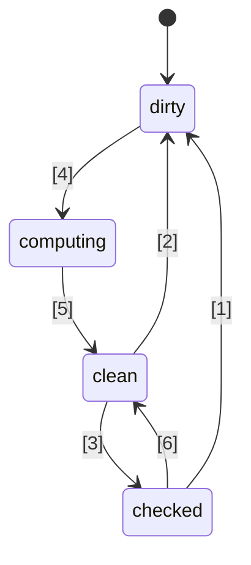
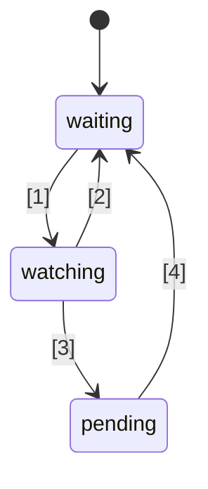

# 🚦 JavaScript Signals standaardvoorstel 🚦


Fase 1 ([uitleg](https://tc39.es/process-document/))

TC39 voorstel-champions: Daniel Ehrenberg, Yehuda Katz, Jatin Ramanathan, Shay Lewis, Kristen Hewell Garrett, Dominic Gannaway, Preston Sego, Milo M, Rob Eisenberg

Oorspronkelijke auteurs: Rob Eisenberg en Daniel Ehrenberg

Dit document beschrijft een vroege gemeenschappelijke richting voor signals in JavaScript, vergelijkbaar met de Promises/A+ inspanning die voorafging aan de door TC39 gestandaardiseerde Promises in ES2015. Probeer het zelf uit met [een polyfill](https://github.com/proposal-signals/signal-polyfill).

Net als Promises/A+, richt deze inspanning zich op het op één lijn brengen van het JavaScript-ecosysteem. Als deze afstemming succesvol is, kan er een standaard ontstaan op basis van die ervaring. Verschillende framework-auteurs werken hier samen aan een gemeenschappelijk model dat hun reactiviteitskern kan ondersteunen. Het huidige concept is gebaseerd op ontwerpinput van de auteurs/beheerders van [Angular](https://angular.io/), [Bubble](https://bubble.io/), [Ember](https://emberjs.com/), [FAST](https://www.fast.design/), [MobX](https://mobx.js.org/), [Preact](https://preactjs.com/), [Qwik](https://qwik.dev/), [RxJS](https://rxjs.dev/), [Solid](https://www.solidjs.com/), [Starbeam](https://www.starbeamjs.com/), [Svelte](https://svelte.dev/), [Vue](https://vuejs.org/), [Wiz](https://blog.angular.io/angular-and-wiz-are-better-together-91e633d8cd5a), en meer…

In tegenstelling tot Promises/A+ proberen we niet een gemeenschappelijke API voor ontwikkelaars te creëren, maar juist de precieze kerneigenschappen van de onderliggende signal-graph te definiëren. Dit voorstel bevat wel een volledig concrete API, maar die is niet bedoeld voor de meeste applicatieontwikkelaars. In plaats daarvan is de signal-API hier beter geschikt voor frameworks om op voort te bouwen, en biedt het interoperabiliteit via een gemeenschappelijke signal-graph en auto-tracking mechanisme.

Het plan voor dit voorstel is om in een vroeg stadium veel te prototypen, inclusief integratie in verschillende frameworks, voordat we verder gaan dan Fase 1. We zijn alleen geïnteresseerd in het standaardiseren van Signals als ze daadwerkelijk geschikt zijn voor gebruik in de praktijk in meerdere frameworks, en echte voordelen bieden boven door frameworks geleverde signals. We hopen dat intensief vroegtijdig prototypen ons deze informatie zal verschaffen. Zie "Status en ontwikkelplan" hieronder voor meer details.

## Achtergrond: Waarom Signals?

Om een complexe gebruikersinterface (UI) te ontwikkelen, moeten JavaScript-applicatieontwikkelaars op een efficiënte manier status opslaan, berekenen, ongeldig maken, synchroniseren en doorgeven aan de viewlaag van de applicatie. UI’s gaan meestal verder dan het beheren van simpele waarden, en omvatten vaak het renderen van berekende status die afhankelijk is van een complexe boom van andere waarden of status die ook zelf berekend wordt. Het doel van Signals is om infrastructuur te bieden voor het beheren van dergelijke applicatiestatus zodat ontwikkelaars zich kunnen richten op de businesslogica in plaats van deze repetitieve details.

Signal-achtige constructies zijn onafhankelijk ook nuttig gebleken in niet-UI-contexten, met name in buildsysteemomgevingen om onnodige herbouw te voorkomen.

Signals worden gebruikt in reactieve programmering om het beheer van updates in applicaties te vereenvoudigen.

> Een declaratief programmeermodel voor updates op basis van veranderingen in status.

uit _[What is Reactivity?](https://www.pzuraq.com/blog/what-is-reactivity)_.

#### Voorbeeld - Een VanillaJS Counter

Gegeven een variabele, `counter`, wil je in de DOM weergeven of de counter even of oneven is. Telkens wanneer de `counter` verandert, wil je de DOM updaten met de nieuwste pariteit. In Vanilla JS zou je zoiets kunnen hebben:

```js
let counter = 0;
const setCounter = (value) => {
  counter = value;
  render();
};

const isEven = () => (counter & 1) == 0;
const parity = () => isEven() ? "even" : "odd";
const render = () => element.innerText = parity();

// Simuleer externe updates aan counter...
setInterval(() => setCounter(counter + 1), 1000);
```
> [!LET OP]  
> Globals worden hier alleen voor demonstratiedoeleinden gebruikt. Voor goed statusbeheer zijn er veel oplossingen, en de voorbeelden in dit voorstel zijn bedoeld om zo minimaal mogelijk te zijn. Dit voorstel moedigt geen globale variabelen aan.


Dit heeft een aantal problemen...

* De `counter`-opzet is omslachtig en bevat veel boilerplate.
* De `counter`-status is sterk gekoppeld aan het renderingsysteem.
* Als de `counter` verandert maar `parity` niet (bijvoorbeeld als counter van 2 naar 4 gaat), dan doen we onnodige berekening van de pariteit en onnodige rendering.
* Wat als een ander deel van onze UI alleen wil renderen als de `counter` wordt bijgewerkt?
* Wat als een ander deel van onze UI alleen afhankelijk is van `isEven` of `parity`?

Zelfs in dit relatief eenvoudige scenario ontstaan er snel verschillende problemen. We zouden dit kunnen proberen op te lossen door pub/sub in te voeren voor de `counter`. Hierdoor kunnen extra afnemers van de `counter` zich abonneren om hun eigen reacties toe te voegen aan statuswijzigingen.

We zitten echter nog steeds met de volgende problemen:

* De renderfunctie, die alleen afhankelijk is van `parity`, moet nu eigenlijk “weten” dat hij op `counter` moet abonneren.
* Het is niet mogelijk de UI bij te werken op basis van alleen `isEven` of `parity`, zonder direct met `counter` te werken.
* We hebben meer boilerplate toegevoegd. Elke keer dat je iets gebruikt, is het niet gewoon een functie aanroepen of een variabele lezen, maar moet je je abonneren en daar updates uitvoeren. Het beheer van afmeldingen is ook bijzonder ingewikkeld.

Nu zouden we enkele problemen kunnen oplossen door niet alleen pub/sub toe te voegen aan `counter`, maar ook aan `isEven` en `parity`. We zouden dan `isEven` moeten abonneren op `counter`, `parity` op `isEven`, en `render` op `parity`. Helaas is niet alleen onze boilerplate-code geëxplodeerd, maar zitten we ook met enorm veel administratie van abonnementen en een potentieel geheugenlek als we niet alles op de juiste manier opruimen. Dus we hebben een paar problemen opgelost, maar een hele nieuwe categorie problemen en veel code gecreëerd. En het ergste is dat we dit hele proces moeten doorlopen voor elk stukje status in ons systeem.

### Introductie van Signals

Databindingsabstraheringen in UI’s voor het model en de view zijn al lang kernonderdelen van UI-frameworks in meerdere programmeertalen, ondanks het ontbreken van een dergelijk mechanisme in JS of het webplatform zelf. Binnen JS-frameworks en -bibliotheken is er veel geëxperimenteerd met verschillende manieren om deze binding te representeren, en de ervaring heeft de kracht getoond van eenrichtingsdatastromen in combinatie met een eersteklas datatype dat een cel van status of berekening uit andere data vertegenwoordigt, tegenwoordig vaak “Signals” genoemd.
Deze eersteklas reactieve waarde-benadering lijkt zijn eerste populaire verschijning in open-source JavaScript webframeworks te hebben gemaakt met [Knockout](https://knockoutjs.com/) [in 2010](https://blog.stevensanderson.com/2010/07/05/introducing-knockout-a-ui-library-for-javascript/). In de jaren daarna zijn er vele variaties en implementaties ontstaan. In de afgelopen 3-4 jaar heeft het Signal-principe en aanverwante benaderingen verder aan terrein gewonnen, waarbij vrijwel elke moderne JavaScript-bibliotheek of -framework iets soortgelijks heeft, onder welke naam dan ook.

Om Signals te begrijpen, bekijken we het bovenstaande voorbeeld, opnieuw vormgegeven met een Signal-API die hieronder verder wordt uitgewerkt.

#### Voorbeeld - Een Signals Counter

```js
const counter = new Signal.State(0);
const isEven = new Signal.Computed(() => (counter.get() & 1) == 0);
const parity = new Signal.Computed(() => isEven.get() ? "even" : "odd");

// Een bibliotheek of framework definieert effecten gebaseerd op andere Signal-primitieven
declare function effect(cb: () => void): (() => void);

effect(() => element.innerText = parity.get());

// Simuleer externe updates aan counter...
setInterval(() => counter.set(counter.get() + 1), 1000);
```

Er zijn een paar dingen die direct opvallen:
* We hebben de omslachtige boilerplate rond de `counter`-variabele uit het vorige voorbeeld geëlimineerd.
* Er is een uniforme API om waarden, berekeningen en neveneffecten af te handelen.
* Er is geen probleem met circulaire verwijzingen of omgekeerde afhankelijkheden tussen `counter` en `render`.
* Er zijn geen handmatige abonnementen nodig, noch boekhouding hiervoor.
* Er is een manier om timing/scheduling van neveneffecten te regelen.

Signals bieden ons veel meer dan alleen wat aan de oppervlakte van de API te zien is:
* **Automatische afhankelijkheidstracering** - Een berekende Signaal ontdekt automatisch van welke andere Signalen hij afhankelijk is, of dat nu eenvoudige waarden zijn of andere berekeningen.
* **Lui evalueren** - Berekeningen worden niet direct geëvalueerd wanneer ze worden gedeclareerd, noch worden ze onmiddellijk geëvalueerd wanneer hun afhankelijkheden veranderen. Ze worden alleen geëvalueerd wanneer hun waarde expliciet wordt opgevraagd.
* **Memoization** - Berekende Signalen cachen hun laatste waarde zodat berekeningen waarvan de afhankelijkheden niet zijn gewijzigd, niet opnieuw hoeven te worden geëvalueerd, ongeacht hoe vaak ze worden benaderd.

## Motivatie voor standaardisatie van Signalen

#### Interoperabiliteit

Elke Signaal-implementatie heeft zijn eigen automatische traceringmechanisme om de bronnen bij te houden die worden aangetroffen bij het evalueren van een berekend Signaal. Dit maakt het moeilijk om modellen, componenten en bibliotheken te delen tussen verschillende frameworks—ze zijn vaak valselijk gekoppeld aan hun view-engine (aangezien Signalen meestal als onderdeel van JS-frameworks worden geïmplementeerd).

Een doel van dit voorstel is om het reactieve model volledig los te koppelen van de rendering-view, zodat ontwikkelaars kunnen migreren naar nieuwe renderingtechnologieën zonder hun niet-UI-code te herschrijven, of gedeelde reactieve modellen in JS kunnen ontwikkelen om te worden ingezet in verschillende contexten. Helaas is het door versiebeheer en duplicatie onpraktisch gebleken om een hoog niveau van delen te bereiken via JS-niveau bibliotheken—ingebouwde functionaliteit biedt een sterkere garantie voor delen.

#### Prestaties/geheugengebruik

Het levert altijd een klein potentieel prestatievoordeel op als er minder code hoeft te worden meegeleverd doordat veelgebruikte bibliotheken ingebouwd zijn, maar implementaties van Signalen zijn over het algemeen vrij klein, dus we verwachten niet dat dit effect erg groot is.

We vermoeden dat native C++-implementaties van signaalgerelateerde datastructuren en algoritmen iets efficiënter kunnen zijn dan wat in JS haalbaar is, met een constante factor. Er worden echter geen algoritmische veranderingen verwacht ten opzichte van wat in een polyfill aanwezig zou zijn; van engines wordt niet verwacht dat ze hier magisch zijn, en de reactiviteitsalgoritmen zelf zullen goed gedefinieerd en ondubbelzinnig zijn.

De championgroep verwacht verschillende implementaties van Signalen te ontwikkelen en deze te gebruiken om deze prestatiemogelijkheden te onderzoeken.

#### DevTools

Met bestaande JS-taal Signaal-bibliotheken kan het moeilijk zijn om zaken als het volgende te traceren:
* De callstack over een keten van berekende Signalen, die de causale keten voor een fout toont
* De referentiegrafiek tussen Signalen, wanneer het ene Signaal afhankelijk is van een ander — belangrijk bij het debuggen van geheugengebruik

Ingebouwde Signalen stellen JS-runtimes en DevTools in staat om mogelijk betere ondersteuning te bieden voor het inspecteren van Signalen, met name voor debugging of prestatieanalyse, of dit nu is ingebouwd in browsers of via een gedeelde extensie. Bestaande tools zoals de elementinspector, performance snapshot en geheugenprofilers kunnen worden bijgewerkt om specifiek Signalen te markeren in hun presentatie van informatie.

#### Secundaire voordelen

##### Voordelen van een standaardbibliotheek

Over het algemeen had JavaScript een vrij minimale standaardbibliotheek, maar een trend binnen TC39 is om van JS meer een "batterijen-inbegrepen" taal te maken, met een hoogwaardige ingebouwde set functionaliteiten. Zo vervangt Temporal moment.js, en een aantal kleine functies, zoals `Array.prototype.flat` en `Object.groupBy`, vervangen veel lodash-use-cases. Voordelen zijn onder meer kleinere bundelgroottes, verbeterde stabiliteit en kwaliteit, minder te leren bij het toetreden tot een nieuw project en een algemeen gedeelde vocabulaire onder JS-ontwikkelaars.

##### HTML/DOM-integratie (een toekomstige mogelijkheid)

Huidig werk binnen W3C en door browserbouwers richt zich op het brengen van native templating naar HTML ([DOM Parts][wicg-pr-1023] en [Template Instantiation][wicg-propsal-template-instantiation]). Daarnaast onderzoekt de W3C Web Components CG de mogelijkheid om Web Components uit te breiden met een volledig declaratieve HTML-API. Voor beide doelen zal uiteindelijk een reactief primitieven nodig zijn in HTML. Daarnaast zijn veel ergonomische verbeteringen aan de DOM door integratie van Signalen denkbaar en ook gevraagd door de gemeenschap.

[wicg-pr-1023]: https://github.com/WICG/webcomponents/pull/1023
[wicg-propsal-template-instantiation]: https://github.com/WICG/webcomponents/blob/gh-pages/proposals/Template-Instantiation.md

> Let op, deze integratie zou een apart traject zijn dat later volgt, en maakt geen deel uit van dit voorstel zelf.

##### Informatie-uitwisseling binnen het ecosysteem (*geen* reden om te shippen)

Standaardisatie-inspanningen kunnen soms al op "community"-niveau nuttig zijn, zelfs zonder veranderingen in browsers. De Signalen-inspanning brengt veel verschillende frameworkauteurs samen voor een diepgaand gesprek over de aard van reactiviteit, algoritmen en interoperabiliteit. Dit is al nuttig gebleken, maar rechtvaardigt geen opname in JS-engines en browsers; Signalen mogen alleen aan de JavaScript-standaard worden toegevoegd als er significante voordelen zijn *buiten* de informatie-uitwisseling binnen het ecosysteem.

## Ontwerpdoelen voor Signalen

Het blijkt dat bestaande Signaalbibliotheken in de kern niet zo veel van elkaar verschillen. Dit voorstel wil voortbouwen op hun succes door de belangrijke kwaliteiten van veel van die bibliotheken te implementeren.

### Kernfeatures

* Een Signaaltype dat staat vertegenwoordigt, d.w.z. een schrijfbaar Signaal. Dit is een waarde die anderen kunnen lezen.
* Een computed/memo/afgeleid Signaaltype, dat afhankelijk is van andere en lui wordt berekend en gecached.
    * De berekening is lui, wat betekent dat berekende Signalen standaard niet opnieuw worden berekend wanneer een van hun afhankelijkheden verandert, maar alleen worden uitgevoerd als iemand ze daadwerkelijk leest.
    * De berekening is "[glitch](https://nl.wikipedia.org/wiki/Reactive_programming#Glitches)-vrij", wat betekent dat er nooit onnodige berekeningen worden uitgevoerd. Dit impliceert dat, wanneer een applicatie een berekend Signaal leest, er een topologische sortering wordt uitgevoerd van de mogelijk vervuilde delen van de graaf die moeten draaien, om dubbele bewerkingen te elimineren.
    * De berekening wordt gecached, wat betekent dat als, sinds de laatste keer dat een afhankelijkheid is gewijzigd, er geen afhankelijkheden zijn gewijzigd, het berekende Signaal *niet* opnieuw wordt berekend wanneer het wordt benaderd.
    * Aangepaste vergelijkingen zijn mogelijk voor zowel berekende Signalen als toestandssignalen, om te bepalen wanneer verdere berekende Signalen die ervan afhankelijk zijn moeten worden bijgewerkt.
* Reacties op de situatie waarin een berekend Signaal een van zijn afhankelijkheden (of geneste afhankelijkheden) "vervuild" raakt en verandert, wat betekent dat de waarde van het Signaal mogelijk verouderd is.
    * Deze reactie is bedoeld om meer significant werk later in te plannen.
    * Effecten worden geïmplementeerd in termen van deze reacties, plus planningsmechanismen op framework-niveau.
    * Berekende signalen moeten kunnen reageren op de vraag of ze geregistreerd zijn als een (geneste) afhankelijkheid van een van deze reacties.
* JS-frameworks in staat stellen hun eigen planning te doen. Geen Promise-achtige ingebouwde, verplichte planning.
    * Synchrone reacties zijn nodig om het later inplannen van werk op basis van frameworklogica mogelijk te maken.
    * Schrijfbewerkingen zijn synchroon en hebben direct effect (een framework dat schrijfbewerkingen wil batchen kan dat erbovenop doen).
    * Het is mogelijk om te scheiden of een effect "vervuild" kan zijn van het daadwerkelijk uitvoeren van het effect (dit maakt een tweefasige effect-planner mogelijk).
* Mogelijkheid om Signalen te lezen *zonder* dat afhankelijkheden worden geregistreerd (`untrack`)
* Samenstelling van verschillende codebases die Signalen/reactiviteit gebruiken mogelijk maken, bijvoorbeeld
    * Meerdere frameworks samen gebruiken wat betreft tracking/reactiviteit zelf (behoudens uitzonderingen, zie hieronder)
    * Framework-onafhankelijke reactieve datastructuren (bijvoorbeeld recursieve reactieve store-proxy, reactieve Map en Set en Array, enz.)

### Soundness

* Ontraden/verbieden van naïef misbruik van synchrone reacties.
    * Risico voor soundness: het kan "[glitches](https://nl.wikipedia.org/wiki/Reactive_programming#Glitches)" blootstellen bij onjuist gebruik: Als rendering direct gebeurt wanneer een Signaal wordt gezet, kan het onvolledige applicatietoestand tonen aan de eindgebruiker. Deze functie moet daarom alleen worden gebruikt om werk voor later intelligent in te plannen, nadat de applicatielogica klaar is.
    * Oplossing: Het lezen en schrijven van een Signaal vanuit een synchrone reactiecallback verbieden.
* Ontraden van `untrack` en het markeren van het onveilige karakter ervan
    * Risico voor soundness: staat toe dat berekende Signalen worden gemaakt waarvan de waarde afhankelijk is van andere Signalen, maar die niet worden bijgewerkt als die Signalen veranderen. Het moet alleen worden gebruikt als de ongevolgde toegang geen invloed heeft op het resultaat van de berekening.
    * Oplossing: De API wordt als "onveilig" aangeduid in de naam.
* Opmerking: Dit voorstel staat toe dat signalen zowel gelezen als geschreven kunnen worden vanuit berekende en effect-signalen, zonder beperkingen op schrijfbewerkingen na lezingen, ondanks het soundness-risico. Deze beslissing is genomen om flexibiliteit en compatibiliteit in de integratie met frameworks te behouden.

### Surface API

* Moet een solide basis zijn voor meerdere frameworks om hun Signalen/reactiviteitsmechanismen te implementeren.
    * Moet een goede basis vormen voor recursieve store-proxies, decorator-gebaseerde class field reactiviteit, en zowel `.value` als `[state, setState]`-achtige APIs.
    * De semantiek kan de geldige patronen uitdrukken die door verschillende frameworks mogelijk worden gemaakt. Bijvoorbeeld, het moet mogelijk zijn dat deze Signalen de basis vormen voor direct gereflecteerde schrijfbewerkingen of schrijfbewerkingen die worden gebundeld en later toegepast.
* Het zou fijn zijn als deze API direct bruikbaar is door JavaScript-ontwikkelaars.
    * Als een functie overeenkomt met een ecosysteemconcept, is het goed om gemeenschappelijke vocabulaire te gebruiken.
        * Het is echter belangrijk om niet letterlijk exact dezelfde namen te gebruiken!
    * Spanning tussen "bruikbaarheid voor JS-ontwikkelaars" en "alle hooks bieden voor frameworks"
        * Idee: Bied alle hooks, maar voeg waar mogelijk fouten toe bij verkeerd gebruik.
        * Idee: Plaats subtiele APIs in een `subtle` namespace, vergelijkbaar met [`crypto.subtle`](https://developer.mozilla.org/en-US/docs/Web/API/Crypto/subtle), om het verschil te markeren tussen APIs die nodig zijn voor geavanceerd gebruik zoals frameworkimplementatie of devtools, versus APIs voor dagelijks applicatiegebruik zoals het instantiëren van signalen voor gebruik met een framework.
* Moet implementeerbaar en bruikbaar zijn met goede prestaties — de surface API veroorzaakt niet te veel overhead
    * Sta subklassen toe, zodat frameworks hun eigen methodes en velden kunnen toevoegen, inclusief private velden. Dit is belangrijk om extra allocaties op frameworkniveau te voorkomen. Zie "Memory management" hieronder.

### Geheugenbeheer

* Indien mogelijk: Een berekend Signaal moet door de garbage collector kunnen worden opgeruimd als er niets levends naar verwijst voor mogelijke toekomstige lezingen, zelfs als het is gekoppeld aan een bredere graaf die actief blijft (bijvoorbeeld door het lezen van een status die actief blijft).
* Merk op dat de meeste frameworks tegenwoordig expliciete verwijdering vereisen van berekende Signals als ze enige referentie hebben naar of van een ander Signal-grafiek die in leven blijft.
* Dit blijkt niet zo erg te zijn wanneer hun levensduur is gekoppeld aan de levensduur van een UI-component, en effecten toch verwijderd moeten worden.
* Als het te duur is om met deze semantiek uit te voeren, dan zouden we expliciete verwijdering (of "ontkoppeling") van berekende Signals aan de onderstaande API moeten toevoegen, die dit momenteel niet heeft.
* Een apart gerelateerd doel: Minimaliseer het aantal toewijzingen, bijvoorbeeld,
    * om een schrijfbare Signal te maken (vermijd twee aparte closures + array)
    * om effecten te implementeren (vermijd een closure voor elke afzonderlijke reactie)
    * In de API voor het observeren van Signal-veranderingen, vermijd het aanmaken van extra tijdelijke datastructuren
    * Oplossing: Klasse-gebaseerde API die hergebruik van methoden en velden in subklassen mogelijk maakt

## API-overzicht

Een eerste idee van een Signal-API staat hieronder. Let op: dit is slechts een vroege conceptversie en we verwachten dat deze in de loop van de tijd zal veranderen. Laten we beginnen met de volledige `.d.ts` om een beeld te krijgen van de algemene structuur, en daarna bespreken we de details van wat dit allemaal betekent.

```ts
interface Signal<T> {
    // Haal de waarde van het signaal op
    get(): T;
}

namespace Signal {
    // Een lees-schrijf Signaal
    class State<T> implements Signal<T> {
        // Maak een status Signaal dat begint met de waarde t
        constructor(t: T, options?: SignalOptions<T>);

        // Haal de waarde van het signaal op
        get(): T;

        // Stel de waarde van het status Signaal in op t
        set(t: T): void;
    }

    // Een Signaal dat een formule is gebaseerd op andere Signal(en)
    class Computed<T = unknown> implements Signal<T> {
        // Maak een Signaal dat evalueert naar de waarde die door de callback wordt geretourneerd.
        // Callback wordt aangeroepen met dit signaal als de this-waarde.
        constructor(cb: (this: Computed<T>) => T, options?: SignalOptions<T>);

        // Haal de waarde van het signaal op
        get(): T;
    }

    // Deze namespace bevat "geavanceerde" functies die beter zijn
    // voor framework-auteurs dan voor applicatie-ontwikkelaars.
    // Vergelijkbaar met `crypto.subtle`
    namespace subtle {
        // Voer een callback uit met alle tracking uitgeschakeld
        function untrack<T>(cb: () => T): T;

        // Haal het huidige berekende signaal op dat signal-lezen bijhoudt, indien aanwezig
        function currentComputed(): Computed | null;

        // Geeft een geordende lijst van alle signalen die door deze zijn geraadpleegd
        // tijdens de laatste evaluatie.
        // Voor een Watcher, lijst van signalen die het observeert.
        function introspectSources(s: Computed | Watcher): (State | Computed)[];

        // Geeft de Watchers terug waarin dit signaal is opgenomen, plus eventuele
        // Computed signalen die dit signaal lazen bij de laatste evaluatie,
        // mits dat computed signaal (recursief) wordt geobserveerd.
        function introspectSinks(s: State | Computed): (Computed | Watcher)[];

        // True als dit signaal "live" is, oftewel als het wordt geobserveerd door een Watcher,
        // of gelezen wordt door een Computed signaal dat (recursief) live is.
        function hasSinks(s: State | Computed): boolean;

        // True als dit element "reactief" is, d.w.z. afhankelijk
        // van een ander signaal. Een Computed waarbij hasSources false is
        // zal altijd dezelfde constante waarde teruggeven.
        function hasSources(s: Computed | Watcher): boolean;

        class Watcher {
            // Wanneer een (recursieve) bron van de Watcher wordt beschreven, roep deze callback aan,
            // als deze niet al is aangeroepen sinds de laatste `watch`-aanroep.
            // Er mogen tijdens de notify geen signalen worden gelezen of geschreven.
            constructor(notify: (this: Watcher) => void);

            // Voeg deze signalen toe aan de Watcher-set, en stel de watcher in om zijn
            // notify-callback uit te voeren de volgende keer dat een signaal in de set (of een van zijn afhankelijkheden) verandert.
            // Kan zonder argumenten worden aangeroepen om alleen de "notified"-status te resetten, zodat
            // de notify-callback opnieuw wordt aangeroepen.
            watch(...s: Signal[]): void;

            // Verwijder deze signalen uit de geobserveerde set (bijvoorbeeld voor een effect dat wordt verwijderd)
            unwatch(...s: Signal[]): void;

            // Geeft de set van bronnen in de Watcher-set die nog "dirty" zijn terug, of een computed signaal
            // met een bron die "dirty" of "pending" is en nog niet opnieuw is geëvalueerd
            getPending(): Signal[];
        }

        // Hooks om te observeren dat een signaal wordt geobserveerd of niet meer wordt geobserveerd
        var watched: Symbol;
        var unwatched: Symbol;
    }

    interface SignalOptions<T> {
        // Aangepaste vergelijkingsfunctie tussen oude en nieuwe waarde. Standaard: Object.is.
        // Het signaal wordt als de this-waarde meegegeven voor context.
        equals?: (this: Signal<T>, t: T, t2: T) => boolean;
```
```ts
// Callback aangeroepen wanneer isWatched true wordt, als het eerder false was
[Signal.subtle.watched]?: (this: Signal<T>) => void;

// Callback aangeroepen wanneer isWatched false wordt, als het eerder true was
[Signal.subtle.unwatched]?: (this: Signal<T>) => void;
}
}
```

### Hoe Signals werken

Een Signal vertegenwoordigt een cel met data die in de loop van de tijd kan veranderen. Signals kunnen "state" zijn (gewoon een waarde die handmatig wordt ingesteld) of "computed" (een formule gebaseerd op andere Signals).

Computed Signals werken door automatisch bij te houden welke andere Signals worden gelezen tijdens hun evaluatie. Wanneer een computed wordt gelezen, controleert deze of een van zijn eerder vastgelegde afhankelijkheden is gewijzigd, en evalueert zichzelf opnieuw indien nodig. Wanneer meerdere computed Signals genest zijn, gaat alle toeschrijving van de tracking naar de binnenste.

Computed Signals zijn lui, oftewel pull-based: ze worden alleen opnieuw geëvalueerd wanneer ze worden opgevraagd, zelfs als een van hun afhankelijkheden eerder is gewijzigd.

De callback die aan computed Signals wordt doorgegeven, moet over het algemeen "puur" zijn in de zin dat het een deterministische, bijwerkingen-vrije functie is van de andere Signals die hij benadert. Tegelijkertijd is het tijdstip waarop de callback wordt aangeroepen deterministisch, waardoor bijwerkingen met zorg kunnen worden gebruikt.

Signals bevatten prominente caching/memoization: zowel state als computed Signals onthouden hun huidige waarde, en starten alleen een herberekening van computed Signals die naar hen verwijzen als ze daadwerkelijk veranderen. Herhaalde vergelijkingen van oude versus nieuwe waarden zijn niet nodig—de vergelijking vindt één keer plaats wanneer de bron-Signal wordt gereset/opnieuw geëvalueerd, en het Signal-mechanisme houdt bij welke zaken die naar dat Signal verwijzen nog niet zijn bijgewerkt op basis van de nieuwe waarde. Intern wordt dit meestal weergegeven via "graph coloring" zoals beschreven in (Milo's blogpost).

Computed Signals volgen hun afhankelijkheden dynamisch—elke keer dat ze worden uitgevoerd, kunnen ze van andere zaken afhankelijk zijn, en die precieze afhankelijkheidsset wordt actueel gehouden in de Signal-grafiek. Dit betekent dat als je een afhankelijkheid alleen in één tak nodig hebt, en de vorige berekening nam de andere tak, een wijziging aan die tijdelijk ongebruikte waarde niet zal zorgen dat de computed Signal wordt herberekend, zelfs niet wanneer deze wordt opgevraagd.

In tegenstelling tot JavaScript Promises verloopt alles in Signals synchroon:
- Het instellen van een Signal op een nieuwe waarde is synchroon en dit wordt direct weerspiegeld bij het lezen van een computed Signal dat er vervolgens van afhankelijk is. Er is geen ingebouwde batching van deze mutatie.
- Het lezen van computed Signals is synchroon—hun waarde is altijd beschikbaar.
- De `notify` callback in Watchers, zoals hieronder uitgelegd, wordt synchroon uitgevoerd, tijdens de `.set()`-aanroep die het heeft getriggerd (maar nadat graph coloring is voltooid).

Net als bij Promises kunnen Signals een foutstatus weergeven: als een callback van een computed Signal een fout gooit, wordt die fout gecachet als een andere waarde, en opnieuw gegooid telkens wanneer het Signal wordt gelezen.

### De Signal-klasse begrijpen

Een `Signal`-instantie vertegenwoordigt de mogelijkheid om een dynamisch veranderende waarde te lezen waarvan de updates in de loop van de tijd worden gevolgd. Het omvat ook impliciet de mogelijkheid om je op het Signal te abonneren, impliciet via een getraceerde toegang vanuit een ander computed Signal.

De API hier is ontworpen om te passen bij de ruwe ecosysteemconsensus onder een groot deel van de Signal-libraries in het gebruik van namen als "signal", "computed" en "state". Toegang tot Computed en State Signals gaat echter via een `.get()`-methode, wat afwijkt van alle populaire Signal-API's, die ofwel een `.value`-achtige accessor gebruiken, of `signal()`-aanroepsyntaxis.

De API is ontworpen om het aantal allocaties te verminderen, zodat Signals geschikt zijn voor integratie in JavaScript-frameworks terwijl dezelfde of betere prestaties worden bereikt dan bestaande framework-aangepaste Signals. Dit betekent:
- State Signals zijn een enkel beschrijfbaar object, dat zowel kan worden opgevraagd als ingesteld vanuit dezelfde referentie. (Zie de implicaties hieronder in de sectie "Capability separation".)
- Zowel State als Computed Signals zijn ontworpen om subclassable te zijn, om frameworks de mogelijkheid te geven extra eigenschappen toe te voegen via publieke en private class fields (evenals methoden voor het gebruik van die state).
- Diverse callbacks (bijv. `equals`, de computed callback) worden aangeroepen met het relevante Signal als de `this`-waarde voor context, zodat er niet per Signal een nieuwe closure nodig is. In plaats daarvan kan context worden opgeslagen in extra eigenschappen van het signal zelf.

Sommige foutcondities die door deze API worden afgedwongen:
- Het is een fout om een computed recursief te lezen.
- De `notify`-callback van een Watcher mag geen enkele signal lezen of schrijven.
- Als een callback van een computed Signal een fout gooit, gooien volgende toegangspogingen tot het Signal die gecachete fout opnieuw, totdat een van de afhankelijkheden verandert en het opnieuw wordt berekend.

Sommige condities die *niet* worden afgedwongen:
- Computed Signals mogen naar andere Signals schrijven, synchroon binnen hun callback.
- Werk dat in de wachtrij wordt gezet door de `notify`-callback van een Watcher mag signals lezen of schrijven, waardoor het mogelijk is om [klassieke React-antipatterns](https://react.dev/learn/you-might-not-need-an-effect) na te bootsen in termen van Signals!

### Effecten implementeren

De hierboven gedefinieerde `Watcher` interface vormt de basis voor het implementeren van typische JS API's voor effecten: callbacks die opnieuw worden uitgevoerd wanneer andere Signals veranderen, puur voor hun bijwerking. De `effect`-functie die hierboven in het eerste voorbeeld werd gebruikt, kan als volgt worden gedefinieerd:

```ts
// Deze functie zou meestal in een library/framework staan, niet in applicatiecode
// LET OP: Deze scheduling-logica is te basic om nuttig te zijn. Niet kopiëren/plakken.
let pending = false;

let w = new Signal.subtle.Watcher(() => {
    if (!pending) {
        pending = true;
        queueMicrotask(() => {
            pending = false;
            for (let s of w.getPending()) s.get();
            w.watch();
        });
    }
});

// Een effect-Signal dat evalueert tot cb, dat een read van
// zichzelf in de microtask queue plant telkens als een van zijn afhankelijkheden kan veranderen
export function effect(cb) {
    let destructor;
    let c = new Signal.Computed(() => { destructor?.(); destructor = cb(); });
    w.watch(c);
    c.get();
    return () => { destructor?.(); w.unwatch(c) };
}
```

De Signal-API bevat geen ingebouwde functie zoals `effect`. Dit komt omdat effect-scheduling subtiel is en vaak samenhangt met framework-rendercycli en andere hoog-niveau framework-specifieke status of strategieën waar JS geen toegang tot heeft.

Een uitleg van de verschillende gebruikte bewerkingen: de `notify`-callback die wordt doorgegeven aan de Watcher-constructor is de functie die wordt aangeroepen wanneer het Signal van een "clean" state (waarvan we weten dat de cache geïnitialiseerd en geldig is) naar een "checked" of "dirty" state gaat (waarbij de cache mogelijk niet geldig is omdat ten minste één van de states waarvan deze recursief afhankelijk is, is gewijzigd).

Aanroepen van `notify` worden uiteindelijk getriggerd door een `.set()`-aanroep op een state Signal. Deze aanroep is synchroon: hij vindt plaats vóórdat `.set` retourneert. Maar het is niet nodig om je zorgen te maken dat deze callback de Signal-grafiek in een half-verwerkte staat waarneemt, omdat tijdens een `notify`-callback geen enkele Signal kan worden gelezen of geschreven, zelfs niet in een `untrack`-aanroep. Omdat `notify` wordt aangeroepen tijdens `.set()`, onderbreekt het een andere logicadraad die mogelijk niet is voltooid. Om Signals te lezen of te schrijven vanuit `notify`, plan werk in om later uit te voeren, bijvoorbeeld door het Signal in een lijst te schrijven die later wordt geraadpleegd, of met `queueMicrotask` zoals hierboven.

Let op: het is prima mogelijk om Signals effectief te gebruiken zonder `Signal.subtle.Watcher` door polling van computed Signals te plannen, zoals Glimmer doet. Toch hebben veel frameworks gemerkt dat het vaak handig is om deze scheduling-logica synchroon te laten uitvoeren, dus de Signals API bevat het.

Zowel computed als state Signals worden door de garbage collector opgeruimd zoals alle JS-waarden. Maar Watchers hebben een speciale manier om dingen in leven te houden: alle Signals die door een Watcher worden bekeken, blijven in leven zolang een van de onderliggende states bereikbaar is, omdat deze een toekomstige `notify`-aanroep (en dan een toekomstige `.get()`) kunnen triggeren. Vergeet daarom niet om `Watcher.prototype.unwatch` aan te roepen om effecten op te ruimen.

### Een onveilig escape hatch

`Signal.subtle.untrack` is een escape hatch waarmee Signals *zonder* tracking kunnen worden gelezen. Deze mogelijkheid is onveilig omdat het mogelijk maakt om computed Signals te maken waarvan de waarde afhangt van andere Signals, maar die niet worden bijgewerkt wanneer die Signals veranderen. Het moet alleen worden gebruikt wanneer de niet-getrackte toegang het resultaat van de berekening niet zal veranderen.

<!--
TODO: Toon voorbeeld waarbij het een goed idee is om untrack te gebruiken

### Gebruik van watched/unwatched
TODO: Toon een voorbeeld van het omzetten van een Observable naar een computed signal, alleen geabonneerd wanneer gebruikt door een effect

TODO: Toon een voorbeeld van een computed signal dat het resultaat van een fetch naar een state weergeeft, welke wordt geannuleerd

### Introspectie voor SSR

TODO: Toon hoe het serialiseren van de signalgraph werkt

TODO: Toon hoe je een signaal kunt "hydrateren" van state naar computed later, met behulp van een paar signalen.
-->

### Voor nu weggelaten

Deze features kunnen later worden toegevoegd, maar zijn niet opgenomen in het huidige concept. Hun weglating is te wijten aan het ontbreken van gevestigde consensus in het ontwerpveld tussen frameworks, evenals het aangetoonde vermogen om hun afwezigheid te omzeilen met mechanismen bovenop het in dit document beschreven Signals-concept. Helaas beperkt de weglating echter de mogelijkheden tot interoperabiliteit tussen frameworks. Naarmate er prototypes van Signals zoals beschreven in dit document worden geproduceerd, zal er worden getracht opnieuw te beoordelen of deze weglatingen de juiste beslissing waren.

* **Async**: Signals zijn in dit model altijd synchroon beschikbaar voor evaluatie. Het is echter vaak handig om bepaalde asynchrone processen te hebben die ertoe leiden dat een signaal wordt ingesteld, en om te begrijpen wanneer een signaal nog steeds "aan het laden" is. Een eenvoudige manier om de laadstatus te modelleren is met uitzonderingen, en het exception-caching gedrag van computed signals werkt redelijk samen met deze techniek. Verbeterde technieken worden besproken in [Issue #30](https://github.com/proposal-signals/proposal-signals/issues/30).
* **Transacties**: Voor overgangen tussen weergaven is het vaak handig om een live state te behouden voor zowel de "from"- als "to"-status. De "to"-status wordt op de achtergrond gerenderd, totdat deze klaar is om over te schakelen (het committen van de transactie), terwijl de "from"-status interactief blijft. Het tegelijkertijd behouden van beide statussen vereist het "forken" van de status van de signalgraph, en het kan zelfs nuttig zijn om meerdere lopende overgangen tegelijk te ondersteunen. Discussie in [Issue #73](https://github.com/proposal-signals/proposal-signals/issues/73).

Sommige mogelijke [gemaksfuncties](https://github.com/proposal-signals/proposal-signals/issues/32) zijn ook weggelaten.

## Status en ontwikkelplan

Dit voorstel staat op de agenda van TC39 van april 2024 voor Stage 1. Het kan momenteel worden beschouwd als "Stage 0".

[Een polyfill](https://github.com/proposal-signals/signal-polyfill) voor dit voorstel is beschikbaar, met enkele basistests. Sommige framework-auteurs zijn begonnen te experimenteren met het vervangen van deze signaalimplementatie, maar dit gebruik bevindt zich nog in een vroeg stadium.

De samenwerkende partijen aan het Signal-voorstel willen bijzonder **conservatief** zijn in hoe we dit voorstel verder brengen, zodat we niet in de val lopen iets te laten landen dat we uiteindelijk betreuren en niet daadwerkelijk gebruiken. Ons plan is om de volgende extra taken uit te voeren, die niet vereist zijn door het TC39-proces, om ervoor te zorgen dat dit voorstel op koers ligt:

Voordat we voorstellen voor Stage 2, zijn we van plan om:
- Meerdere productieklare polyfill-implementaties te ontwikkelen die solide, goed getest zijn (bijvoorbeeld het slagen voor tests van verschillende frameworks en test262-achtige tests), en concurrerend zijn qua performance (zoals geverifieerd met een grondige signal/framework benchmarkset).
- De voorgestelde Signal API te integreren in een groot aantal JS-frameworks die we enigszins representatief achten, en enkele grote applicaties hiermee te laten werken. Testen dat het efficiënt en correct werkt in deze contexten.
- Een goed begrip te hebben van het spectrum van mogelijke uitbreidingen van de API, en te hebben geconcludeerd welke (indien van toepassing) aan dit voorstel moeten worden toegevoegd.

## Signal-algoritmen

Dit gedeelte beschrijft elk van de API's die aan JavaScript worden blootgesteld, in termen van de algoritmen die ze implementeren. Dit kan worden beschouwd als een proto-specificatie, en is in dit vroege stadium opgenomen om één mogelijke set van semantiek vast te leggen, terwijl we nog zeer openstaan voor wijzigingen.

Enkele aspecten van het algoritme:
- De volgorde van het lezen van Signals binnen een computed is significant, en is waarneembaar in de volgorde waarin bepaalde callbacks (zoals `Watcher` wordt aangeroepen, `equals`, de eerste parameter van `new Signal.Computed`, en de `watched`/`unwatched` callbacks) worden uitgevoerd. Dit betekent dat de bronnen van een computed Signal geordend moeten worden opgeslagen.
- Deze vier callbacks kunnen allemaal uitzonderingen genereren, en deze uitzonderingen worden op een voorspelbare manier doorgegeven aan de aanroepende JS-code. De uitzonderingen stoppen *niet* de uitvoering van dit algoritme of laten de graph in een half-verwerkte staat achter. Voor fouten die worden gegooid in de `notify`-callback van een Watcher, wordt die uitzondering doorgegeven aan de `.set()`-aanroep die deze veroorzaakte, met gebruik van een AggregateError als er meerdere uitzonderingen zijn gegooid. De overige (inclusief `watched`/`unwatched`?) worden opgeslagen in de waarde van het Signal, om opnieuw te worden gegooid bij het lezen, en zo'n opnieuw gegooid Signal kan worden gemarkeerd als `~clean~` net als elk ander met een normale waarde.
- Er wordt gezorgd dat er geen circulariteit optreedt bij computed signals die niet "geobserveerd" worden (niet door een Watcher worden geobserveerd), zodat ze onafhankelijk van andere delen van de signalgraph kunnen worden opgeruimd door de garbage collector. Intern kan dit worden geïmplementeerd met een systeem van generatienummers die altijd worden verzameld; opmerking: geoptimaliseerde implementaties kunnen ook lokale generatienummers per node bevatten, of het bijhouden van sommige nummers op geobserveerde signals vermijden.

### Verborgen globale status

Signal-algoritmen moeten bepaalde globale status raadplegen. Deze status is globaal voor de gehele thread, of "agent".

- `computing`: Het binnenste computed of effect Signal dat momenteel opnieuw wordt geëvalueerd door een `.get` of `.run`-aanroep, of `null`. Aanvankelijk `null`.
- `frozen`: Boolean die aangeeft of er momenteel een callback wordt uitgevoerd waarvoor geldt dat de graph niet mag worden aangepast. Aanvankelijk `false`.
- `generation`: Een oplopend geheel getal, beginnend bij 0, gebruikt om bij te houden hoe actueel een waarde is, terwijl circulariteit wordt vermeden.

### De `Signal` namespace

`Signal` is een gewoon object dat dient als namespace voor Signal-gerelateerde klassen en functies.

`Signal.subtle` is een vergelijkbaar intern namespace-object.

### De klasse `Signal.State`

#### `Signal.State` interne slots

- `value`: De huidige waarde van het state signal
- `equals`: De vergelijkingsfunctie die wordt gebruikt bij het wijzigen van waarden
- `watched`: De callback die wordt aangeroepen wanneer het signaal wordt geobserveerd door een effect
- `unwatched`: De callback die wordt aangeroepen wanneer het signaal niet langer wordt geobserveerd door een effect
- `sinks`: Set van geobserveerde signals die afhankelijk zijn van deze

#### Constructor: `Signal.State(initialValue, options)`

1. Stel de `value` van dit Signal in op `initialValue`.
1. Stel de `equals` van dit Signal in op options?.equals
1. Stel de `watched` van dit Signal in op options?.[Signal.subtle.watched]
1. Stel de `unwatched` van dit Signal in op options?.[Signal.subtle.unwatched]
1. Stel de `sinks` van dit Signal in op de lege set

#### Methode: `Signal.State.prototype.get()`

1. Als `frozen` waar is, gooi een uitzondering.
1. Als `computing` niet `undefined` is, voeg dit Signal toe aan de `sources` set van `computing`.
1. OPMERKING: We voegen `computing` pas toe aan de `sinks` set van dit Signal wanneer het wordt geobserveerd door een Watcher.
1. Geef de `value` van dit Signal terug.

#### Methode: `Signal.State.prototype.set(newValue)`

1. Als de huidige uitvoeringscontext `frozen` is, gooi een uitzondering.
1. Voer het "set Signal value"-algoritme uit met dit Signal en de eerste parameter voor de waarde.
1. Als dat algoritme `~clean~` retourneerde, geef dan undefined terug.
1. Zet de `state` van alle `sinks` van dit Signal op (indien het een Computed Signal is) `~dirty~` als ze eerder schoon waren, of (indien het een Watcher is) `~pending~` als het eerder `~watching~` was.
1. Zet de `state` van alle Computed Signal-afhankelijkheden van de sinks (recursief) op `~checked~` als ze eerder `~clean~` waren (laat dirty-markeringen staan), of voor Watchers, `~pending~` als eerder `~watching~`.
1. Voor elke eerder `~watching~` Watcher die bij die recursieve zoekopdracht wordt gevonden, in depth-first volgorde,
    1. Stel `frozen` in op true.
    1. Roep hun `notify`-callback aan (sla eventuele uitzonderingen op, maar negeer de returnwaarde van `notify`).
    1. Zet `frozen` terug op false.
    1. Zet de `state` van de Watcher op `~waiting~`.
1. Als er een uitzondering is gegooid vanuit de `notify`-callbacks, geef die dan door aan de aanroeper nadat alle `notify`-callbacks zijn uitgevoerd. Als er meerdere uitzonderingen zijn, bundel ze dan samen in een AggregateError en gooi die.
1. Geef undefined terug.

### De klasse `Signal.Computed`

#### `Signal.Computed` State machine
De `state` van een Computed Signal kan een van de volgende zijn:

- `~clean~`: De waarde van het Signaal is aanwezig en bekend als niet verouderd.
- `~checked~`: Een (indirecte) bron van dit Signaal is gewijzigd; dit Signaal heeft een waarde maar deze _kan_ verouderd zijn. Of het verouderd is, zal pas bekend zijn nadat alle directe bronnen zijn geëvalueerd.
- `~computing~`: De callback van dit Signaal wordt momenteel uitgevoerd als een neveneffect van een `.get()`-aanroep.
- `~dirty~`: Ofwel heeft dit Signaal een waarde waarvan bekend is dat deze verouderd is, of het is nooit geëvalueerd.

De overgangsgrafiek is als volgt:



De overgangen zijn:
| Nummer | Van | Naar | Voorwaarde | Algoritme |
| ------ | --- | ---- | ---------- | --------- |
| 1 | `~checked~` | `~dirty~` | Een directe bron van dit signaal, die een computed signaal is, is geëvalueerd en zijn waarde is gewijzigd. | Algoritme: herbereken dirty computed Signaal |
| 2 | `~clean~` | `~dirty~` | Een directe bron van dit signaal, die een State is, is ingesteld op een waarde die niet gelijk is aan de vorige waarde. | Methode: `Signal.State.prototype.set(newValue)` |
| 3 | `~clean~` | `~checked~` | Een recursieve, maar niet directe, bron van dit signaal, die een State is, is ingesteld op een waarde die niet gelijk is aan de vorige waarde. | Methode: `Signal.State.prototype.set(newValue)` |
| 4 | `~dirty~` | `~computing~` | We staan op het punt om de `callback` uit te voeren. | Algoritme: herbereken dirty computed Signaal |
| 5 | `~computing~` | `~clean~` | De `callback` is klaar met evalueren en heeft een waarde geretourneerd of een uitzondering gegooid. | Algoritme: herbereken dirty computed Signaal |
| 6 | `~checked~` | `~clean~` | Alle directe bronnen van dit signaal zijn geëvalueerd en zijn allemaal onveranderd gebleken, dus nu weten we dat het niet verouderd is. | Algoritme: herbereken dirty computed Signaal |

#### `Signal.Computed` Interne slots

- `value`: De vorige gecachte waarde van het Signaal, of `~uninitialized~` voor een nooit-gelezen computed Signaal. De waarde kan een uitzondering zijn die opnieuw wordt gegooid wanneer de waarde wordt gelezen. Altijd `undefined` voor effect-signalen.
- `state`: Kan `~clean~`, `~checked~`, `~computing~` of `~dirty~` zijn.
- `sources`: Een geordende set van Signaleren waarvan dit Signaal afhankelijk is.
- `sinks`: Een geordende set van Signaleren die afhankelijk zijn van dit Signaal.
- `equals`: De equals-methode geleverd in de opties.
- `callback`: De callback die wordt aangeroepen om de waarde van het computed Signaal te verkrijgen. Ingesteld op de eerste parameter doorgegeven aan de constructor.

#### `Signal.Computed` Constructor

De constructor stelt in
- `callback` op zijn eerste parameter
- `equals` op basis van opties, standaard `Object.is` als afwezig
- `state` op `~dirty~`
- `value` op `~uninitialized~`

Met [AsyncContext](https://github.com/tc39/proposal-async-context) sluit de callback die aan `new Signal.Computed` wordt doorgegeven over de snapshot van wanneer de constructor werd aangeroepen, en herstelt deze snapshot tijdens de uitvoering.

#### Methode: `Signal.Computed.prototype.get`

1. Als de huidige uitvoeringscontext `frozen` is of als dit Signaal de status `~computing~` heeft, of als dit signaal een Watcher is en `computing` een computed Signaal, gooi een uitzondering.
1. Als `computing` niet `null` is, voeg dit Signaal toe aan de `sources` set van `computing`.
1. OPMERKING: We voegen `computing` niet toe aan de `sinks` set van dit Signaal totdat/tenzij het bekeken wordt door een Watcher.
1. Als de status van dit Signaal `~dirty~` of `~checked~` is: Herhaal de volgende stappen totdat dit Signaal `~clean~` is:
    1. Ga recursief omhoog via `sources` om de diepste, meest linkse (d.w.z. vroegst waargenomen) recursieve bron te vinden die een Computed Signal is gemarkeerd als `~dirty~` (stop de zoektocht bij een `~clean~` Computed Signal, en neem dit Computed Signal mee als laatste om te doorzoeken).
    1. Voer het algoritme "herbereken dirty computed Signaal" uit op dat Signaal.
1. Op dit punt zal de status van dit Signaal `~clean~` zijn, en zullen er geen recursieve bronnen `~dirty~` of `~checked~` zijn. Retourneer de `value` van het Signaal. Als de waarde een uitzondering is, gooi die uitzondering opnieuw.

### De `Signal.subtle.Watcher` klasse

#### `Signal.subtle.Watcher` Statusmachine

De `state` van een Watcher kan een van de volgende zijn:

- `~waiting~`: De `notify` callback is uitgevoerd, of de Watcher is nieuw, maar bekijkt nog geen signalen actief.
- `~watching~`: De Watcher bekijkt actief signalen, maar er zijn nog geen wijzigingen geweest die een `notify` callback noodzakelijk maken.
- `~pending~`: Een afhankelijkheid van de Watcher is gewijzigd, maar de `notify` callback is nog niet uitgevoerd.

De overgangsgrafiek is als volgt:



De overgangen zijn:
| Nummer | Van | Naar | Voorwaarde | Algoritme |
| ------ | --- | ---- | ---------- | --------- |
| 1 | `~waiting~` | `~watching~` | De `watch` methode van de Watcher is aangeroepen. | Methode: `Signal.subtle.Watcher.prototype.watch(...signals)` |
| 2 | `~watching~` | `~waiting~` | De `unwatch` methode van de Watcher is aangeroepen, en het laatst bekeken signaal is verwijderd. | Methode: `Signal.subtle.Watcher.prototype.unwatch(...signals)` |
| 3 | `~watching~` | `~pending~` | Een bekeken signaal kan een nieuwe waarde hebben gekregen. | Methode: `Signal.State.prototype.set(newValue)` |
| 4 | `~pending~` | `~waiting~` | De `notify` callback is uitgevoerd. | Methode: `Signal.State.prototype.set(newValue)` |

#### `Signal.subtle.Watcher` interne slots

- `state`: Kan `~watching~`, `~pending~` of `~waiting~` zijn
- `signals`: Een geordende set van Signaleren die deze Watcher bekijkt
- `notifyCallback`: De callback die wordt aangeroepen wanneer iets verandert. Ingesteld op de eerste parameter doorgegeven aan de constructor.

#### Constructor: `new Signal.subtle.Watcher(callback)`

1. `state` wordt ingesteld op `~waiting~`.
1. Initialiseer `signals` als een lege set.
1. `notifyCallback` wordt ingesteld op de callback parameter.
Met [AsyncContext](https://github.com/tc39/proposal-async-context) sluit de callback die aan `new Signal.subtle.Watcher` wordt doorgegeven *niet* aan bij de snapshot van het moment waarop de constructor werd aangeroepen, zodat contextuele informatie rond de schrijfoperatie zichtbaar is.

#### Methode: `Signal.subtle.Watcher.prototype.watch(...signals)`

1. Als `frozen` waar is, gooi een uitzondering.
1. Als een van de argumenten geen signaal is, gooi een uitzondering.
1. Voeg alle argumenten toe aan het einde van de `signals` van dit object.
1. Voor elk nieuw bekeken signaal, van links naar rechts,
    1. Voeg deze watcher toe als een `sink` aan dat signaal.
    1. Als dit de eerste sink was, ga dan recursief naar boven naar de bronnen om dat signaal als sink toe te voegen.
    1. Zet `frozen` op waar.
    1. Roep de `watched` callback aan indien deze bestaat.
    1. Herstel `frozen` naar onwaar.
1. Als de `state` van het Signaal `~waiting~` is, zet deze dan op `~watching~`.

#### Methode: `Signal.subtle.Watcher.prototype.unwatch(...signals)`

1. Als `frozen` waar is, gooi een uitzondering.
1. Als een van de argumenten geen signaal is, of niet door deze watcher wordt bekeken, gooi een uitzondering.
1. Voor elk signaal in de argumenten, van links naar rechts,
    1. Verwijder dat signaal uit de `signals`-set van deze Watcher.
    1. Verwijder deze Watcher uit de `sink`-set van dat Signaal.
    1. Als de `sink`-set van dat Signaal leeg is geworden, verwijder dat Signaal dan als sink uit elk van zijn bronnen.
    1. Zet `frozen` op waar.
    1. Roep de `unwatched` callback aan indien deze bestaat.
    1. Herstel `frozen` naar onwaar.
1. Als de watcher nu geen `signals` meer heeft, en zijn `state` is `~watching~`, zet deze dan op `~waiting~`.

#### Methode: `Signal.subtle.Watcher.prototype.getPending()`

1. Retourneer een Array met het deel van `signals` dat Computed Signals zijn met de status `~dirty~` of `~pending~`.

### Methode: `Signal.subtle.untrack(cb)`

1. Laat `c` de huidige `computing` state van de uitvoeringscontext zijn.
1. Zet `computing` op null.
1. Roep `cb` aan.
1. Herstel `computing` naar `c` (ook als `cb` een uitzondering gooide).
1. Retourneer de returnwaarde van `cb` (gooi eventuele uitzondering opnieuw).

Opmerking: untrack haalt je niet uit de `frozen`-status, die strikt wordt gehandhaafd.

### Methode: `Signal.subtle.currentComputed()`

1. Retourneer de huidige `computing` waarde.

### Algemene algoritmen

##### Algoritme: herbereken dirty computed Signal

1. Maak de `sources`-set van dit Signaal leeg en verwijder het uit de `sinks`-sets van die bronnen.
1. Bewaar de vorige `computing`-waarde en zet `computing` op dit Signaal.
1. Zet de state van dit Signaal op `~computing~`.
1. Voer de callback van dit computed Signaal uit, gebruik dit Signaal als de this-waarde. Bewaar de returnwaarde, en als de callback een uitzondering gooide, sla die op voor hergooien.
1. Herstel de vorige `computing`-waarde.
1. Pas het "set Signal value"-algoritme toe op de returnwaarde van de callback.
2. Zet de state van dit Signaal op `~clean~`.
1. Als dat algoritme `~dirty~` retourneerde: markeer alle sinks van dit Signaal als `~dirty~` (voorheen konden de sinks een mix zijn van checked en dirty). (Of, als dit niet bekeken wordt, neem dan een nieuw generatienummer aan om vuilheid aan te geven, of iets dergelijks.)
1. Anders, als dat algoritme `~clean~` retourneerde: Markeer in dit geval voor elke `~checked~` sink van dit Signaal, als al zijn bronnen nu schoon zijn, dat Signaal ook als `~clean~`. Pas deze opruimstap recursief toe op verdere sinks, op alle nieuw schone Signals die gecontroleerde sinks hebben. (Of, als dit niet bekeken wordt, geef dit op een of andere manier aan, zodat de opruiming uitgesteld kan doorgaan.)

##### Set Signal value algoritme

1. Als aan dit algoritme een waarde is doorgegeven (in tegenstelling tot een uitzondering voor hergooien, uit het recalculate dirty computed Signal algoritme):
    1. Roep de `equals`-functie van dit Signaal aan, met als parameters de huidige `value`, de nieuwe waarde, en dit Signaal. Als een uitzondering wordt gegooid, sla die uitzondering op (voor hergooien bij lezen) als de waarde van het Signaal en ga verder alsof de callback false had teruggegeven.
    1. Als die functie true retourneert, retourneer `~clean~`.
1. Zet de `value` van dit Signaal op de parameter.
1. Retourneer `~dirty~`

## FAQ

**V**: Is het niet wat vroeg om iets te standaardiseren rond Signals, terwijl ze pas sinds 2022 een hype zijn? Moeten we ze niet meer tijd geven om te evolueren en te stabiliseren?

**A**: De huidige status van Signals in webframeworks is het resultaat van meer dan 10 jaar continue ontwikkeling. Nu de investeringen toenemen, zoals in de afgelopen jaren, naderen bijna alle webframeworks een zeer vergelijkbaar kernmodel van Signals. Dit voorstel is het resultaat van een gedeelde ontwerp-oefening tussen een groot aantal huidige leiders in webframeworks, en zal niet worden doorgezet naar standaardisatie zonder de validatie van die groep domeinexperts in diverse contexten.

#### Hoe worden Signals gebruikt?

**V**: Kunnen ingebouwde Signals überhaupt door frameworks worden gebruikt, gezien hun nauwe integratie met rendering en eigenaarschap?

**A**: De onderdelen die meer frameworkspecifiek zijn, bevinden zich vooral op het gebied van effecten, scheduling en eigenaarschap/opruiming, waar dit voorstel geen oplossing voor biedt. Onze eerste prioriteit met het prototypen van standards-track Signals is te valideren dat ze "onder" bestaande frameworks kunnen functioneren, compatibel en met goede prestaties.

**V**: Is de Signal API bedoeld om direct door applicatie-ontwikkelaars te worden gebruikt, of om door frameworks te worden ingepakt?

**A**: Hoewel deze API direct door applicatie-ontwikkelaars gebruikt kan worden (tenminste het deel dat niet binnen de `Signal.subtle` namespace valt), is hij niet ontworpen voor bijzondere ergonomie. In plaats daarvan staan de behoeften van bibliotheek/framework-auteurs voorop. De meeste frameworks zullen zelfs de basis-API’s `Signal.State` en `Signal.Computed` omwikkelen met iets dat hun ergonomische voorkeur uitdrukt. In de praktijk is het meestal het beste om Signals via een framework te gebruiken, dat lastigere functionaliteiten beheert (zoals Watcher, `untrack`), evenals eigenaarschap en opruiming (bijvoorbeeld bepalen wanneer signals aan watchers moeten worden toegevoegd of verwijderd), en het plannen van rendering naar de DOM--dit voorstel probeert die problemen niet op te lossen.

**V**: Moet ik Signals die bij een widget horen afbreken wanneer die widget wordt vernietigd? Wat is de API daarvoor?

**A**: De relevante teardown-operatie hier is `Signal.subtle.Watcher.prototype.unwatch`. Alleen bekeken Signals moeten worden opgeschoond (door ze te unwatchen), terwijl niet-bekeken Signals automatisch garbage-collected kunnen worden.

**V**: Werken Signals met VDOM, of direct met de onderliggende HTML DOM?

**A**: Ja! Signals zijn onafhankelijk van renderingtechnologie. Bestaande JavaScript-frameworks die Signal-achtige constructies gebruiken, integreren met VDOM (bijv. Preact), de native DOM (bijv. Solid) en een combinatie (bijv. Vue). Hetzelfde zal mogelijk zijn met ingebouwde Signals.

**V**: Zal het ergonomisch zijn om Signals te gebruiken in de context van op klassen gebaseerde frameworks zoals Angular en Lit? En wat met compilergebaseerde frameworks zoals Svelte?

**A**: Klassevelden kunnen Signal-based worden gemaakt met een eenvoudige accessor decorator, zoals te zien is in [de Signal polyfill readme](https://github.com/proposal-signals/signal-polyfill#combining-signals-and-decorators). Signals sluiten zeer nauw aan bij Svelte 5's Runes--het is eenvoudig voor een compiler om runes naar de hier gedefinieerde Signal API te transformeren, en dit is in feite wat Svelte 5 intern doet (maar dan met een eigen Signals-bibliotheek).

**V**: Werken Signals met SSR? Hydration? Resumability?

**A**: Ja. Qwik gebruikt Signals zeer effectief met beide eigenschappen, en andere frameworks hebben andere goed ontwikkelde benaderingen voor hydration met Signals met verschillende trade-offs. We denken dat het mogelijk is om Qwik's resumable Signals te modelleren met een State en Computed signal die aan elkaar gekoppeld zijn, en zijn van plan dit in code te bewijzen.
**V**: Werken Signals met een eenrichtingsdatastroom zoals React doet?

**A**: Ja, Signals zijn een mechanisme voor een eenrichtingsdatastroom. Signal-gebaseerde UI-frameworks laten je je weergave uitdrukken als een functie van het model (waar het model Signals bevat). Een grafiek van state- en computed Signals is per constructie acyclisch. Het is ook mogelijk om React-antipatronen te recreëren binnen Signals (!), bijvoorbeeld het Signal-equivalent van een `setState` binnen `useEffect` is om een Watcher te gebruiken om een schrijfopdracht naar een State signal te plannen.

**V**: Hoe verhouden signals zich tot state management systemen zoals Redux? Moedigen signals ongestructureerde state aan?

**A**: Signals kunnen een efficiënte basis vormen voor winkelachtige state management abstracties. Een veelvoorkomend patroon in meerdere frameworks is een object gebaseerd op een Proxy die intern eigenschappen weergeeft met behulp van Signals, bijvoorbeeld [Vue `reactive()`](https://vuejs.org/api/reactivity-core.html#reactive), of [Solid stores](https://docs.solidjs.com/concepts/stores). Deze systemen maken flexibele groepering van state mogelijk op het juiste abstractieniveau voor de specifieke applicatie.

**V**: Wat bieden Signals dat `Proxy` momenteel niet aankan?

**A**: Proxies en Signals zijn complementair en werken goed samen. Proxies laten je oppervlakkige objectbewerkingen onderscheppen en signals coördineren een afhankelijkheidsgrafiek (van cellen). Een Proxy ondersteunen met Signals is een geweldige manier om een geneste reactieve structuur te maken met uitstekende ergonomie.

In dit voorbeeld kunnen we een proxy gebruiken om het signal een getter- en setter-eigenschap te geven in plaats van de `get`- en `set`-methoden te gebruiken:
```js
const a = new Signal.State(0);
const b = new Proxy(a, {
  get(target, property, receiver) {
    if (property === 'value') {
      return target.get():
    }
  }
  set(target, property, value, receiver) {
    if (property === 'value') {
      target.set(value)!
    }
  }
});

// gebruik in een hypothetische reactieve context:
<template>
  {b.value}

  <button onclick={() => {
    b.value++;
  }}>verander</button>
</template>
```
wanneer je een renderer gebruikt die is geoptimaliseerd voor fijne reactiviteit, zal het klikken op de knop de `b.value`-cel bijwerken.

Zie:
- voorbeelden van geneste reactieve structuren gemaakt met zowel Signals als Proxies: [signal-utils](https://github.com/NullVoxPopuli/signal-utils/tree/main/src)
- voorbeeld van eerdere implementaties die de relatie tonen tussen reactieve data en proxies: [tracked-built-ins](https://github.com/tracked-tools/tracked-built-ins/tree/master/addon/src/-private)
- [discussie](https://github.com/proposal-signals/proposal-signals/issues/101#issuecomment-2029802574).

#### Hoe werken Signals?

**V**: Zijn Signals push-based of pull-based?

**A**: Evaluatie van computed Signals is pull-based: computed Signals worden alleen geëvalueerd wanneer `.get()` wordt aangeroepen, zelfs als de onderliggende state veel eerder is gewijzigd. Tegelijkertijd kan het wijzigen van een State signal onmiddellijk een Watcher-callback activeren, waarbij de notificatie "gepusht" wordt. Signals kunnen dus worden gezien als een "push-pull" constructie.

**V**: Introduceren Signals non-determinisme in JavaScript-uitvoering?

**A**: Nee. Ten eerste hebben alle Signal-operaties goed gedefinieerde semantiek en volgorde, en zullen ze niet verschillen tussen conforme implementaties. Op een hoger niveau volgen Signals een bepaald aantal invarianties, waarmee ze "sound" zijn. Een computed Signal observeert altijd de Signal-grafiek in een consistente toestand, en zijn uitvoering wordt niet onderbroken door andere Signal-mutatiecode (behalve voor dingen die het zelf aanroept). Zie de bovenstaande beschrijving.

**V**: Wanneer ik naar een state Signal schrijf, wanneer wordt de update van het computed Signal gepland?

**A**: Dat wordt niet gepland! Het computed Signal zal zichzelf opnieuw berekenen de volgende keer dat iemand het uitleest. Synchronously, een Watcher's `notify` callback kan worden aangeroepen, waardoor frameworks een uitlezing kunnen plannen op het moment dat zij dat gepast vinden.

**V**: Wanneer worden schrijfbewerkingen naar state Signals van kracht? Onmiddellijk, of worden ze gebatcht?

**A**: Schrijfbewerkingen naar state Signals worden onmiddellijk doorgevoerd—de volgende keer dat een computed Signal dat afhankelijk is van het state Signal wordt uitgelezen, zal het zichzelf opnieuw berekenen indien nodig, zelfs als dit in de direct volgende regel code is. De luiheid die inherent is aan dit mechanisme (dat computed Signals alleen worden berekend wanneer ze worden uitgelezen) betekent echter dat de berekeningen in de praktijk gebatcht kunnen plaatsvinden.

**V**: Wat betekent het dat Signals "glitch-free" uitvoering mogelijk maken?

**A**: Eerdere push-based modellen voor reactiviteit kenden het probleem van overbodige berekening: Als een update van een state Signal het computed Signal meteen laat draaien, kan dit uiteindelijk een update naar de UI pushen. Maar deze schrijfopdracht naar de UI kan voortijdig zijn, als er nog een andere wijziging aan het oorspronkelijke state Signal zou komen vóór het volgende frame. Soms werden onnauwkeurige tussenliggende waarden zelfs aan eindgebruikers getoond door zulke [glitches](https://en.wikipedia.org/wiki/Reactive_programming#Glitches). Signals vermijden deze dynamiek door pull-based te zijn, in plaats van push-based: Op het moment dat het framework de rendering van de UI plant, haalt het de juiste updates op, waardoor verspilde arbeid wordt voorkomen, zowel in berekening als in het schrijven naar de DOM.

**V**: Wat betekent het dat Signals "lossy" zijn?

**A**: Dit is de keerzijde van glitch-free uitvoering: Signals vertegenwoordigen een cel van data—alleen de directe actuele waarde (die kan veranderen), niet een stroom van data in de tijd. Dus als je twee keer achter elkaar naar een state Signal schrijft, zonder iets anders te doen, gaat de eerste schrijfopdracht "verloren" en wordt deze nooit gezien door een computed Signal of effect. Dit wordt gezien als een feature, niet als een bug—voor datastromen zijn andere constructen (zoals async iterables, observables) meer geschikt.

**V**: Zullen native Signals sneller zijn dan bestaande JS Signal-implementaties?

**A**: Hopelijk wel (met een kleine constante factor), maar dat moet nog bewezen worden in code. JS-engines zijn geen magie, en zullen uiteindelijk dezelfde soorten algoritmen moeten implementeren als JS-implementaties van Signals. Zie de bovenstaande sectie over prestaties.

#### Waarom zijn Signals op deze manier ontworpen?

**V**: Waarom bevat dit voorstel geen `effect()`-functie, terwijl effecten nodig zijn voor praktisch gebruik van Signals?

**A**: Effecten zijn inherent verbonden aan scheduling en disposal, die door frameworks worden beheerd en buiten de scope van dit voorstel vallen. In plaats daarvan bevat dit voorstel de basis voor het implementeren van effecten via de meer low-level `Signal.subtle.Watcher` API.

**V**: Waarom zijn abonnementen automatisch in plaats van een handmatige interface te bieden?

**A**: Ervaring heeft geleerd dat handmatige abonnementsinterfaces voor reactiviteit onergonomisch en foutgevoelig zijn. Automatische tracking is meer composable en is een kernfunctie van Signals.

**V**: Waarom wordt de callback van de `Watcher` synchronisch uitgevoerd, in plaats van gepland in een microtask?

**A**: Omdat de callback geen Signals kan lezen of schrijven, ontstaat er geen inconsistentie door deze synchronisch aan te roepen. Een typische callback voegt een Signal toe aan een Array om later te lezen, of zet ergens een bit. Het is onnodig en onpraktisch duur om voor al deze acties een aparte microtask te maken.

**V**: Deze API mist enkele mooie dingen die mijn favoriete framework biedt, waardoor het makkelijker wordt om met Signals te programmeren. Kan dat ook aan de standaard worden toegevoegd?

**A**: Misschien. Diverse uitbreidingen worden nog overwogen. Dien gerust een issue in om een discussie te starten over een ontbrekende functie die je belangrijk vindt.

**V**: Kan deze API in omvang of complexiteit worden verminderd?

**A**: Het is zeker een doel om deze API minimaal te houden, en we hebben geprobeerd dat te doen met wat hierboven gepresenteerd is. Als je ideeën hebt voor zaken die verwijderd kunnen worden, dien dan een issue in om dit te bespreken.

#### Hoe worden Signals gestandaardiseerd?

**V**: Moeten we het standaardisatieproces op dit gebied niet beginnen met een primitiever concept, zoals observables?
**A**: Observables kunnen een goed idee zijn voor bepaalde zaken, maar ze lossen de problemen die Signals willen aanpakken niet op. Zoals hierboven beschreven, zijn observables of andere publish/subscribe-mechanismen geen volledige oplossing voor veel soorten UI-programmering, vanwege te veel foutgevoelige configuratiewerk voor ontwikkelaars en verspilde inspanning door een gebrek aan luiheid, naast andere problemen.

**Q**: Waarom worden Signals voorgesteld bij TC39 in plaats van bij de DOM, aangezien de meeste toepassingen webgebaseerd zijn?

**A**: Sommige coauteurs van dit voorstel zijn geïnteresseerd in niet-web UI-omgevingen als doel, maar tegenwoordig kan beide geschikt zijn, aangezien web-API's steeds vaker buiten het web worden geïmplementeerd. Uiteindelijk hoeven Signals niet afhankelijk te zijn van DOM-API's, dus beide opties werken. Als iemand een sterke reden heeft waarom deze groep zou moeten overstappen, laat het ons dan weten in een issue. Voor nu hebben alle bijdragers de TC39-intellectuele eigendomsovereenkomsten ondertekend en is het plan om dit aan TC39 te presenteren.

**Q**: Hoe lang duurt het voordat ik standaard Signals kan gebruiken?

**A**: Er is al een polyfill beschikbaar, maar het is het beste om niet op de stabiliteit ervan te vertrouwen, aangezien deze API verandert tijdens het reviewproces. Over enkele maanden of een jaar zou er een hoogwaardige, stabiele polyfill met hoge prestaties bruikbaar moeten zijn, maar deze zal nog steeds onderhevig zijn aan commissieherzieningen en is nog niet standaard. Volgens het gebruikelijke traject van een TC39-voorstel zal het naar verwachting minstens 2-3 jaar duren voordat Signals native beschikbaar zijn in alle browsers, ook in oudere versies, zodat polyfills niet meer nodig zijn.

**Q**: Hoe zorgen we ervoor dat we niet te snel het verkeerde type Signals standaardiseren, net zoals {{JS/web feature die je niet leuk vindt}}?

**A**: De auteurs van dit voorstel zijn van plan een extra stap te zetten met prototyping en bewijsvoering voordat ze een verzoek tot faseverhoging bij TC39 indienen. Zie "Status en ontwikkelplan" hierboven. Als je hiaten in dit plan ziet of mogelijkheden voor verbetering, dien dan een issue in met uitleg.


---


Tranlated By [Open Ai Tx](https://github.com/OpenAiTx/OpenAiTx) | Last indexed: 2025-06-28


---