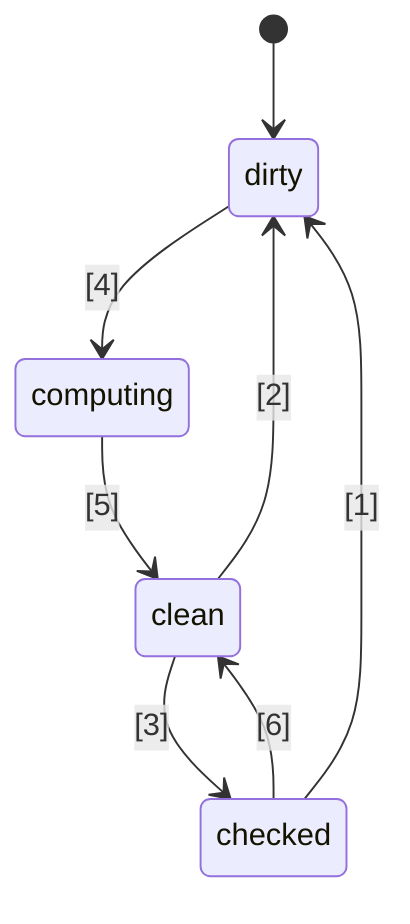
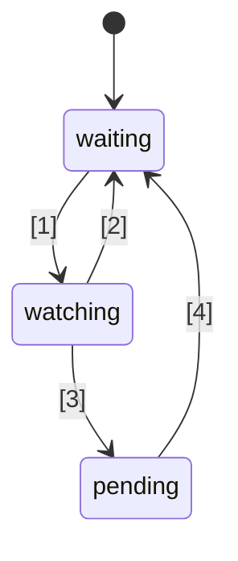

# 🚦 Propozycja standardu JavaScript Signals 🚦


Etap 1 ([wyjaśnienie](https://tc39.es/process-document/))

Liderzy propozycji TC39: Daniel Ehrenberg, Yehuda Katz, Jatin Ramanathan, Shay Lewis, Kristen Hewell Garrett, Dominic Gannaway, Preston Sego, Milo M, Rob Eisenberg

Oryginalni autorzy: Rob Eisenberg i Daniel Ehrenberg

Ten dokument opisuje wczesny wspólny kierunek dla sygnałów w JavaScript, podobnie jak wysiłek Promises/A+, który poprzedził ustandaryzowanie Promise przez TC39 w ES2015. Wypróbuj samodzielnie, korzystając z [polyfill](https://github.com/proposal-signals/signal-polyfill).

Podobnie jak Promises/A+, ten wysiłek koncentruje się na ujednoliceniu ekosystemu JavaScript. Jeśli to ujednolicenie się powiedzie, na podstawie tych doświadczeń może powstać standard. Kilku autorów frameworków współpracuje tutaj nad wspólnym modelem, który mógłby stanowić podstawę ich mechanizmów reaktywności. Aktualny szkic opiera się na wkładzie projektowym autorów/opiekunów [Angular](https://angular.io/), [Bubble](https://bubble.io/), [Ember](https://emberjs.com/), [FAST](https://www.fast.design/), [MobX](https://mobx.js.org/), [Preact](https://preactjs.com/), [Qwik](https://qwik.dev/), [RxJS](https://rxjs.dev/), [Solid](https://www.solidjs.com/), [Starbeam](https://www.starbeamjs.com/), [Svelte](https://svelte.dev/), [Vue](https://vuejs.org/), [Wiz](https://blog.angular.io/angular-and-wiz-are-better-together-91e633d8cd5a) i innych…

W odróżnieniu od Promises/A+, nie próbujemy rozwiązywać wspólnego API dla deweloperów, ale raczej precyzyjne, podstawowe semantyki leżącego u podstaw grafu sygnałów. Propozycja ta zawiera w pełni konkretny interfejs API, ale nie jest on przeznaczony dla większości programistów aplikacji. Zamiast tego, przedstawione tu API sygnałów lepiej nadaje się jako podstawa do budowy frameworków, zapewniając interoperacyjność poprzez wspólny graf sygnałów i mechanizm automatycznego śledzenia zależności.

Plan dla tej propozycji zakłada przeprowadzenie znacznych wczesnych prototypów, w tym integrację z kilkoma frameworkami, zanim wyjdziemy poza Etap 1. Jesteśmy zainteresowani standaryzacją Signals tylko wtedy, gdy będą one praktycznie użyteczne w wielu frameworkach i zapewnią realne korzyści w porównaniu do sygnałów dostarczanych przez frameworki. Mamy nadzieję, że szeroko zakrojone prototypowanie dostarczy nam tych informacji. Zobacz "Status i plan rozwoju" poniżej, aby uzyskać więcej szczegółów.

## Tło: Dlaczego Signals?

Aby stworzyć złożony interfejs użytkownika (UI), programiści aplikacji JavaScript muszą przechowywać, obliczać, unieważniać, synchronizować i przekazywać stan do warstwy widoku aplikacji w efektywny sposób. UI zwykle obejmuje więcej niż tylko zarządzanie prostymi wartościami; często wymaga renderowania stanu wyliczonego na podstawie złożonego drzewa innych wartości lub stanu, który również jest obliczany. Celem Signals jest zapewnienie infrastruktury do zarządzania takim stanem aplikacji, aby programiści mogli skupić się na logice biznesowej, zamiast na powtarzalnych detalach.

Konstrukcje podobne do sygnałów okazały się przydatne także w kontekstach nie związanych z UI, szczególnie w systemach budowania, aby unikać niepotrzebnych przebudów.

Sygnały są używane w programowaniu reaktywnym, aby wyeliminować potrzebę ręcznego zarządzania aktualizacją w aplikacjach.

> Deklaratywny model programowania do aktualizacji na podstawie zmian stanu.

z _[What is Reactivity?](https://www.pzuraq.com/blog/what-is-reactivity)_.

#### Przykład – licznik w VanillaJS

Mając zmienną `counter`, chcesz wyrenderować w DOM informację, czy licznik jest parzysty czy nieparzysty. Za każdym razem, gdy `counter` się zmienia, chcesz zaktualizować DOM z najnowszą parzystością. W czystym JS możesz mieć coś takiego:

```js
let counter = 0;
const setCounter = (value) => {
  counter = value;
  render();
};

const isEven = () => (counter & 1) == 0;
const parity = () => isEven() ? "even" : "odd";
const render = () => element.innerText = parity();

// Symulacja zewnętrznych aktualizacji licznika...
setInterval(() => setCounter(counter + 1), 1000);
```
> [!NOTE]  
> Zmienne globalne są tutaj używane wyłącznie do celów demonstracyjnych. Prawidłowe zarządzanie stanem ma wiele rozwiązań, a przykłady w tej propozycji mają być jak najbardziej minimalne. Propozycja nie zaleca używania zmiennych globalnych.


To rozwiązanie ma kilka problemów...

* Konfiguracja `counter` jest rozbudowana i pełna powtarzalnego kodu.
* Stan `counter` jest silnie powiązany z systemem renderowania.
* Jeśli `counter` się zmienia, ale `parity` nie (np. licznik przechodzi z 2 na 4), wykonujemy niepotrzebne obliczenia parzystości i zbędne renderowanie.
* Co jeśli inna część UI chce się wyrenderować tylko podczas aktualizacji `counter`?
* Co jeśli inna część UI zależy wyłącznie od `isEven` lub `parity`?

Nawet w tym stosunkowo prostym scenariuszu szybko pojawia się szereg problemów. Możemy próbować je obejść, wprowadzając pub/sub dla `counter`. Pozwoliłoby to dodatkowym odbiorcom `counter` zasubskrybować i reagować na zmiany stanu.

Jednak nadal pozostają następujące problemy:

* Funkcja renderująca, która zależy tylko od `parity`, musi „wiedzieć”, że tak naprawdę powinna subskrybować `counter`.
* Nie da się aktualizować UI na podstawie samego `isEven` lub `parity` bez bezpośredniej interakcji z `counter`.
* Zwiększyliśmy ilość powtarzalnego kodu. Za każdym razem, gdy coś wykorzystujemy, nie wystarczy już wywołać funkcji lub odczytać zmiennej, ale trzeba subskrybować i obsługiwać tam aktualizacje. Zarządzanie wypisaniem z subskrypcji jest również szczególnie skomplikowane.

Możemy rozwiązać kilka problemów, dodając pub/sub nie tylko do `counter`, ale także do `isEven` i `parity`. Wtedy musielibyśmy subskrybować `isEven` do `counter`, `parity` do `isEven`, a `render` do `parity`. Niestety, nie tylko nasz kod eksplodował objętościowo, ale mamy mnóstwo pracy z zarządzaniem subskrypcjami i potencjalną katastrofą wycieków pamięci, jeśli nie posprzątamy wszystkiego we właściwy sposób. Rozwiązaliśmy więc część problemów, ale stworzyliśmy zupełnie nową kategorię trudności i dużo kodu. Co gorsza, cały ten proces trzeba powtarzać dla każdego fragmentu stanu w systemie.

### Wprowadzenie Signals

Abstrakcje wiązania danych w UI między modelem a widokiem od dawna są podstawą frameworków UI w różnych językach programowania, mimo braku takiego mechanizmu wbudowanego w JS czy platformę webową. W ramach frameworków i bibliotek JS eksperymentowano z różnymi sposobami reprezentacji tego powiązania, a doświadczenie pokazało siłę jednokierunkowego przepływu danych w połączeniu z pierwszorzędnym typem danych reprezentującym komórkę stanu lub obliczenie pochodne od innych danych, obecnie często nazywane „Signals”.
To podejście z pierwszorzędnymi wartościami reaktywnymi po raz pierwszy pojawiło się w popularnych open-source'owych frameworkach JavaScript wraz z [Knockout](https://knockoutjs.com/) [w 2010 roku](https://blog.stevensanderson.com/2010/07/05/introducing-knockout-a-ui-library-for-javascript/). Od tego czasu powstało wiele wariacji i implementacji. W ciągu ostatnich 3-4 lat prymityw Signal i pokrewne podejścia zyskały jeszcze większą popularność, a niemal każda nowoczesna biblioteka lub framework JavaScript ma coś podobnego – pod jedną lub drugą nazwą.

Aby zrozumieć Signals, spójrzmy na powyższy przykład, przeprojektowany z użyciem API Signal opisanym poniżej.

#### Przykład – licznik z Signals

```js
const counter = new Signal.State(0);
const isEven = new Signal.Computed(() => (counter.get() & 1) == 0);
const parity = new Signal.Computed(() => isEven.get() ? "even" : "odd");

// Biblioteka lub framework definiuje efekty bazujące na innych prymitywach Signal
declare function effect(cb: () => void): (() => void);

effect(() => element.innerText = parity.get());

// Symulacja zewnętrznych aktualizacji licznika...
setInterval(() => counter.set(counter.get() + 1), 1000);
```

Od razu widać kilka rzeczy:
* Wyeliminowaliśmy rozbudowaną powtarzalność wokół zmiennej `counter` z poprzedniego przykładu.
* Jest jednolite API do obsługi wartości, obliczeń i efektów ubocznych.
* Nie ma problemu z cyklicznymi referencjami ani odwróconymi zależnościami pomiędzy `counter` a `render`.
* Nie ma ręcznych subskrypcji ani potrzeby prowadzenia ewidencji zależności.
* Jest możliwość kontrolowania czasu/schedulingu efektów ubocznych.

Signals dają nam znacznie więcej niż to, co widać na powierzchni API:
* **Automatyczne śledzenie zależności** – Sygnał obliczeniowy automatycznie wykrywa wszystkie inne Sygnały, od których jest zależny, niezależnie czy są to proste wartości czy inne obliczenia.
* **Lenistwo obliczeniowe** – Obliczenia nie są wykonywane natychmiast po ich zadeklarowaniu, ani od razu po zmianie ich zależności. Są one wywoływane tylko wtedy, gdy ich wartość jest wyraźnie żądana.
* **Memoizacja** – Sygnały obliczeniowe przechowują w pamięci swoją ostatnią wartość, więc jeśli zależności się nie zmieniły, nie ma potrzeby ponownego przeliczania wartości, niezależnie od liczby odczytów.

## Motywacja do standaryzacji Sygnałów

#### Współoperacyjność

Każda implementacja Sygnałów posiada własny mechanizm automatycznego śledzenia, aby monitorować źródła napotkane podczas obliczania Sygnału obliczeniowego. Utrudnia to dzielenie się modelami, komponentami i bibliotekami pomiędzy różnymi frameworkami — są one zwykle fałszywie powiązane ze swoim silnikiem widoku (ponieważ Sygnały są zazwyczaj implementowane jako część frameworków JS).

Celem tej propozycji jest całkowite oddzielenie modelu reaktywnego od warstwy widoku, umożliwiając deweloperom migrację do nowych technologii renderowania bez konieczności przepisywania kodu nie-UI, a także rozwijanie współdzielonych modeli reaktywnych JS do wdrożenia w różnych kontekstach. Niestety, z powodu wersjonowania i duplikacji okazało się niepraktyczne osiągnięcie wysokiego poziomu współdzielenia przez biblioteki na poziomie JS — wbudowane rozwiązania oferują silniejszą gwarancję współdzielenia.

#### Wydajność/Użycie pamięci

Zawsze istnieje potencjał niewielkiego wzrostu wydajności dzięki mniejszej liczbie kodu przesyłanego z powodu powszechnie używanych bibliotek będących wbudowanymi, jednak implementacje Sygnałów są zazwyczaj niewielkie, więc nie spodziewamy się, by ten efekt był duży.

Podejrzewamy, że natywne implementacje struktur danych i algorytmów związanych z Sygnałami w C++ mogą być nieco wydajniejsze niż to, co można osiągnąć w JS, o stały czynnik. Jednak nie przewiduje się zmian algorytmicznych względem tego, co byłoby obecne w polyfillu; silniki nie są tutaj magiczne, a same algorytmy reaktywności będą dobrze zdefiniowane i jednoznaczne.

Grupa championów planuje opracować różne implementacje Sygnałów i wykorzystać je do zbadania tych możliwości wydajnościowych.

#### DevTools

W istniejących bibliotekach Sygnałów w języku JS trudno jest prześledzić takie rzeczy jak:
* Stos wywołań przez łańcuch Sygnałów obliczeniowych, pokazujący przyczynowy łańcuch dla błędu
* Graf odniesień pomiędzy Sygnałami, gdy jeden zależy od drugiego — ważne przy debugowaniu użycia pamięci

Wbudowane Sygnały umożliwiają środowiskom JS i narzędziom deweloperskim potencjalnie lepsze wsparcie dla inspekcji Sygnałów, szczególnie do debugowania lub analizy wydajności, niezależnie czy jest to wbudowane w przeglądarki, czy przez wspólne rozszerzenie. Istniejące narzędzia, takie jak inspektor elementów, migawki wydajności i profile pamięci mogą zostać zaktualizowane, by szczególnie wyróżniać Sygnały w prezentacji informacji.

#### Korzyści drugorzędne

##### Zalety standardowej biblioteki

Ogólnie rzecz biorąc, JavaScript posiadał dość minimalną bibliotekę standardową, ale trend w TC39 zmierza do uczynienia JS językiem „z bateriami w komplecie”, z wysokiej jakości, wbudowanym zestawem funkcjonalności. Na przykład Temporal zastępuje moment.js, a szereg mniejszych funkcji, np. `Array.prototype.flat` i `Object.groupBy` zastępuje wiele przypadków użycia lodash. Korzyści to mniejsze rozmiary paczek, poprawiona stabilność i jakość, mniej do nauki przy dołączaniu do nowego projektu i ogólnie wspólne słownictwo wśród deweloperów JS.

##### Integracja z HTML/DOM (możliwość na przyszłość)

Obecne prace w W3C oraz u producentów przeglądarek zmierzają do wprowadzenia natywnego szablonowania do HTML ([DOM Parts][wicg-pr-1023] oraz [Template Instantiation][wicg-propsal-template-instantiation]). Dodatkowo, W3C Web Components CG bada możliwość rozszerzenia Web Components o w pełni deklaratywne API HTML. Aby osiągnąć oba te cele, ostatecznie HTML będzie potrzebować reaktywnego prymitywu. Ponadto, można sobie wyobrazić (i społeczność tego oczekuje) wiele ergonomicznych usprawnień DOM poprzez integrację Sygnałów.

[wicg-pr-1023]: https://github.com/WICG/webcomponents/pull/1023
[wicg-propsal-template-instantiation]: https://github.com/WICG/webcomponents/blob/gh-pages/proposals/Template-Instantiation.md

> Uwaga: ta integracja byłaby osobnym wysiłkiem, który pojawi się później, nie jest częścią tej propozycji.

##### Wymiana informacji w ekosystemie (*nie* powód do wdrożenia)

Wysiłki standaryzacyjne czasami mogą być pomocne już na poziomie „społeczności”, nawet bez zmian w przeglądarkach. Prace nad Sygnałami jednoczą wielu różnych autorów frameworków do głębokiej dyskusji na temat natury reaktywności, algorytmów i współoperacyjności. To już okazało się przydatne, ale samo w sobie nie uzasadnia włączenia do silników JS i przeglądarek; Sygnały powinny być dodane do standardu JavaScript tylko jeśli są znaczące korzyści *ponad* wymianę informacji w ekosystemie, którą umożliwiają.

## Cele projektowe dla Sygnałów

Okazuje się, że istniejące biblioteki Sygnałów nie różnią się aż tak bardzo między sobą, jeśli chodzi o sedno działania. Propozycja ta ma na celu zbudowanie na ich sukcesach poprzez implementację istotnych cech wielu z tych bibliotek.

### Główne cechy

* Typ Sygnału, który reprezentuje stan, tzn. zapisywalny Sygnał. Jest to wartość, którą inni mogą odczytać.
* Typ Sygnału obliczeniowego/memoizowanego/pochodnego, który zależy od innych i jest leniwie wyliczany oraz cache’owany.
    * Obliczenia są leniwe, to znaczy, że Sygnały obliczeniowe nie są przeliczane automatycznie przy każdej zmianie zależności, ale tylko wtedy, gdy ktoś je rzeczywiście odczyta.
    * Obliczenia są „[wolne od glitchy](https://pl.wikipedia.org/wiki/Programowanie_reaktywne#Glitches)”, czyli nigdy nie są wykonywane niepotrzebne kalkulacje. Oznacza to, że kiedy aplikacja odczytuje Sygnał obliczeniowy, wykonywane jest topologiczne sortowanie potencjalnie „brudnych” części grafu, by wyeliminować duplikaty.
    * Obliczenia są cache’owane, co oznacza, że jeśli od ostatniej zmiany zależności żadna z nich się nie zmieniła, to Sygnał obliczeniowy *nie* jest przeliczany przy odczycie.
    * Możliwe są niestandardowe porównania zarówno dla Sygnałów obliczeniowych jak i stanowych, aby zaznaczyć, kiedy dalsze Sygnały obliczeniowe zależne od nich powinny być zaktualizowane.
* Reakcje na sytuację, gdy Sygnał obliczeniowy ma którąś ze swoich zależności (lub zagnieżdżonych zależności) oznaczoną jako „brudną” i zmienioną, co oznacza, że wartość Sygnału może być nieaktualna.
    * Ta reakcja ma na celu zaplanowanie wykonania bardziej znaczącej pracy później.
    * Efekty są implementowane w oparciu o te reakcje oraz planowanie na poziomie frameworka.
    * Sygnały obliczeniowe muszą mieć możliwość reagowania na fakt, czy są zarejestrowane jako (zagnieżdżona) zależność jednej z tych reakcji.
* Umożliwienie frameworkom JS własnego planowania. Brak wymuszonego wbudowanego planowania w stylu Promise.
    * Potrzebne są synchroniczne reakcje, by umożliwić planowanie dalszej pracy na podstawie logiki frameworka.
    * Zapisy są synchroniczne i mają natychmiastowy efekt (framework może batchować zapisy na wyższym poziomie).
    * Możliwość oddzielenia sprawdzenia, czy efekt może być „brudny”, od rzeczywistego uruchomienia efektu (umożliwiając dwustopniowy scheduler efektów).
* Możliwość odczytu Sygnałów *bez* rejestrowania zależności (`untrack`)
* Umożliwienie kompozycji różnych baz kodowych korzystających z Sygnałów/reaktywności, np.:
    * Używanie wielu frameworków razem, jeśli chodzi o śledzenie/zachowania reaktywne (z zastrzeżeniami — patrz niżej)
    * Niezależne od frameworka reaktywne struktury danych (np. rekurencyjnie reaktywny proxy store, reaktywna Map i Set i Array, itp.)

### Poprawność (Soundness)

* Zniechęcanie/zabronienie naiwnego niewłaściwego użycia synchronicznych reakcji.
    * Ryzyko dla poprawności: może ujawnić „[glitche](https://pl.wikipedia.org/wiki/Programowanie_reaktywne#Glitches)” jeśli jest użyte niewłaściwie: Jeśli renderowanie następuje natychmiast po ustawieniu Sygnału, użytkownik końcowy może zobaczyć niekompletny stan aplikacji. Ta funkcja powinna być używana jedynie do inteligentnego planowania pracy na później, po zakończeniu logiki aplikacji.
    * Rozwiązanie: Zabronić odczytu i zapisu jakiegokolwiek Sygnału z wnętrza synchronicznego callbacka reakcji.
* Zniechęcanie do `untrack` i zaznaczenie jego niepoprawnej natury
    * Ryzyko dla poprawności: pozwala na tworzenie Sygnałów obliczeniowych, których wartość zależy od innych Sygnałów, ale które nie są aktualizowane, gdy te Sygnały się zmieniają. Powinien być używany tylko wtedy, gdy nieśledzone odczyty nie zmienią wyniku obliczenia.
    * Rozwiązanie: API oznaczone jako „niebezpieczne” w nazwie.
* Uwaga: Ta propozycja pozwala na odczyt i zapis Sygnałów zarówno ze Sygnałów obliczeniowych, jak i efektów, bez ograniczania zapisów po odczytach, mimo ryzyka dla poprawności. Ta decyzja została podjęta w celu zachowania elastyczności i kompatybilności z integracją z frameworkami.

### API powierzchniowe (Surface API)

* Musi stanowić solidną bazę dla wielu frameworków do implementacji swoich mechanizmów Sygnałów/reaktywności.
    * Powinna być dobrą podstawą dla rekurencyjnych proxy store, reaktywności pól klas opartych na dekoratorach oraz zarówno API `.value`, jak i `[state, setState]`.
    * Semantyka musi umożliwiać wyrażenie poprawnych wzorców obsługiwanych przez różne frameworki. Przykładowo, Sygnały te powinny stanowić bazę zarówno dla natychmiastowych zapisów, jak i zapisów batchowanych i stosowanych później.
* Byłoby dobrze, gdyby to API było używalne bezpośrednio przez deweloperów JavaScript.
    * Jeśli funkcja odpowiada pojęciu z ekosystemu, użycie wspólnego słownictwa jest dobre.
        * Jednak ważne jest, by nie powielać dokładnie tych samych nazw!
    * Napięcie między „użytecznością dla deweloperów JS” a „dostarczaniem wszystkich hooków frameworkom”
        * Pomysł: Dostarczyć wszystkie hooki, ale dodać błędy przy ich niewłaściwym użyciu, jeśli to możliwe.
        * Pomysł: Umieścić subtelne API w przestrzeni nazw `subtle`, podobnie jak [`crypto.subtle`](https://developer.mozilla.org/en-US/docs/Web/API/Crypto/subtle), by wyznaczyć granicę między API niezbędnymi do bardziej zaawansowanych zastosowań (implementacja frameworka, dev tools) a codziennym rozwojem aplikacji (instancjonowanie sygnałów do użycia z frameworkiem).
* Być możliwym do zaimplementowania i użycia z dobrą wydajnością — API powierzchniowe nie powoduje nadmiernych narzutów
    * Umożliwia dziedziczenie, by frameworki mogły dodawać własne metody i pola, w tym prywatne. To ważne, by nie wymuszać dodatkowych alokacji na poziomie frameworka. Patrz sekcja „Zarządzanie pamięcią” poniżej.

### Zarządzanie pamięcią

* Jeśli to możliwe: Sygnał obliczeniowy powinien podlegać zbieraniu śmieci, jeśli nic żywego nie odwołuje się do niego dla potencjalnych przyszłych odczytów, nawet jeśli jest połączony w szerszy graf, który pozostaje żywy (np. przez odczyt stanu, który pozostaje żywy).
* Zauważ, że większość frameworków obecnie wymaga jawnego usuwania obliczanych Sygnałów, jeśli mają one jakiekolwiek odniesienia do lub z innego grafu Sygnałów, który pozostaje aktywny.
* Nie jest to aż tak uciążliwe, gdy ich cykl życia jest powiązany z cyklem życia komponentu UI, a efekty i tak muszą być usuwane.
* Jeśli wykonanie tych operacji z tymi semantykami jest zbyt kosztowne, powinniśmy dodać do poniższego API jawne usuwanie (lub „odłączanie”) obliczanych Sygnałów, którego obecnie brakuje.
* Oddzielny, powiązany cel: Minimalizacja liczby alokacji, np.:
    * dla utworzenia zapisywalnego Sygnału (uniknięcie dwóch oddzielnych domknięć + tablicy)
    * dla implementacji efektów (uniknięcie domknięcia dla każdej pojedynczej reakcji)
    * W API do obserwowania zmian Sygnałów unikać tworzenia dodatkowych tymczasowych struktur danych
    * Rozwiązanie: API oparte na klasach umożliwiające ponowne użycie metod i pól zdefiniowanych w podklasach

## Szkic API

Poniżej przedstawiono wstępny pomysł na API Sygnału. Należy pamiętać, że jest to jedynie wczesny szkic i spodziewamy się zmian w przyszłości. Zacznijmy od pełnego `.d.ts`, aby uzyskać wyobrażenie o ogólnym kształcie, a następnie omówimy szczegóły, co to wszystko oznacza.

```ts
interface Signal<T> {
    // Pobiera wartość sygnału
    get(): T;
}

namespace Signal {
    // Sygnał do odczytu i zapisu
    class State<T> implements Signal<T> {
        // Tworzy Sygnał stanu z początkową wartością t
        constructor(t: T, options?: SignalOptions<T>);

        // Pobiera wartość sygnału
        get(): T;

        // Ustawia wartość Sygnału stanu na t
        set(t: T): void;
    }

    // Sygnał, który jest formułą opartą na innych Sygnałach
    class Computed<T = unknown> implements Signal<T> {
        // Tworzy Sygnał, który ocenia wartość zwracaną przez callback.
        // Callback wywoływany jest z tym sygnałem jako wartością this.
        constructor(cb: (this: Computed<T>) => T, options?: SignalOptions<T>);

        // Pobiera wartość sygnału
        get(): T;
    }

    // Ta przestrzeń nazw zawiera „zaawansowane” funkcje,
    // które lepiej pozostawić autorom frameworków niż deweloperom aplikacji.
    // Analogicznie do `crypto.subtle`
    namespace subtle {
        // Uruchamia callback z całkowicie wyłączonym śledzeniem
        function untrack<T>(cb: () => T): T;

        // Pobiera bieżący obliczany sygnał, który śledzi odczyty sygnałów, jeśli taki istnieje
        function currentComputed(): Computed | null;

        // Zwraca uporządkowaną listę wszystkich sygnałów, do których ten się odwołał
        // podczas ostatniej ewaluacji.
        // Dla Watchera, zwraca zestaw sygnałów, które obserwuje.
        function introspectSources(s: Computed | Watcher): (State | Computed)[];

        // Zwraca Watchery, w których ten sygnał się znajduje, oraz wszystkie
        // Sygnały Computed, które odczytywały ten sygnał podczas ostatniej ewaluacji,
        // jeśli ten sygnał Computed jest (rekursywnie) obserwowany.
        function introspectSinks(s: State | Computed): (Computed | Watcher)[];

        // True, jeśli ten sygnał jest „aktywny” — jest obserwowany przez Watchera,
        // lub jest odczytywany przez sygnał Computed, który jest (rekursywnie) aktywny.
        function hasSinks(s: State | Computed): boolean;

        // True, jeśli ten element jest „reaktywny” — zależy
        // od innego sygnału. Computed, dla którego hasSources jest false,
        // zawsze zwróci tę samą stałą.
        function hasSources(s: Computed | Watcher): boolean;

        class Watcher {
            // Gdy (rekursyjne) źródło Watchera zostanie zapisane, wywołaj ten callback,
            // jeśli nie został już wywołany od ostatniego wywołania `watch`.
            // Podczas notify nie można odczytywać ani zapisywać sygnałów.
            constructor(notify: (this: Watcher) => void);

            // Dodaje te sygnały do zestawu Watchera i ustawia watcher,
            // aby uruchomić callback notify przy następnej zmianie któregokolwiek sygnału z zestawu (lub jego zależności).
            // Może być wywołane bez argumentów tylko w celu zresetowania stanu „notified”,
            // aby callback notify został ponownie wywołany.
            watch(...s: Signal[]): void;

            // Usuwa te sygnały z zestawu obserwowanych (np. dla efektu, który jest usuwany)
            unwatch(...s: Signal[]): void;

            // Zwraca zestaw źródeł w zestawie Watchera, które są nadal „brudne”, lub jest to sygnał computed,
            // którego źródło jest „brudne” lub oczekujące i nie zostało jeszcze ponownie ocenione
            getPending(): Signal[];
        }

        // Hooki do obserwowania bycia obserwowanym lub nieobserwowanym
        var watched: Symbol;
        var unwatched: Symbol;
    }

    interface SignalOptions<T> {
        // Niestandardowa funkcja porównująca starą i nową wartość. Domyślnie: Object.is.
        // Sygnał przekazywany jest jako this dla kontekstu.
        equals?: (this: Signal<T>, t: T, t2: T) => boolean;
```ts
// Callback called when isWatched becomes true, if it was previously false
[Signal.subtle.watched]?: (this: Signal<T>) => void;

// Callback called whenever isWatched becomes false, if it was previously true
[Signal.subtle.unwatched]?: (this: Signal<T>) => void;
}
}
```

### Jak działają sygnały

Sygnał (Signal) reprezentuje komórkę danych, która może zmieniać się w czasie. Sygnały mogą być typu „state” (po prostu wartość ustawiana ręcznie) lub „computed” (formuła oparta na innych sygnałach).

Sygnały obliczane (computed) działają poprzez automatyczne śledzenie, które inne sygnały są odczytywane podczas ich ewaluacji. Gdy sygnał obliczany jest odczytywany, sprawdza, czy którykolwiek z wcześniej zarejestrowanych zależności uległ zmianie i, jeśli tak, dokonuje ponownej ewaluacji. Gdy wiele sygnałów obliczanych jest zagnieżdżonych, cała atrybucja śledzenia przypada temu najbardziej wewnętrznemu.

Sygnały obliczane są leniwe, tj. oparte na „pull”: są ponownie ewaluowane tylko wtedy, gdy są odczytywane, nawet jeśli jeden z ich zależności zmienił się wcześniej.

Funkcja przekazana do sygnałów obliczanych powinna być zazwyczaj „czysta” w sensie deterministycznej, pozbawionej efektów ubocznych funkcji innych sygnałów, do których uzyskuje dostęp. Jednocześnie czas wywołania tej funkcji jest deterministyczny, co pozwala z ostrożnością używać efektów ubocznych.

Sygnały posiadają wyraźny mechanizm cache’owania/memoizacji: zarówno sygnały „state”, jak i „computed” zapamiętują swoją bieżącą wartość i wywołują ponowną kalkulację odwołujących się do nich sygnałów obliczanych tylko wtedy, gdy rzeczywiście się zmienią. Powtarzane porównanie starej i nowej wartości nie jest nawet potrzebne—porównanie następuje raz przy resetowaniu/ponownej ewaluacji źródłowego sygnału, a mechanizm sygnałów śledzi, które elementy odwołujące się do tego sygnału jeszcze nie zostały zaktualizowane na podstawie nowej wartości. Wewnętrznie jest to zazwyczaj reprezentowane przez „kolorowanie grafu”, jak opisano w (blogu Milo).

Sygnały obliczane dynamicznie śledzą swoje zależności—za każdym razem, gdy są uruchamiane, mogą zależeć od innych elementów, a dokładny zestaw zależności jest na bieżąco utrzymywany w grafie sygnałów. Oznacza to, że jeśli masz zależność potrzebną tylko w jednej gałęzi, a poprzednia kalkulacja wybrała inną gałąź, zmiana tej tymczasowo nieużywanej wartości nie spowoduje ponownej kalkulacji sygnału obliczanego, nawet przy jego odczycie.

W przeciwieństwie do obietnic JavaScript (Promises), wszystko w sygnałach działa synchronicznie:
- Ustawienie sygnału na nową wartość jest synchroniczne i od razu znajduje odzwierciedlenie przy odczycie dowolnego sygnału obliczanego, który od niego zależy. Nie ma wbudowanego batchowania tej mutacji.
- Odczytywanie sygnałów obliczanych jest synchroniczne—wartość jest zawsze dostępna.
- Callback `notify` w Watcherach, jak wyjaśniono poniżej, działa synchronicznie podczas wywołania `.set()`, które go wywołało (ale po zakończeniu kolorowania grafu).

Podobnie jak Promises, sygnały mogą reprezentować stan błędu: jeśli callback sygnału obliczanego zgłosi wyjątek, błąd jest cache’owany jak każda inna wartość i zgłaszany ponownie przy każdym odczycie sygnału.

### Zrozumienie klasy Signal

Instancja `Signal` reprezentuje możliwość odczytu dynamicznie zmieniającej się wartości, której aktualizacje są śledzone w czasie. Zawiera także pośrednio możliwość subskrypcji sygnału, pośrednio poprzez śledzony dostęp z innego sygnału obliczanego.

API zostało zaprojektowane, by odpowiadać z grubsza konsensusowi ekosystemu wśród dużej części bibliotek sygnałów w używaniu nazw takich jak „signal”, „computed” i „state”. Jednak dostęp do sygnałów obliczanych i stanowych odbywa się przez metodę `.get()`, co różni się od wszystkich popularnych API sygnałów, które używają albo akcesora `.value`, albo składni wywołania `signal()`.

API zostało zaprojektowane tak, by zmniejszyć liczbę alokacji, czyniąc sygnały odpowiednimi do użycia w ramach JavaScriptowych z wydajnością dorównującą lub przewyższającą istniejące, frameworkowe sygnały. Oznacza to:
- Sygnały „state” są pojedynczym obiektem zapisywalnym, który można zarówno odczytywać, jak i ustawiać z tego samego odniesienia. (Zobacz konsekwencje poniżej, w sekcji „Oddzielenie możliwości”.)
- Zarówno sygnały „state”, jak i „computed” są projektowane tak, aby można je było dziedziczyć, co ułatwia frameworkom dodawanie dodatkowych właściwości przez publiczne i prywatne pola klas (jak również metody korzystające z tego stanu).
- Różne callbacki (np. `equals`, callback obliczający) są wywoływane z odpowiednim sygnałem jako wartością `this` w kontekście, dzięki czemu nie jest potrzebna nowa domknięcie dla każdego sygnału. Zamiast tego kontekst można przechowywać w dodatkowych właściwościach samego sygnału.

Niektóre warunki błędów wymuszane przez to API:
- Błędem jest rekurencyjny odczyt sygnału obliczanego.
- Callback `notify` Watchera nie może odczytywać ani zapisywać żadnych sygnałów.
- Jeśli callback sygnału obliczanego zgłosi wyjątek, kolejne odczyty sygnału ponownie zgłaszają ten cache’owany błąd, dopóki nie zmieni się jedna z zależności i nie nastąpi ponowna kalkulacja.

Niektóre warunki, które *nie* są wymuszane:
- Sygnały obliczane mogą zapisywać do innych sygnałów, synchronicznie w ramach swojego callbacka.
- Praca zakolejkowana przez callback `notify` Watchera może odczytywać lub zapisywać sygnały, co umożliwia odtworzenie [klasycznych antywzorców Reacta](https://react.dev/learn/you-might-not-need-an-effect) w kategoriach sygnałów!

### Implementacja efektów

Interfejs `Watcher` zdefiniowany powyżej stanowi podstawę do implementacji typowych JS-owych API dla efektów: callbacków, które są ponownie uruchamiane, gdy inne sygnały się zmienią, wyłącznie dla efektu ubocznego. Funkcja `effect` używana wyżej w początkowym przykładzie może być zdefiniowana w następujący sposób:

```ts
// Ta funkcja zwykle byłaby w bibliotece/frameworku, nie w kodzie aplikacji
// UWAGA: Ta logika kolejkowania jest zbyt uproszczona, by była użyteczna. Nie kopiuj/wklejaj.
let pending = false;

let w = new Signal.subtle.Watcher(() => {
    if (!pending) {
        pending = true;
        queueMicrotask(() => {
            pending = false;
            for (let s of w.getPending()) s.get();
            w.watch();
        });
    }
});

// Efektowy sygnał, który ewaluowany do cb, planuje odczyt
// samego siebie w mikro-kolejce za każdym razem, gdy może zmienić się jedna z zależności
export function effect(cb) {
    let destructor;
    let c = new Signal.Computed(() => { destructor?.(); destructor = cb(); });
    w.watch(c);
    c.get();
    return () => { destructor?.(); w.unwatch(c) };
}
```

API sygnałów nie zawiera żadnej wbudowanej funkcji typu `effect`. Wynika to z faktu, że planowanie efektów jest subtelne i często powiązane z cyklami renderowania frameworka oraz innymi, specyficznymi dla frameworka stanami czy strategiami, do których JS nie ma dostępu.

Omówienie poszczególnych operacji użytych tutaj: Callback `notify` przekazany do konstruktora `Watcher` to funkcja, która jest wywoływana, gdy sygnał przechodzi ze stanu „clean” (gdzie wiemy, że cache jest zainicjowany i ważny) do stanu „checked” lub „dirty” (gdzie cache może, ale nie musi być ważny, bo przynajmniej jeden ze stanów, od których rekurencyjnie zależy, został zmieniony).

Wywołania `notify` są ostatecznie wywoływane przez `.set()` na jakimś sygnale „state”. To wywołanie jest synchroniczne: dzieje się przed zakończeniem `.set`. Nie trzeba się jednak martwić, że ten callback zobaczy graf sygnałów w stanie pośrednim, ponieważ podczas callbacka `notify` żaden sygnał nie może być odczytywany ani zapisywany, nawet w wywołaniu `untrack`. Ponieważ `notify` jest wywoływany podczas `.set()`, przerywa inny wątek logiki, który może nie być zakończony. Aby odczytać lub zapisać sygnały z `notify`, zaplanuj pracę do późniejszego wykonania, np. zapisując sygnał na liście do późniejszego dostępu lub przez `queueMicrotask`, jak powyżej.

Zwróć uwagę, że całkowicie możliwe jest skuteczne używanie sygnałów bez `Signal.subtle.Watcher`, planując odpytywanie sygnałów obliczanych, jak robi to Glimmer. Jednak wiele frameworków uznało, że często przydatne jest uruchamianie tej logiki planowania synchronicznie, dlatego API sygnałów to umożliwia.

Zarówno sygnały obliczane, jak i stanowe podlegają garbage collection jak każde wartości JS. Jednak Watchery mają specjalny sposób utrzymywania rzeczy przy życiu: wszystkie sygnały obserwowane przez Watchera będą utrzymywane przy życiu tak długo, jak długo jakiekolwiek z bazowych stanów są osiągalne, bo mogą one wywołać przyszłe `notify` (a potem przyszłe `.get()`). Z tego powodu pamiętaj, by wywoływać `Watcher.prototype.unwatch`, aby wyczyścić efekty.

### Niespójna furtka

`Signal.subtle.untrack` to furtka pozwalająca na odczytywanie sygnałów *bez* śledzenia tych odczytów. Ta możliwość jest niebezpieczna, ponieważ pozwala tworzyć sygnały obliczane, których wartość zależy od innych sygnałów, ale które nie są aktualizowane, gdy te sygnały się zmieniają. Powinna być używana wtedy, gdy nieśledzone odczyty nie wpłyną na wynik obliczenia.

<!--
TODO: Pokazać przykład, gdzie użycie untrack jest dobrym pomysłem

### Używanie watched/unwatched
TODO: Pokaż przykład konwersji Observable na sygnał obliczany, subskrybowany tylko wtedy, gdy jest używany przez efekt

TODO: Pokaż przykład sygnału obliczanego, który reprezentuje wynik fetch skierowanego do stanu, który jest anulowany

### Introspekcja dla SSR

TODO: Pokaż, jak działa serializacja grafu sygnałów

TODO: Pokaż, jak można "zhydratować" sygnał od stanu do obliczanego później, używając kilku sygnałów.
-->

### Pominięte na razie

Te funkcje mogą zostać dodane później, ale nie są uwzględnione w obecnym szkicu. Ich pominięcie wynika z braku ustalonego konsensusu w przestrzeni projektowej pomiędzy frameworkami, jak również z wykazanej możliwości obejścia ich braku za pomocą mechanizmów opartych na koncepcji Sygnałów opisanej w tym dokumencie. Niestety jednak, pominięcie tych funkcji ogranicza potencjał interoperacyjności pomiędzy frameworkami. Wraz z powstawaniem prototypów Sygnałów opisanych w tym dokumencie, podejmowane będą wysiłki, aby ponownie ocenić, czy te pominięcia były właściwą decyzją.

* **Async**: Sygnały są zawsze dostępne do ewaluacji synchronicznie, w tym modelu. Jednak często przydatne jest posiadanie pewnych procesów asynchronicznych, które prowadzą do ustawienia sygnału, oraz zrozumienie, kiedy sygnał jest nadal "wczytywany". Jednym z prostych sposobów modelowania stanu ładowania jest użycie wyjątków, a zachowanie buforowania wyjątków w sygnałach obliczanych dość dobrze komponuje się z tą techniką. Ulepszone techniki są omówione w [Issue #30](https://github.com/proposal-signals/proposal-signals/issues/30).
* **Transakcje**: Dla przejść pomiędzy widokami często przydatne jest utrzymanie żywego stanu zarówno dla stanu "od", jak i "do". Stan "do" renderuje się w tle, dopóki nie będzie gotowy do przełączenia (zatwierdzenie transakcji), podczas gdy stan "od" pozostaje interaktywny. Utrzymanie obu stanów jednocześnie wymaga "rozdwojenia" stanu grafu sygnałów, a czasem nawet przydatne może być wsparcie dla wielu oczekujących przejść naraz. Dyskusja w [Issue #73](https://github.com/proposal-signals/proposal-signals/issues/73).

Niektóre możliwe [metody wygodne](https://github.com/proposal-signals/proposal-signals/issues/32) również zostały pominięte.

## Status i plan rozwoju

Ta propozycja znajduje się w agendzie TC39 na kwiecień 2024 jako Etap 1. Obecnie można ją traktować jako "Etap 0".

[Dostępny jest polyfill](https://github.com/proposal-signals/signal-polyfill) dla tej propozycji, z podstawowymi testami. Niektórzy autorzy frameworków zaczęli eksperymentować z zastępowaniem tej implementacji sygnału, ale to zastosowanie jest na wczesnym etapie.

Współpracownicy przy propozycji Sygnałów chcą być szczególnie **konserwatywni** w przesuwaniu tej propozycji naprzód, aby nie wpaść w pułapkę wdrożenia czegoś, czego potem będziemy żałować i nie będziemy faktycznie używać. Nasz plan obejmuje wykonanie następujących dodatkowych zadań, niewymaganych przez proces TC39, aby mieć pewność, że ta propozycja jest na właściwej drodze:

Przed zaproponowaniem Etapu 2 planujemy:
- Opracować wiele produkcyjnych implementacji polyfill, które są solidne, dobrze przetestowane (np. przechodzą testy z różnych frameworków oraz testy w stylu test262) i konkurencyjne pod względem wydajności (zweryfikowane za pomocą dokładnego zestawu benchmarków sygnał/framework).
- Zintegrować proponowane API Sygnałów z wieloma frameworkami JS, które uważamy za w miarę reprezentatywne, oraz sprawić, aby duże aplikacje działały na tej bazie. Przetestować, czy działa to wydajnie i poprawnie w tych kontekstach.
- Mieć solidne zrozumienie przestrzeni potencjalnych rozszerzeń API oraz ustalić, które (jeśli w ogóle) powinny zostać dodane do tej propozycji.

## Algorytmy sygnałów

Ta sekcja opisuje każde z API udostępnionych dla JavaScript, w kategoriach algorytmów, które implementują. Można to traktować jako proto-specyfikację i jest zawarta na tym wczesnym etapie, aby doprecyzować jeden możliwy zestaw semantyki, pozostając jednocześnie otwartym na zmiany.

Niektóre aspekty algorytmu:
- Kolejność odczytów Sygnałów w sygnale obliczanym ma znaczenie i jest obserwowalna w kolejności, w jakiej wykonywane są pewne callbacki (który `Watcher` jest wywoływany, `equals`, pierwszy parametr dla `new Signal.Computed` oraz callbacki `watched`/`unwatched`). Oznacza to, że źródła sygnału obliczanego muszą być przechowywane w uporządkowanej kolejności.
- Te cztery callbacki mogą wszystkie rzucać wyjątki, a te wyjątki są propagowane w przewidywalny sposób do wywołującego kodu JS. Wyjątki *nie* zatrzymują wykonywania tego algorytmu ani nie pozostawiają grafu w stanie częściowo przetworzonym. W przypadku błędów rzuconych w callbacku `notify` obiektu Watcher, wyjątek jest przekazywany do wywołania `.set()`, które go wywołało, z użyciem AggregateError, jeśli rzucono wiele wyjątków. Pozostałe (w tym `watched`/`unwatched`?) są przechowywane w wartości Sygnału, aby mogły zostać ponownie rzucone przy odczycie, i taki ponownie rzucany Sygnał może być oznaczony jako `~clean~`, tak jak każdy inny z normalną wartością.
- Zachowano ostrożność, aby unikać cykliczności w przypadku sygnałów obliczanych, które nie są "obserwowane" (przez jakikolwiek Watcher), tak aby mogły być zbierane przez GC niezależnie od innych części grafu sygnałów. Wewnętrznie można to zaimplementować za pomocą systemu numerów generacji, które są zawsze zbierane; należy zauważyć, że zoptymalizowane implementacje mogą także zawierać lokalne numery generacji na węzeł lub nie śledzić niektórych numerów na obserwowanych sygnałach.

### Ukryty stan globalny

Algorytmy Sygnału muszą odnosić się do pewnego stanu globalnego. Stan ten jest globalny dla całego wątku lub "agenta".

- `computing`: Najgłębiej zagnieżdżony sygnał obliczany lub efekt, aktualnie ponownie ewaluowany przez wywołanie `.get` lub `.run`, lub `null`. Początkowo `null`.
- `frozen`: Wartość boolean oznaczająca, czy aktualnie wykonywany callback wymaga, aby graf nie był modyfikowany. Początkowo `false`.
- `generation`: Rosnąca liczba całkowita, zaczynająca się od 0, używana do śledzenia, jak aktualna jest wartość przy jednoczesnym unikaniu cykliczności.

### Przestrzeń nazw `Signal`

`Signal` to zwykły obiekt, który służy jako przestrzeń nazw dla klas i funkcji powiązanych z Sygnałami.

`Signal.subtle` jest podobnym wewnętrznym obiektem przestrzeni nazw.

### Klasa `Signal.State`

#### Sloty wewnętrzne `Signal.State`

- `value`: Aktualna wartość sygnału stanu
- `equals`: Funkcja porównująca używana przy zmianie wartości
- `watched`: Callback wywoływany, gdy sygnał staje się obserwowany przez efekt
- `unwatched`: Callback wywoływany, gdy sygnał przestaje być obserwowany przez efekt
- `sinks`: Zbiór obserwowanych sygnałów, które zależą od tego

#### Konstruktor: `Signal.State(initialValue, options)`

1. Ustaw `value` tego sygnału na `initialValue`.
1. Ustaw `equals` tego sygnału na options?.equals
1. Ustaw `watched` tego sygnału na options?.[Signal.subtle.watched]
1. Ustaw `unwatched` tego sygnału na options?.[Signal.subtle.unwatched]
1. Ustaw `sinks` tego sygnału na pusty zbiór

#### Metoda: `Signal.State.prototype.get()`

1. Jeśli `frozen` jest prawdziwe, rzuć wyjątek.
1. Jeśli `computing` nie jest `undefined`, dodaj ten Sygnał do zbioru `sources` obiektu `computing`.
1. UWAGA: Nie dodajemy `computing` do zbioru `sinks` tego sygnału, dopóki nie zostanie on obserwowany przez Watcher.
1. Zwróć wartość tego sygnału.

#### Metoda: `Signal.State.prototype.set(newValue)`

1. Jeśli bieżący kontekst wykonania to `frozen`, rzuć wyjątek.
1. Wykonaj algorytm "ustawiania wartości Sygnału" z tym sygnałem i pierwszym parametrem jako wartość.
1. Jeśli algorytm zwrócił `~clean~`, zwróć undefined.
1. Ustaw `state` wszystkich `sinks` tego Sygnału na (jeśli jest to sygnał obliczany) `~dirty~`, jeśli wcześniej były czyste, lub (jeśli jest to Watcher) `~pending~`, jeśli wcześniej był `~watching~`.
1. Ustaw `state` wszystkich zależności sygnałów obliczanych należących do tych `sinks` (rekurencyjnie) na `~checked~`, jeśli wcześniej były `~clean~` (pozostawiając oznaczenia dirty), lub dla Watcherów na `~pending~`, jeśli wcześniej były `~watching~`.
1. Dla każdego napotkanego w tej rekurencji wcześniej `~watching~` Watchera, w kolejności DFS:
    1. Ustaw `frozen` na true.
    1. Wywołaj ich callback `notify` (zachowując każdy rzucony wyjątek, ale ignorując wartość zwracaną przez `notify`).
    1. Przywróć `frozen` na false.
    1. Ustaw `state` Watchera na `~waiting~`.
1. Jeśli jakikolwiek wyjątek został rzucony z callbacków `notify`, przekaż go do wywołującego po wykonaniu wszystkich callbacków `notify`. Jeśli było wiele wyjątków, zapakuj je w AggregateError i rzuć.
1. Zwróć undefined.

### Klasa `Signal.Computed`

#### Maszyna stanów `Signal.Computed`
Stan `state` sygnału obliczanego (Computed Signal) może przyjmować jedną z następujących wartości:

- `~clean~`: Wartość sygnału jest obecna i wiadomo, że nie jest nieaktualna.
- `~checked~`: (Pośrednie) źródło tego sygnału uległo zmianie; sygnał posiada wartość, ale _może_ być nieaktualny. Czy jest nieaktualny, będzie wiadomo dopiero po ewaluacji wszystkich bezpośrednich źródeł.
- `~computing~`: Callback tego sygnału jest obecnie wykonywany jako efekt uboczny wywołania `.get()`.
- `~dirty~`: Ten sygnał ma wartość, o której wiadomo, że jest nieaktualna, lub nigdy nie został ewaluowany.

Graf przejść przedstawia się następująco:



Przejścia:

| Numer | Z      | Do     | Warunek | Algorytm |
|-------|--------|--------|---------|----------|
| 1     | `~checked~` | `~dirty~`    | Bezpośrednie źródło tego sygnału, które jest sygnałem obliczanym, zostało ewaluowane i jego wartość się zmieniła. | Algorytm: ponowne obliczenie nieaktualnego sygnału obliczanego |
| 2     | `~clean~`   | `~dirty~`    | Bezpośrednie źródło tego sygnału, które jest sygnałem stanu (State), zostało ustawione na wartość różną od poprzedniej. | Metoda: `Signal.State.prototype.set(newValue)` |
| 3     | `~clean~`   | `~checked~`  | Rekurencyjne, lecz nie bezpośrednie źródło tego sygnału, które jest sygnałem stanu (State), zostało ustawione na wartość różną od poprzedniej. | Metoda: `Signal.State.prototype.set(newValue)` |
| 4     | `~dirty~`   | `~computing~`| Zamierzamy wykonać `callback`. | Algorytm: ponowne obliczenie nieaktualnego sygnału obliczanego |
| 5     | `~computing~`| `~clean~`   | Callback zakończył ewaluację i zwrócił wartość lub wyrzucił wyjątek. | Algorytm: ponowne obliczenie nieaktualnego sygnału obliczanego |
| 6     | `~checked~` | `~clean~`    | Wszystkie bezpośrednie źródła tego sygnału zostały ewaluowane i wszystkie pozostały niezmienione, więc wiadomo, że sygnał nie jest nieaktualny. | Algorytm: ponowne obliczenie nieaktualnego sygnału obliczanego |

#### Sloty wewnętrzne `Signal.Computed`

- `value`: Poprzednia buforowana wartość sygnału lub `~uninitialized~` dla sygnału obliczanego, który nigdy nie był odczytywany. Wartością może być wyjątek, który jest ponownie wyrzucany podczas odczytu. Zawsze `undefined` dla sygnałów efektów.
- `state`: Może być `~clean~`, `~checked~`, `~computing~` lub `~dirty~`.
- `sources`: Uporządkowany zbiór sygnałów, od których zależy ten sygnał.
- `sinks`: Uporządkowany zbiór sygnałów, które zależą od tego sygnału.
- `equals`: Metoda porównująca przekazana w opcjach.
- `callback`: Callback, który jest wywoływany w celu uzyskania wartości sygnału obliczanego. Ustawiany na pierwszy parametr przekazany do konstruktora.

#### Konstruktor `Signal.Computed`

Konstruktor ustawia:
- `callback` na swój pierwszy parametr
- `equals` na podstawie opcji, domyślnie na `Object.is`, jeśli brak
- `state` na `~dirty~`
- `value` na `~uninitialized~`

Dzięki [AsyncContext](https://github.com/tc39/proposal-async-context), callback przekazany do `new Signal.Computed` domyka się nad snapshotem z chwili wywołania konstruktora i przywraca ten snapshot podczas swojego wykonania.

#### Metoda: `Signal.Computed.prototype.get`

1. Jeśli bieżący kontekst wykonania jest `frozen` albo ten sygnał ma stan `~computing~`, albo ten sygnał jest Watcherem i `computing` jest sygnałem obliczanym, rzuć wyjątek.
1. Jeśli `computing` nie jest `null`, dodaj ten sygnał do zbioru `sources` sygnału `computing`.
1. UWAGA: Nie dodajemy `computing` do zbioru `sinks` tego sygnału do czasu, aż (i o ile) stanie się obserwowany przez Watchera.
1. Jeśli stan tego sygnału to `~dirty~` lub `~checked~`: Powtarzaj następujące kroki, aż sygnał osiągnie stan `~clean~`:
    1. Rekurencyjnie przeszukuj `sources`, aby znaleźć najgłębsze, najbardziej lewe (czyli najwcześniej zaobserwowane) rekurencyjne źródło będące sygnałem obliczanym oznaczonym jako `~dirty~` (przerywając przeszukiwanie przy sygnale obliczanym oznaczonym jako `~clean~`, a ten sygnał obliczany włączyć jako ostatni do przeszukiwania).
    1. Wykonaj algorytm "ponowne obliczenie nieaktualnego sygnału obliczanego" na tym sygnale.
1. W tym momencie sygnał będzie miał stan `~clean~`, a żadne rekurencyjne źródło nie będzie już `~dirty~` ani `~checked~`. Zwróć wartość sygnału (`value`). Jeśli wartość to wyjątek, ponownie go wyrzuć.

### Klasa `Signal.subtle.Watcher`

#### Automat stanów `Signal.subtle.Watcher`

Stan `state` Watchera może być jednym z następujących:

- `~waiting~`: Callback `notify` został wykonany lub Watcher jest nowy, ale nie obserwuje aktywnie żadnych sygnałów.
- `~watching~`: Watcher aktywnie obserwuje sygnały, ale nie zaszły żadne zmiany wymagające wywołania `notify`.
- `~pending~`: Zależność Watchera się zmieniła, ale callback `notify` nie został jeszcze wywołany.

Graf przejść przedstawia się następująco:



Przejścia:

| Numer | Z      | Do     | Warunek | Algorytm |
|-------|--------|--------|---------|----------|
| 1     | `~waiting~`  | `~watching~` | Wywołano metodę `watch` Watchera. | Metoda: `Signal.subtle.Watcher.prototype.watch(...signals)` |
| 2     | `~watching~` | `~waiting~`  | Wywołano metodę `unwatch` Watchera i ostatni obserwowany sygnał został usunięty. | Metoda: `Signal.subtle.Watcher.prototype.unwatch(...signals)` |
| 3     | `~watching~` | `~pending~`  | Obserwowany sygnał mógł zmienić wartość. | Metoda: `Signal.State.prototype.set(newValue)` |
| 4     | `~pending~`  | `~waiting~`  | Callback `notify` został wykonany. | Metoda: `Signal.State.prototype.set(newValue)` |

#### Sloty wewnętrzne `Signal.subtle.Watcher`

- `state`: Może być `~watching~`, `~pending~` lub `~waiting~`
- `signals`: Uporządkowany zbiór sygnałów, które ten Watcher obserwuje
- `notifyCallback`: Callback wywoływany, gdy coś się zmieni. Ustawiany na pierwszy parametr przekazany do konstruktora.

#### Konstruktor: `new Signal.subtle.Watcher(callback)`

1. `state` ustawiany jest na `~waiting~`.
1. Inicjalizuje `signals` jako pusty zbiór.
1. `notifyCallback` ustawiany jest na parametr callback.
Z [AsyncContext](https://github.com/tc39/proposal-async-context), przekazana zwrotna funkcja do `new Signal.subtle.Watcher` *nie* zamyka się nad migawką z momentu wywołania konstruktora, dzięki czemu kontekstualne informacje dotyczące zapisu są widoczne.

#### Metoda: `Signal.subtle.Watcher.prototype.watch(...signals)`

1. Jeśli `frozen` jest prawdziwe, rzuć wyjątek.
1. Jeśli którykolwiek z argumentów nie jest sygnałem, rzuć wyjątek.
1. Dodaj wszystkie argumenty na koniec tablicy `signals` tego obiektu.
1. Dla każdego nowo obserwowanego sygnału, w kolejności od lewej do prawej,
    1. Dodaj tego watcher'a jako `sink` do tego sygnału.
    1. Jeśli to był pierwszy sink, rekurencyjnie dodaj ten sygnał jako sink do jego źródeł.
    1. Ustaw `frozen` na true.
    1. Wywołaj callback `watched` jeśli istnieje.
    1. Przywróć `frozen` do wartości false.
1. Jeśli `state` sygnału to `~waiting~`, ustaw je na `~watching~`.

#### Metoda: `Signal.subtle.Watcher.prototype.unwatch(...signals)`

1. Jeśli `frozen` jest prawdziwe, rzuć wyjątek.
1. Jeśli którykolwiek z argumentów nie jest sygnałem lub nie jest obserwowany przez tego watcher'a, rzuć wyjątek.
1. Dla każdego sygnału w argumentach, w kolejności od lewej do prawej,
    1. Usuń ten sygnał z zestawu `signals` tego Watcher'a.
    1. Usuń tego Watcher'a z zestawu `sink` tego sygnału.
    1. Jeśli zestaw `sink` tego sygnału stał się pusty, usuń ten sygnał jako sink ze wszystkich jego źródeł.
    1. Ustaw `frozen` na true.
    1. Wywołaj callback `unwatched` jeśli istnieje.
    1. Przywróć `frozen` do wartości false.
1. Jeśli watcher nie ma teraz żadnych `signals`, a jego `state` to `~watching~`, ustaw je na `~waiting~`.

#### Metoda: `Signal.subtle.Watcher.prototype.getPending()`

1. Zwróć tablicę zawierającą podzbiór `signals`, które są sygnałami typu Computed w stanie `~dirty~` lub `~pending~`.

### Metoda: `Signal.subtle.untrack(cb)`

1. Niech `c` będzie bieżącym stanem `computing` kontekstu wykonania.
1. Ustaw `computing` na null.
1. Wywołaj `cb`.
1. Przywróć `computing` do wartości `c` (nawet jeśli `cb` rzucił wyjątek).
1. Zwróć wartość zwróconą przez `cb` (ponownie rzucając dowolny wyjątek).

Uwaga: untrack nie wyprowadza z `frozen`, który utrzymywany jest rygorystycznie.

### Metoda: `Signal.subtle.currentComputed()`

1. Zwraca bieżącą wartość `computing`.

### Wspólne algorytmy

##### Algorytm: przelicz brudny sygnał obliczany (dirty computed Signal)

1. Wyczyść zestaw `sources` tego sygnału oraz usuń go z zestawu `sinks` tych źródeł.
1. Zapisz poprzednią wartość `computing` i ustaw `computing` na ten sygnał.
1. Ustaw stan tego sygnału na `~computing~`.
1. Uruchom callback tego sygnału obliczanego, używając tego sygnału jako wartości `this`. Zapisz wartość zwrotną, a jeśli callback rzucił wyjątek, zapisz go do ponownego rzucenia.
1. Przywróć poprzednią wartość `computing`.
1. Zastosuj algorytm „set Signal value” do wartości zwrotnej callbacka.
2. Ustaw stan tego sygnału na `~clean~`.
1. Jeśli ten algorytm zwrócił `~dirty~`: oznacz wszystkie sinks tego sygnału jako `~dirty~` (wcześniej sinks mogły być mieszanką checked i dirty). (Lub, jeśli nie jest obserwowany, przyjmij nowy numer generacji oznaczający brud, lub coś podobnego.)
1. W przeciwnym razie algorytm zwrócił `~clean~`: w tym przypadku dla każdego sinka typu `~checked~` tego sygnału, jeśli wszystkie źródła tego sygnału są już czyste, oznacz również ten sygnał jako `~clean~`. Zastosuj ten krok czyszczenia rekurencyjnie do dalszych sinków, do wszystkich nowych czystych sygnałów, które mają checked sinks. (Lub, jeśli nie jest obserwowany, wskaż to w jakiś sposób, aby czyszczenie mogło być wykonane leniwie.)

##### Algorytm ustawiania wartości sygnału (Set Signal value algorithm)

1. Jeśli algorytm otrzymał wartość (a nie wyjątek do ponownego rzucenia z algorytmu przeliczania brudnego sygnału obliczanego):
    1. Wywołaj funkcję `equals` tego sygnału, przekazując jako parametry bieżącą `value`, nową wartość oraz ten sygnał. Jeśli zostanie rzucony wyjątek, zapisz go (do ponownego rzucenia przy odczycie) jako wartość sygnału i kontynuuj tak, jakby callback zwrócił false.
    1. Jeśli ta funkcja zwróciła true, zwróć `~clean~`.
1. Ustaw `value` tego sygnału na przekazany parametr.
1. Zwróć `~dirty~`

## FAQ

**Q**: Czy nie jest za wcześnie na standaryzację czegoś związanego z Signals, skoro dopiero od 2022 roku stały się nowym gorącym tematem? Czy nie powinniśmy dać im więcej czasu na ewolucję i stabilizację?

**A**: Obecny stan Signals w frameworkach webowych to rezultat ponad 10 lat ciągłego rozwoju. W miarę wzrostu inwestycji, jak to miało miejsce w ostatnich latach, prawie wszystkie frameworki webowe zbliżają się do bardzo podobnego modelu podstawowego Signals. Ta propozycja jest wynikiem wspólnego ćwiczenia projektowego dużej liczby obecnych liderów frameworków webowych i nie będzie forsowana do standaryzacji bez walidacji tej grupy ekspertów domenowych w różnych kontekstach.

#### Jak używane są Signals?

**Q**: Czy wbudowane Signals w ogóle mogą być używane przez frameworki, biorąc pod uwagę ich ścisłą integrację z renderowaniem i własnością?

**A**: Elementy bardziej specyficzne dla frameworków dotyczą efektów, planowania (scheduling) i własności/zwalniania zasobów, których ta propozycja nie próbuje rozwiązać. Naszym pierwszym priorytetem przy prototypowaniu Signals na ścieżce standaryzacji jest sprawdzenie, czy mogą one działać „pod” istniejącymi frameworkami w sposób kompatybilny i wydajny.

**Q**: Czy API Signal ma być używane bezpośrednio przez deweloperów aplikacji, czy opakowane przez frameworki?

**A**: Chociaż to API może być używane bezpośrednio przez deweloperów aplikacji (przynajmniej ta część, która nie jest w przestrzeni nazw `Signal.subtle`), nie jest ono zaprojektowane jako szczególnie ergonomiczne. Priorytetem są potrzeby autorów bibliotek/frameworków. Większość frameworków prawdopodobnie opakuje nawet podstawowe API `Signal.State` i `Signal.Computed` w coś wyrażającego ich ergonomiczną filozofię. W praktyce najlepiej korzystać z Signals przez framework, który zarządza trudniejszymi funkcjonalnościami (np. Watcher, `untrack`), a także własnością i zwalnianiem zasobów (np. określaniem, kiedy sygnały powinny być dodane do i usunięte z watcherów) oraz planowaniem renderowania do DOM—ta propozycja nie próbuje rozwiązać tych problemów.

**Q**: Czy muszę usuwać Signals powiązane z widgetem, gdy ten widget jest niszczony? Jakie jest API do tego?

**A**: Odpowiednia operacja usuwania to `Signal.subtle.Watcher.prototype.unwatch`. Tylko obserwowane sygnały wymagają czyszczenia (poprzez unwatch), podczas gdy nieobserwowane mogą być automatycznie zbierane przez garbage collector.

**Q**: Czy Signals działają z VDOM, czy bezpośrednio z natywnym HTML DOM?

**A**: Tak! Signals są niezależne od technologii renderowania. Istniejące frameworki JavaScript używające konstrukcji podobnych do Signal integrują się zarówno z VDOM (np. Preact), natywnym DOM (np. Solid), jak i hybrydowo (np. Vue). To samo będzie możliwe z wbudowanymi Signals.

**Q**: Czy używanie Signals w kontekście frameworków opartych o klasy, takich jak Angular i Lit, będzie ergonomiczne? A co z frameworkami kompilowanymi, jak Svelte?

**A**: Pola klasowe mogą być oparte na Signal za pomocą prostego dekoratora dostępowego, jak pokazano w [readme polifillu Signal](https://github.com/proposal-signals/signal-polyfill#combining-signals-and-decorators). Signals są bardzo blisko spokrewnione z Runes z Svelte 5—kompilator może łatwo przekształcić runes w API Signal zdefiniowane tutaj, i faktycznie tak właśnie działa Svelte 5 wewnętrznie (ale z własną biblioteką Signals).

**Q**: Czy Signals działają z SSR? Hydration? Resumability?

**A**: Tak. Qwik wykorzystuje Signals z powodzeniem dla obu tych cech, a inne frameworki mają inne dobrze rozwinięte podejścia do hydration przy użyciu Signals z różnymi kompromisami. Uważamy, że możliwe jest zamodelowanie rezumowalnych Signals Qwika przy użyciu sygnału State i Computed połączonych razem i planujemy to udowodnić w kodzie.
**Q**: Czy Sygnały współpracują z jednokierunkowym przepływem danych, tak jak React?

**A**: Tak, Sygnały są mechanizmem jednokierunkowego przepływu danych. Frameworki UI oparte na sygnałach pozwalają wyrazić widok jako funkcję modelu (gdzie model obejmuje sygnały). Graf stanu i obliczanych sygnałów jest z założenia acykliczny. Możliwe jest także odtworzenie antywzorców znanych z Reacta w ramach sygnałów (!), np. sygnałowy odpowiednik `setState` wewnątrz `useEffect` to użycie Watchera do zaplanowania zapisu do sygnału typu State.

**Q**: Jak sygnały mają się do systemów zarządzania stanem, takich jak Redux? Czy sygnały promują nieustrukturyzowany stan?

**A**: Sygnały mogą stanowić wydajną podstawę do budowy abstrakcji magazynu stanu (store-like state management). Powszechnym wzorcem spotykanym w wielu frameworkach jest obiekt oparty na Proxy, który wewnętrznie reprezentuje właściwości za pomocą sygnałów, np. [Vue `reactive()`](https://vuejs.org/api/reactivity-core.html#reactive) lub [Solid stores](https://docs.solidjs.com/concepts/stores). Systemy te umożliwiają elastyczne grupowanie stanu na odpowiednim poziomie abstrakcji dla konkretnej aplikacji.

**Q**: Co oferują sygnały, czego `Proxy` obecnie nie obsługuje?

**A**: Proxy i sygnały się uzupełniają i dobrze ze sobą współpracują. Proxy pozwala przechwytywać płytkie operacje na obiektach, a sygnały koordynują graf zależności (komórek). Podstawienie Proxy na sygnałach to świetny sposób na stworzenie zagnieżdżonej reaktywnej struktury o wysokiej ergonomii.

W tym przykładzie możemy użyć proxy, aby sygnał miał właściwość getter i setter zamiast używać metod `get` i `set`:
```js
const a = new Signal.State(0);
const b = new Proxy(a, {
  get(target, property, receiver) {
    if (property === 'value') {
      return target.get():
    }
  }
  set(target, property, value, receiver) {
    if (property === 'value') {
      target.set(value)!
    }
  }
});

// użycie w hipotetycznym kontekście reaktywnym:
<template>
  {b.value}

  <button onclick={() => {
    b.value++;
  }}>zmień</button>
</template>
```
przy użyciu rendererów zoptymalizowanych pod kątem reaktywności o wysokiej szczegółowości, kliknięcie przycisku spowoduje aktualizację komórki `b.value`.

Zobacz:
- przykłady zagnieżdżonych reaktywnych struktur tworzonych zarówno z sygnałami, jak i Proxy: [signal-utils](https://github.com/NullVoxPopuli/signal-utils/tree/main/src)
- przykłady wcześniejszych implementacji pokazujących relację między danymi reaktywnymi a proxy: [tracked-built-ins](https://github.com/tracked-tools/tracked-built-ins/tree/master/addon/src/-private)
- [dyskusja](https://github.com/proposal-signals/proposal-signals/issues/101#issuecomment-2029802574).

#### Jak działają sygnały?

**Q**: Czy sygnały są oparte na mechanizmie push czy pull?

**A**: Ewaluacja obliczanych sygnałów jest oparta na pull: sygnały obliczane są ewaluowane tylko wtedy, gdy wywoływane jest `.get()`, nawet jeśli stan bazowy zmienił się dużo wcześniej. Jednocześnie zmiana sygnału typu State może natychmiast wywołać callback Watchera, „wypychając” powiadomienie. Sygnały można więc uznać za konstrukcję „push-pull”.

**Q**: Czy sygnały wprowadzają niedeterministyczność do działania JavaScript?

**A**: Nie. Wszystkie operacje na sygnałach mają dobrze zdefiniowaną semantykę i kolejność, i nie będą się różnić między zgodnymi implementacjami. Na wyższym poziomie sygnały przestrzegają pewnych niezmienników, względem których są „poprawne”. Sygnał obliczany zawsze widzi graf sygnałów w spójnym stanie, a jego wykonywanie nie jest przerywane przez inny kod modyfikujący sygnały (poza tym, który sam wywołuje). Patrz opis powyżej.

**Q**: Kiedy, po zapisie do sygnału stanu, planowana jest aktualizacja sygnału obliczanego?

**A**: Nie jest planowana! Sygnał obliczany przeliczy się przy następnym odczycie. Sygonicznie, callback Watchera może być wywołany, co pozwala frameworkom zaplanować odczyt w odpowiednim dla nich momencie.

**Q**: Kiedy zapisy do sygnałów stanu mają efekt? Natychmiast, czy są grupowane?

**A**: Zapisy do sygnałów stanu są odzwierciedlane natychmiast — przy kolejnym odczycie sygnału obliczanego zależnego od tego stanu, sygnał obliczany przeliczy się jeśli będzie to potrzebne, nawet w następnej linii kodu. Jednak leniwość mechanizmu (obliczane sygnały są liczone tylko przy odczycie) sprawia, że w praktyce obliczenia mogą być wykonywane grupowo.

**Q**: Co oznacza, że sygnały umożliwiają „wykonywanie bez zakłóceń” (glitch-free)?

**A**: Wcześniejsze modele reaktywności oparte na push napotykały problem zbędnych obliczeń: jeśli aktualizacja sygnału stanu powoduje natychmiastowe przeliczenie sygnału obliczanego, ostatecznie może to wypchnąć aktualizację do UI. Ale ten zapis do UI może być przedwczesny, jeśli za chwilę nastąpi kolejna zmiana sygnału stanu przed kolejną klatką. Czasami nieprawidłowe wartości pośrednie były nawet widoczne dla użytkowników końcowych z powodu takich [zakłóceń](https://en.wikipedia.org/wiki/Reactive_programming#Glitches). Sygnały unikają tego zjawiska dzięki mechanizmowi pull, a nie push: w momencie, gdy framework planuje renderowanie UI, pobiera odpowiednie aktualizacje, unikając zbędnej pracy zarówno w obliczeniach, jak i przy zapisie do DOM.

**Q**: Co oznacza, że sygnały są „utratne” (lossy)?

**A**: To druga strona braku zakłóceń: sygnały reprezentują komórkę danych — tylko bieżącą wartość (która może się zmieniać), a nie strumień danych w czasie. Więc jeśli zapiszesz do sygnału stanu dwukrotnie z rzędu bez innych operacji, pierwszy zapis jest „utracony” i nigdy nie zostanie zauważony przez sygnały obliczane lub efekty. Jest to uznawane za zaletę, a nie błąd — do strumieni danych bardziej odpowiednie są inne konstrukty (np. asynchroniczne iteratory, obserwowalne).

**Q**: Czy natywne sygnały będą szybsze niż obecne implementacje sygnałów w JS?

**A**: Mamy nadzieję, że tak (o niewielki stały czynnik), ale to trzeba jeszcze udowodnić w kodzie. Silniki JS nie są magiczne i ostatecznie będą musiały implementować te same algorytmy co implementacje sygnałów w JS. Patrz sekcja powyżej o wydajności.

#### Dlaczego sygnały zostały zaprojektowane w ten sposób?

**Q**: Dlaczego ta propozycja nie zawiera funkcji `effect()`, skoro efekty są niezbędne do praktycznego użycia sygnałów?

**A**: Efekty są nierozłącznie związane z planowaniem i usuwaniem, które zarządzane są przez frameworki i wykraczają poza zakres tej propozycji. Zamiast tego ta propozycja obejmuje podstawy do implementacji efektów poprzez niższopoziomowe API `Signal.subtle.Watcher`.

**Q**: Dlaczego subskrypcje są automatyczne, a nie poprzez ręczny interfejs?

**A**: Doświadczenie pokazuje, że ręczne interfejsy subskrypcji w reaktywności są nieergonomiczne i podatne na błędy. Automatyczne śledzenie jest bardziej składane i stanowi podstawową cechę sygnałów.

**Q**: Dlaczego callback Watchera jest wykonywany synchronicznie, a nie planowany w mikro-zadaniu?

**A**: Ponieważ callback nie może czytać ani zapisywać sygnałów, wywoływanie go synchronicznie nie wprowadza niepoprawności. Typowy callback dodaje sygnał do tablicy do późniejszego odczytu lub ustawia gdzieś bit. Nie ma potrzeby, ani praktycznego sensu, tworzyć osobne mikro-zadanie dla tego typu akcji.

**Q**: W tym API brakuje pewnych udogodnień obecnych w moim ulubionym frameworku, które ułatwiają programowanie z sygnałami. Czy to też może zostać dodane do standardu?

**A**: Może. Różne rozszerzenia są nadal rozważane. Prosimy o zgłaszanie problemów, jeśli uznasz, że jakaś brakująca funkcja jest ważna.

**Q**: Czy to API można uprościć lub zmniejszyć?

**A**: Zdecydowanie dążymy do tego, by API było minimalne, i staraliśmy się to osiągnąć w przedstawionej powyżej formie. Jeśli masz pomysły na kolejne rzeczy, które można usunąć, zgłoś problem do dyskusji.

#### Jak sygnały są standaryzowane?

**Q**: Czy nie powinniśmy rozpocząć prac standaryzacyjnych w tym obszarze od bardziej prymitywnego konceptu, jak obserwowalne?
**O**: Obserwowalne mogą być dobrym rozwiązaniem w niektórych przypadkach, ale nie rozwiązują problemów, które sygnały mają na celu rozwiązać. Jak opisano powyżej, obserwowalne lub inne mechanizmy publikowania/subskrypcji nie stanowią kompletnego rozwiązania dla wielu typów programowania interfejsów użytkownika, ze względu na zbyt dużą ilość podatnej na błędy konfiguracji po stronie deweloperów oraz marnowanie zasobów wynikające z braku leniwości, między innymi.

**P**: Dlaczego sygnały są proponowane w TC39, a nie w DOM, skoro większość ich zastosowań dotyczy stron internetowych?

**O**: Niektórzy współautorzy tej propozycji są zainteresowani środowiskami UI spoza sieci web jako celem, jednak obecnie oba fora mogą być do tego odpowiednie, ponieważ interfejsy API web są coraz częściej implementowane poza siecią. Ostatecznie sygnały nie muszą zależeć od żadnych API DOM, więc obie drogi są możliwe. Jeśli ktoś ma powód, by ta grupa dokonała zmiany, prosimy o zgłoszenie tego w issues. Na tę chwilę wszyscy współtwórcy podpisali umowy własności intelektualnej TC39, a plan zakłada przedstawienie propozycji TC39.

**P**: Jak długo potrwa, zanim będę mógł korzystać ze standardowych sygnałów?

**O**: Polyfill jest już dostępny, ale najlepiej nie polegać na jego stabilności, ponieważ API ewoluuje podczas procesu przeglądu. Za kilka miesięcy lub rok powinna być dostępna wysokiej jakości, wydajna i stabilna polyfill, ale nadal będzie ona podlegała rewizjom komitetu i nie będzie jeszcze standardem. Zgodnie z typową ścieżką propozycji TC39, oczekuje się, że minie co najmniej 2-3 lata, zanim sygnały będą natywnie dostępne we wszystkich przeglądarkach wstecz o kilka wersji, tak że polyfille nie będą już potrzebne.

**P**: Jak zapobiegniemy zbyt wczesnemu standaryzowaniu niewłaściwego rodzaju sygnałów, tak jak w przypadku {{JS/web feature that you don't like}}?

**O**: Autorzy tej propozycji planują wykonać dodatkową pracę polegającą na prototypowaniu i udowodnieniu rozwiązań przed wnioskowaniem o awans etapu w TC39. Zobacz "Status and development plan" powyżej. Jeśli widzisz luki w tym planie lub możliwości poprawy, zgłoś issue z wyjaśnieniem.


---


Tranlated By [Open Ai Tx](https://github.com/OpenAiTx/OpenAiTx) | Last indexed: 2025-06-28


---