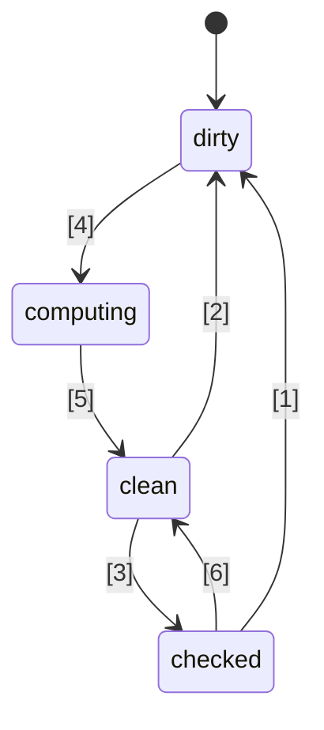
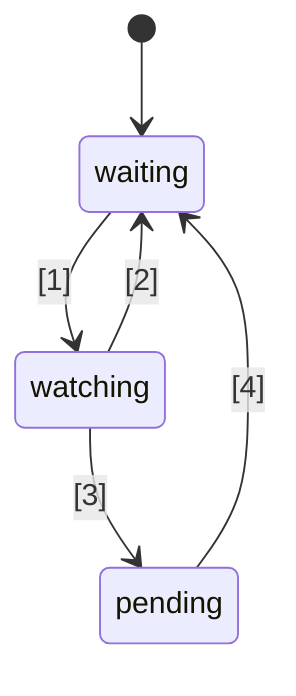

# 🚦 Proposta padrão de Signals em JavaScript 🚦


Stage 1 ([explicação](https://tc39.es/process-document/))

Proponentes da proposta TC39: Daniel Ehrenberg, Yehuda Katz, Jatin Ramanathan, Shay Lewis, Kristen Hewell Garrett, Dominic Gannaway, Preston Sego, Milo M, Rob Eisenberg

Autores originais: Rob Eisenberg e Daniel Ehrenberg

Este documento descreve uma direção inicial comum para signals em JavaScript, similar ao esforço Promises/A+ que precedeu as Promises padronizadas pelo TC39 no ES2015. Experimente você mesmo, usando [um polyfill](https://github.com/proposal-signals/signal-polyfill).

De forma semelhante ao Promises/A+, este esforço foca em alinhar o ecossistema JavaScript. Se esse alinhamento for bem-sucedido, então um padrão poderá surgir, baseado nessa experiência. Diversos autores de frameworks estão colaborando aqui em um modelo comum que pode dar suporte ao núcleo de reatividade deles. O rascunho atual é baseado no design e contribuições de autores/maintainers do [Angular](https://angular.io/), [Bubble](https://bubble.io/), [Ember](https://emberjs.com/), [FAST](https://www.fast.design/), [MobX](https://mobx.js.org/), [Preact](https://preactjs.com/), [Qwik](https://qwik.dev/), [RxJS](https://rxjs.dev/), [Solid](https://www.solidjs.com/), [Starbeam](https://www.starbeamjs.com/), [Svelte](https://svelte.dev/), [Vue](https://vuejs.org/), [Wiz](https://blog.angular.io/angular-and-wiz-are-better-together-91e633d8cd5a), e mais…

Diferente do Promises/A+, não estamos tentando resolver uma API comum voltada para desenvolvedores, mas sim as semânticas centrais precisas do grafo de signals subjacente. Esta proposta inclui uma API totalmente concreta, mas a API não é direcionada à maioria dos desenvolvedores de aplicações. Em vez disso, a API de signals aqui apresentada é mais adequada para que frameworks construam sobre ela, proporcionando interoperabilidade por meio de um grafo de signals comum e mecanismo de rastreamento automático.

O plano para esta proposta é realizar prototipação inicial significativa, incluindo integração em vários frameworks, antes de avançar além do Stage 1. Só estamos interessados em padronizar Signals se eles forem adequados para uso prático em múltiplos frameworks e proporcionarem benefícios reais em relação aos signals fornecidos pelos frameworks. Esperamos que uma prototipação inicial significativa nos forneça essas informações. Veja "Status e plano de desenvolvimento" abaixo para mais detalhes.

## Contexto: Por que Signals?

Para desenvolver uma interface de usuário (UI) complicada, desenvolvedores de aplicações JavaScript precisam armazenar, calcular, invalidar, sincronizar e enviar estado para a camada de visualização da aplicação de maneira eficiente. UIs normalmente envolvem mais do que apenas gerenciar valores simples, frequentemente incluindo a renderização de estado computado que depende de uma árvore complexa de outros valores ou estados que também são computados. O objetivo dos Signals é fornecer infraestrutura para gerenciar tal estado de aplicação, permitindo que desenvolvedores foquem na lógica de negócio ao invés desses detalhes repetitivos.

Construtos semelhantes a signals têm sido considerados úteis de forma independente também em contextos não relacionados a UI, especialmente em sistemas de build para evitar rebuilds desnecessários.

Signals são usados em programação reativa para eliminar a necessidade de gerenciar atualizações em aplicações.

> Um modelo de programação declarativo para atualização com base em mudanças de estado.

de _[What is Reactivity?](https://www.pzuraq.com/blog/what-is-reactivity)_.

#### Exemplo - Um Contador em VanillaJS

Dado uma variável, `counter`, você deseja renderizar no DOM se o contador é par ou ímpar. Sempre que o `counter` muda, você quer atualizar o DOM com a última paridade. Em Vanilla JS, você poderia ter algo assim:

```js
let counter = 0;
const setCounter = (value) => {
  counter = value;
  render();
};

const isEven = () => (counter & 1) == 0;
const parity = () => isEven() ? "even" : "odd";
const render = () => element.innerText = parity();

// Simular atualizações externas ao counter...
setInterval(() => setCounter(counter + 1), 1000);
```
> [!NOTE]  
> Globais são usados aqui apenas para fins de demonstração. O gerenciamento adequado de estado possui muitas soluções, e os exemplos nesta proposta têm a intenção de ser o mais mínimos possível. Esta proposta não incentiva o uso de variáveis globais.


Isto possui vários problemas...

* A configuração do `counter` é barulhenta e cheia de boilerplate.
* O estado de `counter` está fortemente acoplado ao sistema de renderização.
* Se o `counter` muda, mas `parity` não (por exemplo, o contador vai de 2 para 4), então fazemos uma computação de paridade desnecessária e renderização desnecessária.
* E se outra parte da nossa UI quiser apenas renderizar quando o `counter` for atualizado?
* E se outra parte da nossa UI depender apenas de `isEven` ou `parity`?

Mesmo neste cenário relativamente simples, diversos problemas surgem rapidamente. Poderíamos tentar contornar isso introduzindo pub/sub para o `counter`. Isso permitiria que consumidores adicionais do `counter` pudessem se inscrever para adicionar suas próprias reações às mudanças de estado.

No entanto, ainda estamos presos aos seguintes problemas:

* A função de renderização, que depende apenas de `parity`, deve "saber" que, na verdade, precisa se inscrever no `counter`.
* Não é possível atualizar a UI com base apenas em `isEven` ou `parity`, sem interagir diretamente com `counter`.
* Aumentamos nosso boilerplate. Sempre que você está usando algo, não é apenas uma questão de chamar uma função ou ler uma variável, mas sim de se inscrever e fazer atualizações ali. Gerenciar a desinscrição também é especialmente complicado.

Agora, poderíamos resolver alguns problemas adicionando pub/sub não apenas ao `counter`, mas também ao `isEven` e ao `parity`. Teríamos então que inscrever `isEven` no `counter`, `parity` em `isEven`, e `render` em `parity`. Infelizmente, não apenas nosso código boilerplate aumentou muito, mas também estamos presos a uma tonelada de gerenciamento de inscrições, e um potencial desastre de vazamento de memória se não limpamos tudo corretamente. Portanto, resolvemos alguns problemas, mas criamos toda uma nova categoria de problemas e muito código. Para piorar, temos que passar por todo esse processo para cada pedaço de estado em nosso sistema.

### Apresentando Signals

Abstrações de data binding em UIs para o modelo e a visualização há muito tempo são centrais para frameworks de UI em diversas linguagens de programação, apesar da ausência de qualquer mecanismo desse tipo embutido no JS ou na plataforma web. Dentro de frameworks e bibliotecas JS, houve muita experimentação em diferentes maneiras de representar esse binding, e a experiência mostrou o poder do fluxo de dados unidirecional em conjunto com um tipo de dado de primeira classe representando uma célula de estado ou computação derivada de outros dados, agora frequentemente chamado de "Signals".
Essa abordagem de valor reativo de primeira classe parece ter feito sua primeira aparição popular em frameworks web JavaScript de código aberto com o [Knockout](https://knockoutjs.com/) [em 2010](https://blog.stevensanderson.com/2010/07/05/introducing-knockout-a-ui-library-for-javascript/). Nos anos seguintes, muitas variações e implementações foram criadas. Nos últimos 3-4 anos, o primitivo Signal e abordagens relacionadas ganharam ainda mais força, com praticamente todas as bibliotecas ou frameworks modernos de JavaScript tendo algo similar, sob um nome ou outro.

Para entender Signals, vejamos o exemplo acima, reimaginado com uma API de Signal mais detalhada abaixo.

#### Exemplo - Um Contador com Signals

```js
const counter = new Signal.State(0);
const isEven = new Signal.Computed(() => (counter.get() & 1) == 0);
const parity = new Signal.Computed(() => isEven.get() ? "even" : "odd");

// Uma biblioteca ou framework define efeitos com base em outros primitives de Signal
declare function effect(cb: () => void): (() => void);

effect(() => element.innerText = parity.get());

// Simular atualizações externas ao counter...
setInterval(() => counter.set(counter.get() + 1), 1000);
```

Há algumas coisas que podemos perceber imediatamente:
* Eliminamos o boilerplate barulhento em torno da variável `counter` do nosso exemplo anterior.
* Existe uma API unificada para lidar com valores, computações e efeitos colaterais.
* Não há problema de referência circular ou dependências invertidas entre `counter` e `render`.
* Não há inscrições manuais, nem necessidade de gerenciamento.
* Existe um meio de controlar o tempo/agendamento de efeitos colaterais.

Signals nos oferecem muito mais do que pode ser visto superficialmente na API:
* **Rastreamento Automático de Dependências** - Um Signal computado descobre automaticamente quaisquer outros Signals dos quais depende, sejam esses Signals valores simples ou outros cálculos.
* **Avaliação Preguiçosa (Lazy Evaluation)** - Os cálculos não são avaliados de forma ávida quando são declarados, nem são imediatamente avaliados quando suas dependências mudam. Eles só são avaliados quando seu valor é explicitamente solicitado.
* **Memoização** - Signals computados armazenam em cache seu último valor para que cálculos cujas dependências não mudaram não precisem ser reavaliados, não importa quantas vezes sejam acessados.

## Motivação para padronizar Signals

#### Interoperabilidade

Cada implementação de Signal tem seu próprio mecanismo de rastreamento automático, para acompanhar as fontes encontradas ao avaliar um Signal computado. Isso dificulta o compartilhamento de modelos, componentes e bibliotecas entre diferentes frameworks--eles tendem a vir com um falso acoplamento ao seu mecanismo de visualização (visto que Signals geralmente são implementados como parte de frameworks JS).

Um objetivo desta proposta é desacoplar totalmente o modelo reativo da visualização de renderização, permitindo que desenvolvedores migrem para novas tecnologias de renderização sem reescrever seu código não relacionado à interface, ou desenvolvam modelos reativos compartilhados em JS para serem implantados em diferentes contextos. Infelizmente, devido a versionamento e duplicidade, revelou-se impraticável alcançar um forte nível de compartilhamento via bibliotecas em JS--os built-ins oferecem uma garantia de compartilhamento mais forte.

#### Desempenho/Uso de memória

Sempre há um pequeno potencial de ganho de desempenho ao embarcar menos código devido a bibliotecas comumente usadas serem internas, mas as implementações de Signals geralmente são bastante pequenas, então não esperamos que esse efeito seja muito grande.

Suspeitamos que implementações nativas em C++ das estruturas de dados e algoritmos relacionados a Signal possam ser ligeiramente mais eficientes do que o que é possível em JS, por um fator constante. No entanto, não são antecipadas mudanças algorítmicas em relação ao que estaria presente em um polyfill; não se espera que os engines sejam mágicos aqui, e os próprios algoritmos de reatividade serão bem definidos e inequívocos.

O grupo responsável espera desenvolver várias implementações de Signals e usá-las para investigar essas possibilidades de desempenho.

#### DevTools

Com as bibliotecas de Signal existentes em JS, pode ser difícil rastrear coisas como:
* A stack de chamadas através de uma cadeia de Signals computados, mostrando a cadeia causal para um erro
* O grafo de referências entre Signals, quando um depende de outro -- importante ao depurar uso de memória

Signals embutidos permitem que runtimes JS e DevTools tenham potencialmente um suporte aprimorado para inspecionar Signals, particularmente para depuração ou análise de desempenho, seja isso integrado aos navegadores ou por meio de uma extensão compartilhada. Ferramentas existentes como o inspetor de elementos, snapshot de desempenho e analisadores de memória poderiam ser atualizados para destacar especificamente Signals em sua apresentação de informações.

#### Benefícios secundários

##### Benefícios de uma biblioteca padrão

Em geral, o JavaScript tem uma biblioteca padrão relativamente mínima, mas uma tendência no TC39 tem sido tornar o JS uma linguagem mais "baterias incluídas", com um conjunto de funcionalidades internas e de alta qualidade disponível. Por exemplo, Temporal está substituindo o moment.js, e vários recursos pequenos, como `Array.prototype.flat` e `Object.groupBy`, estão substituindo muitos casos de uso do lodash. Os benefícios incluem tamanhos de bundle menores, maior estabilidade e qualidade, menos para aprender ao entrar em um novo projeto, e um vocabulário geralmente comum entre desenvolvedores JS.

##### Integração HTML/DOM (possibilidade futura)

Trabalhos atuais no W3C e por implementadores de navegadores buscam trazer templating nativo para HTML ([DOM Parts][wicg-pr-1023] e [Template Instantiation][wicg-propsal-template-instantiation]). Além disso, o W3C Web Components CG está explorando a possibilidade de estender Web Components para oferecer uma API HTML totalmente declarativa. Para alcançar ambos os objetivos, eventualmente será necessário um primitivo reativo no HTML. Além disso, muitas melhorias ergonômicas no DOM por meio da integração de Signals podem ser imaginadas e já foram solicitadas pela comunidade.

[wicg-pr-1023]: https://github.com/WICG/webcomponents/pull/1023
[wicg-propsal-template-instantiation]: https://github.com/WICG/webcomponents/blob/gh-pages/proposals/Template-Instantiation.md

> Nota: essa integração seria um esforço separado para o futuro, não faz parte desta proposta em si.

##### Troca de informações no ecossistema (*não* é motivo para embarcar)

Esforços de padronização às vezes podem ser úteis apenas no nível da "comunidade", mesmo sem mudanças nos navegadores. O esforço dos Signals está reunindo muitos autores de frameworks diferentes para uma discussão profunda sobre a natureza da reatividade, algoritmos e interoperabilidade. Isso já tem sido útil, mas não justifica a inclusão em engines JS e navegadores; Signals só devem ser adicionados ao padrão JavaScript se houver benefícios significativos *além* da troca de informações do ecossistema viabilizada.

## Objetivos de design para Signals

Acontece que as bibliotecas de Signal existentes não são tão diferentes umas das outras, em sua essência. Esta proposta visa se apoiar em seu sucesso, implementando as qualidades importantes de muitas dessas bibliotecas.

### Funcionalidades principais

* Um tipo Signal que representa estado, ou seja, Signal gravável. Este é um valor que outros podem ler.
* Um tipo Signal computado/memo/derivado, que depende de outros e é calculado de forma preguiçosa e armazenado em cache.
    * O cálculo é preguiçoso, ou seja, Signals computados não são calculados novamente por padrão quando uma de suas dependências muda, mas apenas executados se alguém realmente os ler.
    * O cálculo é "[livre de glitches](https://pt.wikipedia.org/wiki/Programação_reativa#Glitches)", ou seja, nenhum cálculo desnecessário é realizado. Isso implica que, quando uma aplicação lê um Signal computado, há uma ordenação topológica das partes potencialmente sujas do grafo a serem executadas, para eliminar duplicatas.
    * O cálculo é armazenado em cache, ou seja, se, após a última vez que uma dependência mudou, nenhuma dependência mudou, então o Signal computado *não* é recalculado ao ser acessado.
    * Comparações personalizadas são possíveis tanto para Signals computados quanto para Signals de estado, para indicar quando outros Signals computados que dependem deles devem ser atualizados.
* Reações à condição em que um Signal computado tem uma de suas dependências (ou dependências aninhadas) tornando-se "suja" e mudando, significando que o valor do Signal pode estar desatualizado.
    * Esta reação serve para agendar trabalhos mais significativos a serem realizados posteriormente.
    * Efeitos são implementados em termos dessas reações, mais agendamento em nível de framework.
    * Signals computados precisam da capacidade de reagir a serem registrados como uma dependência (aninhada) de uma dessas reações.
* Permitir que frameworks JS façam seu próprio agendamento. Nenhum agendamento embutido obrigatório no estilo Promise.
    * Reações síncronas são necessárias para permitir o agendamento de trabalho posterior com base na lógica do framework.
    * Escritas são síncronas e têm efeito imediato (um framework que faz batch das escritas pode implementar isso por cima).
    * É possível separar a verificação se um efeito pode estar "sujo" de realmente rodar o efeito (permitindo um agendador de efeitos em dois estágios).
* Capacidade de ler Signals *sem* acionar o registro de dependências (`untrack`)
* Possibilitar a composição de diferentes bases de código que usam Signals/reatividade, por exemplo,
    * Usar múltiplos frameworks juntos no que diz respeito ao rastreamento/reatividade em si (com ressalvas, veja abaixo)
    * Estruturas de dados reativas independentes de framework (por exemplo, proxy de store recursivamente reativo, Map e Set e Array reativos, etc.)

### Solidez

* Desencorajar/proibir o uso ingênuo de reações síncronas.
    * Risco de solidez: pode expor "[glitches](https://pt.wikipedia.org/wiki/Programação_reativa#Glitches)" se usado de forma inadequada: Se a renderização for feita imediatamente quando um Signal é definido, pode expor um estado de aplicação incompleto para o usuário final. Portanto, esse recurso deve ser usado apenas para agendar trabalho de forma inteligente para depois que a lógica da aplicação estiver concluída.
    * Solução: Proibir leitura e escrita de qualquer Signal de dentro de um callback de reação síncrona.
* Desencorajar `untrack` e marcar sua natureza não sólida
    * Risco de solidez: permite a criação de Signals computados cujo valor depende de outros Signals, mas que não são atualizados quando esses Signals mudam. Deve ser usado quando os acessos não rastreados não mudam o resultado do cálculo.
    * Solução: A API é marcada como "unsafe" no nome.
* Nota: Esta proposta permite que signals sejam lidos e escritos tanto de signals computados quanto de efeito, sem restringir escritas que venham após leituras, apesar do risco para a solidez. Essa decisão foi tomada para preservar flexibilidade e compatibilidade na integração com frameworks.

### API de superfície

* Deve ser uma base sólida para múltiplos frameworks implementarem seus mecanismos de Signals/reatividade.
    * Deve ser uma boa base para proxies de store recursivos, reatividade baseada em decoradores em campos de classe, e APIs tanto no estilo `.value` quanto `[state, setState]`.
    * A semântica é capaz de expressar os padrões válidos habilitados por diferentes frameworks. Por exemplo, deve ser possível que esses Signals sejam a base de escritas refletidas imediatamente ou escritas que são agrupadas e aplicadas posteriormente.
* Seria interessante se essa API fosse utilizável diretamente por desenvolvedores JavaScript.
    * Se um recurso se alinha com um conceito do ecossistema, usar o vocabulário comum é bom.
        * Contudo, é importante não literalmente copiar exatamente os mesmos nomes!
    * Tensão entre "usabilidade por devs JS" e "oferecer todos os ganchos para frameworks"
        * Ideia: Oferecer todos os ganchos, mas incluir erros quando usados de forma inadequada, se possível.
        * Ideia: Colocar APIs sutis em um namespace `subtle`, semelhante ao [`crypto.subtle`](https://developer.mozilla.org/pt-BR/docs/Web/API/Crypto/subtle), para marcar a linha entre APIs necessárias para uso avançado como implementação de frameworks ou ferramentas de dev versus uso cotidiano como instanciar signals para uso com um framework.
* Ser implementável e utilizável com bom desempenho -- a API de superfície não causa overhead excessivo
    * Permitir subclassificação, para que frameworks possam adicionar seus próprios métodos e campos, incluindo campos privados. Isso é importante para evitar a necessidade de alocações adicionais no nível do framework. Veja "Gerenciamento de memória" abaixo.

### Gerenciamento de memória

* Se possível: Um Signal computado deve ser coletável pelo garbage collector se nada vivo estiver referenciando-o para leituras futuras possíveis, mesmo que ele esteja ligado em um grafo mais amplo que permaneça vivo (por exemplo, lendo um estado que permanece vivo).
* Observe que a maioria dos frameworks atualmente exige o descarte explícito de Signals computados se eles tiverem qualquer referência para ou de outro grafo de Signal que permaneça ativo.
* Isso acaba não sendo tão ruim quando sua vida útil está atrelada à vida útil de um componente de UI, e efeitos precisam ser descartados de qualquer forma.
* Se for muito caro executar com essa semântica, então devemos adicionar descarte explícito (ou "desvinculação") de Signals computados à API abaixo, que atualmente não possui isso.
* Um objetivo relacionado separado: Minimizar o número de alocações, por exemplo,
    * para criar um Signal gravável (evitar dois closures separados + array)
    * para implementar efeitos (evitar um closure para cada reação individual)
    * Na API para observar mudanças de Signal, evitar a criação de estruturas de dados temporárias adicionais
    * Solução: API baseada em classes permitindo o reuso de métodos e campos definidos em subclasses

## Esboço da API

Uma ideia inicial de uma API de Signal está abaixo. Observe que este é apenas um rascunho inicial e antecipamos mudanças ao longo do tempo. Vamos começar com o `.d.ts` completo para ter uma ideia do formato geral e, em seguida, discutiremos os detalhes do que tudo isso significa.

```ts
interface Signal<T> {
    // Obtém o valor do signal
    get(): T;
}

namespace Signal {
    // Um Signal de leitura e escrita
    class State<T> implements Signal<T> {
        // Cria um Signal de estado iniciando com o valor t
        constructor(t: T, options?: SignalOptions<T>);

        // Obtém o valor do signal
        get(): T;

        // Define o valor do Signal de estado para t
        set(t: T): void;
    }

    // Um Signal que é uma fórmula baseada em outros Signals
    class Computed<T = unknown> implements Signal<T> {
        // Cria um Signal que avalia para o valor retornado pelo callback.
        // O callback é chamado com este signal como valor de this.
        constructor(cb: (this: Computed<T>) => T, options?: SignalOptions<T>);

        // Obtém o valor do signal
        get(): T;
    }

    // Este namespace inclui recursos "avançados" que são melhores
    // deixar para autores de frameworks ao invés de desenvolvedores de aplicações.
    // Análogo a `crypto.subtle`
    namespace subtle {
        // Executa um callback com todo rastreamento desabilitado
        function untrack<T>(cb: () => T): T;

        // Obtém o signal computado atual que está rastreando leituras de qualquer signal, se houver
        function currentComputed(): Computed | null;

        // Retorna a lista ordenada de todos os signals que este referenciou
        // durante a última vez em que foi avaliado.
        // Para um Watcher, lista o conjunto de signals que ele está observando.
        function introspectSources(s: Computed | Watcher): (State | Computed)[];

        // Retorna os Watchers nos quais este signal está contido, além de quaisquer
        // Signals Computed que leram este signal da última vez em que foram avaliados,
        // se esse signal computed está (recursivamente) sendo observado.
        function introspectSinks(s: State | Computed): (Computed | Watcher)[];

        // Verdadeiro se este signal está "ativo", ou seja, está sendo observado por um Watcher,
        // ou é lido por um signal Computed que está (recursivamente) ativo.
        function hasSinks(s: State | Computed): boolean;

        // Verdadeiro se este elemento é "reativo", ou seja, depende
        // de algum outro signal. Um Computed onde hasSources é falso
        // sempre retornará a mesma constante.
        function hasSources(s: Computed | Watcher): boolean;

        class Watcher {
            // Quando uma fonte (recursiva) do Watcher é escrita, chama este callback,
            // se ainda não foi chamado desde a última chamada de `watch`.
            // Nenhum signal pode ser lido ou escrito durante o notify.
            constructor(notify: (this: Watcher) => void);

            // Adiciona estes signals ao conjunto do Watcher e define o watcher para executar seu
            // callback notify na próxima vez que qualquer signal do conjunto (ou um de seus dependentes) mudar.
            // Pode ser chamado sem argumentos apenas para redefinir o estado "notificado", para que
            // o callback notify seja invocado novamente.
            watch(...s: Signal[]): void;

            // Remove estes signals do conjunto observado (ex.: para um efeito que foi descartado)
            unwatch(...s: Signal[]): void;

            // Retorna o conjunto de fontes no conjunto do Watcher que ainda estão sujas, ou é um signal computed
            // com uma fonte que está suja ou pendente e ainda não foi reavaliada
            getPending(): Signal[];
        }

        // Hooks para observar quando está sendo observado ou deixou de ser observado
        var watched: Symbol;
        var unwatched: Symbol;
    }

    interface SignalOptions<T> {
        // Função de comparação personalizada entre o valor antigo e o novo. Padrão: Object.is.
        // O signal é passado como valor de this para contexto.
        equals?: (this: Signal<T>, t: T, t2: T) => boolean;
```ts
// Callback chamado quando isWatched se torna verdadeiro, se anteriormente era falso
[Signal.subtle.watched]?: (this: Signal<T>) => void;

// Callback chamado sempre que isWatched se torna falso, se anteriormente era verdadeiro
[Signal.subtle.unwatched]?: (this: Signal<T>) => void;
}
}
```

### Como funcionam os Signals

Um Signal representa uma célula de dados que pode mudar ao longo do tempo. Signals podem ser do tipo "state" (apenas um valor definido manualmente) ou "computed" (uma fórmula baseada em outros Signals).

Signals computados funcionam rastreando automaticamente quais outros Signals são lidos durante sua avaliação. Quando um computed é lido, ele verifica se alguma de suas dependências registradas anteriormente mudou e se reavalia se for o caso. Quando múltiplos Signals computados são aninhados, toda a atribuição do rastreamento vai para o mais interno deles.

Signals computados são lazy, ou seja, baseados em pull: eles só são reavaliados quando são acessados, mesmo que uma de suas dependências tenha mudado antes.

O callback passado para Signals computados geralmente deve ser "puro", no sentido de ser uma função determinística e sem efeitos colaterais dos outros Signals que acessa. Ao mesmo tempo, o momento em que o callback é chamado é determinístico, permitindo que efeitos colaterais sejam usados com cuidado.

Signals possuem cache/memoização proeminente: tanto Signals de state quanto computados lembram seu valor atual, e só disparam recálculo de Signals computados que os referenciam se eles realmente mudarem. Uma comparação repetida entre valores antigos e novos nem é necessária—a comparação é feita uma vez quando o Signal fonte é redefinido/reavaliado, e o mecanismo do Signal mantém o controle de quais entidades que referenciam aquele Signal ainda não atualizaram com base no novo valor. Internamente, isso geralmente é representado por "graph coloring", como descrito no [post do blog do Milo](https://raw.githubusercontent.com/tc39/proposal-signals/main/Milo%27s%20blog%20post).

Signals computados rastreiam suas dependências dinamicamente—cada vez que são executados, podem acabar dependendo de coisas diferentes, e esse conjunto de dependências preciso é mantido atualizado no grafo de Signals. Isso significa que, se você tem uma dependência necessária em apenas um ramo, e o cálculo anterior tomou o outro ramo, então uma mudança nesse valor temporariamente não usado não fará com que o Signal computado seja recalculado, mesmo quando acessado.

Diferente de Promises do JavaScript, tudo em Signals é executado de forma síncrona:
- Definir um Signal para um novo valor é síncrono, e isso é refletido imediatamente ao ler qualquer Signal computado que dependa dele em seguida. Não há agrupamento/batching embutido nessa mutação.
- Ler Signals computados é síncrono—seu valor está sempre disponível.
- O callback `notify` em Watchers, como explicado abaixo, roda de forma síncrona, durante a chamada `.set()` que o disparou (mas após a coloração do grafo estar completa).

Como as Promises, Signals podem representar um estado de erro: se o callback de um Signal computado lançar uma exceção, esse erro é armazenado em cache como qualquer outro valor, e relançado toda vez que o Signal é lido.

### Entendendo a classe Signal

Uma instância de `Signal` representa a capacidade de ler um valor que muda dinamicamente e cujas atualizações são rastreadas ao longo do tempo. Ela também implicitamente inclui a capacidade de se inscrever no Signal, implicitamente por meio de um acesso rastreado de outro Signal computado.

A API aqui foi desenhada para corresponder ao consenso da comunidade entre grande parte das bibliotecas de Signal no uso de nomes como "signal", "computed" e "state". Entretanto, o acesso a Signals Computados e de State é feito por meio do método `.get()`, o que difere de todas as APIs populares de Signal, que usam um acessor `.value` ou sintaxe de chamada `signal()`.

A API é projetada para reduzir o número de alocações, tornando Signals adequados para serem incorporados em frameworks JavaScript, alcançando desempenho igual ou melhor que Signals personalizados de frameworks existentes. Isso implica:
- Signals de State são um único objeto gravável, que pode ser tanto acessado quanto definido a partir da mesma referência. (Veja implicações abaixo na seção "Separação de capacidades".)
- Tanto Signals de State quanto Computados são projetados para serem subclassificados, facilitando que frameworks adicionem propriedades adicionais por meio de campos de classe públicos e privados (bem como métodos para usar esse estado).
- Vários callbacks (por exemplo, `equals`, o callback de computed) são chamados com o Signal relevante como valor de `this` para contexto, de modo que não é necessário criar um novo closure por Signal. Em vez disso, o contexto pode ser salvo em propriedades extras do próprio Signal.

Algumas condições de erro aplicadas por esta API:
- É um erro ler um computed recursivamente.
- O callback `notify` de um Watcher não pode ler nem escrever nenhum signal.
- Se o callback de um Signal computado lançar uma exceção, acessos subsequentes ao Signal relançam esse erro armazenado em cache, até que uma das dependências mude e ele seja recalculado.

Algumas condições que *não* são aplicadas:
- Signals Computados podem escrever em outros Signals, de forma síncrona dentro do seu callback.
- Trabalhos enfileirados pelo callback `notify` de um Watcher podem ler ou escrever signals, tornando possível replicar [antipadrões clássicos do React](https://react.dev/learn/you-might-not-need-an-effect) em termos de Signals!

### Implementando efeitos

A interface `Watcher` definida acima dá a base para implementar APIs JS típicas para efeitos: callbacks que são executados novamente quando outros Signals mudam, apenas por seu efeito colateral. A função `effect` usada acima no exemplo inicial pode ser definida da seguinte forma:

```ts
// Esta função normalmente viveria em uma biblioteca/framework, não no código da aplicação
// NOTA: Esta lógica de agendamento é básica demais para ser útil. Não copie/cole.
let pending = false;

let w = new Signal.subtle.Watcher(() => {
    if (!pending) {
        pending = true;
        queueMicrotask(() => {
            pending = false;
            for (let s of w.getPending()) s.get();
            w.watch();
        });
    }
});

// Um Signal effect que avalia cb, que agenda uma leitura de
// si mesmo na fila de microtarefas sempre que uma de suas dependências pode mudar
export function effect(cb) {
    let destructor;
    let c = new Signal.Computed(() => { destructor?.(); destructor = cb(); });
    w.watch(c);
    c.get();
    return () => { destructor?.(); w.unwatch(c) };
}
```

A API do Signal não inclui nenhuma função embutida como `effect`. Isso ocorre porque o agendamento de efeitos é sutil e frequentemente se integra aos ciclos de renderização do framework e a outros estados ou estratégias específicas de frameworks de alto nível aos quais o JS não tem acesso.

Percorrendo as diferentes operações usadas aqui: o callback `notify` passado ao construtor de `Watcher` é a função chamada quando o Signal vai de um estado "clean" (onde sabemos que o cache está inicializado e válido) para um estado "checked" ou "dirty" (onde o cache pode ou não ser válido porque pelo menos um dos estados dos quais depende recursivamente foi alterado).

Chamadas a `notify` são, em última instância, disparadas por uma chamada a `.set()` em algum Signal de state. Essa chamada é síncrona: acontece antes de `.set` retornar. Mas não há necessidade de se preocupar com esse callback observando o grafo de Signal em um estado parcialmente processado, porque durante um callback `notify`, nenhum Signal pode ser lido ou escrito, mesmo em uma chamada `untrack`. Como `notify` é chamado durante `.set()`, ele interrompe outro fluxo de lógica, que pode não estar completo. Para ler ou escrever Signals a partir de `notify`, agende o trabalho para rodar depois, por exemplo, escrevendo o Signal em uma lista para ser acessado posteriormente, ou com `queueMicrotask` como acima.

Note que é perfeitamente possível usar Signals de maneira eficaz sem `Signal.subtle.Watcher` ao agendar polling de Signals computados, como faz o Glimmer. Entretanto, muitos frameworks descobriram que é frequentemente útil ter essa lógica de agendamento rodando de forma síncrona, então a API de Signals inclui isso.

Tanto Signals computados quanto de state são coletados pelo garbage collector como qualquer valor JS. Mas Watchers têm uma maneira especial de manter as coisas vivas: qualquer Signal observado por um Watcher será mantido vivo enquanto qualquer um dos estados subjacentes for acessível, pois estes podem disparar uma futura chamada `notify` (e então uma futura `.get()`). Por essa razão, lembre-se de chamar `Watcher.prototype.unwatch` para limpar efeitos.

### Um escape hatch não seguro

`Signal.subtle.untrack` é um escape hatch que permite ler Signals *sem* rastrear essas leituras. Essa capacidade é insegura porque permite a criação de Signals computados cujo valor depende de outros Signals, mas que não são atualizados quando esses Signals mudam. Deve ser usado quando os acessos não rastreados não irão alterar o resultado do cálculo.

<!--
TODO: Mostrar exemplo onde faz sentido usar untrack

### Usando watched/unwatched
TODO: Mostrar exemplo de conversão de um Observable para um sinal computado, inscrito apenas quando usado por um efeito

TODO: Mostrar exemplo de um sinal computado que representa o resultado de um fetch direcionado a um estado, que é cancelado

### Introspecção para SSR

TODO: Mostrar como funciona a serialização do grafo de sinais

TODO: Mostrar como você pode "hidratar" um sinal de estado para computado depois, usando alguns sinais.
-->

### Omitido por enquanto

Esses recursos podem ser adicionados posteriormente, mas não estão incluídos no rascunho atual. Sua omissão se deve à falta de consenso estabelecido no espaço de design entre frameworks, bem como à capacidade demonstrada de contornar sua ausência com mecanismos baseados na noção de Sinais descrita neste documento. No entanto, infelizmente, a omissão limita o potencial de interoperabilidade entre frameworks. À medida que protótipos de Sinais, conforme descrito neste documento, forem produzidos, haverá um esforço para reexaminar se essas omissões foram a decisão adequada.

* **Assíncrono**: Os sinais estão sempre disponíveis para avaliação de forma síncrona, neste modelo. No entanto, é frequentemente útil ter certos processos assíncronos que levam a um sinal ser definido, e entender quando um sinal ainda está "carregando". Uma maneira simples de modelar o estado de carregamento é com exceções, e o comportamento de cache de exceções dos sinais computados compõe razoavelmente com essa técnica. Técnicas aprimoradas são discutidas na [Issue #30](https://github.com/proposal-signals/proposal-signals/issues/30).
* **Transações**: Para transições entre visualizações, muitas vezes é útil manter um estado ativo tanto para o estado "de" quanto para o "para". O estado "para" é renderizado em segundo plano, até que esteja pronto para a troca (cometendo a transação), enquanto o estado "de" permanece interativo. Manter ambos os estados ao mesmo tempo requer "forkar" o estado do grafo de sinais, e pode até ser útil suportar múltiplas transições pendentes ao mesmo tempo. Discussão em [Issue #73](https://github.com/proposal-signals/proposal-signals/issues/73).

Alguns possíveis [métodos de conveniência](https://github.com/proposal-signals/proposal-signals/issues/32) também foram omitidos.

## Status e plano de desenvolvimento

Esta proposta está na agenda do TC39 de abril de 2024 para o Estágio 1. Atualmente, pode ser considerada como "Estágio 0".

[Um polyfill](https://github.com/proposal-signals/signal-polyfill) para esta proposta está disponível, com alguns testes básicos. Alguns autores de frameworks começaram a experimentar a substituição desta implementação de sinal, mas esse uso está em estágio inicial.

Os colaboradores da proposta de Sinais querem ser especialmente **conservadores** em como avançam com esta proposta, para evitar cair na armadilha de aprovar algo que acabaremos nos arrependendo e não usando de fato. Nosso plano é realizar as seguintes tarefas extras, não exigidas pelo processo do TC39, para garantir que esta proposta está no caminho certo:

Antes de propor para o Estágio 2, planejamos:
- Desenvolver múltiplas implementações de polyfill de nível de produção que sejam sólidas, bem testadas (por exemplo, passando testes de vários frameworks, bem como testes do estilo test262) e competitivas em termos de desempenho (como verificado com um conjunto abrangente de benchmarks de sinais/frameworks).
- Integrar a API de Sinais proposta em um grande número de frameworks JS que consideramos representativos, e fazer com que algumas aplicações grandes funcionem com essa base. Testar se ela funciona de forma eficiente e correta nesses contextos.
- Ter uma compreensão sólida do espaço de possíveis extensões da API, e concluir quais (se houver) devem ser adicionadas a esta proposta.

## Algoritmos de Sinal

Esta seção descreve cada uma das APIs expostas ao JavaScript, em termos dos algoritmos que implementam. Isso pode ser considerado como uma proto-especificação, e está incluído neste ponto inicial para definir um possível conjunto de semânticas, estando muito aberto a mudanças.

Alguns aspectos do algoritmo:
- A ordem de leitura dos Sinais dentro de um computado é significativa e é observável na ordem em que certos callbacks (quando `Watcher` é invocado, `equals`, o primeiro parâmetro para `new Signal.Computed` e os callbacks `watched`/`unwatched`) são executados. Isso significa que as fontes de um Sinal computado devem ser armazenadas ordenadas.
- Esses quatro callbacks podem lançar exceções, e essas exceções são propagadas de maneira previsível para o código JS chamador. As exceções *não* interrompem a execução deste algoritmo nem deixam o grafo em um estado parcialmente processado. Para erros lançados no callback `notify` de um Watcher, essa exceção é enviada para a chamada `.set()` que a acionou, usando um AggregateError se várias exceções forem lançadas. As outras (incluindo `watched`/`unwatched`?) são armazenadas no valor do Sinal, para serem relançadas quando lidas, e tal Sinal relançado pode ser marcado como `~clean~` assim como qualquer outro com um valor normal.
- Cuidados são tomados para evitar circularidades em casos de sinais computados que não são "observados" (sendo observados por algum Watcher), para que possam ser coletados pelo garbage collector de forma independente de outras partes do grafo de sinais. Internamente, isso pode ser implementado com um sistema de números de geração que são sempre coletados; observe que implementações otimizadas também podem incluir números de geração locais por nó, ou evitar rastrear alguns números em sinais observados.

### Estado global oculto

Os algoritmos de Sinal precisam referenciar certos estados globais. Esse estado é global para toda a thread, ou "agente".

- `computing`: O Sinal computado ou de efeito mais interno atualmente sendo reavaliado devido a uma chamada `.get` ou `.run`, ou `null`. Inicialmente `null`.
- `frozen`: Booleano que denota se há um callback atualmente em execução que exige que o grafo não seja modificado. Inicialmente `false`.
- `generation`: Um inteiro incremental, começando em 0, usado para rastrear quão atual é um valor enquanto evita circularidades.

### O namespace `Signal`

`Signal` é um objeto comum que serve como um namespace para classes e funções relacionadas a Sinais.

`Signal.subtle` é um objeto de namespace interno semelhante.

### A classe `Signal.State`

#### Slots internos de `Signal.State`

- `value`: O valor atual do sinal de estado
- `equals`: A função de comparação usada ao alterar valores
- `watched`: O callback chamado quando o sinal passa a ser observado por um efeito
- `unwatched`: O callback chamado quando o sinal deixa de ser observado por um efeito
- `sinks`: Conjunto de sinais observados que dependem deste

#### Construtor: `Signal.State(initialValue, options)`

1. Defina o `value` deste Sinal como `initialValue`.
1. Defina o `equals` deste Sinal como options?.equals
1. Defina o `watched` deste Sinal como options?.[Signal.subtle.watched]
1. Defina o `unwatched` deste Sinal como options?.[Signal.subtle.unwatched]
1. Defina o `sinks` deste Sinal como o conjunto vazio

#### Método: `Signal.State.prototype.get()`

1. Se `frozen` for true, lance uma exceção.
1. Se `computing` não for `undefined`, adicione este Sinal ao conjunto `sources` de `computing`.
1. NOTA: Não adicionamos `computing` ao conjunto `sinks` deste Sinal até que ele seja observado por um Watcher.
1. Retorne o `value` deste Sinal.

#### Método: `Signal.State.prototype.set(newValue)`

1. Se o contexto de execução atual for `frozen`, lance uma exceção.
1. Execute o algoritmo "definir valor do Sinal" com este Sinal e o primeiro parâmetro para o valor.
1. Se esse algoritmo retornar `~clean~`, então retorne undefined.
1. Defina o `state` de todos os `sinks` deste Sinal como (se for um Sinal Computado) `~dirty~` se estavam previamente clean, ou (se for um Watcher) `~pending~` se estava previamente `~watching~`.
1. Defina o `state` de todas as dependências de Sinal Computado dos sinks (recursivamente) como `~checked~` se estavam previamente `~clean~` (ou seja, mantenha as marcações de dirty), ou para Watchers, `~pending~` se previamente `~watching~`.
1. Para cada Watcher previamente `~watching~` encontrado nessa busca recursiva, em ordem de profundidade,
    1. Defina `frozen` como true.
    1. Chame seu callback `notify` (salvando separadamente qualquer exceção lançada, mas ignorando o valor de retorno de `notify`).
    1. Restaure `frozen` para false.
    1. Defina o `state` do Watcher para `~waiting~`.
1. Se alguma exceção foi lançada dos callbacks `notify`, propague-a para o chamador após todos os callbacks `notify` terem sido executados. Se houver múltiplas exceções, agrupe-as em um AggregateError e lance-o.
1. Retorne undefined.

### A classe `Signal.Computed`

#### Máquina de estados de `Signal.Computed`
O `state` de um Computed Signal pode ser um dos seguintes:

- `~clean~`: O valor do Signal está presente e sabe-se que não está desatualizado.
- `~checked~`: Uma fonte (indireta) deste Signal foi alterada; este Signal tem um valor, mas ele _pode_ estar desatualizado. Só será possível saber se está desatualizado quando todas as fontes imediatas forem avaliadas.
- `~computing~`: O callback deste Signal está sendo executado atualmente como efeito colateral de uma chamada `.get()`.
- `~dirty~`: Ou este Signal tem um valor que se sabe estar desatualizado, ou nunca foi avaliado.

O grafo de transição é o seguinte:



As transições são:
| Número | De | Para | Condição | Algoritmo |
| ------ | ---- | -- | --------- | --------- |
| 1 | `~checked~` | `~dirty~` | Uma fonte imediata deste signal, que é um computed signal, foi avaliada e seu valor foi alterado. | Algoritmo: recalcular Signal computado dirty |
| 2 | `~clean~` | `~dirty~` | Uma fonte imediata deste signal, que é um State, foi definida com um valor diferente do anterior. | Método: `Signal.State.prototype.set(newValue)` |
| 3 | `~clean~` | `~checked~` | Uma fonte recursiva, mas não imediata, deste signal, que é um State, foi definida com um valor diferente do anterior. | Método: `Signal.State.prototype.set(newValue)` |
| 4 | `~dirty~` | `~computing~` | Estamos prestes a executar o `callback`. | Algoritmo: recalcular Signal computado dirty |
| 5 | `~computing~` | `~clean~` | O `callback` terminou de ser avaliado e retornou um valor ou lançou uma exceção. | Algoritmo: recalcular Signal computado dirty |
| 6 | `~checked~` | `~clean~` | Todas as fontes imediatas deste signal foram avaliadas e todas permaneceram inalteradas, então agora sabemos que não está desatualizado. | Algoritmo: recalcular Signal computado dirty |

#### Slots internos de `Signal.Computed`

- `value`: O valor em cache anterior do Signal, ou `~uninitialized~` para um Signal computado nunca lido. O valor pode ser uma exceção que é relançada quando o valor é lido. Sempre `undefined` para effect signals.
- `state`: Pode ser `~clean~`, `~checked~`, `~computing~` ou `~dirty~`.
- `sources`: Um conjunto ordenado de Signals dos quais este Signal depende.
- `sinks`: Um conjunto ordenado de Signals que dependem deste Signal.
- `equals`: O método equals fornecido nas opções.
- `callback`: O callback chamado para obter o valor do Signal computado. Definido como o primeiro parâmetro passado ao construtor.

#### Construtor de `Signal.Computed`

O construtor define
- `callback` como seu primeiro parâmetro
- `equals` com base nas opções, padrão para `Object.is` se ausente
- `state` para `~dirty~`
- `value` para `~uninitialized~`

Com [AsyncContext](https://github.com/tc39/proposal-async-context), o callback passado para `new Signal.Computed` fecha sobre o snapshot do momento em que o construtor foi chamado, e restaura esse snapshot durante sua execução.

#### Método: `Signal.Computed.prototype.get`

1. Se o contexto de execução atual está `frozen` ou se este Signal está no estado `~computing~`, ou se este signal é um Watcher e está `computing` um Signal computado, lance uma exceção.
1. Se `computing` não for `null`, adicione este Signal ao conjunto `sources` de `computing`.
1. NOTA: Não adicionamos `computing` ao conjunto `sinks` deste Signal até que ele seja observado por um Watcher.
1. Se o estado deste Signal for `~dirty~` ou `~checked~`: Repita os passos a seguir até que este Signal esteja `~clean~`:
    1. Recursivamente, suba via `sources` para encontrar a fonte recursiva mais profunda e à esquerda (ou seja, a primeira observada) que seja um Computed Signal marcado como `~dirty~` (interrompendo a busca ao encontrar um Computed Signal `~clean~` e incluindo este Computed Signal como o último a ser buscado).
    1. Execute o algoritmo "recalcular Signal computado dirty" naquele Signal.
1. Neste ponto, o estado deste Signal será `~clean~` e nenhuma fonte recursiva estará `~dirty~` ou `~checked~`. Retorne o `value` do Signal. Se o valor for uma exceção, relance essa exceção.

### A classe `Signal.subtle.Watcher`

#### Máquina de estados de `Signal.subtle.Watcher`

O `state` de um Watcher pode ser um dos seguintes:

- `~waiting~`: O callback `notify` foi executado, ou o Watcher é novo, mas não está observando ativamente nenhum signal.
- `~watching~`: O Watcher está observando ativamente signals, mas nenhuma alteração ocorreu que necessite de um callback `notify`.
- `~pending~`: Uma dependência do Watcher foi alterada, mas o callback `notify` ainda não foi executado.

O grafo de transição é o seguinte:



As transições são:
| Número | De | Para | Condição | Algoritmo |
| ------ | ---- | -- | --------- | --------- |
| 1 | `~waiting~` | `~watching~` | O método `watch` do Watcher foi chamado. | Método: `Signal.subtle.Watcher.prototype.watch(...signals)` |
| 2 | `~watching~` | `~waiting~` | O método `unwatch` do Watcher foi chamado e o último signal observado foi removido. | Método: `Signal.subtle.Watcher.prototype.unwatch(...signals)` |
| 3 | `~watching~` | `~pending~` | Um signal observado pode ter tido seu valor alterado. | Método: `Signal.State.prototype.set(newValue)` |
| 4 | `~pending~` | `~waiting~` | O callback `notify` foi executado. | Método: `Signal.State.prototype.set(newValue)` |

#### Slots internos de `Signal.subtle.Watcher`

- `state`: Pode ser `~watching~`, `~pending~` ou `~waiting~`
- `signals`: Um conjunto ordenado de Signals que este Watcher está observando
- `notifyCallback`: O callback chamado quando algo muda. Definido como o primeiro parâmetro passado ao construtor.

#### Construtor: `new Signal.subtle.Watcher(callback)`

1. `state` é definido como `~waiting~`.
1. Inicialize `signals` como um conjunto vazio.
1. `notifyCallback` é definido como o parâmetro callback.
Com [AsyncContext](https://github.com/tc39/proposal-async-context), o callback passado para `new Signal.subtle.Watcher` *não* encerra o snapshot do momento em que o construtor foi chamado, para que informações contextuais ao redor da gravação fiquem visíveis.

#### Método: `Signal.subtle.Watcher.prototype.watch(...signals)`

1. Se `frozen` for true, lance uma exceção.
1. Se algum dos argumentos não for um sinal, lance uma exceção.
1. Adicione todos os argumentos ao final do `signals` deste objeto.
1. Para cada sinal recém-observado, da esquerda para a direita,
    1. Adicione este watcher como um `sink` para esse sinal.
    1. Se este foi o primeiro sink, então faça a recursão até as sources para adicionar esse sinal como sink.
    1. Defina `frozen` como true.
    1. Chame o callback `watched` se existir.
    1. Restaure `frozen` para false.
1. Se o `state` do Signal for `~waiting~`, então defina como `~watching~`.

#### Método: `Signal.subtle.Watcher.prototype.unwatch(...signals)`

1. Se `frozen` for true, lance uma exceção.
1. Se algum dos argumentos não for um sinal, ou não estiver sendo observado por este watcher, lance uma exceção.
1. Para cada sinal nos argumentos, da esquerda para a direita,
    1. Remova esse sinal do conjunto `signals` deste Watcher.
    1. Remova este Watcher do conjunto `sink` deste Signal.
    1. Se o conjunto `sink` desse Signal ficou vazio, remova esse Signal como sink de cada uma de suas sources.
    1. Defina `frozen` como true.
    1. Chame o callback `unwatched` se existir.
    1. Restaure `frozen` para false.
1. Se o watcher agora não tiver `signals` e seu `state` for `~watching~`, então defina como `~waiting~`.

#### Método: `Signal.subtle.Watcher.prototype.getPending()`

1. Retorne um Array contendo o subconjunto de `signals` que são Computed Signals nos estados `~dirty~` ou `~pending~`.

### Método: `Signal.subtle.untrack(cb)`

1. Deixe `c` ser o estado atual de `computing` do contexto de execução.
1. Defina `computing` como null.
1. Chame `cb`.
1. Restaure `computing` para `c` (mesmo se `cb` lançar uma exceção).
1. Retorne o valor de retorno de `cb` (relançando qualquer exceção).

Nota: untrack não tira você do estado `frozen`, que é mantido estritamente.

### Método: `Signal.subtle.currentComputed()`

1. Retorne o valor atual de `computing`.

### Algoritmos comuns

##### Algoritmo: recalcular um Signal computed dirty

1. Limpe o conjunto `sources` deste Signal e remova-o dos conjuntos `sinks` dessas sources.
1. Salve o valor anterior de `computing` e defina `computing` como este Signal.
1. Defina o estado deste Signal como `~computing~`.
1. Execute o callback deste computed Signal, usando este Signal como valor de this. Salve o valor de retorno e, se o callback lançar uma exceção, armazene-a para relançar.
1. Restaure o valor anterior de `computing`.
1. Aplique o algoritmo "set Signal value" ao valor de retorno do callback.
2. Defina o estado deste Signal como `~clean~`.
1. Se esse algoritmo retornou `~dirty~`: marque todos os sinks deste Signal como `~dirty~` (anteriormente, os sinks poderiam estar misturados entre checked e dirty). (Ou, se este não estiver sendo observado, então adote um novo número de geração para indicar dirty, ou algo assim.)
1. Caso contrário, se o algoritmo retornou `~clean~`: nesse caso, para cada sink `~checked~` deste Signal, se todas as sources desse Signal agora estiverem limpas, então marque esse Signal como `~clean~` também. Aplique essa etapa de limpeza recursivamente para sinks adicionais, para quaisquer Signals recém-limpos que tenham sinks checked. (Ou, se este não estiver sendo observado, indique o mesmo de alguma forma, para que a limpeza possa ser feita de forma preguiçosa.)

##### Algoritmo de atribuição de valor do Signal

1. Se este algoritmo recebeu um valor (ao contrário de uma exceção para ser relançada, do algoritmo de recalcular computed Signal dirty):
    1. Chame a função `equals` deste Signal, passando como parâmetros o valor atual, o novo valor e este Signal. Se uma exceção for lançada, salve essa exceção (para relançar quando lido) como o valor do Signal e continue como se o callback tivesse retornado false.
    1. Se essa função retornar true, retorne `~clean~`.
1. Defina o `value` deste Signal como o parâmetro.
1. Retorne `~dirty~`

## FAQ

**P**: Não é um pouco cedo para padronizar algo relacionado a Signals, quando eles acabaram de se tornar populares em 2022? Não deveríamos dar mais tempo para evoluírem e se estabilizarem?

**R**: O estado atual dos Signals em frameworks web é resultado de mais de 10 anos de desenvolvimento contínuo. À medida que o investimento aumentou, como tem acontecido nos últimos anos, quase todos os frameworks web estão convergindo para um modelo central muito semelhante de Signals. Esta proposta é resultado de um exercício de design compartilhado entre um grande número de líderes atuais em frameworks web, e não avançará para padronização sem a validação desse grupo de especialistas em diferentes contextos.

#### Como os Signals são usados?

**P**: Signals nativos podem ser usados por frameworks, considerando sua integração estreita com renderização e propriedade?

**R**: As partes mais específicas de frameworks tendem a estar na área de efeitos, agendamento e propriedade/eliminação, que esta proposta não tenta resolver. Nossa prioridade inicial ao prototipar Signals no padrão é validar que eles podem funcionar "por baixo" dos frameworks existentes de forma compatível e com bom desempenho.

**P**: A API de Signal foi projetada para ser usada diretamente por desenvolvedores de aplicações, ou envolvida por frameworks?

**R**: Embora esta API possa ser usada diretamente por desenvolvedores de aplicações (pelo menos a parte que não está no namespace `Signal.subtle`), ela não foi projetada para ser especialmente ergonômica. Em vez disso, as necessidades de autores de bibliotecas/frameworks são prioridade. Espera-se que a maioria dos frameworks envolva até mesmo as APIs básicas de `Signal.State` e `Signal.Computed` com algo que expresse sua abordagem ergonômica. Na prática, normalmente é melhor usar Signals por meio de um framework, que gerencia recursos mais complexos (por exemplo, Watcher, `untrack`), bem como gerenciamento de propriedade e eliminação (por exemplo, decidir quando os signals devem ser adicionados e removidos de watchers) e agendamento de renderização para o DOM — esta proposta não tenta resolver esses problemas.

**P**: Preciso desmontar Signals relacionados a um widget quando esse widget é destruído? Qual é a API para isso?

**R**: A operação de desmontagem relevante aqui é `Signal.subtle.Watcher.prototype.unwatch`. Apenas Signals observados precisam ser limpos (desobservados), enquanto Signals não observados podem ser coletados automaticamente pelo garbage collector.

**P**: Signals funcionam com VDOM ou diretamente com o DOM HTML subjacente?

**R**: Sim! Signals são independentes da tecnologia de renderização. Frameworks JavaScript existentes que usam construções semelhantes a Signals integram-se com VDOM (por exemplo, Preact), DOM nativo (por exemplo, Solid) e uma combinação (por exemplo, Vue). O mesmo será possível com Signals nativos.

**P**: Será ergonômico usar Signals no contexto de frameworks baseados em classes como Angular e Lit? E quanto a frameworks baseados em compilador, como Svelte?

**R**: Campos de classe podem ser baseados em Signal com um simples decorator de acessor, como mostrado no [readme do polyfill de Signal](https://github.com/proposal-signals/signal-polyfill#combining-signals-and-decorators). Signals estão muito alinhados com as Runes do Svelte 5 — é simples para um compilador transformar runes na API de Signal definida aqui, e de fato é isso que o Svelte 5 faz internamente (mas com sua própria biblioteca de Signals).

**P**: Signals funcionam com SSR? Hidratação? Resumibilidade?

**R**: Sim. Qwik usa Signals com bons resultados em ambas as propriedades, e outros frameworks têm abordagens bem desenvolvidas para hidratação com Signals e diferentes trade-offs. Achamos que é possível modelar os Signals resumíveis do Qwik usando um State e um Computed signal conectados, e planejamos provar isso em código.
**Q**: Os Signals funcionam com fluxo de dados unidirecional, como o React?

**A**: Sim, Signals são um mecanismo para fluxo de dados unidirecional. Frameworks de UI baseados em Signals permitem que você expresse sua visualização como uma função do modelo (onde o modelo incorpora Signals). Um grafo de estado e Signals computados é acíclico por construção. Também é possível recriar antipadrões do React dentro dos Signals (!), por exemplo, o equivalente ao `setState` dentro do `useEffect` é usar um Watcher para agendar uma escrita em um Signal de estado.

**Q**: Como os signals se relacionam com sistemas de gerenciamento de estado como Redux? Signals incentivam estado não estruturado?

**A**: Signals podem formar uma base eficiente para abstrações de gerenciamento de estado semelhantes a stores. Um padrão comum encontrado em vários frameworks é um objeto baseado em Proxy que internamente representa propriedades usando Signals, por exemplo, [Vue `reactive()`](https://vuejs.org/api/reactivity-core.html#reactive), ou [Solid stores](https://docs.solidjs.com/concepts/stores). Esses sistemas permitem o agrupamento flexível do estado no nível certo de abstração para a aplicação em questão.

**Q**: O que os Signals oferecem que o `Proxy` atualmente não lida?

**A**: Proxies e Signals são complementares e funcionam bem juntos. Proxies permitem interceptar operações superficiais de objeto e signals coordenam um grafo de dependências (de células). Usar um Proxy respaldado por Signals é uma ótima maneira de criar uma estrutura reativa aninhada com excelente ergonomia.

Neste exemplo, podemos usar um proxy para fazer com que o signal tenha uma propriedade getter e setter em vez de usar os métodos `get` e `set`:
```js
const a = new Signal.State(0);
const b = new Proxy(a, {
  get(target, property, receiver) {
    if (property === 'value') {
      return target.get():
    }
  }
  set(target, property, value, receiver) {
    if (property === 'value') {
      target.set(value)!
    }
  }
});

// uso em um contexto reativo hipotético:
<template>
  {b.value}

  <button onclick={() => {
    b.value++;
  }}>change</button>
</template>
```
ao usar um renderizador que é otimizado para reatividade de grão fino, clicar no botão fará com que a célula `b.value` seja atualizada.

Veja:
- exemplos de estruturas reativas aninhadas criadas com Signals e Proxies: [signal-utils](https://github.com/NullVoxPopuli/signal-utils/tree/main/src)
- exemplo de implementações anteriores mostrando a relação entre dados reativos e proxies: [tracked-built-ins](https://github.com/tracked-tools/tracked-built-ins/tree/master/addon/src/-private)
- [discussão](https://github.com/proposal-signals/proposal-signals/issues/101#issuecomment-2029802574).

#### Como os Signals funcionam?

**Q**: Signals são baseados em push ou pull?

**A**: A avaliação de Signals computados é baseada em pull: Signals computados só são avaliados quando `.get()` é chamado, mesmo que o estado subjacente tenha mudado muito antes. Ao mesmo tempo, mudar um Signal de estado pode imediatamente acionar o callback de um Watcher, "empurrando" a notificação. Portanto, Signals podem ser considerados uma construção "push-pull".

**Q**: Signals introduzem não determinismo na execução do JavaScript?

**A**: Não. Para começar, todas as operações de Signal têm semânticas e ordenações bem definidas, e não diferirão entre implementações compatíveis. Em um nível mais alto, Signals seguem um certo conjunto de invariantes, em relação aos quais são "corretos". Um Signal computado sempre observa o grafo de Signals em um estado consistente, e sua execução não é interrompida por outro código que muta Signals (exceto pelas chamadas dele próprio). Veja a descrição acima.

**Q**: Quando escrevo em um Signal de estado, quando a atualização do Signal computado é agendada?

**A**: Não é agendada! O Signal computado irá se recalcular na próxima vez que alguém o ler. Síncronamente, o callback `notify` de um Watcher pode ser chamado, permitindo que frameworks agendem uma leitura no momento que acharem apropriado.

**Q**: Quando as escritas em Signals de estado têm efeito? Imediatamente ou são agrupadas?

**A**: Escritas em Signals de estado são refletidas imediatamente — na próxima vez que um Signal computado que depende do Signal de estado for lido, ele se recalculará se necessário, mesmo que seja na linha de código imediatamente seguinte. No entanto, a preguiça inerente a esse mecanismo (de que Signals computados só são calculados quando lidos) significa que, na prática, os cálculos podem ocorrer de forma agrupada.

**Q**: O que significa Signals possibilitarem execução "livre de glitches"?

**A**: Modelos anteriores baseados em push para reatividade enfrentaram o problema de computação redundante: se uma atualização em um Signal de estado faz com que o Signal computado execute imediatamente, isso pode acabar forçando uma atualização na UI. Mas essa escrita na UI pode ser prematura, se houver outra mudança no Signal de estado original antes do próximo frame. Às vezes, valores intermediários imprecisos eram até mostrados aos usuários finais devido a esses [glitches](https://en.wikipedia.org/wiki/Reactive_programming#Glitches). Signals evitam essa dinâmica por serem baseados em pull, e não em push: no momento em que o framework agenda o render da UI, ele irá buscar as atualizações apropriadas, evitando trabalho desperdiçado tanto na computação quanto na escrita no DOM.

**Q**: O que significa Signals serem "lossy" (com perda)?

**A**: Esse é o outro lado da execução livre de glitches: Signals representam uma célula de dados — apenas o valor atual imediato (que pode mudar), não um fluxo de dados ao longo do tempo. Então, se você escrever duas vezes seguidas em um Signal de estado, sem fazer mais nada, a primeira escrita é "perdida" e nunca será vista por qualquer Signal computado ou efeito. Isso é entendido como uma funcionalidade e não um bug — outros construtos (por exemplo, iteráveis assíncronos, observables) são mais apropriados para fluxos.

**Q**: Signals nativos serão mais rápidos do que implementações JS de Signals já existentes?

**A**: Esperamos que sim (por um pequeno fator constante), mas isso ainda precisa ser comprovado em código. Engines JS não são mágicas, e no final precisarão implementar o mesmo tipo de algoritmos das implementações JS de Signals. Veja a seção acima sobre performance.

#### Por que os Signals são projetados desse jeito?

**Q**: Por que esta proposta não inclui uma função `effect()`, se efeitos são necessários para qualquer uso prático de Signals?

**A**: Efeitos estão inerentemente ligados a agendamento e descarte, que são gerenciados por frameworks e estão fora do escopo desta proposta. Em vez disso, esta proposta inclui a base para implementação de efeitos através da API de mais baixo nível `Signal.subtle.Watcher`.

**Q**: Por que as assinaturas são automáticas ao invés de fornecer uma interface manual?

**A**: A experiência mostrou que interfaces de assinatura manual para reatividade são pouco ergonômicas e propensas a erros. O rastreamento automático é mais composicional e é uma funcionalidade central dos Signals.

**Q**: Por que o callback do `Watcher` roda de forma síncrona, e não agendada em uma microtask?

**A**: Porque o callback não pode ler ou escrever em Signals, não há inconsistências causadas por chamá-lo de forma síncrona. Um callback típico irá adicionar um Signal a um Array para ser lido depois, ou marcar um bit em algum lugar. Não é necessário e seria impraticavelmente caro criar uma microtask separada para todas essas ações.

**Q**: Está faltando nesta API algumas coisas legais que meu framework favorito fornece, e que facilitam programar com Signals. Isso pode ser adicionado ao padrão também?

**A**: Talvez. Várias extensões ainda estão em consideração. Por favor, abra uma issue para discutir qualquer funcionalidade que achar importante e que esteja faltando.

**Q**: Esta API pode ser reduzida em tamanho ou complexidade?

**A**: Definitivamente é um objetivo manter esta API mínima, e tentamos fazer isso com o que foi apresentado acima. Se você tiver ideias de mais coisas que podem ser removidas, por favor, abra uma issue para discutir.

#### Como os Signals estão sendo padronizados?

**Q**: Não deveríamos começar o trabalho de padronização nesta área com um conceito mais primitivo, como observables?
**A**: Observables podem ser uma boa ideia para algumas situações, mas não resolvem os problemas que os Signals buscam solucionar. Conforme descrito acima, observables ou outros mecanismos de publicação/assinatura não são uma solução completa para muitos tipos de programação de UI, devido à necessidade de configuração propensa a erros pelos desenvolvedores e trabalho desperdiçado devido à falta de preguiça (laziness), entre outros problemas.

**Q**: Por que os Signals estão sendo propostos no TC39 em vez do DOM, já que a maioria de suas aplicações é baseada na web?

**A**: Alguns coautores desta proposta têm interesse em ambientes de UI fora da web como objetivo, mas atualmente, ambos os ambientes podem ser adequados para isso, já que APIs web estão sendo implementadas cada vez mais fora da web. Em última análise, Signals não precisam depender de nenhuma API do DOM, então qualquer caminho funciona. Se alguém tiver um motivo forte para este grupo mudar, por favor, nos informe em uma issue. Por enquanto, todos os colaboradores assinaram os acordos de propriedade intelectual do TC39, e o plano é apresentar isso ao TC39.

**Q**: Quanto tempo vai levar até que eu possa usar Signals padronizados?

**A**: Já existe um polyfill disponível, mas é melhor não depender de sua estabilidade, pois esta API evolui durante o processo de revisão. Em alguns meses ou em um ano, um polyfill estável, de alta qualidade e alto desempenho deve estar utilizável, mas ainda estará sujeito a revisões do comitê e não será padrão ainda. Seguindo a trajetória típica de uma proposta do TC39, espera-se que leve pelo menos 2-3 anos, no mínimo, para que os Signals estejam disponíveis nativamente em todos os navegadores, mesmo em versões anteriores, de modo que polyfills não sejam mais necessários.

**Q**: Como vamos evitar padronizar o tipo errado de Signals muito cedo, assim como {{JS/web feature that you don't like}}?

**A**: Os autores desta proposta planejam ir além com prototipagem e validação antes de solicitar o avanço de estágio no TC39. Veja "Status and development plan" acima. Se você identificar lacunas nesse plano ou oportunidades de melhoria, por favor, abra uma issue explicando.


---


Tranlated By [Open Ai Tx](https://github.com/OpenAiTx/OpenAiTx) | Last indexed: 2025-06-28


---