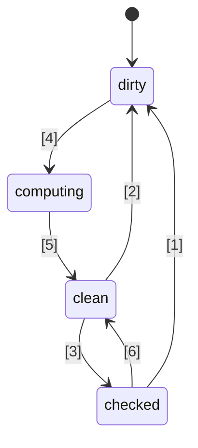
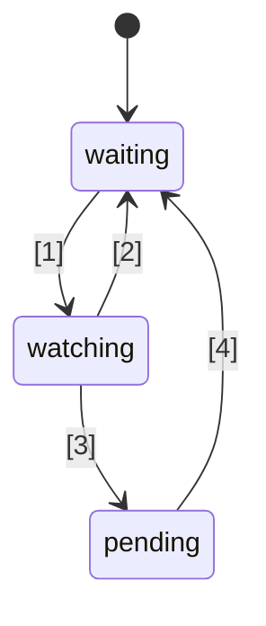

# 🚦 Стандартное предложение по Signals в JavaScript 🚦


Стадия 1 ([объяснение](https://tc39.es/process-document/))

Чемпионы предложения TC39: Даниэль Эренберг, Йехуда Кац, Джатин Раманатан, Шей Льюис, Кристен Хьюэлл Гарретт, Доминик Ганнауэй, Престон Сего, Милло М, Роб Айзенберг

Оригинальные авторы: Роб Айзенберг и Даниэль Эренберг

Этот документ описывает раннее общее направление для signals в JavaScript, аналогично инициативе Promises/A+, которая предшествовала стандартизации Promises комитетом TC39 в ES2015. Попробуйте сами, используя [polyfill](https://github.com/proposal-signals/signal-polyfill).

Подобно Promises/A+, это усилие направлено на согласование экосистемы JavaScript. Если эта согласованность будет успешной, на основе этого опыта может появиться стандарт. Несколько авторов фреймворков сотрудничают здесь над общей моделью, которая может лежать в основе их реактивного ядра. Текущий черновик основан на дизайнерских предложениях авторов и мейнтейнеров [Angular](https://angular.io/), [Bubble](https://bubble.io/), [Ember](https://emberjs.com/), [FAST](https://www.fast.design/), [MobX](https://mobx.js.org/), [Preact](https://preactjs.com/), [Qwik](https://qwik.dev/), [RxJS](https://rxjs.dev/), [Solid](https://www.solidjs.com/), [Starbeam](https://www.starbeamjs.com/), [Svelte](https://svelte.dev/), [Vue](https://vuejs.org/), [Wiz](https://blog.angular.io/angular-and-wiz-are-better-together-91e633d8cd5a) и других...

В отличие от Promises/A+, мы не пытаемся решить задачу единого API для разработчиков, а сосредоточены на точных базовых семантиках графа сигналов. Это предложение действительно включает полностью конкретный API, но он не предназначен для большинства прикладных разработчиков. Вместо этого API сигналов здесь больше подходит для фреймворков, чтобы строить на его основе, обеспечивая совместимость через общий граф сигналов и механизм авто-трекинга.

План по этому предложению — провести значительное раннее прототипирование, включая интеграцию в несколько фреймворков, прежде чем переходить дальше стадии 1. Нас интересует стандартизация Signals только если они пригодны к использованию на практике в нескольких фреймворках и дают реальные преимущества по сравнению с сигналами, предоставляемыми фреймворками. Мы надеемся, что значительное раннее прототипирование даст нам эту информацию. Подробнее см. раздел "Статус и план развития" ниже.

## Предпосылки: Зачем нужны Signals?

Для разработки сложного пользовательского интерфейса (UI) разработчикам JavaScript-приложений необходимо хранить, вычислять, инвалидировать, синхронизировать и эффективно передавать состояние на уровень отображения приложения. UI обычно включает не только управление простыми значениями, но и рендеринг вычисленного состояния, которое зависит от сложного дерева других значений или состояния, вычисляемого динамически. Цель Signals — предоставить инфраструктуру для управления таким состоянием приложения, чтобы разработчики могли сосредоточиться на бизнес-логике, а не на этих рутинных деталях.

Похожие на сигналы конструкции были независимо признаны полезными и вне UI, в частности в системах сборки для предотвращения ненужных пересборок.

Signals используются в реактивном программировании для устранения необходимости ручного управления обновлениями в приложениях.

> Декларативная модель программирования для обновления на основе изменений состояния.

из _[What is Reactivity?](https://www.pzuraq.com/blog/what-is-reactivity)_.

#### Пример — VanillaJS-счётчик

Пусть есть переменная `counter`, которую нужно отобразить в DOM в зависимости от того, чётное или нечётное её значение. Каждый раз при изменении `counter` нужно обновлять DOM с актуальным признаком чётности. На чистом JS это может выглядеть так:

```js
let counter = 0;
const setCounter = (value) => {
  counter = value;
  render();
};

const isEven = () => (counter & 1) == 0;
const parity = () => isEven() ? "even" : "odd";
const render = () => element.innerText = parity();

// Симуляция внешних обновлений counter...
setInterval(() => setCounter(counter + 1), 1000);
```
> [!NOTE]  
> Глобальные переменные здесь используются только для демонстрации. Для корректного управления состоянием существует множество решений, а примеры в этом предложении максимально минималистичны. Это предложение не поощряет использование глобальных переменных.


У этого подхода есть ряд проблем...

* Инициализация `counter` громоздкая и наполнена шаблонным кодом.
* Состояние `counter` жёстко связано с системой рендеринга.
* Если `counter` изменяется, но `parity` нет (например, счётчик с 2 на 4), мы выполняем ненужное вычисление и рендеринг.
* Что если другая часть UI хочет реагировать только на обновления `counter`?
* Что если другая часть UI зависит только от `isEven` или `parity`?

Даже в этом относительно простом сценарии быстро возникают проблемы. Можно попытаться их обойти, введя pub/sub для `counter`. Это позволит другим потребителям подписываться и реагировать на изменения состояния.

Однако остаются следующие проблемы:

* Функция рендеринга, зависящая только от `parity`, вынуждена "знать", что ей нужно подписываться на `counter`.
* Нельзя обновить UI только при изменении `isEven` или `parity`, не взаимодействуя с `counter` напрямую.
* Мы увеличили количество шаблонного кода. Использование чего-либо теперь требует не просто вызова функции или чтения переменной, а подписки и обработки обновлений. Управление отписками становится особенно сложным.

Теперь можно попытаться решить часть проблем, введя pub/sub не только для `counter`, но и для `isEven` и `parity`. Тогда придётся подписать `isEven` на `counter`, `parity` на `isEven`, а `render` на `parity`. К сожалению, в результате шаблонный код разрастается, увеличивается количество подписок и возрастает риск утечек памяти, если не правильно чистить ресурсы. Таким образом, часть проблем решена, но появляется новая категория сложностей и лишнего кода. Более того, этот процесс придётся повторять для каждого состояния в системе.

### Введение Signals

Абстракции data binding для модели и представления давно стали ядром UI-фреймворков во многих языках программирования, несмотря на отсутствие такой механики в самом JS или веб-платформе. Внутри JS-фреймворков и библиотек было много экспериментов с разными способами представления этих связей, и опыт показал эффективность однонаправленного потока данных в сочетании с полноценным типом данных, представляющим ячейку состояния или вычисления на основе других данных, который сейчас часто называют "Signals".
Похоже, что такой подход впервые стал популярен в open-source JavaScript веб-фреймворках с [Knockout](https://knockoutjs.com/) [в 2010 году](https://blog.stevensanderson.com/2010/07/05/introducing-knockout-a-ui-library-for-javascript/). С тех пор появилось много вариаций и реализаций. За последние 3–4 года примитив Signal и связанные подходы получили ещё большее распространение — практически в каждой современной JS-библиотеке или фреймворке есть что-то подобное под разными именами.

Чтобы понять Signals, рассмотрим пример выше, переосмысленный с использованием API Signals, который будет подробно описан далее.

#### Пример — Signals-счётчик

```js
const counter = new Signal.State(0);
const isEven = new Signal.Computed(() => (counter.get() & 1) == 0);
const parity = new Signal.Computed(() => isEven.get() ? "even" : "odd");

// Библиотека или фреймворк определяет эффекты на основе других примитивов Signal
declare function effect(cb: () => void): (() => void);

effect(() => element.innerText = parity.get());

// Симуляция внешних обновлений counter...
setInterval(() => counter.set(counter.get() + 1), 1000);
```

Сразу видно несколько вещей:
* Мы избавились от лишнего шаблонного кода вокруг переменной `counter` из предыдущего примера.
* Есть унифицированный API для работы со значениями, вычислениями и побочными эффектами.
* Нет проблемы циклических зависимостей между `counter` и `render`.
* Нет ручных подписок и необходимости вести учёт.
* Есть механизм управления временем/планированием побочных эффектов.

Signals дают нам гораздо больше, чем видно на поверхности API:
* **Автоматическое отслеживание зависимостей** — вычисляемый сигнал автоматически обнаруживает все другие сигналы, от которых он зависит, будь то простые значения или другие вычисления.
* **Ленивая (отложенная) оценка** — вычисления не выполняются немедленно при их объявлении, и также не вычисляются сразу при изменении их зависимостей. Они выполняются только тогда, когда их значение явно запрошено.
* **Мемоизация** — вычисляемые сигналы кэшируют своё последнее значение, чтобы вычисления с неизменившимися зависимостями не пересчитывались заново, независимо от количества обращений к ним.

## Мотивация стандартизации сигналов

#### Взаимная совместимость

Каждая реализация сигналов использует свой собственный механизм автотрекинга для отслеживания источников, встреченных при вычислении вычисляемого сигнала. Это затрудняет обмен моделями, компонентами и библиотеками между различными фреймворками — они, как правило, оказываются ложным образом связаны со своим движком представления (так как сигналы обычно реализуются как часть JS-фреймворков).

Цель этого предложения — полностью отделить реактивную модель от рендеринга, позволяя разработчикам переходить на новые технологии рендеринга без переписывания не-UI кода или разрабатывать общие реактивные модели на JS для использования в разных контекстах. К сожалению, из-за версионирования и дублирования оказалось непрактично достичь высокого уровня совместного использования через библиотеки на уровне JS — встроенные средства обеспечивают более сильную гарантию совместимости.

#### Производительность/использование памяти

Всегда есть небольшой потенциальный прирост производительности за счёт уменьшения количества доставляемого кода, если часто используемые библиотеки становятся встроенными, но реализации сигналов обычно довольно малы, поэтому этот эффект не ожидается как значительный.

Мы предполагаем, что нативные реализации на C++ структур данных и алгоритмов, связанных с сигналами, могут быть немного эффективнее, чем то, что можно реализовать на JS, за счёт постоянного множителя. Однако никаких алгоритмических изменений по сравнению с полифиллом не предполагается; не ожидается, что движки будут "магическими", а сами алгоритмы реактивности будут чётко определены и однозначны.

Группа авторов предложения планирует разработать различные реализации сигналов и использовать их для исследования возможностей по производительности.

#### DevTools

Существующие JS-библиотеки сигналов затрудняют трассировку таких вещей, как:
* Стек вызовов по цепочке вычисляемых сигналов, показывающий причинно-следственную цепочку для ошибки
* Граф ссылок между сигналами, когда один зависит от другого — это важно при отладке использования памяти

Встроенные сигналы позволяют JS-движкам и DevTools потенциально улучшить поддержку инспекции сигналов, особенно при отладке или анализе производительности — будь то встроено в браузеры или реализовано через общее расширение. Существующие инструменты, такие как инспектор элементов, снимки производительности и профилировщики памяти, можно обновить, чтобы они специально выделяли сигналы в своей информации.

#### Вторичные преимущества

##### Преимущества стандартной библиотеки

В целом, стандартная библиотека JavaScript была довольно минималистичной, но в TC39 наблюдается тенденция делать JS языком "с батарейками", с качественным, встроенным набором функциональности. Например, Temporal заменяет moment.js, а ряд небольших возможностей, например, `Array.prototype.flat` и `Object.groupBy` заменяют многие случаи использования lodash. Преимущества: меньший размер бандлов, повышенная стабильность и качество, меньше нового для изучения при переходе на проект, и общий словарь среди JS-разработчиков.

##### Интеграция с HTML/DOM (возможность на будущее)

В настоящее время в W3C и у разработчиков браузеров ведётся работа по внедрению нативного шаблонирования в HTML ([DOM Parts][wicg-pr-1023] и [Template Instantiation][wicg-propsal-template-instantiation]). Кроме того, W3C Web Components CG исследует возможность расширения Web Components для предоставления полностью декларативного HTML API. Для достижения обеих целей HTML в итоге понадобится реактивный примитив. Также можно представить себе множество эргономичных улучшений DOM за счёт интеграции сигналов, и сообщество уже выражало такой запрос.

[wicg-pr-1023]: https://github.com/WICG/webcomponents/pull/1023
[wicg-propsal-template-instantiation]: https://github.com/WICG/webcomponents/blob/gh-pages/proposals/Template-Instantiation.md

> Примечание: эта интеграция будет отдельным проектом в будущем, не частью текущего предложения.

##### Обмен информацией в экосистеме (*не* причина для внедрения)

Стандартизация может быть полезна и на уровне "сообщества", даже без изменений в браузерах. Работа над сигналами объединяет авторов многих разных фреймворков для глубокого обсуждения природы реактивности, алгоритмов и совместимости. Это уже оказалось полезным, но не оправдывает включение в JS-движки и браузеры; сигналы должны добавляться в стандарт JavaScript только при наличии значительных преимуществ *помимо* обмена знаниями в экосистеме.

## Цели проектирования сигналов

Оказалось, что существующие библиотеки сигналов в своей основе не так уж сильно отличаются друг от друга. Это предложение нацелено на развитие их успеха за счёт реализации важных качеств многих из них.

### Основные возможности

* Тип "сигнал", представляющий состояние, то есть записываемый сигнал. Это значение, которое могут читать другие.
* Тип вычисляемого/мемо/производного сигнала, который зависит от других и вычисляется лениво и кэшируется.
    * Вычисление ленивое, то есть вычисляемые сигналы по умолчанию не пересчитываются при изменении одной из зависимостей, а только если кто-то их реально читает.
    * Вычисление "без [глюков](https://en.wikipedia.org/wiki/Reactive_programming#Glitches)", то есть никогда не выполняются ненужные вычисления. Это подразумевает, что при чтении вычисляемого сигнала приложение производит топологическую сортировку потенциально "грязных" частей графа для устранения дубликатов.
    * Вычисление кэшируется: если после последнего изменения зависимости ни одна из них не изменилась, то вычисляемый сигнал *не* пересчитывается при доступе.
    * Для вычисляемых сигналов, как и для сигнала-состояния, возможны пользовательские сравнения, чтобы определять, должны ли обновляться дальнейшие вычисляемые сигналы, зависящие от них.
* Реакции на ситуацию, когда у вычисляемого сигнала одна из зависимостей (или вложенных зависимостей) становится "грязной" и меняется, что может означать устаревшее значение сигнала.
    * Такая реакция предназначена для планирования более значительной работы в будущем.
    * Эффекты реализуются на основе этих реакций плюс планирования на уровне фреймворка.
    * Вычисляемым сигналам нужна возможность реагировать на регистрацию в качестве (вложенной) зависимости одной из этих реакций.
* Позволить JS-фреймворкам выполнять собственное планирование. Не должно быть навязанного Promise-стиля планирования.
    * Синхронные реакции нужны, чтобы планировать дальнейшую работу на основе логики фреймворка.
    * Записи происходят синхронно и вступают в силу сразу (фреймворк, который делает батчинг, может реализовать это поверх).
    * Возможно отделить проверку "грязности" эффекта от его фактического выполнения (что позволяет реализовать двухэтапный планировщик эффектов).
* Возможность читать сигналы *без* записи зависимостей (`untrack`)
* Возможность композирования различных кодовых баз, использующих сигналы/реактивность, например,
    * Использование нескольких фреймворков вместе (в части отслеживания/реактивности; с оговорками, см. ниже)
    * Независимые от фреймворка реактивные структуры данных (например, рекурсивно реактивный стор proxy, реактивные Map, Set и Array и т. д.)

### Корректность (Soundness)

* Предотвращать/запрещать наивное неправильное использование синхронных реакций.
    * Риск для корректности: это может привести к появлению "[глюков](https://en.wikipedia.org/wiki/Reactive_programming#Glitches)", если использовать некорректно: если рендеринг происходит сразу при установке сигнала, это может привести к отображению неполного состояния приложения для пользователя. Поэтому эта функция должна использоваться только для грамотного планирования работы после завершения логики приложения.
    * Решение: Запретить чтение и запись любого сигнала из синхронного колбэка реакции
* Предостеречь от использования `untrack` и отметить его некорректность
    * Риск для корректности: позволяет создавать вычисляемые сигналы, чьё значение зависит от других сигналов, но которые не обновляются при изменении этих сигналов. Следует использовать, только если неотслеживаемые обращения не влияют на результат вычисления.
    * Решение: API помечен как "unsafe" в имени.
* Примечание: это предложение разрешает чтение и запись сигналов из вычисляемых и эффектовых сигналов без ограничения на записи, следующие за чтением, несмотря на риск для корректности. Это решение принято для сохранения гибкости и совместимости при интеграции с фреймворками.

### Поверхностный API

* Должен быть надёжной основой для различных фреймворков, реализующих свои механизмы сигналов/реактивности.
    * Должен быть хорошей базой для рекурсивных proxy-хранилищ, реактивности полей класса на основе декораторов, а также для API в стиле `.value` и `[state, setState]`.
    * Семантика должна позволять реализовать валидные паттерны, используемые разными фреймворками. Например, сигналы могут быть основой как немедленно отражаемых изменений, так и изменений, которые применяются позже батчингом.
* Было бы хорошо, если бы этот API был пригоден для непосредственного использования разработчиками JavaScript.
    * Если функция совпадает с концепцией из экосистемы, использование общего словаря — это хорошо.
        * Однако важно не повторять буквально одни и те же имена!
    * Напряжённость между "удобством для JS-разработчиков" и "предоставлением всех хуков для фреймворков"
        * Идея: предоставить все хуки, но по возможности выдавать ошибки при неправильном использовании.
        * Идея: вынести тонкие API в пространство имён `subtle`, аналогично [`crypto.subtle`](https://developer.mozilla.org/en-US/docs/Web/API/Crypto/subtle), чтобы отметить грань между API, необходимыми для более продвинутого использования (реализация фреймворка, разработка devtools), и более повседневной разработкой приложений (создание сигналов для использования с фреймворком).
* Должен быть реализуемым и эффективным — поверхностный API не должен вносить значительных накладных расходов
    * Должна быть возможность наследования, чтобы фреймворки могли добавлять свои методы и поля, включая приватные поля. Это важно для предотвращения дополнительных аллокаций на уровне фреймворка. См. "Управление памятью" ниже.

### Управление памятью

* Если возможно: вычисляемый сигнал должен быть удаляемым сборщиком мусора, если на него нет живых ссылок для возможных будущих чтений, даже если он связан с более широким графом, который остаётся живым (например, путём чтения состояния, которое остаётся живым).
* Обратите внимание, что большинство современных фреймворков требует явного уничтожения вычисляемых сигналов, если они имеют какую-либо ссылку на другой граф сигналов, который остаётся живым.
* Это оказывается не такой уж большой проблемой, когда их время жизни связано со временем жизни UI-компонента, и эффекты всё равно нужно уничтожать.
* Если выполнение с такой семантикой оказывается слишком затратным, то следует добавить явное уничтожение (или «отвязку») вычисляемых сигналов в API ниже, где этого сейчас нет.
* Отдельная сопутствующая цель: минимизировать количество аллокаций, например,
    * чтобы сделать записываемый сигнал (избежать двух отдельных замыканий + массива)
    * чтобы реализовать эффекты (избежать замыкания для каждой отдельной реакции)
    * в API для отслеживания изменений сигналов избегать создания дополнительных временных структур данных
    * Решение: API на основе классов, позволяющий переиспользовать методы и поля, определённые в подклассах

## Эскиз API

Ниже приведена начальная идея API сигналов. Обратите внимание, что это всего лишь ранний черновик, и мы ожидаем изменений со временем. Давайте начнём с полного `.d.ts`, чтобы получить представление о структуре, а затем обсудим детали.

```ts
interface Signal<T> {
    // Получить значение сигнала
    get(): T;
}

namespace Signal {
    // Сигнал с возможностью чтения и записи
    class State<T> implements Signal<T> {
        // Создать сигнал состояния с начальным значением t
        constructor(t: T, options?: SignalOptions<T>);

        // Получить значение сигнала
        get(): T;

        // Установить значение сигнала состояния в t
        set(t: T): void;
    }

    // Сигнал, являющийся формулой на основе других сигналов
    class Computed<T = unknown> implements Signal<T> {
        // Создать сигнал, который вычисляется как результат обратного вызова.
        // Обратный вызов вызывается с этим сигналом в качестве this.
        constructor(cb: (this: Computed<T>) => T, options?: SignalOptions<T>);

        // Получить значение сигнала
        get(): T;
    }

    // Это пространство имён включает «продвинутые» возможности, которые лучше
    // оставить авторам фреймворков, а не разработчикам приложений.
    // Аналогично `crypto.subtle`
    namespace subtle {
        // Выполнить обратный вызов с отключённым трекингом
        function untrack<T>(cb: () => T): T;

        // Получить текущий вычисляемый сигнал, который отслеживает чтения сигналов, если есть такой
        function currentComputed(): Computed | null;

        // Возвращает упорядоченный список всех сигналов, к которым этот обращался
        // во время последнего вычисления.
        // Для Watcher возвращает набор сигналов, за которыми он следит.
        function introspectSources(s: Computed | Watcher): (State | Computed)[];

        // Возвращает Watcher'ы, в которые входит этот сигнал, а также все
        // вычисляемые сигналы, которые читали этот сигнал при последнем вычислении,
        // если этот вычисляемый сигнал (рекурсивно) наблюдается.
        function introspectSinks(s: State | Computed): (Computed | Watcher)[];

        // Истинно, если сигнал «живой», то есть за ним следит Watcher,
        // или его читает вычисляемый сигнал, который (рекурсивно) жив.
        function hasSinks(s: State | Computed): boolean;

        // Истинно, если элемент «реактивный», то есть зависит
        // от какого-либо другого сигнала. Computed с hasSources == false
        // всегда будет возвращать одну и ту же константу.
        function hasSources(s: Computed | Watcher): boolean;

        class Watcher {
            // Когда (рекурсивный) источник Watcher изменяется, вызывается этот обратный вызов,
            // если он ещё не был вызван с момента последнего вызова `watch`.
            // Во время notify нельзя читать или писать сигналы.
            constructor(notify: (this: Watcher) => void);

            // Добавить эти сигналы в набор Watcher и установить Watcher для выполнения
            // notify при следующем изменении любого сигнала в наборе (или его зависимостей).
            // Можно вызвать без аргументов, чтобы просто сбросить состояние «уведомлено»,
            // чтобы notify был вызван снова.
            watch(...s: Signal[]): void;

            // Удалить эти сигналы из набора (например, для эффекта, который уничтожается)
            unwatch(...s: Signal[]): void;

            // Возвращает набор источников в наборе Watcher, которые всё ещё «грязные», либо вычисляемый сигнал,
            // у которого источник грязный или ожидает и ещё не был пересчитан
            getPending(): Signal[];
        }

        // Хуки для отслеживания момента, когда за сигналом начинают или перестают следить
        var watched: Symbol;
        var unwatched: Symbol;
    }

    interface SignalOptions<T> {
        // Пользовательская функция сравнения между старым и новым значением. По умолчанию: Object.is.
        // Сигнал передаётся как this для контекста.
        equals?: (this: Signal<T>, t: T, t2: T) => boolean;
```ts
// Callback вызывается, когда isWatched становится true, если ранее было false
[Signal.subtle.watched]?: (this: Signal<T>) => void;

// Callback вызывается каждый раз, когда isWatched становится false, если ранее было true
[Signal.subtle.unwatched]?: (this: Signal<T>) => void;
}
}
```

### Как работают сигналы

Сигнал представляет собой ячейку данных, которые могут изменяться со временем. Сигналы могут быть либо "состоянием" (просто значение, устанавливаемое вручную), либо "вычисляемым" (формула на основе других сигналов).

Вычисляемые сигналы работают путем автоматического отслеживания, какие другие сигналы были прочитаны во время их вычисления. Когда происходит чтение вычисляемого сигнала, он проверяет, изменились ли какие-либо из его ранее зафиксированных зависимостей, и, если да — переоценивает себя. Когда несколько вычисляемых сигналов вложены друг в друга, вся атрибуция отслеживания уходит к самому внутреннему.

Вычисляемые сигналы являются ленивыми, то есть работают по принципу "pull": они пересчитываются только тогда, когда к ним обращаются, даже если одна из их зависимостей изменилась ранее.

Callback, передаваемый в вычисляемые сигналы, должен быть, как правило, "чистым" в смысле детерминированной, не имеющей побочных эффектов функции от других сигналов, к которым осуществляется доступ. В то же время, момент вызова callback является детерминированным, что позволяет использовать побочные эффекты с осторожностью.

Сигналы имеют заметное кеширование/мемоизацию: как состояние, так и вычисляемые сигналы запоминают свое текущее значение и инициируют пересчет только тех вычисляемых сигналов, которые на них ссылаются, если они действительно изменились. Повторное сравнение старых и новых значений даже не требуется — сравнение производится один раз при сбросе/переоценке исходного сигнала, и механизм сигналов отслеживает, какие элементы, ссылающиеся на этот сигнал, еще не обновились на основе нового значения. Внутренне это, как правило, реализуется с помощью "раскраски графа", как описано в (блоге Milo).

Вычисляемые сигналы динамически отслеживают свои зависимости — каждый раз при запуске они могут зависеть от разных элементов, и этот точный набор зависимостей поддерживается в актуальном состоянии в графе сигналов. Это означает, что если у вас есть зависимость, необходимая только на одной ветке, а предыдущее вычисление шло по другой ветке, то изменение этой временно неиспользуемой переменной не вызовет пересчета вычисляемого сигнала, даже если будет обращение к нему.

В отличие от JavaScript Promise, все в сигналах выполняется синхронно:
- Установка нового значения сигнала происходит синхронно, и это немедленно отражается при чтении любого вычисляемого сигнала, который от него зависит. Встроенной пакетной обработки изменений нет.
- Чтение вычисляемых сигналов синхронно — их значение всегда доступно.
- Callback `notify` в Watchers, как объяснено ниже, выполняется синхронно во время вызова `.set()`, который его вызвал (но после завершения раскраски графа).

Как и Promises, сигналы могут представлять состояние ошибки: если callback вычисляемого сигнала выбрасывает исключение, то эта ошибка кешируется как обычное значение и будет выбрасываться снова при каждом чтении сигнала.

### Понимание класса Signal

Экземпляр `Signal` представляет возможность читать динамически изменяющееся значение, обновления которого отслеживаются во времени. Он также неявно включает возможность подписки на сигнал через отслеживаемый доступ из другого вычисляемого сигнала.

Данный API разработан, чтобы соответствовать приблизительному консенсусу в экосистеме сигналов относительно использования таких названий, как "signal", "computed" и "state". Однако доступ к вычисляемым и состояниям сигналам осуществляется через метод `.get()`, что расходится со всеми популярными API сигналов, которые используют либо аксессор `.value`, либо синтаксис вызова `signal()`.

API спроектирован для уменьшения числа выделений памяти, чтобы сделать сигналы пригодными для внедрения в JavaScript-фреймворки с производительностью, не уступающей или превосходящей существующие специализированные сигналы. Это означает:
- Сигналы состояния — это один изменяемый объект, к которому можно обращаться и который можно изменять из одной и той же ссылки. (См. последствия ниже в разделе "Разделение возможностей".)
- Как сигналы состояния, так и вычисляемые сигналы спроектированы так, чтобы их можно было наследовать, облегчая фреймворкам добавление дополнительных свойств через публичные и приватные поля класса (а также методы для работы с этим состоянием).
- Различные callback (например, `equals`, callback вычисляемого сигнала) вызываются с соответствующим сигналом в качестве значения `this` для контекста, чтобы не создавать новую замыкание для каждого сигнала. Вместо этого контекст можно хранить в дополнительных свойствах самого сигнала.

Некоторые условия ошибок, обеспечиваемые этим API:
- Ошибка — рекурсивное чтение вычисляемого сигнала.
- Callback `notify` у Watcher не может читать или записывать любые сигналы.
- Если callback вычисляемого сигнала выбрасывает исключение, то все последующие обращения к сигналу будут выбрасывать сохраненную ошибку, пока одна из зависимостей не изменится и не произойдет пересчет.

Некоторые условия, которые *не* контролируются:
- Вычисляемые сигналы могут записывать в другие сигналы синхронно в своем callback.
- Работа, поставленная в очередь callback-ом `notify` Watcher, может читать или записывать сигналы, что позволяет воспроизвести [классические антипаттерны React](https://react.dev/learn/you-might-not-need-an-effect) в терминах сигналов!

### Реализация эффектов

Интерфейс `Watcher`, определенный выше, служит основой для реализации типичных JS-API для эффектов: callback-ов, которые повторно выполняются при изменении других сигналов, исключительно ради побочных эффектов. Функция `effect`, используемая выше в исходном примере, может быть определена следующим образом:

```ts
// Эта функция обычно живет в библиотеке/фреймворке, а не в прикладном коде
// ПРИМЕЧАНИЕ: Эта логика планирования слишком проста для реального использования. Не копируйте.
let pending = false;

let w = new Signal.subtle.Watcher(() => {
    if (!pending) {
        pending = true;
        queueMicrotask(() => {
            pending = false;
            for (let s of w.getPending()) s.get();
            w.watch();
        });
    }
});

// Эффектный сигнал, который вычисляется до cb и планирует чтение себя в микротаске,
// всякий раз, когда одна из его зависимостей может измениться
export function effect(cb) {
    let destructor;
    let c = new Signal.Computed(() => { destructor?.(); destructor = cb(); });
    w.watch(c);
    c.get();
    return () => { destructor?.(); w.unwatch(c) };
}
```

В API сигналов не включена никакая встроенная функция вроде `effect`. Это связано с тем, что планирование эффектов тонко и часто связано с циклами рендеринга фреймворков и другим специфическим для фреймворков состоянием или стратегиями, к которым JS не имеет доступа.

Разберем различные операции, используемые здесь: Callback `notify`, переданный в конструктор `Watcher`, — это функция, вызываемая, когда сигнал переходит из "чистого" состояния (когда мы знаем, что кеш инициализирован и валиден) в "проверенное" или "грязное" состояние (когда кеш может быть или не быть валидным, потому что хотя бы одно из состояний, от которых он рекурсивно зависит, изменено).

Вызовы `notify` в конечном итоге инициируются вызовом `.set()` на каком-либо сигнале состояния. Этот вызов синхронный: происходит до возврата из `.set`. Но не нужно беспокоиться о том, что этот callback увидит граф сигналов в полупереработанном состоянии, потому что во время callback-а `notify` никакой сигнал не может быть прочитан или записан, даже в вызове `untrack`. Поскольку `notify` вызывается в процессе `.set()`, это прерывает другой поток логики, который может быть еще не завершен. Чтобы читать или записывать сигналы из `notify`, планируйте работу на потом, например, записав сигнал в список для последующего доступа или с помощью `queueMicrotask`, как показано выше.

Обратите внимание, что вполне возможно эффективно использовать сигналы без `Signal.subtle.Watcher`, планируя опрос вычисляемых сигналов, как это делает Glimmer. Однако многие фреймворки обнаружили, что часто бывает полезно выполнять такую логику синхронно, поэтому API сигналов ее включает.

Как вычисляемые, так и сигналы состояния собираются сборщиком мусора как любые значения JS. Но Watcher имеют особый способ удержания объектов: любые сигналы, отслеживаемые Watcher, будут удерживаться в памяти до тех пор, пока какие-либо из нижележащих состояний достижимы, так как они могут инициировать будущий вызов `notify` (и затем будущий вызов `.get()`). Поэтому не забывайте вызывать `Watcher.prototype.unwatch` для очистки эффектов.

### Небезопасный escape hatch

`Signal.subtle.untrack` — это лазейка, позволяющая читать сигналы *без* отслеживания этих чтений. Эта возможность небезопасна, потому что позволяет создавать вычисляемые сигналы, чье значение зависит от других сигналов, но которые не обновляются при изменении этих сигналов. Ее следует использовать только тогда, когда неотслеживаемые обращения не повлияют на результат вычисления.

<!--
TODO: Привести пример, где имеет смысл использовать untrack

### Использование watched/unwatched
TODO: Показать пример преобразования Observable в вычисляемый сигнал, на который подписываются только при использовании эффектом

TODO: Показать пример вычисляемого сигнала, который представляет результат fetch, направленного на состояние, который отменяется

### Интроспекция для SSR

TODO: Показать, как работает сериализация графа сигналов

TODO: Показать, как можно «гидратировать» сигнал от состояния к вычисляемому позже, используя несколько сигналов.
-->

### Пока опущено

Эти возможности могут быть добавлены позже, но в текущем черновике они отсутствуют. Их опущение связано с отсутствием устоявшегося консенсуса в области проектирования между фреймворками, а также с продемонстрированной способностью обходиться без них с помощью механизмов, построенных поверх концепции Signals, описанной в этом документе. Однако, к сожалению, их отсутствие ограничивает потенциал для взаимодействия между фреймворками. По мере создания прототипов Signals, описанных в этом документе, будет предпринята попытка пересмотреть, было ли это опущение правильным решением.

* **Асинхронность**: В этой модели сигналы всегда доступны для синхронной оценки. Однако часто бывает полезно иметь определённые асинхронные процессы, которые приводят к установке сигнала, и понимать, когда сигнал всё ещё «загружается». Один из простых способов смоделировать состояние загрузки — использовать исключения, и поведение кэширования исключений в вычисляемых сигналах довольно разумно сочетается с этим приёмом. Улучшенные техники обсуждаются в [Issue #30](https://github.com/proposal-signals/proposal-signals/issues/30).
* **Транзакции**: Для переходов между представлениями часто бывает полезно поддерживать активное состояние как для состояния «откуда», так и «куда». Состояние «куда» отображается в фоновом режиме, пока не будет готово к переключению (коммиту транзакции), а состояние «откуда» остаётся интерактивным. Для одновременного поддержания обоих состояний требуется «форкать» состояние графа сигналов, и может даже быть полезно поддерживать несколько ожидающих переходов одновременно. Обсуждение в [Issue #73](https://github.com/proposal-signals/proposal-signals/issues/73).

Также опущены некоторые возможные [вспомогательные методы](https://github.com/proposal-signals/proposal-signals/issues/32).

## Статус и план разработки

Это предложение включено в повестку дня TC39 на апрель 2024 года для Stage 1. В настоящее время его можно рассматривать как «Stage 0».

[Полифил](https://github.com/proposal-signals/signal-polyfill) для этого предложения доступен с некоторыми базовыми тестами. Некоторые авторы фреймворков начали экспериментировать с заменой своей реализации сигналов на эту, но это использование пока находится на ранней стадии.

Участники работы над предложением Signal хотят быть особенно **консервативными** в продвижении этого предложения, чтобы не попасть в ловушку, когда что-то внедряется, а затем оказывается бесполезным. Наш план — выполнить следующие дополнительные задачи, не требуемые процессом TC39, чтобы убедиться, что предложение находится на правильном пути:

Перед переходом на Stage 2 мы планируем:
- Разработать несколько полифильных реализаций промышленного уровня, которые будут надёжными, хорошо протестированными (например, проходят тесты различных фреймворков, а также тесты в стиле test262), и конкурентоспособными по производительности (что подтверждено тщательным набором бенчмарков сигналов/фреймворков).
- Интегрировать предлагаемое API Signal в большое количество JS-фреймворков, которые мы считаем в какой-то степени репрезентативными, а также чтобы некоторые крупные приложения работали на этой основе. Протестировать, что оно работает эффективно и корректно в этих контекстах.
- Иметь чёткое понимание пространства возможных расширений API и прийти к выводу, какие из них (если вообще какие-то) стоит включить в это предложение.

## Алгоритмы сигналов

В этом разделе описывается каждый из API, доступных для JavaScript, с точки зрения реализуемых ими алгоритмов. Это можно рассматривать как протоспецификацию и включено на этом раннем этапе, чтобы закрепить возможный набор семантики, при этом оставляя пространство для изменений.

Некоторые особенности алгоритма:
- Порядок чтения сигналов внутри вычисления имеет значение и наблюдаем в порядке выполнения определённых обратных вызовов (вызывается `Watcher`, `equals`, первый параметр в `new Signal.Computed` и обратные вызовы `watched`/`unwatched`). Это значит, что источники вычисляемого сигнала должны храниться в определённом порядке.
- Все эти четыре обратных вызова могут выбрасывать исключения, и эти исключения передаются вызывающему JS-коду предсказуемым образом. Исключения *не* останавливают выполнение этого алгоритма и не оставляют граф в полуобработанном состоянии. Для ошибок, возникших в обратном вызове `notify` у Watcher, это исключение передаётся в вызов `.set()`, который его вызвал, используя AggregateError, если исключений было несколько. Остальные (включая `watched`/`unwatched`?) сохраняются в значении сигнала, чтобы быть повторно выброшенными при чтении, и такой повторно выбрасываемый сигнал может быть помечен как `~clean~` так же, как и любой другой с обычным значением.
- Предусмотрены меры по предотвращению циклических зависимостей в случаях вычисляемых сигналов, которые не «наблюдаются» (не отслеживаются никаким Watcher), чтобы их можно было собрать сборщиком мусора независимо от других частей графа сигналов. Внутренне это можно реализовать с помощью системы номеров поколений, которые всегда собираются; обратите внимание, что оптимизированные реализации могут также включать локальные номера поколений для отдельных узлов или не отслеживать некоторые номера для наблюдаемых сигналов.

### Скрытое глобальное состояние

Алгоритмы Signal должны обращаться к определённому глобальному состоянию. Это состояние глобально для всего потока или «агента».

- `computing`: Самый внутренний вычисляемый или эффектный сигнал, который в данный момент пересчитывается из-за вызова `.get` или `.run`, либо `null`. Изначально `null`.
- `frozen`: Булево значение, обозначающее, выполняется ли в данный момент обратный вызов, который требует, чтобы граф не изменялся. Изначально `false`.
- `generation`: Инкрементируемое целое число, начинающееся с 0, используется для отслеживания актуальности значения и предотвращения циклических зависимостей.

### Пространство имён `Signal`

`Signal` — это обычный объект, который служит пространством имён для классов и функций, связанных с Signal.

`Signal.subtle` — подобный внутренний объект-пространство имён.

### Класс `Signal.State`

#### Внутренние слоты `Signal.State`

- `value`: Текущее значение сигнала состояния
- `equals`: Функция сравнения, используемая при изменении значений
- `watched`: Обратный вызов, вызываемый, когда сигнал становится отслеживаемым эффектом
- `unwatched`: Обратный вызов, вызываемый, когда сигнал больше не отслеживается эффектом
- `sinks`: Множество отслеживаемых сигналов, зависящих от этого

#### Конструктор: `Signal.State(initialValue, options)`

1. Установить `value` этого сигнала в `initialValue`.
1. Установить `equals` этого сигнала в options?.equals
1. Установить `watched` этого сигнала в options?.[Signal.subtle.watched]
1. Установить `unwatched` этого сигнала в options?.[Signal.subtle.unwatched]
1. Установить `sinks` этого сигнала в пустое множество

#### Метод: `Signal.State.prototype.get()`

1. Если `frozen` истинно, выбросить исключение.
1. Если `computing` не `undefined`, добавить этот сигнал в множество `sources` у `computing`.
1. ПРИМЕЧАНИЕ: Мы не добавляем `computing` в множество `sinks` этого сигнала, пока на него не подпишется Watcher.
1. Вернуть значение этого сигнала.

#### Метод: `Signal.State.prototype.set(newValue)`

1. Если текущий контекст выполнения находится в состоянии `frozen`, выбросить исключение.
1. Выполнить алгоритм «установки значения сигнала» с этим сигналом и первым параметром в качестве значения.
1. Если этот алгоритм вернул `~clean~`, вернуть undefined.
1. Установить состояние всех `sinks` этого сигнала в (если это вычисляемый сигнал) `~dirty~`, если они были ранее чистыми, или (если это Watcher) `~pending~`, если ранее были в состоянии `~watching~`.
1. Рекурсивно установить состояние всех зависимостей вычисляемых сигналов sinks в `~checked~`, если они были ранее `~clean~` (оставляя грязные метки на месте), или для Watchers — `~pending~`, если ранее были `~watching~`.
1. Для каждого ранее `~watching~` Watcher, найденного при этом рекурсивном поиске, затем в порядке обхода в глубину:
    1. Установить `frozen` в true.
    1. Вызвать их обратный вызов `notify` (сохраняя любое выброшенное исключение, но игнорируя возвращаемое значение `notify`).
    1. Восстановить `frozen` в false.
    1. Установить состояние Watcher в `~waiting~`.
1. Если какой-либо обратный вызов `notify` выбросил исключение, передать его вызывающему после завершения всех `notify`. Если исключений несколько, собрать их в AggregateError и выбросить его.
1. Вернуть undefined.

### Класс `Signal.Computed`

#### Состояния автомата `Signal.Computed`
Состояние (`state`) вычисляемого сигнала (Computed Signal) может быть одним из следующих:

- `~clean~`: Значение сигнала присутствует и гарантированно не устарело.
- `~checked~`: (Косвенный) источник этого сигнала изменился; у сигнала есть значение, но оно _может_ быть устаревшим. Является ли оно устаревшим, станет известно только после оценки всех непосредственных источников.
- `~computing~`: В данный момент выполняется обратный вызов (callback) этого сигнала как побочный эффект вызова `.get()`.
- `~dirty~`: Либо у этого сигнала есть значение, которое гарантированно устарело, либо он никогда не вычислялся.

Граф переходов выглядит следующим образом:



Переходы:
| Номер | Откуда | Куда | Условие | Алгоритм |
| ----- | ------ | ---- | ------- | -------- |
| 1 | `~checked~` | `~dirty~` | Был оценен непосредственный источник этого сигнала, который сам является вычисляемым сигналом, и его значение изменилось. | Алгоритм: пересчитать устаревший вычисляемый сигнал |
| 2 | `~clean~` | `~dirty~` | Был установлен непосредственный источник этого сигнала, который является состоянием (State), с новым значением, не равным предыдущему. | Метод: `Signal.State.prototype.set(newValue)` |
| 3 | `~clean~` | `~checked~` | Рекурсивный, но не непосредственный, источник этого сигнала, который является состоянием (State), был установлен с новым значением, не равным предыдущему. | Метод: `Signal.State.prototype.set(newValue)` |
| 4 | `~dirty~` | `~computing~` | Сейчас будет выполнен `callback`. | Алгоритм: пересчитать устаревший вычисляемый сигнал |
| 5 | `~computing~` | `~clean~` | `callback` завершил вычисление и вернул значение либо сгенерировал исключение. | Алгоритм: пересчитать устаревший вычисляемый сигнал |
| 6 | `~checked~` | `~clean~` | Все непосредственные источники этого сигнала были оценены, и все остались неизменными, значит, сигнал гарантированно не устарел. | Алгоритм: пересчитать устаревший вычисляемый сигнал |

#### Внутренние слоты `Signal.Computed`

- `value`: Предыдущее кэшированное значение сигнала или `~uninitialized~` для вычисляемого сигнала, который ни разу не читался. Значением может быть исключение, которое будет выброшено при чтении значения. Для сигналов-эффектов всегда `undefined`.
- `state`: Может быть `~clean~`, `~checked~`, `~computing~` или `~dirty~`.
- `sources`: Упорядоченное множество сигналов, от которых зависит этот сигнал.
- `sinks`: Упорядоченное множество сигналов, которые зависят от этого сигнала.
- `equals`: Метод сравнения, переданный в опциях.
- `callback`: Функция обратного вызова, вызываемая для получения значения вычисляемого сигнала. Устанавливается первым параметром конструктора.

#### Конструктор `Signal.Computed`

Конструктор устанавливает:
- `callback` в значение первого параметра
- `equals` согласно опциям, по умолчанию `Object.is`, если не указано
- `state` в `~dirty~`
- `value` в `~uninitialized~`

С использованием [AsyncContext](https://github.com/tc39/proposal-async-context), callback, переданный в `new Signal.Computed`, замыкает снимок состояния (snapshot) на момент вызова конструктора и восстанавливает его во время выполнения.

#### Метод: `Signal.Computed.prototype.get`

1. Если текущий контекст выполнения `frozen` или если у этого сигнала состояние `~computing~`, или если этот сигнал является Watcher и происходит вычисление вычисляемого сигнала, выбросить исключение.
1. Если `computing` не `null`, добавить этот сигнал в множество `sources` сигнала `computing`.
1. ПРИМЕЧАНИЕ: Мы не добавляем `computing` в множество `sinks` этого сигнала до тех пор, пока он не будет отслежен (watched) Watcher'ом.
1. Если состояние этого сигнала `~dirty~` или `~checked~`: Повторять следующие шаги, пока состояние этого сигнала не станет `~clean~`:
    1. Рекурсивно пройти вверх по `sources`, чтобы найти самый глубокий, левый (то есть самый ранее обнаруженный) рекурсивный источник, который является вычисляемым сигналом в состоянии `~dirty~` (прервать поиск при встрече `~clean~` вычисляемого сигнала; включить этот вычисляемый сигнал как последний элемент поиска).
    1. Выполнить алгоритм "пересчитать устаревший вычисляемый сигнал" для этого сигнала.
1. На этом этапе состояние сигнала будет `~clean~`, и ни один рекурсивный источник не будет `~dirty~` или `~checked~`. Вернуть значение сигнала (`value`). Если значение — это исключение, выбросить это исключение.

### Класс `Signal.subtle.Watcher`

#### Состояния `Signal.subtle.Watcher`

Состояние (`state`) Watcher может быть одним из следующих:

- `~waiting~`: Колбэк `notify` был вызван, или Watcher только что создан, но в данный момент не отслеживает ни одного сигнала.
- `~watching~`: Watcher активно отслеживает сигналы, но пока не произошло изменений, требующих вызова `notify`.
- `~pending~`: Зависимость Watcher изменилась, но колбэк `notify` еще не был вызван.

Граф переходов выглядит следующим образом:



Переходы:
| Номер | Откуда | Куда | Условие | Алгоритм |
| ----- | ------ | ---- | ------- | -------- |
| 1 | `~waiting~` | `~watching~` | Был вызван метод `watch` Watcher'а. | Метод: `Signal.subtle.Watcher.prototype.watch(...signals)` |
| 2 | `~watching~` | `~waiting~` | Был вызван метод `unwatch` Watcher'а и последний отслеживаемый сигнал был удален. | Метод: `Signal.subtle.Watcher.prototype.unwatch(...signals)` |
| 3 | `~watching~` | `~pending~` | Отслеживаемый сигнал мог изменить значение. | Метод: `Signal.State.prototype.set(newValue)` |
| 4 | `~pending~` | `~waiting~` | Был вызван колбэк `notify`. | Метод: `Signal.State.prototype.set(newValue)` |

#### Внутренние слоты `Signal.subtle.Watcher`

- `state`: Может быть `~watching~`, `~pending~` или `~waiting~`
- `signals`: Упорядоченное множество сигналов, которые отслеживает этот Watcher
- `notifyCallback`: Колбэк, вызываемый при изменении чего-либо. Устанавливается первым параметром конструктора.

#### Конструктор: `new Signal.subtle.Watcher(callback)`

1. `state` устанавливается в `~waiting~`.
1. `signals` инициализируется как пустое множество.
1. `notifyCallback` устанавливается равным параметру callback.
С [AsyncContext](https://github.com/tc39/proposal-async-context) обратный вызов, переданный в `new Signal.subtle.Watcher`, *не* замыкается на снимке состояния в момент вызова конструктора, чтобы контекстная информация вокруг записи оставалась видимой.

#### Метод: `Signal.subtle.Watcher.prototype.watch(...signals)`

1. Если `frozen` истинно, выбросить исключение.
1. Если какой-либо из аргументов не является сигналом, выбросить исключение.
1. Добавить все аргументы в конец массива `signals` этого объекта.
1. Для каждого нового отслеживаемого сигнала, слева направо:
    1. Добавить этот watcher как `sink` к этому сигналу.
    1. Если это был первый sink, то рекурсивно пройтись по источникам, чтобы добавить этот сигнал как sink.
    1. Установить `frozen` в true.
    1. Вызвать обратный вызов `watched`, если он существует.
    1. Восстановить `frozen` в false.
1. Если `state` сигнала — `~waiting~`, то установить его в `~watching~`.

#### Метод: `Signal.subtle.Watcher.prototype.unwatch(...signals)`

1. Если `frozen` истинно, выбросить исключение.
1. Если какой-либо из аргументов не является сигналом или не отслеживается этим watcher, выбросить исключение.
1. Для каждого сигнала из аргументов, слева направо:
    1. Удалить этот сигнал из множества `signals` этого Watcher.
    1. Удалить этот Watcher из множества `sink` этого сигнала.
    1. Если множество `sink` этого сигнала стало пустым, удалить этот сигнал как sink из каждого его источника.
    1. Установить `frozen` в true.
    1. Вызвать обратный вызов `unwatched`, если он существует.
    1. Восстановить `frozen` в false.
1. Если у watcher больше нет сигналов в `signals`, и его `state` — `~watching~`, установить его в `~waiting~`.

#### Метод: `Signal.subtle.Watcher.prototype.getPending()`

1. Вернуть массив, содержащий подмножество сигналов из `signals`, которые являются вычисляемыми сигналами в состояниях `~dirty~` или `~pending~`.

### Метод: `Signal.subtle.untrack(cb)`

1. Пусть `c` — текущее значение `computing` в контексте исполнения.
1. Установить `computing` в null.
1. Вызвать `cb`.
1. Восстановить `computing` в `c` (даже если `cb` выбросил исключение).
1. Вернуть результат выполнения `cb` (или пробросить исключение).

Примечание: untrack не выводит из состояния `frozen`, которое поддерживается строго.

### Метод: `Signal.subtle.currentComputed()`

1. Вернуть текущее значение `computing`.

### Общие алгоритмы

##### Алгоритм: пересчитать грязный вычисляемый сигнал

1. Очистить множество `sources` этого сигнала и удалить его из множеств `sinks` этих источников.
1. Сохранить предыдущее значение `computing` и установить `computing` в этот сигнал.
1. Установить состояние сигнала в `~computing~`.
1. Выполнить обратный вызов вычисляемого сигнала, используя этот сигнал как this. Сохранить возвращаемое значение и, если обратный вызов выбросил исключение, сохранить его для повторного выбрасывания.
1. Восстановить предыдущее значение `computing`.
1. Применить алгоритм "установки значения сигнала" к возвращаемому значению обратного вызова.
2. Установить состояние сигнала в `~clean~`.
1. Если алгоритм вернул `~dirty~`: пометить все sinks этого сигнала как `~dirty~` (ранее sinks могли быть смесью checked и dirty). (Или, если сигнал не отслеживается, принять новое поколение для указания "грязности" или что-то подобное.)
1. Иначе, если алгоритм вернул `~clean~`: для каждого sink этого сигнала в состоянии `~checked~`, если все его источники теперь чисты, то пометить этот сигнал как `~clean~` также. Применить этот шаг очистки к последующим sinks рекурсивно, для всех новых чистых сигналов, имеющих checked sinks. (Или, если сигнал не отслеживается, как-то обозначить это, чтобы очистка могла производиться лениво.)

##### Алгоритм установки значения сигнала

1. Если алгоритму передано значение (в отличие от исключения для повторного выбрасывания из алгоритма пересчёта грязного вычисляемого сигнала):
    1. Вызвать функцию `equals` этого сигнала, передав текущий `value`, новое значение и сам сигнал. Если выброшено исключение, сохранить его (для повторного выбрасывания при чтении) как значение сигнала и продолжить, как если бы функция вернула false.
    1. Если функция вернула true, вернуть `~clean~`.
1. Установить `value` этого сигнала в переданное значение.
1. Вернуть `~dirty~`

## FAQ

**В:** Не слишком ли рано стандартизировать что-то, связанное с сигналами, когда они только начали набирать популярность в 2022 году? Не стоит ли дать им больше времени на развитие и стабилизацию?

**О:** Текущее состояние сигналов во фреймворках для веба — результат более чем 10-летнего непрерывного развития. По мере того как инвестиции растут, как это было в последние годы, почти все фреймворки приходят к очень похожей основной модели сигналов. Это предложение — результат совместного проектирования между большим количеством лидеров современных веб-фреймворков, и оно не будет продвигаться к стандартизации без валидации этой группы экспертов в разных контекстах.

#### Как используются сигналы?

**В:** Могут ли встроенные сигналы вообще использоваться фреймворками, учитывая их тесную интеграцию с рендерингом и владением?

**О:** Части, которые больше зависят от фреймворков, обычно касаются эффектов, планирования и владения/освобождения ресурсов, и это предложение не пытается их решать. Наш главный приоритет при прототипировании сигналов для стандартизации — убедиться, что они могут "лежать в основе" существующих фреймворков совместимо и с хорошей производительностью.

**В:** Предполагается ли, что API Signal будет использоваться напрямую разработчиками приложений или он предназначен для обёртывания фреймворками?

**О:** Хотя этот API может использоваться напрямую разработчиками приложений (по крайней мере, та его часть, что не находится в пространстве имён `Signal.subtle`), он не рассчитан на особую эргономику. Вместо этого приоритеты отданы авторам библиотек/фреймворков. Ожидается, что большинство фреймворков обернут даже базовые API `Signal.State` и `Signal.Computed` в что-то более удобное. На практике обычно лучше использовать сигналы через фреймворк, который управляет сложными функциями (например, Watcher, `untrack`), а также владением и освобождением ресурсов (например, определяет, когда сигналы должны быть добавлены в watcher и удалены из них), и планированием рендеринга в DOM — это предложение не пытается решать эти задачи.

**В:** Нужно ли явно уничтожать сигналы, связанные с виджетом, когда этот виджет уничтожается? Какой API для этого существует?

**О:** Соответствующая операция уничтожения здесь — `Signal.subtle.Watcher.prototype.unwatch`. Только отслеживаемые сигналы нужно очищать (путём unwatch), а неотслеживаемые сигналы могут быть автоматически собраны сборщиком мусора.

**В:** Работают ли сигналы с VDOM или напрямую с HTML DOM?

**О:** Да! Сигналы независимы от технологии рендеринга. Существующие фреймворки на JavaScript, использующие конструкции, подобные сигналам, интегрируются с VDOM (например, Preact), нативным DOM (например, Solid) и их комбинациями (например, Vue). То же самое будет возможно и со встроенными сигналами.

**В:** Будет ли удобно использовать сигналы во фреймворках, основанных на классах, таких как Angular и Lit? А как насчёт фреймворков на основе компилятора, таких как Svelte?

**О:** Поля классов могут быть основаны на сигналах с помощью простого декоратора-аксессора, как показано в [readme Signal polyfill](https://github.com/proposal-signals/signal-polyfill#combining-signals-and-decorators). Сигналы очень тесно связаны с рунами Svelte 5 — компилятору легко преобразовать руны в API сигналов, определённый здесь, и на самом деле именно так и поступает Svelte 5 (но со своей собственной библиотекой сигналов).

**В:** Работают ли сигналы с SSR? Гидрацией? Восстанавливаемостью?

**О:** Да. Qwik эффективно использует сигналы и для этих свойств, а другие фреймворки имеют хорошо проработанные подходы к гидрации с сигналами с разными компромиссами. Мы считаем, что можно смоделировать восстанавливаемые сигналы Qwik, используя связку State и Computed сигнала, и планируем доказать это на практике в коде.
**В**: Работают ли сигналы с однонаправленным потоком данных, как это делает React?

**О**: Да, сигналы являются механизмом для однонаправленного потока данных. UI-фреймворки на основе сигналов позволяют выразить представление как функцию от модели (где модель включает сигналы). Граф состояний и вычисляемых сигналов по определению ацикличен. Также возможно воспроизвести анти-паттерны React в рамках сигналов (!), например, эквивалент сигнала для `setState` внутри `useEffect` — это использование Watcher для планирования записи в сигнальный State.

**В**: Как сигналы соотносятся с системами управления состоянием, такими как Redux? Поощряют ли сигналы неструктурированное состояние?

**О**: Сигналы могут стать эффективной основой для абстракций управления состоянием, подобных хранилищу. Распространённый паттерн во многих фреймворках — это объект на основе Proxy, который внутренне представляет свойства с помощью сигналов, например, [Vue `reactive()`](https://vuejs.org/api/reactivity-core.html#reactive) или [Solid stores](https://docs.solidjs.com/concepts/stores). Эти системы позволяют гибко группировать состояние на нужном уровне абстракции для конкретного приложения.

**В**: Что предлагают сигналы такого, чего не умеет `Proxy`?

**О**: Proxy и сигналы дополняют друг друга и хорошо работают вместе. Proxy позволяет перехватывать поверхностные операции с объектами, а сигналы координируют граф зависимостей (ячеек). Использовать сигналы в качестве основы для Proxy — отличный способ создать вложенную реактивную структуру с хорошей эргономикой.

В этом примере мы можем использовать proxy для создания геттера и сеттера у сигнала вместо методов `get` и `set`:
```js
const a = new Signal.State(0);
const b = new Proxy(a, {
  get(target, property, receiver) {
    if (property === 'value') {
      return target.get():
    }
  }
  set(target, property, value, receiver) {
    if (property === 'value') {
      target.set(value)!
    }
  }
});

// использование в гипотетическом реактивном контексте:
<template>
  {b.value}

  <button onclick={() => {
    b.value++;
  }}>change</button>
</template>
```
при использовании рендера, оптимизированного для мелкозернистой реактивности, клик по кнопке вызовет обновление ячейки `b.value`.

См.:
- примеры вложенных реактивных структур, созданных с помощью сигналов и Proxy: [signal-utils](https://github.com/NullVoxPopuli/signal-utils/tree/main/src)
- пример предыдущих реализаций, показывающих связь между реактивными данными и прокси: [tracked-built-ins](https://github.com/tracked-tools/tracked-built-ins/tree/master/addon/src/-private)
- [обсуждение](https://github.com/proposal-signals/proposal-signals/issues/101#issuecomment-2029802574).

#### Как работают сигналы?

**В**: Сигналы основаны на push- или pull-модели?

**О**: Вычисление вычисляемых сигналов основано на pull-модели: вычисляемые сигналы пересчитываются только при вызове `.get()`, даже если базовое состояние изменилось намного раньше. В то же время, изменение State-сигнала может немедленно вызвать callback Watcher'а, "проталкивая" уведомление. Таким образом, сигналы можно рассматривать как конструкцию "push-pull".

**В**: Вносят ли сигналы недетерминизм в выполнение JavaScript?

**О**: Нет. Во-первых, все операции с сигналами имеют чётко определённую семантику и порядок, и не будут отличаться между корректными реализациями. На более высоком уровне сигналы следуют определённому набору инвариантов, относительно которых они "корректны". Вычисляемый сигнал всегда наблюдает граф сигналов в согласованном состоянии, и его выполнение не прерывается другим кодом, изменяющим сигналы (за исключением вызовов самого себя). См. описание выше.

**В**: Когда я записываю в State-сигнал, когда обновление вычисляемого сигнала планируется?

**О**: Оно не планируется! Вычисляемый сигнал пересчитает себя в следующий раз, когда его кто-то прочитает. Синхронно может быть вызван callback Watcher'а, что позволяет фреймворкам запланировать чтение в подходящий для них момент.

**В**: Когда записи в State-сигналы вступают в силу? Немедленно или пакетно?

**О**: Записи в State-сигналы отражаются немедленно — при следующем чтении вычисляемого сигнала, который зависит от State-сигнала, он пересчитает себя при необходимости, даже если это происходит в следующей строке кода. Однако, присущая механизму ленивость (вычисляемые сигналы вычисляются только при чтении) на практике приводит к тому, что вычисления могут происходить пакетно.

**В**: Что означает, что сигналы обеспечивают "безглитчевое" выполнение?

**О**: Более ранние push-модели реактивности сталкивались с проблемой избыточных вычислений: если изменение State-сигнала вызывает немедленный запуск вычисляемого сигнала, в итоге это может привести к обновлению UI. Однако это обновление может быть преждевременным, если до следующего кадра произойдет ещё одно изменение исходного State-сигнала. Иногда из-за таких [глитчей](https://en.wikipedia.org/wiki/Reactive_programming#Glitches) конечным пользователям даже показывались неверные промежуточные значения. Сигналы избегают этой проблемы, будучи основанными на pull-модели, а не push: в момент, когда фреймворк планирует рендеринг UI, он "вытягивает" актуальные обновления, избегая напрасной работы как при вычислениях, так и при записи в DOM.

**В**: Что значит, что сигналы "теряют" значения ("lossy")?

**О**: Это обратная сторона безглитчевого выполнения: сигналы представляют собой ячейку данных — только текущее значение (которое может измениться), а не поток данных во времени. Поэтому, если вы дважды подряд запишете в State-сигнал, не делая больше ничего, первая запись "теряется" и не видна ни одному вычисляемому сигналу или эффекту. Это считается достоинством, а не ошибкой — для потоков данных больше подходят другие конструкции (например, асинхронные итераторы, observables).

**В**: Будут ли нативные сигналы быстрее существующих JS-реализаций сигналов?

**О**: Мы надеемся на это (за счёт небольшого постоянного множителя), но это ещё предстоит доказать на практике. JS-движки — не магия, и им в конечном итоге придётся реализовать те же алгоритмы, что и JS-реализации сигналов. См. раздел выше о производительности.

#### Почему сигналы устроены так?

**В**: Почему в этом предложении не включена функция `effect()`, если эффекты необходимы для практического использования сигналов?

**О**: Эффекты по своей природе связаны с планированием и удалением (disposal), которые управляются фреймворками и выходят за рамки этого предложения. Вместо этого в предложении есть основа для реализации эффектов через низкоуровневый API `Signal.subtle.Watcher`.

**В**: Почему подписки происходят автоматически, а не с помощью ручного интерфейса?

**О**: Опыт показал, что ручные интерфейсы подписки для реактивности неудобны и склонны к ошибкам. Автоматическое отслеживание более компонуемо и является ключевой особенностью сигналов.

**В**: Почему callback Watcher'а вызывается синхронно, а не планируется в микротаск?

**О**: Поскольку callback не может читать или писать сигналы, синхронный вызов не нарушает корректность. Типичный callback просто добавляет сигнал в массив для последующего чтения или выставляет где-то бит. Создавать отдельный микротаск для каждого такого действия не только излишне, но и непрактично дорого.

**В**: В этом API не хватает некоторых удобных функций, которые есть в моём любимом фреймворке и которые упрощают работу с сигналами. Можно ли добавить их в стандарт?

**О**: Возможно. Различные расширения всё ещё находятся на рассмотрении. Пожалуйста, заведите issue для обсуждения любой отсутствующей, по вашему мнению, важной функции.

**В**: Можно ли уменьшить размер или сложность этого API?

**О**: Это определённо цель — сделать API минимальным, и мы старались этого добиться в приведённом выше описании. Если у вас есть идеи, что ещё можно убрать, пожалуйста, создайте issue для обсуждения.

#### Как проходит стандартизация сигналов?

**В**: Разве не стоило бы начать работу по стандартизации с более примитивной концепции, такой как observables?
**В**: Наблюдаемые объекты (Observables) могут быть хорошей идеей для некоторых задач, но они не решают те проблемы, которые призваны решать Сигналы (Signals). Как описано выше, наблюдаемые объекты или другие механизмы публикации/подписки не являются полноценным решением для многих типов UI-программирования из-за чрезмерно трудоемкой и подверженной ошибкам настройки для разработчиков, а также из-за потерь производительности по причине отсутствия ленивости и других проблем.

**Вопрос**: Почему Сигналы предлагаются в TC39, а не в DOM, учитывая, что большинство их применений связано с вебом?

**Ответ**: Некоторые соавторы этого предложения заинтересованы в не-вебовых UI-средах как в одной из целей, однако сегодня обе площадки вполне подходят, поскольку веб-API всё чаще реализуются вне веба. В конечном итоге, Сигналы не зависят от каких-либо DOM-API, поэтому оба варианта возможны. Если у кого-то есть веская причина для смены рабочей группы, пожалуйста, сообщите об этом в issue. На данный момент все участники подписали соглашения об интеллектуальной собственности TC39, и планируется представить предложение в TC39.

**Вопрос**: Сколько времени потребуется, чтобы я мог использовать стандартные Сигналы?

**Ответ**: Полифил уже доступен, но лучше не полагаться на его стабильность, поскольку этот API будет меняться в процессе рассмотрения. Через несколько месяцев или год можно ожидать появления качественного, высокопроизводительного и стабильного полифила, однако он всё равно будет подвержен изменениям со стороны комитета и пока не станет стандартом. Следуя типичному пути рассмотрения предложений в TC39, можно ожидать, что пройдет минимум 2-3 года до того момента, когда Сигналы будут нативно поддерживаться всеми браузерами (с поддержкой нескольких предыдущих версий), и необходимость в полифилах отпадет.

**Вопрос**: Как мы предотвратим слишком раннюю стандартизацию неправильного типа Сигналов, как это было с {{JS/web feature that you don't like}}?

**Ответ**: Авторы данного предложения планируют приложить дополнительные усилия по созданию прототипов и проверке решений до подачи запроса на повышение стадии в TC39. См. раздел "Статус и план разработки" выше. Если вы видите пробелы в этом плане или возможности для улучшения, пожалуйста, создайте issue с пояснением.


---


Tranlated By [Open Ai Tx](https://github.com/OpenAiTx/OpenAiTx) | Last indexed: 2025-06-28


---