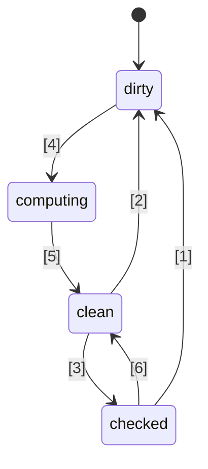
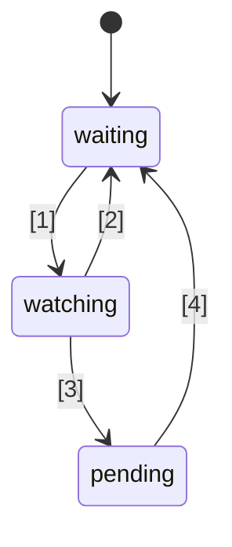

# 🚦 ข้อเสนอมาตรฐาน JavaScript Signals 🚦


Stage 1 ([คำอธิบาย](https://tc39.es/process-document/))

TC39 proposal champions: Daniel Ehrenberg, Yehuda Katz, Jatin Ramanathan, Shay Lewis, Kristen Hewell Garrett, Dominic Gannaway, Preston Sego, Milo M, Rob Eisenberg

ผู้เขียนต้นฉบับ: Rob Eisenberg และ Daniel Ehrenberg

เอกสารนี้อธิบายทิศทางร่วมเบื้องต้นสำหรับ signals ใน JavaScript คล้ายกับความพยายาม Promises/A+ ซึ่งมาก่อน Promises ที่ TC39 รับรองเป็นมาตรฐานใน ES2015 ลองใช้งานด้วยตัวเอง โดยใช้ [polyfill](https://github.com/proposal-signals/signal-polyfill)

เช่นเดียวกับ Promises/A+ ความพยายามนี้มุ่งเน้นการปรับแนวทางให้สอดคล้องกันใน ecosystem ของ JavaScript หากการปรับแนวทางนี้ประสบความสำเร็จ อาจมีมาตรฐานเกิดขึ้นโดยอิงจากประสบการณ์นั้น มีผู้เขียนเฟรมเวิร์กหลายรายที่ร่วมมือกันพัฒนารูปแบบร่วมที่อาจเป็นแกนหลักของระบบ reactivity ของพวกเขา ฉบับร่างปัจจุบันนี้อ้างอิงจากข้อเสนอแนะด้านการออกแบบจากผู้เขียน/ผู้ดูแลของ [Angular](https://angular.io/), [Bubble](https://bubble.io/), [Ember](https://emberjs.com/), [FAST](https://www.fast.design/), [MobX](https://mobx.js.org/), [Preact](https://preactjs.com/), [Qwik](https://qwik.dev/), [RxJS](https://rxjs.dev/), [Solid](https://www.solidjs.com/), [Starbeam](https://www.starbeamjs.com/), [Svelte](https://svelte.dev/), [Vue](https://vuejs.org/), [Wiz](https://blog.angular.io/angular-and-wiz-are-better-together-91e633d8cd5a) และอื่น ๆ …

แตกต่างจาก Promises/A+ ตรงที่เราไม่ได้พยายามแก้ปัญหาในส่วน API ที่นักพัฒนาต้องใช้งานโดยตรง แต่เป็นแก่นหลักของ semantics ที่แม่นยำของกราฟ signal ที่อยู่เบื้องหลัง ข้อเสนอนี้รวม API ที่เป็นรูปธรรมอย่างสมบูรณ์ แต่ API นี้ไม่ได้มุ่งเป้าไปที่นักพัฒนาแอปพลิเคชันส่วนใหญ่ แต่ signal API ที่นำเสนอนี้เหมาะสมกับเฟรมเวิร์กต่าง ๆ ในการนำไปต่อยอด เพื่อให้เกิดการทำงานร่วมกันผ่านกราฟ signal ร่วมและกลไกการติดตามอัตโนมัติ

แผนสำหรับข้อเสนอนี้คือทำการต้นแบบ (prototype) อย่างจริงจังในช่วงแรก รวมถึงการผสานเข้ากับเฟรมเวิร์กหลายตัว ก่อนจะก้าวไปไกลกว่า Stage 1 เราสนใจที่จะมาตรฐาน Signals เฉพาะในกรณีที่เหมาะสมกับการใช้งานจริงในหลายเฟรมเวิร์ก และให้ประโยชน์จริงเหนือกว่าการใช้ signals ที่แต่ละเฟรมเวิร์กจัดหาให้เอง เราหวังว่าการต้นแบบในช่วงต้นนี้จะให้ข้อมูลดังกล่าว ดู "สถานะและแผนการพัฒนา" ด้านล่างสำหรับรายละเอียดเพิ่มเติม

## พื้นหลัง: ทำไมต้อง Signals?

เพื่อพัฒนาอินเทอร์เฟซผู้ใช้ (UI) ที่ซับซ้อน นักพัฒนาแอปพลิเคชัน JavaScript จำเป็นต้องจัดเก็บ คำนวณ ทำให้ข้อมูลไม่ถูกต้อง ซิงก์ และดันสถานะไปยัง view layer ของแอปพลิเคชันอย่างมีประสิทธิภาพ UI มักจะมีอะไรมากกว่าการจัดการค่าอย่างง่าย แต่มักจะต้องเรนเดอร์สถานะที่คำนวณได้ซึ่งขึ้นอยู่กับต้นไม้ที่ซับซ้อนของค่าหรือสถานะอื่น ๆ ที่ถูกคำนวณด้วย เป้าหมายของ Signals คือการจัดเตรียมโครงสร้างพื้นฐานสำหรับจัดการสถานะแอปพลิเคชันดังกล่าวเพื่อให้นักพัฒนาสามารถมุ่งเน้นที่ตรรกะของธุรกิจแทนรายละเอียดที่ต้องทำซ้ำเหล่านี้

constructs ที่คล้าย Signal ถูกค้นพบว่ามีประโยชน์ในบริบทที่ไม่ใช่ UI ด้วยเช่นกัน โดยเฉพาะในระบบ build เพื่อลดการ build ที่ไม่จำเป็น

Signals ถูกใช้ใน reactive programming เพื่อขจัดความจำเป็นในการจัดการการอัปเดตในแอปพลิเคชัน

> รูปแบบการเขียนโปรแกรมแบบ declarative สำหรับการอัปเดตตามการเปลี่ยนแปลงของ state

จาก _[What is Reactivity?](https://www.pzuraq.com/blog/what-is-reactivity)_.

#### ตัวอย่าง - ตัวนับใน VanillaJS

กำหนดตัวแปร `counter` คุณต้องการเรนเดอร์ใน DOM ว่าค่า counter เป็นเลขคู่หรือคี่ ทุกครั้งที่ `counter` เปลี่ยน คุณต้องอัปเดต DOM ด้วยค่า parity ล่าสุด ใน Vanilla JS คุณอาจมีโค้ดแบบนี้:

```js
let counter = 0;
const setCounter = (value) => {
  counter = value;
  render();
};

const isEven = () => (counter & 1) == 0;
const parity = () => isEven() ? "even" : "odd";
const render = () => element.innerText = parity();

// จำลองการอัปเดต counter จากภายนอก...
setInterval(() => setCounter(counter + 1), 1000);
```
> [!NOTE]  
> ตัวแปร global ถูกใช้เพื่อการสาธิตเท่านั้น การจัดการสถานะอย่างถูกต้องมีหลายวิธี และตัวอย่างในข้อเสนอนี้ถูกออกแบบให้เรียบง่ายที่สุด ข้อเสนอนี้ไม่ได้สนับสนุนให้ใช้ global variables

สิ่งนี้มีปัญหาหลายประการ...

* การตั้งค่า `counter` มีความวุ่นวายและเต็มไปด้วย boilerplate
* สถานะ `counter` ผูกติดกับระบบ rendering อย่างแน่นแฟ้น
* หาก `counter` เปลี่ยนแต่ `parity` ไม่เปลี่ยน (เช่น counter เปลี่ยนจาก 2 เป็น 4) เราจะคำนวณ parity และ render ใหม่โดยไม่จำเป็น
* ถ้าส่วนอื่นของ UI ต้องการ render เมื่อ `counter` อัปเดตล่ะ?
* ถ้าส่วนอื่นของ UI ขึ้นกับ `isEven` หรือ `parity` เพียงอย่างเดียวล่ะ?

แม้จะเป็นกรณีที่ค่อนข้างเรียบง่ายนี้ ก็เกิดปัญหาหลายอย่างขึ้นอย่างรวดเร็ว เราอาจพยายามแก้ปัญหาโดยเพิ่ม pub/sub ให้กับ `counter` เพื่อให้ผู้บริโภคเพิ่มเติมของ `counter` สามารถ subscribe เพื่อตอบสนองต่อการเปลี่ยนแปลง state ได้

แต่เรายังติดปัญหาต่อไปนี้:

* ฟังก์ชัน render ที่ขึ้นกับ `parity` เพียงอย่างเดียว กลับต้อง "รู้" ว่าจริง ๆ แล้วต้อง subscribe กับ `counter`
* ไม่สามารถอัปเดต UI จาก `isEven` หรือ `parity` โดยตรงโดยไม่ต้องยุ่งกับ `counter`
* เพิ่มความซับซ้อน boilerplate ทุกครั้งที่ใช้สิ่งใด ไม่ใช่แค่เรียกฟังก์ชันหรืออ่านค่าตัวแปร แต่ต้อง subscribe และจัดการอัปเดต รวมถึงการจัดการ unsubscription ที่ยุ่งยากเป็นพิเศษ

ขณะนี้ เราอาจจะแก้ปัญหาบางส่วนได้โดยเพิ่ม pub/sub ไม่ใช่แค่กับ `counter` แต่รวมถึง `isEven` และ `parity` ด้วย เราจะต้อง subscribe `isEven` กับ `counter`, `parity` กับ `isEven` และ `render` กับ `parity` แต่น่าเสียดาย ไม่เพียงแต่โค้ด boilerplate จะระเบิดขึ้นเท่านั้น เรายังต้องจดบันทึกการ subscribe จำนวนมาก และอาจเสี่ยงต่อปัญหา memory leak หากไม่ล้างข้อมูลอย่างถูกต้อง ดังนั้น แม้จะแก้ปัญหาบางอย่างได้ ก็กลับสร้างปัญหาใหม่ขึ้นมาอีกมากและโค้ดก็ซับซ้อนขึ้น ที่แย่กว่านั้นเราต้องทำกระบวนการนี้กับ state ทุกตัวในระบบของเรา

### แนะนำ Signals

นามธรรม data binding ใน UI สำหรับ model และ view เป็นแกนหลักของเฟรมเวิร์ก UI ในหลากหลายภาษาโปรแกรมมาอย่างยาวนาน แม้จะไม่มีกลไกดังกล่าวใน JS หรือแพลตฟอร์มเว็บ ใน JS framework และไลบรารี มีการทดลองมากมายเกี่ยวกับวิธีการแสดง binding นี้ และประสบการณ์แสดงให้เห็นถึงพลังของ one-way data flow ร่วมกับชนิดข้อมูล (data type) ชั้นหนึ่งที่แทนเซลล์ของ state หรือการคำนวณที่ได้จากข้อมูลอื่น ซึ่งปัจจุบันมักเรียกว่า "Signals"
แนวทาง reactive value แบบนี้ดูเหมือนจะปรากฏอย่างแพร่หลายในเฟรมเวิร์กเว็บ JavaScript open-source ครั้งแรกกับ [Knockout](https://knockoutjs.com/) [ในปี 2010](https://blog.stevensanderson.com/2010/07/05/introducing-knockout-a-ui-library-for-javascript/) ตลอดหลายปีที่ผ่านมา มีการสร้าง variation และ implementation หลายแบบ ในช่วง 3-4 ปีหลัง primitive ของ Signal และแนวทางที่เกี่ยวข้องได้รับความนิยมเพิ่มขึ้นเกือบทุกไลบรารีหรือเฟรมเวิร์ก JavaScript สมัยใหม่มีสิ่งที่คล้ายกัน ไม่ว่าจะใช้ชื่อใดก็ตาม

เพื่อให้เข้าใจ Signals มาดูตัวอย่างด้านบนที่นำเสนอใหม่ด้วย Signal API ที่อธิบายไว้ด้านล่าง

#### ตัวอย่าง - ตัวนับแบบ Signals

```js
const counter = new Signal.State(0);
const isEven = new Signal.Computed(() => (counter.get() & 1) == 0);
const parity = new Signal.Computed(() => isEven.get() ? "even" : "odd");

// ไลบรารีหรือเฟรมเวิร์กกำหนดเอฟเฟกต์โดยอิงกับ Signal primitives อื่น ๆ
declare function effect(cb: () => void): (() => void);

effect(() => element.innerText = parity.get());

// จำลองการอัปเดต counter จากภายนอก...
setInterval(() => counter.set(counter.get() + 1), 1000);
```

มีสิ่งที่เราสังเกตได้ทันที:
* เราขจัด boilerplate ที่วุ่นวายรอบตัวแปร `counter` จากตัวอย่างก่อนหน้า
* มี API เดียวสำหรับจัดการค่า การคำนวณ และ side effect
* ไม่มีปัญหา circular reference หรือ dependency กลับด้านระหว่าง `counter` กับ `render`
* ไม่มีการ subscribe ด้วยตนเอง หรือการจดบันทึกใด ๆ ที่ต้องทำ
* สามารถควบคุมเวลา/การจัดตารางของ side-effect ได้

Signals ให้มากกว่าสิ่งที่เห็นบนผิวของ API ดังนี้:
* **การติดตามการพึ่งพาโดยอัตโนมัติ** - Signal ที่คำนวณได้จะค้นหา Signal อื่นๆ ที่มันขึ้นอยู่โดยอัตโนมัติ ไม่ว่า Signal เหล่านั้นจะเป็นค่าธรรมดาหรือการคำนวณอื่นๆ
* **การประเมินค่าแบบ Lazy** - การคำนวณจะไม่ถูกประเมินทันทีเมื่อถูกประกาศ และจะไม่ถูกประเมินในทันทีเมื่อการพึ่งพาของมันเปลี่ยนแปลง จะมีการประเมินค่าเมื่อมีการร้องขอค่าของมันโดยชัดเจนเท่านั้น
* **การจดจำผลลัพธ์ (Memoization)** - Signal ที่คำนวณได้จะเก็บค่าล่าสุดไว้ ดังนั้นการคำนวณที่ไม่มีการเปลี่ยนแปลงในการพึ่งพาจะไม่ต้องถูกประเมินซ้ำอีก ไม่ว่าจะถูกเข้าถึงกี่ครั้งก็ตาม

## แรงจูงใจในการสร้างมาตรฐาน Signals

#### การทำงานร่วมกัน (Interoperability)

แต่ละการใช้งาน Signal จะมีกลไกการติดตามอัตโนมัติของตัวเอง เพื่อใช้ติดตามแหล่งข้อมูลที่พบเจอเมื่อประเมิน Signal ที่คำนวณได้ สิ่งนี้ทำให้ยากต่อการแบ่งปันโมเดล คอมโพเนนต์ และไลบรารีระหว่างเฟรมเวิร์กต่างๆ—มักจะมีการผูกติดกับ view engine โดยไม่จำเป็น (เนื่องจาก Signal มักถูกใช้งานเป็นส่วนหนึ่งของ JS framework)

เป้าหมายหนึ่งของข้อเสนอนี้คือการแยกโมเดล reactive ออกจาก view rendering อย่างสมบูรณ์ เพื่อให้ผู้พัฒนาสามารถย้ายไปยังเทคโนโลยี rendering ใหม่ๆ ได้โดยไม่ต้องเขียนโค้ด non-UI ใหม่ทั้งหมด หรือสามารถพัฒนาโมเดล reactive ที่ใช้ร่วมกันใน JS เพื่อนำไปใช้งานในบริบทต่างๆ ได้ อย่างไรก็ตาม เนื่องจากปัญหาเวอร์ชันและการซ้ำซ้อน จึงไม่สามารถแบ่งปันในระดับที่เข้มแข็งผ่านไลบรารี JS ได้—built-ins จะให้หลักประกันการใช้งานร่วมกันที่แข็งแรงกว่า

#### ประสิทธิภาพ/การใช้หน่วยความจำ

โดยปกติแล้วจะมีโอกาสเพิ่มประสิทธิภาพเล็กน้อยเมื่อส่งโค้ดน้อยลง เพราะไลบรารีที่ใช้กันทั่วไปถูกรวมเป็น built-in แต่โดยทั่วไปการใช้งาน Signal มักจะมีขนาดเล็กมาก ดังนั้นเราจึงไม่คาดหวังว่าผลนี้จะมีนัยสำคัญมากนัก

เราคาดว่า การใช้งาน Signal และอัลกอริทึมที่เกี่ยวข้องด้วยภาษา C++ แบบ native อาจมีประสิทธิภาพมากกว่าที่ทำได้ใน JS อยู่บ้างในระดับค่าคงที่ อย่างไรก็ตาม จะไม่มีการเปลี่ยนแปลงอัลกอริทึมเมื่อเทียบกับ polyfill ที่มีอยู่ เอ็นจินไม่ได้คาดหวังว่าจะมีเวทมนตร์ และอัลกอริทึม reactivity เองจะถูกกำหนดไว้อย่างชัดเจนและไม่มีความกำกวม

กลุ่มผู้นำขับเคลื่อนข้อเสนอนี้คาดว่าจะพัฒนาการใช้งาน Signal แบบต่างๆ และใช้สิ่งเหล่านี้เพื่อตรวจสอบความเป็นไปได้ด้านประสิทธิภาพ

#### DevTools

สำหรับไลบรารี Signal ที่เป็นภาษา JS ในปัจจุบัน อาจยากที่จะติดตามสิ่งต่างๆ เช่น:
* สแต็กของการเรียกผ่านชุด chain ของ Signal ที่คำนวณได้ เพื่อแสดงสายเหตุของข้อผิดพลาด
* กราฟอ้างอิงระหว่าง Signal เมื่อหนึ่งอันขึ้นอยู่กับอีกอัน—สำคัญมากเมื่อ debug การใช้หน่วยความจำ

Signal ที่เป็น built-in จะช่วยให้ JS runtime และ DevTools มีความสามารถในการตรวจสอบ Signal ได้ดีขึ้น โดยเฉพาะสำหรับการ debug หรือวิเคราะห์ประสิทธิภาพ ไม่ว่าจะถูกสร้างไว้ในเบราว์เซอร์หรือผ่านส่วนขยายร่วมกัน เครื่องมือที่มีอยู่เช่น element inspector, performance snapshot และ memory profiler สามารถอัปเดตให้เน้น Signal โดยเฉพาะในหน้าข้อมูล

#### ผลประโยชน์รอง

##### ข้อดีของไลบรารีมาตรฐาน

โดยทั่วไป JavaScript มีไลบรารีมาตรฐานที่ค่อนข้างน้อย แต่แนวโน้มของ TC39 คือการทำให้ JS เป็นภาษา “มีแบตเตอรี่ให้ในตัว” ที่มีฟังก์ชันคุณภาพสูงพร้อมใช้งาน ตัวอย่างเช่น Temporal แทนที่ moment.js และฟีเจอร์ย่อยๆ หลายอย่างเช่น `Array.prototype.flat` และ `Object.groupBy` ก็มาแทนที่การใช้งาน lodash หลายกรณี ข้อดีคือ bundle ขนาดเล็กลง ความเสถียรและคุณภาพดีขึ้น เรียนรู้น้อยลงเมื่อต้องเข้าร่วมโปรเจกต์ใหม่ และมีศัพท์กลางที่ใช้ร่วมกันระหว่างนักพัฒนา JS

##### การบูรณาการ HTML/DOM (เป็นไปได้ในอนาคต)

งานปัจจุบันใน W3C และผู้พัฒนาเบราว์เซอร์กำลังพยายามนำระบบ templating แบบ native มาสู่ HTML ([DOM Parts][wicg-pr-1023] และ [Template Instantiation][wicg-propsal-template-instantiation]) นอกจากนี้ W3C Web Components CG กำลังสำรวจความเป็นไปได้ในการขยาย Web Components เพื่อเสนอตัว API HTML แบบประกาศอย่างสมบูรณ์ เพื่อบรรลุเป้าหมายทั้งสองนี้ ในที่สุด HTML จะต้องมี primitive แบบ reactive นอกจากนี้ ยังมีการร้องขอจากชุมชนและสามารถจินตนาการถึงการปรับปรุง DOM ให้ใช้งานง่ายขึ้นด้วยการบูรณาการ Signal

[wicg-pr-1023]: https://github.com/WICG/webcomponents/pull/1023
[wicg-propsal-template-instantiation]: https://github.com/WICG/webcomponents/blob/gh-pages/proposals/Template-Instantiation.md

> หมายเหตุ การบูรณาการนี้จะเป็นงานแยกออกไปในอนาคต ไม่ใช่ส่วนหนึ่งของข้อเสนอนี้

##### การแลกเปลี่ยนข้อมูลในระบบนิเวศ (*ไม่ใช่* เหตุผลที่ควรจัดส่ง)

การสร้างมาตรฐานสามารถเป็นประโยชน์ในระดับ “ชุมชน” แม้จะไม่มีการเปลี่ยนแปลงในเบราว์เซอร์ ความพยายามเกี่ยวกับ Signals นี้นำผู้พัฒนา framework หลายรายมาหารือกันอย่างลึกซึ้งเกี่ยวกับธรรมชาติของ reactivity อัลกอริทึม และการทำงานร่วมกัน สิ่งนี้เป็นประโยชน์แล้ว แต่ไม่ใช่เหตุผลเพียงพอที่จะนำ Signals ไปใส่ใน JS engine หรือเบราว์เซอร์; ควรเพิ่ม Signal ในมาตรฐาน JavaScript ก็ต่อเมื่อมีประโยชน์อย่างมีนัยสำคัญ *เกินกว่า* การแลกเปลี่ยนข้อมูลในระบบนิเวศที่เกิดขึ้น

## เป้าหมายการออกแบบสำหรับ Signals

ปรากฏว่าห้องสมุด Signal ที่มีอยู่ในปัจจุบันไม่ได้แตกต่างกันมากนักในแก่นของมัน ข้อเสนอนี้ต้องการต่อยอดจากความสำเร็จเหล่านั้นด้วยการนำคุณสมบัติสำคัญของไลบรารีเหล่านี้มาใช้

### คุณลักษณะหลัก

* ประเภท Signal ที่เป็นสถานะ (state) หรือ Signal ที่เขียนค่าได้ เป็นค่าที่ผู้อื่นสามารถอ่านได้
* ประเภท Signal ที่คำนวณ/จดจำ/อนุพันธ์ ซึ่งขึ้นอยู่กับ Signal อื่นและคำนวณแบบ lazy และมีการเก็บ cache
    * การคำนวณเป็นแบบ lazy หมายถึง Signal ที่คำนวณไม่ได้คำนวณใหม่โดยอัตโนมัติเมื่อมีการเปลี่ยนแปลงของ dependency แต่จะคำนวณเมื่อมีผู้เรียกอ่านเท่านั้น
    * การคำนวณ "[glitch](https://en.wikipedia.org/wiki/Reactive_programming#Glitches)-free" หมายถึงไม่มีการคำนวณที่ไม่จำเป็นเกิดขึ้นเลย สิ่งนี้หมายความว่า เมื่อแอปพลิเคชันอ่าน Signal ที่คำนวณ จะมีการเรียงลำดับ topological ส่วนที่อาจ dirty ของกราฟเพื่อรันและกำจัดข้อมูลซ้ำ
    * มี cache ในการคำนวณ หมายความว่าถ้าหลังจาก dependency เปลี่ยนครั้งล่าสุด ไม่มี dependency ใดเปลี่ยนอีก Signal ที่คำนวณจะ *ไม่* คำนวณใหม่เมื่อถูกเข้าถึง
    * สามารถเปรียบเทียบแบบกำหนดเองได้ทั้งกับ Signal ที่คำนวณและ Signal สถานะ เพื่อตรวจสอบว่า Signal ที่คำนวณอื่นที่ขึ้นอยู่กับมันควรอัปเดตหรือไม่
* ปฏิกิริยาต่อเงื่อนไขที่ Signal ที่คำนวณมี dependency (หรือ dependency ซ้อน) ที่กลายเป็น “dirty” และเปลี่ยนแปลง หมายความว่าค่า Signal อาจล้าสมัย
    * ปฏิกิริยานี้มีไว้เพื่อจัดตารางงานที่สำคัญขึ้นในภายหลัง
    * Effects จะถูกสร้างขึ้นจากปฏิกิริยาเหล่านี้ พร้อมกับการจัดตารางงานในระดับ framework
    * Signal ที่คำนวณต้องสามารถตอบสนองต่อการถูกลงทะเบียนเป็น dependency (ซ้อน) ของปฏิกิริยาเหล่านี้
* ให้ framework JS สามารถจัดตารางงานเองได้ ไม่มี built-in แบบ Promise ที่บังคับให้ต้องจัดตารางงาน
    * ต้องมีปฏิกิริยาแบบ synchronous เพื่อจัดตารางงานในภายหลังตามตรรกะของ framework
    * การเขียนเป็น synchronous และมีผลทันที (framework ที่ต้อง batch การเขียนสามารถทำเองเพิ่มเติม)
    * สามารถแยกการตรวจสอบว่า effect อาจ “dirty” ออกจากการรัน effect จริง (ทำให้สามารถสร้าง scheduler แบบ 2 ขั้นตอนได้)
* สามารถอ่าน Signal *โดยไม่* ทำให้เกิดการบันทึก dependency (`untrack`)
* สามารถประกอบโค้ดที่ใช้ Signal/reactivity จากหลาย codebase ได้ เช่น
    * ใช้ framework หลายตัวร่วมกันในแง่ของ tracking/reactivity (ยกเว้นข้อจำกัดที่กล่าวไว้ด้านล่าง)
    * โครงสร้างข้อมูล reactive ที่ framework-independent (เช่น store proxy แบบ recursive, reactive Map, Set, Array ฯลฯ)

### ความถูกต้อง (Soundness)

* ป้องกัน/ไม่สนับสนุนการใช้ synchronous reactions แบบผิดๆ
    * ความเสี่ยงต่อ soundness: อาจเกิด "[glitches](https://en.wikipedia.org/wiki/Reactive_programming#Glitches)" ถ้าใช้งานผิด หาก rendering เกิดขึ้นทันทีเมื่อ set Signal อาจทำให้ผู้ใช้เห็น state แอปที่ไม่สมบูรณ์ ดังนั้นฟีเจอร์นี้ควรใช้เพื่อจัดตารางงานอย่างชาญฉลาดภายหลัง เมื่อตรรกะแอปเสร็จสิ้นแล้วเท่านั้น
    * ทางแก้: ไม่อนุญาตให้อ่านหรือเขียน Signal ใดๆ จากใน synchronous reaction callback
* ไม่สนับสนุนการใช้ `untrack` และแสดงให้เห็นถึงลักษณะที่ไม่ sound
    * ความเสี่ยงต่อ soundness: อนุญาตให้สร้าง Signal ที่คำนวณซึ่งค่าขึ้นอยู่กับ Signal อื่น แต่จะไม่อัปเดตเมื่อ Signal เหล่านั้นเปลี่ยน ควรใช้เมื่อการเข้าถึงแบบ untracked จะไม่เปลี่ยนผลลัพธ์ของการคำนวณ
    * ทางแก้: API นี้จะถูกระบุว่า “unsafe” ในชื่อ
* หมายเหตุ: ข้อเสนอนี้อนุญาตให้ Signal ถูกอ่านและเขียนจาก computed และ effect signal ได้โดยไม่จำกัดการเขียนที่เกิดหลังการอ่าน แม้จะมีความเสี่ยงด้าน soundness ก็ตาม ตัดสินใจเช่นนี้เพื่อคงความยืดหยุ่นและความเข้ากันได้กับ framework

### Surface API

* ต้องเป็นรากฐานที่ดีสำหรับหลาย framework เพื่อนำไปใช้กับ Signal/reactivity ของตน
    * ควรเหมาะกับ store proxy แบบ recursive, reactivity ใน class field แบบ decorator และทั้งแบบ `.value` และ `[state, setState]`-style API
    * semantics ต้องสามารถแสดงรูปแบบที่ framework ต่างๆ ใช้งานได้ เช่น สามารถเป็นพื้นฐานสำหรับทั้งการเขียนที่สะท้อนค่าทันทีหรือการเขียนที่ batch และนำไปใช้ภายหลัง
* ควรใช้งานได้โดยตรงกับนักพัฒนา JavaScript
    * ถ้าฟีเจอร์ตรงกับแนวคิดใน ecosystem การใช้ศัพท์ที่ใช้ร่วมกันเป็นสิ่งดี
        * แต่สำคัญที่ไม่ควรใช้ชื่อเดียวกันกับที่มีอยู่!
    * ความตึงเครียดระหว่าง “ใช้งานได้จริงกับ dev JS” กับ “ให้ hook ครบสำหรับ framework”
        * แนวคิด: ให้ hook ครบ แต่รวม error เมื่อใช้ผิด
        * แนวคิด: นำ API ที่ซับซ้อนไว้ใน namespace `subtle` คล้ายกับ [`crypto.subtle`](https://developer.mozilla.org/en-US/docs/Web/API/Crypto/subtle) เพื่อแยกเส้นระหว่าง API ที่จำเป็นสำหรับการใช้งานขั้นสูง เช่น สร้าง framework หรือ dev tools กับการใช้งานในงานประจำวัน เช่น สร้าง signal เพื่อใช้กับ framework
* สามารถนำไปใช้งานและให้ประสิทธิภาพดี—Surface API ไม่เพิ่ม overhead มากเกินไป
    * รองรับ subclassing เพื่อให้ framework สามารถเพิ่ม method และ field ของตัวเอง (รวมถึง private field) ซึ่งสำคัญต่อการหลีกเลี่ยง allocation ส่วนเกินในระดับ framework ดูรายละเอียด “การจัดการหน่วยความจำ” ด้านล่าง

### การจัดการหน่วยความจำ

* ถ้าเป็นไปได้: Signal ที่คำนวณควรสามารถถูกเก็บขยะ (garbage-collect) ได้หากไม่มีสิ่งใดอ้างอิงแบบมีชีวิตเพื่ออ่านในอนาคต แม้ว่าจะยังเชื่อมต่ออยู่ในกราฟที่ใหญ่กว่าซึ่งยังคงมีชีวิต (เช่น โดยการอ่าน state ที่ยังคงมีชีวิตอยู่)
* โปรดทราบว่าเฟรมเวิร์กส่วนใหญ่ในปัจจุบันต้องการการกำจัด (dispose) Signal ที่คำนวณได้ (computed Signals) อย่างชัดเจน หาก Signal นั้นมีการอ้างอิงถึงหรือจากกราฟ Signal อื่นที่ยังคงมีชีวิตอยู่
* เรื่องนี้จะไม่เป็นปัญหามากนักหากอายุการใช้งานของ Signal ผูกกับอายุการใช้งานของคอมโพเนนต์ UI และเอฟเฟ็กต์ต่าง ๆ จำเป็นต้องถูกกำจัดอยู่แล้ว
* หากการดำเนินการด้วยลักษณะนี้มีค่าใช้จ่ายสูงเกินไป ก็ควรเพิ่มการกำจัด (dispose) หรือ "unlinking" ของ Signal ที่คำนวณได้เข้าไปใน API ด้านล่าง ซึ่งขณะนี้ยังไม่มี
* เป้าหมายที่เกี่ยวข้องอีกประการหนึ่ง: ลดจำนวนการจัดสรรหน่วยความจำ เช่น
    * เพื่อสร้าง Signal ที่เขียนค่าได้ (writable Signal) (หลีกเลี่ยงการใช้ closure สองตัวแยกกัน + array)
    * เพื่อใช้งานเอฟเฟ็กต์ (หลีกเลี่ยงการใช้ closure สำหรับทุก ๆ การตอบสนอง)
    * ใน API สำหรับสังเกตการเปลี่ยนแปลงของ Signal ให้หลีกเลี่ยงการสร้างโครงสร้างข้อมูลชั่วคราวเพิ่มเติม
    * ทางออก: API ที่ใช้คลาส (Class-based API) ซึ่งช่วยให้สามารถนำกลับมาใช้ใหม่ได้ทั้ง methods และ fields ที่กำหนดไว้ในคลาสย่อย

## ร่าง API

แนวคิดเบื้องต้นของ Signal API แสดงอยู่ด้านล่าง โปรดทราบว่านี่เป็นเพียงร่างแรกเริ่มเท่านั้น และเราคาดว่าจะมีการเปลี่ยนแปลงต่อไปในอนาคต เริ่มจากไฟล์ `.d.ts` เต็มรูปแบบเพื่อดูโครงสร้างโดยรวม จากนั้นเราจะพูดคุยรายละเอียดของแต่ละส่วน

```ts
interface Signal<T> {
    // รับค่าของ signal
    get(): T;
}

namespace Signal {
    // Signal ที่อ่าน-เขียนค่าได้
    class State<T> implements Signal<T> {
        // สร้าง state Signal โดยเริ่มจากค่า t
        constructor(t: T, options?: SignalOptions<T>);

        // รับค่าของ signal
        get(): T;

        // กำหนดค่า state Signal เป็น t
        set(t: T): void;
    }

    // Signal ที่คำนวณค่าจาก Signal อื่น ๆ
    class Computed<T = unknown> implements Signal<T> {
        // สร้าง Signal ที่ประเมินผลด้วยค่าที่ callback ส่งคืน
        // Callback จะถูกเรียกโดยใช้ signal นี้เป็นค่า this
        constructor(cb: (this: Computed<T>) => T, options?: SignalOptions<T>);

        // รับค่าของ signal
        get(): T;
    }

    // เนมสเปซนี้รวมฟีเจอร์ "ขั้นสูง" ซึ่งเหมาะสำหรับผู้พัฒนาเฟรมเวิร์กมากกว่านักพัฒนาแอปพลิเคชัน
    // คล้ายกับ `crypto.subtle`
    namespace subtle {
        // รัน callback โดยปิดการ tracking ทั้งหมด
        function untrack<T>(cb: () => T): T;

        // รับ computed signal ปัจจุบันที่กำลัง track การอ่าน signal ใด ๆ ถ้ามี
        function currentComputed(): Computed | null;

        // ส่งคืนลิสต์เรียงลำดับของ signal ทั้งหมดที่ signal นี้อ้างอิงถึง
        // ในการประเมินค่าครั้งล่าสุด
        // สำหรับ Watcher จะแสดงชุดของ signal ที่กำลังเฝ้าดู
        function introspectSources(s: Computed | Watcher): (State | Computed)[];

        // ส่งคืน Watchers ที่ signal นี้อยู่ในนั้น รวมถึง
        // Computed signals ที่อ่าน signal นี้ในการประเมินค่าครั้งล่าสุด
        // หาก computed signal นั้น (แบบ recursive) ถูกเฝ้าดู
        function introspectSinks(s: State | Computed): (Computed | Watcher)[];

        // คืนค่า true หาก signal นี้ "มีชีวิต" คือถูกเฝ้าดูโดย Watcher,
        // หรือถูกอ่านโดย Computed signal ที่ (แบบ recursive) มีชีวิต
        function hasSinks(s: State | Computed): boolean;

        // คืนค่า true หาก element นี้เป็น "reactive" คือขึ้นอยู่กับ signal อื่น
        // Computed ที่ hasSources เป็น false จะคืนค่าคงที่เสมอ
        function hasSources(s: Computed | Watcher): boolean;

        class Watcher {
            // เมื่อ (recursive) source ของ Watcher ถูกเขียน จะเรียก callback นี้
            // หาก callback ยังไม่ถูกเรียกตั้งแต่ `watch` ครั้งล่าสุด
            // ห้ามอ่านหรือเขียน signal ใด ๆ ระหว่าง notify
            constructor(notify: (this: Watcher) => void);

            // เพิ่ม signals เหล่านี้เข้าในชุดของ Watcher และตั้ง watcher ให้รัน
            // notify callback เมื่อใดก็ตามที่ signal ในชุด (หรือ dependency ของมัน) มีการเปลี่ยนแปลง
            // สามารถเรียกโดยไม่มีอาร์กิวเมนต์เพื่อรีเซ็ตสถานะ "notified" ได้
            // เพื่อให้ notify callback ถูกเรียกอีกครั้ง
            watch(...s: Signal[]): void;

            // ลบ signals เหล่านี้ออกจากชุดที่เฝ้าดู (เช่น สำหรับ effect ที่ถูก dispose)
            unwatch(...s: Signal[]): void;

            // ส่งคืนชุดของ sources ในชุด Watcher ที่ยัง dirty หรือเป็น computed signal
            // ที่มี source เป็น dirty หรือ pending และยังไม่ได้ประเมินค่าใหม่
            getPending(): Signal[];
        }

        // ฮุคสำหรับสังเกตว่ากำลังถูกเฝ้าดูหรือไม่ถูกเฝ้าดูอีกต่อไป
        var watched: Symbol;
        var unwatched: Symbol;
    }

    interface SignalOptions<T> {
        // ฟังก์ชันเปรียบเทียบค่าระหว่างค่าเก่าและค่าใหม่ กำหนดค่าเริ่มต้น: Object.is
        // signal จะถูกส่งเข้าเป็นค่า this สำหรับ context
        equals?: (this: Signal<T>, t: T, t2: T) => boolean;
```
```ts
        // Callback called when isWatched becomes true, if it was previously false
        [Signal.subtle.watched]?: (this: Signal<T>) => void;

        // Callback called whenever isWatched becomes false, if it was previously true
        [Signal.subtle.unwatched]?: (this: Signal<T>) => void;
    }
}
```

### วิธีการทำงานของ Signals

Signal แทนข้อมูลเซลล์หนึ่งที่สามารถเปลี่ยนแปลงได้ตามกาลเวลา Signals อาจเป็นแบบ "state" (ค่าที่ตั้งด้วยตนเอง) หรือ "computed" (สูตรที่คำนวณจาก Signal อื่น ๆ)

Computed Signals ทำงานโดยการติดตามว่า Signal อื่น ๆ อะไรถูกอ่านระหว่างการประเมินค่า เมื่อมีการอ่าน computed มันจะตรวจสอบว่า dependencies ที่บันทึกไว้ก่อนหน้านั้นมีการเปลี่ยนแปลงหรือไม่ และจะประเมินค่าใหม่หากมีการเปลี่ยนแปลง เมื่อมีการซ้อนกันของ computed หลายชั้น การติดตามจะถูกระบุไปยังชั้นในสุด

Computed Signals ทำงานแบบ lazy หรือ pull-based: จะประเมินค่าใหม่ก็ต่อเมื่อถูกเข้าถึงเท่านั้น แม้ว่าหนึ่งใน dependencies จะเปลี่ยนแปลงไปก่อนหน้านี้แล้วก็ตาม

callback ที่ส่งเข้าไปใน computed Signals ควรเป็น "pure" ในแง่ที่ว่าฟังก์ชันนั้นควรเป็น deterministic และไม่มี side-effect ต่อ Signal อื่น ๆ ที่เข้าถึง ในขณะเดียวกัน เวลาที่ callback ถูกเรียกนั้นเป็นแบบ deterministic ทำให้สามารถใช้ side effect ได้อย่างระมัดระวัง

Signals มีการ cache/memoization เด่นชัด: ทั้ง state และ computed Signals จะจดจำค่าปัจจุบันของตนเอง และจะเรียกคำนวณใหม่เฉพาะ computed Signals ที่อ้างอิงถึงมันหากค่ามีการเปลี่ยนแปลงเท่านั้น การเปรียบเทียบค่าซ้ำ ๆ ระหว่างค่าเก่าและใหม่ไม่จำเป็นต้องทำบ่อย ๆ -- การเปรียบเทียบจะทำเพียงครั้งเดียวเมื่อ Signal ต้นทางถูกรีเซ็ตหรือประเมินใหม่ และกลไกของ Signal จะติดตามว่าอะไรที่ยังไม่ได้อัปเดตตามค่าที่เปลี่ยนแปลง ภายในจะใช้แนวคิด "graph coloring" ตามที่อธิบายใน (บล็อกของ Milo)

Computed Signals ติดตาม dependencies แบบไดนามิก—ทุกครั้งที่รันอาจขึ้นกับสิ่งที่ต่างกัน และชุด dependencies นี้จะถูกอัปเดตในกราฟ Signal เสมอ นั่นหมายความว่า ถ้าคุณมี dependency ที่จำเป็นเฉพาะบางสาขา และรอบก่อนคำนวณเป็นอีกสาขา การเปลี่ยนแปลงของค่านั้นจะไม่ทำให้ computed Signal ถูกคำนวณใหม่ แม้จะถูกดึงข้อมูลก็ตาม

ไม่เหมือนกับ JavaScript Promises ทุกอย่างใน Signals ทำงานแบบ synchronous:
- การตั้งค่า Signal เป็นค่าหรือสถานะใหม่จะเป็น synchronous และจะสะท้อนทันทีเมื่ออ่าน computed Signal อื่นที่ขึ้นกับมัน ไม่มีการ batch การเปลี่ยนแปลงนี้ในตัว
- การอ่าน computed Signals เป็น synchronous—ค่าจะพร้อมใช้งานเสมอ
- callback `notify` ใน Watchers ตามที่อธิบายด้านล่าง จะทำงานแบบ synchronous ระหว่างการเรียก `.set()` ที่เป็นตัวกระตุ้น (แต่หลังจากที่ graph coloring เสร็จสมบูรณ์แล้ว)

คล้ายกับ Promises, Signals สามารถแสดงสถานะ error ได้: หาก callback ของ computed Signal ขว้าง exception ขึ้นมา error นั้นจะถูก cache ไว้เสมือนค่าหนึ่ง และจะถูก throw ซ้ำทุกครั้งที่ Signal นั้นถูกอ่าน

### ทำความเข้าใจคลาส Signal

อินสแตนซ์ `Signal` แทนความสามารถในการอ่านค่าที่เปลี่ยนแปลงได้แบบไดนามิก โดยอัปเดตจะถูกติดตามตามเวลา และยังรวมถึงความสามารถในการ subscribe กับ Signal นั้นด้วย โดยเป็นการ subscribe ผ่านการเข้าถึงแบบ tracked จาก computed Signal อื่น

API นี้ออกแบบให้สอดคล้องกับฉันทามติของ ecosystem ในการใช้ชื่ออย่าง "signal", "computed" และ "state" อย่างไรก็ตาม การเข้าถึง Computed และ State Signal ทำผ่านเมธอด `.get()` ซึ่งไม่เหมือนกับ Signal API ยอดนิยมอื่นที่ใช้ตัวเข้าถึง `.value` หรือ syntax แบบ `signal()`

API นี้ออกแบบมาเพื่อลดการจัดสรรหน่วยความจำ (allocation) เพื่อให้ Signals เหมาะสำหรับการฝังในเฟรมเวิร์ก JavaScript และมีประสิทธิภาพเท่าหรือดีกว่า Signals ที่ปรับแต่งเฉพาะเฟรมเวิร์กเดิม ซึ่งหมายถึง:
- State Signals เป็นอ็อบเจ็กต์ที่เขียนได้เพียงชิ้นเดียว สามารถอ่านและตั้งค่าได้จาก reference เดียวกัน (ดูรายละเอียดในหัวข้อ "Capability separation" ด้านล่าง)
- ทั้ง State และ Computed Signals ถูกออกแบบให้ subclass ได้ เพื่อให้เฟรมเวิร์กสามารถเพิ่ม property เพิ่มเติมผ่าน public/private class fields (รวมถึงเมธอดสำหรับใช้กับ state นั้น)
- callback ต่าง ๆ (เช่น `equals`, computed callback) ถูกเรียกด้วย Signal ที่เกี่ยวข้องเป็นค่า `this` เพื่อให้ไม่ต้องสร้าง closure ใหม่สำหรับแต่ละ Signal โดย context สามารถเก็บไว้ใน property เพิ่มเติมของ signal ได้โดยตรง

ข้อผิดพลาดบางกรณีที่ API นี้บังคับใช้:
- การอ่านค่า computed แบบ recursive ถือเป็นข้อผิดพลาด
- callback `notify` ของ Watcher ไม่สามารถอ่านหรือเขียน signals ใด ๆ ได้
- หาก callback ของ computed Signal ขว้าง exception ครั้งต่อไปที่เข้าถึง Signal นั้นจะ throw error ที่ cache ไว้ จนกว่า dependencies ใด ๆ จะเปลี่ยนแปลงแล้วคำนวณใหม่

บางกรณีที่ *ไม่* บังคับใช้:
- Computed Signals สามารถเขียนค่าไปที่ Signal อื่นได้แบบ synchronous ภายใน callback ของมัน
- งานที่ถูก queue โดย callback `notify` ของ Watcher สามารถอ่านหรือเขียน signals ได้ ทำให้สามารถเลียนแบบ [React antipatterns แบบคลาสสิก](https://react.dev/learn/you-might-not-need-an-effect) ในเชิงของ Signals ได้!

### การ implement effects

`Watcher` interface ที่นิยามไว้ข้างต้นเป็นรากฐานสำหรับการ implement API JS ทั่วไปสำหรับ effects: callback ที่จะรันซ้ำเมื่อ Signal อื่นเปลี่ยนแปลง เพื่อทำ side effect เท่านั้น ฟังก์ชัน `effect` ที่ใช้ในตัวอย่างตอนต้นสามารถนิยามได้ดังนี้:

```ts
// ฟังก์ชันนี้โดยปกติควรอยู่ในไลบรารี/เฟรมเวิร์ก ไม่ใช่โค้ดแอปพลิเคชัน
// หมายเหตุ: กลไก scheduling นี้พื้นฐานเกินไปสำหรับใช้งานจริง ห้าม copy/paste
let pending = false;

let w = new Signal.subtle.Watcher(() => {
    if (!pending) {
        pending = true;
        queueMicrotask(() => {
            pending = false;
            for (let s of w.getPending()) s.get();
            w.watch();
        });
    }
});

// สร้าง Signal effect ที่ประเมินค่าเป็น cb และ schedule ให้อ่านตัวเองใน microtask queue
// ทุกครั้งที่ dependencies เปลี่ยนแปลง
export function effect(cb) {
    let destructor;
    let c = new Signal.Computed(() => { destructor?.(); destructor = cb(); });
    w.watch(c);
    c.get();
    return () => { destructor?.(); w.unwatch(c) };
}
```

Signal API ไม่มีฟังก์ชัน built-in แบบ `effect` เพราะการจัดคิว effect มีความซับซ้อนและมักผูกกับรอบการเรนเดอร์ของเฟรมเวิร์กหรือกลยุทธ์ภายในเฟรมเวิร์กที่ JS ไม่มี access

อธิบายการทำงานของแต่ละส่วน: callback `notify` ที่ส่งเข้า Watcher constructor คือฟังก์ชันที่จะถูกเรียกเมื่อ Signal เปลี่ยนจากสถานะ "clean" (cache ถูก initialize และ valid) ไปเป็น "checked" หรือ "dirty" (cache อาจจะ valid หรือไม่ก็ได้ เพราะ state ที่พึ่งพาเปลี่ยนแปลง)

การเรียก `notify` สุดท้ายจะถูกกระตุ้นโดยการเรียก `.set()` บน state Signal ใด ๆ การเรียกนี้ synchronous: จะเกิดขึ้นก่อนที่ `.set` จะ return แต่ไม่ต้องกังวลว่า callback นี้จะเห็นกราฟ Signal ในสถานะที่ประมวลผลไม่สมบูรณ์ เพราะระหว่าง callback `notify` จะไม่สามารถอ่านหรือเขียน Signal ใด ๆ ได้ แม้แต่ใน `untrack` ก็เช่นกัน เนื่องจาก `notify` ถูกเรียกระหว่าง `.set()` จึงเป็นการขัดจังหวะตรรกะอื่นที่อาจจะยังไม่สมบูรณ์ หากต้องการอ่านหรือเขียน Signal จาก `notify` ให้ schedule งานไว้รันทีหลัง เช่นจด Signal ไว้ในลิสต์แล้วไปอ่านทีหลัง หรือใช้ `queueMicrotask` ตามตัวอย่าง

โปรดทราบว่าสามารถใช้ Signals ได้อย่างมีประสิทธิภาพโดยไม่ต้องใช้ `Signal.subtle.Watcher` โดย schedule polling ของ computed Signals เช่นที่ Glimmer ทำ อย่างไรก็ตาม หลายเฟรมเวิร์กพบว่าการมี logic scheduling แบบ synchronous มีประโยชน์มาก จึงมีให้ใน Signals API นี้

ทั้ง computed และ state Signals ถูกเก็บขยะ (garbage-collected) เหมือนค่า JS ปกติ แต่ Watchers มีวิธีพิเศษในการเก็บอ็อบเจ็กต์ให้ยังมีชีวิตอยู่: Signals ที่ถูก watch โดย Watcher ใด ๆ จะถูกเก็บไว้ตราบใดที่ state ที่เกี่ยวข้องยัง reachable เพราะอาจมีการ trigger `notify` และ `.get()` ในอนาคตได้ ด้วยเหตุนี้ อย่าลืมเรียก `Watcher.prototype.unwatch` เพื่อเก็บกวาด effects

### ทางลัดที่ไม่ปลอดภัย

`Signal.subtle.untrack` เป็นช่องทาง escape ที่อนุญาตให้อ่าน Signal *โดยไม่* ติดตามการอ่านนั้น ความสามารถนี้ไม่ปลอดภัยเพราะอาจสร้าง computed Signal ที่ค่าอ้างอิง Signal อื่น แต่จะไม่อัปเดตเมื่อ Signal เหล่านั้นเปลี่ยนแปลง ควรใช้เมื่อการเข้าถึงแบบ untracked ไม่ทำให้ผลลัพธ์ของ computation เปลี่ยนแปลง

<!--
TODO: Show example where it's a good idea to use untrack

### Using watched/unwatched
TODO: แสดงตัวอย่างการแปลง Observable ให้เป็น computed signal ที่มีการ subscribe เฉพาะเมื่อถูกใช้งานโดย effect

TODO: แสดงตัวอย่างของ computed signal ที่แสดงผลลัพธ์ของ fetch ซึ่งถูกสั่งให้ยกเลิกได้ตาม state

### การสืบค้นสำหรับ SSR

TODO: แสดงตัวอย่างการ serialize กราฟของ signal

TODO: แสดงตัวอย่างการ "hydrate" signal จาก state ไปสู่ computed ในภายหลัง โดยใช้ signals เพียงไม่กี่ตัว
-->

### ตัดออกชั่วคราว

ฟีเจอร์เหล่านี้อาจถูกเพิ่มในภายหลัง แต่ยังไม่รวมอยู่ในร่างปัจจุบัน การตัดออกนี้เกิดจากการขาดฉันทามติที่ชัดเจนในพื้นที่ออกแบบระหว่างเฟรมเวิร์กต่าง ๆ ตลอดจนความสามารถที่แสดงให้เห็นแล้วว่าสามารถแก้ปัญหาได้ด้วยกลไกเพิ่มเติมบนแนวคิด Signals ที่อธิบายไว้ในเอกสารนี้ อย่างไรก็ตาม การตัดออกนี้จำกัดศักยภาพของการทำงานร่วมกันระหว่างเฟรมเวิร์กต่าง ๆ ขณะที่ต้นแบบ Signals ที่อธิบายไว้ในเอกสารนี้ถูกสร้างขึ้น จะมีความพยายามในการกลับไปพิจารณาใหม่ว่าการตัดออกเหล่านี้เป็นการตัดสินใจที่เหมาะสมหรือไม่

* **Async**: Signals จะพร้อมให้ประเมินค่าแบบ synchronous เสมอในโมเดลนี้ อย่างไรก็ตาม บ่อยครั้งที่มีประโยชน์ที่จะมี process แบบ asynchronous บางอย่างที่นำไปสู่การเซ็ตค่า signal และเข้าใจว่า signal ยังคงอยู่ในสถานะ "loading" วิธีที่ง่ายที่สุดในการจำลองสถานะ loading คือการใช้ exception และพฤติกรรมการ cache exception ของ computed signal ก็สามารถประกอบเข้ากับเทคนิคนี้ได้อย่างสมเหตุสมผล เทคนิคที่ปรับปรุงแล้วมีการพูดถึงใน [Issue #30](https://github.com/proposal-signals/proposal-signals/issues/30)
* **Transactions**: สำหรับการเปลี่ยนผ่านระหว่าง views มักเป็นประโยชน์ที่จะรักษาสถานะที่ active สำหรับ state ทั้ง "จาก" และ "ไปยัง" state โดย state "ไปยัง" จะ render อยู่เบื้องหลังจนกว่าจะพร้อมสลับ (commit transaction) ขณะที่ state "จาก" ยังคง interactive อยู่ การคงทั้งสอง state พร้อมกันต้องมีการ "fork" สถานะของกราฟ signal และอาจจำเป็นต้องรองรับการ transition ค้างพร้อมกันหลายรายการด้วย การอภิปรายดูได้ที่ [Issue #73](https://github.com/proposal-signals/proposal-signals/issues/73)

[Convenience methods](https://github.com/proposal-signals/proposal-signals/issues/32) บางรายการก็ถูกตัดออกเช่นกัน

## สถานะและแผนการพัฒนา

ข้อเสนอนี้อยู่ในวาระ TC39 เดือนเมษายน 2024 สำหรับ Stage 1 ในปัจจุบันนี้สามารถนับว่าเป็น "Stage 0"

[Polyfill](https://github.com/proposal-signals/signal-polyfill) สำหรับข้อเสนอนี้มีให้ใช้งานพร้อมกับชุดทดสอบพื้นฐาน ผู้เขียนเฟรมเวิร์กบางรายได้เริ่มทดลองเปลี่ยนมาใช้ signal implementation นี้แล้ว แต่การใช้งานยังอยู่ในระยะแรกเริ่ม

ผู้ร่วมพัฒนา Signal proposal ต้องการดำเนินการอย่าง **ระมัดระวัง** เป็นพิเศษในการผลักดันข้อเสนอนี้ไปข้างหน้า เพื่อหลีกเลี่ยงกับดักในการเผยแพร่สิ่งที่อาจจะทำให้เสียใจภายหลังและไม่ได้ใช้งานจริง แผนของเราคือการทำงานเพิ่มเติมดังต่อไปนี้ ซึ่งไม่ใช่ข้อกำหนดตามกระบวนการของ TC39 เพื่อให้มั่นใจว่าข้อเสนอนี้อยู่ในทิศทางที่ถูกต้อง:

ก่อนจะเสนอเข้าสู่ Stage 2 เรามีแผนจะ:
- พัฒนา polyfill ระดับ production หลายรายการที่มีความเสถียร ทดสอบอย่างดี (เช่น ผ่านการทดสอบจากเฟรมเวิร์กต่าง ๆ รวมถึง test262-style tests) และมีประสิทธิภาพในการทำงาน (พิสูจน์ด้วย signal/framework benchmark อย่างละเอียด)
- ผสานรวม Signal API ที่เสนอเข้ากับ JS frameworks จำนวนมากที่เราพิจารณาว่าเป็นตัวแทน และแอปพลิเคชันขนาดใหญ่บางรายการนำไปใช้งาน ทดสอบว่าทำงานได้อย่างถูกต้องและมีประสิทธิภาพในบริบทเหล่านี้
- มีความเข้าใจที่แน่ชัดในพื้นที่ของความเป็นไปได้ในการขยาย API และสรุปแล้วว่าควรเพิ่มอะไร (ถ้ามี) เข้าไปในข้อเสนอนี้

## อัลกอริทึมของ Signal

ส่วนนี้จะอธิบาย API แต่ละตัวที่เปิดเผยสู่ JavaScript ในแง่ของอัลกอริทึมที่มันใช้งาน สามารถนับเป็น proto-specification และถูกรวมไว้ในช่วงต้นเพื่อกำหนด semantics ชุดหนึ่งที่เป็นไปได้ ในขณะที่ยังเปิดรับการเปลี่ยนแปลงอยู่

ลักษณะบางประการของอัลกอริทึม:
- ลำดับของการอ่าน Signals ภายใน computed มีความสำคัญ และสามารถสังเกตได้จากลำดับของ callback บางตัว (ที่ `Watcher` ถูกเรียก, `equals`, พารามิเตอร์แรกของ `new Signal.Computed`, และ callback `watched`/`unwatched`) ที่ถูก execute นี่หมายความว่า sources ของ computed Signal ต้องถูกเก็บแบบมีลำดับ
- Callback ทั้งสี่นี้อาจ throw exception ได้ทั้งหมด และ exception เหล่านี้จะถูก propagate ไปยัง JS code ที่เรียกใช้อย่างสามารถคาดการณ์ได้ Exception เหล่านี้จะ *ไม่* หยุดการทำงานของอัลกอริทึมนี้หรือปล่อยให้กราฟอยู่ในสถานะที่ประมวลผลค้างอยู่ สำหรับ error ที่ throw จาก notify callback ของ Watcher, exception นั้นจะถูกส่งไปที่ `.set()` ที่เป็นตัวเรียกใช้ โดยใช้ AggregateError หากมีหลาย exception ส่วนอื่น ๆ (รวมถึง `watched`/`unwatched`?) จะถูกเก็บในค่าของ Signal เพื่อนำไป throw ซ้ำเมื่ออ่าน และ signal ที่ throw ซ้ำนี้สามารถถูก mark ว่า `~clean~` ได้เหมือนกับ signal ที่มีค่าปกติ
- มีการระมัดระวังเพื่อหลีกเลี่ยงวงจรในกรณีของ computed signals ที่ไม่ได้ "watched" (ไม่ได้ถูกสังเกตโดย Watcher ใด ๆ) เพื่อให้สามารถถูก garbage collect ได้อย่างอิสระจากส่วนอื่นของกราฟ signal ภายในอาจ implement ด้วยระบบ generation number ที่ถูกเก็บเสมอ; ทั้งนี้ implementation ที่ optimized อาจมี generation number ต่อ node ใน local หรือไม่ track บางค่าใน signal ที่ถูก watch แล้วก็ได้

### สถานะ global ที่ซ่อนอยู่

อัลกอริทึมของ Signal จำเป็นต้องอ้างอิงสถานะ global บางรายการ ซึ่งสถานะนี้เป็น global สำหรับทั้ง thread หรือ "agent"

- `computing`: computed หรือ effect Signal ที่อยู่ลึกสุดที่กำลังถูก reevaluate จากการเรียก `.get` หรือ `.run` หรือ `null` เริ่มต้นเป็น `null`
- `frozen`: Boolean แสดงว่าขณะนี้มี callback ที่กำลัง execute ที่ต้องการไม่ให้มีการเปลี่ยนแปลงกราฟหรือไม่ เริ่มต้นเป็น `false`
- `generation`: เลขจำนวนเต็มที่เพิ่มขึ้นทีละ 1 เริ่มต้นที่ 0 ใช้เพื่อติดตามว่าค่าปัจจุบันใหม่แค่ไหน ในขณะที่หลีกเลี่ยงวงจร

### เนมสเปซ `Signal`

`Signal` เป็น object ปกติที่ทำหน้าที่เป็นเนมสเปซสำหรับคลาสและฟังก์ชันที่เกี่ยวข้องกับ Signal

`Signal.subtle` เป็น object เนมสเปซย่อยคล้ายกัน

### คลาส `Signal.State`

#### ช่อง internal ของ `Signal.State`

- `value`: ค่าปัจจุบันของ state signal
- `equals`: ฟังก์ชันเปรียบเทียบที่ใช้เมื่อเปลี่ยนค่า
- `watched`: callback ที่จะถูกเรียกเมื่อ signal นี้ถูกสังเกตโดย effect
- `unwatched`: callback ที่จะถูกเรียกเมื่อ signal นี้ไม่ถูกสังเกตโดย effect อีกต่อไป
- `sinks`: เซ็ตของ watched signals ที่ขึ้นกับ signal นี้

#### Constructor: `Signal.State(initialValue, options)`

1. กำหนด `value` ของ Signal นี้เป็น `initialValue`
1. กำหนด `equals` ของ Signal นี้เป็น options?.equals
1. กำหนด `watched` ของ Signal นี้เป็น options?.[Signal.subtle.watched]
1. กำหนด `unwatched` ของ Signal นี้เป็น options?.[Signal.subtle.unwatched]
1. กำหนด `sinks` ของ Signal นี้เป็นเซ็ตว่าง

#### Method: `Signal.State.prototype.get()`

1. ถ้า `frozen` เป็น true ให้ throw exception
1. ถ้า `computing` ไม่ใช่ `undefined` ให้เพิ่ม Signal นี้เข้าไปในเซ็ต `sources` ของ `computing`
1. หมายเหตุ: เรายังไม่เพิ่ม `computing` เข้าไปในเซ็ต `sinks` ของ Signal นี้จนกว่าจะถูก watch โดย Watcher
1. คืนค่า `value` ของ Signal นี้

#### Method: `Signal.State.prototype.set(newValue)`

1. ถ้า context การทำงานปัจจุบันคือ `frozen` ให้ throw exception
1. รันอัลกอริทึม "set Signal value" โดยใช้ Signal นี้และค่า value ที่เป็นพารามิเตอร์แรก
1. ถ้าอัลกอริทึมนั้นคืนค่า `~clean~` ให้ return undefined
1. ตั้งค่า `state` ของ sinks ทั้งหมดของ Signal นี้ (ถ้าเป็น Computed Signal) เป็น `~dirty~` ถ้าเดิมเป็น clean หรือ (ถ้าเป็น Watcher) เป็น `~pending~` ถ้าเดิมเป็น `~watching~`
1. ตั้งค่า `state` ของ Computed Signal dependencies ของ sinks ทั้งหมด (recursive) เป็น `~checked~` ถ้าเดิมเป็น `~clean~` (หมายถึง ให้คง dirty marking ไว้) หรือสำหรับ Watchers เป็น `~pending~` ถ้าเดิมเป็น `~watching~`
1. สำหรับ Watcher ที่เคยเป็น `~watching~` ที่พบใน recursive search นั้น ให้ทำตามลำดับ depth-first:
    1. ตั้งค่า `frozen` เป็น true
    1. เรียก callback `notify` ของพวกมัน (บันทึก exception ที่ throw ไว้ แต่ไม่สนใจ return value ของ `notify`)
    1. คืนค่า `frozen` เป็น false
    1. ตั้งค่า `state` ของ Watcher เป็น `~waiting~`
1. ถ้ามี exception ถูก throw จาก notify callbacks ใด ๆ ให้ propagate กลับไปยัง caller หลังจาก notify callbacks ทั้งหมดรันจบ ถ้ามีหลาย exception ให้รวมเป็น AggregateError แล้ว throw
1. คืนค่า undefined

### คลาส `Signal.Computed`

#### สถานะของ `Signal.Computed` (State machine)
`state` ของ Computed Signal อาจเป็นสถานะใดสถานะหนึ่งดังต่อไปนี้:

- `~clean~`: ค่าของ Signal มีอยู่และทราบแน่ว่าไม่ล้าสมัย
- `~checked~`: แหล่งข้อมูล (indirect) ของ Signal นี้มีการเปลี่ยนแปลง; Signal นี้ยังมีค่าอยู่แต่ _อาจจะ_ ล้าสมัย การจะทราบว่าล้าสมัยหรือไม่ จะรู้ได้ก็ต่อเมื่อมีการประเมินแหล่งข้อมูลทั้งหมดแบบ immediate แล้ว
- `~computing~`: callback ของ Signal นี้กำลังถูกดำเนินการอยู่ในฐานะผลข้างเคียงของการเรียก `.get()`
- `~dirty~`: Signal นี้มีค่าที่รู้แน่ว่าล้าสมัย หรือไม่เคยถูกประเมินค่ามาก่อนเลย

กราฟการเปลี่ยนสถานะเป็นดังนี้:



การเปลี่ยนสถานะมีดังนี้:
| หมายเลข | จาก | ไป | เงื่อนไข | อัลกอริทึม |
| ------- | --- | -- | -------- | ---------- |
| 1 | `~checked~` | `~dirty~` | immediate source ของ signal นี้ซึ่งเป็น computed signal ได้ถูกประเมินค่าแล้วและค่าของมันเปลี่ยนแปลง | อัลกอริทึม: recalculate dirty computed Signal |
| 2 | `~clean~` | `~dirty~` | immediate source ของ signal นี้ซึ่งเป็น State ถูก set ด้วยค่าที่ไม่เท่ากับค่าก่อนหน้า | เมธอด: `Signal.State.prototype.set(newValue)` |
| 3 | `~clean~` | `~checked~` | แหล่งข้อมูล recursive (แต่ไม่ใช่ immediate) ของ signal นี้ซึ่งเป็น State ถูก set ด้วยค่าที่ไม่เท่ากับค่าก่อนหน้า | เมธอด: `Signal.State.prototype.set(newValue)` |
| 4 | `~dirty~` | `~computing~` | กำลังจะทำการ execute `callback` | อัลกอริทึม: recalculate dirty computed Signal |
| 5 | `~computing~` | `~clean~` | `callback` ได้ประเมินค่าเสร็จสิ้นและคืนค่าหรือโยน exception | อัลกอริทึม: recalculate dirty computed Signal |
| 6 | `~checked~` | `~clean~` | แหล่งข้อมูล immediate ของ signal นี้ทั้งหมดถูกประเมินค่าแล้วและไม่มีการเปลี่ยนแปลงใดๆ จึงทราบแน่ว่าไม่ล้าสมัย | อัลกอริทึม: recalculate dirty computed Signal |

#### Slot ภายในของ `Signal.Computed`

- `value`: ค่าที่ cache ไว้ก่อนหน้าของ Signal หรือ `~uninitialized~` สำหรับ computed Signal ที่ไม่เคยถูกอ่าน ค่าอาจเป็น exception ที่จะถูกโยนซ้ำเมื่อมีการอ่านค่าเสมอ เป็น `undefined` เสมอสำหรับ effect signals
- `state`: อาจเป็น `~clean~`, `~checked~`, `~computing~` หรือ `~dirty~`
- `sources`: ชุดของ Signals ที่ Signal นี้ขึ้นอยู่กับเรียงตามลำดับ
- `sinks`: ชุดของ Signals ที่ขึ้นอยู่กับ Signal นี้เรียงตามลำดับ
- `equals`: เมธอดเปรียบเทียบความเท่ากันที่กำหนดใน options
- `callback`: callback ที่ใช้เพื่อรับค่าของ computed Signal กำหนดค่าจากพารามิเตอร์แรกที่ส่งให้ constructor

#### คอนสตรัคเตอร์ของ `Signal.Computed`

คอนสตรัคเตอร์จะกำหนด
- `callback` เป็นพารามิเตอร์แรกที่ได้รับ
- `equals` จาก options ถ้าไม่มีจะใช้ `Object.is` เป็นค่าเริ่มต้น
- `state` เป็น `~dirty~`
- `value` เป็น `~uninitialized~`

เมื่อใช้ [AsyncContext](https://github.com/tc39/proposal-async-context) callback ที่ถูกส่งให้กับ `new Signal.Computed` จะปิดเหนือ snapshot ขณะเรียก constructor และคืนค่าสภาพแวดล้อมนั้นระหว่างการทำงาน

#### เมธอด: `Signal.Computed.prototype.get`

1. ถ้า execution context ปัจจุบันคือ `frozen` หรือ Signal นี้มี state เป็น `~computing~` หรือหาก signal นี้เป็น Watcher และกำลัง `computing` computed Signal ให้โยน exception
1. ถ้า `computing` ไม่เป็น `null` ให้เพิ่ม Signal นี้ในชุด `sources` ของ `computing`
1. หมายเหตุ: จะไม่เพิ่ม `computing` ไปในชุด `sinks` ของ Signal นี้จนกว่าจะถูก Watcher เฝ้าดู
1. หาก state ของ Signal นี้คือ `~dirty~` หรือ `~checked~`: ทำขั้นตอนต่อไปนี้ซ้ำจนกว่า Signal นี้จะเป็น `~clean~`:
    1. ไต่กลับขึ้นไปผ่าน `sources` เพื่อหา recursive source ที่ลึกสุด, ซ้ายสุด (คือ สังเกตเจอก่อนสุด) ซึ่งเป็น Computed Signal ที่ถูกทำเครื่องหมายว่า `~dirty~` (หยุดค้นหาเมื่อเจอ Computed Signal ที่ `~clean~` และรวม Computed Signal นี้เป็นตัวสุดท้ายที่ค้นหา)
    1. ทำอัลกอริทึม "recalculate dirty computed Signal" กับ Signal นั้น
1. ณ จุดนี้ Signal นี้จะมีสถานะ `~clean~` และ recursive sources ทั้งหมดจะไม่เป็น `~dirty~` หรือ `~checked~` คืนค่าของ Signal หากค่านั้นเป็น exception ให้โยน exception นั้น

### คลาส `Signal.subtle.Watcher`

#### สเตตแมชชีนของ `Signal.subtle.Watcher`

`state` ของ Watcher อาจเป็นสถานะใดสถานะหนึ่งดังต่อไปนี้:

- `~waiting~`: มีการ run `notify` callback แล้ว หรือ Watcher นี้ถูกสร้างขึ้นใหม่แต่ยังไม่ได้เฝ้าดู signal ใด
- `~watching~`: Watcher กำลังเฝ้าดู signals อยู่ แต่ยังไม่มีการเปลี่ยนแปลงใดที่จำเป็นต้องเรียก `notify` callback
- `~pending~`: มี dependency ของ Watcher เปลี่ยนแปลง แต่ยังไม่ได้ run `notify` callback

กราฟการเปลี่ยนสถานะเป็นดังนี้:



การเปลี่ยนสถานะมีดังนี้:
| หมายเลข | จาก | ไป | เงื่อนไข | อัลกอริทึม |
| ------- | --- | -- | -------- | ---------- |
| 1 | `~waiting~` | `~watching~` | มีการเรียกใช้เมธอด `watch` ของ Watcher | เมธอด: `Signal.subtle.Watcher.prototype.watch(...signals)` |
| 2 | `~watching~` | `~waiting~` | มีการเรียกใช้เมธอด `unwatch` ของ Watcher และสัญญาณที่เฝ้าดูตัวสุดท้ายถูกลบออก | เมธอด: `Signal.subtle.Watcher.prototype.unwatch(...signals)` |
| 3 | `~watching~` | `~pending~` | signal ที่เฝ้าดูอาจมีการเปลี่ยนค่า | เมธอด: `Signal.State.prototype.set(newValue)` |
| 4 | `~pending~` | `~waiting~` | มีการ run `notify` callback | เมธอด: `Signal.State.prototype.set(newValue)` |

#### slot ภายในของ `Signal.subtle.Watcher`

- `state`: อาจเป็น `~watching~`, `~pending~` หรือ `~waiting~`
- `signals`: ชุดของ Signals ที่ Watcher นี้กำลังเฝ้าดู เรียงตามลำดับ
- `notifyCallback`: callback ที่ถูกเรียกเมื่อมีการเปลี่ยนแปลงบางอย่าง กำหนดจากพารามิเตอร์แรกที่ส่งให้ constructor

#### คอนสตรัคเตอร์: `new Signal.subtle.Watcher(callback)`

1. กำหนด `state` เป็น `~waiting~`
1. กำหนด `signals` ให้เป็นชุดว่าง
1. กำหนด `notifyCallback` เป็น callback ที่ได้รับเป็นพารามิเตอร์
ด้วย [AsyncContext](https://github.com/tc39/proposal-async-context) คอลแบ็กที่ถูกส่งเข้าไปใน `new Signal.subtle.Watcher` จะ *ไม่* ปิดทับ snapshot จากตอนที่ constructor ถูกเรียก ดังนั้นข้อมูลเชิงบริบทที่อยู่รอบๆ การเขียนจะสามารถมองเห็นได้

#### เมธอด: `Signal.subtle.Watcher.prototype.watch(...signals)`

1. หาก `frozen` เป็น true ให้โยนข้อยกเว้น
1. หากอาร์กิวเมนต์ใดไม่ใช่ signal ให้โยนข้อยกเว้น
1. เพิ่มอาร์กิวเมนต์ทั้งหมดต่อท้าย `signals` ของอ็อบเจ็กต์นี้
1. สำหรับแต่ละ signal ที่ถูกเฝ้าดูใหม่ โดยเรียงจากซ้ายไปขวา,
    1. เพิ่ม watcher นี้เป็น `sink` ให้กับ signal นั้น
    1. หากนี่คือ sink ตัวแรก ให้ไล่ขึ้นไปยัง source เพื่อตั้ง signal นั้นเป็น sink
    1. ตั้งค่า `frozen` เป็น true
    1. เรียกคอลแบ็ก `watched` หากมี
    1. คืนค่า `frozen` กลับเป็น false
1. หาก `state` ของ Signal เป็น `~waiting~` ให้ตั้งเป็น `~watching~`

#### เมธอด: `Signal.subtle.Watcher.prototype.unwatch(...signals)`

1. หาก `frozen` เป็น true ให้โยนข้อยกเว้น
1. หากอาร์กิวเมนต์ใดไม่ใช่ signal หรือ signal นั้นไม่ได้ถูก watcher นี้ดูอยู่ ให้โยนข้อยกเว้น
1. สำหรับแต่ละ signal ในอาร์กิวเมนต์ โดยเรียงจากซ้ายไปขวา,
    1. ลบ signal นั้นออกจากเซต `signals` ของ Watcher นี้
    1. ลบ Watcher นี้ออกจากเซต `sink` ของ Signal นั้น
    1. หากเซต `sink` ของ Signal นั้นว่างเปล่า ให้ลบ Signal นั้นออกจาก sink ของ source แต่ละตัว
    1. ตั้งค่า `frozen` เป็น true
    1. เรียกคอลแบ็ก `unwatched` หากมี
    1. คืนค่า `frozen` กลับเป็น false
1. หาก watcher นี้ไม่มี `signals` แล้วและ `state` เป็น `~watching~` ให้ตั้งเป็น `~waiting~`

#### เมธอด: `Signal.subtle.Watcher.prototype.getPending()`

1. คืนค่า Array ที่มี subset ของ `signals` ซึ่งเป็น Computed Signals ที่อยู่ในสถานะ `~dirty~` หรือ `~pending~`

### เมธอด: `Signal.subtle.untrack(cb)`

1. กำหนด `c` ให้เป็น state `computing` ปัจจุบันของ execution context
1. ตั้ง `computing` เป็น null
1. เรียก `cb`
1. คืนค่า `computing` เป็น `c` (แม้ว่า `cb` จะโยนข้อยกเว้น)
1. คืนค่าผลลัพธ์ของ `cb` (หากมีข้อยกเว้นให้โยนซ้ำ)

หมายเหตุ: untrack จะไม่ทำให้คุณออกจาก state `frozen` ซึ่งจะถูกควบคุมไว้อย่างเข้มงวด

### เมธอด: `Signal.subtle.currentComputed()`

1. คืนค่า `computing` ปัจจุบัน

### อัลกอริทึมร่วม

##### อัลกอริทึม: คำนวณใหม่ dirty computed Signal

1. ล้างเซต `sources` ของ Signal นี้ และลบ Signal นี้ออกจากเซต `sinks` ของ sources เหล่านั้น
1. บันทึกค่า `computing` ก่อนหน้าและตั้ง `computing` เป็น Signal นี้
1. ตั้งสถานะ Signal นี้เป็น `~computing~`
1. รันคอลแบ็กของ computed Signal นี้ โดยใช้ Signal นี้เป็นค่า this บันทึกค่าที่คืนกลับมา และหากคอลแบ็กโยนข้อยกเว้น ให้เก็บข้อยกเว้นนั้นเพื่อโยนซ้ำ
1. คืนค่า `computing` เป็นค่าก่อนหน้า
1. ใช้อัลกอริทึม "set Signal value" กับค่าที่ return จากคอลแบ็ก
2. ตั้งสถานะของ Signal นี้เป็น `~clean~`
1. หากอัลกอริทึมนั้นคืนค่า `~dirty~`: ให้ mark sink ทั้งหมดของ Signal นี้เป็น `~dirty~` (ก่อนหน้านี้ sink อาจเป็นการผสมระหว่าง checked และ dirty) (หรือหาก Signal นี้ไม่ถูก watch ให้เปลี่ยน generation number ใหม่เพื่อบ่งบอกความ dirty หรืออย่างอื่นที่คล้ายกัน)
1. หากอัลกอริทึมนั้นคืนค่า `~clean~`: ในกรณีนี้ สำหรับแต่ละ sink สถานะ `~checked~` ของ Signal นี้ หากทุก source ของ Signal นั้นสะอาดแล้ว ให้ mark Signal นั้นเป็น `~clean~` ด้วย ทำขั้นตอน clean-up นี้ต่อไปยัง sink ที่เกี่ยวข้องแบบ recursive สำหรับ Signals ที่เพิ่ง clean และมี checked sinks (หรือถ้าไม่ได้ถูก watch ให้บ่งบอกเช่นเดียวกันเพื่อให้ clean-up ทำงานแบบ lazy ได้)

##### อัลกอริทึม Set Signal value

1. หากอัลกอริทึมนี้รับค่ามา (ไม่ใช่ exception สำหรับโยนซ้ำจากอัลกอริทึม recalculate dirty computed Signal):
    1. เรียกฟังก์ชัน `equals` ของ Signal นี้ โดยส่งค่า `value` ปัจจุบัน, ค่าใหม่ และ Signal นี้เป็นพารามิเตอร์ หากเกิด exception ให้บันทึก exception นั้น (เพื่อโยนซ้ำเมื่ออ่าน) เป็นค่าของ Signal และทำต่อเหมือนคอลแบ็กคืนค่า false
    1. หากฟังก์ชันนั้นคืนค่า true ให้ return `~clean~`
1. ตั้งค่า `value` ของ Signal นี้เป็นค่าพารามิเตอร์
1. return `~dirty~`

## FAQ

**ถาม**: มันเร็วไปไหมที่จะมาตรฐานบางอย่างที่เกี่ยวข้องกับ Signals ทั้งที่เพิ่งกลายเป็นกระแสใหม่ในปี 2022? ควรให้เวลามันพัฒนามากกว่านี้ไหมเพื่อให้เสถียร?

**ตอบ**: สถานะปัจจุบันของ Signals ในเว็บเฟรมเวิร์กต่างๆ เกิดจากการพัฒนาอย่างต่อเนื่องมากกว่า 10 ปี เมื่อการลงทุนเพิ่มขึ้นในช่วงไม่กี่ปีที่ผ่านมา เฟรมเวิร์กเว็บเกือบทั้งหมดกำลังเข้าใกล้โมเดล core ของ Signals ที่คล้ายกันมาก ข้อเสนอนี้เกิดจากการออกแบบร่วมกันระหว่างผู้นำในวงการเว็บเฟรมเวิร์กจำนวนมาก และจะไม่ถูกผลักดันเข้าสู่มาตรฐานโดยไม่มีการยืนยันจากกลุ่มผู้เชี่ยวชาญในหลากหลายบริบท

#### Signals ถูกใช้อย่างไร?

**ถาม**: Signals ที่ถูก build-in สามารถนำไปใช้กับ framework ได้จริงหรือ ในเมื่อมันผูกกับการเรนเดอร์และการเป็นเจ้าของอย่างแน่นแฟ้น?

**ตอบ**: ส่วนที่เฉพาะของ framework มากกว่าจะอยู่ในเรื่องของเอฟเฟกต์, การ scheduling, และการเป็นเจ้าของ/การทำลายทิ้ง ซึ่งข้อเสนอนี้ไม่ได้พยายามจะแก้ปัญหา จุดประสงค์แรกของเรากับการ prototyping Signals ที่จะเข้าสู่มาตรฐาน คือพิสูจน์ว่ามันสามารถ "รองรับ" อยู่ใต้ framework ที่มีอยู่แล้วได้อย่างเข้ากันได้และมีประสิทธิภาพ

**ถาม**: Signal API ถูกออกแบบมาให้ใช้โดยตรงกับนักพัฒนาแอปพลิเคชัน หรือควรให้ framework มาครอบอีกที?

**ตอบ**: แม้ API นี้จะสามารถถูกใช้โดยตรงกับนักพัฒนาแอปพลิเคชัน (อย่างน้อยส่วนที่ไม่อยู่ใน namespace `Signal.subtle`) แต่มันไม่ได้ถูกออกแบบมาให้ใช้งานสะดวกเป็นพิเศษ ความต้องการของผู้เขียนไลบรารี/เฟรมเวิร์กเป็นสิ่งสำคัญ Framework ส่วนใหญ่คาดว่าจะครอบแม้แต่ API พื้นฐานอย่าง `Signal.State` และ `Signal.Computed` ด้วย abstraction ที่สะท้อนสไตล์ของ framework เอง ในทางปฏิบัติ มักจะดีที่สุดถ้าใช้ Signals ผ่าน framework ซึ่งจะจัดการฟีเจอร์ที่ซับซ้อนกว่า (เช่น Watcher, `untrack`) รวมถึงการจัดการ ownership และ disposal (เช่น การคำนวณว่า signal ใดควรถูกเพิ่มหรือลบออกจาก watcher) และการ scheduling การเรนเดอร์ไปยัง DOM — ข้อเสนอนี้ไม่ได้พยายามแก้ปัญหาเหล่านั้น

**ถาม**: ต้อง tear down Signals ที่เกี่ยวข้องกับวิดเจ็ตเมื่อวิดเจ็ตนั้นถูกทำลายไหม? API สำหรับสิ่งนี้คืออะไร?

**ตอบ**: การ teardown ที่เกี่ยวข้องคือ `Signal.subtle.Watcher.prototype.unwatch` เฉพาะ Signals ที่ถูก watch เท่านั้นที่ต้อง cleanup (โดยการ unwatch) ส่วน Signals ที่ไม่ได้ถูก watch จะถูกเก็บกวาดโดย garbage collector โดยอัตโนมัติ

**ถาม**: Signals ใช้กับ VDOM หรือใช้งานตรงกับ HTML DOM ได้หรือไม่?

**ตอบ**: ได้! Signals เป็นอิสระจากเทคโนโลยีเรนเดอร์ Framework JavaScript ที่มีอยู่ซึ่งใช้ construct ลักษณะ Signal สามารถทำงานร่วมกับ VDOM (เช่น Preact), native DOM (เช่น Solid) และแบบผสม (เช่น Vue) ได้เช่นกัน สิ่งเดียวกันนี้จะเป็นไปได้กับ Signals ที่ถูก build-in

**ถาม**: การใช้ Signals ใน context ของ framework ที่เป็น class-based เช่น Angular และ Lit จะ ergonomic ไหม? แล้ว framework ที่ใช้ compiler อย่าง Svelte ล่ะ?

**ตอบ**: ฟิลด์ของคลาสสามารถทำให้เป็น Signal-based ได้ด้วย accessor decorator ง่ายๆ ตามตัวอย่างใน [Signal polyfill readme](https://github.com/proposal-signals/signal-polyfill#combining-signals-and-decorators) Signals สอดคล้องกับ Svelte 5's Runes อย่างใกล้ชิด — compiler สามารถแปลง runes ไปเป็น Signal API ตามที่นิยามไว้ที่นี่ได้ง่าย และในความเป็นจริง Svelte 5 ก็ทำแบบนั้นภายใน (แต่ใช้ Signals library ของตัวเอง)

**ถาม**: Signals ใช้กับ SSR ได้หรือไม่? Hydration? Resumability?

**ตอบ**: ได้ Qwik ใช้ Signals ได้อย่างมีประสิทธิภาพกับคุณสมบัติทั้งสองนี้ และ framework อื่นๆ ก็มีแนวทางที่พัฒนาแล้วสำหรับ hydration ด้วย Signals พร้อมข้อแลกเปลี่ยนที่แตกต่างกัน เราคิดว่าสามารถจำลอง Signals แบบ resumable ของ Qwik ได้โดยใช้ State และ Computed signal ที่เชื่อมกัน และเราวางแผนจะพิสูจน์สิ่งนี้ในโค้ด
**ถาม**: Signals ทำงานร่วมกับการไหลของข้อมูลทางเดียวแบบที่ React ทำได้หรือไม่?

**ตอบ**: ใช่, Signals เป็นกลไกสำหรับการไหลของข้อมูลทางเดียว เฟรมเวิร์ก UI ที่ใช้ Signal ช่วยให้คุณสามารถแสดงผลมุมมองของคุณเป็นฟังก์ชันของโมเดล (ซึ่งโมเดลมี Signals อยู่ด้วย) กราฟของสถานะและ Signals ที่คำนวณจะไม่มีวงจรโดยโครงสร้าง นอกจากนี้ยังสามารถสร้างรูปแบบที่ไม่แนะนำของ React ใน Signals ได้ (!) เช่น การใช้ Watcher เพื่อกำหนดเวลาการเขียนไปยัง State signal ซึ่งเทียบเท่ากับการใช้ `setState` ใน `useEffect`

**ถาม**: Signals เกี่ยวข้องกับระบบการจัดการสถานะอย่าง Redux อย่างไร? Signals ส่งเสริมการจัดการสถานะที่ไม่มีโครงสร้างหรือไม่?

**ตอบ**: Signals สามารถเป็นพื้นฐานที่มีประสิทธิภาพสำหรับนามธรรมการจัดการสถานะแบบ store ได้ รูปแบบที่พบได้ทั่วไปในหลายเฟรมเวิร์กคือตัววัตถุที่สร้างจาก Proxy ที่ภายในแทนคุณสมบัติโดยใช้ Signals เช่น [Vue `reactive()`](https://vuejs.org/api/reactivity-core.html#reactive) หรือ [Solid stores](https://docs.solidjs.com/concepts/stores) ระบบเหล่านี้ช่วยให้สามารถจัดกลุ่มสถานะได้อย่างยืดหยุ่นในระดับนามธรรมที่เหมาะสมกับแอปพลิเคชันแต่ละประเภท

**ถาม**: Signals มีข้อเสนออะไรที่ `Proxy` ยังไม่สามารถจัดการได้ในปัจจุบัน?

**ตอบ**: Proxy และ Signals เป็นสิ่งที่เสริมกันและทำงานร่วมกันได้ดี Proxy ช่วยให้คุณดักจับการทำงานกับวัตถุแบบตื้นและ signals ช่วยประสานกราฟของการพึ่งพา (dependency graph) การใช้ Proxy รองรับด้วย Signals เป็นวิธีที่ยอดเยี่ยมในการสร้างโครงสร้างแบบ reactive ซ้อนกันที่ใช้งานง่าย

ในตัวอย่างนี้, เราสามารถใช้ proxy เพื่อให้ signal มี property getter และ setter แทนการใช้เมธอด `get` และ `set`:
```js
const a = new Signal.State(0);
const b = new Proxy(a, {
  get(target, property, receiver) {
    if (property === 'value') {
      return target.get():
    }
  }
  set(target, property, value, receiver) {
    if (property === 'value') {
      target.set(value)!
    }
  }
});

// การใช้งานใน context ที่เป็น reactive สมมุติ:
<template>
  {b.value}

  <button onclick={() => {
    b.value++;
  }}>change</button>
</template>
```
เมื่อใช้ renderer ที่ถูกปรับให้เหมาะสมกับ reactivity แบบละเอียด การคลิกปุ่มจะทำให้เซลล์ `b.value` ถูกอัปเดต

ดู:
- ตัวอย่างโครงสร้าง reactive ซ้อนกันที่สร้างด้วยทั้ง Signals และ Proxies: [signal-utils](https://github.com/NullVoxPopuli/signal-utils/tree/main/src)
- ตัวอย่างการใช้งานก่อนหน้านี้ที่แสดงความสัมพันธ์ระหว่างข้อมูล reactive และ proxies: [tracked-built-ins](https://github.com/tracked-tools/tracked-built-ins/tree/master/addon/src/-private)
- [การอภิปราย](https://github.com/proposal-signals/proposal-signals/issues/101#issuecomment-2029802574)

#### Signals ทำงานอย่างไร?

**ถาม**: Signals เป็นแบบ push-based หรือ pull-based?

**ตอบ**: การประเมิน Signals ที่คำนวณเป็นแบบ pull-based: Signals ที่คำนวณจะถูกประเมินก็ต่อเมื่อมีการเรียก `.get()` เท่านั้น แม้ว่าสถานะที่อยู่ข้างใต้จะเปลี่ยนแปลงไปนานแล้วก็ตาม ขณะเดียวกัน การเปลี่ยนแปลง State signal อาจทำให้ callback ของ Watcher ทำงานทันที, "push" การแจ้งเตือน ดังนั้น Signals อาจถูกมองว่าเป็นโครงสร้างแบบ "push-pull"

**ถาม**: Signals ทำให้เกิดความไม่แน่นอนในการทำงานของ JavaScript หรือไม่?

**ตอบ**: ไม่ ทั้งหมดของการดำเนินการกับ Signal มี semantics และลำดับที่นิยามไว้อย่างดี และจะไม่แตกต่างกันระหว่างการ implement ที่สอดคล้องกัน ในระดับที่สูงขึ้น Signals จะมี invariants ชุดหนึ่งที่ทำให้มัน "sound" เสมอ Signals ที่คำนวณจะสังเกตกราฟ Signal ในสถานะที่สอดคล้องกันเสมอ และการทำงานของมันจะไม่ถูกขัดจังหวะโดยโค้ดที่เปลี่ยน Signal อื่น ๆ (ยกเว้นสิ่งที่มันเรียกเอง) ดูคำอธิบายข้างต้น

**ถาม**: เมื่อเขียนค่าลง state Signal, การอัปเดตไปยัง computed Signal จะถูกกำหนดเวลาไว้เมื่อใด?

**ตอบ**: ไม่มีการกำหนดเวลา! Computed Signal จะคำนวณตัวเองใหม่ครั้งต่อไปที่มีผู้เรียกอ่านมัน Synchronously, อาจมีการเรียก callback ของ Watcher เพื่อให้เฟรมเวิร์กสามารถกำหนดเวลาในการอ่านได้ตามต้องการ

**ถาม**: การเขียนลง state Signals มีผลทันทีหรือไม่ หรือมีการ batch?

**ตอบ**: การเขียนลง state Signals จะสะท้อนผลทันที—Signal ที่คำนวณซึ่งพึ่งพา state Signal นั้นจะคำนวณตัวเองใหม่หากจำเป็นในการอ่านครั้งถัดไป แม้จะเป็นบรรทัดโค้ดถัดไปก็ตาม อย่างไรก็ตาม, ความ lazy ของกลไกนี้ (คือ computed Signals จะคำนวณเมื่อมีการอ่านเท่านั้น) ทำให้โดยปฏิบัติแล้ว การคำนวณอาจเกิดขึ้นแบบ batch

**ถาม**: การที่ Signals ช่วยให้ "glitch-free" execution หมายถึงอะไร?

**ตอบ**: โมเดล push-based แบบเก่าสำหรับ reactivity เจอปัญหาการคำนวณซ้ำซ้อน: ถ้าการอัปเดต state Signal ทำให้ computed Signal รันทันที สุดท้ายอาจผลักการอัปเดตไปยัง UI แต่การเขียนไปยัง UI นี้อาจเกิดก่อนเวลา หากจะมีการเปลี่ยนแปลง state Signal ต้นทางอีกก่อนเฟรมถัดไป บางครั้งค่ากลางที่ไม่ถูกต้องยังถูกแสดงต่อผู้ใช้เนื่องจาก [glitches](https://en.wikipedia.org/wiki/Reactive_programming#Glitches) ดังกล่าว Signals หลีกเลี่ยงปัญหานี้โดยเป็น pull-based แทน push-based: เมื่อเฟรมเวิร์กกำหนดเวลาการ render UI, มันจะ pull การอัปเดตที่เหมาะสม, หลีกเลี่ยงงานซ้ำทั้งในการคำนวณและการเขียนลง DOM

**ถาม**: การที่ Signals เป็น "lossy" หมายถึงอะไร?

**ตอบ**: นี่คืออีกด้านของ glitch-free execution: Signals แทนข้อมูลเซลล์เดียว—แค่ค่าปัจจุบันทันที (ซึ่งอาจเปลี่ยนแปลงได้) ไม่ใช่สตรีมข้อมูลตลอดเวลา ดังนั้น ถ้าคุณเขียนลง state Signal สองครั้งติดกันโดยไม่ทำอย่างอื่น การเขียนครั้งแรกจะ "หาย" ไปและไม่มี Signal ที่คำนวณหรือเอฟเฟกต์ใด ๆ เห็น นี่ถือเป็นฟีเจอร์มากกว่าบั๊ก—โครงสร้างอื่น ๆ (เช่น async iterables, observables) เหมาะสำหรับสตรีมมากกว่า

**ถาม**: Signals แบบ native จะเร็วกว่า Signal implementation ใน JS ที่มีอยู่แล้วหรือไม่?

**ตอบ**: เราหวังว่าจะเป็นเช่นนั้น (ด้วยตัวคูณค่าคงที่เล็กน้อย) แต่ยังต้องพิสูจน์ในโค้ด เอนจิน JS ไม่ใช่เวทมนตร์ และสุดท้ายก็ต้อง implement algorithm แบบเดียวกับ Signal ที่เขียนด้วย JS ดูหัวข้อข้างบนเกี่ยวกับประสิทธิภาพ

#### Signals ถูกออกแบบเช่นนี้เพราะอะไร?

**ถาม**: ทำไมข้อเสนอนี้จึงไม่มีฟังก์ชัน `effect()` ในเมื่อ effect จำเป็นสำหรับการใช้งาน Signals ในทางปฏิบัติ?

**ตอบ**: Effect ผูกกับ scheduling และ disposal โดยเนื้อแท้ ซึ่งถูกจัดการโดยเฟรมเวิร์กและอยู่นอกขอบเขตของข้อเสนอนี้ ข้อเสนอนี้จึงมีเพียงพื้นฐานสำหรับการ implement effect ผ่าน API ระดับต่ำอย่าง `Signal.subtle.Watcher`

**ถาม**: ทำไม subscription จึงเป็นแบบอัตโนมัติแทนที่จะให้ interface แบบ manual?

**ตอบ**: ประสบการณ์แสดงให้เห็นว่า interface subscription แบบ manual สำหรับ reactivity ใช้งานยากและเกิดข้อผิดพลาดได้ง่าย การ tracking แบบอัตโนมัติสามารถนำไปประกอบต่อได้สะดวกกว่าและเป็นคุณสมบัติหลักของ Signals

**ถาม**: ทำไม callback ของ `Watcher` จึงรันแบบ synchronous แทนที่จะกำหนดเวลาไว้ใน microtask?

**ตอบ**: เพราะ callback ไม่สามารถอ่านหรือเขียน Signals ได้ จึงไม่มีความไม่แน่นอนที่เกิดจากการรัน synchronous โดยปกติ callback จะเพิ่ม Signal ลงใน Array เพื่ออ่านภายหลัง หรือ mark บิตที่ไหนสักแห่ง จึงไม่จำเป็นและสิ้นเปลืองเกินไปที่จะสร้าง microtask แยกสำหรับการกระทำเหล่านี้

**ถาม**: API นี้ขาดฟีเจอร์ดี ๆ ที่เฟรมเวิร์กโปรดของฉันมี ซึ่งทำให้เขียนโค้ดกับ Signals ง่ายขึ้น สามารถเพิ่มเข้าในมาตรฐานได้ไหม?

**ตอบ**: อาจจะได้ มีส่วนขยายต่าง ๆ อยู่ในระหว่างการพิจารณา กรุณาแจ้ง issue เพื่ออภิปรายเกี่ยวกับฟีเจอร์ที่คุณเห็นว่าสำคัญ

**ถาม**: API นี้สามารถลดขนาดหรือความซับซ้อนได้หรือไม่?

**ตอบ**: แน่นอนว่าเป้าหมายคือให้ API นี้เล็กที่สุดเท่าที่จะทำได้ และเราก็พยายามทำเช่นนั้นกับที่นำเสนอข้างต้น หากคุณมีไอเดียเพิ่มเติมว่าสามารถตัดอะไรออกได้อีก กรุณาแจ้ง issue เพื่ออภิปราย

#### Signals กำลังเข้าสู่มาตรฐานอย่างไร?

**ถาม**: เราควรเริ่มทำมาตรฐานในเรื่องนี้ด้วยแนวคิดที่เป็น primitive กว่านี้ เช่น observables หรือไม่?
**A**: Observable อาจเป็นแนวคิดที่ดีสำหรับบางสิ่ง แต่พวกมันไม่ได้แก้ปัญหาที่ Signals ตั้งใจจะแก้ไข ดังที่อธิบายไว้ข้างต้น Observable หรือกลไก publish/subscribe อื่น ๆ ไม่ใช่ทางออกที่สมบูรณ์สำหรับการเขียนโปรแกรม UI หลายประเภท เนื่องจากต้องมีการตั้งค่าที่เสี่ยงต่อความผิดพลาดมากสำหรับนักพัฒนา และเกิดการทำงานที่สูญเปล่าเนื่องจากขาดความขี้เกียจ (laziness) ในกระบวนการทำงาน เป็นต้น

**Q**: ทำไม Signals ถึงถูกเสนอใน TC39 แทนที่จะเป็น DOM ทั้งที่การใช้งานส่วนใหญ่เป็นแบบเว็บ?

**A**: ผู้ร่วมเขียนข้อเสนอนี้บางคนมีความสนใจในสภาพแวดล้อม UI ที่ไม่ใช่เว็บเป็นเป้าหมายด้วย แต่ทุกวันนี้ไม่ว่าช่องทางไหนก็เหมาะสมได้ เพราะ web API มักถูกนำไปใช้ในสภาพแวดล้อมนอกเว็บบ่อยขึ้น สุดท้ายแล้ว Signals ไม่จำเป็นต้องขึ้นกับ DOM API ใด ๆ ดังนั้นไม่ว่าจะทางใดก็ใช้ได้ หากใครมีเหตุผลที่หนักแน่นว่ากลุ่มนี้ควรเปลี่ยนไปอีกทางหนึ่ง โปรดแจ้งให้เราทราบใน issue สำหรับตอนนี้ ผู้ร่วมเขียนทุกคนได้ลงนามในข้อตกลงทรัพย์สินทางปัญญาของ TC39 แล้ว และแผนคือจะนำเสนอนี้ต่อ TC39

**Q**: จะใช้เวลานานแค่ไหนจนกว่าฉันจะสามารถใช้ Signals มาตรฐานได้?

**A**: ขณะนี้มี polyfill ให้ใช้งานอยู่แล้ว แต่ไม่ควรพึ่งพาความเสถียรของมัน เนื่องจาก API นี้ยังคงพัฒนาและปรับเปลี่ยนระหว่างขั้นตอนการรีวิว อีกไม่กี่เดือนหรือหนึ่งปีข้างหน้า อาจมี polyfill ที่มีคุณภาพสูง เสถียร และประสิทธิภาพดีให้ใช้งานได้ แต่ก็ยังขึ้นอยู่กับการปรับแก้ของคณะกรรมการและยังไม่ถือเป็นมาตรฐาน ตามแนวทางปกติของข้อเสนอ TC39 คาดว่าจะใช้เวลาอย่างน้อย 2-3 ปีเป็นขั้นต่ำที่สุด กว่า Signals จะถูกนำไปใช้งานโดยเนทีฟในเบราว์เซอร์ทุกตัว (ย้อนหลังได้อีกไม่กี่เวอร์ชัน) โดยไม่ต้องพึ่ง polyfill

**Q**: เราจะป้องกันไม่ให้เกิดมาตรฐาน Signals ที่ผิดประเภทเร็วเกินไป เหมือนกับ {{JS/web feature ที่คุณไม่ชอบ}} ได้อย่างไร?

**A**: ผู้เขียนข้อเสนอนี้มีแผนจะทำงานต้นแบบและพิสูจน์แนวคิดอย่างละเอียดก่อนขอเลื่อนขั้นใน TC39 ดูหัวข้อ "สถานะและแผนการพัฒนา" ข้างต้น หากคุณเห็นช่องว่างในแผนนี้หรือโอกาสในการปรับปรุง โปรดแจ้งปัญหา (issue) พร้อมอธิบายด้วย


---


Tranlated By [Open Ai Tx](https://github.com/OpenAiTx/OpenAiTx) | Last indexed: 2025-06-28


---