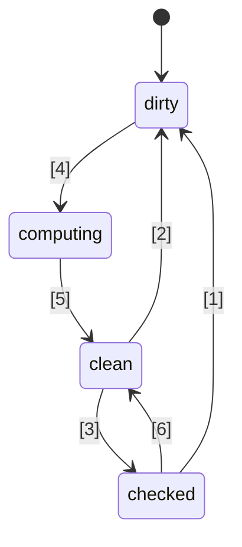
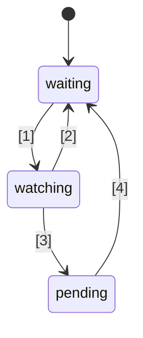

# 🚦 JavaScript Signals standart teklifi 🚦


Aşama 1 ([açıklama](https://tc39.es/process-document/))

TC39 teklif şampiyonları: Daniel Ehrenberg, Yehuda Katz, Jatin Ramanathan, Shay Lewis, Kristen Hewell Garrett, Dominic Gannaway, Preston Sego, Milo M, Rob Eisenberg

Orijinal yazarlar: Rob Eisenberg ve Daniel Ehrenberg

Bu belge, JavaScript'te sinyaller için Promises/A+ çabasına benzer şekilde, ES2015'te TC39 tarafından standartlaştırılan Promises'tan önceki erken ortak bir yönü açıklamaktadır. [Bir polyfill](https://github.com/proposal-signals/signal-polyfill) kullanarak kendiniz deneyin.

Promises/A+'ya benzer şekilde, bu çaba JavaScript ekosistemini hizalamaya odaklanıyor. Bu hizalama başarılı olursa, o deneyime dayalı olarak bir standart ortaya çıkabilir. Birkaç framework yazarı burada reaktivite çekirdeklerini destekleyebilecek ortak bir model üzerinde iş birliği yapıyor. Mevcut taslak, [Angular](https://angular.io/), [Bubble](https://bubble.io/), [Ember](https://emberjs.com/), [FAST](https://www.fast.design/), [MobX](https://mobx.js.org/), [Preact](https://preactjs.com/), [Qwik](https://qwik.dev/), [RxJS](https://rxjs.dev/), [Solid](https://www.solidjs.com/), [Starbeam](https://www.starbeamjs.com/), [Svelte](https://svelte.dev/), [Vue](https://vuejs.org/), [Wiz](https://blog.angular.io/angular-and-wiz-are-better-together-91e633d8cd5a) ve daha fazlasının yazarlarının/koruyucularının tasarım girdilerine dayanmaktadır…

Promises/A+'dan farklı olarak, ortak bir geliştiriciye yönelik yüzey API'si çözmeye çalışmıyoruz, bunun yerine temel sinyal grafiğinin kesin çekirdek semantiğini hedefliyoruz. Bu teklif, tamamen somut bir API de içermektedir, ancak API çoğu uygulama geliştiricisine yönelik değildir. Bunun yerine, buradaki sinyal API'si, frameworklerin üzerine inşa edebileceği, ortak sinyal grafiği ve otomatik izleme mekanizması yoluyla birlikte çalışabilirlik sağlayan bir yapıdır.

Bu teklifin planı, Aşama 1'in ötesine geçmeden önce önemli erken prototipleme yapmak, birkaç framework'e entegrasyon dahil etmektir. Sinyallerin, birden çok framework'te pratikte kullanıma uygun olmaları ve frameworklerin sağladığı sinyallere göre gerçek faydalar sağlamaları durumunda standartlaştırılmasıyla ilgileniyoruz. Erken prototiplemenin bize bu bilgiyi vereceğini umuyoruz. Daha fazla ayrıntı için aşağıdaki "Durum ve geliştirme planı" bölümüne bakınız.

## Arka Plan: Neden Sinyaller?

Karmaşık bir kullanıcı arayüzü (UI) geliştirmek için, JavaScript uygulama geliştiricilerinin uygulamanın görünüm katmanına durumu verimli bir şekilde depolaması, hesaplaması, geçersiz kılması, senkronize etmesi ve aktarması gerekir. UI'ler genellikle yalnızca basit değerleri yönetmekle kalmaz, aynı zamanda başka değerler veya kendi başına hesaplanan karmaşık bir ağaçtan türetilen durumları da işleyerek hesaplanmış durumların işlenmesini gerektirir. Sinyallerin hedefi, bu tür uygulama durumlarını yönetmek için altyapı sağlamaktır, böylece geliştiriciler bu tekrarlayan ayrıntılar yerine iş mantığına odaklanabilirler.

Sinyal benzeri yapılar, özellikle gereksiz yeniden derlemeleri önlemek için, UI dışı bağlamlarda da bağımsız olarak faydalı bulunmuştur.

Sinyaller, uygulamalarda güncellemeyi yönetme ihtiyacını ortadan kaldırmak için reaktif programlamada kullanılır.

> Durum değişikliklerine dayalı olarak güncelleme için deklaratif bir programlama modeli.

_[Reactivity Nedir?](https://www.pzuraq.com/blog/what-is-reactivity)_'den.

#### Örnek - VanillaJS Sayaç

Bir `counter` değişkeniniz olduğunu ve sayacın çift mi tek mi olduğunu DOM'da göstermek istediğinizi düşünelim. `counter` her değiştiğinde, DOM'u en son tek/çiftlik ile güncellemek istiyorsunuz. Vanilla JS'de şöyle bir şeyiniz olabilir:

```js
let counter = 0;
const setCounter = (value) => {
  counter = value;
  render();
};

const isEven = () => (counter & 1) == 0;
const parity = () => isEven() ? "even" : "odd";
const render = () => element.innerText = parity();

// Simulate external updates to counter...
setInterval(() => setCounter(counter + 1), 1000);
```
> [!NOTE]  
> Global değişkenler yalnızca gösterim amacıyla kullanılmıştır. Uygun durum yönetimi için birçok çözüm vardır ve bu teklifteki örneklerin mümkün olduğunca minimal olması amaçlanmıştır. Bu teklif global değişkenleri teşvik etmez.


Bunun birkaç sorunu var...

* `counter` kurulumu gereksiz yere gürültülü ve şablon kodu ağır.
* `counter` durumu, render sistemiyle sıkı bir şekilde bağlı.
* `counter` değiştiğinde ancak `parity` değişmediğinde (örneğin sayaç 2'den 4'e çıktığında), gereksiz yere parity hesaplaması ve render işlemi yapıyoruz.
* Ya UI'nın başka bir kısmı yalnızca `counter` güncellendiğinde render yapmak isterse?
* Ya UI'nın başka bir kısmı yalnızca `isEven` veya `parity`'ye bağlıysa?

Bu nispeten basit senaryoda bile, hızla bir dizi sorun ortaya çıkıyor. Bunların etrafından dolaşmak için `counter` için bir pub/sub (yayınla/abone ol) sistemi ekleyebiliriz. Bu, `counter`'ın ek tüketicilerinin kendi tepkilerini durum değişikliklerine eklemek için abone olmasına izin verir.

Ancak, hâlâ şu sorunlarla karşı karşıyayız:

* Yalnızca `parity`'ye bağlı olan render fonksiyonu, aslında `counter`'a abone olması gerektiğini "bilmek" zorunda.
* Sadece `isEven` veya `parity`'ye dayalı olarak UI'yı güncellemek mümkün değildir, doğrudan `counter` ile etkileşim olmadan.
* Şablon kodumuz arttı. Bir şeyi kullandığınız her seferinde, sadece bir fonksiyon çağırmak veya bir değişken okumak değil, ayrıca abone olmak ve orada güncelleme yapmak gerekiyor. Abonelikten çıkmayı yönetmek de özellikle karmaşık.

Şimdi, sadece `counter`'a değil, aynı zamanda `isEven` ve `parity`'ye de pub/sub ekleyerek birkaç sorunu çözebiliriz. O zaman `isEven`'ı `counter`'a, `parity`'yi `isEven`'a ve `render`'ı `parity`'ye abone etmemiz gerekir. Ne yazık ki, şablon kodumuz yalnızca patlamakla kalmadı, aynı zamanda bir sürü abonelik takibiyle uğraşıyoruz ve her şeyi doğru şekilde temizlemezsek potansiyel bir bellek sızıntısı felaketiyle karşı karşıyayız. Yani, bazı sorunları çözdük ama yepyeni bir sorun kategorisi ve çok fazla kod oluşturduk. Dahası, sistemimizdeki her bir durum parçası için bu sürecin tamamından geçmemiz gerekiyor.

### Sinyallerle Tanışın

Model ve görünüm için veri bağlama soyutlamaları, JavaScript veya web platformunda böyle bir mekanizma olmasa da, birden fazla programlama dili arasında UI frameworklerinin temelini uzun süredir oluşturuyor. JS frameworkleri ve kütüphanelerinde, bu bağlamayı temsil etmenin farklı yolları üzerinde çok sayıda deneme yapıldı ve deneyimler, birinci sınıf bir veri tipinin diğer verilerden türetilen bir durum veya hesaplama hücresini temsil etmesiyle birlikte tek yönlü veri akışının gücünü gösterdi; bu türe artık sıklıkla "Sinyal" deniyor.
Bu birinci sınıf reaktif değer yaklaşımı, açık kaynak JavaScript web frameworklerinde [Knockout](https://knockoutjs.com/) ile [2010 yılında](https://blog.stevensanderson.com/2010/07/05/introducing-knockout-a-ui-library-for-javascript/) popülerliğini ilk kez kazanmış gibi görünüyor. O zamandan bu yana birçok varyasyon ve uygulama oluşturuldu. Son 3-4 yıl içinde, Signal temel tipi ve ilgili yaklaşımlar daha da yaygınlaştı; neredeyse her modern JavaScript kütüphanesi veya frameworkü, bir şekilde buna benzer bir şeye sahip.

Sinyalleri anlamak için, yukarıdaki örneğe, aşağıda daha ayrıntılı olarak açıklanan bir Signal API'si ile yeniden bakalım.

#### Örnek - Sinyallerle Sayaç

```js
const counter = new Signal.State(0);
const isEven = new Signal.Computed(() => (counter.get() & 1) == 0);
const parity = new Signal.Computed(() => isEven.get() ? "even" : "odd");

// Bir kütüphane veya framework, diğer Signal primitiflerine dayalı etkiler tanımlar
declare function effect(cb: () => void): (() => void);

effect(() => element.innerText = parity.get());

// Sayaçta harici güncellemeleri simüle edin...
setInterval(() => counter.set(counter.get() + 1), 1000);
```

Hemen görebileceğimiz birkaç şey var:
* Önceki örneğimizdeki `counter` değişkeninin etrafındaki gürültülü şablon kodunu ortadan kaldırdık.
* Değerleri, hesaplamaları ve yan etkileri yönetmek için birleşik bir API var.
* `counter` ve `render` arasında dairesel referans sorunu veya tersine bağımlılıklar yok.
* Hiçbir manuel abonelik veya takip etme ihtiyacı yok.
* Yan etkilerin zamanlamasını/planlanmasını kontrol etmenin bir yolu var.

Sinyaller, API'nin yüzeyinde görülebilenden çok daha fazlasını sunar:
* **Otomatik Bağımlılık Takibi** - Hesaplanmış bir Signal, ister basit değerler ister başka hesaplamalar olsun, bağımlı olduğu diğer Signal’leri otomatik olarak keşfeder.
* **Tembel Değerlendirme** - Hesaplamalar, tanımlandıklarında hemen değerlendirilmez, ayrıca bağımlılıkları değiştiğinde de anında değerlendirilmez. Yalnızca değerleri açıkça talep edildiğinde değerlendirilirler.
* **Önbellekleme (Memoization)** - Hesaplanmış Signal’ler son değerlerini önbelleğe alır, böylece bağımlılıklarında bir değişiklik yoksa, kaç kez erişilirse erişilsin tekrar değerlendirmeye gerek olmaz.

## Signal’lerin Standardize Edilmesi İçin Motivasyon

#### Birlikte Çalışabilirlik

Her Signal implementasyonu, hesaplanmış bir Signal değerlendirilirken karşılaşılan kaynakların takibini yapmak için kendi otomatik takip mekanizmasına sahiptir. Bu durum, modellerin, bileşenlerin ve kütüphanelerin farklı framework’ler arasında paylaşılmasını zorlaştırır—genellikle görünüm motorlarına yanlış bir şekilde bağlı hale gelirler (Signal’ler genellikle JS framework’lerinin bir parçası olarak uygulandığından).

Bu teklifin bir amacı, reaktif modeli tamamen görünümlerden ayırmak, geliştiricilerin yeni render teknolojilerine geçiş yaparken UI dışı kodlarını yeniden yazmak zorunda kalmadan taşımalarını sağlamak veya farklı ortamlarda kullanılacak paylaşımlı reaktif modeller geliştirmelerine olanak tanımaktır. Ne yazık ki, sürümleme ve çoğaltma nedeniyle, JS seviyesindeki kütüphaneler yoluyla güçlü bir paylaşım düzeyine ulaşmak pratik değildir—yerleşik (built-in) özellikler daha güçlü bir paylaşım garantisi sunar.

#### Performans/Bellek Kullanımı

Yaygın kullanılan kütüphanelerin yerleşik olması nedeniyle daha az kod göndermek küçük bir performans artışı sağlayabilir, ancak Signal implementasyonları genellikle oldukça küçüktür, bu nedenle bu etkinin çok büyük olmasını beklemiyoruz.

Signal ile ilgili veri yapılarının ve algoritmalarının yerel C++ uygulamalarının, JS’de elde edilebilecek olandan sabit bir katsayıyla biraz daha verimli olabileceğini düşünüyoruz. Bununla birlikte, algoritmik olarak bir polyfill’de olacak olanlara göre herhangi bir değişiklik beklenmemektedir; motorlardan burada sihirli bir şey beklenmiyor ve reaktivite algoritmalarının kendisi iyi tanımlanmış ve kesin olacak.

Şampiyon grup, çeşitli Signal implementasyonları geliştirmeyi ve bu performans olanaklarını araştırmak için kullanmayı planlamaktadır.

#### Geliştirici Araçları (DevTools)

Mevcut JS dilindeki Signal kütüphaneleriyle aşağıdaki gibi şeyleri izlemek zor olabilir:
* Hesaplanmış Signal’ler zinciri boyunca çağrı yığını, bir hatanın nedensel zincirini gösterir
* Bir Signal’in diğerine bağımlı olduğu durumlarda Signal’ler arasındaki referans grafiği -- bellek kullanımı hata ayıklama sırasında önemlidir

Yerleşik Signal’ler, JS çalışma zamanlarının ve Geliştirici Araçlarının Signal’leri incelemeye yönelik daha iyi destek sunmasına olanak tanır, özellikle hata ayıklama veya performans analizi için; bu ister tarayıcıda yerleşik olsun ister ortak bir uzantı yoluyla olsun. Mevcut araçlar, örneğin element denetleyici, performans anlık görüntüsü ve bellek profilleri, sunumlarında Signal’leri özellikle vurgulayacak şekilde güncellenebilir.

#### İkincil Faydalara Dair

##### Standart Kütüphanenin Faydaları

Genel olarak, JavaScript oldukça minimal bir standart kütüphaneye sahipti, ancak TC39’da JS’i daha fazla “pilli” (batteries-included) bir dil haline getirme eğilimi var, yani yüksek kaliteli, yerleşik işlevsellik sunma yönünde. Örneğin, Temporal moment.js’in yerini alıyor ve bir dizi küçük özellik, ör. `Array.prototype.flat` ve `Object.groupBy`, birçok lodash kullanım senaryosunun yerini alıyor. Avantajlar arasında daha küçük paket boyutları, artırılmış istikrar ve kalite, yeni bir projeye katılırken öğrenilecek daha az şey ve JS geliştiricileri arasında genel olarak ortak bir sözlük yer alıyor.

##### HTML/DOM Entegrasyonu (ileride bir olasılık)

W3C’deki ve tarayıcı geliştiricilerinin mevcut çalışmaları, HTML’ye yerel şablonlama getirmeye çalışıyor ([DOM Parts][wicg-pr-1023] ve [Template Instantiation][wicg-propsal-template-instantiation]). Ayrıca, W3C Web Components CG, Web Components’i tam deklaratif bir HTML API’si sunacak şekilde genişletme olasılığını araştırıyor. Her iki hedefi de başarmak için, sonunda HTML’nin reaktif bir primitive ihtiyacı olacak. Ayrıca, topluluk tarafından istenen ve Signal’lerin DOM ile entegrasyonu yoluyla hayal edilebilecek birçok ergonomik iyileştirme de mevcut.

[wicg-pr-1023]: https://github.com/WICG/webcomponents/pull/1023
[wicg-propsal-template-instantiation]: https://github.com/WICG/webcomponents/blob/gh-pages/proposals/Template-Instantiation.md

> Not: Bu entegrasyon, bu teklifin bir parçası olmayan, daha sonra yapılacak ayrı bir çalışma olacaktır.

##### Ekosistem Bilgi Alışverişi (*yayınlama nedeni değildir*)

Standardizasyon çabaları, tarayıcılarda bir değişiklik olmasa bile, sadece “topluluk” düzeyinde bile yardımcı olabilir. Signal’ler üzerindeki çalışma, reaktivitenin doğası, algoritmalar ve birlikte çalışabilirlik hakkında derinlemesine bir tartışma için birçok farklı framework yazarını bir araya getiriyor. Bu zaten faydalı oldu ve JS motorlarına ve tarayıcılara eklemeyi gerekçelendirmez; Signal’ler yalnızca ekosistem bilgi alışverişi dışında *önemli* faydalar sağlıyorsa JavaScript standardına eklenmelidir.

## Signal’ler İçin Tasarım Hedefleri

Mevcut Signal kütüphanelerinin temelde birbirinden çok da farklı olmadığı ortaya çıktı. Bu teklif, pek çoğunda bulunan önemli nitelikleri uygulayarak bu başarıdan yararlanmayı amaçlamaktadır.

### Temel Özellikler

* Durumu temsil eden bir Signal türü, yani yazılabilir Signal. Bu, başkalarının okuyabileceği bir değerdir.
* Diğerlerine bağlı, tembel olarak hesaplanan ve önbelleğe alınan bir hesaplanmış/memo/ türetilmiş Signal türü.
    * Hesaplama tembeldir, yani hesaplanmış Signal’ler varsayılan olarak bağımlılıklarından biri değiştiğinde tekrar hesaplanmaz, yalnızca biri onları gerçekten okursa çalışır.
    * Hesaplama “[glitch](https://en.wikipedia.org/wiki/Reactive_programming#Glitches)-free”dir, yani asla gereksiz hesaplama yapılmaz. Bu, bir uygulama bir hesaplanmış Signal’i okuduğunda, çalıştırılacak potansiyel olarak bozuk (dirty) grafik parçalarının topolojik olarak sıralandığı anlamına gelir; böylece herhangi bir tekrar ortadan kaldırılır.
    * Hesaplama önbelleklidir, yani son bağımlılık değişikliğinden sonra başka bir bağımlılık değişmemişse, hesaplanmış Signal erişildiğinde *yeniden* hesaplanmaz.
    * Hesaplanmış Signal’ler ve durum Signal’leri için özel karşılaştırmalar mümkündür; böylece onlara bağımlı olan diğer hesaplanmış Signal’lerin ne zaman güncellenmesi gerektiği belirlenebilir.
* Bir hesaplanmış Signal’in bağımlılıklarından birinin (veya iç içe geçmiş bağımlılıklarından birinin) “bozuk” (dirty) hale gelmesi ve değişmesi durumuna tepkiler; yani Signal’in değeri güncel olmayabilir.
    * Bu tepki, daha sonra yapılacak önemli bir işin planlanmasını amaçlar.
    * Efektler bu tepkiler ve framework düzeyinde zamanlayıcılar ile uygulanır.
    * Hesaplanmış Signal’lerin, bu tepkilerden birinin (iç içe) bağımlılığı olarak kaydedilip kaydedilmediğine tepki verebilme yeteneği olması gerekir.
* JS framework’lerinin kendi zamanlayıcılarını yapabilmesini sağlamak. Zorunlu Promise-tarzı yerleşik bir zamanlama yok.
    * Senkron tepkiler, framework mantığına göre daha sonraki işleri zamanlamak için gereklidir.
    * Yazmalar senkron ve hemen etkilidir (yazmaları topluca işlemek isteyen bir framework, bunu kendi üzerinde inşa edebilir).
    * Bir efektin “bozuk” olup olmadığını kontrol etmek ile gerçekten çalıştırmak ayrılabilir (bu da iki aşamalı bir efekt zamanlayıcı sağlar).
* Bağımlılıkların kaydedilmesini tetiklemeden Signal’leri okuyabilme (`untrack`)
* Signal’leri/reactivity kullanan farklı kod tabanlarının bileşimini mümkün kılmak, örn.,
    * Takip/reaktivite açısından birden fazla framework’ü birlikte kullanmak (aşağıdaki eksiklikler hariç)
    * Framework’ten bağımsız reaktif veri yapıları (örn., özyinelemeli reaktif store proxy’si, reaktif Map ve Set ve Array, vb.)

### Tutarlılık

* Senkron tepkilerin naif şekilde yanlış kullanımını caydırmak/yasaklamak.
    * Tutarlılık riski: yanlış kullanılırsa “[glitch](https://en.wikipedia.org/wiki/Reactive_programming#Glitches)” ortaya çıkabilir: Eğer Signal ayarlandığında render işlemi hemen yapılırsa, uygulamanın tamamlanmamış durumu kullanıcıya gösterilebilir. Bu nedenle, bu özellik yalnızca daha sonra yapılacak işleri akıllıca planlamak için kullanılmalıdır.
    * Çözüm: Senkron tepki geri çağrısı (callback) içinden herhangi bir Signal’i okumak ve yazmak yasaklanır
* `untrack` kullanımını caydırmak ve güvenli olmayan doğasını belirtmek
    * Tutarlılık riski: değeri diğer Signal’lere bağlı olan ama bu Signal’ler değiştiğinde güncellenmeyen hesaplanmış Signal’ler oluşturulmasına izin verir. Untracked erişimlerin, hesaplamanın sonucunu değiştirmeyeceği durumlarda kullanılmalıdır.
    * Çözüm: API adında “unsafe” (güvensiz) olarak işaretlenir.
* Not: Bu teklif, sinyallerin hesaplanmış ve efekt sinyallerinden hem okunmasına hem de yazılmasına izin verir, okumalardan sonra yapılan yazmalara herhangi bir kısıtlama getirmez, tutarlılık riskine rağmen. Bu karar, framework entegrasyonunda esneklik ve uyumluluğu korumak için alınmıştır.

### Yüzeysel API

* Birden fazla framework’ün Signal/reaktivite mekanizmalarını uygulayabilmesi için sağlam bir temel olmalı.
    * Özyinelemeli store proxy’leri, dekoratör tabanlı sınıf alanı reaktivitesi ve hem `.value` hem de `[state, setState]`-stili API’ler için iyi bir temel olmalı.
    * Anlamlar, farklı framework’ler tarafından mümkün kılınan geçerli desenleri ifade edebilmelidir. Örneğin, bu Signal’lerin ya anında yansıtılan yazmaların ya da topluca daha sonra uygulanan yazmaların temeli olması mümkün olmalı.
* Bu API’nin doğrudan JavaScript geliştiricileri tarafından kullanılabilir olması güzel olurdu.
    * Bir özellik ekosistem kavramıyla örtüşüyorsa, ortak bir terim kullanmak iyidir.
        * Ancak, tam olarak aynı isimlerin gölgelenmemesi önemlidir!
    * “JS geliştiricileri tarafından kullanılabilirlik” ile “framework’lere tüm kancaları sağlamak” arasında bir gerilim var
        * Fikir: Tüm kancaları sağla, ancak yanlış kullanıldığında hata ver.
        * Fikir: İnce API’leri [`crypto.subtle`](https://developer.mozilla.org/en-US/docs/Web/API/Crypto/subtle) gibi bir `subtle` ad alanına koy, böylece framework veya dev araçları geliştirmek gibi daha ileri düzey kullanımlar için gerekli API’ler ile gündelik uygulama geliştirmede framework ile Signal örneklemek gibi kullanımlar arasındaki çizgi belirlenmiş olur.
* İyi performansla uygulanabilir ve kullanılabilir olmalı -- yüzeysel API çok fazla ek yük getirmemeli
    * Alt sınıflamaya olanak tanımalı, böylece framework’ler kendi metotlarını ve alanlarını, özel alanlar dahil ekleyebilsin. Bu, framework düzeyinde ek tahsis ihtiyacını önlemek için önemlidir. Aşağıda “Bellek yönetimi” bölümüne bakınız.

### Bellek yönetimi

* Mümkünse: Eğer gelecekte okunmak üzere hiçbir canlı referans yoksa, bir hesaplanmış Signal, daha geniş bir grafiğe bağlı kalsa bile (örn., canlı kalan bir durumu okuduğu için), çöp toplayıcı tarafından kaldırılabilmelidir.
* Bugün çoğu framework'ün, başka bir Signal grafiğine referans veren veya ondan referans alan hesaplanmış Signal’ların açıkça yok edilmesini gerektirdiğini unutmayın; bu grafik hala yaşıyorsa.
* Bu durum, yaşam ömürleri bir UI bileşeninin yaşam ömrüne bağlı olduğunda o kadar da kötü olmaz, ayrıca efektlerin de zaten yok edilmesi gerekir.
* Eğer bu anlamlarla çalıştırmak çok maliyetliyse, aşağıdaki API'ye hesaplanmış Signal’ların açıkça yok edilmesi (veya "bağlantısının kesilmesi") eklenmelidir; şu anda bu API'de bu eksik.
* İlgili ayrı bir hedef: Ayırma (allocation) sayısını en aza indirmek, örneğin,
    * yazılabilir bir Signal oluşturmak için (iki ayrı closure + dizi kullanımını önlemek)
    * efektleri uygulamak için (her tepki için bir closure oluşturulmasını önlemek)
    * Signal değişikliklerini gözlemleme API'sinde, ek geçici veri yapıları oluşturmaktan kaçınmak
    * Çözüm: Alt sınıflarda tanımlanan metot ve alanların yeniden kullanılmasını sağlayan sınıf tabanlı API

## API taslağı

Aşağıda bir Signal API’sinin ilk fikri yer almakta. Bunun sadece erken bir taslak olduğunu ve zamanla değişiklikler beklediğimizi unutmayın. Genel yapıyı kavramak için tam `.d.ts` ile başlayalım, ardından tüm bunların ne anlama geldiğini tartışacağız.

```ts
interface Signal<T> {
    // Signal’ın değerini al
    get(): T;
}

namespace Signal {
    // Okunabilir-yazılabilir bir Signal
    class State<T> implements Signal<T> {
        // t değeriyle başlayan bir state Signal’ı oluştur
        constructor(t: T, options?: SignalOptions<T>);

        // Signal’ın değerini al
        get(): T;

        // State Signal değerini t olarak ayarla
        set(t: T): void;
    }

    // Diğer Signal’lara dayalı bir formül olan bir Signal
    class Computed<T = unknown> implements Signal<T> {
        // Callback tarafından döndürülen değere sahip bir Signal oluşturur.
        // Callback, this signal’ı this değeri olarak alır.
        constructor(cb: (this: Computed<T>) => T, options?: SignalOptions<T>);

        // Signal’ın değerini al
        get(): T;
    }

    // Bu namespace, uygulama geliştiricilerinden çok framework yazarları için uygun olan
    // “ileri düzey” özellikleri içerir.
    // `crypto.subtle` ile benzer
    namespace subtle {
        // Tüm izleme devre dışı bırakılarak bir callback çalıştır
        function untrack<T>(cb: () => T): T;

        // Herhangi bir signal okumasını izleyen mevcut hesaplanmış signal’ı al, varsa
        function currentComputed(): Computed | null;

        // Bu signal’ın en son değerlendirildiği sırada referans verdiği
        // tüm signal’ların sıralı listesini döndürür.
        // Bir Watcher için, izlediği signal kümesini listeler.
        function introspectSources(s: Computed | Watcher): (State | Computed)[];

        // Bu signal’ın dahil olduğu Watcher’ları ve
        // en son değerlendirildiğinde bu signal’ı okuyan Computed signal’ları döndürür,
        // eğer o hesaplanmış signal (yinelemeli olarak) izleniyorsa.
        function introspectSinks(s: State | Computed): (Computed | Watcher)[];

        // Bu signal "canlı" ise true döndürür, yani bir Watcher tarafından izleniyor
        // veya (yinelemeli olarak) canlı bir Computed signal tarafından okunuyor.
        function hasSinks(s: State | Computed): boolean;

        // Bu öğe "reaktif" ise true döndürür, yani başka bir signal’a bağımlı.
        // hasSources false ise bir Computed her zaman aynı sabiti döndürür.
        function hasSources(s: Computed | Watcher): boolean;

        class Watcher {
            // Watcher’ın (yinelemeli olarak) kaynağı yazıldığında, bu callback’i çağır,
            // eğer son `watch` çağrısından beri zaten çağrılmadıysa.
            // Bildirim sırasında hiçbir signal okunamaz veya yazılamaz.
            constructor(notify: (this: Watcher) => void);

            // Bu signal’ları Watcher’ın kümesine ekle ve izleyiciyi,
            // kümedeki herhangi bir signal (veya bağımlılıklarından biri) değiştiğinde
            // bir sonraki sefer notify callback’ini çalıştıracak şekilde ayarla.
            // Sadece "bildirildi" durumunu sıfırlamak için argümansız da çağrılabilir,
            // böylece notify callback’i tekrar çağrılacaktır.
            watch(...s: Signal[]): void;

            // Bu signal’ları izlenen kümeden çıkar (ör. yok edilen bir efekt için)
            unwatch(...s: Signal[]): void;

            // Watcher’ın kümesindeki hala kirli olan kaynakların kümesini döndürür,
            // veya kaynağı kirli ya da beklemede olan ve henüz yeniden değerlendirilmemiş bir computed signal’ı döndürür
            getPending(): Signal[];
        }

        // İzlenmeye başlandığında veya artık izlenmediğinde gözlemlemek için hook’lar
        var watched: Symbol;
        var unwatched: Symbol;
    }

    interface SignalOptions<T> {
        // Eski ve yeni değer arasında özel karşılaştırma fonksiyonu. Varsayılan: Object.is.
        // Bağlam için signal this olarak iletilir.
        equals?: (this: Signal<T>, t: T, t2: T) => boolean;
```
```ts
// isWatched true olduğunda, eğer önceden false ise çağrılan geri çağırma fonksiyonu
[Signal.subtle.watched]?: (this: Signal<T>) => void;

// isWatched false olduğunda, eğer önceden true ise çağrılan geri çağırma fonksiyonu
[Signal.subtle.unwatched]?: (this: Signal<T>) => void;
}
}
```

### Sinyaller Nasıl Çalışır

Bir Signal (Sinyal), zaman içinde değişebilen bir veri hücresini temsil eder. Sinyaller ya "durum" (manuel olarak ayarlanan bir değer) ya da "hesaplanmış" (diğer Sinyallere dayalı bir formül) olabilir.

Hesaplanmış Sinyaller, değerlendirmeleri sırasında hangi diğer Sinyallerin okunduğunu otomatik olarak takip ederek çalışır. Bir hesaplanmış Sinyal okunduğunda, daha önce kaydedilmiş bağımlılıklarından herhangi birinin değişip değişmediğini kontrol eder ve eğer değişmişse kendini yeniden değerlendirir. Birden fazla hesaplanmış Sinyal iç içe olduğunda, tüm izleme işleminin atfedilmesi en içteki Sinyale gider.

Hesaplanmış Sinyaller tembel, yani çekme tabanlıdır: Yalnızca erişildiklerinde yeniden değerlendirilirler, bir bağımlılıkları daha önce değişmiş olsa bile.

Hesaplanmış Sinyallere geçirilen geri çağırma fonksiyonu genellikle, eriştiği diğer Sinyallerin deterministik, yan etkisiz bir fonksiyonu anlamında "saf" olmalıdır. Aynı zamanda, geri çağırma fonksiyonunun ne zaman çağrılacağı deterministiktir ve bu da yan etkilerin dikkatlice kullanılmasına olanak tanır.

Sinyaller belirgin bir önbellekleme/memoizasyon özelliğine sahiptir: Hem durum hem de hesaplanmış Sinyaller mevcut değerlerini hatırlar ve yalnızca gerçekten değiştiklerinde kendilerine referans veren hesaplanmış Sinyallerin yeniden hesaplanmasını tetikler. Eski ve yeni değerlerin tekrar tekrar karşılaştırılmasına bile gerek yoktur—karşılaştırma, kaynak Sinyal sıfırlandığında/yeniden değerlendirildiğinde bir kez yapılır ve Sinyal mekanizması, o Sinyali referans alan hangi şeylerin yeni değere göre henüz güncellenmediğini takip eder. Dahili olarak, bu genellikle (Milo'nun blog yazısında) açıklandığı gibi "grafik renklendirme" ile temsil edilir.

Hesaplanmış Sinyaller, bağımlılıklarını dinamik olarak takip eder—her çalıştırıldıklarında, farklı şeylere bağımlı hale gelebilirler ve bu kesin bağımlılık kümesi Sinyal grafiğinde güncel tutulur. Bu, yalnızca bir dalda ihtiyaç duyulan bir bağımlılığınız varsa ve önceki hesaplama diğer dalı aldıysa, geçici olarak kullanılmayan bu değerdeki bir değişikliğin, çekildiğinde bile hesaplanmış Sinyalin yeniden hesaplanmasına neden olmayacağı anlamına gelir.

JavaScript Promiselerinin aksine, Sinyallerdeki her şey senkron olarak çalışır:
- Bir Sinyali yeni bir değere ayarlamak senkroniktir ve bu, sonrasında ona bağımlı olan herhangi bir hesaplanmış Sinyal okunduğunda hemen yansır. Bu mutasyonun yerleşik bir toplu işleme (batching) özelliği yoktur.
- Hesaplanmış Sinyalleri okumak senkroniktir—değerleri her zaman kullanılabilir durumdadır.
- Aşağıda açıklanan Watcher'lardaki `notify` geri çağırma fonksiyonu, onu tetikleyen `.set()` çağrısı sırasında senkron olarak çalışır (ancak grafik renklendirme tamamlandıktan sonra).

Promiseler gibi, Sinyaller bir hata durumunu temsil edebilir: Bir hesaplanmış Sinyalin geri çağırma fonksiyonu hata fırlatırsa, bu hata başka bir değer gibi önbelleğe alınır ve Sinyal her okunduğunda tekrar fırlatılır.

### Signal Sınıfını Anlamak

Bir `Signal` örneği, güncellemeleri zaman içinde takip edilen dinamik olarak değişen bir değeri okuma yeteneğini temsil eder. Ayrıca, başka bir hesaplanmış Sinyal tarafından izlenen bir erişim yoluyla dolaylı olarak Sinyale abone olma yeteneğini de içerir.

Buradaki API, Signal kütüphanelerinin büyük bir kısmında "signal", "computed" ve "state" gibi isimlerin kullanımı konusunda ortaya çıkan kabaca ekosistem uzlaşısına uyacak şekilde tasarlanmıştır. Ancak, Hesaplanmış ve Durum Sinyallerine erişim `.get()` yöntemiyle sağlanır; bu, popüler Signal API'lerinin tümüyle çelişir, çünkü onlar ya `.value` tarzı bir erişici ya da `signal()` çağrı sözdizimi kullanır.

API, tahsisat (allocation) sayısını azaltacak şekilde tasarlanmıştır, böylece Sinyaller, JavaScript framework'lerine gömülmeye uygun olur ve mevcut framework-özelleştirilmiş Sinyallerden aynı veya daha iyi performansa ulaşır. Bu şunları gerektirir:
- Durum Sinyalleri, aynı referanstan hem erişilebilen hem de ayarlanabilen tek bir yazılabilir nesnedir. (Aşağıdaki "Yetenek ayrımı" bölümünde sonuçlarına bakınız.)
- Hem Durum hem de Hesaplanmış Sinyaller, framework'lerin hem public hem de private sınıf alanlarıyla (ve o durumu kullanmak için yöntemlerle) ek özellikler eklemesini kolaylaştırmak için alt sınıf (subclass) oluşturulabilir şekilde tasarlanmıştır.
- Çeşitli geri çağırma fonksiyonları (ör. `equals`, hesaplanmış geri çağırma), bağlam için ilgili Sinyal'i `this` değeri olarak alır, böylece her Sinyal için yeni bir closure oluşturmak gerekmez. Bunun yerine, bağlam sinyalin kendisinde ek özelliklerde saklanabilir.

Bu API tarafından zorunlu kılınan bazı hata durumları:
- Bir hesaplanmış Sinyali özyinelemeli (recursive) olarak okumak hatadır.
- Bir Watcher'ın `notify` geri çağırma fonksiyonu hiçbir sinyali okuyamaz veya yazamaz.
- Bir hesaplanmış Sinyalin geri çağırma fonksiyonu hata fırlatırsa, Sinyalin sonraki erişimlerinde bu önbelleğe alınmış hata tekrar fırlatılır; ta ki bağımlılıklardan biri değişip yeniden hesaplanana kadar.

Zorunlu *olmayan* bazı koşullar:
- Hesaplanmış Sinyaller, geri çağırma fonksiyonları içinde senkron olarak diğer Sinyallere yazabilir.
- Bir Watcher'ın `notify` geri çağırma fonksiyonu tarafından kuyruğa alınan işler sinyalleri okuyabilir veya yazabilir, bu da Sinyaller bağlamında [klasik React antipatternlerinin](https://react.dev/learn/you-might-not-need-an-effect) çoğaltılmasını mümkün kılar!

### Etkilerin (Effect) Uygulanması

Yukarıda tanımlanan `Watcher` arayüzü, tipik JS efekt API'lerinin uygulanması için temel sağlar: Diğer Sinyaller değiştiğinde yalnızca yan etkileri için tekrar çalışan geri çağırma fonksiyonları. Başlangıç örneğinde kullanılan `effect` fonksiyonu aşağıdaki gibi tanımlanabilir:

```ts
// Bu fonksiyon genellikle bir kütüphane/framework'te yer alır, uygulama kodunda değil
// NOT: Bu zamanlama mantığı faydalı olacak kadar gelişmiş değildir. Kopyalayıp yapıştırmayın.
let pending = false;

let w = new Signal.subtle.Watcher(() => {
    if (!pending) {
        pending = true;
        queueMicrotask(() => {
            pending = false;
            for (let s of w.getPending()) s.get();
            w.watch();
        });
    }
});

// Bir efekt Signal'i—cb'ye değerlendirilir, bağımlılıklarından biri değiştiğinde
// kendisini mikro görev kuyruğunda tekrar okuma işlemini zamanlar
export function effect(cb) {
    let destructor;
    let c = new Signal.Computed(() => { destructor?.(); destructor = cb(); });
    w.watch(c);
    c.get();
    return () => { destructor?.(); w.unwatch(c) };
}
```

Signal API'si, yerleşik olarak `effect` gibi bir fonksiyon içermez. Bunun nedeni, efekt zamanlamasının hassas olması ve genellikle framework'lerin render döngüleri ve JS'nin erişimi olmayan yüksek seviyeli framework'e özgü durum veya stratejilerle bağlantılı olmasıdır.

Burada kullanılan farklı işlemleri inceleyelim: `Watcher` yapıcısına geçirilen `notify` geri çağırma fonksiyonu, Sinyal "temiz" bir durumdan (önbelleğin başlatıldığının ve geçerli olduğunun bilindiği yer) "kontrol edilmiş" veya "kirli" bir duruma geçtiğinde (bu Sinyalin özyinelemeli olarak bağlı olduğu en az bir durum değiştiği için önbelleğin geçerli olup olmadığının bilinmediği yer) çağrılan fonksiyondur.

`notify` çağrıları nihayetinde bir durum Sinyali üzerinde `.set()` çağrısı ile tetiklenir. Bu çağrı senkroniktir: `.set` döndürülmeden önce gerçekleşir. Ancak bu geri çağırmanın Signal grafiğini yarım işlenmiş bir durumda gözlemlemesinden endişe etmeye gerek yoktur, çünkü bir `notify` geri çağırma sırasında, hatta bir `untrack` çağrısında bile hiçbir Sinyal okunamaz veya yazılamaz. Çünkü `notify`, `.set()` sırasında çağrıldığından, başka bir mantık akışını kesintiye uğratır ve bu akış tamamlanmamış olabilir. `notify`'dan Sinyalleri okumak veya yazmak için işi daha sonra çalışacak şekilde zamanlayın; örneğin, Sinyali daha sonra erişilecek bir listeye yazarak veya yukarıdaki gibi `queueMicrotask` ile.

Sinyalleri etkili bir şekilde kullanmak için `Signal.subtle.Watcher` kullanmak şart değildir; Glimmer'ın yaptığı gibi hesaplanmış Sinyallerin yoklanmasını zamanlamak mümkündür. Ancak, birçok framework bu zamanlama mantığını senkron olarak çalıştırmanın çoğu zaman faydalı olduğunu bulmuştur, bu nedenle Sinyal API'si bunu içerir.

Hem hesaplanmış hem de durum Sinyalleri, diğer JS değerleri gibi çöp toplayıcı (garbage collector) tarafından toplanır. Ancak Watcher'ların özel bir şekilde nesneleri canlı tutma yöntemi vardır: Bir Watcher tarafından izlenen herhangi bir Sinyal, temel durumların herhangi biri erişilebilir olduğu sürece canlı tutulur, çünkü bunlar gelecekte bir `notify` çağrısını (ve ardından bir `.get()`) tetikleyebilir. Bu nedenle, efektleri temizlemek için `Watcher.prototype.unwatch` çağırmayı unutmayın.

### Güvensiz Bir Kaçış Kapısı

`Signal.subtle.untrack`, Sinyalleri *takip etmeden* okumaya izin veren bir kaçış kapısıdır. Bu yetenek güvensizdir çünkü diğer Sinyallere bağlı olan, ancak bu Sinyaller değiştiğinde güncellenmeyen hesaplanmış Sinyallerin oluşturulmasına olanak tanır. Takipsiz erişimlerin hesaplamanın sonucunu değiştirmeyeceği durumlarda kullanılmalıdır.

<!--
TODO: untrack kullanımının iyi bir fikir olduğu bir örnek göster

### watched/unwatched Kullanımı
TODO: Bir Observable'ın, yalnızca bir etki tarafından kullanıldığında abone olunan, hesaplanan bir signale dönüştürülmesi örneğini gösterin

TODO: Bir duruma yönlendirilen bir fetch'in sonucunu temsil eden ve iptal edilen bir hesaplanan signal örneğini gösterin

### SSR için İçgörü

TODO: Signal grafiğinin serileştirilmesinin nasıl çalıştığını gösterin

TODO: Birkaç signal kullanarak bir signal'in daha sonra duruma ya da hesaplanana "hidrate" edilebileceğini gösterin.
-->

### Şimdilik Atlananlar

Bu özellikler daha sonra eklenebilir, ancak mevcut taslakta yer almamaktadır. Atlanmalarının nedeni, tasarım alanında frameworkler arasında yerleşik bir uzlaşmanın olmaması ve ayrıca bu belgede açıklanan Signal kavramının üzerine inşa edilen mekanizmalarla yokluklarının etrafından dolaşılabilmesidir. Ancak ne yazık ki, bu eksiklik frameworkler arası birlikte çalışabilirliğin potansiyelini sınırlar. Bu belgede tanımlanan Signal prototipleri üretildikçe, bu atlamaların uygun bir karar olup olmadığını yeniden değerlendirme çabası olacaktır.

* **Async**: Bu modelde, signal'lar her zaman eşzamanlı olarak değerlendirmeye hazırdır. Ancak, bir signal'in ayarlanmasına yol açan belirli eşzamansız süreçlere sahip olmak ve bir signal'in hâlâ "yükleniyor" olup olmadığını anlamak genellikle faydalıdır. Yüklenme durumunu modellemenin basit bir yolu istisnalarla çalışmaktır ve hesaplanan signal'lerin istisna önbellekleme davranışı bu teknikle bir ölçüde makul şekilde birleşir. Geliştirilmiş teknikler [Issue #30](https://github.com/proposal-signals/proposal-signals/issues/30) adresinde tartışılmıştır.
* **Transactions**: Görünümler arasında geçişler için, hem "from" hem de "to" durumlarının canlı durumunu korumak çoğu zaman faydalıdır. "To" durumu arka planda işlenir, takas edilene (işlemi tamamlayana) kadar, bu sırada "from" durumu etkileşimli olarak kalır. Her iki durumu aynı anda korumak, signal grafiğinin durumunun "forklanmasını" gerektirir ve aynı anda birden fazla beklemede geçişi desteklemek de faydalı olabilir. Tartışma [Issue #73](https://github.com/proposal-signals/proposal-signals/issues/73) adresindedir.

Bazı olası [kolaylık yöntemleri](https://github.com/proposal-signals/proposal-signals/issues/32) de atlanmıştır.

## Durum ve Geliştirme Planı

Bu teklif, Nisan 2024 TC39 gündeminde Aşama 1 için yer almaktadır. Şu anda "Aşama 0" olarak düşünülebilir.

[Bir polyfill](https://github.com/proposal-signals/signal-polyfill) bu teklif için mevcuttur ve bazı temel testlerle birlikte gelir. Bazı framework yazarları bu signal uygulamasını ikame etmek üzerinde denemelere başlamıştır, ancak bu kullanım erken bir aşamadadır.

Signal teklifi üzerinde çalışan işbirlikçiler, bu teklifi nasıl ilerleteceğimiz konusunda özellikle **temkinli** olmak istiyorlar, böylece sonunda pişman olacağımız ve aslında kullanmayacağımız bir şeyin yayımlanması tuzağına düşmeyelim. Planımız, bu teklifin yolunda olduğundan emin olmak için TC39 süreci tarafından gerekmeyen aşağıdaki ekstra görevleri yapmak:

Aşama 2 için teklif vermeden önce şunları yapmayı planlıyoruz:
- Sağlam, iyi test edilmiş (örneğin, çeşitli frameworklerden alınan testleri ve test262 tarzı testleri geçen), performans açısından rekabetçi (kapsamlı bir signal/framework kıyaslama seti ile doğrulanmış) birden fazla üretim kalitesinde polyfill uygulamaları geliştirmek.
- Önerilen Signal API'sini, bize bir ölçüde temsil edici görünen çok sayıda JS framework'e entegre etmek ve bazı büyük uygulamaların bu temelle çalışmasını sağlamak. Bu bağlamlarda verimli ve doğru şekilde çalıştığını test etmek.
- API'ye yapılabilecek olası genişletmelerin alanında sağlam bir anlayışa sahip olmak ve bunlardan hangilerinin (varsa) bu teklife eklenmesi gerektiğine karar vermiş olmak.

## Signal algoritmaları

Bu bölüm, JavaScript'e açığa çıkan her bir API'yi, uyguladıkları algoritmalar açısından açıklar. Bu, bir proto-şartname olarak düşünülebilir ve olası bir anlamlar kümesini belirlemek için bu erken aşamada dahil edilmiştir, ancak değişikliklere çok açıktır.

Algoritmanın bazı yönleri:
- Bir hesaplananda Signal'ların okunma sırası önemlidir ve bazı geri çağırımların (örneğin `Watcher`'ın tetiklenme sırası, `equals`, `new Signal.Computed`'a ilk parametre ve `watched`/`unwatched` geri çağırımları) yürütülme sırası ile gözlemlenebilir. Bu, bir hesaplanan Signal'ın kaynaklarının sıralı depolanması gerektiği anlamına gelir.
- Bu dört geri çağırımın hepsi istisna fırlatabilir ve bu istisnalar öngörülebilir şekilde çağıran JS koduna iletilir. İstisnalar, bu algoritmanın yürütülmesini durdurmaz veya grafiği yarı işlenmiş bir durumda bırakmaz. Bir Watcher'ın `notify` geri çağırımında fırlatılan hatalar için, bu istisna, onu tetikleyen `.set()` çağrısına iletilir, eğer birden fazla istisna fırlatıldıysa bunlar AggregateError ile paketlenir. Diğerleri (dahil `watched`/`unwatched`?) Signal'in değerinde saklanır, okunurken tekrar fırlatılır ve böyle tekrar fırlatan bir Signal, normal bir değeri olanlar gibi `~clean~` olarak işaretlenebilir.
- "Watched" olmayan (herhangi bir Watcher tarafından gözlemlenmeyen) hesaplanan signal'lerde döngüselliği önlemek için özen gösterilir, böylece bunlar signal grafiğinin diğer bölümlerinden bağımsız olarak garbage collection ile toplanabilir. Dahili olarak, bu her zaman toplanan nesil numaraları sistemiyle uygulanabilir; optimize edilmiş uygulamalarda yerel düğüm başına nesil numaraları da bulunabilir veya izlenen signal'larda bazı numaraların izlenmesinden kaçınılabilir.

### Gizli Global Durum

Signal algoritmalarının bazı global durumlara başvurması gerekir. Bu durum, tüm thread ya da "ajan" için globaldir.

- `computing`: Şu anda bir `.get` veya `.run` çağrısı nedeniyle yeniden değerlendirilen en içteki hesaplanan ya da etki signal'ı, ya da `null`. Başlangıçta `null`.
- `frozen`: Grafiğin değiştirilmemesini gerektiren bir geri çağırım şu anda yürütülüyorsa boolean. Başlangıçta `false`.
- `generation`: Döngüsellikten kaçınırken bir değerin ne kadar güncel olduğunu izlemek için kullanılan, 0'dan başlayan artan bir tam sayı.

### `Signal` Ad Alanı

`Signal`, Signal ile ilgili sınıf ve fonksiyonlar için ad alanı olarak görev yapan sıradan bir nesnedir.

`Signal.subtle` ise benzer bir iç ad alanı nesnesidir.

### `Signal.State` Sınıfı

#### `Signal.State` dahili slotları

- `value`: Durum signal'ının mevcut değeri
- `equals`: Değer değiştirildiğinde kullanılan karşılaştırma fonksiyonu
- `watched`: Signal bir etki tarafından gözlemlendiğinde çağrılacak geri çağırım
- `unwatched`: Signal artık bir etki tarafından gözlemlenmediğinde çağrılacak geri çağırım
- `sinks`: Buna bağlı olan izlenen signal'lar kümesi

#### Kurucu: `Signal.State(initialValue, options)`

1. Bu Signal'ın `value` değerini `initialValue` olarak ayarla.
1. Bu Signal'ın `equals` değerini options?.equals olarak ayarla
1. Bu Signal'ın `watched` değerini options?.[Signal.subtle.watched] olarak ayarla
1. Bu Signal'ın `unwatched` değerini options?.[Signal.subtle.unwatched] olarak ayarla
1. Bu Signal'ın `sinks` değerini boş küme olarak ayarla

#### Metot: `Signal.State.prototype.get()`

1. Eğer `frozen` true ise, bir istisna fırlat.
1. Eğer `computing` tanımsız değilse, bu Signal'ı `computing`'in `sources` kümesine ekle.
1. NOT: Bu Signal'ın `sinks` kümesine, bir Watcher tarafından izlenene kadar `computing` eklemiyoruz.
1. Bu Signal'ın `value` değerini döndür.

#### Metot: `Signal.State.prototype.set(newValue)`

1. Mevcut yürütme bağlamı `frozen` ise, bir istisna fırlat.
1. Bu Signal ve değer için "Signal değeri ayarla" algoritmasını çalıştır.
1. Bu algoritma `~clean~` döndürdüyse, undefined döndür.
1. Bu Signal'ın tüm `sinks`'lerinin durumunu (eğer bir Hesaplanan Signal ise) önceden temizse `~dirty~`, (eğer bir Watcher ise) önceden `~watching~` ise `~pending~` olarak ayarla.
1. Tüm sinks'lerin Hesaplanan Signal bağımlılıklarının (özyinelemeli olarak) durumunu önceden `~clean~` ise `~checked~` olarak ayarla (yani, kirli işaretleri olduğu gibi bırak), Watcher'lar için ise önceden `~watching~` ise `~pending~` olarak ayarla.
1. Bu özyinelemeli aramada karşılaşılan her önceki `~watching~` Watcher için, daha sonra derinlik öncelikli sırayla,
    1. `frozen`'ı true olarak ayarla.
    1. `notify` geri çağırımını çağır (fırlatılan istisnayı kenara kaydet, ancak `notify`'ın dönüş değerini yoksay).
    1. `frozen`'ı false olarak geri yükle.
    1. Watcher'ın durumunu `~waiting~` olarak ayarla.
1. `notify` geri çağırımlarından herhangi birinde istisna fırlatıldıysa, tüm `notify` geri çağırımları çalıştıktan sonra onu çağırana ilet. Birden fazla istisna varsa, bunları AggregateError ile paketle ve öyle fırlat.
1. undefined döndür.

### `Signal.Computed` Sınıfı

#### `Signal.Computed` Durum Makinesi
Bir Hesaplanmış Signal'in `state` durumu aşağıdakilerden biri olabilir:

- `~clean~`: Signal'in değeri mevcuttur ve bayat olmadığı biliniyor.
- `~checked~`: Bu Signal'in (dolaylı) bir kaynağı değişti; bu Signal'in bir değeri var ama _bayat_ olabilir. Bayat olup olmadığı ancak tüm doğrudan kaynaklar değerlendirildiğinde bilinecek.
- `~computing~`: Bu Signal'in callback'i şu anda bir `.get()` çağrısının yan etkisi olarak yürütülüyor.
- `~dirty~`: Ya bu Signal'in değeri bayat olduğu biliniyor, ya da hiç değerlendirilmemiş.

Geçiş grafiği aşağıdaki gibidir:



Geçişler şunlardır:
| Numara | Nereden | Nereye | Koşul | Algoritma |
| ------ | ------- | ------ | ----- | --------- |
| 1 | `~checked~` | `~dirty~` | Bu signal'in doğrudan kaynağı olan bir hesaplanmış signal değerlendirildi ve değeri değişti. | Algoritma: bayat hesaplanmış Signal'i yeniden hesapla |
| 2 | `~clean~` | `~dirty~` | Bu signal'in doğrudan kaynağı olan bir State ayarlandı ve yeni değer önceki değerden farklı. | Yöntem: `Signal.State.prototype.set(newValue)` |
| 3 | `~clean~` | `~checked~` | Bu signal'in yinelemeli fakat doğrudan olmayan bir kaynağı olan bir State ayarlandı ve yeni değer önceki değerden farklı. | Yöntem: `Signal.State.prototype.set(newValue)` |
| 4 | `~dirty~` | `~computing~` | `callback` yürütülmek üzere. | Algoritma: bayat hesaplanmış Signal'i yeniden hesapla |
| 5 | `~computing~` | `~clean~` | `callback` değerlendirmeyi bitirdi ve ya bir değer döndürdü ya da bir istisna fırlattı. | Algoritma: bayat hesaplanmış Signal'i yeniden hesapla |
| 6 | `~checked~` | `~clean~` | Bu signal'in tüm doğrudan kaynakları değerlendirildi ve hepsi değişmediği belirlendi, bu yüzden artık bayat olmadığı biliniyor. | Algoritma: bayat hesaplanmış Signal'i yeniden hesapla |

#### `Signal.Computed` İçsel slotları

- `value`: Signal'in önceki önbelleğe alınmış değeri veya hiç okunmamış bir hesaplanmış Signal için `~uninitialized~`. Değer, okunduğunda yeniden fırlatılan bir istisna olabilir. Etki sinyalleri için her zaman `undefined`.
- `state`: `~clean~`, `~checked~`, `~computing~` veya `~dirty~` olabilir.
- `sources`: Bu Signal'in bağlı olduğu Signal'lerden oluşan sıralı bir küme.
- `sinks`: Bu Signal'e bağlı Signal'lerden oluşan sıralı bir küme.
- `equals`: Seçeneklerde sağlanan eşitlik yöntemi.
- `callback`: Hesaplanmış Signal'in değerini almak için çağrılan callback. Oluşturucuya geçirilen ilk parametre olarak ayarlanır.

#### `Signal.Computed` Oluşturucu

Oluşturucu şunları ayarlar:
- `callback` ilk parametresine
- `equals`, seçeneklere göre, yoksa varsayılan olarak `Object.is`
- `state` `~dirty~` olarak
- `value` `~uninitialized~` olarak

[AsyncContext](https://github.com/tc39/proposal-async-context) ile, `new Signal.Computed`'a geçirilen callback oluşturucu çağrıldığında alınan snapshot'u kapatır ve yürütülürken bu snapshot'u geri yükler.

#### Yöntem: `Signal.Computed.prototype.get`

1. Geçerli yürütme bağlamı `frozen` ise veya bu Signal'in durumu `~computing~` ise ya da bu signal bir Watcher ise ve bir hesaplanmış Signal `computing` durumundaysa, bir istisna fırlat.
1. `computing` `null` değilse, bu Signal'i `computing`'in `sources` kümesine ekle.
1. NOT: Bu Signal'in `sinks` kümesine, bir Watcher tarafından izlenene kadar/eklenene kadar `computing` eklenmez.
1. Bu Signal'in durumu `~dirty~` veya `~checked~` ise: Bu Signal `~clean~` olana kadar aşağıdaki adımları tekrarla:
    1. `sources` üzerinden yukarı doğru yineleme yaparak, bir Hesaplanmış Signal olup `~dirty~` olarak işaretlenmiş en derin, soldaki (yani en erken gözlemlenen) yinelemeli kaynağı bul (bir `~clean~` Hesaplanmış Signal'e ulaşınca aramayı kes ve bu Hesaplanmış Signal'i aranacak son şey olarak dahil et).
    1. O Signal üzerinde "bayat hesaplanmış Signal'i yeniden hesapla" algoritmasını uygula.
1. Bu noktada, bu Signal'in durumu `~clean~` olacaktır ve hiçbir yinelemeli kaynak `~dirty~` veya `~checked~` olmayacaktır. Signal'in `value` değerini döndür. Eğer değer bir istisnaysa, o istisnayı yeniden fırlat.

### `Signal.subtle.Watcher` sınıfı

#### `Signal.subtle.Watcher` Durum makinesi

Bir Watcher'ın `state` durumu aşağıdakilerden biri olabilir:

- `~waiting~`: `notify` callback'i çalıştırıldı veya Watcher yenidir fakat aktif olarak hiçbir signal izlemiyor.
- `~watching~`: Watcher aktif olarak signal izliyor fakat henüz bir değişiklik olmadı ve `notify` callback'inin çağrılması gerekmiyor.
- `~pending~`: Watcher'ın bir bağımlılığı değişti, fakat `notify` callback'i henüz çalıştırılmadı.

Geçiş grafiği aşağıdaki gibidir:



Geçişler şunlardır:
| Numara | Nereden | Nereye | Koşul | Algoritma |
| ------ | ------- | ------ | ----- | --------- |
| 1 | `~waiting~` | `~watching~` | Watcher'ın `watch` yöntemi çağrıldı. | Yöntem: `Signal.subtle.Watcher.prototype.watch(...signals)` |
| 2 | `~watching~` | `~waiting~` | Watcher'ın `unwatch` yöntemi çağrıldı ve son izlenen signal kaldırıldı. | Yöntem: `Signal.subtle.Watcher.prototype.unwatch(...signals)` |
| 3 | `~watching~` | `~pending~` | İzlenen bir signal'in değeri değişmiş olabilir. | Yöntem: `Signal.State.prototype.set(newValue)` |
| 4 | `~pending~` | `~waiting~` | `notify` callback'i çalıştırıldı. | Yöntem: `Signal.State.prototype.set(newValue)` |

#### `Signal.subtle.Watcher` içsel slotları

- `state`: `~watching~`, `~pending~` veya `~waiting~` olabilir
- `signals`: Bu Watcher'ın izlediği Signal'lerden oluşan sıralı bir küme
- `notifyCallback`: Bir şey değiştiğinde çağrılan callback. Oluşturucuya geçirilen ilk parametre olarak ayarlanır.

#### Oluşturucu: `new Signal.subtle.Watcher(callback)`

1. `state` `~waiting~` olarak ayarlanır.
1. `signals` boş bir küme olarak başlatılır.
1. `notifyCallback` callback parametresine ayarlanır.
[AsyncContext](https://github.com/tc39/proposal-async-context) ile, `new Signal.subtle.Watcher`'a geçirilen callback, yapıcı çağrıldığında alınan anlık görüntüye *kapanmaz*, böylece yazma sırasında çevresel bilgiler görülebilir olur.

#### Metod: `Signal.subtle.Watcher.prototype.watch(...signals)`

1. Eğer `frozen` true ise, bir istisna fırlat.
1. Argümanlardan herhangi biri bir signal değilse, bir istisna fırlat.
1. Tüm argümanları bu nesnenin `signals`'ının sonuna ekle.
1. Her yeni izlenen signal için, soldan sağa sırasıyla,
    1. Bu watcher’ı o signal’e bir `sink` olarak ekle.
    1. Eğer bu ilk sink ise, kaynaklara kadar rekürsif olarak o signal’i bir sink olarak ekle.
    1. `frozen`'ı true olarak ayarla.
    1. Varsa `watched` callback’ini çağır.
    1. `frozen`'ı tekrar false olarak ayarla.
1. Eğer Signal’in `state`’i `~waiting~` ise, onu `~watching~` olarak ayarla.

#### Metod: `Signal.subtle.Watcher.prototype.unwatch(...signals)`

1. Eğer `frozen` true ise, bir istisna fırlat.
1. Argümanlardan herhangi biri bir signal değilse veya bu watcher tarafından izlenmiyorsa, bir istisna fırlat.
1. Argümanlardaki her bir signal için, soldan sağa sırasıyla,
    1. O signal’i bu Watcher’ın `signals` kümesinden çıkar.
    1. Bu Watcher’ı o Signal’in `sink` kümesinden çıkar.
    1. Eğer o Signal’in `sink` kümesi boş kaldıysa, o Signal’i her bir kaynağından bir sink olarak çıkar.
    1. `frozen`'ı true olarak ayarla.
    1. Varsa `unwatched` callback’ini çağır.
    1. `frozen`'ı tekrar false olarak ayarla.
1. Eğer watcher’ın artık hiç `signals`’ı yoksa ve `state`’i `~watching~` ise, onu `~waiting~` olarak ayarla.

#### Metod: `Signal.subtle.Watcher.prototype.getPending()`

1. `signals` kümesinin, durumu `~dirty~` veya `~pending~` olan Hesaplanmış Signal'lerinden oluşan bir Dizi döndür.

### Metod: `Signal.subtle.untrack(cb)`

1. `c`'yi yürütme bağlamının mevcut `computing` durumu olarak ayarla.
1. `computing`’i null olarak ayarla.
1. `cb`’yi çağır.
1. `computing`’i `c`’ye geri yükle (cb bir istisna fırlatsa bile).
1. `cb`’nin dönüş değerini döndür (herhangi bir istisnayı yeniden fırlat).

Not: untrack seni `frozen` durumundan çıkarmaz, bu durum kesin olarak korunur.

### Metod: `Signal.subtle.currentComputed()`

1. Mevcut `computing` değerini döndür.

### Ortak algoritmalar

##### Algoritma: kirli hesaplanmış Signal’i yeniden hesapla

1. Bu Signal’in `sources` kümesini temizle ve kendisini o kaynakların `sinks` kümelerinden çıkar.
1. Önceki `computing` değerini kaydet ve `computing`’i bu Signal olarak ayarla.
1. Bu Signal’in durumunu `~computing~` olarak ayarla.
1. Bu hesaplanmış Signal’in callback’ini, this değeri olarak bu Signal’i kullanarak çalıştır. Dönüş değerini kaydet ve eğer callback bir istisna fırlatırsa, yeniden fırlatmak üzere onu kaydet.
1. Önceki `computing` değerini geri yükle.
1. Callback’in dönüş değerine "Signal değerini ayarla" algoritmasını uygula.
2. Bu Signal’in durumunu `~clean~` olarak ayarla.
1. Eğer bu algoritma `~dirty~` döndürdüyse: Bu Signal’in tüm sink’lerini `~dirty~` olarak işaretle (önceden, sink’ler kontrol edilmiş ve kirli bir karışımda olabilirdi). (Ya da, eğer bu izlenmiyorsa, kirlenmişliği göstermek için yeni bir nesil numarası ata, ya da buna benzer bir şey yap.)
1. Aksi halde, algoritma `~clean~` döndürdü: Bu durumda, bu Signal’in her bir `~checked~` sink’i için, eğer o Signal’in tüm kaynakları artık temizse, o Signal’i de `~clean~` olarak işaretle. Bu temizlik adımını, kontrol edilmiş sink’leri olan yeni temiz Signal’lere özyinelemeli olarak uygula. (Ya da, bu izlenmiyorsa, temizlik gecikmeli ilerleyebilsin diye aynı şekilde bir işaretleme yap.)

##### Signal değeri ayarlama algoritması

1. Eğer bu algoritmaya bir değer (kirli hesaplanmış Signal algoritmasından yeniden fırlatılacak bir istisna yerine) iletildiyse:
    1. Bu Signal’in `equals` fonksiyonunu, mevcut `value`, yeni değer ve bu Signal parametreleriyle çağır. Eğer bir istisna fırlatılırsa, bu istisnayı (okunurken yeniden fırlatılmak üzere) Signal’in değeri olarak kaydet ve callback false döndürmüş gibi devam et.
    1. Eğer bu fonksiyon true döndürdüyse, `~clean~` döndür.
1. Bu Signal’in `value`’sini parametre ile ayarla.
1. `~dirty~` döndür

## SSS

**S**: Sinyallerle ilgili bir şeyi standartlaştırmak için biraz erken değil mi, daha yeni 2022’de gündem oldular? Onların evrilip istikrar kazanmasına daha fazla zaman tanımamız gerekmiyor mu?

**C**: Web framework’lerinde Sinyallerin mevcut hali, 10 yılı aşkın sürekli bir gelişimin sonucudur. Yatırımlar son yıllarda arttıkça, neredeyse tüm web framework’leri çok benzer bir Signal çekirdek modeline yaklaşmaktadır. Bu öneri, web framework’lerinde şu anda lider olan çok sayıda kişi arasında yapılan ortak bir tasarım çalışmasının ürünüdür ve farklı bağlamlarda o alanın uzmanlarının onayı olmadan standartlaştırmaya taşınmayacaktır.

#### Sinyaller nasıl kullanılır?

**S**: Dahili Sinyaller, render ve sahiplik ile bu kadar sıkı entegre olduklarından framework’ler tarafından gerçekten kullanılabilir mi?

**C**: Daha framework’e özgü olan kısımlar genellikle etkiler, zamanlama ve sahiplik/bertaraf alanlarındadır, ki bu öneri onları çözmeyi amaçlamaz. Standartları izleyen Sinyallerle prototiplemedeki ilk önceliğimiz, mevcut framework’lerin “altında” uyumlu ve iyi performansla çalışabildiklerini doğrulamaktır.

**S**: Signal API’si doğrudan uygulama geliştiricileri tarafından mı, yoksa framework’ler tarafından sarmalanarak mı kullanılacak?

**C**: Bu API doğrudan uygulama geliştiricileri tarafından da kullanılabilir (en azından `Signal.subtle` ad alanında olmayan kısmı), ancak özellikle ergonomik olması için tasarlanmamıştır. Bunun yerine, kütüphane/framework yazarlarının ihtiyaçları ön plandadır. Çoğu framework’ün, temel `Signal.State` ve `Signal.Computed` API’lerini bile, kendi ergonomik yaklaşımlarını yansıtan bir şeyle sarmalaması beklenir. Pratikte, Sinyaller genellikle bir framework aracılığıyla kullanılır; bu framework, daha karmaşık özellikleri (örn. Watcher, `untrack`) ve sahiplik ile bertarafı (örn. sinyallerin ne zaman watcher’lara eklenip çıkarılacağını bulma), ayrıca DOM’a render zamanlamasını yönetir—bu öneri bu problemleri çözmeyi amaçlamaz.

**S**: Bir widget yok edildiğinde, ona bağlı Sinyalleri de yok etmek zorunda mıyım? Bunun API’si nedir?

**C**: Buradaki ilgili yok etme işlemi `Signal.subtle.Watcher.prototype.unwatch`’tır. Sadece izlenen Sinyaller temizlenmelidir (unwatch edilerek), izlenmeyen Sinyaller ise otomatik olarak garbage collector tarafından yok edilebilir.

**S**: Sinyaller VDOM ile mi, yoksa doğrudan temel HTML DOM ile mi çalışır?

**C**: Evet! Sinyaller render teknolojisinden bağımsızdır. Signal-benzeri yapılar kullanan mevcut JavaScript framework’leri, VDOM (örn. Preact), yerel DOM (örn. Solid) ve bir kombinasyonunu (örn. Vue) entegre eder. Aynı şey dahili Sinyaller ile de mümkün olacaktır.

**S**: Sinyaller, Angular ve Lit gibi sınıf tabanlı framework’ler bağlamında ergonomik olacak mı? Ya da Svelte gibi derleyici tabanlı framework’ler için?

**C**: Sınıf alanları, [Signal polyfill readme’sinde](https://github.com/proposal-signals/signal-polyfill#combining-signals-and-decorators) gösterildiği gibi, basit bir accessor decorator ile Signal tabanlı hale getirilebilir. Sinyaller, Svelte 5’in Runes’ları ile çok yakın hizalanır—bir derleyicinin runes’ları burada tanımlanan Signal API’sine dönüştürmesi kolaydır ve aslında Svelte 5 bunu dahili olarak yapar (ama kendi Sinyal kütüphanesiyle).

**S**: Sinyaller SSR ile çalışır mı? Hydration? Resumability?

**C**: Evet. Qwik, bu özelliklerin her ikisinde de Sinyalleri iyi bir şekilde kullanır ve diğer framework’ler de Sinyallerle hydration konusunda farklı dengelerle gelişmiş yaklaşımlara sahiptir. Qwik’in devam ettirilebilir Sinyallerinin, birbirine bağlı bir State ve Computed signal ile modellenebileceğini ve bunu kodda kanıtlamayı planlıyoruz.
**S**: Sinyaller, React gibi tek yönlü veri akışıyla çalışır mı?

**C**: Evet, Sinyaller tek yönlü veri akışı için bir mekanizmadır. Sinyal tabanlı UI framework'leri, görünümünüzü modelin (modelin Sinyalleri içerdiği yerde) bir fonksiyonu olarak ifade etmenizi sağlar. Durum ve hesaplanmış Sinyallerden oluşan bir grafik, yapısı gereği döngüsüzdür. Sinyaller içinde React antipattern'lerini yeniden oluşturmak da mümkündür (!), örneğin `useEffect` içinde bir `setState`'in Sinyal karşılığı, bir Watcher kullanarak bir State sinyaline yazma planlamaktır.

**S**: Sinyaller, Redux gibi durum yönetim sistemleriyle nasıl ilişkilidir? Sinyaller yapılandırılmamış durumu mu teşvik eder?

**C**: Sinyaller, mağaza-benzeri (store-like) durum yönetimi soyutlamaları için verimli bir temel oluşturabilir. Birden fazla framework'te bulunan yaygın bir desen, dahili olarak özellikleri Sinyaller kullanarak temsil eden, Proxy tabanlı bir nesnedir; örneğin [Vue `reactive()`](https://vuejs.org/api/reactivity-core.html#reactive) veya [Solid stores](https://docs.solidjs.com/concepts/stores). Bu sistemler, belirli bir uygulama için doğru soyutlama düzeyinde durumun esnek şekilde gruplanmasını sağlar.

**S**: Sinyallerin sunduğu ama şu anda `Proxy`'nin ele almadığı şey nedir?

**C**: Proxy'ler ve Sinyaller birbirini tamamlar ve birlikte iyi çalışır. Proxy'ler sığ nesne işlemlerini yakalamanıza olanak tanır ve sinyaller bir bağımlılık grafiğini (hücrelerden oluşan) koordine eder. Proxy'yi Sinyaller ile desteklemek, mükemmel ergonomiye sahip iç içe reaktif bir yapı oluşturmanın harika bir yoludur.

Bu örnekte, `get` ve `set` yöntemleri yerine sinyalin bir getter ve setter özelliğine sahip olmasını sağlamak için bir proxy kullanabiliriz:
```js
const a = new Signal.State(0);
const b = new Proxy(a, {
  get(target, property, receiver) {
    if (property === 'value') {
      return target.get():
    }
  }
  set(target, property, value, receiver) {
    if (property === 'value') {
      target.set(value)!
    }
  }
});

// varsayımsal bir reaktif bağlamda kullanım:
<template>
  {b.value}

  <button onclick={() => {
    b.value++;
  }}>change</button>
</template>
```
İnce taneli reaktiviteye optimize edilmiş bir renderlayıcı kullanırken, butona tıklamak `b.value` hücresinin güncellenmesine neden olur.

Bakınız:
- Hem Sinyaller hem de Proxy'lerle oluşturulan iç içe reaktif yapı örnekleri: [signal-utils](https://github.com/NullVoxPopuli/signal-utils/tree/main/src)
- Reaktif veri ile proxy'ler arasındaki ilişkiyi gösteren önceki uygulama örnekleri: [tracked-built-ins](https://github.com/tracked-tools/tracked-built-ins/tree/master/addon/src/-private)
- [tartışma](https://github.com/proposal-signals/proposal-signals/issues/101#issuecomment-2029802574).

#### Sinyaller nasıl çalışır?

**S**: Sinyaller push-tabanlı mı yoksa pull-tabanlı mı çalışır?

**C**: Hesaplanmış Sinyallerin değerlendirilmesi pull-tabanlıdır: Hesaplanmış Sinyaller yalnızca `.get()` çağrıldığında değerlendirilir, temel durum çok daha önce değişmiş olsa bile. Aynı zamanda, bir State sinyalini değiştirmek hemen bir Watcher'ın callback'ini tetikleyebilir, bildirimi "iterek" iletebilir. Bu nedenle, Sinyaller "push-pull" bir yapı olarak düşünülebilir.

**S**: Sinyaller JavaScript çalışmasına belirlenimsizlik (nondeterminism) getirir mi?

**C**: Hayır. Birincisi, tüm Sinyal işlemlerinin iyi tanımlanmış anlamları ve sıralamaları vardır ve uyumlu uygulamalar arasında farklılık göstermezler. Daha yüksek seviyede, Sinyaller belirli bir dizi değişmez kurala uyar ve bu kurallara göre "sağlamdır". Bir hesaplanmış Sinyal, Sinyal grafiğini her zaman tutarlı bir durumda gözlemler ve yürütmesi, başka bir Sinyal'i değiştiren kodlar tarafından (kendi çağrıları hariç) kesintiye uğratılmaz. Yukarıdaki açıklamaya bakınız.

**S**: Bir state Sinyaline yazdığımda, hesaplanmış Sinyal için güncelleme ne zaman planlanır?

**C**: Planlanmaz! Hesaplanmış Sinyal, bir sonraki okunduğunda kendini yeniden hesaplayacaktır. Senkron olarak, bir Watcher'ın `notify` callback'i çağrılabilir, bu da framework'lerin uygun gördükleri zamanda bir okuma planlamasına olanak tanır.

**S**: State Sinyaline yapılan yazmalar ne zaman etkili olur? Hemen mi, yoksa toplu olarak mı?

**C**: State Sinyaline yapılan yazmalar hemen yansıtılır—state Sinyaline bağımlı bir hesaplanmış Sinyal bir sonraki okunduğunda, gerekirse kendini hemen yeniden hesaplar, hatta kodun hemen ardından gelen satırda bile. Bununla birlikte, bu mekanizmanın doğasında bulunan tembellik (hesaplanmış Sinyaller yalnızca okunduğunda hesaplanır), pratikte hesaplamaların toplu şekilde gerçekleşmesine yol açabilir.

**S**: Sinyallerin "glitch-free" (aksaklıksız) çalışmayı mümkün kılması ne anlama gelir?

**C**: Reaktivite için önceki push-tabanlı modeller, gereksiz hesaplama sorunu yaşardı: Bir state Sinyaline yapılan bir güncelleme, hesaplanmış Sinyalin isteksizce çalışmasına neden olursa, nihayetinde bu, UI'ya bir güncelleme gönderebilir. Ancak, eğer bir sonraki kareden önce kaynak state Sinyaline başka bir değişiklik olacaksa, bu UI'ya yapılan yazma erken olabilir. Bazen, bu tür [glitch'ler](https://en.wikipedia.org/wiki/Reactive_programming#Glitches) nedeniyle kullanıcıya hatalı ara değerler bile gösterilirdi. Sinyaller, push-tabanlı olmak yerine pull-tabanlı olarak bu dinamiği önler: Framework, UI'nın renderlanmasını planladığı anda, uygun güncellemeleri çeker ve hem hesaplamada hem de DOM'a yazmada boşa harcanan işi önler.

**S**: Sinyallerin "lossy" (kayıplı) olması ne anlama gelir?

**C**: Bu, aksaklıksız çalışmanın ters yüzüdür: Sinyaller, bir veri hücresini temsil eder—yalnızca anlık mevcut değeri (değişebilir), zaman içinde bir veri akışını değil. Yani, bir state Sinyaline arka arkaya iki kez yazarsanız ve başka bir şey yapmazsanız, ilk yazma "kaybolur" ve hiçbir hesaplanmış Sinyal veya etki tarafından görülmez. Bunun bir hata değil, bir özellik olduğu anlaşılır—diğer yapılar (ör. async iterables, observables) veri akışları için daha uygundur.

**S**: Yerel Sinyaller, mevcut JS Sinyal uygulamalarından daha hızlı olacak mı?

**C**: Umarız öyle olur (küçük bir sabit katsayıyla), fakat bunun kodla kanıtlanması gerekir. JS motorları sihirli değildir ve nihayetinde Sinyallerin JS uygulamalarındakiyle aynı tür algoritmaları uygulamaları gerekecektir. Performans ile ilgili yukarıdaki bölüme bakınız.

#### Sinyaller neden bu şekilde tasarlandı?

**S**: Etkiler, Sinyallerin pratikte kullanılabilmesi için gerekli iken, neden bu teklif bir `effect()` fonksiyonu içermiyor?

**C**: Etkiler, doğası gereği planlama ve yok etmeye (disposal) bağlıdır ve bunlar framework'ler tarafından yönetilir; bu teklifin kapsamı dışındadır. Bunun yerine, bu teklif, etkilerin daha düşük seviyeli `Signal.subtle.Watcher` API'siyle uygulanmasının temelini sunar.

**S**: Neden abonelikler otomatik, elle bir arayüz sağlanmıyor?

**C**: Deneyimler, reaktivite için manuel abonelik arayüzlerinin ergonomik olmadığını ve hata yapmaya açık olduğunu göstermiştir. Otomatik izleme daha fazla bileşenleştirilebilir ve Sinyallerin temel bir özelliğidir.

**S**: Neden `Watcher`'ın callback'i senkron çalışıyor, bir mikro görevde planlanmıyor?

**C**: Çünkü callback Sinyalleri okuyamaz veya yazamaz, senkron olarak çağrılması herhangi bir tutarsızlığa yol açmaz. Tipik bir callback, daha sonra okunacak bir Sinyali bir Array'e ekleyecek veya bir yerde bir biti işaretleyecektir. Bu tür işlemler için ayrı bir mikro görev yapmak gereksiz ve pratikte oldukça pahalıdır.

**S**: Bu API, favori framework'ümün sağladığı ve Sinyallerle programlamayı kolaylaştıran bazı güzel şeyleri eksik bırakmış. Bunlar da standarda eklenebilir mi?

**C**: Belki. Çeşitli uzantılar hâlâ değerlendiriliyor. Önemli bulduğunuz eksik bir özellik için lütfen tartışma başlatmak üzere bir issue açın.

**S**: Bu API boyut veya karmaşıklık açısından azaltılabilir mi?

**C**: Bu API'yi minimumda tutmak kesinlikle bir hedef, ve yukarıda sunulanlarla bunu yapmaya çalıştık. Çıkarılabilecek başka şeyler için fikirleriniz varsa, tartışmak üzere lütfen bir issue açın.

#### Sinyaller nasıl standartlaştırılıyor?

**S**: Bu alanda standardizasyon çalışmasına, gözlemlenebilirler (observables) gibi daha ilkel bir kavramla başlamamız gerekmez mi?
**A**: Gözlemlenebilirler (Observables) bazı şeyler için iyi bir fikir olabilir, ancak Signals'ın çözmeyi amaçladığı sorunları çözmezler. Yukarıda açıklandığı gibi, gözlemlenebilirler veya diğer yayınla/abone ol (publish/subscribe) mekanizmaları, geliştiriciler için çok fazla hataya açık yapılandırma çalışması ve tembellik eksikliği nedeniyle boşa harcanan işler gibi sorunlardan dolayı, birçok UI programlama türü için eksiksiz bir çözüm değildir.

**S**: Çoğu uygulamasının web tabanlı olmasına rağmen, Signals neden DOM yerine TC39'da öneriliyor?

**C**: Bu teklifin bazı ortak yazarları, bir hedef olarak web dışı UI ortamlarıyla da ilgileniyor, ancak günümüzde her iki ortam da bunun için uygun olabilir, çünkü web API'leri giderek daha sık web dışında da uygulanıyor. Sonuç olarak, Signals herhangi bir DOM API'sine bağlı olmak zorunda değil, bu yüzden her iki yol da işe yarar. Eğer bu grubun yön değiştirmesi için güçlü bir nedeniniz varsa, lütfen bir issue açarak bize bildirin. Şu anda, tüm katkıda bulunanlar TC39 fikri mülkiyet anlaşmalarını imzaladı ve plan, bu teklifi TC39'a sunmak.

**S**: Standart Signals'ı kullanabilmem ne kadar sürecek?

**C**: Bir polyfill zaten mevcut, ancak bu API inceleme sürecinde evrildiği için stabilitesine güvenmemek en iyisidir. Birkaç ay veya bir yıl içinde, yüksek kaliteli, yüksek performanslı ve stabil bir polyfill kullanılabilir olmalı, ancak bu yine de komite revizyonlarına tabi olacak ve henüz standart olmayacak. TC39 tekliflerinin tipik sürecini takip edersek, Signals'ın tüm tarayıcılarda, birkaç sürüm geriye dönük olarak yerel olarak kullanılabilir olması için, polyfill'lere ihtiyaç duyulmaması adına, mutlak minimumda bile en az 2-3 yıl gerekeceği öngörülüyor.

**S**: {{JS/sevmediğiniz web özelliği}} gibi yanlış türde Signals'ın çok erken standartlaştırılmasını nasıl önleyeceğiz?

**C**: Bu teklifin yazarları, TC39'da aşama ilerlemesi talep etmeden önce, prototipleme ve kanıtlama konusunda fazladan çaba göstermeyi planlıyor. Yukarıda "Durum ve geliştirme planı" bölümüne bakın. Eğer bu planda eksiklikler veya iyileştirme fırsatları görüyorsanız, lütfen açıklayan bir issue oluşturun.


---


Tranlated By [Open Ai Tx](https://github.com/OpenAiTx/OpenAiTx) | Last indexed: 2025-06-28


---