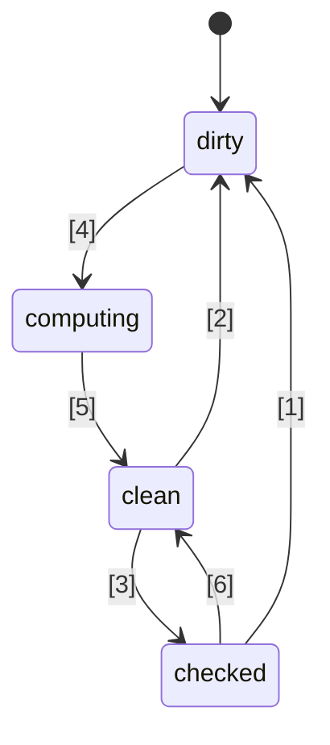
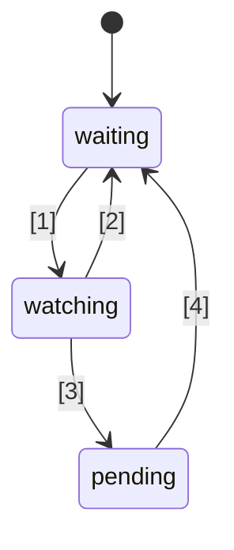

# 🚦 Đề xuất tiêu chuẩn JavaScript Signals 🚦


Giai đoạn 1 ([giải thích](https://tc39.es/process-document/))

Các đại diện đề xuất TC39: Daniel Ehrenberg, Yehuda Katz, Jatin Ramanathan, Shay Lewis, Kristen Hewell Garrett, Dominic Gannaway, Preston Sego, Milo M, Rob Eisenberg

Tác giả gốc: Rob Eisenberg và Daniel Ehrenberg

Tài liệu này mô tả một hướng đi chung ban đầu cho signals trong JavaScript, tương tự như nỗ lực Promises/A+ trước khi Promises được TC39 chuẩn hóa trong ES2015. Hãy tự thử nghiệm với [một polyfill](https://github.com/proposal-signals/signal-polyfill).

Tương tự như Promises/A+, nỗ lực này tập trung vào việc đồng bộ hóa hệ sinh thái JavaScript. Nếu sự đồng bộ này thành công, một tiêu chuẩn có thể sẽ xuất hiện dựa trên kinh nghiệm đó. Nhiều tác giả framework đang hợp tác ở đây để xây dựng một mô hình chung có thể hỗ trợ lõi phản ứng của họ. Bản dự thảo hiện tại dựa trên đóng góp thiết kế từ các tác giả/người bảo trì của [Angular](https://angular.io/), [Bubble](https://bubble.io/), [Ember](https://emberjs.com/), [FAST](https://www.fast.design/), [MobX](https://mobx.js.org/), [Preact](https://preactjs.com/), [Qwik](https://qwik.dev/), [RxJS](https://rxjs.dev/), [Solid](https://www.solidjs.com/), [Starbeam](https://www.starbeamjs.com/), [Svelte](https://svelte.dev/), [Vue](https://vuejs.org/), [Wiz](https://blog.angular.io/angular-and-wiz-are-better-together-91e633d8cd5a), và nhiều hơn nữa…

Khác với Promises/A+, chúng tôi không cố gắng giải quyết cho một API chung hướng đến lập trình viên, mà thay vào đó là các ngữ nghĩa lõi chính xác của đồ thị signal nền tảng. Đề xuất này bao gồm một API cụ thể, nhưng API này không hướng đến đa số lập trình viên ứng dụng. Thay vào đó, signal API ở đây phù hợp hơn cho các framework xây dựng phía trên, cung cấp khả năng tương tác thông qua đồ thị signal chung và cơ chế tự động theo dõi.

Kế hoạch cho đề xuất này là thực hiện nhiều nguyên mẫu thử nghiệm sớm, bao gồm tích hợp vào nhiều framework, trước khi tiến xa hơn Giai đoạn 1. Chúng tôi chỉ quan tâm đến việc chuẩn hóa Signals nếu chúng thực sự phù hợp để sử dụng thực tiễn trong nhiều framework, và mang lại lợi ích thực so với signals do framework cung cấp. Chúng tôi hy vọng thử nghiệm nguyên mẫu sớm sẽ cung cấp cho chúng tôi thông tin này. Xem phần "Tình trạng và kế hoạch phát triển" bên dưới để biết thêm chi tiết.

## Bối cảnh: Tại sao lại cần Signals?

Để phát triển một giao diện người dùng (UI) phức tạp, lập trình viên ứng dụng JavaScript cần lưu trữ, tính toán, làm mất hiệu lực, đồng bộ và đẩy trạng thái đến tầng hiển thị của ứng dụng một cách hiệu quả. UI thường không chỉ dừng lại ở việc quản lý các giá trị đơn giản, mà thường liên quan đến việc render trạng thái tính toán dựa trên một cây phức tạp các giá trị hoặc trạng thái khác cũng được tính toán. Mục tiêu của Signals là cung cấp hạ tầng để quản lý trạng thái ứng dụng như vậy để lập trình viên có thể tập trung vào logic nghiệp vụ thay vì các chi tiết lặp đi lặp lại này.

Các cấu trúc tương tự signals đã được chứng minh là hữu ích ngay cả trong các ngữ cảnh ngoài UI, đặc biệt là trong các hệ thống build để tránh build lại không cần thiết.

Signals được sử dụng trong lập trình phản ứng để loại bỏ nhu cầu quản lý cập nhật trong ứng dụng.

> Một mô hình lập trình khai báo để cập nhật dựa trên sự thay đổi của trạng thái.

trích từ _[What is Reactivity?](https://www.pzuraq.com/blog/what-is-reactivity)_.

#### Ví dụ – Bộ đếm VanillaJS

Giả sử bạn có một biến, `counter`, bạn muốn render vào DOM xem bộ đếm là chẵn hay lẻ. Mỗi khi `counter` thay đổi, bạn muốn cập nhật DOM với trạng thái chẵn lẻ mới nhất. Trong Vanilla JS, bạn có thể có đoạn mã như sau:

```js
let counter = 0;
const setCounter = (value) => {
  counter = value;
  render();
};

const isEven = () => (counter & 1) == 0;
const parity = () => isEven() ? "even" : "odd";
const render = () => element.innerText = parity();

// Giả lập cập nhật từ bên ngoài cho counter...
setInterval(() => setCounter(counter + 1), 1000);
```
> [!NOTE]  
> Các biến toàn cục được sử dụng ở đây chỉ để minh họa. Quản lý trạng thái đúng cách có nhiều giải pháp, và các ví dụ trong đề xuất này nhằm tối giản nhất có thể. Đề xuất này không khuyến khích sử dụng biến toàn cục.

Điều này có một số vấn đề...

* Thiết lập `counter` lộn xộn và nhiều mã mẫu lặp đi lặp lại.
* Trạng thái `counter` bị gắn chặt với hệ thống render.
* Nếu `counter` thay đổi nhưng `parity` không đổi (ví dụ counter từ 2 lên 4), ta vẫn tính toán lại parity và render không cần thiết.
* Nếu một phần khác của UI chỉ muốn render khi `counter` cập nhật thì sao?
* Nếu một phần khác của UI phụ thuộc riêng vào `isEven` hoặc `parity` thì sao?

Ngay cả trong kịch bản khá đơn giản này, nhiều vấn đề đã phát sinh nhanh chóng. Chúng ta có thể cố gắng giải quyết bằng cách thêm pub/sub cho `counter`. Điều này cho phép các thành phần khác có thể đăng ký nhận thay đổi của `counter` và thêm phản ứng của riêng mình.

Tuy nhiên, ta vẫn gặp phải các vấn đề sau:

* Hàm render, vốn chỉ phụ thuộc vào `parity`, lại phải “biết” rằng nó thực ra cần đăng ký với `counter`.
* Không thể cập nhật UI chỉ dựa trên `isEven` hoặc `parity`, mà không tương tác trực tiếp với `counter`.
* Chúng ta lại tăng thêm mã mẫu lặp lại. Bất cứ khi nào sử dụng một thứ gì đó, không chỉ là gọi hàm hay đọc biến, mà phải đăng ký, cập nhật. Việc quản lý hủy đăng ký cũng đặc biệt phức tạp.

Bây giờ, ta có thể giải quyết một số vấn đề bằng cách thêm pub/sub không chỉ cho `counter` mà còn cho cả `isEven` và `parity`. Khi đó, phải đăng ký `isEven` với `counter`, `parity` với `isEven`, và `render` với `parity`. Thật không may, mã mẫu của chúng ta lại bùng nổ, và phải quản lý rất nhiều đăng ký, dễ xảy ra rò rỉ bộ nhớ nếu không dọn dẹp đúng cách. Vậy là ta giải quyết được một số vấn đề nhưng lại tạo ra một loạt vấn đề mới và nhiều mã hơn. Tệ hơn, phải làm lại quy trình này cho mọi trạng thái trong hệ thống.

### Giới thiệu về Signals

Các trừu tượng hóa binding dữ liệu giữa model và view trong UI từ lâu đã là cốt lõi của các framework UI trên nhiều ngôn ngữ lập trình, dù JS hay nền tảng web không tích hợp sẵn cơ chế nào như vậy. Trong các framework và thư viện JS, đã có rất nhiều thử nghiệm về cách biểu diễn binding này, và thực tiễn đã cho thấy sức mạnh của luồng dữ liệu một chiều kết hợp với kiểu dữ liệu hạng nhất đại diện cho ô trạng thái hoặc phép tính dẫn xuất từ dữ liệu khác, nay thường gọi là “Signals”.
Cách tiếp cận giá trị phản ứng hạng nhất này dường như lần đầu trở nên phổ biến trong các framework web mã nguồn mở JavaScript với [Knockout](https://knockoutjs.com/) [năm 2010](https://blog.stevensanderson.com/2010/07/05/introducing-knockout-a-ui-library-for-javascript/). Những năm sau đó, nhiều biến thể và triển khai đã được tạo ra. Trong 3-4 năm gần đây, primitive Signal và các cách tiếp cận liên quan càng được chú ý, với gần như mọi thư viện hoặc framework JavaScript hiện đại đều có thứ gì đó tương tự, dưới nhiều tên gọi khác nhau.

Để hiểu Signals, hãy xem lại ví dụ trên, được tái hiện với Signal API được trình bày dưới đây.

#### Ví dụ – Bộ đếm sử dụng Signals

```js
const counter = new Signal.State(0);
const isEven = new Signal.Computed(() => (counter.get() & 1) == 0);
const parity = new Signal.Computed(() => isEven.get() ? "even" : "odd");

// Thư viện hoặc framework định nghĩa effect dựa trên các Signal primitive khác
declare function effect(cb: () => void): (() => void);

effect(() => element.innerText = parity.get());

// Giả lập cập nhật từ bên ngoài cho counter...
setInterval(() => counter.set(counter.get() + 1), 1000);
```

Có một số điều chúng ta có thể thấy ngay:
* Đã loại bỏ mã mẫu lặp đi lặp lại quanh biến `counter` như ví dụ trước.
* Có một API thống nhất để xử lý giá trị, tính toán và hiệu ứng phụ.
* Không còn vấn đề tham chiếu vòng hoặc phụ thuộc ngược giữa `counter` và `render`.
* Không có đăng ký thủ công, cũng không cần phải ghi nhận các đăng ký.
* Có phương tiện kiểm soát thời điểm/lịch trình thực hiện hiệu ứng phụ.

Signals mang lại nhiều hơn những gì có thể thấy trên bề mặt API:
* **Theo dõi phụ thuộc tự động** - Một Signal tính toán sẽ tự động phát hiện bất kỳ Signal nào khác mà nó phụ thuộc vào, cho dù các Signal đó là giá trị đơn giản hay các phép tính khác.
* **Đánh giá lười (Lazy Evaluation)** - Các phép tính không được đánh giá ngay khi chúng được khai báo, cũng như không được đánh giá ngay lập tức khi các phụ thuộc của chúng thay đổi. Chúng chỉ được đánh giá khi giá trị của chúng được yêu cầu rõ ràng.
* **Ghi nhớ (Memoization)** - Các Signal tính toán lưu vào bộ nhớ đệm giá trị cuối cùng của chúng để các phép tính không có thay đổi trong phụ thuộc sẽ không cần được đánh giá lại, dù chúng được truy cập bao nhiêu lần đi nữa.

## Động lực tiêu chuẩn hóa Signals

#### Tương tác lẫn nhau (Interoperability)

Mỗi triển khai Signal đều có cơ chế theo dõi tự động riêng, để theo dõi các nguồn được phát hiện khi đánh giá một Signal tính toán. Điều này gây khó khăn trong việc chia sẻ mô hình, thành phần, và thư viện giữa các framework khác nhau -- chúng thường bị ràng buộc giả tạo với engine hiển thị của chúng (vì Signals thường được triển khai như một phần của các framework JS).

Mục tiêu của đề xuất này là tách biệt hoàn toàn mô hình phản ứng khỏi phần hiển thị, cho phép các nhà phát triển chuyển đổi sang công nghệ hiển thị mới mà không phải viết lại mã không liên quan đến UI, hoặc phát triển các mô hình phản ứng dùng chung trong JS để triển khai ở các ngữ cảnh khác nhau. Thật không may, do vấn đề phiên bản và trùng lặp, việc đạt được mức độ chia sẻ cao thông qua các thư viện ở cấp độ JS là không khả thi -- các built-in mang lại đảm bảo chia sẻ mạnh mẽ hơn.

#### Hiệu năng/Sử dụng bộ nhớ

Luôn luôn có một chút cải thiện hiệu năng tiềm năng khi gửi ít mã hơn nhờ các thư viện thường dùng được tích hợp sẵn, nhưng các triển khai của Signals nhìn chung khá nhỏ, nên chúng tôi không kỳ vọng hiệu ứng này quá lớn.

Chúng tôi nghi ngờ rằng các triển khai gốc C++ cho các cấu trúc dữ liệu và thuật toán liên quan đến Signal có thể hiệu quả hơn một chút so với những gì đạt được trong JS, ở mức hệ số không đổi. Tuy nhiên, không có thay đổi về thuật toán nào được dự kiến so với những gì có trong polyfill; các engine không được kỳ vọng sẽ làm phép thuật ở đây, và các thuật toán phản ứng tự thân sẽ được định nghĩa rõ ràng và không mơ hồ.

Nhóm đề xuất dự kiến sẽ phát triển nhiều triển khai Signals khác nhau, và sử dụng chúng để nghiên cứu các khả năng hiệu năng này.

#### DevTools

Với các thư viện Signal ở ngôn ngữ JS hiện tại, có thể rất khó để truy vết các vấn đề như:
* Callstack xuyên suốt chuỗi các Signal tính toán, thể hiện chuỗi nguyên nhân cho một lỗi
* Đồ thị tham chiếu giữa các Signal, khi một cái phụ thuộc vào cái khác -- quan trọng khi gỡ lỗi sử dụng bộ nhớ

Các Signal tích hợp sẵn cho phép các runtime JS và DevTools có thể hỗ trợ tốt hơn cho việc kiểm tra Signal, đặc biệt là cho việc gỡ lỗi hoặc phân tích hiệu năng, dù là được tích hợp vào trình duyệt hay thông qua tiện ích mở rộng dùng chung. Các công cụ hiện có như trình kiểm tra phần tử, snapshot hiệu năng, và bộ phân tích bộ nhớ có thể được cập nhật để làm nổi bật các Signal trong cách trình bày thông tin của chúng.

#### Lợi ích phụ

##### Lợi ích của thư viện chuẩn

Nói chung, JavaScript có một thư viện chuẩn khá tối giản, nhưng một xu hướng trong TC39 là biến JS thành một ngôn ngữ "kèm pin", với tập chức năng chất lượng cao, tích hợp sẵn. Ví dụ, Temporal đang thay thế moment.js, và một số tính năng nhỏ như `Array.prototype.flat` và `Object.groupBy` đang thay thế nhiều trường hợp dùng lodash. Lợi ích bao gồm kích thước bundle nhỏ hơn, tăng độ ổn định và chất lượng, ít thứ phải học hơn khi gia nhập dự án mới, và một ngôn ngữ chung phổ biến giữa các lập trình viên JS.

##### Tích hợp HTML/DOM (khả năng tương lai)

Công việc hiện tại ở W3C và các nhà phát triển trình duyệt đang hướng đến việc đưa templating gốc vào HTML ([DOM Parts][wicg-pr-1023] và [Template Instantiation][wicg-propsal-template-instantiation]). Thêm vào đó, W3C Web Components CG đang khám phá khả năng mở rộng Web Components để cung cấp API HTML hoàn toàn khai báo. Để đạt được cả hai mục tiêu này, cuối cùng HTML sẽ cần một primitive phản ứng. Ngoài ra, có thể tưởng tượng và cộng đồng cũng đã yêu cầu nhiều cải tiến về trải nghiệm sử dụng DOM thông qua tích hợp Signal.

[wicg-pr-1023]: https://github.com/WICG/webcomponents/pull/1023
[wicg-propsal-template-instantiation]: https://github.com/WICG/webcomponents/blob/gh-pages/proposals/Template-Instantiation.md

> Lưu ý, việc tích hợp này sẽ là một nỗ lực riêng đến sau, không thuộc phạm vi đề xuất này.

##### Trao đổi thông tin hệ sinh thái (*không* phải lý do để đưa vào chuẩn)

Nỗ lực tiêu chuẩn hóa đôi khi có thể hữu ích chỉ ở cấp độ "cộng đồng", ngay cả khi không có thay đổi trên trình duyệt. Dự án Signals đang tập hợp nhiều tác giả framework khác nhau để thảo luận sâu về bản chất phản ứng, thuật toán và khả năng tương tác. Điều này đã có ích, nhưng không biện minh cho việc đưa vào các engine JS và trình duyệt; Signals chỉ nên được thêm vào tiêu chuẩn JavaScript nếu có lợi ích đáng kể *vượt ngoài* trao đổi thông tin hệ sinh thái mà nó mang lại.

## Mục tiêu thiết kế cho Signals

Hóa ra các thư viện Signal hiện tại ở cốt lõi không khác biệt quá nhiều với nhau. Đề xuất này hướng đến việc xây dựng trên thành công của chúng bằng cách triển khai các phẩm chất quan trọng của nhiều thư viện đó.

### Tính năng cốt lõi

* Một kiểu Signal đại diện cho trạng thái, tức Signal có thể ghi. Đây là một giá trị mà các thành phần khác có thể đọc.
* Một kiểu Signal tính toán/memo/derived, phụ thuộc vào Signal khác và được tính toán lười biếng và lưu cache.
    * Tính toán là lười biếng, nghĩa là các Signal tính toán sẽ không được tính lại mặc định khi một trong các phụ thuộc thay đổi, mà chỉ chạy khi có ai đó thật sự đọc chúng.
    * Tính toán "không glitch" ([glitch](https://en.wikipedia.org/wiki/Reactive_programming#Glitches)-free), nghĩa là không có phép tính không cần thiết nào được thực hiện. Điều này ngụ ý rằng, khi một ứng dụng đọc một Signal tính toán, sẽ có một phép sắp xếp topo các phần có khả năng "bẩn" trong đồ thị để loại bỏ bất kỳ sự lặp lại nào.
    * Tính toán được lưu cache, nghĩa là nếu sau lần cuối cùng một phụ thuộc thay đổi mà không có phụ thuộc nào thay đổi tiếp, thì Signal tính toán *không* được tính lại khi truy cập.
    * Có thể so sánh tùy chỉnh cho cả Signal tính toán lẫn Signal trạng thái, để xác định khi nào các Signal tính toán phụ thuộc vào chúng nên được cập nhật.
* Phản ứng với tình huống khi một Signal tính toán có một trong các phụ thuộc (hoặc phụ thuộc lồng nhau) trở nên "bẩn" và thay đổi, nghĩa là giá trị của Signal có thể đã lỗi thời.
    * Phản ứng này nhằm mục đích lên lịch thực hiện công việc quan trọng hơn sau đó.
    * Các hiệu ứng được triển khai dựa trên các phản ứng này, cộng với logic lên lịch ở cấp framework.
    * Các Signal tính toán cần có khả năng phản ứng với việc liệu chúng có được đăng ký làm phụ thuộc (lồng nhau) của một trong các phản ứng này hay không.
* Cho phép các framework JS tự lên lịch công việc của mình. Không ép buộc lên lịch kiểu Promise.
    * Phản ứng đồng bộ là cần thiết để cho phép lên lịch công việc dựa trên logic framework.
    * Việc ghi là đồng bộ và có hiệu lực ngay lập tức (một framework muốn batch các ghi có thể làm điều đó ở tầng trên).
    * Có thể tách kiểm tra xem một hiệu ứng có thể "bẩn" hay không khỏi việc thực thi hiệu ứng (cho phép scheduler hiệu ứng hai giai đoạn).
* Có khả năng đọc Signals *mà không* kích hoạt ghi nhận phụ thuộc (`untrack`)
* Cho phép kết hợp các codebase khác nhau sử dụng Signals/reactivity, ví dụ:
    * Sử dụng nhiều framework cùng lúc về mặt theo dõi/phản ứng (trừ các thiếu sót, xem bên dưới)
    * Các cấu trúc dữ liệu phản ứng độc lập framework (ví dụ, proxy store đệ quy, Map, Set, Array phản ứng,...)

### Tính đúng đắn (Soundness)

* Ngăn ngừa/giới hạn việc lạm dụng phản ứng đồng bộ một cách ngây thơ.
    * Rủi ro về tính đúng đắn: Có thể phát sinh "[glitches](https://en.wikipedia.org/wiki/Reactive_programming#Glitches)" nếu dùng không đúng: Nếu render được thực hiện ngay khi một Signal được set, có thể làm lộ trạng thái ứng dụng chưa hoàn chỉnh cho người dùng cuối. Do đó, tính năng này chỉ nên được dùng để lên lịch công việc thông minh cho sau này, sau khi logic ứng dụng đã hoàn tất.
    * Giải pháp: Không cho phép đọc và ghi bất kỳ Signal nào bên trong callback phản ứng đồng bộ
* Hạn chế `untrack` và đánh dấu bản chất không an toàn của nó
    * Rủi ro về tính đúng đắn: cho phép tạo Signal tính toán mà giá trị phụ thuộc vào các Signal khác, nhưng không được cập nhật khi các Signal đó thay đổi. Chỉ nên dùng khi các truy cập không được theo dõi sẽ không làm thay đổi kết quả phép tính.
    * Giải pháp: API được đánh dấu "unsafe" trong tên gọi.
* Lưu ý: Đề xuất này cho phép các signal vừa được đọc vừa được ghi từ các signal tính toán và hiệu ứng, mà không giới hạn việc ghi sau khi đọc, dù có rủi ro về tính đúng đắn. Quyết định này nhằm bảo toàn tính linh hoạt và khả năng tương thích khi tích hợp với các framework.

### API bề mặt (Surface API)

* Phải là nền tảng vững chắc để nhiều framework triển khai cơ chế Signals/reactivity của mình.
    * Nên là nền tảng tốt cho các proxy store đệ quy, reactivity trường lớp dựa trên decorator, và cả các API kiểu `.value` cũng như `[state, setState]`.
    * Ngữ nghĩa đủ sức biểu đạt các mẫu hợp lệ mà các framework cho phép. Ví dụ, các Signal này nên có thể là nền tảng cho cả các ghi nhận phản ánh ngay lập tức hoặc các ghi nhận batch và áp dụng sau.
* Sẽ thật tốt nếu API này có thể được dùng trực tiếp bởi lập trình viên JavaScript.
    * Nếu một tính năng trùng khớp với một khái niệm trong hệ sinh thái, sử dụng từ vựng chung là tốt.
        * Tuy nhiên, quan trọng là không nên sao chép y nguyên tên gọi!
    * Căng thẳng giữa "dễ dùng cho dev JS" và "cung cấp đầy đủ hook cho framework"
        * Ý tưởng: Cung cấp đầy đủ hook, nhưng báo lỗi khi dùng sai nếu có thể.
        * Ý tưởng: Đặt các API tinh vi vào namespace `subtle`, giống như [`crypto.subtle`](https://developer.mozilla.org/en-US/docs/Web/API/Crypto/subtle), để phân biệt giữa các API cần thiết cho các trường hợp nâng cao (như xây framework hoặc dev tools) với các trường hợp dùng hằng ngày như khởi tạo signals dùng cùng framework.
* Có thể triển khai và sử dụng với hiệu năng tốt -- API bề mặt không gây quá nhiều overhead
    * Hỗ trợ kế thừa, để các framework có thể thêm method và field riêng, kể cả field private. Điều này quan trọng để tránh phải cấp phát thêm ở tầng framework. Xem "Quản lý bộ nhớ" bên dưới.

### Quản lý bộ nhớ

* Nếu có thể: Một Signal tính toán nên có thể bị thu hồi bộ nhớ (garbage collect) nếu không còn tham chiếu nào còn sống đến nó cho các lần đọc sau này, kể cả khi nó vẫn còn liên kết trong một đồ thị rộng hơn (ví dụ, bằng cách đọc một state vẫn còn sống).
* Lưu ý rằng hầu hết các framework hiện nay đều yêu cầu phải giải phóng rõ ràng các Signal tính toán (computed Signals) nếu chúng có bất kỳ tham chiếu nào đến hoặc từ một đồ thị Signal khác vẫn còn tồn tại.
* Điều này không quá tệ khi vòng đời của chúng gắn liền với vòng đời của một thành phần giao diện người dùng, và các hiệu ứng cũng cần được giải phóng dù sao đi nữa.
* Nếu việc thực thi với các ngữ nghĩa này quá tốn kém, thì chúng ta nên thêm cơ chế giải phóng rõ ràng (hoặc "hủy liên kết") cho các Signal tính toán vào API bên dưới, vốn hiện tại chưa có.
* Một mục tiêu liên quan riêng biệt: Giảm thiểu số lần cấp phát bộ nhớ, ví dụ:
    * để tạo một Signal có thể ghi (tránh hai closure riêng biệt + mảng)
    * để triển khai các hiệu ứng (tránh tạo một closure cho mỗi lần phản ứng)
    * Trong API để quan sát thay đổi của Signal, tránh tạo thêm các cấu trúc dữ liệu tạm thời
    * Giải pháp: API dựa trên lớp (class-based), cho phép tái sử dụng các phương thức và trường được định nghĩa trong lớp con

## Phác thảo API

Dưới đây là ý tưởng ban đầu về một API cho Signal. Lưu ý rằng đây chỉ là bản dự thảo sớm, và chúng tôi dự đoán sẽ có những thay đổi theo thời gian. Hãy bắt đầu với toàn bộ file `.d.ts` để hình dung tổng thể, sau đó chúng ta sẽ thảo luận chi tiết về ý nghĩa của từng phần.

```ts
interface Signal<T> {
    // Lấy giá trị của signal
    get(): T;
}

namespace Signal {
    // Signal đọc-ghi
    class State<T> implements Signal<T> {
        // Tạo một state Signal bắt đầu với giá trị t
        constructor(t: T, options?: SignalOptions<T>);

        // Lấy giá trị của signal
        get(): T;

        // Đặt giá trị của state Signal thành t
        set(t: T): void;
    }

    // Một Signal là công thức dựa trên các Signal khác
    class Computed<T = unknown> implements Signal<T> {
        // Tạo một Signal đánh giá ra giá trị trả về từ callback.
        // Callback được gọi với signal này là giá trị this.
        constructor(cb: (this: Computed<T>) => T, options?: SignalOptions<T>);

        // Lấy giá trị của signal
        get(): T;
    }

    // Namespace này bao gồm các tính năng "nâng cao" tốt hơn nên để dành cho tác giả framework hơn là nhà phát triển ứng dụng.
    // Tương tự như `crypto.subtle`
    namespace subtle {
        // Chạy một callback với toàn bộ tracking bị vô hiệu hóa
        function untrack<T>(cb: () => T): T;

        // Lấy signal tính toán hiện tại đang theo dõi các lần đọc signal, nếu có
        function currentComputed(): Computed | null;

        // Trả về danh sách có thứ tự của tất cả các signal mà signal này đã tham chiếu
        // trong lần đánh giá gần nhất.
        // Đối với Watcher, liệt kê tập hợp các signal mà nó đang theo dõi.
        function introspectSources(s: Computed | Watcher): (State | Computed)[];

        // Trả về các Watcher mà signal này nằm trong đó, cùng với bất kỳ
        // Signal tính toán nào đã đọc signal này lần cuối cùng chúng được đánh giá,
        // nếu signal tính toán đó (đệ quy) đang được theo dõi.
        function introspectSinks(s: State | Computed): (Computed | Watcher)[];

        // Đúng nếu signal này đang "sống", tức là nó được theo dõi bởi một Watcher,
        // hoặc được đọc bởi một Signal tính toán (đệ quy) đang sống.
        function hasSinks(s: State | Computed): boolean;

        // Đúng nếu phần tử này là "reactive", tức là nó phụ thuộc
        // vào một signal khác. Một Computed mà hasSources là false
        // sẽ luôn trả về cùng một hằng số.
        function hasSources(s: Computed | Watcher): boolean;

        class Watcher {
            // Khi một nguồn (đệ quy) của Watcher bị ghi, gọi callback này,
            // nếu nó chưa được gọi kể từ lần gọi `watch` gần nhất.
            // Không được đọc hay ghi signal nào trong quá trình notify.
            constructor(notify: (this: Watcher) => void);

            // Thêm các signal này vào tập của Watcher, và đặt Watcher để chạy callback notify
            // lần tới khi bất kỳ signal nào trong tập (hoặc một trong các phụ thuộc của nó) thay đổi.
            // Có thể gọi mà không truyền đối số chỉ để đặt lại trạng thái "đã thông báo", để callback notify sẽ được gọi lại.
            watch(...s: Signal[]): void;

            // Loại bỏ các signal này khỏi tập đang theo dõi (ví dụ, cho một effect đã giải phóng)
            unwatch(...s: Signal[]): void;

            // Trả về tập các nguồn trong tập của Watcher vẫn còn dirty, hoặc là một signal tính toán
            // có nguồn dirty hoặc đang chờ và chưa được đánh giá lại
            getPending(): Signal[];
        }

        // Hook để quan sát khi được theo dõi hoặc không còn được theo dõi
        var watched: Symbol;
        var unwatched: Symbol;
    }

    interface SignalOptions<T> {
        // Hàm so sánh tùy chỉnh giữa giá trị cũ và mới. Mặc định: Object.is.
        // Signal được truyền vào làm giá trị this cho context.
        equals?: (this: Signal<T>, t: T, t2: T) => boolean;
```ts
// Callback được gọi khi isWatched trở thành true, nếu trước đó là false
[Signal.subtle.watched]?: (this: Signal<T>) => void;

// Callback được gọi mỗi khi isWatched trở thành false, nếu trước đó là true
[Signal.subtle.unwatched]?: (this: Signal<T>) => void;
}
}
```

### Cách Signals hoạt động

Một Signal đại diện cho một ô dữ liệu có thể thay đổi theo thời gian. Signals có thể là "state" (chỉ là một giá trị được thiết lập thủ công) hoặc "computed" (một công thức dựa trên các Signal khác).

Các Signal tính toán (Computed Signals) hoạt động bằng cách tự động theo dõi các Signal khác được đọc trong quá trình đánh giá của chúng. Khi một computed được đọc, nó kiểm tra xem bất kỳ phụ thuộc đã ghi nhận trước đó nào có thay đổi không, và tự đánh giá lại nếu có. Khi nhiều computed Signals được lồng nhau, tất cả việc ghi nhận sự phụ thuộc sẽ thuộc về cái lồng trong cùng nhất.

Computed Signals là lười biếng, tức là dựa trên cơ chế pull: chúng chỉ được đánh giá lại khi được truy cập, ngay cả khi một trong các phụ thuộc của chúng đã thay đổi trước đó.

Callback truyền vào computed Signals thường nên "thuần khiết" (pure) theo nghĩa là một hàm xác định, không có hiệu ứng phụ với các Signal khác mà nó truy cập. Đồng thời, thời điểm callback được gọi là xác định, cho phép sử dụng hiệu ứng phụ một cách cẩn trọng.

Signals có tính năng nổi bật là caching/memoization: cả state và computed Signals đều ghi nhớ giá trị hiện tại của chúng, và chỉ kích hoạt việc tính toán lại của các computed Signals tham chiếu chúng nếu chúng thực sự thay đổi. Không cần so sánh lặp lại giá trị cũ và mới—so sánh chỉ được thực hiện một lần khi Signal nguồn được thiết lập lại/đánh giá lại, và cơ chế Signal sẽ theo dõi những gì tham chiếu đến Signal đó chưa được cập nhật dựa trên giá trị mới. Nội bộ, điều này thường được biểu diễn qua "graph coloring" như được mô tả trong (bài blog của Milo).

Computed Signals theo dõi phụ thuộc của chúng một cách động—mỗi lần chúng được chạy, chúng có thể phụ thuộc vào những thứ khác nhau, và tập phụ thuộc chính xác đó luôn được cập nhật mới trong đồ thị Signal. Điều này có nghĩa là nếu bạn có một phụ thuộc chỉ cần thiết ở một nhánh, và lần tính trước chọn nhánh khác, thì một thay đổi tới giá trị tạm thời không sử dụng đó sẽ không khiến computed Signal bị tính lại, ngay cả khi được truy cập.

Không giống như JavaScript Promises, mọi thứ trong Signals đều chạy đồng bộ:
- Thiết lập một Signal với giá trị mới là đồng bộ, và điều này được phản ánh ngay lập tức khi đọc bất kỳ computed Signal nào phụ thuộc vào nó sau đó. Không có việc gom nhóm (batching) tích hợp cho thao tác này.
- Đọc các computed Signals là đồng bộ—giá trị của chúng luôn sẵn có.
- Callback `notify` trong Watchers, như giải thích bên dưới, chạy đồng bộ, trong quá trình gọi `.set()` đã kích hoạt nó (nhưng sau khi quá trình graph coloring đã hoàn tất).

Giống như Promises, Signals có thể đại diện cho trạng thái lỗi: Nếu callback của một computed Signal ném lỗi, thì lỗi đó sẽ được cache giống như giá trị khác, và ném lại mỗi lần Signal được đọc.

### Tìm hiểu lớp Signal

Một instance `Signal` đại diện cho khả năng đọc một giá trị thay đổi động mà các cập nhật của nó được theo dõi theo thời gian. Nó cũng ngầm bao gồm khả năng đăng ký (subscribe) vào Signal, một cách ngầm qua việc truy cập có theo dõi từ một computed Signal khác.

API ở đây được thiết kế để phù hợp với sự đồng thuận chung trong hệ sinh thái giữa nhiều thư viện Signal về việc sử dụng các tên như "signal", "computed" và "state". Tuy nhiên, truy cập vào Computed và State Signals thông qua phương thức `.get()`, điều này không giống với các API Signal phổ biến hiện tại, vốn sử dụng cú pháp truy cập `.value` hoặc gọi `signal()`.

API được thiết kế để giảm số lượng phân bổ bộ nhớ, nhằm làm cho Signals phù hợp để nhúng vào các framework JavaScript trong khi đạt hiệu năng tương đương hoặc tốt hơn các Signals tùy biến của framework hiện tại. Điều này có nghĩa là:
- State Signals là một đối tượng có thể ghi đơn lẻ, có thể được truy cập và thiết lập từ cùng một tham chiếu. (Xem các hệ quả bên dưới trong phần "Phân tách khả năng".)
- Cả State và Computed Signals đều được thiết kế để có thể kế thừa, nhằm tạo điều kiện cho các framework có thể thêm các thuộc tính bổ sung thông qua trường class công khai hoặc riêng tư (cũng như các phương thức sử dụng trạng thái đó).
- Nhiều callback khác nhau (ví dụ, `equals`, callback của computed) được gọi với Signal liên quan là giá trị `this` để làm ngữ cảnh, vì vậy không cần closure mới cho mỗi Signal. Thay vào đó, ngữ cảnh có thể được lưu trong các thuộc tính bổ sung của chính Signal đó.

Một số điều kiện lỗi được API này áp đặt:
- Đọc một computed một cách đệ quy là lỗi.
- Callback `notify` của Watcher không thể đọc hoặc ghi bất kỳ signal nào.
- Nếu callback của một computed Signal ném lỗi, thì các lần truy cập tiếp theo vào Signal đó sẽ ném lại lỗi đã cache, cho đến khi một trong các phụ thuộc thay đổi và nó được tính lại.

Một số điều kiện *không* bị áp đặt:
- Computed Signals có thể ghi vào các Signals khác, đồng bộ trong callback của chúng.
- Công việc được xếp hàng bởi callback `notify` của Watcher có thể đọc hoặc ghi signals, khiến có thể tái tạo các [anti-pattern React kinh điển](https://react.dev/learn/you-might-not-need-an-effect) bằng Signals!

### Triển khai effects

Giao diện `Watcher` được định nghĩa ở trên cung cấp cơ sở để triển khai các API JS điển hình cho effects: các callback được chạy lại khi các Signal khác thay đổi, chỉ để thực hiện hiệu ứng phụ. Hàm `effect` được sử dụng ở ví dụ ban đầu phía trên có thể được định nghĩa như sau:

```ts
// Hàm này thường nằm trong thư viện/framework, không phải mã ứng dụng
// LƯU Ý: Logic lập lịch này quá đơn giản để sử dụng thực tế. Không copy/paste.
let pending = false;

let w = new Signal.subtle.Watcher(() => {
    if (!pending) {
        pending = true;
        queueMicrotask(() => {
            pending = false;
            for (let s of w.getPending()) s.get();
            w.watch();
        });
    }
});

// Một effect Signal đánh giá thành cb, lập lịch đọc chính nó trên hàng đợi microtask
// bất cứ khi nào một trong các phụ thuộc của nó có thể thay đổi
export function effect(cb) {
    let destructor;
    let c = new Signal.Computed(() => { destructor?.(); destructor = cb(); });
    w.watch(c);
    c.get();
    return () => { destructor?.(); w.unwatch(c) };
}
```

API Signal không bao gồm bất kỳ hàm tích hợp nào như `effect`. Điều này là vì việc lập lịch effect rất tinh vi và thường gắn liền với vòng lặp render của framework và các trạng thái hoặc chiến lược đặc thù framework cấp cao khác mà JS không truy cập được.

Giải thích các thao tác khác nhau được sử dụng ở đây: Callback `notify` truyền vào constructor của `Watcher` là hàm được gọi khi Signal chuyển từ trạng thái "clean" (biết cache đã được khởi tạo và hợp lệ) sang trạng thái "checked" hoặc "dirty" (cache có thể hợp lệ hoặc không vì ít nhất một trạng thái mà nó phụ thuộc đệ quy đã bị thay đổi).

Các cuộc gọi tới `notify` cuối cùng được kích hoạt bởi một cuộc gọi tới `.set()` trên một state Signal nào đó. Cuộc gọi này là đồng bộ: nó xảy ra trước khi `.set` trả về. Tuy nhiên, không cần lo lắng về việc callback này quan sát đồ thị Signal ở trạng thái xử lý dở, vì trong suốt callback `notify`, không Signal nào có thể được đọc hoặc ghi, ngay cả trong một cuộc gọi `untrack`. Vì `notify` được gọi trong quá trình `.set()`, nó đang chen ngang một luồng logic khác, có thể chưa hoàn thành. Để đọc hoặc ghi Signals từ `notify`, hãy lập lịch công việc để chạy sau, ví dụ, bằng cách ghi Signal vào một danh sách để truy cập sau, hoặc dùng `queueMicrotask` như trên.

Lưu ý rằng hoàn toàn có thể sử dụng Signals một cách hiệu quả mà không cần `Signal.subtle.Watcher` bằng cách lập lịch polling các computed Signals, như Glimmer đã làm. Tuy nhiên, nhiều framework nhận thấy rất hữu ích khi logic lập lịch này chạy đồng bộ, nên API Signals đã bao gồm điều đó.

Cả computed và state Signals đều được thu gom bộ nhớ (garbage-collected) như bất kỳ giá trị JS nào khác. Nhưng Watchers có một cách đặc biệt để giữ mọi thứ tồn tại: Bất kỳ Signals nào được Watcher theo dõi sẽ được giữ sống miễn là bất kỳ state nền tảng nào còn truy cập được, vì chúng có thể kích hoạt một cuộc gọi `notify` trong tương lai (và sau đó là `.get()`). Vì lý do này, hãy nhớ gọi `Watcher.prototype.unwatch` để dọn dẹp effects.

### Lối thoát không an toàn (unsound escape hatch)

`Signal.subtle.untrack` là một lối thoát cho phép đọc Signals *mà không* theo dõi các lần đọc đó. Khả năng này không an toàn vì nó cho phép tạo ra các computed Signals mà giá trị của chúng phụ thuộc vào các Signal khác, nhưng lại không được cập nhật khi các Signal đó thay đổi. Nên dùng khi các truy cập không theo dõi này sẽ không làm thay đổi kết quả phép tính.

<!--
TODO: Minh họa ví dụ khi nào nên dùng untrack

### Sử dụng watched/unwatched
TODO: Hiển thị ví dụ chuyển đổi một Observable thành một computed signal, chỉ đăng ký khi được sử dụng bởi một effect

TODO: Hiển thị ví dụ về một computed signal đại diện cho kết quả của một fetch hướng tới một trạng thái, có thể bị hủy bỏ

### Khả năng nội suy cho SSR

TODO: Hiển thị cách hoạt động của việc tuần tự hóa biểu đồ signal

TODO: Hiển thị cách bạn có thể "hydrate" một signal từ trạng thái sang computed sau này, sử dụng một vài signals.
-->

### Tạm thời bỏ qua

Những tính năng này có thể sẽ được bổ sung sau, nhưng hiện chưa có trong bản dự thảo hiện tại. Việc bỏ qua này là do chưa có sự đồng thuận vững chắc trong không gian thiết kế giữa các framework, cũng như đã có các cơ chế giải quyết trên nền tảng Signals như mô tả trong tài liệu này. Tuy nhiên, đáng tiếc là việc bỏ qua này làm hạn chế tiềm năng tương tác giữa các framework. Khi các nguyên mẫu của Signals như mô tả trong tài liệu này được phát triển, sẽ có nỗ lực xem xét lại liệu việc bỏ qua này có phải là quyết định thích hợp hay không.

* **Bất đồng bộ (Async)**: Trong mô hình này, Signals luôn có thể được đánh giá đồng bộ. Tuy nhiên, việc có một số tiến trình bất đồng bộ dẫn đến một signal được thiết lập, đồng thời có thể hiểu được khi nào một signal vẫn đang "loading" là rất hữu ích. Một cách đơn giản để mô hình hóa trạng thái loading là sử dụng ngoại lệ, và hành vi lưu bộ nhớ đệm ngoại lệ của computed signals có thể phối hợp hợp lý với kỹ thuật này. Các kỹ thuật cải tiến hơn được thảo luận tại [Issue #30](https://github.com/proposal-signals/proposal-signals/issues/30).
* **Giao dịch (Transactions)**: Đối với quá trình chuyển đổi giữa các view, việc duy trì trạng thái sống cho cả trạng thái "từ" và "đến" thường rất hữu ích. Trạng thái "đến" được render ở nền cho đến khi sẵn sàng chuyển đổi (commit giao dịch), trong khi trạng thái "từ" vẫn còn tương tác được. Duy trì đồng thời cả hai trạng thái yêu cầu phải "fork" trạng thái của biểu đồ signal, thậm chí có thể hữu ích khi hỗ trợ nhiều lần chuyển đổi đang chờ cùng lúc. Thảo luận tại [Issue #73](https://github.com/proposal-signals/proposal-signals/issues/73).

Một số [phương thức tiện lợi](https://github.com/proposal-signals/proposal-signals/issues/32) cũng bị bỏ qua.

## Tình trạng và kế hoạch phát triển

Đề xuất này có trong chương trình nghị sự TC39 tháng 4 năm 2024 ở Giai đoạn 1. Hiện tại có thể xem là "Giai đoạn 0".

[Một polyfill](https://github.com/proposal-signals/signal-polyfill) cho đề xuất này đã có sẵn, với một số bài kiểm tra cơ bản. Một số tác giả framework đã bắt đầu thử nghiệm thay thế bằng triển khai signal này, nhưng việc sử dụng vẫn còn ở giai đoạn đầu.

Những người cộng tác trong đề xuất Signal muốn thật sự **thận trọng** trong việc thúc đẩy đề xuất này, để tránh rơi vào cái bẫy đưa ra một thứ mà sau này chúng ta hối tiếc và không thực sự sử dụng. Kế hoạch của chúng tôi là thực hiện các nhiệm vụ bổ sung sau, không yêu cầu bởi quy trình TC39, để đảm bảo đề xuất này đi đúng hướng:

Trước khi đề xuất lên Giai đoạn 2, chúng tôi dự định:
- Phát triển nhiều bản polyfill đạt cấp độ sản xuất, chắc chắn, được kiểm thử kỹ lưỡng (ví dụ, vượt qua các bài kiểm tra từ nhiều framework cũng như các bài kiểm tra kiểu test262), và có hiệu năng cạnh tranh (được xác minh qua một bộ benchmark signal/framework kỹ lưỡng).
- Tích hợp API Signal đề xuất vào nhiều framework JS mà chúng tôi cho là đại diện, và một số ứng dụng lớn làm việc trên cơ sở này. Kiểm tra xem nó hoạt động hiệu quả và chính xác trong các bối cảnh này.
- Có cái nhìn chắc chắn về không gian các phần mở rộng có thể cho API, và kết luận phần nào (nếu có) nên được thêm vào đề xuất này.

## Thuật toán Signal

Phần này mô tả từng API được lộ ra cho JavaScript, theo các thuật toán mà chúng thực hiện. Có thể coi đây là một bản tiền-đặc-tả, được đưa vào ở giai đoạn đầu để cố định một tập hợp ngữ nghĩa khả dĩ, đồng thời rất sẵn sàng thay đổi.

Một số khía cạnh của thuật toán:
- Thứ tự đọc Signals bên trong một computed là có ý nghĩa, và có thể quan sát được qua thứ tự mà một số callback nhất định (`Watcher` được gọi, `equals`, tham số đầu tiên cho `new Signal.Computed`, và các callback `watched`/`unwatched`) được thực thi. Điều này có nghĩa là các nguồn của một computed Signal phải được lưu theo thứ tự.
- Bốn callback này đều có thể ném ngoại lệ, và các ngoại lệ này được truyền một cách dự đoán được đến mã JS gọi. Các ngoại lệ *không* dừng thực thi thuật toán này hoặc làm cho biểu đồ ở trạng thái xử lý dở dang. Đối với các lỗi phát sinh trong callback `notify` của một Watcher, ngoại lệ đó được gửi đến lệnh `.set()` đã kích hoạt nó, sử dụng AggregateError nếu có nhiều ngoại lệ được ném ra. Các callback khác (bao gồm cả `watched`/`unwatched`?) được lưu trữ trong giá trị của Signal, sẽ được ném lại khi đọc, và signal bị ném lại như vậy có thể được đánh dấu `~clean~` như bất kỳ signal nào khác với giá trị bình thường.
- Cẩn thận tránh các vòng lặp trong trường hợp các computed signals không được "watched" (bị quan sát bởi bất kỳ Watcher nào), để chúng có thể được thu gom rác một cách độc lập với các phần khác của biểu đồ signal. Về mặt nội bộ, điều này có thể được triển khai với hệ thống số thế hệ luôn được thu gom; lưu ý rằng các triển khai tối ưu hóa cũng có thể bao gồm số thế hệ cục bộ cho từng node, hoặc tránh theo dõi một số số trên các signals được watched.

### Trạng thái toàn cục ẩn

Các thuật toán Signal cần tham chiếu đến một số trạng thái toàn cục nhất định. Trạng thái này là toàn cục cho toàn bộ luồng (thread), hoặc "agent".

- `computing`: Computed hoặc effect Signal lồng trong cùng hiện đang được đánh giá lại do một lệnh gọi `.get` hoặc `.run`, hoặc `null`. Ban đầu là `null`.
- `frozen`: Biến boolean cho biết có đang có callback nào thực thi yêu cầu không được thay đổi biểu đồ. Ban đầu là `false`.
- `generation`: Một số nguyên tăng dần, bắt đầu từ 0, dùng để theo dõi giá trị hiện tại tránh vòng lặp.

### Không gian tên `Signal`

`Signal` là một đối tượng thông thường đóng vai trò là không gian tên cho các lớp và hàm liên quan đến Signal.

`Signal.subtle` là một đối tượng không gian tên nội bộ tương tự.

### Lớp `Signal.State`

#### Thuộc tính nội bộ của `Signal.State`

- `value`: Giá trị hiện tại của state signal
- `equals`: Hàm so sánh dùng khi thay đổi giá trị
- `watched`: Callback sẽ được gọi khi signal được quan sát bởi một effect
- `unwatched`: Callback sẽ được gọi khi signal không còn được quan sát bởi một effect
- `sinks`: Tập hợp các signal được watched phụ thuộc vào signal này

#### Hàm khởi tạo: `Signal.State(initialValue, options)`

1. Đặt `value` của Signal này thành `initialValue`.
1. Đặt `equals` của Signal này thành options?.equals
1. Đặt `watched` của Signal này thành options?.[Signal.subtle.watched]
1. Đặt `unwatched` của Signal này thành options?.[Signal.subtle.unwatched]
1. Đặt `sinks` của Signal này thành tập rỗng

#### Phương thức: `Signal.State.prototype.get()`

1. Nếu `frozen` là true, ném một ngoại lệ.
1. Nếu `computing` không phải `undefined`, thêm Signal này vào tập `sources` của `computing`.
1. LƯU Ý: Chúng ta không thêm `computing` vào tập `sinks` của Signal này cho đến khi nó được watched bởi một Watcher.
1. Trả về `value` của Signal này.

#### Phương thức: `Signal.State.prototype.set(newValue)`

1. Nếu ngữ cảnh thực thi hiện tại là `frozen`, ném một ngoại lệ.
1. Thực thi thuật toán "set Signal value" với Signal này và giá trị truyền vào đầu tiên.
1. Nếu thuật toán đó trả về `~clean~`, trả về undefined.
1. Đặt trạng thái (`state`) của tất cả các `sink` của Signal này thành (nếu là Computed Signal) `~dirty~` nếu trước đó là clean, hoặc (nếu là Watcher) `~pending~` nếu trước đó là `~watching~`.
1. Đặt trạng thái của tất cả các phụ thuộc Computed Signal của các sink (đệ quy) thành `~checked~` nếu trước đó là `~clean~` (tức là, giữ nguyên đánh dấu dirty), hoặc với Watchers, `~pending~` nếu trước đó là `~watching~`.
1. Với mỗi Watcher trước đó ở trạng thái `~watching~` được gặp trong quá trình tìm kiếm đệ quy, lần lượt theo thứ tự duyệt sâu,
    1. Đặt `frozen` thành true.
    1. Gọi callback `notify` của chúng (lưu lại mọi ngoại lệ ném ra, nhưng bỏ qua giá trị trả về của `notify`).
    1. Khôi phục `frozen` về false.
    1. Đặt trạng thái của Watcher thành `~waiting~`.
1. Nếu có ngoại lệ nào được ném từ callback `notify`, truyền nó lên caller sau khi tất cả callback `notify` đã chạy. Nếu có nhiều ngoại lệ, đóng gói chúng vào một AggregateError và ném ra.
1. Trả về undefined.

### Lớp `Signal.Computed`

#### Máy trạng thái `Signal.Computed`
`state` của một Computed Signal có thể là một trong các trạng thái sau:

- `~clean~`: Giá trị của Signal hiện tại và được biết là không lỗi thời.
- `~checked~`: Một nguồn (gián tiếp) của Signal này đã thay đổi; Signal này có giá trị nhưng _có thể_ đã lỗi thời. Chỉ khi tất cả các nguồn trực tiếp được đánh giá thì mới biết chính xác giá trị có lỗi thời hay không.
- `~computing~`: Callback của Signal này hiện đang được thực thi như là hệ quả phụ của một lệnh gọi `.get()`.
- `~dirty~`: Hoặc Signal này có giá trị được xác định là đã lỗi thời, hoặc nó chưa bao giờ được đánh giá.

Biểu đồ chuyển trạng thái như sau:



Các chuyển trạng thái là:
| Số | Từ | Đến | Điều kiện | Thuật toán |
|----|----|-----|-----------|------------|
| 1 | `~checked~` | `~dirty~` | Một nguồn trực tiếp của signal này, là một computed signal, đã được đánh giá và giá trị của nó đã thay đổi. | Thuật toán: tính lại Computed Signal bị dirty |
| 2 | `~clean~` | `~dirty~` | Một nguồn trực tiếp của signal này, là một State, đã được set với giá trị khác giá trị trước đó. | Phương thức: `Signal.State.prototype.set(newValue)` |
| 3 | `~clean~` | `~checked~` | Một nguồn đệ quy, không phải trực tiếp, của signal này, là một State, đã được set với giá trị khác giá trị trước đó. | Phương thức: `Signal.State.prototype.set(newValue)` |
| 4 | `~dirty~` | `~computing~` | Chúng ta chuẩn bị thực thi `callback`. | Thuật toán: tính lại Computed Signal bị dirty |
| 5 | `~computing~` | `~clean~` | `callback` đã kết thúc đánh giá và hoặc trả về một giá trị hoặc ném ra ngoại lệ. | Thuật toán: tính lại Computed Signal bị dirty |
| 6 | `~checked~` | `~clean~` | Tất cả nguồn trực tiếp của signal này đã được đánh giá, và tất cả đều không thay đổi, vì vậy giờ đây được xác nhận là không lỗi thời. | Thuật toán: tính lại Computed Signal bị dirty |

#### Các slot nội bộ của `Signal.Computed`

- `value`: Giá trị cache trước đó của Signal, hoặc `~uninitialized~` đối với Computed Signal chưa từng được đọc. Giá trị này có thể là một ngoại lệ sẽ được ném lại khi giá trị được đọc. Luôn là `undefined` đối với effect signals.
- `state`: Có thể là `~clean~`, `~checked~`, `~computing~`, hoặc `~dirty~`.
- `sources`: Một tập hợp có thứ tự các Signal mà Signal này phụ thuộc vào.
- `sinks`: Một tập hợp có thứ tự các Signal phụ thuộc vào Signal này.
- `equals`: Phương thức so sánh được cung cấp trong options.
- `callback`: Callback được gọi để lấy giá trị của Computed Signal. Được gán là tham số đầu tiên truyền vào constructor.

#### Constructor của `Signal.Computed`

Constructor sẽ thiết lập
- `callback` thành tham số đầu tiên của nó
- `equals` dựa trên options, mặc định là `Object.is` nếu không có
- `state` là `~dirty~`
- `value` là `~uninitialized~`

Với [AsyncContext](https://github.com/tc39/proposal-async-context), callback truyền vào `new Signal.Computed` sẽ đóng gói (close over) snapshot tại thời điểm constructor được gọi, và khôi phục snapshot này trong quá trình thực thi callback.

#### Phương thức: `Signal.Computed.prototype.get`

1. Nếu ngữ cảnh thực thi hiện tại là `frozen` hoặc Signal này có trạng thái `~computing~`, hoặc nếu signal này là một Watcher và đang `computing` một computed Signal, ném ra ngoại lệ.
1. Nếu `computing` không phải là `null`, thêm Signal này vào tập `sources` của `computing`.
1. LƯU Ý: Chúng ta không thêm `computing` vào tập `sinks` của Signal này cho đến khi/chỉ khi nó được Watcher theo dõi.
1. Nếu trạng thái của Signal này là `~dirty~` hoặc `~checked~`: Lặp lại các bước sau cho đến khi Signal này ở trạng thái `~clean~`:
    1. Đệ quy thông qua `sources` để tìm nguồn đệ quy sâu nhất, bên trái nhất (tức là nguồn được quan sát sớm nhất) là một Computed Signal được đánh dấu `~dirty~` (dừng tìm khi gặp Computed Signal `~clean~`, và bao gồm Computed Signal này như phần cuối cùng cần tìm).
    1. Thực hiện thuật toán "tính lại Computed Signal bị dirty" trên Signal đó.
1. Ở thời điểm này, trạng thái của Signal này sẽ là `~clean~`, và không có nguồn đệ quy nào là `~dirty~` hoặc `~checked~`. Trả về giá trị `value` của Signal. Nếu giá trị là một ngoại lệ, ném lại ngoại lệ đó.

### Lớp `Signal.subtle.Watcher`

#### Máy trạng thái của `Signal.subtle.Watcher`

`state` của một Watcher có thể là một trong các trạng thái sau:

- `~waiting~`: Callback `notify` đã được chạy, hoặc Watcher mới được tạo, nhưng chưa theo dõi signal nào.
- `~watching~`: Watcher đang chủ động theo dõi các signal, nhưng chưa có thay đổi nào xảy ra cần phải gọi callback `notify`.
- `~pending~`: Một phụ thuộc của Watcher đã thay đổi, nhưng callback `notify` chưa được chạy.

Biểu đồ chuyển trạng thái như sau:



Các chuyển trạng thái là:
| Số | Từ | Đến | Điều kiện | Thuật toán |
|----|----|-----|-----------|------------|
| 1 | `~waiting~` | `~watching~` | Phương thức `watch` của Watcher đã được gọi. | Phương thức: `Signal.subtle.Watcher.prototype.watch(...signals)` |
| 2 | `~watching~` | `~waiting~` | Phương thức `unwatch` của Watcher đã được gọi, và signal cuối cùng đã bị loại bỏ. | Phương thức: `Signal.subtle.Watcher.prototype.unwatch(...signals)` |
| 3 | `~watching~` | `~pending~` | Một signal đang theo dõi có thể đã thay đổi giá trị. | Phương thức: `Signal.State.prototype.set(newValue)` |
| 4 | `~pending~` | `~waiting~` | Callback `notify` đã được chạy. | Phương thức: `Signal.State.prototype.set(newValue)` |

#### Các slot nội bộ của `Signal.subtle.Watcher`

- `state`: Có thể là `~watching~`, `~pending~` hoặc `~waiting~`
- `signals`: Một tập hợp có thứ tự các Signal mà Watcher này đang theo dõi
- `notifyCallback`: Callback được gọi khi có sự thay đổi. Được gán là tham số đầu tiên truyền vào constructor.

#### Constructor: `new Signal.subtle.Watcher(callback)`

1. `state` được thiết lập là `~waiting~`.
1. Khởi tạo `signals` là một tập rỗng.
1. `notifyCallback` được gán là tham số callback.
Với [AsyncContext](https://github.com/tc39/proposal-async-context), callback được truyền vào `new Signal.subtle.Watcher` *không* đóng gói (close over) snapshot tại thời điểm constructor được gọi, vì vậy thông tin ngữ cảnh xung quanh thao tác ghi sẽ được nhìn thấy.

#### Phương thức: `Signal.subtle.Watcher.prototype.watch(...signals)`

1. Nếu `frozen` là true, ném ra một ngoại lệ.
1. Nếu bất kỳ đối số nào không phải là một signal, ném ra một ngoại lệ.
1. Thêm tất cả các đối số vào cuối thuộc tính `signals` của đối tượng này.
1. Với mỗi signal mới được theo dõi, theo thứ tự từ trái sang phải,
    1. Thêm watcher này như một `sink` vào signal đó.
    1. Nếu đây là sink đầu tiên, thì đệ quy lên các source để thêm signal đó như một sink.
    1. Đặt `frozen` thành true.
    1. Gọi callback `watched` nếu nó tồn tại.
    1. Khôi phục `frozen` về false.
1. Nếu `state` của Signal là `~waiting~`, thì đặt thành `~watching~`.

#### Phương thức: `Signal.subtle.Watcher.prototype.unwatch(...signals)`

1. Nếu `frozen` là true, ném ra một ngoại lệ.
1. Nếu bất kỳ đối số nào không phải là một signal, hoặc không được watcher này theo dõi, ném ra một ngoại lệ.
1. Với mỗi signal trong các đối số, theo thứ tự từ trái sang phải,
    1. Loại bỏ signal đó khỏi tập `signals` của Watcher này.
    1. Loại bỏ Watcher này khỏi tập `sink` của Signal đó.
    1. Nếu tập `sink` của Signal đó trở nên trống, loại bỏ Signal đó như một sink khỏi từng source của nó.
    1. Đặt `frozen` thành true.
    1. Gọi callback `unwatched` nếu nó tồn tại.
    1. Khôi phục `frozen` về false.
1. Nếu watcher hiện tại không còn `signals` nào, và `state` là `~watching~`, thì đặt thành `~waiting~`.

#### Phương thức: `Signal.subtle.Watcher.prototype.getPending()`

1. Trả về một mảng chứa tập con của `signals` là các Computed Signal đang ở trạng thái `~dirty~` hoặc `~pending~`.

### Phương thức: `Signal.subtle.untrack(cb)`

1. Đặt `c` là trạng thái `computing` hiện tại của ngữ cảnh thực thi.
1. Đặt `computing` thành null.
1. Gọi `cb`.
1. Khôi phục `computing` về giá trị `c` (ngay cả khi `cb` ném ra ngoại lệ).
1. Trả về giá trị trả về của `cb` (ném lại bất kỳ ngoại lệ nào).

Lưu ý: untrack không đưa bạn ra khỏi trạng thái `frozen`, trạng thái này được duy trì nghiêm ngặt.

### Phương thức: `Signal.subtle.currentComputed()`

1. Trả về giá trị `computing` hiện tại.

### Các thuật toán chung

##### Thuật toán: tính lại Computed Signal bẩn (dirty)

1. Xóa tập `sources` của Signal này, và loại bỏ nó khỏi các tập `sinks` của các source đó.
1. Lưu giá trị `computing` trước đó và đặt `computing` thành Signal này.
1. Đặt trạng thái của Signal này thành `~computing~`.
1. Chạy callback của Computed Signal này, sử dụng Signal này làm giá trị this. Lưu giá trị trả về, và nếu callback ném ra ngoại lệ, lưu trữ ngoại lệ đó để ném lại.
1. Khôi phục giá trị `computing` trước đó.
1. Áp dụng thuật toán "set Signal value" với giá trị trả về của callback.
2. Đặt trạng thái của Signal này thành `~clean~`.
1. Nếu thuật toán đó trả về `~dirty~`: đánh dấu tất cả sinks của Signal này là `~dirty~` (trước đó, các sinks có thể là hỗn hợp giữa đã kiểm tra và bẩn). (Hoặc, nếu signal này không được theo dõi, hãy áp dụng một số generation number mới để chỉ ra trạng thái bẩn, hoặc một cách nào đó tương tự.)
1. Nếu không, thuật toán đó trả về `~clean~`: Trong trường hợp này, với mỗi sink `~checked~` của Signal này, nếu tất cả các source của Signal đó hiện đã sạch, thì đánh dấu Signal đó là `~clean~`. Áp dụng bước dọn dẹp này cho các sinks tiếp theo một cách đệ quy, với bất kỳ Signals nào vừa trở nên sạch mà có sinks đã kiểm tra. (Hoặc, nếu signal này không được theo dõi, hãy chỉ ra điều tương tự để việc dọn dẹp có thể diễn ra một cách lười biếng.)

##### Thuật toán đặt giá trị Signal (Set Signal value algorithm)

1. Nếu thuật toán này nhận được một giá trị (trái ngược với một ngoại lệ để ném lại, từ thuật toán tính lại Computed Signal bẩn):
    1. Gọi hàm `equals` của Signal này, truyền vào các tham số là `value` hiện tại, giá trị mới, và Signal này. Nếu một ngoại lệ được ném ra, lưu ngoại lệ đó (để ném lại khi đọc) làm giá trị của Signal và tiếp tục như thể callback trả về false.
    1. Nếu hàm đó trả về true, trả về `~clean~`.
1. Đặt `value` của Signal này thành giá trị tham số.
1. Trả về `~dirty~`

## Câu hỏi thường gặp (FAQ)

**Hỏi**: Có phải hơi sớm để chuẩn hóa thứ gì đó liên quan đến Signals, khi chúng chỉ mới trở nên thịnh hành từ năm 2022? Có nên cho chúng thêm thời gian để phát triển và ổn định không?

**Đáp**: Trạng thái hiện tại của Signals trong các framework web là kết quả của hơn 10 năm phát triển liên tục. Khi đầu tư tăng lên, như những năm gần đây, hầu như tất cả các framework web đều tiếp cận một mô hình Signals lõi rất giống nhau. Đề xuất này là kết quả của một bài tập thiết kế chung giữa một số lượng lớn các lãnh đạo hiện tại trong các framework web, và sẽ không được thúc đẩy chuẩn hóa nếu không có sự xác nhận của nhóm chuyên gia trong các ngữ cảnh khác nhau.

#### Signals được sử dụng như thế nào?

**Hỏi**: Liệu Signals tích hợp sẵn có thể được các framework sử dụng, với sự tích hợp chặt chẽ với rendering và ownership như vậy không?

**Đáp**: Những phần mang tính framework hơn thường nằm ở khu vực effects, lập lịch (scheduling), và ownership/disposal, mà đề xuất này không cố giải quyết. Ưu tiên đầu tiên của chúng tôi với việc thử nghiệm Signals trong hướng tiêu chuẩn là xác thực rằng chúng có thể "nằm bên dưới" các framework hiện tại một cách tương thích và với hiệu năng tốt.

**Hỏi**: Signal API có được thiết kế để các lập trình viên ứng dụng sử dụng trực tiếp, hay để các framework bao bọc lại?

**Đáp**: Dù API này có thể được lập trình viên ứng dụng sử dụng trực tiếp (ít nhất là phần không thuộc không gian tên `Signal.subtle`), nó không được thiết kế để đặc biệt tiện dụng. Thay vào đó, nhu cầu của tác giả thư viện/framework được ưu tiên. Hầu hết các framework được kỳ vọng sẽ bao bọc ngay cả các API cơ bản như `Signal.State` và `Signal.Computed` với một cái gì đó thể hiện phong cách tiện dụng của họ. Trong thực tế, thường tốt nhất là sử dụng Signals thông qua một framework, framework sẽ quản lý các tính năng phức tạp hơn (ví dụ: Watcher, `untrack`), cũng như quản lý ownership và disposal (ví dụ: xác định khi nào signals nên được thêm vào và loại bỏ khỏi watcher), và lập lịch render tới DOM--đề xuất này không cố giải quyết các vấn đề đó.

**Hỏi**: Tôi có phải gỡ bỏ Signals liên quan đến một widget khi widget đó bị hủy không? API cho việc đó là gì?

**Đáp**: Thao tác teardown liên quan ở đây là `Signal.subtle.Watcher.prototype.unwatch`. Chỉ các Signals đang được theo dõi mới cần được dọn dẹp (bằng cách bỏ theo dõi), trong khi các Signals không được theo dõi có thể được thu gom rác tự động.

**Hỏi**: Signals có hoạt động với VDOM, hay trực tiếp với HTML DOM gốc không?

**Đáp**: Có! Signals độc lập với công nghệ render. Các framework JavaScript hiện tại sử dụng các cấu trúc tương tự Signal tích hợp với VDOM (ví dụ: Preact), DOM gốc (ví dụ: Solid) và cả kết hợp (ví dụ: Vue). Điều tương tự sẽ khả thi với Signals tích hợp sẵn.

**Hỏi**: Việc sử dụng Signals trong các framework dựa trên class như Angular và Lit có tiện dụng không? Còn các framework dựa trên compiler như Svelte thì sao?

**Đáp**: Các trường class có thể sử dụng Signal dễ dàng với một decorator accessor đơn giản, như trong [readme của Signal polyfill](https://github.com/proposal-signals/signal-polyfill#combining-signals-and-decorators). Signals rất gần với Runes của Svelte 5--rất đơn giản để một compiler chuyển đổi runes sang Signal API được định nghĩa ở đây, thực tế Svelte 5 làm điều này nội bộ (nhưng với thư viện Signals riêng của nó).

**Hỏi**: Signals có hoạt động với SSR không? Hydration? Resumability?

**Đáp**: Có. Qwik sử dụng Signals rất hiệu quả với cả hai thuộc tính này, và các framework khác cũng có các phương pháp phát triển tốt khác với Signals và các điểm đánh đổi khác nhau. Chúng tôi nghĩ rằng có thể mô hình hóa Signals có thể tiếp tục của Qwik bằng cách sử dụng một State và Computed signal được kết nối với nhau, và dự định sẽ chứng minh điều này bằng mã nguồn.
**Q**: Tín hiệu (Signals) có hoạt động với luồng dữ liệu một chiều như React không?

**A**: Có, Tín hiệu là một cơ chế cho luồng dữ liệu một chiều. Các framework UI dựa trên tín hiệu cho phép bạn biểu diễn giao diện dưới dạng một hàm của mô hình (trong đó mô hình bao gồm các Tín hiệu). Đồ thị của trạng thái và Tín hiệu tính toán được xây dựng một cách phi chu trình. Cũng có thể tái tạo các antipatterns của React trong Signals (!), ví dụ, tương đương với việc dùng `setState` bên trong `useEffect` là sử dụng một Watcher để lên lịch ghi vào một tín hiệu State.

**Q**: Tín hiệu liên quan như thế nào đến các hệ thống quản lý trạng thái như Redux? Tín hiệu có khuyến khích trạng thái không cấu trúc không?

**A**: Tín hiệu có thể tạo thành nền tảng hiệu quả cho các trừu tượng quản lý trạng thái kiểu store. Một mẫu phổ biến được tìm thấy trong nhiều framework là một đối tượng dựa trên Proxy, bên trong biểu diễn các thuộc tính sử dụng Tín hiệu, ví dụ: [Vue `reactive()`](https://vuejs.org/api/reactivity-core.html#reactive), hoặc [Solid stores](https://docs.solidjs.com/concepts/stores). Các hệ thống này cho phép nhóm trạng thái linh hoạt ở mức trừu tượng phù hợp với ứng dụng cụ thể.

**Q**: Tín hiệu cung cấp điều gì mà `Proxy` hiện tại không xử lý được?

**A**: Proxy và Tín hiệu là bổ trợ cho nhau và kết hợp tốt với nhau. Proxy cho phép bạn can thiệp vào các thao tác đối tượng nông cạn, còn tín hiệu điều phối một đồ thị phụ thuộc (các ô). Hỗ trợ một Proxy bằng Tín hiệu là một cách tuyệt vời để tạo ra cấu trúc phản ứng lồng nhau với tính tiện dụng cao.

Trong ví dụ này, ta có thể dùng proxy để biến tín hiệu thành thuộc tính getter và setter thay vì sử dụng phương thức `get` và `set`:
```js
const a = new Signal.State(0);
const b = new Proxy(a, {
  get(target, property, receiver) {
    if (property === 'value') {
      return target.get():
    }
  }
  set(target, property, value, receiver) {
    if (property === 'value') {
      target.set(value)!
    }
  }
});

// sử dụng trong một ngữ cảnh phản ứng giả định:
<template>
  {b.value}

  <button onclick={() => {
    b.value++;
  }}>change</button>
</template>
```
khi sử dụng một trình render được tối ưu hóa cho phản ứng chi tiết, nhấn nút sẽ làm cập nhật ô `b.value`.

Xem thêm:
- ví dụ về cấu trúc phản ứng lồng nhau được tạo với cả Tín hiệu và Proxy: [signal-utils](https://github.com/NullVoxPopuli/signal-utils/tree/main/src)
- ví dụ về các triển khai trước đó cho thấy mối quan hệ giữa dữ liệu phản ứng và proxy: [tracked-built-ins](https://github.com/tracked-tools/tracked-built-ins/tree/master/addon/src/-private)
- [thảo luận](https://github.com/proposal-signals/proposal-signals/issues/101#issuecomment-2029802574).

#### Tín hiệu hoạt động như thế nào?

**Q**: Tín hiệu là dựa trên đẩy (push-based) hay kéo (pull-based)?

**A**: Việc đánh giá Tín hiệu tính toán là dựa trên kéo: Tín hiệu tính toán chỉ được đánh giá khi gọi `.get()`, ngay cả khi trạng thái bên dưới đã thay đổi từ trước đó. Đồng thời, thay đổi một tín hiệu State có thể ngay lập tức kích hoạt callback của Watcher, "đẩy" thông báo. Vì vậy, có thể coi Tín hiệu là một cấu trúc "đẩy-kéo".

**Q**: Tín hiệu có làm phát sinh tính không xác định (nondeterminism) trong thực thi JavaScript không?

**A**: Không. Tất cả các thao tác với Tín hiệu đều có ngữ nghĩa và thứ tự xác định rõ ràng, và sẽ không khác biệt giữa các triển khai tuân thủ chuẩn. Ở mức cao hơn, Tín hiệu tuân theo một số bất biến nhất định, đảm bảo tính "sound". Một Tín hiệu tính toán luôn quan sát đồ thị Tín hiệu ở trạng thái nhất quán, và việc thực thi của nó không bị gián đoạn bởi mã làm biến đổi Tín hiệu khác (trừ những gì nó tự gọi). Xem mô tả phía trên.

**Q**: Khi tôi ghi vào một tín hiệu State, khi nào tín hiệu tính toán sẽ được cập nhật?

**A**: Nó không được lên lịch! Tín hiệu tính toán sẽ tự tính lại lần kế tiếp khi có ai đó đọc nó. Đồng bộ, callback `notify` của Watcher có thể được gọi, cho phép framework lên lịch đọc vào thời điểm thích hợp.

**Q**: Khi nào các ghi vào tín hiệu State có hiệu lực? Ngay lập tức, hay được gom lại (batched)?

**A**: Ghi vào tín hiệu State có hiệu lực ngay lập tức—lần kế tiếp một tín hiệu tính toán phụ thuộc vào tín hiệu State đó được đọc, nó sẽ tự tính lại nếu cần thiết, thậm chí ở ngay dòng mã tiếp theo. Tuy nhiên, do tính lười của cơ chế này (tín hiệu tính toán chỉ được tính khi đọc), trên thực tế các phép tính có thể diễn ra theo kiểu được gom lại (batched).

**Q**: "Glitch-free" trong thực thi của Tín hiệu nghĩa là gì?

**A**: Các mô hình phản ứng dựa trên đẩy trước đây từng gặp vấn đề tính toán dư thừa: Nếu một cập nhật vào tín hiệu State gây cho tín hiệu tính toán chạy ngay, cuối cùng có thể đẩy cập nhật lên UI. Nhưng việc ghi này có thể quá sớm nếu sẽ còn một thay đổi nữa vào tín hiệu State gốc trước khung hình tiếp theo. Đôi khi, giá trị trung gian không chính xác thậm chí còn hiển thị cho người dùng cuối do các [glitch](https://en.wikipedia.org/wiki/Reactive_programming#Glitches) như vậy. Tín hiệu tránh được động lực này nhờ dựa trên kéo, không dựa trên đẩy: Khi framework lên lịch render UI, nó sẽ kéo các cập nhật phù hợp, tránh lãng phí công sức cả trong tính toán lẫn ghi vào DOM.

**Q**: Tín hiệu là "lossy" nghĩa là gì?

**A**: Đây là mặt trái của thực thi không glitch: Tín hiệu đại diện cho một ô dữ liệu—chỉ giá trị hiện tại (có thể thay đổi), không phải luồng dữ liệu theo thời gian. Vì vậy, nếu bạn ghi vào một tín hiệu State hai lần liên tiếp mà không làm gì khác, lần ghi đầu tiên sẽ "bị mất" và không bao giờ được thấy bởi tín hiệu tính toán hay hiệu ứng nào. Điều này được xem là một tính năng chứ không phải lỗi—các cấu trúc khác (như async iterables, observables) phù hợp hơn với luồng dữ liệu.

**Q**: Liệu Tín hiệu native có nhanh hơn các triển khai Tín hiệu JS hiện tại không?

**A**: Chúng tôi hy vọng như vậy (theo một hệ số hằng số nhỏ), nhưng điều này cần được chứng minh qua mã nguồn. Engine JS không phải là phép màu, cuối cùng vẫn sẽ cần triển khai các loại thuật toán giống như các triển khai Tín hiệu bằng JS. Xem phần về hiệu năng phía trên.

#### Vì sao Tín hiệu được thiết kế như vậy?

**Q**: Tại sao đề xuất này không bao gồm hàm `effect()`, trong khi hiệu ứng là cần thiết cho bất kỳ việc sử dụng Tín hiệu thực tế nào?

**A**: Hiệu ứng vốn liên quan đến lập lịch và giải phóng tài nguyên, những thứ do framework quản lý và nằm ngoài phạm vi của đề xuất này. Thay vào đó, đề xuất này đưa ra nền tảng để triển khai hiệu ứng thông qua API `Signal.subtle.Watcher` cấp thấp hơn.

**Q**: Tại sao việc đăng ký (subscriptions) là tự động thay vì cung cấp giao diện thủ công?

**A**: Kinh nghiệm cho thấy các giao diện đăng ký thủ công cho phản ứng rất khó dùng và dễ lỗi. Theo dõi tự động có tính kết hợp cao hơn và là tính năng cốt lõi của Tín hiệu.

**Q**: Tại sao callback của `Watcher` chạy đồng bộ thay vì được lên lịch trong một microtask?

**A**: Vì callback không thể đọc hay ghi Tín hiệu, nên không có vấn đề về tính soundness khi gọi đồng bộ. Một callback điển hình sẽ thêm một Tín hiệu vào Array để đọc sau, hoặc đánh dấu một bit ở đâu đó. Việc tạo một microtask riêng cho các hành động như vậy là không cần thiết và tốn kém.

**Q**: API này thiếu một số tính năng hay mà framework ưa thích của tôi cung cấp, giúp lập trình với Tín hiệu dễ dàng hơn. Liệu có thể thêm vào chuẩn không?

**A**: Có thể. Nhiều phần mở rộng vẫn đang được xem xét. Vui lòng tạo issue để thảo luận về bất kỳ tính năng thiếu nào mà bạn thấy quan trọng.

**Q**: API này có thể được rút gọn về kích thước hoặc độ phức tạp không?

**A**: Chúng tôi chắc chắn đặt mục tiêu giữ cho API này tối giản, và đã cố gắng làm như vậy với những gì đã trình bày ở trên. Nếu bạn có ý tưởng về những gì có thể loại bỏ thêm, hãy tạo issue để thảo luận.

#### Tín hiệu đang được chuẩn hóa như thế nào?

**Q**: Chúng ta có nên bắt đầu công việc chuẩn hóa trong lĩnh vực này với một khái niệm sơ khai hơn, chẳng hạn như observables không?
**A**: Observables có thể là một ý tưởng tốt cho một số trường hợp, nhưng chúng không giải quyết được những vấn đề mà Signals hướng đến. Như đã mô tả ở trên, observables hoặc các cơ chế publish/subscribe khác không phải là giải pháp hoàn chỉnh cho nhiều loại lập trình giao diện người dùng, do có quá nhiều cấu hình dễ gây lỗi cho lập trình viên và lãng phí tài nguyên do thiếu tính lười biếng, cùng các vấn đề khác.

**Q**: Tại sao Signals lại được đề xuất ở TC39 thay vì DOM, khi mà hầu hết các ứng dụng của nó đều dựa trên web?

**A**: Một số đồng tác giả của đề xuất này quan tâm đến các môi trường giao diện người dùng ngoài web như một mục tiêu, nhưng ngày nay, bất kỳ nơi nào đều có thể phù hợp, vì các API web ngày càng được triển khai bên ngoài web. Cuối cùng, Signals không cần phụ thuộc vào bất kỳ API DOM nào, vì vậy cách nào cũng được. Nếu ai đó có lý do đủ mạnh để nhóm này chuyển hướng, xin hãy cho chúng tôi biết bằng cách mở một issue. Hiện tại, tất cả các cộng tác viên đều đã ký các thỏa thuận về sở hữu trí tuệ của TC39, và kế hoạch là trình bày điều này với TC39.

**Q**: Sẽ mất bao lâu để tôi có thể sử dụng Signals tiêu chuẩn?

**A**: Một polyfill đã có sẵn, nhưng tốt nhất là không nên dựa vào tính ổn định của nó, vì API này vẫn đang được phát triển trong quá trình rà soát. Trong vài tháng hoặc một năm tới, một polyfill ổn định, chất lượng cao, hiệu năng tốt nên có thể sử dụng, nhưng nó vẫn sẽ chịu sự sửa đổi của hội đồng và chưa phải là tiêu chuẩn. Theo lộ trình điển hình của một đề xuất TC39, dự kiến ​​sẽ mất ít nhất 2-3 năm ở mức tối thiểu để Signals có mặt nguyên bản trên tất cả các trình duyệt (kể cả các phiên bản cũ), để không còn cần polyfill nữa.

**Q**: Làm thế nào để chúng ta ngăn không cho việc tiêu chuẩn hóa nhầm loại Signals quá sớm, giống như {{JS/web feature mà bạn không thích}}?

**A**: Các tác giả của đề xuất này dự định sẽ làm thêm các nguyên mẫu và chứng minh thực tiễn trước khi đề nghị nâng cấp giai đoạn tại TC39. Xem phần "Status and development plan" ở trên. Nếu bạn thấy có lỗ hổng trong kế hoạch này hoặc có cơ hội cải thiện, hãy gửi một issue giải thích.


---


Tranlated By [Open Ai Tx](https://github.com/OpenAiTx/OpenAiTx) | Last indexed: 2025-06-28


---